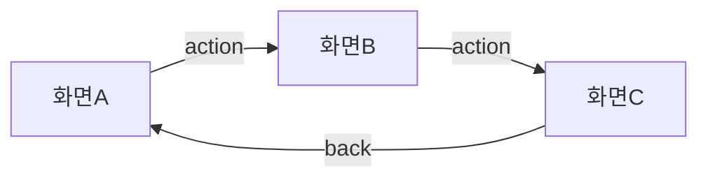

# /plan — Plan Mode UI 목업

Plan mode 제약 내에서 UI 목업을 시각화하여 구현 전 합의를 가능하게 한다.

## Plan Mode 제약 인식

Plan mode에서 허용/금지되는 작업:

| 허용 | 금지 |
|------|------|
| Read, Grep, Glob | Write (계획 파일 1개 예외) |
| 터미널 텍스트 출력 | Edit (코드 파일) |
| 계획 파일 Write/Edit | Bash 실행 |

이 제약에 따라 3-Tier 출력 전략을 사용한다.

## 실행 흐름

```
/plan [name] [options] 수신
  │
  ├─ 1. 요청 분석
  │   ├─ 화면명, 설명 추출
  │   ├─ 옵션 파싱 (--screens, --layout, --flow, --prd, --backend)
  │   └─ selection_rules.yaml 읽어서 recommended_backend 결정
  │
  ├─ 2. Tier 1: ASCII 와이어프레임 출력
  │   ├─ references/ascii-components.md 참조
  │   ├─ 레이아웃별 컴포넌트 조합
  │   └─ 터미널에 직접 출력 (max 65자 폭)
  │
  ├─ 3. Tier 2: mockup-spec 생성
  │   ├─ YAML 구조 생성 (아래 형식)
  │   └─ 계획 파일의 ## UI Mockup Specifications 섹션에 삽입
  │
  └─ 4. Tier 3: Mermaid 흐름도 (--flow 또는 --screens >= 2)
      ├─ 화면 간 네비게이션 다이어그램
      └─ 계획 파일에 Mermaid 코드 블록 삽입
```

## Step 1: 요청 분석

### 옵션 파싱

| 옵션 | 기본값 | 설명 |
|------|--------|------|
| `--screens=N` | 1 | 화면 수 (1-5) |
| `--layout=TYPE` | auto | 1-column, sidebar, 2-column, tabs |
| `--flow` | false | Mermaid 흐름도 포함 |
| `--prd=PRD-NNNN` | null | PRD 연결 |
| `--backend=TYPE` | auto | 추천 백엔드 강제 지정 |

### 추천 백엔드 결정

`C:\claude\.claude\skills\mockup-hybrid\config\selection_rules.yaml` 읽기:

1. `--backend` 명시 → 해당 값
2. 키워드 매칭:
   - `mermaid_triggers` 매칭 → `mermaid`
   - `stitch_triggers` 매칭 → `stitch`
   - `html_triggers` 매칭 → `html`
3. `--prd` 있음 → `stitch`
4. `--screens >= 3` → `html`
5. 기본값 → `html`

## Step 2: ASCII 와이어프레임 (Tier 1)

`references/ascii-components.md`의 컴포넌트를 조합하여 터미널에 출력.

### 레이아웃 선택

| layout | 구성 |
|--------|------|
| `1-column` | Header + 단일 콘텐츠 영역 |
| `sidebar` | Header + Sidebar + 콘텐츠 |
| `2-column` | Header + 좌우 분할 콘텐츠 |
| `tabs` | Header + 탭 네비게이션 + 콘텐츠 |
| `auto` | 요청 분석하여 자동 선택 |

### 출력 형식

```
📐 /plan: "화면명" — ASCII Wireframe
━━━━━━━━━━━━━━━━━━━━━━━━━━━━━━━━━━━━━━━━━━━━

[ASCII 와이어프레임]

━━━━━━━━━━━━━━━━━━━━━━━━━━━━━━━━━━━━━━━━━━━━
Interactions:
  (click) [Button] → target-screen
  (submit) Form → POST /api/endpoint
━━━━━━━━━━━━━━━━━━━━━━━━━━━━━━━━━━━━━━━━━━━━
recommended_backend: html | execution: /mockup "화면명"
```

### 다중 화면 (--screens >= 2)

각 화면을 순차 출력. 화면 사이에 구분선:

```
━━━ Screen 1/3: 화면A ━━━━━━━━━━━━━━━━━━━━━
[ASCII]

━━━ Screen 2/3: 화면B ━━━━━━━━━━━━━━━━━━━━━
[ASCII]

━━━ Screen 3/3: 화면C ━━━━━━━━━━━━━━━━━━━━━
[ASCII]
```

## Step 3: mockup-spec 생성 (Tier 2)

계획 파일에 삽입할 YAML 블록. 현재 활성 계획 파일 경로는 시스템 메시지에서 확인.

### 형식

````yaml
## UI Mockup Specifications

```mockup-spec
name: {kebab-case-screen-name}
description: {화면 설명}
recommended_backend: html|stitch|mermaid
layout: {layout-type}
viewport: {width}x{height}
components:
  - type: {component-type}
    content: "{설명}"
    # type별 추가 필드:
    # form: fields[], actions[]
    # table: columns[], rows
    # cards: count
    # sidebar: items[]
flow:
  - "{trigger} → {target}"
style_notes:
  - "B&W Refined Minimal"
execution_command: '/mockup "{화면명}" {options}'
```
````

### viewport 기본값

| 레이아웃 | viewport |
|----------|----------|
| 1-column, form | 900x600 |
| sidebar, 2-column | 1200x800 |
| mobile | 375x667 |
| tablet | 768x1024 |

### 계획 파일 삽입 규칙

1. 계획 파일에 `## UI Mockup Specifications` 섹션이 없으면 파일 끝에 추가
2. 이미 있으면 해당 섹션 아래에 새 spec 블록 추가
3. Edit 도구로 삽입 (계획 파일은 Write/Edit 허용)

## Step 4: Mermaid 흐름도 (Tier 3)

`--flow` 옵션이 있거나 `--screens >= 2`일 때 자동 생성.

### 형식

````markdown

````

### Mermaid 규칙 (Rule 11 준수)

- `\n` 리터럴 금지 → `<br/>` 사용
- 한 층 5개+ 노드 금지 → subgraph 분할
- `classDef`, `:::class` 금지 — 기본형만
- 노드 6개+ → 단계적 빌드업

## Post-Plan 연계: 자동 제안

ExitPlanMode 승인 후, 계획 파일에 `mockup-spec` 블록이 있으면:

1. 모든 `execution_command` 필드를 추출
2. 사용자에게 제안:

```
📐 계획 파일에 {N}개 UI 목업 스펙이 있습니다.
다음 목업을 생성할까요?

1. /mockup "화면A" --force-html
2. /mockup "화면B" --force-html
3. /mockup "화면C" --force-stitch
```

3. 사용자 승인 시 순차 실행
4. 미승인 시 일반 구현 진행

## PRD 연결 (`--prd`)

`--prd=PRD-NNNN` 지정 시:

1. `docs/00-prd/PRD-NNNN.prd.md` 파일 Read
2. PRD에서 화면 요구사항, 컴포넌트 목록 추출
3. 추출된 정보로 mockup-spec 자동 구성
4. `recommended_backend: stitch` (PRD 연결 = 문서 품질)

## 금지 사항

- Plan mode에서 HTML 파일 Write 금지
- Plan mode에서 Playwright/Bash 실행 금지
- ASCII 와이어프레임에 이모지 사용 금지 (박스 문자만)
- 65자 폭 초과 금지
- mockup-spec 없이 ASCII만 출력하고 종료 금지 (spec 필수)
