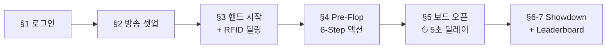
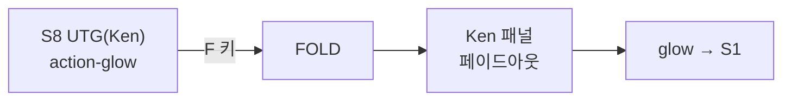
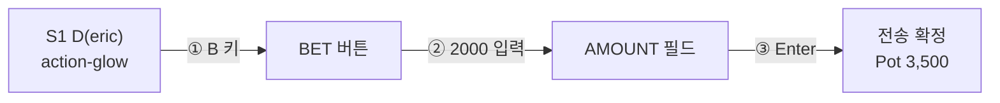
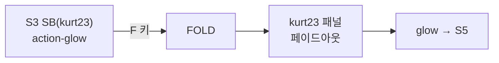
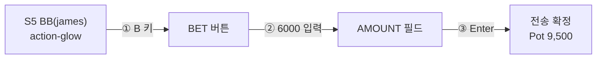
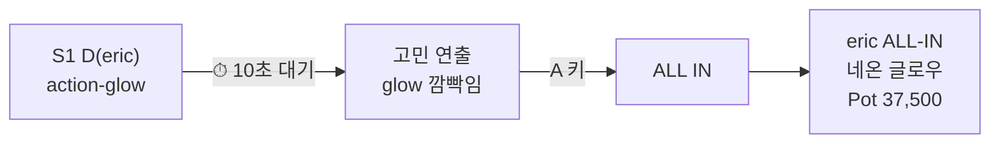
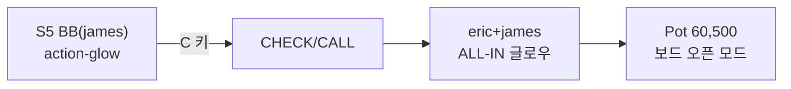

# EBS POC Scenario — 4인 홀덤 1핸드 완전 시나리오

## §0. 시나리오 개요

| 항목 | 값 |
|------|-----|
| 게임 | No-Limit Hold'em (+ Seven Card Stud / Razz 전환 시연) |
| 인원 | 4명 (S1 D, S3 SB, S5 BB, S8 UTG) |
| 블라인드 | **SB 500 / BB 1,000** |
| 칩 범위 | 20BB ~ 40BB (20,000 ~ 40,000) |
| 카드 | **RFID 무작위 분배** |
| 액션 | **포지션별 고정 대본** (D ALL-IN → BB CALL) |



### 플레이어 & 칩

| Seat | 이름 | 칩 | BB 배수 | Position |
|:----:|------|---:|:------:|:--------:|
| S1 | eric | 30,000 | 30BB | **D** |
| S3 | kurt23 | 25,000 | 25BB | SB |
| S5 | james | 40,000 | 40BB | BB |
| S8 | Ken | 20,000 | 20BB | UTG |

---

## §1. 로그인

> 

| Step | 운영자 행동 | 화면 변화 |
|:----:|-----------|----------|
| 1.1 | Email: `test@nsuslab.com`, Password 입력 | 입력 |
| 1.2 | **로그인** 클릭 | → **BROADCASTING SETUP** 진입 |

---

## §2. 방송 셋업

### 2.1 게임 종목 선택

> 

| Step | 클릭 위치 | 조작 | 결과 |
|:----:|----------|------|------|
| 2.1a | SELECT GAME TYPE → **NL HOLD'EM** | 버튼 클릭 | 보라색 활성, "EBS NL HOLD'EM" |
| 2.1b | SELECT CARD DECK → "my first deck" | 드롭다운 선택 | RFID 덱 매핑 |

### 2.2 플레이어 좌석 배치 + 칩 설정

> 

| Step | 클릭 위치 | 조작 | 결과 |
|:----:|----------|------|------|
| 2.2a | SELECT PLAYER → **eric** → 테이블 S1 | 배치 + `30,000` → ACCEPT | S1: eric 30,000 (D) |
| 2.2b | SELECT PLAYER → **kurt23** → S3 | 배치 + `25,000` → ACCEPT | S3: kurt23 25,000 (SB) |
| 2.2c | SELECT PLAYER → **james** → S5 | 배치 + `40,000` → ACCEPT | S5: james 40,000 (BB) |
| 2.2d | SELECT PLAYER → **Ken** → S8 | 배치 + `20,000` → ACCEPT | S8: Ken 20,000 (UTG) |

> 

### 2.3 블라인드 설정

| Step | 클릭 위치 | 조작 | 결과 |
|:----:|----------|------|------|
| 2.3a | BLIND SETTINGS → SMALL BLIND | 슬라이더 → **500** | SB = 500 |
| 2.3b | BIG BLIND | 슬라이더 → **1,000** | BB = 1,000 |

### 2.4 종목 전환 시연

> 

| Step | 클릭 위치 | 결과 |
|:----:|----------|------|
| 2.4a | **SEVEN CARD STUD** 버튼 | 블라인드 자동 변경, 좌석/덱 유지 |
| 2.4b | **NL HOLD'EM** 버튼 | SB 500 / BB 1,000 복원 |

### 2.5 START BROADCASTING

| Step | 클릭 위치 | 결과 |
|:----:|----------|------|
| 2.5a | **START BROADCASTING** | → 핸드 진행 모드 진입 (§3) |

---

## §3. 핸드 시작 + RFID 딜링

> §3 이후 이 문서는 **3화면을 동시에** 보여준다.

```
+------------------------------------------+
|                                    +-----+
|     ① PGM + Overlay (대)           | ②AT |
|     포커 테이블 + 오버레이 합성        |     |
|     ★ 폰 촬영                      +-----+
|                                    |③OP  |
|                                    |     |
+------------------------------------+-----+
```

| # | 화면 | 촬영 | 크기 |
|:-:|------|:----:|:----:|
| ① | **PGM + Overlay** — 피처 테이블 + 오버레이 그래픽 | 폰 촬영 | **대** |
| ② | **AT** — Action Tracker UI | 스크린 캡처 | 소 |
| ③ | **Operator** — 운영자 작업 장면 | 폰 촬영 | 소 |

운영자가 **START BROADCASTING** 클릭하면 AT에 **START HAND** 버튼이 활성화된다.

### 3.1 START HAND

> 
>
> *② AT: 초록색 START HAND 버튼. ① PGM: 오버레이 대기 (플레이어 미표시). ③ Operator: TBD.*

| Step | 운영자 조작 | 결과 |
|:----:|-----------|------|
| 3.1a | AT에서 **START HAND** 버튼 클릭 | 핸드 시작 → 아래 항목 자동 처리 |

| 자동 처리 | 결과 |
|----------|------|
| 포지션 배치 | D=eric, SB=kurt23, BB=james, UTG=Ken |
| 블라인드 수거 | kurt23 25,000→24,500 / james 40,000→39,000 |
| RFID 딜링 (4좌석 × 2장) | 홀카드 8장 자동 감지 (오버레이에는 아직 미공개) |
| PRE_FLOP 진입 | Pot: 1,500 / AT 액션 버튼 활성화 |

> **홀카드 공개 시점**: 각 플레이어의 액션이 완료된 후, **다음 턴 플레이어의 카드 및 정보가 오버레이에 공개**된다. RFID는 딜링 시점에 이미 감지 완료되어 있지만, 방송 오버레이 노출은 액션 순서에 따라 순차적으로 이루어진다.

---

## §4. Pre-Flop 액션 — 6-Step

> 각 Step별 AT 화면은 POC 시나리오 전용으로 신규 설계. Pre-Flop 상태(커뮤니티 카드 없음), 4인(S1/S3/S5/S8), 정확한 스택/팟 반영.

### Step 4.1: S8 UTG(Ken) — FOLD



| ① PGM+Overlay (대) | ② AT (소) | ③ Operator (소) |
|:------------------:|:---------:|:--------------:|
| TBD — 폰 촬영 | 아래 이미지 | TBD — 폰 촬영 |

> 

| 항목 | 내용 |
|------|------|
| 조작 | `F` 키 또는 **FOLD** 클릭 |
| 서버 | SendPlayerFold(S8) |
| ① PGM | TBD — Ken 패널 페이드아웃 |
| Pot | 1,500 (변동 없음) |

---

### Step 4.2: S1 D(eric) — BET 2,000



| ① PGM+Overlay (대) | ② AT (소) | ③ Operator (소) |
|:------------------:|:---------:|:--------------:|
| TBD — 폰 촬영 | 아래 3단계 이미지 | TBD — 폰 촬영 |

**① BET 버튼 클릭:**

> 

**② AMOUNT 필드에 2000 입력:**

> 

**③ Enter → 전송 확정**

| 항목 | 내용 |
|------|------|
| 서버 | SendPlayerBet(S1, 2000), stack 30k → 28,000 |
| ① PGM | TBD — "BET 2,000" 뱃지 |
| Pot | → 3,500 |

---

### Step 4.3: S3 SB(kurt23) — FOLD



| ① PGM+Overlay (대) | ② AT (소) | ③ Operator (소) |
|:------------------:|:---------:|:--------------:|
| TBD — 폰 촬영 | 아래 이미지 | TBD — 폰 촬영 |

> 

| 항목 | 내용 |
|------|------|
| 조작 | `F` 키 |
| 서버 | SendPlayerFold(S3) |
| ① PGM | TBD — kurt23 패널 페이드아웃 |
| Pot | 3,500 (변동 없음) |

---

### Step 4.4: S5 BB(james) — RAISE 6,000



| ① PGM+Overlay (대) | ② AT (소) | ③ Operator (소) |
|:------------------:|:---------:|:--------------:|
| TBD — 폰 촬영 | 아래 3단계 이미지 | TBD — 폰 촬영 |

**① BET 버튼 클릭:**

> 

**② AMOUNT 필드에 6000 입력:**

> 

**③ Enter → 전송 확정**

| 항목 | 내용 |
|------|------|
| 서버 | SendPlayerBet(S5, 6000), stack 39k → 34,000 |
| ① PGM | TBD — "RAISE 6,000" 뱃지 |
| Pot | → 9,500 |

---

### Step 4.5: S1 D(eric) — ⏱ 10초 → ALL-IN



| ① PGM+Overlay (대) | ② AT (소) | ③ Operator (소) |
|:------------------:|:---------:|:--------------:|
| TBD — eric glow 10초 | 아래 이미지 | TBD — 폰 촬영 |

> 

| 항목 | 내용 |
|------|------|
| 조작 | ⏱ 10초 대기 → `A` 키 또는 **ALL IN** 클릭 |
| 서버 | SendPlayerAllIn(S1), stack 28k → 0 (total 30,000) |
| ① PGM | TBD — **eric ALL-IN 네온 글로우** |
| Pot | → 37,500 |

---

### Step 4.6: S5 BB(james) — CALL



| ① PGM+Overlay (대) | ② AT (소) | ③ Operator (소) |
|:------------------:|:---------:|:--------------:|
| TBD — 폰 촬영 | 아래 이미지 | TBD — 폰 촬영 |

> 

| 항목 | 내용 |
|------|------|
| 조작 | `C` 키 또는 **CHECK/CALL** 클릭 |
| 서버 | SendPlayerBet(S5, 24000), stack 34k → 10,000 (total 30k matched) |
| ① PGM | TBD — **eric+james ALL-IN 글로우**, Pot **60,500** |
| 상태 | **2인 ALL-IN 확정** → 보드 자동 오픈 모드 |

### 스택 & 팟 검증

| Player | Position | 시작 | 총 투입 | 잔여 | 상태 |
|--------|:--------:|-----:|-------:|-----:|:----:|
| Ken | UTG | 20,000 | 0 | 20,000 | FOLD |
| eric | D | 30,000 | **30,000** | 0 | ALL-IN |
| kurt23 | SB | 25,000 | 500 | 24,500 | FOLD |
| james | BB | 40,000 | **30,000** | 10,000 | CALL |

**Main Pot = 500 + 30,000 + 30,000 = 60,500**

---

## §5. Flop / Turn / River — ⏱ 10초 딜레이

운영자 액션 없음. RFID 카드를 올리는 물리적 타이밍으로 **10초 간격** 제어.

### Step 5.1 — FLOP

> 

| 항목 | 내용 |
|------|------|
| RFID | 보드 카드 3장 감지 |
| ① 오버레이 | 보드 3장 표시 + **Equity 바 활성** (eric vs james %) |
| ② AT | 커뮤니티 카드 3슬롯 채움 |

### ⏱ 10초 딜레이

### Step 5.2 — TURN

> 

| 항목 | 내용 |
|------|------|
| RFID | 보드 4번째 카드 감지 |
| ① 오버레이 | 4번째 카드 추가 + Equity % 갱신 |

### ⏱ 10초 딜레이

### Step 5.3 — RIVER

> 

| 항목 | 내용 |
|------|------|
| RFID | 보드 5번째 카드 감지 |
| ① 오버레이 | 5번째 카드 추가 + **Score Strip** 표시 |

---

## §6. Showdown

> 

| Step | 이벤트 | ① 오버레이 |
|:----:|--------|----------|
| 6.1 | 카드 공개 | ALL-IN → 홀카드 이미 공개 상태 |
| 6.2 | 승자 결정 (hand_eval) | **위너 골든 보더** + 핸드명 |
| 6.3 | 팟 분배 (Main Pot 60,500) | 스택 갱신 |

---

## §7. Complete & Leaderboard

### 7.1 END HAND

> 
>
> *② AT: 빨간색 END HAND 버튼. ① PGM: WINNER +60,500 골든 보더 + 보드 5장. ③ Operator: TBD.*

| Step | 운영자 조작 | 결과 |
|:----:|-----------|------|
| 7.1a | AT에서 **END HAND** 버튼 클릭 | 핸드 종료 → 팟 분배 확정 → Leaderboard 표시 |

> **END HAND** 버튼을 눌러야 핸드가 공식 종료되고 리더보드가 호출된다. 자동 종료가 아닌 **운영자 수동 트리거**.
>
> **참고 (역설계 분석)**: 기존 PokerGFX에서 핸드 종료는 SHOW/MUCK 후 3초 자동 전이. END HAND 독립 버튼은 **POC 전용 설계** — 운영자가 Showdown 결과를 충분히 보여준 후 수동으로 종료하여 방송 연출 타이밍을 제어한다. 프로덕션에서는 자동 전이로 복원 가능.

### 7.2 Leaderboard

> 

| Step | 이벤트 | ① 오버레이 | ② AT |
|:----:|--------|----------|------|
| 7.2a | END HAND → HAND_COMPLETE | Stats 아카이브 송출 + 팟 분배 확정 | 액션 버튼 비활성화 |
| 7.2b | Leaderboard 표시 | **Centre 리더보드** 자동 표시 | — |
| 7.2c | 다음 핸드 대기 | Leaderboard 유지 | **START HAND** 버튼 재활성화 (초록색) |

> 
>
> *① PGM: Leaderboard 유지. ② AT: 초록색 START HAND 버튼 재활성화. 클릭 시 Leaderboard 사라지고 §3.1로 복귀.*

**eric(D) 승리 시:**

| # | Player | Chips |
|:-:|--------|------:|
| 1 | eric | 60,500 |
| 2 | kurt23 | 24,500 |
| 3 | Ken | 20,000 |
| 4 | james | 10,000 |

**james(BB) 승리 시:**

| # | Player | Chips |
|:-:|--------|------:|
| 1 | james | 70,500 |
| 2 | kurt23 | 24,500 |
| 3 | Ken | 20,000 |
| 4 | eric | 0 |

---

## §8. POC 검증 체크리스트

| # | 검증 항목 | 시연 위치 | ✓ |
|:-:|----------|:--------:|:-:|
| 1 | Console 로그인 | §1 | ☐ |
| 2 | NL HOLD'EM 선택 + 덱 선택 | §2.1 | ☐ |
| 3 | 4명 좌석 배치 + 칩 수동 입력 (20~40BB) | §2.2 | ☐ |
| 4 | 블라인드 SB 500 / BB 1,000 | §2.3 | ☐ |
| 5 | 종목 전환 (Seven Card Stud ↔ NL Hold'em) | §2.4 | ☐ |
| 6 | START BROADCASTING → 핸드 진행 모드 | §2.5 | ☐ |
| 7 | AT **START HAND** 버튼 → 핸드 시작 | §3.1 | ☐ |
| 8 | RFID 홀카드 8장 자동 감지 | §3 | ☐ |
| 9 | 블라인드 자동 수거 (SB 500 / BB 1,000) | §3 | ☐ |
| 10 | FOLD `F` — Ken(UTG), kurt23(SB) | §4.1, 4.3 | ☐ |
| 11 | BET `B` + AMOUNT 수동 입력 + 키패드 — eric 2,000 | §4.2 | ☐ |
| 12 | RAISE-TO `B` + AMOUNT 수동 입력 + 키패드 — james 6,000 | §4.4 | ☐ |
| 13 | ⏱ 10초 딜레이 + ALL-IN `A` — eric | §4.5 | ☐ |
| 14 | CALL `C` — james | §4.6 | ☐ |
| 15 | 오버레이: 액션 플레이어만 순차 등장 + 잔류 유지 + FOLD 퇴장 | §4 전체 | ☐ |
| 16 | 오버레이: 카드 오픈 (액션 플레이어 등장 시 홀카드 공개) | §4 전체 | ☐ |
| 17 | FLOP 3장 + Equity 바 활성 | §5.1 | ☐ |
| 18 | ⏱ 10초 → TURN + Equity 갱신 | §5.2 | ☐ |
| 19 | ⏱ 10초 → RIVER + Score Strip | §5.3 | ☐ |
| 20 | 자동 승자 결정 + 골든 보더 + 칩 수 표시 | §6 | ☐ |
| 21 | AT **END HAND** 버튼 → 핸드 종료 | §7.1 | ☐ |
| 22 | Leaderboard 표시 (중앙 대형 보드) | §7.2 | ☐ |
| 23 | AT **START HAND** 재활성화 (다음 핸드 대기) | §7.2c | ☐ |

## Changelog

| 날짜 | 버전 | 변경 내용 | 변경 유형 | 결정 근거 |
|------|------|-----------|----------|----------|
| 2026-03-31 | v2.0 | 전면 재설계: D ALL-IN→BB CALL, 3화면 구조, AT 버튼 annotation | PRODUCT | POC 시연 정밀도 |
| 2026-03-30 | v1.0 | 최초 작성 | - | - |
