# Flop Games 계열 — 12종 게임 규칙 가이드

> **Version**: 1.0.0
> **Date**: 2026-03-30
> **대상 독자**: 포커를 모르는 사람 누구나
> **시스템 사양**: → [Foundation PRD §6-8](../PRD-EBS_Foundation.md) 참조
> **시각 가이드**: → [카드 레이아웃 보기](visual/flop-games-visual.html) (브라우저에서 열기)
> **핵심 특징 비주얼**: → [게임별 핵심 차이점 보기](visual/core-concepts-flop.html) (브라우저에서 열기)

---

## 목차 — 8개 섹션이 12종 게임을 커버합니다

| 섹션 | 게임 | 커버 종목 |
|:----:|------|:--------:|
| [§0](#step-0-먼저-알아야-할-것들) | **기초** — 카드 덱, 비공개/공유 카드, 핸드 랭킹 | -- |
| [§1](#1-texas-holdem) | **Texas Hold'em** | #1 (1종) |
| [§2](#2-short-deck--straight--trips-6-holdem) | **Short Deck** — Straight > Trips (6+ Hold'em) | #2 (1종) |
| [§3](#3-short-deck--trips--straight-triton-규칙) | **Short Deck** — Trips > Straight (Triton) | #3 (1종) |
| [§4](#4-pineapple) | **Pineapple** | #4 (1종) |
| [§5](#5-omaha-4-card) | **Omaha** (4-card) | #5 (1종) |
| [§6](#6-omaha-hi-lo) | **Omaha Hi-Lo** — Hi-Lo 분할 규칙 설명 | #6 (1종) |
| [§7](#7-five-card--six-card-omaha--hi-lo) | **Five Card / Six Card Omaha** (+ 각각 Hi-Lo) | #7~#10 (**4종**) |
| [§8](#8-courchevel--hi-lo) | **Courchevel** (+ Hi-Lo) | #11~#12 (**2종**) |

> §7은 4종(Five Card Omaha, Five Card Omaha Hi-Lo (Big O), Six Card Omaha, Six Card Omaha Hi-Lo)을 묶어서 설명합니다.
> §8은 2종(Courchevel, Courchevel Hi-Lo)을 묶어서 설명합니다.
> Hi-Lo 규칙 자체는 §6에서 상세히 설명하며, §7/§8에서는 "Hi-Lo 버전도 있습니다 (§6 참조)"로 안내합니다.

---

## 포커 3대 계열 — 한눈에 비교

| 특성 | Flop Games | Draw | Seven Card Games |
|------|:-:|:-:|:-:|
| **공유 카드** | ✅ 보드 5장 | ❌ 없음 | ❌ 없음 |
| **카드 교환** | ❌ 없음 | ✅ 1~3회 | ❌ 없음 |
| **카드 공개** | 보드만 공개 | 전부 비공개 | 일부 공개 |
| **정보의 원천** | 공유 보드 | 교환 패턴 추리 | 상대 공개 카드 |
| **대표 게임** | Texas Hold'em | 2-7 Triple Draw | 7-Card Stud |
| **게임 수** | 12종 | 7종 | 3종 |

## 한눈에 보기 — Flop Games 12종

| # | 게임 | 핵심 차이 | 홀카드 | 덱 | 승리 | 팟 분할 | 섹션 |
|:-:|------|----------|:------:|:--:|:----:|:------:|:----:|
| 1 | **Texas Hold'em** | 🏠 기준 게임 | 2장 | 52 | High | -- | [§1](#1-texas-holdem) |
| 2 | Short Deck (6+) | 🃏 36장 덱 | 2장 | **36** | High* | -- | [§2](#2-short-deck--straight--trips-6-holdem) |
| 3 | Short Deck (Triton) | 🔄 Trips>Straight | 2장 | **36** | High* | -- | [§3](#3-short-deck--trips--straight-triton-규칙) |
| 4 | Pineapple | ✋ 3장→1장 버림 | 3→2장 | 52 | High | -- | [§4](#4-pineapple) |
| 5 | **Omaha** | 🔒 홀2+보드3 강제 | **4장** | 52 | High | -- | [§5](#5-omaha-4-card) |
| 6 | Omaha Hi-Lo | ⚖️ Hi-Lo 분할 | 4장 | 52 | High+Low | **50/50** | [§6](#6-omaha-hi-lo) |
| 7 | Five Card Omaha | 📈 홀카드 5장 | **5장** | 52 | High | -- | [§7](#7-five-card--six-card-omaha--hi-lo) |
| 8 | Five Card Omaha Hi-Lo (Big O) | 📈+⚖️ 5장+Hi-Lo | **5장** | 52 | High+Low | **50/50** | [§7](#7-five-card--six-card-omaha--hi-lo) |
| 9 | Six Card Omaha | 📈 홀카드 6장 | **6장** | 52 | High | -- | [§7](#7-five-card--six-card-omaha--hi-lo) |
| 10 | Six Card Omaha Hi-Lo | 📈+⚖️ 6장+Hi-Lo | **6장** | 52 | High+Low | **50/50** | [§7](#7-five-card--six-card-omaha--hi-lo) |
| 11 | Courchevel | 👁️ 보드 1장 선공개 | 5장 | 52 | High | -- | [§8](#8-courchevel--hi-lo) |
| 12 | Courchevel Hi-Lo | 👁️+⚖️ 선공개+Hi-Lo | 5장 | 52 | High+Low | **50/50** | [§8](#8-courchevel--hi-lo) |

> *Short Deck는 핸드 순위가 변경됩니다 (상세는 각 게임 섹션 참조)
> Hi-Lo 변형(#8, #10, #12)은 기본 게임과 동일하되 팟 50/50 분할이 추가됩니다 → [§6](#6-omaha-hi-lo) 참조

---

## Step 0. 먼저 알아야 할 것들

이 문서는 포커를 **전혀 모르는 분**을 위해 처음부터 차근차근 설명합니다. 한 단계씩 따라오세요.

### 0-1. 카드 덱 — 52장 전체

포커는 일반 트럼프 카드 **52장**을 사용합니다. 4가지 무늬(♠♥♦♣) × 13가지 숫자(2~A) = 52장. 전부 펼쳐보겠습니다:


> 숫자는 2가 가장 약하고, **A(에이스)**가 가장 강합니다.

---

### 0-2. "나만 보는 카드"가 있습니다

포커에서는 일부 카드를 **뒤집어서** 받습니다. 나만 볼 수 있고, 상대는 볼 수 없습니다.


> 방송에서는 **RFID 센서**가 카드를 인식하여 **시청자에게만** 보여줍니다.

---

### 0-3. "모두가 공유하는 카드"도 있습니다

테이블 가운데에 **모든 플레이어가 함께 사용하는** 카드가 놓입니다. 이것이 **Community Card**(공유 카드)입니다.


---

### 0-4a. 7장이 펼쳐집니다

내 비공개 카드 **2장**과 공유 카드 **5장**, 합해서 **총 7장**이 놓입니다.


---

### 0-4b. 이 중에서 가장 좋은 5장을 고릅니다

7장이 있지만 승부에 사용하는 건 **정확히 5장**입니다. 여러 조합 중 **가장 강한 5장**을 찾아야 합니다.


> **조합 A**(A 페어 + K 페어 = Two Pair)가 **조합 B**(A 페어만 = One Pair)보다 강하므로 **조합 A를 선택**합니다. 이 계산은 시스템이 자동으로 해줍니다.

---

### 0-4c. 이것이 Flop Games입니다!

> **비공개 카드** + **공유 카드** → **7장 중 최고 5장** 선택 → 승부. 전체 흐름:

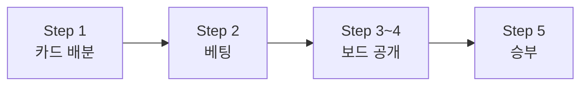

이 계열에는 총 **12종**의 게임이 있고, 가장 유명한 것이 **Texas Hold'em**입니다.

---

## 1. Texas Hold'em
<!-- 게임 #1 -->

> **🏠 기준 게임** | 비공개 2장 + 공유 5장 → 최고 5장으로 승부
>
> 이 계열의 모든 게임은 Texas Hold'em을 기준으로 설명합니다.
> "포커"라 하면 대부분 이 게임입니다.


세계에서 가장 많이 플레이되는 포커 게임입니다. "포커"라 하면 대부분 이 게임을 말합니다.

> **비공개 2장** + **공유 5장** = **최고 5장**으로 승부

---

### Step 1. 카드를 받습니다

> 지금 여기입니다:

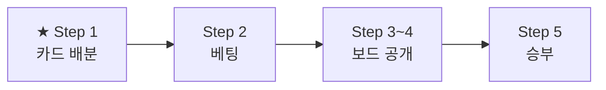

딜러가 각 플레이어에게 **뒤집어진 카드 2장**을 나눠줍니다. 이 카드는 **자신만** 볼 수 있습니다. 포커 용어로 **홀카드**(Hole Cards)라고 부릅니다.

> **Player A**: [??][??] / **Player B**: [??][??] / **Player C**: [??][??]


---

### Step 3. 베팅 — "나는 이 패에 얼마를 걸 것인가?"

> 지금 여기입니다:

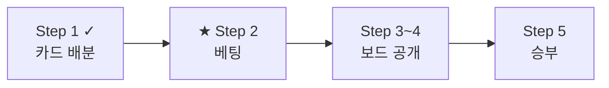

카드를 받으면 첫 번째 베팅이 시작됩니다. 그 전에 — 매 판 시작 시 2명이 의무적으로 소액을 걸어야 합니다. 이것을 **블라인드**(Blind)라고 합니다. 블라인드가 있어야 판에 상금이 생깁니다.

이제 베팅 차례입니다. 매번 선택지는 딱 **3가지**입니다.

| 선택 | 의미 | 예시 |
|------|------|------|
| **Call** (따라 걸기) | 상대와 같은 금액을 건다 | 상대가 100 → 나도 100 |
| **Raise** (더 걸기) | 상대보다 더 많이 건다 | 상대가 100 → 나는 300 |
| **Fold** (포기) | 이번 판을 포기한다 | 건 돈을 잃지만 더 잃지 않음 |

> 예시: 상대가 100을 걸었습니다.
> - 내 패가 괜찮다 → **Call** (100을 맞춘다)
> - 내 패가 아주 좋다 → **Raise** (300으로 올린다)
> - 내 패가 별로다 → **Fold** (포기한다)

이 3가지 선택은 게임 내내 반복됩니다. **새 카드가 공개될 때마다** 다시 선택합니다.

> 베팅 구조 상세(No Limit, Pot Limit 등)는 → [베팅 시스템 상세 가이드](PRD-GAME-04-betting-system.md) 참조

---

### Step 4. 게임이 진행됩니다 (한 단계씩)

#### 4-1. Flop — 테이블에 카드 3장이 깔립니다

> 지금 여기입니다:

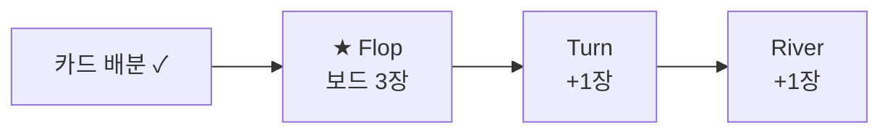

카드 2장을 받은 상태에서, 테이블 가운데에 **3장이 한꺼번에** 공개됩니다.


이 3장은 **모든 플레이어가 공유**합니다. 나만의 2장 + 공유 3장 = 5장 조합이 가능합니다.

#### 4-2. Turn — 4번째 카드

> 지금 여기입니다:

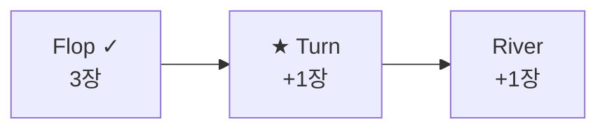

Flop 이후, **4번째 카드가 추가**됩니다.


이제 총 6장(내 2장 + 보드 4장)이 있습니다. 여기서 최고 5장을 고릅니다.

#### 4-3. River — 마지막 카드

> 지금 여기입니다:

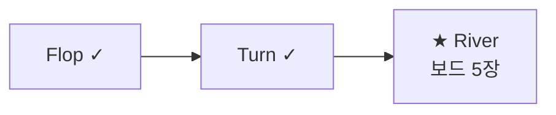

마지막 **5번째 카드**가 깔립니다.


**총 7장** 중 가장 좋은 5장 조합으로 승부합니다. 마지막 베팅 후 남은 플레이어끼리 카드를 공개합니다.

---

### Step 5. 누가 이기는가?

> 지금 여기입니다:


7장 중 **가장 좋은 5장 조합**을 만들어 순위를 비교합니다. 순위가 높은 쪽이 이깁니다. 핸드 랭킹을 **3그룹**으로 나눠서 쉽게 배워봅시다.

#### 5-1. 기본 3개 — 가장 흔한 패

> 10판 중 7판은 이 3가지 중 하나로 결정됩니다. **같은 숫자가 많을수록 강합니다.**

| 순위 | 이름 | 예시 | 한 줄 설명 |
|:----:|------|------|-----------|
| 10 | High Card | [A♠][K♥][9♦][7♣][2♠] | 아무 조합도 없음 — 가장 높은 카드로 비교 |
| 9 | One Pair | [J♠][J♥][A♦][8♣][3♠] | 같은 숫자 2장 |
| 8 | Two Pair | [A♠][A♥][K♦][K♣][7♠] | 2장 세트가 2개 |


#### 5-2. 중간 4개 — 연속이거나 같은 무늬면 더 강합니다

> 52장에서 이런 패가 나올 확률이 낮습니다. 희귀할수록 강합니다.

| 순위 | 이름 | 예시 | 한 줄 설명 |
|:----:|------|------|-----------|
| 7 | Three of a Kind | [Q♠][Q♥][Q♦][7♣][2♠] | 같은 숫자 3장 |
| 6 | Straight | [10♠][9♥][8♦][7♣][6♠] | 연속된 5장 (무늬 상관없음) |
| 5 | Flush | [A♥][J♥][8♥][4♥][2♥] | 같은 무늬 5장 (연속 아니어도 됨) |
| 4 | Full House | [A♠][A♥][A♦][K♠][K♥] | 3장 + 2장 세트 |


#### 5-3. 희귀 3개 — 전설의 패

> 프로 선수도 평생 몇 번 보기 어렵습니다.

| 순위 | 이름 | 예시 | 한 줄 설명 |
|:----:|------|------|-----------|
| 3 | Four of a Kind | [K♠][K♥][K♦][K♣][A♠] | 같은 숫자 4장 |
| 2 | Straight Flush | [9♥][8♥][7♥][6♥][5♥] | 같은 무늬로 연속된 5장 |
| 1 | Royal Flush | [A♠][K♠][Q♠][J♠][10♠] | 같은 무늬 A부터 10까지 — 최강의 패! |


#### 5-2. 실전 예시 — 따라가 보기

> 플레이어 A와 B가 끝까지 남았습니다. 승부를 따라가 봅시다.

**1) 홀카드 확인**
- Player A: [A♠][K♥]
- Player B: [Q♦][Q♣]

**2) 보드 (5장 전부 공개 완료)**
- [A♦][7♣][2♠][K♦][10♣]

**3) 각자 최고의 5장 조합**
- **Player A**: [A♠][A♦][K♥][K♦][10♣] → **Two Pair** (에이스 페어 + 킹 페어)
- **Player B**: [Q♦][Q♣][A♦][K♦][10♣] → **One Pair** (퀸 페어)

**4) 비교**
- Two Pair(8위) vs One Pair(9위) → 순위가 높은 Two Pair 승리

> **Player A 승리!** 테이블에 쌓인 베팅 금액 전부를 가져갑니다.


---

## 2. Short Deck — Straight > Trips (6+ Hold'em)
<!-- 게임 #2 -->

> **핵심 특징** | 🃏 52장 → **36장 덱** (2-5 제거) + 핸드 순위 변경
>
> | 구분 | Hold'em (52장) | → Short Deck (36장) |
> |------|:-:|:-:|
> | 덱 크기 | 52장 (2~A) | **36장** (6~A, 2-5 제거) |
> | Flush vs Full House | Full House 우위 | **Flush 우위** (더 희귀) |
> | Straight vs Trips | -- | **Straight > Trips** |


Hold'em과 같지만, 2-3-4-5를 뺀 **36장 덱**으로 플레이합니다.

> "Hold'em을 이해했다면, Short Deck는 딱 2가지만 기억하면 됩니다."

### 달라지는 점 1: 36장 덱

- 일반 포커: 52장 (2부터 A까지 모든 숫자)
- Short Deck: 2, 3, 4, 5를 모두 **제거** → **36장** (6부터 A까지)
- 카드가 적으니 좋은 패가 더 자주 나옵니다 — 액션이 화끈해요
- 가장 낮은 Straight: A-6-7-8-9 (2-3-4-5가 없으니까 A가 6 아래로 붙습니다)

### 달라지는 점 2: 핸드 순위가 바뀝니다

카드가 36장뿐이라 **같은 무늬 카드가 적습니다**. Flush 만들기가 더 어렵죠. 포커에서는 "희귀할수록 강한 패"이므로 순위가 바뀝니다.

| 순위 | Hold'em (52장) | Short Deck — 이 규칙 (36장) |
|:----:|---------------|----------------------------|
| 1 | Royal Flush | Royal Flush |
| 2 | Straight Flush | Straight Flush |
| 3 | Four of a Kind | Four of a Kind |
| 4 | Full House | **Flush** ↑ (더 희귀하니까 승격!) |
| 5 | Flush | **Full House** ↓ |
| 6 | Straight | **Straight** ↑ (이 규칙에서 Trips보다 강함) |
| 7 | Three of a Kind | **Three of a Kind** ↓ |
| 8 | Two Pair | Two Pair |
| 9 | One Pair | One Pair |
| 10 | High Card | High Card |

> **정리**: Flush ↔ Full House 순위 교환, Straight ↔ Three of a Kind 순위 교환


### 승부 예시

- Player A: [A♠][A♥][A♦][K♠][K♥] → **Full House**
- Player B: [A♥][J♥][8♥][6♥][9♥] → **Flush**
- Hold'em에서는 **A 승리** (Full House > Flush)
- Short Deck에서는 **B 승리!** (Flush > Full House — 순위 역전!)

> 진행 순서(Preflop → Flop → Turn → River → Showdown), 베팅 방식은 Hold'em과 동일합니다. → §1 참조

---

## 3. Short Deck — Trips > Straight (Triton 규칙)
<!-- 게임 #3 -->

> **핵심 특징** | 🔄 §2와 동일하되, **Trips > Straight** (순위만 역전)
>
> | 순위 | §2 (6+ Hold'em) | → §3 (Triton) |
> |:----:|:-:|:-:|
> | 6위 | Straight | **Three of a Kind** ↑ |
> | 7위 | Three of a Kind | **Straight** ↓ |


§2와 동일한 36장 Short Deck이지만, Three of a Kind와 Straight 순위만 교환됩니다.

> "§2와 완전히 같은 게임입니다. 딱 하나 — Trips와 Straight의 강도가 뒤바뀝니다."
> 카지노마다 이 규칙이 다릅니다. **Triton Poker** 시리즈에서 이 규칙을 사용합니다.

### §2 vs §3 — 다른 점은 이것뿐

| 순위 | §2 (Straight > Trips) | §3 Triton (Trips > Straight) |
|:----:|----------------------|------------------------------|
| 6 | **Straight** | **Three of a Kind** ↑ |
| 7 | **Three of a Kind** | **Straight** ↓ |

나머지 순위(Flush > Full House 등)와 36장 덱, 진행 방식은 §2와 **완전히 동일**합니다.

> 어떤 규칙을 쓸지는 테이블 설정에서 선택합니다. EBS 시스템은 두 변형 모두 지원합니다.

---

## 4. Pineapple
<!-- 게임 #4 -->

> **핵심 특징** | ✋ 카드 **3장** 받고 Flop 전 **1장 버림** → 2장으로 진행
>
> | 구분 | Hold'em | → Pineapple |
> |------|:-:|:-:|
> | 초기 카드 | 2장 | **3장** |
> | 버리기 | 없음 | Flop 전 **1장 버림** |
> | 이후 진행 | 2장 유지 | 2장 유지 (동일) |


Hold'em과 같지만, 카드를 **3장** 받고 Flop 전에 **1장을 버립니다**.

> "Hold'em에서 달라지는 점은 딱 1가지입니다."

### 달라지는 점: 3장 받고 1장 버림

- Hold'em: 2장 받고 → 바로 베팅
- Pineapple: **3장** 받고 → Flop **전에** 1장을 골라 버림 → 2장으로 플레이


### 실전 예시 — 따라가 보기

**1)** 카드 3장을 받았습니다: [A♠] [K♥] [7♣]

**2)** 어떤 카드를 버릴까? A와 K는 최고급 카드, 7은 약합니다.

**3)** [7♣] 버림!

**4)** 이제 [A♠] [K♥] 2장으로 Hold'em과 동일하게 진행합니다.


> "3장 중 1장을 버리는 **선택**이 추가됩니다. 이 판단이 실력 차이를 만듭니다."

나머지 진행(Flop → Turn → River → Showdown)과 베팅, 핸드 순위는 Hold'em과 동일합니다. → §1 참조

---

## 5. Omaha (4-card)
<!-- 게임 #5 -->

> **핵심 특징** | 🔒 홀카드 **4장** + 반드시 **홀카드 2장 + 보드 3장** 사용
>
> | 구분 | Hold'em | → Omaha |
> |------|:-:|:-:|
> | 홀카드 | 2장 | **4장** |
> | 5장 선택 | 7장 중 자유 선택 | **홀카드 2장 + 보드 3장 강제** |
> | 조합 다양성 | 보통 | **매우 높음** |


Hold'em을 이해했다면, Omaha는 금방 배울 수 있습니다. 진행 순서(Flop → Turn → River)와 베팅 방식은 **완전히 동일**하고, 딱 **2가지만** 다릅니다.

### 달라지는 점 1: 카드를 4장 받습니다

Hold'em에서는 비공개 카드(홀카드)를 2장 받았죠? Omaha에서는 **4장**을 받습니다.

> Hold'em: [??] [??] — Omaha: [??] [??] [??] [??]

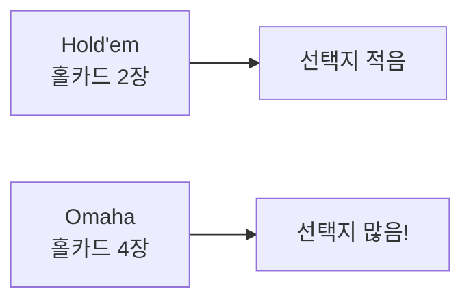

카드가 2장 더 늘어나니까 만들 수 있는 조합이 훨씬 다양해집니다.

### 달라지는 점 2: 반드시 홀카드 2장 + 보드 3장

이것이 Omaha에서 **가장 중요한 규칙**입니다. 경험 많은 플레이어도 자주 헷갈립니다.

- **Hold'em**: 홀카드 2장 + 보드 5장 = 7장 중 자유롭게 최고 5장 선택
- **Omaha**: 반드시 **홀카드에서 정확히 2장** + **보드에서 정확히 3장** = 5장

#### ✅ / ❌ 예시로 이해하기

**상황**: 홀카드 [A♥] [K♠] [Q♥] [J♥], 보드 [10♥] [9♥] [8♥] [2♣] [3♦]

❌ **틀린 판단**: "내 홀카드에 ♥가 3장, 보드에도 ♥가 3장이니까 Flush!"
→ 홀카드에서 **3장**을 쓰고 보드에서 2장 = Omaha에서는 **불가능**

✅ **올바른 판단**: 홀카드에서 2장(A♥, Q♥) + 보드에서 3장(10♥, 9♥, 8♥) = **Flush 성립!**
→ 홀카드 정확히 2장 + 보드 정확히 3장 = 규칙 충족

#### 보드에 ♥ 4장인데 Flush가 아닌 경우

**상황**: 홀카드 [A♥] [K♣] [Q♣] [J♣], 보드 [10♥] [7♥] [4♥] [2♥] [6♣]

- 보드에 ♥가 4장이나 깔려 있지만...
- 내 홀카드에 ♥는 A♥ **하나뿐**
- 반드시 홀카드 **2장**을 써야 하므로, ♥ 1장 + 다른 무늬 1장 = **Flush 불가!**
- Hold'em이었다면 Flush였을 상황이, Omaha에서는 아닙니다


### Omaha가 인기 있는 이유

4장을 받으니 조합이 훨씬 많아서 **더 큰 패가 자주** 나옵니다. Hold'em보다 액션이 화려하죠. **PLO**(Pot Limit Omaha)는 Hold'em 다음으로 세계에서 가장 인기 있는 포커 게임입니다.

> 베팅 방식, 진행 순서(Preflop → Flop → Turn → River → Showdown)는 Hold'em과 동일합니다. → §1 참조

---

## 6. Omaha Hi-Lo
<!-- 게임 #6 -->

> **핵심 특징** | ⚖️ Omaha + 팟을 **High 50% / Low 50%** 분할
>
> | 구분 | Omaha | → Omaha Hi-Lo |
> |------|:-:|:-:|
> | 승자 | High 1명 | **High + Low 2명** |
> | 팟 분배 | 전액 | **50/50 분할** |
> | Low 조건 | -- | 5장 모두 **8 이하** |


Omaha(§5)와 같지만, 팟(상금)을 **High와 Low 두 명에게 나눕니다**.

> "Omaha를 이해했다면, 1가지만 추가로 배우면 됩니다: **Hi-Lo 분할**"

### 추가되는 개념: Hi-Lo란?

- 일반 포커: 가장 **좋은** 패가 이겨서 팟 전부를 가져감
- Hi-Lo: 팟을 **반으로 나눔** → 좋은 패(High) 승자가 50%, 나쁜 패(Low) 승자가 50%
- "같은 판에서 두 명이 이길 수 있습니다!"

### Low 자격 조건: "8-or-better"

Low 절반을 가져가려면 조건이 있습니다.

- 5장이 **모두 8 이하**여야 합니다 (A는 1로 취급하여 가장 낮음)
- 같은 숫자가 2장 있으면 안 됩니다 (페어 불가)
- 최강 Low: [A♠] [2♥] [3♦] [4♣] [5♠] — "Wheel"이라고 부릅니다

### Low 자격이 안 되면?

- 아무도 Low 조건을 충족하지 못하면 → High 승자가 팟 **전부** 가져감
- "Low는 항상 나오는 게 아닙니다. 보드에 높은 카드만 깔리면 Low 없이 끝납니다."

### Scoop (스쿱)

- 한 플레이어가 High **와** Low를 **둘 다** 이기면 팟 전부를 가져감 = Scoop
- "Wheel(A-2-3-4-5)은 Low에서 최강이면서 Straight로서 High에서도 쓸 수 있어서 Scoop 가능!"

### 실전 예시 — 따라가 보기

**상황**: 팟 1000, 보드 [A♦] [3♣] [7♠] [K♥] [2♦]

- **Player A** 홀카드: [K♠] [K♣] [9♥] [8♦] → High = Kings Three of a Kind
  - Low 시도: 홀카드 2장(9♥, 8♦) + 보드 3장(A♦, 3♣, 2♦) = 9-8-3-2-A → **9가 있어서 Low 불가!**
- **Player B** 홀카드: [4♥] [5♣] [J♠] [10♦] → High = 없음 (약함)
  - Low 시도: 홀카드 2장(4♥, 5♣) + 보드 3장(A♦, 3♣, 2♦) = 5-4-3-2-A → **Low 성립! (최강 Low = Wheel)**

**결과**: A가 High 500 / B가 Low 500


> Omaha 규칙(홀카드 2장 + 보드 3장 필수)은 Hi-Lo에서도 동일합니다. → §5 참조

---

## 7. Five Card / Six Card Omaha (+ Hi-Lo)

> **게임 #7~#10**: Five Card Omaha, Five Card Omaha Hi-Lo (Big O), Six Card Omaha, Six Card Omaha Hi-Lo

> **핵심 특징** | 📈 Omaha의 홀카드를 **5장 또는 6장**으로 확대 (조합 폭발)
>
> | 게임 | 홀카드 | 사용 | Hi-Lo |
> |------|:------:|:----:|:-----:|
> | Omaha (기준) | 4장 | 2장 | -- |
> | **Five Card** Omaha | **5장** | 2장 | 선택 |
> | **Six Card** Omaha | **6장** | 2장 | 선택 |


Omaha(§5)에서 **홀카드 수만 늘어난** 변형입니다. "홀카드 2장 + 보드 3장" 규칙은 동일합니다.

| 게임 | 홀카드 | 사용 | 비고 |
|------|:---:|------|------|
| Omaha | 4장 | 2장만 | §5 참조 |
| **Five Card** Omaha | **5장** | 2장만 | 조합 더 많음 |
| **Six Card** Omaha | **6장** | 2장만 | 조합 폭발적 |

각각 Hi-Lo 버전도 있습니다 (§6과 동일 원리로 팟 분할)

---

## 8. Courchevel / Hi-Lo

> **게임 #11~#12**: Courchevel, Courchevel Hi-Lo

> **핵심 특징** | 👁️ Five Card Omaha인데 **Flop 전 보드 1장 선공개**
>
> | 구분 | Omaha | → Courchevel |
> |------|:-:|:-:|
> | 홀카드 | 4장 | **5장** |
> | 보드 공개 | Flop에 3장 한번에 | **1장 먼저** → 나머지 2장 |


Five Card Omaha(§7)와 같지만, **Flop 전에 보드 1장이 미리 공개**됩니다.

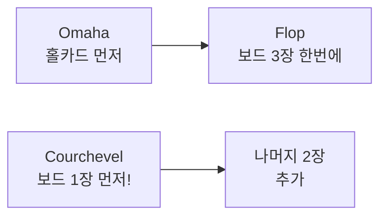

이미 보드 1장을 보고 홀카드를 평가하니까 전략이 달라집니다. Hi-Lo 버전도 있습니다(§6 참조).

---

## Phase 매핑

| Phase | 게임 |
|:-----:|------|
| **Phase 2** (2026 H2) | Texas Hold'em |
| **Phase 3** (2027 H1) | Omaha, Omaha Hi-Lo |
| **Phase 4** (2027 H2) | Short Deck x2, Pineapple, Five/Six Card Omaha x4, Courchevel x2 |

> 베팅 구조(NL/PL/FL), Ante 7종, 특수 규칙(Bomb Pot, Run It Twice 등)의 상세 사양은 → [베팅 시스템 상세 가이드](PRD-GAME-04-betting-system.md) 참조

---

# Part II — 상세 개발 설계 로직

> **역설계 소스**: [PokerGFX 역설계 문서](../../../../ebs_reverse/docs/02-design/pokergfx-reverse-engineering-complete.md) §5~§6 기반
> 이 섹션은 Part I(게임 규칙)을 **구현**하기 위한 엔진 설계입니다.

---

## §9. 게임 상태 머신 — Flop Games 계열

> 역설계 소스: §5.4 게임 상태 머신

### 9-1. 기본 상태 전이 (12종 공통)

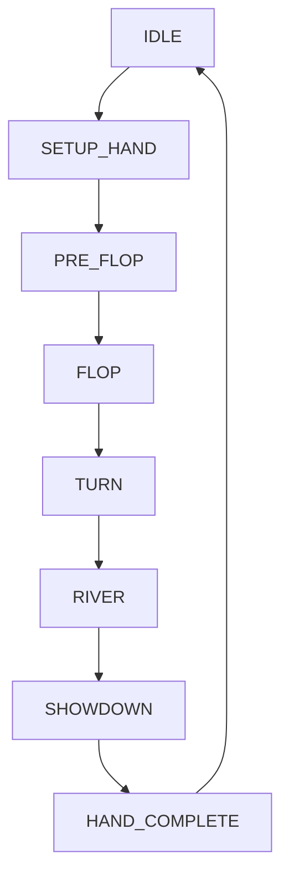

### 9-2. 상태별 시스템 동작

| 상태 | 시스템 동작 | 트리거 | 전이 조건 |
|------|-----------|--------|----------|
| **IDLE** | 대기, 플레이어 좌석 관리 | 운영자 "New Hand" | 최소 2인 착석 |
| **SETUP_HAND** | `hand_num++`, 좌석 확인, 딜러 버튼 이동 | 자동 | 완료 즉시 |
| **PRE_FLOP** | `dealHoleCards()`, 블라인드/Ante 수납 | SETUP 완료 | 베팅 라운드 종결 |
| **FLOP** | `dealBoard(3)`, 승률 재계산 | PRE_FLOP 베팅 종결 | 베팅 라운드 종결 |
| **TURN** | `dealBoard(1)`, 승률 재계산 | FLOP 베팅 종결 | 베팅 라운드 종결 |
| **RIVER** | `dealBoard(1)`, 최종 승률 | TURN 베팅 종결 | 베팅 라운드 종결 |
| **SHOWDOWN** | 핸드 평가, 승자 결정, 팟 분배 | RIVER 베팅 종결 | 평가 완료 |
| **HAND_COMPLETE** | 통계 업데이트, Live Export | SHOWDOWN 완료 | 운영자 확인 |

### 9-3. 게임별 상태 분기

**조기 종결** — 모든 베팅 라운드에서 발생 가능:

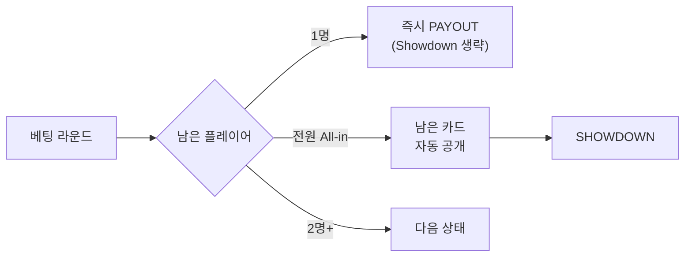

**Pineapple (#4) 분기** — PRE_FLOP 후 DISCARD 추가:

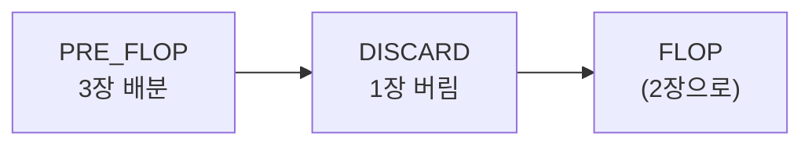

**Courchevel (#11-12) 분기** — PRE_FLOP에서 보드 1장 선공개:

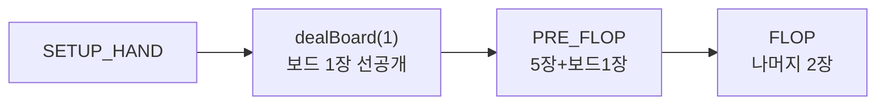

**Run It Twice 분기** — RIVER 후 조건부:

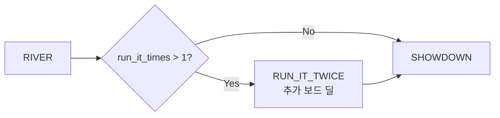

### 9-4. 12종 게임별 상태 머신 매핑

| # | 게임 | 상태 흐름 | 특수 상태 |
|:-:|------|----------|----------|
| 1 | Texas Hold'em | 표준 | — |
| 2 | Short Deck (S>T) | 표준 | 36장 덱 필터링 |
| 3 | Short Deck (T>S) | 표준 | 36장 덱 + 순위 재매핑 |
| 4 | Pineapple | PRE_FLOP → **DISCARD** → FLOP | 1장 버림 단계 |
| 5 | Omaha | 표준 | — |
| 6 | Omaha Hi-Lo | 표준 | SHOWDOWN에서 Hi/Lo 분할 |
| 7 | Five Card Omaha | 표준 | — |
| 8 | Five Card Omaha Hi-Lo (Big O) | 표준 | SHOWDOWN에서 Hi/Lo 분할 |
| 9 | Six Card Omaha | 표준 | — |
| 10 | Six Card Omaha Hi-Lo | 표준 | SHOWDOWN에서 Hi/Lo 분할 |
| 11 | Courchevel | **보드 1장 선공개** → PRE_FLOP → FLOP(+2) | dealBoard(1) 선행 |
| 12 | Courchevel Hi-Lo | 보드 1장 선공개 | + Hi/Lo 분할 |

---

## §10. 카드 배분 로직

> 역설계 소스: §5.3 계열별 게임 분류, GameTypeData

### 10-1. dealHoleCards — 12종별 배분

| # | 게임 | 홀카드 수 | 덱 크기 | 특수 처리 |
|:-:|------|:---------:|:-------:|----------|
| 1 | Texas Hold'em | 2장 | 52 | — |
| 2-3 | Short Deck | 2장 | **36** | `deadCards = 8247343964175` (2-5 제거) |
| 4 | Pineapple | **3장** | 52 | Flop 전 1장 discard |
| 5-6 | Omaha / Hi-Lo | 4장 | 52 | — |
| 7-8 | Five Card Omaha / Hi-Lo | **5장** | 52 | — |
| 9-10 | Six Card Omaha / Hi-Lo | **6장** | 52 | — |
| 11-12 | Courchevel / Hi-Lo | 5장 | 52 | — |

### 10-2. dealBoard — 보드 카드 공개 순서

| 게임 | Flop | Turn | River | 합계 |
|------|:----:|:----:|:-----:|:----:|
| 대부분 (10종) | 3장 | +1장 | +1장 | 5장 |
| **Courchevel** (#11-12) | **1장**(선공개) + **2장** | +1장 | +1장 | 5장 |

Courchevel의 `dealBoard` 호출 순서:
1. SETUP_HAND에서 `dealBoard(1)` — 보드 1장 선공개
2. FLOP에서 `dealBoard(2)` — 나머지 2장
3. TURN에서 `dealBoard(1)`
4. RIVER에서 `dealBoard(1)`

### 10-3. RFID 카드 인식 흐름


- 각 RFID 리더가 카드 태그를 감지하면 `OnCardDetected` 이벤트 발생
- 게임 엔진이 현재 상태에 따라 카드를 홀카드 또는 보드에 등록
- 카드 제거 시 `OnCardRemoved` 이벤트 → Miss Deal 처리 가능

### 10-4. Short Deck 덱 필터링

```
표준 덱 (52장)
  - deadCards bitmask: 8247343964175
  = 36장 덱 (6~A, 4무늬)

deadCards 비트 분해:
  ♣: bits 0-3  (2♣, 3♣, 4♣, 5♣)
  ♦: bits 13-16 (2♦, 3♦, 4♦, 5♦)
  ♥: bits 26-29 (2♥, 3♥, 4♥, 5♥)
  ♠: bits 39-42 (2♠, 3♠, 4♠, 5♠)
```

Wheel 대체: A-2-3-4-5 → **A-6-7-8-9** (bitmask `4336`)

---

## §11. 베팅 라운드 처리 로직

> 역설계 소스: §5.5 BetStructure, §5.6 AnteType, GameTypeData BettingState 그룹

### 11-1. 핵심 데이터 필드

```
BettingState {
    action_on: int              // 현재 액션 플레이어 인덱스
    last_bet_pl: int            // 마지막 베팅 플레이어
    num_raises_this_street: int // 현재 스트릿 레이즈 횟수
    min_raise_amt: int          // 최소 레이즈 금액
    dist_pot_req: bool          // 팟 분배 요청 플래그
}
```

### 11-2. ActionType enum

```
check    = 0    // 패스
all_in   = 1    // 전부 걸기
call     = 2    // 따라 걸기
raise_to = 3    // 올리기 (목표 금액)
bet      = 4    // 첫 베팅
fold     = 7    // 포기
win      = 8    // 승리 (내부용)
option   = 9    // BB 옵션 (Check or Raise)
```

### 11-3. 베팅 라운드 알고리즘

```
function processBettingRound(state):
    while not roundComplete(state):
        player = state.players[state.action_on]

        if player.folded or player.all_in:
            state.action_on = nextActive(state)
            continue

        action = waitForAction(player)

        switch action.type:
            case fold:
                player.folded = true
            case check:
                // 아무것도 안 함
            case call:
                amount = currentBet - player.currentBet
                player.chips -= amount
                pot += amount
            case raise_to:
                validate(action.amount >= state.min_raise_amt)
                diff = action.amount - currentBet
                state.min_raise_amt = diff  // 다음 최소 레이즈
                state.num_raises_this_street++
                currentBet = action.amount
            case all_in:
                amount = player.chips
                player.chips = 0
                player.all_in = true

        state.action_on = nextActive(state)

    return activePlayers(state)
```

### 11-4. NL / PL / FL 최대 베팅 계산

| 구조 | 최대 베팅 계산 | Cap |
|------|-------------|:---:|
| **NoLimit** | `player.chips` (전 칩) | 없음 |
| **PotLimit** | `pot + currentBet + callAmount` | 팟 크기 |
| **FixedLimit** | Pre-Flop/Flop: `_low_limit`, Turn/River: `_high_limit` | 4 Bet |

### 11-5. Side Pot 계산

All-in 플레이어가 있으면 Side Pot이 생성됩니다:

```
function calculatePots(players):
    pots = []
    allInAmounts = sorted(unique(p.totalBet for p in players if p.all_in))

    prevAmount = 0
    for amount in allInAmounts:
        eligible = [p for p in players if p.totalBet >= amount]
        potSize = (amount - prevAmount) * len(eligible)
        pots.append({size: potSize, eligible: eligible})
        prevAmount = amount

    // 남은 금액 = Main Pot
    remaining = sum of excess bets
    if remaining > 0:
        eligible = [p for p in players if not p.folded and not p.all_in]
        pots.append({size: remaining, eligible: eligible})

    return pots
```

---

## §12. 핸드 평가기 라우팅 — 12종 게임별

> 역설계 소스: §6.5 17개 게임별 Evaluator

### 12-1. 게임별 Evaluator 매핑

| # | 게임 | 게임 문자열 | Evaluator | 조합 방식 |
|:-:|------|:---------:|-----------|----------|
| 1 | Texas Hold'em | `HOLDEM` | `Hand.Evaluate` | 7장 중 best 5 |
| 2 | Short Deck (S>T) | `6PHOLDEM` | `holdem_sixplus.eval` | 36장, 표준 순위 |
| 3 | Short Deck (T>S) | `6THOLDEM` | `holdem_sixplus.eval` | 36장, Trips>Straight |
| 4 | Pineapple | `PINEAPPL` | `Hand.Evaluate` | Hold'em과 동일 |
| 5 | Omaha | `OMAHA` | `OmahaEvaluator.EvaluateHigh` | C(4,2)×C(5,3) |
| 6 | Omaha Hi-Lo | `OMAHAHL` | `OmahaEvaluator` + `EvaluateLow` | Hi+Lo 분할 |
| 7 | Five Card Omaha | `OMAHA5` | `Omaha5Evaluator.EvaluateHigh` | C(5,2)×C(5,3) |
| 8 | Five Card Omaha Hi-Lo (Big O) | `OMAHA5` + Lo | `Omaha5Evaluator` + `EvaluateLow` | Hi+Lo |
| 9 | Six Card Omaha | `OMAHA6` | `Omaha6Evaluator.EvaluateHigh` | memory-mapped |
| 10 | Six Card Omaha Hi-Lo | `OMAHA6` + Lo | `Omaha6Evaluator` + `EvaluateLow` | Hi+Lo |
| 11 | Courchevel | `COUR` | `Omaha5Evaluator.EvaluateHigh` | Five Card와 동일 |
| 12 | Courchevel Hi-Lo | `COUR` + Lo | `Omaha5Evaluator` + `EvaluateLow` | Hi+Lo |

### 12-2. 64비트 Bitmask 카드 표현

```
64비트 ulong (52비트 사용):
[─── Spades ───][─── Hearts ───][─── Diamonds ──][─── Clubs ────]
 bits 39-51       bits 26-38       bits 13-25       bits 0-12

각 suit 내 (13비트):
bit 0=2, bit 1=3, ... bit 8=10, bit 9=J, bit 10=Q, bit 11=K, bit 12=A
```

카드 마스크 생성: `mask |= (1UL << (rank + suit * 13))`

### 12-3. 핵심 평가 알고리즘 (Hold'em / Pineapple)

```
function Evaluate(cards: uint64, numCards: int) -> uint:
    // Step 1: suit mask 추출
    clubs    = (cards >> 0)  & 0x1FFF
    diamonds = (cards >> 13) & 0x1FFF
    hearts   = (cards >> 26) & 0x1FFF
    spades   = (cards >> 39) & 0x1FFF

    // Step 2: 고유 랭크 + 중복 계산
    ranks = clubs | diamonds | hearts | spades
    uniqueRanks = nBitsTable[ranks]
    duplicates = numCards - uniqueRanks

    // Step 3: Flush 감지 (O(1) lookup)
    if uniqueRanks >= 5:
        for suitMask in [clubs, diamonds, hearts, spades]:
            if nBitsTable[suitMask] >= 5:
                if straightTable[suitMask] != 0:
                    return STRAIGHT_FLUSH | (straightTable[suitMask] << 16)
                return FLUSH | topFiveCardsTable[suitMask]

    // Step 4: Straight 체크
    if straightTable[ranks] != 0:
        return STRAIGHT | (straightTable[ranks] << 16)

    // Step 5: 중복 수 기반 분기
    switch duplicates:
        0: return HIGH_CARD | topFiveCardsTable[ranks]
        1: return ONE_PAIR | ...   // XOR로 페어 추출
        2: return TWO_PAIR or TRIPS
        3+: return FULL_HOUSE or FOUR_OF_A_KIND
```

### 12-4. Omaha 강제 조합 평가

Omaha 계열(#5~#12)은 반드시 **홀카드 2장 + 보드 3장**을 사용해야 합니다:

```
function EvaluateOmaha(holeCards, boardCards) -> uint:
    bestHand = 0

    // 홀카드에서 2장 선택: C(n, 2)
    for each pair in combinations(holeCards, 2):
        // 보드에서 3장 선택: C(5, 3) = 10
        for each triple in combinations(boardCards, 3):
            hand = pair | triple
            value = Hand.Evaluate(hand, 5)
            bestHand = max(bestHand, value)

    return bestHand
```

조합 수:

| 게임 | 홀카드 | C(n,2) | × C(5,3) | 총 조합 |
|------|:------:|:------:|:--------:|:-------:|
| Omaha | 4장 | 6 | 10 | **60** |
| Five Card / Courchevel | 5장 | 10 | 10 | **100** |
| Six Card | 6장 | 15 | 10 | **150** |

### 12-5. Short Deck 순위 재매핑

```
function EvaluateShortDeck(cards, variant) -> uint:
    base = Hand.Evaluate(cards, numCards, ignore_wheel=true)
    handType = base >> 24

    // Flush ↔ Full House 교환
    if handType == FLUSH: base = (FULL_HOUSE << 24) | (base & 0xFFFFFF)
    if handType == FULL_HOUSE: base = (FLUSH << 24) | (base & 0xFFFFFF)

    // variant별 Straight ↔ Trips 교환
    if variant == TRIPS_BEATS_STRAIGHT:
        if handType == STRAIGHT: base = (TRIPS << 24) | (base & 0xFFFFFF)
        if handType == TRIPS: base = (STRAIGHT << 24) | (base & 0xFFFFFF)

    return base
```

Dead cards 상수: `8247343964175` (16장 bitmask = 2-5 × 4무늬)
Wheel 대체: A-6-7-8-9 (bitmask `4336`)

### 12-6. Hi-Lo 분할 평가 (#6, #8, #10, #12)

```
function EvaluateHiLo(holeCards, boardCards) -> (hiWinner, loWinner):
    // High 평가 (표준)
    hiValue = EvaluateOmaha(holeCards, boardCards)

    // Low 평가 (8-or-better)
    loValue = EvaluateLow8(holeCards, boardCards)
    // 조건: 5장 모두 8 이하, 페어 없음
    // A는 1로 취급 (Low에서 유리)
    // 최강 Low: A-2-3-4-5

    if loValue == NO_QUALIFYING_LOW:
        return (hiWinner, null)  // Hi가 팟 100%
    else:
        return (hiWinner, loWinner)  // 50/50 분할
```

### 12-7. HandValue 인코딩

```
uint HandValue 비트 구조:
[bits 27-24: HandType][bits 23-16: TopCard][bits 15-12: 2nd][bits 11-8: 3rd][...]

HandType 값:
  0 = HighCard     4 = Straight     8 = StraightFlush
  1 = Pair         5 = Flush
  2 = TwoPair      6 = FullHouse
  3 = Trips        7 = FourOfAKind
```

> 상위 HandType이 항상 우선. 동일 타입 내에서 kicker 비트로 타이 해결. `uint` 직접 비교 가능 (`handA > handB`).

### 12-8. Lookup Table 아키텍처

| 테이블 | 크기 | 용도 |
|--------|:----:|------|
| `nBitsTable[8192]` | 16KB | 13비트 popcount (고유 랭크 수) |
| `straightTable[8192]` | 16KB | Straight 최고 카드 (없으면 0) |
| `topFiveCardsTable[8192]` | 32KB | 상위 5개 비트 packed |
| `topCardTable[8192]` | 16KB | 최상위 비트 랭크 |
| `nBitsAndStrTable[8192]` | 16KB | bitcount + straight 결합 |

총 메모리: ~97KB (8192 × 5 테이블). 게임 시작 시 1회 초기화.

---

## §13. 팟 계산 및 분배 로직

### 13-1. 기본 팟 분배

```
function distributePot(pots, evaluations):
    for each pot in pots:
        winners = findBestHands(pot.eligible, evaluations)
        share = pot.size / len(winners)
        for winner in winners:
            winner.chips += share
```

### 13-2. Hi-Lo 분할 분배

```
function distributeHiLo(pot, hiEvals, loEvals):
    hiWinners = findBestHands(pot.eligible, hiEvals)
    loWinners = findBestLow8(pot.eligible, loEvals)

    if loWinners is empty:
        // Low 자격 없음 → Hi가 전부
        hiShare = pot.size / len(hiWinners)
        for w in hiWinners: w.chips += hiShare
    else:
        // 50/50 분할
        hiHalf = pot.size / 2
        loHalf = pot.size - hiHalf  // 홀수 칩은 Hi에

        hiShare = hiHalf / len(hiWinners)
        loShare = loHalf / len(loWinners)

        for w in hiWinners: w.chips += hiShare
        for w in loWinners: w.chips += loShare
```

### 13-3. Run It Twice 분배

```
function distributeRunItTwice(pot, boardA, boardB, players):
    // Board A 평가
    winnersA = evaluate(players, boardA)
    // Board B 평가
    winnersB = evaluate(players, boardB)

    halfA = pot.size / 2
    halfB = pot.size - halfA

    distribute(halfA, winnersA)
    distribute(halfB, winnersB)
```

---

## §14. 게임 변형별 특수 로직

### 14-1. Short Deck (#2-3) — 덱 필터링 + 순위 재매핑

| 항목 | 값 |
|------|-----|
| Dead cards bitmask | `8247343964175` |
| 제거 카드 | 2, 3, 4, 5 × 4무늬 = 16장 |
| 남은 덱 | 36장 (6~A) |
| Wheel 대체 | A-6-7-8-9 (bitmask `4336`) |
| #2 순위 교환 | Flush↔FullHouse, Straight↔Trips 아님 (Straight>Trips) |
| #3 순위 교환 | Flush↔FullHouse, **Trips↔Straight** (Trips>Straight) |

### 14-2. Pineapple (#4) — Discard Phase

```
PRE_FLOP 상태에서:
  1. dealHoleCards(3)  // 3장 배분
  2. 베팅 라운드 진행
  3. DISCARD 상태 진입
  4. 각 플레이어가 1장 선택하여 버림
  5. 남은 2장으로 FLOP 진입
```

### 14-3. Omaha 계열 (#5-12) — 강제 조합 검증

```
function validateOmahaHand(selectedHole, selectedBoard):
    assert len(selectedHole) == 2    // 반드시 홀카드 2장
    assert len(selectedBoard) == 3   // 반드시 보드 3장
    assert selectedHole ⊂ holeCards  // 홀카드에서 선택
    assert selectedBoard ⊂ boardCards // 보드에서 선택
```

> 이 검증은 `OmahaEvaluator` 내부에서 자동 수행. 모든 유효 조합을 열거하여 best hand를 찾음.

### 14-4. Courchevel (#11-12) — 보드 선공개

```
SETUP_HAND 상태에서:
  1. dealHoleCards(5)      // 5장 홀카드
  2. dealBoard(1)          // 보드 1장 미리 공개 ← 핵심 차이
  3. PRE_FLOP 베팅 (홀카드 5장 + 보드 1장 정보)
  4. dealBoard(2)          // FLOP 나머지 2장
  5. 이후 표준 진행 (Turn, River)
```

### 14-5. Hi-Lo 변형 (#6, 8, 10, 12) — 8-or-better Low 검증

```
function qualifiesForLow8(hand5):
    // 조건 1: 모든 카드 8 이하 (A는 1로 취급)
    for card in hand5:
        if rank(card) > 8 and rank(card) != ACE:
            return false

    // 조건 2: 페어 없음
    ranks = [rank(card) for card in hand5]
    if len(set(ranks)) != 5:
        return false

    return true
```

Low 강도 비교: 가장 높은 카드부터 비교 (낮을수록 강함)
- 최강: A-2-3-4-5 (Wheel)
- 최약 자격: 8-7-6-5-4

---

## §15. 승률 계산 엔진 (Equity)

> 역설계 소스: §6.6 Monte Carlo 확률 계산

### 15-1. 스트릿별 계산 방식

| 스트릿 | 알려진 카드 | 계산 방법 | 정밀도 |
|--------|-----------|----------|:------:|
| **Pre-Flop** | 홀카드만 | PocketHand169 LUT | 사전 계산 |
| **Flop** | 홀카드 + 3장 | Monte Carlo / 전수 | MC_NUM 기준 |
| **Turn** | 홀카드 + 4장 | 전수 (46장 남음) | 100% |
| **River** | 홀카드 + 5장 | 확정 (즉시 평가) | 100% |

### 15-2. Monte Carlo 임계값

| 게임 | MC_NUM | 이유 |
|------|:------:|------|
| Hold'em / Pineapple | 100,000 | 조합 적음 → 전수 조사 범위 넓음 |
| Omaha 4/5 | 10,000 | 홀카드 조합 급증 |
| Omaha 6 | 1,000 | memory-mapped 파일 사용 |

MC_NUM 초과 시 `RandomHands()` 호출로 Monte Carlo 샘플링 전환.

### 15-3. Outs 계산

```
function calculateOuts(playerCards, boardCards, opponentCards):
    outs = 0
    remaining = deck - playerCards - boardCards - opponentCards

    for card in remaining:
        newBoard = boardCards | card
        if playerWins(playerCards, newBoard, opponentCards):
            outs |= cardBit(card)

    return outs  // bitmask: 이 카드가 나오면 이김
```

---

## §16. 데이터 구조 — GameTypeData

> 역설계 소스: §4.4 GameTypeData (79개 필드, 6개 그룹)

### 16-1. GameSession 그룹 (~15 필드)

| 필드 | 타입 | 설명 |
|------|------|------|
| `_game_variant` | `game` enum (0-21) | 현재 게임 종류 |
| `bet_structure` | `BetStructure` (0-2) | NL/FL/PL |
| `_ante_type` | `AnteType` (0-6) | Ante 유형 |
| `num_boards` | int | Run It Twice 보드 수 |
| `hand_num` | int | 현재 핸드 번호 |
| `hand_in_progress` | bool | 핸드 진행 중 |
| `hand_ended` | bool | 핸드 종료 |
| `_gfxMode` | enum | Live/Delay/Commentary |

### 16-2. TableState 그룹 (~12 필드)

| 필드 | 타입 | 설명 |
|------|------|------|
| `_small` | int | Small Blind 금액 |
| `_big` | int | Big Blind 금액 |
| `_third` | int | Third Blind / Straddle 금액 |
| `_ante` | int | Ante 금액 |
| `button_blind` | bool | Button Blind 활성화 |
| `cap` | int | FL Cap 금액 |
| `bomb_pot` | bool | Bomb Pot 활성화 |
| `seven_deuce_amt` | int | 7-2 Side Bet 금액 |
| `_low_limit` | int | FL Small Bet |
| `_high_limit` | int | FL Big Bet |
| `_bring_in` | int | Stud Bring-in 금액 |

### 16-3. PlayerState 그룹 (~10 필드)

| 필드 | 타입 | 설명 |
|------|------|------|
| `action_on` | int | 현재 액션 플레이어 인덱스 |
| `pl_dealer` | int | 딜러 위치 |
| `pl_small` | int | SB 위치 |
| `pl_big` | int | BB 위치 |
| `pl_third` | int | Straddle 위치 |
| `_first_to_act` | int | 첫 액션 플레이어 |
| `_first_to_act_preflop` | int | Pre-Flop 첫 액션 |
| `_first_to_act_postflop` | int | Post-Flop 첫 액션 |
| `last_bet_pl` | int | 마지막 베팅 플레이어 |
| `starting_players` | int | 시작 플레이어 수 |

### 16-4. BettingState 그룹 (~8 필드)

| 필드 | 타입 | 설명 |
|------|------|------|
| `num_raises_this_street` | int | 현재 스트릿 레이즈 횟수 |
| `min_raise_amt` | int | 최소 레이즈 금액 |
| `dist_pot_req` | bool | 팟 분배 요청 |
| `cum_win_done` | bool | 누적 승리 완료 |
| `card_scan_warning` | bool | RFID 스캔 경고 |

### 16-5. DisplayState 그룹 (~15 필드)

| 필드 | 타입 | 설명 |
|------|------|------|
| `run_it_times` | int | Run It Twice 총 횟수 |
| `run_it_times_remaining` | int | 남은 횟수 |
| `run_it_times_num_board_cards` | int | 추가 보드 카드 수 |
| `stud_draw_in_progress` | bool | Stud/Draw 분기 활성화 |
| `draws_completed` | int | 완료된 드로우 횟수 |
| `drawing_player` | int | 현재 드로우 플레이어 |

> Flop Games 계열에서는 `stud_draw_in_progress`가 항상 `false`이고, Pineapple의 discard는 별도 로직으로 처리됩니다.
