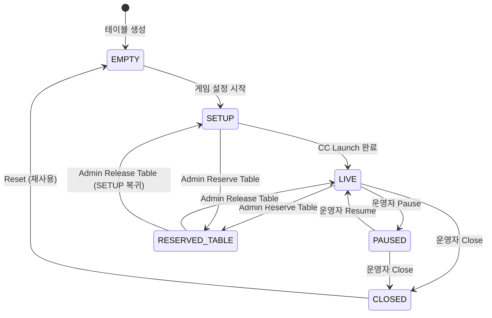
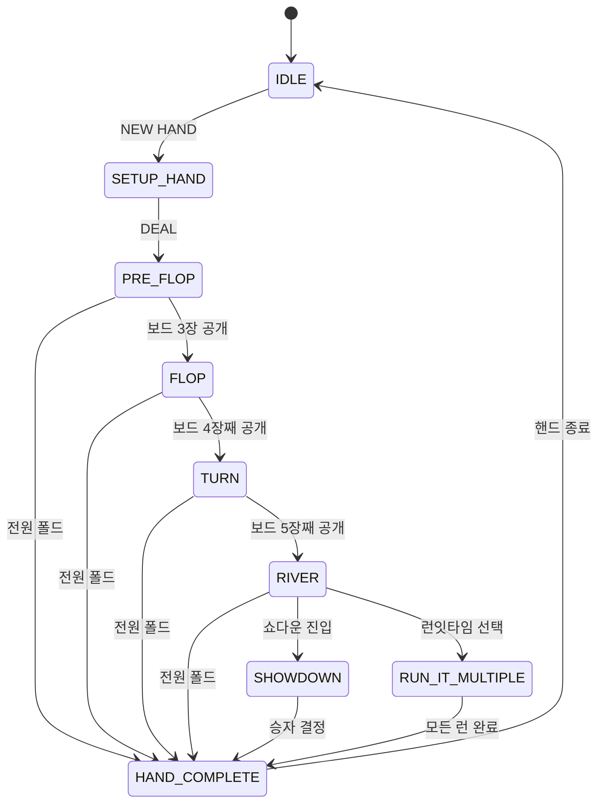
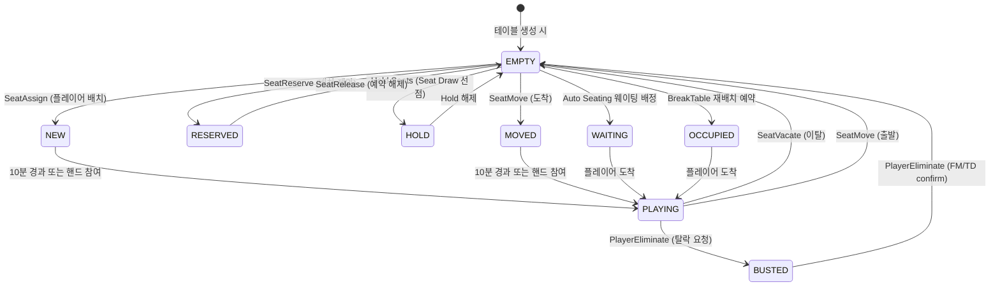
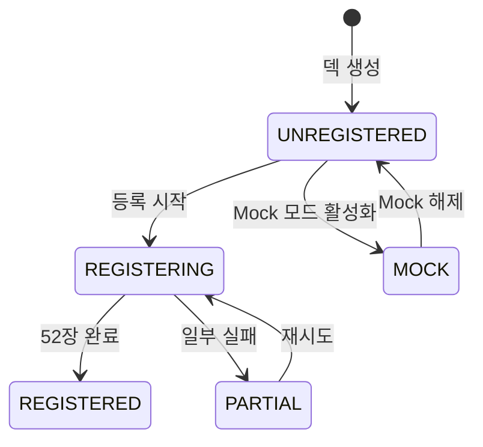
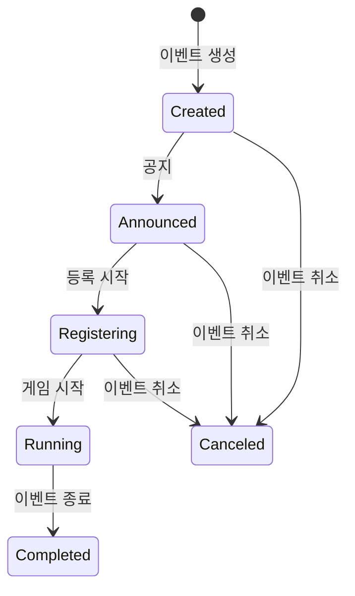

# DATA-03 State Machines

| 날짜 | 항목 | 내용 |
|------|------|------|
| 2026-04-08 | 신규 작성 | 5개 FSM 상태 전이 다이어그램 + 트리거/가드/부작용 초판 |
| 2026-04-13 | WSOP LIVE 정합성 수정 | SeatFSM 3→9상태 확장(WSOP LIVE Seat Status 코드), EventFSM Announce→Announced + isRegisterable + 표시 상태, TableFSM RESERVED_TABLE 추가 |

---

## 개요

EBS에서 상태를 관리하는 5개 FSM(Finite State Machine)의 전이 다이어그램을 정의한다. 각 전이에 트리거(누가 발동), 가드 조건(언제 허용), 부작용(무엇이 변경)을 명시한다.

> 참조: 상태값 정의 — BS-00 Definitions 3, FSM 이름 규약 — BS-00 5

---

## 1. TableFSM

Table의 생명주기. Lobby에서 관리.

### 전이 상세

| 전이 | 트리거 | 가드 조건 | 부작용 |
|------|--------|----------|--------|
| [*] → EMPTY | Admin: [+ New Table] | — | `tables` INSERT, `audit_logs` INSERT |
| EMPTY → SETUP | Admin: [Start Setup] | 게임 설정 완료 + 플레이어 1명+ 등록 | `table_sessions` 레코드 생성 |
| SETUP → LIVE | Admin: [Go Live] / CC Launch | 좌석 배치 완료, Feature: RFID 할당 + 덱 등록 | CC 인스턴스 생성, WebSocket 구독 시작 |
| LIVE → PAUSED | Admin/Operator: [Pause] | — | CC 핸드 입력 차단, 오버레이 "PAUSED" 표시 |
| PAUSED → LIVE | Admin/Operator: [Resume] | — | CC 핸드 입력 재개, 오버레이 복원 |
| LIVE → CLOSED | Admin: [Close] | 진행 중 핸드 없음 | `table_sessions.ended_at` 기록, CC 종료, 오버레이 제거 |
| PAUSED → CLOSED | Admin: [Close] | — | 위와 동일 |
| CLOSED → EMPTY | Admin: [Reset] | 확인 다이얼로그 승인 | 핸드 카운트 초기화, 설정 유지, 좌석 초기화 |
| LIVE → RESERVED_TABLE | Admin: Reserve Table | — | `tables.status` UPDATE, Auto Seating 제외, 짙은 회색 표시 |
| SETUP → RESERVED_TABLE | Admin: Reserve Table | — | 동일 |
| RESERVED_TABLE → LIVE | Admin: Release Table | — | `tables.status` UPDATE, Auto Seating 포함 |

### Feature Table 추가 가드

| 전이 | 추가 가드 | 차단 메시지 |
|------|----------|------------|
| SETUP → LIVE | RFID 리더 할당 | "RFID 리더를 할당하세요" |
| SETUP → LIVE | 덱 등록 완료 (52장) | "덱 등록을 완료하세요" |
| SETUP → LIVE | 좌석 배치 완료 | "좌석 배치를 완료하세요" |

---

## 2. HandFSM

Hand의 생명주기. Game Engine에서 관리. CC 명령 + RFID 입력으로 전이.

### 전이 상세

| 전이 | 트리거 | 가드 조건 | 부작용 |
|------|--------|----------|--------|
| IDLE → SETUP_HAND | CC: NEW HAND | 활성 플레이어 2명+ | `hands` INSERT, hand_number 증가 |
| SETUP_HAND → PRE_FLOP | CC: DEAL | 블라인드 수집 완료, 딜러 위치 결정 | 홀카드 배분, 블라인드 자동 수집 |
| PRE_FLOP → FLOP | RFID/CC: 보드 3장 | 프리플롭 베팅 라운드 완료 | board_cards 업데이트, Equity 재계산 |
| FLOP → TURN | RFID/CC: 보드 4장째 | 플롭 베팅 라운드 완료 | board_cards 업데이트, Equity 재계산 |
| TURN → RIVER | RFID/CC: 보드 5장째 | 턴 베팅 라운드 완료 | board_cards 업데이트, Equity 재계산 |
| RIVER → SHOWDOWN | Engine: 자동 | 리버 베팅 라운드 완료, 활성 2명+ | 카드 공개 요청 |
| SHOWDOWN → HAND_COMPLETE | Engine: 자동 | 승자 결정 | 팟 분배, `hand_players` 승자/PnL 기록 |
| {any_street} → HAND_COMPLETE | Engine: 자동 | 활성 1명만 남음 (전원 폴드) | 마지막 남은 플레이어에게 팟 전달 |
| HAND_COMPLETE → IDLE | Engine: 자동 | 팟 분배 완료 | `hands` 업데이트 (종료 시각, duration), 통계 갱신 |
| RIVER → RUN_IT_MULTIPLE | CC: Run It | 올인 2명+, 보드 미완성 | 추가 보드 생성 |
| RUN_IT_MULTIPLE → HAND_COMPLETE | Engine: 자동 | 모든 런 완료 | 런별 팟 분배 |

> 상세: BS-06-01 시나리오 문서 참조

---

## 3. SeatFSM

Seat의 상태. Lobby + CC에서 관리. WSOP LIVE Seat Status 코드 9상태.

### 전이 상세

| 전이 | 트리거 | 가드 조건 | 부작용 |
|------|--------|----------|--------|
| [*] → EMPTY | 시스템: 테이블 생성 | — | `table_seats` INSERT (seat_no별 10개) |
| EMPTY → NEW | Admin/Auto: 좌석 배치 | 유효한 player_id | `table_seats` UPDATE (player_id, status='new'). 10분 타이머 시작 |
| NEW → PLAYING | 시스템: 10분 경과 또는 핸드 참여 | — | `table_seats` UPDATE (status='playing') |
| PLAYING → EMPTY | Admin: 제거 / CC: Vacate | 핸드 미진행 중 | `table_seats` UPDATE, `audit_logs` INSERT |
| PLAYING → BUSTED | CC: PlayerEliminate (요청) | 핸드 미진행 중 | `table_seats` UPDATE (status='busted'). FM/TD 확인 대기 |
| BUSTED → EMPTY | Admin: PlayerEliminate (확인) | FM/TD 권한 | `table_seats` UPDATE (player_id=NULL, status='empty'), `audit_logs` INSERT |
| PLAYING → EMPTY (이동 출발) | Admin: SeatMove | 도착 좌석 EMPTY | 출발 좌석 EMPTY, 도착 좌석 MOVED |
| EMPTY → MOVED | Admin: SeatMove (도착) | 출발 좌석 PLAYING | `table_seats` UPDATE (status='moved'). 10분 타이머 시작 |
| MOVED → PLAYING | 시스템: 10분 경과 또는 핸드 참여 | — | `table_seats` UPDATE (status='playing') |
| EMPTY → RESERVED | Admin: SeatReserve | — | `table_seats` UPDATE (status='reserved'). Auto Seating 제외 |
| RESERVED → EMPTY | Admin: SeatRelease | — | `table_seats` UPDATE (status='empty') |
| EMPTY → WAITING | Auto Seating: 웨이팅 배정 | 웨이팅 큐에 플레이어 존재 | `table_seats` UPDATE (status='waiting', player_id). 황색 표시 |
| WAITING → PLAYING | 시스템: 플레이어 도착 | — | `table_seats` UPDATE (status='playing') |
| EMPTY → HOLD | Admin: Hold Seats (Seat Draw) | — | `table_seats` UPDATE (status='hold'). 회색 표시 |
| HOLD → EMPTY | Admin: Hold 해제 | — | `table_seats` UPDATE (status='empty') |
| EMPTY → OCCUPIED | BO: BreakTable 재배치 예약 | — | `table_seats` UPDATE (status='occupied'). 도착 예정 플레이어 매핑 |
| OCCUPIED → PLAYING | 시스템: 플레이어 도착 | — | `table_seats` UPDATE (status='playing') |

### WSOP LIVE Seat Status 코드 (Table Dealer Page)

| 코드 | EBS 상태 | 색상 | 설명 |
|------|---------|------|------|
| E | EMPTY | 백색 | 빈 좌석 |
| N | NEW | — | 신규 배정 (10분 카운트다운) |
| M | MOVED | — | 이동해 온 좌석 (10분 카운트다운) |
| B | BUSTED | 적색 | 탈락 요청 (FM/TD confirm 대기) |
| O | OCCUPIED | — | Break Table 등 예약 점유 |
| R | RESERVED | 짙은 회색 | Auto Seating 제외 |
| W | WAITING | 황색 | 웨이팅 플레이어에게 배정됨 |
| H | HOLD | 회색 | Seat Draw in Advance 선점 |
| — | PLAYING | 녹색 | 플레이 중 |

---

## 4. DeckFSM

Deck의 RFID 등록 상태. CC + RFID HAL에서 관리.

### 전이 상세

| 전이 | 트리거 | 가드 조건 | 부작용 |
|------|--------|----------|--------|
| [*] → UNREGISTERED | Admin: 덱 생성 | — | `decks` INSERT, `deck_cards` 52행 INSERT (uid=NULL) |
| UNREGISTERED → REGISTERING | CC: 등록 시작 | RFID 리더 연결됨 | registered_count = 0, 스캔 UI 활성화 |
| REGISTERING → REGISTERED | RFID: 52장 감지 완료 | registered_count == 52, 중복 UID 없음 | registered_at 기록, `tables.deck_registered` = true |
| REGISTERING → PARTIAL | RFID: 스캔 중단/오류 | registered_count < 52 | 에러 로그 기록 |
| PARTIAL → REGISTERING | CC: 재시도 | RFID 리더 연결됨 | 미등록 카드부터 재개 |
| UNREGISTERED → MOCK | 시스템: Mock 모드 | Config: rfid_mode == 'mock' | 52장 가상 UID 자동 매핑, registered_count = 52 |
| MOCK → UNREGISTERED | 시스템: Real 모드 전환 | Config: rfid_mode == 'real' | 가상 UID 제거 |

---

## 5. EventFSM

Event 진행 상태. WSOP LIVE API 또는 Lobby에서 관리.

### 전이 상세

| 전이 | 트리거 | 가드 조건 | 부작용 |
|------|--------|----------|--------|
| [*] → Created | Admin: 이벤트 생성 / API | — | `events` INSERT |
| Created → Announced | Admin: 공지 / API | — | `events.status` UPDATE |
| Announced → Registering | Admin: 등록 시작 / API | — | `events.status` UPDATE |
| Registering → Running | Admin: 게임 시작 / API | 참가자 1명+ | `events.status` UPDATE, EBS 활성 상태 |
| Running → Completed | Admin: 이벤트 종료 / API | 모든 테이블 CLOSED | `events.status` UPDATE |
| {Created/Announced/Registering} → Canceled | Admin: 이벤트 취소 | — | `events.status` UPDATE, 관련 Flight/Table 정리 |

> 참조: event_flight_status enum — BS-06-00-REF 1.2.5. EBS는 Running 상태에서만 게임 데이터를 처리한다.

### 표시 상태 (WSOP LIVE Tournament Status 정합)

Backend 상태와 `isRegisterable` 플래그, Day 번호의 조합으로 UI 표시 상태가 결정된다.

| Backend 상태 | isRegisterable | Day | 표시 상태 | 설명 |
|-------------|:-:|:-:|---------|------|
| Created | F | * | Created | App에서 미노출 |
| Announced | F | 1 | Announced | 등록 전 공지 상태 |
| Announced | F | 2+ | **Restricted** | Day2 이상에서 Announce 상태는 등록 불가 |
| Registering | T | 1 | Registering | Day1 등록 가능 |
| Registering | T | 2+ | **Late Reg.** | Day2 이상 등록 가능 |
| Registering | F | * | Registering | Staff만 등록 가능 (App 불가) |
| Running | T | * | **Late Reg.** | 시작 후에도 등록 가능 |
| Running | F | * | Running | 등록 마감 |
| Completed | * | * | Completed | Flight 종료 |
| Canceled | * | * | Canceled | Flight 취소 |

> **참조**: WSOP LIVE Tournament Status (Confluence page 1904542277)

---

## FSM 관리 위치 요약

| FSM | 관리 주체 | 저장 위치 | 실시간 동기화 |
|-----|----------|----------|:----------:|
| **TableFSM** | Lobby (BO) | `tables.status` | WebSocket → CC |
| **HandFSM** | Game Engine (CC) | CC 메모리 → `hands` | WebSocket → Lobby |
| **SeatFSM** | Lobby + CC | `table_seats.status` | WebSocket 양방향 |
| **DeckFSM** | CC + RFID HAL | `decks.status` | WebSocket → Lobby |
| **EventFSM** | Lobby (BO) / API | `events.status` | REST API |
