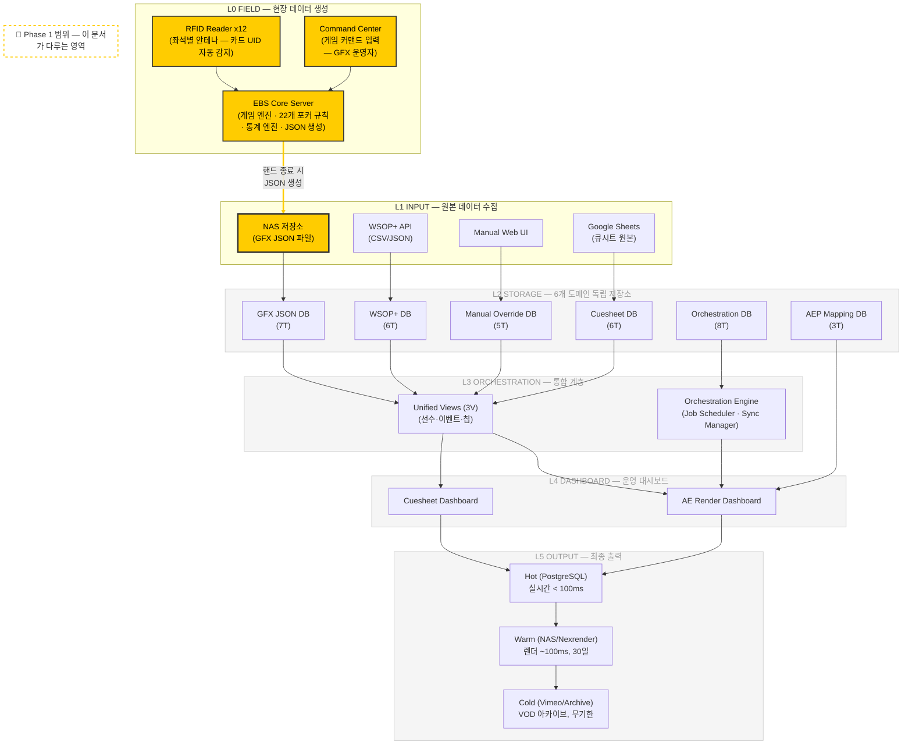
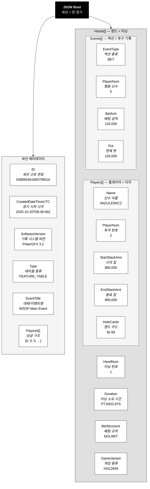
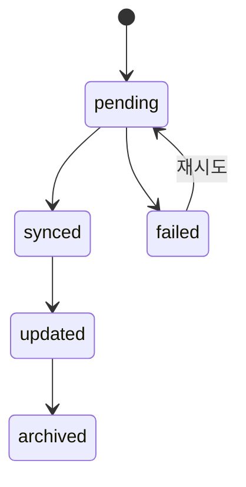

> **⚠ 이 문서는 archive 상태입니다.** 현행 DB 스키마는 `docs/data/DATA-04-db-schema.md`로 승격되었습니다 (2026-04-08). 이 파일은 역사적 참조용으로 보존합니다.
>
> 관련 현행 문서:
> - ER 다이어그램: `docs/data/DATA-01-er-diagram.md`
> - 엔티티 정의: `docs/data/DATA-02-entities.md`
> - FSM 다이어그램: `docs/data/DATA-03-state-machines.md`
> - DB 스키마: `docs/data/DATA-04-db-schema.md`

# EBS 데이터 추출 PRD (ARCHIVED)

**EBS가 기록하는 포커 게임 데이터의 구조와 규칙**

| 항목 | 내용 |
|------|------|
| **문서 버전** | v1.4 |
| **작성일** | 2026-03-09 |
| **작성자** | 기획팀 |
| **대상 독자** | 기획팀, 개발팀 |
| **상태** | ~~초안~~ → **Archive** (2026-04-08 `docs/data/`로 승격) |

---

# Part I. 맥락 이해

> *EBS가 무엇을 기록하고, 왜 그것이 중요한가*

---

## Ch.1 포커 방송과 데이터

### 1.1 화면 뒤의 데이터

포커 방송을 시청하면 화면 하단에 선수의 이름, 칩 수량, 핸드 카드가 표시된다. 화면 전환 사이에 순위표가 나오고, 팟이 커지면 숫자가 실시간으로 바뀐다. 시청자에게는 자연스러운 화면이지만, 이 모든 정보는 어딘가에서 수집되고 가공되어야 한다.

그 "어딘가"의 출발점이 EBS다. EBS는 포커 테이블에서 벌어지는 모든 일을 실시간으로 기록하는 소프트웨어다. 누가 앉아 있는지, 칩을 얼마나 가지고 있는지, 어떤 카드가 나왔는지, 누가 베팅하고 누가 폴드했는지. 이 원시 데이터가 없으면 방송 그래픽은 만들 수 없다.

### 1.2 이 문서의 범위

이 PRD는 **EBS가 추출하는 원시 데이터의 구조를 정의한다.**

EBS는 3개의 독립 시스템(SYSTEM 1 Core — 방송 데이터·자동화 / SYSTEM 2 AI Production — AI 기반 영상 제작 / SYSTEM 3 OTT AI — OTT 배포·분석)으로 구성된다. 이 PRD는 **SYSTEM 1의 현장 피처 테이블(L0)에서 데이터가 생성되어 NAS JSON(L1)으로 저장되는 구간**의 데이터 구조를 정의한다.

EBS 전체 시스템에서 이 문서가 다루는 영역은 아래와 같다.



> **노란색 영역**: 이 문서의 핵심 범위 — 현장 피처 테이블(L0)에서 NAS JSON(L1)까지의 데이터 구조 정의. 각 필드의 L2(DB) 매핑 명세를 부록으로 포함한다. L3~L5는 후속 PRD/설계 문서에서 다룬다.

포커 테이블 현장에는 RFID 리더 12대가 좌석 아래에 매립되어 카드를 자동 인식한다. GFX 운영자 1명이 Command Center에서 게임 커맨드를 입력한다 — New Hand, Deal, 베팅 액션, Showdown. EBS Core Server는 RFID 인식 데이터와 운영자 입력을 결합하여 22개 포커 변형 규칙에 따라 게임 상태를 실시간 추적한다. **핸드가 종료될 때마다** 전체 핸드 데이터(플레이어, 홀카드, 액션, 보드, 결과)를 JSON 파일로 생성하여 NAS에 저장한다. 이 NAS JSON이 이 PRD가 정의하는 데이터의 원본이다.

EBS는 현장(L0) → 입력(L1) → 저장(L2) → 통합(L3) → 대시보드(L4) → 출력(L5)의 6계층 파이프라인으로 구성된다. **이 문서는 L0(현장 EBS)에서 L1(NAS JSON 파일)로 저장되는 필드의 구조, 규칙, 제약 조건을 정의하고, L2(Supabase DB) 매핑 명세를 포함한다.** L2 정규화(Supabase 저장), L3 통합(Unified Views), L4 대시보드(큐시트/렌더), L5 출력(AEP 렌더링, VOD 아카이브)은 별도 PRD 및 설계 문서에서 정의한다.

### 1.3 왜 이 정의가 필요한가

EBS의 JSON은 EBS 전체 파이프라인의 입구다. 이 데이터의 구조를 정확히 이해하지 못하면, DB 스키마 설계가 흔들리고, 정규화 로직이 꼬이며, 최종 방송 그래픽에 잘못된 숫자가 표시된다. 이 문서는 "EBS가 주는 데이터가 정확히 무엇인지"를 기획팀과 개발팀이 동일하게 이해하기 위한 합의 문서다.

---

## Ch.2 EBS가 기록하는 것

### 2.1 EBS의 역할

EBS는 포커 테이블 옆에서 실행되는 전용 소프트웨어다. 딜러가 카드를 나누고, 선수가 베팅하고, 보드에 카드가 깔리는 모든 과정을 실시간으로 캡처한다. 한 세션(촬영 단위)이 끝나면, 기록된 모든 데이터를 하나의 JSON 파일로 내보낸다.

JSON 파일 하나 = 세션 하나다. 세션은 하나의 테이블에서 연속으로 진행된 게임들의 묶음이다.

### 2.2 4계층 구조: 야구 비유

EBS 데이터는 4개의 계층으로 구성된다. 야구 중계에 비유하면 이해가 쉽다.

| 포커 | 야구 비유 | 설명 |
|------|-----------|------|
| **세션** | 한 경기 | 어느 구장에서, 몇 시에, 어떤 방식으로 진행되었는가 |
| **핸드** | 이닝 | 몇 번째 이닝인지, 얼마나 걸렸는지, 어떤 규칙으로 진행되었는지 |
| **플레이어** | 타자 | 이름, 등번호(좌석), 타율(통계), 이번 이닝 성적(스택 변화) |
| **액션** | 투구 기록 | 몇 번째 투구인지, 어떤 종류인지, 결과는 무엇인지 |

경기(세션) 안에 여러 이닝(핸드)이 있고, 각 이닝에는 타자들(플레이어)이 참여하며, 타석에서 벌어지는 투구 하나하나(액션)가 기록된다. 이 구조를 JSON 트리로 표현하면 다음과 같다.



### 2.3 데이터 규모

실제 운영 데이터 28개 파일을 분석한 결과다.

| 지표 | 전체 평균 | GG 소스 | pokercaster 소스 |
|------|----------|---------|-----------------|
| 세션당 핸드 수 | ~33 | 53.8 | 123.2 |
| 핸드당 플레이어 수 | ~8명 | - | - |
| 핸드당 액션 수 | ~13개 | - | - |

한 세션의 JSON 파일에는 평균 33개 핸드, 핸드마다 약 8명의 플레이어와 13개의 액션이 기록된다. 대형 세션(pokercaster)은 핸드가 123개를 넘기도 한다.

---

# Part II. GFX 데이터 카탈로그

> *EBS가 기록하는 6가지 데이터 영역*

---

## Ch.3 세션 카탈로그 — "어떤 테이블에서 언제 촬영했는가"

세션은 야구의 "한 경기 기록"이다. 오늘 잠실구장에서 오후 6시에 시작된 경기가 있었다면, 그 경기의 기본 정보 — 구장 이름, 시작 시각, 어떤 리그 경기인지 — 를 기록한 것이 세션이다.

포커에서는 "어떤 테이블에서, 언제, 어떤 종류의 게임을 촬영했는지"가 세션의 핵심이다. Feature Table(중계용 메인 테이블)인지 Final Table(결승 테이블)인지에 따라 방송 그래픽의 구성이 달라지기 때문에, 테이블 종류는 특히 중요하다.

EBS는 세션이 끝나면 JSON 파일 하나를 NAS에 저장한다. 이 파일의 최상위(Root) 레벨에 세션 정보가 담긴다.

### JSON 원본 필드

| 필드명 | 설명 | 예시 |
|--------|------|------|
| ID | 세션 고유 번호 (.NET Ticks) | `638961224831992165` |
| CreatedDateTimeUTC | 세션 생성 시각 (UTC) | `"2025-10-15T10:54:43.1992165Z"` |
| SoftwareVersion | EBS 버전 | `"PokerGFX 3.2"` |
| Type | 테이블 종류 | `"FEATURE_TABLE"`, `"FINAL_TABLE"` |
| EventTitle | 대회/이벤트명 | `"WSOP Main Event"` |
| Payouts | 상금 구조 (배열) | `[10000000, 5000000, ...]` |

### DB 매핑

**테이블**: `gfx_sessions`

| 컬럼 | 타입 | 제약조건 | 설명 |
|------|------|----------|------|
| id | UUID | PK | 내부 식별자 |
| session_id | BIGINT | UNIQUE, NOT NULL | .NET Ticks 값 (JSON ID) |
| file_name | TEXT | NOT NULL | JSON 파일명 |
| file_hash | TEXT | NOT NULL, UNIQUE | SHA256 해시 (중복 입력 방지) |
| nas_path | TEXT | | NAS 파일 경로 |
| table_type | ENUM (table_type) | NOT NULL, DEFAULT 'UNKNOWN' | FEATURE_TABLE, MAIN_TABLE, FINAL_TABLE, SIDE_TABLE, UNKNOWN |
| event_title | TEXT | | 대회/이벤트명 |
| software_version | TEXT | | EBS 버전 |
| payouts | INTEGER[] | | 상금 구조 배열 |
| hand_count | INTEGER | | 세션 내 핸드 수 (집계) |
| player_count | INTEGER | | 참여 플레이어 수 (집계) |
| total_duration_seconds | INTEGER | | 전체 소요 시간 (집계) |
| session_created_at | TIMESTAMPTZ | | JSON CreatedDateTimeUTC |
| session_start_time | TIMESTAMPTZ | | 첫 핸드 시작 시각 |
| session_end_time | TIMESTAMPTZ | | 마지막 핸드 종료 시각 |
| raw_json | JSONB | NOT NULL | 원본 JSON 전체 보존 (주의: 대용량, 인덱싱 제한) |
| sync_status | ENUM (sync_status) | | pending, synced, updated, failed, archived |
| sync_error | TEXT | | 동기화 실패 시 오류 메시지 |
| processed_at | TIMESTAMPTZ | | 처리 완료 시각 |
| created_at | TIMESTAMPTZ | | 레코드 생성 시각 |
| updated_at | TIMESTAMPTZ | | 레코드 수정 시각 |

`raw_json`에 원본 JSON 전체를 보존하는 이유는, 정규화 과정에서 누락된 필드가 발견되었을 때 원본으로 돌아가 재처리할 수 있도록 하기 위해서다.

---

## Ch.4 핸드 카탈로그 — "어떤 게임이 어떻게 진행되었는가"

핸드는 야구의 "이닝"이다. 한 경기(세션) 안에서 몇 번째 이닝인지, 그 이닝이 얼마나 걸렸는지, 어떤 규칙(노리밋, 팟리밋)으로 진행되었는지를 기록한다.

방송에서 핸드는 가장 중요한 단위다. "이번 핸드에서 누가 얼마를 걸었고 결과가 어떻게 되었는지"가 시청자가 가장 궁금해하는 정보이기 때문이다. 핸드가 시작되면 블라인드 정보(의무 베팅 금액)가 화면에 표시되고, 진행 중에는 팟 크기가 변하며, 종료되면 승자와 획득 칩이 표시된다.

핸드에는 게임 종류(홀덤, 오마하 등)와 베팅 구조(노리밋, 리밋 등)가 함께 기록된다. 같은 세션 안에서도 Mixed Game이면 핸드마다 게임 종류가 바뀔 수 있다.

### JSON 원본 필드

| 필드명 | 설명 | 예시 |
|--------|------|------|
| HandNum | 핸드 순번 | `1`, `2`, `33` |
| Duration | 소요 시간 (ISO 8601) | `"PT35M37.2477537S"` |
| StartDateTimeUTC | 시작 시각 | `"2025-10-15T11:02:15Z"` |
| BetStructure | 베팅 구조 | `"NOLIMIT"` |
| GameVariant | 게임 종류 | `"HOLDEM"` |
| GameClass | 게임 분류 | `"FLOP"` |
| AnteAmt | 앤티 금액 | `0`, `100` |
| FlopDrawBlinds | 블라인드 정보 (객체) | `{BigBlindAmt: 200, SmallBlindAmt: 100, ...}` |
| NumBoards | 보드 수 | `1`, `2` |
| RunItNumTimes | Run It 횟수 | `1` |
| BombPotAmt | Bomb Pot 금액 | `0` |
| Description | 부가 설명 | `""` |
| StudLimits | Stud 한도 (객체) | `null` 또는 `{BringInAmt: ...}` |

### DB 매핑

**테이블**: `gfx_hands`

| 컬럼 | 타입 | 제약조건 | 설명 |
|------|------|----------|------|
| id | UUID | PK | 내부 식별자 |
| session_id | BIGINT | NOT NULL | 소속 세션 (.NET Ticks 값) |
| hand_num | INTEGER | NOT NULL | 핸드 순번 |
| game_variant | ENUM (game_variant) | | HOLDEM, OMAHA, OMAHA_HILO, STUD, STUD_HILO, RAZZ, DRAW, MIXED |
| game_class | ENUM (game_class) | | FLOP, STUD, DRAW, MIXED |
| bet_structure | ENUM (bet_structure) | | NOLIMIT, POTLIMIT, LIMIT, SPREAD_LIMIT |
| duration_seconds | INTEGER | | ISO Duration → 초 변환 |
| start_time | TIMESTAMPTZ | NOT NULL | 핸드 시작 시각 |
| num_boards | INTEGER | | 보드 수 (기본 1) |
| run_it_num_times | INTEGER | | Run It 횟수 |
| ante_amt | INTEGER | | 앤티 금액 |
| bomb_pot_amt | INTEGER | | Bomb Pot 금액 |
| description | TEXT | | 부가 설명 |
| blinds | JSONB | | 블라인드 상세 정보 |
| stud_limits | JSONB | | Stud 게임 한도 정보 |
| pot_size | INTEGER | | 최종 팟 크기 (집계) |
| player_count | INTEGER | | 참여 플레이어 수 (집계) |
| showdown_count | INTEGER | | 쇼다운 횟수 (집계) |
| board_cards | TEXT[] | | 보드 카드 목록 |
| winner_name | TEXT | | 승자 이름 (집계) |
| winner_seat | INTEGER | | 승자 좌석 (집계) |
| created_at | TIMESTAMPTZ | | 레코드 생성 시각 |
| updated_at | TIMESTAMPTZ | | 레코드 수정 시각 |

**고유 제약**: `UNIQUE (session_id, hand_num)` — 같은 세션에서 같은 핸드 번호는 존재할 수 없다.

`blinds` JSONB에는 블라인드 상세가 들어간다:

| 키 | 설명 | 예시 |
|----|------|------|
| ante_type | 앤티 유형 | `"BB_ANTE_BB1ST"` |
| big_blind_amt | 빅 블라인드 금액 | `200` |
| small_blind_amt | 스몰 블라인드 금액 | `100` |
| button_player_num | 버튼 위치 선수 번호 | `3` |

---

## Ch.5 플레이어 카탈로그 — "누가 앉아있고 얼마를 가지고 있는가"

플레이어는 야구의 "타자"다. 이름과 등번호(좌석 번호)가 있고, 통산 타율(누적 통계)이 있으며, 이번 이닝에서의 성적(이번 핸드의 스택 변화)이 기록된다.

플레이어 데이터에는 중요한 특징이 하나 있다. **이중 구조**라는 점이다.

첫 번째는 "선수 명부"다. 야구에서 선수 등록 카드에 이름, 소속팀, 통산 성적이 적혀 있는 것처럼, 포커에서도 선수마다 고유한 마스터 기록이 있다. 한 선수가 여러 세션에 걸쳐 등장해도, 같은 사람이라는 것을 식별할 수 있어야 한다.

두 번째는 "이닝별 기록"이다. 같은 타자라도 이닝마다 타석 결과가 다르듯, 같은 선수라도 핸드마다 좌석, 칩, 카드, 통계가 다르다. 이 핸드별 스냅샷이 방송 그래픽의 핵심 데이터다.

좌석 번호(PlayerNum)는 1부터 10까지다. GG 소스에서는 1-9, pokercaster 소스에서는 2-9 범위를 사용한다.

### JSON 원본 필드

| 필드명 | 설명 | 예시 |
|--------|------|------|
| Name | 선수 이름 (짧은) | `"Ivanus"` |
| LongName | 선수 이름 (긴) | `"Ivanus Kowalski"` |
| PlayerNum | 좌석 번호 | `1` ~ `9` |
| StartStackAmt | 핸드 시작 칩 | `125000` |
| EndStackAmt | 핸드 종료 칩 | `148000` |
| CumulativeWinningsAmt | 누적 수익 (음수 가능) | `23000`, `-5000` |
| HoleCards | 핸드 카드 | `"ah kd"`, `""` (비공개) |
| ~~HasShown~~ | ~~카드 공개 여부~~ | **JSON에 미존재. DB에서 HoleCards 유무로 추론: `len(hole_cards) >= 2`** |
| SittingOut | 자리 비움 여부 | `false` |
| EliminationRank | 탈락 순위 | `-1` (생존), `5` (5위 탈락) |
| BlindBetStraddleAmt | 블라인드/스트래들 금액 | `200` |
| VPIPPercent | VPIP 통계 | `25.50` |
| PreflopRaisePercent | PFR 통계 | `18.30` |
| AggressionFrequencyPercent | AF 통계 | `42.10` |
| WentToShowdownPercent | WTSD 통계 | `28.00` |

### DB 매핑

**마스터 테이블**: `gfx_players`

| 컬럼 | 타입 | 제약조건 | 설명 |
|------|------|----------|------|
| id | UUID | PK | 내부 식별자 |
| player_hash | TEXT | UNIQUE | MD5(lowercase(name):lowercase(long_name)) |
| name | TEXT | NOT NULL | 짧은 이름 |
| long_name | TEXT | DEFAULT '' | 긴 이름 |
| total_hands_played | INTEGER | DEFAULT 0 | 누적 핸드 수 |
| total_sessions | INTEGER | DEFAULT 0 | 누적 세션 수 |
| first_seen_at | TIMESTAMPTZ | | 최초 등장 시각 |
| last_seen_at | TIMESTAMPTZ | | 최근 등장 시각 |
| created_at | TIMESTAMPTZ | | 레코드 생성 시각 |
| updated_at | TIMESTAMPTZ | | 레코드 수정 시각 |

`player_hash`는 동일 선수를 여러 세션에서 식별하기 위한 해시 값이다. 이름이 정확히 같으면 같은 선수로 간주한다.

**핸드별 스냅샷 테이블**: `gfx_hand_players`

| 컬럼 | 타입 | 제약조건 | 설명 |
|------|------|----------|------|
| id | UUID | PK | 내부 식별자 |
| hand_id | UUID | FK → gfx_hands (CASCADE) | 소속 핸드 |
| player_id | UUID | FK → gfx_players (SET NULL) | 마스터 플레이어 연결 |
| seat_num | INTEGER | CHECK (1-10) | 좌석 번호 |
| player_name | TEXT | NOT NULL | 해당 핸드에서의 이름 |
| hole_cards | TEXT[] | | 핸드 카드 (예: `["ah", "kd"]`) |
| has_shown | BOOLEAN | | 카드 공개 여부 |
| start_stack_amt | INTEGER | | 시작 칩 (9,000 ~ 455,523,388) |
| end_stack_amt | INTEGER | | 종료 칩 |
| cumulative_winnings_amt | INTEGER | | 누적 수익 |
| blind_bet_straddle_amt | INTEGER | | 블라인드/스트래들 금액 |
| sitting_out | BOOLEAN | | 자리 비움 여부 |
| elimination_rank | INTEGER | DEFAULT -1 | 탈락 순위 (-1 = 생존) |
| is_winner | BOOLEAN | | 이 핸드 승자 여부 |
| vpip_percent | NUMERIC(5,2) | | VPIP 통계 |
| preflop_raise_percent | NUMERIC(5,2) | | PFR 통계 |
| aggression_frequency_percent | NUMERIC(5,2) | | AF 통계 |
| went_to_showdown_percent | NUMERIC(5,2) | | WTSD 통계 |
| created_at | TIMESTAMPTZ | | 레코드 생성 시각 |

**고유 제약**: `UNIQUE (hand_id, seat_num)` — 같은 핸드에서 같은 좌석에 두 명이 앉을 수 없다.

---

## Ch.6 액션 카탈로그 — "무슨 일이 어떤 순서로 일어났는가"

액션은 야구의 "투구 기록"이다. 이닝(핸드) 안에서 벌어지는 하나하나의 플레이를 순서대로 기록한다. 몇 번째 투구인지, 어떤 종류(스트라이크, 볼, 파울)인지, 결과는 무엇인지.

포커에서 액션은 선수가 취하는 행동 — 폴드, 콜, 레이즈, 올인 — 과 보드에 카드가 깔리는 이벤트를 모두 포함한다. 한 핸드에서 평균 13개의 액션이 발생하며, 이 순서가 곧 게임의 흐름이다.

액션에는 14가지 종류가 있다. 방송 그래픽에서는 이 액션 흐름을 따라 팟 크기가 변하고, 선수별 베팅 금액이 업데이트되며, 보드 카드가 한 장씩 공개된다.

주의할 점: JSON에서 `"ALL IN"`, `"BOARD CARD"`처럼 공백으로 된 이름을 DB에서는 `"ALL_IN"`, `"BOARD_CARD"`로 변환한다.

### JSON 원본 필드

| 필드명 | 설명 | 예시 |
|--------|------|------|
| EventType | 액션 종류 | `"FOLD"`, `"BET"`, `"ALL IN"`, `"BOARD CARD"` |
| PlayerNum | 행동한 선수 번호 | `3` (선수), `0` (보드 카드) |
| BetAmt | 베팅 금액 | `500`, `0` |
| Pot | 현재 팟 크기 | `1200` |
| BoardCards | 보드 카드 (BOARD CARD 이벤트 시) | `"2c"`, `"6d"` |
| BoardNum | 보드 번호 (Multi-board 시) | `1`, `2` |
| NumCardsDrawn | Draw 게임에서 교환 카드 수 | `3` |
| DateTimeUTC | 액션 발생 시각 | `"2025-10-15T11:05:32Z"` |

### DB 매핑

**테이블**: `gfx_events`

| 컬럼 | 타입 | 제약조건 | 설명 |
|------|------|----------|------|
| id | UUID | PK | 내부 식별자 |
| hand_id | UUID | FK → gfx_hands (CASCADE) | 소속 핸드 |
| event_order | INTEGER | NOT NULL | 액션 순번 |
| event_type | ENUM (event_type) | NOT NULL | 14종 액션 유형 |
| player_num | INTEGER | DEFAULT 0 | 행동 선수 (0 = 보드 카드) |
| bet_amt | INTEGER | | 베팅 금액 |
| pot | INTEGER | | 현재 팟 크기 |
| board_cards | TEXT | | 보드 카드 (단일 카드 문자열) |
| board_num | INTEGER | | 보드 번호 |
| num_cards_drawn | INTEGER | | Draw 교환 카드 수 |
| event_time | TIMESTAMPTZ | | 액션 발생 시각 |
| created_at | TIMESTAMPTZ | | 레코드 생성 시각 |

**고유 제약**: `UNIQUE (hand_id, event_order)` — 같은 핸드에서 같은 순번의 액션은 존재할 수 없다.

**EventType 매핑 규칙**:

| JSON 값 | DB ENUM 값 | 설명 |
|----------|-----------|------|
| `"FOLD"` | `FOLD` | 포기 |
| `"CHECK"` | `CHECK` | 패스 |
| `"CALL"` | `CALL` | 따라가기 |
| `"BET"` | `BET` | 베팅 |
| `"RAISE"` | `RAISE` | 올리기 |
| `"ALL IN"` | `ALL_IN` | 올인 (공백 → 언더스코어) |
| `"BOARD CARD"` | `BOARD_CARD` | 보드 카드 공개 (공백 → 언더스코어) |
| `"ANTE"` | `ANTE` | 앤티 |
| `"BLIND"` | `BLIND` | 블라인드 |
| `"STRADDLE"` | `STRADDLE` | 스트래들 |
| `"BRING IN"` | `BRING_IN` | Stud 브링인 (공백 → 언더스코어) |
| `"MUCK"` | `MUCK` | 카드 숨기기 |
| `"SHOW"` | `SHOW` | 카드 공개 |
| `"WIN"` | `WIN` | 팟 획득 |

---

## Ch.7 등급 카탈로그 — "이 핸드는 방송에 적합한가"

등급은 야구의 "하이라이트 판정"이다. 9이닝 동안 수십 번의 타석이 있지만, 방송 하이라이트에 올라가는 것은 극적인 장면뿐이다. 끝내기 홈런은 A급, 적시 2루타는 B급, 평범한 유격수 땅볼은 C급. (참고: hand_grades는 GFX 원시 데이터가 아닌 L2 메타데이터이며, 정규화 엔진 또는 수동 입력으로 생성된다.)

포커 방송에서도 마찬가지다. 세션에 33개 핸드가 있다고 해서 전부 방송에 내보내지 않는다. 프리미엄 핸드(에이스 페어, 킹 에이스 수탯 등)가 등장하거나, 큰 팟이 오가거나, 드라마틱한 올인이 벌어진 핸드가 방송에 적합하다.

등급 시스템은 이 판정을 자동화한다. 3가지 조건(프리미엄 핸드 여부, 긴 플레이타임, 프리미엄 보드 조합)을 검사하여 A/B/C 등급을 매기고, 방송 적합 여부를 판단한다. 자동 판정 외에도 사람이 직접 등급을 매기거나 AI가 판정할 수 있다.

### DB 매핑

**테이블**: `hand_grades`

| 컬럼 | 타입 | 제약조건 | 설명 |
|------|------|----------|------|
| id | UUID | PK | 내부 식별자 |
| hand_id | UUID | FK → gfx_hands (CASCADE) | 대상 핸드 |
| grade | CHAR(1) | CHECK ('A', 'B', 'C') | 등급 |
| has_premium_hand | BOOLEAN | | 프리미엄 핸드 포함 여부 (HandRank ≤ 4) |
| has_long_playtime | BOOLEAN | | 긴 플레이타임 여부 |
| has_premium_board_combo | BOOLEAN | | 프리미엄 보드 조합 여부 |
| conditions_met | INTEGER | CHECK (0-3) | 충족 조건 수 (0~3) |
| broadcast_eligible | BOOLEAN | | 방송 적합 여부 |
| suggested_edit_start_offset | INTEGER | | 편집 시작점 오프셋 (초) |
| edit_start_confidence | NUMERIC(3,2) | | 편집 시작점 신뢰도 (0.00~1.00) |
| graded_by | TEXT | | 판정 주체: `'auto'`, `'manual'`, `'ai'` |
| graded_at | TIMESTAMPTZ | | 판정 시각 |
| notes | TEXT | | 비고 |
| created_at | TIMESTAMPTZ | | 레코드 생성 시각 |

**고유 제약**: `UNIQUE (hand_id)` — 하나의 핸드에 등급은 하나만 존재한다.

---

# Part III. 데이터 규칙

> *데이터를 읽고 변환하는 규칙*

---

## Ch.8 데이터 형식과 변환 규칙

### 카드 표기법

카드는 `{rank}{suit}` 형식이다.

| 구분 | 값 | 예시 |
|------|-----|------|
| rank | `2`, `3`, `4`, `5`, `6`, `7`, `8`, `9`, `10`, `j`, `q`, `k`, `a` | `10`, `a` |
| suit | `h` (하트), `d` (다이아), `c` (클로버), `s` (스페이드) | `h`, `d` |

예시: `ah` = 에이스 하트, `10d` = 10 다이아, `ks` = 킹 스페이드

### 시간 형식

| 형식 | 용도 | 예시 | 변환 |
|------|------|------|------|
| ISO 8601 DateTime | 이벤트 시각 | `"2025-10-15T10:54:43.1992165Z"` | TIMESTAMPTZ 그대로 저장 |
| ISO 8601 Duration | 소요 시간 | `"PT35M37.2477537S"` | 초 단위로 변환 (→ 2137) |
| .NET Ticks | 세션 ID | `638961224831992165` | BIGINT 그대로 저장 |

### EventType 매핑

JSON에서 공백으로 표기된 이벤트 타입은 DB에서 언더스코어로 변환한다.

```
  JSON 원본          DB ENUM
  ──────────         ─────────
  "ALL IN"     →     ALL_IN
  "BOARD CARD" →     BOARD_CARD
  "BRING IN"   →     BRING_IN
```

나머지 11종(`FOLD`, `CHECK`, `CALL`, `BET`, `RAISE`, `ANTE`, `BLIND`, `STRADDLE`, `MUCK`, `SHOW`, `WIN`)은 그대로 매핑된다.

### 칩 금액 단위

모든 칩 금액은 정수다. 소수점 없음, 단위 분리 없음. `200`은 200칩이다.

칩 범위는 9,000(소규모 세션) ~ 455,523,388(대형 토너먼트 후반부)까지 관측된다.

### HoleCards 파싱

JSON에서 핸드 카드는 배열 안의 공백으로 구분된 단일 문자열이다. 파싱: cards[0].split()

```
  JSON: ["ah kd"]      →  DB: ["ah", "kd"]      (cards[0].split())
  JSON: ["10d 9d"]     →  DB: ["10d", "9d"]      (cards[0].split())
  JSON: []             →  DB: []                  (비공개)
  JSON: [""]           →  DB: []                  (빈 문자열 = 비공개)
```

### null/빈값 처리 규칙

| 값 | 처리 |
|----|------|
| `null` | 해당 타입의 기본값 사용 (정수 → 0, 문자열 → "", 배열 → []) |
| `""` (빈 문자열) | 문자열 필드는 그대로, HoleCards는 비공개 처리 |
| `[]` (빈 배열) | 그대로 저장 |
| `-1` (EliminationRank) | 생존 중 (탈락하지 않음) |

---

## Ch.9 중복 제거와 동기화

### 플레이어 식별: player_hash

동일 선수가 여러 세션에 등장할 때 같은 사람임을 식별하기 위해 해시를 사용한다.

```
  player_hash = MD5( lowercase(name) + ":" + lowercase(long_name) )
```

예시: Name=`"Ivanus"`, LongName=`"Ivanus Kowalski"` → `MD5("ivanus:ivanus kowalski")`

`gfx_players` 테이블에서 `player_hash`는 UNIQUE 제약이 걸려 있어, 동일 해시의 선수가 중복 생성되지 않는다.

### 파일 중복 방지: file_hash

같은 JSON 파일이 두 번 입력되는 것을 방지하기 위해 파일 내용의 SHA256 해시를 저장한다.

```
  file_hash = SHA256(파일 전체 내용)
```

`gfx_sessions` 테이블에서 `file_hash`는 UNIQUE 제약이다. 동일 해시의 파일이 이미 존재하면 입력이 거부된다.

### 동기화 상태 관리

파일 동기화 상태는 5단계 흐름을 따른다.



| 상태 | 의미 |
|------|------|
| `pending` | 동기화 대기 중 |
| `synced` | 동기화 완료 |
| `updated` | 재동기화 완료 (기존 데이터 갱신) |
| `failed` | 동기화 실패 |
| `archived` | 보관 처리 완료 |

### 동기화 로그: sync_log

파일 동기화 이력을 추적하는 별도 테이블이다. (참고: sync_log는 GFX 원시 데이터가 아닌 L2 동기화 메타데이터이다.)

| 컬럼 | 타입 | 설명 |
|------|------|------|
| id | UUID (PK) | 로그 식별자 |
| file_name | TEXT (NOT NULL) | 파일명 |
| file_path | TEXT (NOT NULL) | 파일 경로 |
| file_hash | TEXT (NOT NULL) | SHA256 해시 |
| file_size_bytes | BIGINT | 파일 크기 |
| operation | TEXT (NOT NULL) | 수행 작업 (insert, update, delete 등) |
| status | TEXT (DEFAULT 'processing') | 처리 상태 |
| session_id | UUID (FK → gfx_sessions) | 연결된 세션 |
| error_message | TEXT | 오류 메시지 |
| retry_count | INTEGER (DEFAULT 0) | 재시도 횟수 |
| created_at | TIMESTAMPTZ | 로그 생성 시각 |
| completed_at | TIMESTAMPTZ | 처리 완료 시각 |

---

## Ch.10 에러 처리 규칙

### JSON 파싱 에러

| 에러 유형 | 처리 방식 |
|----------|----------|
| JSON 파싱 실패 | 파일 스킵, sync_log에 `failed` 기록 |
| 필수 필드(ID, Hands) 누락 | 파일 스킵, 에러 메시지 기록 |
| ENUM 값 불일치 | 기본값 사용 (예: game_variant → `'HOLDEM'`) |
| 날짜/시간 파싱 실패 | `NULL` 저장 |
| Duration 파싱 실패 | `0` 저장 |

### 데이터 무결성

| 상황 | 처리 방식 |
|------|----------|
| session_id 중복 | ON CONFLICT → UPDATE (upsert) |
| file_hash 중복 | 삽입 거부, 기존 레코드 유지 |
| player_hash 충돌 | 기존 마스터 레코드 재사용 |
| HoleCards 빈 배열/빈 문자열 | `[]` 저장, has_shown = false |

---

# 부록

## 부록 A. 전체 필드 목록

<details>
<summary>Root 레벨 (7개)</summary>

| # | JSON 필드 | DB 컬럼 | 필수 |
|---|-----------|---------|:----:|
| 1 | ID | session_id | ✅ |
| 2 | CreatedDateTimeUTC | session_created_at | ✅ |
| 3 | SoftwareVersion | software_version | ⚠️ |
| 4 | Type | table_type | ✅ |
| 5 | EventTitle | event_title | ⚠️ |
| 6 | Payouts | payouts | ⚠️ |
| 7 | (파일 자체) | file_name, file_hash, nas_path | ✅ |

</details>

<details>
<summary>Hands 레벨 (22개)</summary>

| # | JSON 필드 | DB 컬럼 | 필수 |
|---|-----------|---------|:----:|
| 1 | HandNum | hand_num | ✅ |
| 2 | Duration | duration_seconds | ✅ |
| 3 | StartDateTimeUTC | start_time | ✅ |
| 4 | BetStructure | bet_structure | ✅ |
| 5 | GameVariant | game_variant | ✅ |
| 6 | GameClass | game_class | ⚠️ |
| 7 | AnteAmt | ante_amt | ⚠️ |
| 8 | FlopDrawBlinds | blinds (JSONB) | ✅ |
| 9 | FlopDrawBlinds.BigBlindAmt | blinds.big_blind_amt | ✅ |
| 10 | FlopDrawBlinds.SmallBlindAmt | blinds.small_blind_amt | ✅ |
| 11 | FlopDrawBlinds.ButtonPlayerNum | blinds.button_player_num | ⚠️ |
| 12 | FlopDrawBlinds.AnteType | blinds.ante_type | ⚠️ |
| 13 | NumBoards | num_boards | ⚠️ |
| 14 | RunItNumTimes | run_it_num_times | ⚠️ |
| 15 | BombPotAmt | bomb_pot_amt | ⚠️ |
| 16 | Description | description | ⚠️ |
| 17 | StudLimits | stud_limits (JSONB) | ⚠️ |
| 18 | (집계) | pot_size | ❌ |
| 19 | (집계) | player_count | ❌ |
| 20 | (집계) | showdown_count | ❌ |
| 21 | (집계) | board_cards | ❌ |
| 22 | (집계) | winner_name, winner_seat | ❌ |

</details>

<details>
<summary>Players 레벨 (15개)</summary>

| # | JSON 필드 | DB 컬럼 | 필수 |
|---|-----------|---------|:----:|
| 1 | Name | player_name / name | ✅ |
| 2 | LongName | long_name | ⚠️ |
| 3 | PlayerNum | seat_num | ✅ |
| 4 | StartStackAmt | start_stack_amt | ✅ |
| 5 | EndStackAmt | end_stack_amt | ✅ |
| 6 | CumulativeWinningsAmt | cumulative_winnings_amt | ⚠️ |
| 7 | HoleCards | hole_cards | ⚠️ |
| 8 | HasShown | has_shown | ⚠️ |
| 9 | SittingOut | sitting_out | ⚠️ |
| 10 | EliminationRank | elimination_rank | ⚠️ |
| 11 | BlindBetStraddleAmt | blind_bet_straddle_amt | ⚠️ |
| 12 | VPIPPercent | vpip_percent | ⚠️ |
| 13 | PreflopRaisePercent | preflop_raise_percent | ⚠️ |
| 14 | AggressionFrequencyPercent | aggression_frequency_percent | ⚠️ |
| 15 | WentToShowdownPercent | went_to_showdown_percent | ⚠️ |

</details>

<details>
<summary>Events 레벨 (8개)</summary>

| # | JSON 필드 | DB 컬럼 | 필수 |
|---|-----------|---------|:----:|
| 1 | EventType | event_type | ✅ |
| 2 | PlayerNum | player_num | ✅ |
| 3 | BetAmt | bet_amt | ⚠️ |
| 4 | Pot | pot | ⚠️ |
| 5 | BoardCards | board_cards | ⚠️ |
| 6 | BoardNum | board_num | ⚠️ |
| 7 | NumCardsDrawn | num_cards_drawn | ⚠️ |
| 8 | DateTimeUTC | event_time | ⚠️ |

</details>

> ✅ 필수: 반드시 존재해야 하는 필드
> ⚠️ 조건부: 게임 종류/상황에 따라 존재
> ❌ 제외: JSON에 없는 집계 컬럼 (DB에서 계산)

## 부록 B. ENUM 정의 (7종)

### 1. table_type

| 값 | 설명 |
|----|------|
| `FEATURE_TABLE` | 중계용 메인 테이블 |
| `MAIN_TABLE` | 일반 메인 테이블 |
| `FINAL_TABLE` | 결승 테이블 |
| `SIDE_TABLE` | 사이드 테이블 |
| `UNKNOWN` | 미분류 |

### 2. game_variant

| 값 | 설명 |
|----|------|
| `HOLDEM` | Texas Hold'em |
| `OMAHA` | Omaha |
| `OMAHA_HILO` | Omaha Hi-Lo |
| `STUD` | Seven Card Stud |
| `STUD_HILO` | Seven Card Stud Hi-Lo |
| `RAZZ` | Razz |
| `DRAW` | Draw Poker |
| `MIXED` | Mixed Game |

### 3. game_class

| 값 | 설명 |
|----|------|
| `FLOP` | Flop 게임 (Hold'em, Omaha) |
| `STUD` | Stud 게임 |
| `DRAW` | Draw 게임 |
| `MIXED` | Mixed 게임 |

### 4. bet_structure

| 값 | 설명 |
|----|------|
| `NOLIMIT` | No Limit |
| `POTLIMIT` | Pot Limit |
| `LIMIT` | Fixed Limit |
| `SPREAD_LIMIT` | Spread Limit |

### 5. event_type

| 값 | 설명 |
|----|------|
| `FOLD` | 포기 |
| `CHECK` | 패스 |
| `CALL` | 따라가기 |
| `BET` | 베팅 |
| `RAISE` | 올리기 |
| `ALL_IN` | 올인 |
| `BOARD_CARD` | 보드 카드 공개 |
| `ANTE` | 앤티 |
| `BLIND` | 블라인드 |
| `STRADDLE` | 스트래들 |
| `BRING_IN` | Stud 브링인 |
| `MUCK` | 카드 숨기기 |
| `SHOW` | 카드 공개 |
| `WIN` | 팟 획득 |

### 6. sync_status

| 값 | 설명 |
|----|------|
| `pending` | 동기화 대기 |
| `synced` | 동기화 완료 |
| `updated` | 재동기화 완료 |
| `failed` | 동기화 실패 |
| `archived` | 보관 처리 |

### 7. ante_type

| 값 | 설명 |
|----|------|
| `NO_ANTE` | 앤티 없음 |
| `BB_ANTE_BB1ST` | BB 앤티 (BB 선행) |
| `BB_ANTE_BTN1ST` | BB 앤티 (BTN 선행) |
| `ALL_ANTE` | 전원 앤티 |
| `DEAD_ANTE` | Dead 앤티 |

## 부록 C. Changelog

| 날짜 | 버전 | 변경 내용 | 결정 근거 |
|------|------|-----------|----------|
| 2026-03-10 | v1.4 | PRD Critic 검증 결과 반영: HoleCards 구조 수정, HasShown 추론 명시, 범위 정의 보정, 에러 처리 규칙 추가, 부록 A 번호 체계 정규화 | Critic adversarial 검증 (Match Rate 58% → 목표 90%+) |
| 2026-03-10 | v1.3 | recording_offset_iso, recording_offset_seconds 컬럼 제거 (gfx_hands) | 녹화 항목 제거로 불필요 |
| 2026-03-10 | v1.2 | 1.2절 L0 FIELD 추가, 5-Layer→6-Layer 개선, 3-시스템 컨텍스트, ebs-eco-system.md 정합 | L1 전단계 데이터 출발점 누락 보완 |
| 2026-03-09 | v1.1 | ASCII 다이어그램 → Mermaid 인라인 교체 (3곳), 별도 mockup 파일 제거 | 규칙 11: 저장 파일은 Mermaid 기본 |
| 2026-03-09 | v1.0 | 최초 작성 | - |
