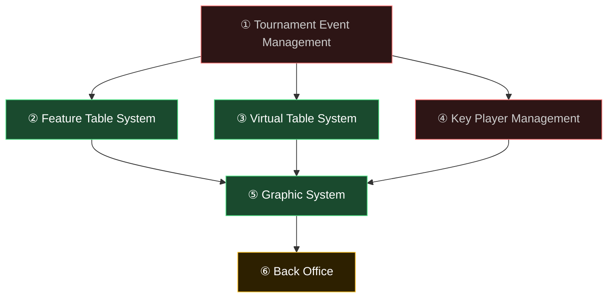
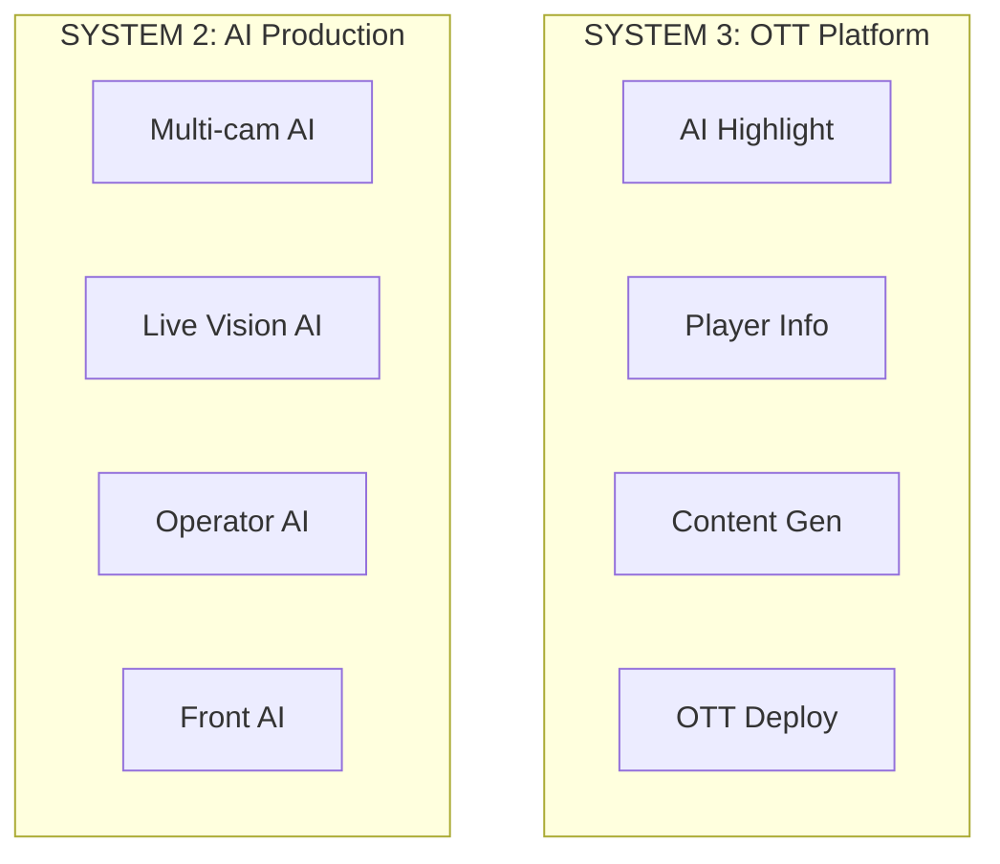
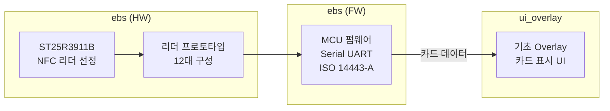
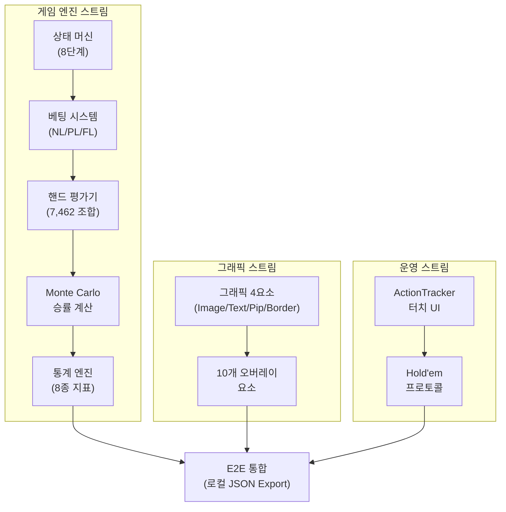
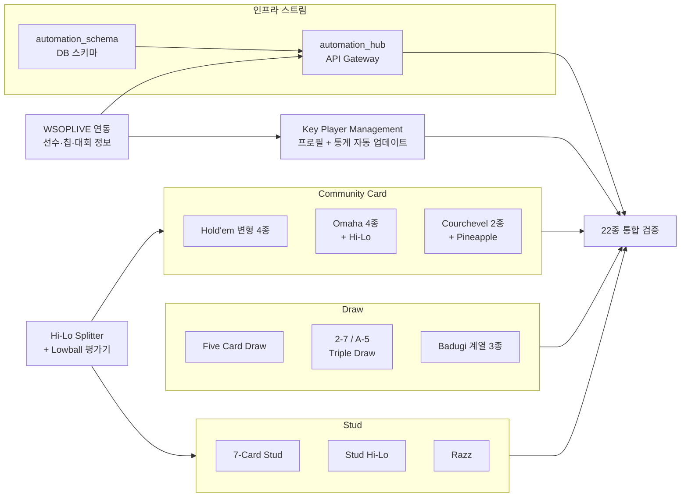
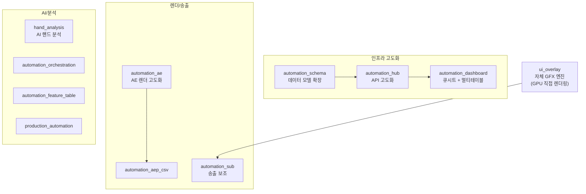
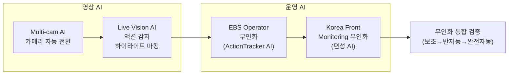
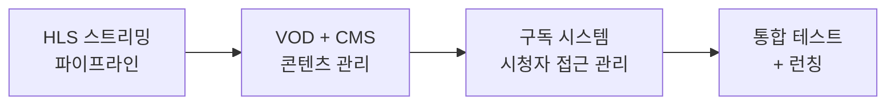

# EBS Ecosystem 킥오프 기획서 2026

> EBS(Event Broadcasting System) — 포커 대회 방송 데이터·기능·자동화 관리 플랫폼 3개년 계획

---

# Part I: 왜 EBS를 만드는가

## S1. 비전

WSOPLIVE는 포커 대회 전체를 관리하는 서비스 플랫폼이다.
이 플랫폼이 만들어낸 변화를 업계는 **WSOP 3.0**이라 부른다.

> **WSOP 3.0이란?** — WSOP 대회 운영이 WSOPLIVE 도입 이전과 이후로 나뉠 만큼, 대회 관리 방식이 근본적으로 바뀌었다는 의미다. 대회 등록, 테이블 배정, 상금 분배 등 모든 운영이 하나의 플랫폼으로 통합된 것이 핵심이다.

EBS(Event Broadcasting System)는 포커 대회 **방송**에 필요한 모든 데이터, 기능, 자동화를 관리하는 인프라 플랫폼이다. WSOPLIVE가 대회 운영을 관리한다면, EBS는 그 대회를 시청자에게 보여주는 방송 시스템 전체를 관리한다.

EBS는 RFID 카드 인식 → 방송 그래픽 엔진 → 화면 오버레이 → 영상 자동 렌더링 → AI 분석 → OTT 배포까지, 방송 워크플로우 전체를 커버한다.

### EBS의 두 가지 목표

EBS가 달성하려는 목표는 두 가지이며, 이 둘은 서로 독립적이다.

- **목표 A — 방송 퀄리티의 비약적 향상**: GFX(방송 그래픽 — 카메라 영상 위에 겹쳐 표시하는 정보 그래픽) 엔진, 실시간 오버레이, AI 분석을 통해 시청 경험을 근본적으로 끌어올린다.
- **목표 B — 크로스보더 무인화 전환**: 현장 ↔ 송출 스튜디오 분업 구조에서 사람이 수동으로 하던 작업을 시스템이 자동으로 처리하는 구조로 전환한다.

> 퀄리티 향상은 자동화의 부산물이 아니며, 무인화는 퀄리티를 위한 전제 조건이 아니다. 각각이 EBS의 존재 이유를 구성한다.

## S2. 핵심 개념 3가지

EBS 전체 아키텍처를 관통하는 세 가지 핵심 개념이다. 각 개념은 Phase 1부터 Phase 6까지 점진적으로 확장된다.

### 1. 실시간 데이터 파이프라인

물리 카드 → 디지털 데이터 → 방송 GFX → 콘텐츠까지 끊김 없는 데이터 경로.
Phase 1에서 RFID→Overlay 최초 연결로 시작하여, Phase 4에서 5-Layer 파이프라인으로 완성되고, Phase 6에서 OTT 변환 파이프라인까지 확장된다.

### 2. 크로스보더 자동화

현장 ↔ 송출 스튜디오 분업 구조에서 수동 작업을 시스템이 대체하는 전환.
매 Phase마다 수동 → 자동 영역이 확장된다. Phase 2에서 로컬 JSON Export로 시작하여, Phase 3에서 인프라 스트림(Hub + Schema)이 구축되고, Phase 5에서 AI 4개 영역 무인화로 정점에 도달한다.

### 3. 단계적 지능화

규칙 기반 → AI 보조 → AI 반자동 → AI 완전 자동 진화.
Phase 1-3에서 규칙 기반 시스템(22종 게임 규칙 엔진)을 완성하고, Phase 4에서 AI가 진입하며(hand_analysis), Phase 5-6에서 AI가 전면 적용된다.

### PokerGFX 올인원 vs EBS 모듈 분리

PokerGFX는 비디오 입력 캡처(Decklink/USB/NDI), DirectX 11 합성, ATEM 스위처 제어, PIP, Dual Canvas, 녹화까지 **단일 프로세스에서 처리하는 올인원 모놀리스**였다. EBS는 이 책임을 분리한다.

| 책임 | PokerGFX (올인원) | EBS Phase 1-2 | EBS Phase 5+ |
|------|:---:|:---:|:---:|
| 비디오 입력 캡처 (카메라) | 내장 (Decklink/USB/NDI) | **OBS / vMix에 위임** | Multi-cam AI |
| 비디오 합성 / 스위칭 | 내장 (DirectX 11 + ATEM) | **OBS / vMix에 위임** | AI Production |
| 그래픽 렌더링 (GFX) | 내장 | **EBS 핵심 — 순수 그래픽 생성에 집중** | EBS 핵심 |
| 녹화 / 송출 | 내장 | **OBS / vMix에 위임** | OTT 파이프라인 |

> **현재 Phase(1-2) 원칙**: EBS 앱은 순수하게 그래픽을 생성하여 출력하는 역할에 집중한다. 비디오 입력, 합성, 스위칭, 녹화는 프로덕션 소프트웨어(OBS/vMix)가 담당한다. 비디오 관련 책임은 Phase 5 이후 AI Production으로 점진적 내재화한다.

### 핵심 개념 × 6-Phase 매핑

| Phase | 실시간 데이터 파이프라인 | 크로스보더 자동화 | 단계적 지능화 |
|:-----:|:---:|:---:|:---:|
| 1 | RFID → Overlay 최초 연결 | — | — |
| 2 | GFX 엔진 내 완전한 데이터 경로 | 로컬 JSON Export 시작 | 규칙 기반 (Hold'em) |
| 3 | WSOPLIVE 외부 데이터 유입 | 인프라 스트림 구축 | 규칙 기반 확장 (22종) |
| 4 | 5-Layer 파이프라인 완성 | 자동 큐시트 + 렌더 파이프라인 | AI 보조 시작 |
| 5 | AI 데이터 파이프라인 확장 | AI 4개 영역 무인화 | AI 반자동 → 완전 자동 |
| 6 | OTT 변환 파이프라인 | OTT 콘텐츠 자동 생성/배포 | AI 완전 자동 (추천 엔진) |

## S5. 6-Phase 로드맵 한눈에

3년간 6단계로 나누어 구축한다. 각 Phase는 이전 Phase의 결과물 위에 쌓인다.

| Phase | 기간 | 핵심 목표 | 시스템 |
|:-----:|------|----------|:------:|
| 1 | 2026 H1 (3~6월) | RFID 카드 인식 → 기초 오버레이 화면 표시 POC | SYSTEM 1 |
| 2 | 2026 H2 (7~12월) | Texas Hold'em 1종 완전한 GFX 엔진 구현 | SYSTEM 1 |
| 3 | 2027 H1 (1~6월) | 22종 게임 확장 + WSOPLIVE 대회 운영 연동 + 인프라 구축 | SYSTEM 1 |
| 4 | 2027 H2 (7~12월) | 11개 프로젝트 고도화 + ui_overlay 자체 엔진 전환 | SYSTEM 1+3 |
| 5 | 2028 H1 (1~6월) | AI 4개 영역 무인화 | SYSTEM 2 |
| 6 | 2028 H2 (7~12월) | wsoptv_ott HLS(웹 스트리밍 — 영상을 잘게 쪼개 인터넷으로 전송하는 표준 방식) 스트리밍 + VOD 배포 | SYSTEM 3 |

### 3-시스템 통합 구조

| 시스템 | 핵심 역할 | Phase | 프로젝트 수 |
|--------|----------|:-----:|:----------:|
| **SYSTEM 1: EBS 핵심 방송 엔진** | 포커 방송 데이터·기능·자동화 관리 | Phase 1-4 | 18개 (기존 전체) |
| **SYSTEM 2: AI Production** | 방송 제작 과정 AI 자동화 | Phase 5 | 4개 (신규) |
| **SYSTEM 3: OTT Platform** | 하이라이트, 선수 정보, 콘텐츠 배포 | Phase 6 | 4개 (신규) |

### Phase별 요약 다이어그램

#### Phase 1: Overlay POC

#### Phase 2: EBS GFX 엔진

#### Phase 3: 22종 게임 + WSOPLIVE + 인프라

#### Phase 4: Live Production Pipeline

#### Phase 5: Production AI

#### Phase 6: OTT 연동

