# EBS UI Design — 앱 레이아웃 & 오버레이 그래픽 설계

> **SSOT**: 이 문서가 EBS UI Design의 유일한 정본입니다. 구버전 EBS-UI-Design.md (v32.0), EBS-UI-Design-v2.prd.md는 삭제되었습니다.

## 1장. 문서 개요

### 1.0 탭 구조 설계

PokerGFX 6탭 → EBS 4탭 변환. Sources 탭 제외, System 탭→Settings 다이얼로그 병합, GFX 1/2/3을 GFX+Display+Rules로 재분리.

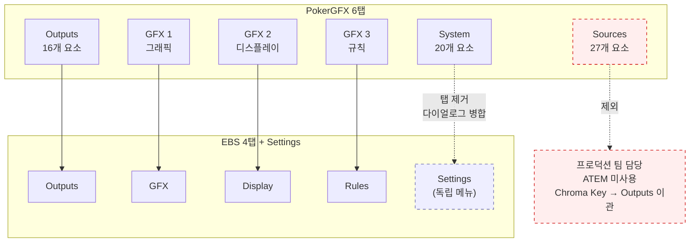

| PokerGFX | EBS | 변경 | 사유 |
|----------|-----|------|------|
| Sources (27) | **제외** | 탭 삭제 | 카메라/NDI/ATEM은 프로덕션 팀 담당, Chroma Key → Outputs 이관 |
| Outputs (16) | Outputs | 유지 | 송출 설정 필수 |
| GFX 1 | GFX | 통합 | 그래픽 설정 단일 탭 |
| GFX 2 | Display | 분리 | 디스플레이 레이아웃 독립 제어 |
| GFX 3 | Rules | 분리 | 게임 규칙 독립 제어 |
| System (20) | **Settings 다이얼로그** | 탭→다이얼로그 | Settings 메뉴에서 접근하는 모달. Y-03/Y-04/AT서브그룹/Y-12.1 제거, Table/Diagnostics/Export 유지 |

### 1.1 이 문서의 목적

EBS 앱이 **어떻게 생겨야 하는지** 정의한다. 기능 카탈로그, 게임 규칙, 시나리오는 선행 문서(pokergfx-prd-v2.md)에 정의되어 있으며, 기술 스택과 아키텍처는 v2.0에서 정의되었으며, 본 문서 §6.7에 통합되었다. 본 문서는 선행 문서와 **중복 없이** 앱 레이아웃과 오버레이 그래픽 배치만 다룬다.

### 1.2 설계 철학

PokerGFX의 기능 세트는 10년 이상 라이브 포커 방송에서 검증된 산업 표준이므로 계승한다. UI 구조와 시각 언어는 현대 방송 소프트웨어 패턴(OBS, vMix, Ross DashBoard)과 포커 오버레이 트렌드(GGPoker, GTO Wizard)를 적용하여 재설계한다.

### 1.3 벤치마크 앱 2선

모든 설계 결정은 아래 2개 프로덕션 검증 앱에서 추출한 패턴에 근거한다. 각 벤치마크는 EBS의 서로 다른 영역을 담당한다: BM-1은 **Console 앱 레이아웃**, BM-2는 **오버레이 시각 언어**를 정의한다.

**BM-1: Ross Video DashBoard** (방송 제어)

> 
>
> *Ross Video DashBoard v9: 단일 인터페이스에서 오디오/비디오 채널을 통합 제어하는 CustomPanel 구조*

> 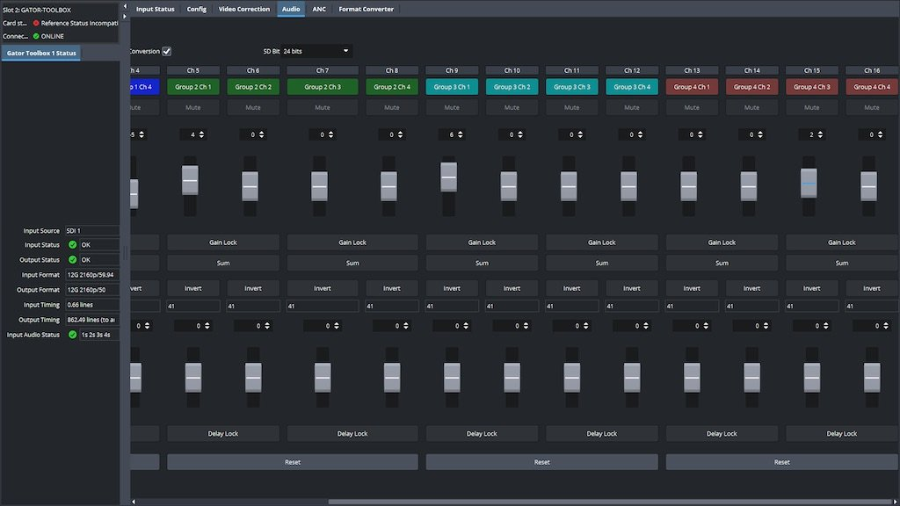
>
> *DashBoard 9.0 Aura 테마: 역할별 레이아웃 전환과 다크 테마 기반 방송 제어 UI*

- 검증: Super Bowl LVI AR 그래픽 운영 (NBC Sports + Van Wagner), SoFi Stadium 상설 시스템, Rogers Sportsnet(토론토), QTV 중계차 운영. NBC/ESPN/Sky Sports 등 전 세계 방송국 표준 제어 소프트웨어. **라이브 스포츠 방송 제어의 사실상 표준**.
- 기술 상세: v9.16 (2026.01), **80+ openGear 파트너** 네이티브 지원, CustomPanel Visual Logic Editor (코드 없이 디바이스 제어 워크플로우 구성), RBAC(Role-Based Access Control)로 운영자별 패널 접근 권한 관리, RossTalk/VDCP/OGPJSON/HTTP(S)/TCP/UDP/MIDI 프로토콜 지원.
- 추출 패턴: CustomPanel 빌더 (운영자가 패널 직접 구성), 단일 인터페이스 철학 (탭 분리 X), 역할별 레이아웃 전환, RBAC 접근 제어
- EBS 적용: Top-Preview 레이아웃 (상단 전폭 프리뷰 + 하단 탭 컨트롤), 역할별 UI 커스터마이징

#### BM-1 보조 레퍼런스: Top-Preview 레이아웃 수렴 현상

EBS Console의 Top-Preview 레이아웃은 Ross DashBoard 단독 참조가 아니라, 2024~2026년 기준 **주요 방송 제어 소프트웨어 전부**가 동일 패턴으로 수렴한 업계 표준이다.

> 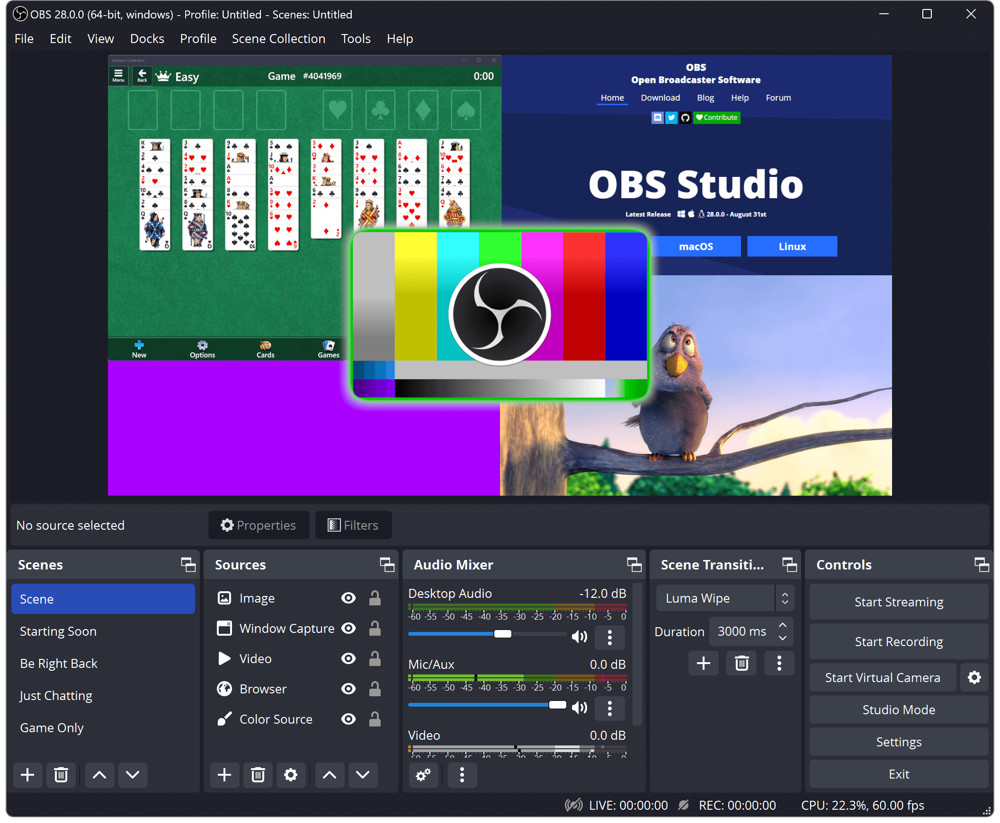
>
> *OBS Studio v28: 상단에 전폭 프리뷰, 하단에 Scenes/Sources/Audio Mixer/Transitions/Controls 5개 도크. 가장 널리 사용되는 오픈소스 방송 소프트웨어.*

> 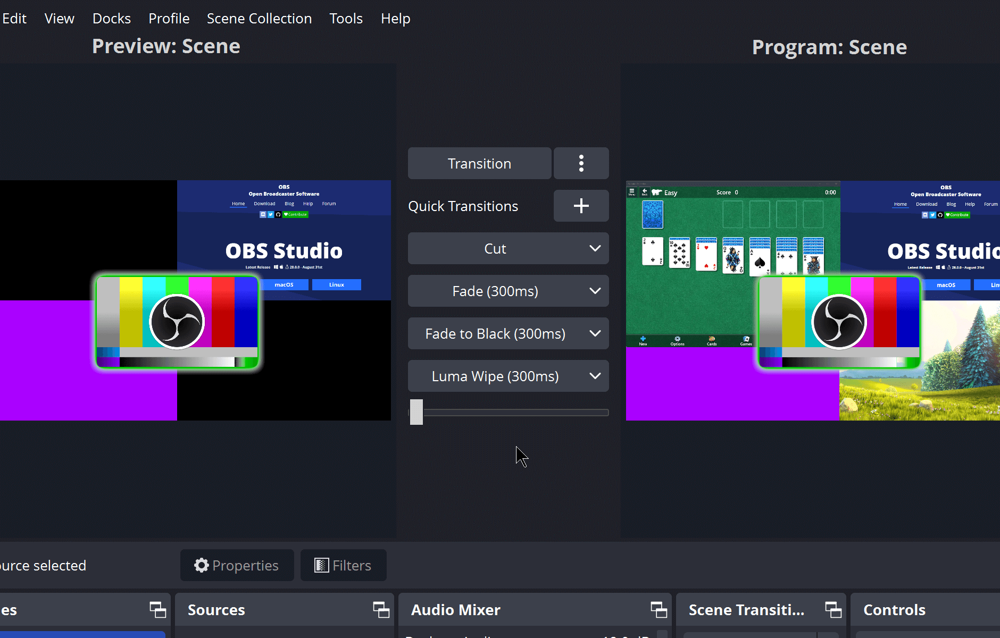
>
> *OBS Studio Mode: 좌측 Preview + 우측 Program + 중앙 Transition 컨트롤. 방송 스위처 표준 패턴.*

> 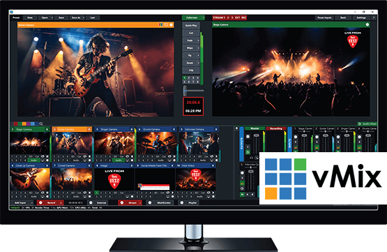
>
> *vMix: 좌측 Preview(주황 타이틀바) + 우측 Output(초록 타이틀바) + 하단 Input Bar + 색상 코드 탭 분류. 프로 라이브 프로덕션 소프트웨어.*

> 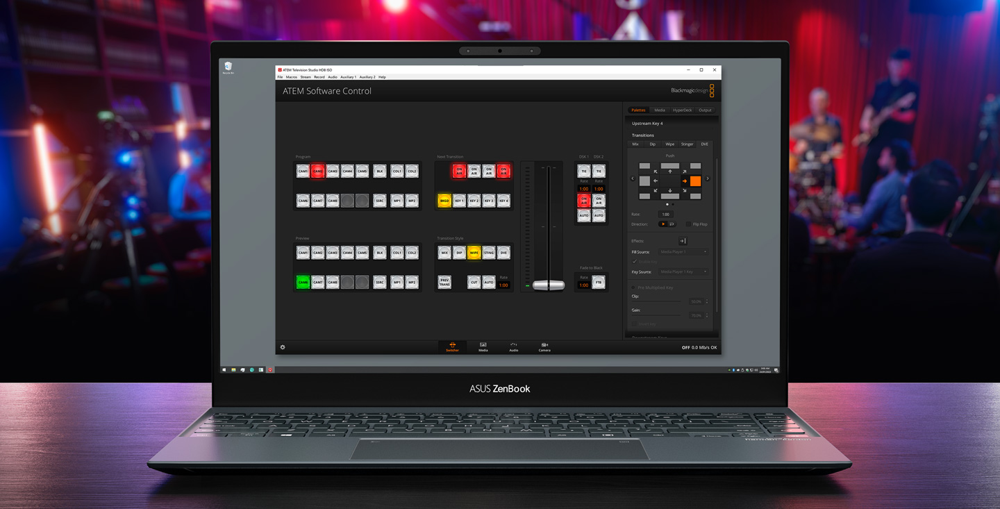
>
> *ATEM Software Control: Program/Preview 버스 버튼 + Transition Style + 우측 Palettes(설정 패널) + 하단 4탭(Switcher/Media/Audio/Camera). 하드웨어 스위처의 소프트웨어 미러.*

| 소프트웨어 | 레이아웃 패턴 | 프리뷰 위치 | 컨트롤 위치 | EBS 차용 요소 |
|-----------|:----------:|:---------:|:---------:|------------|
| **OBS Studio** | Top-Preview + Bottom-Docks | 상단 전폭 | 하단 5도크 | 도크 구조, 씬/소스 관리 |
| **vMix** | Dual-Preview + Bottom-Input | 상단 좌우 | 하단 Input Bar | 듀얼 프리뷰 모드, 색상 코드 탭 |
| **ATEM Software** | Bus-Style + Right-Palette | 상단 버스 | 우측 팔레트 + 하단 탭 | 탭 기반 설정 분리, 팔레트 UI |
| **Ross DashBoard** | CustomPanel (자유 배치) | 운영자 설정 | 운영자 설정 | 역할별 레이아웃, RBAC |

> **결론**: 4개 소프트웨어 모두 "프리뷰=상단, 컨트롤=하단/측면"으로 수렴. EBS는 이 패턴을 따르되, **하단 전폭 탭 패널(가변 높이, 스크롤 금지)**로 4탭 설정을 통합한다.

**BM-2: GGPoker + GTO Wizard + WSOP 방송** (포커 오버레이 혁신)

> 
>
> *GGPoker 방송 오버레이: Glassmorphism 카드 UI, 네온/글로우 이벤트 강조, Bold 타이포 핵심 수치 강조*

> 
>
> *GTO Wizard 실시간 분석 오버레이: 확률/Equity 표시, 상태별 동적 UI 전환*

> 
>
> *WSOP Paradise 2025: GGPoker 플랫폼 기반 라이브 방송. 하단 플레이어 스트립 + 보드 카드 + 팟 표시. PokerGFX와 동일한 RFID 시스템을 사용하되 현대적 시각 언어 적용.*

### 1.4 설계 패턴 ↔ 벤치마크 매핑

| 설계 패턴 | 벤치마크 출처 | EBS 적용 |
|-----------|:------------:|----------|
| Top-Preview 레이아웃 | OBS/ATEM/vMix/Ross | 상단 전폭 프리뷰 + 하단 탭 컨트롤 (업계 수렴 패턴) |
| 적응형 정보 밀도 | BM-2 Smart HUD | AT/오버레이에서 게임 진행에 따라 정보량 자동 조절 (Console은 수동 탭 전환) |
| Glassmorphism 오버레이 | BM-2 GGPoker | 반투명 프로스트 카드/팟/확률 패널 |
| Bold 타이포 + 네온 | BM-2 GGPoker | 핵심 수치 강조, 올인 이벤트 발광 효과 |
| 듀얼 디스플레이 마스킹 | BM-2 GGPoker Streamer Mode | 방송 딜레이 중 홀 카드 자동 마스킹 |
| LCH 색공간 테마 | BM-2 + 업계 트렌드 | 3변수(base, accent, contrast) 커스텀 테마 |

### 1.5 불필요 기능 제거

PokerGFX 247개 요소 중 **54개 비활성화** (whitepaper 분석):

| 범주 | 수량 | 사유 |
|------|:----:|------|
| 카메라/녹화/연출 | 19 | 프로덕션 팀(스위처/카메라)이 담당 |
| Delay/Secure Mode | 9 | EBS 송출 딜레이 장비로 대체 |
| 외부 연동 기기 | 7 | Stream Deck, MultiGFX, ATEM 미사용 |
| Twitch 연동 | 5 | Twitch 스트리밍 미운영 |
| 기타 | 14 | 태그, 라이선스, 시스템, 레거시 UI |

## 2장. EBS Console

PokerGFX의 776x660px WinForms 6탭 구조를 현대 방송 소프트웨어 패턴으로 재설계한다.

### 핵심 혁신

| PokerGFX  | EBS v3.0  | 벤치마크 |
|-------------------|-----------------|:--------:|
| 6탭 WinForms (Sources, Outputs, GFX 1/2/3, System) | Top-Preview 레이아웃 (상단 전폭 프리뷰 + 하단 탭 컨트롤) | OBS/ATEM/vMix |
| 고정 컨트롤 패널 | 탭 기반 설정 패널 (4탭 구조) + Settings 다이얼로그 | OBS |
| 메뉴 → 탭 → 서브그룹 탐색 | 키보드 단축키 (Ctrl+1~4) 즉시 접근 | OBS/vMix |

**스크롤 정책**: Tab Content는 기본적으로 스크롤하지 않는다. 모든 컨트롤이 한 번에 표시된다. **유일한 예외**: 전체 가용 높이 < 568px (고정 100px + Preview 최소 300px + Tab Content 최소 168px)일 때만 Tab Content에 수직 스크롤을 허용한다.

> 
>
> 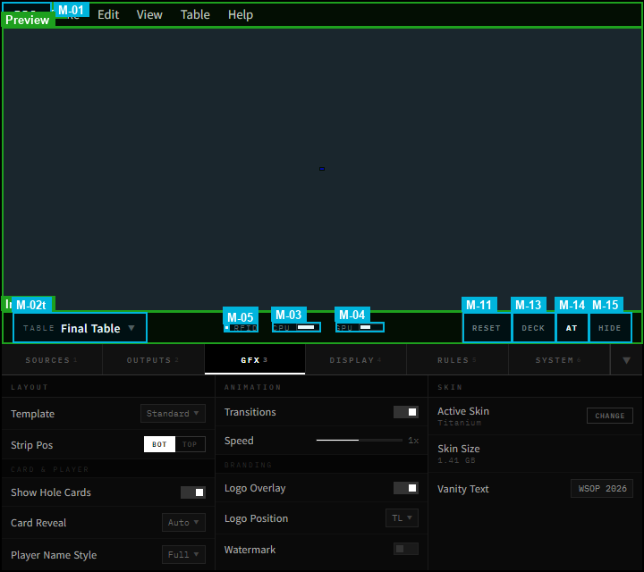
>
> *EBS Console v4.0: Menu Bar(28px) + Preview(가변, 16:9) + Info Bar(36px) + Tab Bar(36px) + Tab Content(가변, 스크롤 금지). 업계 표준(OBS Studio, vMix, TriCaster, ATEM, Wirecast) 기반. 4탭 구조(Outputs/GFX/Display/Rules) + Settings 메뉴(독립 메뉴).*


#### 운영 워크플로우

**방송 전 (Setup)**:
1. Settings > Preferences에서 테이블 설정 확인, Info Bar RFID 상태 ● Green 확인, Chroma Key 설정
2. Outputs 탭에서 출력 해상도(1080p/4K), Fill & Key 설정
3. GFX 탭에서 레이아웃(Board Position, Player Layout), 스킨, 브랜딩 설정
4. Register Deck으로 새 덱 등록 → 카드 RFID 매핑 확인
5. Launch AT로 Action Tracker 실행

**긴급 상황**:
- 오버레이 오류 → Hide GFX (즉시 숨김) → 문제 해결 → Hide GFX 토글 복원
- 카드 인식 오류 → Reset Hand → 현재 핸드 전체 초기화
- AT 연결 끊김 → Launch AT로 재실행, 자동 재연결 시도

### 2.2 Menu Bar (28px)

표준 데스크톱 앱 메뉴바. 좌측에 EBS 로고(M-01), 이어서 File/View/Tools/Help 메뉴.

```
[EBS] File  View  Tools  Settings  Help
```

| 메뉴 | 항목 |
|------|------|
| File | Exit |
| View | System Log |
| Tools | Launch Action Tracker, Save GFX Configuration, Load GFX Configuration |
| Settings | Preferences (M-12) |
| Help | Build Guide, Reader Module Upgrade, Privacy Policy, Terms & Conditions, Contact us, Check for Updates, Diagnostics, Logging, About... |

#### EBS Logo (M-01)

| 속성 | 값 |
|------|-----|
| 단일 클릭 | About 다이얼로그 (모달 팝업, 중앙 정렬, 반투명 배경 dim) |
| 다이얼로그 크기 | 400×300px 고정 |
| 다이얼로그 내용 | 앱 이름, 버전, 빌드 해시, 라이선스, 저작권, 진단 로그 내보내기 버튼 |
| 닫기 방식 | Escape / X 버튼 / 모달 외부 클릭 |
| 더블클릭 | DevTools 콘솔 토글 (`Ctrl+Shift+I` 동등) |

#### Settings / Preferences (M-12)

운영: Menu Bar의 **Settings > Preferences**로 접근한다. 앱 환경 설정(테마, 언어, 단축키, 자동 저장 간격, 로그 레벨)과 **시스템 설정(Table, Diagnostics, Export)**을 통합 관리한다. 기존 System 탭의 핵심 기능(Table Name/Password, Table Diagnostics, System Log, Export Folder)이 이 다이얼로그로 이동했다. Tab Content의 설정은 오버레이 표시 제어 전용이고, M-12는 앱 자체 환경 + 시스템 인프라 설정이다. 상세는 §2.10 참조.

### 2.2b Info Bar (36px)

Preview Area와 Tab Bar 사이에 위치한다. 테이블 식별, 상태 인디케이터, Quick Actions를 제공한다.

```
[Table: Final Table] ── [RFID ●][CPU ▐▐▐][GPU ▐▐] ── [🔒][Skin][Reset][Deck][AT][Hide]
```

| 영역 | 내용 |
|------|------|
| 좌측 — 식별 | 테이블 이름 읽기 전용 라벨 (현재 테이블 표시) |
| 중앙 — 상태 인디케이터 | RFID 연결 상태 (●), CPU 사용률 바 (▐▐▐), GPU 사용률 바 (▐▐) |
| 우측 — Quick Actions | Load Skin, Reset Hand, Register Deck, Launch AT, Hide GFX — 항상 접근 가능한 핵심 버튼 5개 |

#### Info Bar 요소 상세 (10개)

**좌측 — 식별 영역**

**Table Label (M-02t)**

운영: 현재 테이블 이름을 표시하는 읽기 전용 라벨. Settings 다이얼로그의 Table Name(1)과 동기화된다. 1 PC = 1 테이블 원칙에 따라 드롭다운이나 테이블 전환 기능은 없다.

**중앙 — 상태 인디케이터**

**RFID Status (M-05)**

운영: RFID 리더의 현재 상태를 **색상 + 아이콘 형태 + 텍스트 레이블** 3중 표시로 나타낸다 (WCAG 1.4.1 — 색상만으로 정보를 전달하지 않는다).

| 색상 | 아이콘 | 텍스트 | 상태 | 원인 | 운영자 대응 |
|------|:------:|--------|------|------|------------|
| 🔵 Blue | ● (실선 원) | OK | 정상 연결 | 리더 연결 + 안테나 정상 | 없음 |
| 🟡 Yellow | ◐ (반원) | READ | 카드 읽기 중 | RFID 태그 감지, 데이터 수신 중 | 없음 (자동 전환) |
| 🟠 Orange | △ (삼각) | WEAK | 신호 약함 | 안테나 간섭 또는 거리 초과 | 안테나 위치 조정 |
| 🔴 Red | ✕ (엑스) | OFF | 연결 끊김 | USB 분리, 리더 전원 OFF | USB 재연결, 리더 전원 확인 |
| ⚪ Gray | ○ (빈 원) | INIT | 미초기화/비활성 | 앱 시작 직후 또는 수동 비활성화 | 자동 연결 대기 (5초) / Settings에서 재활성화 |

> **색상 팔레트**: 파랑/주황 기반 팔레트로 적록색맹(Protanopia/Deuteranopia) 사용자도 구분 가능. 텍스트 대비율 4.5:1 이상 (WCAG 1.4.3).

**RFID Connection Icon (M-06)**

운영: M-05 보조 아이콘. 연결(링크 아이콘) / 미연결(끊긴 링크 아이콘) 2상태만 표시한다. M-05의 상태가 OFF 또는 INIT일 때 미연결 상태가 된다.

**CPU Indicator (M-03)**

운영: CPU 사용률을 수평 바 그래프로 표시한다. 50% 이하 녹색, 50~80% 황색, 80% 이상 적색. 80% 이상 지속 시 오버레이 렌더링 프레임 드롭이 발생할 수 있다. 대응: 불필요한 백그라운드 앱 종료, 해상도/프레임레이트 하향 조정.

**GPU Indicator (M-04)**

운영: GPU 사용률을 수평 바 그래프로 표시한다. M-03과 동일한 색상 임계값 적용. GPU는 오버레이 렌더링에 직접 사용되므로 높은 사용률은 프레임 드롭의 직접적 원인이다.

**우측 — Quick Actions**

**Load Skin (M-16)**

운영: 스킨 편집기를 실행한다. 현재 사용 중인 Skin을 교체하거나 새 Skin을 로드할 수 있다. GFX 탭의 시각 설정과 독립적으로 운영되므로 Info Bar에 배치하여 어느 탭에서든 접근 가능하게 한다.

**Lock Toggle (M-07)**

운영: 설정 잠금/해제를 토글한다. 잠금 상태에서는 Tab Content의 모든 설정 컨트롤이 비활성화(회색 처리)되어 실수로 설정을 변경하는 것을 방지한다. 방송 중 운영자가 의도치 않게 설정을 건드리는 사고를 예방하기 위한 안전장치다. **예외**: Info Bar의 Quick Actions (Load Skin, Reset Hand, Register Deck, Launch AT, Hide GFX)는 Lock 상태에서도 항상 활성화된다. 긴급 조작은 Lock에 의해 차단되지 않는다.

**Reset Hand (M-11)**

운영: 현재 핸드를 긴급 초기화한다. 모든 카드 인식 데이터, 플레이어 액션, 팟 정보를 클리어하고 핸드 시작 전 상태로 되돌린다. UNDO(Z키)로 복구할 수 없는 심각한 오류 발생 시 최후의 수단으로 사용한다. 확인 다이얼로그가 표시된다 ("정말 현재 핸드를 초기화하시겠습니까?").

**Register Deck (M-13)**

운영: 새 카드 덱의 RFID 등록 프로세스를 시작한다. 52장(+ 조커 2장) 카드를 순서대로 RFID 리더에 태그하여 UID를 매핑한다. 덱 교체 시(새 덱 개봉) 반드시 실행해야 한다. 등록 중에는 Preview에 등록 진행 오버레이가 표시된다.

**Launch AT (M-14)**

운영: Action Tracker를 실행하거나, 이미 실행 중이면 AT 윈도우로 포커스를 전환한다. AT가 실행 중일 때 버튼에 녹색 인디케이터가 표시된다. AT 미실행 시 회색.

**Hide GFX (M-15)**

운영: 모든 오버레이 그래픽을 즉시 숨기거나 복원한다. 방송 중 오버레이에 오류가 표시될 때 긴급으로 숨기는 용도다. **되돌릴 수 있는 유일한 긴급 조작**이다 (Reset Hand는 비가역적). 숨김 상태에서 다시 클릭하면 오버레이가 즉시 복원된다.

### 2.3 Preview Area (가변)

라이브 오버레이 미리보기. 전체 폭을 사용하며, 16:9 비율을 유지하고 남는 좌우 공간은 배경색(#1a1a2e)으로 채운다.

| 속성 | 값 |
|------|-----|
| 너비 | 전폭(100vw). 실제 16:9 영역은 height 기준으로 자동 계산 |
| 높이 | 가변 (1fr — Menu Bar/Info Bar/Tab Bar/Tab Content 제외한 나머지) |
| 종횡비 | 16:9 (고정). CSS `aspect-ratio: 16/9` |
| 배경 | 프리뷰 영역: Chroma-key Blue (#0000FF). 좌우 여백: #1a1a2e |
| 렌더링 | Flutter/Rive 오버레이 엔진 (실시간 합성) |
| 인터랙션 | 오버레이 요소 클릭 → 하단 탭에서 해당 설정으로 자동 전환 + 포커스 |
| 크기 (1920px) | 실제 16:9 영역: 고정 영역(28+36+36=100px) + Tab Content(가변 ~200px) 제외 = Preview ~780px → 16:9: 1387×780 |
| 크기 (1024px) | 실제 16:9 영역: 고정 영역 100px + Tab Content(가변 ~200px) 제외 = Preview ~468px → 16:9: 832×468 |

#### 운영 설명

Preview Area는 시청자가 보는 방송 화면과 동일한 오버레이를 실시간으로 표시한다. 운영자는 GFX 탭에서 설정을 변경하면 Preview에서 즉시 결과를 확인할 수 있다. 레이아웃(Board Position, Player Layout), 애니메이션(Transition In/Out), 스킨 변경 등 모든 시각적 설정이 Preview에 실시간 반영된다.

**클릭 인터랙션**: Preview의 오버레이 요소를 클릭하면 하단 Tab Content에서 해당 설정으로 자동 전환된다. 이를 통해 운영자는 "보이는 것을 클릭하면 설정이 열리는" 직관적 워크플로우를 사용할 수 있다.

| 클릭 대상 (Preview) | 전환 탭 | 포커스 대상 | element-catalog |
|---------------------|---------|------------|:---------------:|
| Player Graphic | GFX | Card & Player 서브그룹 | 6~8 |
| Board Graphic | GFX | Layout 서브그룹 | 1 |
| Blinds Graphic | Display | Blinds 서브그룹 | 1~16 |
| Leaderboard | GFX | Layout 서브그룹 | 1.5 |

### 2.4 Tab Bar + Tab Content

하단 영역 전체를 두 레이어로 구성한다. 기존 우측 320px 세로 스택 → 1920px 전폭 가로 다중 컬럼으로 재배치.

**Tab Bar (36px)**:

```
[Outputs] [GFX] [Display] [Rules]                                              [▼ 패널 최소화]
```

**Tab Content (가변)**: 전폭 활용. 스크롤 정책은 §2.1 참조. Console은 **오버레이 표시 방식**만 제어하며, 게임 데이터(블라인드 값, 플레이어, 스택)는 AT에서 입력한다.

**서브그룹 접기 정책**: 탭 내 서브그룹은 아코디언(접기/펼치기) 패턴을 지원한다. "기본 접힘" 서브그룹은 클릭하여 펼치며, 접힘 상태에서는 헤더와 요소 수만 표시된다. 현재 기본 접힘 서브그룹: Rules 탭 Equity & Statistics, Rules 탭 Leaderboard & Strip.

> 각 탭의 상세 기능은 §2.7(Outputs), §2.8(GFX), §2.8b(Display), §2.9(Rules)를 참조한다.

> System 탭은 v6.1.0에서 제거되었다. 테이블 설정, 진단, 내보내기 기능은 Settings 메뉴의 Preferences 다이얼로그(M-12)로 이동. §2.10 참조.

**패널 크기 (해상도별)**:

| 해상도 | Menu Bar | Preview | Info Bar | Tab Bar | Tab Content |
|--------|:-------:|:-------:|:--------:|:-------:|:-----------:|
| 1920×1080 | 1920×28 | 1920×780 (16:9: 1387×780) | 1920×36 | 1920×36 | 1920×~200 (탭별 가변) |
| 1024×768 | 1024×28 | 1024×468 (16:9: 832×468) | 1024×36 | 1024×36 | 1024×~200 (탭별 가변) |

#### 운영 설명

Tab Bar의 4개 탭은 Console의 오버레이 표시 설정을 기능별로 분류한다. 시스템 설정은 Settings 메뉴의 Preferences 다이얼로그에서 관리한다. 각 탭의 역할:

| 탭 | 역할 요약 | 방송 전/중 |
|----|----------|:----------:|
| Outputs | 출력 해상도, 프레임레이트, Live/Delay 파이프라인, Fill & Key | 방송 전 설정 |
| GFX | 오버레이 시각 설정 — 레이아웃, 카드/플레이어, 애니메이션 | 방송 전 + 방송 중 조정 |
| Display | 수치 표시 형식 — 블라인드, 통화, 영역별 정밀도, BB 모드 | 방송 전 설정 |
| Rules | 게임 규칙 — Bomb Pot, Straddle, 플레이어 정렬, 위닝 핸드 | 방송 전 설정 |

**패널 최소화**: Tab Bar 우측의 `[▼]` 버튼으로 Tab Content를 접을 수 있다. 최소화 시 Tab Bar(36px)만 남고 Preview Area가 확장된다. 단축키: `Ctrl+M`.

**Lock 영향**: Lock Toggle(M-07) 활성화 시 Tab Content의 모든 컨트롤이 비활성화된다. 탭 전환 자체는 Lock 상태에서도 가능하다 (읽기 전용 확인 용도).

### 2.5 상태 바 (제거)

상태 인디케이터가 Info Bar로 이동했으므로 별도 상태 바는 제거한다.

| 항목 | 이전 위치 | 이동 위치 |
|------|----------|---------|
| RFID 상태 | 하단 상태 바 | Info Bar 중앙 (RFID ●) |
| CPU/GPU 사용률 | 하단 상태 바 | Info Bar 중앙 (CPU ▐▐▐ / GPU ▐▐) |
| 핸드 번호 | 하단 상태 바 | 제거 (AT에서 관리) |
| 딜레이 카운터 | 하단 상태 바 | 제거 (송출 딜레이 장비에서 관리) |
| 단축키 가이드 | 하단 상태 바 | 제거 (키보드 단축키로 대체) |

### 2.7 Outputs 탭 기능 상세

> 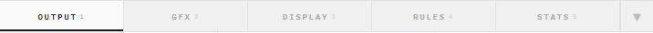

Outputs 탭은 방송 출력 파이프라인을 구성한다. 3-Column 그리드 내에 **Resolution**, **Live Pipeline**, **Output Mode** 서브그룹을 배치한다.

##### 1. 레이아웃

> 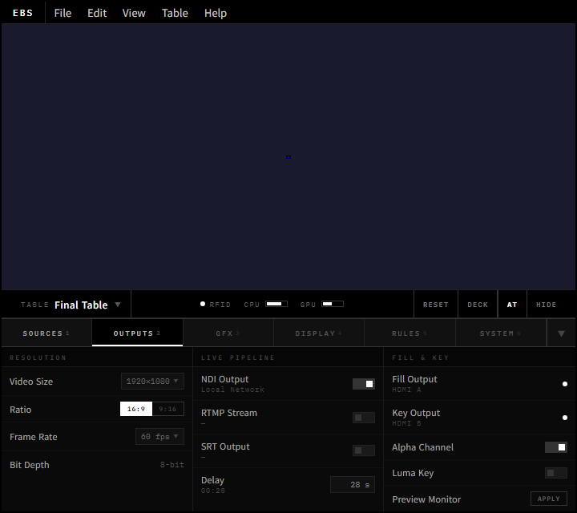
>
> *Outputs 탭 — 전폭, 가변 높이, 3-Column 그리드: Resolution | Live Pipeline | Output Mode*

##### 2. 요소 매핑

> 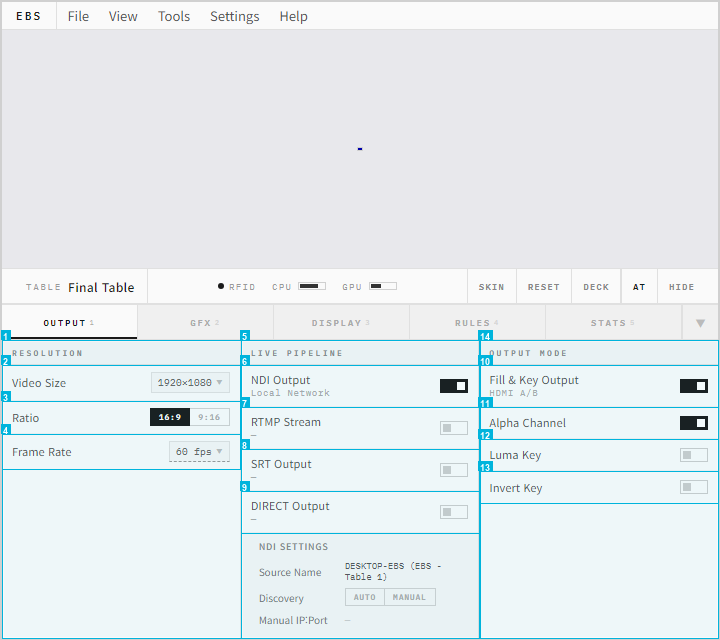
>
> *번호 = annotation 박스. 각 요소의 상세는 아래 테이블 참조.*

#### Resolution (2~4)

| ID | 요소 | 기능 | 기본값 | 유효 범위 |
|:--:|------|------|--------|----------|
| 2 | Video Size | 출력 해상도 선택 | 1080p | 1080p / 4K |
| 3 | 9:16 Vertical | 세로 모드 토글 (모바일 스트리밍용) | OFF | — |
| 4 | Frame Rate | 프레임레이트 선택 | 60fps | 24 / 25 / 30 / 50 / 60fps |

**동작**: Video Size 변경 시 Preview Area와 오버레이 렌더링 캔버스가 동시에 재초기화된다. 재초기화 중 Preview는 일시 블랙아웃(약 1초)되므로 방송 중 변경은 권장하지 않는다. 9:16 Vertical 활성화 시 전체 오버레이 좌표계가 세로 모드로 전환된다. Frame Rate는 24/25/30/50/60fps 중 선택하며, 변경 시 오버레이 렌더링 파이프라인이 재초기화된다. 24/25fps는 필름/PAL 환경, 50fps는 PAL 인터레이스, 30/60fps는 NTSC/디지털 방송 환경에 대응한다.

#### Live Pipeline (6~8, 5.1)

| ID | 요소 | 기능 | 기본값 | 유효 범위 |
|:--:|------|------|--------|----------|
| 6~8 | Live Video/Audio/Device | Live 출력 3개 드롭다운 (DeckLink/NDI 채널 선택) | None | 시스템 감지 DeckLink/NDI 채널 |
| 5.1 | Live Key & Fill | Fill & Key 듀얼 출력 활성화 (외부 키잉 장치 선택 시) | OFF | — |

**동작**: Live Pipeline은 EBS Server가 생성한 오버레이를 NDI 또는 DeckLink 포트로 출력하는 경로다. 5.1 활성화 시 Fill 신호(오버레이 합성 영상)와 Key 신호(알파 마스크)가 분리 출력되어 외부 스위처에서 실시간 키잉이 가능하다.

> **[DROP]** Delay Pipeline — Secure Delay는 송출 딜레이 장비에서 처리. EBS 자체 딜레이 버퍼는 구현하지 않는다. *(PokerGFX: SV-007~SV-012)*
>
> **[DROP]** Streaming / Twitch — 방송 플랫폼 연동은 OBS/외부 도구에서 처리. *(PokerGFX: SV-011)*
>
> **[DROP]** Recording / Split Recording — 녹화/분할 녹화는 방송 운영 범위 외. *(PokerGFX: SV-015, SV-030)*

#### Output Mode (15, S-07, S-08, 10~13)

출력 방식을 **배타적으로** 선택한다. Chroma Key와 Fill & Key는 동시 활성화할 수 없다 — UI 레벨에서 강제한다.

| ID | 요소 | 기능 | 기본값 | 유효 범위 |
|:--:|------|------|--------|----------|
| 15 | Output Mode Selector | 배타적 출력 모드 선택 | Chroma Key | RadioGroup: Chroma Key / Fill & Key |

**Chroma Key 모드** (15 = Chroma Key 선택 시 표시):

| ID | 요소 | 기능 | 기본값 | 유효 범위 |
|:--:|------|------|--------|----------|
| S-07 | Chroma Enable | 크로마키 활성화 | ON (모드 선택 시 자동 ON) | — |
| S-08 | Background Colour | 크로마키 배경색 | #0000FF (Blue) | ColorPicker RGB |

**Fill & Key 모드** (15 = Fill & Key 선택 시 표시):

| ID | 요소 | 기능 | 기본값 | 유효 범위 |
|:--:|------|------|--------|----------|
| 10 | Fill & Key Output | Fill(영상) + Key(마스크) 듀얼 포트 동시 출력 활성화 | OFF | — |
| 11 | Alpha Channel (Linear) | 소스의 오리지널 Alpha 정보를 사용하여 투명도 제공. 선택 시 12 자동 비활성화 | OFF | RadioGroup (11 ↔ 12) |
| 12 | Luma Key (Brightness) | 소스의 밝기(Luminance)를 연산하여 Key 신호 생성 (Alpha 없는 소스용). 선택 시 11 자동 비활성화 | OFF | RadioGroup (11 ↔ 12) |
| 13 | Invert Key | Key 신호 반전. 11 또는 12가 선택된 상태에서만 활성화 가능 | OFF | 조건부 (11 or 12 = ON) |

**동작**: Fill & Key Output(10)을 활성화하면 Decklink 물리 포트로 Fill(영상)과 Key(마스크) 신호가 동시에 분리 출력된다. Alpha Channel(11)과 Luma Key(12)는 **상호 배타적 RadioGroup**으로, 한쪽 선택 시 다른 쪽이 자동 비활성화된다. Invert Key(13)는 10이 활성화되고 11 또는 12 중 하나가 선택된 상태에서만 선택 가능하다 — 둘 다 비활성이면 13도 disabled 처리된다.

**모드 전환 동작**: Output Mode Selector(15)는 RadioGroup으로, Chroma Key 또는 Fill & Key 중 하나만 선택 가능하다. 모드 전환 시:
- 전환 확인 다이얼로그가 표시된다: "현재 {모드A} 설정이 해제됩니다. 전환하시겠습니까?"
- 이전 모드의 설정값은 보존된다 (재선택 시 복원 가능)
- 비활성 모드의 UI는 숨김 처리된다 (disabled가 아닌 hidden)
- Live Pipeline(6~8, 5.1)은 모드와 독립적으로 항상 표시된다

### 2.8 GFX 탭 기능 상세

> 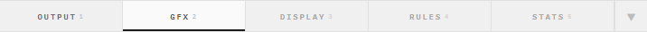

GFX 탭은 오버레이의 시각적 설정을 관리하는 핵심 탭이다. 3개 서브그룹을 3-Column으로 배치한다: **Layout → Card & Player → Animation**. Skin Editor는 Info Bar의 Load Skin 버튼(M-16)으로 이동했다. 스크롤 정책은 §2.1 참조 — 3-Column 밀집 배치로 모든 설정이 한 번에 표시된다. Numbers와 Rules는 각각 Display 탭(§2.8b)과 Rules 탭(§2.9)으로 분리되었다.

##### 1. 레이아웃

> 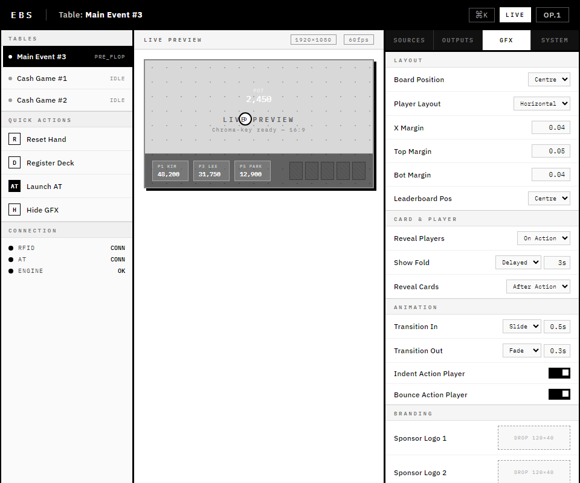
>
> *GFX 탭 — 전폭, 가변 높이, 3-Column 그리드: Layout | Card & Player | Animation*

##### 2. 요소 매핑

> 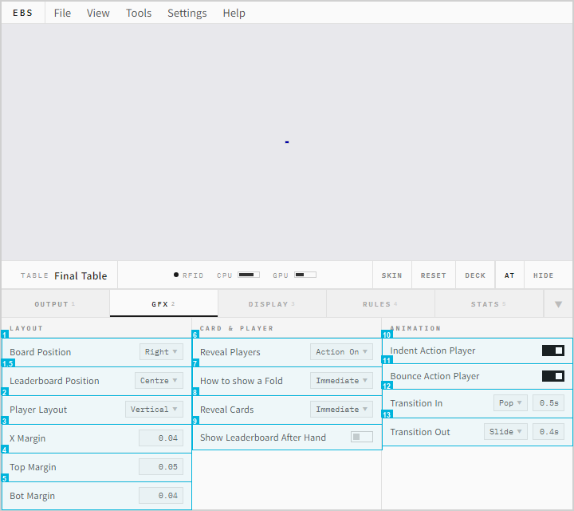
>
> *번호 = annotation 박스. 각 요소의 상세는 아래 테이블 참조.*

##### 3. 요소 설명

#### Layout 서브그룹 (1~1.5, 2)

오버레이의 전체 배치를 결정한다. 4장 오버레이 설계의 9-Grid 시스템과 연동된다.

| ID | 요소 | 기능 | 유효 범위 |
|:--:|------|------|----------|
| 1 | Board Position | 보드 카드 위치 | Left / Right / Centre / Top |
| 2 | Player Layout | 플레이어 배치 모드 | Horizontal / Vert-Bot-Spill / Vert-Bot-Fit / Vert-Top-Spill / Vert-Top-Fit |
| 3 | X Margin | 좌우 여백 (정규화 좌표) | 0.0~1.0 (기본 0.04) |
| 4 | Top Margin | 상단 여백 | 0.0~1.0 (기본 0.05) |
| 5 | Bot Margin | 하단 여백 | 0.0~1.0 (기본 0.04) |
| 1.5 | Leaderboard Position | 리더보드 위치 | Centre / Left / Right |

**동작**: Layout 값을 변경하면 Preview Area의 오버레이가 즉시 재배치된다. Board Position과 Player Layout의 조합이 4장의 배치 프리셋(A~D)에 해당한다. 마진 조정은 오버레이가 방송 Safe Area 내에 머물도록 보장한다.

#### Card & Player 서브그룹 (6, 7, 8, 9)

카드 공개 시점과 폴드 표시 방식을 결정한다. 방송 연출 스타일에 직접적으로 영향을 미친다.

| ID | 요소 | 기능 | 유효 범위 |
|:--:|------|------|----------|
| 6 | Reveal Players | 홀카드 공개 시점 | Immediate / On Action / After Bet / On Action + Next |
| 7 | How to Show Fold | 폴드 표시 방식 + 지연 시간 | Immediate / Delayed (초 입력) |
| 8 | Reveal Cards | 카드 공개 연출 | Immediate / After Action / End of Hand / Showdown Cash / Showdown Tourney / Never |
| 9 | Show Leaderboard | 핸드 후 리더보드 자동 표시 + 설정 | Checkbox + Settings |

**동작**: Reveal Players가 "Immediate"이면 홀카드가 딜 즉시 시청자에게 공개된다 (Live 모드). "On Action"이면 해당 플레이어가 액션을 취할 때 공개된다. How to Show Fold의 "Immediate"는 기본값으로, 폴드 플레이어 Graphic을 즉시 페이드아웃 제거한다 (4장 §4.4 참조). "Delayed"로 설정하면 지정 초만큼 폴드 표시를 유지한 후 제거한다.

#### Animation 서브그룹 (12, 13, 10, 11)

오버레이 등장/퇴장 효과와 액션 플레이어 시각 강조를 설정한다.

| ID | 요소 | 기능 | 기본값 | 유효 범위 |
|:--:|------|------|--------|----------|
| 12 | Transition In | 등장 애니메이션 타입 + 시간(초) | Default, 0.3s | Default / Pop / Expand / Slide + 0.1~2.0초 |
| 13 | Transition Out | 퇴장 애니메이션 타입 + 시간(초) | Default, 0.3s | Default / Pop / Expand / Slide + 0.1~2.0초 |
| 10 | Indent Action Player | 액션 플레이어 들여쓰기 | ON | — |
| 11 | Bounce Action Player | 액션 플레이어 바운스 효과 | OFF | — |

**동작**: Transition In/Out은 Player Graphic과 Board Graphic의 화면 등장/퇴장 시 적용된다. 타입은 Default/Pop/Expand/Slide 중 선택하며, 시간은 0.1~2.0초 범위다. Indent와 Bounce는 현재 액션 차례(Action-on) 플레이어를 시각적으로 구별하는 효과로, 동시 활성화 가능하다.

스킨 편집기(SV-027)는 Info Bar의 Load Skin 버튼(M-16)으로 접근한다. 그래픽 편집기(Graphic Editor, SV-028)는 v1.0에서 구현한다.

### 2.8b Display 탭 기능 상세

> 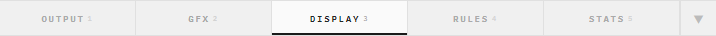

Display 탭은 수치 표시 형식을 영역별로 세밀하게 제어한다. PokerGFX GFX 3 탭의 Display 설정을 계승한다. 3개 서브그룹: **Blinds → Precision → Mode**.

##### 1. 레이아웃

> 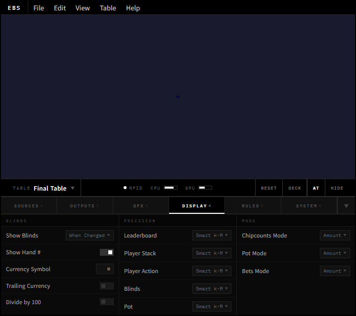
>
> *Display 탭 — 전폭, 가변 높이, 3-Column 그리드: Blinds | Precision | Mode*

##### 2. 요소 매핑

> 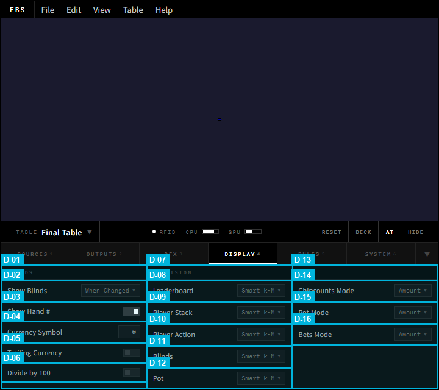
>
> *번호 = annotation 박스. 각 요소의 상세는 아래 테이블 참조.*

##### 4. 서브그룹별 기능 상세

#### Blinds 서브그룹 (1~6)

블라인드 그래픽에 표시되는 수치의 형식과 통화 설정을 관리한다.

| ID | 요소 | 기능 | 기본값 | 유효 범위 |
|:--:|------|------|--------|----------|
| 1 | Blinds (col) | 블라인드 컬럼 헤더 | — | — |
| 2 | Show Blinds | 블라인드 표시 조건 | When Changed | Always / When Changed / Never |
| 3 | Show Hand # | 핸드 번호 동시 표시 | OFF | — |
| 4 | Currency Symbol | 통화 기호 | $ | 자유 입력 (₩, €, £ 등) |
| 5 | Trailing Currency | 통화 기호 후치 여부 | OFF | — |
| 6 | Divide by 100 | 전체 금액을 100으로 나눠 표시 | OFF | — |

**동작**: Show Blinds는 Blinds Graphic(4장 §4.6)과 Board Graphic 상단의 블라인드 표시 영역을 제어한다. "Always"는 블라인드를 항상 표시하고, "When Changed"는 블라인드 레벨이 변경된 직후에만 일시적으로 표시한 뒤 자동 숨김된다(토너먼트 레벨 변경 시 시각적 알림 효과). "Never"는 블라인드를 완전히 숨긴다. Currency Symbol(4)에 입력한 기호는 Blinds Graphic, Board Graphic(팟 금액), Leaderboard(칩카운트) 등 **모든 금액 표시 영역**에 일괄 적용된다. Trailing Currency(5)가 ON이면 "100₩" 형태로 후치되고, OFF이면 "₩100"으로 전치된다. Divide by 100(6)은 내부 센트 단위 값을 달러 단위로 변환 표시하며, Blinds Graphic + Board Graphic + Leaderboard 세 영역에 동시 적용된다.

#### Precision 서브그룹 (7~12)

5개 영역의 수치 정밀도(축약/소수점)를 독립적으로 제어한다.

| ID | 요소 | 기능 | 기본값 | 유효 범위 |
|:--:|------|------|--------|----------|
| 7 | Precision (col) | 정밀도 컬럼 헤더 | — | — |
| 8 | Leaderboard Precision | 리더보드 칩카운트 정밀도 | Exact Amount | Exact Amount / Smart k-M / Divide |
| 9 | Player Stack Precision | Player Graphic 스택 정밀도 | Smart k-M | Exact Amount / Smart k-M / Divide |
| 10 | Player Action Precision | 액션 금액(BET/RAISE) 정밀도 | Smart Amount | Exact Amount / Smart Amount / Divide |
| 11 | Blinds Precision | Blinds Graphic 수치 정밀도 | Smart Amount | Exact Amount / Smart Amount / Divide |
| 12 | Pot Precision | Board Graphic 팟 정밀도 | Smart Amount | Exact Amount / Smart Amount / Divide |

**동작**: 각 영역은 독립적으로 정밀도를 설정하므로, 리더보드는 정확 금액을 표시하면서 Player Graphic에서는 축약된 형태를 사용할 수 있다. Smart k-M 축약 로직은 1,000 이상을 "k"(예: 1,234 → "1.2k"), 1,000,000 이상을 "M"(예: 1,234,567 → "1.2M")으로 변환한다. Smart Amount는 금액 크기에 따라 자동으로 소수점 자릿수를 조절한다(작은 금액은 정확히, 큰 금액은 반올림). Exact Amount는 천 단위 쉼표를 포함한 전체 금액을 표시한다(예: "1,234,567"). 5개 영역이 독립 설정이므로 운영자가 방송 상황에 맞게 정보 밀도를 조절할 수 있다 — 예를 들어 Leaderboard는 정확한 칩카운트가 필요하지만, 실시간 액션 금액은 시청자가 빠르게 읽을 수 있는 축약이 효과적이다.

> **[DROP]** Twitch Bot Precision (G-50f) / Ticker Precision (G-50g) / Strip Precision (G-50h) — 해당 기능 자체가 Drop.

#### Mode 서브그룹 (13~17)

금액 표시를 절대 금액(Amount) 또는 Big Blind 배수(BB)로 전환한다.

| ID | 요소 | 기능 | 기본값 | 유효 범위 |
|:--:|------|------|--------|----------|
| 13 | Mode (col) | 모드 컬럼 헤더 | — | — |
| 14 | Chipcounts Mode | 칩카운트 표시 단위 | Amount | Amount / BB |
| 15 | Pot Mode | 팟 표시 단위 | Amount | Amount / BB |
| 16 | Bets Mode | 베팅 표시 단위 | Amount | Amount / BB |
| 17 | Display Side Pot | 사이드팟 금액을 보드 영역에 별도 표시 | ON | — |

**동작**: 3개 Mode 컨트롤은 각각 독립적으로 Amount/BB 전환이 가능하다. BB 모드 활성화 시 해당 영역의 모든 수치가 현재 Big Blind 기준 배수로 표시된다 (예: 스택 50,000 / BB 1,000 → "50 BB"). 토너먼트 방송에서 시청자가 상대적 칩량을 직관적으로 비교할 수 있는 표준 방식이다. BB 모드 활성화 시 해당 영역의 Precision 설정(8~12)은 무시되고 BB 배수 전용 포맷으로 전환된다 — Currency Symbol도 "BB" 접미사로 자동 대체된다. 예를 들어 Chipcounts Mode만 BB로 전환하고 Pot/Bets는 Amount로 유지하면, 시청자는 칩량은 BB 배수로, 팟과 베팅은 실제 금액으로 확인할 수 있다.

### 2.9 Rules 탭 기능 상세

> 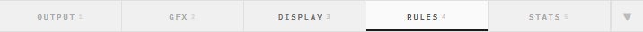

Rules 탭은 게임 규칙이 오버레이 표시에 영향을 미치는 설정을 관리한다. PokerGFX GFX 2 탭의 규칙 부분을 계승한다. 4개 서브그룹: **Game Rules → Player Display → Equity & Statistics → Leaderboard & Strip**. 방송 시작 전 세팅하고 핸드 진행 중에는 변경하지 않는 것이 원칙이다. 4개 서브그룹 중 **Game Rules**와 **Player Display**는 항상 펼침 상태이고, **Equity & Statistics**와 **Leaderboard & Strip**은 기본 접힘 상태로 시작한다.

##### 1. 레이아웃

> 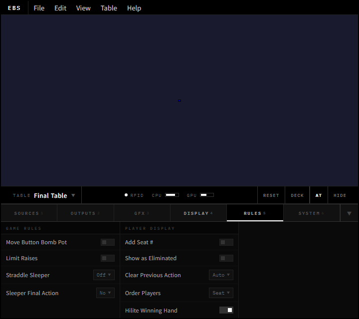
>
> *Rules 탭 — 전폭, 가변 높이, 3-Column 그리드: Game Rules | Player Display | Equity & Statistics + Leaderboard & Strip*

##### 2. 요소 매핑

> 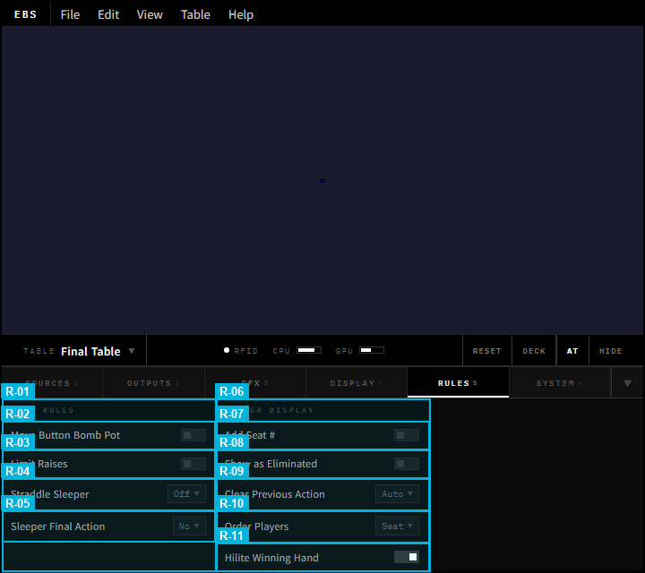
>
> *번호 = annotation 박스. 각 요소의 상세는 아래 테이블 참조.*

##### 4. 서브그룹별 기능 상세

#### Game Rules 서브그룹 (1~5)

게임 진행 규칙 중 오버레이와 AT에 영향을 미치는 설정을 관리한다. 방송 시작 전 세팅하고 핸드 진행 중 변경하지 않는 것이 원칙이다.

| ID | 요소 | 기능 | 기본값 | 유효 범위 |
|:--:|------|------|--------|----------|
| 1 | Game Rules (col) | 게임 규칙 컬럼 헤더 | — | — |
| 2 | Move Button Bomb Pot | Bomb Pot 후 딜러 버튼 이동 여부 | ON | — |
| 3 | Limit Raises | 유효 스택 기반 레이즈 제한 | OFF | — |
| 4 | Straddle Sleeper | 스트래들 위치 규칙 | UTG Only | UTG Only / Any Position / With Sleeper |
| 5 | Sleeper Final Action | 슬리퍼 스트래들 최종 액션 여부 | BB Rule | BB Rule / Normal |

**동작**: Move Button Bomb Pot(2)이 활성화되면 Bomb Pot 핸드(모든 플레이어가 동일 금액을 팟에 넣고 Flop부터 시작하는 특수 핸드) 후 딜러 버튼이 다음 좌석으로 이동한다. 비활성 시 Bomb Pot 전 위치를 유지하여 다음 일반 핸드에서 원래 순서대로 진행한다. 버튼 위치는 블라인드 포지션과 액션 순서를 결정하므로 게임 공정성에 직결된다. Limit Raises(3) 활성 시 잔여 스택이 현재 베팅의 특정 배수 이하이면 RAISE 불가(CALL 또는 ALL-IN만 허용)되며, AT에서 RAISE 버튼이 회색 비활성화로 전환된다. 주로 Fixed Limit 게임에서 사용되고 No Limit에서는 비활성이 일반적이다. Straddle Sleeper(4)는 스트래들(자발적 추가 블라인드) 허용 위치와 슬리퍼(UTG 외 위치의 추가 블라인드) 허용 여부를 결정한다. "With Sleeper" 선택 시 Sleeper Final Action(5)이 활성화되어 슬리퍼 플레이어의 Pre-Flop 최종 액션 권한(Big Blind처럼 체크 가능 vs 일반 플레이어처럼 콜 필요)을 설정한다.

#### Player Display 서브그룹 (6~11)

플레이어 정보 표시 방식과 게임 결과 시각 효과를 설정한다.

| ID | 요소 | 기능 | 기본값 | 유효 범위 |
|:--:|------|------|--------|----------|
| 6 | Player Display (col) | 플레이어 표시 컬럼 헤더 | — | — |
| 7 | Add Seat # | 플레이어 이름에 좌석 번호 추가 | OFF | — |
| 8 | Show as Eliminated | 스택 소진 시 탈락 표시 | ON | — |
| 9 | Clear Previous Action | 이전 액션 초기화 시점 | On Street Change | On Street Change / On Action / Never |
| 10 | Order Players | 플레이어 정렬 순서 | Seat Order | Seat Order / Stack Size / Alphabetical |
| 11 | Hilite Winning Hand | 위닝 핸드 강조 시점 | Immediately | Immediately / After Delay / Never |

**동작**: Order Players(10)는 화면에 표시되는 플레이어의 순서를 결정하며, GFX 탭의 Player Layout(2) 배치 형태 내에서 순서만 변경한다. "Stack Size"는 칩량 내림차순, "Alphabetical"은 이름 알파벳순으로 정렬한다. Clear Previous Action(9)은 새로운 베팅 라운드(FLOP/TURN/RIVER) 시작 시 이전 라운드의 액션 텍스트("RAISE $500", "CALL" 등)를 자동 초기화하는 시점을 결정한다. "On Street Change"가 기본값으로 스트리트 전이 시점에 모든 플레이어의 액션 텍스트를 리셋한다. "x to call"과 "option" 텍스트도 이 시점에 갱신된다. Hilite Winning Hand(11)가 "Immediately"이면 쇼다운 즉시 위닝 핸드 카드에 금색 하이라이트(border_element 금색 + pip_element highlighted=true + Glint 애니메이션)가 적용된다. "After Delay"이면 설정된 지연 시간 후에 하이라이트가 시작되어 방송 긴장감을 유지한다. Show as Eliminated(8) 활성 시 스택이 0이 된 플레이어를 자동으로 탈락 처리하여 빨간 테두리 + "ELIMINATED" 텍스트를 표시한다.

#### Equity & Statistics 서브그룹 (12~17) — 기본 접힘

에퀴티, 아웃, 리더보드 통계 관련 설정을 관리한다.

| ID | 요소 | 기능 | 기본값 | 유효 범위 |
|:--:|------|------|--------|----------|
| 12 | Show Hand Equities | 핸드 에퀴티(승률) 표시 시점 | Never | Never / Immediately / At showdown or winner All In / At showdown |
| 13 | Show Outs | 아웃 카드 표시 위치 | OFF | Off / Right / Left |
| 14 | True Outs | 순수 아웃만 계산 (러너 러너 제외) | ON | — |
| 15 | Outs Position | 아웃 표시 모드 | Stack | Off / Stack / Winnings |
| 16 | Allow Rabbit Hunting | 핸드 종료 후 미공개 커뮤니티 카드 확인 허용 | OFF | — |
| 17 | Ignore Split Pots | 에퀴티/아웃 계산 시 사이드팟 무시 | OFF | — |

**동작**: Show Hand Equities가 활성화되면 올인 또는 쇼다운 시 각 플레이어의 승률이 에퀴티 바(Player Graphic H 컴포넌트)에 표시된다. Show Outs는 특정 핸드에서 아웃(승률을 개선하는 카드)을 표시하며, True Outs 활성 시 러너러너(연속 2장)는 제외한다. Allow Rabbit Hunting 활성 시 핸드 종료 후 남은 커뮤니티 카드를 시청자에게 공개할 수 있다.

#### Leaderboard & Strip 서브그룹 (18~26) — 기본 접힘

리더보드와 스코어 스트립의 동작 및 표시 옵션을 관리한다.

| ID | 요소 | 기능 | 기본값 | 유효 범위 |
|:--:|------|------|--------|----------|
| 18 | Show Knockout Rank | 리더보드에 녹아웃 순위 컬럼 표시 | OFF | — |
| 19 | Show Chipcount % | 리더보드에 칩카운트 비율(%) 컬럼 표시 | OFF | — |
| 20 | Show Eliminated in Stats | 탈락한 플레이어를 리더보드 통계에 포함 | ON | — |
| 21 | Show Cumulative Winnings | 칩카운트와 누적 상금을 함께 표시 | OFF | — |
| 22 | Hide LB When Hand Starts | 핸드 시작 시 리더보드 자동 숨김 | ON | — |
| 23 | Max BB Multiple in LB | 리더보드에 표시할 최대 BB 배수 | 999 | 1~9999 |
| 24 | Score Strip | 스코어 스트립 표시 조건 | Never | Never / Heads Up or All In Showdown / All In Showdown |
| 25 | Show Eliminated in Strip | 스트립에 탈락 플레이어 포함 표시 | OFF | — |
| 26 | Order Strip By | 스트립 내 플레이어 정렬 기준 | Seating | Seating / Chip Count |

**동작**: 리더보드는 핸드 사이에 전체 플레이어 순위를 표시하는 오버레이다. Hide LB When Hand Starts가 활성화되면 핸드 시작 시 자동으로 숨겨져 방송 화면을 깔끔하게 유지한다. Score Strip은 올인 쇼다운 등 특정 상황에서만 표시되는 요약 스트립이다. Max BB Multiple은 리더보드에서 BB 배수가 설정값을 초과하는 항목을 숨겨 극단적 수치를 필터링한다.

### 2.10 Settings 다이얼로그 기능 상세

Settings 다이얼로그는 테이블 인증, 시스템 진단, 데이터 내보내기를 관리한다. **Settings > Preferences** 메뉴 또는 단축키로 접근한다.

**다이얼로그 사양**: 480×400px 모달 오버레이. 배경 dim 처리. Escape / X 버튼으로 닫기. 변경 즉시 적용 (Apply 버튼 없음).

```
Settings > Preferences (모달 다이얼로그, 480×400px)
├── Table
│   ├── Table Name [TextField] [Update]
│   ├── Table Password [TextField, masked] [Update]
│   └── [PASS] [Reset] — 테이블 정보 초기화
├── Diagnostics
│   ├── PC Specs (ReadOnly) — CPU, GPU, RAM, OS 정보
│   ├── [Table Diagnostics] — 안테나별 상태/신호 강도
│   └── [System Log] — 실시간 로그 뷰어
└── Export
    ├── Hand History Folder [FolderPicker]
    ├── Export Logs Folder [FolderPicker]
    └── API DB Export Folder [FolderPicker]
```

#### Table 서브그룹 (1, 2)

| ID | 요소 | 기능 | 기본값 |
|:--:|------|------|--------|
| 1 | Table Name | 테이블 식별 이름 (TextField + Update 버튼). AT 연결 시 이 이름으로 테이블을 찾는다 | "Table 1" |
| 2 | Table Password | AT 접속 비밀번호 (TextField, 마스킹 + Update 버튼). 빈 값이면 비밀번호 없이 접속 허용 | 빈 문자열 (비밀번호 없음) |
| 3 | PASS / Reset | 테이블 정보 초기화 버튼 2개. PASS = 비밀번호만 초기화, Reset = 테이블명 + 비밀번호 전체 초기화 | — |

**동작**: Table Name은 Info Bar의 테이블 라벨(M-02t)에 표시되는 이름과 동기화된다. AT에서 접속 시 Table Name + Password 조합으로 인증한다. Update 버튼을 눌러야 변경이 서버에 반영된다 (실시간 반영이 아닌 명시적 커밋 — 실수 방지).

**저장 패턴 규칙**: Settings 다이얼로그의 기본 동작은 **즉시 적용**(Apply 버튼 없음)이다. **예외**: Table Name(1)과 Table Password(2)만 Update 버튼을 통한 명시적 커밋이 필요하다 — 서버 인증 정보이므로 실수 방지를 위해 별도 확인 단계를 둔다. Export 폴더 경로(10~10.2)와 Diagnostics 설정은 즉시 적용된다.

#### Diagnostics 서브그룹 (4, 5, 6)

| ID | 요소 | 기능 | 기본값 |
|:--:|------|------|--------|
| 6 | PC Specs | CPU/GPU/RAM/OS 정보 읽기 전용 표시 | — (시스템 자동 감지) |
| 4 | Table Diagnostics | 안테나별 상태/신호 강도 별도 창 (TextButton) | — |
| 5 | System Log | 실시간 이벤트/오류 로그 뷰어 별도 창 (TextButton) | — |

**동작**: PC Specs는 시스템 부팅 시 자동 수집된 하드웨어 정보(CPU 모델/코어 수, GPU 모델/VRAM, RAM 용량, OS 버전)를 읽기 전용으로 표시한다. Table Diagnostics는 RFID 안테나 10개(좌석별 UPCARD + Muck + Community)의 연결 상태, 신호 강도(dBm), 마지막 인식 시각을 보여주는 진단 창을 연다. System Log는 WebSocket 메시지, RFID 이벤트, 오류를 실시간 스트리밍하는 로그 뷰어를 연다.

#### Export 서브그룹 (10, 10.1, 10.2)

| ID | 요소 | 기능 | 기본값 |
|:--:|------|------|--------|
| 10 | Hand History Folder | JSON 핸드 히스토리 내보내기 폴더 지정 (FolderPicker) | ./exports/ |
| 10.1 | Export Logs Folder | 시스템/이벤트 로그 내보내기 폴더 지정 (FolderPicker) | ./logs/ |
| 10.2 | API DB Export Folder | API DB 추출 데이터 폴더 지정 (FolderPicker) | ./db_exports/ |

**동작**: 3개 FolderPicker는 각각 독립된 내보내기 경로를 지정한다. Hand History는 핸드별 JSON 파일(카드, 액션, 팟 분배 전체 기록)을 저장한다. Export Logs는 시스템 로그를 일별/세션별로 저장한다. API DB Export는 서버 DB의 테이블 데이터(플레이어, 세션, 통계)를 JSON/CSV로 추출하는 경로를 지정한다.

**별도 창 사양**:
- **Table Diagnostics 창**: 600×400px, 비모달 (Settings 다이얼로그와 동시 표시 가능). 안테나별 상태/신호 강도 실시간 갱신. 닫기: X 버튼 / Escape.
- **System Log 창**: 800×500px, 비모달. 실시간 로그 스트리밍 (자동 스크롤). 로그 레벨 필터(INFO/WARN/ERROR). 닫기: X 버튼 / Escape.

### 2.11 탭 간 교차 참조

Console 4탭 + Settings 다이얼로그의 설정이 AT와 오버레이에 어떻게 전파되는지를 요약한다. Console은 **사전 세팅 도구**이므로 방송 시작 전에 설정을 완료하고, 방송 중에는 AT와 오버레이가 이 설정을 참조하여 동작한다.

| 소스 | Console 설정 | AT 영향 | 오버레이 영향 |
|------|-------------|---------|-------------|
| Outputs 탭 | Video Size (2) | — | 렌더링 캔버스 해상도 결정 |
| Outputs 탭 | Frame Rate (4) | — | 오버레이 렌더링 fps 결정 |
| Outputs 탭 | Output Mode (15, S-07~S-08, 10~13) | — | 출력 방식 결정 (Chroma Key 또는 Fill & Key) |
| GFX 탭 | Board Position (1) | — | Board Graphic 9-Grid 위치 |
| GFX 탭 | Player Layout (2) | — | Player Graphic 배치 모드 |
| GFX 탭 | Reveal Players (6) | AT에서 카드 공개 시점 연동 | 홀카드 공개 시각 효과 |
| GFX 탭 | How to Show Fold (7) | AT 폴드 시 시각 전환 | 폴드 플레이어 Graphic 제거 타이밍 |
| GFX 탭 | Transition In/Out (12~13) | — | 등장/퇴장 애니메이션 |
| Display 탭 | Currency/Precision (4~12) | — | 모든 수치 표시 형식 |
| Display 탭 | BB Mode (14~16) | — | 칩카운트/팟/베팅 BB 배수 표시 |
| Settings | Table Name/Password (1~2) | AT 인증 시 사용 | — |

## 3장. Action Tracker — 터치 최적화 재설계

> **→ 별도 설계 문서로 분리**: [`docs/02-design/ebs-action-tracker.design.md`](../02-design/ebs-action-tracker.design.md)
>
> 설계 내용이 방대하고, 개발 시 별도로 진행하기에 분리하였다.

## 4장. 오버레이 그래픽 — Flutter/Rive 기반 설계

> **→ 별도 설계 문서로 분리**: [`docs/02-design/ebs-overlay-graphics.design.md`](../02-design/ebs-overlay-graphics.design.md)
>
> 설계 내용이 방대하고, 개발 시 별도로 진행하기에 분리하였다.

## 5장. 화면 전환과 상태 흐름

> **→ 별도 설계 문서로 분리**: [`docs/02-design/ebs-screen-transitions.design.md`](../02-design/ebs-screen-transitions.design.md)
>
> 화면 전환 로직은 오버레이 그래픽과 밀접하게 연관되어 함께 분리하였다.

## 6장. 제약 조건

> **→ 별도 설계 문서로 분리**: [`docs/02-design/ebs-constraints.design.md`](../02-design/ebs-constraints.design.md)
>
> 제약 조건은 전체 앱에 적용되며, 개발 참조 문서로 독립 관리한다.

---

## Changelog

| 날짜 | 버전 | 변경 내용 | 결정 근거 |
|------|------|-----------|----------|
| 2026-03-11 | v9.0.0 | 3~6장(Action Tracker, 오버레이 그래픽, 화면 전환, 제약 조건) 별도 설계 문서로 분리 — PRD에는 교차 참조만 유지 | 설계 내용 방대, 개발 시 별도 진행하기에 문서 분리 |
| 2026-03-11 | v8.8.0 | Outputs Frame Rate 유효 범위 확장: 30/60fps → 24/25/30/50/60fps. 참고 이미지 전체 max-width 960px 적용 | 국제 방송 표준(NTSC/PAL/Film) 대응 + 문서 레이아웃 정규화 |
| 2026-03-11 | v8.7.0 | §2.4 Outputs/GFX 인라인 상세를 §2.7/§2.8로 통합 — 이중 정의 해소, 4탭 문서화 패턴 통일 (레이아웃+요소 매핑+요소 설명) | Dual SSOT 구조적 문제 해소 |
| 2026-03-10 | v8.6.0 | §2.4 Outputs 요약 테이블을 §2.7 상세와 동기화: 서브그룹명 Fill & Key→Output Mode, ID 6~8 NDI/RTMP/SRT→Live Video/Audio/Device, Output Mode Selector(15)+Chroma Key(S-07,S-08)+Live Key & Fill(5.1) 추가. GFX 요약: Player Layout 유효 범위 5개 옵션으로 갱신, 브랜딩 제거 반영 | §2.4 요약 ↔ §2.7/§2.8 상세 정합성 확보 |
| 2026-03-10 | v8.5.0 | GFX 탭 재설계: Animation을 독립 Col 3으로 이동(Card & Player 하위 → 독립 컬럼). Skin Editor(14) GFX 탭에서 제거 → Info Bar Load Skin 버튼(M-16)으로 이관. GFX 3-Column: Layout \| Card & Player \| Animation | Skin은 탭 전환 없이 접근 필요 → Info Bar Quick Actions 배치 |
| 2026-03-10 | v8.4.0 | GFX Branding 서브그룹 전체 제거: Vanity Text(15), Replace Vanity(16), Strip Sponsor Logo(17). HTML 목업 + PRD 요소 테이블 동시 정리 | PokerGFX 전용 브랜딩 기능, EBS에서 불필요 |
| 2026-03-10 | v8.3.0 | Outputs: Fill Output(10)+Key Output(11) → Fill & Key Output(10) 단일 통합. 12~14 → 11~13 재넘버링 | Fill/Key는 항상 동시 활성화되는 듀얼 포트이므로 단일 토글로 통합 |
| 2026-03-10 | v8.2.0 | SSOT 확정 + 정합성 수정: EBS-UI-Design.md (v32.0), v2 아카이빙/삭제. GFX 요소 테이블을 HTML annotation sub-ID 구조로 교체(G-01~15 → 1~17). Vanity(15) 전체 제거(요소 테이블, Branding 서브그룹, Board Graphic 서브 컴포넌트, 커스터마이징 속성 6곳). R-13 Hilite Nit Game DROP 처리 | 문서 단일화 + annotation PNG↔PRD 텍스트 불일치 해소 + 미사용 기능 제거 |
| 2026-03-10 | v8.1.0 | Rules 탭 밸런스 최적화: Equity & Statistics, Leaderboard & Strip 서브그룹 기본 접힘(collapsed) 정책 추가. §2.4 서브그룹 접기 정책 일반 규칙 신설 (GFX Branding + Rules 2개 서브그룹). 초기 노출 요소 25→9개로 감소 | 탭 밸런스 분석 (Rules 25개=평균+56%), Progressive Disclosure 확장, Miller's Law 준수 |
| 2026-03-10 | v8.0.0 | Rules 탭 2-Column→3-Column 확장 (Equity & Statistics + Leaderboard & Strip 추가). §2.1 최소 높이 140px→280px, §2.9 레이아웃 설명 4개 서브그룹으로 업데이트. Console HTML에 17, 12~26, 14/G-14g 추가 반영 | v2.0 Defer 53개 v1.0 승격에 따른 Console UI 확장 |
| 2026-03-10 | v7.0.0 | Critic 재검증 기반 전면 개선. CRITICAL: Console Status Bar 유령 참조 제거, Delayed 모드 2차 이동, Settings 독립 메뉴 승격. MAJOR: Bloomberg BM-2 제거(3선→2선), 설계 철학 정직화, RFID 5색+3중 표시(WCAG), 스크롤 정책 통일. HIGH: game-engine 경로, Settings 창 사양, 저장 패턴, 스와이프 영역. 4장 Flutter/Rive 전환 + 개발 명세 제거. 2차→1차 범위 승격: 에퀴티/아웃, 리더보드 6설정, Score Strip, Skin Editor, Run It Twice/CHOP/Miss Deal, Split Screen/HU History. Fill&Key Output 통합(10+11→10). 비기능 요구사항(보안/성능/신뢰성) 신설 | Critic DESTROYED 판정 23건 수정 + 사용자 범위 변경 |
| 2026-03-09 | v6.1.0 | Outputs: O-05 Bit Depth/O-10 Broadcast Delay 제거, Fill & Key 5요소(10~14) 재설계(Alpha/Luma 배타 선택). GFX: Template 드롭다운 제거. System 탭→Settings 다이얼로그 병합(5탭→4탭), Y-03/Y-04/AT서브그룹/Y-12.1 제거, Table필드입력+PASS/Reset 버튼, PC사양정보 추가, Export 3폴더 | PokerGFX whitepaper 기반 기능 정합성 확보 + 사용자 피드백 |
| 2026-03-09 | v6.0.0 | 전면 재설계: Menu Bar 4메뉴(File/View/Tools/Help), Info Bar 읽기 전용(1PC=1Table), 해상도별 패널 크기 4종, Output Mode 결정론적 명세 강화, 전 요소 호출/동작/닫기 상세 명세, 본문 버전 히스토리 제거→Changelog 집중, Annotation compact 모드(숫자만) 적용 | 사용자 6개 피드백 일괄 반영 |
| 2026-03-09 | v5.1.0 | Output Mode 배타적 선택 도입 (Chroma Key ↔ Fill & Key), Chroma Key System→Outputs 이관, 리사이즈 최소 사이즈 명세 추가, 최소 사이즈 기준 설계 전환 | Critic 분석 보고서 + 사용자 피드백 |
| 2026-03-09 | v5.0.1 | §2.7 Outputs / §2.8 GFX / §2.8b Display / §2.8c Rules / §2.9 System 탭 기능 상세 보강 — Display·Rules 서브그룹 분리(3개+2개), 전 탭 기본값·유효범위 컬럼 통일, 동작 설명 GFX 골든 템플릿 수준으로 확장 | 탭별 상세도 불균형 해소, §2.8 GFX 수준으로 통일 |
| 2026-03-09 | v5.0.0 | Sources 탭 전면 제거 — §2.4 서브섹션 삭제, §2.6 [REMOVED], 6탭→5탭 전수 교체, Chroma Key→System 이관, 교차참조 갱신 | 비디오 입력은 ATEM 등 외부 장치 관할, §1.0 결정 정합성 확보 |
| 2026-03-08 | v4.1.0 | §1.0 탭 구조 설계 다이어그램 신설, §1.6 제거 | Sources 제외 근거를 한 장 다이어그램으로 재설계 |
| 2026-03-08 | v4.0.0 | §1.6 Sources 탭 제외 근거 (→ v4.1.0에서 §1.0으로 이동/재설계) | whitepaper 기반 Sources 탭 제외 결정 문서화 |
| 2026-03-06 | v3.9.0 | §2.6~2.10 ID를 v4 annotation 체계로 전수 교체 + Sub-ID 범례 추가 + 레이아웃 PNG 6개 v4 재캡처 | v4 annotation ID 정합성 확보 |
| 2026-03-06 | v3.8.0 | §2.4 Sources/Outputs/GFX/System 요소 테이블 ID를 v4 annotation 체계(S-01~S-16, 1~14, G-01~15, Y-01~Y-20)로 정합성 업데이트. §2.8b Display + §2.8c Rules에 3단 구조(레이아웃 PNG + annotation PNG + 요소 테이블) 추가, ID를 1~16, 1~11로 독립 prefix 부여. GFX 탭에서 Display/Rules 이관 요소(Pot Display/Stack Format/Bet Display/Game Type/Show Blinds) 제거 | §2.4 요소 테이블이 이전 PokerGFX 원본 ID를 참조하여 v4 annotation PNG와 불일치 |
| 2026-03-06 | v3.7.0 | 레거시 HTML 7개(960px flexbox 4탭) → main-v4.html 단일 소스 통합. data-ann 107개(공통 13 + 탭별 94). generate_annotations.py 탭 전환/scope 필터링 추가. Display/Rules 탭 annotation PNG 신규 생성 | PRD v3.6.0 표준(720px CSS Grid, dark theme, 6탭)과 annotation 소스 불일치 해소 |
| 2026-03-06 | v3.6.0 | 레이아웃 5행 구조 전환(Menu Bar 28px + Info Bar 36px 분리), 4탭→6탭(GFX→GFX+Display+Rules 분리), Tab Content 가변 높이 + 스크롤 금지, §2.8b Display 탭 + §2.8c Rules 탭 신설 | 표준 데스크톱 앱 패턴 적용, GFX 41개 설정의 스크롤 없는 전체 표시 |
| 2026-03-06 | v3.5.0 | §2.4 탭별 요소 분석을 3단 구성으로 재구성 (①레이아웃 ②요소 매핑 ③요소 설명). generate_annotations.py --ebs 모드 추가. Console 4탭 annotated PNG 생성 (Sources 11개, Outputs 13개, GFX 15개, System 17개 요소) | 목업 이미지 1장 + 텍스트 캡션만으로는 요소-ID 매핑이 불명확 — 번호 annotation 오버레이로 시각적 교차 참조 |
| 2026-03-06 | v3.4.0 | §2.1~2.4 Console 메인 레이아웃 기능 상세 추가. 운영자 워크플로우 + 개발자 구현 스펙 2-Layer 서술. Top Bar 11개 요소(M-01~M-15 + M-02t/M-12), Preview Area 클릭 인터랙션, Tab Bar 4탭 기능 요약, 컨트롤 표준 6종 정의 | §2.6~2.10 수준 상세화로 통일 — 레이아웃 요소 자체의 운영/개발 스펙 누락 수정 |
| 2026-03-06 | v3.3.0 | §2.6~2.10 Console 4탭 기능 상세 추가 (Sources/Outputs/GFX/System + 교차 참조). §3.7~3.13 AT 기능 상세 추가 (Pre-Start Setup/게임 진행 루프/카드 인식/플레이어 관리/특수 규칙/키보드 단축키/UNDO). element-catalog ID 교차 참조, triage Drop 마킹 포함 | 2장 "레이아웃만 있고 기능 설명 없음" + 3장 "핵심 운영 기능 누락" 치명적 결함 수정 |
| 2026-03-06 | v3.2.0 | §2.5 커맨드 팔레트 (Cmd+K) 섹션 제거. §1.4 매핑 테이블, §핵심 혁신 테이블, §2.6 상태 바 테이블에서 커맨드 팔레트 참조 제거. 목업 HTML/PNG 삭제 | Over-engineering — 4탭 + 키보드 단축키(Ctrl+1~4)로 모든 기능 접근 가능. 커맨드 팔레트 GO Key 패턴은 방송 프로덕션 도메인에 부적합 |
| 2026-03-05 | v3.1.0 | §1.3 벤치마크 보강: BM-1 보조 레퍼런스 4종(OBS/vMix/ATEM/Ross 비교표 + 스크린샷 4장), BM-2 GGPoker/WSOP Paradise 2025 방송 스크린샷 + Streamer Mode/Smart HUD 기술 상세 추가. §1.4 매핑 테이블 8항목으로 확장. 탭 목업 캡션 전폭 레이아웃 반영 | 벤치마크 근거 강화 — 텍스트만 언급된 OBS/vMix/ATEM에 실제 UI 스크린샷 증거 추가 |
| 2026-03-05 | v3.0.0 | Console 레이아웃 3-Column → Top-Preview 전환. §1.4 벤치마크 매핑, §2.1~2.4 전면 재설계, §2.6 상태 바 제거, §6.1 제약 조건 업데이트. 업계 벤치마크(OBS/vMix/TriCaster/ATEM/Wirecast) 기반. 프리뷰 면적 +33%(1920px), +236%(1024px) | 3-column 좌우 고정 패널이 16:9 프리뷰를 압박. 모든 주요 방송 SW가 top-preview 구조로 수렴 |
| 2026-03-05 | v2.5.0 | Console 설정 패널 4탭(Sources/Outputs/GFX/System) + Command Palette + Blinds Graphic HTML/PNG 목업 6종 추가. PRD 2.4~2.5절, 4.6절에 이미지 임베드 | 누락된 Console 탭별 레이아웃 설계 완성 |
| 2026-03-05 | v2.4.0 | 잔여 ASCII 5개(그리드 시스템 + 좌석 템플릿 A/B/C/D) → HTML/PNG White Minimal 목업 교체. 문서 내 ASCII 와이어프레임 완전 제거 (디렉토리 트리 1개만 잔존) | 문서 시각 무결성 통일 — 모든 UI 다이어그램 PNG 표준화 |
| 2026-03-05 | v2.3.0 | 전체 ASCII 와이어프레임 11개를 HTML/PNG White Minimal 목업으로 교체. 신규 목업 8종 추가 (Layout B/C, Player/Board/Field Graphic, Leaderboard, Ticker, Strip). 기존 PNG 3종 공백 제거 재캡처. | ASCII는 렌더링 환경 의존, PNG 표준화로 문서 품질 통일 |
| 2026-03-05 | v2.2.0 | 2장 Console 설정 패널: PokerGFX GfxServer 6탭 구조 기반 재설계 (Sources/Outputs/GFX/System). 게임 데이터 항목(블라인드 값, 게임 타입, 플레이어 좌석/스택, RFID 매핑) 제거 — 원본 GfxServer에도 없는 기능. Console = 오버레이 표시 방식 제어 전용. | PokerGFX 역설계 문서 기반 정확 복제 |
| 2026-03-05 | v2.1.0 | 2장 Console 설계: 컨텍스트 패널 게임 상태 자동 전환 제거 → 탭 기반 설정 패널로 변경. Console은 사전 세팅 도구이므로 게임 상태 모니터링 불필요 (AT/오버레이에만 적용) | Console 역할 명확화 — 세팅 도구에 실시간 모니터링 패턴 적용은 over-engineering |
| 2026-03-05 | v2.0.0 | 3장 AT 레이아웃 전면 재설계 (9인, 그리드 템플릿), 4장 오버레이 가장자리 배치 + HTML 템플릿 시스템 전면 재설계 | 딜러 포지션 제거, 오버레이 부가 그래픽 철학 적용, 풀 커스텀 템플릿 도입 |
| 2026-03-05 | v1.0.0 | 최초 작성 | v2.0 기술 문서 분리, 벤치마크 기반 UI 전면 재설계 |

---

**Version**: 9.0.0 | **Updated**: 2026-03-11
