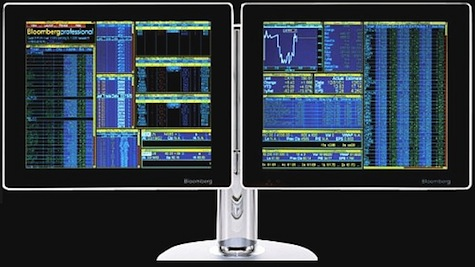
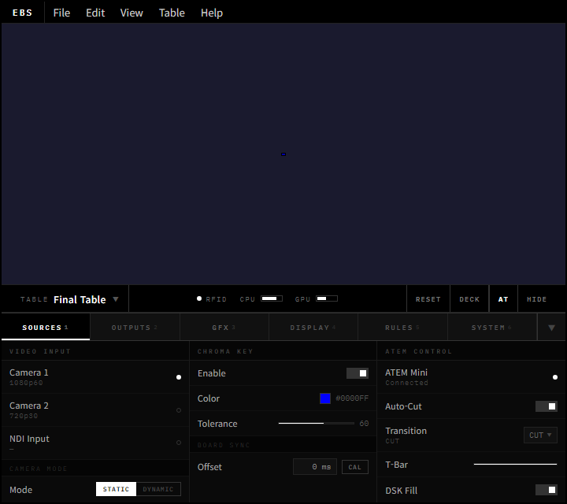
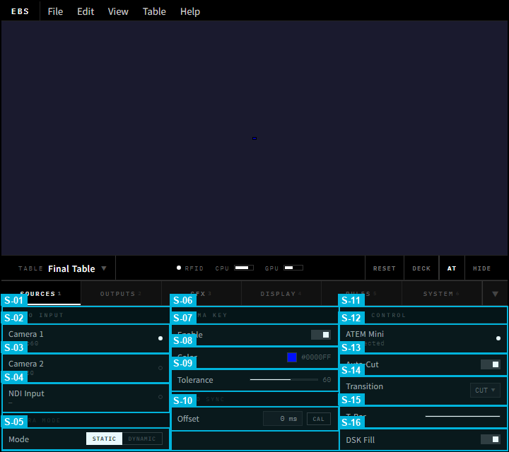
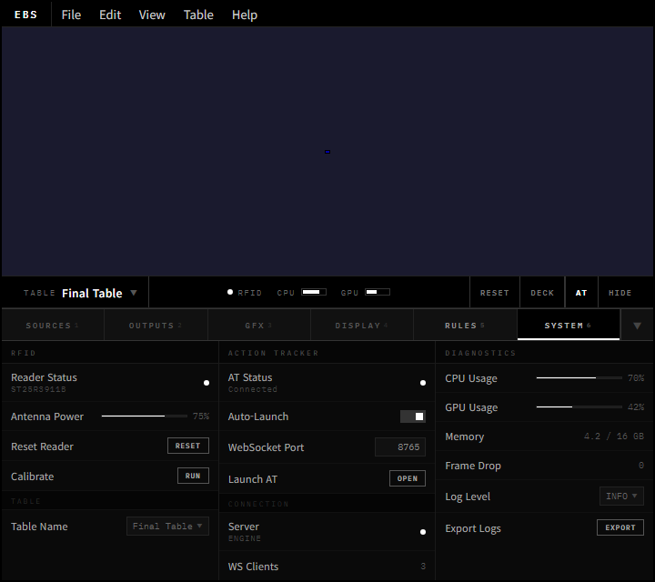
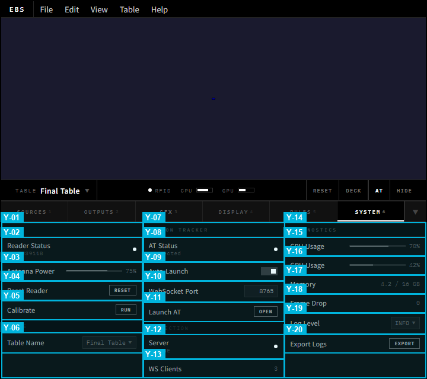
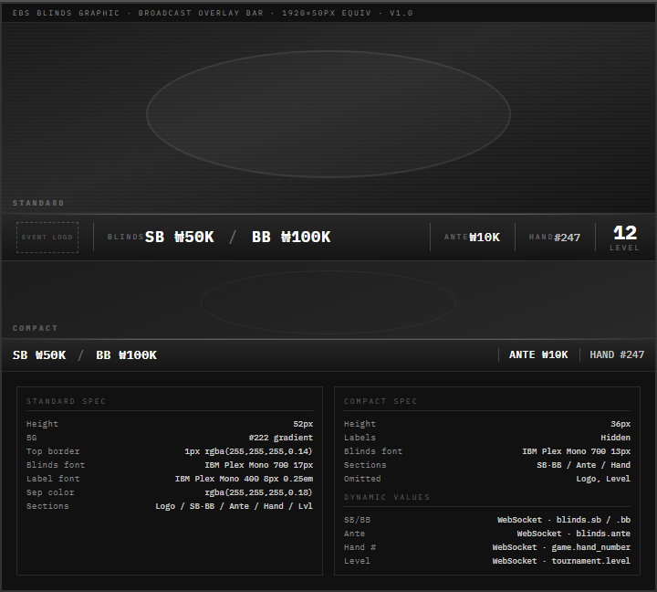

# EBS UI Design v3.0 — 앱 레이아웃 & 오버레이 그래픽 설계

## 1장. 문서 개요

### 1.1 이 문서의 목적

EBS 앱이 **어떻게 생겨야 하는지** 정의한다. 기능 카탈로그, 게임 규칙, 시나리오는 선행 문서(pokergfx-prd-v2.md)에 정의되어 있으며, 기술 스택과 아키텍처는 v2.0(EBS-UI-Design-v2.prd.md)에 정의되어 있다. 본 문서는 이 두 문서와 **중복 없이** 앱 레이아웃과 오버레이 그래픽 배치만 다룬다.

### 1.2 설계 철학

**PokerGFX 구조를 따라갈 이유가 없다.** PokerGFX는 2010년대 WinForms 6탭 구조다. EBS는 프로덕션 검증된 3개 벤치마크 앱에서 추출한 패턴을 적용하여, 가장 세련되고 혁신적인 방송 제어 앱으로 설계한다.

### 1.3 벤치마크 앱 3선

모든 설계 결정은 아래 3개 프로덕션 검증 앱에서 추출한 패턴에 근거한다. 각 벤치마크는 EBS의 서로 다른 영역을 담당한다: BM-1은 **Console 앱 레이아웃**, BM-2는 **정보 구조와 키보드 UX**, BM-3은 **오버레이 시각 언어**를 정의한다.

**BM-1: Ross Video DashBoard** (방송 제어)

> 
>
> *Ross Video DashBoard v9: 단일 인터페이스에서 오디오/비디오 채널을 통합 제어하는 CustomPanel 구조*

> 
>
> *DashBoard 9.0 Aura 테마: 역할별 레이아웃 전환과 다크 테마 기반 방송 제어 UI*

- 검증: Super Bowl LVI AR 그래픽 운영 (NBC Sports + Van Wagner), SoFi Stadium 상설 시스템, Rogers Sportsnet(토론토), QTV 중계차 운영. NBC/ESPN/Sky Sports 등 전 세계 방송국 표준 제어 소프트웨어. **라이브 스포츠 방송 제어의 사실상 표준**.
- 기술 상세: v9.16 (2026.01), **80+ openGear 파트너** 네이티브 지원, CustomPanel Visual Logic Editor (코드 없이 디바이스 제어 워크플로우 구성), RBAC(Role-Based Access Control)로 운영자별 패널 접근 권한 관리, RossTalk/VDCP/OGPJSON/HTTP(S)/TCP/UDP/MIDI 프로토콜 지원.
- 추출 패턴: CustomPanel 빌더 (운영자가 패널 직접 구성), 단일 인터페이스 철학 (탭 분리 X), 역할별 레이아웃 전환, RBAC 접근 제어
- EBS 적용: Top-Preview 레이아웃 (상단 전폭 프리뷰 + 하단 탭 컨트롤), 역할별 UI 커스터마이징

#### BM-1 보조 레퍼런스: Top-Preview 레이아웃 수렴 현상

EBS Console의 Top-Preview 레이아웃은 Ross DashBoard 단독 참조가 아니라, 2024~2026년 기준 **주요 방송 제어 소프트웨어 전부**가 동일 패턴으로 수렴한 업계 표준이다.

> 
>
> *OBS Studio v28: 상단에 전폭 프리뷰, 하단에 Scenes/Sources/Audio Mixer/Transitions/Controls 5개 도크. 가장 널리 사용되는 오픈소스 방송 소프트웨어.*

> 
>
> *OBS Studio Mode: 좌측 Preview + 우측 Program + 중앙 Transition 컨트롤. 방송 스위처 표준 패턴.*

> 
>
> *vMix: 좌측 Preview(주황 타이틀바) + 우측 Output(초록 타이틀바) + 하단 Input Bar + 색상 코드 탭 분류. 프로 라이브 프로덕션 소프트웨어.*

> 
>
> *ATEM Software Control: Program/Preview 버스 버튼 + Transition Style + 우측 Palettes(설정 패널) + 하단 4탭(Switcher/Media/Audio/Camera). 하드웨어 스위처의 소프트웨어 미러.*

| 소프트웨어 | 레이아웃 패턴 | 프리뷰 위치 | 컨트롤 위치 | EBS 차용 요소 |
|-----------|:----------:|:---------:|:---------:|------------|
| **OBS Studio** | Top-Preview + Bottom-Docks | 상단 전폭 | 하단 5도크 | 도크 구조, 씬/소스 관리 |
| **vMix** | Dual-Preview + Bottom-Input | 상단 좌우 | 하단 Input Bar | 듀얼 프리뷰 모드, 색상 코드 탭 |
| **ATEM Software** | Bus-Style + Right-Palette | 상단 버스 | 우측 팔레트 + 하단 탭 | 탭 기반 설정 분리, 팔레트 UI |
| **Ross DashBoard** | CustomPanel (자유 배치) | 운영자 설정 | 운영자 설정 | 역할별 레이아웃, RBAC |

> **결론**: 4개 소프트웨어 모두 "프리뷰=상단, 컨트롤=하단/측면"으로 수렴. EBS는 이 패턴을 따르되, **하단 전폭 탭 패널(가변 높이, 스크롤 금지)**로 6탭 설정을 통합한다.

**BM-2: Bloomberg Terminal** (정보 밀도 + 키보드 퍼스트)

> 
>
> *Bloomberg Terminal: 수천 개 데이터를 한 화면에 배치하는 적응형 정보 밀도 UI. 커맨드 라인 즉시 접근 패턴의 원조.*

- 검증: **325,000+ 전문 구독자**, 연간 $25,000/좌석, 2019년 Chromium 기반 전환, 금융 업계 40년 표준. **실시간 데이터 밀도 UI의 최고 레퍼런스** — 수천 개 데이터를 한 화면에 제어하는 UX 패턴이 방송 제어와 동일 문제를 해결.
- UX 설계 원칙 (Bloomberg UX 팀 공식):
  - **Concealing Complexity**: 수천 개 기능을 사용자 여정(journey)별로 은닉. 현재 맥락에 필요한 것만 표면에 노출.
  - **Consistency**: 수천 개 화면에서 동일한 인터랙션 패턴 유지 — 예측 가능성이 정보 밀도 UI의 핵심 사용성.
  - **Gradual Evolution**: 실시간 금융 의사결정에 사용되므로 UI 급변은 치명적. 점진적 변화만 허용.
  - **GO Key 패턴**: 모든 화면 상단에 커맨드 바 존재. 기능명/티커 입력 + GO(Enter) = 즉시 이동. 마우스 탐색 불필요.
  - **Launchpad**: 사용자 맞춤 대시보드. 임의의 탭/윈도우 수 배치 가능 (기존 4패널 제한 폐지).
- 추출 패턴: 커맨드 라인 즉시 접근 (GO Key), 적응형 정보 밀도, 키보드 우선 조작, 맥락 기반 복잡성 은닉
- EBS 적용: 게임 상태별 정보량 자동 조절, 일관된 컨트롤 패턴

**BM-3: GGPoker + GTO Wizard + WSOP 방송** (포커 오버레이 혁신)

> 
>
> *GGPoker 방송 오버레이: Glassmorphism 카드 UI, 네온/글로우 이벤트 강조, Bold 타이포 핵심 수치 강조*

> 
>
> *GTO Wizard 실시간 분석 오버레이: 확률/Equity 표시, 상태별 동적 UI 전환*

> 
>
> *WSOP Paradise 2025: GGPoker 플랫폼 기반 라이브 방송. 하단 플레이어 스트립 + 보드 카드 + 팟 표시. PokerGFX와 동일한 RFID 시스템을 사용하되 현대적 시각 언어 적용.*

### 1.4 설계 패턴 ↔ 벤치마크 매핑

| 설계 패턴 | 벤치마크 출처 | EBS 적용 |
|-----------|:------------:|----------|
| Top-Preview 레이아웃 | OBS/ATEM/vMix/Ross | 상단 전폭 프리뷰 + 하단 탭 컨트롤 (업계 수렴 패턴) |
| 적응형 정보 밀도 | BM-2 Bloomberg + BM-3 Smart HUD | AT/오버레이에서 게임 진행에 따라 정보량 자동 조절 (Console은 수동 탭 전환) |
| 복잡성 은닉 | BM-2 Bloomberg | 수십 개 설정을 6탭 + 서브그룹으로 계층화 |
| Glassmorphism 오버레이 | BM-3 GGPoker | 반투명 프로스트 카드/팟/확률 패널 |
| Bold 타이포 + 네온 | BM-3 GGPoker | 핵심 수치 강조, 올인 이벤트 발광 효과 |
| 듀얼 디스플레이 마스킹 | BM-3 GGPoker Streamer Mode | 방송 딜레이 중 홀 카드 자동 마스킹 |
| LCH 색공간 테마 | BM-3 + 업계 트렌드 | 3변수(base, accent, contrast) 커스텀 테마 |

### 1.5 불필요 기능 제거

PokerGFX 247개 요소 중 **54개 비활성화** (whitepaper 분석):

| 범주 | 수량 | 사유 |
|------|:----:|------|
| 카메라/녹화/연출 | 19 | 프로덕션 팀(스위처/카메라)이 담당 |
| Delay/Secure Mode | 9 | EBS 송출 딜레이 장비로 대체 |
| 외부 연동 기기 | 7 | Stream Deck, MultiGFX, ATEM 미사용 |
| Twitch 연동 | 5 | Twitch 스트리밍 미운영 |
| 기타 | 14 | 태그, 라이선스, 시스템, 레거시 UI |

## 2장. EBS Console

PokerGFX의 776x660px WinForms 6탭 구조를 완전히 탈피한다.

### 핵심 혁신

| PokerGFX  | EBS v3.0  | 벤치마크 |
|-------------------|-----------------|:--------:|
| 6탭 WinForms (Sources, Outputs, GFX 1/2/3, System) | Top-Preview 레이아웃 (상단 전폭 프리뷰 + 하단 탭 컨트롤) | OBS/ATEM/vMix |
| 고정 컨트롤 패널 | 탭 기반 설정 패널 (6탭 구조) | OBS |
| 메뉴 → 탭 → 서브그룹 탐색 | 키보드 단축키 (Ctrl+1~6) 즉시 접근 | OBS/vMix |

### 2.1 메인 레이아웃

**최소 해상도**: 1024x768 | **권장**: 1920x1080
**레이아웃**: Menu Bar 28px (고정) / Preview Area 가변 (1fr) / Info Bar 36px (고정) / Tab Bar 36px (고정) / Tab Content 가변 (auto, 스크롤 금지)

CSS: `grid-template-rows: 28px 1fr 36px 36px auto; height: 100vh;`

> 
>
> 
>
> *EBS Console v4.0: Menu Bar(28px) + Preview(가변, 16:9) + Info Bar(36px) + Tab Bar(36px) + Tab Content(가변, 스크롤 금지). 업계 표준(OBS Studio, vMix, TriCaster, ATEM, Wirecast) 기반. 6탭 구조(Sources/Outputs/GFX/Display/Rules/System).*


#### 운영 워크플로우

**방송 전 (Setup)**:
1. System 탭에서 RFID 연결 확인 (Info Bar RFID 상태 ● Green)
2. Sources 탭에서 카메라/NDI 소스 등록, Chroma Key 설정
3. Outputs 탭에서 출력 해상도(1080p/4K), Fill & Key 설정
4. GFX 탭에서 레이아웃(Board Position, Player Layout), 스킨, 브랜딩 설정
5. Register Deck으로 새 덱 등록 → 카드 RFID 매핑 확인
6. Launch AT로 Action Tracker 실행

**긴급 상황**:
- 오버레이 오류 → Hide GFX (즉시 숨김) → 문제 해결 → Hide GFX 토글 복원
- 카드 인식 오류 → Reset Hand → 현재 핸드 전체 초기화
- AT 연결 끊김 → Launch AT로 재실행, 자동 재연결 시도

#### 개발 스펙

**리사이즈 동작**: 윈도우 리사이즈 시 Menu Bar(28px), Info Bar(36px), Tab Bar(36px)는 고정. 
Preview Area와 Tab Content가 가변. Tab Content는 탭별 콘텐츠 높이에 따라 결정되며, 스크롤은 금지된다.

### 2.2 Menu Bar (28px)

표준 데스크톱 앱 메뉴바. 좌측에 EBS 로고(M-01), 이어서 File/Edit/View/Table/Help 메뉴.

```
[EBS] File  Edit  View  Table  Help
```

| 메뉴 | 항목 |
|------|------|
| File | New Session, Open Session, Save Session, Export Hand History, Exit |
| Edit | Undo, Redo, Preferences (M-12 흡수) |
| View | Toggle Preview (F11), Toggle Tab Panel (Ctrl+M), Toggle Lock (Ctrl+L) |
| Table | Switch Table (M-02t 기능), Register Deck (M-13), Launch AT (M-14) |
| Help | About (M-01 기능), Keyboard Shortcuts, Documentation, Export Logs |

#### EBS Logo (M-01)

운영: 로고 클릭 시 About 다이얼로그를 표시한다. 앱 버전, 빌드 번호, 라이선스 정보, 진단 로그 내보내기 버튼을 포함한다. 더블클릭 시 개발자 콘솔(DevTools)을 토글한다.

개발: About 다이얼로그는 모달 오버레이. 진단 로그 내보내기는 `system.export_logs` 명령으로 최근 24시간 로그를 ZIP으로 패키징한다. DevTools 토글은 `Ctrl+Shift+I` 바인딩과 동일하며, 프로덕션 빌드에서도 접근 가능하다(디버깅용).

#### Settings / Preferences (M-12)

운영: Edit > Preferences로 접근한다. 앱 전반에 적용되는 설정을 관리한다: 테마(Dark/Light), 언어, 단축키 커스터마이징, 자동 저장 간격, 로그 레벨 등. Tab Content의 설정은 개별 기능 설정이고, M-12는 앱 자체의 환경 설정이다.

개발: Settings 다이얼로그는 모달 오버레이. 설정값은 로컬 `settings.json` 파일에 저장된다 (서버 전파 불필요). 다이얼로그 내부는 카테고리별 리스트 (Appearance, Shortcuts, Advanced). 변경 즉시 적용 (Apply 버튼 없음, 실시간 반영). Escape로 닫기.

### 2.2b Info Bar (36px)

Preview Area와 Tab Bar 사이에 위치한다. 테이블 식별, 상태 인디케이터, Quick Actions를 제공한다.

```
[Table: Final Table ▼] ── [RFID ●] [CPU ▐▐▐] [GPU ▐▐] ── [🔒] [Reset] [Deck] [AT] [Hide]
```

| 영역 | 내용 |
|------|------|
| 좌측 — 식별 | 테이블 드롭다운 (활성 테이블 전환. 기존 사이드바 테이블 리스트를 드롭다운으로 축소) |
| 중앙 — 상태 인디케이터 | RFID 연결 상태 (●), CPU 사용률 바 (▐▐▐), GPU 사용률 바 (▐▐) |
| 우측 — Quick Actions | Reset Hand, Register Deck, Launch AT, Hide GFX — 항상 접근 가능한 핵심 버튼 4개 |

#### Info Bar 요소 상세 (9개)

**좌측 — 식별 영역**

**Table Dropdown (M-02t)**

운영: 현재 활성 테이블을 표시하고, 드롭다운으로 다른 테이블로 전환한다. 멀티테이블 토너먼트에서 운영자가 테이블을 신속히 전환할 때 사용한다. 테이블 전환 시 Preview Area, AT, 모든 오버레이가 선택된 테이블의 데이터로 갱신된다.

개발: WebSocket `tables.list` 요청으로 사용 가능한 테이블 목록을 조회한다. `tables.switch { table_id }` 요청으로 활성 테이블을 전환한다. 전환 중 Preview는 "Switching Table..." 오버레이를 표시하고, 완료 후 자동 제거된다. 테이블 전환 시 현재 테이블의 미저장 설정은 자동 저장된다.

**중앙 — 상태 인디케이터**

**RFID Status (M-05)**

운영: RFID 리더의 현재 상태를 7색 아이콘으로 표시한다. 각 색상의 의미:

| 색상 | 상태 | 원인 | 운영자 대응 |
|------|------|------|------------|
| 🟢 Green | 정상 연결 | 리더 연결 + 안테나 정상 | 없음 |
| 🟡 Yellow | 카드 읽기 중 | RFID 태그 감지, 데이터 수신 중 | 없음 (자동 전환) |
| 🔵 Blue | 캘리브레이션 모드 | 안테나 캘리브레이션 진행 중 | 캘리브레이션 완료 대기 |
| 🟠 Orange | 신호 약함 | 안테나 간섭 또는 거리 초과 | 안테나 위치 조정 |
| 🔴 Red | 연결 끊김 | USB 분리, 리더 전원 OFF | USB 재연결, 리더 전원 확인 |
| ⚪ White | 미초기화 | 앱 시작 직후, 리더 탐색 중 | 자동 연결 대기 (5초) |
| ⚫ Black (비활성) | RFID 비활성화 | System 탭에서 수동 비활성화 | 필요 시 System 탭에서 재활성화 |

개발: `rfid.status` WebSocket 이벤트로 상태 변경을 수신한다. 상태 전이: `BLACK → WHITE → GREEN` (정상 부팅), `GREEN → YELLOW → GREEN` (카드 읽기), `GREEN → RED` (연결 끊김). 5초 이상 RED 유지 시 Info Bar 전체에 경고 배너를 표시한다.

**RFID Connection Icon (M-06)**

운영: M-05 보조 아이콘. 연결(링크 아이콘) / 미연결(끊긴 링크 아이콘) 2상태만 표시한다. M-05의 색상이 RED/BLACK일 때 미연결 상태가 된다.

개발: M-05 상태에서 파생되는 UI 전용 요소. 별도 WebSocket 이벤트 없음. `rfid.status ∈ {RED, BLACK}` → 미연결 아이콘, 그 외 → 연결 아이콘.

**CPU Indicator (M-03)**

운영: CPU 사용률을 수평 바 그래프로 표시한다. 50% 이하 녹색, 50~80% 황색, 80% 이상 적색. 80% 이상 지속 시 오버레이 렌더링 프레임 드롭이 발생할 수 있다. 대응: 불필요한 백그라운드 앱 종료, 해상도/프레임레이트 하향 조정.

개발: `system.metrics` WebSocket 이벤트에서 `cpu_usage` 필드를 500ms 간격으로 수신한다. 이동 평균(5초 윈도우)으로 안정적 표시. 임계값: `warn: 50`, `critical: 80`. Critical 도달 시 `system.alert { type: "cpu_high" }` 이벤트를 생성한다.

**GPU Indicator (M-04)**

운영: GPU 사용률을 수평 바 그래프로 표시한다. M-03과 동일한 색상 임계값 적용. GPU는 오버레이 렌더링에 직접 사용되므로 높은 사용률은 프레임 드롭의 직접적 원인이다.

개발: `system.metrics` WebSocket 이벤트에서 `gpu_usage` 필드를 수신한다. M-03과 동일한 이동 평균/임계값/이벤트 패턴. Critical 시 `system.alert { type: "gpu_high" }`.

**우측 — Quick Actions**

**Lock Toggle (M-07)**

운영: 설정 잠금/해제를 토글한다. 잠금 상태에서는 Tab Content의 모든 설정 컨트롤이 비활성화(회색 처리)되어 실수로 설정을 변경하는 것을 방지한다. 방송 중 운영자가 의도치 않게 설정을 건드리는 사고를 예방하기 위한 안전장치다. **예외**: Info Bar의 Quick Actions (Reset Hand, Register Deck, Launch AT, Hide GFX)는 Lock 상태에서도 항상 활성화된다. 긴급 조작은 Lock에 의해 차단되지 않는다.

개발: Lock 상태는 `ui.lock` 로컬 상태로 관리한다 (서버 전파 불필요). Lock 활성화 시 Tab Content의 모든 `<input>`, `<select>`, `<button>` 요소에 `disabled` 속성을 추가하고, 반투명 오버레이를 표시한다. 단축키: `Ctrl+L`. Lock 아이콘: 🔒 (잠김) / 🔓 (해제).

**Reset Hand (M-11)**

운영: 현재 핸드를 긴급 초기화한다. 모든 카드 인식 데이터, 플레이어 액션, 팟 정보를 클리어하고 핸드 시작 전 상태로 되돌린다. UNDO(Z키)로 복구할 수 없는 심각한 오류 발생 시 최후의 수단으로 사용한다. 확인 다이얼로그가 표시된다 ("정말 현재 핸드를 초기화하시겠습니까?").

개발: `game.reset` WebSocket 메시지를 서버로 전송한다. 서버는 현재 핸드의 모든 상태를 초기화하고, AT와 오버레이에 `game.hand_reset` 이벤트를 브로드캐스트한다. AT는 이 이벤트를 수신하면 좌석 상태를 Pre-Start로 복원한다. 오버레이는 모든 Player/Board Graphic을 퇴장 애니메이션과 함께 제거한다. 단축키: `Ctrl+R`. 확인 다이얼로그 필수 (실수 방지).

**Register Deck (M-13)**

운영: 새 카드 덱의 RFID 등록 프로세스를 시작한다. 52장(+ 조커 2장) 카드를 순서대로 RFID 리더에 태그하여 UID를 매핑한다. 덱 교체 시(새 덱 개봉) 반드시 실행해야 한다. 등록 중에는 Preview에 등록 진행 오버레이가 표시된다.

개발: `rfid.register` WebSocket 메시지로 등록 모드를 시작한다. 전제조건: RFID 상태가 GREEN(M-05), 게임이 진행 중이지 않을 것 (핸드 진행 중이면 등록 거부). 등록 UI는 별도 모달 다이얼로그로 표시되며, 54장 그리드에서 등록된 카드를 실시간으로 하이라이트한다. 등록 완료/취소 시 `rfid.register_complete` / `rfid.register_cancel` 이벤트. 단축키: `Ctrl+D`.

**Launch AT (M-14)**

운영: Action Tracker를 실행하거나, 이미 실행 중이면 AT 윈도우로 포커스를 전환한다. AT가 실행 중일 때 버튼에 녹색 인디케이터가 표시된다. AT 미실행 시 회색.

개발: AT 실행 상태는 WebSocket `at.status` 이벤트로 모니터링한다. 미실행 → 클릭 시 AT 프로세스를 spawn하고 WebSocket 연결을 대기한다 (최대 10초 타임아웃). 이미 실행 중 → 클릭 시 `window.focus()` 또는 OS 레벨 윈도우 활성화 API 호출. AT와의 WebSocket 연결이 끊어지면 버튼 인디케이터가 황색으로 전환되고, 5초 간격으로 재연결을 시도한다. 단축키: `Ctrl+T`.

**Hide GFX (M-15)**

운영: 모든 오버레이 그래픽을 즉시 숨기거나 복원한다. 방송 중 오버레이에 오류가 표시될 때 긴급으로 숨기는 용도다. **되돌릴 수 있는 유일한 긴급 조작**이다 (Reset Hand는 비가역적). 숨김 상태에서 다시 클릭하면 오버레이가 즉시 복원된다.

개발: `overlay.visibility` WebSocket 메시지를 서버로 전송한다. `{ visible: false }` → 오버레이 엔진이 렌더링을 중단하고 투명 프레임만 출력. `{ visible: true }` → 렌더링 재개. 숨김 상태에서는 Preview Area에 "GFX HIDDEN" 워터마크를 표시한다. 숨김/복원 전환 시간: 1프레임 이내(16ms). 단축키: `Ctrl+H`. Lock 상태에서도 동작한다.

### 2.3 Preview Area (가변)

라이브 오버레이 미리보기. 전체 폭을 사용하며, 16:9 비율을 유지하고 남는 좌우 공간은 배경색(#1a1a2e)으로 채운다.

| 속성 | 값 |
|------|-----|
| 너비 | 전폭(100vw). 실제 16:9 영역은 height 기준으로 자동 계산 |
| 높이 | 가변 (1fr — Menu Bar/Info Bar/Tab Bar/Tab Content 제외한 나머지) |
| 종횡비 | 16:9 (고정). CSS `aspect-ratio: 16/9` |
| 배경 | 프리뷰 영역: Chroma-key Blue (#0000FF). 좌우 여백: #1a1a2e |
| 렌더링 | 오버레이 엔진 iframe 임베드 (실시간 합성) |
| 인터랙션 | 오버레이 요소 클릭 → 하단 탭에서 해당 설정으로 자동 전환 + 포커스 |
| 크기 (1920px) | 실제 16:9 영역: 고정 영역(28+36+36=100px) + Tab Content(가변 ~200px) 제외 = Preview ~780px → 16:9: 1387×780 |
| 크기 (1024px) | 실제 16:9 영역: 고정 영역 100px + Tab Content(가변 ~200px) 제외 = Preview ~468px → 16:9: 832×468 |

#### 운영 설명

Preview Area는 시청자가 보는 방송 화면과 동일한 오버레이를 실시간으로 표시한다. 운영자는 GFX 탭에서 설정을 변경하면 Preview에서 즉시 결과를 확인할 수 있다. 레이아웃(Board Position, Player Layout), 애니메이션(Transition In/Out), 스킨 변경 등 모든 시각적 설정이 Preview에 실시간 반영된다.

**클릭 인터랙션**: Preview의 오버레이 요소를 클릭하면 하단 Tab Content에서 해당 설정으로 자동 전환된다. 이를 통해 운영자는 "보이는 것을 클릭하면 설정이 열리는" 직관적 워크플로우를 사용할 수 있다.

| 클릭 대상 (Preview) | 전환 탭 | 포커스 대상 | element-catalog |
|---------------------|---------|------------|:---------------:|
| Player Graphic | GFX | Card & Player 서브그룹 | G-14~G-16 |
| Board Graphic | GFX | Layout 서브그룹 | G-01 |
| Sponsor Logo | GFX | Branding 서브그룹 | G-10~G-12 |
| Strip (하단 배너) | GFX | Branding 서브그룹 | G-13 |
| Blinds Graphic | Display | Blinds 서브그룹 | D-01~D-16 |
| Ticker | GFX | Branding 서브그룹 | G-13s |
| Leaderboard | GFX | Layout 서브그룹 | G-06 |

#### 개발 스펙

**렌더링 방식**: 오버레이 엔진을 iframe으로 임베드한다. iframe의 `src`는 로컬 오버레이 렌더러 URL(`http://localhost:{port}/overlay`)이다. Console과 오버레이 엔진 간 통신은 `postMessage` API를 사용한다.

**스케일링 알고리즘**: Preview Area의 가용 크기에서 16:9 비율의 최대 영역을 계산한다. `object-fit: contain` + `aspect-ratio: 16/9` CSS 적용. 남는 좌우 공간은 배경색(#1a1a2e)으로 채운다.

**상태별 표시**:

| 상태 | Preview 표시 | 조건 |
|------|-------------|------|
| 정상 | 실시간 오버레이 렌더링 | 오버레이 엔진 연결 정상 |
| GFX HIDDEN | 반투명 "GFX HIDDEN" 워터마크 | Hide GFX(M-15) 활성화 |
| SERVER DISCONNECTED | 회색 배경 + 연결 끊김 메시지 | WebSocket 연결 끊김 |
| 해상도 변경 중 | 블랙아웃 (약 1초) | Outputs 탭에서 Video Size 변경 |
| RFID 미연결 | 정상 렌더링 + Info Bar 경고만 | RFID 상태 RED (Preview는 영향 없음) |

**클릭 매핑 구현**: 오버레이 엔진이 각 요소에 `data-element-id` 속성을 부여한다. iframe 내 클릭 이벤트를 `postMessage`로 Console에 전달하면, Console이 `data-element-id` → 탭/서브그룹 매핑 테이블을 참조하여 자동 전환한다.

### 2.4 Tab Bar + Tab Content

하단 영역 전체를 두 레이어로 구성한다. 기존 우측 320px 세로 스택 → 1920px 전폭 가로 다중 컬럼으로 재배치.

**Tab Bar (36px)**:

```
[Sources] [Outputs] [GFX] [Display] [Rules] [System]                           [▼ 패널 최소화]
```

**Tab Content (가변)**: 전폭 활용. 스크롤 금지 — 모든 콘텐츠가 한 번에 표시된다. Console은 **오버레이 표시 방식**만 제어하며, 게임 데이터(블라인드 값, 플레이어, 스택)는 AT에서 입력한다.

| 탭 | 내용 | PokerGFX 대응 |
|----|------|:---:|
| Sources | 비디오 입력 장치, 카메라 모드(Static/Dynamic), Chroma Key, 보드 싱크 보정 | Sources 탭 |
| Outputs | 출력 해상도, Live/Delay 파이프라인, Secure Delay, 프레임레이트 | Outputs 탭 |
| GFX | 오버레이 레이아웃(Board Position, Player Layout), 카드/플레이어, 애니메이션(Transition In/Out), 브랜딩(스폰서 로고, 스킨) | GFX 1+2 통합 |
| Display | 수치 형식(8종 영역별 정밀도), 통화 기호, 블라인드/Equity 표시 조건, BB 모드 | GFX 3 Numbers |
| Rules | 게임 규칙(Bomb Pot, Straddle), 플레이어 표시(좌석번호, 탈락, 정렬) | GFX 2 Rules |
| System | RFID 안테나 제어(UPCARD/Muck/Community), AT 접근 허용, 캘리브레이션, 테이블 진단 | System 탭 |
| 프리뷰 요소 클릭 시 | 해당 오버레이 요소의 Tab으로 자동 전환 + 포커스 | EBS 신규 |

**패널 크기 (해상도별)**:

| 해상도 | Menu Bar | Preview | Info Bar | Tab Bar | Tab Content |
|--------|:-------:|:-------:|:--------:|:-------:|:-----------:|
| 1920×1080 | 1920×28 | 1920×780 (16:9: 1387×780) | 1920×36 | 1920×36 | 1920×~200 (탭별 가변) |
| 1024×768 | 1024×28 | 1024×468 (16:9: 832×468) | 1024×36 | 1024×36 | 1024×~200 (탭별 가변) |

**프리뷰 면적 비교**:

| 해상도 | v3.0 (3-Column) | v4.0 (Top-Preview) | 증가율 |
|--------|:---------------:|:------------------:|:------:|
| 1920×1080 | 1,070,280 px² | 1,081,260 px² (1387×780) | **+1%** |
| 1024×768 | 131,648 px² | 389,376 px² (832×468) | **+196%** |

#### 운영 설명

Tab Bar의 6개 탭은 Console의 모든 설정을 기능별로 분류한다. 각 탭의 역할:

| 탭 | 역할 요약 | 방송 전/중 |
|----|----------|:----------:|
| Sources | 비디오 입력 장치 관리, 카메라 모드, Chroma Key, ATEM 스위처 | 방송 전 설정 |
| Outputs | 출력 해상도, 프레임레이트, Live/Delay 파이프라인, Fill & Key | 방송 전 설정 |
| GFX | 오버레이 시각 설정 — 레이아웃, 카드/플레이어, 애니메이션, 브랜딩 | 방송 전 + 방송 중 조정 |
| Display | 수치 표시 형식 — 블라인드, 통화, 영역별 정밀도, BB 모드 | 방송 전 설정 |
| Rules | 게임 규칙 — Bomb Pot, Straddle, 플레이어 정렬, 위닝 핸드 | 방송 전 설정 |
| System | RFID 연결, 테이블 식별, AT 접근 정책, 시스템 진단 | 방송 전 설정 |

**패널 최소화**: Tab Bar 우측의 `[▼]` 버튼으로 Tab Content를 접을 수 있다. 최소화 시 Tab Bar(36px)만 남고 Preview Area가 확장된다. 단축키: `Ctrl+M`.

**Lock 영향**: Lock Toggle(M-07) 활성화 시 Tab Content의 모든 컨트롤이 비활성화된다. 탭 전환 자체는 Lock 상태에서도 가능하다 (읽기 전용 확인 용도).

#### 개발 스펙

**Tab Content 3-Column 그리드**: 각 탭의 Content 영역은 3-Column CSS Grid로 구성된다. 컬럼 할당은 탭별로 다르다 — 상세는 §2.6~2.9 참조.

CSS: `grid-template-columns: 1fr 1fr 1fr; gap: 16px; padding: 12px; overflow: hidden;`

**컨트롤 6종 표준**: Tab Content에서 사용하는 UI 컨트롤은 6종으로 제한한다.

| 컨트롤 | 용도 | 예시 |
|--------|------|------|
| Dropdown | 고정 선택지 | Board Position (Left/Right/Centre/Top) |
| TextField | 자유 텍스트 입력 | Vanity Text, ATEM IP |
| Checkbox | ON/OFF 토글 | Chroma Key Enable, Show Blinds |
| ColorPicker | 색상 선택 | Chroma Key Color, Fill & Key Color |
| Slider | 연속 범위 값 | X Margin (0.0~1.0), Transition 시간 |
| NumberInput | 정수/소수 직접 입력 | Frame Rate, Cycle 시간 |

**실시간 WebSocket 반영**: Tab Content에서 설정값을 변경하면 `config.update { key, value }` WebSocket 메시지가 서버로 즉시 전송된다. 서버는 설정을 저장하고 오버레이 엔진에 `config.changed` 이벤트를 브로드캐스트한다. Preview Area가 즉시 갱신된다. 디바운스: 300ms (Slider/NumberInput 연속 조작 시).

#### Sources 탭

##### 1. 레이아웃

> 
>
> *Sources 탭 — 전폭, 가변 높이, 3-Column 그리드: Video Input | Chroma Key | ATEM Control*

##### 2. 요소 매핑

> 
>
> *번호 = annotation 박스. 각 요소의 상세는 아래 테이블 참조.*

##### 3. 요소 설명

| # | 요소명 | ID | 컨트롤 | 설명 |
|:-:|--------|:--:|--------|------|
| 1 | Video Input (col) | S-01 | SectionHeader | 비디오 입력 컬럼 헤더 |
| 2 | Camera 1 | S-02 | StatusRow | 1080p60 비디오 소스 |
| 3 | Camera 2 | S-03 | StatusRow | 720p30 비디오 소스 |
| 4 | NDI Input | S-04 | StatusRow | NDI 네트워크 입력 |
| 5 | Camera Mode | S-05 | SegmentedButton | Static/Dynamic 카메라 모드 전환 |
| 6 | Chroma Key (col) | S-06 | SectionHeader | 크로마키 컬럼 헤더 |
| 7 | Chroma Enable | S-07 | Checkbox | 크로마키 활성화. Preview 배경이 선택 색상으로 채워짐 |
| 8 | Chroma Color | S-08 | ColorPicker | 크로마키 배경색 선택 (기본 #0000FF) |
| 9 | Chroma Tolerance | S-09 | Slider | 크로마키 허용 범위 (0~100) |
| 10 | Board Sync Offset | S-10 | NumberInput + Button | 보드 싱크 오프셋(ms) + CAL 버튼 |
| 11 | ATEM Control (col) | S-11 | SectionHeader | ATEM 스위처 컬럼 헤더 |
| 12 | ATEM Connection | S-12 | StatusIndicator | ATEM 스위처 IP 연결 상태 표시 |
| 13 | Auto-Cut | S-13 | Checkbox | ATEM 자동 컷 전환 활성화 |
| 14 | Transition Type | S-14 | Dropdown | ATEM 트랜지션 타입 (CUT/MIX/DIP) |
| 15 | T-Bar | S-15 | Slider | ATEM T-Bar 수동 트랜지션 |
| 16 | DSK Fill | S-16 | Checkbox | Downstream Key Fill 활성화 |

Video Sources 테이블에서 NDI/캡처카드/네트워크 카메라를 관리한다. Camera Mode로 Static/Dynamic을 전환하고, Chroma Key와 ATEM 스위처 연결을 설정한다.

#### Outputs 탭

##### 1. 레이아웃

> 
>
> *Outputs 탭 — 전폭, 가변 높이, 3-Column 그리드: Resolution | Live Pipeline | Fill & Key*

##### 2. 요소 매핑

> 
>
> *번호 = annotation 박스. 각 요소의 상세는 아래 테이블 참조.*

##### 3. 요소 설명

| # | 요소명 | ID | 컨트롤 | 설명 |
|:-:|--------|:--:|--------|------|
| 1 | Resolution (col) | O-01 | SectionHeader | 해상도 컬럼 헤더 |
| 2 | Video Size | O-02 | Dropdown | 출력 해상도 (1080p / 4K) |
| 3 | Aspect Ratio | O-03 | SegmentedButton | 16:9 / 9:16 비율 전환 |
| 4 | Frame Rate | O-04 | Dropdown | 프레임레이트 (30/60fps) |
| 5 | Bit Depth | O-05 | ReadOnly | 색 깊이 표시 (8-bit) |
| 6 | Live Pipeline (col) | O-06 | SectionHeader | 라이브 파이프라인 컬럼 헤더 |
| 7 | NDI Output | O-07 | Checkbox | NDI 네트워크 출력 활성화 |
| 8 | RTMP Stream | O-08 | Checkbox | RTMP 스트리밍 출력 |
| 9 | SRT Output | O-09 | Checkbox | SRT 프로토콜 출력 |
| 10 | Broadcast Delay | O-10 | NumberInput | 출력 딜레이(초) |
| 11 | Fill & Key (col) | O-11 | SectionHeader | Fill & Key 컬럼 헤더 |
| 12 | Fill Output | O-12 | StatusIndicator | Fill 신호 출력 포트 (HDMI A) |
| 13 | Key Output | O-13 | StatusIndicator | Key 신호 출력 포트 (HDMI B) |
| 14 | Alpha Channel | O-14 | Checkbox | 알파 채널 출력 활성화 |
| 15 | Luma Key | O-15 | Checkbox | Luma Key 모드 활성화 |
| 16 | Preview Monitor | O-16 | Button | Fill/Key 듀얼 미니 프리뷰 + APPLY |

출력 해상도와 프레임레이트를 설정하고, DeckLink/NDI 출력 파이프라인을 구성한다. Fill & Key 모드 시 듀얼 미니 프리뷰로 Fill/Key 신호를 확인한다.

#### GFX 탭

##### 1. 레이아웃

> 
>
> *GFX 탭 — 전폭, 가변 높이, 3-Column 그리드: Layout + Card & Player | Animation | Branding*

##### 2. 요소 매핑

> 
>
> *번호 = annotation 박스. 각 요소의 상세는 아래 테이블 참조.*

##### 3. 요소 설명

| # | 요소명 | ID | 컨트롤 | 설명 |
|:-:|--------|:--:|--------|------|
| 1 | Layout (col) | G-01 | SectionHeader | 레이아웃 컬럼 헤더 |
| 2 | Template | G-02 | Dropdown | 오버레이 레이아웃 템플릿 (Standard/Custom) |
| 3 | Strip Pos | G-03 | SegmentedButton | 플레이어 스트립 위치 (BOT/TOP) |
| 4 | Show Hole Cards | G-04 | Checkbox | 홀카드 표시 활성화 |
| 5 | Card Reveal | G-05 | Dropdown | 카드 공개 시점 (Auto/Immediate/On Action) |
| 6 | Player Name Style | G-06 | Dropdown | 플레이어 이름 표시 형식 (Full/First/Nickname) |
| 7 | Animation (col) | G-07 | SectionHeader | 애니메이션 컬럼 헤더 |
| 8 | Transitions | G-08 | Checkbox | 등장/퇴장 애니메이션 활성화 |
| 9 | Speed | G-09 | Slider | 트랜지션 속도 (0.1x~2.0x) |
| 10 | Logo Overlay | G-10 | Checkbox | 스폰서 로고 오버레이 활성화 |
| 11 | Logo Position | G-11 | Dropdown | 로고 위치 (TL/TR/BL/BR) |
| 12 | Watermark | G-12 | Checkbox | 워터마크 표시 활성화 |
| 13 | Skin (col) | G-13 | SectionHeader | 스킨 컬럼 헤더 |
| 14 | Active Skin | G-14 | Dropdown | 활성 스킨 선택 |
| 15 | Vanity Text | G-15 | TextField | 테이블 표시 텍스트 + Game Variant 대체 옵션 |

PokerGFX GFX 1+2의 시각 설정을 통합. Layout+Card&Player → Animation → Skin 순서로 3-Column 배치한다. Numbers와 Rules는 별도 탭(Display, Rules)으로 분리되었다.

#### System 탭

##### 1. 레이아웃

> 
>
> *System 탭 — 전폭, 가변 높이, 3-Column 그리드: RFID + Table | Action Tracker + Connection | Diagnostics*

##### 2. 요소 매핑

> 
>
> *번호 = annotation 박스. 각 요소의 상세는 아래 테이블 참조.*

##### 3. 요소 설명

| # | 요소명 | ID | 컨트롤 | 설명 |
|:-:|--------|:--:|--------|------|
| 1 | RFID (col) | Y-01 | SectionHeader | RFID 컬럼 헤더 |
| 2 | Reader Status | Y-02 | StatusIndicator | RFID 리더 연결 상태 (ST25R3911B 칩명 표시) |
| 3 | Antenna Power | Y-03 | Slider | 안테나 출력 강도 (0~100%) |
| 4 | Reset Reader | Y-04 | TextButton | RFID 시스템 초기화 (RESET) |
| 5 | Calibrate | Y-05 | TextButton | 안테나 캘리브레이션 실행 (RUN) |
| 6 | Table Name | Y-06 | Dropdown | 테이블 식별 이름 선택 |
| 7 | Action Tracker (col) | Y-07 | SectionHeader | AT 컬럼 헤더 |
| 8 | AT Status | Y-08 | StatusIndicator | Action Tracker 연결 상태 |
| 9 | Auto-Launch | Y-09 | Checkbox | AT 자동 실행 활성화 |
| 10 | WebSocket Port | Y-10 | NumberInput | AT WebSocket 포트 번호 |
| 11 | Launch AT | Y-11 | TextButton | AT 수동 실행 (OPEN) |
| 12 | Server | Y-12 | StatusIndicator | EBS Server 엔진 상태 |
| 13 | WS Clients | Y-13 | ReadOnly | 연결된 WebSocket 클라이언트 수 |
| 14 | Diagnostics (col) | Y-14 | SectionHeader | 진단 컬럼 헤더 |
| 15 | CPU Usage | Y-15 | ProgressBar | CPU 사용률 (%) |
| 16 | GPU Usage | Y-16 | ProgressBar | GPU 사용률 (%) |
| 17 | Memory | Y-17 | ReadOnly | 메모리 사용량 (GB) |
| 18 | Frame Drop | Y-18 | ReadOnly | 프레임 드롭 카운터 (빨간색 경고) |
| 19 | Log Level | Y-19 | Dropdown | 로그 레벨 (DEBUG/INFO/WARN/ERROR) |
| 20 | Export Logs | Y-20 | TextButton | 로그 파일 내보내기 (EXPORT) |

RFID 연결이 방송 시작의 첫 번째 전제 조건이므로 최상단에 배치. Table 식별, AT 접근 정책, 시스템 진단 순서로 구성한다.

### 2.5 상태 바 (제거)

상태 인디케이터가 Info Bar로 이동했으므로 별도 상태 바는 제거한다.

| 항목 | 이전 위치 | 이동 위치 |
|------|----------|---------|
| RFID 상태 | 하단 상태 바 | Info Bar 중앙 (RFID ●) |
| CPU/GPU 사용률 | 하단 상태 바 | Info Bar 중앙 (CPU ▐▐▐ / GPU ▐▐) |
| 핸드 번호 | 하단 상태 바 | 제거 (AT에서 관리) |
| 딜레이 카운터 | 하단 상태 바 | 제거 (송출 딜레이 장비에서 관리) |
| 단축키 가이드 | 하단 상태 바 | 제거 (키보드 단축키로 대체) |

### 2.6 Sources 탭 기능 상세

Sources 탭은 방송 입력 파이프라인을 제어한다. 3-Column 그리드 내에 **Video Input**, **Chroma Key**, **ATEM Control** 서브그룹을 배치한다.

#### Video Input (S-01, S-03~S-04, S-25~S-29)

비디오 소스 목록을 DataTable로 관리한다. 운영자는 NDI, 캡처카드, 네트워크 카메라를 등록하고 상태를 모니터링한다.

| 컬럼 | ID | 기능 | 조작 |
|------|:--:|------|------|
| L/R Source | S-03, S-25 | 좌/우 비디오 소스 할당 (X 마커) | 클릭 토글 |
| Format/Input/URL | S-04 | 소스 포맷 및 입력 경로 표시 | 읽기 전용 |
| Cycle | S-26 | 소스 순환 표시 시간 (초, 0=제외) | 숫자 입력 |
| Status | S-27 | ON/OFF 활성 상태 | 토글 |
| Action | S-28 | Preview 토글 + Settings 버튼 | 클릭 |

**동작**: 소스가 ON으로 전환되면 Preview Area에 해당 피드가 실시간 합성된다. 소스 해상도가 출력 해상도(O-01)와 불일치하면 자동 스케일링을 적용한다.

> **[DROP]** Auto Camera Control (SV-002) — 게임 상태 기반 자동 카메라 전환 전체 배제. 카메라 전환은 프로덕션 팀(스위처)이 수동 운영한다.

#### Chroma Key (S-11, S-12)

| 요소 | ID | 기능 | 기본값 |
|------|:--:|------|--------|
| Enable | S-11 | 크로마키 활성화 체크박스 | OFF |
| Background Colour | S-12 | 배경색 ColorPicker | #0000FF (Blue) |

**동작**: Enable 활성화 시 Preview Area 배경이 선택 색상으로 채워진다. OBS Browser Source에서 이 색상을 키로 사용하여 투명 오버레이를 합성한다.

> **[DROP]** Board Sync / Crossfade (SV-004) — 밀리초 보드 싱크/크로스페이드 배제.
>
> **[DROP]** Audio Input Source / Audio Sync — 오디오 입력 관리는 OBS/외부 오디오 믹서에서 처리.

#### ATEM Control (S-13, S-14, S-29)

외부 하드웨어 스위처(Blackmagic ATEM)와 연동하여 Fill & Key 출력을 제어한다.

| 요소 | ID | 기능 |
|------|:--:|------|
| ATEM IP | S-29 | 스위처 IP 주소 입력 (TextField) |
| Switcher Source | S-13 | ATEM 입력 소스 선택 (Dropdown) |
| ATEM Control Enable | S-14 | 스위처 제어 활성화 (Checkbox) |

**전제조건**: Fill & Key 모드가 활성화된 경우에만 ATEM 컨트롤이 표시된다. ATEM IP 연결 실패 시 Status 아이콘이 빨간색으로 전환되고, Info Bar의 시스템 상태에도 경고가 반영된다.

> **[DROP]** Virtual Camera (SV-009) — OBS 가상 카메라 배제.

### 2.7 Outputs 탭 기능 상세

Outputs 탭은 방송 출력 파이프라인을 구성한다. 3-Column 그리드 내에 **Resolution**, **Live Pipeline**, **Fill & Key** 서브그룹을 배치한다.

#### Resolution (O-01~O-03)

| 요소 | ID | 기능 | 기본값 | 유효 범위 |
|------|:--:|------|--------|----------|
| Video Size | O-01 | 출력 해상도 선택 | 1080p | 1080p / 4K |
| 9:16 Vertical | O-02 | 세로 모드 토글 (모바일 스트리밍용) | OFF | — |
| Frame Rate | O-03 | 프레임레이트 선택 | 60fps | 30 / 60fps |

**동작**: Video Size 변경 시 Preview Area와 오버레이 렌더링 캔버스가 동시에 재초기화된다. 재초기화 중 Preview는 일시 블랙아웃(약 1초)되므로 방송 중 변경은 권장하지 않는다. 9:16 Vertical 활성화 시 전체 오버레이 좌표계가 세로 모드로 전환된다.

#### Live Pipeline (O-04, O-05)

| 요소 | ID | 기능 |
|------|:--:|------|
| Live Video/Audio/Device | O-04 | Live 출력 3개 드롭다운 (DeckLink/NDI 채널 선택) |
| Live Key & Fill | O-05 | Fill & Key 듀얼 출력 활성화 (외부 키잉 장치 선택 시) |

**동작**: Live Pipeline은 EBS Server가 생성한 오버레이를 NDI 또는 DeckLink 포트로 출력하는 경로다. O-05 활성화 시 Fill 신호(오버레이 합성 영상)와 Key 신호(알파 마스크)가 분리 출력되어 외부 스위처에서 실시간 키잉이 가능하다.

> **[DROP]** Delay Pipeline (O-06~O-12) — Secure Delay는 송출 딜레이 장비에서 처리. EBS 자체 딜레이 버퍼는 구현하지 않는다.
>
> **[DROP]** Twitch / Streaming (SV-011, O-16~O-17) — 방송 플랫폼 연동은 OBS/외부 도구에서 처리.
>
> **[DROP]** Recording Mode (O-15) / Split Recording (SV-030) — 녹화/분할 녹화는 방송 운영 범위 외.

#### Fill & Key (O-18~O-20)

Fill & Key 모드 활성화(O-05) 시에만 표시되는 서브그룹.

| 요소 | ID | 기능 | 기본값 |
|------|:--:|------|--------|
| Fill & Key Color | O-18 | Key 신호 배경색 | #FF000000 (투명 블랙) |
| Fill/Key Preview | O-19 | Fill 신호와 Key 신호 나란히 미니 프리뷰 (듀얼) | — |
| DeckLink Channel Map | O-20 | Fill/Key → DeckLink 물리 포트 매핑 | — |

**동작**: O-19의 듀얼 미니 프리뷰는 Fill(오버레이 합성 영상)과 Key(흑백 알파 마스크)를 나란히 보여준다. 운영자는 Key 신호에서 오버레이 영역이 올바르게 마스킹되는지 실시간으로 확인할 수 있다. O-20에서 DeckLink 포트를 잘못 매핑하면 Fill/Key 신호가 뒤바뀌므로 설정 확인 알림을 제공한다.

### 2.8 GFX 탭 기능 상세

GFX 탭은 오버레이의 시각적 설정을 관리하는 핵심 탭이다. 4개 서브그룹을 배치한다: **Layout → Card & Player → Animation → Branding**. 스크롤 금지 — 3-Column 밀집 배치로 모든 설정이 한 번에 표시된다. Branding은 기본 접힘 상태로 시작한다. Numbers와 Rules는 각각 Display 탭(§2.8b)과 Rules 탭(§2.8c)으로 분리되었다.

#### Layout 서브그룹 (G-01~G-06)

오버레이의 전체 배치를 결정한다. 4장 오버레이 설계의 9-Grid 시스템과 연동된다.

| 요소 | ID | 기능 | 유효 범위 |
|------|:--:|------|----------|
| Board Position | G-01 | 보드 카드 위치 | Left / Right / Centre / Top |
| Player Layout | G-02 | 플레이어 배치 모드 | Horizontal / Vert-Bot-Spill / Vert-Bot-Fit / Vert-Top-Spill / Vert-Top-Fit |
| X Margin | G-03 | 좌우 여백 (정규화 좌표) | 0.0~1.0 (기본 0.04) |
| Top Margin | G-04 | 상단 여백 | 0.0~1.0 (기본 0.05) |
| Bot Margin | G-05 | 하단 여백 | 0.0~1.0 (기본 0.04) |
| Leaderboard Position | G-06 | 리더보드 위치 | Centre / Left / Right |

**동작**: Layout 값을 변경하면 Preview Area의 오버레이가 즉시 재배치된다. Board Position과 Player Layout의 조합이 4장의 배치 프리셋(A~D)에 해당한다. 마진 조정은 오버레이가 방송 Safe Area 내에 머물도록 보장한다.

#### Card & Player 서브그룹 (G-14~G-16, G-22)

카드 공개 시점과 폴드 표시 방식을 결정한다. 방송 연출 스타일에 직접적으로 영향을 미친다.

| 요소 | ID | 기능 | 유효 범위 |
|------|:--:|------|----------|
| Reveal Players | G-14 | 홀카드 공개 시점 | Immediate / On Action / After Bet / On Action + Next |
| How to Show Fold | G-15 | 폴드 표시 방식 + 지연 시간 | Immediate / Delayed (초 입력) |
| Reveal Cards | G-16 | 카드 공개 연출 | Immediate / After Action / End of Hand / Showdown Cash / Showdown Tourney / Never |
| Show Leaderboard | G-22 | 핸드 후 리더보드 자동 표시 + 설정 | Checkbox + Settings |

**동작**: Reveal Players가 "Immediate"이면 홀카드가 딜 즉시 시청자에게 공개된다 (Live 모드). "On Action"이면 해당 플레이어가 액션을 취할 때 공개된다. How to Show Fold의 "Immediate"는 v3.0 기본값으로, 폴드 플레이어 Graphic을 즉시 페이드아웃 제거한다 (4장 §4.4 참조). "Delayed"로 설정하면 지정 초만큼 폴드 표시를 유지한 후 제거한다.

#### Animation 서브그룹 (G-17~G-20)

오버레이 등장/퇴장 효과와 액션 플레이어 시각 강조를 설정한다.

| 요소 | ID | 기능 | 유효 범위 |
|------|:--:|------|----------|
| Transition In | G-17 | 등장 애니메이션 타입 + 시간(초) | Dropdown + NumberInput |
| Transition Out | G-18 | 퇴장 애니메이션 타입 + 시간(초) | Dropdown + NumberInput |
| Indent Action Player | G-19 | 액션 플레이어 들여쓰기 | Checkbox |
| Bounce Action Player | G-20 | 액션 플레이어 바운스 효과 | Checkbox |

**동작**: Transition In/Out은 Player Graphic과 Board Graphic의 화면 등장/퇴장 시 적용된다. 타입은 Default/Pop/Expand/Slide 중 선택하며, 시간은 0.1~2.0초 범위다. Indent와 Bounce는 현재 액션 차례(Action-on) 플레이어를 시각적으로 구별하는 효과로, 동시 활성화 가능하다.

#### Branding 서브그룹 (G-10~G-13, G-13s)

스폰서 로고와 배니티 텍스트를 관리한다. 기본 접힘 상태.

| 요소 | ID | 기능 |
|------|:--:|------|
| Sponsor Logo 1 | G-10 | Leaderboard 위치 스폰서 로고 (ImageSlot) |
| Sponsor Logo 2 | G-11 | Board 위치 스폰서 로고 (ImageSlot) |
| Sponsor Logo 3 | G-12 | Strip 위치 스폰서 로고 (ImageSlot) |
| Vanity Text | G-13 | 테이블 표시 텍스트 + Game Variant 대체 옵션 (TextField + Checkbox) |
| Skin Info | G-13s | 현재 스킨명 + 용량 (읽기 전용) |

**동작**: 3개 로고 슬롯에 PNG/SVG 이미지를 드래그 앤 드롭으로 등록한다. Vanity Text에 입력한 문자열은 Board Graphic의 배니티 영역(4장 §4.5)에 표시된다. "Use as Game Variant" 체크 시 게임 타입 표시를 Vanity Text로 대체한다 (예: "WSOP Main Event Day 1A").

> **[v2.0 Defer]** Skin Editor (G-14s, SV-027) / Graphic Editor (SV-028) — 스킨 편집기는 v2.0 커스터마이징 단계에서 구현.

### 2.8b Display 탭 기능 상세

Display 탭은 수치 표시 형식을 영역별로 세밀하게 제어한다. PokerGFX GFX 3 탭의 Display 설정을 계승한다. 3개 서브그룹: **Blinds → Precision → Mode**.

##### 1. 레이아웃

> 
>
> *Display 탭 — 전폭, 가변 높이, 3-Column 그리드: Blinds | Precision | Mode*

##### 2. 요소 매핑

> 
>
> *번호 = annotation 박스. 각 요소의 상세는 아래 테이블 참조.*

##### 3. 요소 설명

| # | 요소명 | ID | 컨트롤 | 설명 |
|:-:|--------|:--:|--------|------|
| 1 | Blinds (col) | D-01 | SectionHeader | 블라인드 컬럼 헤더 |
| 2 | Show Blinds | D-02 | Dropdown | 블라인드 표시 조건 (When Changed) |
| 3 | Show Hand # | D-03 | Checkbox | 핸드 번호 동시 표시 |
| 4 | Currency Symbol | D-04 | TextField | 통화 기호 (₩) |
| 5 | Trailing Currency | D-05 | Checkbox | 통화 기호 후치 여부 (₩100 vs 100₩) |
| 6 | Divide by 100 | D-06 | Checkbox | 전체 금액을 100으로 나눠 표시 |
| 7 | Precision (col) | D-07 | SectionHeader | 정밀도 컬럼 헤더 |
| 8 | Leaderboard Precision | D-08 | Dropdown | 리더보드 칩카운트 (Exact Amount / Smart k-M / Divide) |
| 9 | Player Stack Precision | D-09 | Dropdown | Player Graphic 스택 (Smart k-M 기본) |
| 10 | Player Action Precision | D-10 | Dropdown | 액션 금액 BET/RAISE (Smart Amount 기본) |
| 11 | Blinds Precision | D-11 | Dropdown | Blinds Graphic 수치 (Smart Amount 기본) |
| 12 | Pot Precision | D-12 | Dropdown | Board Graphic 팟 (Smart Amount 기본) |
| 13 | Mode (col) | D-13 | SectionHeader | 모드 컬럼 헤더 |
| 14 | Chipcounts Mode | D-14 | SegmentedButton | 칩카운트 표시 단위 (Amount / BB) |
| 15 | Pot Mode | D-15 | SegmentedButton | 팟 표시 단위 (Amount / BB) |
| 16 | Bets Mode | D-16 | SegmentedButton | 베팅 표시 단위 (Amount / BB) |

> **[DROP]** Twitch Bot Precision (G-50f) / Ticker Precision (G-50g) / Strip Precision (G-50h) — 해당 기능 자체가 Drop.

**동작**: BB 모드 활성화 시 모든 수치가 Big Blind 배수로 표시된다 (예: 스택 50,000 / BB 1,000 → "50 BB"). 토너먼트 방송에서 시청자 이해도를 높이는 표준 방식이다. Amount 모드에서는 Precision 설정에 따라 Smart k-M(예: 1.2M) 또는 정확 금액이 표시된다.

> **[v2.0 Defer]** Outs 서브그룹 (G-40~G-42) — Show Outs / Outs Position / True Outs는 Equity 엔진(v2.0)과 함께 구현.

### 2.8c Rules 탭 기능 상세

Rules 탭은 게임 규칙이 오버레이 표시에 영향을 미치는 설정을 관리한다. PokerGFX GFX 2 탭의 규칙 부분을 계승한다. 2개 서브그룹: **Game Rules → Player Display**. 방송 시작 전 세팅하고 핸드 진행 중에는 변경하지 않는 것이 원칙이다.

##### 1. 레이아웃

> 
>
> *Rules 탭 — 전폭, 가변 높이, 2-Column 그리드: Game Rules | Player Display*

##### 2. 요소 매핑

> 
>
> *번호 = annotation 박스. 각 요소의 상세는 아래 테이블 참조.*

##### 3. 요소 설명

| # | 요소명 | ID | 컨트롤 | 설명 |
|:-:|--------|:--:|--------|------|
| 1 | Game Rules (col) | R-01 | SectionHeader | 게임 규칙 컬럼 헤더 |
| 2 | Move Button Bomb Pot | R-02 | Checkbox | Bomb Pot 후 딜러 버튼 이동 여부 |
| 3 | Limit Raises | R-03 | Checkbox | 유효 스택 기반 레이즈 제한 |
| 4 | Straddle Sleeper | R-04 | Dropdown | 스트래들 위치 규칙 (버튼/UTG 이외 슬리퍼) |
| 5 | Sleeper Final Action | R-05 | Checkbox | 슬리퍼 스트래들 최종 액션 여부 |
| 6 | Player Display (col) | R-06 | SectionHeader | 플레이어 표시 컬럼 헤더 |
| 7 | Add Seat # | R-07 | Checkbox | 플레이어 이름에 좌석 번호 추가 |
| 8 | Show as Eliminated | R-08 | Checkbox | 스택 소진 시 탈락 표시 |
| 9 | Clear Previous Action | R-09 | Dropdown | 이전 액션 초기화 + 'x to call'/'option' 표시 |
| 10 | Order Players | R-10 | Dropdown | 플레이어 정렬 순서 |
| 11 | Hilite Winning Hand | R-11 | Dropdown | 위닝 핸드 강조 시점 (Immediately / After Delay) |

**동작**: Move Button Bomb Pot이 활성화되면 Bomb Pot 핸드 후 딜러 버튼이 다음 좌석으로 이동한다 (비활성 시 Bomb Pot 전 위치 유지). Hilite Winning Hand가 "After Delay"이면 쇼다운 후 설정된 지연 시간 후에 위닝 핸드 카드가 하이라이트된다.

### 2.9 System 탭 기능 상세

System 탭은 RFID 하드웨어, 테이블 인증, AT 접근 정책, 시스템 진단을 관리한다. RFID 연결이 방송 시작의 첫 번째 전제 조건이므로 최상단에 배치한다. 5개 서브그룹: **Table → RFID → AT → Diagnostics → Startup**.

#### Table 서브그룹 (Y-01, Y-02)

| 요소 | ID | 기능 |
|------|:--:|------|
| Table Name | Y-01 | 테이블 식별 이름 (TextField). AT 연결 시 이 이름으로 테이블을 찾는다 |
| Table Password | Y-02 | AT 접속 비밀번호 (TextField, 마스킹). 빈 값이면 비밀번호 없이 접속 허용 |

**동작**: Table Name은 Info Bar의 테이블 드롭다운(§2.2b)에 표시되는 이름과 동기화된다. AT에서 접속 시 Table Name + Password 조합으로 인증한다.

#### RFID 서브그룹 (Y-03~Y-07)

| 요소 | ID | 기능 |
|------|:--:|------|
| RFID Reset | Y-03 | RFID 시스템 초기화 — 재시작 없이 연결 재설정 (TextButton) |
| RFID Calibrate | Y-04 | 안테나별 캘리브레이션 — 초기 설치 시 1회 실행 (TextButton) |
| UPCARD Antennas | Y-05 | UPCARD 안테나로 홀카드 읽기 활성화 (Checkbox) |
| Disable Muck | Y-06 | AT 모드 시 muck 안테나 비활성화 (Checkbox) |
| Disable Community | Y-07 | 커뮤니티 카드 안테나 비활성화 (Checkbox) |

**동작**: Reset은 RFID 리더와의 Serial 연결을 끊고 재연결한다. Info Bar의 RFID 상태 인디케이터(§2.2b)가 Yellow(캘리브레이션 중) → Green(정상) 또는 Red(실패)로 전환된다. Calibrate는 각 안테나의 신호 강도를 측정하여 최적 인식 임계값을 설정한다. UPCARD/Muck/Community 안테나를 개별 비활성화하면 해당 위치의 RFID 자동 인식이 꺼지고 수동 입력으로 전환된다.

#### AT 서브그룹 (Y-13, Y-14)

| 요소 | ID | 기능 |
|------|:--:|------|
| Allow AT Access | Y-13 | AT 접근 허용 — 비활성 시 AT Auto 모드만 가능 (Checkbox) |
| Predictive Bet | Y-14 | 베팅 예측 자동완성 활성화 (Checkbox) |

**동작**: Allow AT Access가 OFF이면 AT에서 "Track the Action" 버튼이 비활성화되어 수동 액션 입력이 차단된다. RFID Auto 모드에서만 게임 트래킹이 진행된다. Predictive Bet은 운영자가 베팅 금액 첫 자리를 입력하면 이전 패턴과 현재 팟 크기를 기반으로 예상 금액을 자동완성하는 기능이다.

#### Diagnostics 서브그룹 (Y-09, Y-10, Y-12)

| 요소 | ID | 기능 |
|------|:--:|------|
| Table Diagnostics | Y-09 | 안테나별 상태/신호 강도 별도 창 (TextButton) |
| System Log | Y-10 | 실시간 이벤트/오류 로그 뷰어 별도 창 (TextButton) |
| Export Folder | Y-12 | JSON 핸드 히스토리 내보내기 폴더 지정 (FolderPicker) |

**동작**: Table Diagnostics는 RFID 안테나 10개(좌석별 UPCARD + Muck + Community)의 연결 상태, 신호 강도(dBm), 마지막 인식 시각을 보여주는 진단 창을 연다. System Log는 WebSocket 메시지, RFID 이벤트, 오류를 실시간 스트리밍하는 로그 뷰어를 연다.

#### Startup 서브그룹 (Y-22)

| 요소 | ID | 기능 |
|------|:--:|------|
| Auto Start | Y-22 | OS 시작 시 EBS Server 자동 실행 (Checkbox) |

> **[DROP]** License Key / Activation Code / License Server / Serial Number — PokerGFX 라이선스 관련 4개 요소. EBS 자체 시스템에서 불필요.
>
> **[DROP]** Kiosk Mode (Y-15) — 키오스크 잠금 모드 배제.
>
> **[DROP]** MultiGFX (SV-025) / Stream Deck 연동 (SV-026) — 다중 테이블 운영 및 외부 컨트롤러 연동 배제.

### 2.10 탭 간 교차 참조

Console 6탭의 설정이 AT와 오버레이에 어떻게 전파되는지를 요약한다. Console은 **사전 세팅 도구**이므로 방송 시작 전에 설정을 완료하고, 방송 중에는 AT와 오버레이가 이 설정을 참조하여 동작한다.

| 탭 | Console 설정 | AT 영향 | 오버레이 영향 |
|----|-------------|---------|-------------|
| Outputs | Video Size (O-01) | — | 렌더링 캔버스 해상도 결정 |
| Outputs | Frame Rate (O-03) | — | 오버레이 렌더링 fps 결정 |
| Sources | Chroma Key (S-11~S-12) | — | Preview + 출력 배경색 |
| GFX | Board Position (G-01) | — | Board Graphic 9-Grid 위치 |
| GFX | Player Layout (G-02) | — | Player Graphic 배치 모드 |
| GFX | Reveal Players (G-14) | AT에서 카드 공개 시점 연동 | 홀카드 공개 시각 효과 |
| GFX | How to Show Fold (G-15) | AT 폴드 시 시각 전환 | 폴드 플레이어 Graphic 제거 타이밍 |
| GFX | Transition In/Out (G-17~G-18) | — | 등장/퇴장 애니메이션 |
| Display | Currency/Precision (D-04~D-12) | — | 모든 수치 표시 형식 |
| Display | BB Mode (D-14~D-16) | — | 칩카운트/팟/베팅 BB 배수 표시 |
| System | Table Name/Password (Y-01~Y-02) | AT 인증 시 사용 | — |
| System | Allow AT Access (Y-13) | AT "Track the Action" 활성화 여부 | — |
| System | RFID 안테나 (Y-05~Y-07) | 카드 자동 인식 경로 결정 | 카드 데이터 소스 (RFID vs 수동) |

## 3장. Action Tracker — 터치 최적화 재설계

PokerGFX 버튼 나열식 → 제스처 기반 터치 인터페이스로 재설계한다.

### 핵심 혁신

| PokerGFX (레거시) | EBS v3.0 (혁신) | 벤치마크 |
|-------------------|-----------------|:--------:|
| 버튼 그리드 나열 | 제스처 인터랙션 (탭=선택, 스와이프=폴드, 롱프레스=상세) | EBS 독자 설계 |
| 고정 10인 레이아웃 | 그리드 기반 배치 + 템플릿 시스템 (최대 10인) | BM-1 + BM-2 |
| 텍스트 입력 금액 | 전용 숫자 키패드 + Quick Bet 프리셋 | BM-3 GGPoker |
| 딜러 전용 좌석 (P5) | 딜러는 좌석이 아닌 BTN 뱃지로 표시 | EBS 독자 설계 |

### 3.1 메인 레이아웃 (가로 고정)

기본 9인 레이아웃. 딜러(P5)를 제거하고 P1-P9로 재구성한다.

> 
>
> *Action Tracker v3.0: 9인 타원형 좌석 배치 + 하단 액션 패널 + 숫자 키패드. 좌석 상태별 시각 처리 (Active=반전, Folded=반투명, Open=점선).*

**포지션 재구성 매핑** (기존 10인 → 9인):

| 기존 (10인) | 신규 (9인) | 변경 사유 |
|:-----------:|:---------:|----------|
| P1 | P1 | 유지 |
| P2 | P2 | 유지 |
| P3 | P3 | 유지 |
| P4 | P4 | 유지 |
| P5 (딜러) | — | 제거: 딜러는 BTN 뱃지로 표시 |
| P6 | P5 | 번호 재배치 |
| P7 | P6 | 번호 재배치 |
| P8 | P7 | 번호 재배치 |
| P9 | P8 | 번호 재배치 |
| P10 | P9 | 번호 재배치 |

### 3.2 좌석 시스템

| 요소 | 사양 |
|------|------|
| 좌석 수 | P1-P9 (기본 9인). 설정에서 최대 10인까지 확장 가능 |
| 배치 방식 | 그리드 기반 좌표 시스템 (3.3절 참조) |
| 선택 | 탭하여 좌석 선택 → Action-on 하이라이트 |
| 최소 터치 타겟 | 48x48px (WCAG 2.5.8) |
| 카드 표시 | 홀카드 슬롯 (Holdem 2장, PLO 4/5/6장) — 게임 타입 연동 |

**딜러 표시**: 딜러는 별도 좌석이 아니다. 임의의 플레이어 좌석에 BTN 뱃지가 부착된다.

| 뱃지 | 표시 조건 | 시각 처리 |
|------|----------|----------|
| BTN | 딜러 버튼 보유 플레이어 | 흰색 원형 뱃지, 좌석 우상단 |
| SB | Small Blind 위치 | 노란색 뱃지 |
| BB | Big Blind 위치 | 파란색 뱃지 |

좌석 상태별 시각 처리:

| 상태 | 시각 처리 |
|------|----------|
| Active (Action-on) | 밝은 테두리 + 펄스 애니메이션 |
| Acted | 액션 텍스트 (BET 500, CALL, RAISE TO 1000) |
| Folded | 반투명 (opacity 0.4) + 회색 |
| All-in | 스택 강조 + 네온 글로우 (BM-3) |
| Empty | 빈 좌석 아이콘 + "OPEN" 라벨 |
| Sitting Out | 회색 + "AWAY" 라벨 |

### 3.3 테이블 레이아웃 템플릿

운영자가 테이블 형태를 선택하면 좌석 배치가 자동 적용된다. 4종 기본 템플릿을 제공하며, 개별 좌석 위치를 그리드 위에서 자유 조정할 수 있다.

#### 3.3.1 그리드 시스템

테이블 영역을 **12x8 그리드**로 분할한다. 각 좌석은 그리드 셀 좌표 `(col, row)`로 배치된다.

> 
> *12x8 그리드 시스템 — BOARD CARDS(C5-C8, R4) + POT(C6-C7, R5) 하이라이트*

- 보드 카드 영역: 고정 위치 `(C5-C8, R4)` — 이동 불가
- POT 표시: 보드 카드 하단 `(C6-C7, R5)` — 자동 배치
- 좌석은 그리드 셀 위에 드래그 앤 드롭으로 재배치 가능

#### 3.3.2 템플릿 A: 타원형 (Oval) — 기본값

9인 표준 배치. 대부분의 캐시 게임/토너먼트에 적합.

> 
> *템플릿 A: 타원형(Oval) — 9인 표준 배치*

| 좌석 | 그리드 좌표 |
|:----:|:----------:|
| P1 | (C10, R2) |
| P2 | (C11, R3) |
| P3 | (C11, R6) |
| P4 | (C10, R7) |
| P5 | (C3, R7) |
| P6 | (C2, R6) |
| P7 | (C2, R3) |
| P8 | (C3, R2) |
| P9 | (C6, R1) |

#### 3.3.3 템플릿 B: 육각형 (Hexagonal)

6인/8인 소규모 테이블에 최적화. P1을 좌하단(C4,R7)에서 시작하여 반시계 방향으로 순차 넘버링.

> 
> *템플릿 B: 육각형(Hexagonal) — 8인 소규모 배치*

| 좌석 | 그리드 좌표 |
|:----:|:----------:|
| P1 | (C4, R7) |
| P2 | (C2, R6) |
| P3 | (C2, R3) |
| P4 | (C4, R2) |
| P5 | (C9, R2) |
| P6 | (C11, R3) |
| P7 | (C11, R6) |
| P8 | (C9, R7) |

#### 3.3.4 템플릿 C: 반원형 (Semicircle)

BOARD CARDS를 밑변으로 두고 좌석이 위로 반원 아치를 형성. 방송 카메라가 하단에서 촬영하는 환경에 최적화.

> 
> *템플릿 C: 반원형(Semicircle) — BOARD 밑변 반원 배치*

| 좌석 | 그리드 좌표 |
|:----:|:----------:|
| P1 | (C1, R4) |
| P2 | (C2, R2) |
| P3 | (C3, R1) |
| P4 | (C5, R1) |
| P5 | (C7, R1) |
| P6 | (C9, R1) |
| P7 | (C11, R1) |
| P8 | (C12, R2) |
| P9 | (C12, R4) |

#### 3.3.5 커스텀 배치

템플릿을 기반으로 개별 좌석을 드래그하여 위치를 변경할 수 있다.

| 기능 | 사양 |
|------|------|
| 드래그 앤 드롭 | 좌석을 그리드 셀로 이동. 스냅 적용 |
| 좌석 추가 | 최대 10인까지 확장. [+] 버튼으로 P10 추가 |
| 좌석 제거 | 빈 좌석을 길게 눌러 제거 (최소 2인 유지) |
| 프리셋 저장 | 커스텀 배치를 이름 붙여 저장 (최대 10개) |
| 충돌 방지 | 좌석 간 최소 1셀 간격 유지 (겹침 불허) |

### 3.4 액션 패널 (하단 고정)

화면 하단 1/3에 고정. 게임 상태별로 버튼이 **동적 전환**된다.

| 게임 상태 | 표시 버튼 |
|----------|----------|
| PRE_FLOP | CHECK, BET, CALL, RAISE, FOLD, ALL-IN |
| FLOP~RIVER | CHECK, BET, CALL, RAISE, FOLD, ALL-IN |
| SHOWDOWN | MUCK, SHOW, SPLIT POT |
| SETUP_HAND | NEW HAND, EDIT SEATS |

**UNDO**: 항상 표시. 최대 5단계 되돌리기.

### 3.5 베팅 입력

| 요소 | 사양 |
|------|------|
| Quick Bet | 1/2 POT, 2/3 POT, POT, 2x POT 프리셋 버튼 |
| 숫자 키패드 | 전용 키패드 (시스템 키보드 미사용). BET/RAISE 선택 시 슬라이드업 |
| +/- 조정 | BB 단위 증감 버튼 |
| Min/Max | 최소 레이즈/올인 바로가기 |

### 3.6 화면 상태 전환

게임 진행에 따라 AT 화면 정보량이 자동 조절된다 (BM-2 적응형 정보 밀도).

| 상태 | 정보량 | 변화 |
|------|:------:|------|
| IDLE | 최소 | 좌석 배치 + 스택만 표시 |
| PRE_FLOP | 기본 | 액션 버튼 활성화, 포지션 뱃지 표시 |
| FLOP | 중간 | 보드 카드 3장 표시, 팟 금액 갱신 |
| TURN/RIVER | 높음 | 보드 카드 추가, 팟/사이드팟 상세 |
| SHOWDOWN | 최대 | 위너 강조, 팟 분배 표시, 핸드 결과 |

### 3.7 Pre-Start Setup

게임 트래킹을 시작하기 전에 운영자가 완료해야 하는 사전 설정 단계. AT 초기 화면에서 순차적으로 진행한다.

#### 설정 순서 (PS-001~PS-012)

| 단계 | 기능 ID | 내용 | 입력 방식 |
|:----:|:-------:|------|----------|
| 1 | PS-001 | Event Name 입력 | TextField (오버레이 Strip/Blinds에 표시) |
| 2 | PS-002 / AT-005 | Game Type 선택 | Dropdown (22종). v1.0은 Texas Hold'em 전용 |
| 3 | PS-008 | Blinds 설정 — SB/BB/Ante 금액 | 3개 숫자 입력 |
| 4 | PS-003 | Min Chip 설정 | 숫자 입력 (베팅 단위 기준) |
| 5 | PS-009 | Straddle 추가 (선택) | 토글 + 금액 입력 |
| 6 | PS-004~PS-005 | 플레이어 이름 + 칩 스택 입력 | 좌석별 탭 → 이름/스택 입력 |
| 7 | PS-006 / PS-010 | 포지션 할당 — BTN 위치 드래그 | BTN 뱃지를 좌석으로 드래그. SB/BB 자동 배치 |
| 8 | PS-012 | **TRACK THE ACTION** 버튼 | 설정 완료 후 게임 트래킹 시작 |

**동작**: TRACK THE ACTION을 누르면 게임 상태가 IDLE → SETUP_HAND로 전환된다. 이 시점부터 AT는 게임 진행 루프(§3.8)로 진입한다. 설정 단계에서 필수 항목(Game Type, SB/BB, 최소 2인 등록)이 미완료면 버튼이 비활성화된다.

**Ante 7가지 유형**: Pre-Start에서 Ante를 설정할 때 아래 유형 중 선택한다 (game-engine.md §4.2 참조).

| 유형 | 납부자 | 설명 |
|------|--------|------|
| No Ante | — | Ante 없음 (기본값) |
| Standard | 전원 | 동일 금액 납부. 데드 머니 |
| Button Ante | 딜러만 | 딜러 위치 플레이어만 납부 |
| BB Ante | Big Blind만 | BB가 전원 Ante 대납 (토너먼트 표준) |
| Live Ante | 전원 | Ante가 라이브 머니로 취급 |
| TB Ante | SB + BB | Two Blind 합산 Ante |
| Bring In | 특정 | Stud 계열 전용 (v2.0 Defer) |

> **[v3.0 Defer]** RFID 카드 감지 상태 (PS-007) — RFID 하드웨어 전제. v1.0에서는 수동 입력 폴백.
>
> **[v3.0 Defer]** Board Count 선택 (PS-011) / AUTO 모드 토글 (PS-013) — RFID 인프라 전제.

### 3.8 게임 진행 루프 — UI 관점

TRACK THE ACTION 이후, 한 핸드의 전체 생명주기를 AT 화면 변화로 기술한다. 게임 엔진 내부 로직은 game-engine.md를 참조하되, 여기서는 **운영자가 보는 화면과 수행하는 조작**에 집중한다.

#### 8단계 상태별 AT 화면 변화

| 상태 | 좌석 영역 | 보드 영역 | 액션 패널 | 정보 바 |
|------|----------|----------|----------|---------|
| **IDLE** | 이름+스택만. 카드 슬롯 비활성 | 비어있음 | NEW HAND, EDIT SEATS | Hand # 표시 |
| **SETUP_HAND** | 포지션 뱃지(BTN/SB/BB) 표시. 블라인드 자동 수거 | 비어있음 | 대기 (자동 진행) | SB/BB/Ante 금액 |
| **PRE_FLOP** | 홀카드 슬롯 활성(RFID 대기 또는 수동 입력). Action-on 펄스 | 비어있음 | CHECK, BET, CALL, RAISE, FOLD, ALL-IN | 팟 금액 실시간 |
| **FLOP** | 액션 플레이어 하이라이트. 폴드 플레이어 반투명 | 3장 순차 표시 | CHECK, BET, CALL, RAISE, FOLD, ALL-IN | 팟 갱신 |
| **TURN** | 동일 | 4장 표시 (Turn 추가) | 동일 | 팟 갱신 |
| **RIVER** | 동일 | 5장 표시 (River 추가) | 동일 | 최종 팟 |
| **SHOWDOWN** | 위너 강조(네온 글로우). 핸드 공개 | 5장 + 위닝 핸드명 | MUCK, SHOW, SPLIT POT | 결과 요약 |
| **HAND_COMPLETE** | 팟 지급 → 스택 갱신 → 3초 대기 → IDLE | 클리어 | — (자동 전환) | Hand # +1 |

#### 운영자 핵심 루프

매 핸드에서 운영자가 반복하는 조작 흐름:

1. **NEW HAND** 탭 → 딜러 위치 확인/조정 → 블라인드 자동 수거
2. 홀카드 배분 → **RFID 자동 감지** 대기 (또는 수동 입력, §3.9)
3. Pre-Flop 액션: 좌석별 **액션 버튼** 탭 (FOLD/CALL/RAISE + 금액)
4. Flop 3장 → 동일 액션 반복
5. Turn → River → 동일
6. Showdown → 위너 선택 → **팟 지급**
7. → IDLE 자동 복귀 → 1번으로

#### 예외 흐름 (UI 관점)

| 예외 | AT 화면 변화 | 운영자 조작 |
|------|------------|-----------|
| **전원 폴드** (1명 남음) | 남은 플레이어 스택에 팟 자동 합산 애니메이션 → HAND_COMPLETE | 없음 (자동) |
| **전원 올인** | 남은 보드 카드 자동 전개(런아웃). 에퀴티 바 표시(v2.0) | 없음 (자동) |
| **Bomb Pot** | SETUP_HAND → FLOP 직행. Pre-Flop 액션 패널 비활성 | 합의 금액 입력 → 자동 진행 |
| **RFID 실패** | 5초 카운트다운 → 52장 카드 그리드 팝업 (§3.9) | 수동 카드 선택 |

### 3.9 카드 인식과 수동 입력

카드 데이터 입력은 2가지 경로로 동작한다: **RFID 자동 인식**(v3.0 RFID 인프라 완성 시)과 **수동 입력 폴백**(v1.0 기본).

#### RFID 자동 인식 (AT-020, v3.0)

| 상태 | 카드 슬롯 표시 | 트리거 |
|------|-------------|--------|
| EMPTY | 빈 슬롯 (점선 테두리) | 초기 상태 |
| DETECTING | 노란색 펄스 (안테나 감지 중) | RFID 신호 수신 시작 |
| DEALT | 카드 이미지 표시 (예: A♠) | UID → 카드 매핑 성공 |
| WRONG_CARD | 빨간 테두리 + 경고 아이콘 | 이미 다른 좌석에 할당된 카드 감지 |

**동작**: RFID 안테나가 카드 UID를 읽으면 DB(cards.db)에서 suit/rank를 조회하여 좌석에 자동 배정한다. 전체 홀카드 배분이 완료되면 PRE_FLOP으로 자동 전이한다. Community 카드(Flop/Turn/River)도 동일 경로로 자동 인식한다.

**오인식 처리**: WRONG_CARD 발생 시 해당 슬롯을 탭하면 UNDO와 동일하게 해당 카드 배정을 취소하고 재감지 대기 상태로 복귀한다.

#### 수동 입력 폴백 (AT-020, v1.0 기본)

RFID 미연결 또는 5초 인식 실패 시 수동 입력 그리드가 활성화된다.

**52장 카드 그리드 팝업**:

| 속성 | 사양 |
|------|------|
| 레이아웃 | 4행(♠♥♦♣) x 13열(A~K) 그리드 |
| 크기 | 화면 하단 2/3 오버레이 (배경 어둡게) |
| 이미 사용된 카드 | 회색 처리 + 선택 불가 |
| 선택 | 탭하여 카드 선택 → 확인 |
| 게임별 | Holdem 2장, PLO4 4장, PLO5 5장 연속 선택 |

**동작**: 좌석의 빈 카드 슬롯을 탭하면 52장 그리드 팝업이 열린다. 이미 다른 좌석이나 보드에 배정된 카드는 회색으로 비활성화되어 중복 배정을 방지한다. Community 카드도 보드 영역 탭 → 그리드에서 선택하는 동일 방식으로 입력한다.

### 3.10 플레이어 관리

핸드 진행 중 또는 핸드 사이에 플레이어를 등록/해제/조정하는 기능.

#### 좌석 등록 (PS-004, PS-005)

| 조작 | 동작 |
|------|------|
| 빈 좌석(OPEN) 탭 | 등록 폼 열림: 이름 (TextField) + 초기 스택 (NumberInput) |
| 확인 | 좌석 활성화. 이름+스택 표시. 오버레이 Player Graphic 생성 |
| 사진/국기 (SV-029) | 프로필 사진 (80x80 원형) + 국가 코드 (ISO 3166-1) 설정 |

#### 좌석 해제

| 조작 | 동작 |
|------|------|
| 등록된 좌석 롱프레스 | "좌석 해제" 확인 다이얼로그 |
| 확인 | 좌석 OPEN 상태로 전환. 핸드 진행 중이면 해당 플레이어 자동 폴드 처리 |

#### 칩 스택 조정 (AT-023)

| 조작 | 동작 |
|------|------|
| 좌석의 스택 영역 탭 | ADJUST STACK 숫자 키패드 열림 |
| 금액 입력 → 확인 | 스택 즉시 갱신. 오버레이 Player Graphic 스택 실시간 반영 |
| 용도 | 재버밍(rebuy 시 스택 추가), 카운트 오류 보정, 테이블 이동 스택 조정 |

#### 포지션 할당 (PS-006, PS-010)

| 조작 | 동작 |
|------|------|
| BTN 뱃지 드래그 | 원하는 좌석으로 드래그 앤 드롭 |
| 자동 배치 | BTN 기준으로 SB(BTN+1), BB(BTN+2) 자동 결정 |
| 핸드 사이 | NEW HAND 시 BTN이 다음 좌석으로 자동 이동 |

**동작**: BTN 뱃지를 드래그하면 SB/BB 뱃지가 테이블 순서에 따라 자동 재배치된다. Heads-up(2인)에서는 BTN=SB 규칙이 자동 적용된다. Straddle 활성화 시 3rd Blind 뱃지(STR)가 추가 표시된다.

### 3.11 특수 규칙 UI

일반 게임 흐름에서 벗어나는 특수 상황의 AT 화면 처리.

#### Bomb Pot

| 항목 | 동작 |
|------|------|
| 트리거 | 운영자가 BOMB POT 버튼 탭 (SETUP_HAND 상태에서) |
| 금액 입력 | 전원 납부 금액 입력 → 각 좌석 스택에서 자동 차감 |
| 상태 전이 | SETUP_HAND → FLOP 직행 (Pre-Flop 액션 패널 비활성) |
| 딜러 이동 | Console Rules 탭 R-02(Move Button Bomb Pot) 설정에 따름 |

#### Straddle (PS-009)

| 항목 | 동작 |
|------|------|
| 활성화 | Pre-Start Setup에서 Straddle 토글 ON + 금액 입력 |
| 표시 | 3rd Blind 위치에 STR 뱃지 표시. 해당 좌석 스택에서 Straddle 금액 차감 |
| 액션 순서 | Straddle 플레이어가 Pre-Flop 마지막 액션 (BB 이후 → UTG → ... → STR) |
| Sleeper Straddle | Console Rules 탭 R-04~R-05 설정에 따라 UTG 이외 위치 Straddle 허용 |

#### v2.0 Defer 특수 기능

> **[v2.0 Defer]** Run It Twice (AT-025) — 올인 후 보드를 2회 전개하여 팟 절반 분할. v1.0에서는 단일 런아웃만 지원.
>
> **[v2.0 Defer]** CHOP (AT-024) — 팟 분할 합의 처리. v1.0에서는 OBS 자막으로 임시 대체.
>
> **[v2.0 Defer]** Miss Deal (AT-026) — 미스딜 핸드 무효화. v1.0에서는 수동으로 핸드 취소(Reset Hand) 후 재시작.

### 3.12 키보드 단축키 (AT-014)

라이브 방송에서 고속 운영을 위한 키보드 단축키. 마우스/터치 없이 핵심 조작을 수행할 수 있다.

#### 액션 단축키

| 키 | 기능 | 비고 |
|:--:|------|------|
| F | FOLD | 현재 Action-on 플레이어 폴드 |
| C | CHECK / CALL | 상황에 따라 자동 전환 |
| B | BET | 숫자 키패드 활성화 |
| R | RAISE | 숫자 키패드 활성화 |
| A | ALL-IN | 전 스택 투입 |
| Z | UNDO | 마지막 액션 되돌리기 |

#### 좌석 선택 단축키

| 키 | 기능 |
|:--:|------|
| 1~9 | P1~P9 좌석 직접 선택 |
| 0 | P10 좌석 선택 (10인 모드) |

#### 게임 진행 단축키

| 키 | 기능 |
|:--:|------|
| N | NEW HAND — 새 핸드 시작 |
| H | HIDE GFX — 오버레이 일시 숨김 토글 |
| Enter | 현재 입력 확인 (베팅 금액 등) |
| Esc | 현재 입력 취소 / 팝업 닫기 |

**동작**: 키보드 단축키는 AT 앱이 포커스된 상태에서만 동작한다. 숫자 키패드가 활성화된 상태(B/R 이후)에서는 0~9 키가 금액 입력으로 전환된다. Enter로 확인하면 숫자 키패드가 닫히고 좌석 선택 모드로 복귀한다.

### 3.13 UNDO와 오류 복구 (AT-013)

라이브 방송에서 운영 오입력을 즉시 복구하는 핵심 안전장치.

#### UNDO 스택

| 속성 | 사양 |
|------|------|
| 최대 깊이 | 5단계 |
| 복원 대상 | 액션(FOLD/BET/CALL/RAISE/ALL-IN), 카드 배정, 스택 조정 |
| 시각 피드백 | UNDO 버튼 옆에 잔여 단계 표시 (예: "UNDO (3)") |
| 단축키 | Z |

#### 동작

1. UNDO 탭/키 입력 → 가장 최근 액션이 취소된다
2. 취소된 액션의 좌석이 이전 상태로 복원된다 (스택 복원, 폴드 취소 등)
3. 오버레이도 동기화되어 이전 상태로 되돌아간다
4. 연속 UNDO로 최대 5단계까지 되돌릴 수 있다

#### 제한

| 조건 | 동작 |
|------|------|
| HAND_COMPLETE 이후 | UNDO 불가 — 핸드 결과 확정 후에는 되돌릴 수 없다 |
| UNDO 스택 소진 (0단계) | UNDO 버튼 비활성화 (회색) |
| 카드 UNDO | RFID 카드 배정 취소 → 해당 슬롯 EMPTY로 복귀, 카드 그리드에서 다시 선택 가능 |

#### 오류 복구 시나리오

| 시나리오 | 복구 방법 |
|----------|----------|
| 잘못된 플레이어에게 폴드 입력 | Z(UNDO) → 폴드 취소 → 올바른 좌석 선택 → 폴드 |
| 베팅 금액 오입력 | Z(UNDO) → 베팅 취소 → B/R → 올바른 금액 입력 |
| 카드 오인식 (RFID) | 해당 슬롯 탭 → 카드 배정 취소 → 재감지 대기 |
| 잘못된 핸드 시작 | Z(UNDO) 연속 → 가능한 범위까지 복원. 불가 시 Reset Hand(M-11) |

## 4장. 오버레이 그래픽 — HTML 템플릿 기반 재설계

오버레이는 메인 방송 영상 위에 **덧입히는 부가 그래픽**이다. 화면 중앙은 메인 영상이 차지하고, 오버레이는 가장자리(좌/우/상/하)에 배치한다. 폴드한 플레이어는 즉시 제거하여 **액티브 플레이어만** 표시한다.

### 핵심 혁신

| PokerGFX (레거시) | EBS v3.0 (혁신) | 벤치마크 |
|-------------------|-----------------|:--------:|
| 불투명 박스 배경 | Glassmorphism (반투명 프로스트 + backdrop-blur) | BM-3 GGPoker |
| 고정 정보량 | 적응형 정보 밀도 (프리플랍=기본, 리버=최대) | BM-2 Bloomberg |
| 정적 텍스트 | 네온/글로우 이벤트 강조 (올인, 빅 팟) | BM-3 GGPoker |
| 일반 폰트 크기 | Bold 타이포 핵심 수치 (팟, 스택) 시각 강조 | BM-3 GGPoker |
| 고정 배치 (10인 전원 표시) | HTML 템플릿 + 가장자리 배치 (액티브만 표시) | EBS 독자 설계 |

### 배제 6종 (PokerGFX 15종 → EBS 9종)

| 배제 오버레이 | 사유 |
|-------------|------|
| Commentary Header | SV-021 Drop — Commentary 기능 EBS 배제 |
| PIP Commentary | SV-022 Drop — 동일 사유 |
| Countdown | SEC-002는 Console Status Bar로 이관 |
| Action Clock | SV-017 Drop |
| Split Screen Divider | 헤즈업 전용, v1.0 Defer |
| Heads-Up History | 헤즈업 전용, v1.0 Defer |

### 4.1 오버레이 설계 철학

#### 부가 그래픽 원칙

오버레이는 메인 영상을 보조하는 요소이다. 메인 영상이 화면의 중심을 차지하고, 오버레이는 시청자의 시선을 방해하지 않는 **가장자리 영역**에 배치한다.

| 원칙 | 설명 |
|------|------|
| 메인 영상 우선 | 화면 중앙(약 60% 영역)은 메인 카메라 영상 전용. 오버레이 침범 금지 |
| 가장자리 배치 | Player Graphic은 좌/우/하단 가장자리에만 배치 |
| 액티브 플레이어만 표시 | 폴드한 플레이어는 **즉시 제거** (기존: opacity 0.4 유지 → 신규: 완전 제거) |
| 3인 기본 | 대부분의 실전 핸드는 플랍 이후 2~4인. **3인 액티브가 디폴트 레이아웃** |
| 최소 정보량 | 필수 정보(이름, 스택, 카드, 액션)만 표시. 시각 잡음 최소화 |

#### 표시 규칙

| 이벤트 | 오버레이 동작 |
|--------|-------------|
| 핸드 시작 | 모든 참여 플레이어 Player Graphic 표시 |
| 플레이어 폴드 | 해당 Player Graphic **즉시 페이드아웃 제거** (300ms) |
| 쇼다운 진입 | 남은 액티브 플레이어만 유지 |
| 핸드 종료 | 위너 하이라이트 2초 → 전체 클리어 |

### 4.2 전체 배치도 (1920x1080)

기본 레이아웃: 3인 액티브 플레이어. 화면 중앙은 **메인 영상 영역**으로 비워둔다.

#### 9-Position 그리드 시스템

Player Graphic 그룹과 Board Graphic은 각각 **독립적으로** 9개 위치 중 하나에 배치된다. Strip(상단 바), Blinds(하단 바), Ticker(최하단)는 위치 고정으로 9-grid 대상이 아니다.

| 위치 코드 | 설명 | 기준점 |
|-----------|------|--------|
| TOP-LEFT | 좌상단 | anchor: top-left |
| TOP-CENTER | 중상단 | anchor: top-center |
| TOP-RIGHT | 우상단 | anchor: top-right |
| MID-LEFT | 좌중단 | anchor: mid-left |
| CENTER | 중단 | anchor: center |
| MID-RIGHT | 우중단 | anchor: mid-right |
| BOT-LEFT | 좌하단 | anchor: bottom-left |
| BOT-CENTER | 중하단 | anchor: bottom-center |
| BOT-RIGHT | 우하단 | anchor: bottom-right |

**기본 세팅**: Player Graphic 그룹 = **BOT-LEFT (좌하단)**, Board Graphic = **BOT-RIGHT (우하단)**

> 
>
> *9-Grid 기본 세팅: Player Graphic x3 좌하단 + Board Graphic 우하단. 점선은 3x3 그리드 경계선. 각 셀에 포지션 코드 표시. Strip/Blinds/Ticker는 고정 위치.*

#### 배치 프리셋 (9-grid 기반 재해석)

기존 배치 A/B/C는 9-grid 좌표계로 표현된 프리셋으로 관리한다.

| 프리셋 | Player Graphic 위치 | Board Graphic 위치 | 적합한 상황 |
|--------|--------------------|--------------------|-----------|
| **배치 A — 하단 집중** | BOT-LEFT | BOT-LEFT (세로 스택) | 범용, 정면 카메라 |
| **배치 B — 센터형** | BOT-LEFT | BOT-CENTER | 중앙 강조, 정면 앵글 |
| **배치 C — 일렬형** | MID-LEFT | BOT-LEFT (수직 정렬) | 좌측 집중, 우측 완전 개방 |
| **배치 D — 좌우 반전** | BOT-RIGHT | BOT-LEFT | 좌측 앵글 확보, 와이드샷 |
| **기본값 (Default)** | BOT-LEFT | BOT-RIGHT | 일반 방송 |

##### 배치 A: 하단 집중형

> *배치 A: Player Graphic x3을 좌하단 세로 스택 배치. Strip 상단 바 + Blinds 바 + Ticker는 고정.*

##### 배치 B: 센터형

> 
>
> *배치 B: Player Graphic을 좌하단(BOT-LEFT) 세로 스택, Board Graphic을 중하단(BOT-CENTER)에 배치. 양쪽 대칭 구도.*

##### 배치 C: 일렬형

> 
>
> *배치 C: Board Graphic을 좌하단(BOT-LEFT), Player Graphic을 좌중단(MID-LEFT) 수직 정렬. 우측 상단 완전 개방.*

##### 배치 D: 좌우 반전형

> 
>
> *배치 D: Board Graphic을 좌하단(BOT-LEFT), Player Graphic을 우하단(BOT-RIGHT) 배치. 기본값의 좌우 반전.*

#### 배치 커스터마이징 (미세 조정)

9-grid 위치 선택 후 픽셀 단위로 오프셋과 크기를 미세 조정할 수 있다.

| 속성 | 타입 | 설명 | 기본값 예시 |
|------|------|------|-----------|
| grid_position | enum | 9-grid 위치 코드 (위 표 참조) | BOT-LEFT |
| offset_x | int | grid 기준점에서 X 오프셋 (px) | 20 |
| offset_y | int | grid 기준점에서 Y 오프셋 (px) | -20 |
| width | int | 요소 너비 (px) | 280 |
| height | int | 요소 높이 (px) | 180 |
| visible | bool | 표시 여부 | true |
| z-index | int | 레이어 순서 (높을수록 앞) | 100 |

### 4.3 HTML 템플릿 시스템

모든 오버레이는 **HTML 파일**로 정의된다. OBS/vMix 등 방송 소프트웨어의 Browser Source로 로드하며, CSS 변수와 JavaScript 바인딩으로 실시간 데이터를 반영한다.

#### 템플릿 구조

```
templates/
  player/
    standard.html      # 기본 Player Graphic
    compact.html        # 축소형
    minimal.html        # 최소형
  board/
    standard.html       # 기본 Board Graphic
    compact.html        # 축소형
  blinds/
    standard.html       # 기본 Blinds 바
  field/
    standard.html       # Field 오버레이
  leaderboard/
    standard.html       # Leaderboard 테이블
  ticker/
    standard.html       # Ticker 스크롤
  strip/
    standard.html       # Strip 상단 바
  custom/               # 사용자 커스텀 템플릿 저장 위치
```

#### CSS 변수 커스터마이징

모든 템플릿은 CSS Custom Properties로 스타일을 제어한다.

| CSS 변수 | 용도 | 기본값 |
|----------|------|--------|
| `--player-width` | Player Graphic 너비 | 280px |
| `--player-height` | Player Graphic 높이 | 180px |
| `--player-bg` | 배경색 | rgba(13, 13, 26, 0.65) |
| `--player-blur` | 배경 블러 | 12px |
| `--player-border` | 테두리 | 1px solid rgba(255,255,255,0.08) |
| `--font-primary` | 기본 폰트 | 'Inter', sans-serif |
| `--font-size-name` | 이름 폰트 크기 | 16px |
| `--font-size-stack` | 스택 폰트 크기 | 20px |
| `--color-accent` | 강조 색상 | #00d4ff |
| `--color-allin` | 올인 글로우 | #ff6b35 |
| `--card-width` | 카드 이미지 너비 | 60px |
| `--card-height` | 카드 이미지 높이 | 84px |

#### 템플릿 변수 바인딩

EBS Server가 WebSocket으로 전달하는 데이터를 HTML 템플릿에 바인딩한다.

| 변수 | 타입 | 설명 |
|------|------|------|
| `{{player.name}}` | string | 플레이어명 |
| `{{player.stack}}` | number | 스택 금액 |
| `{{player.cards}}` | array | 홀카드 배열 |
| `{{player.action}}` | string | 현재 액션 (BET/CALL/RAISE/FOLD/ALL-IN) |
| `{{player.amount}}` | number | 액션 금액 |
| `{{player.position}}` | string | 포지션 뱃지 (BTN/SB/BB) |
| `{{player.photo}}` | string | 사진 URL |
| `{{player.country}}` | string | 국가 코드 (ISO 3166-1) |
| `{{player.active}}` | bool | 액티브 여부 (false → 오버레이 제거) |
| `{{board.cards}}` | array | 보드 카드 배열 |
| `{{pot.main}}` | number | 메인 팟 |
| `{{pot.side}}` | array | 사이드팟 배열 |
| `{{hand.number}}` | number | 핸드 번호 |
| `{{blinds.sb}}` | number | Small Blind |
| `{{blinds.bb}}` | number | Big Blind |
| `{{blinds.ante}}` | number | Ante |

#### 커스텀 템플릿 관리

| 기능 | 설명 |
|------|------|
| 저장 | 현재 설정을 `custom/` 디렉토리에 이름 붙여 저장 |
| 로드 | 저장된 커스텀 템플릿 목록에서 선택하여 적용 |
| 내보내기 | 템플릿 HTML + CSS를 ZIP으로 내보내기 |
| 가져오기 | 외부 HTML 템플릿 파일 import |
| 최대 슬롯 | 사용자 커스텀 템플릿 최대 20개 |

### 4.4 Player Graphic — HTML 템플릿

핵심 오버레이. 액티브 플레이어에게만 표시된다.

#### 서브 컴포넌트

> 
>
> *Player Graphic Standard: 사진(A) + 이름/플래그/포지션(B~G) + 스택(Bold) + 홀카드 + 액션 + 에퀴티 바(H).*

| ID | 서브 컴포넌트 | 내용 | 표시/숨김 |
|:--:|-------------|------|:---------:|
| A | 사진 | 80x80px 원형 크롭. 미등록 시 이니셜 아바타 | 설정 가능 |
| B | 이름 | 플레이어명. 최대 16자, 초과 시 말줄임 | 항상 표시 |
| C | 스택 | 칩 스택. **Bold 타이포** (BM-3). smart precision | 항상 표시 |
| D | 홀카드 | 2~7장 (게임 타입별). 카드 등장/공개 애니메이션 | 항상 표시 |
| E | 액션 | BET/CALL/RAISE/FOLD/ALL-IN 텍스트 + 금액 | 액션 시 |
| F | 국기 | 16x12px 국기 아이콘 | 설정 가능 |
| G | 포지션 | BTN/SB/BB/UTG 등 뱃지 | 항상 표시 |
| H | 에퀴티 바 | 올인 시 승률 프로그레스 바 | 올인 시 |

#### 템플릿 변형 3종

| 변형 | 크기 | 구성 | 적합한 상황 |
|------|------|------|-----------|
| Standard | 280x180px | 전체 서브 컴포넌트 (A~H) | 기본. 3~4인 이하 |
| Compact | 220x120px | 사진 제외, 이름+스택+카드+액션 | 5~6인 |
| Minimal | 160x80px | 이름+카드만 | 7인 이상, 화면 공간 부족 시 |

#### Glassmorphism 스타일 (BM-3)

- 배경: `rgba(13, 13, 26, 0.65)` + `backdrop-filter: blur(12px)`
- 테두리: `1px solid rgba(255, 255, 255, 0.08)`
- 그림자: `0 4px 30px rgba(0, 0, 0, 0.3)`

#### 상태별 시각 전환

| 상태 | 시각 효과 |
|------|----------|
| Idle | 이름 + 스택만. 카드 슬롯 비활성 |
| Action-on | 밝은 테두리 + 미세 펄스 |
| Acted | 액션 텍스트 애니메이션 등장 |
| Fold | **즉시 페이드아웃 제거** (300ms 트랜지션) |
| All-in | **네온 글로우** (BM-3) + 에퀴티 바 표시 |
| Showdown | 카드 공개 + 위너 하이라이트 |

#### 커스터마이징 속성

| 속성 | 범위 | 설명 |
|------|------|------|
| x, y | 0~1920, 0~1080 | 배치 좌표 (px) |
| width | 120~400 | 너비 (px) |
| height | 60~250 | 높이 (px) |
| template | standard / compact / minimal | 템플릿 변형 |
| show_photo | bool | 사진 표시 여부 |
| show_flag | bool | 국기 표시 여부 |
| show_equity | bool | 에퀴티 바 표시 여부 |

### 4.5 Board Graphic — HTML 템플릿

커뮤니티 카드 5슬롯 + POT + 사이드팟.

#### 서브 컴포넌트

> 
>
> *Board Graphic Standard: 5슬롯 카드 + POT(Bold 28pt) + Side Pot + 위닝 핸드명.*

| 서브 컴포넌트 | 내용 |
|-------------|------|
| 카드 슬롯 (5) | Flop 3장 + Turn 1장 + River 1장. 순차 등장 애니메이션 |
| POT | 메인 팟 금액. **Bold 28pt** (BM-3). smart precision |
| 사이드팟 | 복수 사이드팟 금액. 일반 크기 |
| 위닝 핸드명 | "Full House", "Straight" 등. 쇼다운 시 표시 |
| 배니티 텍스트 | 커스텀 문자열 (이벤트명/스폰서) |

#### 템플릿 변형 2종

| 변형 | 크기 | 구성 | 적합한 상황 |
|------|------|------|-----------|
| Standard | 480x200px | 전체 서브 컴포넌트 | 기본 |
| Compact | 360x120px | 카드 + POT만 (사이드팟/핸드명 숨김) | 화면 공간 부족 시 |

**Glassmorphism**: Player Graphic과 동일 스타일.

#### 커스터마이징 속성

| 속성 | 범위 | 설명 |
|------|------|------|
| x, y | 0~1920, 0~1080 | 배치 좌표 (px) |
| width | 280~600 | 너비 (px) |
| height | 80~250 | 높이 (px) |
| template | standard / compact | 템플릿 변형 |
| show_sidepot | bool | 사이드팟 표시 여부 |
| show_handname | bool | 위닝 핸드명 표시 여부 |
| show_vanity | bool | 배니티 텍스트 표시 여부 |

### 4.6 Blinds Graphic — HTML 템플릿

SB/BB/Ante/핸드번호/이벤트 로고를 표시하는 정보 바.

> 
>
> *Blinds Graphic: Standard(52px, 로고+SB·BB+Ante+Hand#+Level) + Compact(36px, SB·BB+Ante+Hand# only). 다크 배경 + Glassmorphism shimmer.*

| 구성 | 내용 |
|------|------|
| 블라인드 | SB/BB 금액 (smart precision) |
| Ante | Ante 금액 + 타입 (Standard, Button, BB 등) |
| 핸드 번호 | Hand #247 (자동 증가) |
| 이벤트 로고 | 120x40px 이벤트/스폰서 로고 |
| 레벨 표시 | 블라인드 레벨 번호 (토너먼트) |

**표시 조건**: 매 핸드 자동 표시 (auto_blinds=every_hand).

#### 배치 옵션

| 옵션 | 위치 | 좌표 (기본값) |
|------|------|:------------:|
| 상단 | Status Bar 아래 | x=0, y=50 |
| 하단 (기본) | Player Graphic 위 | x=0, y=980 |
| 좌측 | 좌측 세로 배치 | x=0, y=450 |
| 우측 | 우측 세로 배치 | x=1720, y=450 |

#### 커스터마이징 속성

| 속성 | 범위 | 설명 |
|------|------|------|
| x, y | 0~1920, 0~1080 | 배치 좌표 (px) |
| width | 400~1920 | 너비 (px). 전체 너비 가능 |
| height | 30~80 | 높이 (px) |
| show_ante | bool | Ante 표시 여부 |
| show_logo | bool | 이벤트 로고 표시 여부 |
| show_level | bool | 레벨 번호 표시 여부 |

### 4.7 Field Graphic — HTML 템플릿

토너먼트 잔여/전체 플레이어 수를 표시하는 소형 오버레이.

#### 레이아웃

> 
>
> *Field Graphic: 잔여/전체 플레이어 수 + 평균 스택.*

| 구성 | 내용 |
|------|------|
| 잔여/전체 | 현재 플레이어 수 / 시작 플레이어 수 |
| 평균 스택 | 잔여 플레이어 평균 스택 (선택 표시) |

#### 커스터마이징 속성

| 속성 | 범위 | 설명 |
|------|------|------|
| x, y | 0~1920, 0~1080 | 배치 좌표 (px) |
| width | 150~400 | 너비 (px) |
| height | 30~80 | 높이 (px) |
| show_avg_stack | bool | 평균 스택 표시 여부 |
| template | standard | 템플릿 변형 |

**표시 조건**: 운영자 수동 토글.

### 4.8 Leaderboard — HTML 템플릿

전체 플레이어 순위/스택/통계를 표시하는 풀스크린 또는 사이드 오버레이.

#### 레이아웃

> 
>
> *Leaderboard: 순위 테이블 (1위 반전 강조) + 스택 + 승리 횟수. 10인 초과 시 자동 페이징.*

| 구성 | 내용 |
|------|------|
| 순위 | 스택 기준 내림차순 |
| 플레이어명 | 이름 + 국기 (선택) |
| 스택 | smart precision 적용 |
| 통계 | 승리 횟수, 올인 횟수 등 (컬럼 설정 가능) |
| 페이지네이션 | 10인 초과 시 자동 페이징 (5초 간격) |

#### 커스터마이징 속성

| 속성 | 범위 | 설명 |
|------|------|------|
| x, y | 0~1920, 0~1080 | 배치 좌표 (px) |
| width | 300~800 | 너비 (px) |
| height | 200~900 | 높이 (px) |
| rows_per_page | 5~20 | 페이지당 표시 행 수 |
| columns | array | 표시 컬럼 선택 (rank, name, stack, wins...) |
| auto_page_interval | 3~15 | 자동 페이징 간격 (초) |

**표시 조건**: 운영자 수동 토글. 핸드 진행 중에는 자동 숨김 가능.

### 4.9 Ticker — HTML 템플릿

화면 최하단에 가로 스크롤되는 텍스트 오버레이.

#### 레이아웃

> 
>
> *Ticker: 최하단 가로 스크롤 텍스트 오버레이. 핸드 결과 + 이벤트 메시지.*

| 구성 | 내용 |
|------|------|
| 스크롤 텍스트 | 좌→우 또는 우→좌 연속 스크롤 |
| 구분자 | 메시지 간 `|` 구분 |
| 내용 소스 | 자동 (핸드 결과, 엘리미네이션) + 수동 (운영자 입력 메시지) |

#### 커스터마이징 속성

| 속성 | 범위 | 설명 |
|------|------|------|
| x, y | 0~1920, 0~1080 | 배치 좌표 (px) |
| width | 800~1920 | 너비 (px). 전체 너비 가능 |
| height | 30~60 | 높이 (px) |
| speed | 1~10 | 스크롤 속도 (1=느림, 10=빠름) |
| direction | ltr / rtl | 스크롤 방향 |
| loop | bool | 반복 여부 |
| messages | array | 표시 메시지 목록 |

**표시 조건**: 자동 (핸드 결과 발생 시) + 운영자 수동 토글.

### 4.10 Strip — HTML 템플릿

화면 최상단에 모든 플레이어를 가로 요약하는 바 오버레이.

#### 레이아웃

> 
>
> *Strip: 상단 바에 전체 플레이어 요약 (이름 · 스택). 폴드 플레이어는 회색+취소선.*

| 구성 | 내용 |
|------|------|
| 플레이어 요약 | 좌석번호:이름 + 스택 (축약) |
| 정렬 | 좌석 순서 또는 스택 내림차순 (설정 가능) |
| 폴드 표시 | 폴드 플레이어는 회색 처리 (Strip에서는 제거하지 않음) |
| 누적 승리 | 승리 횟수 표시 옵션 |

#### 커스터마이징 속성

| 속성 | 범위 | 설명 |
|------|------|------|
| x, y | 0~1920, 0~1080 | 배치 좌표 (px) |
| width | 800~1920 | 너비 (px). 전체 너비 가능 |
| height | 30~60 | 높이 (px) |
| sort_by | seat / stack | 정렬 기준 |
| show_wins | bool | 누적 승리 표시 여부 |
| fold_style | gray / hide | 폴드 표시 방식 |

**표시 조건**: 운영자 수동 토글.

### 4.11 Cards 에셋 + 게임별 카드 수

#### 에셋 규격

| 속성 | 값 |
|------|-----|
| 총 수 | 52장 (조커 미사용) |
| 크기 | 60x84px (1080p 기준) |
| 포맷 | PNG 투명 배경 |
| 명명 | `{rank}{suit}.png` — 예: `Ah.png`, `2c.png` |
| 카드 백 | `back.png` (비공개 상태) |
| 스타일 | 4색 덱 옵션 (♠ 검정, ♥ 빨강, ♦ 파랑, ♣ 초록) |

#### 게임별 카드 수

Player Graphic의 홀카드 슬롯은 게임 타입에 따라 변형된다.

| 게임 타입 | 홀카드 수 | 레이아웃 변형 |
|----------|:---------:|-------------|
| Holdem | 2 | 기본 2슬롯 (60x84 x2) |
| PLO4 | 4 | 4슬롯 축소 배치 (48x67 x4) |
| PLO5 | 5 | 5슬롯 축소 배치 (42x59 x5) |
| PLO6 | 6 | 6슬롯 2행 (42x59 x6) |
| 5 Card Draw | 5 | PLO5 동일 |
| 7 Card Stud | 7 | 7슬롯 2행 (38x53 x7) |
| Short Deck | 2 | Holdem 동일 (36장 덱) |

## 5장. 화면 전환과 상태 흐름

기존 수동 전환에서 **게임 상태 연동 자동 전환**으로 진화한다.

### 5.1 게임 상태별 오버레이 변화

| 상태 | 표시 오버레이 | 정보 밀도 | 자동 동작 |
|------|-------------|:---------:|----------|
| IDLE | Blinds, Strip | 최소 | 이전 핸드 정리, 스택 갱신 |
| SETUP_HAND | Blinds, Strip, 액티브 Player만 (이름+스택) | 낮음 | 좌석 배치, 포지션 뱃지 표시 |
| PRE_FLOP | 액티브 Player만 (카드 슬롯 활성), Blinds | 기본 | 홀카드 슬롯 활성화, 액션 대기 |
| FLOP | 액티브 Player만, Board (3장), Blinds, Field | 중간 | 보드 3장 순차 등장 애니메이션 |
| TURN | 액티브 Player만, Board (4장), Blinds, Field | 높음 | Turn 카드 등장, 팟 갱신 |
| RIVER | 액티브 Player만, Board (5장), Blinds, Field | 높음 | River 카드 등장, 최종 팟 |
| SHOWDOWN | 액티브 Player만 (카드 공개), Board, Blinds | 최대 | 카드 공개 + 위너 하이라이트 + 핸드명 |
| HAND_COMPLETE | 결과 요약 → IDLE 전환 | 감소 | 3초 결과 표시 후 자동 정리 |

**액티브 플레이어 배치 자동 재정렬**: 폴드로 인해 액티브 플레이어 수가 변동하면, 남은 Player Graphic이 현재 배치 옵션(하단 집중형/좌우 분산형/L자형)에 맞춰 자동 재배치된다. 간격은 균등 분배하며, 트랜지션은 400ms ease-out으로 적용한다.

### 5.2 이벤트 기반 강조 (BM-3 GGPoker 패턴)

특정 이벤트 발생 시 일반 렌더링 위에 **특수 연출**을 오버레이한다.

| 이벤트 | 연출 | 지속 시간 |
|--------|------|:---------:|
| **All-in** | 네온 글로우 테두리 + 에퀴티 바 슬라이드인 + 스택 Bold 강조 | 지속 (해소 시까지) |
| **Big Pot** (>50BB) | 팟 숫자 스케일업 + 글로우 펄스 | 2초 |
| **Bad Beat** | 위너 카드 빨간 하이라이트 + 카메라 전환 신호 | 3초 |
| **Showdown Winner** | 위닝 핸드 카드 블링크 + 핸드명 팝업 | 3초 |
| **Fold** | 폴드 플레이어 Graphic 즉시 페이드아웃 제거 (300ms) + 남은 Player 자동 재배치 | 0.3초 |
| **Fold (단독 승리)** | 마지막 생존자 스택에 팟 합산 애니메이션 | 1.5초 |
| **Side Pot 생성** | 사이드팟 텍스트 슬라이드인 | 1초 |

### 5.3 Live vs Delayed 모드

시청자 정보 공개 시점이 다른 두 모드.

| 항목 | Live 모드 | Delayed 모드 |
|------|----------|-------------|
| 홀카드 | 즉시 공개 (card_reveal=immediate) | 딜레이 버퍼 경과 후 공개 |
| 에퀴티 | 올인 시 즉시 표시 | 딜레이 후 표시 |
| 팟 금액 | 실시간 갱신 | 딜레이 적용 |
| 전환 방식 | Console Status Bar에서 LIVE/DELAYED 토글 | — |
| 딜레이 버퍼 | 없음 | 30초 기본 (Console에서 조절 가능) |

## 6장. 제약 조건

### 6.1 화면 크기

| 앱 | 최소 | 권장 | 비고 |
|----|------|------|------|
| EBS Console | 1024x768 | 1920x1080 | 반응형, Top-Preview 레이아웃 (Menu Bar 28px + Preview 가변 + Info Bar 36px + Tab Bar 36px + Tab Content 가변) |
| Action Tracker | 1024x600 | 1280x800 | 태블릿 가로(Landscape) 고정 |
| 오버레이 출력 | 1920x1080 | 1920x1080 | 방송 표준 (4K 스케일링 대응) |
| 오버레이 세로 | 1080x1920 | 1080x1920 | 9:16 모바일 스트리밍 |

### 6.2 터치 제약 (Action Tracker)

| 항목 | 사양 |
|------|------|
| 최소 터치 타겟 | 48x48px (WCAG 2.5.8) |
| 액션 버튼 영역 | 화면 하단 1/3 고정 (thumb zone) |
| 방향 | 가로(Landscape) 고정. 세로 전환 불가 |
| 제스처 | 탭(선택), 스와이프 좌측(폴드), 롱프레스(상세 정보) |
| 멀티터치 | 지원하지 않음 (오입력 방지) |

### 6.3 오버레이 렌더링 제약

| 항목 | 사양 |
|------|------|
| 프레임레이트 | 60fps 최소 (GPU 가속 렌더링) |
| 렌더링 영역 | 1920x1080 고정 캔버스 |
| 투명도 지원 | Fill & Key NDI 출력 (알파 채널 필수) |
| 폰트 | 시스템 산세리프 기본. 커스텀 폰트 로딩 지원 |
| 카드 에셋 | 60x84px PNG 투명 배경 x 52장 + 카드 백 1장 |
| HTML 템플릿 | 각 오버레이당 1개 HTML 파일. CSS 변수 바인딩 필수 |
| 커스터마이징 범위 | 위치/크기 자유 설정. 화면 경계 밖 배치 금지. 최소 크기 60x40px |
| 템플릿 저장 | 사용자 커스텀 템플릿 최대 20개 저장 |

### 6.4 레퍼런스

| 자료 | 경로 |
|------|------|
| PokerGFX 주석 이미지 | `docs/01_PokerGFX_Analysis/02_Annotated_ngd/` |
| PokerGFX 크롭 이미지 | `docs/01_PokerGFX_Analysis/03_Cropped_ngd/` |
| PokerGFX 매뉴얼 | `docs/01_PokerGFX_Analysis/03_Reference_ngd/` |
| Whitepaper (247개 요소) | `C:/claude/ui_overlay/docs/03-analysis/pokergfx-v3.2-complete-whitepaper.md` |
| Feature Interactions | `docs/01_PokerGFX_Analysis/PRD-0004-feature-interactions.md` |
| v2.0 기술 아키텍처 | `docs/00-prd/EBS-UI-Design-v2.prd.md` |

---

## Changelog

| 날짜 | 버전 | 변경 내용 | 결정 근거 |
|------|------|-----------|----------|
| 2026-03-06 | v3.8.0 | §2.4 Sources/Outputs/GFX/System 요소 테이블 ID를 v4 annotation 체계(S-01~S-16, O-01~O-16, G-01~G-15, Y-01~Y-20)로 정합성 업데이트. §2.8b Display + §2.8c Rules에 3단 구조(레이아웃 PNG + annotation PNG + 요소 테이블) 추가, ID를 D-01~D-16, R-01~R-11로 독립 prefix 부여. GFX 탭에서 Display/Rules 이관 요소(Pot Display/Stack Format/Bet Display/Game Type/Show Blinds) 제거 | §2.4 요소 테이블이 이전 PokerGFX 원본 ID를 참조하여 v4 annotation PNG와 불일치 |
| 2026-03-06 | v3.7.0 | 레거시 HTML 7개(960px flexbox 4탭) → main-v4.html 단일 소스 통합. data-ann 107개(공통 13 + 탭별 94). generate_annotations.py 탭 전환/scope 필터링 추가. Display/Rules 탭 annotation PNG 신규 생성 | PRD v3.6.0 표준(720px CSS Grid, dark theme, 6탭)과 annotation 소스 불일치 해소 |
| 2026-03-06 | v3.6.0 | 레이아웃 5행 구조 전환(Menu Bar 28px + Info Bar 36px 분리), 4탭→6탭(GFX→GFX+Display+Rules 분리), Tab Content 가변 높이 + 스크롤 금지, §2.8b Display 탭 + §2.8c Rules 탭 신설 | 표준 데스크톱 앱 패턴 적용, GFX 41개 설정의 스크롤 없는 전체 표시 |
| 2026-03-06 | v3.5.0 | §2.4 탭별 요소 분석을 3단 구성으로 재구성 (①레이아웃 ②요소 매핑 ③요소 설명). generate_annotations.py --ebs 모드 추가. Console 4탭 annotated PNG 생성 (Sources 11개, Outputs 13개, GFX 15개, System 17개 요소) | 목업 이미지 1장 + 텍스트 캡션만으로는 요소-ID 매핑이 불명확 — 번호 annotation 오버레이로 시각적 교차 참조 |
| 2026-03-06 | v3.4.0 | §2.1~2.4 Console 메인 레이아웃 기능 상세 추가. 운영자 워크플로우 + 개발자 구현 스펙 2-Layer 서술. Top Bar 11개 요소(M-01~M-15 + M-02t/M-12), Preview Area 클릭 인터랙션, Tab Bar 4탭 기능 요약, 컨트롤 표준 6종 정의 | §2.6~2.10 수준 상세화로 통일 — 레이아웃 요소 자체의 운영/개발 스펙 누락 수정 |
| 2026-03-06 | v3.3.0 | §2.6~2.10 Console 4탭 기능 상세 추가 (Sources/Outputs/GFX/System + 교차 참조). §3.7~3.13 AT 기능 상세 추가 (Pre-Start Setup/게임 진행 루프/카드 인식/플레이어 관리/특수 규칙/키보드 단축키/UNDO). element-catalog ID 교차 참조, triage Drop 마킹 포함 | 2장 "레이아웃만 있고 기능 설명 없음" + 3장 "핵심 운영 기능 누락" 치명적 결함 수정 |
| 2026-03-06 | v3.2.0 | §2.5 커맨드 팔레트 (Cmd+K) 섹션 제거. §1.4 매핑 테이블, §핵심 혁신 테이블, §2.6 상태 바 테이블에서 커맨드 팔레트 참조 제거. 목업 HTML/PNG 삭제 | Over-engineering — 4탭 + 키보드 단축키(Ctrl+1~4)로 모든 기능 접근 가능. Bloomberg GO Key 패턴은 방송 프로덕션 도메인에 부적합 |
| 2026-03-05 | v3.1.0 | §1.3 벤치마크 보강: BM-1 보조 레퍼런스 4종(OBS/vMix/ATEM/Ross 비교표 + 스크린샷 4장), BM-2 Bloomberg UX 설계 원칙 5개 추가, BM-3 WSOP Paradise 2025 방송 스크린샷 + Streamer Mode/Smart HUD 기술 상세 추가. §1.4 매핑 테이블 8항목으로 확장. 탭 목업 캡션 전폭 레이아웃 반영 | 벤치마크 근거 강화 — 텍스트만 언급된 OBS/vMix/ATEM에 실제 UI 스크린샷 증거 추가 |
| 2026-03-05 | v3.0.0 | Console 레이아웃 3-Column → Top-Preview 전환. §1.4 벤치마크 매핑, §2.1~2.4 전면 재설계, §2.6 상태 바 제거, §6.1 제약 조건 업데이트. 업계 벤치마크(OBS/vMix/TriCaster/ATEM/Wirecast) 기반. 프리뷰 면적 +33%(1920px), +236%(1024px) | 3-column 좌우 고정 패널이 16:9 프리뷰를 압박. 모든 주요 방송 SW가 top-preview 구조로 수렴 |
| 2026-03-05 | v2.5.0 | Console 설정 패널 4탭(Sources/Outputs/GFX/System) + Command Palette + Blinds Graphic HTML/PNG 목업 6종 추가. PRD 2.4~2.5절, 4.6절에 이미지 임베드 | 누락된 Console 탭별 레이아웃 설계 완성 |
| 2026-03-05 | v2.4.0 | 잔여 ASCII 5개(그리드 시스템 + 좌석 템플릿 A/B/C/D) → HTML/PNG B&W 목업 교체. 문서 내 ASCII 와이어프레임 완전 제거 (디렉토리 트리 1개만 잔존) | 문서 시각 무결성 통일 — 모든 UI 다이어그램 PNG 표준화 |
| 2026-03-05 | v2.3.0 | 전체 ASCII 와이어프레임 11개를 HTML/PNG B&W 목업으로 교체. 신규 목업 8종 추가 (Layout B/C, Player/Board/Field Graphic, Leaderboard, Ticker, Strip). 기존 PNG 3종 공백 제거 재캡처. | ASCII는 렌더링 환경 의존, PNG 표준화로 문서 품질 통일 |
| 2026-03-05 | v2.2.0 | 2장 Console 설정 패널: PokerGFX GfxServer 6탭 구조 기반 재설계 (Sources/Outputs/GFX/System). 게임 데이터 항목(블라인드 값, 게임 타입, 플레이어 좌석/스택, RFID 매핑) 제거 — 원본 GfxServer에도 없는 기능. Console = 오버레이 표시 방식 제어 전용. | PokerGFX 역설계 문서 기반 정확 복제 |
| 2026-03-05 | v2.1.0 | 2장 Console 설계: 컨텍스트 패널 게임 상태 자동 전환 제거 → 탭 기반 설정 패널로 변경. Console은 사전 세팅 도구이므로 게임 상태 모니터링 불필요 (AT/오버레이에만 적용) | Console 역할 명확화 — 세팅 도구에 실시간 모니터링 패턴 적용은 over-engineering |
| 2026-03-05 | v2.0.0 | 3장 AT 레이아웃 전면 재설계 (9인, 그리드 템플릿), 4장 오버레이 가장자리 배치 + HTML 템플릿 시스템 전면 재설계 | 딜러 포지션 제거, 오버레이 부가 그래픽 철학 적용, 풀 커스텀 템플릿 도입 |
| 2026-03-05 | v1.0.0 | 최초 작성 | v2.0 기술 문서 분리, 벤치마크 기반 UI 전면 재설계 |

---

**Version**: 3.8.0 | **Updated**: 2026-03-06
