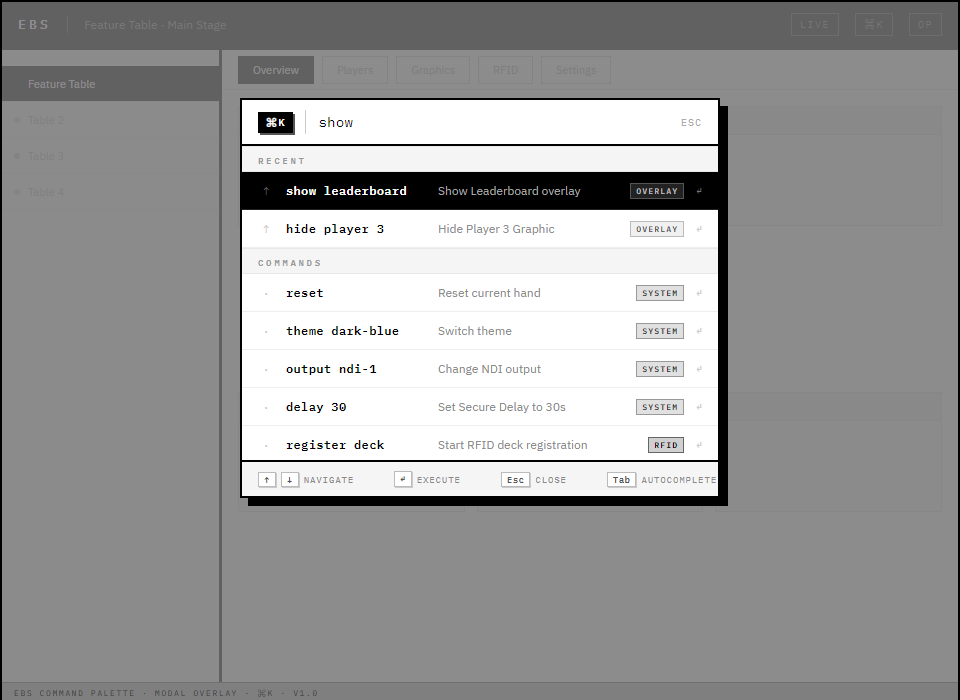

# EBS UI Design v3.0 — 앱 레이아웃 & 오버레이 그래픽 설계

## 1장. 문서 개요

### 1.1 이 문서의 목적

EBS 앱이 **어떻게 생겨야 하는지** 정의한다. 기능 카탈로그, 게임 규칙, 시나리오는 선행 문서(pokergfx-prd-v2.md)에 정의되어 있으며, 기술 스택과 아키텍처는 v2.0(EBS-UI-Design-v2.prd.md)에 정의되어 있다. 본 문서는 이 두 문서와 **중복 없이** 앱 레이아웃과 오버레이 그래픽 배치만 다룬다.

| 내용 | pokergfx-prd-v2.md | v2.0 | **v3.0 (본 문서)** |
|------|:------------------:|:----:|:------------------:|
| 프로젝트 비전/역할/시나리오 | O | - | - |
| 22개 게임 규칙/기능 카탈로그 | O | - | - |
| 기술 스택/아키텍처 | - | O | - |
| **앱 레이아웃 설계** | - | - | **O** |
| **오버레이 그래픽 배치** | - | - | **O** |
| **현대 UI 패러다임 적용** | - | - | **O** |

### 1.2 설계 철학

**PokerGFX 구조를 따라갈 이유가 없다.** PokerGFX는 2010년대 WinForms 6탭 구조다. EBS는 프로덕션 검증된 3개 벤치마크 앱에서 추출한 패턴을 적용하여, 가장 세련되고 혁신적인 방송 제어 앱으로 설계한다.

### 1.3 벤치마크 앱 3선

모든 설계 결정은 아래 3개 프로덕션 검증 앱에서 추출한 패턴에 근거한다.

**BM-1: Ross Video DashBoard** (방송 제어)

> 
>
> *Ross Video DashBoard v9: 단일 인터페이스에서 오디오/비디오 채널을 통합 제어하는 CustomPanel 구조*

> 
>
> *DashBoard 9.0 Aura 테마: 역할별 레이아웃 전환과 다크 테마 기반 방송 제어 UI*

- 검증: Super Bowl LVIII 그래픽 운영, SoFi Stadium 상설 시스템, NBC/ESPN/Sky Sports 등 전 세계 방송국 표준 제어 소프트웨어. **라이브 스포츠 방송 제어의 사실상 표준**.
- 추출 패턴: CustomPanel 빌더 (운영자가 패널 직접 구성), 단일 인터페이스 철학 (탭 분리 X), 역할별 레이아웃 전환
- EBS 적용: 하이브리드 레이아웃 (사이드바 + 중앙 프리뷰 + 컨텍스트 패널)

**BM-2: Bloomberg Terminal** (정보 밀도 + 키보드 퍼스트)

> 
>
> *Bloomberg Terminal: 수천 개 데이터를 한 화면에 배치하는 적응형 정보 밀도 UI. 커맨드 라인 즉시 접근 패턴의 원조.*

- 검증: 325,000+ 구독자, 2019년 Chromium 기반 전환, 금융 업계 40년 표준. **실시간 데이터 밀도 UI의 최고 레퍼런스** — 수천 개 데이터를 한 화면에 제어하는 UX 패턴이 방송 제어와 동일 문제를 해결.
- 추출 패턴: 커맨드 라인 즉시 접근, 적응형 정보 밀도, 키보드 우선 조작
- EBS 적용: 커맨드 팔레트 (Cmd+K), 게임 상태별 정보량 자동 조절

**BM-3: GGPoker + GTO Wizard** (포커 오버레이 혁신)

> 
>
> *GGPoker 방송 오버레이: Glassmorphism 카드 UI, 네온/글로우 이벤트 강조, Bold 타이포 핵심 수치 강조*

> 
>
> *GTO Wizard 실시간 분석 오버레이: 확률/Equity 표시, 상태별 동적 UI 전환*

- 검증: 세계 최대 온라인 포커 플랫폼 (WSOP Online 독점 파트너), GTO Wizard의 실시간 분석 오버레이. **포커 시각화의 최신 트렌드 레퍼런스** — PokerStars, 888poker 등 주요 플랫폼이 동일 UI 패턴(Glassmorphism, 네온 강조)을 채택.
- 추출 패턴: Glassmorphism 카드 UI, 네온/글로우 이벤트 강조, Bold 타이포 핵심 수치 강조
- EBS 적용: 오버레이 현대화, 상태별 동적 UI, 올인/빅팟 발광 효과

### 1.4 설계 패턴 ↔ 벤치마크 매핑

| 설계 패턴 | 벤치마크 출처 | EBS 적용 |
|-----------|:------------:|----------|
| 하이브리드 레이아웃 | BM-1 Ross | 사이드바 + 중앙 프리뷰 + 컨텍스트 패널 |
| 커맨드 팔레트 | BM-2 Bloomberg | Cmd+K로 모든 조작에 즉시 접근 |
| 적응형 정보 밀도 | BM-2 Bloomberg | AT/오버레이에서 게임 진행에 따라 정보량 자동 조절 (Console은 수동 탭 전환) |
| Glassmorphism 오버레이 | BM-3 GGPoker | 반투명 프로스트 카드/팟/확률 패널 |
| Bold 타이포 + 네온 | BM-3 GGPoker | 핵심 수치 강조, 올인 이벤트 발광 효과 |
| LCH 색공간 테마 | BM-3 + 업계 트렌드 | 3변수(base, accent, contrast) 커스텀 테마 |

### 1.5 불필요 기능 제거

PokerGFX 247개 요소 중 **54개 비활성화** (whitepaper 분석):

| 범주 | 수량 | 사유 |
|------|:----:|------|
| 카메라/녹화/연출 | 19 | 프로덕션 팀(스위처/카메라)이 담당 |
| Delay/Secure Mode | 9 | EBS 송출 딜레이 장비로 대체 |
| 외부 연동 기기 | 7 | Stream Deck, MultiGFX, ATEM 미사용 |
| Twitch 연동 | 5 | Twitch 스트리밍 미운영 |
| 기타 | 14 | 태그, 라이선스, 시스템, 레거시 UI |

## 2장. EBS Console — 전면 재설계

PokerGFX의 776x660px WinForms 6탭 구조를 완전히 탈피한다.

### 핵심 혁신

| PokerGFX (레거시) | EBS v3.0 (혁신) | 벤치마크 |
|-------------------|-----------------|:--------:|
| 6탭 WinForms (Sources, Outputs, GFX 1/2/3, System) | 하이브리드 레이아웃 (사이드바 + 프리뷰 + 컨텍스트) | BM-1 Ross |
| 고정 컨트롤 패널 | 탭 기반 설정 패널 + 커맨드 팔레트 (Cmd+K) | BM-1 + BM-2 |
| 메뉴 → 탭 → 서브그룹 탐색 | 커맨드 팔레트 (Cmd+K) 즉시 접근 | BM-2 Bloomberg |

### 2.1 메인 레이아웃

**최소 해상도**: 1024x768 | **권장**: 1920x1080
**레이아웃 비율**: 사이드바 220px (고정) / 중앙 프리뷰 (가변) / 컨텍스트 패널 320px (고정)

> 
>
> *EBS Console v3.0: 3컬럼 하이브리드 레이아웃 (사이드바 220px + 중앙 프리뷰 16:9 + 설정 패널 320px). 우측 설정 패널에서 Sources, Outputs, GFX, System 탭으로 오버레이 표시 방식을 구성한다.*

### 2.2 사이드바 (좌측 220px)

테이블 목록과 Quick Actions를 제공한다. Ross Video DashBoard의 "패널 직접 구성" 철학에서 차용.

| 영역 | 내용 |
|------|------|
| 테이블 목록 | 활성 테이블 리스트. 선택 시 중앙 프리뷰와 컨텍스트 패널이 해당 테이블로 전환 |
| Quick Actions | Reset Hand, Register Deck, Launch AT, Hide GFX — 항상 접근 가능한 핵심 버튼 |
| 연결 상태 | 각 테이블의 RFID/AT/Engine 연결 상태 인디케이터 |

### 2.3 중앙 프리뷰

라이브 오버레이 미리보기. 16:9 종횡비를 유지하며, 크로마키 블루 배경 위에 현재 GFX 상태를 실시간 렌더링한다.

| 속성 | 값 |
|------|-----|
| 종횡비 | 16:9 (고정) |
| 배경 | Chroma-key Blue (#0000FF) |
| 렌더링 | 오버레이 엔진 iframe 임베드 (실시간 합성) |
| 인터랙션 | 오버레이 요소 클릭 → 설정 패널에 해당 요소 설정 표시 |

### 2.4 설정 패널 (우측 320px)

PokerGFX GfxServer의 6탭 구조를 3컬럼 레이아웃의 우측 패널로 재배치. Console은 **오버레이 표시 방식**만 제어하며, 게임 데이터(블라인드 값, 플레이어, 스택)는 AT에서 입력한다.

| 탭 | 내용 | PokerGFX 대응 |
|----|------|:---:|
| Sources | 비디오 입력 장치, 카메라 모드(Static/Dynamic), Chroma Key, 보드 싱크 보정 | Sources 탭 |
| Outputs | 출력 해상도, Live/Delay 파이프라인, Secure Delay, 프레임레이트 | Outputs 탭 |
| GFX | 오버레이 레이아웃(Board Position, Player Layout), 애니메이션(Transition In/Out), 스킨, 수치 형식(8종 영역별 정밀도), 통화 기호, 블라인드/Equity/Outs 표시 조건, 리더보드 옵션, 마진 | GFX 1+2+3 통합 |
| System | RFID 안테나 제어(UPCARD/Muck/Community), AT 접근 허용, 캘리브레이션, 테이블 진단 | System 탭 |
| 프리뷰 요소 클릭 시 | 해당 오버레이 요소의 상세 설정 (위치, 크기, 표시 조건) | EBS 신규 |

#### Sources 탭

> 
>
> *Sources 탭: Video Sources 테이블(L/R/Source/Format/Cycle/Status/Action) + Camera Mode(Static/Dynamic) + Chroma Key + ATEM Control(조건부)*

Video Sources 테이블에서 NDI/캡처카드/네트워크 카메라를 관리한다. Camera Mode로 Static/Dynamic을 전환하고, Chroma Key와 ATEM 스위처 연결을 설정한다.

#### Outputs 탭

> 
>
> *Outputs 탭: Resolution(Video Size/9x16/Frame Rate) + Live Pipeline(Video/Audio/Device) + Fill & Key(듀얼 미니 프리뷰 + Channel Map)*

출력 해상도와 프레임레이트를 설정하고, DeckLink/NDI 출력 파이프라인을 구성한다. Fill & Key 모드 시 듀얼 미니 프리뷰로 Fill/Key 신호를 확인한다.

#### GFX 탭

> 
>
> *GFX 탭: Layout(Board Position/Player Layout/Margins) + Card & Player + Animation(Transition In/Out) + Branding(Sponsor Logos/Vanity Text) + Numbers(Precision 5행/Mode 3행) + Rules*

PokerGFX GFX 1+2+3을 단일 스크롤 패널로 통합. Layout → Card & Player → Animation → Branding → Numbers → Rules 순서로 서브그룹을 배치한다.

#### System 탭

> 
>
> *System 탭: RFID(상단 — Reset/Calibrate + 안테나 제어) + Table(Name/Password) + AT(Allow Access/Predictive Bet) + Diagnostics(Table Diagnostics/System Log/Export) + Startup*

RFID 연결이 방송 시작의 첫 번째 전제 조건이므로 최상단에 배치. Table 식별, AT 접근 정책, 시스템 진단 순서로 구성한다.

### 2.5 커맨드 팔레트 (Cmd+K)

Bloomberg Terminal의 커맨드 라인에서 차용. 모든 기능에 키보드로 즉시 접근한다.

> 
>
> *Command Palette (⌘K): 배경 dimming + 480px 모달. RECENT/COMMANDS 섹션 분리, 카테고리 뱃지(OVERLAY/SYSTEM/RFID), 키보드 힌트(↑↓/↵/Esc/Tab).*

| 명령 예시 | 동작 |
|----------|------|
| `show leaderboard` | Leaderboard 오버레이 표시 |
| `hide player 3` | 좌석 3 Player Graphic 숨김 |
| `reset` | 현재 핸드 초기화 |
| `theme dark-blue` | 테마 전환 |
| `output ndi-1` | NDI 출력 채널 변경 |
| `delay 30` | Secure Delay 시간 변경 |

**자연어 퍼지 매칭**: `del 30` → `delay 30`으로 해석. 최근 명령 히스토리 표시.

### 2.6 상태 바 (하단)

| 인디케이터 | 내용 |
|-----------|------|
| RFID 상태 | Connected (녹색) / Disconnected (빨간색) + heartbeat |
| 핸드 번호 | Hand #247 (자동 증가) |
| 딜레이 카운터 | DELAYED 모드 활성 시 남은 시간 표시 (SEC-002) |
| 단축키 가이드 | Ctrl+? 으로 전체 단축키 목록 토글 |
| Engine 상태 | Game Engine 연결 + CPU/메모리 사용률 |

## 3장. Action Tracker — 터치 최적화 재설계

PokerGFX 버튼 나열식 → 제스처 기반 터치 인터페이스로 재설계한다.

### 핵심 혁신

| PokerGFX (레거시) | EBS v3.0 (혁신) | 벤치마크 |
|-------------------|-----------------|:--------:|
| 버튼 그리드 나열 | 제스처 인터랙션 (탭=선택, 스와이프=폴드, 롱프레스=상세) | EBS 독자 설계 |
| 고정 10인 레이아웃 | 그리드 기반 배치 + 템플릿 시스템 (최대 10인) | BM-1 + BM-2 |
| 텍스트 입력 금액 | 전용 숫자 키패드 + Quick Bet 프리셋 | BM-3 GGPoker |
| 딜러 전용 좌석 (P5) | 딜러는 좌석이 아닌 BTN 뱃지로 표시 | EBS 독자 설계 |

### 3.1 메인 레이아웃 (가로 고정)

기본 9인 레이아웃. 딜러(P5)를 제거하고 P1-P9로 재구성한다.

> 
>
> *Action Tracker v3.0: 9인 타원형 좌석 배치 + 하단 액션 패널 + 숫자 키패드. 좌석 상태별 시각 처리 (Active=반전, Folded=반투명, Open=점선).*

**포지션 재구성 매핑** (기존 10인 → 9인):

| 기존 (10인) | 신규 (9인) | 변경 사유 |
|:-----------:|:---------:|----------|
| P1 | P1 | 유지 |
| P2 | P2 | 유지 |
| P3 | P3 | 유지 |
| P4 | P4 | 유지 |
| P5 (딜러) | — | 제거: 딜러는 BTN 뱃지로 표시 |
| P6 | P5 | 번호 재배치 |
| P7 | P6 | 번호 재배치 |
| P8 | P7 | 번호 재배치 |
| P9 | P8 | 번호 재배치 |
| P10 | P9 | 번호 재배치 |

### 3.2 좌석 시스템

| 요소 | 사양 |
|------|------|
| 좌석 수 | P1-P9 (기본 9인). 설정에서 최대 10인까지 확장 가능 |
| 배치 방식 | 그리드 기반 좌표 시스템 (3.3절 참조) |
| 선택 | 탭하여 좌석 선택 → Action-on 하이라이트 |
| 최소 터치 타겟 | 48x48px (WCAG 2.5.8) |
| 카드 표시 | 홀카드 슬롯 (Holdem 2장, PLO 4/5/6장) — 게임 타입 연동 |

**딜러 표시**: 딜러는 별도 좌석이 아니다. 임의의 플레이어 좌석에 BTN 뱃지가 부착된다.

| 뱃지 | 표시 조건 | 시각 처리 |
|------|----------|----------|
| BTN | 딜러 버튼 보유 플레이어 | 흰색 원형 뱃지, 좌석 우상단 |
| SB | Small Blind 위치 | 노란색 뱃지 |
| BB | Big Blind 위치 | 파란색 뱃지 |

좌석 상태별 시각 처리:

| 상태 | 시각 처리 |
|------|----------|
| Active (Action-on) | 밝은 테두리 + 펄스 애니메이션 |
| Acted | 액션 텍스트 (BET 500, CALL, RAISE TO 1000) |
| Folded | 반투명 (opacity 0.4) + 회색 |
| All-in | 스택 강조 + 네온 글로우 (BM-3) |
| Empty | 빈 좌석 아이콘 + "OPEN" 라벨 |
| Sitting Out | 회색 + "AWAY" 라벨 |

### 3.3 테이블 레이아웃 템플릿

운영자가 테이블 형태를 선택하면 좌석 배치가 자동 적용된다. 4종 기본 템플릿을 제공하며, 개별 좌석 위치를 그리드 위에서 자유 조정할 수 있다.

#### 3.3.1 그리드 시스템

테이블 영역을 **12x8 그리드**로 분할한다. 각 좌석은 그리드 셀 좌표 `(col, row)`로 배치된다.

> 
> *12x8 그리드 시스템 — BOARD CARDS(C5-C8, R4) + POT(C6-C7, R5) 하이라이트*

- 보드 카드 영역: 고정 위치 `(C5-C8, R4)` — 이동 불가
- POT 표시: 보드 카드 하단 `(C6-C7, R5)` — 자동 배치
- 좌석은 그리드 셀 위에 드래그 앤 드롭으로 재배치 가능

#### 3.3.2 템플릿 A: 타원형 (Oval) — 기본값

9인 표준 배치. 대부분의 캐시 게임/토너먼트에 적합.

> 
> *템플릿 A: 타원형(Oval) — 9인 표준 배치*

| 좌석 | 그리드 좌표 |
|:----:|:----------:|
| P1 | (C10, R2) |
| P2 | (C11, R3) |
| P3 | (C11, R6) |
| P4 | (C10, R7) |
| P5 | (C3, R7) |
| P6 | (C2, R6) |
| P7 | (C2, R3) |
| P8 | (C3, R2) |
| P9 | (C6, R1) |

#### 3.3.3 템플릿 B: 육각형 (Hexagonal)

6인/8인 소규모 테이블에 최적화. P1을 좌하단(C4,R7)에서 시작하여 반시계 방향으로 순차 넘버링.

> 
> *템플릿 B: 육각형(Hexagonal) — 8인 소규모 배치*

| 좌석 | 그리드 좌표 |
|:----:|:----------:|
| P1 | (C4, R7) |
| P2 | (C2, R6) |
| P3 | (C2, R3) |
| P4 | (C4, R2) |
| P5 | (C9, R2) |
| P6 | (C11, R3) |
| P7 | (C11, R6) |
| P8 | (C9, R7) |

#### 3.3.4 템플릿 C: 반원형 (Semicircle)

BOARD CARDS를 밑변으로 두고 좌석이 위로 반원 아치를 형성. 방송 카메라가 하단에서 촬영하는 환경에 최적화.

> 
> *템플릿 C: 반원형(Semicircle) — BOARD 밑변 반원 배치*

| 좌석 | 그리드 좌표 |
|:----:|:----------:|
| P1 | (C1, R4) |
| P2 | (C2, R2) |
| P3 | (C3, R1) |
| P4 | (C5, R1) |
| P5 | (C7, R1) |
| P6 | (C9, R1) |
| P7 | (C11, R1) |
| P8 | (C12, R2) |
| P9 | (C12, R4) |

#### 3.3.5 커스텀 배치

템플릿을 기반으로 개별 좌석을 드래그하여 위치를 변경할 수 있다.

| 기능 | 사양 |
|------|------|
| 드래그 앤 드롭 | 좌석을 그리드 셀로 이동. 스냅 적용 |
| 좌석 추가 | 최대 10인까지 확장. [+] 버튼으로 P10 추가 |
| 좌석 제거 | 빈 좌석을 길게 눌러 제거 (최소 2인 유지) |
| 프리셋 저장 | 커스텀 배치를 이름 붙여 저장 (최대 10개) |
| 충돌 방지 | 좌석 간 최소 1셀 간격 유지 (겹침 불허) |

### 3.4 액션 패널 (하단 고정)

화면 하단 1/3에 고정. 게임 상태별로 버튼이 **동적 전환**된다.

| 게임 상태 | 표시 버튼 |
|----------|----------|
| PRE_FLOP | CHECK, BET, CALL, RAISE, FOLD, ALL-IN |
| FLOP~RIVER | CHECK, BET, CALL, RAISE, FOLD, ALL-IN |
| SHOWDOWN | MUCK, SHOW, SPLIT POT |
| SETUP_HAND | NEW HAND, EDIT SEATS |

**UNDO**: 항상 표시. 최대 5단계 되돌리기.

### 3.5 베팅 입력

| 요소 | 사양 |
|------|------|
| Quick Bet | 1/2 POT, 2/3 POT, POT, 2x POT 프리셋 버튼 |
| 숫자 키패드 | 전용 키패드 (시스템 키보드 미사용). BET/RAISE 선택 시 슬라이드업 |
| +/- 조정 | BB 단위 증감 버튼 |
| Min/Max | 최소 레이즈/올인 바로가기 |

### 3.6 화면 상태 전환

게임 진행에 따라 AT 화면 정보량이 자동 조절된다 (BM-2 적응형 정보 밀도).

| 상태 | 정보량 | 변화 |
|------|:------:|------|
| IDLE | 최소 | 좌석 배치 + 스택만 표시 |
| PRE_FLOP | 기본 | 액션 버튼 활성화, 포지션 뱃지 표시 |
| FLOP | 중간 | 보드 카드 3장 표시, 팟 금액 갱신 |
| TURN/RIVER | 높음 | 보드 카드 추가, 팟/사이드팟 상세 |
| SHOWDOWN | 최대 | 위너 강조, 팟 분배 표시, 핸드 결과 |

## 4장. 오버레이 그래픽 — HTML 템플릿 기반 재설계

오버레이는 메인 방송 영상 위에 **덧입히는 부가 그래픽**이다. 화면 중앙은 메인 영상이 차지하고, 오버레이는 가장자리(좌/우/상/하)에 배치한다. 폴드한 플레이어는 즉시 제거하여 **액티브 플레이어만** 표시한다.

### 핵심 혁신

| PokerGFX (레거시) | EBS v3.0 (혁신) | 벤치마크 |
|-------------------|-----------------|:--------:|
| 불투명 박스 배경 | Glassmorphism (반투명 프로스트 + backdrop-blur) | BM-3 GGPoker |
| 고정 정보량 | 적응형 정보 밀도 (프리플랍=기본, 리버=최대) | BM-2 Bloomberg |
| 정적 텍스트 | 네온/글로우 이벤트 강조 (올인, 빅 팟) | BM-3 GGPoker |
| 일반 폰트 크기 | Bold 타이포 핵심 수치 (팟, 스택) 시각 강조 | BM-3 GGPoker |
| 고정 배치 (10인 전원 표시) | HTML 템플릿 + 가장자리 배치 (액티브만 표시) | EBS 독자 설계 |

### 배제 6종 (PokerGFX 15종 → EBS 9종)

| 배제 오버레이 | 사유 |
|-------------|------|
| Commentary Header | SV-021 Drop — Commentary 기능 EBS 배제 |
| PIP Commentary | SV-022 Drop — 동일 사유 |
| Countdown | SEC-002는 Console Status Bar로 이관 |
| Action Clock | SV-017 Drop |
| Split Screen Divider | 헤즈업 전용, v1.0 Defer |
| Heads-Up History | 헤즈업 전용, v1.0 Defer |

### 4.1 오버레이 설계 철학

#### 부가 그래픽 원칙

오버레이는 메인 영상을 보조하는 요소이다. 메인 영상이 화면의 중심을 차지하고, 오버레이는 시청자의 시선을 방해하지 않는 **가장자리 영역**에 배치한다.

| 원칙 | 설명 |
|------|------|
| 메인 영상 우선 | 화면 중앙(약 60% 영역)은 메인 카메라 영상 전용. 오버레이 침범 금지 |
| 가장자리 배치 | Player Graphic은 좌/우/하단 가장자리에만 배치 |
| 액티브 플레이어만 표시 | 폴드한 플레이어는 **즉시 제거** (기존: opacity 0.4 유지 → 신규: 완전 제거) |
| 3인 기본 | 대부분의 실전 핸드는 플랍 이후 2~4인. **3인 액티브가 디폴트 레이아웃** |
| 최소 정보량 | 필수 정보(이름, 스택, 카드, 액션)만 표시. 시각 잡음 최소화 |

#### 표시 규칙

| 이벤트 | 오버레이 동작 |
|--------|-------------|
| 핸드 시작 | 모든 참여 플레이어 Player Graphic 표시 |
| 플레이어 폴드 | 해당 Player Graphic **즉시 페이드아웃 제거** (300ms) |
| 쇼다운 진입 | 남은 액티브 플레이어만 유지 |
| 핸드 종료 | 위너 하이라이트 2초 → 전체 클리어 |

### 4.2 전체 배치도 (1920x1080)

기본 레이아웃: 3인 액티브 플레이어. 화면 중앙은 **메인 영상 영역**으로 비워둔다.

#### 배치 A: 하단 집중형 (기본값)

Player Graphic을 하단 가장자리에 일렬 배치. 가장 범용적인 레이아웃.

> 
>
> *오버레이 배치 A (하단 집중형): Strip 상단 바 + Board Graphic 중앙 + Player Graphic x3 하단 가장자리 + Blinds 바 + Ticker. 메인 영상 영역(회색)은 비움.*

#### 배치 B: 좌우 분산형

Player Graphic을 좌측/우측 가장자리에 세로 배치. 와이드 테이블 촬영에 적합.

> 
>
> *배치 B: Player 1, 2를 좌측 가장자리에 세로 배치, Player 3을 우측 가장자리에 배치. 중앙 메인 영상 영역 확보.*

#### 배치 C: L자형

좌측 + 하단에 L자로 배치. 우측을 완전히 비워 카메라 앵글 확보.

> 
>
> *배치 C: Player 1, 2를 좌측에 세로 배치, Player 3을 하단 우측에 배치. 우측 상단을 완전히 비워 카메라 앵글 확보.*

#### 배치 커스터마이징

모든 오버레이 요소는 픽셀 단위로 위치와 크기를 조정할 수 있다.

| 속성 | 타입 | 설명 | 기본값 예시 |
|------|------|------|-----------|
| x | int | 좌측 기준 X 좌표 (px) | 40 |
| y | int | 상단 기준 Y 좌표 (px) | 780 |
| width | int | 요소 너비 (px) | 280 |
| height | int | 요소 높이 (px) | 180 |
| alignment | enum | left / center / right | left |
| anchor | enum | top-left / top-right / bottom-left / bottom-right | bottom-left |
| visible | bool | 표시 여부 | true |
| z-index | int | 레이어 순서 (높을수록 앞) | 100 |

#### Board Graphic 위치 옵션

Board Graphic은 3가지 배치 중 선택한다.

| 옵션 | 위치 | 적합한 상황 |
|------|------|-----------|
| 하단 중앙 (기본) | x=760, y=620 | 하단 집중형 배치와 조합 |
| 좌측 | x=40, y=450 | 좌우 분산형에서 좌측 그룹과 근접 |
| 우측 | x=1440, y=450 | 우측에 플레이어 집중 시 |

### 4.3 HTML 템플릿 시스템

모든 오버레이는 **HTML 파일**로 정의된다. OBS/vMix 등 방송 소프트웨어의 Browser Source로 로드하며, CSS 변수와 JavaScript 바인딩으로 실시간 데이터를 반영한다.

#### 템플릿 구조

```
templates/
  player/
    standard.html      # 기본 Player Graphic
    compact.html        # 축소형
    minimal.html        # 최소형
  board/
    standard.html       # 기본 Board Graphic
    compact.html        # 축소형
  blinds/
    standard.html       # 기본 Blinds 바
  field/
    standard.html       # Field 오버레이
  leaderboard/
    standard.html       # Leaderboard 테이블
  ticker/
    standard.html       # Ticker 스크롤
  strip/
    standard.html       # Strip 상단 바
  custom/               # 사용자 커스텀 템플릿 저장 위치
```

#### CSS 변수 커스터마이징

모든 템플릿은 CSS Custom Properties로 스타일을 제어한다.

| CSS 변수 | 용도 | 기본값 |
|----------|------|--------|
| `--player-width` | Player Graphic 너비 | 280px |
| `--player-height` | Player Graphic 높이 | 180px |
| `--player-bg` | 배경색 | rgba(13, 13, 26, 0.65) |
| `--player-blur` | 배경 블러 | 12px |
| `--player-border` | 테두리 | 1px solid rgba(255,255,255,0.08) |
| `--font-primary` | 기본 폰트 | 'Inter', sans-serif |
| `--font-size-name` | 이름 폰트 크기 | 16px |
| `--font-size-stack` | 스택 폰트 크기 | 20px |
| `--color-accent` | 강조 색상 | #00d4ff |
| `--color-allin` | 올인 글로우 | #ff6b35 |
| `--card-width` | 카드 이미지 너비 | 60px |
| `--card-height` | 카드 이미지 높이 | 84px |

#### 템플릿 변수 바인딩

EBS Server가 WebSocket으로 전달하는 데이터를 HTML 템플릿에 바인딩한다.

| 변수 | 타입 | 설명 |
|------|------|------|
| `{{player.name}}` | string | 플레이어명 |
| `{{player.stack}}` | number | 스택 금액 |
| `{{player.cards}}` | array | 홀카드 배열 |
| `{{player.action}}` | string | 현재 액션 (BET/CALL/RAISE/FOLD/ALL-IN) |
| `{{player.amount}}` | number | 액션 금액 |
| `{{player.position}}` | string | 포지션 뱃지 (BTN/SB/BB) |
| `{{player.photo}}` | string | 사진 URL |
| `{{player.country}}` | string | 국가 코드 (ISO 3166-1) |
| `{{player.active}}` | bool | 액티브 여부 (false → 오버레이 제거) |
| `{{board.cards}}` | array | 보드 카드 배열 |
| `{{pot.main}}` | number | 메인 팟 |
| `{{pot.side}}` | array | 사이드팟 배열 |
| `{{hand.number}}` | number | 핸드 번호 |
| `{{blinds.sb}}` | number | Small Blind |
| `{{blinds.bb}}` | number | Big Blind |
| `{{blinds.ante}}` | number | Ante |

#### 커스텀 템플릿 관리

| 기능 | 설명 |
|------|------|
| 저장 | 현재 설정을 `custom/` 디렉토리에 이름 붙여 저장 |
| 로드 | 저장된 커스텀 템플릿 목록에서 선택하여 적용 |
| 내보내기 | 템플릿 HTML + CSS를 ZIP으로 내보내기 |
| 가져오기 | 외부 HTML 템플릿 파일 import |
| 최대 슬롯 | 사용자 커스텀 템플릿 최대 20개 |

### 4.4 Player Graphic — HTML 템플릿

핵심 오버레이. 액티브 플레이어에게만 표시된다.

#### 서브 컴포넌트

> 
>
> *Player Graphic Standard: 사진(A) + 이름/플래그/포지션(B~G) + 스택(Bold) + 홀카드 + 액션 + 에퀴티 바(H).*

| ID | 서브 컴포넌트 | 내용 | 표시/숨김 |
|:--:|-------------|------|:---------:|
| A | 사진 | 80x80px 원형 크롭. 미등록 시 이니셜 아바타 | 설정 가능 |
| B | 이름 | 플레이어명. 최대 16자, 초과 시 말줄임 | 항상 표시 |
| C | 스택 | 칩 스택. **Bold 타이포** (BM-3). smart precision | 항상 표시 |
| D | 홀카드 | 2~7장 (게임 타입별). 카드 등장/공개 애니메이션 | 항상 표시 |
| E | 액션 | BET/CALL/RAISE/FOLD/ALL-IN 텍스트 + 금액 | 액션 시 |
| F | 국기 | 16x12px 국기 아이콘 | 설정 가능 |
| G | 포지션 | BTN/SB/BB/UTG 등 뱃지 | 항상 표시 |
| H | 에퀴티 바 | 올인 시 승률 프로그레스 바 | 올인 시 |

#### 템플릿 변형 3종

| 변형 | 크기 | 구성 | 적합한 상황 |
|------|------|------|-----------|
| Standard | 280x180px | 전체 서브 컴포넌트 (A~H) | 기본. 3~4인 이하 |
| Compact | 220x120px | 사진 제외, 이름+스택+카드+액션 | 5~6인 |
| Minimal | 160x80px | 이름+카드만 | 7인 이상, 화면 공간 부족 시 |

#### Glassmorphism 스타일 (BM-3)

- 배경: `rgba(13, 13, 26, 0.65)` + `backdrop-filter: blur(12px)`
- 테두리: `1px solid rgba(255, 255, 255, 0.08)`
- 그림자: `0 4px 30px rgba(0, 0, 0, 0.3)`

#### 상태별 시각 전환

| 상태 | 시각 효과 |
|------|----------|
| Idle | 이름 + 스택만. 카드 슬롯 비활성 |
| Action-on | 밝은 테두리 + 미세 펄스 |
| Acted | 액션 텍스트 애니메이션 등장 |
| Fold | **즉시 페이드아웃 제거** (300ms 트랜지션) |
| All-in | **네온 글로우** (BM-3) + 에퀴티 바 표시 |
| Showdown | 카드 공개 + 위너 하이라이트 |

#### 커스터마이징 속성

| 속성 | 범위 | 설명 |
|------|------|------|
| x, y | 0~1920, 0~1080 | 배치 좌표 (px) |
| width | 120~400 | 너비 (px) |
| height | 60~250 | 높이 (px) |
| template | standard / compact / minimal | 템플릿 변형 |
| show_photo | bool | 사진 표시 여부 |
| show_flag | bool | 국기 표시 여부 |
| show_equity | bool | 에퀴티 바 표시 여부 |

### 4.5 Board Graphic — HTML 템플릿

커뮤니티 카드 5슬롯 + POT + 사이드팟.

#### 서브 컴포넌트

> 
>
> *Board Graphic Standard: 5슬롯 카드 + POT(Bold 28pt) + Side Pot + 위닝 핸드명.*

| 서브 컴포넌트 | 내용 |
|-------------|------|
| 카드 슬롯 (5) | Flop 3장 + Turn 1장 + River 1장. 순차 등장 애니메이션 |
| POT | 메인 팟 금액. **Bold 28pt** (BM-3). smart precision |
| 사이드팟 | 복수 사이드팟 금액. 일반 크기 |
| 위닝 핸드명 | "Full House", "Straight" 등. 쇼다운 시 표시 |
| 배니티 텍스트 | 커스텀 문자열 (이벤트명/스폰서) |

#### 템플릿 변형 2종

| 변형 | 크기 | 구성 | 적합한 상황 |
|------|------|------|-----------|
| Standard | 480x200px | 전체 서브 컴포넌트 | 기본 |
| Compact | 360x120px | 카드 + POT만 (사이드팟/핸드명 숨김) | 화면 공간 부족 시 |

**Glassmorphism**: Player Graphic과 동일 스타일.

#### 커스터마이징 속성

| 속성 | 범위 | 설명 |
|------|------|------|
| x, y | 0~1920, 0~1080 | 배치 좌표 (px) |
| width | 280~600 | 너비 (px) |
| height | 80~250 | 높이 (px) |
| template | standard / compact | 템플릿 변형 |
| show_sidepot | bool | 사이드팟 표시 여부 |
| show_handname | bool | 위닝 핸드명 표시 여부 |
| show_vanity | bool | 배니티 텍스트 표시 여부 |

### 4.6 Blinds Graphic — HTML 템플릿

SB/BB/Ante/핸드번호/이벤트 로고를 표시하는 정보 바.

> 
>
> *Blinds Graphic: Standard(52px, 로고+SB·BB+Ante+Hand#+Level) + Compact(36px, SB·BB+Ante+Hand# only). 다크 배경 + Glassmorphism shimmer.*

| 구성 | 내용 |
|------|------|
| 블라인드 | SB/BB 금액 (smart precision) |
| Ante | Ante 금액 + 타입 (Standard, Button, BB 등) |
| 핸드 번호 | Hand #247 (자동 증가) |
| 이벤트 로고 | 120x40px 이벤트/스폰서 로고 |
| 레벨 표시 | 블라인드 레벨 번호 (토너먼트) |

**표시 조건**: 매 핸드 자동 표시 (auto_blinds=every_hand).

#### 배치 옵션

| 옵션 | 위치 | 좌표 (기본값) |
|------|------|:------------:|
| 상단 | Status Bar 아래 | x=0, y=50 |
| 하단 (기본) | Player Graphic 위 | x=0, y=980 |
| 좌측 | 좌측 세로 배치 | x=0, y=450 |
| 우측 | 우측 세로 배치 | x=1720, y=450 |

#### 커스터마이징 속성

| 속성 | 범위 | 설명 |
|------|------|------|
| x, y | 0~1920, 0~1080 | 배치 좌표 (px) |
| width | 400~1920 | 너비 (px). 전체 너비 가능 |
| height | 30~80 | 높이 (px) |
| show_ante | bool | Ante 표시 여부 |
| show_logo | bool | 이벤트 로고 표시 여부 |
| show_level | bool | 레벨 번호 표시 여부 |

### 4.7 Field Graphic — HTML 템플릿

토너먼트 잔여/전체 플레이어 수를 표시하는 소형 오버레이.

#### 레이아웃

> 
>
> *Field Graphic: 잔여/전체 플레이어 수 + 평균 스택.*

| 구성 | 내용 |
|------|------|
| 잔여/전체 | 현재 플레이어 수 / 시작 플레이어 수 |
| 평균 스택 | 잔여 플레이어 평균 스택 (선택 표시) |

#### 커스터마이징 속성

| 속성 | 범위 | 설명 |
|------|------|------|
| x, y | 0~1920, 0~1080 | 배치 좌표 (px) |
| width | 150~400 | 너비 (px) |
| height | 30~80 | 높이 (px) |
| show_avg_stack | bool | 평균 스택 표시 여부 |
| template | standard | 템플릿 변형 |

**표시 조건**: 운영자 수동 토글.

### 4.8 Leaderboard — HTML 템플릿

전체 플레이어 순위/스택/통계를 표시하는 풀스크린 또는 사이드 오버레이.

#### 레이아웃

> 
>
> *Leaderboard: 순위 테이블 (1위 반전 강조) + 스택 + 승리 횟수. 10인 초과 시 자동 페이징.*

| 구성 | 내용 |
|------|------|
| 순위 | 스택 기준 내림차순 |
| 플레이어명 | 이름 + 국기 (선택) |
| 스택 | smart precision 적용 |
| 통계 | 승리 횟수, 올인 횟수 등 (컬럼 설정 가능) |
| 페이지네이션 | 10인 초과 시 자동 페이징 (5초 간격) |

#### 커스터마이징 속성

| 속성 | 범위 | 설명 |
|------|------|------|
| x, y | 0~1920, 0~1080 | 배치 좌표 (px) |
| width | 300~800 | 너비 (px) |
| height | 200~900 | 높이 (px) |
| rows_per_page | 5~20 | 페이지당 표시 행 수 |
| columns | array | 표시 컬럼 선택 (rank, name, stack, wins...) |
| auto_page_interval | 3~15 | 자동 페이징 간격 (초) |

**표시 조건**: 운영자 수동 토글. 핸드 진행 중에는 자동 숨김 가능.

### 4.9 Ticker — HTML 템플릿

화면 최하단에 가로 스크롤되는 텍스트 오버레이.

#### 레이아웃

> 
>
> *Ticker: 최하단 가로 스크롤 텍스트 오버레이. 핸드 결과 + 이벤트 메시지.*

| 구성 | 내용 |
|------|------|
| 스크롤 텍스트 | 좌→우 또는 우→좌 연속 스크롤 |
| 구분자 | 메시지 간 `|` 구분 |
| 내용 소스 | 자동 (핸드 결과, 엘리미네이션) + 수동 (운영자 입력 메시지) |

#### 커스터마이징 속성

| 속성 | 범위 | 설명 |
|------|------|------|
| x, y | 0~1920, 0~1080 | 배치 좌표 (px) |
| width | 800~1920 | 너비 (px). 전체 너비 가능 |
| height | 30~60 | 높이 (px) |
| speed | 1~10 | 스크롤 속도 (1=느림, 10=빠름) |
| direction | ltr / rtl | 스크롤 방향 |
| loop | bool | 반복 여부 |
| messages | array | 표시 메시지 목록 |

**표시 조건**: 자동 (핸드 결과 발생 시) + 운영자 수동 토글.

### 4.10 Strip — HTML 템플릿

화면 최상단에 모든 플레이어를 가로 요약하는 바 오버레이.

#### 레이아웃

> 
>
> *Strip: 상단 바에 전체 플레이어 요약 (이름 · 스택). 폴드 플레이어는 회색+취소선.*

| 구성 | 내용 |
|------|------|
| 플레이어 요약 | 좌석번호:이름 + 스택 (축약) |
| 정렬 | 좌석 순서 또는 스택 내림차순 (설정 가능) |
| 폴드 표시 | 폴드 플레이어는 회색 처리 (Strip에서는 제거하지 않음) |
| 누적 승리 | 승리 횟수 표시 옵션 |

#### 커스터마이징 속성

| 속성 | 범위 | 설명 |
|------|------|------|
| x, y | 0~1920, 0~1080 | 배치 좌표 (px) |
| width | 800~1920 | 너비 (px). 전체 너비 가능 |
| height | 30~60 | 높이 (px) |
| sort_by | seat / stack | 정렬 기준 |
| show_wins | bool | 누적 승리 표시 여부 |
| fold_style | gray / hide | 폴드 표시 방식 |

**표시 조건**: 운영자 수동 토글.

### 4.11 Cards 에셋 + 게임별 카드 수

#### 에셋 규격

| 속성 | 값 |
|------|-----|
| 총 수 | 52장 (조커 미사용) |
| 크기 | 60x84px (1080p 기준) |
| 포맷 | PNG 투명 배경 |
| 명명 | `{rank}{suit}.png` — 예: `Ah.png`, `2c.png` |
| 카드 백 | `back.png` (비공개 상태) |
| 스타일 | 4색 덱 옵션 (♠ 검정, ♥ 빨강, ♦ 파랑, ♣ 초록) |

#### 게임별 카드 수

Player Graphic의 홀카드 슬롯은 게임 타입에 따라 변형된다.

| 게임 타입 | 홀카드 수 | 레이아웃 변형 |
|----------|:---------:|-------------|
| Holdem | 2 | 기본 2슬롯 (60x84 x2) |
| PLO4 | 4 | 4슬롯 축소 배치 (48x67 x4) |
| PLO5 | 5 | 5슬롯 축소 배치 (42x59 x5) |
| PLO6 | 6 | 6슬롯 2행 (42x59 x6) |
| 5 Card Draw | 5 | PLO5 동일 |
| 7 Card Stud | 7 | 7슬롯 2행 (38x53 x7) |
| Short Deck | 2 | Holdem 동일 (36장 덱) |

## 5장. 화면 전환과 상태 흐름

기존 수동 전환에서 **게임 상태 연동 자동 전환**으로 진화한다.

### 5.1 게임 상태별 오버레이 변화

| 상태 | 표시 오버레이 | 정보 밀도 | 자동 동작 |
|------|-------------|:---------:|----------|
| IDLE | Blinds, Strip | 최소 | 이전 핸드 정리, 스택 갱신 |
| SETUP_HAND | Blinds, Strip, 액티브 Player만 (이름+스택) | 낮음 | 좌석 배치, 포지션 뱃지 표시 |
| PRE_FLOP | 액티브 Player만 (카드 슬롯 활성), Blinds | 기본 | 홀카드 슬롯 활성화, 액션 대기 |
| FLOP | 액티브 Player만, Board (3장), Blinds, Field | 중간 | 보드 3장 순차 등장 애니메이션 |
| TURN | 액티브 Player만, Board (4장), Blinds, Field | 높음 | Turn 카드 등장, 팟 갱신 |
| RIVER | 액티브 Player만, Board (5장), Blinds, Field | 높음 | River 카드 등장, 최종 팟 |
| SHOWDOWN | 액티브 Player만 (카드 공개), Board, Blinds | 최대 | 카드 공개 + 위너 하이라이트 + 핸드명 |
| HAND_COMPLETE | 결과 요약 → IDLE 전환 | 감소 | 3초 결과 표시 후 자동 정리 |

**액티브 플레이어 배치 자동 재정렬**: 폴드로 인해 액티브 플레이어 수가 변동하면, 남은 Player Graphic이 현재 배치 옵션(하단 집중형/좌우 분산형/L자형)에 맞춰 자동 재배치된다. 간격은 균등 분배하며, 트랜지션은 400ms ease-out으로 적용한다.

### 5.2 이벤트 기반 강조 (BM-3 GGPoker 패턴)

특정 이벤트 발생 시 일반 렌더링 위에 **특수 연출**을 오버레이한다.

| 이벤트 | 연출 | 지속 시간 |
|--------|------|:---------:|
| **All-in** | 네온 글로우 테두리 + 에퀴티 바 슬라이드인 + 스택 Bold 강조 | 지속 (해소 시까지) |
| **Big Pot** (>50BB) | 팟 숫자 스케일업 + 글로우 펄스 | 2초 |
| **Bad Beat** | 위너 카드 빨간 하이라이트 + 카메라 전환 신호 | 3초 |
| **Showdown Winner** | 위닝 핸드 카드 블링크 + 핸드명 팝업 | 3초 |
| **Fold** | 폴드 플레이어 Graphic 즉시 페이드아웃 제거 (300ms) + 남은 Player 자동 재배치 | 0.3초 |
| **Fold (단독 승리)** | 마지막 생존자 스택에 팟 합산 애니메이션 | 1.5초 |
| **Side Pot 생성** | 사이드팟 텍스트 슬라이드인 | 1초 |

### 5.3 Live vs Delayed 모드

시청자 정보 공개 시점이 다른 두 모드.

| 항목 | Live 모드 | Delayed 모드 |
|------|----------|-------------|
| 홀카드 | 즉시 공개 (card_reveal=immediate) | 딜레이 버퍼 경과 후 공개 |
| 에퀴티 | 올인 시 즉시 표시 | 딜레이 후 표시 |
| 팟 금액 | 실시간 갱신 | 딜레이 적용 |
| 전환 방식 | Console Status Bar에서 LIVE/DELAYED 토글 | — |
| 딜레이 버퍼 | 없음 | 30초 기본 (Console에서 조절 가능) |

## 6장. 제약 조건

### 6.1 화면 크기

| 앱 | 최소 | 권장 | 비고 |
|----|------|------|------|
| EBS Console | 1024x768 | 1920x1080 | 반응형, 사이드바/컨텍스트 패널 고정폭 |
| Action Tracker | 1024x600 | 1280x800 | 태블릿 가로(Landscape) 고정 |
| 오버레이 출력 | 1920x1080 | 1920x1080 | 방송 표준 (4K 스케일링 대응) |
| 오버레이 세로 | 1080x1920 | 1080x1920 | 9:16 모바일 스트리밍 |

### 6.2 터치 제약 (Action Tracker)

| 항목 | 사양 |
|------|------|
| 최소 터치 타겟 | 48x48px (WCAG 2.5.8) |
| 액션 버튼 영역 | 화면 하단 1/3 고정 (thumb zone) |
| 방향 | 가로(Landscape) 고정. 세로 전환 불가 |
| 제스처 | 탭(선택), 스와이프 좌측(폴드), 롱프레스(상세 정보) |
| 멀티터치 | 지원하지 않음 (오입력 방지) |

### 6.3 오버레이 렌더링 제약

| 항목 | 사양 |
|------|------|
| 프레임레이트 | 60fps 최소 (GPU 가속 렌더링) |
| 렌더링 영역 | 1920x1080 고정 캔버스 |
| 투명도 지원 | Fill & Key NDI 출력 (알파 채널 필수) |
| 폰트 | 시스템 산세리프 기본. 커스텀 폰트 로딩 지원 |
| 카드 에셋 | 60x84px PNG 투명 배경 x 52장 + 카드 백 1장 |
| HTML 템플릿 | 각 오버레이당 1개 HTML 파일. CSS 변수 바인딩 필수 |
| 커스터마이징 범위 | 위치/크기 자유 설정. 화면 경계 밖 배치 금지. 최소 크기 60x40px |
| 템플릿 저장 | 사용자 커스텀 템플릿 최대 20개 저장 |

### 6.4 레퍼런스

| 자료 | 경로 |
|------|------|
| PokerGFX 주석 이미지 | `docs/01_PokerGFX_Analysis/02_Annotated_ngd/` |
| PokerGFX 크롭 이미지 | `docs/01_PokerGFX_Analysis/03_Cropped_ngd/` |
| PokerGFX 매뉴얼 | `docs/01_PokerGFX_Analysis/03_Reference_ngd/` |
| Whitepaper (247개 요소) | `C:/claude/ui_overlay/docs/03-analysis/pokergfx-v3.2-complete-whitepaper.md` |
| Feature Interactions | `docs/01_PokerGFX_Analysis/PRD-0004-feature-interactions.md` |
| v2.0 기술 아키텍처 | `docs/00-prd/EBS-UI-Design-v2.prd.md` |

---

## Changelog

| 날짜 | 버전 | 변경 내용 | 결정 근거 |
|------|------|-----------|----------|
| 2026-03-05 | v2.5.0 | Console 설정 패널 4탭(Sources/Outputs/GFX/System) + Command Palette + Blinds Graphic HTML/PNG 목업 6종 추가. PRD 2.4~2.5절, 4.6절에 이미지 임베드 | 누락된 Console 탭별 레이아웃 설계 완성 |
| 2026-03-05 | v2.4.0 | 잔여 ASCII 5개(그리드 시스템 + 좌석 템플릿 A/B/C/D) → HTML/PNG B&W 목업 교체. 문서 내 ASCII 와이어프레임 완전 제거 (디렉토리 트리 1개만 잔존) | 문서 시각 무결성 통일 — 모든 UI 다이어그램 PNG 표준화 |
| 2026-03-05 | v2.3.0 | 전체 ASCII 와이어프레임 11개를 HTML/PNG B&W 목업으로 교체. 신규 목업 8종 추가 (Layout B/C, Player/Board/Field Graphic, Leaderboard, Ticker, Strip). 기존 PNG 3종 공백 제거 재캡처. | ASCII는 렌더링 환경 의존, PNG 표준화로 문서 품질 통일 |
| 2026-03-05 | v2.2.0 | 2장 Console 설정 패널: PokerGFX GfxServer 6탭 구조 기반 재설계 (Sources/Outputs/GFX/System). 게임 데이터 항목(블라인드 값, 게임 타입, 플레이어 좌석/스택, RFID 매핑) 제거 — 원본 GfxServer에도 없는 기능. Console = 오버레이 표시 방식 제어 전용. | PokerGFX 역설계 문서 기반 정확 복제 |
| 2026-03-05 | v2.1.0 | 2장 Console 설계: 컨텍스트 패널 게임 상태 자동 전환 제거 → 탭 기반 설정 패널로 변경. Console은 사전 세팅 도구이므로 게임 상태 모니터링 불필요 (AT/오버레이에만 적용) | Console 역할 명확화 — 세팅 도구에 실시간 모니터링 패턴 적용은 over-engineering |
| 2026-03-05 | v2.0.0 | 3장 AT 레이아웃 전면 재설계 (9인, 그리드 템플릿), 4장 오버레이 가장자리 배치 + HTML 템플릿 시스템 전면 재설계 | 딜러 포지션 제거, 오버레이 부가 그래픽 철학 적용, 풀 커스텀 템플릿 도입 |
| 2026-03-05 | v1.0.0 | 최초 작성 | v2.0 기술 문서 분리, 벤치마크 기반 UI 전면 재설계 |

---

**Version**: 2.4.0 | **Updated**: 2026-03-05
