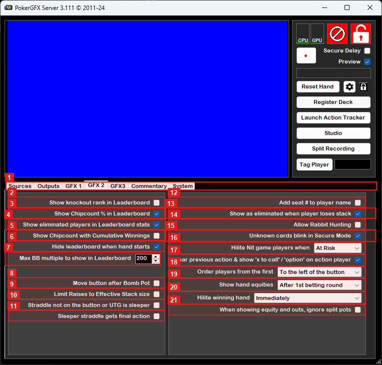

# PokerGFX Server 3.111 매뉴얼

> EBS 개발을 위한 벤치마크 분석서

**분석 대상**: PokerGFX Server 3.111 (2011-24)
**분석 목적**: EBS 자체 RFID 방송 시스템 설계 시 기능/UI 벤치마크
**이미지 소스**: 실제 앱 캡처 (`../../images/pokerGFX/`) + 번호 박스 오버레이 (`02_Annotated_ngd/`)
**문서 구조**: 각 섹션별 원본 스크린샷 → 번호 오버레이 → 기능 설명 순서

---

## 목차

| # | 섹션 | 이미지 | 항목 수 |
|:-:|------|--------|:-------:|
| 1 | [메인 윈도우](#1-메인-윈도우) | `01-main-window.png` | 10 |
| 2 | [Sources 탭](#2-sources-탭) | `02-sources-tab.png` | 32 |
| 3 | [Outputs 탭](#3-outputs-탭) | `03-outputs-tab.png` | 22 |
| 4 | [GFX 1 탭](#4-gfx-1-탭) | `04-gfx1-tab.png` | 61 |
| 5 | [GFX 2 탭](#5-gfx-2-탭) | `05-gfx2-tab.png` | 21 |
| 6 | [GFX3 탭](#6-gfx3-탭) | `06-gfx3-tab.png` | 23 |
| 7 | [Commentary 탭](#7-commentary-탭) | `07-commentary-tab.png` | 8 |
| 8 | [System 탭](#8-system-탭) | `08-system-tab.png` | 28 |
| 9 | [Skin Editor](#9-skin-editor) | `09-skin-editor.png` | 37 |
| 10 | [Graphic Editor - Board](#10-graphic-editor---board) | `10-graphic-editor-board.png` | 39 |
| 11 | [Graphic Editor - Player](#11-graphic-editor---player) | `11-graphic-editor-player.png` | 48 |

---

## 1. 메인 윈도우

**원본 스크린샷**

**번호 오버레이**

PokerGFX Server는 단일 윈도우 데스크탑 앱입니다. 좌측에 방송 Preview, 우측에 상태 표시와 액션 버튼이 배치되어 있습니다.

| # | 기능명 | 설명 | EBS 복제 |
|:-:|--------|------|:--------:|
| 1 | Title Bar | `PokerGFX Server 3.111 (c) 2011-24` 타이틀 + 최소/최대/닫기 버튼 | P2 |
| 2 | Preview | Chroma Key Blue 배경의 방송 미리보기 화면. GFX 오버레이가 실시간 렌더링됨 | P0 |
| 3 | CPU / GPU / Error / Lock | CPU, GPU 사용률 인디케이터 + Error 아이콘 + Lock 아이콘. 시스템 부하와 상태 실시간 모니터링 | P1 |
| 4 | Secure Delay / Preview | Secure Delay 체크박스 + Preview 체크박스. 방송 보안 딜레이와 미리보기 활성화 토글 | P0 |
| 5 | Reset Hand | Reset Hand 버튼. 현재 핸드 데이터 초기화 + Settings 톱니바퀴 + Lock 자물쇠 | P0 |
| 6 | Register Deck | RFID 카드 덱 일괄 등록 버튼. 새 덱 투입 시 52장 순차 스캔 | P0 |
| 7 | Action Tracker | Action Tracker 실행 버튼. 운영자용 실시간 게임 추적 인터페이스 | P0 |
| 8 | Studio | Studio 모드 진입 버튼. 방송 스튜디오 환경 전환 | P2 |
| 9 | Split Recording | 핸드별 분할 녹화 버튼. 각 핸드를 개별 파일로 자동 저장 | P1 |
| 10 | Tag Player | 플레이어 태그 + 드롭다운. 특정 플레이어에 마커를 부여하여 추적 | P1 |

### 탭 구조

Preview 하단에 7개 탭이 배치되어 있습니다.

| 탭 | 설정 항목 수 | 해당 섹션 |
|:--:|:----------:|:---------:|
| Sources | 15+ | [2장](#2-sources-탭) |
| Outputs | 20+ | [3장](#3-outputs-탭) |
| GFX 1 | 25+ | [4장](#4-gfx-1-탭) |
| GFX 2 | 20+ | [5장](#5-gfx-2-탭) |
| GFX3 | 20+ | [6장](#6-gfx3-탭) |
| Commentary | 6 | [7장](#7-commentary-탭) |
| System | 20+ | [8장](#8-system-탭) |

---

## 2. Sources 탭

**원본 스크린샷**

**번호 오버레이**

비디오 입력 장치, 카메라 제어, 크로마키, 외부 스위처 연동을 관리하는 탭입니다.

| # | 요소명 | 설명 |
|:-:|--------|------|
| 1 | Tab Bar | 탭 네비게이션 영역. Sources / Outputs / GFX 1 / GFX 2 / GFX3 / Commentary / System |
| 2 | Device Table | 연결된 카메라/캡처 디바이스 목록 (Device, Format, Action, L/R, Cycle, Status 컬럼 포함) |
| 3 | Board Cam Hide GFX | 보드 카메라 시 GFX 자동 숨기기 체크박스 |
| 4 | Auto Camera Control | 카메라 자동 제어 기능 활성화 체크박스 |
| 5 | Camera Mode label | 카메라 모드 섹션 라벨 |
| 6 | Mode 드롭다운 | 카메라 동작 모드 선택 (Static / Dynamic) |
| 7 | Heads Up Split Screen | 플레이어 헤드샷 및 스플릿 화면 분할 기능 체크박스 |
| 8 | Follow Players | 카메라가 플레이어를 자동으로 추적하는 기능 체크박스 |
| 9 | Follow Board | 카메라가 보드를 자동으로 추적하는 기능 체크박스 |
| 10 | Linger on Board | 보드에 머무는 시간(딜레이) 설정. S 단위 |
| 11 | Post Bet | 베팅 후 카메라 동작 기본값 설정 |
| 12 | Post Hand | 핸드 종료 후 카메라 동작 기본값 설정 |
| 13 | Background + Chroma Key | 크로마키 배경 색상 선택 + Chroma Key 활성화 토글 |
| 14 | Add Network Camera | 네트워크 카메라를 새로 추가하는 버튼 |
| 15 | Audio + Sync + Level | 오디오 입력 소스 선택, 싱크 조정, 볼륨 레벨 |
| 16 | External Switcher + ATEM | 외부 비디오 스위처 소스 + ATEM 제어 + IP 설정 |
| 17 | Board Sync + Crossfade | 보드 동기화 + 크로스페이드 설정 |
| 18 | Player + View | 플레이어 선택 드롭다운 + 카메라 추적 대상 세부 설정 |

---

## 3. Outputs 탭

**원본 스크린샷**

**번호 오버레이**

비디오 출력 해상도, Live/Delay 이중 파이프라인, Secure Delay, 스트리밍을 관리하는 탭입니다.

| # | 요소명 | 설명 |
|:-:|--------|------|
| 1 | Outputs 탭 | 출력 설정 탭. 현재 선택된 탭으로, 비디오/오디오 출력 관련 설정을 담당 |
| 2 | Video Size (드롭다운) | 출력 해상도 선택 드롭다운. 현재 값: 1920 x 1080 |
| 3 | 9x16 Vertical (체크박스) | 세로 방향(9:16) 출력 모드 활성화 체크박스 |
| 4 | Frame Rate (스피너) | 출력 프레임 레이트 설정 입력 필드. 현재 값: 60fps |
| 5 | Video Preview - Live (드롭다운) | 라이브 비디오 프리뷰 출력 장치 선택. 현재 값: Disabled |
| 6 | Video Preview - Delay (드롭다운) | 딜레이 비디오 프리뷰 출력 장치 선택 |
| 7 | Audio Preview - Live (드롭다운) | 라이브 오디오 프리뷰 출력 선택. 현재 값: No audio preview |
| 8 | Audio Preview - Delay (드롭다운) | 딜레이 오디오 프리뷰 출력 선택 |
| 9 | Output Device - Live (드롭다운) | 라이브 출력 장치(비디오 카드 등) 선택. 현재 값: Disabled |
| 10 | Output Device - Delay (드롭다운) | 딜레이 출력 장치 선택 |
| 11 | Key & Fill (체크박스) - Live | 라이브 출력에서 Key & Fill 모드 활성화 여부 |
| 12 | Key & Fill (체크박스) - Delay | 딜레이 출력에서 Key & Fill 모드 활성화 여부 |
| 13 | Virtual Camera (드롭다운) | 가상 카메라 출력 장치 선택 |
| 14 | Recording Mode (드롭다운) | 녹화 모드 선택 드롭다운. 현재 값: Video with GFX |
| 15 | Secure Delay - Min (입력 필드) | 보안 딜레이 최소값(분) 입력 |
| 16 | Dynamic Delay - Min (입력 필드) | 동적 딜레이 최소값(분) 입력 |
| 17 | Auto Zoom - Min (입력 필드) | 자동 줌 최소값(분) 입력 |
| 18 | Show Countdown (체크박스) | 카운트다운 표시 활성화 체크박스 |
| 19 | Countdown Intro Video (드롭다운) | 카운트다운 시작 시 재생할 인트로 비디오 선택 |
| 20 | Countdown Background (영역) | 카운트다운 배경 설정 영역 |
| 21 | Twitch Account (입력 필드) | Twitch 계정 연동 입력 필드 |
| 22 | Chat (체크박스) | Twitch 채팅 활성화 체크박스 |

---

## 4. GFX 1 탭

**원본 스크린샷**

**번호 오버레이**

보드/플레이어 레이아웃, Transition 애니메이션, 스킨, 스폰서 로고, 마진을 관리하는 탭입니다.

| # | 요소명 | 설명 |
|:-:|--------|------|
| 1 | GFX 1 Tab | GFX1 설정 탭. 현재 활성화된 탭으로 그래픽 설정 컨트롤을 표시함 |
| 2 | Board Position (Label) | "Board Position" 라벨. 보드 위치 설정 드롭다운의 레이블 |
| 3 | Board Position (Dropdown) | 보드 위치 선택 드롭다운. "Right" 값이 선택되어 있음 |
| 4 | Player Layout (Label) | "Player Layout" 라벨. 플레이어 레이아웃 설정 드롭다운의 레이블 |
| 5 | Player Layout (Dropdown) | 플레이어 레이아웃 선택 드롭다운. "Vert/Bot/Spill" 값이 선택되어 있음 |
| 6 | Reveal Players (Label) | "Reveal Players" 라벨. 카드 공개 방식 설정 드롭다운의 레이블 |
| 7 | Reveal Players (Dropdown) | 카드 공개 방식 선택 드롭다운. "Action On" 값이 선택되어 있음 |
| 8 | How to show a Fold (Label) | "How to show a Fold" 라벨. 폴드 표시 방식 설정의 레이블 |
| 9 | How to show a Fold (Dropdown) | 폴드 표시 방식 선택 드롭다운. "Immediate" 값이 선택되어 있음 |
| 10 | Fold Delay (Spinner) | 폴드 딜레이 시간(초) 입력 스피너. 값: 1.5 |
| 11 | Fold Delay (Unit Label) | 폴드 딜레이 단위 레이블 "s". 시간 단위(초) 표시 |
| 12 | Reveal Cards (Label) | "Reveal Cards" 라벨. 카드 공개 방식 설정 드롭다운의 레이블 |
| 13 | Reveal Cards (Dropdown) | 카드 공개 방식 선택 드롭다운. "Immediate" 값이 선택되어 있음 |
| 14 | Leaderboard Position (Label) | "Leaderboard Position" 라벨. 리더보드 위치 설정의 레이블 |
| 15 | Leaderboard Position (Dropdown) | 리더보드 위치 선택 드롭다운. "Centre" 값이 선택되어 있음 |
| 16 | Transition In Animation (Label) | "Transition In Animation" 라벨. 인트로 전환 애니메이션 설정의 레이블 |
| 17 | Transition In Animation (Dropdown) | 인트로 전환 애니메이션 선택 드롭다운. "Pop" 값이 선택되어 있음 |
| 18 | Transition In Speed (Spinner) | 인트로 전환 속도 입력 스피너. 값: 0.6 |
| 19 | Transition In Speed (Unit Label) | 전환 속도 단위 레이블 "S". 시간 단위(초) 표시 |
| 20 | Transition Out Animation (Label) | "Transition Out Animation" 라벨. 아웃트로 전환 애니메이션 설정의 레이블 |
| 21 | Transition Out Animation (Dropdown) | 아웃트로 전환 애니메이션 선택 드롭다운. "Slide" 값이 선택되어 있음 |
| 22 | Transition Out Speed (Spinner) | 아웃트로 전환 속도 입력 스피너. 값: 0.4 |
| 23 | Transition Out Speed (Unit Label) | 아웃트로 전환 속도 단위 레이블 "S". 시간 단위(초) 표시 |
| 24 | Heads Up Layout Left/Right (Label) | "Heads Up Layout Left / Right" 라벨. 헤즈업 화면 레이아웃 설정의 레이블 |
| 25 | Heads Up Layout Left/Right (Dropdown) | 헤즈업 레이아웃 선택 드롭다운. "only in split screen mode" 텍스트가 표시되어 있음 |
| 26 | Heads Up Camera (Label) | "Heads Up Camera" 라벨. 헤즈업 카메라 설정의 레이블 |
| 27 | Heads Up Camera (Dropdown) | 헤즈업 카메라 선택 드롭다운 |
| 28 | Heads Up From Y Pos (Label) | "Heads Up From Y pos" 라벨. 헤즈업 시작 Y 위치 설정의 레이블 |
| 29 | Heads Up From Y Pos (Spinner) | 헤즈업 시작 Y 위치 입력 스피너. 값: 0.5 |
| 30 | Heads Up From Y Pos (Percent Label) | Y 위치 단위 퍼센트 레이블 "%" |
| 32 | Storage Display | 저장 공간 표시 라벨. "Titanium, 1.41 GB" 값이 표시되어 있음 |
| 33 | Skin Editor (Button) | "Skin Editor" 버튼. 스킨 편집기를 열기 위한 버튼 |
| 34 | Media Folder (Button) | "Media Folder" 버튼. 미디어 폴더를 열기 위한 버튼 |
| 35 | Leaderboard Sponsor Logo (Slot) | "Click to add Leaderboard sponsor logo" 슬롯. 리더보드 스폰서 로고 이미지 추가 영역 |
| 36 | Board Sponsor Logo (Slot) | "Click to add Board sponsor logo" 슬롯. 보드 스폰서 로고 이미지 추가 영역 |
| 37 | Strip Sponsor Logo (Slot) | "Click to add Strip sponsor logo" 슬롯. 스트립 스폰서 로고 이미지 추가 영역 |
| 39 | Vanity (Label) | "Vanity" 라벨. 배니티 설정 영역의 레이블 |
| 40 | Replace Vanity with Game Variant (Checkbox) | "Replace Vanity with Game Variant" 체크박스. 배니티 대신 게임 변형 표시 여부 설정 |
| 41 | X Margin (Label) | "X Margin" 라벨. X 방향 여백 설정의 레이블 |
| 42 | X Margin (Spinner) | X 방향 여백 입력 스피너. 값: 0.04 |
| 43 | X Margin (Percent Label) | X 방향 여백 단위 퍼센트 레이블 "%" |
| 44 | Top Margin (Label) | "Top Margin" 라벨. 상단 여백 설정의 레이블 |
| 45 | Top Margin (Spinner) | 상단 여백 입력 스피너. 값: 0.05 |
| 46 | Top Margin (Percent Label) | 상단 여백 단위 퍼센트 레이블 "%" |
| 47 | Bot Margin (Label) | "Bot Margin" 라벨. 하단 여백 설정의 레이블 |
| 48 | Bot Margin (Spinner) | 하단 여백 입력 스피너. 값: 0.04 |
| 49 | Bot Margin (Percent Label) | 하단 여백 단위 퍼센트 레이블 "%" |
| 50 | Show Heads Up History (Checkbox) | "Show Heads Up History" 체크박스. 헤즈업 기록 표시 여부 설정 |
| 51 | Indent Action Player (Checkbox) | "Indent Action Player" 체크박스. 액션 플레이어 들여쓰기 여부 설정. 체크됨 |
| 52 | Bounce Action Player (Checkbox) | "Bounce Action Player" 체크박스. 액션 플레이어 바운스 효과 여부 설정. 체크됨 |
| 53 | Show Leaderboard after each hand (Label) | "Show leaderboard after each hand" 레이블. 핸드별 리더보드 표시 설정의 레이블 |
| 54 | Show Leaderboard after each hand (Checkbox) | 핸드별 리더보드 표시 설정 아이콘 및 체크박스. 활성화/비활성화 제어 |
| 55 | Show PIP Capture after each hand (Label) | "Show PIP Capture after each hand" 레이블. 핸드별 PIP 캡처 표시 설정의 레이블 |
| 56 | Show PIP Capture after each hand (Checkbox) | 핸드별 PIP 캡처 표시 설정 아이콘 및 체크박스. 활성화/비활성화 제어 |
| 57 | Show Player Stats in ticker (Label) | "Show player stats in the ticker after each hand" 레이블. 핸드 후 플레이어 통계 자막 표시 설정의 레이블 |
| 58 | Show Player Stats in ticker (Checkbox) | 핸드 후 플레이어 통계 자막 표시 설정 아이콘 및 체크박스. 활성화/비활성화 제어 |
| 59 | Show Action Count (Label) | "Show Action Count" 레이블. 액션 카운트 표시 설정의 레이블 |
| 60 | Show Action Count (Spinner) | 액션 카운트 시간 입력 스피너. 값: 60 |
| 61 | Show Action Count (Unit) | 액션 카운트 단위 레이블 "s". 시간 단위(초) 표시 |

---

## 5. GFX 2 탭

**원본 스크린샷**

**번호 오버레이**

리더보드 옵션, 게임 규칙, 플레이어 표시, Equity 설정을 관리하는 탭입니다.

| # | 기능명 | 설명 | EBS 복제 |
|:-:|--------|------|:--------:|
| 1 | Tab Bar | Sources / Outputs / GFX 1 / GFX 2 / GFX3 / Commentary / System 7개 탭 전환 바 | P0 |
| 2 | Show knockout rank | Show knockout rank in Leaderboard 체크박스 ☐. 리더보드에 녹아웃 순위 표시 | P1 |
| 3 | Show Chipcount % | Show Chipcount % in Leaderboard 체크박스 ☑. 칩카운트 퍼센트 표시 | P1 |
| 4 | Show eliminated | Show eliminated players in Leaderboard stats 체크박스 ☑. 탈락 선수 표시 | P1 |
| 5 | Cumulative Winnings | Show Chipcount with Cumulative Winnings 체크박스 ☐. 누적 상금 표시 | P1 |
| 6 | Hide leaderboard | Hide leaderboard when hand starts 체크박스 ☑. 핸드 시작 시 리더보드 숨김 | P1 |
| 7 | Max BB multiple | Max BB multiple to show in Leaderboard `[200]`. 리더보드 BB 배수 상한값 | P1 |
| 8 | Move button Bomb Pot | Move button after Bomb Pot 체크박스 ☐. 봄팟 후 버튼 이동 | P1 |
| 9 | Limit Raises | Limit Raises to Effective Stack size 체크박스 ☐. 유효 스택 기반 레이즈 제한 | P1 |
| 10 | Straddle sleeper | Straddle not on the button or UTG is sleeper 체크박스 ☐. 스트래들 위치 규칙 | P1 |
| 11 | Sleeper final action | Sleeper straddle gets final action 체크박스 ☐. 슬리퍼 스트래들 최종 액션 | P1 |
| 12 | Add seat # | Add seat # to player name 체크박스 ☐. 플레이어 이름에 좌석 번호 추가 | P1 |
| 13 | Show as eliminated | Show as eliminated when player loses stack 체크박스 ☑. 스택 소진 시 탈락 표시 | P1 |
| 14 | Allow Rabbit Hunting | Allow Rabbit Hunting 체크박스 ☐. 래빗 헌팅 허용 | P1 |
| 15 | Unknown cards blink | Unknown cards blink in Secure Mode 체크박스 ☑. 보안 모드에서 미확인 카드 깜빡임 | P1 |
| 16 | Hilite Nit game | Hilite Nit game players when `[At Risk]` 드롭다운. 닛 게임 플레이어 강조 조건 | P1 |
| 17 | Clear previous action | Clear previous action & show 'x to call' / 'option' 체크박스 ☑. 이전 액션 초기화 | P1 |
| 18 | Order players | Order players from the first `[To the left of the button]` 드롭다운. 플레이어 정렬 순서 | P1 |
| 19 | Show hand equities | Show hand equities `[After 1st betting round]` 드롭다운. Equity 표시 시점 | P0 |
| 20 | Hilite winning hand | Hilite winning hand `[Immediately]` 드롭다운. 위닝 핸드 강조 시점 | P0 |
| 21 | Ignore split pots | When showing equity and outs, ignore split pots 체크박스 ☐. Split pot Equity 계산 규칙 | P1 |

---

## 6. GFX3 탭

**원본 스크린샷**

**번호 오버레이**

Outs 표시, Score Strip, Blinds, 통화 기호, Chipcount 정밀도, 금액 표시 모드를 관리하는 탭입니다.

| # | 기능명 | 설명 | EBS 복제 |
|:-:|--------|------|:--------:|
| 1 | Tab Bar | Sources / Outputs / GFX 1 / GFX 2 / GFX3 / Commentary / System 7개 탭 전환 바 | P0 |
| 2 | Show Outs | Show Outs `[Heads Up or All In Showdown]` 드롭다운. 아웃츠 표시 조건 | P1 |
| 3 | Outs Position | Outs Position `[Left]` 드롭다운. 아웃츠 화면 표시 위치 | P1 |
| 4 | True Outs | True Outs 체크박스 ☑. 정밀 아웃츠 계산 알고리즘 활성화 | P1 |
| 5 | Score Strip | Score Strip `[Off]` 드롭다운. 하단 스코어 스트립 활성화 | P1 |
| 6 | Order Strip by | Order Strip by `[Chip Count]` 드롭다운. 스트립 정렬 기준 | P1 |
| 7 | Strip eliminated | Show eliminated players in Strip 체크박스 ☐. 스트립에 탈락 선수 표시 | P1 |
| 8 | Show Blinds | Show Blinds `[Never]` 드롭다운. 블라인드 표시 조건 | P0 |
| 9 | Show hand # | Show hand # with blinds 체크박스 ☑. 블라인드와 핸드 번호 동시 표시 | P0 |
| 10 | Currency Symbol | Currency Symbol `[₩]` 원화. 통화 기호 설정 | P0 |
| 11 | Trailing Currency | Trailing Currency Symbol 체크박스 ☐. 통화 기호 후치 (100₩ vs ₩100) | P0 |
| 12 | Divide by 100 | Divide all amounts by 100 체크박스 ☐. 금액 100분의 1 변환 | P0 |
| 13 | Leaderboard precision | Leaderboard `[Exact Amount]` 드롭다운. 리더보드 수치 형식 | P1 |
| 14 | Player Stack precision | Player Stack `[Smart Amount ('k' & 'M')]` 드롭다운. 스택 표시 형식 | P1 |
| 15 | Player Action precision | Player Action `[Smart Amount ('k' & 'M')]` 드롭다운. 액션 금액 형식 | P1 |
| 16 | Blinds precision | Blinds `[Smart Amount ('k' & 'M')]` 드롭다운. 블라인드 수치 형식 | P1 |
| 17 | Pot precision | Pot `[Smart Amount ('k' & 'M')]` 드롭다운. 팟 수치 형식 | P1 |
| 18 | Twitch Bot precision | Twitch Bot `[Exact Amount]` 드롭다운. Twitch 봇 수치 형식 | P1 |
| 19 | Ticker precision | Ticker `[Exact Amount]` 드롭다운. 티커 수치 형식 | P1 |
| 20 | Strip precision | Strip `[Exact Amount]` 드롭다운. 스트립 수치 형식 | P1 |
| 21 | Chipcounts mode | Chipcounts `[Amount]` 드롭다운. Amount 또는 BB 표시 모드 | P1 |
| 22 | Pot mode | Pot `[Amount]` 드롭다운. Amount 또는 BB 표시 모드 | P1 |
| 23 | Bets mode | Bets `[Amount]` 드롭다운. Amount 또는 BB 표시 모드 | P1 |

---

## 7. Commentary 탭

**원본 스크린샷**

**번호 오버레이**

해설자 원격 접속, 통계 전용 모드, PIP 설정을 관리하는 탭입니다. 설정 항목이 적고 단순한 구조입니다.

| # | 기능명 | 설명 | EBS 복제 |
|:-:|--------|------|:--------:|
| 1 | Tab Bar | Sources / Outputs / GFX 1 / GFX 2 / GFX3 / Commentary / System 7개 탭 전환 바 | P0 |
| 2 | Commentary Mode | Commentary Mode `[Disabled]` 드롭다운. 해설자 원격 접속 활성화 | P1 |
| 3 | Password | Password 입력란 (최소 10자). 해설자 접속 인증 비밀번호 | P1 |
| 4 | Statistics only | Statistics only (no video or audio) 체크박스 ☐. 카드 정보 없이 통계만 제공 | P1 |
| 5 | Control leaderboard | Allow commentator to control leaderboard graphic 체크박스 ☑. 해설자 리더보드 조작 | P2 |
| 6 | Commentator camera | Commentator camera as well as audio 체크박스 ☑. 해설자 카메라 활성화 | P1 |
| 7 | Configure PIP | `[Configure Picture In Picture]` 버튼. PIP 설정 창 열기 | P1 |
| 8 | Full screen | Allow commentator camera to go full screen 체크박스 ☑. 해설자 카메라 전체화면 | P2 |

---

## 8. System 탭

**원본 스크린샷**

**번호 오버레이**

테이블 이름, 라이선스, 캘리브레이션, MultiGFX, RFID 안테나, 시스템 정보, 진단을 관리하는 탭입니다.

| # | 기능명 | 설명 | EBS 복제 |
|:-:|--------|------|:--------:|
| 1 | Tab Bar | Sources / Outputs / GFX 1 / GFX 2 / GFX3 / Commentary / System 7개 탭 전환 바 | P0 |
| 2 | Table Name | Table Name 입력란 `[GGP]` + `[Update]` 버튼. 테이블 식별 이름 | P1 |
| 3 | Table Password | Table Password 입력란 `[CCC]` + `[Update]` 버튼. 테이블 접속 비밀번호 | P1 |
| 4 | Reset | `[Reset]` 버튼. 시스템 초기화 | P0 |
| 5 | Calibrate | `[Calibrate]` 버튼. RFID 리더 캘리브레이션 | P0 |
| 6 | Serial # | Serial # `674`. 라이선스 시리얼 번호 표시 | P2 |
| 7 | Check for Updates | `[Check for Updates]` 버튼. 소프트웨어 업데이트 확인 | P2 |
| 8 | Updates & support | Updates & support `[Evaluation mode]`. 업데이트 지원 라이선스 상태 | P2 |
| 9 | PRO license | PRO license `[Evaluation mode]`. PRO 라이선스 상태 | P2 |
| 10 | Table Diagnostics | `[Open Table Diagnostics]` 버튼. 테이블 진단 창 열기 | P1 |
| 11 | System Info | CPU (i9-14900HX) / GPU (RTX 5070) / OS (Win11 Pro 64-bit) / Encoder (NVIDIA). 하드웨어 정보 패널 | P1 |
| 12 | View System Log | `[View System Log]` 버튼. 시스템 로그 열람 | P1 |
| 13 | Secure Delay Folder | `[Secure Delay Folder]` 버튼. 딜레이 녹화 폴더 지정 | P1 |
| 14 | Export Folder | `[Export Folder]` 버튼. 내보내기 폴더 지정 | P1 |
| 15 | Stream Deck | Stream Deck `[Disabled]` 드롭다운. Elgato Stream Deck 하드웨어 매핑 | P2 |
| 16 | MultiGFX | MultiGFX 체크박스 ☐. 다중 GFX 인스턴스 | P2 |
| 17 | Sync Stream | Sync Stream 체크박스 ☐. 스트림 동기화 | P2 |
| 18 | Sync Skin | Sync Skin 체크박스 ☐. 스킨 동기화 | P2 |
| 19 | No Cards | No Cards 체크박스 ☐. 카드 표시 비활성화 | P1 |
| 20 | Disable GPU Encode | Disable GPU Encode 체크박스 ☐. GPU 인코딩 비활성화 | P1 |
| 21 | Ignore Name Tags | Ignore Name Tags 체크박스 ☑. 네임 태그 무시 | P1 |
| 22 | UPCARD antennas | UPCARD antennas read hole cards in draw & flop games 체크박스 ☐. UPCARD 안테나 홀카드 읽기 | P0 |
| 23 | Disable muck antenna | Disable muck antenna when in Action Tracker mode 체크박스 ☐. AT 모드 시 muck 안테나 비활성 | P0 |
| 24 | Disable Community Card | Disable Community Card antenna for the flop 체크박스 ☐. 플롭 커뮤니티 카드 안테나 비활성 | P0 |
| 25 | Auto Start | Auto Start PokerGFX Server with Windows 체크박스 ☐. Windows 시작 시 자동 실행 | P2 |
| 26 | Allow AT access | Allow Action Tracker access 체크박스 ☑. Action Tracker 접근 허용 | P0 |
| 27 | AT Predictive Bet | Action Tracker Predictive Bet Input 체크박스 ☐. 베팅 금액 예측 입력 | P0 |
| 28 | AT Kiosk | Action Tracker Kiosk 체크박스 ☐. AT 전용 키오스크 모드 | P0 |

---

## 9. Skin Editor

**원본 스크린샷**

**번호 오버레이**

별도 창으로 열리는 스킨 편집기입니다. 스킨 이름, 4K 지원, 요소 편집, 카드 그래픽, 폰트, 국기, 플레이어 세트를 관리합니다.

| # | 기능명 | 설명 | EBS 복제 |
|:-:|--------|------|:--------:|
| 1 | Name | 스킨 이름 입력란 `[Titanium]` | P1 |
| 2 | Details | 스킨 설명 텍스트 `Modern, layered skin with neutral colours...` | P1 |
| 3 | Remove Transparency | Remove Partial Transparency when Chroma Key Enabled 체크박스 ☐ | P1 |
| 4 | Designed for 4K | Designed for 4K (3840 x 2160) 체크박스 ☐. 4K 전용 스킨 | P1 |
| 5 | Adjust Size | Adjust Size 슬라이더. 스킨 크기 조정 | P2 |
| 6 | Strip | `[Strip]` 요소 편집 버튼. Graphic Editor 실행 | P1 |
| 7 | Board | `[Board]` 요소 편집 버튼. Graphic Editor 실행 | P1 |
| 8 | Blinds | `[Blinds]` 요소 편집 버튼. Graphic Editor 실행 | P1 |
| 9 | Outs | `[Outs]` 요소 편집 버튼. Graphic Editor 실행 | P1 |
| 10 | Hand History | `[Hand History]` 요소 편집 버튼. Graphic Editor 실행 | P1 |
| 11 | Action Clock | `[Action Clock]` 요소 편집 버튼. Graphic Editor 실행 | P1 |
| 12 | Leaderboard | `[Leaderboard]` 요소 편집 버튼. Graphic Editor 실행 | P1 |
| 13 | Split Screen Divider | `[Split Screen Divider]` 요소 편집 버튼. Graphic Editor 실행 | P1 |
| 14 | Ticker | `[Ticker]` 요소 편집 버튼. Graphic Editor 실행 | P1 |
| 15 | Field | `[Field]` 요소 편집 버튼. Graphic Editor 실행 | P1 |
| 16 | Text All Caps | Text All Caps 체크박스 ☑. 모든 텍스트 대문자 | P1 |
| 17 | Text Reveal Speed | Text Reveal Speed 슬라이더. 텍스트 등장 속도 | P1 |
| 18 | Font 1 | Font 1 `[Gotham]` + `[...]` 선택 버튼. 1차 폰트 | P1 |
| 19 | Font 2 | Font 2 `[Gotham]` + `[...]` 선택 버튼. 2차 폰트 | P1 |
| 20 | Language | `[Language]` 버튼. 다국어 설정 | P1 |
| 21 | Card display | 카드 이미지 프리뷰 (A, A, A, A + 카드 뒷면). 4종 수트 미리보기 | P1 |
| 22 | Add / Replace / Delete | `[Add]` `[Replace]` `[Delete]` 버튼. 카드 이미지 관리 | P1 |
| 23 | Import Card Back | `[Import Card Back]` 버튼. 카드 뒷면 이미지 가져오기 | P1 |
| 24 | Country flag option | Country flag does not force player photo mode 체크박스 ☑. 국기와 사진 모드 분리 | P2 |
| 25 | Edit Flags | `[Edit Flags]` 버튼. 국기 이미지 편집 | P2 |
| 26 | Hide flag after | Hide flag after `[0.0]` S (0=Do not hide). 국기 자동 숨김 시간 | P2 |
| 27 | Variant | Variant `[HOLDEM (2 Cards)]` 드롭다운. 게임 타입 선택 | P1 |
| 28 | Player Set | Player Set `[2 Card Games]` 드롭다운. 플레이어 세트 선택 | P1 |
| 29 | Override Card Set | Override Card Set 체크박스 ☐. 카드 세트 오버라이드 | P1 |
| 30 | Edit / New / Delete | `[Edit]` `[New]` `[Delete]` 버튼. 플레이어 세트 관리 | P1 |
| 31 | Crop to circle | Crop player photo to circle 체크박스 ☐. 플레이어 사진 원형 크롭 | P1 |
| 32 | IMPORT | `[IMPORT]` 버튼. 스킨 파일 가져오기 | P1 |
| 33 | EXPORT | `[EXPORT]` 버튼. 스킨 파일 내보내기 | P1 |
| 34 | SKIN DOWNLOAD | `[SKIN DOWNLOAD CENTRE]` 버튼. 온라인 스킨 다운로드 | P2 |
| 35 | RESET TO DEFAULT | `[RESET TO DEFAULT]` 버튼. 기본 스킨으로 초기화 | P1 |
| 36 | DISCARD | `[DISCARD]` 버튼. 변경사항 취소 | P1 |
| 37 | USE | `[USE]` 버튼. 현재 스킨 적용 | P1 |

---

## 10. Graphic Editor - Board

**원본 스크린샷**

**번호 오버레이**

별도 창으로 열리는 요소 편집기입니다. 보드 카드 요소의 레이아웃 크기 `296 x 197`, 모드 `AT Mode (Flop Game)`. 하단 프리뷰에 A 2 3 4 5 보드 + `POT 100,000` + `50,000 / 100,000` 블라인드 + `TABLE 2` 표시.

| # | 기능명 | 설명 | EBS 복제 |
|:-:|--------|------|:--------:|
| 1 | Layout Size | 레이아웃 크기 표시 `296 X 197`. 요소 전체 영역 픽셀 치수 | P1 |
| 2 | Import Image | `[Import Image]` 버튼. 배경 이미지 가져오기 | P1 |
| 3 | AT Mode | AT Mode `(Flop Game)` 드롭다운. 표시 모드 선택 | P1 |
| 4 | Element | Element `[Card 1]` 드롭다운. 편집 대상 요소 선택 | P1 |
| 5 | Left | Left `[288]` 스피너. 요소 X 좌표 | P1 |
| 6 | Anchor (H) | Anchor `[Right]` 드롭다운. 수평 기준점 | P1 |
| 7 | Top | Top `[0]` 스피너. 요소 Y 좌표 | P1 |
| 8 | Anchor (V) | Anchor `[Top]` 드롭다운. 수직 기준점 | P1 |
| 9 | Width | Width `[56]` 스피너. 요소 너비 | P1 |
| 10 | Z-order | Z `[1]` 스피너. 레이어 겹침 순서 | P1 |
| 11 | Height | Height `[80]` 스피너. 요소 높이 | P1 |
| 12 | Angle | `< [0]` 스피너. 요소 회전 각도 | P1 |
| 13 | AnimIn | `[AnimIn]` 버튼. 등장 애니메이션 설정 | P1 |
| 14 | AnimIn dismiss | `[X]` 버튼. AnimIn 리셋 | P1 |
| 15 | AnimIn slider | AnimIn 속도 슬라이더 (파란색 트랙). 등장 속도 조절 | P1 |
| 16 | AnimOut | `[AnimOut]` 버튼. 퇴장 애니메이션 설정 | P1 |
| 17 | AnimOut dismiss | `[X]` 버튼. AnimOut 리셋 | P1 |
| 18 | AnimOut slider | AnimOut 속도 슬라이더 (파란색 트랙). 퇴장 속도 조절 | P1 |
| 19 | Transition In | Transition In `[-- Default --]` 드롭다운. Default/Pop/Expand/Slide | P1 |
| 20 | Transition Out | Transition Out `[-- Default --]` 드롭다운. Default/Pop/Expand/Slide | P1 |
| 21 | Text Visible | Text Visible 체크박스 ☐. 텍스트 표시 토글 | P1 |
| 22 | Font | Font `[Font 1 - Gotham]` 드롭다운. 텍스트 폰트 선택 | P1 |
| 23 | Colour | Colour 색상 스워치. 텍스트 기본 색상 | P1 |
| 24 | Hilite Col | Hilite Col 색상 스워치. 텍스트 강조 색상 | P1 |
| 25 | Alignment | Alignment `[Left]` 드롭다운. 텍스트 정렬 | P1 |
| 26 | Alignment Colour | Colour 색상 스워치 (정렬 영역). 배경 색상 | P1 |
| 27 | Drop Shadow | Drop Shadow 체크박스 ☐. 텍스트 그림자 활성화 | P1 |
| 28 | Shadow direction | `[North]` 드롭다운. 그림자 방향 | P1 |
| 29 | Shadow Colour | Colour 색상 스워치 (그림자). 그림자 색상 | P1 |
| 30 | Rounded Corners | Rounded Corners `[0]` 스피너. 모서리 둥글기 | P1 |
| 31 | Margins X | Margins X `[0]` 스피너. 수평 마진 | P1 |
| 32 | Margins Y | Y `[0]` 스피너. 수직 마진 | P1 |
| 33 | Adjust Colours | `[Adjust Colours]` 버튼. 색상 조정 창 열기 | P2 |
| 34 | Background Image | Background Image 영역. "Click to add" + 이미지 미리보기 | P1 |
| 35 | BG dismiss | `[X]` 버튼. Background Image 삭제 | P1 |
| 36 | Triggered by Language | Triggered by Language text 체크박스 ☐. 다국어 텍스트 트리거 | P2 |
| 37 | OK | `[OK]` 버튼. 변경사항 저장 | P1 |
| 38 | Cancel | `[Cancel]` 버튼. 변경사항 취소 | P1 |
| 39 | Live Preview | 하단 실시간 프리뷰. 보드 카드 + POT + 블라인드 + Vanity 렌더링 | P0 |

---

## 11. Graphic Editor - Player

**원본 스크린샷**

**번호 오버레이**

플레이어 오버레이 요소의 편집기입니다. 레이아웃 크기 `465 x 120`, 모드 `AT Mode with photo`, Player Set `2 Card Games`. 하단 프리뷰에 플레이어 오버레이 전체 구성이 표시됩니다.

### 에디터 설정 (빨간 박스 1-40)

| # | 기능명 | 설명 | EBS 복제 |
|:-:|--------|------|:--------:|
| 1 | Player Set | Player Set `[2 Card Games]` 드롭다운. 게임 타입별 플레이어 세트 선택 | P1 |
| 2 | Layout Size | 레이아웃 크기 표시 `465 X 120`. 요소 전체 영역 픽셀 치수 | P1 |
| 3 | Import Image | `[Import Image]` 버튼. 배경 이미지 가져오기 | P1 |
| 4 | AT Mode | AT Mode `with photo` 드롭다운. 표시 모드 선택 | P1 |
| 5 | Element | Element `[Card 1]` 드롭다운. 편집 대상 요소 선택 | P1 |
| 6 | Left | Left `[372]` 스피너. 요소 X 좌표 | P1 |
| 7 | Anchor (H) | Anchor `[Right]` 드롭다운. 수평 기준점 | P1 |
| 8 | Top | Top `[5]` 스피너. 요소 Y 좌표 | P1 |
| 9 | Anchor (V) | Anchor `[Top]` 드롭다운. 수직 기준점 | P1 |
| 10 | Width | Width `[44]` 스피너. 요소 너비 | P1 |
| 11 | Z-order | Z `[1]` 스피너. 레이어 겹침 순서 | P1 |
| 12 | Height | Height `[64]` 스피너. 요소 높이 | P1 |
| 13 | Angle | `< [0]` 스피너. 요소 회전 각도 | P1 |
| 14 | AnimIn | `[AnimIn]` 버튼. 등장 애니메이션 설정 | P1 |
| 15 | AnimIn dismiss | `[X]` 버튼. AnimIn 리셋 | P1 |
| 16 | AnimIn slider | AnimIn 속도 슬라이더 (파란색 트랙). 등장 속도 조절 | P1 |
| 17 | AnimOut | `[AnimOut]` 버튼. 퇴장 애니메이션 설정 | P1 |
| 18 | AnimOut dismiss | `[X]` 버튼. AnimOut 리셋 | P1 |
| 19 | AnimOut slider | AnimOut 속도 슬라이더 (파란색 트랙). 퇴장 속도 조절 | P1 |
| 20 | Transition In | Transition In `[-- Default --]` 드롭다운. Default/Pop/Expand/Slide | P1 |
| 21 | Transition Out | Transition Out `[-- Default --]` 드롭다운. Default/Pop/Expand/Slide | P1 |
| 22 | Text Visible | Text Visible 체크박스 ☐. 텍스트 표시 토글 | P1 |
| 23 | Font | Font `[Font 1 - Gotham]` 드롭다운. 텍스트 폰트 선택 | P1 |
| 24 | Colour | Colour 색상 스워치. 텍스트 기본 색상 | P1 |
| 25 | Hilite Col | Hilite Col 색상 스워치. 텍스트 강조 색상 | P1 |
| 26 | Alignment | Alignment `[Left]` 드롭다운. 텍스트 정렬 | P1 |
| 27 | Alignment Colour | Colour 색상 스워치 (정렬 영역). 배경 색상 | P1 |
| 28 | Drop Shadow | Drop Shadow 체크박스 ☐. 텍스트 그림자 활성화 | P1 |
| 29 | Shadow direction | `[North]` 드롭다운. 그림자 방향 | P1 |
| 30 | Shadow Colour | Colour 색상 스워치 (그림자). 그림자 색상 | P1 |
| 31 | Rounded Corners | Rounded Corners `[0]` 스피너. 모서리 둥글기 | P1 |
| 32 | Margins X | Margins X `[0]` 스피너. 수평 마진 | P1 |
| 33 | Margins Y | Y `[0]` 스피너. 수직 마진 | P1 |
| 34 | Adjust Colours | `[Adjust Colours]` 버튼. 색상 조정 창 열기 | P2 |
| 35 | Background Image | Background Image 영역. "Click to add" + 이미지 미리보기 | P1 |
| 36 | BG dismiss | `[X]` 버튼. Background Image 삭제 | P1 |
| 37 | Triggered by Language | Triggered by Language text 체크박스 ☐. 다국어 텍스트 트리거 | P2 |
| 38 | OK | `[OK]` 버튼. 변경사항 저장 | P1 |
| 39 | Cancel | `[Cancel]` 버튼. 변경사항 취소 | P1 |
| 40 | Live Preview | 하단 실시간 프리뷰. 플레이어 오버레이 전체 구성 렌더링 | P0 |

### 오버레이 요소 (녹색 박스 A-H)

하단 프리뷰에 표시되는 실제 방송 오버레이 요소입니다.

| # | 요소 | 설명 | EBS 복제 |
|:-:|------|------|:--------:|
| A | Player Photo | 플레이어 프로필 이미지 (실루엣/사진). 원형 또는 사각형 크롭 | P1 |
| B | Hole Cards | 홀카드 2장 (A, 2 표시). 게임 타입에 따라 2~5장 | P0 |
| C | NAME | 플레이어 이름 텍스트. Gotham 폰트, All Caps 적용 | P0 |
| D | Country Flag | 플레이어 국적 국기 아이콘 | P2 |
| E | Equity % | 승률 퍼센트 표시 (`50%`). Equity 계산 엔진 연동 | P0 |
| F | ACTION | 최근 액션 텍스트 (RAISE, CALL, FOLD 등) | P0 |
| G | STACK | 칩 스택 금액 표시. Chipcount Precision 설정 적용 | P0 |
| H | POS | 포지션 표시 (D/SB/BB/UTG 등) | P0 |

---

## 변경 이력

| 버전 | 날짜 | 변경 내용 |
|------|------|----------|
| v1.0.0 | 2026-02-05 | 최초 작성. 21장 스크린샷 기반 기능 분석 |
| v2.0.0 | 2026-02-06 | 전체 구조 재편. 10개 섹션 + 갭 분석 30개 항목 추가 |
| v3.0.0 | 2026-02-06 | 매뉴얼 형식 재작성. annotated 이미지 11장 삽입, 번호별 기능 테이블 + EBS 복제 우선순위 |
| v4.0.0 | 2026-02-10 | PIL 기반 annotated 이미지 전면 재생성 (정확한 좌표). 원본→오버레이→설명 3단계 구조 |
| v5.0.0 | 2026-02-23 | **요소 분석 섹션 추가**: 11개 화면 섹션 각각에 OCR JSON 기반 신뢰도 분포 + OCR 텍스트 추론 + Empty Warning 처리 테이블 삽입 (analyze_overlay_errors.py 기반) |
| v6.0.0 | 2026-02-27 | 오버레이 이미지 교체 (Sources 32개, Outputs 22개, GFX1 61개). 요소 분석·갭 분석·부록 제거 |

---

**Version**: 6.0.0 | **Updated**: 2026-02-27
