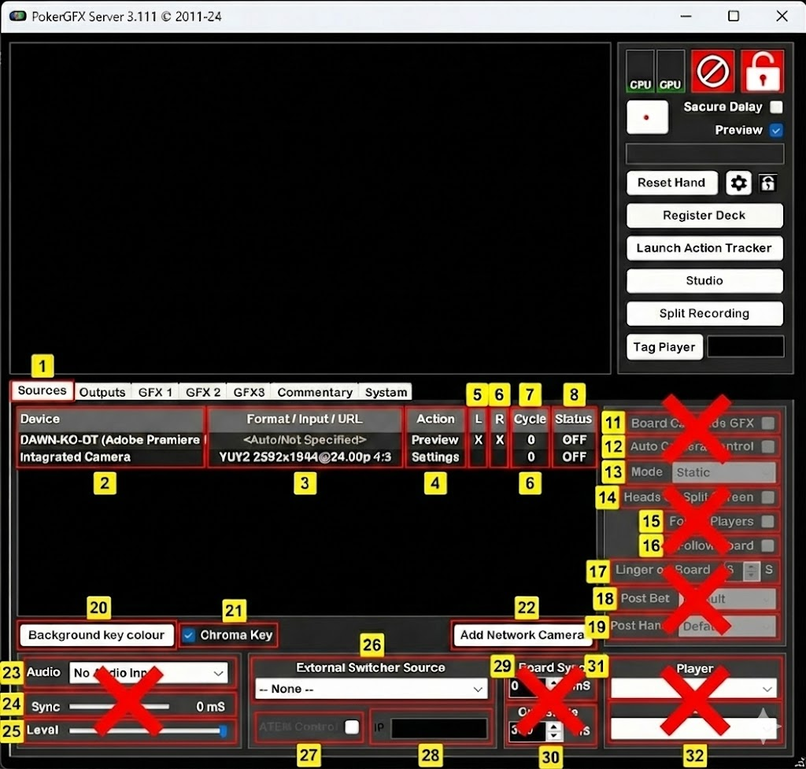
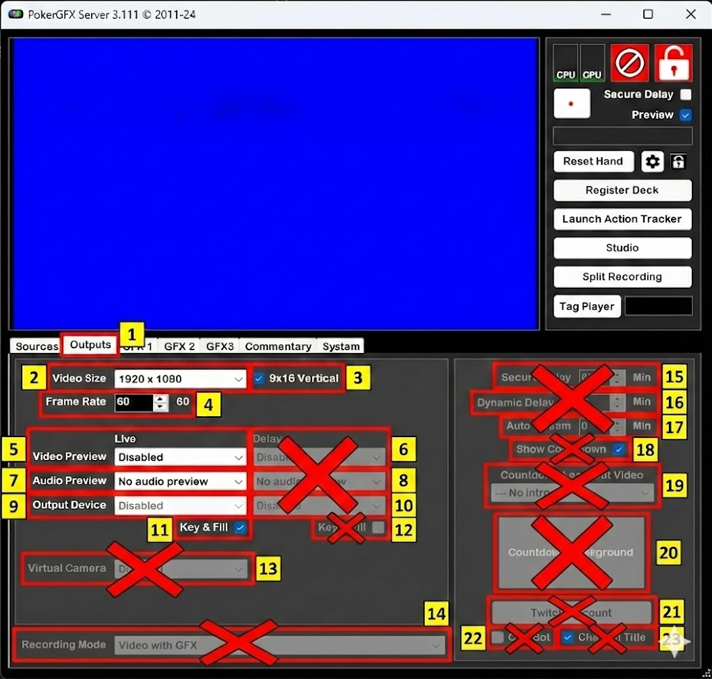
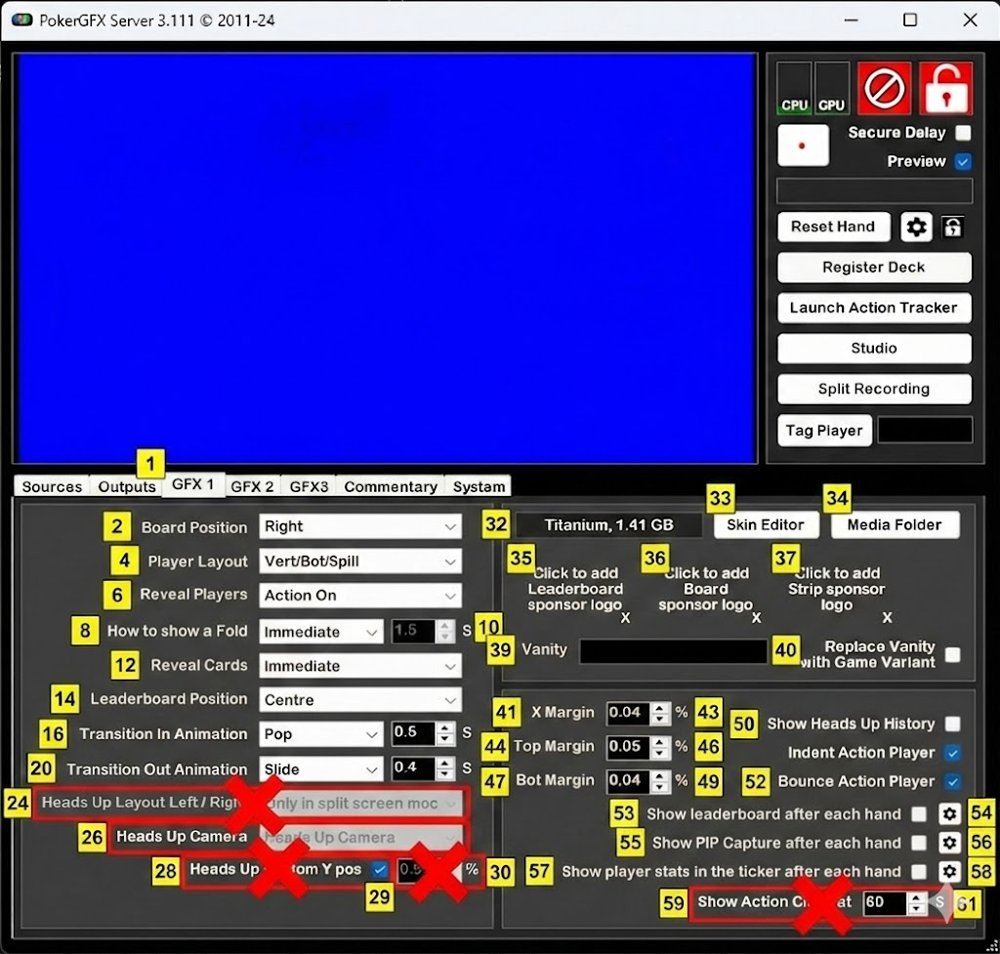
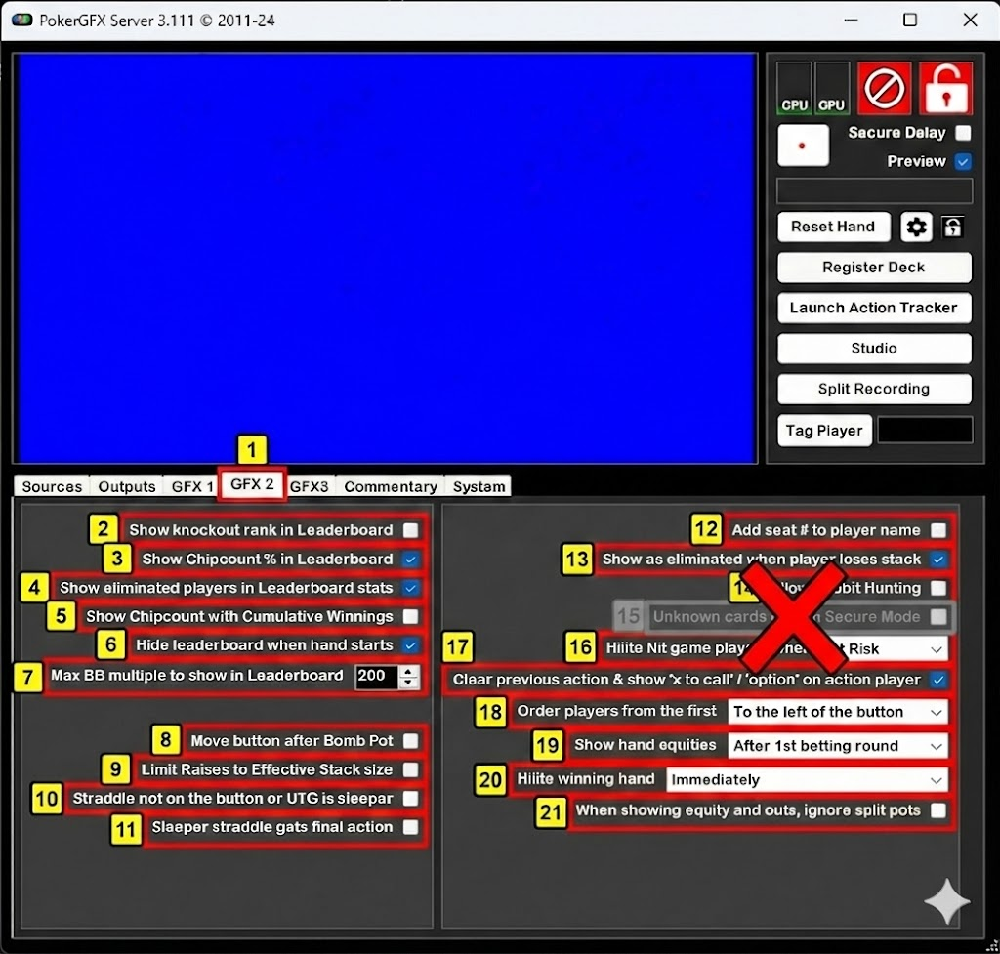
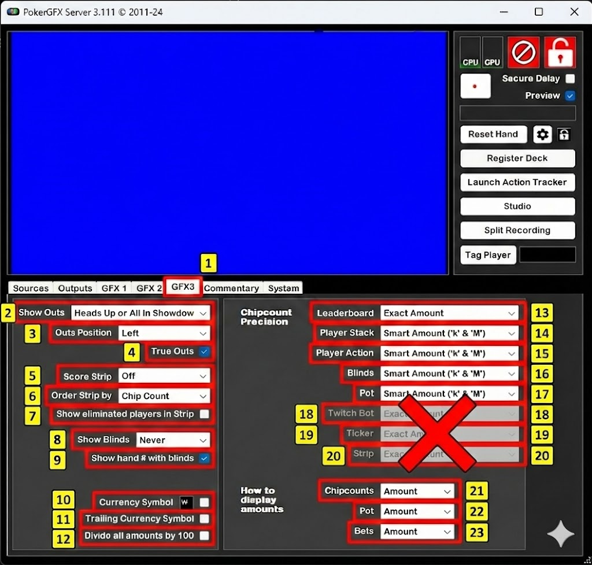
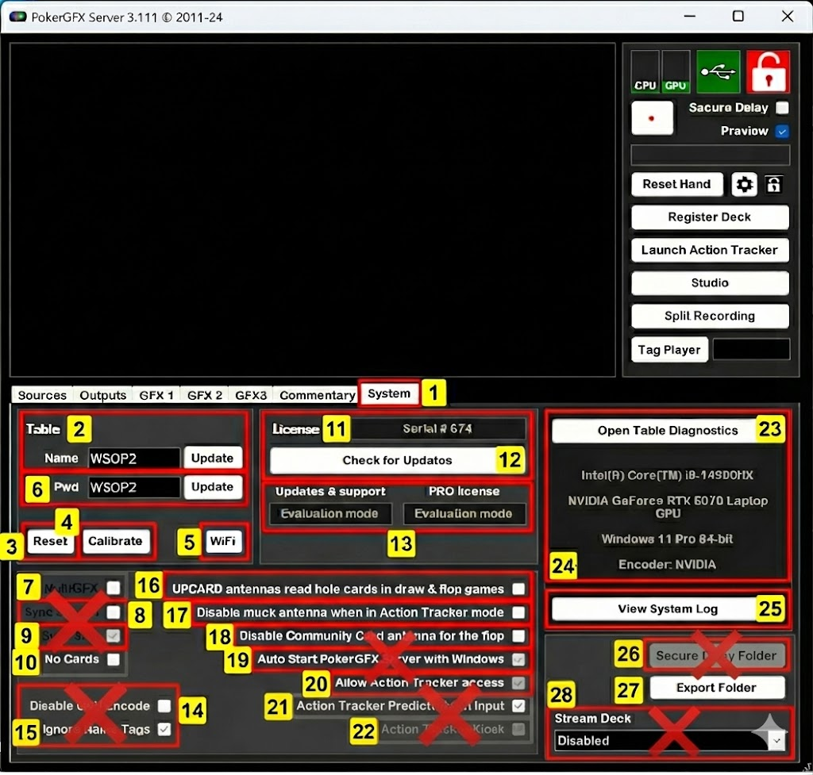
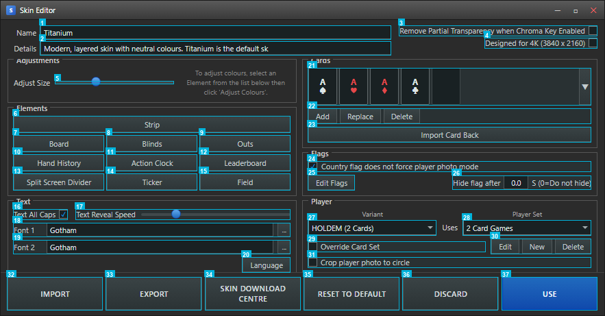
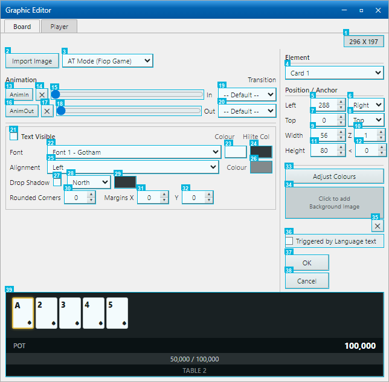

# PokerGFX Server 3.111 매뉴얼

> EBS 개발을 위한 벤치마크 분석서

**분석 대상**: PokerGFX Server 3.111 (2011-24)
**분석 목적**: EBS 자체 RFID 방송 시스템 설계 시 기능/UI 벤치마크
**이미지 소스**: 실제 앱 캡처 (`../../images/pokerGFX/`) + 번호 박스 오버레이 (`02_Annotated_ngd/`)
**문서 구조**: 각 섹션별 원본 스크린샷 → 번호 오버레이 → 기능 설명 순서

---

## 목차

| # | 섹션 | 이미지 | 항목 수 |
|:-:|------|--------|:-------:|
| 1 | [메인 윈도우](#1-메인-윈도우) | `01-main-window.png` | 10 |
| 2 | [Sources 탭](#2-sources-탭) | `02-sources-tab.png` | 12 |
| 3 | [Outputs 탭](#3-outputs-탭) | `03-outputs-tab.png` | 13 |
| 4 | [GFX 1 탭](#4-gfx-1-탭) | `04-gfx1-tab.png` | 29 |
| 5 | [GFX 2 탭](#5-gfx-2-탭) | `05-gfx2-tab.png` | 21 |
| 6 | [GFX3 탭](#6-gfx3-탭) | `06-gfx3-tab.png` | 23 |
| 7 | [Commentary 탭](#7-commentary-탭) | `07-commentary-tab.png` | 8 |
| 8 | [System 탭](#8-system-탭) | `08-system-tab.png` | 28 |
| 9 | [Skin Editor](#9-skin-editor) | `09-skin-editor.png` | 37 |
| 10 | [Graphic Editor - Board](#10-graphic-editor---board) | `10-graphic-editor-board.png` | 39 |
| 11 | [Graphic Editor - Player](#11-graphic-editor---player) | `11-graphic-editor-player.png` | 48 |

---

## 1. 메인 윈도우

**원본 스크린샷**

**번호 오버레이**

PokerGFX Server는 단일 윈도우 데스크탑 앱입니다. 좌측에 방송 Preview, 우측에 상태 표시와 액션 버튼이 배치되어 있습니다.

| # | 기능명 | 설명 | EBS 복제 |
|:-:|--------|------|:--------:|
| 1 | Title Bar | `PokerGFX Server 3.111 (c) 2011-24` 타이틀 + 최소/최대/닫기 버튼 | P2 |
| 2 | Preview | Chroma Key Blue 배경의 방송 미리보기 화면. GFX 오버레이가 실시간 렌더링됨 | P0 |
| 3 | CPU / GPU / Error / Lock | CPU, GPU 사용률 인디케이터 + Error 아이콘 + Lock 아이콘. 시스템 부하와 상태 실시간 모니터링 | P1 |
| 4 | Secure Delay / Preview | Secure Delay 체크박스 + Preview 체크박스. 방송 보안 딜레이와 미리보기 활성화 토글 | P0 |
| 5 | Reset Hand | Reset Hand 버튼. 현재 핸드 데이터 초기화 + Settings 톱니바퀴 + Lock 자물쇠 | P0 |
| 6 | Register Deck | RFID 카드 덱 일괄 등록 버튼. 새 덱 투입 시 52장 순차 스캔 | P0 |
| 7 | Action Tracker | Action Tracker 실행 버튼. 운영자용 실시간 게임 추적 인터페이스 | P0 |
| 8 | Studio | Studio 모드 진입 버튼. 방송 스튜디오 환경 전환 | P2 |
| 9 | Split Recording | 핸드별 분할 녹화 버튼. 각 핸드를 개별 파일로 자동 저장 | P1 |
| 10 | Tag Player | 플레이어 태그 + 드롭다운. 특정 플레이어에 마커를 부여하여 추적 | P1 |

### 탭 구조

Preview 하단에 7개 탭이 배치되어 있습니다.

| 탭 | 설정 항목 수 | 해당 섹션 |
|:--:|:----------:|:---------:|
| Sources | 15+ | [2장](#2-sources-탭) |
| Outputs | 20+ | [3장](#3-outputs-탭) |
| GFX 1 | 25+ | [4장](#4-gfx-1-탭) |
| GFX 2 | 20+ | [5장](#5-gfx-2-탭) |
| GFX3 | 20+ | [6장](#6-gfx3-탭) |
| Commentary | 6 | [7장](#7-commentary-탭) |
| System | 20+ | [8장](#8-system-탭) |

### 요소 분석

> OCR JSON 기반 자동 분석 (source: `02_Annotated_ngd/01-main-window-ocr.json`)

#### 신뢰도 분포

| 신뢰도 | 기준 | 박스 수 | 해당 박스 |
|:------:|------|:-------:|----------|
| HIGH | max_delta ≤ 3px | 1 | #1 |
| MEDIUM | max_delta ≤ 8px | 6 | #2, #4, #5, #6, #8, #9 |
| LOW | max_delta ≤ 15px | 2 | #7, #10 |
| CRITICAL | max_delta > 15px | 1 | #3 |
| N/A (delta 없음) | - | 0 | — |

#### OCR 텍스트 → 요소 용도 추론

| 박스 # | OCR 추출 텍스트 | 추론 용도 | 신뢰도 |
|:------:|----------------|----------|:------:|
| #4 | `acura \| Dl \| Pravie` | Secure Delay / Preview 체크박스 레이블 | MEDIUM |

#### Empty Warning 처리

| 박스 # | 분산값 | 평균 색상 | 처리 방침 |
|:------:|:------:|:--------:|----------|
| #1 | 10.4 | rgb(241,241,241) | Title Bar 균일 배경 — OCR 기대 불가, 박스 경계로만 판단 |

> **EBS 설계 시사점**
> - Preview + 우측 컨트롤 패널 2-column 레이아웃은 운영 효율이 검증된 구조
> - Register Deck, Launch Action Tracker, Reset Hand는 P0 필수 기능
> - Lock 기능은 라이브 방송 중 오조작 방지에 필수

---

## 2. Sources 탭

**원본 스크린샷**

**번호 오버레이**

비디오 입력 장치, 카메라 제어, 크로마키, 외부 스위처 연동을 관리하는 탭입니다.

| # | 기능명 | 설명 | EBS 복제 |
|:-:|--------|------|:--------:|
| 1 | Tab Bar | Sources / Outputs / GFX 1 / GFX 2 / GFX3 / Commentary / System 7개 탭 전환 바 | P0 |
| 2 | Device Table | 등록된 비디오 입력 장치 목록. Device / Format / Input / URL / Action / L / R / Cycle / Status 컬럼. Preview, Settings 버튼으로 개별 제어 | P0 |
| 3 | Board Cam / Auto Camera | Board Cam Hide GFX (보드 카메라 전환 시 GFX 자동 숨기기) + Auto Camera Control (게임 상태 기반 자동 카메라 전환) 체크박스 | P1 |
| 4 | Camera Mode | Static / Dynamic 카메라 전환 모드 드롭다운 | P1 |
| 5 | Heads Up / Follow | Heads Up Split Screen 체크박스 + Follow Players / Follow Board 체크박스. 헤즈업 시 화면 분할과 플레이어/보드 추적 | P1 |
| 6 | Linger / Post | Linger on Board (보드 카드 유지 시간, 초 단위) + Post Bet / Post Hand 카메라 동작 설정 | P1 |
| 7 | Chroma Key | Chroma Key 활성화 체크박스 + Background Key Colour 색상 선택기 | P0 |
| 8 | Add Network Camera | 네트워크 카메라 추가 버튼 (IP 기반 원격 카메라) | P2 |
| 9 | Audio / Sync | Audio 입력 소스 드롭다운 (No Audio Input) + Sync 보정값 (mS) | P1 |
| 10 | External Switcher / ATEM | External Switcher Source 드롭다운 + ATEM Control 체크박스 + IP 입력란. Blackmagic ATEM 스위처 직접 통신 | P1 |
| 11 | Board Sync / Crossfade | Board Sync (보드 카드 싱크 보정, mS) + Crossfade (전환 크로스페이드 시간, mS). 기본값 각각 0mS / 300mS | P1 |
| 12 | Player View | 우측 하단 Player / View 버튼. 플레이어별 카메라 뷰 전환 | P1 |

### 요소 분석

> OCR JSON 기반 자동 분석 (source: `02_Annotated_ngd/02-sources-tab-ocr.json`)

#### 신뢰도 분포

| 신뢰도 | 기준 | 박스 수 | 해당 박스 |
|:------:|------|:-------:|----------|
| HIGH | max_delta ≤ 3px | 2 | #2, #8 |
| MEDIUM | max_delta ≤ 8px | 0 | — |
| LOW | max_delta ≤ 15px | 3 | #9, #11, #12 |
| CRITICAL | max_delta > 15px | 0 | — |
| N/A (delta 없음) | - | 7 | #1, #3, #4, #5, #6, #7, #10 |

#### OCR 텍스트 → 요소 용도 추론

| 박스 # | OCR 추출 텍스트 | 추론 용도 | 신뢰도 |
|:------:|----------------|----------|:------:|
| #1 | `ur \| X1 \| = \| = \| menta` | Tab Bar 레이블 (partial) | N/A |
| #2 | `Davica \| URL \| L \| R \| cycle` | Device Table — URL, L/R, Cycle 컬럼 포함 | HIGH |
| #7 | `ackground \| ur \| ¥ \| Chroma` | Chroma Key Background URL 입력란 | N/A |
| #8 | `dd \| rk \| Cam` | Add Network Camera / Dark Cam 버튼 영역 | HIGH |
| #9 | `Lovel \| —` | Level (Audio 입력 레벨 표시) | LOW |
| #10 | `External \| Switcher` | External Switcher Source 드롭다운 | N/A |
| #11 | `Board \| Sync: \| s00` | Board Sync 보정값 입력 | LOW |
| #12 | `Player \| View \| I` | Player/View 버튼 영역 ⚠ Guard 위반 | LOW |

> ⚠ **Guard 위반**: #12 dy=-15 (dy_max=12 초과) — Player View 박스 하단 경계 행 겹침 주의

> **EBS 설계 시사점**
> - ATEM 연동: Blackmagic ATEM 스위처 IP 기반 직접 통신 지원 필요
> - Board Sync / Crossfade: mS 단위 미세 조정이 방송 품질에 직결
> - Auto Camera Control: 게임 상태(액션, 보드 카드)에 따른 자동 카메라 전환이 핵심

---

## 3. Outputs 탭

**원본 스크린샷**

**번호 오버레이**

비디오 출력 해상도, Live/Delay 이중 파이프라인, Secure Delay, 스트리밍을 관리하는 탭입니다.

| # | 기능명 | 설명 | EBS 복제 |
|:-:|--------|------|:--------:|
| 1 | Video Size | 출력 해상도 드롭다운. 스크린샷 값: `1920 x 1080` | P0 |
| 2 | 9x16 Vertical | 세로 모드 출력 체크박스. 모바일/쇼츠 포맷용 | P2 |
| 3 | Frame Rate | 출력 프레임레이트 설정. 스크린샷 값: `60.00 -> 60` | P0 |
| 4 | Live column | Live 출력 파이프라인. Video Preview / Audio Preview / Output Device / Key & Fill 4개 설정. Disabled 상태 | P0 |
| 5 | Delay column | Delay 출력 파이프라인. Live와 동일한 4개 설정이 독립 적용. Secure Delay 모드에서 시간 지연 적용 | P0 |
| 6 | Virtual Camera | 가상 카메라 출력 드롭다운. OBS Virtual Camera처럼 소프트웨어 카메라로 출력 | P2 |
| 7 | Recording Mode | 녹화 모드 드롭다운. 스크린샷 값: `Video with GFX` (GFX 오버레이 포함 녹화) | P1 |
| 8 | Secure Delay | 보안 딜레이 시간 설정. 스크린샷 값: **30분**. 기존 체크리스트의 10~120초가 아닌 **분 단위** | P0 |
| 9 | Dynamic Delay | 동적 딜레이 체크박스 + 시간(분). 상황에 따라 딜레이 시간 자동 조절 | P1 |
| 10 | Auto Stream | 자동 스트리밍 시작 딜레이(분). 지정 시간 후 스트리밍 자동 시작 | P2 |
| 11 | Show Countdown | 카운트다운 표시 체크박스. Delay 출력에 남은 시간 표시 | P1 |
| 12 | Countdown Video | Countdown Lead-Out Video 드롭다운. 카운트다운 종료 시 재생할 영상 선택 + Countdown Background 버튼 | P2 |
| 13 | Twitch / ChatBot | Twitch Account 연결 버튼 + ChatBot 체크박스 + Channel Title 체크박스. Twitch 직접 연동 | P2 |

### 요소 분석

> OCR JSON 기반 자동 분석 (source: `02_Annotated_ngd/03-outputs-tab-ocr.json`)

#### 신뢰도 분포

| 신뢰도 | 기준 | 박스 수 | 해당 박스 |
|:------:|------|:-------:|----------|
| HIGH | max_delta ≤ 3px | 0 | — |
| MEDIUM | max_delta ≤ 8px | 1 | #7 |
| LOW | max_delta ≤ 15px | 2 | #10, #13 |
| CRITICAL | max_delta > 15px | 8 | #1, #2, #3, #4, #5, #6, #8, #12 |
| N/A (delta 없음) | - | 2 | #9, #11 |

> ⚠ **주의**: CRITICAL 8개 (61%) — 이 화면의 오버레이 정확도가 낮음. 요소 경계 재검토 권장.

#### OCR 텍스트 → 요소 용도 추론

| 박스 # | OCR 추출 텍스트 | 추론 용도 | 신뢰도 |
|:------:|----------------|----------|:------:|
| #1 | `Video \| Siza` | Video Size 출력 해상도 드롭다운 | CRITICAL |
| #2 | `B \| 9x16 \| Vertical` | 9x16 Vertical 체크박스 | CRITICAL |
| #4 | `Live \| Praview \| Praview \| w \| No` | Live / Preview column 헤더 | CRITICAL |
| #5 | `Dalay` | Delay column (Secure Delay 파이프라인) | CRITICAL |
| #6 | `Virtual \| Camera` | Virtual Camera 드롭다운 | CRITICAL |
| #7 | `Rocording \| Mode.` | Recording Mode 드롭다운 | MEDIUM |
| #8 | `Secura \| Delay \| [30 \| Min` | Secure Delay 30분 설정 ⚠ Guard 위반 | CRITICAL |
| #10 | `Autostream \| [0 \| Min` | Auto Stream 딜레이 설정 | LOW |
| #12 | `Countdown \| Lead-Out \| Video \| ...` | Countdown Video 드롭다운 ⚠ Guard 위반 | CRITICAL |
| #13 | `ite \| unt \| L]` | Twitch/ChatBot 영역 (partial) | LOW |

> ⚠ **Guard 위반**: #1 dy=-18, #2 dy=-18, #4 dy=16, #5 dy=16, #12 dy=19 (모두 dy_max=12 초과)

> **EBS 설계 시사점**
> - Secure Delay 30분: 체크리스트에서 10~120초로 기술했으나, 실제 앱은 **분 단위** (최대 30분)
> - Live/Delay 이중 파이프라인: 완전히 독립된 두 출력 스트림이 핵심 아키텍처
> - Twitch 직접 연동: 스트리밍 플랫폼 API 연동 내장

---

## 4. GFX 1 탭

**원본 스크린샷**

**번호 오버레이**

보드/플레이어 레이아웃, Transition 애니메이션, 스킨, 스폰서 로고, 마진을 관리하는 탭입니다.

| # | 기능명 | 설명 | EBS 복제 |
|:-:|--------|------|:--------:|
| 1 | Tab Bar | Sources / Outputs / GFX 1 / GFX 2 / GFX3 / Commentary / System 7개 탭 전환 바 | P0 |
| 2 | Board Position | Board Position 드롭다운 `[Right]`. 보드 카드 표시 위치 (Right/Left/Centre/Top) | P0 |
| 3 | Player Layout | Player Layout 드롭다운 `[Vert/Bot/Spill]`. 플레이어 오버레이 배치 모드 | P0 |
| 4 | Reveal Players | Reveal Players 드롭다운 `[Action On]`. 카드 공개 시점 (Always/Action On/Never) | P0 |
| 5 | How to show a Fold | Fold 표시 방식 `[Immediate|1.5|S]`. 폴드 시 카드 숨김 타이밍 | P0 |
| 6 | Reveal Cards | Reveal Cards 드롭다운 `[Immediate]`. 카드 공개 연출 타이밍 | P0 |
| 7 | Leaderboard Position | Leaderboard Position 드롭다운 `[Centre]`. 리더보드 화면 위치 | P1 |
| 8 | Transition In | Transition In Animation `[Pop|0.5|S]`. 등장 애니메이션 + 시간 | P1 |
| 9 | Transition Out | Transition Out Animation `[Slide|0.4|S]`. 퇴장 애니메이션 + 시간 | P1 |
| 10 | Heads Up Layout L/R | Heads Up Layout Left/Right `[Only in split screen mode]`. 헤즈업 화면 분할 배치 | P1 |
| 11 | Heads Up Camera | Heads Up Camera `[Camera behind dealer]`. 헤즈업 카메라 위치 | P1 |
| 12 | Heads Up Custom Y | Custom Y pos 체크박스 + `[0.50] %`. 헤즈업 Y축 미세 조정 | P1 |
| 13 | Skin Info | 현재 스킨명 라벨 `Titanium, 1.41 GB`. 스킨 이름과 용량 표시 | P1 |
| 14 | Skin Editor | `[Skin Editor]` 버튼. 별도 창으로 스킨 편집기 실행 | P1 |
| 15 | Media Folder | `[Media Folder]` 버튼. 스킨 미디어 폴더 탐색기 열기 | P1 |
| 16 | Sponsor Logo 1 | Leaderboard 위치 스폰서 로고 슬롯. `Click to add` + X 삭제 | P2 |
| 17 | Sponsor Logo 2 | Board 위치 스폰서 로고 슬롯. `Click to add` + X 삭제 | P2 |
| 18 | Sponsor Logo 3 | Strip 위치 스폰서 로고 슬롯. `Click to add` + X 삭제 | P2 |
| 19 | Vanity | Vanity 텍스트 `[TABLE 2]` + Replace Vanity with Game Variant 체크박스 | P2 |
| 20 | X Margin | X Margin 스피너 `[0.04] %`. 좌우 여백 | P1 |
| 21 | Top Margin | Top Margin 스피너 `[0.05] %`. 상단 여백 | P1 |
| 22 | Bot Margin | Bot Margin 스피너 `[0.04] %`. 하단 여백 | P1 |
| 23 | Show Heads Up History | Show Heads Up History 체크박스 ☐. 헤즈업 히스토리 표시 | P1 |
| 24 | Indent Action Player | Indent Action Player 체크박스 ☑. 액션 플레이어 들여쓰기 | P1 |
| 25 | Bounce Action Player | Bounce Action Player 체크박스 ☑. 액션 플레이어 바운스 효과 | P1 |
| 26 | Show leaderboard | Show leaderboard after each hand 체크박스 + ⚙ 설정. 핸드 종료 후 리더보드 | P1 |
| 27 | Show PIP Capture | Show PIP Capture after each hand 체크박스 + ⚙ 설정. 핸드 종료 후 PIP | P1 |
| 28 | Show player stats | Show player stats in the ticker after each hand 체크박스 + ⚙ 설정 | P1 |
| 29 | Action Clock | Show Action Clock at `[10] S`. 지정 시간부터 원형 타이머 표시 | P0 |

### 요소 분석

> OCR JSON 기반 자동 분석 (source: `02_Annotated_ngd/04-gfx1-tab-ocr.json`)

#### 신뢰도 분포

| 신뢰도 | 기준 | 박스 수 | 해당 박스 |
|:------:|------|:-------:|----------|
| HIGH | max_delta ≤ 3px | 1 | #1 |
| MEDIUM | max_delta ≤ 8px | 5 | #3, #4, #7, #8, #11 |
| LOW | max_delta ≤ 15px | 6 | #2, #9, #13, #14, #21, #26 |
| CRITICAL | max_delta > 15px | 2 | #10, #15 |
| N/A (delta 없음) | - | 15 | #5, #6, #12, #16–#20, #22–#25, #27–#29 |

#### OCR 텍스트 → 요소 용도 추론

| 박스 # | OCR 추출 텍스트 | 추론 용도 | 신뢰도 |
|:------:|----------------|----------|:------:|
| #1 | `ur \| X1 \| = \| = \| menta` | Tab Bar (partial) | HIGH |
| #2 | `Board \| Position` | Board Position 드롭다운 | LOW |
| #3 | `il \| Player \| Layout` | Player Layout 드롭다운 | MEDIUM |
| #4 | `Revaal \| Playars.` | Reveal Players 드롭다운 | MEDIUM |
| #5 | `How \| to \| show \| a \| Fold` | Fold 표시 방식 | N/A |
| #6 | `Revaal \| Cards \| diats` | Reveal Cards 드롭다운 | N/A |
| #7 | `Leaderboard \| Position \| ntre` | Leaderboard Position | MEDIUM |
| #8 | `Transition \| In \| Animation \| B` | Transition In 설정 | MEDIUM |
| #9 | `Transition \| Out \| Animation \| B` | Transition Out 설정 | LOW |
| #10 | `Heads \| Up \| Layout \| Left/ \| Right` | Heads Up Layout L/R ⚠ Guard 위반 | CRITICAL |
| #11 | `Heads \| Up` | Heads Up Camera 설정 | MEDIUM |
| #13 | `Titanium, \| 1.41 \| GB` | Skin Info 레이블 (스킨명+용량) | LOW |
| #21 | `Top \| Margin \| [0.05` | Top Margin 스피너 | LOW |
| #26 | `Show \| leaderboard \| after \| each \| hand` | Show leaderboard 체크박스 | LOW |

> ⚠ **Guard 위반**: #10 dy=20 (dy_max=12 초과) — Heads Up Layout 박스 행 겹침

> **EBS 설계 시사점**
> - 스킨 시스템: 1.41GB "Titanium" 스킨 - 모든 그래픽 에셋이 단일 스킨으로 패키징
> - 3개 스폰서 슬롯: Leaderboard / Board / Strip 위치별 로고 배치
> - Transition Animation: Pop/Slide/Fade + 시간(초) 조합으로 세밀한 제어
> - Bounce Action Player: 액션 대기 플레이어에 바운스 시각 효과 (방송 UX 핵심)

---

## 5. GFX 2 탭

**원본 스크린샷**

**번호 오버레이**

리더보드 옵션, 게임 규칙, 플레이어 표시, Equity 설정을 관리하는 탭입니다.

| # | 기능명 | 설명 | EBS 복제 |
|:-:|--------|------|:--------:|
| 1 | Tab Bar | Sources / Outputs / GFX 1 / GFX 2 / GFX3 / Commentary / System 7개 탭 전환 바 | P0 |
| 2 | Show knockout rank | Show knockout rank in Leaderboard 체크박스 ☐. 리더보드에 녹아웃 순위 표시 | P1 |
| 3 | Show Chipcount % | Show Chipcount % in Leaderboard 체크박스 ☑. 칩카운트 퍼센트 표시 | P1 |
| 4 | Show eliminated | Show eliminated players in Leaderboard stats 체크박스 ☑. 탈락 선수 표시 | P1 |
| 5 | Cumulative Winnings | Show Chipcount with Cumulative Winnings 체크박스 ☐. 누적 상금 표시 | P1 |
| 6 | Hide leaderboard | Hide leaderboard when hand starts 체크박스 ☑. 핸드 시작 시 리더보드 숨김 | P1 |
| 7 | Max BB multiple | Max BB multiple to show in Leaderboard `[200]`. 리더보드 BB 배수 상한값 | P1 |
| 8 | Move button Bomb Pot | Move button after Bomb Pot 체크박스 ☐. 봄팟 후 버튼 이동 | P1 |
| 9 | Limit Raises | Limit Raises to Effective Stack size 체크박스 ☐. 유효 스택 기반 레이즈 제한 | P1 |
| 10 | Straddle sleeper | Straddle not on the button or UTG is sleeper 체크박스 ☐. 스트래들 위치 규칙 | P1 |
| 11 | Sleeper final action | Sleeper straddle gets final action 체크박스 ☐. 슬리퍼 스트래들 최종 액션 | P1 |
| 12 | Add seat # | Add seat # to player name 체크박스 ☐. 플레이어 이름에 좌석 번호 추가 | P1 |
| 13 | Show as eliminated | Show as eliminated when player loses stack 체크박스 ☑. 스택 소진 시 탈락 표시 | P1 |
| 14 | Allow Rabbit Hunting | Allow Rabbit Hunting 체크박스 ☐. 래빗 헌팅 허용 | P1 |
| 15 | Unknown cards blink | Unknown cards blink in Secure Mode 체크박스 ☑. 보안 모드에서 미확인 카드 깜빡임 | P1 |
| 16 | Hilite Nit game | Hilite Nit game players when `[At Risk]` 드롭다운. 닛 게임 플레이어 강조 조건 | P1 |
| 17 | Clear previous action | Clear previous action & show 'x to call' / 'option' 체크박스 ☑. 이전 액션 초기화 | P1 |
| 18 | Order players | Order players from the first `[To the left of the button]` 드롭다운. 플레이어 정렬 순서 | P1 |
| 19 | Show hand equities | Show hand equities `[After 1st betting round]` 드롭다운. Equity 표시 시점 | P0 |
| 20 | Hilite winning hand | Hilite winning hand `[Immediately]` 드롭다운. 위닝 핸드 강조 시점 | P0 |
| 21 | Ignore split pots | When showing equity and outs, ignore split pots 체크박스 ☐. Split pot Equity 계산 규칙 | P1 |

### 요소 분석

> OCR JSON 기반 자동 분석 (source: `02_Annotated_ngd/05-gfx2-tab-ocr.json`)

#### 신뢰도 분포

| 신뢰도 | 기준 | 박스 수 | 해당 박스 |
|:------:|------|:-------:|----------|
| HIGH | max_delta ≤ 3px | 1 | #1 |
| MEDIUM | max_delta ≤ 8px | 1 | #7 |
| LOW | max_delta ≤ 15px | 0 | — |
| CRITICAL | max_delta > 15px | 2 | #13, #15 |
| N/A (delta 없음) | - | 17 | #2–#6, #8–#12, #14, #16–#21 |

> ⚠ **주의**: delta 미적용 박스 17개 (81%) — 대다수 박스가 원본 좌표 사용.

#### OCR 텍스트 → 요소 용도 추론

| 박스 # | OCR 추출 텍스트 | 추론 용도 | 신뢰도 |
|:------:|----------------|----------|:------:|
| #1 | `Output \| X1 \| FX \| FX \| menta` | Tab Bar (partial) | HIGH |
| #4 | `Show \| eliminated \| players \| in \| Leaderboard` | Show eliminated Leaderboard 체크박스 | N/A |
| #7 | `Max \| BB \| multipl \| to \| show` | Max BB multiple 드롭다운 | MEDIUM |
| #13 | `Show \| as \| eliminated \| when \| player` | Show as eliminated 체크박스 ⚠ Guard 위반 | CRITICAL |
| #15 | `Unknown \| cards \| blink \| in \| Secura` | Unknown cards blink 체크박스 ⚠ Guard 위반 | CRITICAL |
| #18 | `Ordar \| layors \| fromthe \| irst` | Order players from first 드롭다운 | N/A |

> ⚠ **Guard 위반**: #13 dw=26, #15 dw=26 (dw_max=25 초과) — 너비 오버 확장

> **EBS 설계 시사점**
> - Bomb Pot / Rabbit Hunting / Sleeper Straddle: 방송에서 사용되는 다양한 특수 규칙 지원 필요
> - Equity 표시 시점: "After 1st betting round" 등 정밀 제어 가능
> - Secure Mode 깜빡임: 보안 모드에서 미확인 카드의 시각적 피드백

---

## 6. GFX3 탭

**원본 스크린샷**

**번호 오버레이**

Outs 표시, Score Strip, Blinds, 통화 기호, Chipcount 정밀도, 금액 표시 모드를 관리하는 탭입니다.

| # | 기능명 | 설명 | EBS 복제 |
|:-:|--------|------|:--------:|
| 1 | Tab Bar | Sources / Outputs / GFX 1 / GFX 2 / GFX3 / Commentary / System 7개 탭 전환 바 | P0 |
| 2 | Show Outs | Show Outs `[Heads Up or All In Showdown]` 드롭다운. 아웃츠 표시 조건 | P1 |
| 3 | Outs Position | Outs Position `[Left]` 드롭다운. 아웃츠 화면 표시 위치 | P1 |
| 4 | True Outs | True Outs 체크박스 ☑. 정밀 아웃츠 계산 알고리즘 활성화 | P1 |
| 5 | Score Strip | Score Strip `[Off]` 드롭다운. 하단 스코어 스트립 활성화 | P1 |
| 6 | Order Strip by | Order Strip by `[Chip Count]` 드롭다운. 스트립 정렬 기준 | P1 |
| 7 | Strip eliminated | Show eliminated players in Strip 체크박스 ☐. 스트립에 탈락 선수 표시 | P1 |
| 8 | Show Blinds | Show Blinds `[Never]` 드롭다운. 블라인드 표시 조건 | P0 |
| 9 | Show hand # | Show hand # with blinds 체크박스 ☑. 블라인드와 핸드 번호 동시 표시 | P0 |
| 10 | Currency Symbol | Currency Symbol `[₩]` 원화. 통화 기호 설정 | P0 |
| 11 | Trailing Currency | Trailing Currency Symbol 체크박스 ☐. 통화 기호 후치 (100₩ vs ₩100) | P0 |
| 12 | Divide by 100 | Divide all amounts by 100 체크박스 ☐. 금액 100분의 1 변환 | P0 |
| 13 | Leaderboard precision | Leaderboard `[Exact Amount]` 드롭다운. 리더보드 수치 형식 | P1 |
| 14 | Player Stack precision | Player Stack `[Smart Amount ('k' & 'M')]` 드롭다운. 스택 표시 형식 | P1 |
| 15 | Player Action precision | Player Action `[Smart Amount ('k' & 'M')]` 드롭다운. 액션 금액 형식 | P1 |
| 16 | Blinds precision | Blinds `[Smart Amount ('k' & 'M')]` 드롭다운. 블라인드 수치 형식 | P1 |
| 17 | Pot precision | Pot `[Smart Amount ('k' & 'M')]` 드롭다운. 팟 수치 형식 | P1 |
| 18 | Twitch Bot precision | Twitch Bot `[Exact Amount]` 드롭다운. Twitch 봇 수치 형식 | P1 |
| 19 | Ticker precision | Ticker `[Exact Amount]` 드롭다운. 티커 수치 형식 | P1 |
| 20 | Strip precision | Strip `[Exact Amount]` 드롭다운. 스트립 수치 형식 | P1 |
| 21 | Chipcounts mode | Chipcounts `[Amount]` 드롭다운. Amount 또는 BB 표시 모드 | P1 |
| 22 | Pot mode | Pot `[Amount]` 드롭다운. Amount 또는 BB 표시 모드 | P1 |
| 23 | Bets mode | Bets `[Amount]` 드롭다운. Amount 또는 BB 표시 모드 | P1 |

### 요소 분석

> OCR JSON 기반 자동 분석 (source: `02_Annotated_ngd/06-gfx3-tab-ocr.json`)

#### 신뢰도 분포

| 신뢰도 | 기준 | 박스 수 | 해당 박스 |
|:------:|------|:-------:|----------|
| HIGH | max_delta ≤ 3px | 1 | #1 |
| MEDIUM | max_delta ≤ 8px | 7 | #2, #3, #5, #7, #11, #15, #20 |
| LOW | max_delta ≤ 15px | 0 | — |
| CRITICAL | max_delta > 15px | 3 | #13, #14, #21 |
| N/A (delta 없음) | - | 12 | #4, #6, #8–#10, #12, #16–#19, #22, #23 |

#### OCR 텍스트 → 요소 용도 추론

| 박스 # | OCR 추출 텍스트 | 추론 용도 | 신뢰도 |
|:------:|----------------|----------|:------:|
| #1 | `ur \| X1 \| = \| FX \| menta` | Tab Bar (partial) | HIGH |
| #2 | `show \| Outs \| w` | Show Outs 드롭다운 | MEDIUM |
| #6 | `Ordar \| Strip \| by \| Count` | Order Strip by Count 드롭다운 | N/A |
| #7 | `Show \| eliminated \| players \| in \| Strip` | Strip 탈락 선수 표시 체크박스 | MEDIUM |
| #13 | `Leaderboard \| Pracision \| Chipcount` | Leaderboard Precision 드롭다운 ⚠ Guard 위반 | CRITICAL |
| #14 | `Playor \| Stack` | Player Stack precision 드롭다운 | CRITICAL |
| #15 | `Player \| Action` | Player Action precision 드롭다운 | MEDIUM |
| #20 | `strip` | Strip precision 드롭다운 | MEDIUM |
| #21 | `How \| to \| Chipcounts \| display` | Chipcounts 표시 모드 ⚠ Guard 위반 | CRITICAL |

> ⚠ **Guard 위반**: #13 dy=-13, #21 dy=-20 (dy_max=12 초과)

> **EBS 설계 시사점**
> - 영역별 독립 수치 형식: 리더보드 = 정확 금액, 방송 화면 = k/M 축약
> - 통화 기호 ₩: 한국 방송 지원 확인
> - BB 표시 모드: 토너먼트에서 BB 배수로 전환 가능
> - True Outs: 정밀한 아웃츠 계산 알고리즘 필요

---

## 7. Commentary 탭

**원본 스크린샷**

**번호 오버레이**

해설자 원격 접속, 통계 전용 모드, PIP 설정을 관리하는 탭입니다. 설정 항목이 적고 단순한 구조입니다.

| # | 기능명 | 설명 | EBS 복제 |
|:-:|--------|------|:--------:|
| 1 | Tab Bar | Sources / Outputs / GFX 1 / GFX 2 / GFX3 / Commentary / System 7개 탭 전환 바 | P0 |
| 2 | Commentary Mode | Commentary Mode `[Disabled]` 드롭다운. 해설자 원격 접속 활성화 | P1 |
| 3 | Password | Password 입력란 (최소 10자). 해설자 접속 인증 비밀번호 | P1 |
| 4 | Statistics only | Statistics only (no video or audio) 체크박스 ☐. 카드 정보 없이 통계만 제공 | P1 |
| 5 | Control leaderboard | Allow commentator to control leaderboard graphic 체크박스 ☑. 해설자 리더보드 조작 | P2 |
| 6 | Commentator camera | Commentator camera as well as audio 체크박스 ☑. 해설자 카메라 활성화 | P1 |
| 7 | Configure PIP | `[Configure Picture In Picture]` 버튼. PIP 설정 창 열기 | P1 |
| 8 | Full screen | Allow commentator camera to go full screen 체크박스 ☑. 해설자 카메라 전체화면 | P2 |

### 요소 분석

> OCR JSON 기반 자동 분석 (source: `02_Annotated_ngd/07-commentary-tab-ocr.json`)

#### 신뢰도 분포

| 신뢰도 | 기준 | 박스 수 | 해당 박스 |
|:------:|------|:-------:|----------|
| HIGH | max_delta ≤ 3px | 2 | #1, #7 |
| MEDIUM | max_delta ≤ 8px | 0 | — |
| LOW | max_delta ≤ 15px | 5 | #2, #3, #4, #5, #8 |
| CRITICAL | max_delta > 15px | 0 | — |
| N/A (delta 없음) | - | 1 | #6 |

#### OCR 텍스트 → 요소 용도 추론

| 박스 # | OCR 추출 텍스트 | 추론 용도 | 신뢰도 |
|:------:|----------------|----------|:------:|
| #1 | `ur \| X1 \| = \| = \| menta` | Tab Bar (partial) | HIGH |
| #3 | `Password \| (Min. \| 10 \| characters \| to` | Password 입력란 (최소 10자 조건 확인) | LOW |
| #7 | `ura \| Pi \| ura \| In \| Pi` | Configure PIP 버튼 (In/Out 설정) | HIGH |

> ⚠ **Guard 위반**: #2 dy=-15 (dy_max=12 초과) — Commentary Mode 드롭다운 행 겹침

> **EBS 설계 시사점**
> - 해설자 원격 접속: 비밀번호 인증으로 외부 해설자가 통계 열람
> - 통계 전용 모드: 카드 정보 없이 통계만 제공 (보안 유지)
> - PIP 설정: 해설자 카메라를 방송 화면에 오버레이

---

## 8. System 탭

**원본 스크린샷**

**번호 오버레이**

테이블 이름, 라이선스, 캘리브레이션, MultiGFX, RFID 안테나, 시스템 정보, 진단을 관리하는 탭입니다.

| # | 기능명 | 설명 | EBS 복제 |
|:-:|--------|------|:--------:|
| 1 | Tab Bar | Sources / Outputs / GFX 1 / GFX 2 / GFX3 / Commentary / System 7개 탭 전환 바 | P0 |
| 2 | Table Name | Table Name 입력란 `[GGP]` + `[Update]` 버튼. 테이블 식별 이름 | P1 |
| 3 | Table Password | Table Password 입력란 `[CCC]` + `[Update]` 버튼. 테이블 접속 비밀번호 | P1 |
| 4 | Reset | `[Reset]` 버튼. 시스템 초기화 | P0 |
| 5 | Calibrate | `[Calibrate]` 버튼. RFID 리더 캘리브레이션 | P0 |
| 6 | Serial # | Serial # `674`. 라이선스 시리얼 번호 표시 | P2 |
| 7 | Check for Updates | `[Check for Updates]` 버튼. 소프트웨어 업데이트 확인 | P2 |
| 8 | Updates & support | Updates & support `[Evaluation mode]`. 업데이트 지원 라이선스 상태 | P2 |
| 9 | PRO license | PRO license `[Evaluation mode]`. PRO 라이선스 상태 | P2 |
| 10 | Table Diagnostics | `[Open Table Diagnostics]` 버튼. 테이블 진단 창 열기 | P1 |
| 11 | System Info | CPU (i9-14900HX) / GPU (RTX 5070) / OS (Win11 Pro 64-bit) / Encoder (NVIDIA). 하드웨어 정보 패널 | P1 |
| 12 | View System Log | `[View System Log]` 버튼. 시스템 로그 열람 | P1 |
| 13 | Secure Delay Folder | `[Secure Delay Folder]` 버튼. 딜레이 녹화 폴더 지정 | P1 |
| 14 | Export Folder | `[Export Folder]` 버튼. 내보내기 폴더 지정 | P1 |
| 15 | Stream Deck | Stream Deck `[Disabled]` 드롭다운. Elgato Stream Deck 하드웨어 매핑 | P2 |
| 16 | MultiGFX | MultiGFX 체크박스 ☐. 다중 GFX 인스턴스 | P2 |
| 17 | Sync Stream | Sync Stream 체크박스 ☐. 스트림 동기화 | P2 |
| 18 | Sync Skin | Sync Skin 체크박스 ☐. 스킨 동기화 | P2 |
| 19 | No Cards | No Cards 체크박스 ☐. 카드 표시 비활성화 | P1 |
| 20 | Disable GPU Encode | Disable GPU Encode 체크박스 ☐. GPU 인코딩 비활성화 | P1 |
| 21 | Ignore Name Tags | Ignore Name Tags 체크박스 ☑. 네임 태그 무시 | P1 |
| 22 | UPCARD antennas | UPCARD antennas read hole cards in draw & flop games 체크박스 ☐. UPCARD 안테나 홀카드 읽기 | P0 |
| 23 | Disable muck antenna | Disable muck antenna when in Action Tracker mode 체크박스 ☐. AT 모드 시 muck 안테나 비활성 | P0 |
| 24 | Disable Community Card | Disable Community Card antenna for the flop 체크박스 ☐. 플롭 커뮤니티 카드 안테나 비활성 | P0 |
| 25 | Auto Start | Auto Start PokerGFX Server with Windows 체크박스 ☐. Windows 시작 시 자동 실행 | P2 |
| 26 | Allow AT access | Allow Action Tracker access 체크박스 ☑. Action Tracker 접근 허용 | P0 |
| 27 | AT Predictive Bet | Action Tracker Predictive Bet Input 체크박스 ☐. 베팅 금액 예측 입력 | P0 |
| 28 | AT Kiosk | Action Tracker Kiosk 체크박스 ☐. AT 전용 키오스크 모드 | P0 |

### 요소 분석

> OCR JSON 기반 자동 분석 (source: `02_Annotated_ngd/08-system-tab-ocr.json`)

#### 신뢰도 분포

| 신뢰도 | 기준 | 박스 수 | 해당 박스 |
|:------:|------|:-------:|----------|
| HIGH | max_delta ≤ 3px | 5 | #1, #5, #7, #13, #14 |
| MEDIUM | max_delta ≤ 8px | 4 | #12, #19, #20, #22 |
| LOW | max_delta ≤ 15px | 3 | #9, #17, #27 |
| CRITICAL | max_delta > 15px | 9 | #3, #4, #6, #8, #10, #11, #15, #16, #28 |
| N/A (delta 없음) | - | 7 | #2, #18, #21, #23–#26 |

> ⚠ **주의**: CRITICAL 9개 (32%) — 시스템 탭 오버레이 복잡도 높음.

#### OCR 텍스트 → 요소 용도 추론

| 박스 # | OCR 추출 텍스트 | 추론 용도 | 신뢰도 |
|:------:|----------------|----------|:------:|
| #2 | `Name \| GGP` | Table Name 입력란 | N/A |
| #3 | `Pwd \| (cCC` | Table Password 입력란 | CRITICAL |
| #6 | `Serial` | Serial # 라이선스 번호 | CRITICAL |
| #8 | `Updatas \| & \| support \| Evaluation \| moda` | Updates & support 라이선스 상태 ⚠ Guard 위반 | CRITICAL |
| #9 | `Evaluation \| moda` | PRO license 상태 표시 | LOW |
| #11 | `Intel(R) \| Cora(TM) \| i9-14900HX \| GaForce \| RTX` | System Info (CPU/GPU) | CRITICAL |
| #12 | `Log` | View System Log 버튼 | MEDIUM |
| #19 | `NoCards \| @` | No Cards 체크박스 | MEDIUM |
| #20 | `Disable \| GPU \| Encode \| B` | Disable GPU Encode 체크박스 | MEDIUM |
| #22 | `UPCARD \| antannas \| raad \| hole \| cards` | UPCARD antennas 체크박스 | MEDIUM |
| #27 | `Action \| Tracker \| Pradictiva \| Bat \| Input` | AT Predictive Bet Input 체크박스 | LOW |

> ⚠ **Guard 위반**: #4 dw=28, #8 dw=31 (dw_max=25 초과), #6 dy=-14, #16 dy=-17 (dy_max=12 초과), #28 dh=22 (dh_max=20 초과)

> **EBS 설계 시사점**
> - RFID 안테나 3종 독립 제어: UPCARD / Muck / Community Card 안테나 각각 On/Off
> - Predictive Bet Input: 베팅 금액 예측 입력 기능
> - Kiosk 모드: Action Tracker를 전용 키오스크로 운영
> - Calibrate: RFID 리더 캘리브레이션 기능 필수
> - Stream Deck 연동: Elgato Stream Deck 하드웨어 버튼 매핑

---

## 9. Skin Editor

**원본 스크린샷**

**번호 오버레이**

별도 창으로 열리는 스킨 편집기입니다. 스킨 이름, 4K 지원, 요소 편집, 카드 그래픽, 폰트, 국기, 플레이어 세트를 관리합니다.

| # | 기능명 | 설명 | EBS 복제 |
|:-:|--------|------|:--------:|
| 1 | Name | 스킨 이름 입력란 `[Titanium]` | P1 |
| 2 | Details | 스킨 설명 텍스트 `Modern, layered skin with neutral colours...` | P1 |
| 3 | Remove Transparency | Remove Partial Transparency when Chroma Key Enabled 체크박스 ☐ | P1 |
| 4 | Designed for 4K | Designed for 4K (3840 x 2160) 체크박스 ☐. 4K 전용 스킨 | P1 |
| 5 | Adjust Size | Adjust Size 슬라이더. 스킨 크기 조정 | P2 |
| 6 | Strip | `[Strip]` 요소 편집 버튼. Graphic Editor 실행 | P1 |
| 7 | Board | `[Board]` 요소 편집 버튼. Graphic Editor 실행 | P1 |
| 8 | Blinds | `[Blinds]` 요소 편집 버튼. Graphic Editor 실행 | P1 |
| 9 | Outs | `[Outs]` 요소 편집 버튼. Graphic Editor 실행 | P1 |
| 10 | Hand History | `[Hand History]` 요소 편집 버튼. Graphic Editor 실행 | P1 |
| 11 | Action Clock | `[Action Clock]` 요소 편집 버튼. Graphic Editor 실행 | P1 |
| 12 | Leaderboard | `[Leaderboard]` 요소 편집 버튼. Graphic Editor 실행 | P1 |
| 13 | Split Screen Divider | `[Split Screen Divider]` 요소 편집 버튼. Graphic Editor 실행 | P1 |
| 14 | Ticker | `[Ticker]` 요소 편집 버튼. Graphic Editor 실행 | P1 |
| 15 | Field | `[Field]` 요소 편집 버튼. Graphic Editor 실행 | P1 |
| 16 | Text All Caps | Text All Caps 체크박스 ☑. 모든 텍스트 대문자 | P1 |
| 17 | Text Reveal Speed | Text Reveal Speed 슬라이더. 텍스트 등장 속도 | P1 |
| 18 | Font 1 | Font 1 `[Gotham]` + `[...]` 선택 버튼. 1차 폰트 | P1 |
| 19 | Font 2 | Font 2 `[Gotham]` + `[...]` 선택 버튼. 2차 폰트 | P1 |
| 20 | Language | `[Language]` 버튼. 다국어 설정 | P1 |
| 21 | Card display | 카드 이미지 프리뷰 (A, A, A, A + 카드 뒷면). 4종 수트 미리보기 | P1 |
| 22 | Add / Replace / Delete | `[Add]` `[Replace]` `[Delete]` 버튼. 카드 이미지 관리 | P1 |
| 23 | Import Card Back | `[Import Card Back]` 버튼. 카드 뒷면 이미지 가져오기 | P1 |
| 24 | Country flag option | Country flag does not force player photo mode 체크박스 ☑. 국기와 사진 모드 분리 | P2 |
| 25 | Edit Flags | `[Edit Flags]` 버튼. 국기 이미지 편집 | P2 |
| 26 | Hide flag after | Hide flag after `[0.0]` S (0=Do not hide). 국기 자동 숨김 시간 | P2 |
| 27 | Variant | Variant `[HOLDEM (2 Cards)]` 드롭다운. 게임 타입 선택 | P1 |
| 28 | Player Set | Player Set `[2 Card Games]` 드롭다운. 플레이어 세트 선택 | P1 |
| 29 | Override Card Set | Override Card Set 체크박스 ☐. 카드 세트 오버라이드 | P1 |
| 30 | Edit / New / Delete | `[Edit]` `[New]` `[Delete]` 버튼. 플레이어 세트 관리 | P1 |
| 31 | Crop to circle | Crop player photo to circle 체크박스 ☐. 플레이어 사진 원형 크롭 | P1 |
| 32 | IMPORT | `[IMPORT]` 버튼. 스킨 파일 가져오기 | P1 |
| 33 | EXPORT | `[EXPORT]` 버튼. 스킨 파일 내보내기 | P1 |
| 34 | SKIN DOWNLOAD | `[SKIN DOWNLOAD CENTRE]` 버튼. 온라인 스킨 다운로드 | P2 |
| 35 | RESET TO DEFAULT | `[RESET TO DEFAULT]` 버튼. 기본 스킨으로 초기화 | P1 |
| 36 | DISCARD | `[DISCARD]` 버튼. 변경사항 취소 | P1 |
| 37 | USE | `[USE]` 버튼. 현재 스킨 적용 | P1 |

### 요소 분석

> OCR JSON 기반 자동 분석 (source: `02_Annotated_ngd/09-skin-editor-ocr.json`)

#### 신뢰도 분포

| 신뢰도 | 기준 | 박스 수 | 해당 박스 |
|:------:|------|:-------:|----------|
| HIGH | max_delta ≤ 3px | 8 | #6, #7, #10, #13, #25, #27, #30, #32 |
| MEDIUM | max_delta ≤ 8px | 7 | #2, #22, #33, #34, #35, #36, #37 |
| LOW | max_delta ≤ 15px | 6 | #8, #11, #12, #14, #15, #21 |
| CRITICAL | max_delta > 15px | 7 | #5, #17, #18, #19, #20, #24, #31 |
| N/A (delta 없음) | - | 9 | #1, #3, #4, #9, #16, #23, #26, #28, #29 |

#### OCR 텍스트 → 요소 용도 추론

| 박스 # | OCR 추출 텍스트 | 추론 용도 | 신뢰도 |
|:------:|----------------|----------|:------:|
| #1 | `Name \| Titanium` | 스킨 이름 입력란 | N/A |
| #2 | `layered \| skin \| with \| neutral \| colours.` | 스킨 설명 텍스트 | MEDIUM |
| #4 | `Designed \| for \| 4K \| (3840 \| x` | 4K 전용 스킨 체크박스 레이블 | N/A |
| #5 | `Adjustments \| Adjust \| Sizo` | Adjust Size 슬라이더 영역 ⚠ Guard 위반 | CRITICAL |
| #17 | `Text \| Ravaal \| Spaad` | Text Reveal Speed 슬라이더 레이블 | CRITICAL |
| #18 | `Font \| 1 \| Gotham \| =` | Font 1 선택 (Gotham) | CRITICAL |
| #19 | `Font2 \| Gotham \| -` | Font 2 선택 (Gotham) | CRITICAL |
| #24 | `'Country \| flag \| does \| not \| force` | Country flag 옵션 체크박스 ⚠ Guard 위반 | CRITICAL |
| #31 | `Crop \| player \| photo \| to \| circle` | Crop to circle 체크박스 ⚠ Guard 위반 | CRITICAL |
| #34 | `SKIN \| DOWNLOAD.` | SKIN DOWNLOAD CENTRE 버튼 | MEDIUM |
| #35 | `RESET \| TO \| DEFAULT` | RESET TO DEFAULT 버튼 | MEDIUM |

> ⚠ **Guard 위반**: #5 dy=-19 (dy_max=12 초과), #31 dh=24 (dh_max=20 초과)

> **EBS 설계 시사점**
> - 스킨 패키징: 모든 그래픽 에셋을 하나의 스킨으로 관리 (Import/Export 가능)
> - 4K 지원 체크박스: 3840x2160 전용 스킨
> - Gotham 폰트: 방송용 가독성 높은 산세리프 폰트
> - Player Set: 게임 타입별 (HOLDEM 2 Cards, PLO 4 Cards 등) 오버레이 세트 분리

---

## 10. Graphic Editor - Board

**원본 스크린샷**

**번호 오버레이**

별도 창으로 열리는 요소 편집기입니다. 보드 카드 요소의 레이아웃 크기 `296 x 197`, 모드 `AT Mode (Flop Game)`. 하단 프리뷰에 A 2 3 4 5 보드 + `POT 100,000` + `50,000 / 100,000` 블라인드 + `TABLE 2` 표시.

| # | 기능명 | 설명 | EBS 복제 |
|:-:|--------|------|:--------:|
| 1 | Layout Size | 레이아웃 크기 표시 `296 X 197`. 요소 전체 영역 픽셀 치수 | P1 |
| 2 | Import Image | `[Import Image]` 버튼. 배경 이미지 가져오기 | P1 |
| 3 | AT Mode | AT Mode `(Flop Game)` 드롭다운. 표시 모드 선택 | P1 |
| 4 | Element | Element `[Card 1]` 드롭다운. 편집 대상 요소 선택 | P1 |
| 5 | Left | Left `[288]` 스피너. 요소 X 좌표 | P1 |
| 6 | Anchor (H) | Anchor `[Right]` 드롭다운. 수평 기준점 | P1 |
| 7 | Top | Top `[0]` 스피너. 요소 Y 좌표 | P1 |
| 8 | Anchor (V) | Anchor `[Top]` 드롭다운. 수직 기준점 | P1 |
| 9 | Width | Width `[56]` 스피너. 요소 너비 | P1 |
| 10 | Z-order | Z `[1]` 스피너. 레이어 겹침 순서 | P1 |
| 11 | Height | Height `[80]` 스피너. 요소 높이 | P1 |
| 12 | Angle | `< [0]` 스피너. 요소 회전 각도 | P1 |
| 13 | AnimIn | `[AnimIn]` 버튼. 등장 애니메이션 설정 | P1 |
| 14 | AnimIn dismiss | `[X]` 버튼. AnimIn 리셋 | P1 |
| 15 | AnimIn slider | AnimIn 속도 슬라이더 (파란색 트랙). 등장 속도 조절 | P1 |
| 16 | AnimOut | `[AnimOut]` 버튼. 퇴장 애니메이션 설정 | P1 |
| 17 | AnimOut dismiss | `[X]` 버튼. AnimOut 리셋 | P1 |
| 18 | AnimOut slider | AnimOut 속도 슬라이더 (파란색 트랙). 퇴장 속도 조절 | P1 |
| 19 | Transition In | Transition In `[-- Default --]` 드롭다운. Default/Pop/Expand/Slide | P1 |
| 20 | Transition Out | Transition Out `[-- Default --]` 드롭다운. Default/Pop/Expand/Slide | P1 |
| 21 | Text Visible | Text Visible 체크박스 ☐. 텍스트 표시 토글 | P1 |
| 22 | Font | Font `[Font 1 - Gotham]` 드롭다운. 텍스트 폰트 선택 | P1 |
| 23 | Colour | Colour 색상 스워치. 텍스트 기본 색상 | P1 |
| 24 | Hilite Col | Hilite Col 색상 스워치. 텍스트 강조 색상 | P1 |
| 25 | Alignment | Alignment `[Left]` 드롭다운. 텍스트 정렬 | P1 |
| 26 | Alignment Colour | Colour 색상 스워치 (정렬 영역). 배경 색상 | P1 |
| 27 | Drop Shadow | Drop Shadow 체크박스 ☐. 텍스트 그림자 활성화 | P1 |
| 28 | Shadow direction | `[North]` 드롭다운. 그림자 방향 | P1 |
| 29 | Shadow Colour | Colour 색상 스워치 (그림자). 그림자 색상 | P1 |
| 30 | Rounded Corners | Rounded Corners `[0]` 스피너. 모서리 둥글기 | P1 |
| 31 | Margins X | Margins X `[0]` 스피너. 수평 마진 | P1 |
| 32 | Margins Y | Y `[0]` 스피너. 수직 마진 | P1 |
| 33 | Adjust Colours | `[Adjust Colours]` 버튼. 색상 조정 창 열기 | P2 |
| 34 | Background Image | Background Image 영역. "Click to add" + 이미지 미리보기 | P1 |
| 35 | BG dismiss | `[X]` 버튼. Background Image 삭제 | P1 |
| 36 | Triggered by Language | Triggered by Language text 체크박스 ☐. 다국어 텍스트 트리거 | P2 |
| 37 | OK | `[OK]` 버튼. 변경사항 저장 | P1 |
| 38 | Cancel | `[Cancel]` 버튼. 변경사항 취소 | P1 |
| 39 | Live Preview | 하단 실시간 프리뷰. 보드 카드 + POT + 블라인드 + Vanity 렌더링 | P0 |

### 요소 분석

> OCR JSON 기반 자동 분석 (source: `02_Annotated_ngd/10-graphic-editor-board-ocr.json`)

#### 신뢰도 분포

| 신뢰도 | 기준 | 박스 수 | 해당 박스 |
|:------:|------|:-------:|----------|
| HIGH | max_delta ≤ 3px | 7 | #3, #13, #17, #22, #28, #33, #38 |
| MEDIUM | max_delta ≤ 8px | 6 | #2, #16, #19, #27, #32, #37 |
| LOW | max_delta ≤ 15px | 7 | #14, #15, #20, #30, #34, #35, #39 |
| CRITICAL | max_delta > 15px | 3 | #1, #6, #31 |
| N/A (delta 없음) | - | 16 | #4, #5, #7–#12, #18, #21, #23–#26, #29, #36 |

#### OCR 텍스트 → 요소 용도 추론

| 박스 # | OCR 추출 텍스트 | 추론 용도 | 신뢰도 |
|:------:|----------------|----------|:------:|
| #1 | `206X` | Layout Size 배율 표시 (296X 오인식) | CRITICAL |
| #3 | `AT \| ne)` | AT Mode 드롭다운 (Flop Game 등) | HIGH |
| #6 | `Anchor` | Anchor (H) 수평 기준점 드롭다운 | CRITICAL |
| #34 | `Click \| to \| add \| Background \| image` | Import Image 플레이스홀더 ⚠ Guard 위반 | LOW |
| #39 | `POT \| 100,000 \| 50,000 \| / \| 100,0!` | 프리뷰 패널 POT/블라인드 표시 | LOW |

> ⚠ **Guard 위반**: #31 dw=-40 (dw_max=25 초과) — Margins X 박스 너비 과다 축소, #34 dy=14 (dy_max=12 초과)

> **EBS 설계 시사점**
> - 픽셀 단위 정밀 배치: 모든 요소가 Left/Top/Width/Height로 정확한 위치 지정
> - Anchor 시스템: 해상도 변경 시 기준점 유지 (반응형)
> - Z-order: 오버레이 레이어 겹침 제어
> - 4종 Transition: Default/Pop/Expand/Slide + 속도 슬라이더
> - Drop Shadow 필수: 방송 가독성을 위한 텍스트 그림자

---

## 11. Graphic Editor - Player

**원본 스크린샷**

**번호 오버레이**

플레이어 오버레이 요소의 편집기입니다. 레이아웃 크기 `465 x 120`, 모드 `AT Mode with photo`, Player Set `2 Card Games`. 하단 프리뷰에 플레이어 오버레이 전체 구성이 표시됩니다.

### 에디터 설정 (빨간 박스 1-40)

| # | 기능명 | 설명 | EBS 복제 |
|:-:|--------|------|:--------:|
| 1 | Player Set | Player Set `[2 Card Games]` 드롭다운. 게임 타입별 플레이어 세트 선택 | P1 |
| 2 | Layout Size | 레이아웃 크기 표시 `465 X 120`. 요소 전체 영역 픽셀 치수 | P1 |
| 3 | Import Image | `[Import Image]` 버튼. 배경 이미지 가져오기 | P1 |
| 4 | AT Mode | AT Mode `with photo` 드롭다운. 표시 모드 선택 | P1 |
| 5 | Element | Element `[Card 1]` 드롭다운. 편집 대상 요소 선택 | P1 |
| 6 | Left | Left `[372]` 스피너. 요소 X 좌표 | P1 |
| 7 | Anchor (H) | Anchor `[Right]` 드롭다운. 수평 기준점 | P1 |
| 8 | Top | Top `[5]` 스피너. 요소 Y 좌표 | P1 |
| 9 | Anchor (V) | Anchor `[Top]` 드롭다운. 수직 기준점 | P1 |
| 10 | Width | Width `[44]` 스피너. 요소 너비 | P1 |
| 11 | Z-order | Z `[1]` 스피너. 레이어 겹침 순서 | P1 |
| 12 | Height | Height `[64]` 스피너. 요소 높이 | P1 |
| 13 | Angle | `< [0]` 스피너. 요소 회전 각도 | P1 |
| 14 | AnimIn | `[AnimIn]` 버튼. 등장 애니메이션 설정 | P1 |
| 15 | AnimIn dismiss | `[X]` 버튼. AnimIn 리셋 | P1 |
| 16 | AnimIn slider | AnimIn 속도 슬라이더 (파란색 트랙). 등장 속도 조절 | P1 |
| 17 | AnimOut | `[AnimOut]` 버튼. 퇴장 애니메이션 설정 | P1 |
| 18 | AnimOut dismiss | `[X]` 버튼. AnimOut 리셋 | P1 |
| 19 | AnimOut slider | AnimOut 속도 슬라이더 (파란색 트랙). 퇴장 속도 조절 | P1 |
| 20 | Transition In | Transition In `[-- Default --]` 드롭다운. Default/Pop/Expand/Slide | P1 |
| 21 | Transition Out | Transition Out `[-- Default --]` 드롭다운. Default/Pop/Expand/Slide | P1 |
| 22 | Text Visible | Text Visible 체크박스 ☐. 텍스트 표시 토글 | P1 |
| 23 | Font | Font `[Font 1 - Gotham]` 드롭다운. 텍스트 폰트 선택 | P1 |
| 24 | Colour | Colour 색상 스워치. 텍스트 기본 색상 | P1 |
| 25 | Hilite Col | Hilite Col 색상 스워치. 텍스트 강조 색상 | P1 |
| 26 | Alignment | Alignment `[Left]` 드롭다운. 텍스트 정렬 | P1 |
| 27 | Alignment Colour | Colour 색상 스워치 (정렬 영역). 배경 색상 | P1 |
| 28 | Drop Shadow | Drop Shadow 체크박스 ☐. 텍스트 그림자 활성화 | P1 |
| 29 | Shadow direction | `[North]` 드롭다운. 그림자 방향 | P1 |
| 30 | Shadow Colour | Colour 색상 스워치 (그림자). 그림자 색상 | P1 |
| 31 | Rounded Corners | Rounded Corners `[0]` 스피너. 모서리 둥글기 | P1 |
| 32 | Margins X | Margins X `[0]` 스피너. 수평 마진 | P1 |
| 33 | Margins Y | Y `[0]` 스피너. 수직 마진 | P1 |
| 34 | Adjust Colours | `[Adjust Colours]` 버튼. 색상 조정 창 열기 | P2 |
| 35 | Background Image | Background Image 영역. "Click to add" + 이미지 미리보기 | P1 |
| 36 | BG dismiss | `[X]` 버튼. Background Image 삭제 | P1 |
| 37 | Triggered by Language | Triggered by Language text 체크박스 ☐. 다국어 텍스트 트리거 | P2 |
| 38 | OK | `[OK]` 버튼. 변경사항 저장 | P1 |
| 39 | Cancel | `[Cancel]` 버튼. 변경사항 취소 | P1 |
| 40 | Live Preview | 하단 실시간 프리뷰. 플레이어 오버레이 전체 구성 렌더링 | P0 |

### 요소 분석

> OCR JSON 기반 자동 분석 (source: `02_Annotated_ngd/11-graphic-editor-player-ocr.json`)

#### 신뢰도 분포

| 신뢰도 | 기준 | 박스 수 | 해당 박스 |
|:------:|------|:-------:|----------|
| HIGH | max_delta ≤ 3px | 8 | #7, #14, #18, #23, #29, #34, #39, #A |
| MEDIUM | max_delta ≤ 8px | 6 | #1, #17, #20, #28, #33, #38 |
| LOW | max_delta ≤ 15px | 5 | #15, #16, #31, #35, #36 |
| CRITICAL | max_delta > 15px | 3 | #2, #21, #32 |
| N/A (delta 없음) | - | 26 | #3–#6, #8–#13, #19, #22, #24–#27, #30, #37, #40, #B–#H |

> ⚠ **주의**: N/A 박스 26개 (54%) — 다수 요소가 원본 좌표 그대로 사용.

#### OCR 텍스트 → 요소 용도 추론

| 박스 # | OCR 추출 텍스트 | 추론 용도 | 신뢰도 |
|:------:|----------------|----------|:------:|
| #4 | `with \| photo` | 플레이어 사진 표시 모드 레이블 | N/A |
| #7 | `Anchor \| ht` | Anchor (V) 수직 기준점 (Height 기준) | HIGH |
| #21 | `out \| Default` | Transition Out Default 설정 | CRITICAL |
| #35 | `Click \| to \| add \| Background \| image` | Import Image 플레이스홀더 ⚠ Guard 위반 | LOW |
| #40 | `ACTION` | 프리뷰 패널 ACTION 표시 텍스트 | N/A |

> ⚠ **Guard 위반**: #32 dw=-40 (dw_max=25 초과), #35 dy=14 (dy_max=12 초과)

### 오버레이 요소 (녹색 박스 A-H)

하단 프리뷰에 표시되는 실제 방송 오버레이 요소입니다.

| # | 요소 | 설명 | EBS 복제 |
|:-:|------|------|:--------:|
| A | Player Photo | 플레이어 프로필 이미지 (실루엣/사진). 원형 또는 사각형 크롭 | P1 |
| B | Hole Cards | 홀카드 2장 (A, 2 표시). 게임 타입에 따라 2~5장 | P0 |
| C | NAME | 플레이어 이름 텍스트. Gotham 폰트, All Caps 적용 | P0 |
| D | Country Flag | 플레이어 국적 국기 아이콘 | P2 |
| E | Equity % | 승률 퍼센트 표시 (`50%`). Equity 계산 엔진 연동 | P0 |
| F | ACTION | 최근 액션 텍스트 (RAISE, CALL, FOLD 등) | P0 |
| G | STACK | 칩 스택 금액 표시. Chipcount Precision 설정 적용 | P0 |
| H | POS | 포지션 표시 (D/SB/BB/UTG 등) | P0 |

> **EBS 설계 시사점**
> - 플레이어 오버레이는 8개 독립 요소로 구성되며 각각 위치/크기/폰트/색상 커스터마이징 가능
> - Hole Cards + NAME + ACTION + STACK + POS가 P0 핵심 요소
> - Player Photo와 Country Flag는 방송 연출 품질 향상 요소
> - 465x120 크기 내에서 모든 정보를 효율적으로 배치하는 레이아웃 설계 필요

---

## 12. 갭 분석: 기존 체크리스트와의 비교

### 12.1 스크린샷에서 새로 발견된 기능 (30개)

| # | 기능 | 탭/창 | 우선순위 |
|:-:|------|:-----:|:--------:|
| NEW-001 | Register Deck (RFID 덱 등록) | 메인 | **P0** |
| NEW-002 | Calibrate (RFID 캘리브레이션) | System | **P0** |
| NEW-003 | Chroma Key | Sources | **P0** |
| NEW-004 | Live/Delay 이중 출력 파이프라인 | Outputs | **P0** |
| NEW-005 | Secure Delay 분 단위 설정 | Outputs | **P0** |
| NEW-006 | Video Size / Frame Rate 설정 | Outputs | **P0** |
| NEW-007 | Auto Camera Control | Sources | P1 |
| NEW-008 | ATEM Control | Sources | P1 |
| NEW-009 | Board Sync / Crossfade | Sources | P1 |
| NEW-010 | Board Position / Player Layout | GFX 1 | P1 |
| NEW-011 | Transition Animation (Pop/Slide/Fade) | GFX 1 | P1 |
| NEW-012 | Bounce Action Player | GFX 1 | P1 |
| NEW-013 | Action Clock (원형 타이머) | GFX 1 | P1 |
| NEW-014 | 영역별 Chipcount Precision (8영역) | GFX3 | P1 |
| NEW-015 | BB 표시 모드 | GFX3 | P1 |
| NEW-016 | 통화 기호 설정 (₩/$) | GFX3 | P1 |
| NEW-017 | Commentary Mode | Commentary | P1 |
| NEW-018 | PIP (Picture In Picture) | Commentary | P1 |
| NEW-019 | Skin Editor | Skin Editor | P1 |
| NEW-020 | Graphic Editor (픽셀 편집) | Graphic Editor | P1 |
| NEW-021 | 플레이어 사진/국기 표시 | Skin Editor | P1 |
| NEW-022 | Split Recording | 메인 | P1 |
| NEW-023 | Score Strip | GFX3 | P1 |
| NEW-024 | 3개 스폰서 로고 슬롯 | GFX 1 | P2 |
| NEW-025 | Virtual Camera | Outputs | P2 |
| NEW-026 | 9x16 Vertical (세로 모드) | Outputs | P2 |
| NEW-027 | Twitch 연동 | Outputs | P2 |
| NEW-028 | MultiGFX (다중 테이블) | System | P2 |
| NEW-029 | Stream Deck 연동 | System | P2 |
| NEW-030 | Ticker Editor | Skin Editor | P2 |

### 12.2 기존 체크리스트 수정 사항

| 기존 ID | 수정 사항 | 근거 |
|---------|----------|------|
| SEC-011 | 딜레이 범위 10~120초 --> **1~30분** | Outputs 탭 스크린샷 |
| VO-001 | "Event Logo" --> **Header 전체** (Sponsor + Title + Event Name + Player Photo) | Graphic Editor 스크린샷 |

### 12.3 업데이트된 총 기능 수

| 카테고리 | 기존 | 추가 | 합계 |
|----------|:----:|:----:|:----:|
| Action Tracker | 26 | 0 | 26 |
| Pre-Start Setup | 13 | 0 | 13 |
| Viewer Overlay | 14 | 0 | 14 |
| GFX Console | 25 | 0 | 25 |
| Security | 11 | 0 | 11 |
| Equity & Stats | 19 | 0 | 19 |
| Hand History | 11 | 0 | 11 |
| **Server 관리** | 0 | **30** | **30** |
| **합계** | **119** | **30** | **149** |

---

## 부록: 스크린샷 색인

### Annotated 이미지 (번호 박스 오버레이)

| # | 파일명 | 내용 | 문서 섹션 |
|:-:|--------|------|:---------:|
| 1 | `02_Annotated_ngd/01-main-window.png` | 메인 윈도우 (11개 박스) | [1장](#1-메인-윈도우) |
| 2 | `images/overlays/gfx_sources2.jpg` | Sources 탭 (12개 박스) | [2장](#2-sources-탭) |
| 3 | `images/overlays/gfx_outputs2.jpg` | Outputs 탭 (13개 박스) | [3장](#3-outputs-탭) |
| 4 | `images/overlays/gfx_gfx1_2.jpg` | GFX 1 탭 (12개 박스) | [4장](#4-gfx-1-탭) |
| 5 | `images/overlays/gfx_gfx2_2.jpg` | GFX 2 탭 (7개 박스) | [5장](#5-gfx-2-탭) |
| 6 | `images/overlays/gfx_gfx3_2.jpg` | GFX3 탭 (6개 박스) | [6장](#6-gfx3-탭) |
| 7 | `02_Annotated_ngd/07-commentary-tab.png` | Commentary 탭 (6개 박스) | [7장](#7-commentary-탭) |
| 8 | `images/overlays/gfx_system1.jpg` | System 탭 (12개 박스) | [8장](#8-system-탭) |
| 9 | `02_Annotated_ngd/09-skin-editor.png` | Skin Editor (9개 박스) | [9장](#9-skin-editor) |
| 10 | `02_Annotated_ngd/10-graphic-editor-board.png` | Graphic Editor - Board (10개 박스) | [10장](#10-graphic-editor---board) |
| 11 | `02_Annotated_ngd/11-graphic-editor-player.png` | Graphic Editor - Player (빨간 1-3 + 녹색 A-H) | [11장](#11-graphic-editor---player) |

### 원본 스크린샷 (v2.0 참조)

| # | 타임스탬프 | 내용 | 문서 섹션 |
|:-:|:---------:|------|:---------:|
| 1 | 180624 | System 탭 | [8장](#8-system-탭) |
| 2 | 180630 | 메인 윈도우 | [1장](#1-메인-윈도우) |
| 3 | 180637 | Sources 탭 | [2장](#2-sources-탭) |
| 4 | 180645 | Outputs 탭 | [3장](#3-outputs-탭) |
| 5 | 180649 | GFX 1 탭 | [4장](#4-gfx-1-탭) |
| 6 | 180652 | GFX 2 탭 | [5장](#5-gfx-2-탭) |
| 7 | 180655 | GFX3 탭 | [6장](#6-gfx3-탭) |
| 8 | 180659 | Commentary 탭 | [7장](#7-commentary-탭) |
| 9 | 180715 | Skin Editor | [9장](#9-skin-editor) |
| 10 | 180720 | Graphic Editor - Board | [10장](#10-graphic-editor---board) |
| 11 | 180728 | Graphic Editor - Player | [11장](#11-graphic-editor---player) |
| 12 | 180736 | Graphic Editor - Outs | 10장 참조 |
| 13 | 180740 | Graphic Editor - Leaderboard | 10장 참조 |
| 14 | 180750 | Graphic Editor - Blinds | 10장 참조 |
| 15 | 180754 | Graphic Editor - Hand History | 10장 참조 |
| 16 | 180758 | Graphic Editor - Action Clock | 10장 참조 |
| 17 | 180803 | Graphic Editor - Header | 10장 참조 |
| 18 | 180812 | Ticker Editor | 10장 참조 |
| 19 | 180816 | Graphic Editor - Field | 10장 참조 |

---

## 변경 이력

| 버전 | 날짜 | 변경 내용 |
|------|------|----------|
| v1.0.0 | 2026-02-05 | 최초 작성. 21장 스크린샷 기반 기능 분석 |
| v2.0.0 | 2026-02-06 | 전체 구조 재편. 10개 섹션 + 갭 분석 30개 항목 추가 |
| v3.0.0 | 2026-02-06 | 매뉴얼 형식 재작성. annotated 이미지 11장 삽입, 번호별 기능 테이블 + EBS 복제 우선순위 |
| v4.0.0 | 2026-02-10 | PIL 기반 annotated 이미지 전면 재생성 (정확한 좌표). 원본→오버레이→설명 3단계 구조 |
| v5.0.0 | 2026-02-23 | **요소 분석 섹션 추가**: 11개 화면 섹션 각각에 OCR JSON 기반 신뢰도 분포 + OCR 텍스트 추론 + Empty Warning 처리 테이블 삽입 (analyze_overlay_errors.py 기반) |

---

**Version**: 5.0.0 | **Updated**: 2026-02-23
