# EBS Action Tracker 화면 설계서

## §1. 개요 및 설계 철학

Action Tracker(이하 AT)는 PokerGFX 7개 앱 생태계에서 GfxServer 다음으로 중요한 클라이언트 앱이다. 내부 키 `pgfx_action_tracker`. 본방송 중 운영자 주의력의 **85%가 AT에 집중**된다.

> 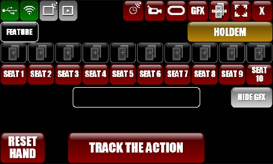
>
> *PokerGFX AT 초기 화면. SEAT 1~10 수평 배열, 하단 TRACK THE ACTION 버튼.*

**별도 앱 분리 이유**:

| 이유 | 설명 |
|------|------|
| 실수 방지 | GfxServer 설정 오조작 차단 — AT는 액션 입력만 노출 |
| 입력 최적화 | 터치 + 키보드 듀얼 입력. 물리 키보드 단축키 우선 |
| 멀티 모니터 | AT 전용 모니터 분리 운용 (풀스크린) |

**설계 철학**: 수 시간 연속 사용에서 운영자 피로 최소화.

| 원칙 | 구현 |
|------|------|
| 키보드 우선 | F/C/B/A 단축키로 핵심 액션 입력 |
| 시각적 명확성 | Active 좌석 펄스, Folded 반투명, 상태별 색상 |
| 오류 복구 | UNDO 최대 5단계 되돌리기 |
| 일관성 | 모든 게임 타입에서 동일한 레이아웃 유지 |

## §2. 시스템 아키텍처

### AT ↔ GfxServer 연결 구조

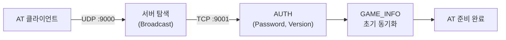

- `ApplicationType` enum: `pgfx_action_tracker` (PokerGFX.Common.dll)
- `AT_DL` 명령: `net_conn` "Data Transfer" 카테고리
- AT는 서버에 액션을 **전송**하고, 서버는 전체 GameState를 **브로드캐스트**

### GfxServer System 탭 AT 설정

| ID | 요소 | 설명 |
|----|------|------|
| Y-13 | Allow AT Access | AT 접근 허용/차단 |
| Y-14 | Predictive Bet | 베팅 예측 입력 활성화 |
| Y-15 | Kiosk Mode | 딜러 불필요 기능 제한 |

### 세션 초기화 흐름

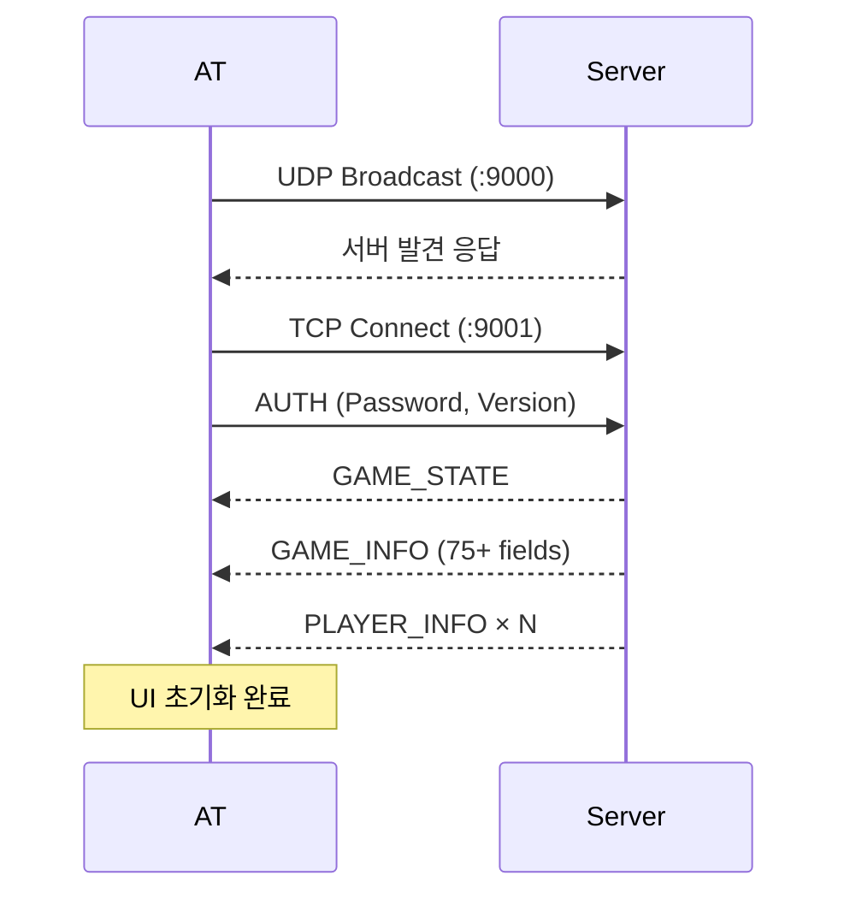

## §3. 화면 설계

### §3.1 공통 UI 요소 (Top Control Bar)

화면 상단에 고정된 가로 바. 시스템 상태와 네비게이션을 제공한다.

| 영역 | 요소 | 설명 |
|------|------|------|
| 좌측 | Table Health, Network Health | 연결 상태 아이콘 (녹/황/적) |
| 좌측 | Stream, Record | 방송/녹화 상태 표시 |
| 중앙 | Game Variant | HOLDEM / PLO4 / PLO5 등 현재 게임 타입 |
| 우측 | Director Console | GfxServer 콘솔 열기 |
| 우측 | Statistics Console | 통계 패널 열기 |
| 우측 | Window Size 토글 | 풀스크린 / 윈도우 전환 |
| 우측 | Close Tracker | AT 종료 |

> 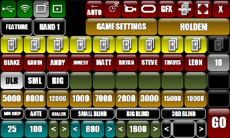
>
> *Pre-Start 화면. 상단 바에 HOLDEM 게임 타입, 시스템 상태 아이콘 배치.*

### §3.2 핸드 사전 준비 (Pre-Start Setup)

핸드 시작 전 플레이어/블라인드/딜러를 설정하는 화면. 3개 영역으로 구성된다.

| Zone | 영역 | 내용 |
|------|------|------|
| A | 플레이어 정보 | 10인 수평 슬롯 — 이름, 칩 카운트, 카드 입력 버튼 |
| B | 블라인드/딜러 설정 | Min Chip, Ante, Dealer/SB/BB 좌우 화살표 |
| C | 시작 | [GAME SETTINGS] + [GO] 버튼 |

> 
>
> *초기 빈 좌석 상태. TRACK THE ACTION 버튼으로 시작.*

> 
>
> *플레이어 및 블라인드 설정 완료. GO 버튼 활성화 상태.*

> 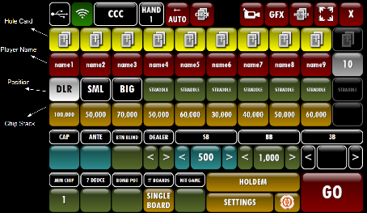
>
> *전체 설정 뷰. CAP/ANTE/BTN BLIND/DEALER/SB/BB 세부 옵션.*

> 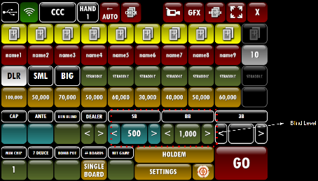
>
> *Blind Level 위치 강조 주석.*

#### Pre-Start 설정 순서 (10단계)

| 단계 | 기능 ID | 내용 | 입력 방식 |
|:----:|---------|------|----------|
| 1 | PS-001 | Event Name 입력 | TextField |
| 2 | PS-002 | Game Type 선택 (22종, v1.0은 Texas Hold'em) | Dropdown |
| 3 | PS-008 | Blinds 설정 — SB/BB/Ante | 숫자 입력 |
| 4 | PS-003 | Min Chip 설정 | 숫자 입력 |
| 5 | PS-009 | Straddle (선택) | 토글 + 금액 |
| 6 | PS-004~005 | 플레이어 이름 + 칩 스택 | 좌석별 탭 → 입력 |
| 7 | PS-006/010 | 포지션 할당 — BTN 위치 | 좌우 화살표 |
| 8 | PS-012 | TRACK THE ACTION 버튼 | 클릭 |
| 9 | PS-011 | Board Count (Hold'em: 5) | Dropdown |
| 10 | PS-013 | AUTO 모드 — RFID 자동 감지 | Toggle |

#### Ante 7가지 유형

| 유형 | 납부자 | 설명 |
|------|--------|------|
| No Ante | — | 기본값 |
| Standard | 전원 | 동일 금액 |
| Button Ante | 딜러만 | 딜러 위치만 납부 |
| BB Ante | Big Blind만 | BB가 대납 (토너먼트 표준) |
| Live Ante | 전원 | 라이브 머니 |
| TB Ante | SB+BB | Two Blind 합산 |
| Bring In | 특정 | Stud 계열 전용 |

> 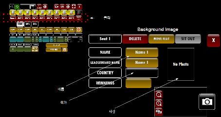
>
> *플레이어 상세 편집 팝업. 이름/국적/사진/DELETE/MOVE SEAT/SIT OUT.*

### §3.3 테이블 레이아웃 시스템

PokerGFX는 고정 10인 수평 그리드를 사용한다. EBS v3.0은 12×8 그리드 기반 좌표 시스템으로 확장하여 4종 템플릿을 지원한다.

| 템플릿 | 형태 | 기본 인원 | 특징 |
|--------|------|:---------:|------|
| A (Oval) | 타원형 | 9인 | 기본 템플릿, TV 방송 표준 |
| B (Hexagonal) | 육각형 | 8인 | 소규모 테이블 |
| C (Semicircle) | 반원형 | 9인 | 카메라 정면 배치 |
| Custom | 자유 배치 | 2~10인 | 드래그 앤 드롭 |

**커스텀 배치 기능**: 드래그 앤 드롭 좌석 이동, 좌석 추가/제거, 프리셋 저장(최대 10개).

> 
>
> *EBS v5 Seat Cell 컴포넌트 목업.*

### §3.4 좌석 셀 (Seat Cell) 컴포넌트

각 좌석은 `PlayerInfoResponse`의 20개 필드를 시각화한다.

#### PlayerInfoResponse 필드 매핑

| 항목 | 데이터 소스 | 타입 |
|------|------------|------|
| 이름 | PlayerInfoResponse.Name | string |
| 풀 네임 | PlayerInfoResponse.LongName | string |
| 홀카드 | PlayerCardsResponse.Cards | RFID 자동 |
| 칩 스택 | PlayerInfoResponse.Stack | int |
| 현재 베팅 | PlayerInfoResponse.Bet | int |
| 데드 베팅 | PlayerInfoResponse.DeadBet | int |
| 폴드 상태 | PlayerInfoResponse.Folded | bool |
| 올인 상태 | PlayerInfoResponse.AllIn | bool |
| 자리비움 | PlayerInfoResponse.SitOut | bool |
| 카드 보유 | PlayerInfoResponse.HasCards | bool |
| 국가 | PlayerInfoResponse.Country | string |
| VPIP | PlayerInfoResponse.Vpip | int |
| PFR | PlayerInfoResponse.Pfr | int |
| AGR | PlayerInfoResponse.Agr | int |
| WTSD | PlayerInfoResponse.Wtsd | int |
| 누적 수익 | PlayerInfoResponse.CumWin | int |
| 프로필 사진 | PlayerInfoResponse.HasPic | bool |
| 좌석 번호 | PlayerInfoResponse.Player | int (0-9) |
| Nit 금액 | PlayerInfoResponse.NitGame | int |

#### 좌석 상태별 시각 처리

| 상태 | 시각 처리 | PokerGFX 참조 |
|------|----------|--------------|
| Active (Action-on) | 밝은 테두리 + 펄스 애니메이션 | 노란 테두리 |
| Acted | 액션 텍스트 표시 (BET 500, CALL, RAISE TO 1000) | 동일 |
| Folded | 반투명 (opacity 0.4) + 회색 | 비활성화 처리 |
| All-in | 스택 강조 + ALL IN 텍스트 | 동일 |
| Empty | 빈 좌석 아이콘 + "OPEN" | SEAT N 표시 |
| Sitting Out | 회색 + "AWAY" | 동일 |

#### 뱃지 시스템

| 뱃지 | 표시 조건 | 시각 처리 |
|------|----------|----------|
| BTN (DLR) | 딜러 버튼 보유 | 흰색 원형 |
| SB (SML) | Small Blind | 노란색 |
| BB (BIG) | Big Blind | 파란색 |
| STR | Straddle | 보라색 |

### §3.5 핸드 진행 중 (During Hand) 화면

핸드가 시작되면 3개 Zone으로 전환된다.

| Zone | 위치 | 내용 |
|------|------|------|
| A (상단) | 플레이어 상태 | 액션 턴 플레이어 강조(노란 테두리), 폴드 비활성화(회색) |
| B (중앙) | 커뮤니티 카드 | 5슬롯 + 팟 사이즈 실시간 갱신 |
| C (하단) | 액션 입력 | 현재 플레이어 정보 + 액션 버튼 |

> 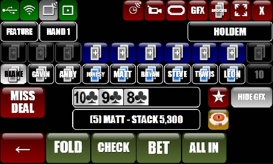
>
> *핸드 진행 중 화면. 커뮤니티 카드, FOLD/CHECK/BET/ALL IN 버튼.*

> 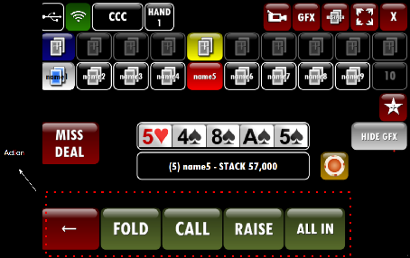
>
> *액션 버튼 영역 강조 주석.*

> 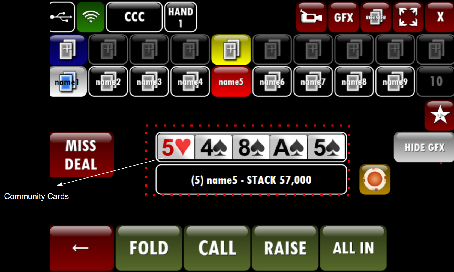
>
> *커뮤니티 카드 5슬롯 영역 주석.*

> 
>
> *EBS v5 메인 레이아웃 목업.*

> 
>
> *EBS v5 전체 레이아웃 목업.*

### §3.6 액션 패널 (하단 고정)

게임 상태에 따라 버튼이 동적으로 전환된다.

#### 게임 상태별 버튼 전환

| 게임 상태 | 표시 버튼 |
|----------|----------|
| PRE_FLOP ~ RIVER | FOLD, CHECK/BET (no prior bet) 또는 CALL/RAISE (prior bet), ALL-IN |
| SHOWDOWN | MUCK, SHOW, SPLIT POT |
| SETUP_HAND | NEW HAND, EDIT SEATS |

#### 동적 변환 규칙

- `biggest_bet_amt == 0` → **CHECK**, **BET**
- `biggest_bet_amt > 0` → **CALL {amount}**, **RAISE TO**

**UNDO**: 항상 표시, 최대 5단계 되돌리기. `UndoLastAction` → 서버 GameState 복원 → 전체 클라이언트 브로드캐스트.

#### 특수 컨트롤

| 버튼 | 동작 | 프로토콜 |
|------|------|---------|
| HIDE GFX | 방송 화면 GFX 일시 숨김 | `SendGfxEnable(!enable)` — **반전 전송 주의** |
| TAG HAND | 현재 핸드 태그 | `SendTagHand` |
| CHOP | 팟 분할 | `SendChop` |
| RUN IT 2x | 두 번째 보드 런아웃 | `SendRunItTwice` |
| MISS DEAL | 핸드 무효화 | `SendMissDeal` |
| ADJUST STACK | 칩 수동 변경 | `SendPlayerStack` |

### §3.7 베팅 입력

BET/RAISE 선택 시 전용 숫자 키패드가 슬라이드업된다. 시스템 키보드는 사용하지 않는다.

| 기능 | 설명 |
|------|------|
| Quick Bet 프리셋 | 1/2 POT, 3/4 POT, POT, 2x, 3x 자동 계산 |
| 전용 숫자 키패드 | 터치 최적화 큰 버튼 |
| 예측 입력 (Predictive Input) | Y-14 설정 연동, 최소 레이즈 + 스택 기반 자동 완성 |
| +/- 조정 | BB 단위 증감 |
| Min/Max 바로가기 | 최소 레이즈 / 올인 즉시 입력 |

### §3.8 카드 인식과 수동 입력

#### RFID 자동 인식 흐름

| 상태 | 카드 슬롯 표시 | 트리거 |
|------|--------------|--------|
| EMPTY | 빈 슬롯 (점선) | 초기 상태 |
| DETECTING | 노란색 펄스 | RFID 신호 수신 |
| DEALT | 카드 이미지 | UID → 카드 매핑 성공 |
| WRONG_CARD | 빨간 테두리 | 이미 할당된 카드 감지 |

#### 수동 카드 입력 UI

RFID 실패 시 5초 카운트다운 후 52장 카드 그리드가 표시된다.

| 기능 | 설명 |
|------|------|
| 52장 전체 그리드 | 4 Suit × 13 Rank 배열 |
| Suit/Rank 필터 | 특정 무늬/숫자만 표시 |
| 중복 방지 | 이미 선택된 카드 비활성화 (회색) |
| Mucked 버튼 | 카드 미공개 처리 |
| OK / Cancel | 확인/취소 |

> 
>
> *EBS v5 카드 선택기 목업. 52장 그리드 + Suit 필터.*

### §3.9 RFID 덱 등록

Register Deck 기능. 54장(52 + 조커 2) 등록.

| 단계 | 피드백 | 설명 |
|------|--------|------|
| 1. 태핑 | 진동/소리 | 카드를 리더에 태핑 |
| 2. 인식 | 카드 이미지 표시 | UID → 카드 매핑 확인 |
| 3. 진행률 | N/54 바 | 전체 등록 진행률 |

> 
>
> *EBS v5 RFID 덱 등록 화면. 54장 진행률 바.*

## §4. 게임 진행 상태 머신

### 8단계 상태별 AT 화면 변화

| 상태 | 좌석 영역 | 보드 영역 | 액션 패널 | 정보 바 |
|------|----------|----------|----------|---------|
| IDLE | 이름+스택만 | 비어있음 | NEW HAND, EDIT SEATS | Hand # |
| SETUP_HAND | 포지션 뱃지 표시, 블라인드 자동 수거 | 비어있음 | 대기 | SB/BB/Ante |
| PRE_FLOP | 홀카드 슬롯 활성, Action-on 펄스 | 비어있음 | FOLD/CHECK/BET/CALL/RAISE/ALL-IN | 팟 실시간 |
| FLOP | 액션 플레이어 하이라이트, 폴드 반투명 | 3장 표시 | 동일 | 팟 갱신 |
| TURN | 동일 | 4장 | 동일 | 갱신 |
| RIVER | 동일 | 5장 | 동일 | 최종 팟 |
| SHOWDOWN | 위너 강조, 핸드 공개 | 5장 + 핸드명 | MUCK/SHOW/SPLIT | 결과 |
| HAND_COMPLETE | 팟 지급 → 스택 갱신 → 3초 → IDLE | 클리어 | — | Hand#+1 |

### 상태 전이 다이어그램

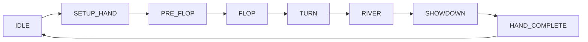

### 운영자 핵심 루프 (7단계)

| 단계 | 운영자 액션 |
|:----:|------------|
| 1 | NEW HAND 탭 → 딜러 위치 확인 → 블라인드 수거 |
| 2 | 홀카드 배분 → RFID 대기 (또는 수동 입력) |
| 3 | Pre-Flop 액션 입력 |
| 4 | Flop 3장 → 액션 반복 |
| 5 | Turn → River → 동일 |
| 6 | Showdown → 위너 선택 → 팟 지급 |
| 7 | IDLE 복귀 → 1번으로 |

### 예외 흐름

| 예외 | 화면 변화 | 운영자 조작 |
|------|----------|------------|
| 전원 폴드 | 팟 자동 합산 → HAND_COMPLETE | 없음 |
| 전원 올인 | 런아웃 자동, Equity 바 표시 | 없음 |
| Bomb Pot | SETUP → FLOP 직행 | 합의 금액 입력 |
| RFID 실패 | 5초 카운트다운 → 52장 그리드 | 수동 선택 |

## §5. 프로토콜 명세

### §5.1 AT → Server (Send 명령)

#### 핵심 명령

| 명령 | 필드 | 설명 |
|------|------|------|
| SendPlayerBet | Player, Amount | 베팅 |
| SendPlayerBlind | Player, Amount | 블라인드 수거 |
| SendPlayerFold | Player | 폴드 |
| SendPlayerAllIn | Player | 올인 |
| SendBoardCard | CardIndex, Suit, Rank | 보드 카드 설정 |
| SendCardVerify | Player, CardIndex, Suit, Rank | 카드 검증 |
| SendForceCardScan | Player | 강제 재스캔 |
| SendNextHand | — | 다음 핸드 |
| SendResetHand | — | 핸드 리셋 |
| SendGameType | GameType | 게임 타입 변경 |
| SendGameVariant | Variant | 게임 변형 |
| SendChop | — | 팟 분할 |
| SendMissDeal | — | 미스딜 |
| SendRunItTwice | — | 더블 런아웃 |
| SendPayout | Player, Amount | 지급 |
| SendPlayerAdd | Seat, Name | 플레이어 추가 |
| SendPlayerDelete | Seat | 플레이어 제거 |
| SendPlayerStack | Player, Amount | 스택 조정 |
| SendGfxEnable | enable | GFX 토글 (**반전 전송: !enable**) |
| SendTagHand | — | 핸드 태그 |
| SendTickerLoop | active | 티커 제어 (**반전 전송: !active**) |
| SendPlayerSitOut | sitOut | 자리비움 (**반전 전송: !sitOut**) |
| WriteGameInfo | 22+ fields | 게임 설정 전체 전송 |

#### WriteGameInfo 주요 필드

| 필드 | 타입 | 설명 |
|------|------|------|
| ante | int | Ante 금액 |
| small_blind | int | SB |
| big_blind | int | BB |
| third_blind | int | Straddle |
| button_blind | int | Button Blind |
| bring_in | int | Bring In (Stud) |
| cap | int | Cap 금액 |
| smallest_chip | int | 최소 칩 단위 |
| min_raise_amt | int | 최소 레이즈 |
| num_seats | int | 좌석 수 |
| pl_dealer | int | 딜러 위치 |
| pl_small | int | SB 위치 |
| pl_big | int | BB 위치 |
| game_class | enum | Cash / Tournament |
| game_type | enum | Holdem / PLO4 / PLO5 / ShortDeck |
| bet_structure | enum | NoLimit / PotLimit / FixedLimit |
| ante_type | enum | 7가지 유형 |
| predictive_bet | bool | 예측 입력 활성화 (Y-14) |

### §5.2 Server → AT (Receive 응답)

#### 핵심 응답

| 응답 | 주요 필드 | 설명 |
|------|----------|------|
| GameInfoResponse | 75+ 필드 | 게임 전체 상태 |
| PlayerInfoResponse | 20 필드 (§3.4 참조) | 개별 플레이어 상태 |
| PlayerCardsResponse | Player, Cards[] | RFID 홀카드 |
| ReaderStatusResponse | ReaderId, Status | RFID 리더 상태 |
| HeartBeatResponse | — | 연결 유지 |
| DelayedGameInfoResponse | 동일 구조 | 보안 딜레이 후 전송 |
| DelayedPlayerInfoResponse | 동일 구조 | 보안 딜레이 후 전송 |

#### GameInfoResponse 카테고리별 핵심 필드

| 카테고리 | 주요 필드 |
|---------|----------|
| 블라인드 | Ante, Small, Big, Third, ButtonBlind, BringIn, BlindLevel, NumBlinds |
| 좌석 | PlDealer, PlSmall, PlBig, ActionOn, NumSeats, NumActivePlayers |
| 베팅 | BiggestBet, SmallestChip, BetStructure, Cap, MinRaiseAmt, PredictiveBet |
| 게임 | GameClass, GameType, GameVariant, GameTitle |
| 보드 | OldBoardCards, CardsOnTable, NumBoards, CardsPerPlayer |
| 상태 | HandInProgress, GfxEnabled, Streaming, Recording, ProVersion |
| 특수 | RunItTimes, BombPot, SevenDeude, CanChop, IsChopped |
| 드로우 | DrawCompleted, DrawingPlayer, StudDrawInProgress, AnteType |

### §5.3 ConfigurationPreset AT 관련 필드

| 필드 | enum | 값 | 설명 |
|------|------|-----|------|
| at_show | show_type | immediate=0, action_on=1, after_bet=2, action_on_next=3 | 카드 표시 타이밍 |
| fold_hide | fold_hide_type | immediate=0, delayed=1 | 폴드 후 숨김 방식 |
| fold_hide_period | int (ms) | — | delayed 모드 시 지연 시간 |

### §5.4 반전 전송 패턴 주의사항

3건의 명령에서 bool 값을 **반전하여 전송**해야 정확히 동작한다.

| 명령 | UI 의도 | 와이어 전송 |
|------|---------|-----------|
| `SendGfxEnable(enable)` | GFX 표시 | `!enable` |
| `SendTickerLoop(active)` | 티커 활성 | `!active` |
| `SendPlayerSitOut(sitOut)` | 자리비움 | `!sitOut` |

> **구현 시 반드시 반전 로직 적용.** 누락 시 GFX 토글이 반대로 동작한다.

## §6. 키보드 단축키

| 키 | 동작 | 카테고리 |
|----|------|---------|
| F | FOLD | 핵심 액션 |
| C | CHECK / CALL | 핵심 액션 |
| B | BET / RAISE | 핵심 액션 |
| A | ALL-IN | 핵심 액션 |
| U | UNDO | 보조 |
| N | NEW HAND | 보조 |
| G | HIDE GFX 토글 | 보조 |
| F1 | 단축키 가이드 오버레이 | 도움말 |
| F8 | AT 실행 (GfxServer에서) | 시스템 |

## §7. 통계 및 방송 제어

### Stats 패널

`PlayerInfoResponse`에서 수신하는 통계 데이터:

| 지표 | 설명 |
|------|------|
| VPIP | Voluntarily Put $ In Pot |
| PFR | Pre-Flop Raise |
| AGR | Aggression Factor |
| WTSD | Went To ShowDown |
| CumWin | 누적 수익 |

> 
>
> *EBS v5 Stats 패널 목업.*

### GFX 콘솔 기능

| 기능 | 설명 |
|------|------|
| 수동 메시지 입력 | Scrolling Text → 방송 티커로 전송 |
| Stack/VPIP/Payouts | 수동 송출/제거 |
| Leaderboard 표시 제어 | 리더보드 on/off |

### 방송 오버레이 참조

> 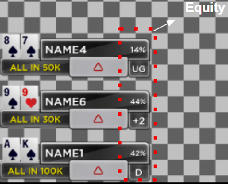
>
> *방송 오버레이 Player Element. Equity%, 포지션, ALL IN 표시.*

> 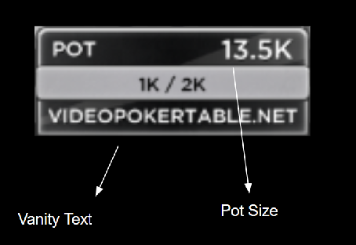
>
> *방송 오버레이 Board Element. POT 13.5K, 블라인드, Vanity Text.*

## §8. 데이터 흐름

### §8.1 Pre-Start 데이터 흐름

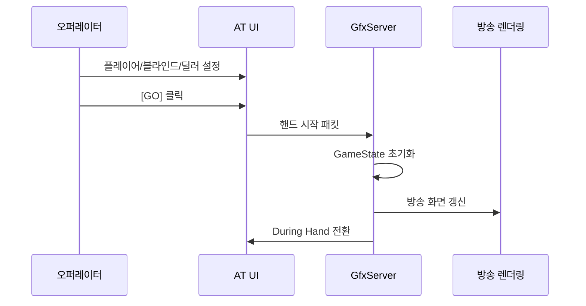

### §8.2 During Hand 데이터 흐름

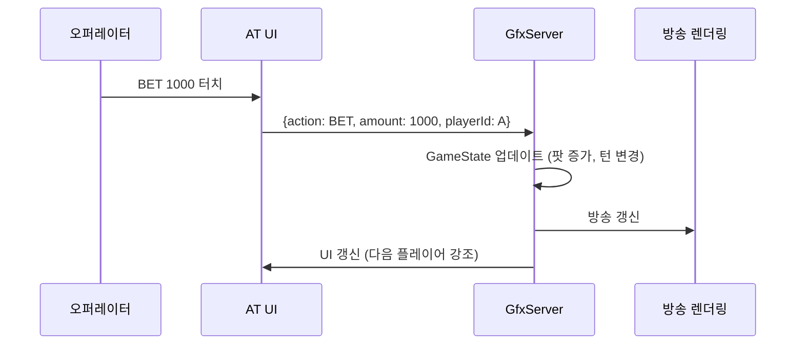

### §8.3 Undo 데이터 흐름

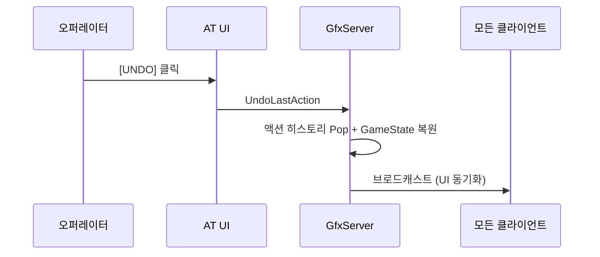

---

## 변경 이력

| 날짜 | 버전 | 변경 내용 | 변경 유형 | 결정 근거 |
|------|------|-----------|----------|----------|
| 2026-03-13 | v1.0.0 | 신규 작성 — 기존 DESIGN-AT-001/DESIGN-AT-v3 통합 | PRODUCT | 역설계 문서 + GGP-GFX Story 3.1/3.2 기반 통합 설계 |

---

**Version**: 1.0.0 | **Updated**: 2026-03-13
