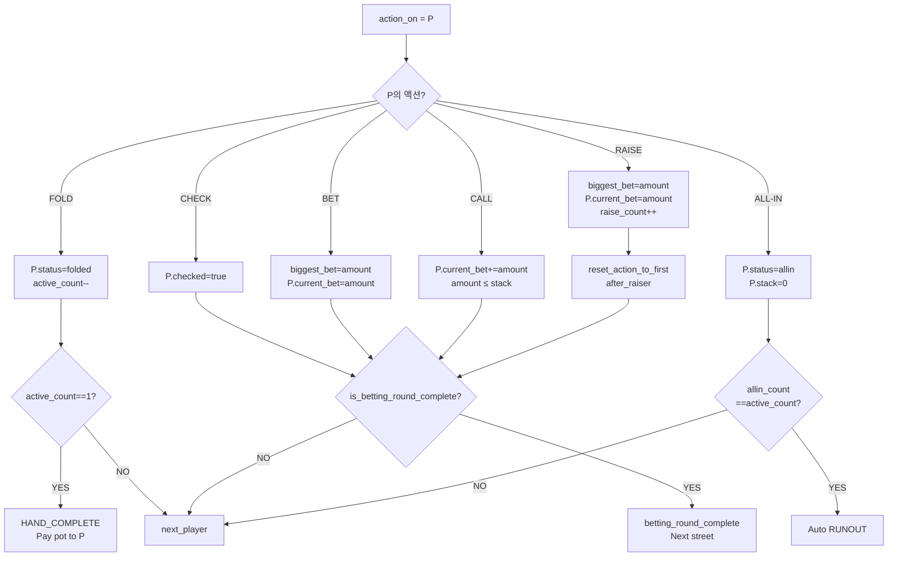

# BS-06-02: Hold'em 베팅 액션

| 날짜 | 항목 | 내용 |
|------|------|------|
| 2026-04-06 | 신규 작성 | 6개 베팅 액션 × 3개 베팅 구조 × 특수 상황 모든 조합 정의 |
| 2026-04-06 | 구조 → 제목 변경 | Hold'em 전용으로 변환, 제목 변경 |
| 2026-04-09 | doc-critic 개선: 용어 해설 추가 | 문서 서두 용어 해설 테이블, Pseudocode 안내문, Dict[int,int] 설명 추가 |
| 2026-04-09 | CALL → 금액 자동 계산 강제 명시 | 외부 금액 무시 규칙, Event Log 기록 규칙 추가 |
| 2026-04-09 | CALL → enforcement pseudocode 추가 | Contract Test FAIL 근거: applyAction 내부 재계산 강제, Call.amount 직접 참조 금지 명시 |
| 2026-04-09 | GAP-GE-006 명세 보강 | 플로우차트 CALL/BET/RAISE/ALL-IN → is_betting_round_complete 분기 추가, CHECK 섹션 original_first_actor 제거, 공통 프로토콜 섹션 신규 |
| 2026-04-09 | doc-critic FAIL 수정 | 스트리트 전환 초기화 섹션 추가 (biggest_bet_amt/num_raises/current_bet), FOLD/BET/RAISE/ALL-IN 액션 후 처리에 is_betting_round_complete 호출 명시 |

---

> **이 문서에서 사용하는 용어**
>
> | 용어 | 설명 |
> |------|------|
> | CC | Command Center, 운영자가 게임을 제어하는 화면 |
> | NL/PL/FL | No Limit(무제한) / Pot Limit(팟 크기까지) / Fixed Limit(고정 금액) 베팅 구조 |
> | Pseudocode | 실제 프로그래밍 언어가 아닌 가상 코드. 로직을 이해하기 위한 참고용 |
> | scoop | 한 사람이 팟 전체를 가져가는 것 |
> | odd chip | 팟을 나눌 때 딱 떨어지지 않는 나머지 1개 베팅 토큰 |

## 개요

베팅 액션(Fold, Check, Bet, Call, Raise, All-in)은 운영자가 Command Center(CC) 버튼으로 입력하는 플레이어의 의도된 행동이다. 각 액션의 유효성은 현재 게임 상태(GamePhase, biggest_bet_amt, player.stack)에 따라 결정되며, 베팅 금액은 bet_structure(NL, PL, FL)별 규칙으로 검증된다. 이 문서는 **모든 액션 조합의 조건, 금액 계산, 상태 변경, 특수 케이스**를 정의한다.

---

## 정의

**베팅 액션**: 현재 액션 턴(action_on)을 가진 플레이어가 자신의 의도를 선언하는 행동. 6가지 유형:

1. **Fold** — 현재 핸드를 포기하고 팟에서 탈락
2. **Check** — 베팅 없이 액션을 다음 플레이어에게 넘김
3. **Bet** — 현재 스트리트에서 처음으로 금액을 베팅
4. **Call** — 현재까지 가장 높은 베팅액과 같은 금액을 납부
5. **Raise** — 현재까지 가장 높은 베팅액을 초과하는 금액을 베팅
6. **All-in** — 자신의 모든 칩을 팟에 넣음 (금액과 무관하게 상태 전환)

**베팅 구조**(bet_structure):
- **NL (No Limit)** — 최소 big_blind 이상이면 스택 전액까지 베팅 가능
- **PL (Pot Limit)** — 베팅 금액의 상한 = 팟 + 2×콜액 계산식 적용
- **FL (Fixed Limit)** — 각 스트리트별 고정 금액(low_limit / high_limit) 및 레이즈 상한 제한

---

## 트리거

| 트리거 유형 | 조건 | 발동 주체 | 정확도 |
|-----------|------|---------|--------|
| **CC 액션 버튼** | 운영자가 FOLD, CHECK, BET, CALL, RAISE, ALL-IN 버튼 클릭 | 운영자 (수동) | ≤100ms |
| **금액 입력 후 CONFIRM** | 운영자가 금액을 직접 입력하고 확인 버튼 클릭 (BET/RAISE만) | 운영자 (수동) | ≤150ms |
| **키보드 단축키** | 할당된 단축키로 액션 입력 (예: F=Fold, C=Call, R=Raise) | 운영자 (수동) | ≤50ms |

---

## 전제조건

다음 모든 조건이 참이어야 베팅 액션 처리 가능:

1. **hand_in_progress == true** — 핸드가 진행 중
2. **GamePhase ∈ {PRE_FLOP, FLOP, TURN, RIVER}** — 베팅 라운드 중
3. **action_on == player_index** — 해당 플레이어 차례
4. **player.status == active** — 플레이어가 활성 상태 (folded ❌, allin ❌, busted ❌)
5. **num_active_players ≥ 2** — 활성 플레이어가 2인 이상
6. **betting_round_complete == false** — 현재 베팅 라운드 미완료

---

## 유저 스토리

| # | As a | When | Then | Edge Case |
|:-:|------|------|------|-----------|
| 1 | 운영자 | 플레이어가 SB 베팅하는 상황에서 CHECK 버튼 클릭 | 액션이 거부되고 "베팅이 있습니다" 경고 표시 | CHECK 비활성 유지 |
| 2 | 운영자 | NL 게임에서 UTG 플레이어가 2x BB 레이즈 입력 | 레이즈 유효함, min_raise_amt 갱신 | 다음 플레이어는 최소 1×(레이즈 차액) 추가 레이즈 가능 |
| 3 | 운영자 | PL Omaha에서 팟=100, 현재 베팅=50일 때 레이즈 입력 금액 300 | 유효함 (300 = 100 + 50 + 100), 다음 최대 베팅 계산됨 | 301 입력 시 거부 |
| 4 | 운영자 | FL Hold'em PRE_FLOP에서 bet=2, raise increment=2 | 유효함, 1라운드 레이즈 기록 | 4번째 레이즈 시도 시 "Cap reached" 경고 |
| 5 | 운영자 | FL heads-up (2인) 게임에서 레이즈 cap 조건 | cap 미적용, 무제한 레이즈 가능 | 3명 이상일 때는 cap 적용 |
| 6 | 운영자 | BB 플레이어가 PRE_FLOP에서 raise 없이 체크 시도 | BB check option 활성, 체크 허용 | 누군가 레이즈 들어오면 다시 액션 턴 |
| 7 | 운영자 | 스택 150 플레이어가 200 raise 시도 (min raise 필수) | 모두 올인 상태로 변경, 150칩만 납부 | side pot 분리됨 |
| 8 | 운영자 | 모든 플레이어가 all-in 상태 | 보드 자동 딜, showdown 직행 | 수동 입력 불가, 자동 진행 |
| 9 | 운영자 | 전원(3명) all-in, 스택 차이: P1=100, P2=300, P3=500 | 3개 side pot 생성 (100/100/300) | 각 pot별 승률/수익률 계산 |
| 10 | 운영자 | Bomb Pot 게임 시작, 전원 고정액 납부 | PRE_FLOP 베팅 스킵, 직접 DEAL로 진행 | 후속 BET 액션은 정상 처리 |
| 11 | 운영자 | Live ante 게임, 블라인드 외 5칩 ante | SB/BB check option에서 ante 포함 여부 확인 옵션 제공 | "With ante" 선택 시 first_bet = BB + ante |
| 12 | 운영자 | Straddle 게임, 3번째 블라인드(UTG+1=2x BB) 납부 | 액션 순서 변경: SB → BB → Straddle → UTG → ... | Straddle 플레이어의 check option 활성 |
| 13 | 운영자 | 첫 플레이어 bet, 두 번째 플레이어 액션 선택 | "Bet 입력" → "Raise 최소액 계산" 전환 | Call 옵션 활성 유지 |
| 14 | 운영자 | 3인 다양한 스택: P1 call, P2 all-in 150, P3 raise 300 | 각 pot 재계산: main=450, side=300+(P1 contribution) | 쇼다운 시 pot별 분배 |
| 15 | 운영자 | 0원 베팅 시도 (오류 입력) | REJECTED, "최소 베팅액은 X칩입니다" 경고 | 재입력 요청 |
| 16 | 운영자 | 스택보다 많은 금액 입력 (예: 스택 100, 베팅 150) | 자동 all-in으로 처리, 팟에 100칩 납부 | short call로 기록 |
| 17 | 운영자 | NL에서 가능 최소 레이즈: bet=50, BB=10 | min raise = 50 + max(10, 이전 레이즈) | 다음 레이즈는 min=100 |
| 18 | 운영자 | 4번째 raise attempt (FL cap=4, 3명+) | REJECTED, "Raise cap reached" | 2인 게임이면 cap 무시하고 허용 |
| 19 | 운영자 | All-in 이후 side pot에 영향을 받는 액션 | Side pot 분리 완료, 다음 액션은 side pot 기여도 반영 | 계산 구조: main pot A → side pot B → side pot C |
| 20 | 운영자 | River에서 전원 all-in 후 showdown | 보드 공개 완료, 패 평가 자동 진행 | 승자 결정 후 팟 분배 시작 |

---

## 경우의 수 매트릭스

### Matrix 1: 액션별 유효성 검증 (6 actions × 3 bet_structures)

| 액션 | NL 유효조건 | NL 금액 범위 | PL 유효조건 | PL 금액 범위 | FL 유효조건 | FL 금액 |
|:----:|-----------|-----------|-----------|-----------|-----------|---------|
| **Fold** | 항상 가능 (active 상태만) | N/A | 항상 가능 | N/A | 항상 가능 | N/A |
| **Check** | biggest_bet_amt == player.current_bet | N/A | biggest_bet_amt == player.current_bet | N/A | biggest_bet_amt == player.current_bet | N/A |
| **Bet** | biggest_bet_amt == 0 | [big_blind, stack] | biggest_bet_amt == 0 | [big_blind, pot + 2×big_blind] | biggest_bet_amt == 0 | limit 값 고정 |
| **Call** | biggest_bet_amt > player.current_bet | [call_amount, min(call_amount, stack)] | biggest_bet_amt > player.current_bet | [call_amount, min(call_amount, stack)] | biggest_bet_amt > player.current_bet | call_amount (고정) |
| **Raise** | biggest_bet_amt > 0 && last_raise_increment > 0 | [min_raise, stack] | biggest_bet_amt > 0 | [min_raise, pot + call_amt + biggest_bet_amt + call_amt] | biggest_bet_amt > 0 && raise_count < cap | limit 고정 |
| **All-in** | player.stack > 0 | player.stack (자동 계산) | player.stack > 0 | player.stack (자동 계산) | player.stack > 0 | player.stack (자동 계산) |

---

### Matrix 2: 액션 유효성 검증 (GamePhase × biggest_bet_amt × player.status)

| GamePhase | biggest_bet_amt == 0 | biggest_bet_amt > 0 | player.stack == 0 | player.status == folded |
|:--------:|:---:|:---:|:---:|:---:|
| **PRE_FLOP** | CHECK/BET/RAISE 가능 | CHECK ❌ / CALL/RAISE 가능 | ALL-IN 만 가능 | 모든 액션 ❌ |
| **FLOP** | CHECK/BET/RAISE 가능 | CHECK ❌ / CALL/RAISE 가능 | ALL-IN 만 가능 | 모든 액션 ❌ |
| **TURN** | CHECK/BET/RAISE 가능 | CHECK ❌ / CALL/RAISE 가능 | ALL-IN 만 가능 | 모든 액션 ❌ |
| **RIVER** | CHECK/BET/RAISE 가능 | CHECK ❌ / CALL/RAISE 가능 | ALL-IN 만 가능 | 모든 액션 ❌ |
| **SHOWDOWN** | 모든 액션 ❌ | 모든 액션 ❌ | 모든 액션 ❌ | 모든 액션 ❌ |

---

### Matrix 3: 특수 상황별 처리

| 상황 | 조건 | 처리 |
|:---:|------|------|
| **Short all-in** | call_amount > player.stack | 모두 올인 상태로 처리, side pot 분리 |
| **BB check option** | PRE_FLOP && biggest_bet_amt == BB && action_on == BB_index | CHECK 허용 (이후 레이즈 들어오면 다시 액션 턴) |
| **Cap reached** | num_raises >= 4 && num_active_players > 2 && street ≠ heads-up | 추가 레이즈 거부 |
| **Heads-up cap override** | num_active_players == 2 | cap 미적용, 무제한 레이즈 |
| **Live ante included** | ante > 0 && biggest_bet_amt == 0 | 첫 베팅 금액 >= BB + ante (선택 옵션) |
| **Bomb Pot** | bomb_pot_active == true && street == PRE_FLOP | PRE_FLOP 베팅 스킵, DEAL 직행 |
| **Straddle** | straddle_index >= 0 && action_on < straddle_index | 스트래들이 마지막 액션 (BB 다음) |
| **Dead button** | button_dead == true | 액션 순서: SB → UTG → (button 스킵) |
| **Multiple all-ins at different stacks** | 3+ players all-in with stack[i] ≠ stack[j] | side pot 다중 생성 (예: 3개 pot) |
| **0원 베팅 시도** | amount == 0 | REJECTED, 재입력 요청 |

---

## 스트리트 전환 시 초기화 (공통)

다음 스트리트로 전환될 때마다 아래 값을 반드시 초기화한다. **이 초기화 없이는 BET 조건(`biggest_bet_amt == 0`)이 절대 충족되지 않는다.**

| 필드 | 초기화 값 | 이유 |
|------|:---------:|------|
| `biggest_bet_amt` | 0 | BET 가능 조건 충족, 스트리트 독립 |
| `num_raises_this_street` | 0 | FL cap 카운터 리셋 |
| `player[*].current_bet` | 0 | 각 플레이어의 스트리트 기여도 리셋 |
| `acted_this_round` | `{}` | BS-06-10 위임, 블라인드 포스터 포함 금지 |

> 참고: `player[*].current_bet = 0` 초기화는 side pot 계산 기준이기도 하다. 스트리트 간 누적 기여액은 별도 `total_invested` 필드로 추적한다.

---

## 베팅 라운드 종료 확인 (공통 프로토콜)

모든 베팅 액션(FOLD, CHECK, BET, CALL, RAISE, ALL-IN) 처리 후, **반드시** `is_betting_round_complete(state)` (BS-06-10)를 호출해야 한다.

| 반환값 | 처리 |
|:------:|------|
| **true** | 다음 스트리트 이벤트 발행 (StreetAdvance) 또는 HAND_COMPLETE |
| **false** | `action_on = next_active_player(action_on)`으로 이동, 다음 액션 대기 |

> **주의**: 이 체크는 CHECK 액션에만 적용하는 것이 아니다. CALL이 마지막 필요 액션인 경우(레이즈 후 전원 콜 완료 등) CALL 직후 라운드가 종료된다.

---

## 액션 정의서

### 1. FOLD (포기)

**조건 (모두 참)**:
- hand_in_progress == true
- GamePhase ∈ {PRE_FLOP, FLOP, TURN, RIVER}
- action_on == player_index
- player.status == active

**금액**: N/A (칩 이동 없음)

**상태 변경**:
- player[action_on].status = "folded"
- num_active_players -= 1
- folded_hand_count += 1

**액션 후 처리**:
- action_on = next_active_player(action_on)
- 조건: num_active_players == 1 → **HAND_COMPLETE 상태 전이**, 남은 1인에게 팟 지급
- 조건: num_active_players >= 2 → `is_betting_round_complete(state)` 호출:
  - true → 다음 스트리트 전이 (예: FOLD 후 남은 플레이어들이 이미 동액 완료 상태)
  - false → 베팅 라운드 계속

**특수**:
- 이미 folded된 플레이어의 FOLD 시도 → REJECTED

---

### 2. CHECK (체크)

**조건 (모두 참)**:
- biggest_bet_amt == player.current_bet (미결 베팅 없음)
- action_on == player_index
- player.status == active

**금액**: 0

**상태 변경**:
- player[action_on].action_status = "checked"
- current_bet 불변

**액션 후 처리**:
- action_on = next_active_player(action_on)
- 조건: `is_betting_round_complete(state) == true` → **betting_round_complete = true**, 다음 스트리트 진행 (BS-06-10 참조)
- 조건: `is_betting_round_complete(state) == false` → 베팅 라운드 계속

**특수 — BB Check Option (PRE_FLOP)**:
- 조건: GamePhase == PRE_FLOP && biggest_bet_amt == big_blind && action_on == BB_index
- 처리: CHECK 허용
- 이후: 누군가 레이즈하면 BB에게 다시 액션 턴 부여

---

### 3. BET (첫 베팅)

**조건 (모두 참)**:
- biggest_bet_amt == 0 (현재 스트리트 첫 베팅)
- action_on == player_index
- player.status == active
- player.stack > 0

**금액 규칙**:

#### NL 게임
```
min_amount = big_blind
max_amount = player.stack
check: amount ∈ [big_blind, stack]
```

#### PL 게임
```
max_amount = pot_size + big_blind
  [현재까지 팟(사이드 포트 제외) + BB]
check: amount ∈ [big_blind, max_amount]
```

#### FL 게임
```
bet_amount = low_limit (PRE_FLOP/FLOP에서)
           = high_limit (TURN/RIVER에서)
check: amount == limit_value (선택지 없음, 고정)
```

**상태 변경**:
- biggest_bet_amt = amount
- player[action_on].current_bet += amount
- player[action_on].stack -= amount
- min_raise_amt = biggest_bet_amt (레이즈 계산 기준 설정)
- last_raise_increment = amount
- num_raises_this_street = 1
- _street_bet_history.append((action_on, "BET", amount))

**액션 후 처리**:
- action_on = next_active_player(action_on)
- 조건: player.stack == 0 → player.status = "allin"
- 조건: amount > max_allowed → REJECTED, "최대 베팅액 X칩입니다"
- `is_betting_round_complete(state)` 호출 (공통 프로토콜 참조)

---

### 4. CALL (콜)

**조건 (모두 참)**:
- biggest_bet_amt > player.current_bet
- action_on == player_index
- player.status == active

**금액 계산**:
```
call_amount = biggest_bet_amt - player.current_bet
actual_amount = min(call_amount, player.stack)  // short call handling
```

**상태 변경**:
- call_size = actual_amount
- player[action_on].current_bet += actual_amount
- player[action_on].stack -= actual_amount
- _street_bet_history.append((action_on, "CALL", actual_amount))

**액션 후 처리**:
- action_on = next_active_player(action_on)
- 조건: player.stack == 0 → player.status = "allin"
- 특수 (short call): actual_amount < call_amount → side pot 트리거
  ```
  side_pot_threshold = actual_amount
  새로운 side pot 생성 후 남은 베팅 처리
  ```

**라운드 완료 확인**:
- CALL 처리 후 반드시 `is_betting_round_complete(state)` (BS-06-10)를 호출한다
- true 반환 시 → 다음 스트리트로 전이 (StreetAdvance 이벤트 발행)
- CALL이 마지막 필요 액션인 경우(예: 레이즈 후 마지막 콜) 즉시 라운드 종료

**금액 자동 계산 강제**:
- Call의 `actual_amount`는 엔진이 **자동 계산**한다. CC/외부에서 금액을 전달하더라도 무시한다
- 엔진은 `biggest_bet_amt - player.current_bet`과 `player.stack` 중 작은 값을 적용한다
- Event Log에는 엔진이 계산한 실제 적용 금액만 기록한다 (외부 입력값 아님)

**구현 강제 (applyAction 내부)**:

> 아래는 개발자 참고용 Pseudocode입니다.

```
case Call:
  // 전달된 Call.amount를 무시하고 재계산
  correct_amount = biggest_bet_amt - player.current_bet
  actual_amount = min(correct_amount, player.stack)
  // Call.amount는 참조하지 않는다
  player.stack -= actual_amount
  player.current_bet += actual_amount
  pot.addToMain(actual_amount)
```

> **주의**: `Call.amount`를 그대로 `player.stack -= Call.amount`로 사용하면 명세 위반이다. 반드시 `biggest_bet_amt - player.current_bet`으로 재계산해야 한다.

**특수 — Short Call 처리**:
- 예: biggest_bet = 100, player.stack = 70, player.current_bet = 0
- 처리: 70 자동 납부, all-in으로 상태 전환, 30칩 side pot 분리

---

### 5. RAISE (레이즈)

**조건 (모두 참)**:
- biggest_bet_amt > 0 (이미 베팅이 있음)
- action_on == player_index
- player.status == active
- (FL만) num_raises_this_street < cap (또는 heads-up)

**금액 규칙**:

#### NL 게임

> `last_raise_increment`란 "직전 레이즈에서 올린 차액"이다. 예: 이전 베팅이 50에서 100으로 올랐다면 last_raise_increment = 50.

```
min_raise_total = biggest_bet_amt + max(big_blind, last_raise_increment)
max_raise_total = player.stack + player.current_bet

예: biggest=50, BB=10, last_raise=50
→ min_raise_total = 50 + max(10, 50) = 100
→ raise_amount = min_raise_total - current_bet

check: amount ∈ [min_raise_total, max_raise_total]
```

#### PL 게임
```
call_amount = biggest_bet_amt - player.current_bet
pot_with_call = pot + call_amount + biggest_bet_amt + call_amount
max_raise_total = pot_with_call

예: pot=100, bet=50, call=50
→ max_raise_total = 100 + 50 + 50 + 50 = 250
→ 250를 총액으로 베팅 가능

check: amount ∈ [biggest_bet_amt + call_amount, max_raise_total]
```

#### FL 게임
```
raise_amount = low_limit (PRE_FLOP/FLOP)
             = high_limit (TURN/RIVER)

조건 1: raise_count < cap (기본 4회)
조건 2: 또는 num_active_players == 2 (heads-up, cap 무시)

check: amount == raise_amount (선택지 없음, 고정)
```

**상태 변경**:
- biggest_bet_amt = amount
- player[action_on].current_bet = amount
- player[action_on].stack -= (amount - previous_current_bet)
- min_raise_amt = amount
- last_raise_increment = amount - previous_biggest_bet
- num_raises_this_street += 1
- _street_bet_history.append((action_on, "RAISE", amount))

**액션 후 처리**:
- action_on = 모든 비폴드 플레이어가 다시 액션할 수 있도록 "first_actor_after_raise"로 설정
  (단, 올인 플레이어 제외)
- 조건: player.stack == 0 → player.status = "allin"
- 조건: amount < min_raise → REJECTED
- `is_betting_round_complete(state)` 호출 (공통 프로토콜 참조)
  - 레이즈 직후는 일반적으로 false (다른 플레이어 미액션)이나 호출은 반드시 필요

**특수 — Short all-in raise**:
- 예: min_raise = 200, player.stack = 150
- 처리: 150 올인 허용, side pot 분리
- 다음 raise min: 이전 full raise 150 기준 유지 (100 추가 아님)

---

### 6. ALL-IN (올인)

**조건 (모두 참)**:
- action_on == player_index
- player.stack > 0
- player.status == active

**금액 계산**:
```
all_in_amount = player.stack + player.current_bet
  (현재 스트리트에 이미 낸 칩 포함)
```

**상태 변경**:
- player[action_on].status = "allin"
- player[action_on].stack = 0
- player[action_on].current_bet = all_in_amount
- allin_count += 1
- _street_bet_history.append((action_on, "ALL-IN", all_in_amount))

**액션 후 처리**:
1. **Soft all-in 확인**: all_in_amount < biggest_bet_amt
   - 처리: side pot 즉시 생성
   - 다음 액션: action_on = next_active_player (올인 플레이어 제외)

2. **일반 all-in**: all_in_amount >= biggest_bet_amt
   - 새로운 biggest_bet_amt 설정
   - 다음 액션: all others must match 또는 call

3. **마지막 활성 플레이어 all-in**:
   - 조건: num_active_players - allin_count == 1
   - 처리: 자동으로 betting_round_complete = true
   - 다음: runout 자동 진행 (보드 딜 완료될 때까지)

4. **모두 all-in**:
   - 조건: num_active_players == allin_count
   - 처리: 보드 자동 딜, SHOWDOWN 직행
   - 수동 입력 불가

> **ALL-IN 후 라운드 완료 판정**: `is_betting_round_complete(state)` 호출 (공통 프로토콜 참조).
> 케이스 3/4는 is_betting_round_complete가 true를 반환하지만, 공통 호출 경로를 유지해야 한다.

---

## 금액 계산 Pseudocode

> 아래는 Python 형식의 참고용 가상 코드입니다. 실제 구현 언어(Dart)와 다를 수 있습니다.

### NL 최소 레이즈 계산

```python
def calc_min_raise_nl(
    biggest_bet_amt: int,
    last_raise_increment: int,
    big_blind: int,
    player_current_bet: int
) -> int:
    """
    NL 레이즈 최소액 = 현재 최고 베팅 + max(BB, 이전 레이즈 증액)
    """
    min_raise_increment = max(big_blind, last_raise_increment)
    min_total_bet = biggest_bet_amt + min_raise_increment
    min_raise_amount = min_total_bet - player_current_bet
    return max(min_raise_amount, 0)

# 예시
biggest_bet = 50
last_raise = 50
bb = 10
current_bet = 0
=> min_raise_increment = max(10, 50) = 50
=> min_total = 50 + 50 = 100
=> min_amount = 100 - 0 = 100
```

### PL 최대 베팅 계산

```python
def calc_max_raise_pl(
    pot: int,
    biggest_bet_amt: int,
    player_current_bet: int,
    player_stack: int
) -> int:
    """
    PL 레이즈 최대액 계산:
    1) 먼저 콜한다고 가정 → 팟에 내 콜액 추가 = pot + call_amount
    2) 그 팟 전체를 레이즈 → 상대 베팅 + 내 콜액 = biggest_bet + call_amount
    3) 합산 = pot + call_amount + biggest_bet + call_amount
    """
    call_amount = biggest_bet_amt - player_current_bet
    max_total_bet = pot + call_amount + biggest_bet_amt + call_amount
    max_amount = min(max_total_bet - player_current_bet, player_stack)
    return max_amount

# 예시
pot = 100
biggest_bet = 50
current_bet = 0
stack = 500
=> call_amount = 50 - 0 = 50
=> max_total = 100 + 50 + 50 + 50 = 250
=> max_amount = min(250, 500) = 250
```

### FL 레이즈 제약 조건

```python
def is_raise_allowed_fl(
    num_raises_this_street: int,
    num_active_players: int,
    cap: int = 4
) -> bool:
    """
    FL 레이즈 제약:
    - 일반: num_raises < 4
    - 헤즈업: 무제한
    """
    if num_active_players == 2:
        # Heads-up: cap 적용 안 함
        return True
    else:
        # 3명+: cap 적용
        return num_raises_this_street < cap

# 예시
num_raises = 3
active_players = 3
cap = 4
=> is_allowed = 3 < 4 = True (4번째 레이즈 가능)

num_raises = 4
active_players = 3
=> is_allowed = 4 < 4 = False (5번째 레이즈 거부)

num_raises = 4
active_players = 2
=> is_allowed = True (헤즈업이므로 cap 무시)
```

### Side Pot 분리 로직

```python
def create_side_pots(
    contributions: Dict[int, int],  # Dict[int, int](플레이어 번호별 금액을 담은 목록) {player_index: total_contributed}
    stack_sizes: Dict[int, int]     # {player_index: remaining_stack}
) -> List[Dict]:
    """
    여러 플레이어가 다른 올인 금액으로 올인할 때 팟 분리
    """
    pots = []
    remaining_contributions = contributions.copy()
    
    while any(remaining_contributions.values()):
        # 최소 기여도 찾기
        min_contrib = min(
            (v for v in remaining_contributions.values() if v > 0),
            default=0
        )
        if min_contrib == 0:
            break
        
        # 현재 pot 생성
        current_pot = min_contrib * len(remaining_contributions)
        eligible_players = [
            i for i, contrib in remaining_contributions.items()
            if contrib > 0
        ]
        
        pots.append({
            'amount': current_pot,
            'eligible': eligible_players
        })
        
        # 기여도 감소
        for player_idx in remaining_contributions:
            if remaining_contributions[player_idx] > 0:
                remaining_contributions[player_idx] -= min_contrib
    
    return pots

# 예시: P1=100, P2=300, P3=500
# Step 1: min=100 → pot1=300 (100×3), eligible=[0,1,2]
# Step 2: min=200 (P2, P3 남음) → pot2=400 (200×2), eligible=[1,2]
# Step 3: min=200 (P3 남음) → pot3=200 (200×1), eligible=[2]
```

---

## 상태 머신 전이

### 현재 플레이어 액션 → 다음 상태



---

## 비활성 조건 (베팅 액션 불가)

| 조건 | 이유 | 처리 |
|:---:|------|------|
| **hand_in_progress == false** | 핸드가 끝남 | REJECTED |
| **GamePhase ∈ {IDLE, HAND_COMPLETE, SHOWDOWN}** | 베팅 시간 아님 | REJECTED |
| **action_on == -1 또는 >= num_players** | 유효 액션 턴 없음 | REJECTED |
| **player.status == folded** | 이미 포기한 플레이어 | REJECTED |
| **player.status == allin** | 이미 올인한 플레이어 | REJECTED |
| **player.status == busted** | 게임에서 탈락 | REJECTED |
| **num_active_players < 2** | 1명 이상이면 게임 종료 | REJECTED |
| **betting_round_complete == true** | 라운드 베팅 종료 | REJECTED |
| **CC 모달 활성** (금액 입력 중) | UI 잠금 | 새 입력 대기 |

---

## 영향 받는 요소

### 1. Pot 계산
- **main pot**: 모든 플레이어의 동일 기여도 합
- **side pot N**: 올인한 플레이어가 참여하지 않는 추가 팟
- **총 팟**: main + Σ(side pots)

### 2. 통계 갱신
- **VPIP (Voluntarily Put In Pot)**: BET/CALL/RAISE 액션별 누적
- **PFR (Pre-Flop Raise)**: PRE_FLOP RAISE 횟수
- **AGR (Aggression Ratio)**: (BET + RAISE) / CALL
- **All-in frequency**: 올인 횟수 / 핸드 수

### 3. 오버레이 갱신 트리거
- **액션 배지**: 현재 플레이어 highlight, 액션 타입 표시
- **팟 디스플레이**: 실시간 팟 크기 업데이트
- **스택 표시**: player.stack 실시간 갱신
- **베팅 이력**: 각 플레이어의 현재 스트리트 기여도 표시

### 4. 게임 엔진 상태
- **betting_round_complete**: 모든 활성 플레이어가 같은 금액 낸 후 true
- **allin_count**: all-in 플레이어 수 추적
- **street_action_history**: 각 스트리트별 액션 로그

### 5. 다음 액션 결정
- **action_on**: next_active_player() 계산
- **action_eligible_players**: fold/allin 제외 활성 플레이어 목록
- **min_raise_amt**: 다음 레이즈 최소액 계산 기반

---

## 검증 규칙 (REJECT 시 이유 메시지)

| 검증 항목 | 조건 | 에러 메시지 |
|:-------:|------|----------|
| **활성 상태** | player.status ≠ active | "이미 폴드한 플레이어입니다" |
| **액션 턴** | action_on ≠ player_index | "해당 플레이어의 차례가 아닙니다" |
| **CHECK 유효** | biggest_bet_amt ≠ player.current_bet | "베팅이 있으므로 체크할 수 없습니다" |
| **BET 유효** | biggest_bet_amt > 0 | "이미 베팅이 있습니다. CALL 또는 RAISE 선택 바랍니다" |
| **금액 범위 (NL)** | amount < big_blind | f"최소 베팅액은 {big_blind}칩입니다" |
| **금액 범위 (NL)** | amount > stack | f"최대 베팅액은 {stack}칩입니다" |
| **금액 범위 (PL)** | amount > max_amount | f"최대 베팅액은 {max_amount}칩입니다" |
| **최소 레이즈** | amount < min_raise | f"최소 레이즈액은 {min_raise}칩입니다" |
| **FL cap** | num_raises >= 4 && players > 2 | "이 스트리트 레이즈 상한(4회)에 도달했습니다" |
| **0원 베팅** | amount == 0 | "0칩은 베팅할 수 없습니다" |
| **게임 상태** | hand_in_progress == false | "게임이 진행 중이 아닙니다" |
| **모든 올인** | allin_count == active_count | "모두 올인 상태입니다. 보드 자동 딜 진행 중..." |

---

## 특수 상황 처리

### Bomb Pot (폭탄 팟)

**트리거**: bomb_pot_active == true

**처리**:
1. 전원이 고정액(일반적으로 1 BB)을 자동으로 납부
2. PRE_FLOP 베팅 라운드 완전히 스킵
3. action_on = -1 (아무도 베팅하지 않음)
4. betting_round_complete = true
5. 다음 상태: FLOP_PENDING

**특수**: 폭탄 팟 후 FLOP 이상의 베팅 라운드는 정상 진행

---

### Live Ante

**트리거**: ante > 0 && GamePhase == PRE_FLOP

**처리**:
1. **첫 액션 플레이어(SB)**: 운영자가 Option 제공
   - 운영자가 "With ante" 선택 → first_to_act_bet_min = BB + ante (이미 낸 칩 포함)
   - 운영자가 "Without ante" 선택 → first_to_act_bet_min = BB (ante는 팟에만 남음)
   - (SB가 먼저 행동하는 이유: BS-06-10 액션 순환 알고리즘 참조)
2. **선택 후**: CHECK 가능 조건 = (biggest_bet_amt == player.current_bet)
3. **후속 플레이어**: 이전 선택과 무관하게 정상 베팅 규칙 적용

---

### Straddle (스트래들)

**트리거**: straddle_enabled == true && straddle_index >= 0

**처리**:
1. **스트래들 플레이어**: 3번째 블라인드 자동 납부 (일반적으로 2×BB)
2. **액션 순서 변경**:
   ```
   SB → BB → Straddle → UTG → ... → (back to SB if needed)
   ```
3. **스트래들 플레이어 check option**: PRE_FLOP에서 누군가 레이즈하기 전까지 CHECK 가능
4. **biggest_bet_amt 초기값**: straddle 금액으로 설정

---

### Multiple All-ins (다중 올인)

**상황**: 3명 이상이 다른 금액으로 올인

**예**: P1 all-in 100, P2 all-in 300, P3 all-in 500

**처리**:
```
Main pot: 100 × 3명 = 300 (P1, P2, P3 eligible)
Side pot A: (300-100) × 2명 = 400 (P2, P3 eligible)
Side pot B: (500-300) × 1명 = 200 (P3 eligible)
```

**SHOWDOWN**:
1. 팟별로 독립적으로 승자 결정
2. P1 최고 핸드 → 300 팟 수령
3. P2/P3 중 최고 → 400 팟 수령 (P2/P3 비교)
4. P3 최고 (P3만 eligible) → 200 팟 자동 수령

---

## 에러 복구

### 유효하지 않은 액션 입력

**처리 플로우**:
1. 검증 실패 → REJECTED
2. 에러 메시지 표시 (위 검증 규칙 테이블 참조)
3. 동일 플레이어에게 다시 액션 턴 제공
4. CC UI에서 비활성 버튼 자동 disable 표시

**예**:
- "최소 레이즈액은 200칩입니다" (150 레이즈 시도)
- 운영자는 200 이상으로 재입력 또는 FOLD/CALL 선택

### 정상 복구 (UNDO)

**참조**: BS-05-command-center의 UNDO 기능

- **5단계 이전 복구 가능**
- UNDO 후 액션 턴 복구, 상태 롤백

---

## 개발팀 체크리스트

- [ ] 6가지 액션별 유효성 검증 코드 작성
- [ ] NL/PL/FL 금액 계산 함수 구현 및 단위 테스트
- [ ] 최소/최대 레이즈 공식 검증 (수작업 계산과 코드 비교)
- [ ] Short all-in 및 side pot 분리 로직 테스트
- [ ] BB check option 특수 케이스 테스트
- [ ] FL cap 규칙 및 heads-up 예외 처리
- [ ] Bomb Pot, Live ante, Straddle 플로우 통합 테스트
- [ ] 다중 all-in (3+) 팟 분리 시뮬레이션
- [ ] 액션별 상태 전이 및 오버레이 갱신 동기화
- [ ] 통계 필드 (VPIP, PFR, AGR) 실시간 업데이트 검증
- [ ] 에러 메시지 운영자 가독성 테스트

---

## 참고

**관련 문서**:
- BS-06-00-REF-game-engine-spec.md — Enum 및 데이터 모델 레퍼런스
- BS-06-04-holdem-coalescence.md — 트리거 우선순위
- BS-06-01-holdem-lifecycle.md — 핸드 전체 흐름
- BS-06-09-event-catalog.md — 이벤트 payload 스키마
- BS-06-10-action-rotation.md — 액션 순환 알고리즘 (next_active_player)
- PRD-GAME-04-betting-system.md — 게임별 베팅 구조 차이

**핵심 약속**:
- 개별 액션 실패가 전체 핸드 진행을 중단시키지 않음 (REJECT 후 재입력)
- 모든 금액 검증은 결정론적 (동일 입력 → 동일 결과)
- Side pot 분리는 자동화 (수동 입력 불필요)
