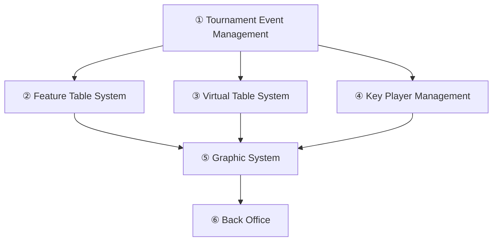
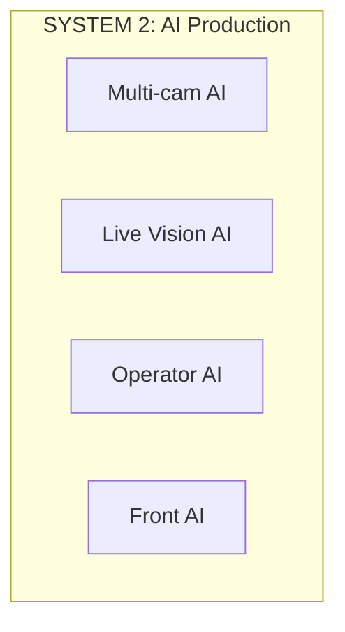
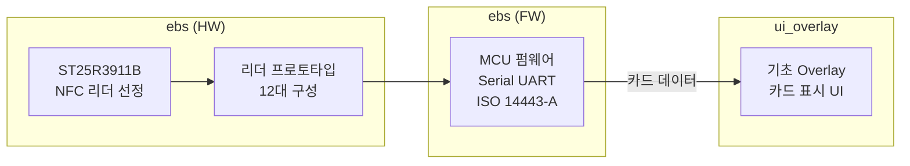
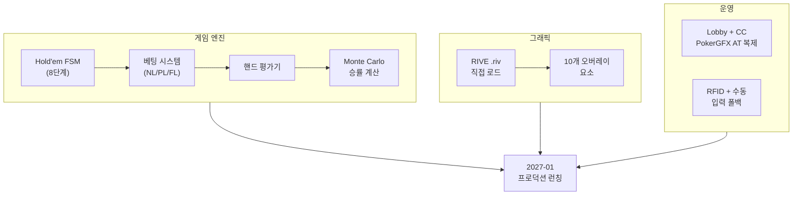
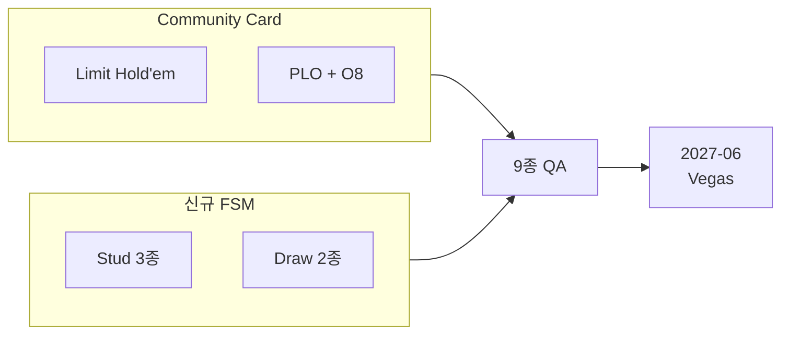
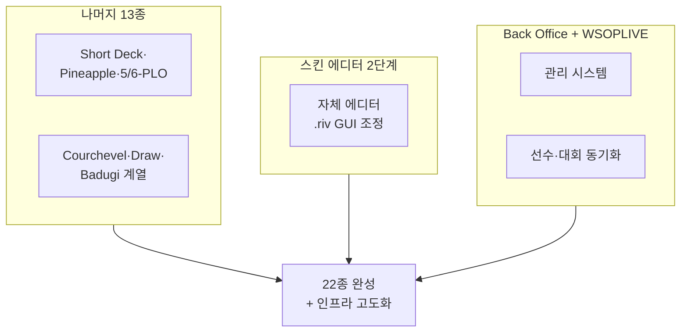
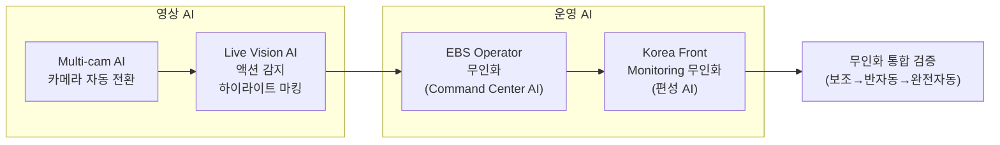
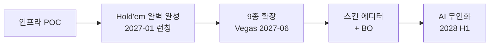

# EBS Ecosystem 킥오프 기획서 2026

> **기준**: [PRD-EBS_Foundation.md](PRD-EBS_Foundation.md) v38.0.0 — 5-Phase / 2-시스템 체계

> EBS(Event Broadcasting System) — 포커 대회 방송 데이터·기능·자동화 관리 플랫폼 (2026~2028)

---

# Part I: 왜 EBS를 만드는가

## S1. 비전

WSOPLIVE는 포커 대회 전체를 관리하는 서비스 플랫폼이다.
이 플랫폼이 만들어낸 변화를 업계는 **WSOP 3.0**이라 부른다.

> **WSOP 3.0이란?** — WSOP 대회 운영이 WSOPLIVE 도입 이전과 이후로 나뉠 만큼, 대회 관리 방식이 근본적으로 바뀌었다는 의미다. 대회 등록, 테이블 배정, 상금 분배 등 모든 운영이 하나의 플랫폼으로 통합된 것이 핵심이다.

EBS(Event Broadcasting System)는 포커 대회 **방송**에 필요한 모든 데이터, 기능, 자동화를 관리하는 인프라 플랫폼이다. WSOPLIVE가 대회 운영을 관리한다면, EBS는 그 대회를 시청자에게 보여주는 방송 시스템 전체를 관리한다.

EBS는 RFID 카드 인식 → 방송 그래픽 엔진 → 화면 오버레이 → AI 분석까지, 라이브 방송 워크플로우 전체를 커버한다. OTT/VOD는 EBS API를 소비하는 별도 영역이다.

### EBS의 두 가지 목표

EBS가 달성하려는 목표는 두 가지이며, 이 둘은 서로 독립적이다.

- **목표 A — 방송 퀄리티의 비약적 향상**: GFX(방송 그래픽 — 카메라 영상 위에 겹쳐 표시하는 정보 그래픽) 엔진, 실시간 오버레이, AI 분석을 통해 시청 경험을 근본적으로 끌어올린다.
- **목표 B — 크로스보더 무인화 전환**: 현장 ↔ 송출 스튜디오 분업 구조에서 사람이 수동으로 하던 작업을 시스템이 자동으로 처리하는 구조로 전환한다.

> 퀄리티 향상은 자동화의 부산물이 아니며, 무인화는 퀄리티를 위한 전제 조건이 아니다. 각각이 EBS의 존재 이유를 구성한다.

## S2. 핵심 개념 3가지

EBS 전체 아키텍처를 관통하는 세 가지 핵심 개념이다. 각 개념은 Phase 1부터 Phase 5까지 점진적으로 확장된다.

### 1. 실시간 데이터 파이프라인

물리 카드 → 디지털 데이터 → 방송 GFX → 콘텐츠까지 끊김 없는 데이터 경로.
Phase 1에서 RFID→Overlay 최초 연결로 시작하여, Phase 4에서 인프라 스트림이 구축되고, Phase 5에서 AI 데이터 파이프라인까지 확장된다.

### 2. 크로스보더 자동화

현장 ↔ 송출 스튜디오 분업 구조에서 수동 작업을 시스템이 대체하는 전환.
매 Phase마다 수동 → 자동 영역이 확장된다. Phase 2에서 로컬 JSON Export로 시작하여, Phase 3에서 현장 운용(Vegas)이 이루어지고, Phase 5에서 AI 4개 영역 무인화로 정점에 도달한다.

### 3. 단계적 지능화

규칙 기반 → AI 보조 → AI 반자동 → AI 완전 자동 진화.
Phase 1-3에서 규칙 기반 시스템(9종 게임 규칙 엔진)을 구축하고, Phase 4에서 나머지 13종으로 22종을 완성하며 BO와 WSOPLIVE 연동이 이루어지고, Phase 5에서 AI가 전면 적용된다.

### PokerGFX 올인원 vs EBS 모듈 분리

PokerGFX는 비디오 입력 캡처(Decklink/USB/NDI), DirectX 11 합성, ATEM 스위처 제어, PIP, Dual Canvas, 녹화까지 **단일 프로세스에서 처리하는 올인원 모놀리스**였다. EBS는 이 책임을 분리한다.

| 책임 | PokerGFX (올인원) | EBS Phase 1-4 | EBS Phase 5+ |
|------|:---:|:---:|:---:|
| 비디오 입력 캡처 (카메라) | 내장 (Decklink/USB/NDI) | **OBS / vMix에 위임** | Multi-cam AI |
| 비디오 합성 / 스위칭 | 내장 (DirectX 11 + ATEM) | **OBS / vMix에 위임** | AI Production |
| 그래픽 렌더링 (GFX) | 내장 | **EBS 핵심 — 순수 그래픽 생성에 집중** | EBS 핵심 |
| 녹화 / 송출 | 내장 | **OBS / vMix에 위임** | OTT 파이프라인 |

> **현재 Phase(1-4) 원칙**: EBS 앱은 순수하게 그래픽을 생성하여 출력하는 역할에 집중한다. 비디오 입력, 합성, 스위칭, 녹화는 프로덕션 소프트웨어(OBS/vMix)가 담당한다. 비디오 관련 책임은 Phase 5 이후 AI Production으로 점진적 내재화한다.

### 핵심 개념 × 5-Phase 매핑

| Phase | 실시간 데이터 파이프라인 | 크로스보더 자동화 | 단계적 지능화 |
|:-----:|:---:|:---:|:---:|
| 1 | RFID → Overlay 최초 연결 | — | — |
| 2 | GFX 엔진 + Hold'em 데이터 경로 | 로컬 JSON Export | 규칙 기반 (Hold'em 1종) |
| 3 | 9종 게임 데이터 경로 | 현장 운용 (Vegas) | 규칙 기반 (9종, HORSE+8-Game) |
| 4 | WSOPLIVE 외부 데이터 유입 | 인프라 스트림 구축 | 규칙 기반 완성 (22종) + BO |
| 5 | AI 데이터 파이프라인 확장 | AI 4개 영역 무인화 | AI 보조 → 반자동 → 완전 자동 |

## S3. 5-Phase 로드맵 (2026~2028)

5단계로 나누어 구축한다. 각 Phase는 이전 Phase의 결과물 위에 쌓인다.

> EBS의 반기 구분은 WSOP 시즌 기준이다. **H1(12~5월)**은 오프시즌 개발 기간, **H2(6~11월)**은 WSOP 시즌 운용 기간이다.

| Phase | 기간 | 핵심 목표 | 시스템 |
|:-----:|------|----------|:------:|
| 1 | 2026 H1 (12~5월) | 기초 인프라 POC — RFID 리더 + 서버 기초 | SYSTEM 1 |
| 2 | 2026 H2 (7~12월) | Hold'em 1종 완벽히 완성 → **2027년 1월 런칭** | SYSTEM 1 |
| 3 | 2027 H1 (1~6월) | 9종 게임 확장 → **2027년 6월 Vegas** | SYSTEM 1 |
| 4 | 2027 H2 (7~12월) | 13종 추가 + 스킨 에디터(2단계) + BO + WSOPLIVE | SYSTEM 1 |
| 5 | 2028 H1 (1~6월) | **AI 무인화** — 프로덕션 AI 4개 영역 | SYSTEM 2 |

### 2-시스템 구조

| 시스템 | 핵심 역할 | Phase | 프로젝트 수 |
|--------|----------|:-----:|:----------:|
| **SYSTEM 1: EBS 핵심 방송 엔진** | 포커 방송 데이터·기능·자동화 관리 | Phase 1-4 | 18개 (기존 전체) |
| **SYSTEM 2: AI Production** | 방송 제작 과정 AI 자동화 | Phase 5 (2028 H1) | 4개 (신규) |

> OTT/VOD는 EBS API를 소비하는 별도 영역이다. EBS가 제공하는 API를 통해 외부 OTT 플랫폼이 콘텐츠를 배포한다.

### Phase별 요약 다이어그램

#### Phase 1: 인프라 POC (2026 H1)

#### Phase 2: Hold'em 완벽 완성 → 2027-01 런칭 (2026 H2)

#### Phase 3: 9종 확장 → Vegas (2027 H1)

#### Phase 4: 13종 추가 + 스킨 에디터 + BO + WSOPLIVE (2027 H2)

#### Phase 5: AI 무인화 (2028 H1)

## S4. EBS 2026~2028 마일스톤

S3의 5-Phase 로드맵이 기술 단계별 목표라면, 이 섹션은 **비즈니스 관점의 시간축 목표**를 정의한다. 각 시기의 달성 기준은 기술 완성도가 아니라 현장 사용 가능 여부다.

| 시기 | 핵심 목표 | Phase | 달성 기준 |
|:----:|----------|:-----:|----------|
| 2026 H1 | 인프라 POC | 1 | RFID→서버 연결 성공 |
| 2026 H2 | **Hold'em 완벽 완성 → 2027-01 런칭** | 2 | 홀덤 1종 8시간 연속 방송 가능 |
| 2027 H1 | **9종 확장 → Vegas** | 3 | 9종(HORSE+8-Game) Vegas 현장 운용 |
| 2027 H2 | 13종 추가 + 스킨 에디터(2단계) + BO + WSOPLIVE | 4 | 22종 완성 + 스킨 에디터 + BO |
| 2028 H1 | **AI 무인화** | 5 | 프로덕션 AI 4개 영역 |

### 2026 H1 — 인프라 POC (Phase 1)

기초적인 인프라를 포함한 POC를 진행한다. 방송 쪽을 먼저 케어하는 것이 핵심 원칙이다.

- RFID 하드웨어 12대 리더 연결 + MCU 펌웨어
- 기초 서버 (세션 관리, 카드 데이터 수신)
- 기초 오버레이 카드 표시 UI

### 2026 H2 — Hold'em 완벽 완성 → 2027-01 런칭 (Phase 2)

Hold'em 1종으로 8시간 연속 라이브 방송이 가능한 완성품을 제작하여 **2027년 1월 프로덕션 런칭**한다.

| 항목 | 설명 |
|------|------|
| **게임 엔진** | Hold'em 상태 머신(8단계) + NL/PL/FL 베팅 + 핸드 평가기 + Monte Carlo 승률 |
| **Lobby + Command Center** | PokerGFX ActionTracker 기능 완전 복제 — Setup은 Lobby, 커맨드는 CC로 분리 |
| **그래픽 렌더링** | RIVE .riv 파일 직접 로드 (스킨 에디터 1단계 — Rive Editor 외부 활용) |
| **출력** | NDI + ATEM 스위처 |
| **RFID** | ST25R3911B + ESP32. 수동 카드 입력 폴백 = 1급 기능 |
| **QA** | 8시간 연속 방송 시뮬레이션 + 실제 딜러 운용 테스트 |

### 2027 H1 — 9종 확장 → Vegas (Phase 3)

런칭된 Hold'em에 8종을 추가하여 총 9종으로 **2027년 6월 Vegas 이벤트**에 투입한다. HORSE + 8-Game 포맷 방송을 지원한다.

| 영역 | 목표 |
|------|------|
| Community Card 추가 | Limit Hold'em, PLO, Omaha Hi-Lo 8 — Hold'em FSM 재사용 |
| Stud 신규 FSM | 7-Card Stud, Stud Hi-Lo, Razz — 3rd~7th Street 구조 |
| Draw 신규 FSM | 2-7 Triple Draw, NL 2-7 Single Draw — Draw Round 메커니즘 |
| QA | 9종 통합 검증, Vegas 현장 운용 테스트 |

### 2027 H2 — 13종 추가 + 스킨 에디터 + BO + WSOPLIVE (Phase 4)

Vegas 이후, 나머지 13종 게임을 추가하여 22종을 완성하고, 스킨 에디터 2단계와 Back Office를 본격 개발한다.

- **나머지 13종** — Short Deck x2, Pineapple, 5/6-Card Omaha 계열 4종, Courchevel x2, Five Card Draw, A-5 Triple Draw, Badugi/Badeucy/Badacey
- **스킨 에디터 2단계** — .riv 파라미터를 GUI로 조정하는 자체 에디터 (고객/운영자 대상)
- **Back Office (BO)** — 관리 시스템, 대시보드, 운영 도구
- **WSOPLIVE 연동** — 선수·대회·베팅 토큰 정보 동기화
- **Lobby 2단계** — WSOPLIVE Staff Main 3-depth 구조 연동 (대회 선택 → 이벤트 선택 → 테이블). Phase 1-2의 직접 수정 Lobby에서 WSOPLIVE API 기반 자동 연동으로 전환

### 2028 H1 — AI 무인화 (Phase 5)

프로덕션 AI 4개 영역 무인화. 사람이 수동으로 하던 방송 제작 과정을 AI가 자동으로 처리한다.

- Multi-cam AI — 카메라 자동 전환
- Live Vision AI — 액션 감지, 하이라이트 마킹
- EBS Operator AI — Command Center 자동화
- Korea Front Monitoring AI — 편성 무인화
