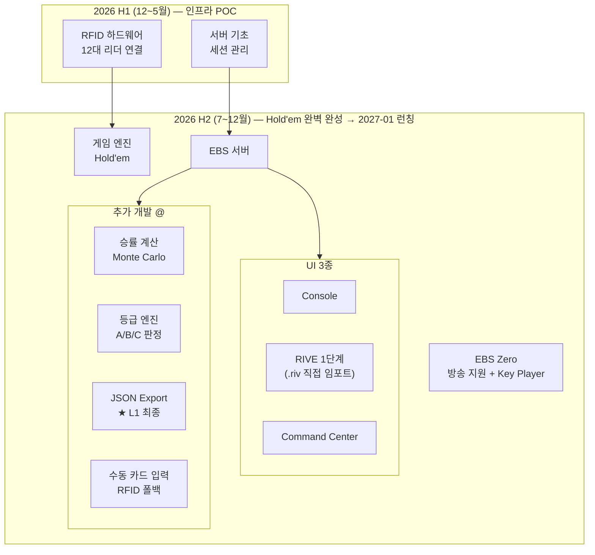
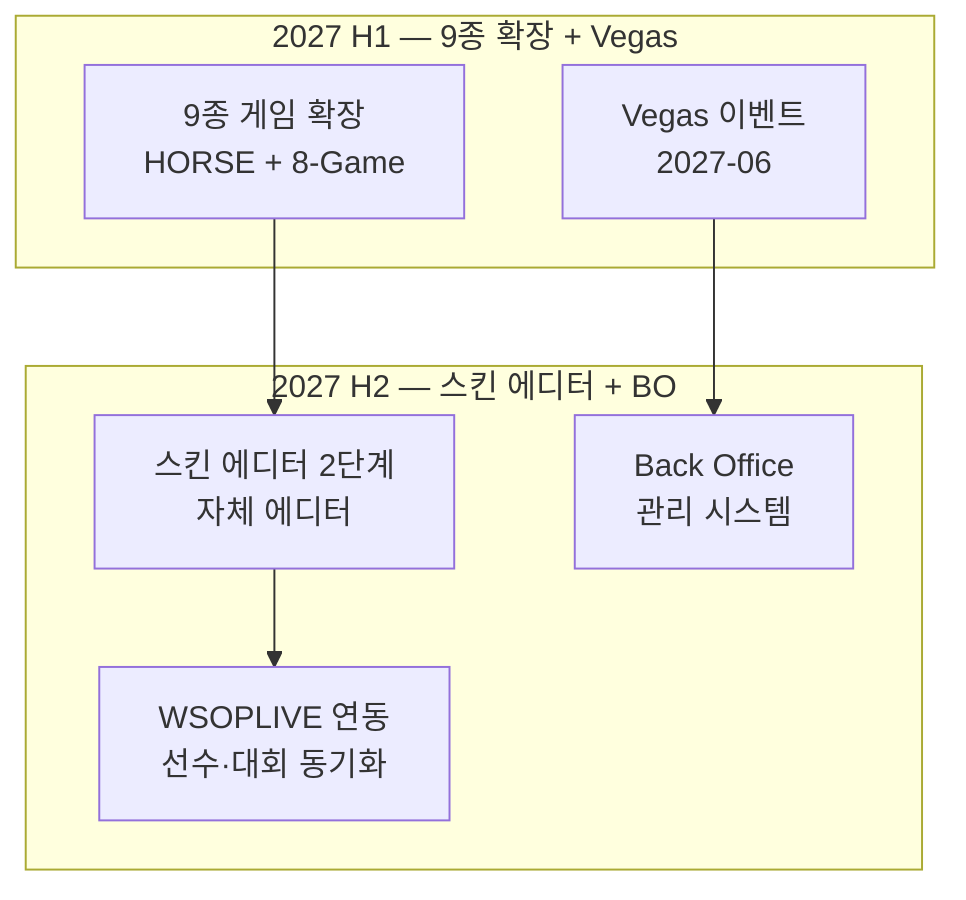
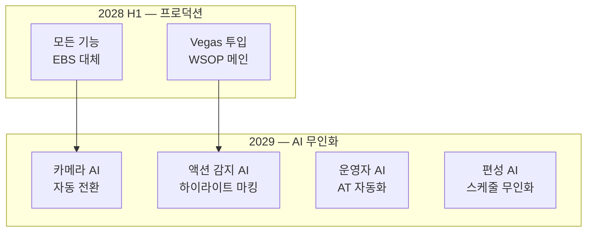

# EBS 개발 마일스톤

> **Version**: 1.0.0
> **Date**: 2026-03-31
> **원본**: [PRD-EBS_Foundation.md](PRD-EBS_Foundation.md) v33.1.0에서 분리

---

## 2026 (H1 + H2)

## 2027-2030 (전체 조감도)

## 5개년 요약

| 기간 | 핵심 목표 | System | 파이프라인 | 비즈니스 마일스톤 |
|:----:|----------|:------:|:---------:|-----------------|
| 26 H1 | RFID POC + 기초 서버 | SYSTEM 1 | L0 | 인프라 POC 완료 |
| 26 H2 | Hold'em 완벽 완성 → **2027-01 런칭** | SYSTEM 1 | L0→L1 | Hold'em 1종 프로덕션 런칭 |
| 27 H1 | 9종 게임 확장 → **2027-06 Vegas** | SYSTEM 1 | L1→L2 | Vegas 이벤트 투입 (HORSE+8-Game) |
| 27 H2 | 13종 추가 + 스킨 에디터(2단계) + BO + WSOPLIVE | SYSTEM 1 | L2→L5 | 22종 완성 + 자체 에디터 + 백오피스 |
| 28 H1 | **프로덕션** — AI 4개 영역 무인화 | SYSTEM 2 | AI 주입 | 프로덕션 AI 무인화 |
| 28 H2 | OTT HLS/VOD 런칭 | SYSTEM 3 | 배포 | OTT 콘텐츠 배포 |

---

## Changelog

| 버전 | 날짜 | 변경 내용 |
|------|------|-----------|
| 1.0.0 | 2026-03-31 | Foundation PRD v33.1.0에서 분리 |
