# PRD-0004: PokerGFX Navigation Analysis (v21.1.0 Archive)

> **역할 재정의 (2026-02-23)**: 본 문서는 **EBS console v1.0 Broadcast Ready** 범위의 UI 설계서입니다. v2.0 이후 기능 (Equity/Stats 전체, Hand History 고급, Skin Editor, 고급 GFX Console)은 버전별 별도 설계서에서 다룹니다. 스코프 기준: [ebs-console.prd.md](../00-prd/ebs-console.prd.md)

> **아카이브 안내**: 이 문서는 PRD-0004 v21.0.0의 아카이브입니다. PokerGFX 원본 UI 분석 (스크린샷, 오버레이 분석본, 기능 테이블, 설계 시사점)을 보존합니다. 현행 EBS 설계는 [EBS-UI-Design-v3.prd.md](../00-prd/EBS-UI-Design-v3.prd.md)를 참조하세요.

> 화면별 UI 설계만 다룬다. 시스템 아키텍처는 [전체 기획서](../../ebs_reverse/docs/01-plan/pokergfx-prd-v2.md), 기술 상세는 [PRD-0004-technical-specs.md](PRD-0004-technical-specs.md) 참조.

---

## 1장: 전체 화면 구조

### 1.1 네비게이션 맵

포커 방송 한 프레임이 만들어지는 데이터 파이프라인을 따라가면, EBS의 모든 화면이 왜 존재하는지 드러난다. 빈 캔버스에서 시작하여 8단계를 거치면 완성된 네비게이션 맵에 도달한다.

#### Step 0: 전체 네비게이션 맵 (최종 확정)

8단계를 거쳐 완성된 최종 다이어그램이 EBS의 전체 네비게이션 맵이다. 운영자의 하루는 이 맵의 바깥(Skin Editor)에서 시작하여, 안쪽(6개 탭 설정)을 거쳐, Action Tracker에서 끝난다.

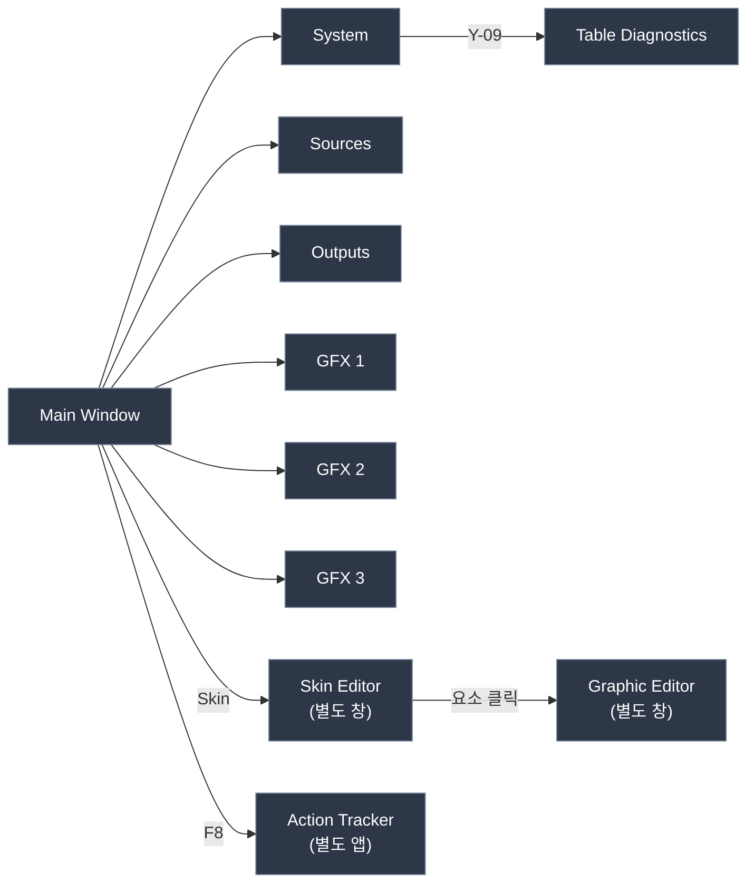
```mermaid
flowchart LR
    classDef default fill:#2d3748,stroke:#718096,color:#ffffff
    MW["Main Window"] --> SYS["System"]
    MW --> SRC["Sources"]
    MW --> OUT["Outputs"]
    MW --> GFX1["GFX 1"]
    MW --> GFX2["GFX 2"]
    MW --> GFX3["GFX 3"]
    SYS -->|"Y-09"| TDG["Table Diagnostics"]
    MW -->|"Skin"| SKE["Skin Editor<br/>(별도 창)"]
    SKE -->|"요소 클릭"| GRE["Graphic Editor<br/>(별도 창)"]
    MW -->|"F8"| AT["Action Tracker<br/>(별도 앱)"]
```

---

#### Step 1: Main Window — 중앙 통제실

모든 것은 **Main Window**에서 시작한다. 운영자가 시스템 전체를 한눈에 모니터링하고, 6개 설정 영역으로 분기하는 허브다. 본방송 중에는 여기서 긴급 조작을 수행하고, 준비 단계에서는 여기서 각 탭으로 이동한다.

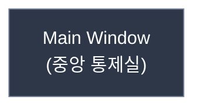
```mermaid
flowchart LR
    classDef default fill:#2d3748,stroke:#718096,color:#ffffff
    MW["Main Window<br/>(중앙 통제실)"]
```

##### PokerGFX 원본

**원본 캡쳐**

**오버레이 분석본**

PokerGFX의 기본 화면. 좌측에 방송 Preview, 우측에 상태 표시와 액션 버튼이 배치된 2-column 레이아웃이다. 10개 UI 요소로 구성.

| # | 기능명 | 설명 | EBS 복제 |
|:-:|--------|------|:--------:|
| 1 | Title Bar | `PokerGFX Server 3.111 (c) 2011-24` 타이틀 + 최소/최대/닫기 버튼 | P2 |
| 2 | Preview | Chroma Key Blue 배경의 방송 미리보기 화면. GFX 오버레이가 실시간 렌더링됨 | P0 |
| 3 | CPU / GPU / Error / Lock | CPU, GPU 사용률 인디케이터 + Error 아이콘 + Lock 아이콘. 시스템 부하와 상태 실시간 모니터링 | P1 |
| 4 | Secure Delay + Preview | 3개 체크박스 행. Secure Delay(방송 보안 딜레이 토글), Preview(미리보기 토글). | EBS MVP 범위 외 (추후 개발 예정) |
| 5 | Reset Hand + Settings + Lock | Reset Hand + Settings + Lock 버튼 행. 핸드 초기화, 설정 톱니바퀴, Lock 자물쇠 | P0 |
| 6 | Register Deck | RFID 카드 덱 일괄 등록 버튼. 새 덱 투입 시 52장 순차 스캔 | P0 |
| 7 | Action Tracker | Action Tracker 실행 버튼. 운영자용 실시간 게임 추적 인터페이스 | P0 |
| 8 | Studio | Studio 모드 진입 버튼. 방송 스튜디오 환경 전환 | DROP |
| 9 | Split Recording | 핸드별 분할 녹화 버튼. 각 핸드를 개별 파일로 자동 저장 | DROP |
| 10 | Tag Player | 플레이어 태그 + 드롭다운. 특정 플레이어에 마커를 부여하여 추적 | DROP |

> **설계 시사점**
> - Preview + 우측 컨트롤 패널 2-column 레이아웃은 운영 효율이 검증된 구조 → EBS 계승
> - RFID 상태(3번)가 CPU/GPU와 같은 행에 묻혀 존재감 약함 (M-05로 분리 표시)
> - 버튼 7개가 우선순위 구분 없이 균등 노출 (Reset Hand / Register Deck / Launch AT / Settings 등 혼재)
> - Preview Toggle(4번)이 실수로 꺼지면 방송 모니터링 공백 발생 → Drop 결정 (M-09 토글 제거)

##### EBS 설계본 — 해상도 변형 비교

**A. 자동 16:9 (기본)** — `aspect-ratio:16/9` · `flex:1 1 auto` · 1920×1080 기준

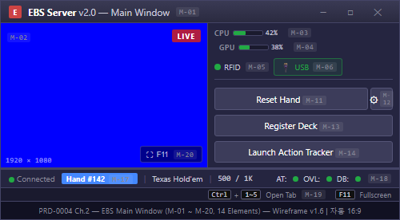

**B. 고정 720×480 (SD 변형)** — `flex:0 0 720px` · SD 480p 출력 환경 전용

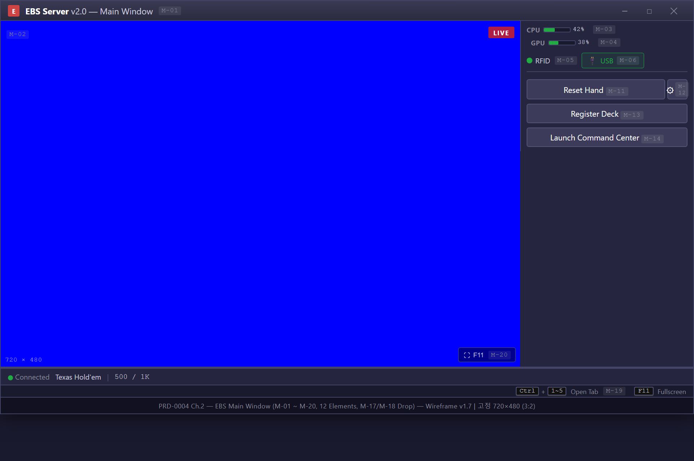

> **두 이미지를 함께 배치한 이유**: Preview Panel은 출력 해상도에 따라 플렉서블하게 동작하도록 설계되었다.
> 기본(A)은 `aspect-ratio:16/9`로 1920×1080 환경에서 컨테이너에 비례하여 자동 조정되고,
> SD 변형(B)은 Preview를 `720×480` 고정 픽셀로 렌더링하여 SD 480p 방송 장비 호환성을 확보한다.
> 두 모드는 CSS 변수 1개(`--preview-fixed-size`) 전환으로 런타임 스위칭이 가능한 단일 구현체이며,
> 기본값은 자동 16:9 모드다.

##### 설계 스펙

**변환 요약**: PokerGFX 10개 → EBS 13개. RFID Status 독립 분리. Recording·Secure Delay·Studio·Split Recording·Tag Player EBS MVP 범위 외 (추후 개발 예정). Preview 상시 활성화 고정(M-09 토글 제거). 2-column 레이아웃 계승. Hand Counter(M-17)·Connection Status(M-18) Drop 확정.

시스템 모니터링과 긴급 조작을 담당하는 기본 화면. 본방송 중 운영자 주의력의 15%만 할당된다.

###### UI 설계 원칙

- **Preview Panel**: 480px 고정폭, 16:9 비율 자동 높이 (480×270). Chroma Key Blue(#0000FF) 배경에 GFX 오버레이 실시간 렌더링. CSS `aspect-ratio:16/9` 적용.
- **Control Panel**: 나머지 320px. 상단: 필수 상태 인디케이터(CPU/GPU/RFID). 중단: 자동 spacer(flex:1, ~60px). 하단: 액션 버튼. 수직 스크롤 없이 모든 요소가 보여야 한다.
- **앱 윈도우**: 800×365px 기준 (Title Bar 28px + Preview 270px + Status Bar 22px + Shortcut Bar 24px + Watermark 22px).
- **Status Bar**: 하단 1행. 서버 연결 상태, 게임 타입, 블라인드 레벨 표시. ~~RFID 연결 상태, 현재 핸드 번호, AT/Overlay/DB 연결 상태~~ (M-17/M-18 Drop 확정).
- **탭 없음**: Main Window는 독립 모니터링 화면. 각 설정 탭(System, Sources, Outputs, GFX 1, GFX 2, GFX 3)은 탭 클릭으로 전환.

###### 레이아웃

Preview Panel(M-02, 좌) + Status Panel(M-03~M-06, 우상) + 액션 버튼(M-11~M-14, 우하).

###### Element Catalog

###### 상태 표시 그룹

| # | 요소 | 타입 | 설명 | PGX | 우선순위 |
|:-:|------|------|------|:---:|:--------:|
| M-01 | Title Bar | AppBar | 앱 이름 + 버전 + 윈도우 컨트롤 | #1 | P2 |
| M-02 | Preview Panel | Canvas | 출력 해상도(O-01)와 동일한 종횡비 유지, Chroma Key Blue, GFX 오버레이 실시간 렌더링. **해상도 정책**: 실제 출력은 Full HD(1920×1080) 기준 리사이징. 문서 표기(480×270)는 UI 공간 내 표시 크기로 가독성용 축약 표기. | #2 | P0 |
| M-03 | CPU Indicator | ProgressBar | CPU 사용률 + 색상 코딩 (Green<60%, Yellow<85%, Red>=85%). 매뉴얼: "The icons on the left indicate CPU and GPU usage. If they turn red, usage is too high for the Server to operate reliably." (p.34) | #3 | P1 |
| M-04 | GPU Indicator | ProgressBar | GPU 사용률 + 색상 코딩. 매뉴얼: "The icons on the left indicate CPU and GPU usage. If they turn red, usage is too high for the Server to operate reliably." (p.34) | #3 | P1 |
| M-05 | RFID Status | Icon+Badge | RFID 리더 상태 7색 표시. Green=정상 운용, Grey=보안 링크 수립 중, Blue=정상 운용+미등록 카드 감지, Black=정상 운용+동일 카드 중복 감지, Magenta=정상 운용+중복 카드 감지, Orange=연결됨+응답 없음(CPU 과부하/USB 문제), Red=미연결. 매뉴얼 p.34 | #3 | P0 |
| M-06 | RFID Connection Icon | Icon | RFID 연결 상태 표시 (연결 시 녹색 USB/WiFi 아이콘으로 변경, 미연결 시 경고 아이콘) | #3 | P1 |
| ~~M-17~~ | ~~Hand Counter~~ | ~~Badge~~ | ~~현재 세션 핸드 번호 (Hand #47)~~ | ~~신규~~ | ~~P0~~ **[DROP]** |
| ~~M-18~~ | ~~Connection Status~~ | ~~Row~~ | ~~AT/Overlay/DB 각각 Green/Red 표시~~ | ~~신규~~ | ~~P0~~ **[DROP]** |

####### M-02 Preview Panel 해상도 스케일링 스펙

| 조건 | Preview 동작 |
|------|-------------|
| 출력 해상도(O-01) = 16:9 (기본) | Preview 캔버스 크기: `UI_Panel_Width × 9/16` |
| 출력 해상도(O-01) = 9:16 (세로 모드) | Preview 캔버스 크기: `UI_Panel_Height × 9/16` |
| 출력 해상도 변경 시 | 블랙아웃 없이 즉시 비율 재계산 및 리스케일 |
| 4K 출력 (3840×2160) | Preview는 UI 공간 내 최대 크기로 표시 (업스케일 없음, 고밀도 픽셀 그대로 표시) |
| SD 480p (854×480) 출력 | Preview는 실제 픽셀 크기 또는 2× 확대 표시 (픽셀이 너무 작아 식별 불가 방지) |

Preview는 항상 출력 해상도의 종횡비를 유지한다. Preview 캔버스 자체의 픽셀 밀도는 UI 공간 크기에 따라 결정되며, 출력 해상도와 1:1 대응하지 않는다.

###### 보안 제어 그룹

| # | 요소 | 타입 | 설명 | PGX | 우선순위 |
|:-:|------|------|------|:---:|:--------:|
| M-07 | Lock Toggle | IconButton | 설정 잠금/해제. 잠금 시 모든 탭 설정 변경 불가 (액션 버튼 제외, 본방송 중 실수 방지). 매뉴얼: "Click the Lock symbol next to the Settings button to password protect the Settings Window." (p.33) | #3 | P1 |
| M-09 | Preview Toggle | Checkbox | Preview 렌더링 On/Off (CPU 절약) | #4 | P0 |

###### 액션 버튼 그룹

| # | 요소 | 타입 | 설명 | PGX | 우선순위 |
|:-:|------|------|------|:---:|:--------:|
| M-11 | Reset Hand | ElevatedButton | 현재 핸드 초기화, 확인 다이얼로그 | #5 | P0 |
| M-12 | Settings | IconButton | 전역 설정 다이얼로그 (테마, 언어, 단축키) | #5 | P1 |
| M-13 | Register Deck | ElevatedButton | 52장 RFID 일괄 등록, 진행 다이얼로그 | #6 | P0 |
| M-14 | Launch AT | ElevatedButton | Action Tracker 실행/포커스 전환 | #7 | P0 |

#### Step 2: System — 하드웨어 연결 확인

RFID가 카드를 읽으려면 리더가 연결되고 캘리브레이션이 완료되어야 한다. 하드웨어 점검 없이 본방송을 시작하면 중간에 카드 인식이 안 되는 사고가 발생한다. **System**(첫 번째 탭)에서 RFID 리더 상태, 네트워크 연결, 테이블 디바이스를 점검한다.

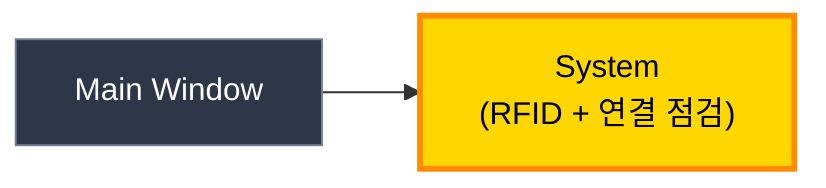
```mermaid
flowchart LR
    classDef default fill:#2d3748,stroke:#718096,color:#ffffff
    MW["Main Window"]
    SYS["System<br/>(RFID + 연결 점검)"]
    style SYS fill:#FFD700,stroke:#FF8C00,stroke-width:3px,color:#000000
    MW --> SYS
```

##### PokerGFX 원본

**원본 캡쳐**

**오버레이 분석본**

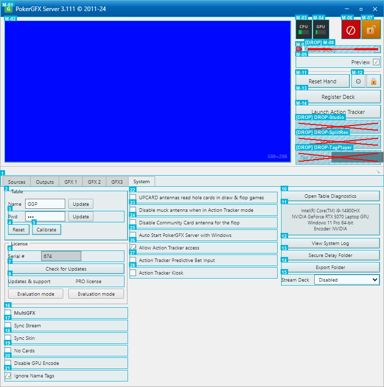

RFID 리더, 안테나, 라이선스, 시스템 진단, 고급 설정을 관리하는 탭. 28개 UI 요소로 구성.

| # | 기능명 | 설명 | EBS 복제 |
|:-:|--------|------|:--------:|
| 1 | Tab Bar | 7개 탭 전환 바 | P0 |
| 2 | Table Name | 테이블 식별 이름 `[GGP]` + `[Update]` 버튼 | P1 |
| 3 | Table Password | 접속 비밀번호 `[CCC]` + `[Update]` 버튼 | P1 |
| 4 | Reset | RFID 시스템 초기화 `[Reset]` 버튼 | P0 |
| 5 | Calibrate | 안테나별 캘리브레이션 `[Calibrate]` 버튼 | P0 |
| 6 | Serial # | 시리얼 넘버 표시 `674` | P1 |
| 7 | Check for Updates | 소프트웨어 업데이트 확인 `[Check for Updates]` 버튼 | P2 |
| 8 | Updates & support | 업데이트/지원 상태 `[Evaluation mode]` | P2 |
| 9 | PRO license | PRO 라이선스 상태 `[Evaluation mode]` | P2 |
| 10 | Open Table Diagnostics | 테이블 진단 창 열기 `[Open Table Diagnostics]` 버튼 | P1 |
| 11 | System info | CPU/GPU/OS/Encoder 시스템 정보 패널 | P1 |
| 12 | View System Log | 시스템 로그 뷰어 `[View System Log]` 버튼 | P1 |
| 13 | Secure Delay Folder | 보안 딜레이 폴더 경로 `[Secure Delay Folder]` 버튼 | P1 |
| 14 | Export Folder | 내보내기 폴더 경로 `[Export Folder]` 버튼 | P1 |
| 15 | Stream Deck | Elgato Stream Deck 매핑 `[Disabled]` | P2 |
| 16 | MultiGFX | 다중 테이블 운영 체크박스 | P2 |
| 17 | Sync Stream | 스트림 동기화 체크박스 | P2 |
| 18 | Sync Skin | 스킨 동기화 체크박스 | P2 |
| 19 | No Cards | 카드 비활성화 체크박스 | P1 |
| 20 | Disable GPU Encode | GPU 인코딩 비활성화 체크박스 | P1 |
| 21 | Ignore Name Tags | 네임 태그 무시 체크박스 | P1 |
| 22 | UPCARD antennas read hole cards | UPCARD 안테나로 홀카드 읽기 체크박스 | P0 |
| 23 | Disable muck antenna when in AT mode | AT 모드 시 muck 안테나 비활성 체크박스 | P0 |
| 24 | Disable Community Card antenna | 커뮤니티 카드 안테나 비활성 체크박스 | P0 |
| 25 | Auto Start PokerGFX Server | OS 시작 시 자동 실행 체크박스 | P2 |
| 26 | Allow Action Tracker access | AT 접근 허용 체크박스 | P0 |
| 27 | Action Tracker Predictive Bet Input | 베팅 예측 입력 체크박스 | P0 |
| 28 | Action Tracker Kiosk | AT 키오스크 모드 체크박스 | P0 |

> **설계 시사점**
> - RFID 안테나(22~24번)가 하단에 배치되어 있으나, 실제로는 방송 준비의 첫 번째 설정임 → EBS에서 상단 이동 (Y-03~Y-07)
> - 라이선스 관련 4개(6~9번)는 EBS 자체 시스템에서 불필요 → 제거
> - AT 접근 정책이 다른 설정과 혼재 → EBS에서 독립 그룹 (Y-13~Y-15)

##### EBS 설계본

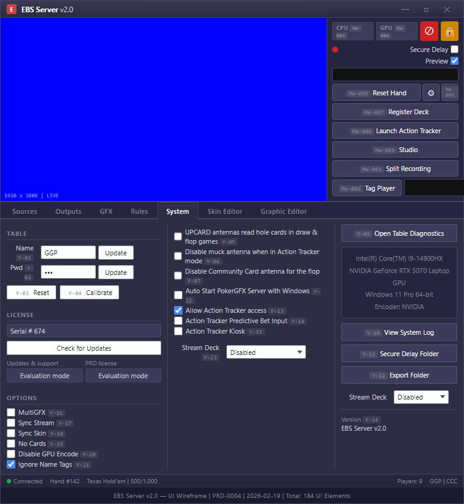

##### 설계 스펙

**변환 요약**: PokerGFX 28개 → EBS 24개. RFID를 상단으로 이동 (준비 첫 단계), 라이선스 4개 제거, AT 접근 정책 독립 그룹화.

RFID, Action Tracker 연결, 시스템 진단.

###### 레이아웃

4구역: RFID(Y-03~Y-07, 상단) > AT(Y-13~Y-15) > Diagnostics(Y-08~Y-12) > Advanced(Y-16~Y-24).

###### Element Catalog

| # | 그룹 | 요소 | 설명 | PGX | 우선순위 |
|:-:|------|------|------|:---:|:--------:|
| Y-01 | Table | Name | 테이블 식별 이름. 매뉴얼: "Enter an optional name for this table. This is required when using MultiGFX mode." (p.60) | #2 | P1 |
| Y-02 | Table | Password | 접속 비밀번호. 매뉴얼: "Password for this table. Anyone attempting to use Action Tracker with this table will be required to enter this password." (p.60) | #3 | P1 |
| Y-03 | RFID | Reset | RFID 시스템 초기화. 매뉴얼: "Resets the RFID Reader connection, as if PokerGFX had been closed and restarted." (p.60) | #4 | P0 |
| Y-04 | RFID | Calibrate | 안테나별 캘리브레이션. 매뉴얼: "Perform the once-off table calibration procedure, which 'teaches' the table about its physical configuration." (p.60) | #5 | P0 |
| Y-05 | RFID | UPCARD Antennas | UPCARD 안테나로 홀카드 읽기. 매뉴얼: "Enables all antennas configured for reading UPCARDS in STUD games to also detect hole cards when playing any flop or draw game." (p.59) | #22 | P0 |
| Y-06 | RFID | Disable Muck | AT 모드 시 muck 안테나 비활성. 매뉴얼: "Causes the muck antenna to be disabled when in Action Tracker mode." (p.59) | #23 | P0 |
| Y-07 | RFID | Disable Community | 커뮤니티 카드 안테나 비활성 | #24 | P0 |
| Y-08 | System Info | Hardware Panel | CPU/GPU/OS/Encoder 자동 감지 | #11 | P1 |
| Y-09 | Diagnostics | Table Diagnostics | 안테나별 상태, 신호 강도 (별도 창). 매뉴얼: "Displays a diagnostic window that displays the physical table configuration along with how many cards are currently detected on each antenna." (p.60) | #10 | P1 |
| Y-10 | Diagnostics | System Log | 로그 뷰어 | #12 | P1 |
| Y-12 | Diagnostics | Export Folder | 내보내기 폴더. 매뉴얼: "When the Developer API is enabled, use this to specify the location for writing the JSON hand history files." (p.60) | #14 | P1 |
| Y-13 | AT | Allow AT Access | AT 접근 허용. 매뉴얼: "'Track the action' can only be started from Action Tracker if this option is enabled. When disabled, Action Tracker may still be used but only in Auto mode." (p.58) | #26 | P0 |
| Y-14 | AT | Predictive Bet | 베팅 예측 입력. 매뉴얼: "Action Tracker will auto-complete bets and raises based on the initial digits entered, min raise amount and stack size." (p.60) | #27 | P0 |
| Y-15 | AT | Kiosk Mode | AT 키오스크 모드. 매뉴얼: "When the Server starts, Action Tracker is automatically started on the same PC on the secondary display in kiosk mode. In this mode, AT cannot be closed or minimised." (p.58) | #28 | P0 |
| Y-16 | Advanced | MultiGFX | 다중 테이블 운영. 매뉴얼: "Forces PokerGFX to sync to another primary PokerGFX running on a different, networked computer, making it possible to generate multiple live and delayed video streams." (p.58) | #16 | P2 |
| Y-17 | Advanced | Sync Stream | 스트림 동기화. 매뉴얼: "When in MultiGFX mode, forces secure delay to start and stop in synchronization with the primary server." (p.58) | #17 | P2 |
| Y-18 | Advanced | Sync Skin | 스킨 동기화. 매뉴얼: "Causes the secondary MultiGFX server skin to auto update from the skin that is currently active on the primary server." (p.58) | #18 | P2 |
| Y-19 | Advanced | No Cards | 카드 비활성화. 매뉴얼: "When enabled, no hole card information will be shared with any secondary server." (p.58) | #19 | P1 |
| Y-20 | Advanced | Disable GPU | GPU 인코딩 비활성화 | #20 | P1 |
| Y-21 | Advanced | Ignore Name Tags | 네임 태그 무시. 매뉴얼: "When enabled, player ID tags are ignored; player names are entered manually in Action Tracker." (p.59) | #21 | P1 |
| Y-22 | Advanced | Auto Start | OS 시작 시 자동 실행. 매뉴얼: "Automatically start the PokerGFX Server when Windows starts. Useful for unattended installations." (p.58) | 신규 | P2 |
| Y-23 | Advanced | Stream Deck | Elgato Stream Deck 매핑 | #15 | P2 |
| Y-24 | Updates | Version + Check | 버전 표시 + 업데이트. 매뉴얼: "Force the Server to check to see if there's a software update available." (p.58) | #7,#8 | P2 |

#### Step 3: Sources — 카메라/스위처 연결

그래픽만으로는 방송이 완성되지 않는다. 카메라 영상과 합성되어야 한다. 어떤 카메라가 연결되어 있는지, ATEM 스위처의 IP는 무엇인지, 보드 카메라 싱크는 몇 밀리초인지를 설정해야 그래픽 오버레이가 정확한 타이밍에 올라간다. **Sources**(두 번째 탭)는 이 물리적 연결을 담당한다.

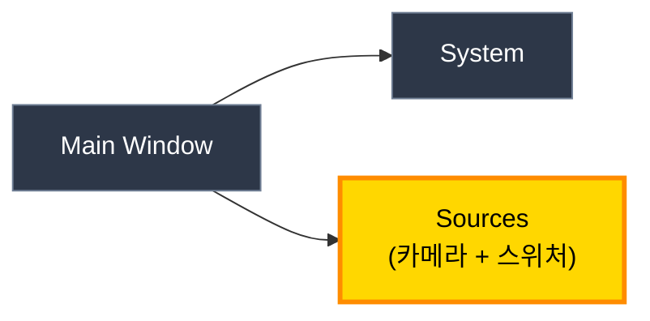
```mermaid
flowchart LR
    classDef default fill:#2d3748,stroke:#718096,color:#ffffff
    MW["Main Window"]
    SYS["System"]
    SRC["Sources<br/>(카메라 + 스위처)"]
    style SRC fill:#FFD700,stroke:#FF8C00,stroke-width:3px,color:#000000
    MW --> SYS
    MW --> SRC
```

##### PokerGFX 원본

**원본 캡쳐**

**오버레이 분석본**

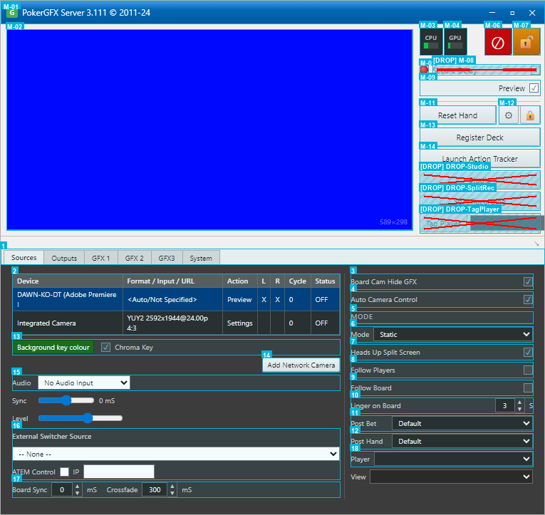

비디오 입력 장치, 카메라 제어, 크로마키, 외부 스위처 연동을 관리하는 탭. 18개 UI 요소로 구성.

| # | 기능명 | 설명 | EBS 복제 |
|:-:|--------|------|:--------:|
| 1 | Tab Bar | 7개 탭 전환 바 | P0 |
| 2 | Device Table | 비디오 입력 장치 목록. Preview, Settings 버튼으로 개별 제어 | P0 |
| 3 | Board Cam Hide GFX | 보드 카메라 전환 시 GFX 자동 숨기기 체크박스 | P1 |
| 4 | Auto Camera Control | 게임 상태 기반 자동 카메라 전환 체크박스 | P1 |
| 5 | Camera Mode section label | Camera Mode 섹션 라벨 | P1 |
| 6 | Mode: Static dropdown | Static / Dynamic 카메라 전환 모드 드롭다운 | P1 |
| 7 | Heads Up Split Screen | 헤즈업 시 화면 분할 체크박스 | P1 |
| 8 | Follow Players | 플레이어 추적 체크박스 | P1 |
| 9 | Follow Board | 보드 추적 체크박스 | P1 |
| 10 | Linger on Board | 보드 카드 유지 시간 설정 | P1 |
| 11 | Post Bet dropdown | Post Bet 카메라 동작 드롭다운 | P1 |
| 12 | Hand dropdown | Post Hand 카메라 동작 드롭다운 | P1 |
| 13 | Background key colour + Chroma Key | 크로마키 활성화 체크박스 + Background Key Colour 색상 선택기 | P0 |
| 14 | Add Network Camera | IP 기반 원격 카메라 추가 버튼 | P2 |
| 15 | Audio Input + Sync + Level | 오디오 소스 + Sync 보정값 (mS) + 레벨 | P1 |
| 16 | External Switcher + ATEM | ATEM 스위처 IP 기반 직접 통신 | P1 |
| 17 | Board Sync + Crossfade | 싱크 보정 + 크로스페이드 시간 (기본 0/300mS) | P1 |
| 18 | Player dropdown + View | 플레이어별 카메라 뷰 전환 드롭다운 | P1 |

> **설계 시사점**
> - External Switcher(16번)가 출력 모드와 무관하게 항상 노출 → 혼란 유발. EBS에서 Fill & Key 모드에서만 표시
> - Chroma Key(13번)가 목록 중간에 배치 → EBS에서 Output Mode Selector(S-00)로 상단 분리
> - Auto Camera Control: 게임 상태 기반 자동 카메라 전환이 핵심 → EBS 계승

##### EBS 설계본

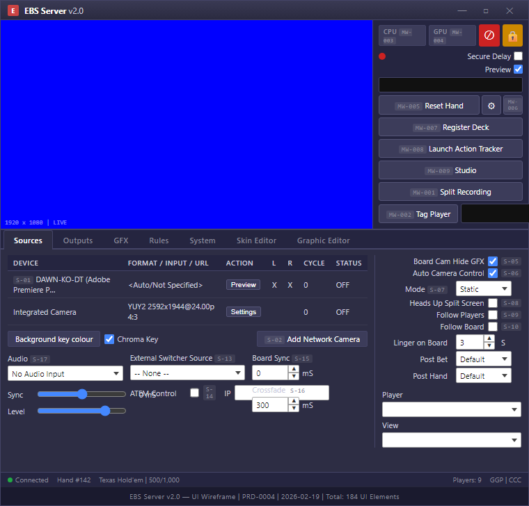

##### 설계 스펙

**변환 요약**: PokerGFX 18개 → EBS 19개. Output Mode Selector(S-00) 신규 추가로 Fill & Key/Chroma Key/Internal 모드에 따른 조건부 표시. ATEM 설정은 Fill & Key 모드에서만 노출하여 인지 부하 감소.

비디오/오디오 입력 소스를 등록하고 속성을 조절한다. 자동 카메라 제어 설정도 이 화면에서 한다.

###### 레이아웃

3구역: Video Sources Table(S-01, 상단) > Camera Control(S-05~S-10, 중단) > Background/Audio/External/Sync(S-11~S-18, 하단).

###### Element Catalog

| # | 그룹 | 요소 | 타입 | 설명 | PGX | 우선순위 |
|:-:|------|------|------|------|:---:|:--------:|
| S-00 | Output Mode | Mode Selector | RadioGroup | Fill & Key / Chroma Key / Internal (기본: Fill & Key) | 신규 | P0 |
| S-01 | Video Sources | Device Table | DataTable | NDI, 캡처 카드, 네트워크 카메라 목록. 매뉴얼: "The Sources tab contains a list of available video sources. These include USB cameras, video capture cards installed in the system and NDI sources detected on the local network." (p.35) | #2 | P0 |
| S-02 | Video Sources | Add Button | TextButton | NDI 자동 탐색 또는 수동 URL. 매뉴얼: "Network cameras can't be auto detected, so to configure one of these as a source click the 'Add network camera' button." (p.35) | #14 | P1 |
| S-03 | Video Sources | Settings | IconButton | 해상도, 프레임레이트, 크롭. 매뉴얼: "To edit the properties of the video source, click on the 'Settings' keyword. A properties window will open enabling additional camera settings to be changed." (p.35) | #2 | P1 |
| S-04 | Video Sources | Preview | IconButton | 소스별 미니 프리뷰 | #2 | P1 |
| S-05 | Camera | Board Cam Hide GFX | Checkbox | 보드 카메라 시 GFX 자동 숨기기. 매뉴얼: "If the 'Hide GFX' option is enabled, all player graphics will be made invisible while the board cam is active." (p.36) | #3 | P1 |
| S-06 | Camera | Auto Camera Control | Checkbox | 게임 상태 기반 자동 전환 | #4 | P1 |
| S-07 | Camera | Mode | Dropdown | Static / Dynamic. 매뉴얼: "To display video sources in rotation, select 'Cycle' mode instead of 'Static'. Enter the number of seconds that each video source should be displayed in the 'Cycle' column." (p.35) | #5,#6 | P1 |
| S-08 | Camera | Heads Up Split | Checkbox | 헤즈업 화면 분할. 매뉴얼: "When play is heads up, and both players are covered by separate cameras, a split screen view showing each player will automatically be displayed." (p.37) | #7 | P1 |
| S-09 | Camera | Follow Players | Checkbox | 플레이어 추적. 매뉴얼: "If Action Tracker is enabled, the video will switch to ensure that the player whose turn it is to act is always displayed." (p.37) | #8 | P1 |
| S-10 | Camera | Follow Board | Checkbox | 보드 추적. 매뉴얼: "When 'Follow Board' is enabled, the video will switch to the community card close-up for a few seconds whenever flop, turn or river cards are dealt." (p.36) | #9 | P1 |
| S-11 | Background | Enable | Checkbox | 크로마키 활성화. 매뉴얼: "Chroma key is supported by outputting graphics on a solid colour background (usually blue or green). To enable chroma key, enable the 'Chroma Key' checkbox." (p.39) | #13 | P0 |
| S-12 | Background | Background Colour | ColorPicker | 배경색 (기본 Blue). 매뉴얼: "repeatedly click the 'Background Key Colour' button until the desired colour is selected." (p.39) | #13 | P0 |
| S-13 | External | Switcher Source | Dropdown | ATEM 스위처 연결 (Fill & Key 필수). 매뉴얼: "When using a camera source for video capture from an external vision switcher, select this capture device using the 'External Switcher Source' dropdown box. This disables the built-in multi-camera switching features." (p.38) | #16 | P0 |
| S-14 | External | ATEM Control | Checkbox+TextField | ATEM IP + 연결 상태 (Fill & Key 필수). 매뉴얼: "PokerGFX can control a Blackmagic ATEM Video Switcher to automatically switch camera inputs to follow the action." (p.40) | #16 | P0 |
| S-15 | Sync | Board Sync | NumberInput | 보드 싱크 보정 (ms). 매뉴얼: "Delays the detection of community cards by the specified number of milliseconds. This can be used to compensate for the problem where community card graphics are displayed before the cards are shown being dealt on video." (p.38) | #17 | P1 |
| S-16 | Sync | Crossfade | NumberInput | 크로스페이드 (ms, 기본 300). 매뉴얼: "When the 'Crossfade' setting is zero, camera sources transition with a hard cut. Setting this value to a higher value between 0.1 and 2.0 causes sources to crossfade." (p.38) | #17 | P1 |
| S-17 | Audio | Input Source | Dropdown | 오디오 소스 선택. 매뉴얼: "Select the desired audio capture device and volume. The Sync setting adjusts the timing of the audio signal to match the video, if required." (p.38) | #15 | P1 |
| S-18 | Audio | Audio Sync | NumberInput | 오디오 싱크 보정 (ms) | #15 | P1 |

#### Step 4: Outputs — 출력 파이프라인

생성된 그래픽을 내보내야 한다. 그래픽이 어떤 장치로, 어떤 해상도와 프레임레이트로 나가는지를 설정해야 한다. Fill & Key 채널 매핑, 녹화, 스트리밍 설정도 이 탭에서 관리한다. **Outputs**(세 번째 탭)에서 출력 파이프라인을 구성한다.

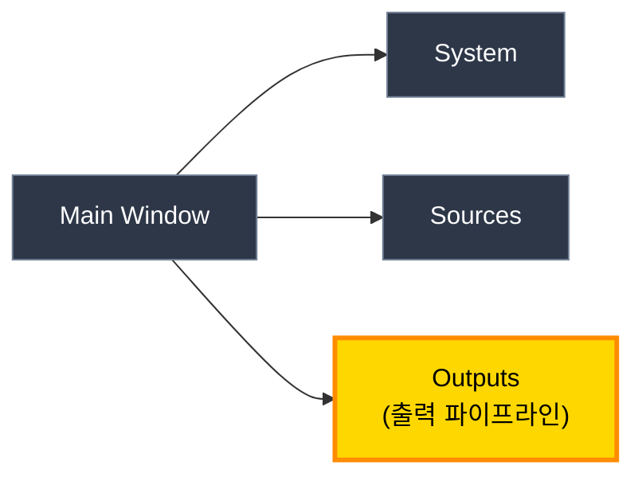
```mermaid
flowchart LR
    classDef default fill:#2d3748,stroke:#718096,color:#ffffff
    MW["Main Window"]
    SYS["System"]
    SRC["Sources"]
    OUT["Outputs<br/>(출력 파이프라인)"]
    style OUT fill:#FFD700,stroke:#FF8C00,stroke-width:3px,color:#000000
    MW --> SYS
    MW --> SRC
    MW --> OUT
```

##### PokerGFX 원본

**원본 캡쳐**

**오버레이 분석본**

비디오 출력 해상도, Live/Delay 이중 파이프라인, 스트리밍을 관리하는 탭. 13개 UI 요소로 구성.

| # | 기능명 | 설명 | EBS 복제 |
|:-:|--------|------|:--------:|
| 1 | Video Size | 출력 해상도 (`1920 x 1080`) | P0 |
| 2 | 9x16 Vertical | 세로 모드 출력 (모바일/쇼츠) | P2 |
| 3 | Frame Rate | 출력 프레임레이트 (`60.00 -> 60`) | P0 |
| 4 | Live column | Live 출력 파이프라인 4개 설정 | P0 |
| 5 | Delay column | Delay 출력 파이프라인 (Live와 독립) | P0 |
| 6 | Virtual Camera | 가상 카메라 출력 | P2 |
| 7 | Recording Mode | 녹화 모드 (`Video with GFX`) | P1 |
| 8 | Secure Delay | 보안 딜레이 설정 (고정 시간 딜레이) | P1 |
| 9 | Dynamic Delay | 동적 딜레이 (상황별 자동 조절) | P1 |
| 10 | Auto Stream | 자동 스트리밍 시작 딜레이(분) | P2 |
| 11 | Show Countdown | 카운트다운 표시 | P1 |
| 12 | Countdown Video | 카운트다운 종료 시 재생 영상 | P2 |
| 13 | Twitch / ChatBot | Twitch 직접 연동 | P2 |

> **설계 시사점**
> - Live/Delay 2열 구조가 동일 화면에서 두 파이프라인을 병렬 관리 → EBS에서 Live 단일 출력 우선 구현, Delay 파이프라인은 추후 개발
> - Key & Fill(4~5번)의 DeckLink 포트 할당이 불명확하고 Sources 탭과 설정 분리됨 → EBS에서 O-18~O-20 Fill & Key 전용 섹션 신규 추가
> - Recording(7번) / Auto Stream(10번) / Twitch ChatBot(13번)이 출력 설정과 혼재 → EBS에서 스트리밍/녹화는 별도 그룹 분리 (P2 통합)
> - Virtual Camera(6번)가 SDI/NDI와 동일 Priority로 배치 → EBS에서 P2로 내려 운영 필수 설정과 구분

##### EBS 설계본

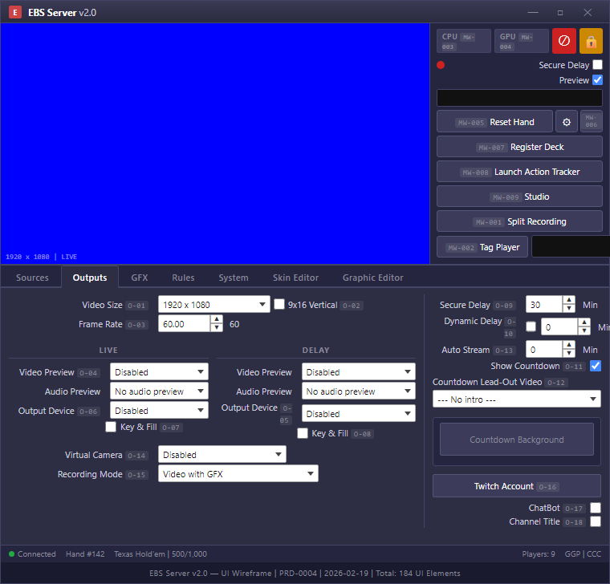

##### 설계 스펙

**변환 요약**: PokerGFX 13개 → EBS 20개. Fill & Key Channel Map(O-20), Key Color(O-18), Fill/Key Preview(O-19) 신규 추가. Live 단일 출력 구조. Delay 파이프라인은 추후 개발.

출력 파이프라인을 설정한다. Delay 이중 출력은 추후 개발 범위이며, 현재는 Live 단일 출력 구조로 설계한다.

###### 레이아웃

3구역: Resolution(O-01~O-03, 상단) > Live 출력(O-04~O-05) > Recording/Streaming/Fill&Key(O-14~O-20). Delay 파이프라인(O-06~O-07)은 추후 개발.

###### Element Catalog

| # | 그룹 | 요소 | 설명 | PGX | 우선순위 |
|:-:|------|------|------|:---:|:--------:|
| O-01 | Resolution | Video Size | 1080p/4K 출력 해상도. 매뉴얼: "Select the desired resolution and frame rate of the video output." (p.42) | #1 | P0 |
| O-02 | Resolution | 9x16 Vertical | 세로 모드 (모바일). 매뉴얼: "PokerGFX supports vertical video natively by enabling the '9x16 Vertical' checkbox in the Outputs settings tab. With vertical video enabled you can stream POV-style content complete with graphics and secure delay." (p.43) | #2 | P2 |
| O-03 | Resolution | Frame Rate | 30/60fps | #3 | P0 |
| O-04 | Live | Video/Audio/Device | Live 파이프라인 3개 드롭다운. 매뉴얼: "Sends the live and/or delayed video and audio feed to a Blackmagic Decklink device output (if installed), or to an NDI stream on the local network." (p.42) | #4 | P0 |
| O-05 | Live | Key & Fill | Live Fill & Key 출력 (DeckLink 채널 할당). 매뉴얼: "When an output device that supports external keying is selected, the 'Key & Fill' checkbox is enabled. Activating this feature causes separate key & fill signals to be sent to 2 SDI connectors on the device." (p.43) | #4 | P0 |
| O-06 | Delay | Video/Audio/Device | Delay 파이프라인 (Live와 독립) | #5 | Future |
| O-07 | Delay | Key & Fill | Delay Fill & Key 출력 (DeckLink 채널 할당) | #5 | Future |
| O-14 | Virtual | Camera | 가상 카메라 (OBS 연동). 매뉴얼: "Sends the video and audio feed (live OR delayed, depending on this setting) to the POKERGFX VCAM virtual camera device, for use by 3rd party streaming software such as OBS or XSplit." (p.43) | #6 | P2 |
| O-15 | Recording | Mode | Video / Video+GFX / GFX only | #7 | P1 |
| O-16 | Streaming | Platform | Twitch/YouTube/Custom RTMP. 매뉴얼: "PokerGFX includes a fully functional ChatBot that is compatible with the Twitch video streaming service. Commands: !event, !blinds, !players, !delay, !chipcount, !cashwin, !payouts, !vpip, !pfr" (p.47) | #13 | P2 |
| O-17 | Streaming | Account Connect | OAuth 연결 | #13 | P2 |
| O-18 | Fill & Key | Key Color | Key 신호 배경색 (기본: #FF000000) | 신규 | P0 |
| O-19 | Fill & Key | Fill/Key Preview | Fill 신호와 Key 신호 나란히 미리보기 | 신규 | P1 |
| O-20 | Fill & Key | DeckLink Channel Map | Live Fill/Key → DeckLink 포트 매핑 (Delay 추가 시 확장) | 신규 | P0 |

###### O-01 해상도 변경 파급 효과 (전체 처리 체인)

**트리거**: O-01 Video Size 드롭다운에서 새 해상도 선택

**사전 확인 다이얼로그**: "해상도를 변경하면 출력이 2~3초 중단됩니다. 계속하시겠습니까?"

**7단계 처리 순서**:

| 단계 | 처리 내용 | 상세 |
|:----:|----------|------|
| 1 | Live 출력 스트림 중단 | 방송 중단 발생 (2~3초) |
| 2 | 렌더러 해상도 재설정 | `renderer._w`, `renderer._h` 갱신 |
| 3 | 스케일 팩터 재계산 | `scale = new_resolution / base_resolution(1920×1080)` |
| 4 | GFX 좌표 재매핑 | 모든 요소의 정규화 좌표 → 새 픽셀 좌표 변환 |
| 5 | 스킨 호환성 확인 | 현재 스킨의 SK-04 상태와 출력 해상도 비교 |
| 6 | Preview 캔버스 크기 재계산 | 새 해상도 종횡비로 M-02 갱신 |
| 7 | 출력 스트림 재시작 | Live 출력 복구 |

**피드백 순서**:
- 처리 중: Preview 블랙아웃 (2~3초)
- 완료: Preview 즉시 복구, O-01에 새 해상도 표시
- 스킨 비호환 감지 시: 경고 토스트 "현재 스킨이 4K 최적화되지 않았습니다. SK-04를 확인하세요."

#### Step 5: GFX 1 — 레이아웃 & 연출

카메라와 출력이 준비되면 이제 그래픽을 올린다. **GFX 1**(네 번째 탭)은 그래픽의 "배치"를 담당한다. 보드 카드가 화면 어디에 나타날지, 플레이어 오버레이가 어떤 배열로 표시될지, 카드가 어떤 연출로 공개될지를 설정한다. PokerGFX 원본의 GFX 1 탭 구조를 그대로 계승한다.

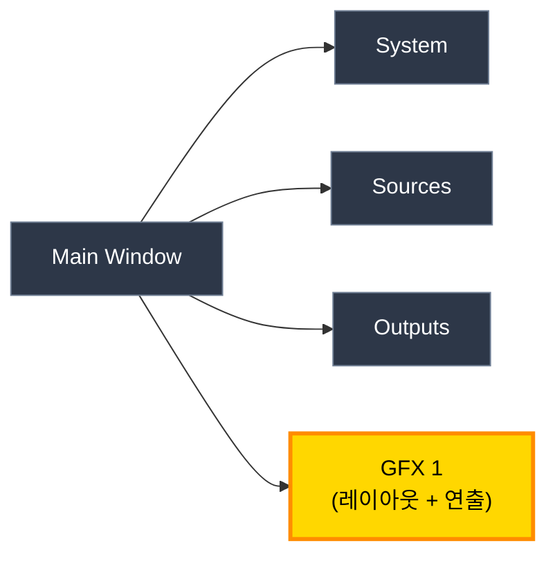
```mermaid
flowchart LR
    classDef default fill:#2d3748,stroke:#718096,color:#ffffff
    MW["Main Window"]
    SYS["System"]
    SRC["Sources"]
    OUT["Outputs"]
    GFX1["GFX 1<br/>(레이아웃 + 연출)"]
    style GFX1 fill:#FFD700,stroke:#FF8C00,stroke-width:3px,color:#000000
    MW --> SYS
    MW --> SRC
    MW --> OUT
    MW --> GFX1
```

##### PokerGFX 원본

**원본 캡쳐**

**오버레이 분석본**

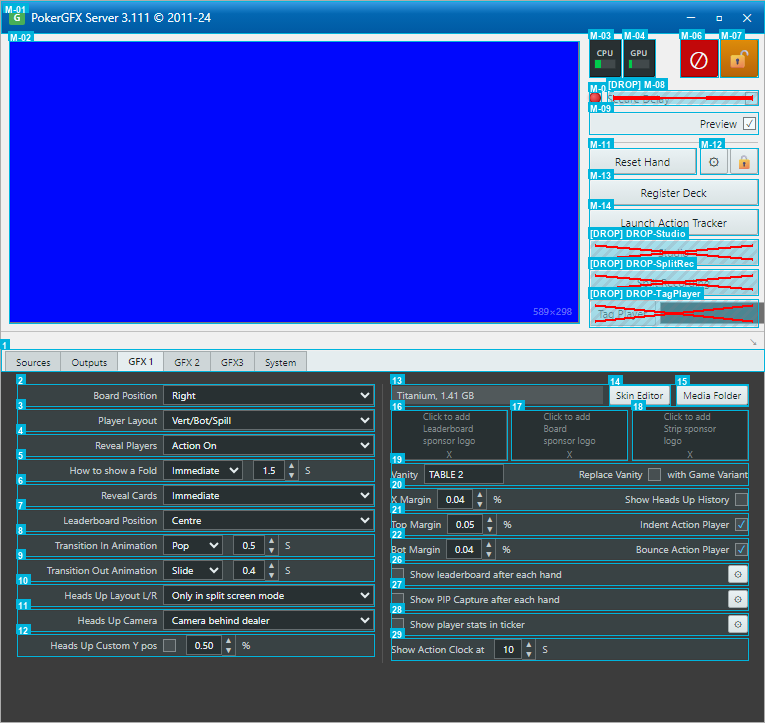

보드/플레이어 레이아웃, Transition 애니메이션, 스킨, 스폰서 로고, 마진을 관리하는 탭. 29개 UI 요소로 구성.

| # | 기능명 | 설명 | EBS 복제 |
|:-:|--------|------|:--------:|
| 1 | Tab Bar | 7개 탭 전환 바 | P0 |
| 2 | Board Position | Board Position 드롭다운 `[Right]`. 보드 카드 표시 위치 (Right/Left/Centre/Top) | P0 |
| 3 | Player Layout | Player Layout 드롭다운 `[Vert/Bot/Spill]`. 플레이어 오버레이 배치 모드 | P0 |
| 4 | Reveal Players | Reveal Players 드롭다운 `[Action On]`. 카드 공개 시점 (Always/Action On/Never) | P0 |
| 5 | How to show a Fold | Fold 표시 방식 `[Immediate|1.5|S]`. 폴드 시 카드 숨김 타이밍 | P0 |
| 6 | Reveal Cards | Reveal Cards 드롭다운 `[Immediate]`. 카드 공개 연출 타이밍 | P0 |
| 7 | Leaderboard Position | Leaderboard Position 드롭다운 `[Centre]`. 리더보드 화면 위치 | P1 |
| 8 | Transition In | Transition In Animation `[Pop|0.5|S]`. 등장 애니메이션 + 시간 | P1 |
| 9 | Transition Out | Transition Out Animation `[Slide|0.4|S]`. 퇴장 애니메이션 + 시간 | P1 |
| 10 | Heads Up Layout L/R | Heads Up Layout Left/Right. 헤즈업 화면 분할 배치 | P1 |
| 11 | Heads Up Camera | Heads Up Camera `[Camera behind dealer]`. 헤즈업 카메라 위치 | P1 |
| 12 | Heads Up Custom Y | Custom Y pos 체크박스 + `[0.50] %`. 헤즈업 Y축 미세 조정 | P1 |
| 13 | Skin Info | 현재 스킨명 라벨 `Titanium, 1.41 GB`. 스킨 이름과 용량 표시 | P1 |
| 14 | Skin Editor | `[Skin Editor]` 버튼. 별도 창으로 스킨 편집기 실행 | P1 |
| 15 | Media Folder | `[Media Folder]` 버튼. 스킨 미디어 폴더 탐색기 열기 | P1 |
| 16 | Sponsor Logo 1 | Leaderboard 위치 스폰서 로고 슬롯. `Click to add` + X 삭제 | P2 |
| 17 | Sponsor Logo 2 | Board 위치 스폰서 로고 슬롯. `Click to add` + X 삭제 | P2 |
| 18 | Sponsor Logo 3 | Strip 위치 스폰서 로고 슬롯. `Click to add` + X 삭제 | P2 |
| 19 | Vanity | Vanity 텍스트 `[TABLE 2]` + Replace Vanity with Game Variant 체크박스 | P2 |
| 20 | X Margin | X Margin 스피너 `[0.04] %`. 좌우 여백 | P1 |
| 21 | Top Margin | Top Margin 스피너 `[0.05] %`. 상단 여백 | P1 |
| 22 | Bot Margin | Bot Margin 스피너 `[0.04] %`. 하단 여백 | P1 |
| 23 | Show Heads Up History | Show Heads Up History 체크박스. 헤즈업 히스토리 표시 | P1 |
| 24 | Indent Action Player | Indent Action Player 체크박스 ☑. 액션 플레이어 들여쓰기 | P1 |
| 25 | Bounce Action Player | Bounce Action Player 체크박스 ☑. 액션 플레이어 바운스 효과 | P1 |
| 26 | Show leaderboard | Show leaderboard after each hand 체크박스 + ⚙ 설정. 핸드 종료 후 리더보드 | P1 |
| 27 | Show PIP Capture | Show PIP Capture after each hand 체크박스 + ⚙ 설정. 핸드 종료 후 PIP | P1 |
| 28 | Show player stats | Show player stats in the ticker after each hand 체크박스 + ⚙ 설정 | P1 |
| 29 | Action Clock | Show Action Clock at `[10] S`. 지정 시간부터 원형 타이머 표시 | P0 |

> **설계 시사점**
> - 단일 스킨 패키지(1.41GB)가 모든 그래픽 에셋을 포함 → EBS에서 계승, 스킨 단위 배포 구조 유지
> - 스폰서 슬롯 3개(Leaderboard / Board / Strip)가 위치별로 독립 관리 → EBS 계승 (G-10~G-12), P2 우선순위 유지
> - Transition Animation이 Pop/Slide/Fade + 시간 조합으로 세밀하게 제어됨 → EBS 계승 (G-22~G-24), 방송 연출 핵심 기능
> - Bounce Action Player가 액션 대기 플레이어의 바운스 시각 효과를 체크박스 하나로 제어 → EBS 계승 (G-25), 체크박스 On/Off 구조 동일 유지

##### EBS 설계본

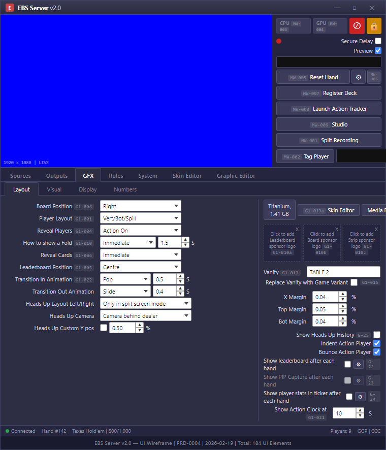

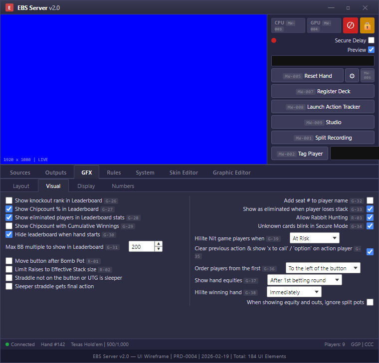

##### 설계 스펙

**변환 요약**: PokerGFX 29개 → EBS 25개. 레이아웃(G-01~G-13)과 연출(G-14~G-25) 두 그룹으로 구성. PokerGFX GFX 1 탭 구조 직접 계승.

GFX 1은 그래픽 배치(어디에)와 연출(어떤 방식으로)을 담당한다.

###### 레이아웃

2그룹: Layout(G-01~G-13) — 위치/배치/스킨 + Visual(G-14~G-25) — 카드 공개/연출/효과.

###### GFX 좌표계 원칙

EBS GFX의 위치/크기 값은 두 가지 단위 체계가 혼재한다. 구현 시 혼동 방지를 위해 명확히 구분한다.

| 단위 | 범위 | 사용 항목 | 해상도 변경 시 처리 |
|------|------|----------|------------------|
| 정규화 좌표 (float) | 0.0 ~ 1.0 | Margin % (G-03~G-05). 예: 0.04 = 4% | 변환 불필요. `margin_pixel = margin_normalized × output_width` |
| 기준 픽셀 (int) | 0 ~ 1920 또는 0 ~ 1080 | Graphic Editor LTWH. Design Resolution 기준 | 스케일 팩터 자동 적용. 예: 1080p L=100 → 4K L=200 |

###### Element Catalog

**Layout 그룹 (배치)**

| # | 요소 | 타입 | 설명 | PGX | 우선순위 |
|:-:|------|------|------|:---:|:--------:|
| G-01 | Board Position | Dropdown | 보드 카드 위치 (Left/Right/Centre/Top). 매뉴얼: "Position of the Board graphic (shows community cards, pot size and optionally blind levels). Choices are LEFT, CENTRE and RIGHT. The Board is always positioned at the bottom of the display." (p.48) | GFX1 #2 | P0 |
| G-02 | Player Layout | Dropdown | 플레이어 배치. 매뉴얼: Horizontal(플레이어 하단 수평), Vert/Bot/Spill(좌하단부터 수직, 넘치면 우하단), Vert/Bot/Fit(좌하단부터 수직, 전원 좌측 맞춤), Vert/Top/Spill(좌상단부터 수직), Vert/Top/Fit(좌상단부터 수직, 전원 좌측 맞춤) (p.48) | GFX1 #3 | P0 |
| G-03 | X Margin | NumberInput | 좌우 여백 (%, 기본 0.04). 매뉴얼: "This setting controls the size of the horizontal margins. Valid values are between 0 and 1. When in any vertical layout mode, larger values cause all graphics to move towards the centre of the display." (p.49) | GFX1 #20 | P1 |
| G-04 | Top Margin | NumberInput | 상단 여백 (%, 기본 0.05). 매뉴얼: "This setting controls the size of the vertical margins. Valid values are between 0 and 1. Larger values cause all graphics to move towards the centre of the display." (p.49) | GFX1 #21 | P1 |
| G-05 | Bot Margin | NumberInput | 하단 여백 (%, 기본 0.04). 매뉴얼: "This setting controls the size of the vertical margins. Valid values are between 0 and 1. Larger values cause all graphics to move towards the centre of the display." (p.49) | GFX1 #22 | P1 |
| G-06 | Leaderboard Position | Dropdown | 리더보드 위치. 매뉴얼: "Selects the position of the Leaderboard graphic." (p.49) | GFX1 #7 | P1 |
| G-07 | Heads Up Layout L/R | Dropdown | 헤즈업 화면 분할 배치. 매뉴얼: "Overrides the player layout when players are heads-up. In this mode, the board graphic is positioned at the bottom centre of the display with each player positioned either side." (p.48) | GFX1 #10 | P1 |
| G-08 | Heads Up Camera | Dropdown | 헤즈업 카메라 위치 | GFX1 #11 | P1 |
| G-09 | Heads Up Custom Y | Checkbox+NumberInput | Y축 미세 조정. 매뉴얼: "Use this to specify the vertical position of player graphics when Heads Up layout is active." (p.48) | GFX1 #12 | P1 |
| G-10 | Sponsor Logo 1 | ImageSlot | Leaderboard 스폰서. 매뉴얼: "Displays a sponsor logo at the top of the Leaderboard. NOTE: Pro only." (p.50) | GFX1 #16 | P2 |
| G-11 | Sponsor Logo 2 | ImageSlot | Board 스폰서. 매뉴얼: "Displays a sponsor logo to the side of the Board. NOTE: Pro only." (p.50) | GFX1 #17 | P2 |
| G-12 | Sponsor Logo 3 | ImageSlot | Strip 스폰서. 매뉴얼: "Displays a sponsor logo at the left-hand end of the Strip. NOTE: Pro only." (p.50) | GFX1 #18 | P2 |
| G-13 | Vanity Text | TextField+Checkbox | 테이블 텍스트 + Game Variant 대체. 매뉴얼: "Custom text displayed on the Board Card / Pot graphic." + "When this option is enabled, the name of the currently active game variant will be displayed instead of the Vanity text." (p.49) | GFX1 #19 | P2 |

**Visual 그룹 (연출)**

| # | 요소 | 타입 | 설명 | PGX | 우선순위 |
|:-:|------|------|------|:---:|:--------:|
| G-14 | Reveal Players | Dropdown | 카드 공개 시점. 매뉴얼: "Determines when players are shown: Immediate / On Action / After Bet / On Action + Next" (p.50) | GFX1 #4 | P0 |
| G-15 | How to Show Fold | Dropdown+NumberInput | 폴드 표시. 매뉴얼: Immediate="Player is removed immediately." / Delayed="Player graphic displays 'Fold', then disappears after a few seconds." (p.51) | GFX1 #5 | P0 |
| G-16 | Reveal Cards | Dropdown | 카드 공개 연출. 매뉴얼: Immediate(플레이어 등장 즉시), After Action(첫 액션 후), End of Hand(베팅 종료 후), Showdown Cash(승자/최초 공격자), Showdown Tourney(Showdown Cash + 올인 있을 때 전원), Never(미공개) (p.51) | GFX1 #6 | P0 |
| G-17 | Transition In | Dropdown+NumberInput | 등장 애니메이션 + 시간 | GFX1 #8 | P1 |
| G-18 | Transition Out | Dropdown+NumberInput | 퇴장 애니메이션 + 시간 | GFX1 #9 | P1 |
| G-19 | Indent Action Player | Checkbox | 액션 플레이어 들여쓰기 | GFX1 #24 | P1 |
| G-20 | Bounce Action Player | Checkbox | 액션 플레이어 바운스 | GFX1 #25 | P1 |
| G-21 | Action Clock | NumberInput | 카운트다운 임계값 (초) | GFX1 #29 | P0 |
| G-22 | Show Leaderboard | Checkbox+Settings | 핸드 후 리더보드 자동 표시 | GFX1 #26 | P1 |
| G-23 | Show PIP Capture | Checkbox+Settings | 핸드 후 PIP 표시 | GFX1 #27 | P1 |
| G-24 | Show Player Stats | Checkbox+Settings | 핸드 후 티커 통계 | GFX1 #28 | P1 |
| G-25 | Heads Up History | Checkbox | 헤즈업 히스토리 | GFX1 #23 | P1 |

**Skin 그룹**

| # | 요소 | 타입 | 설명 | PGX | 우선순위 |
|:-:|------|------|------|:---:|:--------:|
| G-13s | Skin Info | Label | 현재 스킨명 + 용량 (`Titanium, 1.41 GB`) | GFX1 #13 | P1 |
| G-14s | Skin Editor | TextButton | 별도 창 스킨 편집기 실행 | GFX1 #14 | P1 |
| G-15s | Media Folder | TextButton | 스킨 미디어 폴더 탐색기 | GFX1 #15 | P1 |

#### Step 6: GFX 2 — 표시 설정 & 규칙

GFX 1에서 배치와 연출을 정했다면, **GFX 2**(다섯 번째 탭)는 "무엇을 표시할지"를 결정한다. 리더보드 옵션, 플레이어 표시 방식, Equity 표시 시점, 게임 규칙(Bomb Pot·Straddle·Rabbit Hunting)이 여기에 모인다. PokerGFX 원본의 GFX 2 탭 구조를 그대로 계승한다.

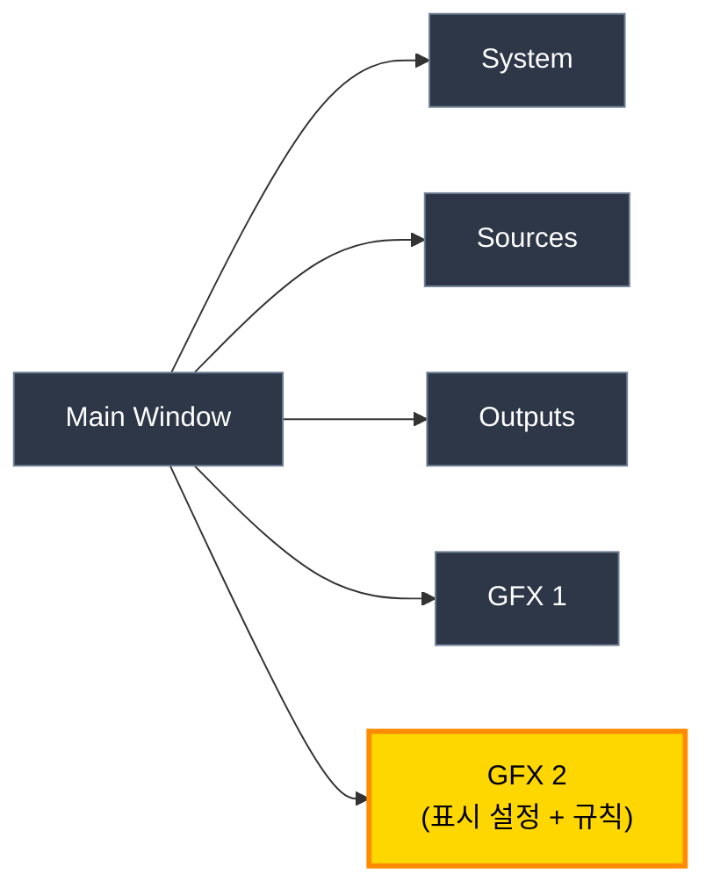
```mermaid
flowchart LR
    classDef default fill:#2d3748,stroke:#718096,color:#ffffff
    MW["Main Window"]
    SYS["System"]
    SRC["Sources"]
    OUT["Outputs"]
    GFX1["GFX 1"]
    GFX2["GFX 2<br/>(표시 설정 + 규칙)"]
    style GFX2 fill:#FFD700,stroke:#FF8C00,stroke-width:3px,color:#000000
    MW --> SYS
    MW --> SRC
    MW --> OUT
    MW --> GFX1
    MW --> GFX2
```

##### PokerGFX 원본

**원본 캡쳐**

**오버레이 분석본**

리더보드 옵션, 게임 규칙, 플레이어 표시, Equity 설정을 관리하는 탭. 21개 UI 요소로 구성.

| # | 기능명 | 설명 | EBS 복제 |
|:-:|--------|------|:--------:|
| 1 | Tab Bar | 7개 탭 전환 바 | P0 |
| 2 | Show knockout rank | Show knockout rank in Leaderboard 체크박스. 리더보드에 녹아웃 순위 표시 | P1 |
| 3 | Show Chipcount % | Show Chipcount % in Leaderboard 체크박스 ☑. 칩카운트 퍼센트 표시 | P1 |
| 4 | Show eliminated | Show eliminated players in Leaderboard stats 체크박스 ☑. 탈락 선수 표시 | P1 |
| 5 | Cumulative Winnings | Show Chipcount with Cumulative Winnings 체크박스. 누적 상금 표시 | P1 |
| 6 | Hide leaderboard | Hide leaderboard when hand starts 체크박스 ☑. 핸드 시작 시 리더보드 숨김 | P1 |
| 7 | Max BB multiple | Max BB multiple to show in Leaderboard `[200]`. 리더보드 BB 배수 상한값 | P1 |
| 8 | Move button Bomb Pot | Move button after Bomb Pot 체크박스. 봄팟 후 버튼 이동 | P1 |
| 9 | Limit Raises | Limit Raises to Effective Stack size 체크박스. 유효 스택 기반 레이즈 제한 | P1 |
| 10 | Straddle sleeper | Straddle not on the button or UTG is sleeper 체크박스. 스트래들 위치 규칙 | P1 |
| 11 | Sleeper final action | Sleeper straddle gets final action 체크박스. 슬리퍼 스트래들 최종 액션 | P1 |
| 12 | Add seat # | Add seat # to player name 체크박스. 플레이어 이름에 좌석 번호 추가 | P1 |
| 13 | Show as eliminated | Show as eliminated when player loses stack 체크박스 ☑. 스택 소진 시 탈락 표시 | P1 |
| 14 | Allow Rabbit Hunting | Allow Rabbit Hunting 체크박스. 래빗 헌팅 허용 | P1 |
| 15 | Unknown cards blink | Unknown cards blink in Secure Mode 체크박스 ☑. 보안 모드에서 미확인 카드 깜빡임 | P1 |
| 16 | Hilite Nit game | Hilite Nit game players when `[At Risk]` 드롭다운. 닛 게임 플레이어 강조 조건 | P1 |
| 17 | Clear previous action | Clear previous action & show 'x to call' / 'option' 체크박스 ☑. 이전 액션 초기화 | P1 |
| 18 | Order players | Order players from the first `[To the left of the button]` 드롭다운. 플레이어 정렬 순서 | P1 |
| 19 | Show hand equities | Show hand equities `[After 1st betting round]` 드롭다운. Equity 표시 시점 | P0 |
| 20 | Hilite winning hand | Hilite winning hand `[Immediately]` 드롭다운. 위닝 핸드 강조 시점 | P0 |
| 21 | Ignore split pots | When showing equity and outs, ignore split pots 체크박스. Split pot Equity 계산 규칙 | P1 |

> **설계 시사점**
> - Bomb Pot / Rabbit Hunting / Sleeper Straddle 등 특수 규칙이 별도 체크박스로 독립 노출 → EBS 계승 (G-52~G-57), 규칙 변경이 그래픽 표시에 직접 영향을 미쳐 GFX 2 탭 배치 유지
> - Equity 표시 시점이 "After 1st betting round" 등 정밀 드롭다운으로 제어 → EBS 계승 (G-37), 방송 긴장감에 직결되어 P0 유지
> - 보안 모드에서 미확인 카드 깜빡임(Unknown cards blink)이 별도 체크박스로 제어 → EBS 계승 (G-56), RFID 미인식 카드의 시각적 경보 기능

##### EBS 설계본

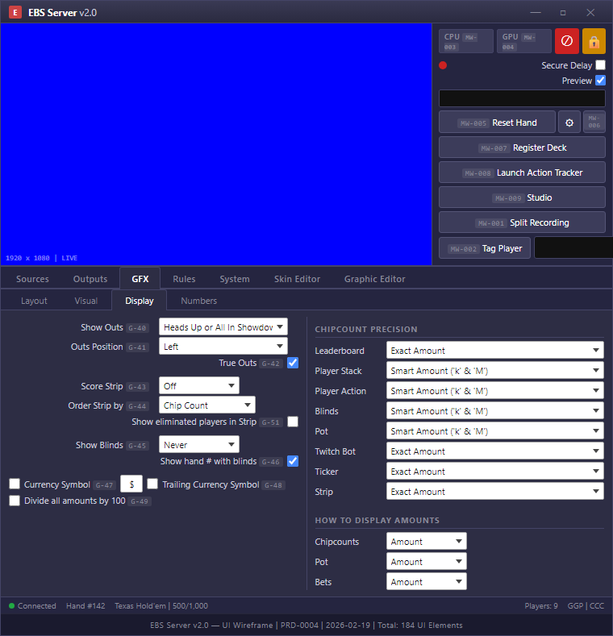

##### 설계 스펙

**변환 요약**: PokerGFX 21개 → EBS 20개. 리더보드 그룹(G-26~G-31), 플레이어 표시(G-32~G-36), Equity(G-37~G-39), 게임 규칙(G-52~G-57) 4그룹 구성. PokerGFX GFX 2 탭 구조 직접 계승.

GFX 2는 표시 설정(무엇을 보여줄지)과 게임 규칙(어떤 규칙으로)을 담당한다.

###### 레이아웃

4그룹: Leaderboard(G-26~G-31) > Player Display(G-32~G-36) > Equity(G-37~G-39) > Game Rules(G-52~G-57).

###### Element Catalog

**Leaderboard 그룹**

| # | 요소 | 타입 | 설명 | PGX | 우선순위 |
|:-:|------|------|------|:---:|:--------:|
| G-26 | Show Knockout Rank | Checkbox | 녹아웃 순위 | GFX2 #2 | P1 |
| G-27 | Show Chipcount % | Checkbox | 칩카운트 퍼센트 | GFX2 #3 | P1 |
| G-28 | Show Eliminated | Checkbox | 탈락 선수 표시 | GFX2 #4 | P1 |
| G-29 | Cumulative Winnings | Checkbox | 누적 상금 | GFX2 #5 | P1 |
| G-30 | Hide Leaderboard | Checkbox | 핸드 시작 시 숨김 | GFX2 #6 | P1 |
| G-31 | Max BB Multiple | NumberInput | BB 배수 상한 | GFX2 #7 | P1 |

**Player Display 그룹**

| # | 요소 | 타입 | 설명 | PGX | 우선순위 |
|:-:|------|------|------|:---:|:--------:|
| G-32 | Add Seat # | Checkbox | 좌석 번호 추가 | GFX2 #12 | P1 |
| G-33 | Show as Eliminated | Checkbox | 스택 소진 시 탈락 | GFX2 #13 | P1 |
| G-34 | Unknown Cards Blink | Checkbox | 미확인 카드 깜빡임 | GFX2 #15 | P1 |
| G-35 | Clear Previous Action | Checkbox | 이전 액션 초기화 | GFX2 #17 | P1 |
| G-36 | Order Players | Dropdown | 플레이어 정렬 순서 | GFX2 #18 | P1 |

**Equity 그룹**

| # | 요소 | 타입 | 설명 | PGX | 우선순위 |
|:-:|------|------|------|:---:|:--------:|
| G-37 | Show Hand Equities | Dropdown | Equity 표시 시점 | GFX2 #19 | P0 |
| G-38 | Hilite Winning Hand | Dropdown | 위닝 핸드 강조 시점 | GFX2 #20 | P0 |
| G-39 | Hilite Nit Game | Dropdown | 닛 게임 강조 조건 | GFX2 #16 | P1 |

**Game Rules 그룹**

| # | 요소 | 타입 | 설명 | PGX | 우선순위 |
|:-:|------|------|------|:---:|:--------:|
| G-52 | Move Button Bomb Pot | Checkbox | 봄팟 후 버튼 이동 | GFX2 #8 | P1 |
| G-53 | Limit Raises | Checkbox | 유효 스택 기반 레이즈 제한 | GFX2 #9 | P1 |
| G-54 | Allow Rabbit Hunting | Checkbox | 래빗 헌팅 허용 | GFX2 #14 | P1 |
| G-55 | Straddle Sleeper | Dropdown | 스트래들 위치 규칙 | GFX2 #10 | P1 |
| G-56 | Sleeper Final Action | Dropdown | 슬리퍼 최종 액션 | GFX2 #11 | P1 |
| G-57 | Ignore Split Pots | Checkbox | Equity/Outs에서 Split pot 무시 | GFX2 #21 | P1 |

#### Step 7: GFX 3 — 수치 형식

**GFX 3**(여섯 번째 탭)은 숫자의 형식을 결정한다. 칩카운트를 원화(₩)로 표시할지, k/M 단위로 축약할지, BB 배수로 표시할지를 설정한다. Outs 표시 조건, 블라인드 표시 시점, 통화 기호 등 수치 렌더링 전반을 담당한다. PokerGFX 원본의 GFX3 탭 구조를 그대로 계승한다.

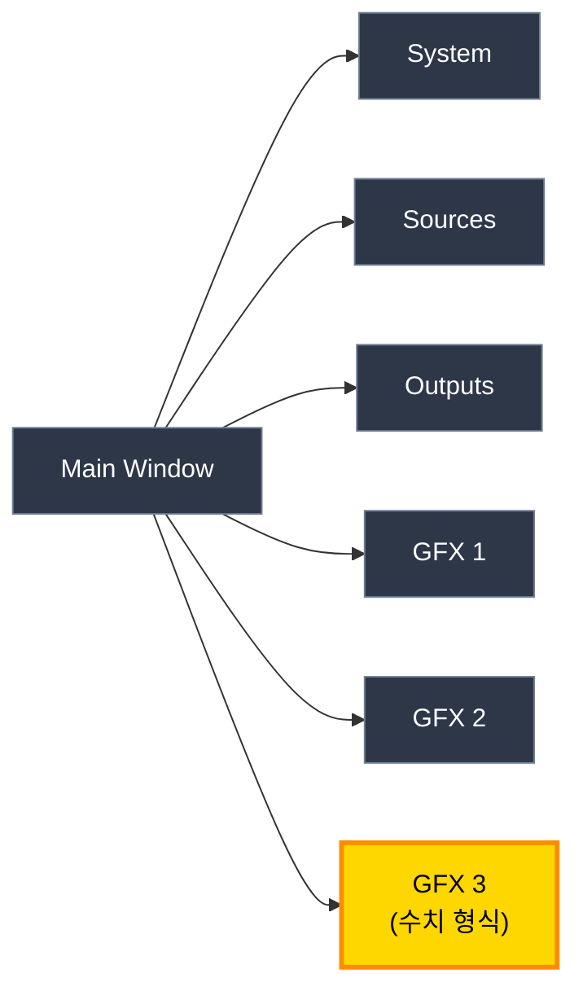
```mermaid
flowchart LR
    classDef default fill:#2d3748,stroke:#718096,color:#ffffff
    MW["Main Window"]
    SYS["System"]
    SRC["Sources"]
    OUT["Outputs"]
    GFX1["GFX 1"]
    GFX2["GFX 2"]
    GFX3["GFX 3<br/>(수치 형식)"]
    style GFX3 fill:#FFD700,stroke:#FF8C00,stroke-width:3px,color:#000000
    MW --> SYS
    MW --> SRC
    MW --> OUT
    MW --> GFX1
    MW --> GFX2
    MW --> GFX3
```

##### PokerGFX 원본

**원본 캡쳐**

**오버레이 분석본**

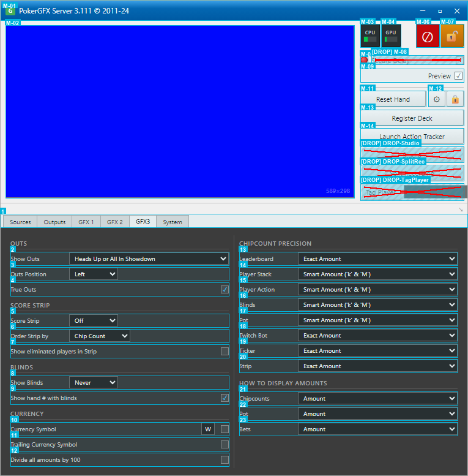

Outs 표시, Score Strip, Blinds, 통화 기호, Chipcount 정밀도, 금액 표시 모드를 관리하는 탭. 23개 UI 요소로 구성.

| # | 기능명 | 설명 | EBS 복제 |
|:-:|--------|------|:--------:|
| 1 | Tab Bar | 7개 탭 전환 바 | P0 |
| 2 | Show Outs | Show Outs `[Heads Up or All In Showdown]` 드롭다운. 아웃츠 표시 조건 | P1 |
| 3 | Outs Position | Outs Position `[Left]` 드롭다운. 아웃츠 화면 표시 위치 | P1 |
| 4 | True Outs | True Outs 체크박스 ☑. 정밀 아웃츠 계산 알고리즘 활성화 | P1 |
| 5 | Score Strip | Score Strip `[Off]` 드롭다운. 하단 스코어 스트립 활성화 | P1 |
| 6 | Order Strip by | Order Strip by `[Chip Count]` 드롭다운. 스트립 정렬 기준 | P1 |
| 7 | Strip eliminated | Show eliminated players in Strip 체크박스. 스트립에 탈락 선수 표시 | P1 |
| 8 | Show Blinds | Show Blinds `[Never]` 드롭다운. 블라인드 표시 조건 | P0 |
| 9 | Show hand # | Show hand # with blinds 체크박스 ☑. 블라인드와 핸드 번호 동시 표시 | P0 |
| 10 | Currency Symbol | Currency Symbol `[₩]` 원화. 통화 기호 설정 | P0 |
| 11 | Trailing Currency | Trailing Currency Symbol 체크박스. 통화 기호 후치 (100₩ vs ₩100) | P0 |
| 12 | Divide by 100 | Divide all amounts by 100 체크박스. 금액 100분의 1 변환 | P0 |
| 13 | Leaderboard precision | Leaderboard `[Exact Amount]` 드롭다운. 리더보드 수치 형식 | P1 |
| 14 | Player Stack precision | Player Stack `[Smart Amount ('k' & 'M')]` 드롭다운. 스택 표시 형식 | P1 |
| 15 | Player Action precision | Player Action `[Smart Amount ('k' & 'M')]` 드롭다운. 액션 금액 형식 | P1 |
| 16 | Blinds precision | Blinds `[Smart Amount ('k' & 'M')]` 드롭다운. 블라인드 수치 형식 | P1 |
| 17 | Pot precision | Pot `[Smart Amount ('k' & 'M')]` 드롭다운. 팟 수치 형식 | P1 |
| 18 | Twitch Bot precision | Twitch Bot `[Exact Amount]` 드롭다운. Twitch 봇 수치 형식 | P1 |
| 19 | Ticker precision | Ticker `[Exact Amount]` 드롭다운. 티커 수치 형식 | P1 |
| 20 | Strip precision | Strip `[Exact Amount]` 드롭다운. 스트립 수치 형식 | P1 |
| 21 | Chipcounts mode | Chipcounts `[Amount]` 드롭다운. Amount 또는 BB 표시 모드 | P1 |
| 22 | Pot mode | Pot `[Amount]` 드롭다운. Amount 또는 BB 표시 모드 | P1 |
| 23 | Bets mode | Bets `[Amount]` 드롭다운. Amount 또는 BB 표시 모드 | P1 |

> **설계 시사점**
> - 영역별 독립 수치 형식: 리더보드 = 정확 금액, 방송 화면 = k/M 축약
> - 통화 기호 ₩: 한국 방송 지원 확인
> - BB 표시 모드: 토너먼트에서 BB 배수로 전환 가능
> - True Outs: 정밀한 아웃츠 계산 알고리즘 필요

##### EBS 설계본

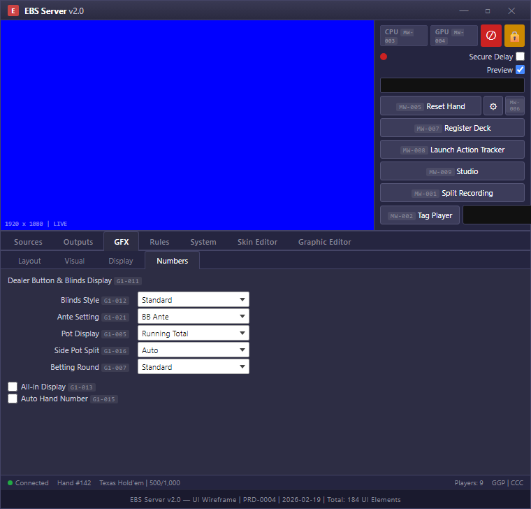

##### 설계 스펙

**변환 요약**: PokerGFX 23개 → EBS 12개 (G-40~G-51). 기능 단위로 그룹화. 수치 precision 8개를 G-50 PrecisionGroup으로 통합. PokerGFX GFX3 탭 구조 직접 계승.

GFX 3은 수치 렌더링(어떤 형식으로)을 담당한다.

###### 레이아웃

3그룹: Outs/Strip(G-40~G-44) > Blinds/Currency(G-45~G-49) > Precision/Mode(G-50~G-51).

###### Element Catalog

**Outs & Strip 그룹**

| # | 요소 | 타입 | 설명 | PGX | 우선순위 |
|:-:|------|------|------|:---:|:--------:|
| G-40 | Show Outs | Dropdown | 아웃츠 조건 (Heads Up/All In/Always) | GFX3 #2 | P1 |
| G-41 | Outs Position | Dropdown | 아웃츠 위치 | GFX3 #3 | P1 |
| G-42 | True Outs | Checkbox | 정밀 아웃츠 계산 | GFX3 #4 | P1 |
| G-43 | Score Strip | Dropdown | 하단 스코어 스트립 | GFX3 #5 | P1 |
| G-44 | Order Strip By | Dropdown | 스트립 정렬 기준 | GFX3 #6 | P1 |

**Blinds & Currency 그룹**

| # | 요소 | 타입 | 설명 | PGX | 우선순위 |
|:-:|------|------|------|:---:|:--------:|
| G-45 | Show Blinds | Dropdown | 블라인드 표시 조건 | GFX3 #8 | P0 |
| G-46 | Show Hand # | Checkbox | 핸드 번호 표시 | GFX3 #9 | P0 |
| G-47 | Currency Symbol | TextField | 통화 기호 | GFX3 #10 | P0 |
| G-48 | Trailing Currency | Checkbox | 후치 통화 기호 | GFX3 #11 | P0 |
| G-49 | Divide by 100 | Checkbox | 금액 100분의 1 | GFX3 #12 | P0 |

**Precision & Mode 그룹**

| # | 요소 | 타입 | 설명 | PGX | 우선순위 |
|:-:|------|------|------|:---:|:--------:|
| G-50 | Chipcount Precision | PrecisionGroup | 8개 영역별 수치 형식 (Leaderboard/Player Stack/Action/Blinds/Pot/TwitchBot/Ticker/Strip) | GFX3 #13-20 | P1 |
| G-51 | Display Mode | ModeGroup | Amount vs BB 전환 (Chipcounts/Pot/Bets) | GFX3 #21-23 | P1 |

#### Step 8: Action Tracker — 게임 진행 실시간 입력

규칙이 정의되고 하드웨어가 준비되면 본방송이 시작된다. RFID가 카드를 자동으로 읽고, 운영자가 베팅 금액과 액션을 수동으로 입력한다. 본방송 주의력의 85%가 여기에 집중된다. **Action Tracker**(F8)가 별도 앱인 이유는 터치에 최적화된 인터페이스가 필요하고, 실수로 Main Window 설정을 건드리는 것을 방지해야 하기 때문이다.

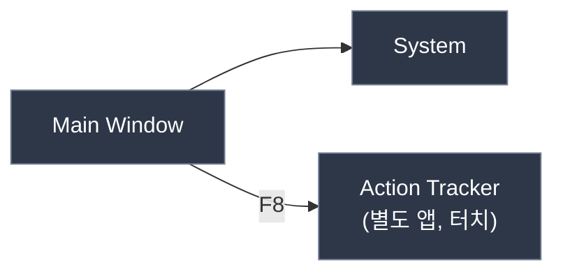
```mermaid
flowchart LR
    classDef default fill:#2d3748,stroke:#718096,color:#ffffff
    MW["Main Window"] --> SYS["System"]
    MW -->|"F8"| AT["Action Tracker<br/>(별도 앱, 터치)"]
```

#### Step 9: Skin Editor / Graphic Editor — 에필로그

지금까지의 모든 그래픽에는 "외관"이 있다 — 색상, 폰트, 카드 이미지, 애니메이션. 이것을 스킨이라고 부르며, 방송 전날 또는 며칠 전에 미리 만들어둔다. 본방송 중에는 건드리지 않는 사전 작업이므로 탭이 아니라 **Skin Editor**(별도 창)로 분리된다. **Graphic Editor**는 Skin Editor에서 개별 요소를 클릭하면 열리는 하위 작업 창이다.

```mermaid
flowchart LR
    classDef default fill:#2d3748,stroke:#718096,color:#ffffff
    MW["Main Window"] --> SYS["System"]
    MW --> SRC["Sources"]
    MW --> OUT["Outputs"]
    MW --> GFX1["GFX 1"]
    MW --> GFX2["GFX 2"]
    MW --> GFX3["GFX 3"]
    SYS -->|"Y-09"| TDG["Table Diagnostics"]
    MW -->|"Skin"| SKE["Skin Editor<br/>(별도 창)"]
    SKE -->|"요소 클릭"| GRE["Graphic Editor<br/>(별도 창)"]
    MW -->|"F8"| AT["Action Tracker<br/>(별도 앱)"]
```

8단계를 거쳐 완성된 최종 다이어그램이 EBS의 전체 네비게이션 맵이다. 운영자의 하루는 이 맵의 바깥(Skin Editor)에서 시작하여, 안쪽(6개 탭 설정)을 거쳐, Action Tracker에서 끝난다.

##### PokerGFX 원본

**원본 캡쳐**

**오버레이 분석본**

별도 창으로 열리는 스킨 편집기. 37개 UI 요소로 구성. 스킨 정보, 요소 버튼, 텍스트/카드/플레이어/국기 설정, Import/Export 기능.

| # | 기능명 | 설명 | EBS 복제 |
|:-:|--------|------|:--------:|
| 1 | Name | 스킨 이름 입력 필드 | P1 |
| 2 | Details | 스킨 설명 텍스트 | P1 |
| 3 | Remove Transparency | 크로마키 투명도 제거 체크박스 | P1 |
| 4 | 4K Design | 4K 기준 디자인 체크박스 | P1 |
| 5 | Adjust Size | 크기 조정 슬라이더 | P2 |
| 6 | Strip | 요소 버튼 — Strip 편집 (Graphic Editor 실행) | P1 |
| 7 | Board | 요소 버튼 — Board 편집 | P1 |
| 8 | Blinds | 요소 버튼 — Blinds 편집 | P1 |
| 9 | Outs | 요소 버튼 — Outs 편집 | P1 |
| 10 | Hand History | 요소 버튼 — Hand History 편집 | P1 |
| 11 | Action Clock | 요소 버튼 — Action Clock 편집 | P1 |
| 12 | Leaderboard | 요소 버튼 — Leaderboard 편집 | P1 |
| 13 | Split Screen | 요소 버튼 — Split Screen 편집 | P1 |
| 14 | Ticker | 요소 버튼 — Ticker 편집 | P1 |
| 15 | Field | 요소 버튼 — Field 편집 | P1 |
| 16 | Text All Caps | 대문자 변환 체크박스 | P1 |
| 17 | Text Reveal Speed | 텍스트 등장 속도 | P1 |
| 18 | Font 1 | 1차 폰트 선택 | P1 |
| 19 | Font 2 | 2차 폰트 선택 | P1 |
| 20 | Language | 다국어 설정 드롭다운 | P1 |
| 21 | Card display | 4수트 + 뒷면 카드 미리보기 | P1 |
| 22 | Add/Replace/Delete | 카드 이미지 관리 버튼 | P1 |
| 23 | Import Card Back | 뒷면 이미지 가져오기 | P1 |
| 24 | Country flag | 국기 모드 드롭다운 | P2 |
| 25 | Edit Flags | 국기 이미지 편집 | P2 |
| 26 | Hide flag after | 국기 자동 숨김 시간 (초) | P2 |
| 27 | Variant | 게임 타입 선택 드롭다운 | P1 |
| 28 | Player Set | 게임별 플레이어 세트 | P1 |
| 29 | Override Card Set | 카드 세트 오버라이드 체크박스 | P1 |
| 30 | Edit/New/Delete | 플레이어 세트 관리 버튼 | P1 |
| 31 | Crop to circle | 원형 크롭 체크박스 | P1 |
| 32 | Import | 스킨 가져오기 버튼 | P1 |
| 33 | Export | 스킨 내보내기 버튼 | P1 |
| 34 | Skin Download Centre | 온라인 다운로드 버튼 | P2 |
| 35 | Reset to Default | 기본 초기화 버튼 | P1 |
| 36 | Discard | 변경 취소 버튼 | P1 |
| 37 | Use | 현재 적용 버튼 | P1 |

> **설계 시사점**
> - 국기 관련 3개(24~26번)가 카드/플레이어 설정 사이에 끼어 흐름이 단절됨 → EBS에서 P2로 통합
> - 에디터 계층(GFX → Skin → Graphic)이 자연스러운 깊이 구조를 형성 → EBS 계승
> - Import/Export/Download(32~34번)는 팀 간 공유 자산 관리에 필수 → EBS 유지

##### EBS 설계본

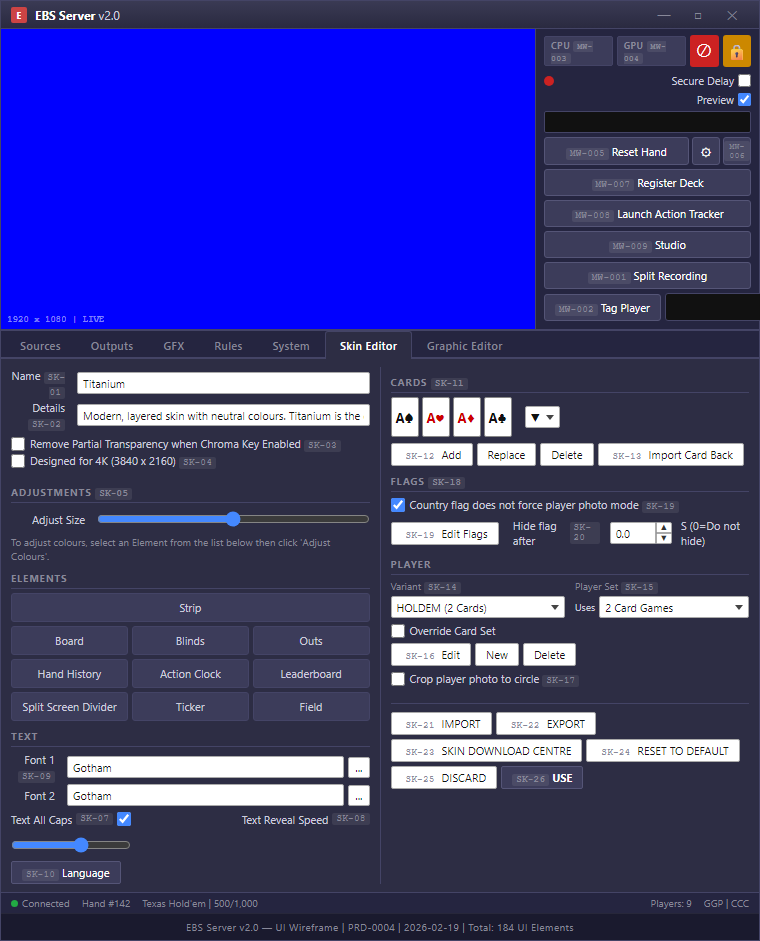

##### 설계 스펙

**변환 요약**: PokerGFX 37개 → EBS 26개. 국기 관련 P2 통합, 에디터 계층(GFX → Skin → Graphic) 명시, 핵심 기능 유지.

Skin(방송 그래픽 테마) 편집. 색상, 폰트, 레이아웃을 변경하고 테마를 저장/불러오기.

###### 레이아웃

4구역: Skin Preview(상단) > Element Buttons(SK-06, 중상) > Settings(SK-01~SK-20) > Actions(SK-21~SK-26, 하단).

###### Element Catalog

| # | 그룹 | 요소 | 설명 | PGX | 우선순위 |
|:-:|------|------|------|:---:|:--------:|
| SK-01 | Info | Name | 스킨 이름 | #1 | P1 |
| SK-02 | Info | Details | 설명 텍스트 | #2 | P1 |
| SK-03 | Info | Remove Transparency | 크로마키 투명도 제거 | #3 | P1 |
| SK-04 | Info | 4K Design | 이 스킨이 4K(3840×2160) 기준으로 디자인되었음을 선언. 체크 시: Graphic Editor의 기준 좌표계가 3840×2160으로 전환됨. 미체크(기본): 기준 좌표계 1920×1080. O-01이 4K인데 SK-04 미체크 시 경고 표시(스킨 업스케일 적용됨). O-01이 1080p인데 SK-04 체크 시 경고 표시(스킨 다운스케일 적용됨). | #4 | P1 |
| SK-05 | Info | Adjust Size | 크기 슬라이더 | #5 | P2 |
| SK-06 | Elements | 10 Buttons | Strip~Field 각 요소 -> Graphic Editor | #6-15 | P1 |
| SK-07 | Text | All Caps | 대문자 변환 | #16 | P1 |
| SK-08 | Text | Reveal Speed | 텍스트 등장 속도 | #17 | P1 |
| SK-09 | Text | Font 1/2 | 1차/2차 폰트 | #18,19 | P1 |
| SK-10 | Text | Language | 다국어 설정 | #20 | P1 |
| SK-11 | Cards | Card Preview | 4수트 + 뒷면 미리보기 | #21 | P1 |
| SK-12 | Cards | Add/Replace/Delete | 카드 이미지 관리 | #22 | P1 |
| SK-13 | Cards | Import Card Back | 뒷면 이미지 | #23 | P1 |
| SK-14 | Player | Variant | 게임 타입 선택 | #27 | P1 |
| SK-15 | Player | Player Set | 게임별 세트 | #28 | P1 |
| SK-16 | Player | Edit/New/Delete | 세트 관리 | #30 | P1 |
| SK-17 | Player | Crop to Circle | 원형 크롭 | #31 | P1 |
| SK-18 | Player | Country Flag | 국기 모드 | #24 | P2 |
| SK-19 | Player | Edit Flags | 국기 이미지 편집 | #25 | P2 |
| SK-20 | Player | Hide Flag After | 자동 숨김 (초) | #26 | P2 |
| SK-21 | Actions | Import | 스킨 가져오기 | #32 | P1 |
| SK-22 | Actions | Export | 스킨 내보내기 | #33 | P1 |
| SK-23 | Actions | Download | 온라인 다운로드 | #34 | P2 |
| SK-24 | Actions | Reset | 기본 초기화 | #35 | P1 |
| SK-25 | Actions | Discard | 변경 취소 | #36 | P1 |
| SK-26 | Actions | Use | 현재 적용 | #37 | P1 |

##### PokerGFX 원본

PokerGFX의 Graphic Editor는 Board 모드(39개)와 Player 모드(48개)로 분리되어 있었다. 공통 기능(Position, Animation, Text, Background)이 60% 이상 중복.

**Board 모드** (39개 요소)

**원본 캡쳐**

**오버레이 분석본**

Graphic Editor Board: 별도 창으로 열리는 요소 편집기 (Board 모드). 39개 UI 요소로 구성.

| # | 기능명 | 설명 | EBS 복제 |
|:-:|--------|------|:--------:|
| 1 | Layout Size | 레이아웃 크기 설정 | P1 |
| 2 | Import Image | 이미지 가져오기 버튼 | P1 |
| 3 | AT Mode | Action Tracker 모드 체크박스 | P1 |
| 4 | Element dropdown | 편집 대상 요소 선택 드롭다운 | P1 |
| 5 | Left | 요소 X 좌표 (Left) | P1 |
| 6 | Anchor (H) | 수평 앵커 포인트 | P1 |
| 7 | Top | 요소 Y 좌표 (Top) | P1 |
| 8 | Anchor (V) | 수직 앵커 포인트 | P1 |
| 9 | Width | 요소 너비 | P1 |
| 10 | Z | Z-order 레이어 겹침 순서 | P1 |
| 11 | Height | 요소 높이 | P1 |
| 12 | Angle | 요소 회전 각도 | P1 |
| 13 | AnimIn Type | 등장 애니메이션 타입 | P1 |
| 14 | AnimIn Speed | 등장 애니메이션 속도 | P1 |
| 15 | AnimIn Delay | 등장 애니메이션 딜레이 | P1 |
| 16 | AnimOut Type | 퇴장 애니메이션 타입 | P1 |
| 17 | AnimOut Speed | 퇴장 애니메이션 속도 | P1 |
| 18 | AnimOut Delay | 퇴장 애니메이션 딜레이 | P1 |
| 19 | Transition In | 등장 트랜지션 (Pop/Expand/Slide) | P1 |
| 20 | Transition Out | 퇴장 트랜지션 | P1 |
| 21 | Font | 폰트 선택 | P1 |
| 22 | Font Size | 폰트 크기 | P1 |
| 23 | Font Colour | 폰트 색상 | P1 |
| 24 | Text Alignment | 텍스트 정렬 | P1 |
| 25 | Highlight Colour | 강조 색상 | P1 |
| 26 | Text Style | 텍스트 스타일 (Bold/Italic) | P1 |
| 27 | Shadow Enable | 그림자 활성화 체크박스 | P1 |
| 28 | Shadow Offset | 그림자 오프셋 | P1 |
| 29 | Shadow Colour | 그림자 색상 | P1 |
| 30 | Rounded corners | 둥근 모서리 설정 | P1 |
| 31 | Margin H | 수평 마진 | P1 |
| 32 | Margin V | 수직 마진 | P1 |
| 33 | Adjust Colours | 색상 조정 버튼 | P1 |
| 34 | Background Enable | 배경 활성화 체크박스 | P1 |
| 35 | Background Image | 배경 이미지 선택 | P1 |
| 36 | Language trigger | 언어 기반 트리거 | P1 |
| 37 | OK | 확인 버튼 | P1 |
| 38 | Cancel | 취소 버튼 | P1 |
| 39 | Live Preview | 하단 실시간 프리뷰 영역 | P1 |

**Player 모드** (48개 요소)

**원본 캡쳐**

**오버레이 분석본**

Graphic Editor Player: 별도 창으로 열리는 요소 편집기 (Player 모드). 40개 숫자 박스 + A~H 알파 레이블 = 48개 UI 요소로 구성.

**숫자 박스 (1-40)**

| # | 기능명 | 설명 | EBS 복제 |
|:-:|--------|------|:--------:|
| 1 | Player Set | 플레이어 세트 선택 드롭다운 | P1 |
| 2 | Layout Size | 레이아웃 크기 설정 | P1 |
| 3 | Import Image | 이미지 가져오기 버튼 | P1 |
| 4 | AT Mode | Action Tracker 모드 체크박스 | P1 |
| 5 | Element dropdown | 편집 대상 요소 선택 드롭다운 | P1 |
| 6 | Left | 요소 X 좌표 (Left) | P1 |
| 7 | Anchor (H) | 수평 앵커 포인트 | P1 |
| 8 | Top | 요소 Y 좌표 (Top) | P1 |
| 9 | Anchor (V) | 수직 앵커 포인트 | P1 |
| 10 | Width | 요소 너비 | P1 |
| 11 | Z | Z-order 레이어 겹침 순서 | P1 |
| 12 | Height | 요소 높이 | P1 |
| 13 | Angle | 요소 회전 각도 | P1 |
| 14 | AnimIn Type | 등장 애니메이션 타입 | P1 |
| 15 | AnimIn Speed | 등장 애니메이션 속도 | P1 |
| 16 | AnimIn Delay | 등장 애니메이션 딜레이 | P1 |
| 17 | AnimOut Type | 퇴장 애니메이션 타입 | P1 |
| 18 | AnimOut Speed | 퇴장 애니메이션 속도 | P1 |
| 19 | AnimOut Delay | 퇴장 애니메이션 딜레이 | P1 |
| 20 | Transition In | 등장 트랜지션 | P1 |
| 21 | Transition Out | 퇴장 트랜지션 | P1 |
| 22 | Font | 폰트 선택 | P1 |
| 23 | Font Size | 폰트 크기 | P1 |
| 24 | Font Colour | 폰트 색상 | P1 |
| 25 | Text Alignment | 텍스트 정렬 | P1 |
| 26 | Highlight Colour | 강조 색상 | P1 |
| 27 | Text Style | 텍스트 스타일 | P1 |
| 28 | Shadow Enable | 그림자 활성화 | P1 |
| 29 | Shadow Offset | 그림자 오프셋 | P1 |
| 30 | Shadow Colour | 그림자 색상 | P1 |
| 31 | Rounded corners | 둥근 모서리 | P1 |
| 32 | Margin H | 수평 마진 | P1 |
| 33 | Margin V | 수직 마진 | P1 |
| 34 | Adjust Colours | 색상 조정 | P1 |
| 35 | Background Enable | 배경 활성화 | P1 |
| 36 | Background Image | 배경 이미지 | P1 |
| 37 | Language trigger | 언어 트리거 | P1 |
| 38 | OK | 확인 버튼 | P1 |
| 39 | Cancel | 취소 버튼 | P1 |
| 40 | Live Preview | 하단 실시간 프리뷰 영역 | P1 |

**알파 레이블 (A-H) — Player Overlay 요소**

| # | 기능명 | 설명 | EBS 복제 |
|:-:|--------|------|:--------:|
| A | Photo | 플레이어 프로필 사진 오버레이 | P1 |
| B | Cards | 홀카드 오버레이 | P0 |
| C | Name | 플레이어 이름 오버레이 | P0 |
| D | Flag | 국적 국기 오버레이 | P2 |
| E | Equity | 승률 오버레이 | P0 |
| F | Action | 최근 액션 오버레이 | P0 |
| G | Stack | 칩 스택 오버레이 | P0 |
| H | Position | 포지션 (D/SB/BB) 오버레이 | P0 |

##### EBS 설계본

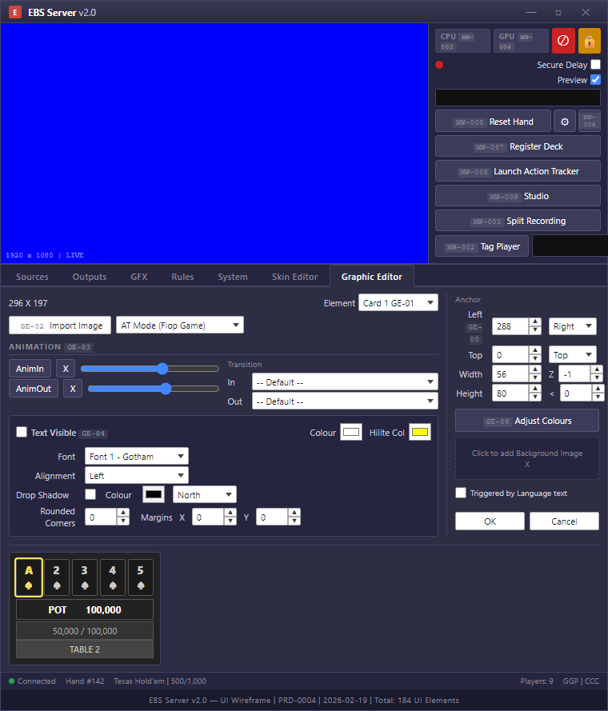

##### 설계 스펙

###### 분석

> **설계 시사점**
> - Board(39개) + Player(48개) = 87개 요소 중 공통 기능이 60% 이상 중복됨
> - Position(LTWH), Animation In/Out, Text, Background는 동일한 조작 패턴
> - 두 에디터를 분리할 이유가 기능적으로 없음 → 단일 에디터 + 모드 전환으로 통합

**변환 요약**: PokerGFX 87개(Board 39 + Player 48) → EBS 18개(공통 10 + Player 전용 8). Board/Player 단일 에디터로 통합, 동일한 조작 패턴 유지하면서 대상만 전환.

Skin Editor에서 선택한 특정 요소(Board, Player, Card 등)의 위치, 크기, 색상, 효과를 픽셀 단위로 편집.

###### Element Catalog

###### Board/공통 편집 기능 (10개)

| 기능 | 설명 |
|------|------|
| Element 선택 | 드롭다운으로 편집 대상 선택 |
| Position (LTWH) | Left/Top/Width/Height. 단위: Design Resolution(SK-04에 따라 1920×1080 또는 3840×2160) 기준 픽셀 정수값. 예: L=100, T=50, W=400, H=200. 출력 해상도 변경 시 스케일 팩터가 자동 적용되므로 운영자가 직접 수정하지 않아도 됨. |
| Anchor | 해상도 변경 시 요소의 기준점. 옵션: TopLeft / TopRight / BottomLeft / BottomRight / Center / TopCenter / BottomCenter. 예: TopRight 앵커 → 해상도 변경 시 오른쪽 상단 기준으로 위치 유지. 기본값: TopLeft. PokerGFX renderer Anchor 개념과 동일. |
| Coordinate Display | 현재 출력 해상도 기준 실제 픽셀값 미리보기 (읽기 전용). 예: Design Resolution(1920×1080) L=100 → 4K(3840×2160) 출력 시 실제 L=200 표시. 편집은 Design Resolution 기준값으로만 가능. |
| Z-order | 레이어 겹침 순서 |
| Angle | 요소 회전 |
| Animation In/Out | 등장/퇴장 + 속도 슬라이더 |
| Transition | Default/Pop/Expand/Slide |
| Text | 폰트, 색상, 강조색, 정렬, 그림자 |
| Background Image | 요소 배경 |
| Live Preview | 하단 실시간 프리뷰 |

###### Player Overlay 요소 (8개)

| 코드 | 요소 | 설명 | 우선순위 |
|:----:|------|------|:--------:|
| A | Player Photo | 프로필 이미지 | P1 |
| B | Hole Cards | 홀카드 2~5장 | P0 |
| C | Name | 플레이어 이름 | P0 |
| D | Country Flag | 국적 국기 | P2 |
| E | Equity % | 승률 | P0 |
| F | Action | 최근 액션 | P0 |
| G | Stack | 칩 스택 | P0 |
| H | Position | 포지션 (D/SB/BB) | P0 |

### 1.2 화면 역할 한눈에 보기

| 화면 | 역할 | 주 사용 시점 |
|------|------|-------------|
| Main Window | 시스템 모니터링 + 긴급 조작 | 항상 (본방송 중 15% 주의력) |
| System 탭 | RFID, AT 연결, 시스템 진단 | 준비 단계 + 비상 대응 |
| Sources 탭 | 비디오/오디오 입력 장치 설정 | 준비 단계 |
| Outputs 탭 | 출력 파이프라인 설정 (해상도, 장치, 녹화, 스트리밍) | 준비 단계 |
| GFX 1 탭 | 그래픽 레이아웃 & 연출 (배치, 카드 공개, 스킨) | 준비 단계 + 핸드 간 조정 |
| GFX 2 탭 | 표시 설정 & 규칙 (리더보드, Equity, 게임 규칙) | 준비 단계 |
| GFX 3 탭 | 수치 형식 (통화, 정밀도, BB 모드) | 준비 단계 |
| Skin Editor | 방송 그래픽 테마 편집 | 사전 준비 |
| Graphic Editor | 개별 요소 픽셀 단위 편집 | 사전 준비 |
| **Action Tracker** | **실시간 게임 진행 입력** | **본방송 (85% 주의력)** |

### 1.3 설계 원칙

| 원칙 | UI 반영 |
|------|---------|
| 운영자 중심 설계 (라이브 중 인지 부하 최소화) | 액션 버튼, 단축키 |
| 검증된 레이아웃 계승 (PokerGFX 2-column 유지) | Preview(좌) + Control(우) |
| EBS 재정의 탭 순서 | System(1번째), Sources(2번째), Outputs(3번째), GFX1(4번째), GFX2(5번째), GFX3(6번째) |

### 1.4 공통 레이아웃

모든 탭이 공유하는 구조: Title Bar > Preview Panel(좌, 16:9 Chroma Key) + Status/액션 버튼(우) > Tab Navigation > Tab Content Area.

#### 해상도 적응 원칙

EBS Server UI는 다양한 모니터 환경(SD~4K)과 다양한 출력 해상도(480p~4K)를 지원한다.

**Design Resolution vs Output Resolution**

| 개념 | 정의 | 설정 위치 |
|------|------|----------|
| Design Resolution | Graphic Editor에서 좌표를 입력하는 기준 해상도. SK-04(4K Design) 설정에 따라 1920×1080 또는 3840×2160 | 8장 SK-04 |
| Output Resolution | 실제 방송 송출 해상도. O-01(Video Size)에서 설정 | 4장 O-01 |
| Preview Scaling | UI 내 Preview Panel이 출력 해상도 비율을 유지하며 UI 공간에 맞게 표시되는 방식 | 2장 M-02 |

**앱 윈도우 크기 정책**

- 최소 앱 윈도우: 1280×720 (이하에서는 스크롤 발생)
- 최대: 운영자 모니터 크기에 따라 가변
- Preview(좌) : Control(우) 기본 비율 = 6:4
- 고해상도(4K) 모니터에서 앱 윈도우 크기: OS DPI 스케일링을 따름 (앱 자체 DPI 처리 없음)

**좌표 시스템 원칙**

- Graphic Editor의 모든 위치/크기 값(LTWH)은 Design Resolution 기준 픽셀 단위
- GFX 마진(G-03~G-05)은 정규화 좌표(0.0~1.0) 사용 (% 표시)
- 출력 해상도 변경 시 기준 픽셀값에 스케일 팩터가 자동 적용됨 (운영자 수동 조정 불필요)

## Commentary 탭 — 배제 근거

### PokerGFX 원본

PokerGFX에서 Commentary 탭은 해설자 전용 정보 표시 영역을 제어한다. 8개 요소(SV-021 Commentary ON/OFF, SV-022 Commentator Name 등)로 구성되며, 방송 화면에 해설자 이름과 관련 정보를 오버레이한다.

> **배제 판단 근거**
> - 기존 프로덕션에서 Commentary 기능을 사용한 적이 없음 — 해설자 정보는 별도 그래픽 소스로 처리
> - 8개 요소 전체가 P3(불필요)로 분류됨
> - 기능을 복제하더라도 운영 워크플로우에 투입될 가능성이 없음
> - Phase 1 복제 범위에서 제외하여 개발 리소스를 핵심 기능(P0/P1)에 집중

### 결정

**EBS에서 완전 배제.** PokerGFX 268개 요소 중 Commentary 8개를 제거한 것이 EBS 182개로의 감축(-86)에 기여하는 첫 번째 요인이다. (M-17/M-18 Drop 확정으로 184개→182개 추가 감축) 향후 해설자 오버레이가 필요해질 경우 GFX-Visual 서브탭의 확장으로 대응 가능하며, 별도 탭 부활은 계획하지 않는다.

---

## 10장: Action Tracker (별도 앱)

Action Tracker는 GfxServer와는 별도의 독립 앱으로, **본방송 중 운영자 주의력의 85%**를 차지한다.

> **구현 요구사항 문서**: [PRD-AT-001: EBS Action Tracker](../../docs/00-prd/action-tracker.prd.md) — 26개 기능 요구사항, Flutter Desktop 아키텍처, 키보드 중심 입력 설계, 68개 프로토콜 매핑 포함.

### 10.1 AT의 역할

실시간 게임 진행 입력 장치. 베팅 금액, New Hand, Showdown 등 모든 액션을 이 앱에서 입력한다.

### 10.2 GfxServer와의 상호작용 지점

| GfxServer 요소 | AT와의 관계 |
|---------------|------------|
| M-14 Launch AT | AT 앱 실행 (F8) |
| M-18 Connection Status | AT 연결 상태 표시 (WebSocket) |
| Y-01 RFID Status | AT로 RFID 데이터 전송 |
| Y-02 AT Connection | AT 연결 관리 |

---

## 부록

### A. UI 요소 전체 집계

**구현 우선순위 정의**:

| 우선순위 | 정의 | 기준 |
|:--------:|------|------|
| **P0** | 필수 | 없으면 방송이 불가능한 핵심 기능. MVP에 반드시 포함 |
| **P1** | 중요 | 방송은 가능하나 운영 효율/품질에 영향. 초기 배포 후 순차 추가 |
| **P2** | 부가 | 확장성, 편의성, 고급 기능. 시스템 안정화 후 추가 |

| 화면 | 요소 수 | P0 | P1 | P2 |
|------|:-------:|:--:|:--:|:--:|
| Main Window | 20 | 11 | 7 | 2 |
| Sources 탭 | 19 | 6 | 13 | 0 |
| Outputs 탭 | 20 | 8 | 4 | 8 |
| GFX - Layout | 13 | 2 | 8 | 3 |
| GFX - Visual | 12 | 4 | 8 | 0 |
| GFX - Display | 20 | 2 | 18 | 0 |
| GFX - Numbers | 12 | 5 | 7 | 0 |
| System 탭 | 24 | 7 | 11 | 6 |
| Skin Editor | 26 | 0 | 21 | 5 |
| Graphic Editor | 18 | 6 | 11 | 1 |
| **합계** | **184** | **51** | **108** | **25** |

### B. 전역 단축키

| 단축키 | 동작 | 맥락 |
|--------|------|------|
| `F5` | Reset Hand | 메인 |
| `F7` | Register Deck | 메인 |
| `F8` | Launch AT | 메인 |
| `F11` | Preview 전체 화면 | 메인 |
| `Ctrl+S` | 설정 저장 | 전역 |

### C. Feature Mapping (149개)

PokerGFX-Feature-Checklist.md의 149개 기능이 이 문서의 어느 요소에 대응하는지 전체 매핑한다.

**전체 커버리지: 147/149 (98.7%)**

#### 배제 기능 (2개)

| Feature ID | 기능 | 배제 사유 |
|:----------:|------|----------|
| SV-021 | Commentary 탭 (C-01~C-03) | **배제**: 기존 포커 방송 프로덕션에서 Commentary 탭을 사용하지 않으며, EBS Phase 1에서 복제하지 않음. |
| SV-022 | Commentary PIP (C-07) | **배제**: 동일 사유. |

#### GFX ID 크로스 레퍼런스

| PRD-0004 ID | Original PokerGFX ID | 기능 |
|:-----------:|:-------------------:|------|
| G-01 | G1-006 | Board Position |
| G-02 | G1-001 | Player Layout (10-seat) |
| G-14 | G1-004 | Reveal Players |
| G-16 | G1-022 | Transition In/Out |
| G-22 | G2-006 | Leaderboard |
| G-24 | G2-001~005 | Player Stats (VPIP/PFR) |
| G-37 | G1-008 | Hand Equities |
| G-40~G-42 | G1-009 | Outs Display |
| G-45 | G1-012 | Show Blinds |
| G-50 | G3-014 | Chipcount Precision |

#### Action Tracker (AT-001~AT-026, 26개)

AT는 별도 앱. GfxServer 상호작용 지점만 매핑한다.

| Feature ID | PRD 연결 지점 |
|:----------:|---------------|
| AT-001 | M-18 Connection Status (2장) |
| AT-002 | Y-01, Y-02 (7장) |
| AT-003~004 | O-15, O-16 (4장), M-15 (2장) |
| AT-005~006 | Game Engine, G-45 (5장) |
| AT-007 | M-17 (2장), G-46 (5장) |
| AT-008~010 | G-02, G-15, G-19, G-20 (5장) |
| AT-011 | Player Overlay H (9장) |
| AT-012~017 | Server GameState / AT 자체 UI |
| AT-018 | G-53 (4장 GFX Display) |
| AT-019~020 | RFID 자동 / AT 수동 |
| AT-021~026 | Display Domain, Hand History, Server, M-11 (2장) |

#### Pre-Start Setup (PS-001~PS-013, 13개)

| Feature ID | PRD 연결 지점 |
|:----------:|---------------|
| PS-001 | G-13 (5장 Layout) |
| PS-002 | Game Engine (내부) |
| PS-003 | G-50 (5장 Numbers) |
| PS-004~006 | Player Overlay C, G, H (9장) |
| PS-007 | M-05 (2장), Y-03~Y-07 (7장) |
| PS-008~009 | G-45 (4장 Numbers), G-55 (4장 GFX Display) |
| PS-010 | G-02 (5장 Layout) |
| PS-011~013 | Outputs Dual Board, M-14 (2장), RFID 자동 |

#### Viewer Overlay (VO-001~VO-014, 14개)

| Feature ID | PRD 연결 지점 |
|:----------:|---------------|
| VO-001, VO-004 | G-10~G-12 Sponsor Logo (5장) |
| VO-002, VO-003, VO-010 | G-45, G-50 (5장 Numbers) |
| VO-005 | G-14, G-16 (5장 Visual) |
| VO-006 | Player Overlay C, G (9장) |
| VO-007~008 | G-35, G-37 (5장 Display) |
| VO-009, VO-011 | G-01, G-13 (5장 Layout) |
| VO-012 | Game State Machine |
| VO-013~014 | G-19, G-20, G-15 (5장 Visual) |

#### GFX Console (GC-001~GC-025, 25개)

| Feature ID | PRD 연결 지점 |
|:----------:|---------------|
| GC-001~008 | G-24 Show Player Stats (5장) |
| GC-009~010, GC-013~016 | G-22 Leaderboard (5장) |
| GC-011~012 | G-36, G-28 (5장 Display) |
| GC-017 | Display Domain 제어 |
| GC-018~020 | Y-12 (7장), M-11 (2장) |
| GC-021 | G-43 Score Strip (5장) |
| GC-022~025 | M-03, M-04, M-02, M-12 (2장), SK-10 (8장) |

> **[DROP]** GC-019 (Print Report), GC-024 (다크/라이트 테마): ebs-console v1.0~v3.0 범위 외. 배제 확정.

#### Security (SEC-001~SEC-011, 11개)

| Feature ID | PRD 연결 지점 |
|:----------:|---------------|
| SEC-001, SEC-011 | O-08, O-09 (4장, 추후 개발) |
| SEC-002 | O-10 (4장, 추후 개발), M-10 (2장, 추후 개발) |
| SEC-003~004 | Live Canvas 내부 로직, M-02 (2장). Delay Canvas는 추후 개발 |
| SEC-006~008 | System RFID / 설정 영속화 |
| SEC-009 | M-18 Connection Status (2장) |

#### Equity & Stats (EQ-001~EQ-012, ST-001~ST-007, 19개)

| Feature ID | PRD 연결 지점 |
|:----------:|---------------|
| EQ-001~005, EQ-008 | G-37 Show Hand Equities (5장) |
| EQ-006~007 | G-40~G-42 Outs (5장 Numbers) |
| EQ-009~011 | Phase 2 / Game Engine |
| EQ-012 | G-38 Hilite Winning Hand (5장) |
| ST-001~007 | G-24 Show Player Stats (5장) |

> **[DROP]** ST-005 (누적 3Bet%): ebs-console v1.0~v3.0 범위 외. 배제 확정.

#### Hand History (HH-001~HH-011, 11개)

| Feature ID | PRD 연결 지점 |
|:----------:|---------------|
| HH-001~006 | Hand History DB (hands.db) |
| HH-007~008 | M-02 Preview 확장, 별도 다이얼로그 |
| HH-009~011 | Y-12 Export (7장), P2 기능 |

> **[DROP]** HH-011 (핸드 공유): 외부 서비스 연동 필요. ebs-console v1.0~v3.0 범위 외. 배제 확정.

#### Server 관리 (SV-001~SV-030, 30개)

대부분 직접 매핑. 주요 요소별 그룹:

| 그룹 | Feature ID | PRD 요소 |
|------|:----------:|----------|
| Sources (3장) | SV-001~005 | S-01, S-06, S-11~S-16 |
| Outputs (4장) | SV-006~011 | O-01~O-17 |

> **[DROP]** SV-011 (Twitch 연동): OBS에서 처리, EBS 범위 외. 배제 확정.
| GFX (5장) | SV-012~020 | G-01, G-02, G-10~G-12, G-17~G-21, G-47~G-51 |
| **배제** | SV-021~022 | ~~Commentary~~ |
| System (7장) | SV-023~026 | M-13, Y-04, Y-16, Y-23 |
| Editor (8-9장) | SV-027~029 | SK-01~SK-26, Graphic Editor |
| Main (2장) | SV-030 | M-14 Launch AT |

### D. Viewer Overlay 설계

시청자 방송 화면의 정보 계층: **1차**(홀카드, 승률) > **2차**(팟, 베팅, 보드) > **3차**(이벤트명, 블라인드, 로고). 이 계층이 요소의 크기, 위치, 색상 강도에 반영된다.

**현재 범위**: Live Canvas(현장용, Trustless Mode로 홀카드 관리). Delayed Canvas(방송용, 시간 지연 후 홀카드/승률 공개)는 추후 개발.

**게임 상태별**: Pre-Flop(홀카드+초기 승률) -> Flop(보드 3장+승률 재계산) -> Turn/River(승률 변동 강조) -> All-in(승률 바 확대) -> Showdown(Live에도 공개, 승자 하이라이트).

### E. 관련 문서 색인

[전체 기획서 (pokergfx-prd-v2.md)](../../ebs_reverse/docs/01-plan/pokergfx-prd-v2.md) | [기술 명세서 (PRD-0004-technical-specs.md)](PRD-0004-technical-specs.md) | [PokerGFX UI 분석](PokerGFX-UI-Analysis.md) | [Feature Checklist](PokerGFX-Feature-Checklist.md)

## Appendix A: 오버레이 오차율 분석

> 분석 도구: `tools/analyze_overlay_errors.py` | 원본 데이터: `docs/01_PokerGFX_Analysis/02_Annotated_ngd/*-ocr.json`

### A.1 화면별 오차율 요약

| 화면 | 박스 수 | Delta 적용 | OCR 인식 | Guard 위반 | 평균 δ | 최대 δ |
|------|:------:|:----------:|:--------:|:----------:|:------:|:------:|
| 01 메인 윈도우 | 10 | 10 (100%) | 1 (10%) | 0 (0%) | 7.8 px | 16 px |
| 02 Sources 탭 | 18 | 5 (28%) | 8 (44%) | 1 (20%) | 8.8 px | 15 px |
| 03 Outputs 탭 | 13 | 11 (85%) | 12 (92%) | 5 (45%) | 16.2 px | 20 px |
| 04 GFX 1 탭 | 29 | 14 (48%) | 27 (93%) | 1 (7%) | 11.2 px | 20 px |
| 05 GFX 2 탭 | 21 | 4 (19%) | 6 (29%) | 2 (50%) | 15.2 px | 26 px |
| 06 GFX3 탭 | 23 | 11 (48%) | 20 (87%) | 2 (18%) | 9.5 px | 20 px |
| 07 Commentary 탭 | 8 | 7 (88%) | 3 (38%) | 1 (14%) | 8.4 px | 15 px |
| 08 System 탭 | 28 | 21 (75%) | 20 (71%) | 5 (24%) | 13.6 px | 31 px |
| 09 Skin Editor | 37 | 28 (76%) | 17 (46%) | 2 (7%) | 9.5 px | 24 px |
| 10 Graphic Editor Board | 39 | 23 (59%) | 12 (31%) | 2 (9%) | 9.7 px | 40 px |
| 11 Graphic Editor Player | 48 | 22 (46%) | 13 (27%) | 2 (9%) | 9.2 px | 40 px |
| **전체** | **274** | **156 (56.9%)** | **139 (50.7%)** | **23 (14.7%)** | **10.6 px** | **40 px** |

### A.2 DELTA_GUARD 임계값 기준

| 컴포넌트 | 임계값 | 위반 조건 |
|---------|:------:|----------|
| dx (X 이동) | 20 px | abs(delta[0]) > 20 |
| dy (Y 이동) | 12 px | abs(delta[1]) > 12 |
| dw (너비 변화) | 25 px | abs(delta[2]) > 25 |
| dh (높이 변화) | 20 px | abs(delta[3]) > 20 |

> 출처: `tools/generate_annotations.py` DELTA_GUARD 상수 (line 43–48)

### A.3 Guard 위반 상세 (23건)

| 화면 | 박스 # | dx | dy | dw | dh | 위반 성분 |
|------|:------:|:--:|:--:|:--:|:--:|----------|
| 02 Sources 탭 | #12 | 7 | -15 | 1 | 7 | dy=-15 |
| 03 Outputs 탭 | #1 | -20 | -18 | 20 | -2 | dy=-18 |
| 03 Outputs 탭 | #2 | -5 | -18 | 5 | 5 | dy=-18 |
| 03 Outputs 탭 | #4 | 0 | 16 | 6 | -16 | dy=16 |
| 03 Outputs 탭 | #5 | 1 | 16 | -1 | -16 | dy=16 |
| 03 Outputs 탭 | #12 | -7 | 19 | 19 | -4 | dy=19 |
| 04 GFX 1 탭 | #10 | -7 | 20 | 8 | -19 | dy=20 |
| 05 GFX 2 탭 | #13 | -6 | 0 | 26 | 0 | dw=26 |
| 05 GFX 2 탭 | #15 | -6 | 0 | 26 | 0 | dw=26 |
| 06 GFX3 탭 | #13 | -17 | -13 | 9 | 12 | dy=-13 |
| 06 GFX3 탭 | #21 | -6 | -20 | 7 | 4 | dy=-20 |
| 07 Commentary 탭 | #2 | -7 | -15 | 8 | 13 | dy=-15 |
| 08 System 탭 | #4 | -18 | -1 | 28 | 3 | dw=28 |
| 08 System 탭 | #6 | -5 | -14 | 14 | 22 | dy=-14, dh=22 |
| 08 System 탭 | #8 | -17 | -4 | 31 | -14 | dw=31 |
| 08 System 탭 | #16 | -7 | -17 | -9 | 5 | dy=-17 |
| 08 System 탭 | #28 | 0 | -7 | -12 | 22 | dh=22 |
| 09 Skin Editor | #5 | -5 | -19 | -14 | 9 | dy=-19 |
| 09 Skin Editor | #31 | 0 | -9 | -6 | 24 | dh=24 |
| 10 Graphic Editor Board | #31 | 20 | 0 | -40 | 0 | dw=-40 |
| 10 Graphic Editor Board | #34 | 1 | 14 | -3 | -15 | dy=14 |
| 11 Graphic Editor Player | #32 | 20 | 0 | -40 | 0 | dw=-40 |
| 11 Graphic Editor Player | #35 | 1 | 14 | -3 | -15 | dy=14 |

### A.4 해석 지침

| Guard 위반 수준 | 의미 | 대응 방침 |
|----------------|------|----------|
| 0건 | 오버레이 정확 | 해당 화면 박스 신뢰 |
| 1–2건 (< 20%) | 부분 오차, 수용 가능 | 위반 박스만 수동 검토 |
| 3–5건 (20–45%) | 오버레이 재조정 권장 | 해당 화면 OCR 재실행 |
| 5건 이상 (> 45%) | 오버레이 신뢰 불가 | 박스 정의 전면 재검토 |

> **현황**: 03 Outputs 탭 (5건, 45%), 08 System 탭 (5건, 24%)이 고위험군. 해당 화면 박스 정의 재검토 권장.

---

## v1.0 스코프 요약 (2026-02-23 확정)

> **기준 문서**: [ebs-console.prd.md](../00-prd/ebs-console.prd.md) | [ebs-console-feature-triage.md](ebs-console-feature-triage.md)

| 버전 | 목표 | 기능 수 |
|------|------|:------:|
| **v1.0 Broadcast Ready** | EBS console 단독 라이브 방송 1회 성공 | 66개 |
| v2.0 Operational Excellence | 통계·분석·방송 품질 고도화 | 62개 |
| v3.0 EBS Native | RFID 자동 인식 + WSOP LIVE DB 연동 | 9개 |

### Drop 확정 (12개)

| ID | 기능 | 배제 사유 |
|----|------|----------|
| GC-019 | Print Report | 방송 운영과 무관한 오프라인 기능 |
| GC-022 | 시스템 상태 | CPU/메모리 모니터링 — 방송과 무관 |
| GC-024 | 다크/라이트 테마 | 단일 다크 테마 고정 |
| EQ-009 | 핸드 레인지 인식 | 고급 AI 분석 — EBS 범위 외 |
| EQ-011 | Short Deck Equity | 특수 게임타입 — 개발 ROI 불충분 |
| ST-005 | 누적 3Bet% | 고급 통계 누적 집계 — 우선순위 최하위 |
| HH-004 | 팟 사이즈 필터 | 분석용 고급 필터 — v1.0 범위 외 |
| HH-011 | 핸드 공유 | 외부 서비스 연동 필요, EBS 범위 외 |
| SV-010 | 9x16 Vertical | 쇼츠/모바일용 — EBS 방송 범위 외 |
| SV-011 | Twitch 연동 | OBS에서 처리, EBS 범위 외 |
| SV-021 | Commentary Mode | 기존 배제 확정 (운영팀 미사용) |
| SV-022 | PIP (Commentary) | SV-021 전제 — 기존 배제 |
| SV-030 | Split Recording | 편집 워크플로우 — 기존 배제 |

> **본 문서의 UI 설계는 v1.0 Keep 66개 기능을 우선 기술한다.** Drop 기능은 해당 섹션에 `[DROP]`으로 표기.

---

## 변경 이력

| 버전 | 날짜 | 변경 내용 |
|------|------|----------|
| v1.0~v4.1 | 2026-02-16 | 초기 작성 -> 인과적 PRD -> UX 프로세스 -> Fill & Key 재설계 -> 와이어프레임 |
| v5.0~v6.0 | 2026-02-16 | Hub-and-Spoke 분리, Commentary 배제, P0/P1/P2 정의 |
| v7.0~v7.2 | 2026-02-17 | 인터페이스 설계서 전면 재설계, 정합성 검증, AT 입력 수정 |
| v8.0~v9.0 | 2026-02-17 | 앱 생태계 재설계, 기획서/기술 명세서 2문서 분리 |
| v10.0~v12.0 | 2026-02-18 | UI 전용 병합, 목업 중심 리팩토링, 역설계 분석 병합 |
| **v13.0.0** | **2026-02-18** | **전면 재설계**: Hub + Screen Specs + Feature Mapping 3개 문서를 단일 통합 문서로 병합. 화면별 섹션에 Design Decisions, Workflow, Element Catalog (전체), Interaction Patterns, Navigation을 자기 완결적으로 포함. PRD-0004-screen-specs.md, PRD-0004-screens/ 디렉토리, PRD-0004-feature-mapping.md 폐기. |
| **v14.0.0** | **2026-02-18** | **내러티브 재설계**: 화면별 "PokerGFX 원본 → 오버레이 분석 → EBS 설계" 3단계 인과 구조 도입. 프롤로그(이 문서의 접근법), 1.3 구조 변환 요약표, Commentary 배제 근거, 전 화면 원본/분석/설계 삼중 섹션 추가. 기존 Element Catalog·Interaction Patterns·Navigation 전량 보존. |
| **v15.0.0** | **2026-02-18** | **해상도 적응형 레이아웃 재설계**: 1.5절 해상도 적응 원칙 추가(Design/Output/Preview 개념 정의, 앱 윈도우 크기 정책, 좌표 시스템 원칙). M-02 Preview Panel 해상도 스케일링 스펙 추가. O-01 해상도 변경 7단계 처리 체인 정의. 5.7절 GFX 좌표계 원칙 블록 추가(정규화 좌표 vs 기준 픽셀 단위 체계 명시). SK-04 4K Design 동작 정의(기준 좌표계 전환, 경고 조건) + 8.5 Design Decisions 항목 4 추가. 9.6절 Position(LTWH)/Anchor/Coordinate Display 해상도 독립적 좌표 시스템 재정의. |
| **v16.0.0** | **2026-02-19** | **Delay 이중 출력 추후 개발 처리**: 1.3 "PokerGFX → EBS 구조 변환" 섹션 제거 (1.4~1.6 → 1.3~1.5로 번호 재조정). Step 6 설명에서 Delay 제거 → Live 단일 출력 구조로 재기술. M-08/M-10 우선순위 P0 → Future. O-06~O-13 우선순위 → Future. 4.3~4.9 Outputs 탭 EBS 설계 전반에 "Delay는 추후 개발" 표기. SEC-001~005, SEC-010~011 매핑에 추후 개발 주석. Y-11 Secure Delay Folder Future 처리. Ctrl+D 단축키 추후 개발 표기. Viewer Overlay Dual Canvas 설명 재기술. |
| **v17.0.0** | **2026-02-19** | Secure Delay, Split Recording, Tag Player 제거. 2.3 EBS 설계 UI 설명 강화. |
| **v18.0.0** | **2026-02-20** | **1장+2~9장 완전 통합 구조 재편**: 2~9장을 Step 1~8 형식으로 1장에 흡수. 각 Step에 PokerGFX 원본(02_Annotated_ngd/) + EBS 설계본(images/mockups/) 이미지 이중 삽입. Step 1 Main Window 보완: M-07 Lock Toggle Element 추가, Workflow 시나리오 A/B/C 3개 추가, Interaction Patterns 6개로 확장(M-07/M-12/M-14/M-20 포함), 에러 상태 섹션 신규 추가, M-02 Full HD 주석 추가. 제외 기능 표현 "EBS MVP 범위 외 (추후 개발 예정)"으로 통일. Commentary 섹션 이미지 경로 정리(구형 스크린샷 제거). |
| **v19.0.0** | **2026-02-23** | **ebs-console.prd.md 동기화**: frontmatter depends_on에 ebs-console.prd.md, related_docs에 ebs-console-feature-triage.md 추가. v1.0 스코프 요약 섹션 신규 추가 (Drop 12개 목록 포함). Drop 확정 6개(GC-019, GC-024, ST-005, HH-011, SV-011) [DROP] 마킹 추가. |
| **v19.1.0** | **2026-02-23** | **Appendix A 추가**: 오버레이 오차율 분석 섹션 신규 삽입. 11개 화면 Guard 위반 상세(23건), DELTA_GUARD 임계값 기준, 해석 지침 포함. tools/analyze_overlay_errors.py 연동. |
| **v19.2.0** | **2026-02-23** | **Phase 1 복제 원칙 준수 — Rules 탭 폐지**: PokerGFX 원본에 존재하지 않는 독립 Rules 탭(Step 2) 제거. GFX 2 원본 요소 6개(#8 Move Button Bomb Pot, #9 Limit Raises, #10 Straddle Sleeper, #11 Sleeper Final Action, #14 Allow Rabbit Hunting, #21 Ignore Split Pots)를 GFX Display 서브탭(G-52~G-57)으로 복원. Step 번호 3→2, 4→3, 5→4, 6→5, 7→6, 8→7 재조정. Ctrl+4=System, Ctrl+5 제거. 전역 단축키 Ctrl+1~4로 축소. |
| **v19.3.0** | **2026-02-23** | **PokerGFX 소스 순서 전면 재설계**: Sources→Outputs→GFX1→GFX2→GFX3→System. GFX 합산탭(Layout/Visual/Display/Numbers) 폐지, GFX1/2/3 분리 탭 복원. System Ctrl+4→Ctrl+6. 탭 수 4→6. Step 수 7→8(Action Tracker Step 7→8, Skin Editor Step 7→9 재조정). |
| **v19.4.0** | **2026-02-24** | **v1.0 스코프 요약/Drop 확정 섹션 최하단 배치**: 문서 최상단에서 변경 이력 바로 앞으로 이동. |
| **v19.6.0** | **2026-02-24** | **EBS 설계본 해상도 변형 비교 추가**: 기존 자동 16:9 설계본(A) 아래에 고정 720×480 SD 변형 캡쳐(B) 추가. 두 이미지 배치 이유(플렉서블 단일 구현체, CSS 변수 런타임 스위칭) 설명 텍스트 삽입. |
| **v19.5.0** | **2026-02-24** | **M-17/M-18 Drop 확정 처리**: Hand Counter(M-17), Connection Status(M-18) Drop 마킹. Element Catalog 취소선+[DROP] 적용. 에러 상태 표 취소선 처리. Status Bar 설계 원칙 갱신. 레이아웃 기술에서 M-18 제거. 요소 카운트 184→182개. ebs-main-window.html Wireframe v1.7 반영 (Status Bar M-17/M-18 제거). ebs-main-window-720x480.html 신규 생성 (Preview 고정 720×480). |
| **v20.0.0** | **2026-02-25** | **탭 순서 재정의 및 단축키 제거**: System 탭을 첫 번째로 이동 (RFID/연결 확인이 준비의 출발점). Sources 탭을 두 번째로 이동. Ctrl+1~6 키보드 단축키 전체 제거 (설계 단계에서 단축키 미확정). 누적형 Mermaid 다이어그램 업데이트 (System→Sources→Outputs→GFX1→GFX2→GFX3 순서). Step 번호 재조정: Step 2=System, Step 3=Sources, Step 4=Outputs, Step 5=GFX1, Step 6=GFX2, Step 7=GFX3, Step 8=Action Tracker, Step 9=Skin Editor. Appendix B에서 Ctrl+1~4 탭 단축키 행 제거. |
| **v21.0.0** | **2026-02-26** | **매뉴얼 v3.2.0 공식 설명 통합**: M-05 RFID Status 3색→7색 확장. M-03/M-04/M-07 공식 설명 추가. S-*(14개), O-*(6개), G-*(15개), Y-*(18개) 요소 총 53개에 매뉴얼 원문 인용 추가. 참조: PokerGFX-Manual-v3.2.0-Element-Reference.md |
| **v21.1.0** | **2026-03-01** | **Element Catalog 전면 재설계**: annotation 이미지 6개 재생성에 따른 박스 넘버링 전면 갱신. System(28행), Skin Editor(37행), GE Board(39행), GE Player(48행) 원본 테이블 신규 추가. Sources 원본 테이블 12→18행 재작성 + PGX 열 전면 업데이트. Outputs #8/#9 수정. Main Window 라벨 수정 (#4, #5). Appendix A Sources 오차율 갱신. |

---

**Version**: 21.1.0 | **Updated**: 2026-03-01
