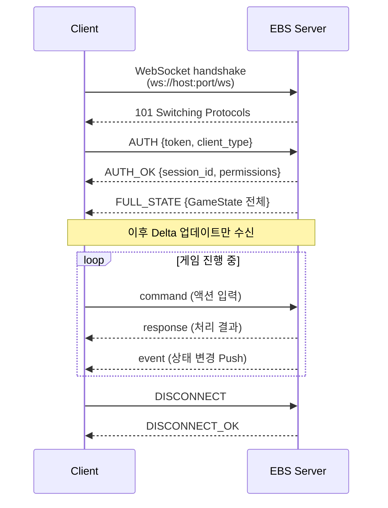

# PRD-0004: EBS Server API 계약서

> 이 문서는 EBS Server와 클라이언트 간의 API 계약을 정의한다.
> 시스템 개요와 UI 설계는 [기획서](../00-prd/EBS-UI-Design-v3.prd.md)를 먼저 읽어야 한다.
> 게임 엔진, GPU 파이프라인 등 기술 상세는 [기술 명세서](PRD-0004-technical-specs.md)를 참조한다.

---

## 1장: 통신 아키텍처 개요

> 이 장은 PokerGFX의 TCP 소켓 기반 통신을 EBS의 WebSocket 기반으로 전환하는 근거와 연결 흐름을 정의한다.

### 1.1 프로토콜 전환 근거

PokerGFX는 커스텀 TCP 소켓(포트 8888)으로 앱 간 통신을 수행한다. EBS v1.0은 WebSocket으로 전환한다.

| 기준 | PokerGFX (TCP) | EBS (WebSocket) |
|------|---------------|-----------------|
| 프로토콜 | Raw TCP + 바이너리 직렬화 | WebSocket (RFC 6455) + JSON |
| 방향성 | 양방향 (커스텀 구현) | 양방향 (프로토콜 내장) |
| 브라우저 지원 | 불가 (네이티브 전용) | 네이티브 지원 |
| 직렬화 | C# BinaryFormatter | JSON (사람이 읽을 수 있음) |
| 인증 | 접속 허용 플래그만 | Token 기반 handshake |
| 재연결 | 수동 구현 (KeepAlive) | 프로토콜 레벨 ping/pong + 자동 재연결 |

**전환 이유**: 브라우저 네이티브 지원(React 클라이언트), JSON 친화적 페이로드, 표준화된 양방향 실시간 통신.

### 1.2 연결 흐름

클라이언트(ActionTracker, 외부 시스템)가 EBS Server에 접속하는 표준 흐름이다.



### 1.3 연결 유형

EBS는 3가지 연결 유형을 지원한다. 각 유형은 권한과 메시지 범위가 다르다.

| 연결 유형 | PokerGFX 대응 | 역할 | 권한 |
|----------|--------------|------|------|
| **Control** | ActionTracker TCP | 게임 제어 (베팅, 카드, 좌석 관리) | 읽기 + 쓰기 (전체 command) |
| **Compute** | HandEvaluation DLL | 핸드 평가 요청/응답 | 읽기 + 계산 전용 |
| **Stream** | LiveApi / Pipcap | 외부 데이터 스트리밍, 모니터링 | 읽기 전용 (event 수신만) |

**Control 연결**: ActionTracker가 사용한다. 모든 command를 전송할 수 있으며, 게임 상태를 변경하는 유일한 경로이다.

**Compute 연결**: 핸드 평가 엔진이 사용한다. 승률 계산 요청을 받아 Monte Carlo 시뮬레이션 결과를 반환한다. 게임 상태를 직접 변경하지 않는다.

**Stream 연결**: 외부 시스템(멀티테이블 모니터, 데이터 수집기)이 사용한다. 이벤트를 수신만 하며 command를 전송할 수 없다.

### 1.4 연결 관리

| 항목 | 값 | 설명 |
|------|-----|------|
| Heartbeat 주기 | 5초 | ping/pong 프레임 |
| 연결 타임아웃 | 15초 | heartbeat 3회 누락 시 끊김 판정 |
| 자동 재연결 | 30초 | 끊김 감지 후 30초간 재연결 시도 |
| 최대 동시 연결 | 10 | Control 1 + Compute 1 + Stream 8 |
| 메시지 최대 크기 | 64 KB | GameState 전체 동기화 기준 |

---

## 2장: 서비스 영역 정의

> 이 장은 EBS Server API를 5개 서비스 영역으로 구분하고, 각 서비스의 책임과 EBS v1.0 구현 범위를 정의한다.

### 2.1 서비스 개요

PokerGFX의 99개 명령어는 5개 서비스 영역으로 분류된다. EBS v1.0은 이 구조를 유지하되, 각 서비스 내의 명령어를 Keep/Defer/Drop으로 분류한다.

| 서비스 | 주요 기능 | 명령어 수 | EBS v1.0 |
|--------|----------|:---------:|----------|
| **GameService** | 게임 시작/종료, 유형 전환, 정보 조회 | 22 | **Keep** — 핵심 게임 진행 |
| **PlayerService** | 좌석 등록/퇴장, 칩 관리, 통계 | 26 | **Keep** — 플레이어 관리 전체 |
| **CardService** | 카드 딜/공개/머크, 보드 관리, RFID 상태 | 12 | **Keep** — RFID 연동 핵심 |
| **DisplayService** | 오버레이 표시/숨김, 스킨 전환, 보안 모드 | 20 | **Keep (기본)** — 기본 오버레이만 |
| **MediaService** | 비디오/오디오, 로고/티커, 프레임 캡처 | 19 | **Defer (대부분)** — 필수 3개만 Keep |

### 2.2 GameService

게임 생명주기를 관리한다. 핸드 시작/종료, 게임 유형 전환, 상태 조회가 핵심이다.

| 책임 | 설명 |
|------|------|
| 핸드 생명주기 | START_HAND, RESET_HAND, HAND_COMPLETE |
| 게임 유형 관리 | 22개 game enum 전환, BetStructure 설정 |
| 베팅 제어 | PAYOUT, CHOP, MISS_DEAL |
| 상태 조회 | GAME_INFO (GameState 전체 반환) |
| 히스토리 | HAND_HISTORY (핸드 이력 조회) |

### 2.3 PlayerService

10개 좌석의 플레이어 상태를 관리한다.

| 책임 | 설명 |
|------|------|
| 좌석 관리 | PLAYER_ADD, PLAYER_DELETE, 좌석 번호 할당 |
| 칩 관리 | PLAYER_BET, 스택 갱신, 바이인/리바이인 |
| 통계 | 플레이어별 승/패/폴드 비율, 핸드 수 |
| 프로필 | 이름, 국가, 사진 경로 설정 |

### 2.4 CardService

RFID 카드 인식과 보드 카드 관리를 담당한다. EBS의 핵심 차별점인 RFID 자동 인식이 이 서비스에 집중된다.

| 책임 | 설명 |
|------|------|
| 카드 감지 | RFID 안테나 → UID → 카드 매핑 (자동) |
| 보드 관리 | BOARD_CARD (Flop/Turn/River 공개) |
| 검증 | CARD_VERIFY (중복/오류 검사) |
| 덱 등록 | 52장 UID 매핑 프로세스 |
| RFID 상태 | READER_STATUS (12개 안테나 상태 조회) |

### 2.5 DisplayService

오버레이 그래픽의 표시/숨김을 제어한다.

| 책임 | 설명 |
|------|------|
| 오버레이 전환 | GFX_ENABLE, GFX_DISABLE |
| 필드 가시성 | FIELD_VISIBILITY (개별 요소 표시/숨김) |
| 패널 제어 | SHOW_PANEL, HIDE_PANEL |
| 스킨 전환 | SKIN 로드/적용 |
| 보안 모드 | Trustless Mode 활성화/비활성화 |

### 2.6 MediaService

비디오/오디오 소스와 출력을 관리한다. EBS v1.0에서는 대부분 Defer이며, 필수 최소 기능만 Keep한다.

| 책임 | EBS v1.0 | 설명 |
|------|:--------:|------|
| NDI 소스 선택 | **Keep** | VIDEO_SOURCES 목록 조회/선택 |
| 출력 해상도 | **Keep** | 해상도 전환 (SD~4K) |
| 녹화 시작/중지 | **Keep** | 기본 녹화 기능 |
| PIP 삽입 | Defer | 멀티테이블 PIP |
| 로고/티커 | Defer | 방송 브랜딩 |
| 프레임 캡처 | Defer | 스크린샷 저장 |
| 오디오 믹싱 | Defer | 오디오 소스 관리 |

---

## 3장: WebSocket 메시지 스키마

> 이 장은 WebSocket 메시지의 공통 포맷과 99개 PokerGFX 명령어의 EBS v1.0 매핑을 정의한다.

### 3.1 메시지 포맷

모든 WebSocket 메시지는 아래 JSON 구조를 따른다.

```json
{
  "type": "command",
  "service": "game",
  "action": "start_hand",
  "payload": {},
  "timestamp": "2026-03-03T10:30:00.000Z",
  "request_id": "550e8400-e29b-41d4-a716-446655440000"
}
```

| 필드 | 타입 | 필수 | 설명 |
|------|------|:----:|------|
| type | string | O | `command` / `event` / `response` / `error` |
| service | string | O | `game` / `player` / `card` / `display` / `media` |
| action | string | O | 수행할 동작 (snake_case) |
| payload | object | O | 동작별 데이터 (빈 객체 허용) |
| timestamp | string | O | ISO 8601 형식 |
| request_id | string | 조건부 | command와 response에만 필수. event에는 없음 |

**type별 방향**:

| type | 방향 | 용도 |
|------|------|------|
| command | Client → Server | 클라이언트가 서버에 동작 요청 |
| response | Server → Client | command에 대한 처리 결과 |
| event | Server → Client(s) | 서버가 상태 변경을 Push |
| error | Server → Client | command 처리 실패 |

### 3.2 에러 응답 구조

```json
{
  "type": "error",
  "service": "game",
  "action": "start_hand",
  "payload": {
    "code": "HAND_IN_PROGRESS",
    "message": "이미 진행 중인 핸드가 있습니다",
    "details": {"hand_number": 42}
  },
  "timestamp": "2026-03-03T10:30:00.500Z",
  "request_id": "550e8400-e29b-41d4-a716-446655440000"
}
```

| 에러 코드 | HTTP 대응 | 설명 |
|-----------|:---------:|------|
| INVALID_PAYLOAD | 400 | 필수 필드 누락 또는 타입 불일치 |
| UNAUTHORIZED | 401 | 인증 실패 또는 권한 부족 |
| NOT_FOUND | 404 | 존재하지 않는 리소스 (좌석, 플레이어) |
| CONFLICT | 409 | 현재 상태와 충돌 (HAND_IN_PROGRESS 등) |
| INTERNAL_ERROR | 500 | 서버 내부 오류 |

### 3.3 99개 명령어 EBS v1.0 매핑

PokerGFX의 99개 명령어를 11개 카테고리로 분류하고, EBS v1.0에서의 처리를 정의한다.

| 카테고리 | 원본 수 | Keep | Defer | Drop | 비고 |
|----------|:-------:|:----:|:-----:|:----:|------|
| Connection | 9 | 5 | 2 | 2 | Slave 관련 Drop |
| Game | 13 | 10 | 2 | 1 | Commentary 관련 Drop |
| Player | 21 | 15 | 4 | 2 | 고급 통계 Defer |
| Cards & Board | 9 | 8 | 1 | 0 | 핵심 기능 전체 Keep |
| Display | 17 | 10 | 5 | 2 | 고급 레이아웃 Defer |
| Media & Camera | 13 | 3 | 7 | 3 | 대부분 Defer |
| Betting | 5 | 5 | 0 | 0 | 전체 Keep |
| Data Transfer | 3 | 2 | 1 | 0 | 핵심 동기화 Keep |
| RFID | 3 | 3 | 0 | 0 | 전체 Keep |
| History | 3 | 1 | 2 | 0 | 기본 이력만 Keep |
| Slave / Multi-GFX | 3 | 0 | 1 | 2 | 멀티 인스턴스 Drop |
| **합계** | **99** | **62** | **25** | **12** | |

### 3.4 핵심 명령어 JSON 예시

#### START_HAND (GameService)

핸드 시작을 요청한다. 게임 상태를 IDLE → SETUP_HAND로 전이시킨다.

```json
// command (Client → Server)
{
  "type": "command",
  "service": "game",
  "action": "start_hand",
  "payload": {
    "hand_number": 43,
    "dealer_seat": 3
  },
  "timestamp": "2026-03-03T10:31:00.000Z",
  "request_id": "a1b2c3d4-e5f6-7890-abcd-ef1234567890"
}

// response (Server → Client)
{
  "type": "response",
  "service": "game",
  "action": "start_hand",
  "payload": {
    "success": true,
    "hand_number": 43,
    "state": "SETUP_HAND"
  },
  "timestamp": "2026-03-03T10:31:00.050Z",
  "request_id": "a1b2c3d4-e5f6-7890-abcd-ef1234567890"
}
```

#### PLAYER_BET (PlayerService)

플레이어 베팅 액션을 기록한다.

```json
{
  "type": "command",
  "service": "player",
  "action": "player_bet",
  "payload": {
    "seat": 5,
    "action": "raise",
    "amount": 2400,
    "is_allin": false
  },
  "timestamp": "2026-03-03T10:32:15.000Z",
  "request_id": "b2c3d4e5-f6a7-8901-bcde-f12345678901"
}
```

#### BOARD_CARD (CardService)

보드 카드를 공개한다. RFID 자동 감지 또는 수동 입력으로 트리거된다.

```json
{
  "type": "command",
  "service": "card",
  "action": "board_card",
  "payload": {
    "cards": [
      {"suit": 3, "rank": 12, "display": "As"},
      {"suit": 2, "rank": 11, "display": "Kh"},
      {"suit": 0, "rank": 8, "display": "10c"}
    ],
    "street": "flop",
    "source": "rfid"
  },
  "timestamp": "2026-03-03T10:33:00.000Z",
  "request_id": "c3d4e5f6-a7b8-9012-cdef-123456789012"
}
```

#### GFX_ENABLE (DisplayService)

오버레이 출력을 활성화/비활성화한다.

```json
{
  "type": "command",
  "service": "display",
  "action": "gfx_enable",
  "payload": {
    "enabled": true,
    "channel": "live"
  },
  "timestamp": "2026-03-03T10:34:00.000Z",
  "request_id": "d4e5f6a7-b8c9-0123-defa-234567890123"
}
```

---

## 4장: 실시간 이벤트 스키마

> 이 장은 서버가 클라이언트에 Push하는 16개 실시간 이벤트의 트리거 조건, 페이로드, 수신자를 정의한다.

### 4.1 이벤트 목록

| # | 이벤트 | 서비스 | 트리거 | 수신자 |
|:-:|--------|--------|--------|--------|
| 1 | OnCardDetected | card | RFID 안테나 카드 감지 | Control, Stream |
| 2 | OnCardRemoved | card | RFID 안테나 카드 제거 | Control, Stream |
| 3 | OnBetAction | player | 베팅 액션 기록 완료 | Control, Stream |
| 4 | OnPotUpdated | game | 팟 금액 변경 | Control, Stream |
| 5 | OnHandComplete | game | 핸드 종료 + 위너 결정 | Control, Stream |
| 6 | OnGameStateChanged | game | 게임 상태 전이 | 전체 |
| 7 | OnPlayerAdded | player | 좌석에 플레이어 등록 | Control, Stream |
| 8 | OnPlayerRemoved | player | 좌석에서 플레이어 퇴장 | Control, Stream |
| 9 | OnChipsUpdated | player | 플레이어 칩 변경 (바이인/팟 분배) | Control, Stream |
| 10 | OnWinProbabilityUpdated | game | 승률 재계산 완료 | Stream |
| 11 | OnSkinChanged | display | 스킨 로드/전환 완료 | Control, Stream |
| 12 | OnOverlayToggled | display | 오버레이 표시/숨김 전환 | Control, Stream |
| 13 | OnSecurityModeChanged | display | Trustless Mode 전환 | Control |
| 14 | OnTimerStarted | game | Shot Clock 시작 | Control, Stream |
| 15 | OnTimerExpired | game | Shot Clock 만료 | Control, Stream |
| 16 | OnConnectionStatusChanged | system | 클라이언트 연결/해제 | Control |

### 4.2 핵심 이벤트 페이로드

#### OnCardDetected

RFID 안테나가 카드를 감지했을 때 발생한다. CardService의 핵심 이벤트이다.

```json
{
  "type": "event",
  "service": "card",
  "action": "card_detected",
  "payload": {
    "seat": 3,
    "cards": [
      {"suit": 3, "rank": 12, "display": "As", "uid": "04:A2:B3:C4:D5:E6:F7"}
    ],
    "antenna_id": 7,
    "source": "rfid"
  },
  "timestamp": "2026-03-03T10:35:00.000Z"
}
```

#### OnGameStateChanged

게임 상태 머신이 전이될 때 발생한다. 모든 연결 유형에 브로드캐스트된다.

```json
{
  "type": "event",
  "service": "game",
  "action": "game_state_changed",
  "payload": {
    "previous_state": "PRE_FLOP",
    "current_state": "FLOP",
    "hand_number": 43,
    "trigger": "board_card_detected"
  },
  "timestamp": "2026-03-03T10:36:00.000Z"
}
```

#### OnBetAction

베팅 액션이 기록되면 발생한다. AT에서 UI 갱신의 핵심 트리거이다.

```json
{
  "type": "event",
  "service": "player",
  "action": "bet_action",
  "payload": {
    "seat": 5,
    "player_name": "Player 5",
    "action": "raise",
    "amount": 2400,
    "pot_after": 5800,
    "is_allin": false,
    "action_on_next": 6
  },
  "timestamp": "2026-03-03T10:36:30.000Z"
}
```

#### OnHandComplete

핸드가 종료되고 위너가 결정되면 발생한다.

```json
{
  "type": "event",
  "service": "game",
  "action": "hand_complete",
  "payload": {
    "hand_number": 43,
    "winners": [
      {"seat": 3, "amount": 5800, "hand_rank": "Full House", "cards": ["As", "Ah", "Kh", "Ks", "Kd"]}
    ],
    "pots": [
      {"type": "main", "amount": 5800, "winners": [3]}
    ],
    "board": ["Kc", "7d", "2s", "Kh", "Ah"],
    "is_chopped": false
  },
  "timestamp": "2026-03-03T10:40:00.000Z"
}
```

#### OnWinProbabilityUpdated

Monte Carlo 시뮬레이션 결과가 갱신되면 Stream 연결에만 전송된다. Broadcast Canvas에서 승률 바를 갱신하는 데 사용된다.

```json
{
  "type": "event",
  "service": "game",
  "action": "win_probability_updated",
  "payload": {
    "street": "flop",
    "probabilities": [
      {"seat": 3, "equity": 0.72, "outs": 10},
      {"seat": 5, "equity": 0.28, "outs": 4}
    ],
    "simulation_count": 10000
  },
  "timestamp": "2026-03-03T10:37:00.000Z"
}
```

---

## 5장: GameState 단일 상태 메시지

> 이 장은 PokerGFX GameInfoResponse의 75+ 필드를 EBS JSON 구조로 재정의하고, 전체 동기화와 Delta 업데이트 패턴을 정의한다.

### 5.1 GameState 구조 개요

GameState는 서버의 전체 게임 상태를 단일 JSON 객체로 표현한다. 클라이언트 최초 연결 시 전체 동기화로 전송되며, 이후에는 변경된 필드만 Delta로 전송된다.

PokerGFX의 GameInfoResponse 75+ 필드를 9개 카테고리로 그룹핑한다.

### 5.2 카테고리별 필드 정의

#### 블라인드 (8 필드)

| 필드 | 타입 | EBS v1.0 | 설명 |
|------|------|:--------:|------|
| ante | int | Keep | 앤티 금액 |
| small_blind | int | Keep | 스몰 블라인드 |
| big_blind | int | Keep | 빅 블라인드 |
| third_blind | int | Keep | Third Blind (Straddle) |
| button_blind | int | Keep | 버튼 앤티 금액 |
| bring_in | int | Keep | Stud 계열 Bring-in |
| blind_level | int | Keep | 현재 블라인드 레벨 |
| num_blinds | int | Keep | 블라인드 수 |

#### 좌석 (7 필드)

| 필드 | 타입 | EBS v1.0 | 설명 |
|------|------|:--------:|------|
| dealer_seat | int | Keep | 딜러 좌석 번호 |
| small_blind_seat | int | Keep | SB 좌석 |
| big_blind_seat | int | Keep | BB 좌석 |
| third_blind_seat | int | Keep | Third Blind 좌석 |
| action_on | int | Keep | 현재 액션 대기 좌석 |
| num_seats | int | Keep | 테이블 좌석 수 (최대 10) |
| num_active_players | int | Keep | 활성 플레이어 수 |

#### 베팅 (6 필드)

| 필드 | 타입 | EBS v1.0 | 설명 |
|------|------|:--------:|------|
| biggest_bet | int | Keep | 현재 라운드 최대 베팅 |
| smallest_chip | int | Keep | 최소 칩 단위 |
| bet_structure | int | Keep | 0=NoLimit, 1=FixedLimit, 2=PotLimit |
| cap | int | Keep | 베팅 상한 (0=무제한) |
| min_raise_amount | int | Keep | 최소 레이즈 금액 |
| predictive_bet | int | Keep | 예측 베팅 금액 |

#### 게임 (4 필드)

| 필드 | 타입 | EBS v1.0 | 설명 |
|------|------|:--------:|------|
| game_class | int | Keep | 0=Flop, 1=Draw, 2=Stud |
| game_type | int | Keep | 22개 game enum 값 |
| game_variant | string | Keep | 게임 변형명 |
| game_title | string | Keep | 이벤트 표시 제목 |

#### 보드 (5 필드)

| 필드 | 타입 | EBS v1.0 | 설명 |
|------|------|:--------:|------|
| board_cards | array | Keep | 현재 보드 카드 배열 |
| cards_on_table | int | Keep | 보드에 놓인 카드 수 |
| num_boards | int | Keep | 보드 수 (Run It Twice 시 2) |
| cards_per_player | int | Keep | 플레이어당 홀카드 수 |
| extra_cards_per_player | int | Keep | 추가 카드 (Pineapple 등) |

#### 상태 (6 필드)

| 필드 | 타입 | EBS v1.0 | 설명 |
|------|------|:--------:|------|
| hand_in_progress | bool | Keep | 핸드 진행 중 여부 |
| enhanced_mode | bool | Keep | 고급 표시 모드 |
| gfx_enabled | bool | Keep | 오버레이 활성화 상태 |
| streaming | bool | Keep | 스트리밍 중 여부 |
| recording | bool | Keep | 녹화 중 여부 |
| pro_version | bool | Defer | Pro 라이선스 여부 |

#### 디스플레이 (7 필드)

| 필드 | 타입 | EBS v1.0 | 설명 |
|------|------|:--------:|------|
| show_panel | bool | Keep | 패널 표시 여부 |
| strip_display | bool | Keep | 스트립(점수대) 표시 |
| ticker_visible | bool | Keep | 티커 표시 |
| field_visible | object | Keep | 개별 필드 가시성 맵 |
| player_pic_w | int | Defer | 플레이어 사진 폭 |
| player_pic_h | int | Defer | 플레이어 사진 높이 |
| trustless_mode | bool | Keep | Trustless Mode 상태 |

#### 특수 (6 필드)

| 필드 | 타입 | EBS v1.0 | 설명 |
|------|------|:--------:|------|
| run_it_times | int | Keep | Run It 횟수 (1=일반, 2=Twice) |
| run_it_times_remaining | int | Keep | 남은 Run It 횟수 |
| bomb_pot | bool | Keep | Bomb Pot 활성 |
| seven_deuce | bool | Keep | 7-2 게임 활성 |
| can_chop | bool | Keep | Chop 가능 여부 |
| is_chopped | bool | Keep | Chop 완료 여부 |

#### 드로우 (4 필드)

| 필드 | 타입 | EBS v1.0 | 설명 |
|------|------|:--------:|------|
| draw_completed | int | Keep | 완료된 교환 횟수 |
| drawing_player | int | Keep | 현재 교환 중인 좌석 |
| stud_draw_in_progress | bool | Keep | Stud 교환 진행 중 |
| ante_type | int | Keep | 7개 AnteType enum 값 |

#### 소계

| 카테고리 | 필드 수 | Keep | Defer |
|---------|:-------:|:----:|:-----:|
| 블라인드 | 8 | 8 | 0 |
| 좌석 | 7 | 7 | 0 |
| 베팅 | 6 | 6 | 0 |
| 게임 | 4 | 4 | 0 |
| 보드 | 5 | 5 | 0 |
| 상태 | 6 | 5 | 1 |
| 디스플레이 | 7 | 5 | 2 |
| 특수 | 6 | 6 | 0 |
| 드로우 | 4 | 4 | 0 |
| **소계** | **53** | **50** | **3** |

> 플레이어별 20필드 x 10명(일부 반복) = 75+ 필드 전체

### 5.3 플레이어별 필드 (좌석당 20 필드)

| 필드 | 타입 | EBS v1.0 | 설명 |
|------|------|:--------:|------|
| name | string | Keep | 플레이어 이름 |
| country | string | Keep | 국가 코드 |
| stack | int | Keep | 현재 스택 |
| bet | int | Keep | 현재 라운드 베팅 |
| total_bet | int | Keep | 핸드 전체 베팅 |
| status | string | Keep | active/folded/allin/eliminated |
| hole_cards | array | Keep | 홀카드 배열 |
| is_dealer | bool | Keep | 딜러 여부 |
| is_winner | bool | Keep | 위너 여부 |
| hand_rank | string | Keep | 핸드 랭크 문자열 |
| equity | float | Keep | 승률 (0.0~1.0) |
| seat_number | int | Keep | 좌석 번호 (1~10) |
| pic_path | string | Defer | 사진 경로 |
| hands_played | int | Keep | 참여 핸드 수 |
| hands_won | int | Keep | 승리 핸드 수 |
| vpip | float | Keep | 자발적 팟 참여율 (필드 구조 Keep — 계산 엔진은 v2.0 Defer, game-engine.md 6장 참조) |
| pfr | float | Keep | Pre-Flop Raise 비율 (필드 구조 Keep — 계산 엔진은 v2.0 Defer, game-engine.md 6장 참조) |
| is_sitting_out | bool | Keep | 자리비움 |
| bounty | int | Defer | 바운티 금액 |
| addon_count | int | Keep | 애드온 횟수 |

### 5.4 전체 동기화 vs Delta 업데이트

| 패턴 | 시점 | 데이터 |
|------|------|--------|
| **Full Sync** | 최초 연결, 재연결, 게임 유형 변경 | GameState 전체 (53 + 플레이어 필드) |
| **Delta Update** | 상태 변경 시 | 변경된 필드만 포함 |

**Delta 메시지 구조**:

```json
{
  "type": "event",
  "service": "game",
  "action": "state_delta",
  "payload": {
    "hand_in_progress": true,
    "action_on": 5,
    "biggest_bet": 2400,
    "players": {
      "5": {
        "bet": 2400,
        "stack": 47600,
        "status": "active"
      }
    }
  },
  "timestamp": "2026-03-03T10:38:00.000Z"
}
```

Delta 메시지에는 변경된 필드만 포함된다. 클라이언트는 로컬 GameState 사본에 Delta를 병합(merge)하여 최신 상태를 유지한다. `players` 객체는 좌석 번호를 키로 사용하며, 변경된 플레이어의 변경된 필드만 포함한다.

---

## 변경 이력

| 버전 | 날짜 | 변경 내용 |
|------|------|----------|
| v1.0.0 | 2026-03-03 | 초기 작성. GGP-GFX Ch 12 서비스 인터페이스 기반. 통신 아키텍처, 서비스 영역, WebSocket 스키마, 이벤트, GameState 5장 구성. |

---

**Version**: 1.0.0 | **Updated**: 2026-03-03
