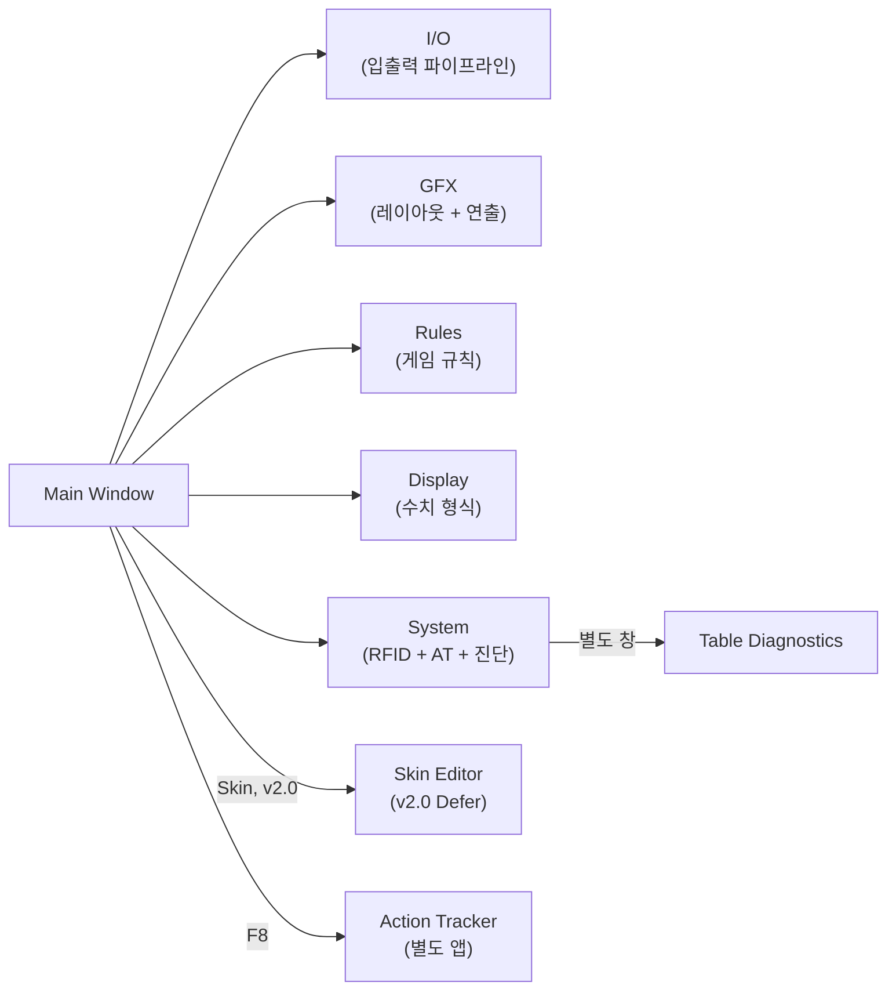

# PRD-0004-Core: EBS Server UI — 핵심 설계 요약

> PM/기획자 대상 문서. 범위, 우선순위, 핵심 결정을 다룬다.
> 상세 요소 스펙은 [element-catalog.md](PRD-0004-element-catalog.md), 원본 분석은 [pokergfx-analysis.md](PRD-0004-pokergfx-analysis.md)를 참조.
>
> **내부 코드명 주의**: "BRACELET STUDIO"는 내부 코드명이다. 외부 공유 시 절대 노출 금지.

---

## 1. 배경과 목적

EBS(Event Broadcasting System)는 포커 방송 프로덕션 전체 워크플로우의 인프라스트럭처다.

**핵심 목표 두 가지**:
- **자산 내재화**: 자체 RFID 카드 인식 시스템 구축 (완제품 도입이 아닌 자체 개발)
- **운영 효율화**: 방송 인력 30명 → 15~20명 (자막 연출 자동화)

**PokerGFX 복제 전략**: PokerGFX는 구매/도입 대상이 아니라 소프트웨어 벤치마크다.
Phase 1 목표는 PokerGFX Server UI의 핵심 기능을 EBS 환경에 맞게 재구현하는 것이다.
원본 구조를 이해하고 재구현하되, EBS 운영 방식에 맞지 않는 기능은 과감하게 제거한다.

**이 문서의 위치**: PRD-0004 패밀리의 최상위 요약. PM이 읽는 첫 번째 문서.
개발자는 element-catalog, feature-interactions, technical-specs를 병행 참조한다.

---

## 2. 범위 정의

> 
>
> *PokerGFX Server의 Main Window. EBS v1.0은 이 화면의 핵심 기능을 재구현한다.*

### v1.0 Scope (In Scope)

EBS v1.0은 방송 현장 즉시 운영 가능한 수준을 목표로 한다.

| 영역 | 내용 |
|------|------|
| 5탭 구조 | I/O, GFX, Rules, Display, System |
| 핵심 기능 | RFID 카드 인식, Action Tracker 연동, 그래픽 연출 |
| 요소 수 | Keep ~88개 (전체 정의 180개 중 v1.0 우선 구현 대상) |
| 렌더링 | React/TypeScript 기반 웹 UI (DirectX 대체) |
| 스킨 | 기본 스킨 1종 번들 |

### Non-Goals

| 항목 | 판단 | 근거 |
|------|------|------|
| Commentary 탭 | 배제 (ADR-001) | 운영팀이 기존 방송에서 사용한 적 없음. 해설자 정보는 OBS Scene으로 처리 |
| Delay Pipeline v2.0 | Defer (ADR-002) | 보안 딜레이·자동 스트림 등 출력 이중화는 v2.0으로 이연 |
| Skin Editor v2.0 | Defer (ADR-003) | 스킨 편집기 전체 기능은 v2.0. v1.0은 기본 스킨 번들만 제공 |
| Graphic Editor v2.0 | Defer | 픽셀 단위 요소 편집. v1.0에서는 단순화된 18개 파라미터만 노출 |
| Streaming/Recording | Drop | RTMP 스트리밍, 분할 녹화는 별도 NLE/OBS에서 처리 |
| Multi-Table (MultiGFX) | Drop | 단일 테이블 운영이 현재 워크플로우. 다중 테이블은 미정 |
| Auto Camera Control | Drop | 카메라 자동 전환 의존 기능 전체 제거. ATEM 수동 연결만 유지 |
| 라이선스 관리 | Drop | PokerGFX 원본의 Serial/PRO 라이선스 시스템 불필요 |

### PokerGFX 대비 차이점 요약

> 

| 항목 | PokerGFX 원본 | EBS v1.0 |
|------|:------------:|:--------:|
| 탭 구조 | 6탭 (S/O/G1/G2/G3/Sys) | 5탭 (I/O/GFX/Rules/Display/Sys) |
| 렌더링 | DirectX 11 + WPF | React/TypeScript |
| 라이선스 | PRO 키 기반 | 제거 |
| Commentary | 별도 탭 8개 요소 | 배제 |
| RFID 하드웨어 | 자체 독점 프로토콜 | 자체 개발 (ST25R3911B) |

---

## 3. 5탭 네비게이션 맵

| 탭 | 역할 | 주요 기능 |
|----|------|----------|
| I/O | 입출력 파이프라인 | 비디오 소스 등록, 해상도/프레임레이트, ATEM 연결, NDI 출력 |
| GFX | 레이아웃 + 연출 | 보드/플레이어 배치, 카드 공개 방식, 애니메이션, 스폰서 로고 |
| Rules | 게임 규칙 | 스트래들/봄팟 규칙, 플레이어 표시 옵션, 위닝 핸드 강조 |
| Display | 수치 형식 | 통화 기호, 블라인드 표시, 정밀도 설정, BB 모드 전환 |
| System | 시스템 제어 | RFID 연결/캘리브레이션, AT 접근 설정, 진단 로그 |

---

## 4. 의사결정 기록

| 결정 | 상태 | ADR | 요약 |
|------|------|:---:|------|
| Commentary 탭 배제 | 확정 | ADR-001 | 운영팀 미사용 확인. OBS Scene으로 대체 가능 |
| Delay Pipeline v2.0 | 확정 | ADR-002 | 보안 딜레이/이중 출력은 v2.0으로 이연. v1.0은 Live 단일 출력 |
| Skin Editor v2.0 | 확정 | ADR-003 | 픽셀 편집기는 v2.0. v1.0은 기본 스킨 번들 1종만 제공 |
| Equity 엔진 의존성 | 보류 | ADR-004 | Show Hand Equities, Outs 등 Equity 계산 엔진 구현 범위 미결 |
| 렌더링 전략 (DX11→Web) | 미결 | ADR-005 | React 기반 웹 렌더러의 방송 품질 검증 필요. 대안: Electron+Canvas |

> 각 ADR의 상세 결정 근거는 `decisions/` 디렉토리를 참조한다.

---

## 5. 우선순위 로드맵

| 마일스톤 | 요소 수 | 핵심 기능 |
|---------|:------:|----------|
| **v1.0 Broadcast Ready** | ~88 | RFID 카드 인식, Action Tracker 연동, GFX 기본 연출, I/O 파이프라인 |
| **v2.0 Operational Excellence** | ~77 | Delay Pipeline, Skin Editor, Equity 엔진, Leaderboard 고급 옵션 |
| **v3.0 Advanced** | ~15 | 자동 카메라 제어, Streaming, Multi-Table |

**v1.0 완료 기준**: 방송 현장에서 RFID 카드 인식 → Action Tracker 베팅 입력 → GFX 오버레이 출력까지 전체 흐름이 운영 가능한 상태.

---

## 6. 위험 요소

| 위험 | 수준 | 대응 방안 |
|------|:----:|----------|
| 렌더링 전략 미결 (ADR-005) | 높음 | React 렌더러 프로토타입 조기 검증. 기준 미달 시 Electron+Canvas로 전환 |
| Equity 엔진 구현 복잡도 | 중간 | v1.0에서 Defer 처리. 오픈소스 핸드 계산기(PokerSolver 등) 활용 검토 |
| RFID 하드웨어 의존성 | 높음 | Phase 0 업체 선정 진행 중 (ST25R3911B 기반). 하드웨어 미확정 시 소프트웨어 개발 병행 불가 |
| 기본 스킨 1종 제작 방법 미정 | 중간 | 외주 디자이너 vs 내부 제작 결정 필요. v1.0 번들 포함 목표 |
| Auto Camera 제거 후 운영 부담 | 낮음 | 수동 ATEM 전환으로 운영. 향후 v3.0에서 자동화 재검토 |

---

## 7. 문서 맵

| 문서 | 독자 | 역할 |
|------|------|------|
| **이 문서 (core.md)** | PM/기획자 | 범위, 우선순위, 핵심 결정 |
| [EBS-UI-Design-v3.prd.md](../00-prd/EBS-UI-Design-v3.prd.md) | 기획자/개발자 | EBS UI 설계 (5탭 + AT + Editor, 180개 요소) |
| [element-catalog.md](PRD-0004-element-catalog.md) | 개발자 | 180개 요소 전체 스펙 (타입, v1.0 여부, 설명) |
| [pokergfx-analysis.md](PRD-0004-pokergfx-analysis.md) | 분석가 | PokerGFX 원본 289개 요소 전수 분석 |
| [feature-interactions.md](PRD-0004-feature-interactions.md) | 개발자 | 요소 간 상호작용 및 조건부 표시 규칙 |
| [technical-specs.md](PRD-0004-technical-specs.md) | 개발자 | 기술 명세 (GPU, 비디오 파이프라인, RFID 프로토콜, 설정 스키마, 출력 모드) |
| [game-engine.md](PRD-0004-game-engine.md) | 개발자 | 게임 엔진 (데이터 모델, 상태 머신, 베팅, 핸드 평가, 통계) |
| [api-contracts.md](PRD-0004-api-contracts.md) | 개발자 | API 계약 (WebSocket 메시지, 이벤트 스키마, GameState) |
| [ebs-console-feature-triage.md](ebs-console-feature-triage.md) | 전체 | Keep/Defer/Drop 분류 기준 |
| decisions/ | 전체 | ADR-001~005 핵심 의사결정 상세 기록 |

---

## 변경 이력

| 날짜 | 버전 | 변경 내용 | 결정 근거 |
|------|------|-----------|----------|
| 2026-03-03 | v1.2.0 | GGP-GFX 통합: game-engine.md, api-contracts.md 위성 문서 추가. technical-specs.md v3.0.0 반영. 문서 맵 9개 문서 체계 완성 | GGP-GFX × PRD-0004 비교 분석 기반 통합 |
| 2026-03-03 | v1.1.0 | 문서 맵 보완: EBS-Server-UI-Design.md, ebs-console-feature-triage.md 추가. v30.0.0 기반 갱신 | PRD-0004 재구조화 반영 |
| 2026-03-02 | v1.0.0 | 최초 작성 — PRD-0004 v28.0.0 기반 PM용 핵심 요약 분리 | PRD-0004 문서 비대화로 역할별 분리 필요 |

---

**Version**: 1.2.0 | **Updated**: 2026-03-03
