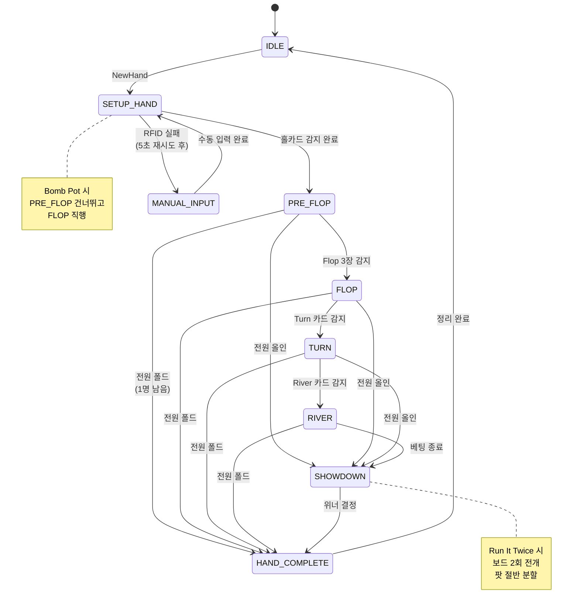

# PRD-0004: EBS 게임 엔진 설계서

> 이 문서는 EBS Server의 게임 엔진 -- 데이터 모델, 게임 상태 머신, 베팅 로직, 핸드 평가, 통계 엔진을 정의한다.
> UI 요소는 [기획서](../00-prd/EBS-UI-Design-v3.prd.md), 기술 상세는 [기술 명세서](PRD-0004-technical-specs.md)를 참조한다.

---

## 1장: 데이터 모델

> 게임 엔진이 관리하는 핵심 데이터 구조를 정의한다. 모든 UI 갱신과 WebSocket 메시지는 이 모델에서 파생된다.

### 1.1 Player

플레이어 한 명의 세션 내 상태를 표현한다.

| 필드 | 타입 | 설명 |
|------|------|------|
| name | string | 플레이어 표시 이름 |
| seat | int (0-9) | 좌석 번호 (10인 테이블) |
| stack | int | 현재 칩 스택 |
| hole_cards | Card[] | 홀카드 배열 (게임 타입별 2~7장) |
| status | PlayerStatus | 현재 상태 |
| stats | PlayerStats | 누적 통계 (6장 참조) |

**PlayerStatus enum**:

| 값 | 설명 |
|----|------|
| active | 핸드에 참여 중 |
| folded | 폴드 완료 |
| allin | 올인 상태 |
| eliminated | 토너먼트 탈락 |
| sitting_out | 자리 비움 |

### 1.2 GameState

한 핸드의 전체 진행 상태를 담는 최상위 객체다.

| 필드 | 타입 | 설명 |
|------|------|------|
| hand_number | int | 핸드 일련번호 (자동 증가) |
| game_type | GameType (0-21) | 22개 게임 중 선택 (2장 참조) |
| bet_structure | BetStructure | NL / PL / FL (4장 참조) |
| ante_type | AnteType (0-6) | 7가지 Ante 유형 (4장 참조) |
| state | GamePhase | 현재 상태 머신 위치 (3장 참조) |
| players | Player[] | 참여 플레이어 배열 |
| board_cards | Card[] | 커뮤니티 카드 (최대 5장, Community 계열만) |
| pot | Pot | 메인팟 |
| side_pots | Pot[] | 사이드팟 배열 |
| dealer_seat | int (0-9) | 딜러 버튼 위치 |
| blinds | Blinds | SB/BB/Ante 금액 |

### 1.3 Card

카드 한 장의 논리적 표현이다. 시각적 렌더링(pip_element)은 [기술 명세서 1.2절](PRD-0004-technical-specs.md)을 참조한다.

| 필드 | 타입 | 설명 |
|------|------|------|
| suit | int (0-3) | 0=Club, 1=Diamond, 2=Heart, 3=Spade |
| rank | int (0-12) | 0=2, 1=3, ..., 8=10, 9=J, 10=Q, 11=K, 12=A |
| uid | string (nullable) | RFID 태그 UID. 초기 NULL, 덱 등록 시 매핑 |
| display | string | 표시 문자열 (예: "As", "Kh", "2c") |

### 1.4 Pot

팟 금액과 참여 자격을 추적한다.

| 필드 | 타입 | 설명 |
|------|------|------|
| amount | int | 팟 총액 |
| eligible_players | int[] | 이 팟에 자격 있는 좌석 번호 |

사이드팟은 올인 발생 시 자동 분리된다. 분리 알고리즘은 4장에서 다룬다.

### 1.5 Blinds

블라인드 구조를 정의한다.

| 필드 | 타입 | 설명 |
|------|------|------|
| small_blind | int | SB 금액 |
| big_blind | int | BB 금액 |
| ante | int | Ante 금액 (0이면 미적용) |
| straddle | int | Straddle 금액 (0이면 미적용) |
| min_chip | int | 최소 칩 단위 |

### 1.6 EBS v1.0 범위

| 항목 | 분류 | 근거 |
|------|:----:|------|
| Player / GameState / Card / Pot / Blinds | **Keep** | 게임 엔진 핵심 모델 |
| PlayerStats (stats 필드) | Defer | v2.0 통계 엔진과 함께 구현 |

---

## 2장: 22개 게임 지원

> 22개 포커 변형을 3대 계열로 분류하고, 각 게임의 핵심 파라미터를 정의한다. EBS v1.0은 Texas Hold'em을 필수 구현하며, 나머지 21개는 데이터 구조만 정의하고 v2.0에서 확장한다.

### 2.1 3대 계열 분류

| 속성 | Community Card (12개) | Draw (7개) | Stud (3개) |
|------|:---------------------:|:----------:|:----------:|
| 홀카드 수 | 2~6장 | 4~5장 | 7장 (3+4) |
| 커뮤니티 카드 | 최대 5장 | 없음 | 없음 |
| 카드 교환 | 없음 | 1~3회 | 없음 |
| 공개 카드 | 커뮤니티 전체 | 없음 | 4장 (3rd~6th) |
| 베팅 라운드 | 4 (Pre~River) | 2~4 | 5 (3rd~7th) |
| RFID 추적 | 홀카드 + 보드 | 홀카드만 | 홀카드 + 공개 |
| 대표 게임 | Texas Hold'em | 2-7 Triple Draw | 7-Card Stud |

### 2.2 Community Card 계열 (12개)

| enum | 게임 | 홀카드 | 핵심 규칙 |
|:----:|------|:------:|----------|
| 0 | Texas Hold'em | 2 | 가장 보편적인 포커. 2장 비공개 + 5장 공유 |
| 1 | 6+ Hold'em (Straight > Trips) | 2 | 36장 덱 (2~5 제거). Straight가 Trips보다 강함 |
| 2 | 6+ Hold'em (Trips > Straight) | 2 | 36장 덱. Trips가 Straight보다 강함 (Triton 규칙) |
| 3 | Pineapple | 3 → 2 | 3장 받은 뒤 Flop 전 1장 버림 |
| 4 | Omaha | 4 | 반드시 홀카드 2장 + 보드 3장 사용 |
| 5 | Omaha Hi-Lo | 4 | Hi/Lo 팟 분할. Low 조건: 8 이하 5장 |
| 6 | Five Card Omaha | 5 | Omaha 규칙, 홀카드 5장 |
| 7 | Five Card Omaha Hi-Lo | 5 | Hi/Lo + 홀카드 5장 |
| 8 | Six Card Omaha | 6 | Omaha 규칙, 홀카드 6장 |
| 9 | Six Card Omaha Hi-Lo | 6 | Hi/Lo + 홀카드 6장 |
| 10 | Courchevel | 5 | Pre-Flop 때 Flop 첫 카드 1장 미리 공개 |
| 11 | Courchevel Hi-Lo | 5 | Hi/Lo + 미리 공개 |

### 2.3 Draw 계열 (7개)

| enum | 게임 | 홀카드 | 교환 횟수 | 핵심 규칙 |
|:----:|------|:------:|:---------:|----------|
| 12 | Five Card Draw | 5 | 1 | High hand 승리 |
| 13 | 2-7 Single Draw | 5 | 1 | Lowball. A=High, Flush/Straight 불리 |
| 14 | 2-7 Triple Draw | 5 | 3 | Lowball. 최강 패: 2-3-4-5-7 |
| 15 | A-5 Triple Draw | 5 | 3 | Lowball. A=Low, Flush/Straight 무시. 최강 패: A-2-3-4-5 |
| 16 | Badugi | 4 | 3 | 4수트 x 서로 다른 랭크 조합 목표 |
| 17 | Badeucy | 5 | 3 | 팟 분할: 절반 2-7 Low + 절반 Badugi |
| 18 | Badacey | 5 | 3 | 팟 분할: 절반 A-5 Low + 절반 Badugi |

### 2.4 Stud 계열 (3개)

| enum | 게임 | 카드 | 핵심 규칙 |
|:----:|------|:----:|----------|
| 19 | 7-Card Stud | 3 down + 4 up | High hand 승리. 커뮤니티 카드 없음 |
| 20 | 7-Card Stud Hi-Lo | 3 down + 4 up | Hi/Lo 팟 분할 (8-or-better) |
| 21 | Razz | 3 down + 4 up | A-5 Lowball Stud. 최강 패: A-2-3-4-5 |

### 2.5 GameDefinition 구조

각 게임 타입을 엔진에 등록하는 정의 객체다.

| 필드 | 타입 | 설명 |
|------|------|------|
| game_id | int (0-21) | 게임 enum 값 |
| game_class | enum | flop / draw / stud |
| hole_cards_count | int | 초기 홀카드 수 |
| board_cards_count | int | 보드 카드 수 (0 = 없음) |
| draw_count | int | 교환 횟수 (0 = 없음) |
| evaluator_type | enum | standard_high / hilo / lowball (5장 참조) |

### 2.6 EBS v1.0 범위

| 항목 | 분류 | 근거 |
|------|:----:|------|
| Texas Hold'em (enum 0) 상태 머신 + 규칙 | **Keep** | 핵심 게임, 방송 필수 |
| 22개 GameDefinition 데이터 구조 | **Keep** | 구조 정의만, 엔진 구현은 Hold'em 한정 |
| 21개 추가 게임 엔진 실행 | Defer | v2.0 확장. 구조는 v1.0에서 예약 |

---

## 3장: 게임 상태 머신

> 모든 포커 게임은 상태 머신으로 동작한다. 상태 전이마다 RFID 감지, 베팅 액션 처리, UI 갱신이 트리거된다. 계열별로 상태 흐름이 다르며, 예외 흐름(전원 폴드, 올인, 미스딜 등)을 포함한다.

### 3.1 Community Card 상태 흐름

Texas Hold'em을 포함한 12개 Community Card 게임의 상태 흐름이다.

```
IDLE → SETUP_HAND → PRE_FLOP → FLOP → TURN → RIVER → SHOWDOWN → HAND_COMPLETE → IDLE
```

| 상태 | 진입 트리거 | 종료 트리거 | UI 변화 |
|------|-----------|-----------|---------|
| IDLE | 이전 핸드 완료 | NewHand 명령 | 대기 화면 |
| SETUP_HAND | NewHand 명령 | 홀카드 감지 완료 | 좌석 초기화, 블라인드 수거 |
| PRE_FLOP | 홀카드 배분 | Flop 3장 감지 또는 올인/1명 남음 | 홀카드 표시, 베팅 UI 활성화 |
| FLOP | Flop 3장 감지 | Turn 카드 감지 또는 올인/1명 남음 | 보드 3장 표시, Equity 재계산 |
| TURN | Turn 카드 감지 | River 카드 감지 또는 올인/1명 남음 | 보드 4장 표시, Equity 재계산 |
| RIVER | River 카드 감지 | 베팅 종료 | 보드 5장 표시, 최종 Equity |
| SHOWDOWN | 베팅 완료 또는 올인 런아웃 | 위너 결정 | 핸드 공개, 위너 하이라이트 |
| HAND_COMPLETE | 위너 결정 | 정리 완료 | 팟 지급, 통계 갱신 |

### 3.2 Draw 상태 흐름

7개 Draw 게임의 상태 흐름이다. 교환 횟수(draw_count)에 따라 DRAW_ROUND가 반복된다.

```
IDLE → SETUP_HAND → DRAW_ROUND_1 → DRAW_ROUND_2 → ... → SHOWDOWN → HAND_COMPLETE → IDLE
```

Five Card Draw는 DRAW_ROUND 1회, Triple Draw 계열은 3회 반복한다. 보드 카드가 없으므로 RFID는 홀카드만 추적한다.

### 3.3 Stud 상태 흐름

3개 Stud 게임의 상태 흐름이다. 각 스트리트마다 카드 1장이 추가되며, 총 5 베팅 라운드를 진행한다.

```
IDLE → SETUP_HAND → 3RD_STREET → 4TH_STREET → 5TH_STREET → 6TH_STREET → 7TH_STREET → SHOWDOWN → HAND_COMPLETE → IDLE
```

플레이어당 최대 7장 (3 down + 4 up)을 받으며, 7th Street 이후 Showdown으로 전환된다.

### 3.4 상태 전이 트리거

| 트리거 | 설명 | 발생 원인 |
|--------|------|----------|
| RFID 감지 | 카드가 안테나 위에 놓임 | 하드웨어 이벤트 |
| AT 액션 | ActionTracker에서 운영자가 입력 | FOLD/CHECK/CALL/BET/RAISE/ALL-IN |
| 수동 입력 | 운영자가 카드를 직접 선택 | RFID 실패 폴백 |
| 자동 전이 | 조건 충족 시 시스템 자동 진행 | 전원 폴드, 올인 런아웃 |
| 타임아웃 | 설정된 시간 초과 | Action Clock (v1.0 Drop) |

### 3.5 예외 흐름

| 예외 | 처리 | 상태 전이 |
|------|------|----------|
| 전원 폴드 (1명 남음) | 남은 플레이어에게 팟 지급 | 현재 상태 → HAND_COMPLETE |
| 전원 올인 | 남은 보드 카드 자동 전개 (런아웃) | 현재 상태 → SHOWDOWN |
| Bomb Pot | Pre-Flop 건너뛰고 Flop 직행 | SETUP_HAND → FLOP |
| Run It Twice | 올인 후 보드를 2회 전개, 팟 절반 분할 | SHOWDOWN 내에서 2회 평가 |
| Miss Deal | 핸드 무효화, 블라인드 반환 | 현재 상태 → IDLE |
| RFID 실패 | 5초 재시도 후 수동 입력 그리드 활성화 | 상태 유지, 입력 모드 전환 |
| 카드 오인식 | UNDO로 이전 상태 복원 후 재입력 | 현재 상태 → 이전 상태 |

### 3.6 Community Card 상태 다이어그램



### 3.7 EBS v1.0 범위

| 항목 | 분류 | 근거 |
|------|:----:|------|
| Community Card 상태 머신 (Hold'em) | **Keep** | 핵심 게임 엔진 |
| 전원 폴드 / 전원 올인 예외 처리 | **Keep** | 방송 중 빈번 발생 |
| Bomb Pot 예외 흐름 | **Keep** | PS-009 Straddle과 함께 운영 |
| RFID 실패 → 수동 입력 폴백 | **Keep** | AT-020 수동 입력 폴백 |
| UNDO 상태 복원 | **Keep** | AT-013 UNDO 필수 |
| Run It Twice | Defer | AT-025 v2.0 Defer |
| Miss Deal | Defer | AT-026 v2.0 Defer |
| Draw / Stud 상태 머신 | Defer | 21개 추가 게임 v2.0 |

---

## 4장: 베팅 시스템

> 3가지 베팅 구조, 7가지 Ante 유형, 특수 규칙, 팟 계산 로직을 정의한다.

### 4.1 베팅 구조 (BetStructure)

| enum | 구조 | 최소 베팅 | 최대 베팅 | 적용 예시 |
|:----:|------|----------|----------|----------|
| 0 | No Limit | Big Blind | All-in (전 스택) | NL Hold'em, NL Omaha |
| 1 | Fixed Limit | Small Bet / Big Bet | 고정 단위 (Cap: 보통 4 Bet) | Limit Hold'em, Stud |
| 2 | Pot Limit | Big Blind | 현재 팟 크기 | PLO (Pot Limit Omaha) |

**Pot Limit 최대 베팅 계산**: 현재 팟 + (콜 금액 x 2). 이 공식은 "콜한 뒤 팟 크기만큼 레이즈"하는 것과 동일하다.

### 4.2 Ante 유형 (AnteType)

| enum | 유형 | 납부자 | 설명 |
|:----:|------|--------|------|
| 0 | Standard | 전원 | 동일 금액 납부. 데드 머니 (현재 베팅으로 인정되지 않음) |
| 1 | Button | 딜러만 | 딜러 버튼 위치 플레이어만 납부 |
| 2 | BB Ante | Big Blind만 | BB가 전원 Ante를 대납. 게임 속도 향상 목적 |
| 3 | BB Ante (BB 1st) | Big Blind만 | BB Ante + BB가 먼저 행동 |
| 4 | Live Ante | 전원 | Ante가 라이브 머니로 취급됨. 첫 베팅 라운드에서 본인의 베팅으로 인정되어 Check 대신 Raise 옵션 가능 |
| 5 | TB Ante | SB + BB | Two Blind 합산 Ante |
| 6 | TB Ante (TB 1st) | SB + BB | TB Ante + SB/BB 먼저 행동 |

> 대부분의 메인 토너먼트는 BB Ante(enum 2)를 사용한다. 한 명이 대납하므로 딜링 속도가 빠르고 수납 실수가 줄어든다.

### 4.3 특수 규칙

| 규칙 | 설명 | EBS v1.0 |
|------|------|:--------:|
| **Bomb Pot** | 전원이 합의 금액 납부 후 Pre-Flop 건너뛰고 Flop 직행 | Keep |
| **Run It Twice** | 올인 후 남은 보드를 2회 전개, 팟 절반 분할 | Defer |
| **7-2 Side Bet** | 7-2 오프슈트(최약 핸드)로 이기면 사이드벳 수취 | Defer |
| **Straddle** | 자발적 3번째 블라인드 (보통 2x BB). PS-009에서 설정 | Keep |

### 4.4 팟 계산 로직

#### 메인팟

각 베팅 라운드에서 플레이어가 투입한 금액의 합이다. 핸드 종료 시 위너에게 지급된다.

#### 사이드팟 분리 알고리즘

올인 플레이어가 발생하면 사이드팟을 분리한다.

1. 올인 플레이어의 투입액(A)을 기준으로 설정
2. 메인팟 = A x (참여 플레이어 수)
3. 나머지 금액 = 사이드팟으로 분리
4. 사이드팟의 eligible_players에서 올인 플레이어 제외
5. 추가 올인 발생 시 위 과정을 재귀적으로 반복

**예시**: 3명이 각각 100, 200, 300을 투입하고 첫 번째가 올인한 경우:
- 메인팟: 100 x 3 = 300 (3명 모두 자격)
- 사이드팟 1: 100 x 2 = 200 (2명 자격)
- 사이드팟 2: 100 (1명 자격 = 자동 반환)

### 4.5 EBS v1.0 범위

| 항목 | 분류 | 근거 |
|------|:----:|------|
| No Limit 베팅 구조 | **Keep** | NL Hold'em 필수 |
| Pot Limit 베팅 구조 | **Keep** | PLO 방송 빈도 높음 |
| Fixed Limit 베팅 구조 | Defer | v2.0 추가 게임과 함께 |
| 7가지 Ante 유형 전체 | **Keep** | PS-008 Ante 설정 필수 |
| Bomb Pot | **Keep** | 캐시 게임 방송에서 활용 |
| Straddle | **Keep** | PS-009 v1.0 Keep |
| Run It Twice | Defer | AT-025 v2.0 Defer |
| 7-2 Side Bet | Defer | 방송 빈도 낮음 |
| 메인팟 + 사이드팟 분리 | **Keep** | 올인 발생 시 필수 |

---

## 5장: 핸드 평가 시스템

> 22개 게임의 핸드를 평가하는 3가지 평가기, Lookup Table 기반 즉시 평가, Monte Carlo 시뮬레이션을 정의한다.

### 5.1 핸드 등급 체계

Standard High 평가기의 10단계 등급이다.

| 등급 | 이름 | 확률 |
|:----:|------|-----:|
| 9 | Royal Flush | 0.0002% |
| 8 | Straight Flush | 0.0013% |
| 7 | Four of a Kind | 0.024% |
| 6 | Full House | 0.14% |
| 5 | Flush | 0.20% |
| 4 | Straight | 0.39% |
| 3 | Three of a Kind | 2.11% |
| 2 | Two Pair | 4.75% |
| 1 | One Pair | 42.26% |
| 0 | High Card | 50.12% |

### 5.2 3가지 평가기

| 평가기 | 대상 게임 수 | 설명 |
|--------|:----------:|------|
| **Standard High** | 10개 | 높은 핸드가 승리. 등급 0~9 비교 |
| **Hi-Lo Splitter** | 5개 | High + Low 동시 평가, 팟 분할. Low 조건: 8 이하 5장 |
| **Lowball** | 7개 | 낮은 핸드가 승리. A-5 / 2-7 / Badugi 변형 |

### 5.3 평가기별 게임 라우팅

| 평가기 | 대상 게임 |
|--------|----------|
| Standard High | Texas Hold'em, Pineapple, 6+ Hold'em x2, Omaha, Five Card Omaha, Six Card Omaha, Courchevel, Five Card Draw, 7-Card Stud |
| Hi-Lo Splitter | Omaha Hi-Lo, Five Card Omaha Hi-Lo, Six Card Omaha Hi-Lo, Courchevel Hi-Lo, 7-Card Stud Hi-Lo |
| Lowball | Razz, 2-7 Single Draw, 2-7 Triple Draw, A-5 Triple Draw, Badugi, Badeucy, Badacey |

### 5.4 Lookup Table 기반 즉시 평가

매번 핸드 등급을 계산하지 않고, 사전 계산된 참조 테이블로 즉시 조회한다.

| 테이블 | 용도 |
|--------|------|
| 핸드 등급 조회 | 5장 카드 → 7,462가지 핸드 등급 즉시 반환 |
| Straight 판별 | 5장 연속 여부 즉시 판별 |
| 169 Pre-Flop 승률 | 169가지 시작 패(AA~72o) 사전 승률. Pre-Flop Equity 즉시 표시 |
| Omaha 6장 전용 | 6장에서 최적 2장+3장 조합 사전 계산 |

**작동 원리**: 카드 5장을 숫자 인덱스로 변환하여 테이블을 조회한다. 계산 없이 "찾기만" 수행하므로 Monte Carlo 10,000회 시뮬레이션에서 결정적으로 빠르다.

> Lookup Table 상세 구조(핵심 8개 테이블, Memory-Mapped 파일, 538개 정적 배열)는 별도 기술 설계 문서를 참조한다.

### 5.5 Monte Carlo 시뮬레이션

알려지지 않은 카드가 남아 있을 때, 무작위 시뮬레이션으로 승률을 추정한다.

**실행 조건**: Flop 이후 보드 카드가 공개될 때마다 트리거. N=10,000회 시뮬레이션이 기본값이다.

**시뮬레이션 절차**:
1. 알려진 카드(홀카드 + 보드)를 고정
2. 남은 덱에서 미공개 카드를 무작위 배분 (N회 반복)
3. 각 시행에서 LUT 기반 핸드 평가
4. 승/무/패 카운트로 Equity % 산출

**성능 요구**: 10,000회 시뮬레이션을 200ms 이내에 완료해야 방송 중 실시간 표시가 가능하다. LUT 즉시 평가가 이 성능의 전제 조건이다.

### 5.6 EBS v1.0 범위

| 항목 | 분류 | 근거 |
|------|:----:|------|
| Standard High 평가기 | **Keep** | Hold'em 핸드 평가 필수 |
| Hold'em LUT (핸드 등급 + 169 Pre-Flop) | **Keep** | 즉시 평가 성능 확보 |
| Hi-Lo Splitter 평가기 | Defer | v2.0 Hi-Lo 게임과 함께 |
| Lowball 평가기 | Defer | v2.0 Draw/Stud 게임과 함께 |
| Monte Carlo 시뮬레이션 | Defer | EQ-001~008 전체 v2.0 Defer. v1.0에서는 Equity 미표시 |

---

## 6장: 통계 엔진

> 세션 중 축적된 핸드 데이터로 플레이어별 통계를 계산하고, 실시간 Equity를 산출하는 엔진을 정의한다.

### 6.1 플레이어 통계 (8개)

| 통계 | 축약어 | 의미 | 계산 방법 |
|------|--------|------|----------|
| Voluntarily Put money In Pot | **VPIP** | 자발적 팟 참여 비율 | (자발 참여 핸드 / 총 핸드) x 100 |
| Pre-Flop Raise | **PFR** | Pre-Flop 레이즈 비율 | (PF 레이즈 핸드 / 총 핸드) x 100 |
| Aggression Factor | **AGR** | 공격적 플레이 비율 | (Bet + Raise) / Call |
| Went To ShowDown | **WTSD** | 쇼다운 도달 비율 | (쇼다운 핸드 / Flop 참여 핸드) x 100 |
| Three-Bet Percentage | **3Bet%** | 3벳 빈도 | (3벳 횟수 / 3벳 기회) x 100 |
| Continuation Bet Percentage | **CBet%** | 컨티뉴에이션 벳 빈도 | (CBet 횟수 / CBet 기회) x 100 |
| Win Rate | **WIN%** | 핸드 승률 | (승리 핸드 / 총 핸드) x 100 |
| Aggression Frequency | **AFq** | 공격 빈도 | (Bet + Raise) / (Bet + Raise + Call + Fold) x 100 |

이 통계는 플레이어 플레이 스타일을 정량화한다. GFX Console 리더보드(GC-001~012)에 표시되거나 Viewer Overlay에 LIVE Stats(GC-017)로 노출될 수 있다.

### 6.2 실시간 Equity 계산

모든 플레이어의 홀카드와 보드 카드가 인식되면 각 플레이어의 승률을 실시간으로 계산한다.

| 스트리트 | 알려진 카드 | 계산 방법 |
|----------|-------------|----------|
| Pre-Flop | 홀카드만 | PocketHand169 LUT (즉시 조회) |
| Flop | 홀카드 + 3장 | Monte Carlo (Turn + River 시뮬레이션) |
| Turn | 홀카드 + 4장 | Monte Carlo (River 1장 시뮬레이션) |
| River | 홀카드 + 5장 | 확정 평가 (시뮬레이션 불필요) |

2~10명 동시 계산을 지원하며, Win / Tie / Lose 확률과 아웃츠 분석을 포함한다.

### 6.3 EBS v1.0 범위

| 항목 | 분류 | 근거 |
|------|:----:|------|
| Hands Played 카운터 (ST-007) | **Keep** | 단순 카운터, 별도 엔진 불필요 |
| 8가지 플레이어 통계 엔진 | Defer | GC-001~012, ST-001~006 전체 v2.0 Defer |
| 실시간 Equity 계산 | Defer | EQ-001~008 전체 v2.0 Defer |
| Equity 오버레이 표시 (VO-008) | Defer | v2.0 Equity 엔진과 함께 |

---

## 변경 이력

| 날짜 | 버전 | 변경 내용 | 결정 근거 |
|------|------|-----------|----------|
| 2026-03-03 | v1.0.0 | 최초 작성 | GGP-GFX Part III 기반 게임 엔진 설계서 분리 |

---
**Version**: 1.0.0 | **Updated**: 2026-03-03
