# EBS — 라이브 포커 방송 시스템 기획서

> **Version**: 34.0.0
> **Date**: 2026-03-31
> **문서 유형**: 제품 기획서 (Product Requirements Document)
> **대상 독자**: 기획자, 이해관계자, 포커 방송에 관심 있는 누구나

## Executive Summary

포커 방송에는 다른 스포츠에 없는 근본적인 문제가 있다. 플레이어의 카드가 뒤집혀 있어 카메라로는 보이지 않는다. 시청자가 게임을 이해하려면 이 **보이지 않는 정보**를 화면에 표시해야 한다. EBS는 이 문제의 해결을 넘어, 방송 퀄리티 향상과 운영 무인화라는 두 가지 목표를 동시에 달성하는 통합 방송 인프라를 구축한다.

EBS(Event Broadcasting System)는 이 문제를 해결하는 라이브 포커 방송 전용 시스템이다. 테이블에 설치된 전자 카드 인식 장치가 카드를 자동으로 감지하고, 게임 엔진이 다수의 포커 변형 규칙과 승률을 실시간으로 연산하며, 그래픽 시스템이 방송 화면 위에 정보를 합성한다.

---

## 비전과 목표

### EBS의 존재 이유

WSOPLIVE는 포커 대회 전체를 관리하는 서비스 플랫폼이다. 대회 등록, 테이블 배정, 상금 분배 등 모든 운영이 하나로 통합된 시스템이며, 업계에서는 이 변화를 **WSOP 2.0**이라 부른다.

EBS(Event Broadcasting System)는 그 대회를 시청자에게 보여주는 **방송 인프라**를 관리한다. WSOPLIVE가 "대회 운영"이라면, EBS는 "방송 제작" 전체를 커버하는 시스템이다.

### 2가지 비즈니스 목표

EBS가 달성하려는 목표는 두 가지이며, 이 둘은 서로 독립적이다.

#### A — 방송 퀄리티의 비약적 향상

EBS가 정의하는 방송 퀄리티의 향상은 단지 시각적인 화려함을 넘어, '실시간 몰입도의 극대화'와 '데이터 기반의 콘텐츠 생태계 확장'이 완벽하게 결합된 결과물이다.

- **시청 경험의 근본적 심화** — GFX(방송 그래픽) 엔진, 실시간 오버레이, AI 분석을 통해 눈에 보이지 않는 선수의 심리와 확률 싸움을 직관적으로 시각화하여, 실시간 시청 경험을 압도적으로 끌어올린다.
- **DB화를 통한 방송 볼륨 확장** — 현장에서 발생하는 모든 플레이(핸드 히스토리, 베팅 패턴, 누적 스탯 등)를 실시간으로 DB화한다. 이 축적된 데이터는 생방송의 정보 밀도를 높일 뿐만 아니라, 하이라이트, 선수별 맞춤 VOD 등 무한한 파생 콘텐츠를 자동 생산하는 기반이 되어 방송 전체의 볼륨을 기하급수적으로 확장시킨다.

#### B — 크로스보더 무인화 전환

수동 작업을 시스템이 자동으로 처리하는 구조로 전환한다.

> 퀄리티 향상은 자동화의 부산물이 아니며, 무인화는 퀄리티를 위한 전제 조건이 아니다.

### Make vs Buy 결정

PokerGFX는 북미 포커 방송의 사실상 표준이다. 그럼에도 EBS를 자체 개발하는 이유:

| 관점 | PokerGFX 도입 | EBS 자체 개발 |
|------|:---:|:---:|
| 라이선스 | Professional+ 연간 갱신, 기능별 게이팅 | 자산 내재화, 영구 소유 |
| 커스터마이징 | 스킨 수준만 변경 가능 | WSOPLIVE 통합, AI 확장, OTT 파이프라인 |
| 데이터 소유 | Export 기능 라이선스 종속 | 전체 데이터 파이프라인 직접 통제 |
| 장기 전략 | 외부 의존 (벤더 락인) | 6-Phase 로드맵 자유 실행 |

> **결론**: PokerGFX는 구매/도입 대상이 아니라 **소프트웨어 벤치마크/복제 대상**이다. 역설계 결과를 기반으로 동일 기능을 자체 구현한다.

---

## EBS 전체 시스템 구조

EBS(Event Broadcasting System)는 라이브 포커 토너먼트 방송의 **전 과정**을 처리하는 통합 시스템이다. 단순한 그래픽 오버레이 툴이 아니라, 대회 운영부터 방송 송출까지 6개 서브시스템이 유기적으로 연동된다.

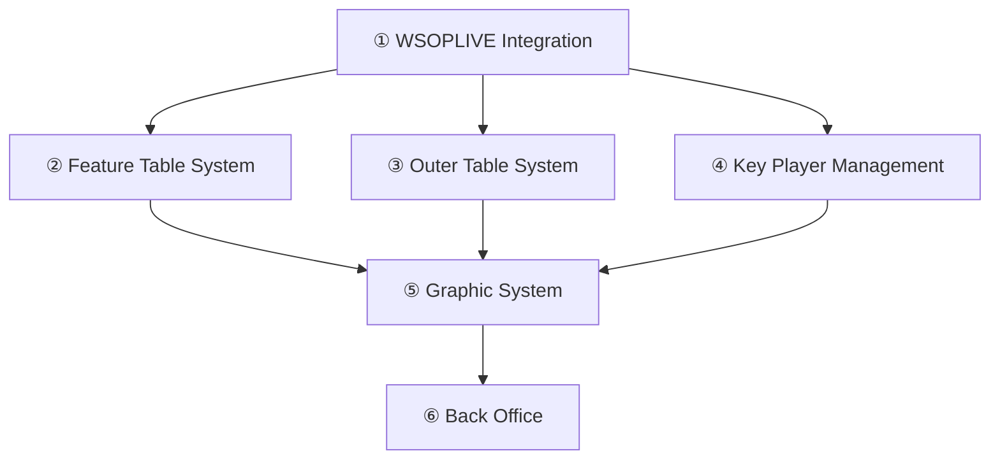

| # | 서브시스템 | 설명 | Phase 1-2 |
|---|-----------|------|--------|
| 1 | WSOPLIVE Integration | WSOPLIVE에서 대회 일정, 블라인드 구조, 테이블 정보를 수신하여 처리 | ⏳ Phase 3+ |
| 2 | **Feature Table System** | 방송 피처 테이블 지정, RFID 카드 인식, 게임 상태 추적 | **✅ 구현 중** |
| 3 | Outer Table System | 외부/온라인 플레이어를 방송 화면에 표시하는 Outer Table | **✅ 구현 중** |
| 4 | Key Player Management | 주요 선수 마킹, 통계, 스택 정보 추적 | ⏳ Phase 3+ |
| 5 | **Graphic System** | 실시간 그래픽 오버레이 합성 (RFID → 게임엔진 → 렌더링) | **✅ 구현 중** |
| 6 | **Back Office** | 게임 이력, 핸드 데이터, 통계 아카이브 | **✅ 구현 중** |

> ✅ = Phase 1-2 구현 중 · ⏳ = Phase 3 이후
>


---

## 2026 개발 마일스톤


| 기간 | 핵심 목표 | System | 비즈니스 마일스톤 |
|:----:|----------|:------:|-----------------|
| 26 H1 | RFID POC + 기초 서버 | SYSTEM 1 | 인프라 POC 완료 |
| 26 H2 | Hold'em 완벽 완성 + 스킨 에디터 + BO | SYSTEM 1 | **2027-01 런칭** |
| 27 H1 | 11종 게임 확장 | SYSTEM 1 | **2027-06 Vegas** |
| 27 H2 | 10종 추가 + WSOPLIVE | SYSTEM 1 | 22종 완성 |
| 28 H1 | AI 4개 영역 무인화 | SYSTEM 2 | 프로덕션 AI |
| 28 H2 | OTT HLS/VOD 런칭 | SYSTEM 3 | OTT 배포 |

## 문서 포지셔닝

> **이 문서의 구조**: 이 문서는 EBS의 제품 요구사항을 정의한다. PokerGFX를 초기 참조로 하여 동일 기능 범위를 자체 구현하며, Part II~VI의 기술 상세는 EBS가 달성할 기능 벤치마크를 기술한다. EBS 고유의 설계 결정(Flutter/Rive, 모듈 분리, 데이터 파이프라인)은 별도 설계 문서에서 다룬다. PokerGFX에만 해당하는 항목(라이선스 게이팅 등)은 `[PokerGFX 전용]`으로 주석 처리되어 있다.

---

## 엔진 + 클라이언트 생태계

EBS는 서버 엔진 1대와 **단일 Flutter 앱**(3개 화면 + RBAC)으로 구성된다. PokerGFX의 "별개 네이티브 앱 2개 + 자체 TCP 프로토콜" 구조를 **Flutter + Rive + WebSocket**으로 현대화한다.

> **PokerGFX 원본과의 차이**: PokerGFX는 GfxServer(WinForms EXE)와 ActionTracker(별도 EXE)가 Process IPC/TCP로 통신하는 레거시 2-앱 구조였다. EBS는 기존 ActionTracker의 기능을 **Lobby**(테이블 관리+설정+플레이어 등록)와 **Command Center**(순수 커맨드 입력)로 분리하고, 하나의 Flutter 앱 내에서 RBAC 역할에 따라 접근 가능한 화면이 달라지는 구조로 구현한다.

> **참고**: PokerGFX의 ActionClock, CommentaryBooth, Pipcap, StreamDeck 등 보조 앱은 실제 프로덕션에서 사용되지 않거나 외부 입력 장치이므로 EBS v1에서는 구현하지 않는다.

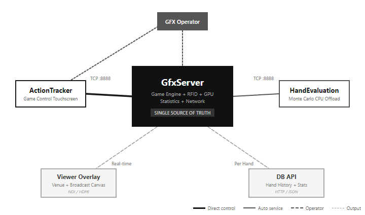

| 구분 | 컴포넌트 | 역할 | 운영 |
|------|----------|------|------|
| **Server** | **EBS Core Server** (FastAPI) | 모든 상태의 단일 원본. RFID 카드 매핑, 22개 게임 상태 머신, 렌더링 엔진, 통계 연산, WebSocket 상태 동기화를 단일 프로세스에서 통합 처리한다. 멀티테이블 시 테이블별 독립 상태를 관리한다 | 자동 (headless) |
| **Frontend** | **EBS App** (Flutter + Dart) | 단일 크로스 플랫폼 앱 (Desktop + Web + Tablet). 로그인 역할(Admin/Operator/Viewer)에 따라 접근 가능한 화면이 달라진다 | 로그인 접속 |
| **Screen** | **Lobby** | 이벤트의 모든 테이블(Feature+General) 목록. 테이블별 Setup(게임 설정, 플레이어 등록, 좌석 배치) 관리. 원하는 테이블을 선택하여 Command Center로 진입한다 | Admin + Operator |
| **Screen** | **Command Center** (CC) | 선택한 테이블의 게임 진행 커맨드 입력 전용. New Hand → Deal → 베팅 → Showdown. 설정/등록은 Lobby에서 완료한 상태로 진입한다 | Admin + Operator |
| **Screen** | **Console** (Admin 전용) | 오버레이 그래픽 설정: 5탭(Outputs/GFX/Display/Rules/Stats). 방송 준비 단계에서 설정을 완료하고, 방송 중에는 모니터링한다 | Admin |
| **Overlay** | **Rive Renderer** | 방송 오버레이 그래픽. Flutter Rive 패키지로 .riv 파일을 네이티브 렌더링한다 | 자동 |
| **Service** | **HandEvaluation** | 승률 계산 전용 프로세스. CPU 집약적 Monte Carlo 시뮬레이션을 서버의 메인 스레드에서 분리한다 | 자동 |

### 기술 스택

| 계층 | 기술 | 역할 |
|------|------|------|
| Server | FastAPI + WebSocket | 게임 상태, RBAC, 멀티테이블 관리 |
| Frontend | **Flutter** (Dart) | Lobby + Console + Command Center + Overlay |
| 오버레이 | **Rive** (.riv) 네이티브 렌더링 | 방송 그래픽 (Flutter Rive 패키지) |
| 빌드 타겟 | Windows Desktop + Web + iPad | 크로스 플랫폼 단일 코드베이스 |
| 상태 관리 | Riverpod | WebSocket 상태 동기화 |
| 통신 | WebSocket + JSON | 서버 ↔ 클라이언트 실시간 동기화 |

### Lobby 진입 모델

앱의 진입점은 **Lobby**다. Lobby는 하나의 포커 대회 이벤트(예: WSOP Main Event, High Roller, PLO Championship)에서 운영 중인 모든 테이블을 한눈에 보는 화면이다.

테이블은 RFID가 매립된 **Feature Table**(방송용, 카드 자동 인식)과 RFID 없는 **General Table**(데이터 기록용, 수동 입력)로 구분된다. Lobby에서 원하는 테이블을 선택하면 해당 테이블의 Command Center로 진입하여 게임 커맨드를 입력한다.

| 테이블 유형 | RFID | 카드 인식 | 용도 |
|------------|:----:|:---------:|------|
| **Feature Table** | 있음 | 자동 인식 | 방송 피처 테이블 (오버레이 그래픽 출력) |
| **General Table** | 없음 | 수동 입력 | 일반 대회 테이블 (데이터 기록용) |

기존 ActionTracker의 기능은 Lobby와 Command Center로 분리된다:

| 기능 | 기존 ActionTracker | EBS |
|------|:-----------------:|:---:|
| 게임 유형/블라인드/앤티 설정 | AT | **Lobby > Setup** |
| 플레이어 등록 (이름, 스택) | AT | **Lobby > Setup** |
| 좌석/포지션 배치 (D/SB/BB) | AT | **Lobby > Setup** |
| 테이블 생성/관리 | AT | **Lobby** |
| Feature/General 테이블 구분 | 없음 (신규) | **Lobby** |
| New Hand → Deal → 베팅 → Showdown | AT | **Command Center** |
| UNDO | AT | **Command Center** |

화면 간 네비게이션:

| 전환 | 트리거 | 비고 |
|------|--------|------|
| Login → Lobby | 로그인 성공 | 이벤트 자동 진입 또는 선택 |
| Lobby → Command Center | 테이블 카드 [Enter] | 양방향 |
| Lobby → Console | [Console ⚙] 버튼 | Admin 전용, 양방향 |
| Console ↔ Command Center | 직접 이동 없음 | 반드시 Lobby를 경유 |

### Lobby 2단계 개발

Lobby는 2단계로 개발한다.

**1단계 (Phase 1-2)**: 직접 수정 모드. Admin이 수동으로 테이블을 생성하고 게임 유형, 블라인드, 플레이어를 직접 설정한다. 외부 시스템 연동 없이 독립적으로 운영한다.

**2단계 (Phase 3+)**: WSOPLIVE 데이터 연동. WSOPLIVE Staff Main 화면과 동일한 3-depth 네비게이션을 구현한다.

| 단계 | 화면 흐름 | 데이터 소스 |
|:----:|----------|:----------:|
| 1단계 | Login → Lobby (수동 테이블 관리) | 직접 입력 |
| 2단계 | Login → **대회 선택** → **이벤트 선택** → 테이블 | WSOPLIVE API |

2단계 3-depth 구조 (WSOPLIVE Staff 참조: `images/wsoplive_staff/`):

| Depth | WSOPLIVE Staff | EBS Lobby 2단계 |
|:-----:|---------------|-----------------|
| 1 | 대회 카드 (연도별 + Select Role) | 대회 선택 + RBAC 역할 매핑 |
| 2 | 이벤트 리스트 (Entries, Status, Level, Prize Pool) | 이벤트 목록 (WSOPLIVE API 연동) |
| 3 | 테이블 그리드 (좌석별 상태, 잠금) | 테이블 뷰 → Setup / Command Center 진입 |

### 운영 모델

하나의 이벤트에서 여러 피처 테이블을 운영할 때, Admin 1명이 Lobby + Console에서 전체 테이블을 관제하고, 각 테이블에 Operator가 Lobby에서 할당된 테이블의 Command Center에 접속하여 게임을 진행한다.

| 시나리오 | Admin | Operator | 서버 |
|----------|:-----:|:--------:|:----:|
| **Phase 1-2**: 단일 테이블 | 1명 (Lobby+Console+CC 겸임) | — | 1 Server = 1 Table |
| **Phase 3+**: 멀티 테이블 (4~8개) | 1명 (Lobby+Console+전체 모니터링) | 테이블당 1명 (CC) | 1 Server = N Tables |

### 데이터 생성 경로

서버는 2가지 경로로 데이터를 외부에 전달한다.

**Overlay 출력** (실시간): EBS Core Server의 Rive 렌더러가 카메라 입력 위에 그래픽(홀카드, 승률, 팟, 플레이어 정보)을 실시간 합성하여 NDI/HDMI로 출력한다.

**Live Data Export** (핸드 단위 + 실시간): 서버는 3개의 데이터 출력 경로를 제공한다.

| 경로 | 전송 방식 | 데이터 | 타이밍 |
|------|----------|--------|--------|
| **실시간 스트리밍** | 소켓 기반 실시간 전송 | 게임 상태 변경분 | 실시간 |
| **핸드별 내보내기** | 이벤트 기반 | 핸드 종료 시 전체 핸드 데이터 | 핸드 단위 |
| **히스토리 조회** | 요청-응답 방식 | 핸드 히스토리 | 요청 시 |

LiveApi는 TCP 소켓 기반 실시간 스트리밍으로, 이전 전송 데이터와의 delta만 전송하여 대역폭을 최적화한다. live_export는 핸드가 종료될 때 이벤트 기반으로 전체 핸드 데이터(플레이어, 홀카드, 액션 로그, 보드, 결과)를 JSON으로 생성하여 외부 시스템에 전달한다. 프로덕션 팀이 이 데이터로 자막/통계 그래픽을 별도 제작하는 External 모드의 기반이다. 이 기능은 **라이선스 게이트**(Professional 이상)이며, `LiveDataExport`와 `LiveHandData` 두 개의 독립 플래그로 제어된다. `[PokerGFX 전용 — EBS에서는 라이선스 게이팅 없이 전체 Export 기본 제공]`

---


# 시작하기 전에: 포커와 EBS를 처음 접하는 독자를 위해

> **대상 독자**: 모든 독자 (포커/방송 배경지식 없는 이해관계자 필독)
>
> 포커를 처음 접하거나 EBS가 무엇인지 모르는 독자를 위한 기초 안내. 이미 알고 있다면 Part I로 바로 이동해도 된다.

## 포커란 무엇인가

포커는 카드를 이용한 전략 게임이다. 2명에서 10명의 참가자가 한 테이블에서 진행하며, 각 참가자에게는 비공개 카드(홀카드)가 배분된다. 참가자들은 베팅을 통해 경쟁하고, 가장 강한 카드 조합을 가진 사람이 상금(팟)을 가져간다.

포커의 가장 큰 특징은 **정보 비대칭**이다. 내 카드는 나만 알고, 상대방 카드는 상대방만 안다. 이 비밀 정보를 어떻게 활용하고 추론하는가가 포커의 핵심 전략이다.

**포커 기초 용어**:

| 용어 | 뜻 |
|------|-----|
| **홀카드** | 각 플레이어에게 비공개로 배분되는 개인 카드 |
| **커뮤니티 카드** | 테이블 중앙에 공개되어 모든 플레이어가 공유하는 카드 |
| **팟(Pot)** | 이번 핸드(게임 1회)에서 경쟁하는 총 상금 |
| **블라인드** | 핸드 시작 전 특정 위치의 플레이어가 의무로 내는 기본 베팅금 |
| **폴드(Fold)** | 자신의 카드를 포기하고 이번 핸드에서 기권하는 행동 |
| **체크(Check)** | 추가 베팅 없이 차례를 넘기는 행동 (베팅이 없을 때만 가능) |
| **콜(Call)** | 상대방의 베팅금액과 동일하게 맞추는 행동 |
| **레이즈(Raise)** | 상대방의 베팅금액보다 더 높게 베팅하는 행동 |
| **올인(All-in)** | 가진 칩 전부를 베팅하는 행동 |
| **쇼다운(Showdown)** | 핸드 마지막에 남은 플레이어들이 카드를 공개하여 승자를 결정하는 단계 |
| **핸드(Hand)** | 카드를 나눠받고 베팅을 완료하여 승자가 결정될 때까지의 1회 진행 단위 |

## EBS란 무엇인가

EBS(Event Broadcasting System)는 **라이브 포커 방송을 위한 전용 통합 시스템**이다.

포커 방송에서는 시청자가 모든 플레이어의 숨겨진 카드를 볼 수 있어야 흥미롭다. 그러나 방송 스태프 역시 카드를 직접 볼 수 없다. EBS는 이 문제를 전자 카드 인식 기술로 해결한다.

EBS가 하는 일:

1. **카드 자동 인식** — 테이블에 설치된 장치가 카드를 자동으로 감지하고 어떤 카드인지 식별한다
2. **게임 규칙 적용** — 22가지 포커 변형의 규칙, 베팅 구조, 승률을 실시간으로 계산한다
3. **화면 표시** — 인식된 카드 정보와 계산 결과를 방송 화면 위에 실시간으로 오버레이한다
4. **운영 지원** — 방송 운영자가 게임 진행 입력에만 집중할 수 있도록 나머지 작업을 자동화한다

EBS 없이 포커를 방송하려면, 스태프가 딜러에게 매 핸드마다 모든 카드 정보를 받아서 수동으로 화면에 입력해야 한다. 10명 플레이어 x 2장 = 20장 카드를 핸드마다 반복하면서 동시에 승률도 계산해야 한다. 이것은 현실적으로 불가능하다.

---

# Part I: 문제와 핵심 개념

> **대상 독자**: 모든 독자 (기획자/이해관계자 필독)
>
> 포커 방송이 일반 스포츠 방송과 근본적으로 다른 이유를 이해하고, 이 문서 전체를 관통하는 3가지 핵심 개념을 먼저 파악한다.

## 1. 포커 방송은 왜 다른가

### 방송 그래픽의 기본 역할

모든 스포츠 방송의 그래픽 시스템은 같은 일을 한다. **경기 상황을 시청자에게 시각적으로 전달**하는 것이다. 축구 중계의 점수판, 야구 중계의 볼카운트, 농구 중계의 샷클락 모두 같은 목적을 수행한다.

그런데 포커는 근본적으로 다르다.

### 정보 가시성의 차이

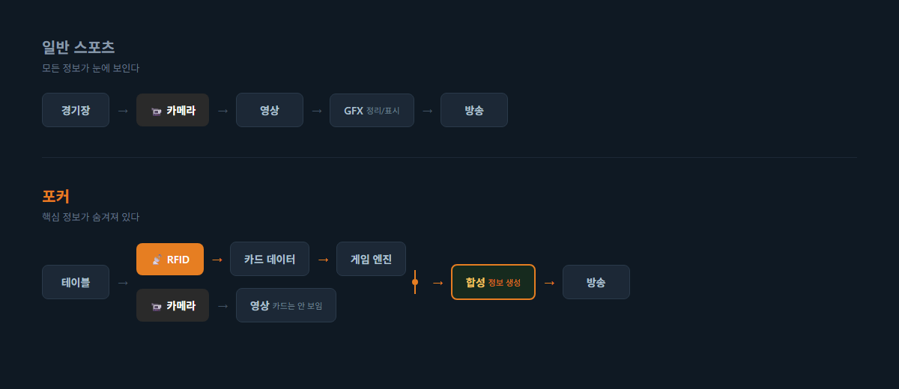

### Hidden Information Problem

포커와 다른 스포츠의 결정적 차이는 **Hidden Information**이다.

| 구분 | 일반 스포츠 | 포커 |
|------|------------|------|
| **핵심 정보** | 공개됨 (공 위치, 점수) | 비공개 (홀카드) |
| **그래픽의 역할** | 정리 및 표시 | **생성** 및 표시 |
| **정보 획득** | 카메라 영상 | 전자 센서 |
| **연산 필요** | 거의 없음 | 실시간 확률 계산 |
| **보안 요구** | 없음 | 현장 유출 차단 필수 |
| **게임 규칙** | 1개 (해당 종목) | 22개 변형 |
| **자동 인식** | 불필요 | RFID 카드 인식 필수 |

축구 중계에서 점수판을 표시하려면 점수를 입력하면 된다. 누구나 점수가 몇 대 몇인지 보고 있다.

포커 중계에서 홀카드를 표시하려면 **테이블 아래 숨겨진 RFID 리더가 뒤집어진 카드를 전자적으로 읽어야 한다**. 아무도 그 카드가 뭔지 모르기 때문이다.

### 자동화가 필요한 이유

카드 인식 계층이 추가되면서, 수동 운영만으로는 처리하기 어려운 데이터량이 발생한다.

| 요구사항 | 배경 |
|----------|------|
| 매 핸드 최대 20장 카드 인식 | 10명 x 홀카드 2장이 매 핸드마다 반복된다 |
| 실시간 액션 추적 | Fold, Bet, Raise가 초 단위로 발생한다 |
| 승률 재계산 | 보드 카드가 나올 때마다 모든 플레이어의 Equity가 변동한다 |
| 보안 딜레이 | 생방송 중 홀카드 정보 유출을 방지해야 한다 |

### 왜 전용 시스템이 필요한가

일반 방송 그래픽 도구(CasparCG, vMix 등)로 포커 방송을 할 수 없는 이유:

**일반 그래픽 도구가 하는 일**: 텍스트 오버레이, 이미지 오버레이, 타이머, 애니메이션

**포커 방송이 추가로 요구하는 것**:

| 요구사항 | 설명 |
|----------|------|
| 카드 인식 장치 연동 | 리더 12대 제어 |
| 카드 자동 인식 엔진 | 52장 실시간 추적 |
| 22개 게임 규칙 엔진 | 게임별 상태 관리 |
| 핸드 평가 알고리즘 | 등급 + 승률 계산 |
| 실시간 그래픽 합성 | 카메라 영상 위에 정보 오버레이 |
| 서버-클라이언트 동기화 프로토콜 | 엔진-클라이언트 앱 연동 |
| GFX 운영자용 터치스크린 UI | 게임 진행 입력 |
| 실시간 통계 | 플레이어 행동 패턴 분석 |

이것이 **전용 시스템**이 필요한 이유다. EBS는 단순한 그래픽 오버레이가 아니라, 카드 인식부터 화면 표시까지 수직 통합된 포커 전용 방송 시스템이다.

---

## 2. 전략 핵심 개념 3가지

EBS 전체 아키텍처를 관통하는 세 가지 전략 개념이다. 각 개념은 Phase 1부터 Phase 6까지 점진적으로 확장된다.

### 2.1 실시간 데이터 파이프라인

물리 카드 → 디지털 데이터 → 방송 GFX → 콘텐츠까지 끊김 없는 데이터 경로. Phase 1에서 RFID→Overlay 최초 연결로 시작하여, Phase 4에서 5-Layer 파이프라인으로 완성되고, Phase 6에서 OTT 변환 파이프라인까지 확장된다.

### 2.2 크로스보더 자동화

현장 ↔ 송출 스튜디오 분업 구조에서 수동 작업을 시스템이 대체하는 전환. Phase 2에서 로컬 JSON Export로 시작하여, Phase 3에서 인프라 스트림(Hub + Schema)이 구축되고, Phase 5에서 AI 4개 영역 무인화로 정점에 도달한다.

### 2.3 단계적 지능화

규칙 기반 → AI 보조 → AI 반자동 → AI 완전 자동 진화. Phase 1-3에서 규칙 기반 시스템(9종 게임 규칙 엔진)을 구축하고, Phase 4에서 나머지 13종으로 22종을 완성하며 AI가 진입하고, Phase 5-6에서 AI가 전면 적용된다.

### PokerGFX 올인원 vs EBS 모듈 분리

| 책임 | PokerGFX (올인원) | EBS Phase 1-2 | EBS Phase 5+ |
|------|:---:|:---:|:---:|
| 비디오 입력 캡처 | 내장 (Decklink/USB/NDI) | OBS / vMix에 위임 | Multi-cam AI |
| 비디오 합성 / 스위칭 | 내장 (DirectX 11 + ATEM) | OBS / vMix에 위임 | AI Production |
| 그래픽 렌더링 (GFX) | 내장 | **EBS 핵심** | EBS 핵심 |
| 녹화 / 송출 | 내장 | OBS / vMix에 위임 | OTT 파이프라인 |

> **현재 Phase(1-2) 원칙**: EBS 앱은 순수하게 그래픽을 생성하여 출력하는 역할에 집중한다. 비디오 입력, 합성, 스위칭, 녹화는 프로덕션 소프트웨어(OBS/vMix)가 담당한다.

### 전략 핵심 개념 × 6-Phase 매핑

| Phase | 데이터 파이프라인 | 크로스보더 자동화 | 단계적 지능화 |
|:-----:|:---:|:---:|:---:|
| 1 | RFID → Overlay 최초 연결 | — | — |
| 2 | GFX 엔진 내 데이터 경로 | 로컬 JSON Export | 규칙 기반 (Hold'em) |
| 3 | WSOPLIVE 외부 데이터 유입 | 인프라 스트림 구축 | 규칙 기반 (9종, HORSE+8-Game) |
| 4 | 5-Layer 파이프라인 완성 | 자동 큐시트 + 렌더 | 규칙 기반 완성 (22종) + AI 보조 시작 |
| 5 | AI 데이터 확장 | AI 4개 영역 무인화 | AI 반자동 → 완전 자동 |
| 6 | OTT 변환 파이프라인 | OTT 콘텐츠 자동 생성 | AI 완전 자동 |

---

## 3. 기술 핵심 개념 3가지

EBS(PokerGFX)를 이해하는 데 가장 중요한 3가지 기술 개념이 있다.

### 3.1 RFID 카드 인식

**"테이블 위에 놓인 뒤집힌 카드를 어떻게 아는가"**

카드 52장에 각각 고유한 전자 태그가 내장되어 있다. 각 태그는 어떤 카드인지 식별하는 고유 코드를 담고 있다. 카드가 인식 영역 위에 놓이는 순간, 리더가 태그를 감지하고 서버에 "이 좌석에 이 카드가 놓였다"를 보고한다.


> *RFID 태그가 내장된 포커 카드. 각 카드에 전자 태그가 있으며, 카드 정체성을 나타내는 고유 코드를 저장한다. 카드가 인식 영역 위에 놓이면 리더가 즉시 감지한다. (출처: habwin.com)*

### 3.2 게임 상태 엔진

**"22개 포커 변형의 규칙, 베팅, 상태를 실시간으로 관리한다"**

RFID가 카드를 인식해도, 그 데이터를 해석할 규칙 엔진이 없으면 방송은 불가능하다. 게임 상태 엔진은 22가지 포커 변형 각각의 규칙, 베팅 구조, 상태 전이를 관리하는 핵심 모듈이다.

| 기능 | 설명 |
|------|------|
| **게임 규칙** | 22개 변형(Community Card 12, Draw 7, Stud 3)의 카드 배분, 베팅 라운드, 승패 판정 |
| **상태 머신** | IDLE → DEAL → 베팅 라운드 → SHOWDOWN → COMPLETE 순환 |
| **베팅 관리** | No Limit / Pot Limit / Fixed Limit 구조 + 7가지 Ante 유형 |
| **핸드 평가** | 사전 계산 방식으로 핸드 등급 즉시 판정 + 시뮬레이션 기반 승률 계산 |

카드 인식(Section 3.1)이 "무엇이 놓였는가"를 알려주고, 게임 상태 엔진이 "그것이 무엇을 의미하는가"를 해석한다.

### 3.3 실시간 그래픽 합성

**"인식된 데이터를 방송 화면 위에 합성하여 시청자에게 보여준다"**

카드를 인식하고 게임을 해석해도, 그것을 시청자 화면에 보여주지 못하면 의미가 없다. 실시간 그래픽 합성은 RFID 인식 데이터와 게임 엔진의 연산 결과를 카메라 영상 위에 오버레이하여 방송 화면을 생성하는 최종 출력 계층이다.

| 요소 | 합성 데이터 |
|------|------------|
| **홀카드 표시** | RFID로 인식된 각 플레이어의 카드 이미지 |
| **승률 바** | Monte Carlo 시뮬레이션으로 계산된 Equity % |
| **팟/베팅 정보** | 게임 엔진이 추적하는 팟 크기, 베팅 액션 |
| **플레이어 정보** | 이름, 칩 카운트, 통계 |

그래픽 시스템이 초당 30~60프레임으로 카메라 입력 위에 이 요소들을 합성한다.

---

# Part II: 카드 인식 설계

> **대상 독자**: 기술팀, 하드웨어 엔지니어
>
> Part I에서 RFID 카드 인식이 포커 방송의 핵심이라는 것을 확인했다. 이제 그 카드 인식 기술이 어떻게 진화했고, 하드웨어가 어떻게 배치되며, 인식 흐름이 어떻게 동작하는지를 살펴본다.

## 3. 카드 인식 기술의 진화

### 두 세대의 기술

포커 방송에서 "뒤집어진 카드를 시청자에게 보여준다"는 과제는 기술에 종속되지 않는다. 해결 방식은 기술과 함께 진화해 왔다.


> *World Poker Tour 방송 화면. 테이블 유리판 아래에 설치된 소형 카메라가 플레이어의 홀카드(6♠ 8♣)를 촬영한다. 이 1세대 기술은 카메라 각도와 조명에 의존하며, RFID 기반 2세대 기술로 대체되었다. (출처: ClubWPT.com)*

### 기술 진화 타임라인

| 시기 | 이벤트 |
|------|--------|
| 1995 | Henry Orenstein, Hole Card Camera 특허 취득 |
| 1999 | Late Night Poker (Channel 4, UK), 최초의 홀카드 방송 |
| 2002 | ESPN WSOP 방송, Hole Card Camera 채택 |
| 2003 | World Poker Tour 런칭, 홀카드 방송의 대중화 |
| 2012 | European Poker Tour, RFID 테이블 도입 — 전자 인식 시대 개막 |
| 2013 | WSOP, RFID 기술 라이브 스트리밍에 적용 |
| 2014~2018 | WSOP, 30분 딜레이 프로토콜 + RFID 카드 운용 |
| 2024~현재 | RFID가 모든 주요 토너먼트의 표준으로 정착 |


> *1999년 영국 Channel 4의 Late Night Poker. 투명 테이블 아래 카메라로 플레이어의 홀카드를 촬영한 최초의 방송이다. 이 혁신이 포커를 "시청 가능한 스포츠"로 만들었다. (출처: Channel 4)*

### 1세대 Hole Camera의 한계

- 카메라 각도와 조명에 의존 — 카드가 정확한 위치에 있어야 인식 가능
- 딜러가 카드를 특정 위치에 놓아야 하므로 게임 속도 저하
- 이미지 인식 정확도 제한
- 유리판 설치로 테이블 구조 변경 필요
- 10인 테이블에서 20장 카드를 동시 촬영하기 어려움
- **생방송 불가능** — 카메라 영상의 후처리(각도 보정, 인식)에 시간이 소요되어 실시간 중계가 불가능. 편집 방송으로만 진행 가능

### 2세대 RFID의 장점

- 물리적 접촉 없이 전자적으로 카드 식별
- 인식 지연 ~50ms, 오류율 0%
- 테이블 표면 아래 매립으로 외관 변화 없음
- 10인 x 2장 = 20장 홀카드 동시 추적
- 게임 흐름 무중단

**본 시스템은 현재 업계 표준인 RFID를 기본 구현으로 채택하되, 카드 인식 계층을 추상화하여 미래 기술로 교체 가능하게 설계한다.**

### 주요 방송 플랫폼과 시스템 현황

현재 RFID 기반 라이브 포커 방송은 5대 플랫폼이 주도한다.

| 플랫폼 | 시스템 | 비고 |
|--------|--------|------|
| **PokerGo** | PokerGFX | 자체 RFID 테이블 + PokerGFX 소프트웨어. WSOP, Super High Roller Bowl 등 주요 이벤트 방송 |
| **World Poker Tour** | 미확인 | PokerGFX 사용 여부 미확인 |
| **Hustler Casino Live** | PokerGFX | 캐시 게임 라이브 스트리밍에 PokerGFX 사용 |
| **PokerStars** | 미확인 | EPT 등 주요 이벤트의 방송 시스템 미확인 |
| **Triton Poker** | 자체 시스템 | 독자적 RFID 방송 인프라 운용, PokerGFX 미사용 확인 |

PokerGFX는 PokerGo, Hustler Casino Live 등 북미 주요 방송에서 사실상 표준으로 자리잡았다. WPT와 PokerStars의 방송 시스템은 확인되지 않았다. Triton Poker만이 독자적인 방송 인프라를 운용하는 것이 확인되었다.

---

## 4. 테이블 하드웨어 배치

### RFID 리더 배치도


> *PokerGFX RFID 테이블 3D 단면도. 테이블 베이스에 좌석별 안테나 홈, 중앙 Reader Module 홈, 케이블 채널이 CNC로 가공된다. 플레이어 안테나는 115mm x 115mm 표준 또는 230mm x 115mm 더블 사이즈를 지원한다. (출처: RFID VPT Build Guide V2, PokerGFX LLC)*

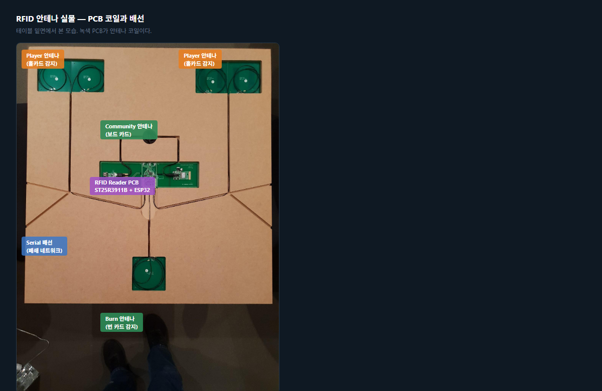
> *RFID 전자장비 설치 완료 상태. 중앙의 Reader Module(커뮤니티 카드 안테나 내장)에서 각 좌석 안테나와 Muck 안테나로 케이블이 연결된다. 여분 케이블은 안테나 위에 느슨하게 감아 놓는다. (출처: RFID VPT Build Guide V2, PokerGFX LLC)*

### 안테나 역할 상세

| 리더 | 수량 | 안테나 | 역할 |
|------|:----:|:------:|------|
| Seat Reader | 10대 | 각 1~2개 | 플레이어 홀카드 감지 (더블 사이즈 시 Omaha 등 다중 홀카드 지원) |
| Board Reader | 1대 (Reader Module 내장) | 통합 | 커뮤니티 카드 감지 (Flop/Turn/River) |
| Muck Reader | 1대 | 1~2개 | 폴드/버린 카드 감지 |
| **합계** | **12대** | **최대 22개** | Reader Module은 최대 22개 안테나 지원 |

---

## 5. 카드 인식 흐름

### 이중 연결 방식

카드 인식 장치와 서버 간 통신은 2가지 방식을 지원한다.

| 속성 | 무선(WiFi) | 유선(USB) |
|------|-----------|-----------|
| 안정성 | 보통 | 높음 |
| 보안 | 암호화 연결 | 물리 직결 |
| 리더 수 | 제한 없음 | 포트 수 제한 |
| 설치 | 무선 | 유선 필요 |
| 역할 | **기본** | **백업** |

무선 연결을 기본으로 사용하며, 장애 발생 시 유선으로 자동 전환된다.

### 카드 상태 관리

52장 카드는 사전 등록(REGISTER_DECK)으로 UID→카드 매핑이 완료된 상태에서 핸드 진행 중 5가지 상태를 순환한다:

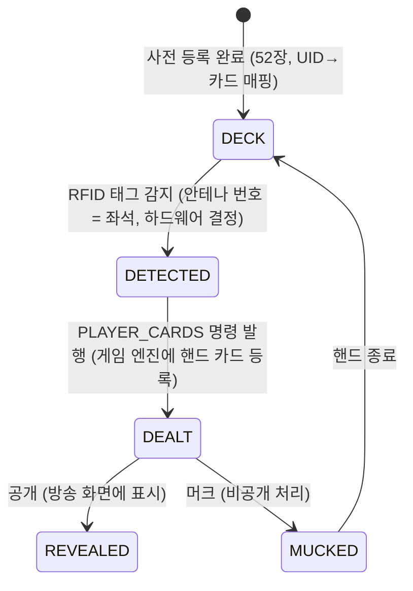

RFID 안테나는 각 좌석 아래에 물리적으로 고정되어 있다. 카드가 안테나 위에 놓이면 **UID로 카드 정체성**이, **안테나 번호(0~9)로 좌석**이 동시에 확정된다. "좌석 배정"은 소프트웨어가 수행하는 동작이 아니라 하드웨어 물리 위치에 의한 자동 결정이다.

전체 52장 추적 예시 (10인 Hold'em): 홀카드 20장(DEALT) + 보드 0~5장(DETECTED→DEALT) + Muck 가변(MUCKED) + 나머지(DECK) = **항상 52장**

**오류 복구**: 카드 인식 오류 시 MISS_DEAL(핸드 무효화), FORCE_CARD_SCAN(수동 재스캔) 명령으로 복구한다.

---

# Part III: 게임 엔진 설계

> **대상 독자**: 기술팀, 게임 로직 개발자
>
> 카드가 인식되면, 그 데이터를 해석할 규칙 엔진이 필요하다. Part I §2.2에서 소개한 게임 상태 엔진이 22개 포커 변형의 규칙, 베팅, 핸드 평가, 통계를 실시간으로 처리하는 과정을 다룬다.

## 6. 22개 포커 게임 지원

### 3대 계열 분류

포커 22가지 변형 게임은 3대 계열로 분류된다. 각 계열은 카드 배분, 베팅 라운드, 핸드 평가가 모두 다르다.

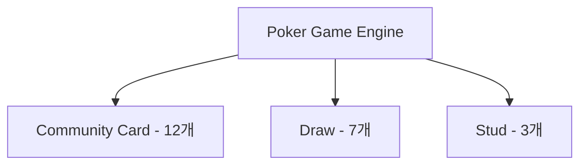

Community Card 12개, Draw 7개, Stud 3개 = 총 22개 게임을 지원한다.

> 각 게임의 기술 사양(홀카드 수, 보드 카드 수, 베팅 라운드 수, 특수 규칙 파라미터)은 **부록 A**에서 확인한다. 아래는 22개 게임의 핵심 규칙 차이점을 계열별로 설명한다.

### 계열별 비교

| 속성 | Community Card | Draw | Stud |
|------|---------------|------|------|
| **게임 수** | 12개 | 7개 | 3개 |
| **홀카드 수** | 2~6장 | 4~5장 | 7장 (3+4) |
| **커뮤니티 카드** | 최대 5장 | 없음 | 없음 |
| **카드 교환** | 없음 | 1~3회 | 없음 |
| **공개 카드** | 커뮤니티 전체 | 없음 | 4장 (3rd~6th) |
| **베팅 라운드** | 4 (Pre~River) | 2~4 | 5 (3rd~7th) |
| **RFID 추적** | 홀카드 + 보드 | 홀카드만 | 홀카드 + 공개 |
| **대표 게임** | Texas Hold'em | 2-7 Triple Draw | 7-Card Stud |

#### Community Card 계열 (12개)

| 그룹 | 게임 | 홀카드 | 핵심 규칙 |
|------|------|:------:|----------|
| Hold'em | Texas Hold'em | 2장 | 가장 보편적인 포커. 2장 비공개 + 5장 공유 카드 |
| | 6+ Hold'em (Straight>Trips) | 2장 | 36장 덱(2~5 제거). Straight가 Trips보다 강함 |
| | 6+ Hold'em (Trips>Straight) | 2장 | 36장 덱. Trips가 Straight보다 강함 (Triton 규칙) |
| | Pineapple | 3→2장 | 3장 받은 뒤 Flop 전에 1장을 버림 |
| Omaha | Omaha | 4장 | **반드시** 홀카드 2장 + 보드 3장 사용 (Hold'em과 핵심 차이) |
| | Omaha Hi-Lo | 4장 | 팟을 High/Low로 분할. Low 조건: 8 이하 5장 |
| | Five Card Omaha / Hi-Lo | 5장 | Omaha와 동일 규칙, 홀카드만 5장 |
| | Six Card Omaha / Hi-Lo | 6장 | Omaha와 동일 규칙, 홀카드만 6장 |
| Courchevel | Courchevel / Hi-Lo | 5장 | Pre-Flop 때 Flop 첫 카드 1장이 미리 공개됨 |

#### Draw 계열 (7개)

- **Five Card Draw**: 5장 → 1회 교환 → 쇼다운. High hand 승리
- **2-7 Single/Triple Draw**: Lowball — 낮은 패가 승리. A=High(불리), Flush/Straight도 불리. 최강 패: 2-3-4-5-7
- **A-5 Triple Draw**: Lowball — A=Low(유리), Flush/Straight 무시. 최강 패: A-2-3-4-5
- **Badugi**: 4장, 3회 교환. 4가지 수트 × 서로 다른 랭크 조합이 목표
- **Badeucy / Badacey**: 팟 분할 — 절반은 2-7(또는 A-5) Low, 나머지 절반은 Badugi

#### Stud 계열 (3개)

- **7-Card Stud**: 7장(3장 비공개 + 4장 공개), 5 베팅 라운드. 커뮤니티 카드 없음
- **7-Card Stud Hi-Lo**: Hi/Lo 팟 분할 (8-or-better Low)
- **Razz**: A-5 Lowball Stud. 낮은 패 승리. 최강 패: A-2-3-4-5

### 게임 상태 머신

모든 포커 게임은 상태 머신으로 동작한다. 계열별로 상태 흐름이 다르다.

**Community Card**: IDLE → SETUP_HAND → PRE_FLOP → FLOP → TURN → RIVER → SHOWDOWN → HAND_COMPLETE

**Draw**: IDLE → SETUP_HAND → DRAW_ROUND 1 → DRAW_ROUND 2 → ... → SHOWDOWN → HAND_COMPLETE

**Stud**: IDLE → SETUP_HAND → 3RD_STREET → 4TH → 5TH → 6TH → 7TH → SHOWDOWN → HAND_COMPLETE

Stud 계열 전체(7-Card Stud, 7-Card Stud Hi-Lo, Razz)는 7th Street(마지막 라운드)까지 진행한 후 Showdown으로 전환된다. 각 플레이어는 최대 7장(3 down + 4 up)을 받으며, 7th 이후 추가 라운드는 없다.

각 상태 전환에서 RFID 감지, 베팅 액션, 승률 재계산이 트리거된다.

---

## 7. 베팅 시스템

### 3가지 베팅 구조

| 구조 | 최소 베팅 | 최대 베팅 | 적용 게임 예시 |
|------|----------|----------|--------------|
| **No Limit** | Big Blind | All-in (전 칩) | NL Hold'em, NL Omaha |
| **Pot Limit** | Big Blind | 현재 팟 크기 | PLO (Pot Limit Omaha) |
| **Fixed Limit** | Small Bet / Big Bet | 고정 단위 (Cap: 보통 4 Bet) | Limit Hold'em, Stud |

### 7가지 Ante 유형

Ante는 핸드 시작 전 의무 납부금이다.

| Ante 유형 | 납부자 | 설명 |
|-----------|--------|------|
| **Standard** | 전원 | 전체 플레이어가 동일 금액 납부 |
| **Button** | 딜러만 | 딜러 버튼 위치 플레이어만 납부 |
| **BB Ante** | Big Blind만 | BB가 전원 Ante를 대납 |
| **BB Ante (BB 1st)** | Big Blind만 | BB Ante + BB가 먼저 행동 |
| **Live Ante** | 전원 | 앤티가 "라이브 머니"로 취급됨. Standard Ante에서는 앤티가 데드 머니(팟에 기여하지만 해당 플레이어의 현재 베팅으로 인정되지 않음)인 반면, Live Ante에서는 앤티 금액이 첫 베팅 라운드에서 해당 플레이어의 베팅으로 인정된다. 따라서 Live Ante를 낸 플레이어는 액션이 돌아왔을 때 Check 대신 Raise 옵션을 가지며, 누군가 레이즈했을 때 Live Ante를 낸 플레이어는 레이즈 금액에서 자신의 Live Ante를 차감한 금액만 내면 콜할 수 있다. 주로 캐시 게임에서 사용 |
| **TB Ante** | SB + BB | Two Blind 합산 Ante |
| **TB Ante (TB 1st)** | SB + BB | TB Ante + SB/BB 먼저 행동 |

> **참고**: 2018~2019년을 기점으로 대부분의 메인 토너먼트에서 Big Blind Ante(BB Ante)로 전환되었다. BB Ante 방식은 한 명(BB 위치)이 전원의 앤티를 대납하여 게임 진행 속도를 높이고 딜러와 플레이어 간의 수납 실수를 줄인다. 다만 BB Ante를 적용하지 않는 토너먼트도 존재한다. 하단의 특수 규칙(Bomb Pot, Run It Twice 등)은 현재 토너먼트에서 적용되는 경우가 드물지만, 일부 이벤트에서는 운용될 수 있다.

### 특수 규칙 4가지

| 규칙 | 설명 |
|------|------|
| **Bomb Pot** | 전원 합의 금액 납부 → Pre-Flop 건너뛰고 바로 Flop |
| **Run It Twice** | All-in 후 남은 보드를 2회 전개, 팟 절반씩 분할 |
| **7-2 Side Bet** | 7-2 오프슈트(최약 핸드)로 이기면 사이드벳 수취 |
| **Straddle** | 자발적 3번째 블라인드 (보통 2x BB) |

> **상세**: → [베팅 시스템 상세 가이드](games/PRD-GAME-04-betting-system.md) — 22종 게임별 매핑, 실전 시나리오, Dead/Live Money 설명 포함

---

## 8. 3가지 평가기와 게임 라우팅

### 핸드 등급 체계

| 등급 | 이름 | 확률 |
|:----:|------|-----:|
| 9 | Royal Flush | 0.0002% |
| 8 | Straight Flush | 0.0013% |
| 7 | Four of a Kind | 0.024% |
| 6 | Full House | 0.14% |
| 5 | Flush | 0.20% |
| 4 | Straight | 0.39% |
| 3 | Three of a Kind | 2.11% |
| 2 | Two Pair | 4.75% |
| 1 | One Pair | 42.26% |
| 0 | High Card | 50.12% |

### 평가기별 게임 라우팅

22개 게임이 모두 같은 방식으로 핸드를 평가하지 않는다.

| 평가기 | 대상 게임 | 설명 |
|--------|----------|------|
| **Standard High** | Texas Hold'em, Pineapple, 6+ Hold'em x2, Omaha, Five Card Omaha, Six Card Omaha, Courchevel, Five Card Draw, 7-Card Stud (10개) | 높은 핸드가 승리 |
| **Hi-Lo Splitter** | Omaha Hi-Lo, Five Card Omaha Hi-Lo, Six Card Omaha Hi-Lo, Courchevel Hi-Lo, 7-Card Stud Hi-Lo (5개) | High + Low 동시 평가, 팟 분할 |
| **Lowball** | Razz, 2-7 Single Draw, 2-7 Triple Draw, A-5 Triple Draw, Badugi, Badeucy, Badacey (7개) | 낮은 핸드가 승리 (역전) |

### Lookup Table 기반 즉시 평가

핸드 평가를 빠르게 하기 위해 **사전 계산된 참조 테이블**을 사용한다. 원리는 사전(辭典)과 같다.

**비유**: 7,462가지 포커 핸드 조합의 등급을 미리 계산해서 "사전"에 저장한다. 게임 중에는 카드 5장을 숫자로 변환해서 사전을 펼치면 답이 바로 나온다. 매번 계산하는 대신 **찾기만** 하면 된다.

**구체적인 예시**:

```
플레이어 카드: A♠ K♠ Q♠ J♠ 10♠

① 카드 → 숫자 변환: [12, 11, 10, 9, 8] + 같은 수트
② 사전에서 찾기: Table[해당 인덱스] → "Royal Flush, 등급 9"
③ 끝. 계산 없음.
```

이 방식은 Monte Carlo 시뮬레이션에서 10,000회 핸드 비교를 수행할 때 결정적으로 중요하다. 한 번의 비교가 느리면 10,000번 곱해져 전체 승률 계산이 200ms를 초과하게 된다.

**구체적으로 어떤 참조 테이블이 있는가?**

| 역할 | 용도 | 기획 관점 의미 |
|------|------|--------------|
| 핸드 등급 조회 | "이 5장은 무슨 패인가?" 즉시 답변 | Monte Carlo 10,000회의 기반 |
| Straight 판별 | "5장이 연속인가?" 즉시 답변 | Straight/Flush 즉시 확인 |
| 169 Pre-Flop 승률 | 169가지 시작 패(AA~72o)의 사전 승률 | Pre-Flop 승률 즉시 표시 |
| Omaha 6장 전용 | 6장에서 최적 조합 사전 계산 | Six Card Omaha 지원 |

Texas Hold'em에서는 2장 홀카드 조합이 169가지뿐이므로 모든 매치업의 승률을 미리 계산해둘 수 있다. Pre-Flop 단계에서 "AA vs KK"의 승률이 즉시 표시되는 것은 이 사전 계산 덕분이다.

> **Lookup Table 상세**: 핵심 8개 테이블 구조, Memory-Mapped 파일, 538개 정적 배열 초기화 등은 기술 설계 문서를 참조한다.
> → `docs/02-design/pokergfx-lookup-tables.md`

---

## 9. 통계 엔진

### 실시간 Equity 계산

모든 플레이어의 홀카드와 보드 카드가 인식되면, 시스템은 각 플레이어의 승률을 실시간으로 계산한다.

| 스트리트 | 알려진 카드 | 계산 방법 |
|----------|-------------|-----------|
| Preflop | 홀카드만 | PocketHand169 LUT 또는 Monte Carlo |
| Flop | 홀카드 + 3장 | Turn/River 조합 시뮬레이션 |
| Turn | 홀카드 + 4장 | River 1장 시뮬레이션 |
| River | 홀카드 + 5장 | 확정 (승자 결정) |

2~10명 동시 계산을 지원하며, 타이 확률과 아웃츠 분석도 포함된다.

### 플레이어 통계

세션 동안 축적된 핸드 데이터로 플레이어별 통계를 계산한다.

| 통계 | 축약어 | 의미 |
|------|--------|------|
| **VPIP** | Voluntarily Put money In Pot | 자발적으로 팟에 참여한 비율 |
| **PFR** | Pre-Flop Raise | 프리플롭에서 레이즈한 비율 |
| **AGR** | Aggression Factor | 공격적 플레이 비율 |
| **WTSD** | Went To ShowDown | 쇼다운까지 간 비율 |
| **3Bet%** | Three-Bet Percentage | 3벳 빈도 |
| **CBet%** | Continuation Bet Percentage | 컨티뉴에이션 벳 빈도 |
| **WIN%** | Win Rate | 핸드 승률 |
| **AFq** | Aggression Frequency | 공격 빈도 |

이 통계는 플레이어의 플레이 스타일을 정량화하며, GTO(Game Theory Optimal) 전략 수립의 기초 데이터로 활용된다. GFX Console의 리더보드에 표시되거나, Viewer Overlay에 LIVE Stats로 노출될 수 있다.

---

# Part IV: 그래픽 설계

> **대상 독자**: 기술팀, 프론트엔드/그래픽 개발자
>
> 게임 엔진이 생성한 데이터를 시청자에게 보여주는 그래픽 렌더링 계층을 다룬다.

## 10. 그래픽 요소 체계

### 4가지 요소 타입

모든 방송 그래픽은 4가지 기본 요소의 조합이다.

| 요소 | 필드 수 | 용도 |
|------|:-------:|------|
| **Image** | 41 | 카드 이미지, 로고, 배경 — x, y, width, height, alpha, source, crop, rotation, z_order, animation |
| **Text** | 52 | 플레이어 이름, 칩 카운트, 승률, 팟 — font, size, color, alignment, shadow, auto_fit, animation |
| **Pip** | 12 | PIP(Picture-in-Picture) — 카메라 입력을 캔버스의 임의 위치에 배치하는 요소. src_rect에서 캡처한 비디오를 dst_rect에 렌더링한다 — src_rect, dst_rect, opacity, z_pos, dev_index, scale, crop |
| **Border** | 8 | 테두리, 구분선, 강조 표시 — color, thickness, radius |

### 애니메이션 시스템

16개 Animation State x 11개 Animation Class:

| Animation Class | 설명 |
|----------------|------|
| FadeIn/FadeOut | 투명도 전환 |
| SlideLeft/Right | 수평 슬라이드 |
| SlideUp/Down | 수직 슬라이드 |
| ScaleIn/Out | 크기 전환 |
| FlipHorizontal/Vertical | 뒤집기 |
| Pulse | 반복 강조 |
| Flash | 깜빡임 |
| Bounce | 탄성 효과 |
| Rotate | 회전 |
| Custom | 커스텀 키프레임 |

### 실제 방송 오버레이 해부도

> 데이터 기준: WSOP Paradise 2025 Super Main Event Final Table
> GGPoker/WSOP 공식 방송 — Binder-Thorel-Reid hand, Flop: 4♣ 9♦ Q♦

원본 방송 화면:


오버레이 요소 번호 주석 (좌표: `data/overlay-anatomy-coords.json`, 재생성: `python scripts/annotate_anatomy.py`):


> 좌표 편집: `scripts/coord_picker.html`을 브라우저에서 열고 원본 PNG 업로드 → 드래그로 박스 정의 → JSON 내보내기

#### 오버레이 요소 카탈로그

| # | 요소 | 위치 | 좌표(px) | 실제 데이터 | GFX 타입 |
|:-:|------|------|----------|------------|----------|
| 1 | **Player Info Panel** | 좌측 세로 스택 | (40, 53, 188×237) | 이름, 칩(437M/338M/237M), 국적 플래그, 사진 | Text + Image |
| 2 | **홀카드 표시** | Panel 우상단 | (107, 51, 44×33) | K♣9♣ / Q♠J♠ / A♥6♠ (Broadcast Canvas만) | Image (pip) |
| 3 | **Action Badge** | Panel 중단 | (104, 91, 47×13) | CHECK(녹색 pill), FOLD(적색), RAISE(황색) | Text + Border |
| 4 | **승률 바** | Panel 최하단 | (202, 63, 36×21) | 청록 바, 비율 연동 (이 장면에서 Thorel ≈65%) | Border + Text |
| 5 | **커뮤니티 카드** | 테이블 중앙 펠트 | (259, 271, 123×39) | 4♥, 9♠, Q♦ (Flop 3장) | Image (pip) |
| 6 | **이벤트 배지** | 우측 상단 | (565, 10, 59×77) | 2025 WSOP PARADISE + WSOP 로고 | Text + Image |
| 7 | **Bottom Info Strip** | 하단 전체 | (74, 312, 490×44) | BLINDS, 이벤트 배지, POT, FIELD, FINAL TABLE | Text + Border |
| 8 | **팟 카운터** | 하단 중앙 강조 | (264, 320, 108×23) | 42,000,000 (18px 대형 표시) | Text |
| 9 | **FIELD / 스테이지** | 하단 우측 | (392, 317, 162×24) | 5 / 2891, FINAL TABLE 배지 | Text |
| 10 | **스폰서 로고** | 하단 스트립 중앙 | (282, 343, 77×15) | GGPoker 브랜딩 | Image |

**좌표 정보**: 전체 오버레이 요소의 정확한 좌표, 크기, 프로토콜 명령어는 [`data/overlay-anatomy-coords.json`](data/overlay-anatomy-coords.json)에서 관리된다. 이 파일은 스킨 편집기, 오버레이 레이아웃 도구, 좌표 픽커와 연동된다.

#### 요소별 상세 설명

**Player Info Panel (요소 1)**

- 활성 플레이어 수에 따라 동적 높이 조절
- Fold한 플레이어는 패널 축소 또는 반투명 처리
- 홀카드 표시는 Broadcast Canvas 한정 (운영자용 프리뷰에서만 표시)
- 프로토콜 명령어: `SHOW_PANEL`

**커뮤니티 카드 (요소 5)**

- Flop (3장), Turn (4장), River (5장)에 따라 동적 갱신
- 카드 이미지는 PIP(Portable Image Protocol) 렌더링
- 프로토콜 명령어: `SHOW_PIP`

**Bottom Info Strip (요소 7)**

- 전체 폭(640px) 고정
- Bottom Strip: 블라인드, 팟, 필드 정보 통합 표시
- 프로토콜 명령어: `SHOW_STRIP`

---

> **참고**: 각 오버레이 요소의 스킨 편집 방법, CSS 커스터마이징, 애니메이션 규칙은 [UI 설계 개요](pokergfx-ui-overview.md)를 참조한다.

---

# Part V: 시스템 구조

> **대상 독자**: 기술팀, 시스템 아키텍트
>
> RFID가 카드를 인식하고(Part II), 게임 엔진이 규칙을 적용하며(Part III), GPU가 화면에 합성한다(Part IV). 이 3가지 핵심 계층이 하나의 시스템 안에서 어떻게 연결되는지, 전체 구조를 조감한다.

## 11. 시스템 전체 조감도

### 데이터 파이프라인

RFID 카드 인식부터 방송 송출까지, 데이터가 5단계를 거쳐 흐른다.

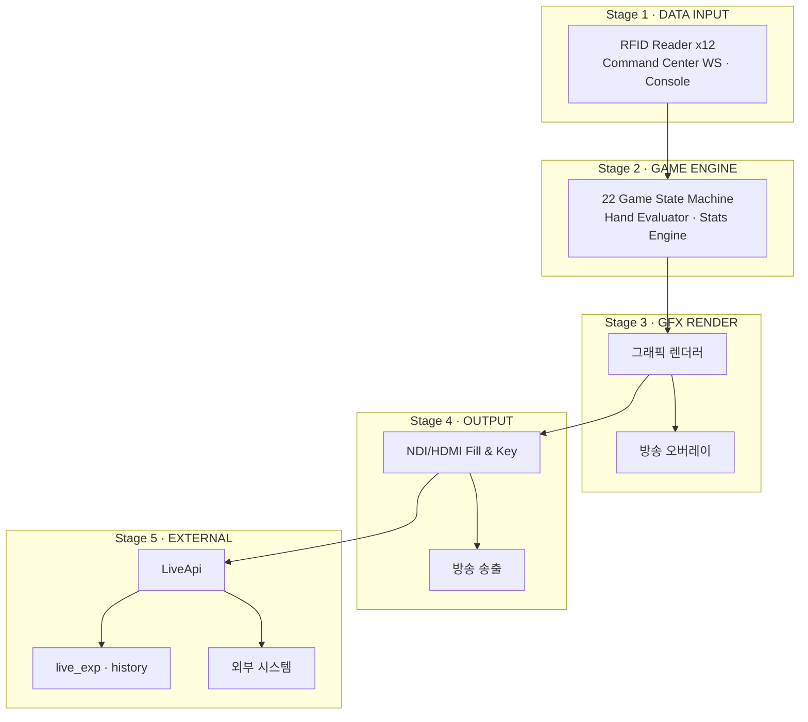

| Stage | 역할 | 주요 구성요소 |
|:-----:|------|-------------|
| **1. Data Input** | 외부 데이터 수집 | RFID Reader x12 (USB/WiFi), Command Center (WebSocket), Console (Flutter) |
| **2. Game Engine** | 게임 상태 연산 | 22개 게임 상태 머신, 핸드 평가기 (사전 계산 참조표), 통계 엔진 (세션 통계) |
| **3. GFX Render** | 그래픽 합성 | 그래픽 렌더러 — 카메라 영상 위에 오버레이 실시간 합성 |
| **4. Output** | 방송 송출 | NDI/HDMI 출력, Fill & Key 채널, 녹화/스트리밍 |
| **5. External** | 외부 데이터 전달 | LiveApi (TCP delta 스트리밍), live_export (핸드 단위 JSON), HAND_HISTORY (요청-응답) |

### EBS 데이터 파이프라인 (6계층)

위의 5-Stage 파이프라인은 EBS Core Server 내부의 실시간 처리 흐름이다. EBS 전체로 보면, 서버가 생성한 데이터가 6계층 파이프라인을 통해 최종 출력까지 흐른다.

| 계층 | 이름 | 역할 | Phase |
|:----:|------|------|:-----:|
| L0 | FIELD | 현장 데이터 생성 (RFID Reader x12, Command Center, EBS Core Server) | 1 |
| L1 | INPUT | 원본 데이터 수집 (NAS JSON, WSOP+ API, Google Sheets) | 1 |
| L2 | STORAGE | 6개 도메인 독립 저장소 (Supabase) | 2+ |
| L3 | ORCHESTRATION | 통합 계층 — Unified Views, Job Scheduler | 3+ |
| L4 | DASHBOARD | 운영 대시보드 — 큐시트, AE 렌더 | 4+ |
| L5 | OUTPUT | 최종 출력 — Hot(실시간)/Warm(렌더)/Cold(아카이브) | 4+ |

> **Phase 1 범위**: 이 문서(Foundation)가 다루는 영역은 L0-L1이다. L2~L5의 상세 데이터 구조는 [EBS 데이터 추출 PRD](PRD-EBS_DB_Schema.md)를 참조한다.

**4계층 데이터 구조**: EBS의 원시 데이터는 세션 → 핸드 → 플레이어 → 액션의 4계층으로 구성된다. 야구 비유로 보면 시리즈(세션) → 이닝(핸드) → 타자(플레이어) → 타석(액션)에 해당한다.

**데이터 생애주기**: Hot(PostgreSQL, 실시간 < 100ms) → Warm(NAS/Nexrender, 렌더 ~100ms, 30일) → Cold(Vimeo/Archive, VOD 아카이브, 무기한) 3-tier로 관리된다.

**Live Data Export ↔ NAS JSON 관계**: EBS Core Server의 Stage 5 External 출력(live_export)은 핸드 종료 시 JSON을 생성한다. 이 JSON이 L1(NAS)에 저장되어 전체 파이프라인의 입구가 된다. 동일한 데이터의 두 가지 관점(실시간 출력 vs 파이프라인 입구)이다.

### 프로세스 경계

EBS는 **단일 Flutter 앱 + FastAPI 서버**로 구성된다. 앱 내에서 RBAC 역할에 따라 Lobby, Console, Command Center 화면이 분리되며, 모든 화면은 WebSocket으로 서버와 통신한다.

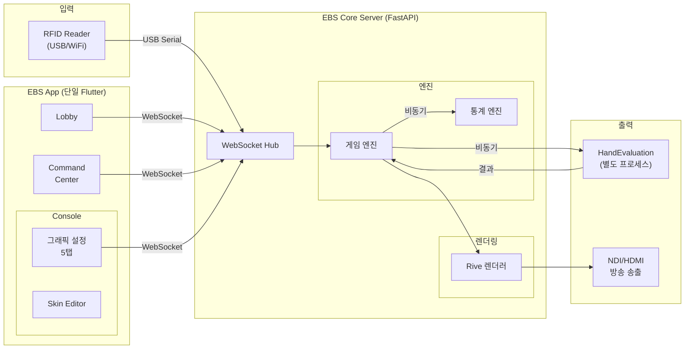

**데이터 흐름 순서**:

1. Command Center에서 운영자가 게임 커맨드(베팅/액션)를 입력하면 WebSocket으로 서버에 전달
2. WebSocket Hub가 명령을 게임 엔진 상태로 변환
3. 게임 엔진이 HandEvaluation에 비동기 승률 계산 요청
4. HandEvaluation이 Monte Carlo 결과를 반환
5. Rive 렌더러가 승률을 오버레이에 반영하여 NDI/HDMI로 출력

HandEvaluation은 비동기로 동작하여 수백ms 계산이 걸려도 게임 진행이나 렌더링을 블로킹하지 않는다.

**EBS Core Server 내부**: 게임 엔진, 핸드 평가기, 통계 엔진, Rive 렌더러, WebSocket 서버가 단일 프로세스 내에서 모듈로 분리되어 있다.

**별도 프로세스**: HandEvaluation만 독립 프로세스다. Monte Carlo 시뮬레이션의 CPU 부하를 서버에서 분리하기 위함이다. Lobby, Console, Command Center는 별도 프로세스가 아니라 **단일 Flutter 앱 내의 화면**이므로 WebSocket으로 서버와 직접 통신한다.

### Stage별 UI 크로스 레퍼런스

각 Stage를 운영자가 직접 조작하는 UI 화면과 대응시킨다.

| Stage | 역할 | 대응 UI 화면 | 설정 시점 |
|:-----:|------|------------|----------|
| **1. Data Input** | RFID + CC + Console 입력 | Settings (RFID 연결/캘리브레이션), Command Center (게임 커맨드 입력) | 준비 단계 + 본방송 |
| **2. Game Engine** | 게임 상태 연산 | Rules 탭 (Bomb Pot/Straddle 등 규칙 정의) | 준비 단계 |
| **3. GFX Render** | 그래픽 합성 | GFX 탭 — Layout/Visual/Display/Numbers 서브탭, Skin Editor, Graphic Editor | 사전 준비 + 준비 단계 |
| **4. Output** | 방송 송출 | Outputs 탭 (해상도, Fill & Key, 녹화/스트리밍), Sources 탭 (카메라/스위처) | 준비 단계 |
| **5. External** | 외부 데이터 전달 | System 탭 (Export 설정), Main Window (모니터링) | 준비 단계 |

> **UI 화면 상세**: 각 화면의 레이아웃, UI 요소 카탈로그, 워크플로우는 [UI 설계 개요](pokergfx-ui-overview.md)를 참조한다.

### 방송 송출 모드

PokerGFX는 2가지 방송 송출 방식을 지원한다.

**Internal 모드** (직접 합성): 서버가 카메라 입력을 수신하여 그래픽을 실시간 합성한 뒤 NDI/HDMI로 직접 출력한다. 파이프라인의 Stage 1→2→3→4 경로다.

**External 모드** (간접 관여): 서버의 Live Data Export 기능(Stage 5)을 통해 게임 데이터를 외부 시스템에 전달하고, 프로덕션 팀이 이를 가공하여 자막/그래픽을 별도 제작한다. 이 워크플로우는 핸드가 종료되는 시점마다 본방송 내에서 실시간으로 처리된다. External 모드는 Live Data Export 라이선스(Professional+)가 필요하다. `[PokerGFX 전용]`

> **참고**: 자동 카메라 전환과 현장/방송 분리 출력(Dual Canvas) 기능은 EBS v1에서 구현 범위 밖이다.

---

## 12. 서비스 인터페이스

Server와 클라이언트 앱 사이의 통신은 5개 서비스 영역으로 구성된다. 각 서비스는 명확한 책임 영역을 가진다.

### 5개 서비스 영역

| 서비스 | 주요 기능 |
|--------|----------|
| **GameService** | 게임 시작/종료, 게임 유형 전환, 게임 정보 조회 |
| **PlayerService** | 좌석 등록/퇴장, 칩 관리, 플레이어 통계 |
| **CardService** | 카드 딜/공개/머크, 보드 카드 관리, 덱 상태 조회 |
| **DisplayService** | 오버레이 표시/숨김, 스킨/레이아웃 전환, 보안 모드 |
| **MediaService** | 비디오/오디오 재생, 로고/티커 관리, 프레임 캡처 |

> **용어**: ToggleTrust, SetTicker 등은 [용어 사전](pokergfx-glossary.md#시스템-용어)을 참조한다.

### 99개 명령어 11개 카테고리

| 카테고리 | 수량 | 설명 | 대표 명령어 |
|----------|:----:|------|-----------|
| Connection | 9 | 서버 연결/인증/상태 | CONNECT, AUTH, KEEPALIVE, HEARTBEAT |
| Game | 13 | 게임 시작/종료/타입 변경 | GAME_INFO, START_HAND, RESET_HAND, GAME_TYPE |
| Player | 21 | 좌석/칩/통계 | PLAYER_INFO, PLAYER_BET, PLAYER_ADD/DELETE |
| Cards & Board | 9 | 카드 딜/공개/Muck | BOARD_CARD, CARD_VERIFY, FORCE_CARD_SCAN |
| Display | 17 | 오버레이/레이아웃 | GFX_ENABLE, FIELD_VISIBILITY, SHOW_PANEL |
| Media & Camera | 13 | 비디오/오디오/로고 | MEDIA_PLAY, CAM, PIP, VIDEO_SOURCES |
| Betting | 5 | 베팅 액션/팟/사이드팟 | PAYOUT, CHOP, MISS_DEAL |
| Data Transfer | 3 | 설정 동기화/내보내기 | SKIN, AT_DL |
| RFID | 3 | RFID 리더 상태 조회 | READER_STATUS, TAG, TAG_LIST |
| History | 3 | 핸드 이력/리플레이 | HAND_HISTORY, HAND_LOG, COUNTRY_LIST |
| Slave / Multi-GFX | 3 | 멀티 GFX 동기화 | SLAVE_STREAMING, STATUS_SLAVE, STATUS_VTO |
| **합계** | **99** | 11개 카테고리 (내부 전용 명령 ~31개 별도) | |

### 16개 실시간 이벤트

서버가 클라이언트에 Push하는 이벤트:

| 이벤트 | 트리거 |
|--------|--------|
| OnCardDetected / OnCardRemoved | RFID 카드 감지/제거 |
| OnBetAction | 베팅 액션 발생 |
| OnPotUpdated | 팟 변경 |
| OnHandComplete | 핸드 종료 |
| OnGameStateChanged | 상태 전환 |
| OnPlayerAdded / OnPlayerRemoved | 플레이어 등록/퇴장 |
| OnChipsUpdated | 칩 변경 |
| OnWinProbabilityUpdated | 승률 갱신 |
| OnSkinChanged | 스킨 변경 |
| OnOverlayToggled | 오버레이 전환 |
| OnSecurityModeChanged | 보안 모드 전환 |
| OnTimerStarted / OnTimerExpired | Shot Clock 시작/만료 |
| OnConnectionStatusChanged | 연결 상태 변경 |

### GameInfoResponse: 단일 상태 메시지 (75+ 필드)

서버와 클라이언트 간 게임 상태는 단일 메시지로 전달된다:

| 카테고리 | 필드 수 | 주요 필드 |
|---------|:-------:|----------|
| 블라인드 | 8 | Ante, Small, Big, Third, ButtonBlind, BringIn, BlindLevel, NumBlinds |
| 좌석 | 7 | PlDealer, PlSmall, PlBig, PlThird, ActionOn, NumSeats, NumActivePlayers |
| 베팅 | 6 | BiggestBet, SmallestChip, BetStructure, Cap, MinRaiseAmt, PredictiveBet |
| 게임 | 4 | GameClass, GameType, GameVariant, GameTitle |
| 보드 | 5 | OldBoardCards, CardsOnTable, NumBoards, CardsPerPlayer, ExtraCardsPerPlayer |
| 상태 | 6 | HandInProgress, EnhMode, GfxEnabled, Streaming, Recording, ProVersion |
| 디스플레이 | 7 | ShowPanel, StripDisplay, TickerVisible, FieldVisible, PlayerPicW, PlayerPicH |
| 특수 | 6 | RunItTimes, RunItTimesRemaining, BombPot, SevenDeuce, CanChop, IsChopped |
| 드로우 | 4 | DrawCompleted, DrawingPlayer, StudDrawInProgress, AnteType |
| **소계** | **53** | + 플레이어별 20필드 x 10명(일부 반복) = **75+** |

---

## 13. 서버 구성

### 서버 접속

EBS App은 브라우저에서 서버 URL에 접속하여 WebSocket으로 연결된다. 로그인 시 RBAC 역할(Admin/Operator/Viewer)이 결정되며, 역할에 따라 접근 가능한 뷰와 테이블이 제한된다. Operator는 할당된 테이블의 Game 탭만 표시되고, Admin은 전체 Console View + 모든 테이블의 Game 탭에 접근한다.

### 멀티테이블 아키텍처

#### Phase 1-2: 단일 테이블 (1 Server = 1 Table)

Phase 1-2에서는 PokerGFX와 동일한 **1 서버 = 1 테이블** 모델을 따른다. Admin 1명이 동일 PC에서 Lobby, Console, Command Center를 모두 조작한다.

#### Phase 3+: 멀티테이블 (1 Server = N Tables)

WSOP 메인 이벤트처럼 4~8개 테이블을 동시에 방송하는 경우, EBS Core Server 1대가 **테이블별 독립 상태를 관리**한다. 각 테이블의 GameState는 격리되며, Admin은 Lobby에서 전체 테이블을 관제하고, 각 Operator는 Lobby에서 할당된 테이블의 Command Center만 접근한다.

| 구성 | Phase 1-2 | Phase 3+ |
|------|:---------:|:--------:|
| 서버 | 1 Server = 1 Table | 1 Server = N Tables (테이블별 상태 격리) |
| Admin | 1명 (Lobby+Console+CC 겸임) | 1명 (Lobby+Console+전체 모니터링) |
| Operator | — (Admin이 겸임) | 테이블당 1명 (Lobby→CC) |
| 통신 | WebSocket (단일 테이블) | WebSocket (테이블별 채널 분리) |

> **PokerGFX 원본과의 차이**: PokerGFX는 멀티테이블 시 테이블마다 독립된 Master 서버를 실행하여 물리적으로 분리했고, 테이블 간 프로토콜 연동이 없었다. EBS는 단일 서버에서 N개 테이블 상태를 관리하여 **Admin이 Lobby에서 전체 이벤트를 관제**할 수 있도록 한다.

#### 다중 출력 (Master-Slave)

하나의 테이블에서 다수의 출력을 분산하기 위해 Master-Slave 구조를 사용한다.

- **Master**: 게임 상태 관리, RFID 제어, 핸드 평가, 이벤트 발행 — 단일 원본
- **Slave**: Master의 게임 상태를 미러링하여 **독립적인 렌더링 출력**을 제공

| 출력 장치 | 담당 | 내용 |
|-----------|------|------|
| Master 본체 | Admin Console View | 관리 인터페이스 + 미리보기 |
| Slave 1 | 방송 출력 (NDI/HDMI) | 그래픽 합성 방송 화면 |
| Slave 2 | 추가 중계 화면 | 해설석, VIP 라운지 등 |

---

# Part VI: 운영 워크플로우

> **대상 독자**: 모든 독자 (운영자, 기획자 필독)
>
> 3가지 핵심 계층의 세부 설계와 시스템 구조를 파악했으니, 실제 방송 현장에서 "누가, 어떻게 사용하는가"를 살펴본다.

## 14. 사용자 역할

### RBAC 역할 모델

EBS는 단일 Flutter 앱 내에서 **로그인 역할에 따라 접근 가능한 화면이 달라지는** RBAC(Role-Based Access Control) 모델을 사용한다.

| 역할 | Lobby | Console | Command Center | 테이블 범위 |
|------|:-----:|:-------:|:--------------:|:----------:|
| **Admin** | 모든 테이블 + Setup | 5탭 전부 | 모든 테이블 | 전체 |
| **Operator** | 할당 테이블만 + Setup | 접근 불가 | 할당 테이블만 | 1개 |
| **Viewer** | 모든 테이블 (읽기) | 읽기만 | 읽기만 | 전체 |

**Phase 1-2 (단일 테이블)**: Admin 1명이 Lobby, Console, Command Center를 모두 조작한다. Operator 역할은 사용하지 않으며, Admin이 설정과 게임 진행을 모두 담당한다. PokerGFX의 "GFX 운영자 1명" 모델과 동일하다.

**Phase 3+ (멀티 테이블)**: Admin 1명이 Lobby + Console에서 전체 테이블을 관제하고, 각 테이블에 Operator 1명이 Lobby에서 할당된 테이블의 Command Center에 접속하여 게임을 진행한다. Admin은 필요 시 특정 테이블의 Command Center에 직접 개입할 수 있다.

나머지 역할(방송 감독, 딜러 등)은 Viewer 권한으로 모니터만 확인하거나, EBS 앱을 직접 다루지 않는다.

- **방송 감독**: Viewer Overlay 출력을 비디오 스위처로 수신
- **시스템 관리자**: 프리프로덕션 단계에서 Settings 메뉴(서버 설정, RFID 구성, 네트워크)를 Admin 권한으로 관리

### 운영 워크플로우 (역할별)

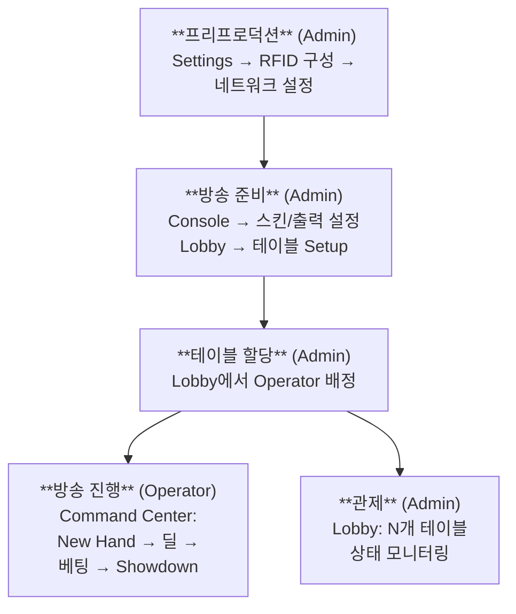

---

## 15. 방송 준비 워크플로우

### 전체 준비 흐름

방송 시작 전 **GFX 운영자**가 모든 준비 체크리스트를 관리한다. 시스템 관리자는 서버 시작과 라이선스 활성화만 담당하고, 나머지 설정은 GFX 운영자가 순차적으로 수행한다.


> *포커 방송 프로덕션 현장. 4K 지브 카메라, SEETEC 모니터, 조명 장비가 포커 테이블을 중심으로 배치된다. Server의 Sources 탭에서 이 카메라들을 관리한다. (출처: pokercaster.com)*

### HW/SW 설정 분류

로그인 후 하드웨어 설정과 소프트웨어 설정은 병렬로 진행할 수 있다. 소프트웨어 설정은 Console(Admin, 그래픽/출력 설정)과 Lobby > Setup(테이블별 게임 설정+플레이어 등록)으로 구분된다. Console에서 스킨/출력을 설정하고, Lobby의 Setup에서 게임유형/블라인드/플레이어 등록과 좌석 배치를 수행한다.

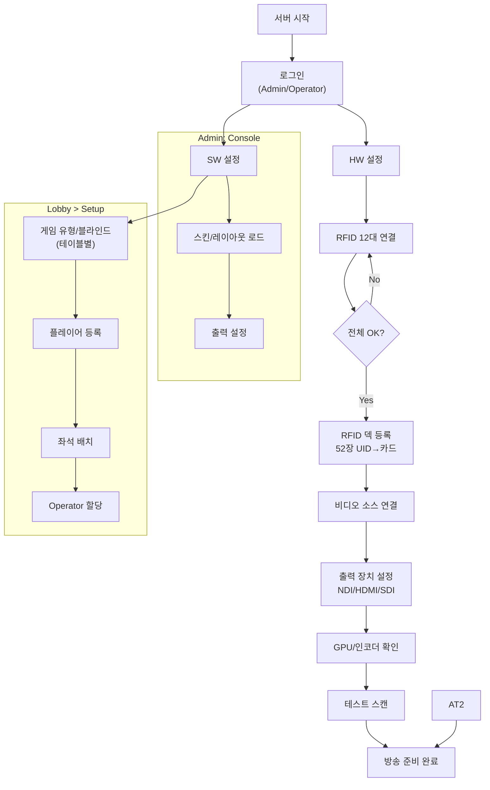

### 준비 체크리스트

| 경로 | 단계 | 담당 | 뷰 | 확인 항목 | 정상 기준 |
|:----:|:----:|------|:--:|----------|----------|
| 공통 | 1 | Admin | Settings | 서버 시작 + 라이선스 | 라이선스 활성 상태 |
| HW | 2 | Admin | Console | RFID 리더 연결 | 12대 전체 reader_state = ok |
| HW | 3 | Admin | Console | RFID 덱 등록 | 52장 UID→카드 매핑 완료 |
| HW | 4 | Admin | Console | 비디오 소스 연결 | 카메라/캡처카드 입력 정상 |
| HW | 5 | Admin | Console | 출력 장치 설정 | NDI/HDMI/SDI 출력 정상 |
| HW | 6 | Admin | Console | GPU/인코더 확인 | 그래픽 합성 및 송출 정상 |
| HW | 7 | Admin | Console | 테스트 스캔 | 카드 1장 → 화면 표시 확인 |
| SW | 8 | Admin | Console | 스킨/레이아웃 로드 | 로드 성공, 미리보기 정상 |
| SW | 9 | Admin | Console | 출력 설정 | NDI/RTMP/SRT 정상 |
| SW | 10 | Admin/Op | Lobby > Setup | 게임 유형/블라인드 선택 | 22개 중 1개, 블라인드/앤티 설정 |
| SW | 11 | Admin/Op | Lobby > Setup | 플레이어 등록 | 좌석별 이름, 칩 스택 입력 |
| SW | 12 | Admin/Op | Lobby > Setup | 좌석 배치 | 딜러/SB/BB 포지션 확인 |
| SW | 13 | Admin | Lobby | Operator 테이블 할당 | 각 테이블 Operator 배정 |
| SW | 14 | 자동 | — | HandEvaluation 접속 | HE 프로세스 자동 연결 |

> **Phase 1-2**: Admin이 단계 1~14를 모두 수행한다 (Operator 역할 겸임).
> **Phase 3+**: Admin이 단계 1~9, 13~14를 수행하고, 각 테이블의 Operator가 단계 10~12를 Lobby > Setup에서 수행한다.

---

## 16. 게임 진행 워크플로우

### 핸드별 반복 루프 (Community Card 기준)

Community Card 게임(Texas Hold'em 등 12개)의 1 Hand Cycle:

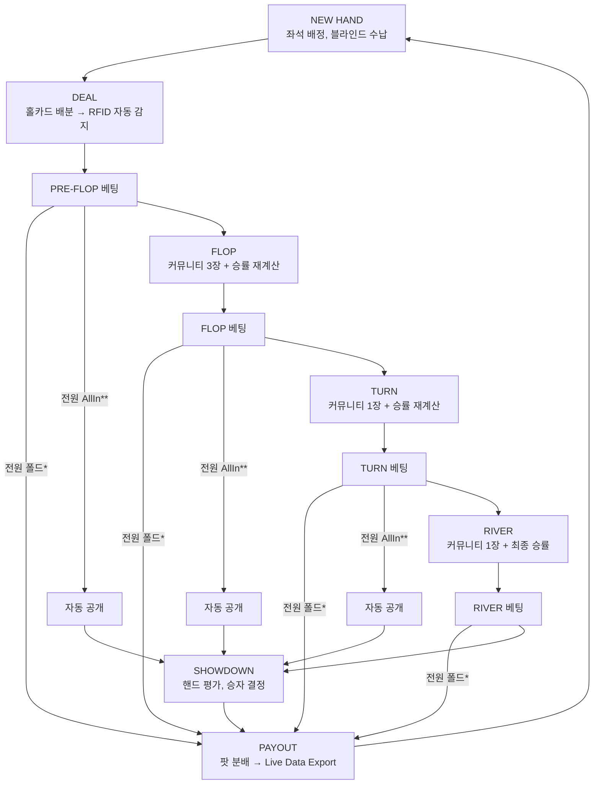

> \* 전원 폴드: 누군가의 베팅/레이즈 후 나머지 전원이 폴드. 1명만 남으면 카드 공개 없이 즉시 팟 지급.
> \*\* 전원 AllIn: 모든 활성 플레이어가 올인. 남은 커뮤니티 카드를 자동 공개하고 SHOWDOWN 진행.

각 단계에서 EBS Core Server가 수행하는 처리:

| 단계 | RFID | 엔진 | 렌더링 | 출력 |
|------|------|------|--------|------|
| Deal | 홀카드 자동 감지 | 좌석에 카드 배정 | 홀카드 표시 (Broadcast만) | Overlay |
| Flop/Turn/River | 보드 카드 감지 | 승률 재계산 (Monte Carlo) | 보드 + 승률 갱신 | Overlay |
| 베팅 | — | 팟 계산, 액션 기록 | 베팅 금액/액션 표시 | Overlay |
| Showdown | — | 핸드 등급 평가 | 승자 강조 | Overlay + Live Data Export |

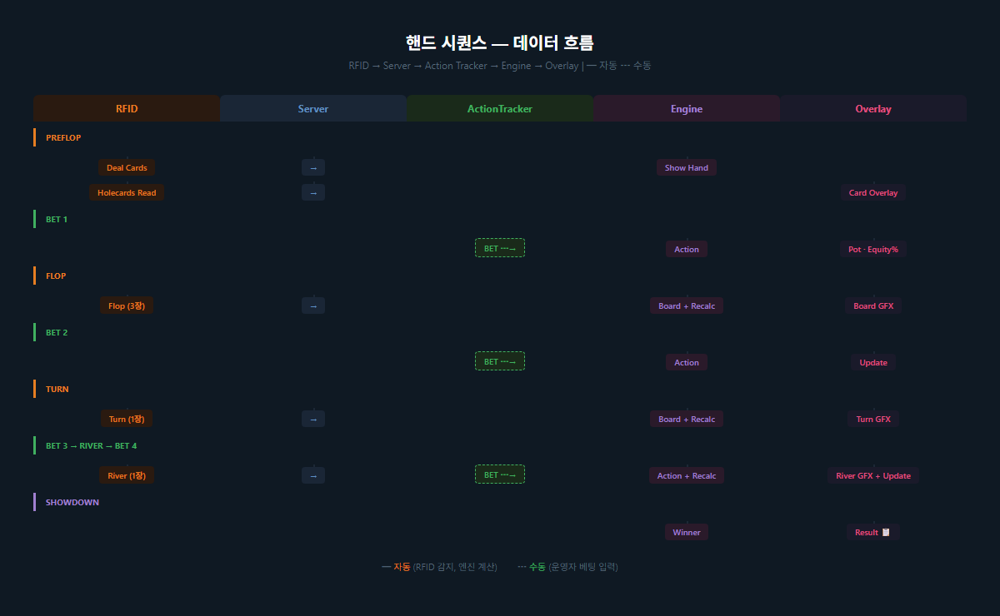
> *다이어그램의 "recalc" 단계: Flop·Turn·River 카드가 공개될 때마다 실행되는 승률 자동 재계산. Monte Carlo 시뮬레이션으로 각 플레이어의 Equity(%)를 갱신하여 오버레이에 즉시 반영한다. River 이후에는 모든 패가 확정되므로 recalc 없이 확정 승자 결정으로 직행한다.*

### 게임 계열별 핸드 분기

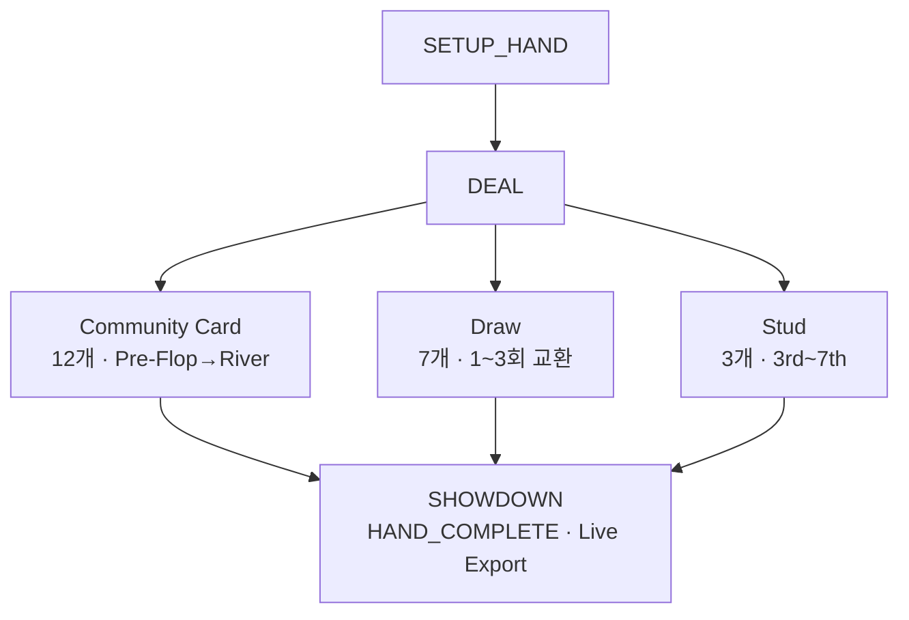

### 특수 상황 분기

| 상황 | 발생 시점 | 처리 |
|------|----------|------|
| **전원 폴드** | 모든 베팅 라운드 | 누군가의 베팅/레이즈 후 나머지 전원 폴드 → 활성 1명, SHOWDOWN 생략, 즉시 팟 지급 |
| **전원 AllIn** | 모든 베팅 라운드 | 모든 활성 플레이어 AllIn → 남은 카드 자동 공개 → SHOWDOWN (중간 베팅 생략) |
| **Bomb Pot** | Pre-Flop 직전 | 전원 강제 납부 → Flop 직행 (Pre-Flop 건너뜀) |
| **Run It Twice** | All-in 후 | 보드 2회 전개, 팟 절반 분할 |
| **Miss Deal** | 카드 배분 오류 | 현재 핸드 무효화, 카드 재분배 |

---

## 17. 핸드 히스토리 및 Playback

### 핸드 히스토리 저장

시스템은 **각 핸드가 종료될 때마다** 전체 핸드 데이터를 즉시 생성하고 저장한다. 모든 핸드가 종료된 후 일괄 처리하는 것이 아니라, 핸드 단위로 실시간 생성된다.

| 데이터 | 내용 |
|--------|------|
| 핸드 메타 | 핸드 번호, 시간, 게임 타입, 블라인드 |
| 플레이어 | 이름, 좌석, 시작 스택, 최종 스택 |
| 홀카드 | 각 플레이어의 홀카드 |
| 액션 | 매 스트리트별 모든 액션 (Fold/Check/Call/Bet/Raise/All-In + 금액) |
| 보드 | Flop/Turn/River 카드 |
| 결과 | 승자, 팟 분배 |

> 핸드 히스토리를 포함한 데이터 출력 경로(LiveApi, live_export, HAND_HISTORY)와 라이선스 게이팅 상세는 "엔진 + 클라이언트 생태계" 섹션을 참조한다. 핸드 데이터의 필드 정의와 L2 DB 매핑은 [EBS 데이터 추출 PRD](PRD-EBS_DB_Schema.md)를 참조한다.

### Playback 도구

EBS에는 핸드 리플레이 및 편집을 위한 독립 Playback 도구가 내장되어 있다.

| 기능 | 설명 |
|------|------|
| **핸드 리플레이** | 과거 핸드를 액션별로 재생, 비디오 타임라인과 동기화 |
| **핸드 편집** | 플레이어 이름, 카드, 베팅, 스택을 수동 편집 |
| **비디오 관리** | 비디오 파일 Import/관리, 트랙바 기반 탐색 |
| **렌더링** | 핸드 데이터를 비디오 위에 합성하여 렌더링 출력 (크로마키 지원) |
| **Export** | 개별 핸드 또는 전체 세션을 CSV/JSON으로 내보내기 |
| **필터 검색** | 날짜, 플레이어, 팟 사이즈, 태그로 검색 |
| **공유 링크** | 특정 핸드를 URL로 공유 |
| **통계 소스** | 플레이어 통계 계산의 원본 데이터 |

---

## 18. 긴급 상황 복구

### 장애 유형별 대응

| 장애 | 복구 조치 | 결과 |
|------|----------|------|
| RFID 미인식 | 수동 카드 입력 GUI | 정상 진행 |
| 네트워크 끊김 | 자동 재연결 (KeepAlive) | 30초 이내 복구 |
| 렌더링 오류 | 긴급 중지 → 서버 재시작 | 모든 GFX 숨김 |
| 잘못된 카드 인식 | 카드 제거 → 재입력 | 올바른 카드 반영 |
| 서버 크래시 | 게임 상태 자동 복원 (GAME_SAVE) | 마지막 저장점에서 재개 |

### 수동 카드 입력 폴백

RFID 인식 실패 시, GFX 운영자가 GUI에서 직접 카드를 선택한다:

- 4개 Suit x 13개 Rank = 52장 그리드
- 이미 사용된 카드는 선택 불가 (시각적 비활성)
- 좌석 선택 → 카드 클릭 → 적용

---

# Part VII: 로드맵과 진화

> **대상 독자**: 모든 독자 (이해관계자 필독)
>
> EBS는 단일 버전 출시가 아니라, 3년간 6단계로 진화하는 시스템이다. 각 Phase는 이전 Phase의 결과물 위에 쌓인다.

## 19. 6-Phase 로드맵

| Phase | 기간 | 핵심 목표 | 시스템 |
|:-----:|------|----------|:------:|
| 1 | 2026 H1 (3~6월) | RFID 카드 인식 → 기초 오버레이 화면 표시 POC | SYSTEM 1 |
| 2 | 2026 H2 (7~12월) | Hold'em 1종 완벽히 완성 → **2027년 1월 런칭** | SYSTEM 1 |
| 3 | 2027 H1 (1~6월) | 9종 게임 확장 → **2027년 6월 Vegas** (나머지 13종은 Phase 4) | SYSTEM 1 |
| 4 | 2027 H2 (7~12월) | 13종 게임 추가 + 스킨 에디터(2단계) + BO + WSOPLIVE 연동 | SYSTEM 1 |
| 5 | 2028 H1 (1~6월) | AI 4개 영역 무인화 | SYSTEM 2 |
| 6 | 2028 H2 (7~12월) | OTT HLS 스트리밍 + VOD 배포 | SYSTEM 3 |

> Phase 1-2는 이 문서(Foundation)의 핵심 범위이다. Phase 3~6은 [EBS Kickoff 기획서](EBS-Kickoff-2026.md)에서 상세하게 다룬다.

## 20. 3-시스템 구조

EBS는 3개의 독립 시스템으로 구성된다. 이 문서(Foundation)는 SYSTEM 1의 핵심 방송 엔진을 다룬다.

| 시스템 | 핵심 역할 | Phase | 프로젝트 수 |
|--------|----------|:-----:|:----------:|
| **SYSTEM 1: EBS 핵심 방송 엔진** | 데이터·기능·자동화 관리 | Phase 1-4 | 18개 |
| **SYSTEM 2: AI Production** | 방송 제작 과정 AI 자동화 | Phase 5 | 4개 |
| **SYSTEM 3: OTT Platform** | 하이라이트, 콘텐츠, 배포 | Phase 6 | 4개 |

> **Foundation 범위**: SYSTEM 1의 Phase 1-2가 이 문서의 핵심이다. SYSTEM 2(AI)와 SYSTEM 3(OTT)은 Phase 5~6에서 진입한다.

## 21. Phase별 진화 개요

### Phase 1: Overlay POC (2026 H1)

RFID 하드웨어 선정 → 12대 리더 프로토타입 → MCU 펌웨어 → 기초 오버레이 카드 표시 UI. 이 단계에서 카드 인식(Part II)의 물리 계층이 검증된다.

#### POC 데모 시나리오

Phase 1의 최종 산출물은 아래 6단계를 실시간으로 시연하는 것이다.

| 단계 | 시나리오 | Mock/Real | 검증 대상 |
|:----:|---------|:---------:|----------|
| 1 | 로그인 | Mock | 인증 흐름 (추후 WSOPLIVE 연동 준비) |
| 2 | 카드덱 등록 | Real | RFID 54장 UID→카드 매핑 (DB 기록) |
| 3 | 게임 초기 설정 | Mock | 플레이어 등록, 게임 종류 선택 |
| 4 | AT 이벤트 트리거 | Mock | 액션 입력 → 서버 수신 → 오버레이 표시 |
| 5 | RFID 입력 | Real | 카드 스캔 → 서버 인식 → 카드 데이터 |
| 6 | 오버레이 출력 | Real | 방송 화면에 카드+이벤트 데이터 표시 |

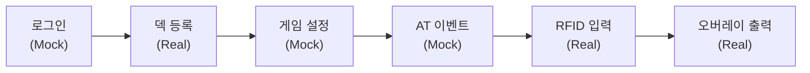

> **Mock vs Real**: Mock 단계는 하드코딩 또는 GUI 수동 입력으로 대체한다.
> Real 단계는 실제 RFID 하드웨어와 렌더링 파이프라인을 사용한다.
> Phase 2에서 Mock → Real 전환이 이루어진다.

### Phase 2: Hold'em 완벽 완성 + 런칭 (2026 H2 → 2027년 1월)

Hold'em 1종으로 8시간 연속 라이브 방송 가능한 완성품 제작. 게임 엔진(8단계 상태 머신 + NL/PL/FL 베팅 + 핸드 평가기 + Monte Carlo 승률) + 그래픽(RIVE .riv 직접 로드, 스킨 에디터 1단계 — Rive Editor 외부 활용) + 운영(Lobby + Command Center — PokerGFX ActionTracker 기능 완전 복제, 기능을 Lobby/Setup과 CC/커맨드로 분리). 출력: NDI + ATEM 스위처. RFID 수동 입력 폴백은 1급 기능으로 운영. **2027년 1월 프로덕션 런칭**.

### Phase 3: 9종 게임 확장 + Vegas (2027 H1)

런칭된 Hold'em에 8종을 추가하여 총 9종으로 확장. WSOP HORSE + 8-Game 포맷 방송 지원. **2027년 6월 Vegas 이벤트 투입**. Vegas 대상 9종: NL Hold'em(런칭 완료), Limit Hold'em, PLO, Omaha Hi-Lo, Razz, 7-Card Stud, Stud Hi-Lo, 2-7 Triple Draw, NL 2-7 Single Draw.

### Phase 4: 13종 추가 + 스킨 에디터 + BO + WSOPLIVE (2027 H2)

나머지 13종 게임 추가(Short Deck, Pineapple, 5/6-Card Omaha 계열, Courchevel, Five Card Draw, A-5 Triple Draw, Badugi 계열). 스킨 에디터 2단계(자체 에디터 — .riv 파라미터 GUI 조정, 고객/운영자 대상). Back Office(BO) 관리 시스템. WSOPLIVE 외부 데이터 연동(선수·칩·대회 정보). 인프라 고도화(데이터 모델 확장, 큐시트, 멀티테이블).

### Phase 5: Production AI (2028 H1)

4개 AI 영역 무인화: Multi-cam AI(카메라 자동 전환), Live Vision AI(액션 감지), EBS Operator(Command Center AI 자동화), Korea Front Monitoring(편성 AI). 보조→반자동→완전자동 단계적 전환.

### Phase 6: OTT 연동 (2028 H2)

HLS 스트리밍 파이프라인, VOD + CMS 콘텐츠 관리, 구독 시스템, 통합 테스트 및 런칭.

---

# Part VIII: 성공 기준과 리스크

> **대상 독자**: 모든 독자 (이해관계자, 기획자 필독)
>
> 기술 설계를 넘어, EBS가 "성공"했는지 측정하는 기준과 실패 가능성을 미리 식별한다.

## 22. 성공 지표 (KPI)

| 지표 | Phase 1 목표 | Phase 2 목표 | 측정 방법 |
|------|:---:|:---:|------|
| RFID 카드 인식률 | ≥ 99.5% | ≥ 99.9% | 테스트 세션 10,000회 카드 인식 |
| 카드 인식 → 오버레이 지연 | < 200ms | < 100ms | E2E 파이프라인 측정 |
| 오버레이 렌더링 FPS | ≥ 30fps | ≥ 60fps | GPU 렌더러 성능 측정 |
| PokerGFX 기능 복제율 | N/A | ≥ 90% (144개 중) | 기능 체크리스트 기반 |
| 연속 운영 시간 | ≥ 4시간 | ≥ 12시간 | 무중단 테스트 세션 |
| 운영 인력 | 현행 유지 | 30명 → 25명 | 실제 방송 운영 측정 |

## 23. 비기능 요구사항

### 성능

| 항목 | 요구사항 |
|------|---------|
| E2E 지연 (카드→화면) | Phase 1: < 200ms, Phase 2: < 100ms |
| 렌더링 프레임 | Phase 1: 30fps, Phase 2: 60fps (1080p) |
| 동시 카드 추적 | 52장 전수 추적, 10인 테이블 |
| 승률 계산 | Monte Carlo 100K 반복, < 50ms |

### 보안

| 항목 | 요구사항 |
|------|---------|
| Security Delay | 30초~5분 가변 딜레이 (생방송 홀카드 유출 방지) |
| RFID 통신 | 암호화 채널 (무선), 물리 직결 (유선 백업) |
| 데이터 전송 | 서버-클라이언트 간 암호화 |

### 가용성

| 항목 | 요구사항 |
|------|---------|
| 장애 복구 | RFID 미인식 시 수동 입력 폴백, 네트워크 끊김 시 30초 내 자동 재연결 |
| 상태 복원 | 서버 크래시 시 GAME_SAVE 기반 복원 |
| 이중 연결 | WiFi 기본 + USB 백업 자동 전환 |

### 확장성

| 항목 | 요구사항 |
|------|---------|
| 멀티테이블 | 테이블당 독립 Master 서버, 물리 분리 |
| 게임 확장 | Phase 2: 1종(Hold'em), Phase 3: 9종, Phase 4: 22종 |
| 출력 확장 | NDI/HDMI/SDI, Master-Slave 구조 |

## 24. 리스크 분석

| # | 리스크 | 영향 | 확률 | 완화 전략 |
|:-:|--------|:----:|:----:|----------|
| R1 | 업체 선정 실패 — RFID 카드+리더 통합 공급 파트너 미확보 | 높음 | 중 | 카테고리 A 3개 업체 병행 RFI, 카테고리 B 부품 단독 조달 대안 |
| R2 | PokerGFX 복제 난이도 과소평가 — 22종 게임 엔진 복잡도 | 높음 | 중 | Phase 2에서 1종(Hold'em)만 집중, Phase 3에서 9종, Phase 4에서 22종 완성 |
| R3 | IP 리스크 — PokerGFX 역설계 기반 구현 | 중 | 저 | 클린룸 설계 원칙, 기능 스펙만 참조하고 코드 직접 복사 금지 |
| R4 | 하드웨어 통합 리스크 — RFID 리더+MCU+안테나 호환성 | 높음 | 중 | Phase 1 POC에서 조기 검증, 이중 연결 설계 |
| R5 | 인력 전환 리스크 — 운영 무인화 과정에서 기존 스태프 저항 | 중 | 중 | 단계적 전환 (보조→반자동→완전자동), Phase 5까지 점진적 |

---

# 부록

## 부록 A: 22개 게임 전체 카탈로그

### Community Card 계열 (12개)

| # | 게임명 | 홀카드 | 보드 | 특수 규칙 |
|:-:|--------|:------:|:----:|----------|
| 0 | Texas Hold'em | 2장 | 5장 | 표준 |
| 1 | 6+ Hold'em (Straight > Trips) | 2장 | 5장 | 36장 덱, Straight > Trips |
| 2 | 6+ Hold'em (Trips > Straight) | 2장 | 5장 | 36장 덱, Trips > Straight |
| 3 | Pineapple | 3→2장 | 5장 | Flop 전 1장 버림 |
| 4 | Omaha | 4장 | 5장 | 반드시 홀카드 2장 + 보드 3장 사용 |
| 5 | Omaha Hi-Lo | 4장 | 5장 | Hi/Lo 팟 분할 (8-or-better) |
| 6 | Five Card Omaha | 5장 | 5장 | 홀카드 2장 + 보드 3장 사용 |
| 7 | Five Card Omaha Hi-Lo | 5장 | 5장 | Hi/Lo 분할 |
| 8 | Six Card Omaha | 6장 | 5장 | 홀카드 2장 + 보드 3장 사용 |
| 9 | Six Card Omaha Hi-Lo | 6장 | 5장 | Hi/Lo 분할 |
| 10 | Courchevel | 5장 | 5장 | Pre-Flop에 Flop 첫 카드 공개 |
| 11 | Courchevel Hi-Lo | 5장 | 5장 | Hi/Lo + 첫 카드 공개 |

### Draw 계열 (7개)

| # | 게임명 | 카드 | 교환 | 특수 규칙 |
|:-:|--------|:----:|:----:|----------|
| 12 | Five Card Draw | 5장 | 1회 | 기본 Draw |
| 13 | 2-7 Single Draw | 5장 | 1회 | Lowball (A=High) |
| 14 | 2-7 Triple Draw | 5장 | 3회 | Lowball 3회 교환 |
| 15 | A-5 Triple Draw | 5장 | 3회 | A-5 Lowball |
| 16 | Badugi | 4장 | 3회 | 4 suit 다른 조합 |
| 17 | Badeucy | 5장 | 3회 | Badugi + 2-7 혼합 |
| 18 | Badacey | 5장 | 3회 | Badugi + A-5 혼합 |

### Stud 계열 (3개)

| # | 게임명 | 카드 | 베팅 라운드 | 특수 규칙 |
|:-:|--------|:----:|:----------:|----------|
| 19 | 7-Card Stud | 7장 | 5 | 3장 비공개 + 4장 공개 |
| 20 | 7-Card Stud Hi-Lo | 7장 | 5 | Hi/Lo 분할 (8-or-better) |
| 21 | Razz | 7장 | 5 | A-5 Lowball Stud |

---

## 부록 B: 144개 기능 카탈로그

> 상세 기능 목록은 [EBS 기능 카탈로그](EBS-Feature-Catalog.md)를 참조한다.

| 범주 | 총 기능 수 | Phase 1-2 | Phase 3+ |
|------|:----------:|:---------:|:--------:|
| Main Window | 10 | 9 | — |
| Sources | 10 | — | — (OBS/vMix 위임) |
| Outputs | 12 | 8 | 4 |
| GFX1 게임 제어 | 24 | 15 | 9 |
| GFX2 통계 | 13 | 9 | 4 |
| GFX3 방송 연출 | 13 | 2 | 11 |
| System | 16 | 8 | 6 |
| Skin Editor | 16 | 5 | 11 |
| GE Board | 15 | 8 | 7 |
| GE Player | 15 | 8 | 7 |
| **합계** | **144** | **72** | **59** |

---

## 부록 C: 용어 사전

별도 문서로 분리되었다. → [pokergfx-glossary.md](pokergfx-glossary.md)

9개 섹션, 91개 용어를 수록: 포커 기본, 베팅, Ante 유형, 통계, 카드 상태, 시스템, 그래픽 요소, 애니메이션, 핸드 등급

---

## 부록 D: 참고 자료

### 포커 방송 역사

- [Hole cam — Wikipedia](https://en.wikipedia.org/wiki/Hole_cam)
- [Who Invented The Poker Hole Cam? — casino.org](https://www.casino.org/blog/hole-card-cam/)
- [Poker on television — Wikipedia](https://en.wikipedia.org/wiki/Poker_on_television)

### PokerGFX 및 경쟁 제품

- [PokerGFX Official](https://www.pokergfx.io/)
- [PokerGFX market dominance — habwin.com](https://www.habwin.com/en/post/poker-gfx-what-it-is-and-how-it-can-combat-security-vulnerabilities)
- [RFID VPT Build Guide V2 — pokergfx.io](https://www.pokergfx.io/) (PDF)

### RFID 기술

- [Application of RFID playing cards in WSOP — rfidcard.com](https://www.rfidcard.com/application-of-rfid-playing-cards-in-wsop/)
- [The Evolution of Poker Livestreaming — rfpoker.com](https://rfpoker.com/blog/the-evolution-of-poker-livestreaming)

### 이미지 출처

| 이미지 | 파일 | 출처 |
|--------|------|------|
| Late Night Poker (1999) | `../../00-reference/images/web/late-night-poker-1999.jpeg` | Channel 4 |
| WPT 홀카메라 방송 | `../../00-reference/images/web/hole-card-cam-history.jpeg` | casino.org |
| RFID IC 회로 | `../../00-reference/images/web/rfid-live-poker-event.jpg` | habwin.com |
| 방송 카메라 장비 | `../../00-reference/images/web/pokercaster-broadcast-setup.webp` | pokercaster.com |
| RFID 테이블 3D 단면 | `../../00-reference/images/prd/rfid-vpt-3d-crosssection.png` | RFID VPT Build Guide V2, PokerGFX LLC |
| RFID 전자장비 설치 | `../../00-reference/images/prd/rfid-vpt-installed-electronics.png` | RFID VPT Build Guide V2, PokerGFX LLC |

---

## 변경 이력

> v30.x 이전 변경 이력은 [CHANGELOG-Foundation.md](CHANGELOG-Foundation.md)를 참조한다.

| 버전 | 날짜 | 변경 내용 | 변경 유형 | 결정 근거 |
|------|------|-----------|----------|----------|
| 34.0.0 | 2026-03-31 | **문서 구조 개선**: (1) Critic mode 심층 분석 기반 구조 개편, (2) 마일스톤 상세→EBS-Milestones.md 분리, (3) 기능 카탈로그 144개→EBS-Feature-Catalog.md 분리, (4) Changelog v30 이전→CHANGELOG-Foundation.md 아카이브, (5) Executive Summary 최상단 이동, (6) 포지셔닝 문구 업데이트 (PokerGFX 벤치마크→EBS PRD), (7) %%init%% 지시어 6건 제거, (8) 섹션 번호 충돌 수정 (2.x→3.x), (9) 색상 범례→이모지 범례, (10) 이중 구분선 제거, (11) Part 헤더별 대상 독자 마커 추가 | TECH | 문서 복잡성 분석 결과 안정/휘발 콘텐츠 분리, Triple Start 해소, 독자 정합성 개선 |
| 33.1.0 | 2026-03-31 | **레거시 다이어그램/용어 전면 교체 + Lobby 2단계** | TECH | v33.0.0에서 아키텍처 전환했으나 본문 다이어그램이 레거시 잔존 |
| 33.0.0 | 2026-03-31 | **Flutter/Rive + Lobby + Command Center 전면 재설계** | TECH | Lobby 중심 네비게이션으로 멀티테이블 관제 UX 최적화 |
| 32.0.0 | 2026-03-31 | **Console/AT 아키텍처 재설계**: 단일 앱 + RBAC 3역할 체계 | TECH | PokerGFX 레거시 2-앱 구조의 현대화 |
| 31.1.0 | 2026-03-27 | Phase 3 게임 범위 조정: 22종 → Vegas 대상 9종 | PRODUCT | Vegas 일정 대응 |
| 31.0.0 | 2026-03-27 | 6-Phase 로드맵 타임라인 압축 | PRODUCT | 2027-01 런칭 + 2027-06 Vegas 목표 반영 |

---

> **Version**: 34.0.0 | **Updated**: 2026-03-31
