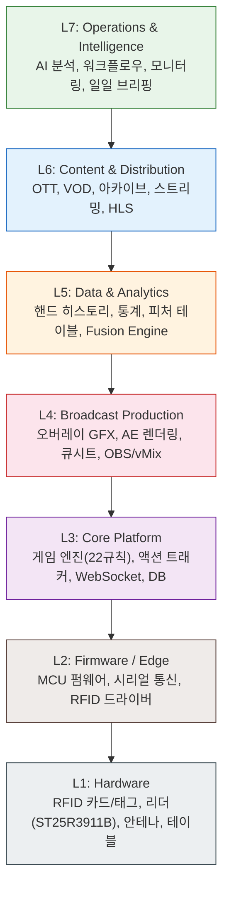
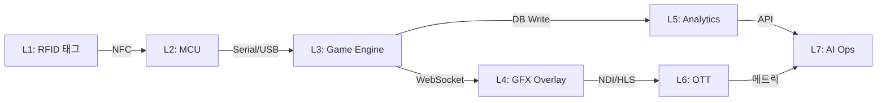
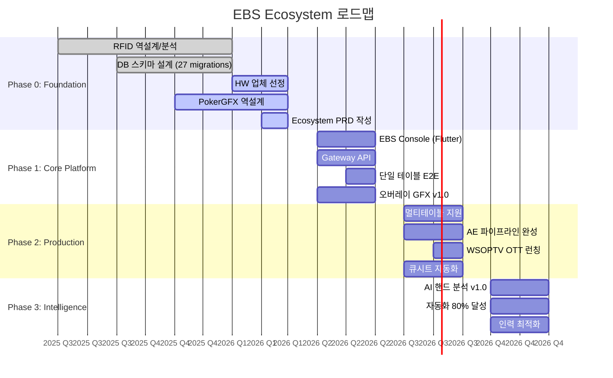

# EBS Ecosystem PRD

> **Version**: v1.2 | **소유자**: BRACELET STUDIO | **최초 작성일**: 2026-02-27 | **최종 수정일**: 2026-03-04

---

## 개요

- **목적**: 포커 대회 방송 프로덕션의 자동화와 퀄리티 향상을 위한 전체 아키텍처를 정의하고, 18개 독립 프로젝트 간의 통합 인터페이스와 데이터 흐름을 명세한다.
- **배경**: 포커 대회 방송 제작 과정에서 불필요하게 인력이 소모되거나 자동화 가능한 영역이 광범위하게 존재한다. RFID 하드웨어부터 OTT 송출까지 7개 계층에 걸친 18개 프로젝트가 독립적으로 개발되고 있으며, 이들을 통합하여 비용을 비약적으로 낮추면서 차별화된 방송 퀄리티를 구현하는 것이 목표이다.
- **범위**: L1 Hardware ~ L7 Operations & Intelligence 전 계층. 하드웨어 RFID 태그/리더에서 시작하여 펌웨어, 게임 엔진, 방송 프로덕션, 데이터 분석, 콘텐츠 배포, 운영 자동화까지 포함한다.
- **소유자**: BRACELET STUDIO
- **문서 ID**: PRD-ECOSYSTEM-001
- **작성일**: 2026-02-27
- **최종 수정일**: 2026-03-04 (v1.2)

## 비전

### WSOPLIVE와 EBS의 관계

WSOPLIVE와 EBS는 경쟁 관계가 아닌 **상호 보완적이고 독립적인** 관계이다.

| 시스템 | 역할 | 범위 |
|--------|------|------|
| **WSOPLIVE** | 포커 대회 운영 플랫폼 | 대회 등록, 테이블 배정, 블라인드 관리, 결과 관리 등 대회 운영 전반 |
| **EBS Ecosystem** | 포커 대회 **방송** 플랫폼 | 방송 프로덕션 자동화, 오버레이 GFX, 콘텐츠 제작/배포 등 방송 전반 |

WSOPLIVE가 제공하는 대회 데이터를 EBS가 소비하여 방송에 활용하는 것이 기본 데이터 흐름이며, 각 시스템은 자신의 도메인에서 독립적으로 발전한다.

### 핵심 비전: "방송 프로덕션 자동화 + 퀄리티 혁신"

포커 대회 방송을 제작하는 과정에서 **자동화가 가능한 모든 영역**을 EBS Ecosystem이 담당한다. 불필요한 인력 소모를 제거하고, 그 누구도 따라할 수 없는 퀄리티의 방송을 구현하는 것이 최종 목표이다.

**Ecosystem 조각 전략 (Incremental Assembly):**

| 순서 | 조각 | 자동화 대상 | 효과 |
|:----:|------|-----------|------|
| 1st | 피처 테이블 방송 시스템 | RFID → 오버레이 GFX → 송출 | 단일 테이블 E2E 자동화 |
| 2nd | 이원 중계 프로덕션 | 멀티테이블 전환, 큐시트, AE 렌더링 | 다중 테이블 프로덕션 자동화 |
| 3rd | 콘텐츠 파이프라인 | VOD, 하이라이트, OTT 배포 | 콘텐츠 제작/배포 자동화 |
| 4th | AI 분석 + 운영 최적화 | 핸드 분석, 인력 배치, 브리핑 | 인텔리전스 계층 완성 |

각 조각이 독립적으로 가치를 제공하며, 모든 조각이 모여 **EBS Ecosystem**을 완성한다.

**DB 자산 내재화**: 자체 데이터 파이프라인을 구축하여 WSOPLIVE에서 제공하는 데이터에 더해, 방송 고유의 데이터(오버레이 이벤트, 시청자 분석, 핸드 히스토리 등)를 자체 DB에 축적한다.

**목표 효과:**

| 지표 | 현재 | 목표 | 자동화 조각 |
|------|------|------|-----------|
| 운영 인력 | 30명 | 15-20명 | 전체 Ecosystem |
| 수동 입력 비율 | 높음 | 30% 감소 | 1st + 2nd |
| 방송 E2E 레이턴시 | 미측정 | 200ms 이내 | 1st |
| RFID 인식률 | 미측정 | 99.9% | 1st |
| 방송 퀄리티 차별화 | 업계 표준 | 업계 최고 | 전체 Ecosystem |

## 7-Layer Architecture 개요

EBS Ecosystem은 7개 계층으로 구성된다. 각 계층은 독립적으로 개발 가능하며, 명확한 인터페이스를 통해 상호 통신한다.

### 계층별 역할 요약

| 계층 | 역할 | 주요 프로토콜 |
|------|------|--------------|
| L7 | 운영 자동화, AI 분석, 모니터링 | REST API, Slack/Gmail API |
| L6 | OTT 송출, VOD 아카이브, HLS 스트리밍 | Vimeo API, HLS, RTMP |
| L5 | 핸드 데이터 분석, 통계, 피처 엔지니어링 | Supabase Query, Gemini API |
| L4 | 방송 GFX, AE 렌더링, 큐시트, 대시보드 | WebSocket, NDI, REST |
| L3 | 게임 로직, 액션 추적, 실시간 이벤트 | WebSocket, Supabase Realtime |
| L2 | MCU 펌웨어, RFID 드라이버 | Serial (UART), SPI |
| L1 | 물리 하드웨어 (RFID, 안테나, 테이블) | NFC ISO 14443/15693 |

### 계층 간 데이터 흐름

## 18개 프로젝트 인벤토리

| # | 프로젝트 | 역할 | Tech Stack | Layer | 상태 |
|---|---------|------|-----------|-------|------|
| 1 | ebs (HW vendor) | RFID 하드웨어 업체 선정 및 사양 확정 | - | L1 | Phase 0 (업체 선정) |
| 2 | ebs (firmware spec) | MCU 펌웨어 사양 분석 및 프로토콜 정의 | C/C++, ST25R3911B | L2 | 분석 완료 |
| 3 | ebs_reverse (RFIDv2) | RFID 시스템 역설계, 프로토콜 문서화 | Python, Docs | L2 | 분석 완료 |
| 4 | pokergfx_flutter | 포커 GFX 엔진 (Desktop), 22개 규칙 | Flutter Desktop, Dart | L3 | 역설계 초기 |
| 5 | automation_hub | Gateway API, 이벤트 허브 | FastAPI, Python | L3 | 구현 초기 |
| 6 | automation_schema | DB 스키마, 마이그레이션 | PostgreSQL, Supabase | L3, L5 | 27개 migration 완료 |
| 7 | ui_overlay | 방송 오버레이 GFX (웹 기반) | HTML/CSS/JS | L4 | 구현중 |
| 8 | automation_ae | AE 렌더링 파이프라인 | FastAPI, React, Nexrender | L4 | 구현중 |
| 9 | automation_dashboard | 운영 대시보드 | React 18, TypeScript, WebSocket | L4 | 구현중 |
| 10 | automation_sub | 자막/서브타이틀 관리 | React 18, TypeScript | L4 | 구현중 |
| 11 | automation_aep_csv | AE 프로젝트 CSV 데이터 관리 | Python | L4 | 구현중 |
| 12 | automation_feature_table | 피처 테이블, 통계 집계 | Python, Supabase | L5 | 구현중 |
| 13 | wsoptv_ott | WSOP TV OTT 플랫폼 | Vimeo SaaS, Python | L6 | Phase 0 |
| 14 | qwen_hand_analysis | AI 핸드 분석 | FastAPI, Next.js 15, Gemini 2.5 | L6 | v0.8.3 |
| 15 | vimeo_ott | Vimeo OTT API 연동 | Vimeo API | L6 | Phase 0 |
| 16 | archive-analyzer | 방송 아카이브 분석 | Python | L6 | Phase 0 |
| 17 | morning-automation | 일일 브리핑 자동화 | Python, Gmail/Slack API | L7 | 운영중 |
| 18 | automation_orchestration | 워크플로우 오케스트레이션 | React Flow, Python | L7 | 일부 운영 |

> **Note**: `production_automation` (L7, AI strategy Docs, Phase 0)은 독립 프로젝트가 아닌 전략 문서로 분류한다.

## Layer별 요구사항

### L1 Hardware 요구사항

**관련 프로젝트**: ebs (HW vendor)

#### 기능 요구사항

| ID | 요구사항 | 우선순위 |
|----|---------|---------|
| L1-FR-01 | RFID 카드 인식 (ISO 14443A/B) | MUST |
| L1-FR-02 | 멀티 태그 동시 인식 (최소 10장) | MUST |
| L1-FR-03 | ST25R3911B 기반 리더 모듈 | MUST |
| L1-FR-04 | 테이블 내장형 안테나 설계 | MUST |
| L1-FR-05 | 칩 스택 감지용 보조 안테나 | SHOULD |

#### 비기능 요구사항

| ID | 요구사항 | 목표값 |
|----|---------|-------|
| L1-NFR-01 | RFID 인식률 | 99.9% 이상 |
| L1-NFR-02 | 인식 레이턴시 | 50ms 이내 |
| L1-NFR-03 | 동작 온도 범위 | 0-50°C |
| L1-NFR-04 | 테이블당 리더 수 | 최대 10개 (9 seat + dealer) |

---

### L2 Firmware 요구사항

**관련 프로젝트**: ebs (firmware spec), ebs_reverse (RFIDv2)

#### 기능 요구사항

| ID | 요구사항 | 우선순위 |
|----|---------|---------|
| L2-FR-01 | ST25R3911B 드라이버 (SPI 통신) | MUST |
| L2-FR-02 | UART/USB 시리얼 출력 (카드 데이터) | MUST |
| L2-FR-03 | 카드 UID → 카드 값 매핑 테이블 | MUST |
| L2-FR-04 | Anti-collision 알고리즘 | MUST |
| L2-FR-05 | OTA 펌웨어 업데이트 | SHOULD |
| L2-FR-06 | 칩 카운팅 프로토콜 | SHOULD |

#### 비기능 요구사항

| ID | 요구사항 | 목표값 |
|----|---------|-------|
| L2-NFR-01 | MCU 부팅 시간 | 2초 이내 |
| L2-NFR-02 | 전력 소모 | 500mA 이하 (USB 전원) |
| L2-NFR-03 | 시리얼 전송 속도 | 115200 baud |

---

### L3 Core Platform 요구사항

**관련 프로젝트**: pokergfx_flutter, automation_hub, automation_schema

#### 기능 요구사항

| ID | 요구사항 | 우선순위 |
|----|---------|---------|
| L3-FR-01 | 22개 포커 규칙 기반 게임 엔진 | MUST |
| L3-FR-02 | 실시간 액션 추적 (Bet, Raise, Fold 등) | MUST |
| L3-FR-03 | Gateway API (통합 진입점) | MUST |
| L3-FR-04 | WebSocket 실시간 이벤트 브로드캐스트 | MUST |
| L3-FR-05 | Supabase DB 연동 (28+ 테이블) | MUST |
| L3-FR-06 | 멀티테이블 동시 관리 | MUST |
| L3-FR-07 | 플레이어 등록/관리 시스템 | MUST |
| L3-FR-08 | 핸드 히스토리 자동 기록 | MUST |
| L3-FR-09 | 이벤트/토너먼트 관리 | SHOULD |

#### 비기능 요구사항

| ID | 요구사항 | 목표값 |
|----|---------|-------|
| L3-NFR-01 | WebSocket 레이턴시 | 100ms 이내 |
| L3-NFR-02 | 동시 접속 | 100+ 클라이언트 |
| L3-NFR-03 | DB 쿼리 응답 | 200ms 이내 (p95) |
| L3-NFR-04 | 가동률 | 99.5% (방송 시간 중) |

---

### L4 Broadcast Production 요구사항

**관련 프로젝트**: ui_overlay, automation_ae, automation_dashboard, automation_sub, automation_aep_csv

#### 기능 요구사항

| ID | 요구사항 | 우선순위 |
|----|---------|---------|
| L4-FR-01 | 실시간 오버레이 GFX (홀카드, 팟, 블라인드) | MUST |
| L4-FR-02 | AE 렌더링 파이프라인 (Nexrender) | MUST |
| L4-FR-03 | 큐시트 자동 생성/관리 | MUST |
| L4-FR-04 | OBS/vMix 연동 | MUST |
| L4-FR-05 | 운영 대시보드 (실시간 모니터링) | MUST |
| L4-FR-06 | 자막/서브타이틀 관리 | SHOULD |
| L4-FR-07 | NDI 내부 송출 | SHOULD |
| L4-FR-08 | 플레이어 프로필 오버레이 | SHOULD |

#### 비기능 요구사항

| ID | 요구사항 | 목표값 |
|----|---------|-------|
| L4-NFR-01 | 오버레이 렌더링 프레임 | 60fps |
| L4-NFR-02 | GFX 업데이트 레이턴시 | 100ms 이내 |
| L4-NFR-03 | AE 렌더링 시간 | 30초 이내 (클립당) |
| L4-NFR-04 | E2E 방송 레이턴시 | 200ms 이내 |

---

### L5 Data & Analytics 요구사항

**관련 프로젝트**: automation_feature_table, automation_schema

#### 기능 요구사항

| ID | 요구사항 | 우선순위 |
|----|---------|---------|
| L5-FR-01 | 핸드 히스토리 구조화 저장 | MUST |
| L5-FR-02 | 플레이어 통계 집계 (VPIP, PFR, AF 등) | MUST |
| L5-FR-03 | 피처 테이블 자동 생성 | MUST |
| L5-FR-04 | Fusion Engine (다중 소스 통합) | SHOULD |
| L5-FR-05 | 실시간 통계 대시보드 API | SHOULD |

#### 비기능 요구사항

| ID | 요구사항 | 목표값 |
|----|---------|-------|
| L5-NFR-01 | 통계 집계 지연 | 5분 이내 (배치) |
| L5-NFR-02 | 데이터 보존 기간 | 5년 이상 |
| L5-NFR-03 | 쿼리 성능 (핸드 조회) | 500ms 이내 |

---

### L6 Content & Distribution 요구사항

**관련 프로젝트**: wsoptv_ott, qwen_hand_analysis, vimeo_ott, archive-analyzer

#### 기능 요구사항

| ID | 요구사항 | 우선순위 |
|----|---------|---------|
| L6-FR-01 | HLS 스트리밍 (외부 배포) | MUST |
| L6-FR-02 | Vimeo OTT 연동 | MUST |
| L6-FR-03 | VOD 아카이브 자동화 | MUST |
| L6-FR-04 | AI 핸드 분석 (Gemini 2.5) | SHOULD |
| L6-FR-05 | 아카이브 검색/인덱싱 | SHOULD |
| L6-FR-06 | 하이라이트 자동 생성 | COULD |

#### 비기능 요구사항

| ID | 요구사항 | 목표값 |
|----|---------|-------|
| L6-NFR-01 | 스트리밍 해상도 | 1080p (최소) |
| L6-NFR-02 | VOD 업로드 지연 | 24시간 이내 |
| L6-NFR-03 | AI 분석 응답 시간 | 10초 이내 (핸드당) |

---

### L7 Operations & Intelligence 요구사항

**관련 프로젝트**: morning-automation, automation_orchestration, production_automation

#### 기능 요구사항

| ID | 요구사항 | 우선순위 |
|----|---------|---------|
| L7-FR-01 | 일일 브리핑 자동 생성 (Slack/Gmail) | MUST |
| L7-FR-02 | 워크플로우 오케스트레이션 (React Flow) | MUST |
| L7-FR-03 | 시스템 모니터링 대시보드 | SHOULD |
| L7-FR-04 | AI 기반 운영 최적화 | COULD |
| L7-FR-05 | 인력 배치 자동 스케줄링 | COULD |

#### 비기능 요구사항

| ID | 요구사항 | 목표값 |
|----|---------|-------|
| L7-NFR-01 | 브리핑 생성 시간 | 09:00 KST 전 |
| L7-NFR-02 | 알림 전달 지연 | 30초 이내 |
| L7-NFR-03 | 자동화 비율 | 80% (Phase 3 목표) |

## 성공 지표

| KPI | 현재 Baseline | Phase 1 목표 | Phase 3 목표 | 측정 방법 |
|-----|-------------|-------------|-------------|----------|
| 운영 인력 | 30명 | 25명 | 15-20명 | 이벤트당 투입 인원 |
| 수동 입력 비율 | 100% (추정) | 70% | 30% | 자동화 대비 수동 작업 비율 |
| 방송 E2E 레이턴시 | 미측정 | 500ms | 200ms | RFID 인식 → 오버레이 표시 |
| RFID 인식률 | 미측정 | 99.0% | 99.9% | 인식 성공 / 전체 시도 |
| GFX 기능 커버리지 | 0/149 | 68/149 (v1.0) | 130/149 | PokerGFX 기능 매핑 |
| DB 자산 내재화율 | 0% | 40% | 90% | 자체 DB 기록 핸드 수 / 전체 |
| 시스템 가동률 | N/A | 99.0% | 99.5% | 방송 시간 중 업타임 |
| AE 렌더링 처리량 | 수동 | 10 clips/hr | 30 clips/hr | 시간당 자동 렌더링 클립 수 |

### 기능 커버리지 로드맵

PokerGFX 역설계 결과 총 149개 기능 중 130개를 타겟으로 설정한다.

| 버전 | 기능 수 | Phase | 비고 |
|------|--------|-------|------|
| v1.0 | 68 | Phase 1 | 핵심 방송 기능 |
| v2.0 | 55 | Phase 2 | 고급 프로덕션 기능 |
| v3.0 | 8 | Phase 3 | AI/자동화 기능 |
| Dropped | 19 | - | 불필요/대체 가능 기능 |

## Phase 0-3 로드맵

### Phase 0: Foundation (현재 ~ Q1 2026)

**목표**: 기술 기반 확보, 역설계 완료, 아키텍처 확정

| 마일스톤 | 산출물 | 상태 |
|---------|--------|------|
| RFID 프로토콜 분석 | ebs_reverse 문서 | 완료 |
| DB 스키마 v1.0 | 27개 migration, 28+ 테이블 | 완료 |
| HW 업체 선정 | 업체 계약서 | 진행중 |
| PokerGFX 역설계 | 149개 기능 매핑 | 진행중 |
| Ecosystem PRD | 본 문서 | 진행중 |
| Gap Analysis | ebs-gap-analysis.md | 진행중 |

### Phase 1: Core Platform (Q2 2026)

**목표**: 단일 테이블 E2E 동작, v1.0 기능 68개 구현

| 마일스톤 | 의존성 | 담당 프로젝트 |
|---------|--------|-------------|
| EBS Console | pokergfx_flutter 역설계 | pokergfx_flutter |
| Gateway API | automation_hub 확장 | automation_hub |
| 단일 테이블 E2E | HW + FW + Console | 전체 |
| 오버레이 GFX v1.0 | WebSocket, 게임 엔진 | ui_overlay |

### Phase 2: Production (Q3 2026)

**목표**: 멀티테이블, 전체 프로덕션 파이프라인, OTT 런칭

| 마일스톤 | 의존성 | 담당 프로젝트 |
|---------|--------|-------------|
| 멀티테이블 | Phase 1 E2E | pokergfx_flutter, automation_hub |
| AE 파이프라인 | Nexrender, 템플릿 | automation_ae |
| WSOPTV OTT | Vimeo 계약 | wsoptv_ott, vimeo_ott |
| 큐시트 자동화 | DB 스키마, 대시보드 | automation_dashboard |

### Phase 3: Intelligence (Q4 2026+)

**목표**: AI 분석, 80% 자동화, 인력 최적화

| 마일스톤 | 의존성 | 담당 프로젝트 |
|---------|--------|-------------|
| AI 핸드 분석 v1.0 | Phase 2 데이터 축적 | qwen_hand_analysis |
| 자동화 80% | 전 Phase 완료 | automation_orchestration |
| 인력 최적화 | 자동화 검증 | production_automation |

## 이해관계자

### Persona 1: 시청자 (Viewer)

- **역할**: 방송/OTT 콘텐츠 소비자
- **니즈**: 실시간 홀카드 정보, 핸드 분석, 저지연 스트리밍
- **터치포인트**: L4 오버레이 GFX, L6 OTT 플랫폼
- **성공 기준**: 200ms 이내 레이턴시, 정확한 홀카드 표시

### Persona 2: 테이블 오퍼레이터 (Table Operator)

- **역할**: 현장 테이블 운영자
- **니즈**: 간단한 테이블 셋업, RFID 자동 인식, 최소 수동 입력
- **터치포인트**: L1 하드웨어, L2 펌웨어, L3 Console
- **성공 기준**: 5분 이내 테이블 셋업, 수동 입력 30% 감소

### Persona 3: 콘텐츠 PD (Content Producer/Director)

- **역할**: 방송 프로덕션 총괄
- **니즈**: 큐시트 자동화, GFX 실시간 제어, AE 렌더링 파이프라인
- **터치포인트**: L4 대시보드, L4 큐시트, L6 OTT
- **성공 기준**: 큐시트 자동 생성, 렌더링 30초 이내

### Persona 4: 데이터 분석가 (Data Analyst)

- **역할**: 핸드/플레이어 데이터 분석
- **니즈**: 구조화된 핸드 히스토리, 통계 API, AI 분석
- **터치포인트**: L5 피처 테이블, L6 AI 분석, L7 브리핑
- **성공 기준**: 실시간 통계 접근, 5년 이상 데이터 보존

## 기술 스택 결정사항

| 영역 | 결정 | 근거 |
|------|------|------|
| Backend | FastAPI Gateway | automation_ae 패턴 재사용 |
| Desktop | Flutter (pokergfx_flutter) | 역설계 기반 재구현 |
| Web Dashboard | React 18 + TypeScript | automation_dashboard 확장 |
| DB | Supabase (PostgreSQL) | 27개 migration 확립 |
| Realtime | Supabase Realtime + WebSocket | 검증 완료 |
| Rendering | Nexrender Worker | automation_ae 유지 |
| Streaming | NDI (내부) + HLS (외부) | PokerGFX 호환 |
| OTT | Vimeo SaaS | wsoptv_ott 결정 |
| AI | Gemini 2.5 Flash | qwen_hand_analysis 검증 |

## 제약 사항 및 가정

### 제약 사항

| # | 제약 | 영향 | 완화 방안 |
|---|------|------|----------|
| C1 | HW 업체 선정 미완료 | Phase 1 시작 지연 가능 | Q1 내 업체 확정, 대안 업체 리스트 보유 |
| C2 | PokerGFX 소스 코드 없음 | 역설계 기반 재구현 필요 | Flutter 기반 클린룸 구현 |
| C3 | WSOPLIVE 라이선스 의존 | 데이터 파이프라인 자체 구축 필요 | DB 자산 내재화 전략 |
| C4 | 단일 개발팀 | 병렬 개발 제한 | Phase별 순차 진행, 자동화 우선 |
| C5 | Vimeo OTT 비용 구조 | 수익 모델 영향 | Phase 2에서 비용 분석 후 결정 |

### 가정

| # | 가정 | 위험도 | 검증 시점 |
|---|------|--------|---------|
| A1 | ST25R3911B가 멀티 태그 10장 동시 인식 가능 | HIGH | Phase 0 (HW 프로토타입) |
| A2 | Supabase Realtime이 100+ 동시 접속 처리 가능 | MEDIUM | Phase 1 (부하 테스트) |
| A3 | Nexrender가 30초 이내 렌더링 달성 가능 | MEDIUM | Phase 2 (벤치마크) |
| A4 | PokerGFX 22개 규칙이 완전히 역설계 가능 | HIGH | Phase 0 (역설계 완료 시) |
| A5 | Gemini 2.5가 핸드 분석에 충분한 정확도 제공 | LOW | Phase 3 (A/B 테스트) |

## Changelog

| 날짜 | 버전 | 변경 내용 | 결정 근거 |
|------|------|-----------|----------|
| 2026-02-27 | v1.0 | 최초 작성 — 7-Layer 아키텍처, 18개 프로젝트 인벤토리, Layer별 요구사항, Phase 0-3 로드맵 | EBS Ecosystem 통합 아키텍처 정의 필요 |
| 2026-03-04 | v1.2 | 비전 섹션 재정의 — WSOPLIVE↔EBS 상호 보완 관계 명시, "방송 프로덕션 자동화 + 퀄리티 혁신"으로 핵심 비전 전환, Ecosystem 조각 전략 추가 | 사용자 비전 명확화 (경쟁→보완 관계 교정) |
| 2026-03-04 | v1.1 | production_automation 프로젝트 추가(19번), 기술 스택 결정사항 보강, Phase 로드맵 일정 정밀화 | Phase 0 진행 상황 반영 |
