# EBS Ecosystem Visual Overview

> **Version**: 1.0 | **Last Updated**: 2026-03-05

## 1. WSOPLIVE ↔ EBS 관계 다이어그램

WSOPLIVE와 EBS는 **상호 보완적이고 독립적인** 관계이다. WSOPLIVE가 대회 운영 데이터를 생산하고, EBS가 이를 소비하여 방송을 제작한다. 각 시스템은 자신의 도메인에서 독립적으로 발전하며, API를 통해 연동된다.

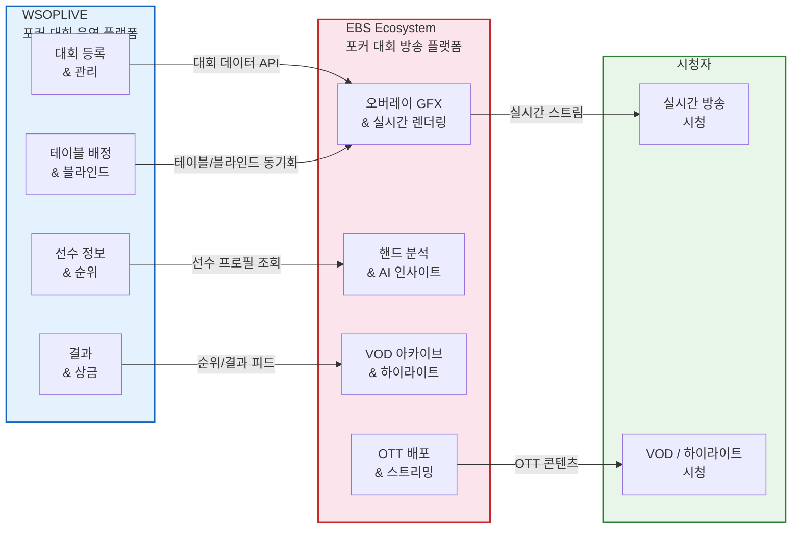

### 핵심 관계 요약

| 관점 | WSOPLIVE | EBS |
|------|----------|-----|
| **역할** | 대회 운영 전반 | 방송 프로덕션 전반 |
| **데이터 흐름** | 생산자 (대회 데이터) | 소비자 + 생산자 (방송 데이터) |
| **독립성** | EBS 없이도 대회 운영 가능 | WSOPLIVE 없이도 수동 입력으로 방송 가능 |
| **연동 방식** | REST API 제공 | API 소비 + 자체 DB 축적 |
| **최종 가치** | 대회 참가자 경험 | 시청자 방송 경험 |

## 2. Ecosystem 조각 전략 (Incremental Assembly)

EBS Ecosystem은 4단계 점진적 조립 전략으로 구축된다. 각 조각은 독립적인 가치를 제공하면서, 전체가 모여 완전한 방송 자동화 플랫폼을 완성한다.

### 2.1 조립 순서 다이어그램

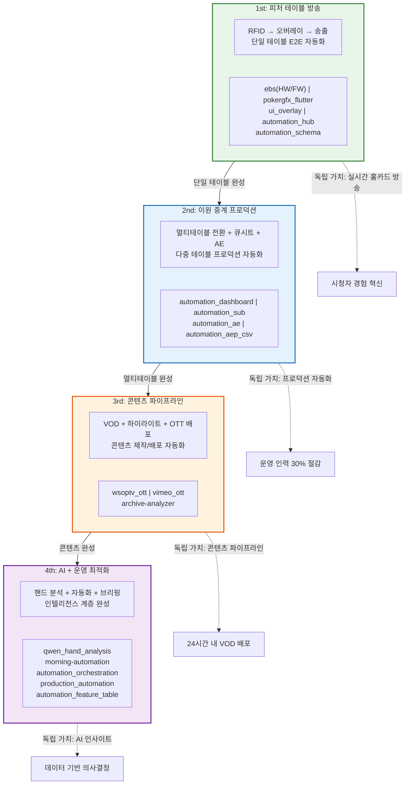

### 2.2 조각별 Layer 매핑

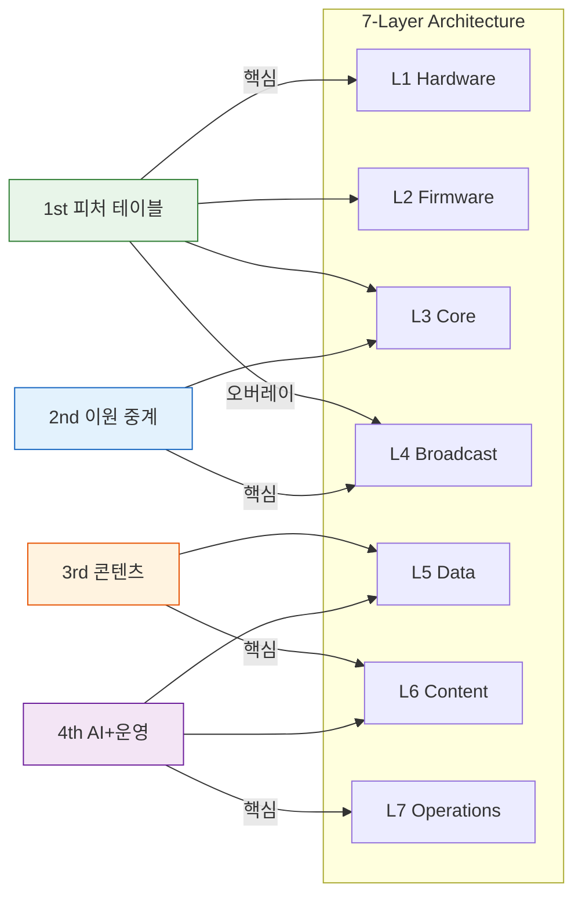

### 2.3 조각 전략 상세

| 순서 | 조각 | 프로젝트 | 자동화 대상 | 독립 가치 |
|:----:|------|----------|-----------|----------|
| 1st | 피처 테이블 방송 | ebs, pokergfx_flutter, ui_overlay, automation_hub, automation_schema | RFID 카드 인식 → 오버레이 렌더링 → 방송 송출 | 실시간 홀카드 방송 |
| 2nd | 이원 중계 프로덕션 | automation_dashboard, automation_sub, automation_ae, automation_aep_csv | 멀티테이블 전환, 큐시트 자동 생성, AE 렌더링 | PD 1명으로 다중 테이블 프로덕션 |
| 3rd | 콘텐츠 파이프라인 | wsoptv_ott, vimeo_ott, archive-analyzer | VOD 아카이브, 하이라이트 추출, OTT 배포 | 대회 종료 24시간 내 VOD 자동 배포 |
| 4th | AI + 운영 | qwen_hand_analysis, morning-automation, automation_orchestration, production_automation, automation_feature_table | 핸드 분석, 일일 브리핑, 인력 자동 배치 | 데이터 기반 방송 전략 수립 |

## 3. 방송 프로덕션 워크플로우

대회 방송일 하루의 워크플로우를 Pre-show, Live Show, Post-show 3단계로 나누어 시각화한다. EBS가 자동화하는 영역을 강조한다.

### 3.1 전체 워크플로우 흐름

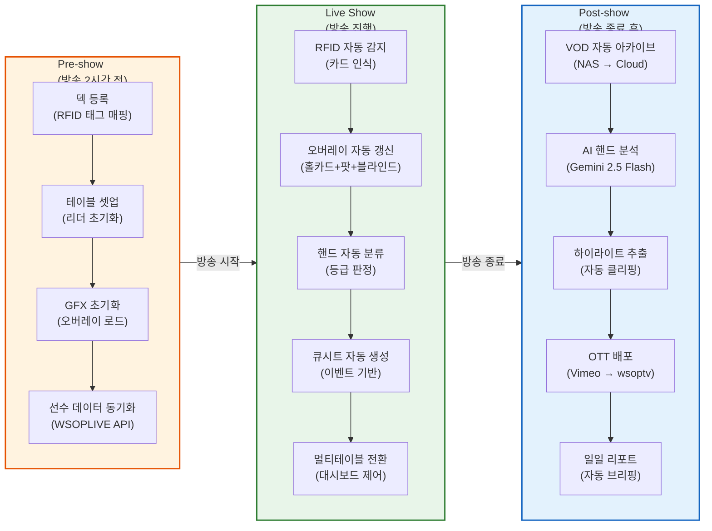

### 3.2 Live Show 시퀀스 다이어그램

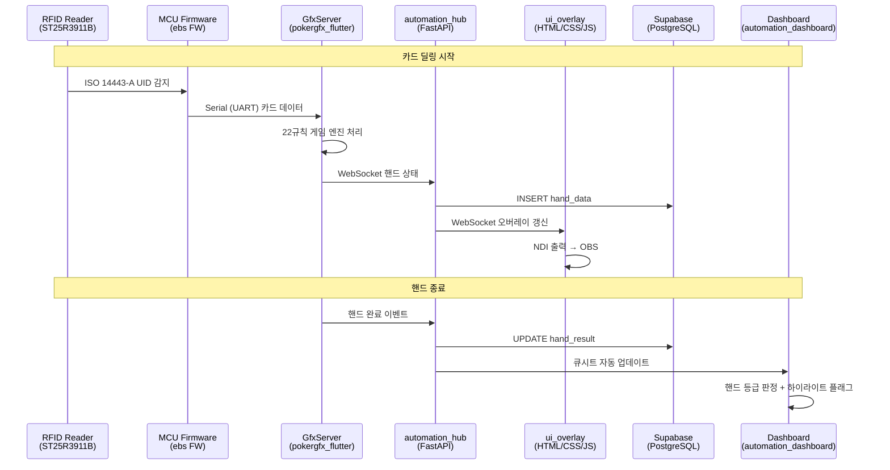

### 3.3 자동화 영역 매핑

| 단계 | 작업 | 자동화 수준 | EBS 담당 프로젝트 |
|------|------|:----------:|-----------------|
| Pre-show | 덱 등록 (RFID 태그 매핑) | 수동 → 반자동 | ebs(HW/FW) |
| Pre-show | 테이블 셋업 | 반자동 | pokergfx_flutter |
| Pre-show | GFX 초기화 | 자동 | ui_overlay, automation_hub |
| Pre-show | 선수 데이터 동기화 | 자동 | automation_hub (WSOPLIVE API) |
| Live | RFID 카드 감지 | 완전 자동 | ebs(HW/FW) |
| Live | 오버레이 갱신 | 완전 자동 | ui_overlay |
| Live | 핸드 분류 | 완전 자동 | pokergfx_flutter (22규칙) |
| Live | 큐시트 생성 | 자동 | automation_dashboard |
| Live | 멀티테이블 전환 | 반자동 (PD 승인) | automation_dashboard, automation_sub |
| Post-show | VOD 아카이브 | 자동 | archive-analyzer |
| Post-show | AI 핸드 분석 | 자동 | qwen_hand_analysis |
| Post-show | 하이라이트 추출 | 반자동 | automation_ae |
| Post-show | OTT 배포 | 자동 | wsoptv_ott, vimeo_ott |
| Post-show | 일일 리포트 | 자동 | morning-automation |

## 4. 기술 스택 랜드스케이프

EBS Ecosystem에서 사용되는 기술 스택 전체를 Layer별로 매핑한다.

### 4.1 기술 스택 전체 맵

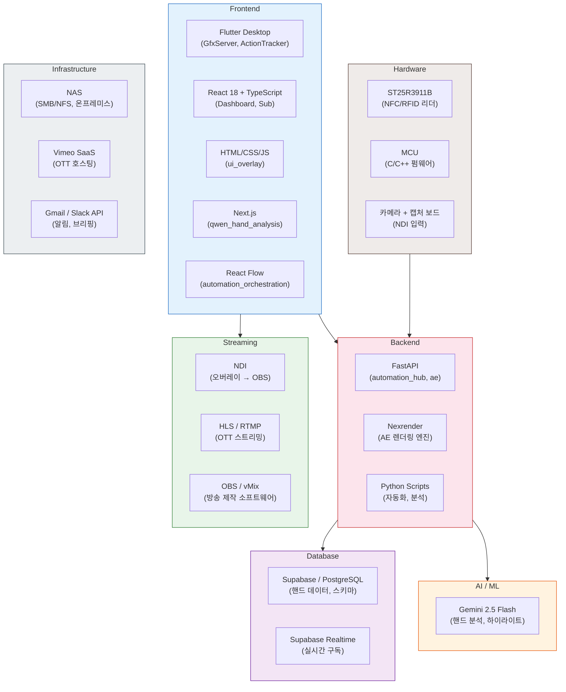

### 4.2 Layer별 기술 매핑

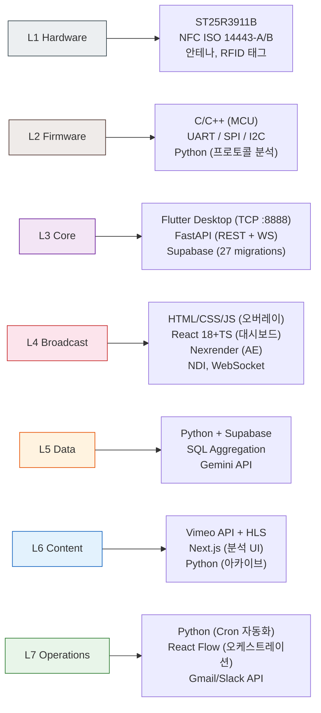

### 4.3 기술 스택 요약

| 카테고리 | 기술 | 사용 Layer | 용도 |
|---------|------|:----------:|------|
| Flutter Desktop | Dart + Flutter | L3 | GfxServer, ActionTracker |
| React 18 | TypeScript | L4 | Dashboard, Sub |
| Next.js | React + SSR | L6 | qwen_hand_analysis UI |
| HTML/CSS/JS | Vanilla | L4 | ui_overlay (NDI 출력) |
| FastAPI | Python | L3, L4 | automation_hub, automation_ae |
| Nexrender | Node.js + AE | L4 | AE 템플릿 자동 렌더링 |
| Supabase | PostgreSQL | L3, L5 | 핸드 데이터, 실시간 구독 |
| Gemini 2.5 Flash | Google AI | L5, L6 | 핸드 분석, 하이라이트 |
| NDI | Network Device Interface | L4 | 오버레이 → OBS 전송 |
| HLS / RTMP | Streaming Protocol | L6 | OTT 라이브 스트리밍 |
| Vimeo API | SaaS | L6 | VOD 호스팅, OTT 배포 |
| ST25R3911B | NFC Reader IC | L1 | RFID 카드 인식 |
| C/C++ | Embedded | L2 | MCU 펌웨어 |

## 5. 페르소나 여정 맵

EBS Ecosystem의 4개 핵심 페르소나가 시스템과 상호작용하는 여정을 시각화한다.

### 5.1 시청자 (Viewer)

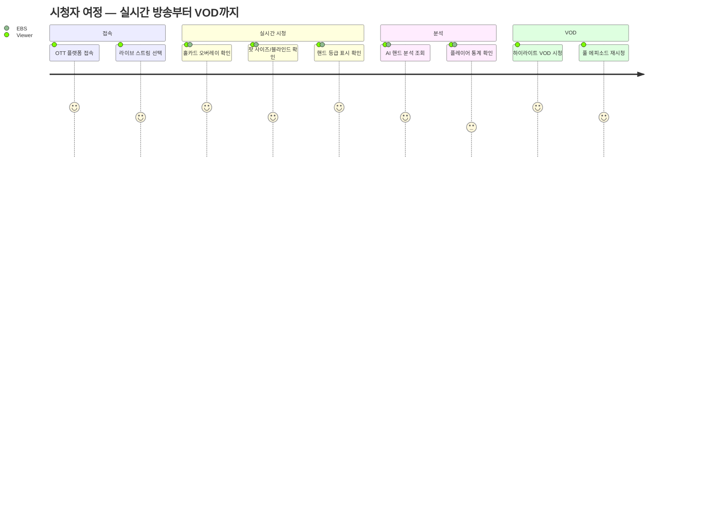

### 5.2 테이블 오퍼레이터

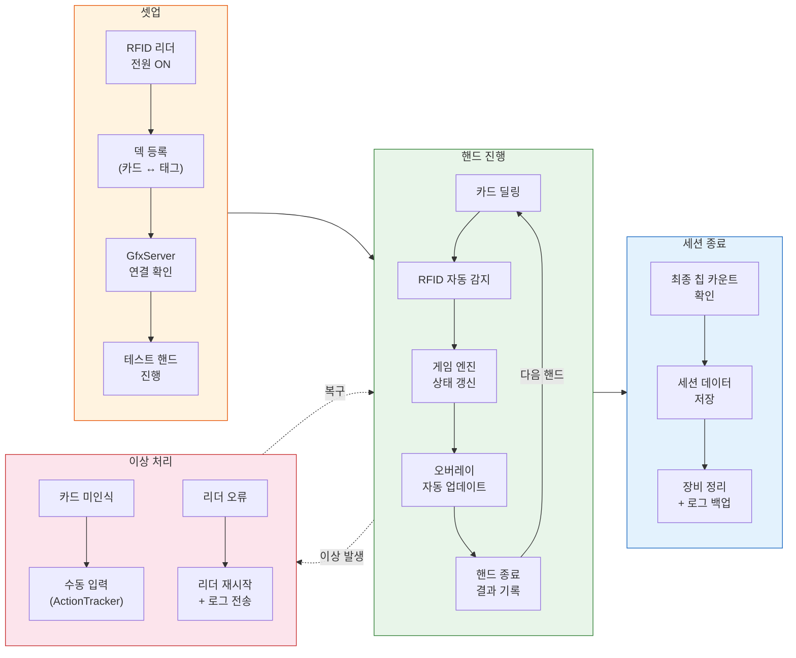

### 5.3 콘텐츠 PD

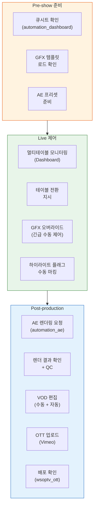

### 5.4 데이터 분석가

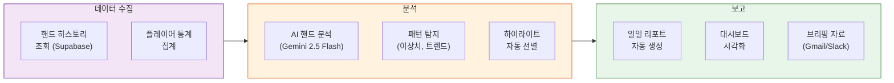

### 5.5 페르소나별 EBS 접점 요약

| 페르소나 | 주요 접점 프로젝트 | 핵심 가치 | 자동화 수준 |
|---------|-------------------|----------|:----------:|
| 시청자 | ui_overlay, wsoptv_ott, qwen_hand_analysis | 실시간 홀카드 + AI 분석 + VOD | 높음 |
| 테이블 오퍼레이터 | ebs(HW/FW), pokergfx_flutter, automation_hub | RFID 자동 인식, 수동 입력 최소화 | 높음 |
| 콘텐츠 PD | automation_dashboard, automation_ae, vimeo_ott | 큐시트 자동화, AE 렌더링, OTT 배포 | 중간 |
| 데이터 분석가 | qwen_hand_analysis, automation_feature_table, morning-automation | AI 분석, 자동 리포트, 브리핑 | 높음 |

## 6. 자동화 커버리지 히트맵

방송 프로덕션의 12개 핵심 작업 영역별 자동화 진행 상태를 시각화한다.

### 6.1 영역별 자동화 수준

```mermaid
graph LR
    subgraph "자동화 히트맵 — 현재 vs 목표"
        direction TB
        A["RFID 카드 인식<br/>현재: 0% | 목표: 95%"]:::red
        B["게임 상태 추적<br/>현재: 0% | 목표: 90%"]:::red
        C["오버레이 GFX 갱신<br/>현재: 10% | 목표: 95%"]:::red
        D["핸드 등급 분류<br/>현재: 0% | 목표: 98%"]:::red
        E["큐시트 생성<br/>현재: 5% | 목표: 85%"]:::red
        F["AE 렌더링<br/>현재: 0% | 목표: 90%"]:::red
        G["VOD 아카이브<br/>현재: 20% | 목표: 95%"]:::yellow
        H["하이라이트 추출<br/>현재: 0% | 목표: 80%"]:::red
        I["OTT 배포<br/>현재: 30% | 목표: 90%"]:::yellow
        J["일일 브리핑<br/>현재: 0% | 목표: 85%"]:::red
        K["플레이어 통계<br/>현재: 10% | 목표: 90%"]:::red
        L["인력 스케줄링<br/>현재: 0% | 목표: 70%"]:::red
    end

    classDef red fill:#ff6b6b,stroke:#c0392b,color:#fff
    classDef yellow fill:#f9ca24,stroke:#f0932b,color:#333
    classDef green fill:#6ab04c,stroke:#27ae60,color:#fff
```

### 6.2 Phase별 자동화 진행률

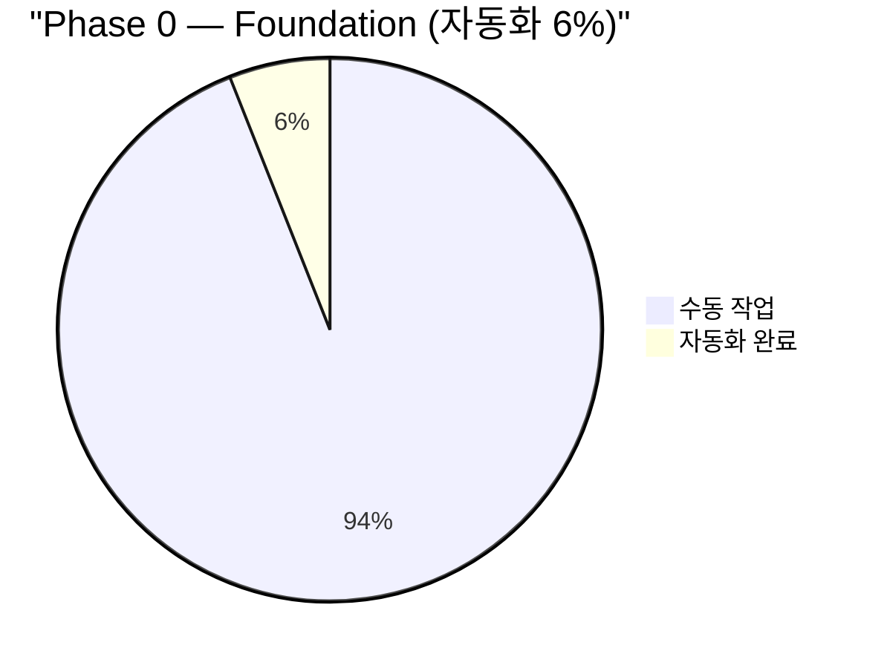

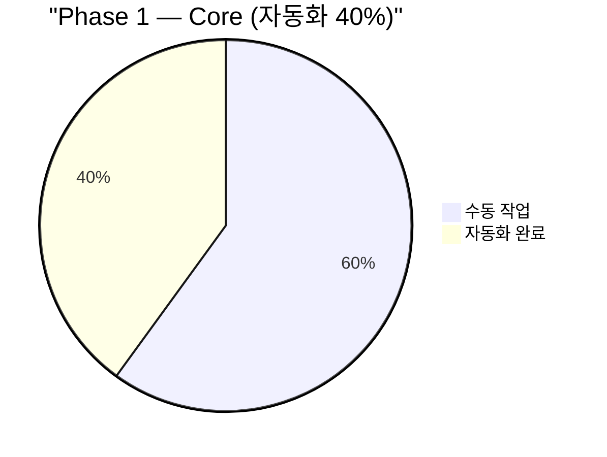

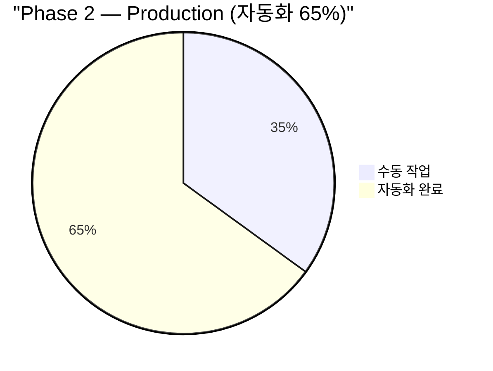

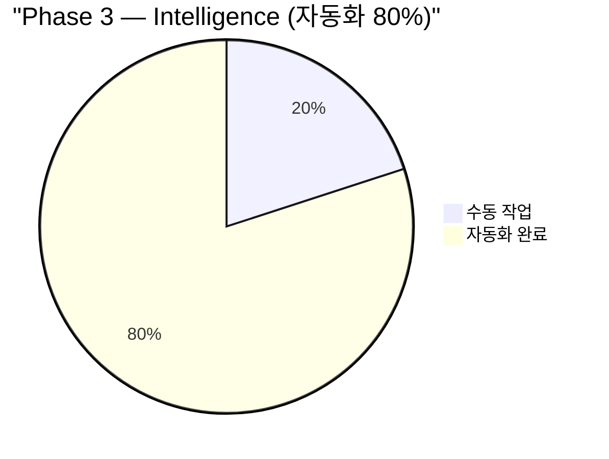

### 6.3 영역-Phase 매핑

| 작업 영역 | Phase 0 | Phase 1 | Phase 2 | Phase 3 |
|-----------|:-------:|:-------:|:-------:|:-------:|
| RFID 카드 인식 | - | 95% | 95% | 95% |
| 게임 상태 추적 | - | 90% | 90% | 90% |
| 오버레이 GFX 갱신 | 10% | 80% | 95% | 95% |
| 핸드 등급 분류 | - | 98% | 98% | 98% |
| 큐시트 생성 | 5% | 50% | 85% | 85% |
| AE 렌더링 | - | - | 90% | 90% |
| VOD 아카이브 | 20% | 50% | 95% | 95% |
| 하이라이트 추출 | - | - | 60% | 80% |
| OTT 배포 | 30% | 60% | 90% | 90% |
| 일일 브리핑 | - | - | 50% | 85% |
| 플레이어 통계 | 10% | 60% | 80% | 90% |
| 인력 스케줄링 | - | - | 40% | 70% |

## 7. Phase별 시스템 진화

4개 Phase를 거치며 7-Layer Architecture가 점진적으로 활성화된다. 각 Phase에서 새로 활성화되는 Layer와 프로젝트를 시각화한다.

### 7.1 Phase 진화 타임라인

```mermaid
graph TB
    subgraph P0["Phase 0 — Foundation<br/>역설계 + 분석"]
        P0L1["L1 Hardware<br/>RFID 리더 프로토콜 분석"]:::active
        P0L2["L2 Firmware<br/>GfxServer 역설계"]:::active
        P0L3["L3 Core<br/>핸드 파서 프로토타입"]:::partial
        P0L4["L4 Broadcast"]:::inactive
        P0L5["L5 Data"]:::inactive
        P0L6["L6 Content"]:::inactive
        P0L7["L7 Operations"]:::inactive
    end

    subgraph P1["Phase 1 — Core<br/>단일 테이블 E2E (v1.0, 68기능)"]
        P1L1["L1 Hardware<br/>RFID 실시간 수집"]:::active
        P1L2["L2 Firmware<br/>GfxServer 자동 캡처"]:::active
        P1L3["L3 Core<br/>핸드 분석 엔진"]:::active
        P1L4["L4 Broadcast<br/>오버레이 자동 갱신"]:::active
        P1L5["L5 Data"]:::inactive
        P1L6["L6 Content"]:::inactive
        P1L7["L7 Operations"]:::inactive
    end

    subgraph P2["Phase 2 — Production<br/>멀티테이블 + AE + OTT"]
        P2L1["L1 Hardware<br/>멀티테이블 RFID"]:::active
        P2L2["L2 Firmware<br/>다채널 캡처"]:::active
        P2L3["L3 Core<br/>병렬 핸드 처리"]:::active
        P2L4["L4 Broadcast<br/>큐시트 + AE 렌더"]:::active
        P2L5["L5 Data<br/>VOD + OTT 배포"]:::active
        P2L6["L6 Content<br/>하이라이트 추출"]:::active
        P2L7["L7 Operations"]:::inactive
    end

    subgraph P3["Phase 3 — Intelligence<br/>AI + 자동화 80% + 인력 최적화"]
        P3L1["L1 Hardware<br/>자동 헬스체크"]:::active
        P3L2["L2 Firmware<br/>적응형 캡처"]:::active
        P3L3["L3 Core<br/>실시간 AI 분석"]:::active
        P3L4["L4 Broadcast<br/>자율 프로덕션"]:::active
        P3L5["L5 Data<br/>자동 멀티플랫폼"]:::active
        P3L6["L6 Content<br/>AI 브리핑 + 통계"]:::active
        P3L7["L7 Operations<br/>인력 최적화 + 스케줄"]:::active
    end

    P0 -->|"프로토콜 확정"| P1
    P1 -->|"단일 테이블 검증"| P2
    P2 -->|"프로덕션 안정화"| P3

    classDef active fill:#27ae60,stroke:#1e8449,color:#fff
    classDef partial fill:#f39c12,stroke:#d68910,color:#fff
    classDef inactive fill:#bdc3c7,stroke:#95a5a6,color:#666
```

### 7.2 Phase별 프로젝트 활성화

```mermaid
graph LR
    subgraph Phase0["Phase 0"]
        A0["archive-analyzer"]
        B0["ebs-overlay<br/>(역설계)"]
    end

    subgraph Phase1["Phase 1"]
        A1["rfid-reader"]
        B1["gfx-server"]
        C1["hand-engine"]
        D1["ebs-overlay<br/>(자동화)"]
        E1["ebs-supabase"]
    end

    subgraph Phase2["Phase 2"]
        A2["ae-renderer"]
        B2["vod-pipeline"]
        C2["vimeo-ott"]
        D2["cuesheet-gen"]
        E2["highlight-extractor"]
    end

    subgraph Phase3["Phase 3"]
        A3["ai-briefing"]
        B3["player-stats"]
        C3["ops-scheduler"]
        D3["automation-hub"]
    end

    Phase0 --> Phase1 --> Phase2 --> Phase3

    style Phase0 fill:#e8f8f5,stroke:#1abc9c,color:#333
    style Phase1 fill:#ebf5fb,stroke:#3498db,color:#333
    style Phase2 fill:#fef9e7,stroke:#f1c40f,color:#333
    style Phase3 fill:#fdedec,stroke:#e74c3c,color:#333
```

### 7.3 Phase별 핵심 지표

| 지표 | Phase 0 | Phase 1 | Phase 2 | Phase 3 |
|------|:-------:|:-------:|:-------:|:-------:|
| 활성 Layer | L1-L3 일부 | L1-L4 | L1-L6 | L1-L7 |
| 프로젝트 수 | 2 | 5 | 10 | 18 |
| 자동화율 | 6% | 40% | 65% | 80% |
| 지원 테이블 | 0 | 1 | 4+ | 8+ |
| 필요 인력 | 30명 | 25명 | 20명 | 15-20명 |

## 8. 비용 효과 모델

자동화를 통한 인력 비용 절감 효과와 ROI를 시각화한다.

### 8.1 인력 구성 변화

```mermaid
graph LR
    subgraph NOW["현재 (Phase 0)<br/>30명"]
        N1["TD / 감독: 3명"]
        N2["카메라 오퍼: 8명"]
        N3["GFX 오퍼: 4명"]
        N4["오디오: 3명"]
        N5["편집 / 후반: 5명"]
        N6["스트리밍: 2명"]
        N7["데이터 입력: 3명"]
        N8["기타 지원: 2명"]
    end

    subgraph TARGET["목표 (Phase 3)<br/>15-20명"]
        T1["TD / 감독: 2명"]
        T2["카메라 오퍼: 4명"]
        T3["GFX 오퍼: 1명<br/>(모니터링 전환)"]
        T4["오디오: 2명"]
        T5["편집 / 후반: 2명<br/>(QC 전환)"]
        T6["스트리밍: 1명<br/>(자동화)"]
        T7["데이터 입력: 0명<br/>(RFID 대체)"]
        T8["시스템 엔지니어: 3명<br/>(신규)"]
    end

    NOW -->|"Phase 1~3<br/>자동화 전환"| TARGET

    style NOW fill:#ffcccc,stroke:#e74c3c,color:#333
    style TARGET fill:#ccffcc,stroke:#27ae60,color:#333
```

### 8.2 비용 구성 비교

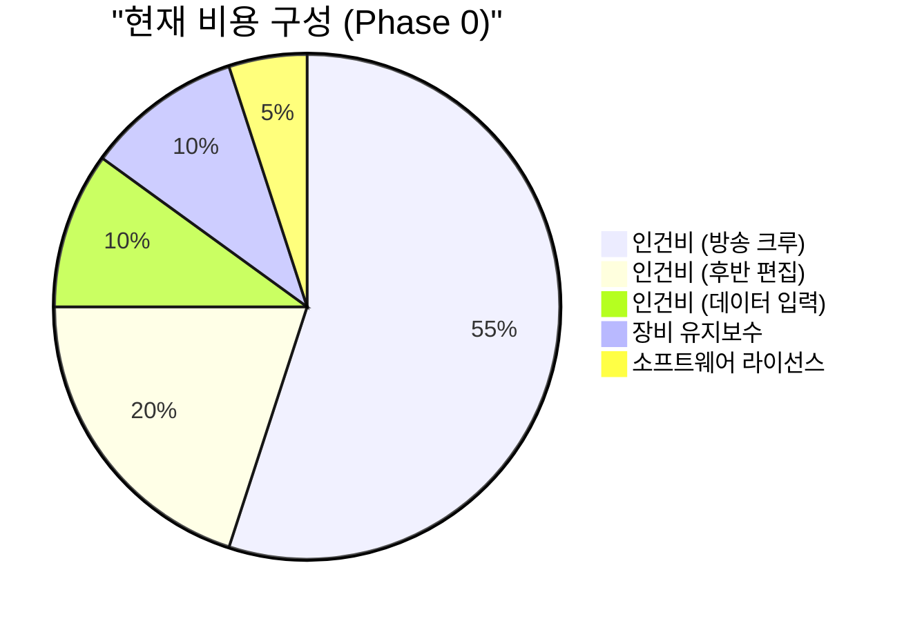

```mermaid
pie title "목표 비용 구성 (Phase 3)"
    "인건비 (방송 크루)" : 30
    "인건비 (시스템 엔지니어)" : 15
    "클라우드 인프라" : 20
    "장비 유지보수" : 15
    "소프트웨어 라이선스" : 10
    "AI / ML 비용" : 10
```

### 8.3 ROI 타임라인

```mermaid
graph LR
    subgraph ROI["투자 회수 타임라인"]
        R0["Phase 0<br/>투자: 초기 개발비<br/>절감: 0%"]:::invest
        R1["Phase 1<br/>투자: +인프라 비용<br/>절감: -17% 인력"]:::invest
        R2["Phase 2<br/>BEP 도달<br/>절감: -33% 인력"]:::breakeven
        R3["Phase 3<br/>순이익 전환<br/>절감: -50% 인력"]:::profit
    end

    R0 --> R1 --> R2 --> R3

    classDef invest fill:#e74c3c,stroke:#c0392b,color:#fff
    classDef breakeven fill:#f39c12,stroke:#d68910,color:#fff
    classDef profit fill:#27ae60,stroke:#1e8449,color:#fff
```

### 8.4 영역별 인력 대체 효과

| 자동화 영역 | 대체 인력 | 절감 인원 | 활성화 Phase |
|------------|----------|:---------:|:----------:|
| RFID 카드 인식 | 데이터 입력 담당 | 3명 | Phase 1 |
| 오버레이 GFX 자동 갱신 | GFX 오퍼레이터 | 3명 | Phase 1 |
| AE 자동 렌더링 | 편집 담당 | 2명 | Phase 2 |
| VOD 자동 아카이브 | 편집 담당 | 1명 | Phase 2 |
| OTT 자동 배포 | 스트리밍 담당 | 1명 | Phase 2 |
| AI 브리핑 / 하이라이트 | 편집 + 감독 보조 | 2명 | Phase 3 |
| 인력 스케줄링 자동화 | 기타 지원 | 1명 | Phase 3 |
| 카메라 운영 축소 | 카메라 오퍼레이터 | 2명 | Phase 2 |
| **계** | | **15명** | |

> 30명 → 15-20명으로 순감 10-15명이나, 시스템 엔지니어 3명 신규 채용으로 실질 절감은 약 7-12명 + 역할 전환.

## 9. 데이터 라이프사이클

데이터가 생성에서 삭제까지 거치는 전체 수명 주기와 저장소 계층을 시각화한다.

### 9.1 데이터 수명 주기 (State Diagram)

```mermaid
stateDiagram-v2
    [*] --> 생성: RFID / GfxServer / 카메라
    생성 --> 실시간처리: Stream Ingestion
    실시간처리 --> Hot저장: Supabase 저장
    Hot저장 --> 소비: API 조회 / 오버레이 렌더
    소비 --> Warm저장: 방송 종료 후 이관
    Warm저장 --> Cold저장: 30일 경과
    Cold저장 --> 아카이브: 시즌 종료
    아카이브 --> 삭제: 보존 기한 만료 (2년)
    삭제 --> [*]

    Hot저장 --> 실시간처리: 재처리 요청
    Warm저장 --> 소비: 온디맨드 조회
    Cold저장 --> Warm저장: 복원 요청
```

### 9.2 저장소 계층 (Hot / Warm / Cold)

```mermaid
graph TB
    subgraph Hot["Hot Storage<br/>Supabase (PostgreSQL)<br/>응답: < 100ms"]
        H1["핸드 데이터<br/>(실시간)"]
        H2["게임 상태<br/>(활성 테이블)"]
        H3["플레이어 프로필<br/>(활성 대회)"]
        H4["오버레이 상태<br/>(렌더 큐)"]
    end

    subgraph Warm["Warm Storage<br/>NAS (SMB/NFS)<br/>응답: ~100ms"]
        W1["녹화 영상<br/>(최근 30일)"]
        W2["렌더 결과물<br/>(AE 출력)"]
        W3["히스토리 데이터<br/>(완료 핸드)"]
        W4["AI 분석 결과<br/>(하이라이트 메타)"]
    end

    subgraph Cold["Cold Storage<br/>Vimeo OTT / Archive<br/>응답: ~1s"]
        C1["VOD 아카이브<br/>(전체 시즌)"]
        C2["하이라이트 클립<br/>(편집 완료)"]
        C3["통계 스냅샷<br/>(월별 집계)"]
    end

    Hot -->|"방송 종료 후<br/>배치 이관"| Warm
    Warm -->|"30일 후<br/>아카이브"| Cold
    Cold -->|"온디맨드<br/>복원"| Warm

    style Hot fill:#e74c3c,stroke:#c0392b,color:#fff
    style Warm fill:#f39c12,stroke:#d68910,color:#fff
    style Cold fill:#3498db,stroke:#2980b9,color:#fff
```

### 9.3 데이터 유형별 라이프사이클

| 데이터 유형 | 생성 소스 | Hot 기간 | Warm 기간 | Cold 기간 | 최종 상태 |
|------------|----------|:--------:|:---------:|:---------:|:---------:|
| 핸드 데이터 | RFID + GfxServer | 방송 중 | 30일 | 2년 | 삭제 |
| 녹화 영상 | NDI 캡처 | - | 30일 | 무기한 | 아카이브 |
| 렌더 결과물 | AE Renderer | 렌더 완료까지 | 30일 | 1년 | 삭제 |
| AI 분석 결과 | ML Pipeline | 방송 중 | 90일 | 2년 | 삭제 |
| 하이라이트 클립 | Highlight Extractor | - | 30일 | 무기한 | 아카이브 |
| 플레이어 통계 | Aggregation | 대회 중 | 시즌 중 | 무기한 | 아카이브 |

### 9.4 데이터 볼륨 추정

```mermaid
graph LR
    subgraph Daily["일일 데이터 생산량"]
        D1["핸드 데이터<br/>~50,000건 / 일"]
        D2["녹화 영상<br/>~500GB / 일"]
        D3["렌더 결과물<br/>~100GB / 일"]
        D4["AI 메타데이터<br/>~1GB / 일"]
    end

    subgraph Season["시즌 누적 (45일)"]
        S1["핸드: 2.25M건"]
        S2["영상: 22.5TB"]
        S3["렌더: 4.5TB"]
        S4["메타: 45GB"]
    end

    Daily -->|"x 45일"| Season

    style Daily fill:#ecf0f1,stroke:#95a5a6,color:#333
    style Season fill:#dfe6e9,stroke:#636e72,color:#333
```

## 10. 모니터링 & 알림 토폴로지

각 Layer별 모니터링 포인트와 알림 경로를 시각화한다.

### 10.1 Layer별 모니터링 포인트

```mermaid
graph TB
    subgraph L1["L1 Hardware"]
        M1["RFID 헬스체크<br/>연결 상태 / 읽기 성공률"]
        M2["카메라 피드<br/>NDI 신호 유무"]
    end

    subgraph L2["L2 Firmware"]
        M3["GfxServer 상태<br/>메모리 사용 / 응답 시간"]
        M4["캡처 큐 깊이<br/>백프레셔 감지"]
    end

    subgraph L3["L3 Core"]
        M5["핸드 파서 지연<br/>처리 시간 / 오류율"]
        M6["DB 연결 풀<br/>활성 / 유휴 비율"]
    end

    subgraph L4["L4 Broadcast"]
        M7["렌더 큐 상태<br/>대기 / 처리 중 / 실패"]
        M8["오버레이 갱신 주기<br/>목표 대비 지연"]
    end

    subgraph L5["L5 Data"]
        M9["스트리밍 상태<br/>비트레이트 / 프레임 드롭"]
        M10["OTT 업로드<br/>성공 / 실패 / 재시도"]
    end

    subgraph L6["L6 Content"]
        M11["ML 추론 지연<br/>P95 응답 시간"]
        M12["하이라이트 정확도<br/>False Positive 비율"]
    end

    subgraph L7["L7 Operations"]
        M13["인력 스케줄<br/>미배정 슬롯"]
        M14["비용 대시보드<br/>예산 대비 실적"]
    end

    style L1 fill:#e8f8f5,stroke:#1abc9c,color:#333
    style L2 fill:#ebf5fb,stroke:#3498db,color:#333
    style L3 fill:#fef9e7,stroke:#f1c40f,color:#333
    style L4 fill:#fdebd0,stroke:#e67e22,color:#333
    style L5 fill:#fdedec,stroke:#e74c3c,color:#333
    style L6 fill:#f4ecf7,stroke:#8e44ad,color:#333
    style L7 fill:#eaecee,stroke:#2c3e50,color:#333
```

### 10.2 알림 경로 (감지 → 대응)

```mermaid
sequenceDiagram
    participant Sensor as 센서/프로브
    participant Collector as 수집기
    participant Classifier as 분류기
    participant Channel as 알림 채널
    participant Operator as 운영자

    Sensor->>Collector: 메트릭 전송 (5초 주기)
    Collector->>Classifier: 이상 감지 전달

    alt Critical (P1)
        Classifier->>Channel: SMS + Slack #critical
        Channel->>Operator: 즉시 대응 (< 5분)
        Operator->>Sensor: 장애 조치
    else Warning (P2)
        Classifier->>Channel: Slack #alerts
        Channel->>Operator: 확인 (< 30분)
    else Info (P3)
        Classifier->>Channel: Slack #monitoring (로그)
        Note over Channel: 이력 기록만
    end
```

### 10.3 심각도별 알림 채널

| 심각도 | 조건 예시 | 알림 채널 | 응답 시간 목표 |
|:------:|----------|----------|:------------:|
| **P1 Critical** | RFID 전체 장애, DB 연결 끊김, 스트리밍 중단 | SMS + Slack #critical + 대시보드 | < 5분 |
| **P2 Warning** | 렌더 큐 적체 (>50), GfxServer 응답 지연 (>2s), 캡처 프레임 드롭 | Slack #alerts + 대시보드 | < 30분 |
| **P3 Info** | OTT 업로드 재시도, ML 추론 P95 증가, 스케줄 미배정 | Slack #monitoring | 다음 브리핑 |

### 10.4 핵심 모니터링 지표 대시보드

```mermaid
graph LR
    subgraph Dashboard["운영 대시보드"]
        D1["RFID<br/>읽기 성공률<br/>목표: 99.5%"]
        D2["GfxServer<br/>응답 시간<br/>목표: < 500ms"]
        D3["렌더 큐<br/>대기 작업<br/>목표: < 10"]
        D4["DB 연결<br/>활성 풀<br/>목표: < 80%"]
        D5["스트리밍<br/>프레임 드롭<br/>목표: 0%"]
        D6["OTT 업로드<br/>성공률<br/>목표: 99%"]
    end

    D1 --> Alert1{"임계값<br/>초과?"}
    D2 --> Alert2{"임계값<br/>초과?"}
    D3 --> Alert3{"임계값<br/>초과?"}

    Alert1 -->|"Yes"| P1["P1 알림"]:::critical
    Alert2 -->|"Yes"| P2["P2 알림"]:::warning
    Alert3 -->|"Yes"| P2b["P2 알림"]:::warning

    classDef critical fill:#e74c3c,stroke:#c0392b,color:#fff
    classDef warning fill:#f39c12,stroke:#d68910,color:#fff
```

## Changelog

| 날짜 | 버전 | 변경 내용 | 결정 근거 |
|------|------|-----------|----------|
| 2026-03-05 | v1.1 | Layer 명칭 정본 통일 (L2-L6), 인력 목표 15→15-20명 정합 | Architect 검증 피드백 반영 |
| 2026-03-05 | v1.0 | 최초 작성 — 10개 섹션, 28개 Mermaid 다이어그램 | EBS Ecosystem 시각화 중심 설계 문서 |
