# GGProduction Seoul Operations Guide

> **Source**: 2026 WSOP Production Plan, Pages 76-88
> **Scope**: GGProduction 서울 스튜디오의 운영 프로세스 전체 — Studio Layout, Front-End, Back-End, Data Management, Commentator, Transmission, L-Bar

---

## 1. Studio Layout

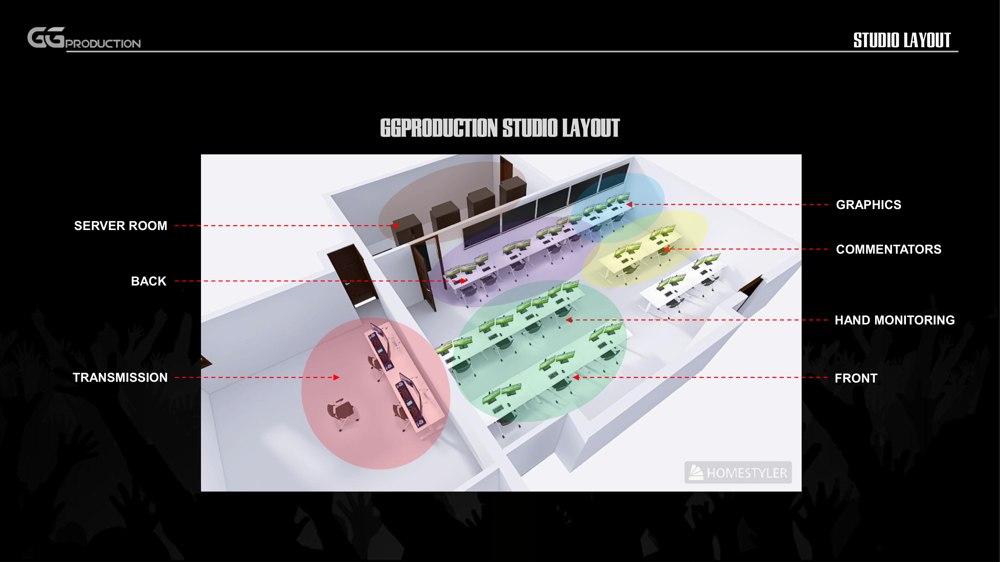

GGProduction 서울 스튜디오는 6개 기능 구역으로 구성된다.

| 구역 | 역할 |
|------|------|
| **Front** | 콘텐츠 선별 및 전달 순서 결정 |
| **Hand Monitoring** | 라이브 핸드 모니터링 |
| **Commentators** | 해설 부스 |
| **Graphics** | 그래픽 제작 |
| **Back** | 디자인, 편집, 후반 작업 |
| **Transmission** | 송출 (AJA Bridgelive) |
| **Server Room** | 서버 및 인프라 |

---

## 2. Front-End Process

### 2.1 Live Feed + Data Sheet (Step 1-3)

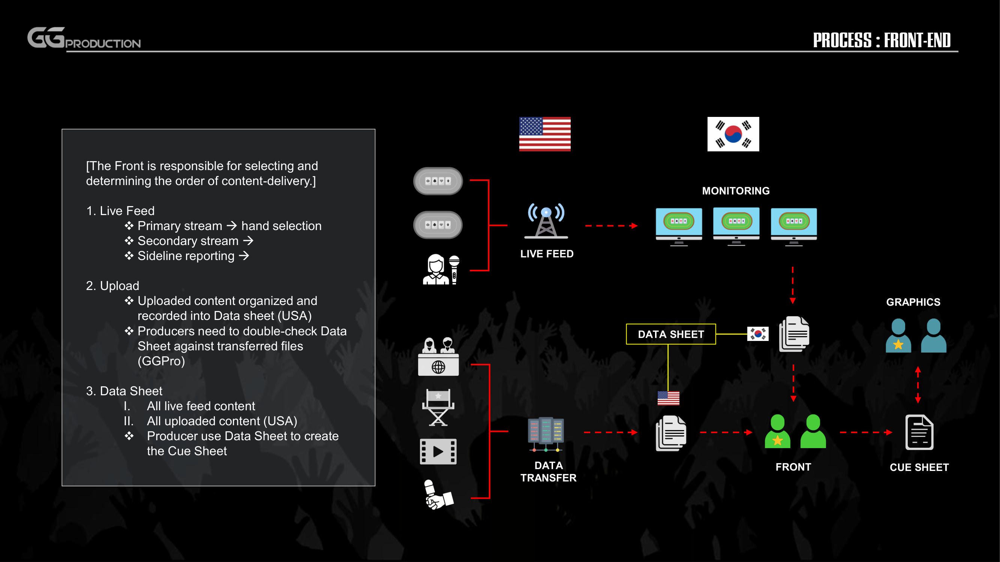

Front는 콘텐츠를 선별하고 전달 순서를 결정하는 역할을 담당한다.

**Step 1 — Live Feed**
- Primary stream: 핸드 선별 (hand selection)
- Secondary stream
- Sideline reporting

**Step 2 — Upload**
- 업로드된 콘텐츠를 Data Sheet에 정리 및 기록 (USA 현장)
- Producer가 Data Sheet와 전송된 파일을 대조 확인 (GGPro)

**Step 3 — Data Sheet**
1. 모든 라이브 피드 콘텐츠 기록
2. 모든 업로드 콘텐츠 기록 (USA)
- Producer가 Data Sheet를 기반으로 Cue Sheet 생성

### 2.2 Cue Sheet + Graphics (Step 4-5)

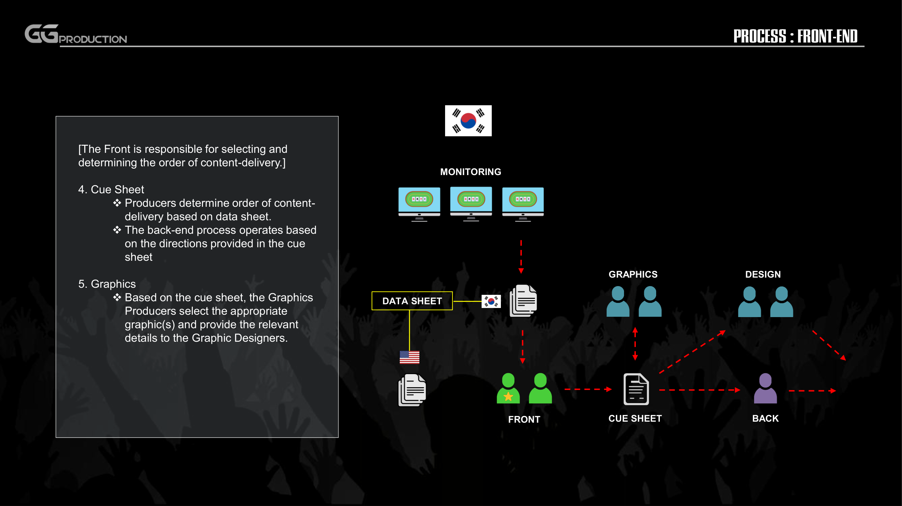

**Step 4 — Cue Sheet**
- Producer가 Data Sheet 기반으로 콘텐츠 전달 순서 결정
- Back-End 프로세스는 Cue Sheet의 지시에 따라 운영

**Step 5 — Graphics**
- Cue Sheet 기반으로 Graphics Producer가 적절한 그래픽 선택
- Graphic Designer에게 관련 세부사항 전달

---

## 3. Back-End Process

### 3.1 Design + Edit

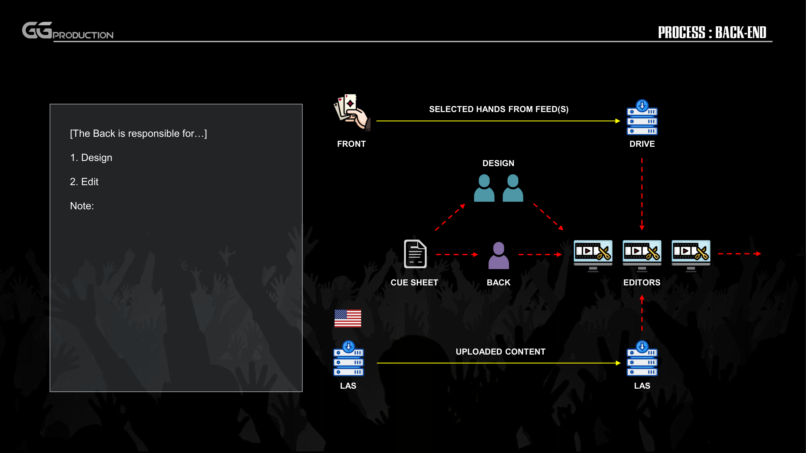

Back은 다음을 담당한다:

1. **Design** — 그래픽/영상 디자인
2. **Edit** — 영상 편집

**데이터 흐름:**
- Front에서 선별된 핸드가 Drive에 저장
- Cue Sheet가 Back 팀에 전달
- Editor가 편집 작업 수행
- USA LAS ↔ Korea LAS 간 업로드 콘텐츠 전송

### 3.2 Transmission + Commentator

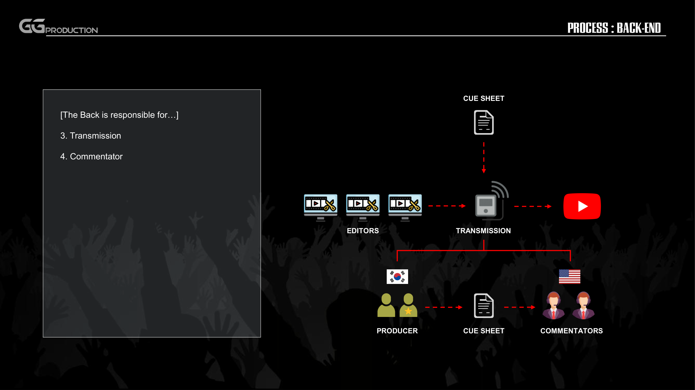

3. **Transmission** — 편집 완료된 영상을 Cue Sheet 기반으로 송출
4. **Commentator** — Producer ↔ Commentators 간 Cue Sheet 기반 커뮤니케이션

**흐름:** Editors → Transmission → Output (YouTube 등)
- Producer (Korea)가 Cue Sheet로 Commentators (USA)에 큐 전달

---

## 4. Data Management

### 4.1 콘텐츠 소스 분류

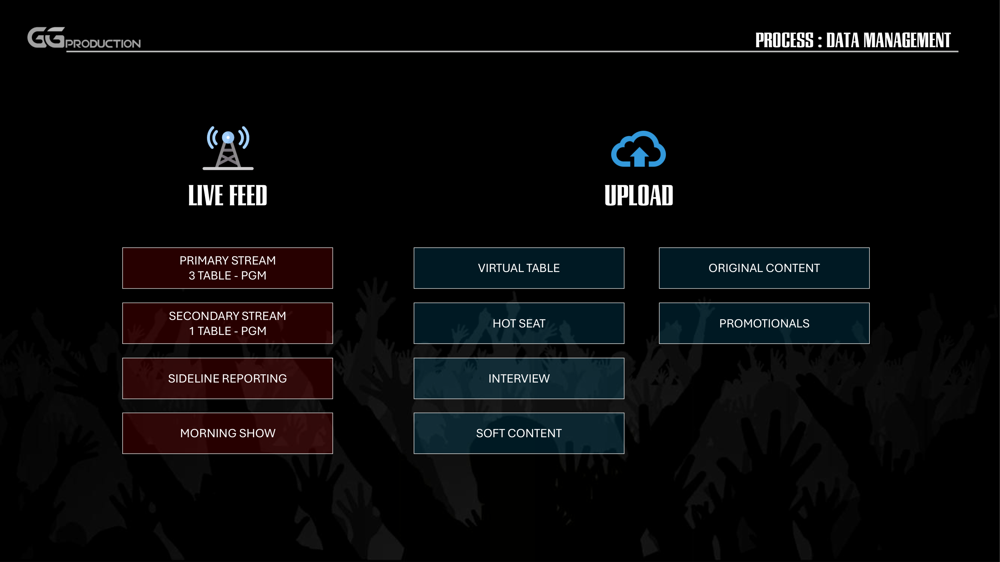

| 카테고리 | 소스 유형 |
|---------|----------|
| **Live Feed** | Primary Stream (3 Table PGM), Secondary Stream (1 Table PGM), Sideline Reporting, Morning Show |
| **Upload** | Virtual Table, Hot Seat, Interview, Soft Content, Original Content, Promotionals |

### 4.2 File Transfer + Cue 흐름

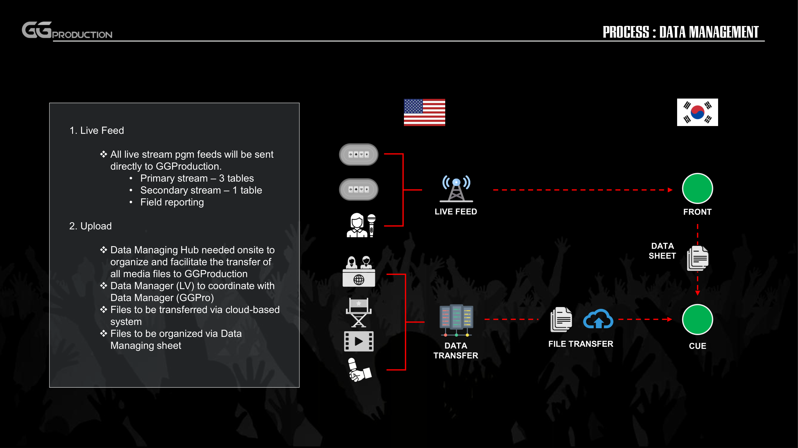

**1. Live Feed**
- 모든 라이브 스트림 PGM 피드가 GGProduction으로 직접 전송
  - Primary stream: 3 tables
  - Secondary stream: 1 table
  - Field reporting

**2. Upload**
- 현장(LV)에 Data Managing Hub 필요 — 모든 미디어 파일의 정리 및 GGProduction 전송 담당
- Data Manager (LV) ↔ Data Manager (GGPro) 간 조율
- Cloud 기반 시스템으로 파일 전송
- Data Managing Sheet로 파일 정리

### 4.3 Front-End ↔ Back-End 데이터 분배

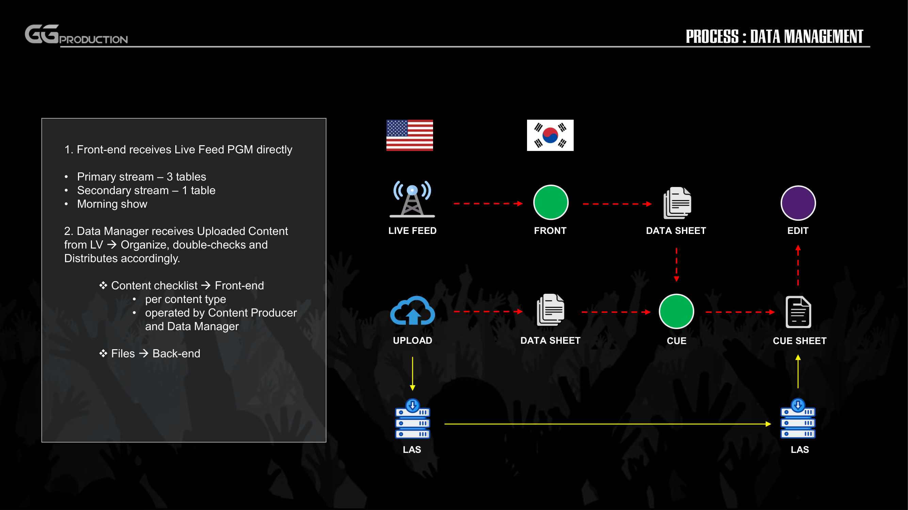

**1. Front-End: Live Feed PGM 직접 수신**
- Primary stream: 3 tables
- Secondary stream: 1 table
- Morning show

**2. Data Manager: Upload 콘텐츠 수신 및 분배**
- Content checklist → Front-End (콘텐츠 유형별, Content Producer + Data Manager 운영)
- Files → Back-End

**LAS 서버 연결:** USA LAS ↔ Korea LAS (미러링)

### 4.4 File Transfer Process (LAS Mirroring)

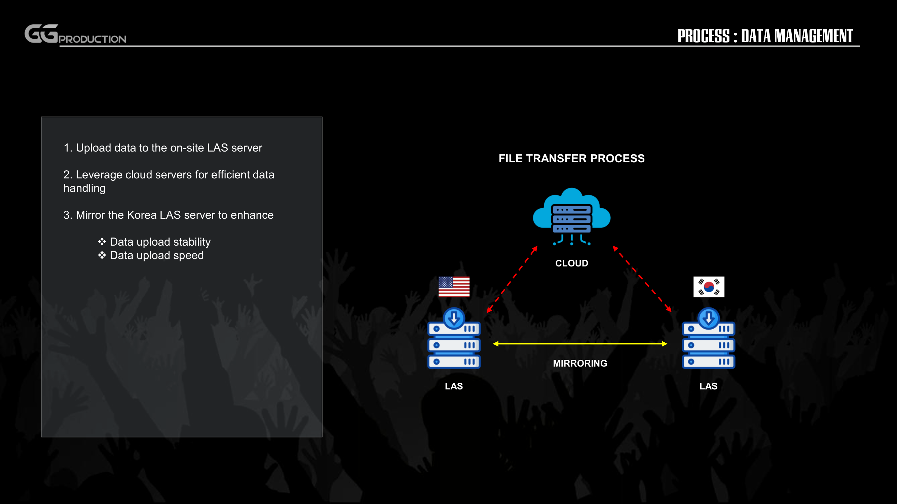

**3단계 프로세스:**
1. 현장 LAS 서버에 데이터 업로드
2. Cloud 서버를 활용한 효율적 데이터 처리
3. Korea LAS 서버 미러링으로 향상:
   - 데이터 업로드 안정성
   - 데이터 업로드 속도

**구조:** USA LAS ↔ Cloud ↔ Korea LAS (양방향 미러링)

---

## 5. Commentator Process

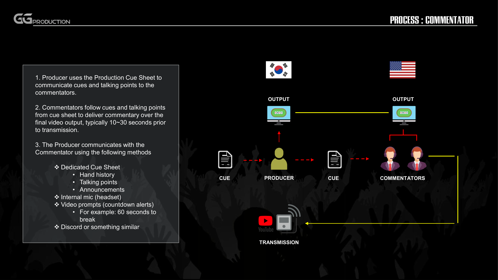

**1.** Producer가 Production Cue Sheet로 Commentators에게 큐 및 토킹 포인트 전달

**2.** Commentators는 Cue Sheet의 큐/토킹 포인트를 따라 최종 비디오 출력 위에 해설 — 송출 **10~30초 전** 전달

**3.** Producer ↔ Commentator 커뮤니케이션 수단:
- **Dedicated Cue Sheet**: Hand history, Talking points, Announcements
- **Internal mic** (headset)
- **Video prompts** (countdown alerts) — 예: "60 seconds to break"
- **Discord** 또는 유사 플랫폼

---

## 6. Transmission Process

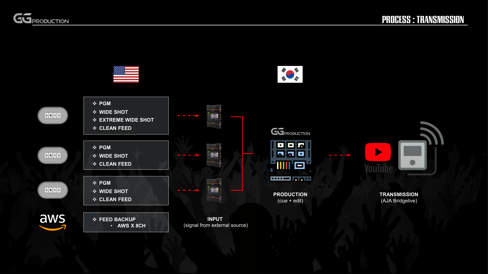

### Input (USA → Korea)

| 소스 | 채널 |
|------|------|
| Primary Stream | PGM, Wide Shot, Extreme Wide Shot, Clean Feed |
| Secondary Stream | PGM, Wide Shot, Clean Feed |
| Tertiary Stream | PGM, Wide Shot, Clean Feed |
| Feed Backup | AWS x 8CH |

### Signal Flow

```
INPUT (USA, signal from external source)
    ↓
PRODUCTION (Korea, cue + edit)
    ↓
TRANSMISSION (AJA Bridgelive → YouTube/OTT)
```

---

## 7. L-Bar Process

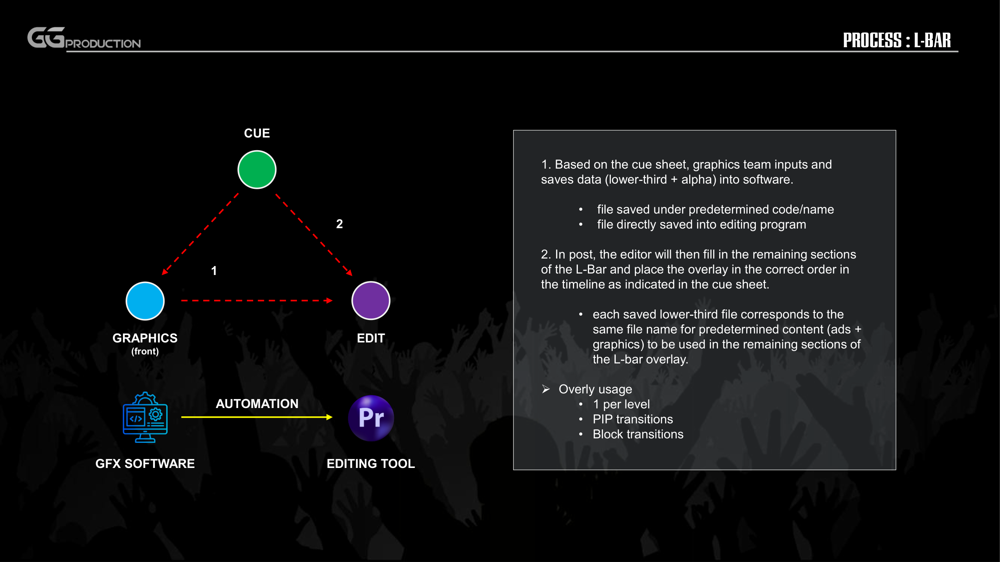

### Step 1 — Graphics Input
- Cue Sheet 기반으로 Graphics 팀이 lower-third + alpha 데이터를 GFX Software에 입력 및 저장
- 미리 정해진 code/name으로 파일 저장
- 편집 프로그램에 직접 저장

### Step 2 — Post Edit
- Editor가 L-Bar의 나머지 섹션을 채우고, Cue Sheet 순서대로 타임라인에 오버레이 배치
- 저장된 lower-third 파일 = 동일 파일명의 사전 결정된 콘텐츠(ads + graphics)와 매핑 → L-Bar 오버레이의 나머지 섹션에 사용

### Overlay 사용 규칙
- 레벨당 1개
- PIP transitions
- Block transitions

### Automation Flow

```
CUE SHEET
    ↓
GRAPHICS (Front) ──→ GFX SOFTWARE
    ↓                      ↓
   CUE ──────────→ AUTOMATION
    ↓                      ↓
  EDIT ←──────── EDITING TOOL (Premiere Pro)
```

---

## 요약: 전체 운영 플로우

```
USA (Las Vegas)                    Korea (Seoul - GGProduction)
═══════════════                    ═══════════════════════════

Live Feed ─────────────────────→  FRONT (콘텐츠 선별)
  - Primary (3 tables)                  ↓
  - Secondary (1 table)            DATA SHEET
  - Sideline / Morning Show            ↓
                                   CUE SHEET
Upload ────── Cloud/LAS ──────→       ↓
  - Virtual Table                 ┌─────────┐
  - Hot Seat / Interview          │         │
  - Original / Promo         GRAPHICS    BACK
                                  │    (Design + Edit)
                                  │         │
                              GFX + L-Bar   │
                                  │         │
                                  └────┬────┘
                                       │
                                  COMMENTATOR
                                  (10-30s pre-TX)
                                       │
                                  TRANSMISSION
                                  (AJA Bridgelive)
                                       │
                                    OUTPUT
                                  (YouTube/OTT)
```
