# EBS Ecosystem — 방송 인프라 플랫폼 설계 문서

> **Version**: 5.0 | **Last Updated**: 2026-03-06
> **분석 기반**: WSOP Production 워크플로우 (wsop-production-analysis.md)

---

## 1. 개요

WSOPLIVE는 포커 대회 전체를 관리하는 서비스 플랫폼이다. 이 플랫폼으로 인해 WSOP 대회는 WSOPLIVE 이전과 이후로 나뉘며, 업계는 현재를 WSOP 3.0이라 부른다.

EBS(Event Broadcasting System)는 포커 대회 방송에 필요한 모든 데이터, 기능, 자동화를 관리하는 인프라 플랫폼이다. WSOPLIVE와 독립적으로 설계되며, 각 영역에 최적의 방식을 별개로 설계한다.

| 항목 | 내용 |
|------|------|
| WSOPLIVE | 포커 대회 관리 서비스 플랫폼 = WSOP 3.0 |
| EBS | 포커 대회 방송 데이터·기능·자동화 관리 플랫폼 (WSOPLIVE와 독립 설계) |
| **분석 기반** | GG Production 크로스보더 워크플로우 (wsop-production-analysis.md) |
| **핵심 원칙** | 포커 대회 방송에 필요한 모든 데이터, 기능, 자동화를 EBS가 관리 |
| **프로젝트 규모** | 3-시스템 구조 (SYSTEM 1: 18개 기존 + SYSTEM 2: 4개 신규 + SYSTEM 3: 4개 신규) |
| **운영 구조** | USA(현장 촬영/해설) ↔ Korea(편성/편집/송출) 크로스보더 분업 |

### 1.1 EBS 관리 범위 밖의 영역

물리적 촬영(카메라), 음향(마이크/믹싱), 조명(DMX)은 EBS 범위 밖이다. **현재 Phase(1-2)에서는 비디오 입력 캡처(카메라 피드), 비디오 합성/스위칭, 녹화도 EBS 범위 밖**이며, 이 기능들은 프로덕션 소프트웨어(OBS/vMix)가 담당한다. EBS는 **순수 그래픽 생성과 데이터 시스템 이후의 소프트웨어 영역**(데이터, 기능, 자동화)을 관리한다.

> Phase 5 이후 AI Production(SYSTEM 2)에서 비디오 관련 책임을 점진적으로 내재화한다.

### 1.2 EBS 3-시스템 구조

EBS는 3개의 독립 시스템으로 구성된다. 각 시스템은 독립적인 워크플로우와 목표를 가진다.

#### SYSTEM 1: EBS Core — 포커 방송 데이터·기능·자동화 관리 플랫폼

pokergfx_flutter(GfxServer)는 4개 서브시스템을 단일 프로세스에 통합한다. 외부 프로젝트들이 이를 보완하며, Back Office가 운영·데이터를 지원한다.

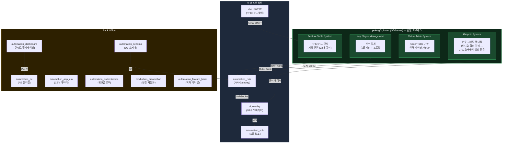

#### SYSTEM 2: AI Production 무인화 — 방송 제작 과정 AI 자동화

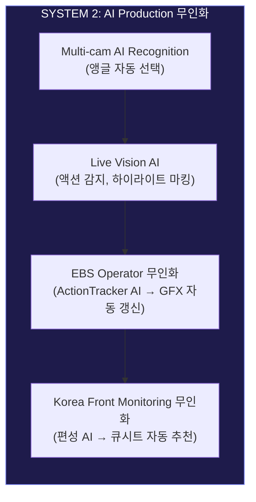

#### SYSTEM 3: OTT AI 자동화 — 하이라이트, 선수 정보, 콘텐츠 배포

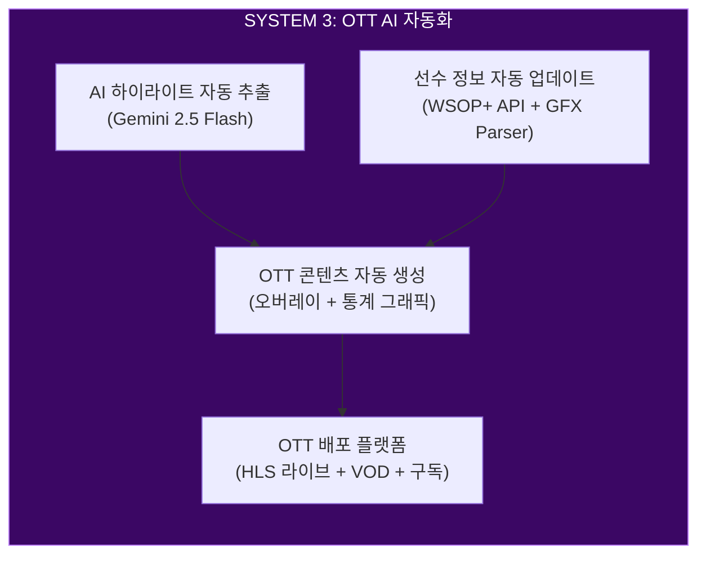

#### 시스템별 프로젝트 매핑 요약

| 시스템 | 핵심 역할 | Phase | 프로젝트 수 |
|--------|----------|:-----:|:----------:|
| **SYSTEM 1: EBS Core** | 포커 방송 데이터·기능·자동화 관리 | Phase 1-4 | 18개 (기존 전체) |
| **SYSTEM 2: AI Production 무인화** | 방송 제작 과정 AI 자동화 | Phase 5 | 4개 (신규) |
| **SYSTEM 3: OTT AI 자동화** | 하이라이트, 선수 정보, 콘텐츠 배포 | Phase 6 | 4개 (신규) |

---

## 2. 프로덕션 워크플로우 전체 구조

WSOP 콘텐츠 제작은 **미국-한국 양국 크로스보더 분업 체계**로 운영된다. 촬영과 해설은 미국 현장에서, 편성/편집/송출은 한국에서 원격 수행하는 **더빙 방식 포스트 프로덕션** 구조다.

### 2.1 크로스보더 분업 다이어그램

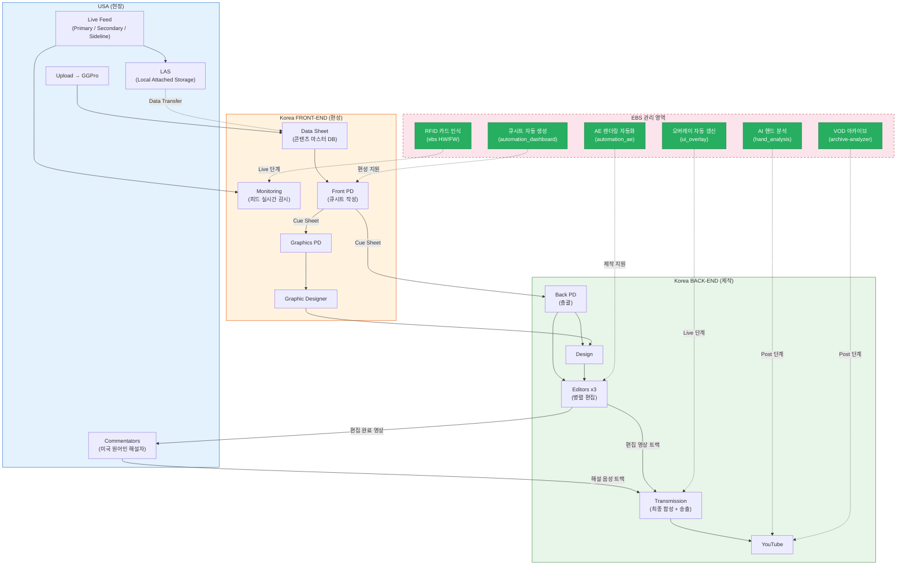

### 2.2 Front-End / Back-End 분리 원칙

| 구분 | 역할 | 위치 | 핵심 산출물 |
|------|------|------|------------|
| **Front-End** | 무엇을 보여줄지 결정 (편성) | 한국 | Data Sheet, Cue Sheet |
| **Back-End** | 어떻게 만들지 실행 (제작) | 한국 | 편집 영상, 최종 송출물 |
| **현장** | 원본 소스 촬영/수음 | 미국 | Live Feed, 원본 파일 |
| **해설** | 더빙 해설 녹음 | 미국 | 해설 음성 트랙 |

---

## 3. Front-End 프로세스와 EBS 지원

한국 Front-End 팀은 미국 현장 피드를 실시간 모니터링하며 콘텐츠 전달 순서를 결정하는 **편성 컨트롤타워** 역할을 수행한다.

### 3.1 5단계 프로세스

| 단계 | 프로세스 | 상세 | EBS 지원 |
|:----:|----------|------|-----------|
| 1 | **Live Feed 수신** | Primary stream(핸드 선별), Secondary stream, Sideline reporting 동시 수신 | RFID 카드 자동 인식 (ebs HW/FW) |
| 2 | **Upload + Data Sheet** | 미국에서 업로드된 콘텐츠를 Data Sheet로 정리. GGPro 시스템으로 전송 파일 이중 확인 | — |
| 3 | **Data Sheet 관리** | 모든 라이브 피드 + 업로드 콘텐츠의 마스터 DB 역할 | — |
| 4 | **Cue Sheet 작성** | Front PD가 Data Sheet 기반으로 콘텐츠 전달 순서 결정 → Back-End에 지시 | 큐시트 자동 생성 (automation_dashboard) |
| 5 | **Graphics 지시** | Cue Sheet 기반으로 Graphics PD가 그래픽 선택 → Graphic Designer에게 디테일 전달 | 오버레이 자동 갱신 (ui_overlay) |

### 3.2 EBS 도입 전후 비교

| 작업 | Before (수동) | After (EBS) | EBS 지원 수준 |
|------|-------------|------------|:----------:|
| 카드 인식 | 데이터 입력 스태프 3명 수동 입력 | RFID 자동 감지 (ST25R3911B) | 완전 자동 |
| 큐시트 작성 | PD가 Data Sheet 보며 수기 작성 | 이벤트 기반 자동 생성 (automation_dashboard) | 반자동 (PD 승인) |
| 오버레이 갱신 | GFX 오퍼레이터 수동 갱신 | WebSocket 이벤트 → 자동 렌더링 (ui_overlay) | 완전 자동 |
| 핸드 분류 | PD 경험 기반 판단 | pokergfx_flutter 22개 규칙 자동 분류 | 완전 자동 |

## 4. Back-End 프로세스와 EBS 지원

### 4.1 편집 파이프라인

| 단계 | 프로세스 | 상세 | EBS 지원 |
|:----:|----------|------|-----------|
| 1 | **Design** | Front에서 선별된 핸드를 Drive에서 가져와 디자인 작업 | — |
| 2 | **Edit** | 3명의 Editor가 동시 병렬 편집 (편집 스테이션 3대 운영) | AE 렌더링 자동화 (automation_ae) |
| 3 | **LAS Upload** | 편집 완료물을 LAS에 업로드 | — |

### 4.2 Commentator 해설 프로세스 (더빙 방식 — 3단계)

실시간 방송이 아닌 **더빙 방식 포스트 프로덕션**으로, 편집이 먼저 완료된 후 해설을 삽입한다.

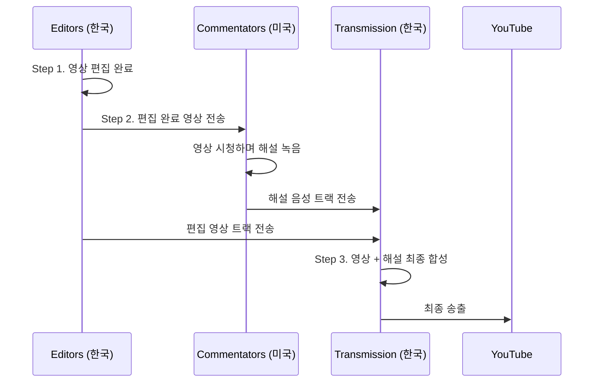

| Step | 주체 | 작업 | 산출물 |
|:----:|------|------|--------|
| **1** | 한국 Editors | 영상 편집 완료 (해설 없는 영상) | 편집 영상 트랙 |
| **2** | 미국 Commentators | 편집 완료 영상을 시청하며 해설 녹음 | 해설 음성 트랙 |
| **3** | 한국 Transmission | 편집 영상 + 해설 음성 최종 합성 → YouTube 송출 | 최종 송출물 |

> **핵심**: 해설자는 편집된 영상을 "보면서" 사후 녹음하는 더빙 방식이다. 실시간 중계가 아니므로, 편집 방향에 맞춘 정밀한 해설이 가능하다.

### 4.3 멀티 에디터 병렬 편집과 EBS 지원

3대의 편집 스테이션이 동시 운영되어 대회 기간 대량 콘텐츠를 빠르게 처리한다. EBS는 이 과정에서 다음을 자동화한다:

| EBS 프로젝트 | 지원 내용 |
|-------------|----------|
| automation_ae | 큐시트 기반 AE 템플릿 자동 렌더링 (Nexrender) |
| automation_aep_csv | AE 프로젝트에 삽입할 CSV 데이터 자동 생성 |
| hand_analysis | AI 핸드 분석으로 하이라이트 후보 자동 추출 |
| automation_dashboard | 멀티테이블 전환 지시 (PD 승인 기반) |

---

## 5. 실시간 방송 파이프라인 (Live Production)

RFID 카드 인식부터 방송 송출까지, 단일 테이블의 End-to-End 실시간 흐름이다.

### 5.1 단일 테이블 E2E 흐름

```mermaid
flowchart LR
    subgraph RFID["1. RFID 카드 인식"]
        R1["ST25R3911B<br/>NFC 리더"]
        R2["카드 감지<br/>→ UID 매핑"]
    end

    subgraph Engine["2. 게임 엔진"]
        E1["pokergfx_flutter<br/>(GfxServer)"]
        E2["22개 규칙<br/>핸드 자동 분류"]
    end

    subgraph Hub["3. 허브"]
        H1["automation_hub<br/>(API Gateway)"]
        H2["WebSocket<br/>이벤트 브로드캐스트"]
    end

    subgraph Overlay["4. 오버레이"]
        O1["ui_overlay<br/>(OBS 브라우저 소스)"]
        O2["홀카드 / 스코어<br/>통계 실시간 갱신"]
    end

    subgraph Broadcast["5. 방송 송출"]
        B1["OBS / vMix"]
        B2["NDI 입력<br/>+ 스트리밍 출력"]
    end

    R1 --> R2
    R2 -->|"Serial UART"| E1
    E1 --> E2
    E2 -->|"TCP :8888"| H1
    H1 --> H2
    H2 -->|"WebSocket"| O1
    O1 --> O2
    O2 -->|"NDI"| B1
    B1 --> B2

    style RFID fill:#efebe9,stroke:#4e342e,color:#333
    style Engine fill:#f3e5f5,stroke:#6a1b9a,color:#333
    style Hub fill:#fce4ec,stroke:#c62828,color:#333
    style Overlay fill:#e3f2fd,stroke:#1565c0,color:#333
    style Broadcast fill:#e8f5e9,stroke:#2e7d32,color:#333
```

### 5.2 각 단계 상세

| 단계 | 프로젝트 | 프로토콜 | 핵심 기능 |
|:----:|---------|---------|----------|
| RFID | ebs (HW/FW) | ISO 14443-A, Serial UART | ST25R3911B 리더, 카드 감지 → UID → 카드값 매핑 |
| 게임 엔진 | pokergfx_flutter | TCP :8888 (바이너리, 99 commands, 16 events) | 핸드 자동 분류, 게임 상태 추적, 22개 규칙 |
| 허브 | automation_hub | REST API + WebSocket | API Gateway (Game/Player/Card/Display/Media), 이벤트 브로드캐스트 |
| 오버레이 | ui_overlay | WebSocket → HTML/CSS/JS | 홀카드, 스코어보드, 플레이어 통계 실시간 렌더링 |
| 송출 | OBS / vMix | NDI, HLS/RTMP | **비디오 입력(카메라 피드) 관리, 스위칭, 오버레이 합성, 녹화, 스트리밍 출력** — 현재 Phase에서 비디오 관련 책임 전담 |

### 5.3 데이터 흐름 시퀀스

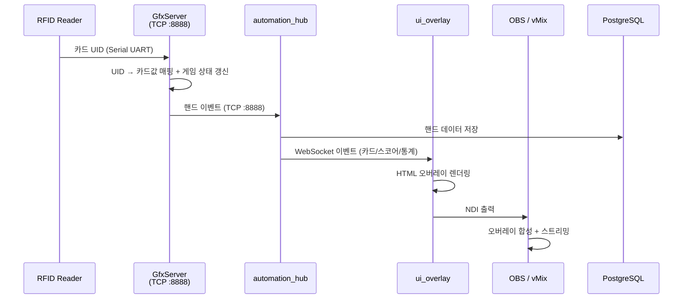

### 5.4 멀티테이블 확장

단일 테이블이 검증되면, automation_dashboard와 automation_sub이 멀티테이블 프로덕션을 지원한다.

| 프로젝트 | 역할 |
|---------|------|
| automation_dashboard | 멀티테이블 모니터링 + 테이블 전환 지시 (PD 승인) |
| automation_sub | 방송 송출 보조 (슬레이브), 테이블별 독립 오버레이 |

PD가 대시보드에서 테이블을 선택하면, 해당 테이블의 오버레이가 메인 송출에 전환된다.

---

## 6. SYSTEM 2: AI Production 무인화 워크플로우

SYSTEM 2는 방송 제작 과정의 AI 자동화를 목표로 한다. 현재 수동 운영되는 카메라 전환, 영상 분석, GFX 갱신, 편성을 단계적으로 AI가 대체한다.

### 6.1 AI Production 워크플로우

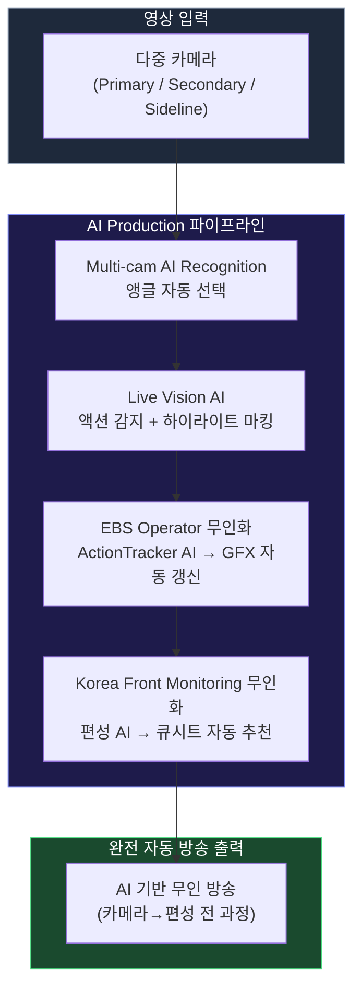

### 6.2 단계적 도입 원칙

| 도입 단계 | 역할 | 설명 |
|:---------:|------|------|
| **1단계: 보조** | AI가 추천, 사람이 결정 | 카메라 앵글 추천, 하이라이트 후보 제안 |
| **2단계: 반자동** | AI가 실행, 사람이 감독 | 자동 전환 + 사람 오버라이드, GFX 자동 갱신 + PD 승인 |
| **3단계: 완전 자동** | AI가 전 과정 독립 운영 | 무인 방송 — 모니터링만 사람 |

### 6.3 AI 영역별 기술 스택

| AI 영역 | 핵심 기술 | 참조 시스템 | 도입 Phase |
|---------|----------|-----------|:----------:|
| Multi-cam AI Recognition | Computer Vision, Object Detection | Pixellot, Spiideo | Phase 5 |
| Live Vision AI | Video Analytics, Emotion Recognition | WSC Sports | Phase 5 |
| EBS Operator 무인화 | ML Pipeline, State Machine AI | — | Phase 5 |
| Korea Front Monitoring 무인화 | Stream Monitoring, NLP | — | Phase 5 |

---

## 7. 포스트 프로덕션 파이프라인

방송 종료 후 콘텐츠를 가공/배포하는 4개 파이프라인이다.

### 7.1 전체 Post 파이프라인

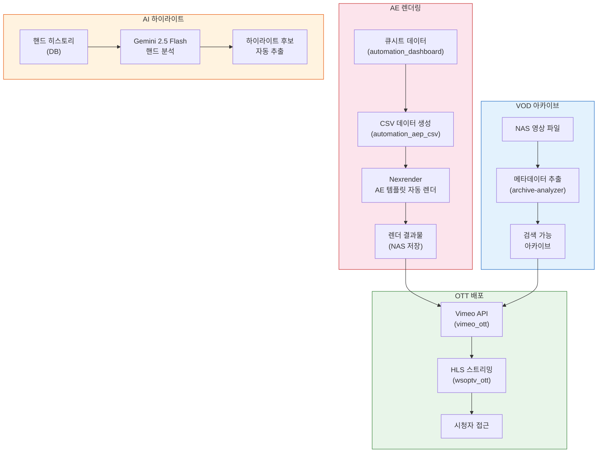

### 7.2 파이프라인별 상세

| 파이프라인 | EBS 프로젝트 | 입력 | 출력 | 자동화 수준 |
|-----------|-------------|------|------|:----------:|
| AE 렌더링 | automation_ae, automation_aep_csv | 큐시트 + CSV 데이터 | AE 렌더 결과물 (영상) | 완전 자동 |
| AI 하이라이트 | hand_analysis | 핸드 히스토리 (DB) | 하이라이트 후보 목록 | 완전 자동 |
| VOD 아카이브 | archive-analyzer | NAS 영상 파일 | 메타데이터 태깅된 아카이브 | 완전 자동 |
| OTT 배포 | wsoptv_ott, vimeo_ott | 렌더 결과물 + 아카이브 | HLS 스트리밍 콘텐츠 | 완전 자동 |

---

## 8. SYSTEM 3: OTT AI 자동화 워크플로우

SYSTEM 3는 핸드 히스토리와 선수 데이터를 AI가 분석하여 OTT 콘텐츠를 자동으로 생성·배포한다.

### 8.1 OTT AI 콘텐츠 파이프라인

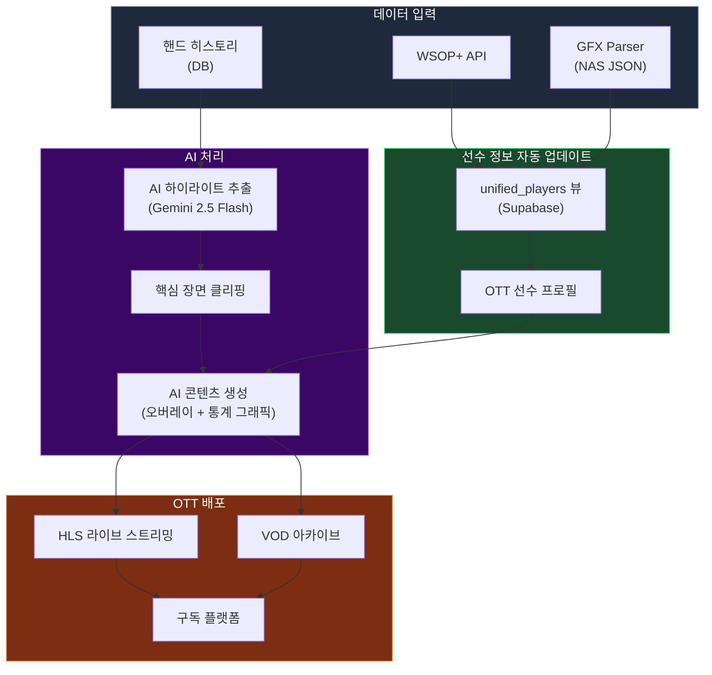

### 8.2 선수 정보 자동 업데이트 흐름

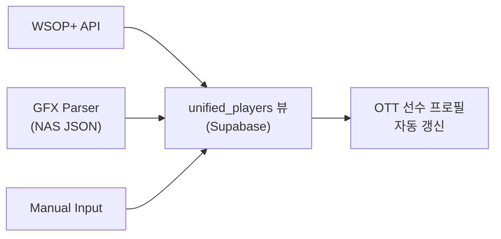

### 8.3 시장 데이터 및 참조 기술

| 항목 | 내용 |
|------|------|
| **스포츠 OTT 시장** | $37.7B (2025) → $68.3B (2030, CAGR 12.6%) |
| **핵심 트렌드** | AI 기반 하이라이트 자동 생성, 개인화 콘텐츠, 실시간 통계 오버레이 |

| 참조 기술 | 영역 | 적용 방식 |
|----------|------|----------|
| Magnifi | AI 하이라이트 추출 | 핸드 히스토리 → 핵심 장면 자동 클리핑 |
| Fox Sports AR | 실시간 통계 오버레이 | 선수 통계 + 승률을 OTT 화면에 AR 합성 |
| Pixellot | AI 카메라 자동화 | 무인 촬영 → OTT 라이브 피드 공급 |

---

## 9. 데이터 흐름과 AI 분석

### 9.1 핸드 데이터 수명 주기

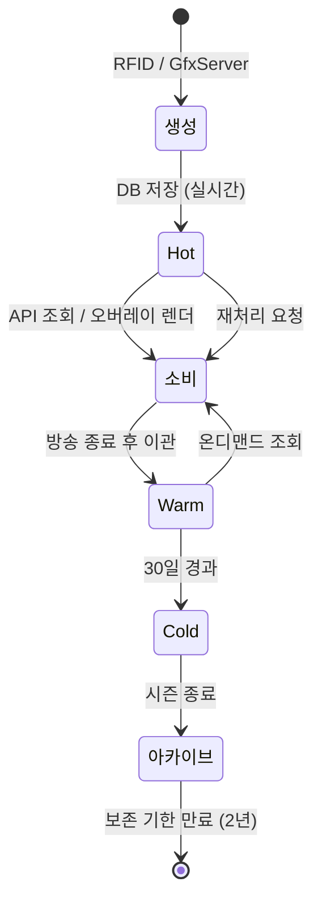

| 저장소 | 기술 | 응답 시간 | 데이터 | 보존 기간 |
|--------|------|:--------:|--------|:---------:|
| **Hot** | PostgreSQL | < 100ms | 핸드 데이터, 게임 상태, 오버레이 상태 | 방송 중 |
| **Warm** | NAS (SMB/NFS) | ~100ms | 녹화 영상, 렌더 결과물, AI 분석 결과 | 30일 |
| **Cold** | Vimeo OTT / Archive | ~1s | VOD 아카이브, 하이라이트 클립, 통계 스냅샷 | 무기한 |

### 9.2 AI 핸드 분석 파이프라인

hand_analysis 프로젝트가 Gemini 2.5 Flash를 사용하여 핸드 히스토리를 분석한다.

| 단계 | 작업 | 기술 |
|:----:|------|------|
| 1 | DB에서 핸드 히스토리 조회 | PostgreSQL, automation_schema |
| 2 | AI 분석 요청 | Gemini 2.5 Flash API |
| 3 | 하이라이트 후보 선별 | 올인/빅팟/블러프/배드비트 감지 |
| 4 | 분석 결과 저장 + UI 표시 | Next.js (hand_analysis UI) |

### 9.3 일일 브리핑 자동화

morning-automation이 매일 자동으로 전일 프로덕션 데이터를 집계하여 브리핑 자료를 생성한다.

| 항목 | 내용 |
|------|------|
| 데이터 소스 | DB (핸드 통계), NAS (영상 목록), Vimeo (배포 상태) |
| 출력 | Gmail/Slack 자동 발송 |
| 주기 | 매일 오전 (Cron) |

### 9.4 데이터 볼륨 추정

| 구분 | 일일 | 시즌 (45일) |
|------|:----:|:----------:|
| 핸드 데이터 | ~50,000건 | 2.25M건 |
| 녹화 영상 | ~500GB | 22.5TB |
| 렌더 결과물 | ~100GB | 4.5TB |
| AI 메타데이터 | ~1GB | 45GB |

### 9.5 5-Layer 데이터 파이프라인 (전체 DB 인벤토리)

데이터 수집부터 최종 렌더 출력까지 5개 계층으로 구성된다. **6개 도메인, 35개 테이블, 3개 Unified VIEW**를 포함한다.

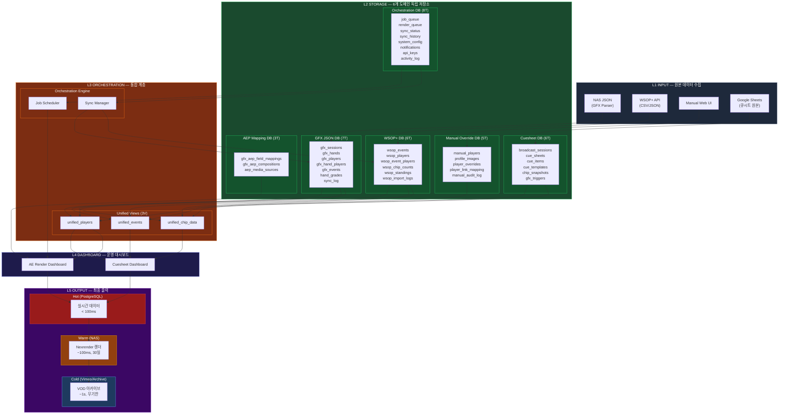

| Layer | 역할 | 도메인 | 테이블/뷰 수 | 기술 |
|:-----:|------|--------|:------------:|------|
| **L1 INPUT** | 원본 데이터 수집 | NAS JSON, WSOP+ API, Manual, Google Sheets | — | GFX Parser, REST API, Web UI |
| **L2 STORAGE** | 6개 도메인 독립 저장소 | GFX, WSOP+, Manual, Cuesheet, Orchestration, AEP | **35T** | PostgreSQL (Supabase) |
| **L3 ORCHESTRATION** | 통합 뷰 + 엔진 | Unified Views, Job/Sync Engine | **3V** | Supabase Views, pg_cron |
| **L4 DASHBOARD** | 운영 대시보드 | Cuesheet, AE Render | — | React, TypeScript |
| **L5 OUTPUT** | 최종 출력 (3-Tier 저장소) | Hot → Warm → Cold | — | PostgreSQL, Nexrender, Vimeo |

#### L2 STORAGE 도메인 상세

| 도메인 | 테이블 수 | 마이그레이션 | 핵심 테이블 |
|--------|:---------:|-------------|-------------|
| **GFX JSON DB** | 7 | `01_gfx_schema` | `gfx_sessions`, `gfx_hands`, `gfx_players`, `gfx_hand_players`, `gfx_events`, `hand_grades`, `sync_log` |
| **WSOP+ DB** | 6 | `02_wsop_schema` | `wsop_events`, `wsop_players`, `wsop_event_players`, `wsop_chip_counts`, `wsop_standings`, `wsop_import_logs` |
| **Manual Override DB** | 5 | `03_manual_schema` | `manual_players`, `profile_images`, `player_overrides`, `player_link_mapping`, `manual_audit_log` |
| **Cuesheet DB** | 6 | `04_cuesheet_schema` | `broadcast_sessions`, `cue_sheets`, `cue_items`, `cue_templates`, `chip_snapshots`, `gfx_triggers` |
| **Orchestration DB** | 8 | `05_orch_schema` | `job_queue`, `render_queue`, `sync_status`, `sync_history`, `system_config`, `notifications`, `api_keys`, `activity_log` |
| **AEP Mapping DB** | 3 | `gfx_aep_render_mapping` | `gfx_aep_field_mappings`, `gfx_aep_compositions`, `aep_media_sources` |
| **Unified Views** | 3V | `06_unified_views` | `unified_players`, `unified_events`, `unified_chip_data` |

> **저장소 계층 (L5)**: Hot (PostgreSQL, < 100ms, 방송 중) → Warm (NAS, ~100ms, 30일 보존) → Cold (Vimeo/Archive, ~1s, 무기한)

---

## 10. 프로젝트 레지스트리 (프로세스 기반)

18개 프로젝트를 Layer가 아닌 **워크플로우 단계별**로 매핑한다.

### 10.1 워크플로우 단계별 프로젝트

#### Live 단계 (실시간 방송)

| # | 프로젝트 | 기술 스택 | 상태 | 역할 |
|:-:|---------|----------|:----:|------|
| 1 | ebs (HW) | RFID, ST25R3911B | Phase 0 | RFID 하드웨어 업체 선정 및 사양 확정 |
| 2 | ebs (FW) | C/C++, ST25R3911B | 분석완료 | MCU 펌웨어 사양 분석 및 프로토콜 정의 |
| 3 | pokergfx_flutter | Flutter Desktop, Dart | 역설계 초기 | 포커 GFX 엔진, 22개 규칙 |
| 4 | ui_overlay | HTML/CSS/JS | 구현중 | 순수 그래픽 렌더러 — OBS 브라우저 소스용 GFX (비디오 소스 관리 없음) |
| 5 | automation_hub | FastAPI, Python | 구현 초기 | API Gateway, 이벤트 허브 |
| 6 | automation_schema | PostgreSQL | 27 migrations | DB 스키마, 마이그레이션 |

#### Production 단계 (프로덕션 제어)

| # | 프로젝트 | 기술 스택 | 상태 | 역할 |
|:-:|---------|----------|:----:|------|
| 7 | automation_dashboard | React 18, TypeScript | 구현중 | 큐시트 + 멀티테이블 제어 대시보드 |
| 8 | automation_sub | React 18, TypeScript | 구현중 | 방송 송출 보조 (슬레이브) |
| 9 | automation_ae | FastAPI, Nexrender | 구현중 | AE 렌더링 파이프라인 |
| 10 | automation_aep_csv | Python | 구현중 | AE 프로젝트 CSV 데이터 관리 |

#### Post 단계 (콘텐츠 파이프라인)

| # | 프로젝트 | 기술 스택 | 상태 | 역할 |
|:-:|---------|----------|:----:|------|
| 11 | hand_analysis | FastAPI, Next.js, Gemini 2.5 | v0.8.3 | AI 핸드 분석 |
| 12 | wsoptv_ott | Vimeo SaaS, Python | Phase 0 | WSOP TV OTT 플랫폼 |
| 13 | vimeo_ott | Vimeo API | Phase 0 | Vimeo OTT API 연동 (VOD 업로드/관리) |
| 14 | archive-analyzer | Python | Phase 0 | 방송 아카이브 분석 (NAS → 메타데이터) |

#### Operations 단계 (운영 자동화)

| # | 프로젝트 | 기술 스택 | 상태 | 역할 |
|:-:|---------|----------|:----:|------|
| 15 | morning-automation | Python, Gmail/Slack API | 운영중 | 일일 브리핑 자동화 |
| 16 | automation_orchestration | React Flow, Python | 일부 운영 | 워크플로우 오케스트레이션 |
| 17 | production_automation | Python | 예정 | 프로덕션 현장 자동화 |
| 18 | automation_feature_table | Python | 구현중 | 피처 테이블, 통계 집계 |

### 10.2 프로젝트 의존성 (프로세스 흐름 기반)

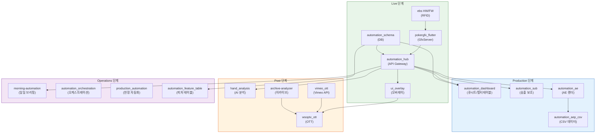

### 10.3 핵심 인터페이스

| 인터페이스 | 프로토콜 | 연결 | 용도 |
|-----------|---------|------|------|
| RFID → FW | Serial (UART) | ebs(HW) → ebs(FW) | ISO 14443-A UID 전달 |
| FW → GfxServer | Serial (UART) | ebs(FW) → pokergfx_flutter | 카드 데이터 전달 |
| GfxServer Protocol | TCP :8888 | pokergfx_flutter → automation_hub | 바이너리 프로토콜 (99 commands, 16 events) |
| Hub REST API | HTTP/REST | automation_hub → 전체 | 5개 서비스 라우팅 (Game/Player/Card/Display/Media) |
| Hub WebSocket | WebSocket | automation_hub → ui_overlay, dashboard | 실시간 이벤트 스트리밍 |
| DB Realtime | WebSocket | PostgreSQL → automation_dashboard | 실시간 데이터 구독 |
| NDI | Network Device Interface | ui_overlay → OBS | 오버레이 GFX → 방송 소프트웨어 |
| NAS | SMB/NFS | On-prem 공유 저장소 | 영상, 렌더 결과물, 아카이브 |

### 10.4 시스템별 프로젝트 매핑

| 시스템 | 서브시스템 | 프로젝트 | 역할 |
|--------|-----------|---------|------|
| **SYSTEM 1** | Feature Table System | pokergfx_flutter, ebs HW/FW | RFID + 게임 엔진 |
| **SYSTEM 1** | Virtual Table System | pokergfx_flutter (내장) | Outer Table |
| **SYSTEM 1** | Key Player Management | pokergfx_flutter (내장) | 통계 + 승률 |
| **SYSTEM 1** | Graphic System | pokergfx_flutter, ui_overlay, automation_sub | GPU 합성 + 오버레이 |
| **SYSTEM 1** | Back Office | automation_hub, automation_schema, automation_dashboard, automation_ae, automation_aep_csv, hand_analysis, automation_orchestration, production_automation, automation_feature_table | 운영 + 데이터 |
| **SYSTEM 2** | Multi-cam AI Recognition | (Phase 5 신규) | 카메라 자동 전환 |
| **SYSTEM 2** | Live Vision AI | (Phase 5 신규) | 영상 분석 |
| **SYSTEM 2** | EBS Operator 무인화 | (Phase 5 신규) | ActionTracker AI |
| **SYSTEM 2** | Korea Front Monitoring 무인화 | (Phase 5 신규) | 편성 AI |
| **SYSTEM 3** | AI 하이라이트 | hand_analysis | AI 분석 |
| **SYSTEM 3** | 선수 정보 자동 업데이트 | automation_schema | 자동 업데이트 |
| **SYSTEM 3** | OTT 콘텐츠 자동 생성 | (Phase 6 신규) | 자동 생성 |
| **SYSTEM 3** | OTT 배포 플랫폼 | wsoptv_ott | HLS + VOD |

---

## 11. 핵심 인사이트

| 인사이트 | 설명 |
|---------|------|
| **프로세스 기반 관리** | 기술 Layer가 아닌 실제 워크플로우 단계(Live → Production → Post → Ops)별로 설계한다. 각 단계의 데이터·기능·자동화를 EBS가 관리한다. |
| **크로스보더 비동기 협업** | USA 현장과 Korea 원격 팀이 Data Sheet/Cue Sheet 문서를 기반으로 비동기 협업한다. 실시간 커뮤니케이션 대신 구조화된 문서가 정보 허브 역할을 수행한다. |
| **Front/Back 완전 분리** | Front-End(편성) = 무엇을 보여줄지 결정, Back-End(제작) = 어떻게 만들지 실행. Cue Sheet가 유일한 연결 고리이며, 이 분리가 병렬 작업을 극대화한다. |
| **더빙 방식 역분리** | 한국 편집 → 미국 해설 → 한국 합성. 실시간 중계가 아닌 3국간 왕복 워크플로우로, 편집 의도에 맞는 정밀한 해설이 가능하다. |
| **점진적 조립** | 각 프로젝트는 독립적 가치를 제공하면서 전체가 모여 완전한 방송 인프라 관리 플랫폼을 완성한다. 1st 피처 테이블 → 2nd 이원 중계 → 3rd 콘텐츠 → 4th AI+운영 순서로 조립된다. |
| WSOP 3.0 | WSOPLIVE가 서비스하는 포커 대회 관리의 혁신을 업계는 WSOP 3.0이라 부른다. EBS는 WSOPLIVE와 독립적으로 설계된 방송 인프라 플랫폼으로, 방송 워크플로우의 모든 데이터, 기능, 자동화를 관리한다. |

---

## Changelog

| 날짜 | 버전 | 변경 내용 | 결정 근거 |
|------|------|-----------|----------|
| 2026-03-06 | v5.1 | 비디오 책임 외부화 원칙 반영 — 섹션 1.1 범위 밖 확장, 1.2 Graphic System 명확화, 5.2 송출 책임 명시, 10.1 ui_overlay 역할 정의 | Phase 1-2 아키텍처 원칙 문서화 |
| 2026-03-06 | v5.0 | 3-시스템 구조 통합 재설계: SYSTEM 1 재편(pokergfx_flutter 내부 4서브시스템) + SYSTEM 2 AI Production 워크플로우 + SYSTEM 3 OTT AI 워크플로우 + 5-Layer 데이터 파이프라인 + 시스템별 프로젝트 매핑 | 3-시스템 독립 설계 원칙 + 웹 리서치 기반 보강 |
| 2026-03-05 | v4.1 | 비전 프레이밍 전면 재설계 — 독립 관리 플랫폼 (16건 수정: 자동화→관리, 종속→독립, 단일→영역별 최적) | 사용자 비전 교정 5개 축 반영 |
| 2026-03-05 | v4.0 | **전면 재설계**: 기술 중심 구조(7-Layer, 기술 스택, 비용 모델, 페르소나, 히트맵, 모니터링) 완전 제거. wsop-production-analysis.md 기반 프로덕션 워크플로우 중심으로 9개 섹션 재구성. 프로젝트 레지스트리를 워크플로우 단계별로 재매핑. | 실제 프로덕션 워크플로우 기반 설계로 전환 |
| 2026-03-05 | v3.1 | 섹션 5 전면 재설계: 크로스보더 프로덕션 워크플로우 반영 | WSOP Production 분석 보고서 기반 실제 워크플로우 반영 |
| 2026-03-05 | v3.0 | 전체 방송 프로덕션 구성 추가. 10개 영역 정의, EBS 커버리지 맵, PokerGFX 포지셔닝 | 방송 프로덕션 전체 그림 부재 해결 |
| 2026-03-05 | v2.0 | 단일 설계 문서 통합: 프로젝트 레지스트리, 7-Layer Architecture, 인터페이스 사양 추가 | 불필요 문서 제거 후 참조 내용 통합 |
| 2026-03-05 | v1.1 | Layer 명칭 정본 통일, 인력 목표 정합 | Architect 검증 피드백 반영 |
| 2026-03-05 | v1.0 | 최초 작성 — 10개 섹션, 28개 Mermaid 다이어그램 | EBS Ecosystem 시각화 중심 설계 문서 |
