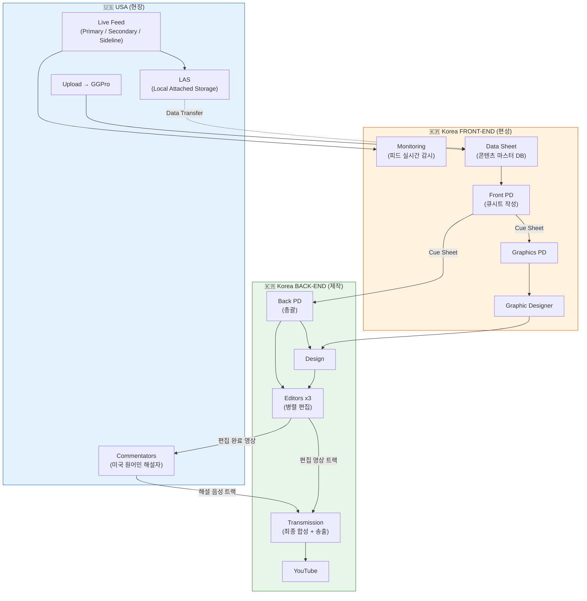
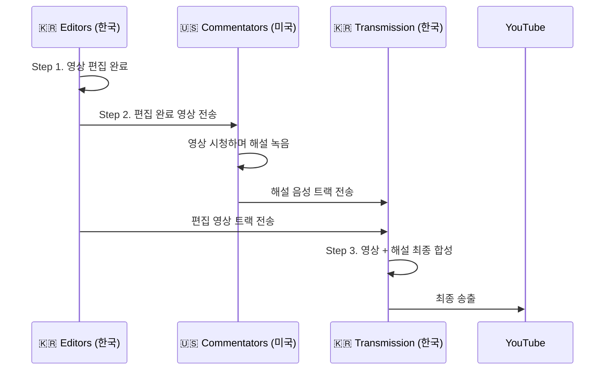

# WSOP Production 분석 보고서

> **GG Production 크로스보더 원격 분업 체계 분석**
> 분석일: 2026-03-05 | 소스: GG Production 워크플로우 이미지 4장

---

## 1. 개요

GG Production의 WSOP(World Series of Poker) 콘텐츠 제작은 **미국-한국 양국 분업 체계**로 운영되는 크로스보더 원격 프로덕션이다. 촬영과 해설은 미국 현장에서, 편성/편집/송출은 한국에서 원격 수행하는 구조로, **더빙 방식 포스트 프로덕션**(실시간 방송이 아닌 사후 합성)을 채택하고 있다.

### 분석 대상

| 이미지 | 내용 | 범위 |
|--------|------|------|
| Image 1 | PROCESS: FRONT-END (Part 1) | Live Feed 수신 → Data Sheet |
| Image 2 | PROCESS: FRONT-END (Part 2) | Cue Sheet 작성 → Graphics 지시 |
| Image 3 | PROCESS: BACK-END (Part 1) | Design + Edit 병렬 작업 |
| Image 4 | PROCESS: BACK-END (Part 2) | Commentator 해설 → Transmission → YouTube |

---

## 2. 전체 워크플로우

### 2.1 구조 다이어그램

### 2.2 Front-End / Back-End 분리 원칙

| 구분 | 역할 | 위치 | 핵심 산출물 |
|------|------|------|------------|
| **Front-End** | 무엇을 보여줄지 결정 (편성) | 한국 | Data Sheet, Cue Sheet |
| **Back-End** | 어떻게 만들지 실행 (제작) | 한국 | 편집 영상, 최종 송출물 |
| **현장** | 원본 소스 촬영/수음 | 미국 | Live Feed, 원본 파일 |
| **해설** | 더빙 해설 녹음 | 미국 | 해설 음성 트랙 |

---

## 3. Front-End 프로세스 (편성 컨트롤타워)

한국 Front-End 팀은 미국 현장 피드를 실시간 모니터링하며 콘텐츠 전달 순서를 결정하는 **편성 컨트롤타워** 역할을 수행한다.

| 단계 | 프로세스 | 상세 |
|:----:|----------|------|
| 1 | **Live Feed 수신** | Primary stream(핸드 선별), Secondary stream, Sideline reporting 동시 수신 |
| 2 | **Upload + Data Sheet** | 미국에서 업로드된 콘텐츠를 Data Sheet로 정리. GGPro 시스템으로 전송 파일 이중 확인 |
| 3 | **Data Sheet 관리** | 모든 라이브 피드 + 업로드 콘텐츠의 마스터 DB 역할 |
| 4 | **Cue Sheet 작성** | Front PD가 Data Sheet 기반으로 콘텐츠 전달 순서 결정 → Back-End에 지시 |
| 5 | **Graphics 지시** | Cue Sheet 기반으로 Graphics PD가 그래픽 선택 → Graphic Designer에게 디테일 전달 |

---

## 4. Back-End 프로세스 (제작 + 송출)

### 4.1 편집 파이프라인

| 단계 | 프로세스 | 상세 |
|:----:|----------|------|
| 1 | **Design** | Front에서 선별된 핸드를 Drive에서 가져와 디자인 작업 |
| 2 | **Edit** | 3명의 Editor가 동시 병렬 편집 (편집 스테이션 3대 운영) |
| 3 | **LAS Upload** | 편집 완료물을 LAS에 업로드 |

### 4.2 Commentator 해설 프로세스 (더빙 방식 — 3단계)

실시간 방송이 아닌 **더빙 방식 포스트 프로덕션**으로, 편집이 먼저 완료된 후 해설을 삽입한다.

| Step | 주체 | 작업 | 산출물 |
|:----:|------|------|--------|
| **1** | 한국 Editors | 영상 편집 완료 (해설 없는 영상) | 편집 영상 트랙 |
| **2** | 미국 Commentators | 편집 완료 영상을 시청하며 해설 녹음 | 해설 음성 트랙 |
| **3** | 한국 Transmission | 편집 영상 + 해설 음성 최종 합성 → YouTube 송출 | 최종 송출물 |

> **핵심**: 해설자는 편집된 영상을 "보면서" 사후 녹음하는 더빙 방식이다. 실시간 중계가 아니므로, 편집 방향에 맞춘 정밀한 해설이 가능하다.

---

## 5. 5가지 특수 제작 방식 추론

### 5.1 크로스보더 실시간 분업 (USA 현장 ↔ Korea 원격)

촬영/수음은 미국 현장에서, 편성/편집/송출은 한국에서 원격 수행한다. 인건비 최적화와 시차를 활용한 24시간 연속 프로덕션이 가능한 구조다.

### 5.2 Data Sheet 중심 비동기 협업

실시간 커뮤니케이션 대신 **Data Sheet**라는 구조화된 문서가 미국-한국 간 정보 허브 역할을 수행한다. PD가 Data Sheet를 기반으로 Cue Sheet를 작성하여 Back-End에 지시하는 **문서 기반 워크플로우**다.

### 5.3 Front/Back 완전 분리 (편성 vs 제작)

- **Front-End** = 무엇을 보여줄지 결정 (편성)
- **Back-End** = 어떻게 만들지 실행 (제작)
- Cue Sheet가 두 팀의 유일한 연결 고리 → 병렬 작업 극대화

### 5.4 더빙 방식 해설 역분리 (한국 편집 → 미국 해설 → 한국 합성)

한국에서 편집이 완료된 영상을 미국 현지 해설자에게 전송하고, 해설자가 영상을 보며 녹음한 음성을 다시 한국에서 최종 합성하는 **3국간 왕복 워크플로우**다. 편집 방향을 한국에서 잡고, 해설은 미국 원어민이 수행하며, 최종 합성은 다시 한국에서 담당하는 크리에이티브 분업 구조다.

### 5.5 멀티 에디터 병렬 편집

3대의 편집 스테이션이 동시 운영되어 대회 기간 대량 콘텐츠를 빠르게 처리한다. LAS(Local Attached Storage)가 미국과 한국 양쪽에 존재하여 데이터 이중화를 보장한다.

---

## 6. 핵심 인사이트

| 특성 | 설명 |
|------|------|
| **문서 기반 협업** | Data Sheet + Cue Sheet를 통한 비동기 커뮤니케이션 |
| **지역별 특화** | USA: 촬영 + 해설 / Korea: 편성 + 편집 + 송출 |
| **24시간 프로덕션** | 시간대 차이를 활용한 연속 작업 사이클 |
| **멀티 스트림** | Primary, Secondary, Sideline 동시 수신 및 처리 |
| **품질 보증** | GGPro 시스템 이중 확인 + LAS 이중화 스토리지 |
| **더빙 포스트 프로덕션** | 실시간이 아닌 사후 합성 → 편집 의도에 맞는 정밀 해설 가능 |

이 구조는 **방송 제작의 글로벌 아웃소싱 모델**로, 현장 촬영과 원어민 해설만 미국에서 수행하고 편성/편집/송출의 핵심 프로덕션을 한국에서 원격 제어하는 크로스보더 제작 방식이다.
