# Part VII: 사용자 인터페이스 설계 (Draft)

> **Source**: pokergfx-prd-v2.md Section 17-21
> **Synced**: 2026-02-16
> **Status**: EXPANDED (Section 18, 19 확장 + Section 20.5 신규)

---

## 17. 인터페이스 멘탈 모델

### 방송 워크스테이션

포커 방송 시스템의 UI를 이해하려면, 먼저 물리적 환경을 알아야 한다. GFX 운영자는 하나의 워크스테이션에서 3개의 장치를 동시에 조작한다:

- **메인 모니터** (GfxServer): 시스템 설정과 모니터링. 마우스/키보드 조작
- **터치스크린** (Action Tracker): 실시간 게임 진행 입력. 손가락으로 터치
- **물리 버튼** (Stream Deck): 빈도 높은 액션의 원터치 실행

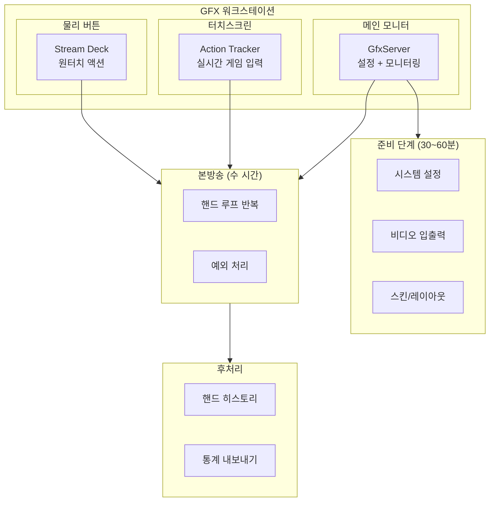
```mermaid
graph TB
    subgraph WS["GFX 워크스테이션"]
        direction LR
        subgraph MON["메인 모니터"]
            GFX["GfxServer<br/>설정 + 모니터링"]
        end
        subgraph TOUCH["터치스크린"]
            AT["Action Tracker<br/>실시간 게임 입력"]
        end
        subgraph HW["물리 버튼"]
            SD["Stream Deck<br/>원터치 액션"]
        end
    end

    subgraph SETUP["준비 단계 (30~60분)"]
        S1["시스템 설정"]
        S2["비디오 입출력"]
        S3["스킨/레이아웃"]
    end

    subgraph LIVE["본방송 (수 시간)"]
        L1["핸드 루프 반복"]
        L2["예외 처리"]
    end

    subgraph POST["후처리"]
        P1["핸드 히스토리"]
        P2["통계 내보내기"]
    end

    GFX --> SETUP
    GFX --> LIVE
    AT --> LIVE
    SD --> LIVE
    LIVE --> POST
```

### 3단계 시간 모델

방송 시스템 사용은 3개의 명확한 시간 단계로 나뉜다. 각 단계에서 사용하는 화면과 기능이 완전히 다르다.

| 단계 | 시간 | 주 화면 | 조작 방식 | 긴장도 |
|------|------|---------|----------|--------|
| **준비** (Setup) | 30~60분 | GfxServer | 마우스/키보드 | 낮음 |
| **본방송** (Live) | 수 시간 | Action Tracker | 터치 | **높음** |
| **후처리** (Post) | 10~30분 | GfxServer | 마우스/키보드 | 낮음 |

본방송 중 GfxServer는 "설정 도구"에서 "모니터링 대시보드"로 역할이 전환된다. 대부분의 인터랙션은 Action Tracker에서 일어난다.

### 주의력 분배

**T1. 본방송 중 운영자 주의력 분배**

| 장치 | 비중 | 주시 내용 |
|------|:----:|----------|
| **Action Tracker** | 80% | 현재 핸드 진행, 베팅 입력, 특수 상황 |
| **GfxServer** | 15% | RFID 상태, 에러 알림, 프리뷰 |
| **Stream Deck** | 5% | GFX 숨기기, 카메라 전환 (손끝 감각) |

이 분배가 UI 설계의 핵심 제약 조건이다. Action Tracker는 주변 시야에서도 상태를 파악할 수 있어야 하고, GfxServer는 문제가 생겼을 때만 주의를 끌어야 한다.

### 자동화 그래디언트

시스템은 가능한 많은 작업을 자동 처리하되, 판단이 필요한 작업만 인간에게 맡긴다.

| 완전 자동 (RFID) | 반자동 (운영자 확인) | 수동 입력 |
|:---:|:---:|:---:|
| 카드 인식 | New Hand 시작 | 베팅 금액 |
| 승률 계산 | Showdown 선언 | 특수 상황 (Chop, Run It 2x) |
| 핸드 평가 | GFX 표시/숨기기 | 수동 카드 입력 (RFID 실패 시) |
| 오버레이 렌더링 | 카메라 전환 | 스택 수동 조정 |
| 핸드 히스토리 저장 | — | 방송 자막/로고 변경 |

### 정보 보안 경계

같은 게임 데이터가 3가지 보안 수준으로 표시된다. 이것이 Dual Canvas 아키텍처의 존재 이유다.

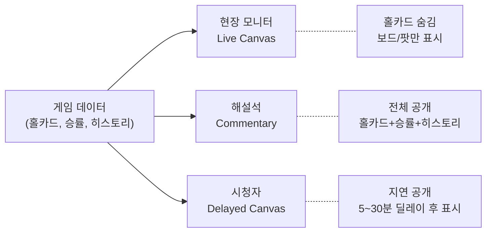
```mermaid
graph LR
    SRC["게임 데이터<br/>(홀카드, 승률, 히스토리)"]

    SRC --> FLOOR["현장 모니터<br/>Live Canvas"]
    SRC --> COMM["해설석<br/>Commentary"]
    SRC --> VIEWER["시청자<br/>Delayed Canvas"]

    FLOOR -.- F_NOTE["홀카드 숨김<br/>보드/팟만 표시"]
    COMM -.- C_NOTE["전체 공개<br/>홀카드+승률+히스토리"]
    VIEWER -.- V_NOTE["지연 공개<br/>5~30분 딜레이 후 표시"]
```

이 보안 경계는 UI 전체에 영향을 준다. Server의 Outputs 설정에서 Trustless Mode를 활성화하면, Live Canvas에는 어떤 상황에서도 홀카드가 표시되지 않는다.

---

## 18. 준비 단계 인터페이스

방송 시작 전 한 번 수행하는 설정 작업이다. GfxServer 화면에서 마우스/키보드로 조작하며, 모든 시스템이 정상인지 확인한 후에만 방송을 시작할 수 있다.

> **운영 절차의 상세**: 담당자 역할 배정, 순차 투입, 이상 발생 시 에스컬레이션 등은 Part IX Section 23을 참조한다.

### 설정 태스크 플로우

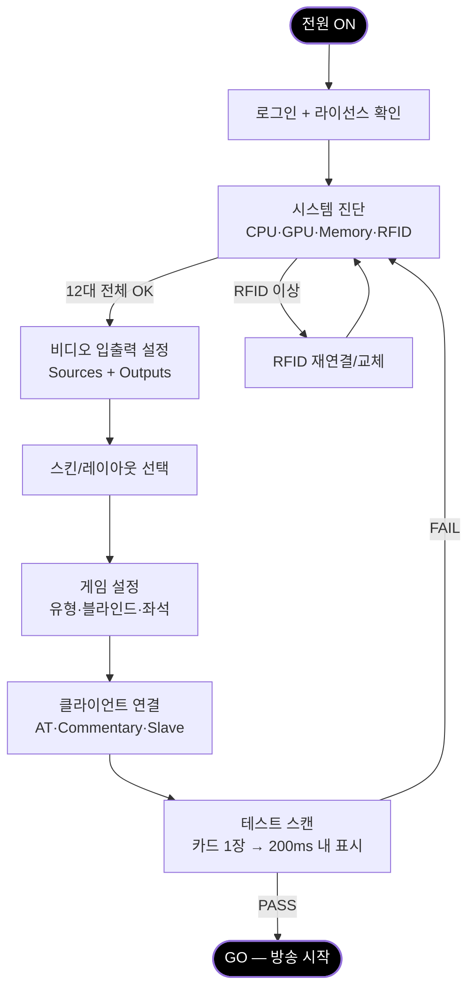
```mermaid
graph TB
    START(["전원 ON"]) --> LOGIN["로그인 + 라이선스 확인"]
    LOGIN --> DIAG["시스템 진단<br/>CPU·GPU·Memory·RFID"]
    DIAG -->|"12대 전체 OK"| VIDEO["비디오 입출력 설정<br/>Sources + Outputs"]
    DIAG -->|"RFID 이상"| FIX_RFID["RFID 재연결/교체"]
    FIX_RFID --> DIAG
    VIDEO --> SKIN["스킨/레이아웃 선택"]
    SKIN --> GAME["게임 설정<br/>유형·블라인드·좌석"]
    GAME --> CLIENT["클라이언트 연결<br/>AT·Commentary·Slave"]
    CLIENT --> TEST["테스트 스캔<br/>카드 1장 → 200ms 내 표시"]
    TEST -->|"PASS"| GO(["GO — 방송 시작"])
    TEST -->|"FAIL"| DIAG

    style GO fill:#000,color:#fff,stroke-width:2px
    style START fill:#000,color:#fff,stroke-width:2px
```

### 메인 윈도우

GfxServer의 진입점이자 시스템 전체 상태를 한눈에 파악하는 대시보드다. 8개 탭(Main, Sources, Outputs, GFX1~3, Commentary, System)으로 구성되며, 방송 준비부터 종료까지 이 창이 항상 열려 있다.

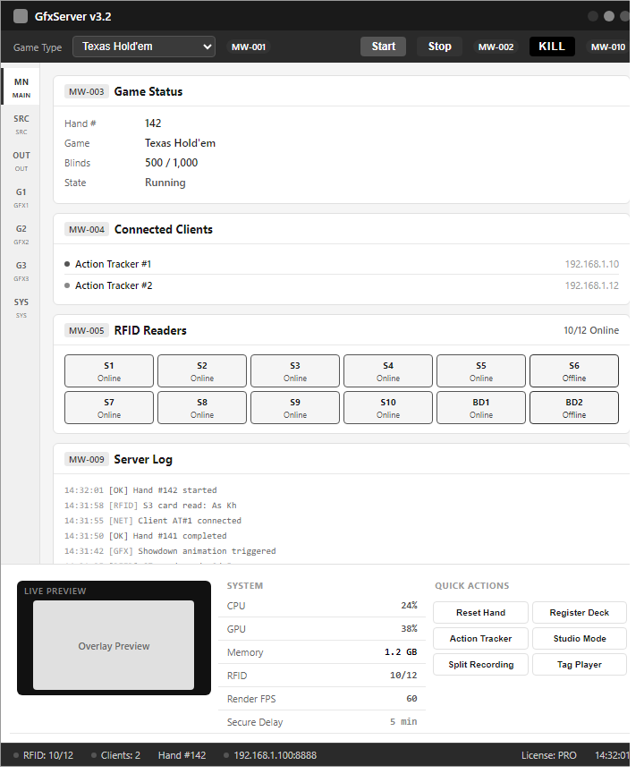
> *GfxServer 메인 윈도우. 좌측 60px 네비게이션, 중앙 콘텐츠 영역, 우측 320px 컨텍스트 패널. 상단 툴바에서 게임 유형 선택/시작/정지를 제어한다.*

**레이아웃 구조**:

| 영역 | 크기 | 내용 |
|------|------|------|
| **네비게이션** | 60px (좌측) | 8개 탭 아이콘 (세로 배치) |
| **콘텐츠** | 가변폭 (중앙) | 활성 탭의 메인 UI |
| **컨텍스트 패널** | 320px (우측) | Live Preview, System Metrics, Quick Actions |
| **툴바** | 상단 | Game Type 드롭다운, Start/Stop 버튼, **KILL** 버튼 (빨강, 긴급 정지) |
| **상태바** | 하단 | RFID 상태, 접속 클라이언트 수, 핸드 번호, 라이선스, 시각 |

**Main 탭 콘텐츠 카드**:
- **Game Status**: 게임 유형, 블라인드, 핸드 번호, 현재 Phase (MW-001, MW-002)
- **Connected Clients**: Action Tracker, Commentary, Slave 각각의 IP와 접속 상태 (MW-004)
- **RFID Readers**: 12대 리더 상태 그리드 — 정상(녹색), 장애(빨간색) (SYS-004)
- **Server Log**: 최근 이벤트 타임스탬프 로그 (SYS-016)

**컨텍스트 패널**:
- **Live Preview**: 320×180 썸네일로 현재 방송 출력 확인
- **System Metrics**: CPU, GPU, Memory, RFID, FPS 게이지 바
- **Quick Actions**: 자주 사용하는 6개 버튼 (GFX 숨기기, 카메라 전환, 핸드 시작 등)

### 시스템 설정

System 탭은 서버 시작 후 가장 먼저 확인하는 화면이다. 16개 기능이 6개 접이식 카드로 구성된다.

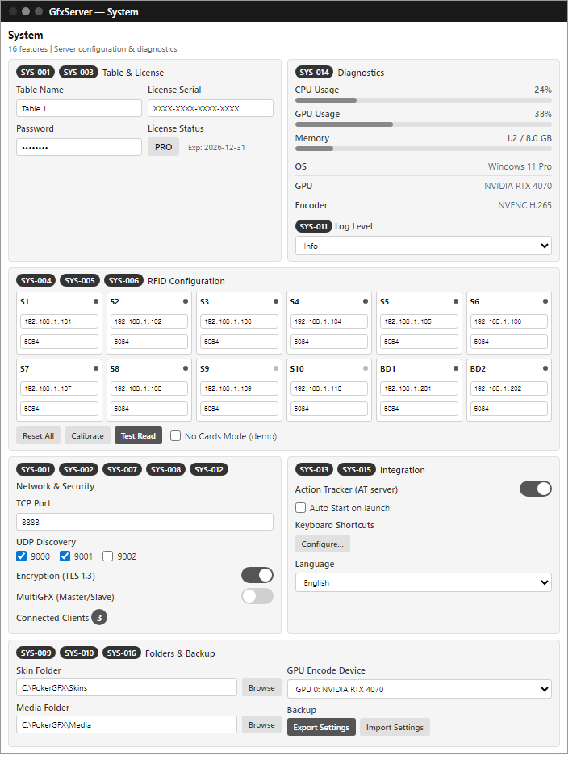
> *System 탭. Table & License, Diagnostics, RFID Configuration(6×2 그리드), Network & Security, Integration, Folders & Backup 6개 카드.*

**Table & License** (SYS-001~003): 테이블 이름/비밀번호, 라이선스 시리얼 키 + PRO/Standard 상태 뱃지. 라이선스가 없으면 출력 해상도가 제한된다.

**Diagnostics** (SYS-015): CPU, GPU, Memory 프로그레스 바 (임계치 초과 시 빨간색). OS, GPU 모델, 인코더 정보 표시. 로그 레벨 선택 (Debug/Info/Warning/Error).

**RFID Configuration** (SYS-004~006): 6×2 그리드로 12대 리더 표시 — S1~S10 좌석용 + BD1~BD2 보드용. 각 리더마다 IP, Port 입력 필드와 연결 상태 표시. Calibration 버튼(전체 보정), Demo Mode 체크박스(하드웨어 없이 시뮬레이션).

**Network & Security** (SYS-007~010): TCP :8888 (제어), UDP Discovery 3포트 (:9000, :9001, :9002), TLS 1.3 암호화 토글, MultiGFX 토글 (Master/Slave 구성), 접속 클라이언트 수 표시.

**Integration** (SYS-011~013): Action Tracker/Stream Deck 연동 토글, 서버 자동 시작, 키보드 단축키 설정, 언어 선택.

**Folders & Backup** (SYS-014): Skin/Media 폴더 경로, GPU Encode Device 선택, 설정 Export/Import.

### 비디오 파이프라인: Sources

Sources 탭은 비디오 입력 소스를 등록하고 속성을 조절한다. 10개 기능이 3개 카드로 구성된다.

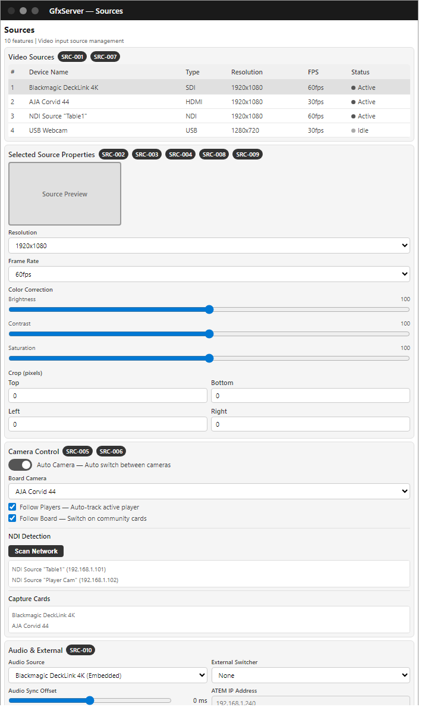
> *Sources 탭. Video Sources 테이블, Selected Source Properties(색 보정 슬라이더), Camera Control(자동 전환 설정).*

**Video Sources** (SRC-001~003): 소스 테이블에 Device, Type(SDI/HDMI/NDI/USB), Resolution, FPS, Status 표시. NDI 자동 감지 목록과 캡처 카드 연결 목록 제공.

**Selected Source Properties** (SRC-004~006): Resolution/Frame Rate 드롭다운, Brightness/Contrast/Saturation 슬라이더(실시간 프리뷰), Crop 영역 입력(Top/Bottom/Left/Right).

**Camera Control** (SRC-007~010): Auto Camera 토글(게임 상태 기반 자동 전환), Board Camera 선택(보드 카메라 전환 시 GFX 자동 숨김), Follow Players(액션 중인 플레이어 추적), External Switcher(ATEM 연동).

### 비디오 파이프라인: Outputs

Outputs 탭은 방송 출력 대상을 설정하고 Dual Canvas 보안 모드를 구성한다. 12개 기능이 4개 카드로 구성된다.

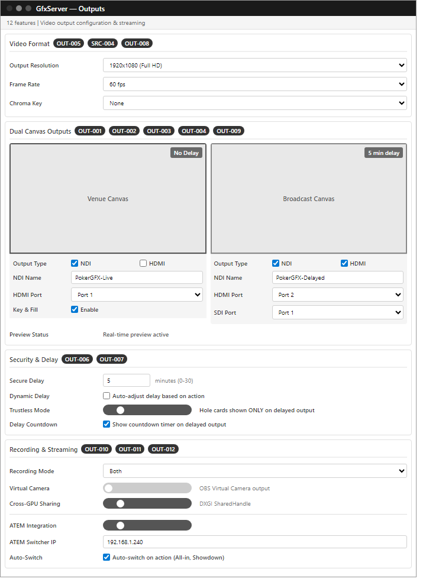
> *Outputs 탭. Video Format, Dual Canvas(Live + Delayed), Security & Delay, Recording & Streaming 4개 카드.*

**Video Format** (OUT-001): Resolution(1080p/4K), Frame Rate(30/60fps), Chroma Key 토글(투명 배경 출력).

**Dual Canvas Outputs** (OUT-002~005):
- **Live Canvas**: 딜레이 없음, 현장 대형 화면용. NDI/HDMI/SDI 출력 체크박스, Stream Name, Port
- **Delayed Canvas**: 5~30분 딜레이, 방송 송출용. 동일한 출력 옵션 세트

**Security & Delay** (OUT-006~007): Secure Delay 슬라이더(0~30분), Dynamic Delay 토글(핸드 진행 기반 자동 조절), **Trustless Mode** 토글(Live Canvas 홀카드 완전 차단), 딜레이 잔여 시간 카운트다운.

**Recording & Streaming** (OUT-008~012): 로컬 녹화, Virtual Camera(OBS 연동), Cross-GPU Sharing, ATEM Integration, 딜레이 만료 시 Auto-Switch.

### 스킨 & 레이아웃 에디터

방송 외형을 커스터마이징하는 태스크다. Skin Editor, GE Board, GE Player 세 도구가 탭으로 전환되는 하나의 3-Panel IDE를 구성한다.

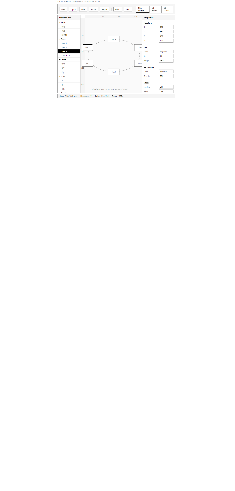
> *스킨/레이아웃 에디터. 좌측 Element Tree(200px), 중앙 WYSIWYG Canvas(가변폭), 우측 Properties(240px).*

**공통 레이아웃** (200px | 가변 | 240px):

| 패널 | 역할 | 인터랙션 |
|------|------|---------|
| **Element Tree** (좌측) | 그래픽 요소 계층 구조 | 클릭 선택, 드래그로 Z-Order 변경 |
| **WYSIWYG Canvas** (중앙) | 방송 화면과 동일 비율 편집 영역 | 드래그 이동, 코너 핸들 크기 조절 |
| **Properties** (우측) | 선택 요소 속성 편집 (Transform, Font, Background, Effects) | 숫자 입력 시 캔버스 실시간 갱신 |

**Skin Editor** (SK-001~016):

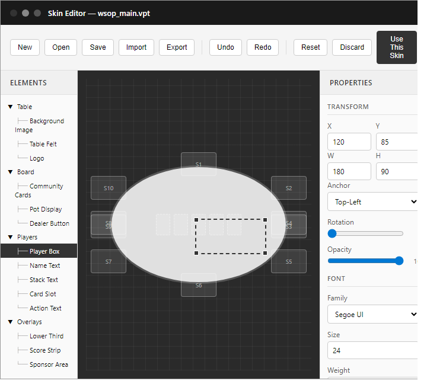
> *10개 좌석이 타원형 배치된 포커 테이블. 선택 요소의 Transform, Font, Background를 Properties에서 편집한다.*

테이블 배경, 카드 스타일, 10-max 좌석 위치, 폰트, 색상, 애니메이션 등 전체 외형을 정의. `.vpt/.skn` 파일로 저장, AES 암호화 보호.

**GE Board** (GEB-001~015):

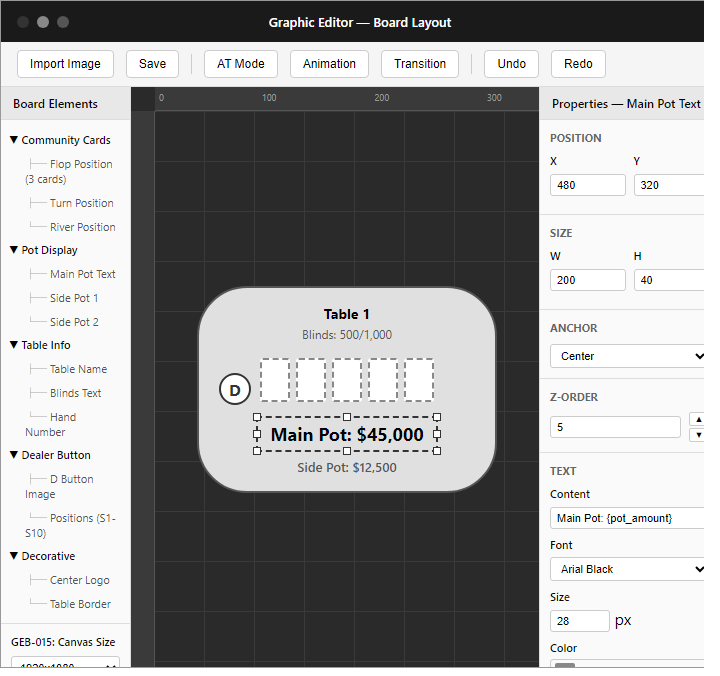
> *커뮤니티 카드 5장, 팟(메인 + 사이드), 딜러 버튼을 정밀 배치. Z-Order와 좌표를 Properties에서 편집.*

커뮤니티 카드 5장 슬롯, 팟 표시(메인 + 사이드 팟 3개), 딜러 버튼, 테이블 정보를 드래그로 배치.

**GE Player** (GEP-001~015):

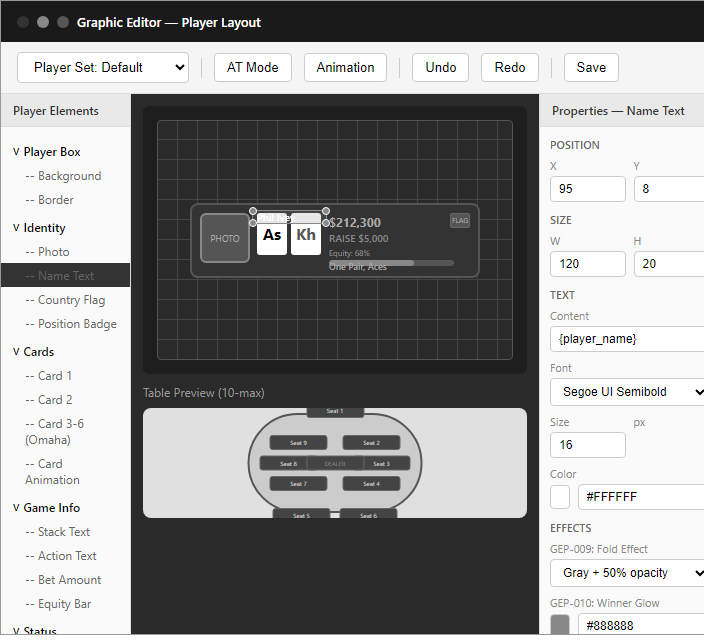
> *플레이어 박스 템플릿: Photo, Card Slots, Name, Stack, Action Text, Equity Bar, Country Flag.*

플레이어 박스 구성 요소를 개별 편집. Effects(Fold 회색화, Winner 글로우), Animation(카드 등장, 칩 이동) 설정. 10-max 프리뷰로 전체 레이아웃 확인.

### 설정 완료 체크리스트

**T2. 방송 준비 완료 체크리스트**

| # | 항목 | 정상 기준 | 관련 기능 |
|:-:|------|----------|----------|
| 1 | 서버 시작 + 라이선스 | PRO 활성 | SYS-003 |
| 2 | RFID 12대 연결 | 전체 `reader_state = ok` | SYS-004 |
| 3 | 비디오 소스 | 카메라 입력 정상 | SRC-001~006 |
| 4 | 출력 장치 | NDI/HDMI/SDI 정상 | OUT-001~005 |
| 5 | Dual Canvas | Live + Delayed 동작 | OUT-001, OUT-006 |
| 6 | Trustless Mode | Live에 홀카드 숨김 | OUT-006, OUT-007 |
| 7 | 게임 설정 | 유형/블라인드/좌석 선택 | MW-001, MW-002 |
| 8 | 클라이언트 연결 | AT + Commentary 접속 | MW-004 |
| 9 | 테스트 스캔 | 카드 1장 → 200ms 표시 | SYS-006 |

9개 항목이 모두 정상이어야 "GO" 상태가 된다. 하나라도 실패하면 해당 항목을 해결할 때까지 방송을 시작할 수 없다.

---

## 19. 본방송 인터페이스

라이브 방송 중 매 핸드마다 반복되는 핵심 인터랙션이다. Part VII의 가장 중요한 섹션.

> **운영 절차**: 핸드별 진행 규칙, 담당자 역할, 에스컬레이션 체계는 Part IX Section 24를 참조한다.

### 핸드 루프

하나의 핸드는 다음 시퀀스로 진행된다. 딜러(Action Tracker), Server(자동 처리), 시청자(방송 화면) 세 관점에서 데이터가 흐른다.

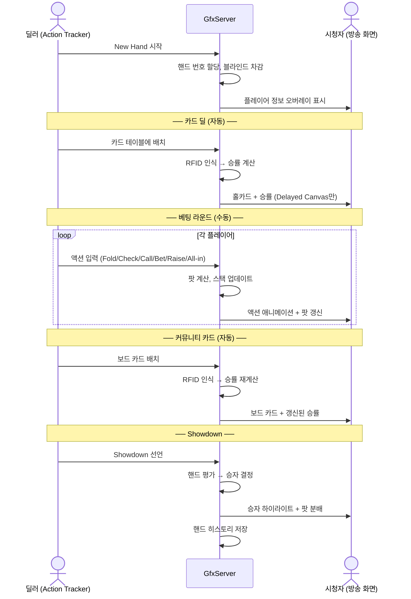
```mermaid
sequenceDiagram
    actor D as 딜러 (Action Tracker)
    participant S as GfxServer
    actor V as 시청자 (방송 화면)

    D->>S: New Hand 시작
    S->>S: 핸드 번호 할당, 블라인드 차감
    S->>V: 플레이어 정보 오버레이 표시

    Note over D,V: ── 카드 딜 (자동) ──

    D->>S: 카드 테이블에 배치
    S->>S: RFID 인식 → 승률 계산
    S->>V: 홀카드 + 승률 (Delayed Canvas만)

    Note over D,V: ── 베팅 라운드 (수동) ──

    loop 각 플레이어
        D->>S: 액션 입력 (Fold/Check/Call/Bet/Raise/All-in)
        S->>S: 팟 계산, 스택 업데이트
        S->>V: 액션 애니메이션 + 팟 갱신
    end

    Note over D,V: ── 커뮤니티 카드 (자동) ──

    D->>S: 보드 카드 배치
    S->>S: RFID 인식 → 승률 재계산
    S->>V: 보드 카드 + 갱신된 승률

    Note over D,V: ── Showdown ──

    D->>S: Showdown 선언
    S->>S: 핸드 평가 → 승자 결정
    S->>V: 승자 하이라이트 + 팟 분배
    S->>S: 핸드 히스토리 저장
```

이 루프에서 **자동**인 단계(카드 인식, 승률 계산, 오버레이 렌더링)와 **수동**인 단계(New Hand, 베팅 입력, Showdown)를 구분하는 것이 핵심이다. 자동 단계에서 운영자는 아무것도 하지 않고, 수동 단계에서만 Action Tracker를 조작한다.

### Action Tracker

본방송의 주 인터페이스다. 터치스크린에서 실행되며, 운영자 주의력의 80%를 차지한다.

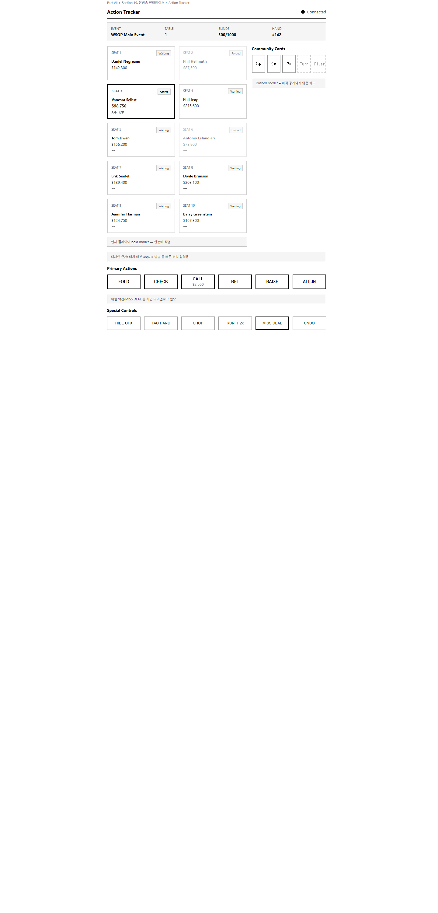
> *Action Tracker 와이어프레임. 상단 연결 상태, 10인 좌석 그리드(이름/스택/카드/상태), 보드 카드 5장, 하단 액션 버튼(FOLD/CHECK/CALL/BET/RAISE/ALL-IN)과 특수 컨트롤(HIDE GFX/TAG/CHOP/RUN IT 2x/MISS DEAL/UNDO).*

**터치 설계 원칙**:
- **큰 터치 타겟**: 액션 버튼 최소 68px 높이. 방송 중 시선이 테이블에 있어도 손가락 감각으로 터치 가능
- **명확한 피드백**: 터치 시 즉각적 시각/촉각 반응. 실행된 액션은 좌석 그리드에 즉시 반영
- **실수 방지**: 현재 상태에서 불가능한 액션은 비활성. All-in 등 위험 액션은 확인 필요
- **컨텍스트 전환 최소화**: 핸드 루프의 모든 단계가 단일 화면에서 처리

**핸드 진행 상태별 버튼 활성화**:

| 상태 | 활성 버튼 | 비활성 버튼 |
|------|----------|-----------|
| New Hand 대기 | New Hand | 모든 액션 |
| 카드 딜 중 | (자동 — 버튼 불필요) | — |
| 베팅 라운드 | Fold, Check/Call, Bet/Raise, All-in | New Hand |
| Showdown | Show, Muck | 베팅 액션 |

**특수 상황 처리**:

| 상황 | 버튼 | 동작 |
|------|------|------|
| 오버레이 숨기기 | HIDE GFX | 방송 화면에서 모든 GFX 일시 제거 |
| 중요 핸드 표시 | TAG HAND | 현재 핸드에 태그 추가 (나중에 검색 가능) |
| 팟 분배 | CHOP | 팟을 여러 플레이어에게 분할 |
| 더블 런아웃 | RUN IT 2x | 두 번째 보드 생성 |
| 미스딜 | MISS DEAL | 현재 핸드 무효화, 카드 재분배 |
| 되돌리기 | UNDO | 마지막 액션 취소 (최대 5단계) |
| 스택 수정 | ADJUST STACK | 특정 플레이어 칩 수동 변경 |

### GfxServer 모니터링 대시보드

본방송 중 GfxServer는 "설정 도구"에서 "모니터링 대시보드"로 전환된다. 운영자는 주의력의 15%만 할당하므로, 문제 발생 시에만 시선을 끌어야 한다.

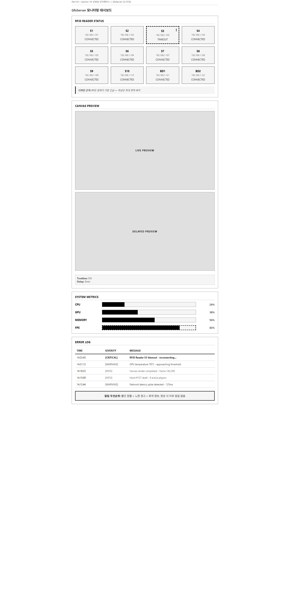
> *방송 중 GfxServer 모니터링 대시보드. RFID 12대 상태 그리드, Live/Delayed Canvas 프리뷰, 시스템 메트릭(CPU/GPU/FPS), 에러 로그가 한 화면에 배치된다.*

**모니터링 요소**:
- **RFID 상태 그리드**: 12대 리더의 실시간 상태. 정상(녹색), 경고(노란색), 장애(빨간색)
- **Canvas 프리뷰**: Live와 Delayed 캔버스의 썸네일. 실제 방송 화면이 어떻게 보이는지 확인
- **시스템 메트릭**: CPU, GPU, Memory, FPS. 임계치 초과 시 경고
- **에러 로그**: 최근 에러만 표시. 심각도에 따라 색상 구분

**알림 우선순위**: RFID 장애(빨간색 점멸) > 시스템 과부하(노란색) > 일반 정보(회색). 정상 상태에서는 아무 알림도 표시되지 않아야 한다.

### 게임 제어 (GFX1)

GFX1은 24개 기능으로 가장 기능이 많은 화면이지만, 본방송 중에는 대부분 자동 처리된다. 운영자가 개입하는 케이스만 설명한다.

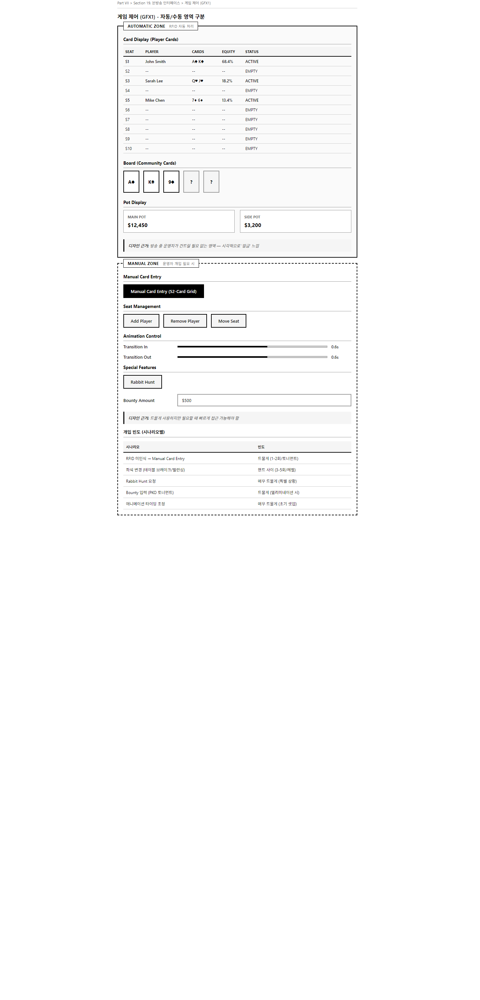
> *GFX1 게임 제어 와이어프레임. 상단 자동 영역(RFID 카드 인식, 승률 계산, 핸드 평가)과 하단 수동 영역(수동 카드 입력, 좌석 재배치, 애니메이션 조절)이 시각적으로 분리된다.*

**방송 중 운영자 개입 시나리오**:

| 시나리오 | 조작 | 빈도 |
|----------|------|------|
| RFID 미인식 | 수동 카드 입력 (52장 그리드) | 드물게 |
| 좌석 변경 | 플레이어 이동/추가/삭제 | 핸드 사이 |
| 애니메이션 제어 | Transition In/Out 시간 조절 | 매우 드물게 |
| Rabbit Hunt | 남은 카드 공개 (핸드 종료 후) | 가끔 |
| Bounty 표시 | 플레이어 바운티 금액 업데이트 | 토너먼트만 |

대부분의 시간 동안 GFX1은 "자동 모드"로 동작하며, 운영자는 Action Tracker에 집중한다.

#### GFX1 상세 — GfxServer GFX1: Game Control 탭

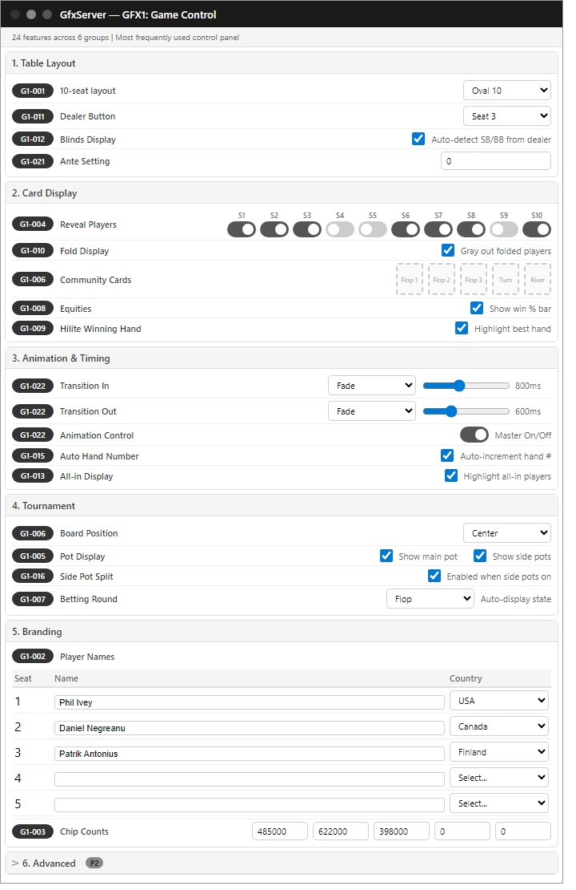
> *GFX1 탭 와이어프레임. 6개 접이식 카드 그룹(Table Layout, Card Display, Animation, Tournament, Branding, Advanced)이 수직 스크롤로 배치된다. 각 기능에 Feature ID(G1-001~G1-024)가 부여된다.*

**6그룹 24개 기능 구조**:

| 그룹 | 기능 | Feature ID | 컨트롤 |
|------|------|-----------|--------|
| **1. Table Layout** | 10-seat 레이아웃 선택 | G1-001 | 드롭다운 (Oval 10/9, Heads Up) |
| | Dealer Button 위치 | G1-011 | Seat 1~10 드롭다운 |
| | Blinds Display | G1-012 | 체크박스 (Auto-detect SB/BB) |
| | Ante Setting | G1-021 | 숫자 입력 (step 100) |
| **2. Card Display** | Reveal Players | G1-004 | **좌석별 토글 스위치 10개** |
| | Fold Display | G1-010 | 체크박스 (Gray out folded) |
| | Community Cards | G1-006 | 5장 카드 슬롯 (Flop 3 + Turn + River) |
| | Equities 표시 | G1-008 | 체크박스 (Show win % bar) |
| | Winning Hand 하이라이트 | G1-009 | 체크박스 |
| **3. Animation & Timing** | Transition In | G1-022 | 타입 드롭다운 + 슬라이더 (0~2000ms) |
| | Transition Out | G1-022 | 타입 드롭다운 + 슬라이더 (0~2000ms) |
| | Animation Master | G1-022 | 토글 On/Off |
| | Auto Hand Number | G1-015 | 체크박스 (Auto-increment) |
| | All-in Display | G1-013 | 체크박스 |
| **4. Tournament** | Board Position | G1-006 | 드롭다운 (Center/Top/Custom) |
| | Pot Display | G1-005 | 체크박스 2개 (Main pot, Side pots) |
| | Side Pot Split | G1-016 | 체크박스 |
| | Betting Round | G1-007 | 드롭다운 (Pre-Flop~River) |
| **5. Branding** | Player Names | G1-002 | 10행 테이블 (Name + Country) |
| | Chip Counts | G1-003 | 10개 숫자 입력 |
| **6. Advanced** *(P2, 접힘)* | Manual Card Input | G1-014 | **52장 13×4 피커 그리드** |
| | Run It Twice | G1-023 | 토글 |
| | Blind Timer | G1-024 | 레벨 드롭다운 + Duration |
| | Rabbit Hunt | G1-017 | 토글 |

**키보드 단축키** (G1-020):

| 키 | 기능 | 키 | 기능 |
|:--:|------|:--:|------|
| F1~F3 | Seat 1~3 홀카드 공개 | F7 | Deal River |
| F5 | Deal Flop | F8 | 승률 표시 토글 |
| F6 | Deal Turn | F9/F10 | Next Hand / Reset |

### 통계 (GFX2)

GFX2는 플레이어 통계와 토너먼트 데이터를 관리한다. 방송 감독이 적절한 타이밍에 통계 오버레이를 활성화한다.

**시나리오별 사용**:
- All-in 상황 → 승률 표시 활성화
- 큰 팟 종료 → 리더보드 업데이트
- 휴식 시간 → 칩 카운트/순위 전체 표시
- 탈락 시 → 남은 인원/상금 갱신

#### GFX2 상세 — GfxServer GFX2: Statistics 탭

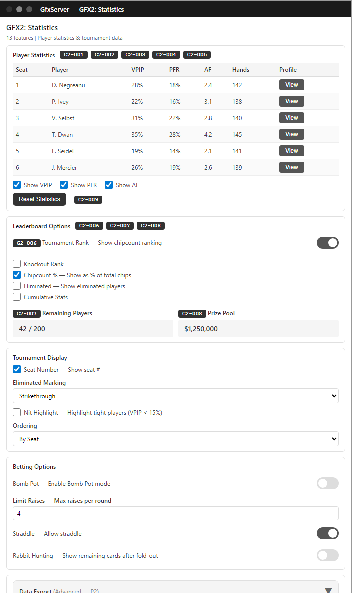
> *GFX2 탭 와이어프레임. 5개 카드(Player Statistics, Leaderboard, Tournament Display, Betting Options, Data Export)로 구성. 13개 Feature ID(G2-001~G2-013).*

**5카드 13개 기능 구조**:

| 카드 | 기능 | Feature ID | 컨트롤 |
|------|------|-----------|--------|
| **Player Statistics** | VPIP / PFR / AF / Hands / Profile | G2-001~005 | 6행 통계 테이블 (View 버튼) |
| | 표시 항목 선택 | — | 체크박스 3개 (VPIP, PFR, AF) |
| | Reset Statistics | G2-009 | 빨간 리셋 버튼 (확인 필요) |
| **Leaderboard** | Tournament Rank | G2-006 | 토글 (칩카운트 랭킹) |
| | Remaining Players | G2-007 | 읽기 전용 표시 (42/200) |
| | Prize Pool | G2-008 | 읽기 전용 표시 ($1,250,000) |
| | 부가 옵션 | — | Knockout Rank, Chipcount %, Eliminated, Cumulative |
| **Tournament Display** | 좌석 번호 / 탈락 표시 / 정렬 | — | 체크박스 + 드롭다운 |
| | Nit Highlight | — | 체크박스 (VPIP < 15% 하이라이트) |
| **Betting Options** | Bomb Pot / Straddle | — | 토글 스위치 |
| | Limit Raises | — | 숫자 입력 (max raises per round) |
| **Data Export** *(P2, 접힘)* | Chip Graph | G2-010 | 체크박스 (칩 히스토리 추적) |
| | Payout Table / ICM | G2-011, G2-012 | 팝업 다이얼로그 버튼 |
| | Export | G2-013 | CSV / JSON 내보내기 버튼 |

### 방송 연출 (GFX3)

GFX3는 자막, 타이틀, 로고, 티커 등 방송 프로덕션 요소를 관리한다.

#### GFX3 상세 — GfxServer GFX3: Broadcast 탭

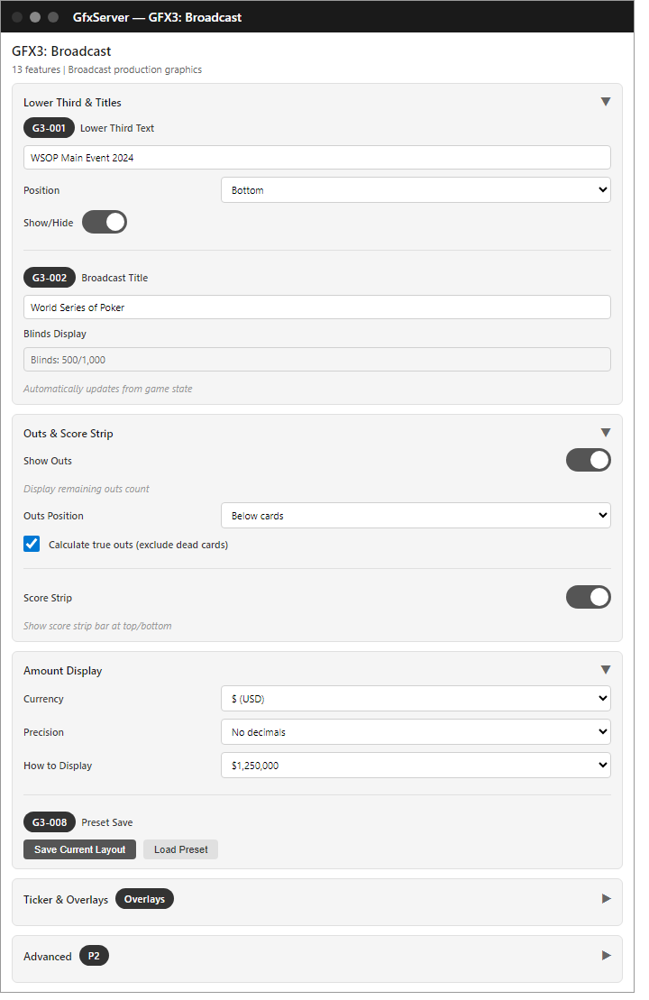
> *GFX3 탭 와이어프레임. 5개 접이식 카드(Lower Third & Titles, Outs & Score Strip, Amount Display, Ticker & Overlays, Advanced)로 구성. 13개 Feature ID(G3-001~G3-013).*

**5카드 13개 기능 구조**:

| 카드 | 기능 | Feature ID | 컨트롤 |
|------|------|-----------|--------|
| **Lower Third & Titles** | Lower Third 텍스트 | G3-001 | 텍스트 입력 + Position 드롭다운 + Show/Hide 토글 |
| | Broadcast Title | G3-002 | 텍스트 입력 + Blinds 자동 표시 |
| **Outs & Score Strip** | Outs Display | — | 토글 + Position 드롭다운 + True Outs 체크박스 |
| | Score Strip | — | 토글 (상/하단 스코어 바) |
| **Amount Display** | 통화 / 정밀도 / 표시 형식 | — | 드롭다운 3개 ($, €, £, ¥, ₩, chips) |
| | Preset Save | G3-008 | Save / Load 버튼 |
| **Ticker & Overlays** *(접힘)* | News Ticker | G3-003 | 텍스트 영역 + Speed 슬라이더 (1~10) |
| | Sponsor Logo | G3-004 | 파일 경로 + Browse + Position 드롭다운 |
| | Text Overlay | G3-005 | 텍스트 + X/Y 좌표 + Font Size |
| | Image Overlay | G3-006 | 파일 경로 + X/Y/W/H 숫자 입력 |
| | Multi-Layer Z-Order | G3-007 | **드래그 가능 레이어 리스트** (Z-index 순서) |
| | Timer Graphic | G3-009 | MM:SS 입력 + Start/Stop/Reset |
| **Advanced** *(P2, 접힘)* | Opening/Ending Animation | G3-010, G3-011 | 파일 경로 + Browse + Preview |
| | Twitch Chat | G3-012 | 토글 + 채널명 + Position 드롭다운 |
| | Picture-in-Picture | G3-013 | Source 드롭다운 + Size % + Corner |

### 해설자 피드 (Commentary)

해설석은 보안 격리된 환경에서 **전체 정보**를 본다. 현장 관객이나 시청자와 달리, 해설자는 모든 홀카드, 승률, 핸드 랭크, 폴드 히스토리를 실시간으로 확인한다.

#### Commentary 상세 — GfxServer Commentary 탭

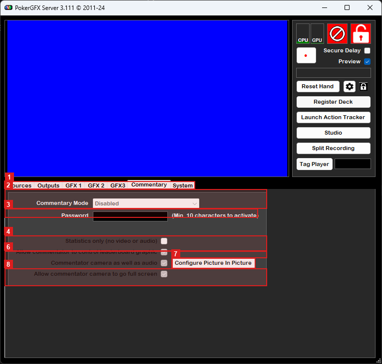
> *Commentary 탭 와이어프레임. 3개 카드(Commentary Mode, Display Options, Camera & Display)로 구성. 보안 경고 배너, 6개 토글 옵션 테이블, 실시간 프리뷰 패널이 포함된다. 7개 Feature ID(CM-001~CM-007).*

**3카드 7개 기능 구조**:

| 카드 | 기능 | Feature ID | 컨트롤 |
|------|------|-----------|--------|
| **Commentary Mode** | Feed Active 토글 | CM-004 | 토글 스위치 |
| | 보안 격리 경고 | CM-004 | 노란색 경고 배너 (방송 출력과 분리됨) |
| | Access Password | — | 비밀번호 입력 (읽기 전용) |
| | 연결 상태 | — | 녹색 dot + "N commentators connected" |
| **Display Options** | Full Hole Cards | CM-001 | 토글 (기본 ON) |
| | Win Percentages | CM-002 | 토글 (기본 ON) |
| | Hand Rank | CM-003 | 토글 (기본 ON) |
| | Fold History | CM-005 | 토글 (기본 OFF) |
| | Outs Count | CM-006 | 토글 (기본 OFF) |
| | Pot Odds | CM-007 | 토글 (기본 OFF) |
| | *실시간 프리뷰* | — | 다크 배경 2×2 그리드 (이름, 스택, 카드, 승률 바, 핸드 랭크) |
| **Camera & Display** | Statistics overlay only | — | 체크박스 |
| | Leaderboard 트리거 | — | 체크박스 |
| | Camera feed + Audio | — | 체크박스 (기본 ON) |
| | Fullscreen mode | — | 체크박스 |
| | PIP (게임 화면) | — | 체크박스 |

**보안 설계**: Commentary 피드는 GfxServer의 별도 네트워크 경로로 전송되며, Live Canvas 출력과 물리적으로 분리된다. 비밀번호 인증 없이는 접근할 수 없고, 해설석 외부의 모니터에는 표시되지 않는다.

### 예외 처리 흐름

본방송 중 발생할 수 있는 예외 상황과 복구 경로이다.

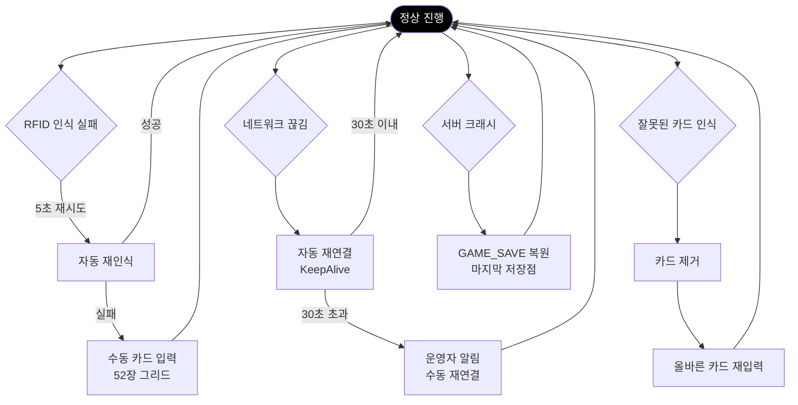
```mermaid
graph TD
    NORMAL(["정상 진행"])

    NORMAL --> RFID_FAIL{"RFID 인식 실패"}
    RFID_FAIL -->|"5초 재시도"| RFID_RETRY["자동 재인식"]
    RFID_RETRY -->|"성공"| NORMAL
    RFID_RETRY -->|"실패"| MANUAL["수동 카드 입력<br/>52장 그리드"]
    MANUAL --> NORMAL

    NORMAL --> NET_FAIL{"네트워크 끊김"}
    NET_FAIL --> RECONNECT["자동 재연결<br/>KeepAlive"]
    RECONNECT -->|"30초 이내"| NORMAL
    RECONNECT -->|"30초 초과"| ALERT["운영자 알림<br/>수동 재연결"]
    ALERT --> NORMAL

    NORMAL --> WRONG_CARD{"잘못된 카드 인식"}
    WRONG_CARD --> REMOVE["카드 제거"]
    REMOVE --> REINSERT["올바른 카드 재입력"]
    REINSERT --> NORMAL

    NORMAL --> CRASH{"서버 크래시"}
    CRASH --> RESTORE["GAME_SAVE 복원<br/>마지막 저장점"]
    RESTORE --> NORMAL

    style NORMAL fill:#000,color:#fff
```

모든 예외 경로는 결국 "정상 진행"으로 돌아온다. 시스템은 어떤 장애가 발생해도 방송을 계속할 수 있도록 설계되어야 한다.

> **장애별 복구 상세**: 담당자, 에스컬레이션 체계, SLA는 Part IX Section 25를 참조한다.

---

## 20. 시청자 경험

운영자가 만드는 모든 것의 최종 산출물은 시청자의 방송 화면이다. 이 섹션은 시청자가 실제로 무엇을 보는지 서술한다.

### 정보 계층 설계

시청자가 방송 화면을 볼 때, 정보는 3개 계층으로 인지된다:

| 계층 | 요소 | 시선 우선순위 |
|------|------|:--------:|
| **1차** (즉시 인지) | 플레이어 홀카드, 승률 | 가장 높음 |
| **2차** (맥락 파악) | 팟 사이즈, 베팅 액션, 보드 카드 | 중간 |
| **3차** (참고 정보) | 이벤트명, 블라인드, 핸드 번호, 로고 | 낮음 |

이 계층은 오버레이 요소의 크기, 위치, 색상 강도에 반영되어야 한다. 1차 정보는 크고 밝게, 3차 정보는 작고 투명하게 표시한다.

### 오버레이 해부도

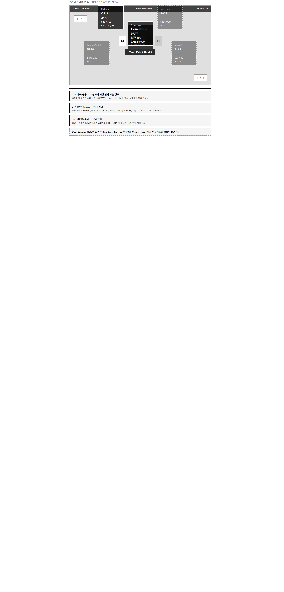
> *방송 오버레이 해부도. 각 요소의 위치, 크기, 정보 계층이 주석으로 표시된다. 플레이어 박스(이름/칩/카드/승률), 보드 카드, 팟, 이벤트 정보, 로고의 배치 원칙.*

**오버레이 구성 요소**:

| 요소 | 위치 | 정보 계층 | 표시 조건 |
|------|------|:--------:|----------|
| 플레이어 홀카드 | 각 플레이어 근처 | 1차 | Delayed Canvas만 (보안) |
| 승률 | 홀카드 옆 | 1차 | 2인 이상 활성 |
| 팟 사이즈 | 보드 상단 | 2차 | 항상 |
| 베팅 액션 | 현재 플레이어 | 2차 | 액션 발생 시 |
| 보드 카드 | 화면 중앙 | 2차 | Flop 이후 |
| 플레이어 이름/칩 | 각 플레이어 하단 | 2차 | 항상 |
| 이벤트명/블라인드 | 상단 | 3차 | 항상 |
| 로고 | 상단/하단 코너 | 3차 | 항상 |
| 스트리트 표시 | 보드 근처 | 3차 | 베팅 중 |
| 폴드 표시 | 폴드 플레이어 | — | 폴드 시 회색 처리 |
| 액션 대기자 | 현재 플레이어 | 2차 | 베팅 중 강조 |

### Dual Canvas 비교

| 구분 | Live Canvas (현장용) | Delayed Canvas (방송용) |
|------|---------------------|----------------------|
| **대상** | 현장 관객, 스태프 | TV/스트림 시청자 |
| **홀카드** | 숨김 (Showdown 전까지) | 지연 후 공개 (5~30분) |
| **승률** | 표시 안 함 | 표시 |
| **보드 카드** | 즉시 표시 | 즉시 표시 |
| **팟/베팅** | 즉시 표시 | 즉시 표시 |
| **용도** | 현장 대형 화면, IMAG | 방송 송출, 녹화 |
| **보안** | Trustless Mode 적용 | 딜레이로 보호 |

두 개의 Canvas가 필요한 이유: 현장 대형 화면에 홀카드가 표시되면 플레이어가 상대방 카드를 볼 수 있다. Live Canvas는 이를 원천 차단한다.

### 게임 상태별 화면 변화

방송 오버레이는 게임 상태에 따라 동적으로 변한다:

| 상태 | 오버레이 변화 |
|------|-------------|
| **Pre-Flop** | 홀카드 표시 (Delayed만), 초기 승률, "PRE-FLOP" 인디케이터 |
| **Flop** | 보드 카드 3장 등장 애니메이션, 승률 재계산, 팟 갱신 |
| **Turn/River** | 보드 카드 추가, 승률 드라마틱하게 변동, 큰 베팅 시 강조 |
| **All-in** | 승률 바 확대 표시, 남은 카드 자동 전개 여부 선택 |
| **Showdown** | Live Canvas에도 카드 공개, 승자 하이라이트 애니메이션 |

### 실제 방송 예시

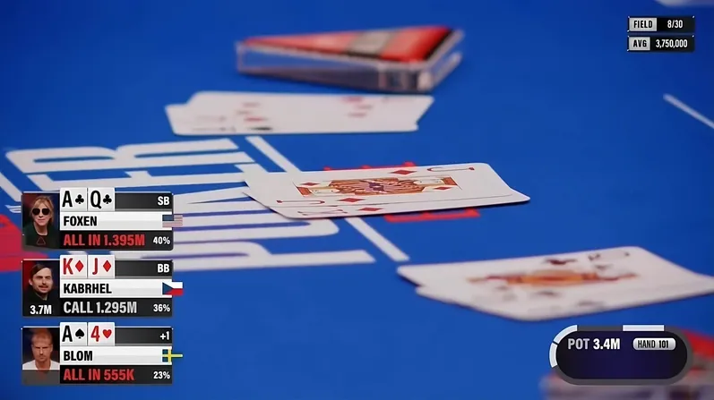
> *PokerGFX 기반 실제 방송 화면. 각 플레이어의 홀카드, 포지션(SB/BB), 칩 스택, 승률, 팟 사이즈, 핸드 번호, 필드 정보가 동시에 표시된다. (출처: pokercaster.com)*

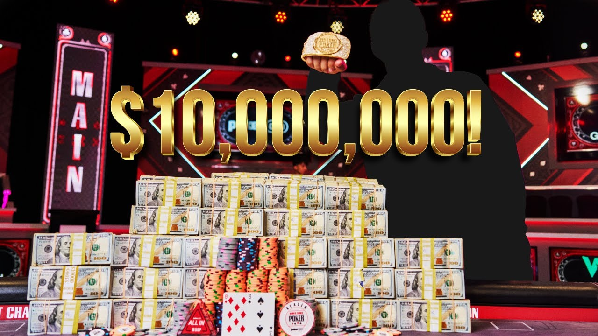
> *WSOP 2024 Final Table. RFID 기반 실시간 홀카드 표시, 승률 계산, 플레이어 통계가 방송에 적용된다. (출처: WSOP)*

---

## 20.5 인터랙션 & 상태 설계

시스템의 7개 앱은 각각 다른 입력 방식과 상태 관리 전략을 요구한다. 이 섹션은 키보드, 터치, 마우스 인터랙션과 에러/로딩/비활성 상태의 설계 원칙을 정의한다.

### 입력 모달리티별 설계

| 앱 | 주 입력 | 보조 입력 | 설계 원칙 |
|-----|--------|----------|----------|
| **GfxServer** | 마우스 + 키보드 | Stream Deck | 빠른 전환을 위한 단축키 필수 |
| **Action Tracker** | 터치 | 키보드 | 큰 터치 타겟(68px+), 오입력 방지 |
| **Skin Editor** | 마우스 드래그 | 키보드(미세 조정) | WYSIWYG + 속성 패널 병행 |
| **GE Board/Player** | 마우스 드래그 | 키보드(미세 조정) | 스냅 가이드 + Z-Order 관리 |
| **Commentary** | 마우스 | — | 읽기 전용, PIP 크기 조절만 |

### 키보드 단축키 체계

GfxServer는 방송 중 신속한 전환이 필요하므로 시스템 전역 단축키를 제공한다. Stream Deck 물리 버튼과 병행 운용된다.

| 카테고리 | 단축키 | 동작 | Feature ID |
|---------|--------|------|-----------|
| **탭 전환** | Ctrl+1~8 | 메인 탭 직접 이동 (Main, Sources, Outputs, GFX1~3, Commentary, System) | SYS-013 |
| **긴급 제어** | Ctrl+H | 모든 GFX 즉시 숨김 | G1-020 |
| **게임 제어** | Ctrl+Space | 핸드 시작/종료 | MW-002 |
| **카메라 전환** | F1~F10 | 비디오 소스 1~10번 즉시 전환 | SRC-001 |
| **스냅샷** | Ctrl+S | 현재 게임 상태 GAME_SAVE | SYS-006 |
| **UNDO** | Ctrl+Z | 마지막 액션 취소 (최대 5단계) | G1-018 |
| **클라이언트** | Ctrl+Shift+A | Action Tracker 접속 목록 | MW-004 |
| **테스트** | Ctrl+T | 200ms 카드 인식 테스트 | SYS-006 |

**Stream Deck 매핑**: 위 단축키 중 빈도가 높은 6개를 물리 버튼에 할당한다. 딜러는 화면을 보지 않고도 손끝 감각으로 GFX 숨김, 카메라 전환, 핸드 시작을 실행할 수 있다.

### 터치 인터랙션 설계 (Action Tracker)

방송 중 딜러는 테이블을 주시하면서 주변 시야로만 Action Tracker를 조작한다. 터치 설계는 이 맥락에 최적화되어야 한다.

**터치 타겟 원칙**:

| 요소 | 최소 크기 | 간격 | 비고 |
|------|:--------:|:---:|------|
| 주 액션 버튼 | 68px (h) | 8px | FOLD, CHECK, CALL, BET, RAISE, ALL-IN |
| 부 액션 버튼 | 56px (h) | 6px | HIDE GFX, TAG, CHOP, RUN IT 2x, MISS DEAL, UNDO |
| 좌석 그리드 셀 | 80×80px | 4px | 10인 좌석, 2×5 배치 |
| 보드 카드 슬롯 | 60×80px | 2px | 5장 카드 터치 영역 |

**터치 피드백**:
- 터치 다운: 200ms 이내 시각적 하이라이트 (버튼 배경색 변경)
- 터치 업: 즉시 동작 실행 + 햅틱 피드백 (Windows Haptic API)
- 잘못된 터치: 빨간색 테두리 + 에러음 (불가능한 액션)

**손가락 감각 최적화**:
- 화면 하단 60%에 주 버튼 배치 (엄지 도달 범위)
- 버튼 간격 8px로 오터치 방지
- 비활성 버튼은 회색 처리 + 터치 이벤트 무시

### 드래그 앤 드롭 설계 (Editors)

Skin Editor, GE Board, GE Player는 공통 WYSIWYG 캔버스 인터랙션을 제공한다.

**드래그 동작**:

| 동작 | 트리거 | 결과 |
|------|--------|------|
| **요소 이동** | Element 좌클릭 드래그 | X/Y 좌표 실시간 변경 |
| **요소 크기 조절** | 4개 코너 핸들 드래그 | Width/Height 실시간 변경 |
| **Z-Order 변경** | Element Tree에서 드래그 | 렌더링 순서 재배치 |
| **정렬 가이드** | 드래그 중 Shift | 스냅-투-그리드(10px) + 룰러 표시 |
| **비율 유지** | 크기 조절 중 Ctrl | Aspect Ratio 고정 |

**마우스 커서 상태**:
- 이동 가능: 십자 화살표
- 크기 조절 가능: 양방향 화살표 (↔ ↕ ⤢ ⤡)
- 선택 가능: 손가락 포인터
- 작업 중: 모래시계

**WYSIWYG ↔ Properties 동기화**: 캔버스에서 드래그로 변경한 값은 즉시 우측 Properties 패널에 반영된다. 반대로 Properties에서 숫자 입력 시 캔버스가 실시간 갱신된다.

### 에러 상태 설계

방송 중 발생 가능한 에러와 UI 피드백 전략이다. 모든 에러는 복구 가능해야 하며, 방송을 중단시키지 않는다.

| 에러 유형 | 시각적 표시 | 자동 복구 | 수동 개입 | Feature ID |
|----------|-----------|----------|----------|-----------|
| **RFID 인식 실패** | Main 탭 RFID 상태 그리드 빨간색, 5초 카운트다운 | 5초 재시도 | 재시도 실패 시 수동 카드 입력 창 자동 표시 | SYS-004, MW-005 |
| **네트워크 끊김** | Main 탭 클라이언트 목록에서 접속 상태 회색, 재연결 아이콘 회전 | 30초 자동 재연결 | 재연결 실패 시 "수동 재연결" 버튼 활성화 | MW-004 |
| **잘못된 카드** | Action Tracker 해당 좌석 셀 빨간색 테두리, "WRONG CARD" 경고 | — | "카드 제거 → 올바른 카드 재입력" 가이드 표시 | — |
| **서버 크래시** | 서버 전체 다운, 자동 재시작 | GAME_SAVE 최근 저장점 자동 복원 (최대 30초 전) | 복원 실패 시 마지막 핸드 수동 재입력 | SYS-006 |
| **License 만료** | 서버 시작 시 차단, 모달 다이얼로그 | — | PokerGFX 계정 로그인 후 라이선스 갱신 | SYS-003 |
| **License 무효** | 서버 시작 시 차단, 에러 코드 표시 | — | 고객 지원 연락 (keylok USB 동글 불일치) | SYS-003 |
| **GPU 과부하** | System 탭 FPS 그래프 빨간색 (30fps 이하), 경고음 | — | 비디오 소스 해상도 낮춤 또는 GFX 요소 숨김 | SYS-015 |

**에러 로그 표시**: Main 탭 하단에 최근 5개 에러만 표시. 심각도별 색상 구분 (빨강=긴급, 노랑=경고, 회색=정보). 전체 로그는 System 탭에서 확인.

### 로딩 상태 설계

시스템 시작과 데이터 로드 중 표시되는 프로그레스 인디케이터이다.

| 로딩 단계 | 예상 시간 | UI 표시 | Feature ID |
|----------|:--------:|---------|-----------|
| **서버 시작** | 3~5초 | 스플래시 화면, "Checking License..." → "Initializing..." | SYS-001, SYS-003 |
| **RFID 초기화** | 2~4초 | "Connecting RFID Readers... (0/12)" 프로그레스 바 | SYS-004 |
| **Skin 로딩** | 1~3초 | "Loading Skin: [파일명]..." 스피너 | SYS-005 |
| **비디오 소스 검색** | 2~5초 | "Scanning NDI Sources..." 회전 아이콘 | SRC-001 |
| **테스트 스캔** | 0.2초 | "Test Card Recognition..." → "200ms ✓" 또는 "FAIL ✗" | SYS-006 |
| **GAME_SAVE 복원** | 1~2초 | "Restoring Game State... Hand #[번호]" 프로그레스 바 | SYS-006 |

**스플래시 화면 표시 규칙**: 예상 로딩 시간이 1초 이상인 경우에만 표시. 1초 미만은 즉시 완료 처리.

### 비활성 상태 설계

UI 요소가 비활성화되는 조건과 시각적 피드백이다.

| 조건 | 비활성화 요소 | 시각적 표시 | 이유 |
|------|-------------|-----------|------|
| **게임 진행 중** | Main 탭 "게임 시작" 버튼 | 회색 처리, "게임 진행 중" 툴팁 | 중복 시작 방지 |
| **자동 모드 활성** | GFX1 탭 수동 카드 입력 섹션 전체 | 회색 처리, "Auto Mode ON" 배너 | RFID 우선 정책 |
| **Trustless Mode ON** | Outputs 탭 Live Canvas "Show Hole Cards" 체크박스 | 회색 처리, 체크 불가 | 보안 정책 강제 |
| **에디터 빈 캔버스** | Properties 패널 전체 | 회색 처리, "No Element Selected" 플레이스홀더 | 선택된 요소 없음 |
| **클라이언트 미연결** | GFX1 탭 "Action Tracker로 전송" 버튼 | 회색 처리, "No Client Connected" 툴팁 | 전송 대상 없음 |
| **RFID 리더 오프라인** | GFX1 탭 Auto 모드 라디오 버튼 | 회색 처리, "RFID Offline" 경고 | 하드웨어 장애 |
| **License Basic** | System 탭 Advanced 기능 섹션 전체 | 회색 처리, "Upgrade to PRO" 배너 | 라이선스 제한 |
| **Action Tracker 불가능 액션** | RAISE 버튼 (All-in 상태 플레이어) | 회색 처리, 터치 무반응 | 게임 규칙 위반 |

**비활성 vs 숨김**: 사용자가 "이 기능이 존재하지만 지금은 사용 불가"임을 알아야 하면 비활성 표시. "이 모드에서는 아예 존재하지 않는 기능"이면 숨김 처리.

### 상태 피드백 우선순위

여러 상태가 동시에 발생할 때 표시 우선순위이다.

| 우선순위 | 상태 | 예시 | 피드백 방식 |
|:-------:|------|------|-----------|
| 1 | **긴급 에러** | 서버 크래시, GPU 과부하 | 전체 화면 모달 다이얼로그 + 경고음 |
| 2 | **복구 가능 에러** | RFID 인식 실패, 네트워크 끊김 | 해당 영역 빨간색 강조 + 카운트다운 |
| 3 | **경고** | FPS 저하, 카드 중복 | 노란색 배너 + 정보 아이콘 |
| 4 | **로딩** | Skin 로딩, RFID 초기화 | 회전 스피너 + 프로그레스 바 |
| 5 | **정보** | 게임 상태 변경, 핸드 종료 | 하단 상태바 텍스트 변경 |

**다중 상태 처리**: 에러와 로딩이 동시 발생 시 에러 우선 표시. 로딩 완료 후 에러가 남아있으면 에러 표시.

---

## 21. 기능 추적표

151개 기능을 화면 단위가 아닌 **사용 단계별**로 재분류한다. Feature ID는 부록 C의 원본과 동일하다.

### 준비 단계 기능 (48개)

| 범위 | 수량 | P0 | P1 | P2 |
|------|:----:|:--:|:--:|:--:|
| System (SYS-001~016) | 16 | 10 | 6 | 0 |
| Sources (SRC-001~010) | 10 | 4 | 3 | 3 |
| Outputs (OUT-001~012) | 12 | 6 | 2 | 4 |
| Main Window (MW-001~010) | 10 | 6 | 4 | 0 |
| **소계** | **48** | **26** | **15** | **7** |

### 본방송 기능 (44개)

| 범위 | 수량 | P0 | P1 | P2 |
|------|:----:|:--:|:--:|:--:|
| GFX1 게임 제어 (G1-001~024) | 24 | 15 | 7 | 2 |
| GFX2 통계 (G2-001~013) | 13 | 1 | 8 | 4 |
| Commentary (CM-001~007) | 7 | 4 | 3 | 0 |
| **소계** | **44** | **20** | **18** | **6** |

### 방송 연출 기능 (13개)

| 범위 | 수량 | P0 | P1 | P2 |
|------|:----:|:--:|:--:|:--:|
| GFX3 방송 연출 (G3-001~013) | 13 | 2 | 7 | 4 |
| **소계** | **13** | **2** | **7** | **4** |

### 에디터 기능 (46개)

| 범위 | 수량 | P0 | P1 | P2 |
|------|:----:|:--:|:--:|:--:|
| Skin Editor (SK-001~016) | 16 | 11 | 4 | 1 |
| GE Board (GEB-001~015) | 15 | 15 | 0 | 0 |
| GE Player (GEP-001~015) | 15 | 11 | 4 | 0 |
| **소계** | **46** | **37** | **8** | **1** |

### 전체 요약

| 사용 단계 | 기능 수 | P0 | P1 | P2 |
|----------|:------:|:--:|:--:|:--:|
| 준비 단계 | 48 | 26 | 15 | 7 |
| 본방송 | 44 | 20 | 18 | 6 |
| 방송 연출 | 13 | 2 | 7 | 4 |
| 에디터 | 46 | 37 | 8 | 1 |
| **합계** | **151** | **85** | **48** | **18** |

> P0 85개 중 37개(44%)가 에디터 기능이다. MVP 개발 시 에디터 완성도가 전체 일정을 좌우한다.

---
