# EBS Server UI: 화면별 설계 상세

> **Version**: 1.0.0
> **Date**: 2026-02-19
> **문서 유형**: UI 화면별 설계서
> **개요**: [pokergfx-ui-overview.md](pokergfx-ui-overview.md)
> **관련 문서**: [EBS PRD v26.0.0](pokergfx-prd-v2.md)
> **원본**: PRD-0004-EBS-Server-UI-Design.md v16.0.0

---

## 이 문서의 접근법

각 화면 챕터는 **3단계 내러티브**를 따른다.

| 단계 | 이미지 | 설명 |
|:----:|--------|------|
| **1. 원본 관찰** | PokerGFX 스크린샷 | PokerGFX Server 3.111의 실제 화면을 캡처하여 기존 시스템이 무엇을 하고 있는지 관찰한다 |
| **2. 체계적 분석** | 번호 오버레이 | 각 UI 요소에 번호를 부여하고 기능, 역할, 우선순위를 분석한다 |
| **3. 설계 반영** | EBS 목업 | 분석 결과를 바탕으로 EBS의 신규 UI를 설계한다 |

각 화면 챕터: **원본(N.1) → 분석(N.2) → EBS 설계(N.3)**.

분석 대상: **PokerGFX Server 3.111** (2011-24) — 포커 방송 GFX 서버의 사실상 유일한 상용 솔루션. 11개 화면, 268개 UI 요소. EBS Server는 이를 벤치마크하여 **184개 UI 요소**로 설계한다.

---

## Part A: GfxServer 화면 (Main + 5개 탭)

---

### 1. 공통 레이아웃

GfxServer는 WinForms 기반 단일 창 애플리케이션이다. 모든 탭이 공유하는 구조:

```
+-----------------------------------------------+
| Title Bar                          [ _ ][ X ]  |
+---------------------------+-------------------+
|                           |  [CPU] [GPU] [ERR] |
|   Preview Panel           |  [Lock] [Secure]   |
|   (16:9, Chroma Blue)     |  [ Reset Hand ]    |
|                           |  [ Register Deck ] |
|   GFX 오버레이 실시간      |  [ Launch AT   ]   |
|   렌더링                   |  [ Split Rec.  ]   |
|                           |  [ Tag Player  ]   |
+---------------------------+-------------------+
| [ Src ] [ Out ] [ GFX ] [ Rules ] [ System ]  |
+-----------------------------------------------+
|                                               |
|   탭 콘텐츠 영역 (탭 전환 시에만 변경)          |
|                                               |
+-----------------------------------------------+
```

**상단 영역** (고정): 좌측 60% GPU 프리뷰 + 우측 상태 표시 및 액션 버튼. 탭 전환 시 하단 콘텐츠만 변경되며 상단은 유지된다.

**해상도 적응 원칙**:

| 개념 | 정의 | 설정 위치 |
|------|------|----------|
| Design Resolution | Graphic Editor 좌표 기준 해상도. SK-04에 따라 1920x1080 또는 3840x2160 | 8장 SK-04 |
| Output Resolution | 실제 방송 송출 해상도. O-01에서 설정 | 4장 O-01 |
| Preview Scaling | Preview Panel이 출력 해상도 비율을 유지하며 UI 공간에 맞게 표시 | 2장 M-02 |

**앱 윈도우 크기 정책**: 최소 1280x720, Preview(좌):Control(우) 기본 비율 = 6:4.

**좌표 시스템 원칙**: Graphic Editor의 모든 위치/크기값(LTWH)은 Design Resolution 기준 픽셀. GFX 마진(G-03~G-05)은 정규화 좌표(0.0~1.0) 사용. 출력 해상도 변경 시 스케일 팩터 자동 적용.

---

### 2. Main Window (M-01~M-20)

#### 2.1 PokerGFX 원본


PokerGFX의 기본 화면. 좌측에 방송 Preview, 우측에 상태 표시와 액션 버튼이 배치된 2-column 레이아웃이다. 10개 UI 요소로 구성.

#### 2.2 분석

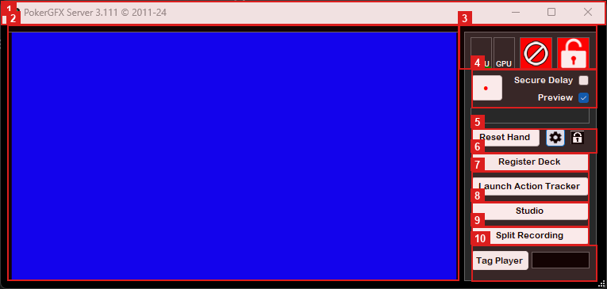

| # | 기능명 | 설명 | EBS 복제 |
|:-:|--------|------|:--------:|
| 1 | Title Bar | `PokerGFX Server 3.111 (c) 2011-24` 타이틀 + 최소/최대/닫기 버튼 | P2 |
| 2 | Preview | Chroma Key Blue 배경의 방송 미리보기 화면. GFX 오버레이가 실시간 렌더링됨 | P0 |
| 3 | CPU / GPU / Error / Lock | CPU, GPU 사용률 인디케이터 + Error 아이콘 + Lock 아이콘. 시스템 부하와 상태 실시간 모니터링 | P1 |
| 4 | Secure Delay / Preview | Secure Delay 체크박스 + Preview 체크박스. 방송 보안 딜레이와 미리보기 활성화 토글 | P0 |
| 5 | Reset Hand | Reset Hand 버튼. 현재 핸드 데이터 초기화 + Settings 톱니바퀴 + Lock 자물쇠 | P0 |
| 6 | Register Deck | RFID 카드 덱 일괄 등록 버튼. 새 덱 투입 시 52장 순차 스캔 | P0 |
| 7 | Action Tracker | Action Tracker 실행 버튼. 운영자용 실시간 게임 추적 인터페이스 | P0 |
| 8 | Studio | Studio 모드 진입 버튼. 방송 스튜디오 환경 전환 | P2 |
| 9 | Split Recording | 핸드별 분할 녹화 버튼. 각 핸드를 개별 파일로 자동 저장 | P1 |
| 10 | Tag Player | 플레이어 태그 + 드롭다운. 특정 플레이어에 마커를 부여하여 추적 | P1 |

**설계 시사점**:
- Preview + 우측 컨트롤 패널 2-column 레이아웃은 운영 효율이 검증된 구조 → EBS 계승
- RFID 상태(3번)가 CPU/GPU와 같은 행에 묻혀 존재감 약함 → EBS에서 독립 분리 (M-05)
- 버튼 7개가 우선순위 구분 없이 균등 노출 → EBS에서 Quick Actions 그룹으로 재편

#### 2.3 EBS 설계

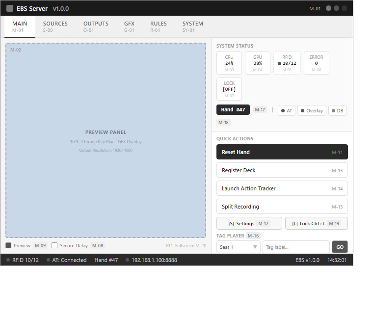

**변환 요약**: PokerGFX 10개 → EBS 20개. RFID Status 독립 분리, Hand Counter(M-17), Connection Status(M-18) 신규 추가. 2-column 레이아웃 계승.

시스템 모니터링과 긴급 조작을 담당하는 기본 화면. 본방송 중 운영자 주의력의 15%만 할당된다.

#### 2.4 레이아웃

```
+---------------------------+-------------------+
|                           | [M-03 CPU] [M-04 GPU] |
|   M-02 Preview Panel      | [M-05 RFID Status]  |
|   (16:9, Chroma Blue)     | [M-06 Error Icon]   |
|   GFX 오버레이 실시간 렌더링 | [M-07 Lock Toggle]  |
|                           | [M-17 Hand Counter] |
|   M-09 Preview Toggle     | [M-18 Conn Status]  |
|   M-08 Secure Delay       |---------------------|
|   M-10 Delay Progress     | [M-11 Reset Hand ]  |
|                           | [M-12 Settings   ]  |
|                           | [M-13 Reg. Deck  ]  |
|                           | [M-14 Launch AT  ]  |
|                           | [M-15 Split Rec. ]  |
|                           | [M-16 Tag Player ]  |
+---------------------------+-------------------+
```

Preview Panel(M-02, 좌) + Status Panel(M-03~M-05, M-17, M-18, 우상) + Quick Actions(M-11~M-16, 우하).

#### 2.5 Design Decisions

1. **Quick Actions(M-11~M-16)가 메인에 노출되는 이유**: Reset Hand, Register Deck, Launch AT는 초 단위 반응이 필요하므로 탭 전환 없이 메인 화면에 상주한다.

2. **RFID Status(M-05)가 독립 분리된 이유**: RFID는 방송의 핵심 인프라다. CPU/GPU와 같은 행에 묻히면 장애를 즉시 인지하기 어렵다. 독립 아이콘+뱃지로 시각적 존재감을 부여한다.

3. **Lock Toggle(M-07)이 전역 동작인 이유**: 라이브 중 실수로 설정 변경하면 방송 사고. Lock은 모든 탭의 설정 변경을 일괄 비활성화하며 Ctrl+L로 토글 가능하다.

#### 2.6 Workflow

앱 실행 시 기본 화면 → Preview로 출력 상태 모니터링 → 상태 표시로 시스템 건강 확인 → 긴급 시 Quick Actions 사용 → 탭 전환으로 상세 설정 접근.

#### 2.7 Element Catalog

**상태 표시 그룹**

| # | 요소 | 타입 | 설명 | PGX | 우선순위 |
|:-:|------|------|------|:---:|:--------:|
| M-01 | Title Bar | AppBar | 앱 이름 + 버전 + 윈도우 컨트롤 | #1 | P2 |
| M-02 | Preview Panel | Canvas | 출력 해상도(O-01)와 동일한 종횡비 유지, Chroma Key Blue, GFX 오버레이 실시간 렌더링 | #2 | P0 |
| M-03 | CPU Indicator | ProgressBar | CPU 사용률 + 색상 코딩 (Green<60%, Yellow<85%, Red>=85%) | #3 | P1 |
| M-04 | GPU Indicator | ProgressBar | GPU 사용률 + 색상 코딩 | #3 | P1 |
| M-05 | RFID Status | Icon+Badge | Green=Connected, Red=Disconnected, Yellow=Calibrating | #3 | P0 |
| M-06 | Error Icon | IconButton | 에러 카운트 뱃지, 클릭 시 로그 팝업 | #3 | P1 |
| M-17 | Hand Counter | Badge | 현재 세션 핸드 번호 (Hand #47) | 신규 | P0 |
| M-18 | Connection Status | Row | AT/Overlay/DB 각각 Green/Red 표시 | 신규 | P0 |

**M-02 Preview Panel 해상도 스케일링 스펙**

| 조건 | Preview 동작 |
|------|-------------|
| 출력 해상도(O-01) = 16:9 (기본) | Preview 캔버스 크기: `UI_Panel_Width x 9/16` |
| 출력 해상도(O-01) = 9:16 (세로 모드) | Preview 캔버스 크기: `UI_Panel_Height x 9/16` |
| 출력 해상도 변경 시 | 블랙아웃 없이 즉시 비율 재계산 및 리스케일 |
| 4K 출력 (3840x2160) | Preview는 UI 공간 내 최대 크기로 표시 (업스케일 없음) |
| SD 480p (854x480) 출력 | Preview는 실제 픽셀 크기 또는 2x 확대 표시 |

**보안 제어 그룹**

| # | 요소 | 타입 | 설명 | PGX | 우선순위 |
|:-:|------|------|------|:---:|:--------:|
| M-07 | Lock Toggle | IconButton | Lock 활성 시 설정 변경 불가, 오조작 방지 | #3 | P0 |
| M-08 | Secure Delay | Checkbox | Dual Canvas의 Broadcast 파이프라인 On/Off | #4 | Future |
| M-09 | Preview Toggle | Checkbox | Preview 렌더링 On/Off (CPU 절약) | #4 | P0 |
| M-10 | Delay Progress | LinearProgressIndicator | Secure Delay 남은 시간 프로그레스바 + 텍스트 | 신규 | Future |

**Quick Actions 그룹**

| # | 요소 | 타입 | 설명 | PGX | 우선순위 |
|:-:|------|------|------|:---:|:--------:|
| M-11 | Reset Hand | ElevatedButton | 현재 핸드 초기화, 확인 다이얼로그 | #5 | P0 |
| M-12 | Settings | IconButton | 전역 설정 다이얼로그 (테마, 언어, 단축키) | #5 | P1 |
| M-13 | Register Deck | ElevatedButton | 52장 RFID 일괄 등록, 진행 다이얼로그 | #6 | P0 |
| M-14 | Launch AT | ElevatedButton | Action Tracker 실행/포커스 전환 | #7 | P0 |
| M-15 | Split Recording | ElevatedButton | 핸드별 분할 녹화 토글 | #9 | P1 |
| M-16 | Tag Player | Dropdown+Text | 플레이어 선택 + 태그 입력 | #10 | P1 |
| M-19 | Quick Lock | Keyboard Shortcut | Ctrl+L 즉시 Lock 토글 | 신규 | P1 |
| M-20 | Fullscreen Preview | IconButton | Preview 전체 화면 (F11) | 신규 | P2 |

#### 2.8 Interaction Patterns

| 조작 | 시스템 반응 | 피드백 |
|------|-----------|--------|
| M-07 Lock 클릭 | 모든 설정 변경 비활성화 | 자물쇠 아이콘 변화 + 탭 그레이아웃 |
| M-08 Secure Delay 토글 (추후 개발) | Broadcast Canvas 파이프라인 On/Off | M-10 프로그레스바 표시/숨김 |
| M-11 Reset Hand | 확인 다이얼로그 → 핸드 초기화 | Preview 초기화, Hand# 리셋 |
| M-13 Register Deck | 52장 순차 스캔 다이얼로그 | 1/52~52/52 진행 표시 |

#### 2.9 Navigation

| 목적지 | 방법 | 조건 |
|--------|------|------|
| Sources~System 탭 | Ctrl+1~5 또는 탭 클릭 | M-07 Lock 해제 시 |
| Skin Editor | GFX 탭 > 스킨 선택 영역 | 별도 창 |
| Action Tracker | F8 또는 M-14 | 별도 앱 실행 |
| Preview 전체 화면 | F11 또는 M-20 | ESC로 복귀 |

---

### 3. Sources 탭 (S-00~S-18)

#### 3.1 PokerGFX 원본


비디오 입력 장치, 카메라 제어, 크로마키, 외부 스위처 연동을 관리하는 탭. 12개 UI 요소로 구성.

#### 3.2 분석

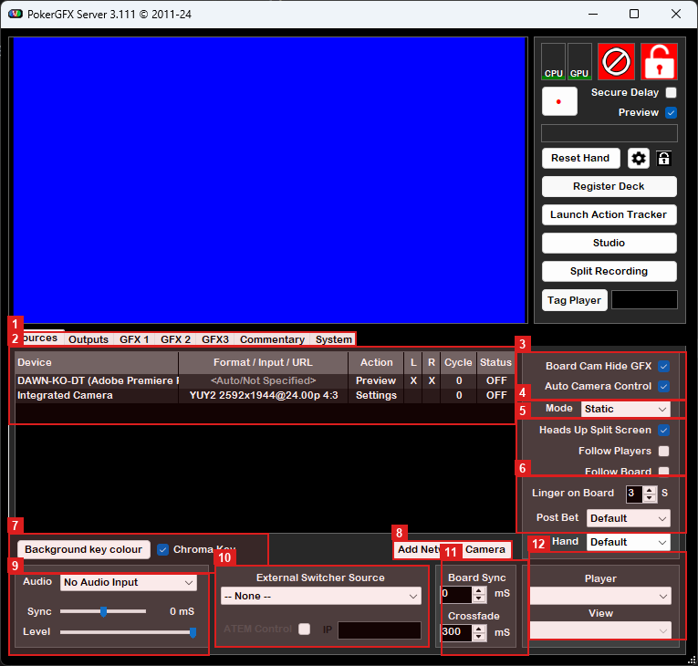

| # | 기능명 | 설명 | EBS 복제 |
|:-:|--------|------|:--------:|
| 1 | Tab Bar | 7개 탭 전환 바 | P0 |
| 2 | Device Table | 비디오 입력 장치 목록. Preview, Settings 버튼으로 개별 제어 | P0 |
| 3 | Board Cam / Auto Camera | 보드 카메라 전환 시 GFX 자동 숨기기 + 게임 상태 기반 자동 카메라 전환 | P1 |
| 4 | Camera Mode | Static / Dynamic 카메라 전환 모드 | P1 |
| 5 | Heads Up / Follow | 헤즈업 시 화면 분할과 플레이어/보드 추적 | P1 |
| 6 | Linger / Post | 보드 카드 유지 시간 + Post Bet / Post Hand 카메라 동작 | P1 |
| 7 | Chroma Key | 활성화 체크박스 + Background Key Colour 색상 선택기 | P0 |
| 8 | Add Network Camera | IP 기반 원격 카메라 추가 | P2 |
| 9 | Audio / Sync | 오디오 소스 + Sync 보정값 (mS) | P1 |
| 10 | External Switcher / ATEM | ATEM 스위처 IP 기반 직접 통신 | P1 |
| 11 | Board Sync / Crossfade | 싱크 보정 + 크로스페이드 시간 (기본 0/300mS) | P1 |
| 12 | Player View | 플레이어별 카메라 뷰 전환 | P1 |

**설계 시사점**:
- External Switcher(10번)가 출력 모드와 무관하게 항상 노출 → 혼란 유발. EBS에서 Fill & Key 모드에서만 표시
- Chroma Key(7번)가 목록 중간에 배치 → EBS에서 Output Mode Selector(S-00)로 상단 분리
- Auto Camera Control: 게임 상태 기반 자동 카메라 전환이 핵심 → EBS 계승

#### 3.3 EBS 설계

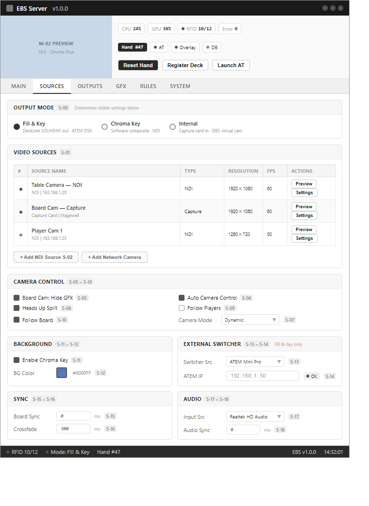

**변환 요약**: PokerGFX 12개 → EBS 19개. Output Mode Selector(S-00) 신규 추가로 Fill & Key / Chroma Key / Internal 모드에 따른 조건부 표시. ATEM 설정은 Fill & Key 모드에서만 노출하여 인지 부하 감소.

#### 3.4 레이아웃

3구역: Video Sources Table(S-01, 상단) > Camera Control(S-05~S-10, 중단) > Background/Audio/External/Sync(S-11~S-18, 하단).

#### 3.5 Design Decisions

1. **Output Mode Selector(S-00)가 첫 번째인 이유**: Fill & Key / Chroma Key / Internal 모드 선택이 나머지 요소의 가시성과 필수 여부를 결정한다. 모드를 먼저 결정해야 불필요한 설정 노출을 방지할 수 있다.

2. **ATEM Control(S-13, S-14)이 Fill & Key 전용인 이유**: Fill & Key 모드에서만 외부 ATEM 스위처 DSK가 필요하다. 다른 모드에서는 스위처가 불필요하므로 설정을 노출하면 혼란만 가중된다.

3. **Audio(S-17, S-18)가 모든 모드에서 공통인 이유**: 오디오 소스와 싱크 보정은 출력 모드와 무관하게 항상 필요하다.

#### 3.6 Workflow

```
  모드 선택(S-00)
       |
       +--[Fill & Key]--> DeckLink 장치(S-01) + ATEM(S-13,S-14)
       |
       +--[Chroma Key]--> 배경색(S-11,S-12)
       |
       +--[Internal]----> 캡처 소스(S-01~S-04)
       |
       v
  오디오+싱크(S-15~S-18) [공통]
```

#### 3.7 Element Catalog

| # | 그룹 | 요소 | 타입 | 설명 | PGX | 우선순위 |
|:-:|------|------|------|------|:---:|:--------:|
| S-00 | Output Mode | Mode Selector | RadioGroup | Fill & Key / Chroma Key / Internal (기본: Fill & Key) | 신규 | P0 |
| S-01 | Video Sources | Device Table | DataTable | NDI, 캡처 카드, 네트워크 카메라 목록 | #2 | P0 |
| S-02 | Video Sources | Add Button | TextButton | NDI 자동 탐색 또는 수동 URL | #8 | P1 |
| S-03 | Video Sources | Settings | IconButton | 해상도, 프레임레이트, 크롭 | #2 | P1 |
| S-04 | Video Sources | Preview | IconButton | 소스별 미니 프리뷰 | #2 | P1 |
| S-05 | Camera | Board Cam Hide GFX | Checkbox | 보드 카메라 시 GFX 자동 숨기기 | #3 | P1 |
| S-06 | Camera | Auto Camera Control | Checkbox | 게임 상태 기반 자동 전환 | #3 | P1 |
| S-07 | Camera | Mode | Dropdown | Static / Dynamic | #4 | P1 |
| S-08 | Camera | Heads Up Split | Checkbox | 헤즈업 화면 분할 | #5 | P1 |
| S-09 | Camera | Follow Players | Checkbox | 플레이어 추적 | #5 | P1 |
| S-10 | Camera | Follow Board | Checkbox | 보드 추적 | #5 | P1 |
| S-11 | Background | Enable | Checkbox | 크로마키 활성화 | #7 | P0 |
| S-12 | Background | Background Colour | ColorPicker | 배경색 (기본 Blue) | #7 | P0 |
| S-13 | External | Switcher Source | Dropdown | ATEM 스위처 연결 (Fill & Key 필수) | #10 | P0 |
| S-14 | External | ATEM Control | Checkbox+TextField | ATEM IP + 연결 상태 (Fill & Key 필수) | #10 | P0 |
| S-15 | Sync | Board Sync | NumberInput | 보드 싱크 보정 (ms) | #11 | P1 |
| S-16 | Sync | Crossfade | NumberInput | 크로스페이드 (ms, 기본 300) | #11 | P1 |
| S-17 | Audio | Input Source | Dropdown | 오디오 소스 선택 | #9 | P1 |
| S-18 | Audio | Audio Sync | NumberInput | 오디오 싱크 보정 (ms) | #9 | P1 |

#### 3.8 Interaction Patterns

| 조작 | 시스템 반응 | 피드백 |
|------|-----------|--------|
| S-02 Add 클릭 | NDI 자동 탐색 시작 | 발견된 소스 목록 팝업 |
| S-11 Chroma Key 토글 | Preview에 크로마키 즉시 반영 | 배경색 변화 |
| S-14 ATEM IP 입력 | 연결 시도 + 상태 표시 | Green/Red 아이콘 |

#### 3.9 Navigation

| 목적지 | 방법 | 조건 |
|--------|------|------|
| Main Window | 탭 영역 외 클릭 | 언제든 |
| Outputs 탭 | Ctrl+2 | 비디오 소스 설정 완료 후 자연스러운 다음 단계 |

---

### 4. Outputs 탭 (O-01~O-20)

#### 4.1 PokerGFX 원본


비디오 출력 해상도, Live/Delay 이중 파이프라인, Secure Delay, 스트리밍을 관리하는 탭. 13개 UI 요소로 구성.

#### 4.2 분석

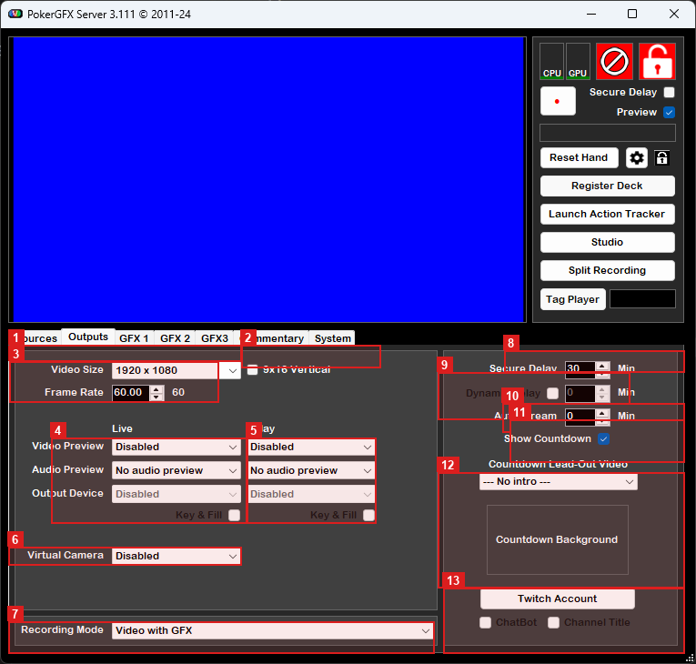

| # | 기능명 | 설명 | EBS 복제 |
|:-:|--------|------|:--------:|
| 1 | Video Size | 출력 해상도 (`1920 x 1080`) | P0 |
| 2 | 9x16 Vertical | 세로 모드 출력 (모바일/쇼츠) | P2 |
| 3 | Frame Rate | 출력 프레임레이트 (`60.00 -> 60`) | P0 |
| 4 | Live column | Live 출력 파이프라인 4개 설정 | P0 |
| 5 | Delay column | Delay 출력 파이프라인 (Live와 독립) | P0 |
| 6 | Virtual Camera | 가상 카메라 출력 | P2 |
| 7 | Recording Mode | 녹화 모드 (`Video with GFX`) | P1 |
| 8 | Secure Delay | 보안 딜레이 시간 (30분, 분 단위) | P0 |
| 9 | Dynamic Delay | 동적 딜레이 (상황별 자동 조절) | P1 |
| 10 | Auto Stream | 자동 스트리밍 시작 딜레이(분) | P2 |
| 11 | Show Countdown | 카운트다운 표시 | P1 |
| 12 | Countdown Video | 카운트다운 종료 시 재생 영상 | P2 |
| 13 | Twitch / ChatBot | Twitch 직접 연동 | P2 |

**설계 시사점**:
- Live/Delay 2열 구조는 직관적이며 EBS 계승 가치 있음
- Key & Fill(4~5번)의 DeckLink 포트 할당이 불명확 → EBS에서 O-18~O-20 Fill & Key 전용 섹션 신규
- Secure Delay가 분 단위(최대 30분)임을 확인 → 추후 개발 범위로 처리

#### 4.3 EBS 설계

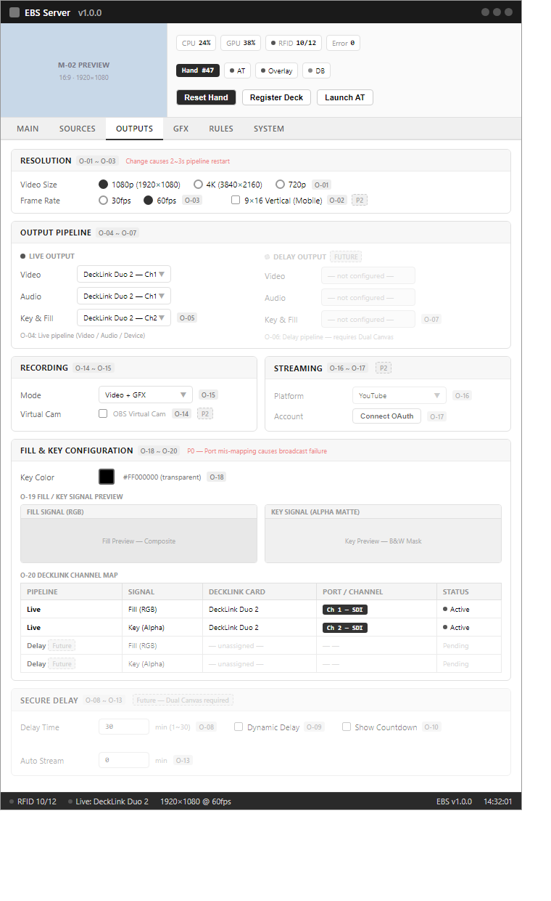

**변환 요약**: PokerGFX 13개 → EBS 20개. Fill & Key Channel Map(O-20), Key Color(O-18), Fill/Key Preview(O-19) 신규 추가. Live 단일 출력 구조. Delay 파이프라인은 추후 개발.

#### 4.4 레이아웃

3구역: Resolution(O-01~O-03, 상단) > Live 출력(O-04~O-05) > Recording/Streaming/Fill&Key(O-14~O-20). Delay 관련(O-06~O-13)은 추후 개발.

#### 4.5 Design Decisions

1. **Fill & Key 채널 매핑(O-05, O-07, O-20)이 P0인 이유**: Fill(RGB)과 Key(Alpha)는 DeckLink 카드의 물리적 SDI/HDMI 포트에 매핑된다. 포트 할당 오류는 방송 화면 깨짐으로 직결된다.

2. **Delay 파이프라인(O-06~O-13)이 추후 개발인 이유**: Secure Delay 기능은 Dual Canvas Architecture의 Delay 파이프라인이 구현된 이후 이 탭에 통합될 예정이다.

3. **O-01 해상도 변경이 2~3초 중단을 유발하는 이유**: 출력 해상도 변경은 7단계 처리 체인(스트림 중단 → 렌더러 재설정 → 스케일 재계산 → 좌표 재매핑 → 스킨 호환성 확인 → Preview 재계산 → 스트림 재시작)을 거친다. 사전 확인 다이얼로그를 통해 운영자의 인지 하에 진행한다.

#### 4.6 Workflow

```
  해상도(O-01,O-03) --> Live 출력(O-04,O-05) --> 녹화/스트리밍(O-15~O-17)
```

#### 4.7 Element Catalog

| # | 그룹 | 요소 | 설명 | PGX | 우선순위 |
|:-:|------|------|------|:---:|:--------:|
| O-01 | Resolution | Video Size | 1080p/4K 출력 해상도 | #1 | P0 |
| O-02 | Resolution | 9x16 Vertical | 세로 모드 (모바일) | #2 | P2 |
| O-03 | Resolution | Frame Rate | 30/60fps | #3 | P0 |
| O-04 | Live | Video/Audio/Device | Live 파이프라인 3개 드롭다운 | #4 | P0 |
| O-05 | Live | Key & Fill | Live Fill & Key 출력 (DeckLink 채널 할당) | #4 | P0 |
| O-06 | Delay | Video/Audio/Device | Delay 파이프라인 (Live와 독립) | #5 | Future |
| O-07 | Delay | Key & Fill | Delay Fill & Key 출력 (DeckLink 채널 할당) | #5 | Future |
| O-08 | Secure Delay | Delay Time | 1~30분 (기본 30분) | #8 | Future |
| O-09 | Secure Delay | Dynamic Delay | 상황별 자동 조절 | #9 | Future |
| O-10 | Secure Delay | Show Countdown | 카운트다운 표시 | #11 | Future |
| O-11 | Secure Delay | Countdown Video | 종료 시 재생 영상 | #12 | Future |
| O-12 | Secure Delay | Countdown Background | 배경 이미지 | #12 | Future |
| O-13 | Secure Delay | Auto Stream | 지정 시간 후 자동 시작 | #10 | Future |
| O-14 | Virtual | Camera | 가상 카메라 (OBS 연동) | #6 | P2 |
| O-15 | Recording | Mode | Video / Video+GFX / GFX only | #7 | P1 |
| O-16 | Streaming | Platform | Twitch/YouTube/Custom RTMP | #13 | P2 |
| O-17 | Streaming | Account Connect | OAuth 연결 | #13 | P2 |
| O-18 | Fill & Key | Key Color | Key 신호 배경색 (기본: #FF000000) | 신규 | P0 |
| O-19 | Fill & Key | Fill/Key Preview | Fill 신호와 Key 신호 나란히 미리보기 | 신규 | P1 |
| O-20 | Fill & Key | DeckLink Channel Map | Live Fill/Key → DeckLink 포트 매핑 (Delay 추가 시 확장) | 신규 | P0 |

#### 4.8 Interaction Patterns

| 조작 | 시스템 반응 | 피드백 |
|------|-----------|--------|
| O-04 Live 장치 변경 | 즉시 출력 전환 | Preview 갱신 |
| O-01 해상도 변경 | 전체 파이프라인 재초기화 (7단계) | 2~3초 Preview 블랙아웃 후 복구 |
| O-08 딜레이 시간 변경 (추후 개발) | Delay 버퍼 리사이징 | M-10 프로그레스바 갱신 |

#### 4.9 Navigation

| 목적지 | 방법 | 조건 |
|--------|------|------|
| GFX 탭 | Ctrl+3 | 출력 설정 후 그래픽 조정 |
| Main Window | 탭 영역 외 클릭 | — |

---

### 5. GFX 탭 (G-01~G-51, 4개 서브탭)

#### 5.1 PokerGFX 원본: GFX 1/2/3

PokerGFX는 GFX 설정을 3개 탭에 걸쳐 73개 요소로 분산했다. 기능이 추가되면서 자연 발생한 구조이며, 논리적 분류 기준이 일관되지 않는다.

**GFX 1** (29개 요소) — 레이아웃, 연출, 스킨, 스폰서, 마진이 혼재


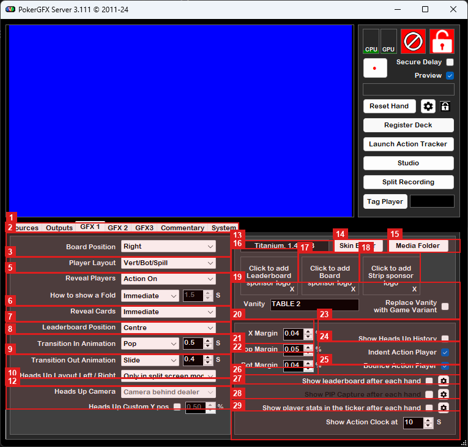

**GFX 2** (21개 요소) — 리더보드, 게임 규칙, 표시 설정이 혼재


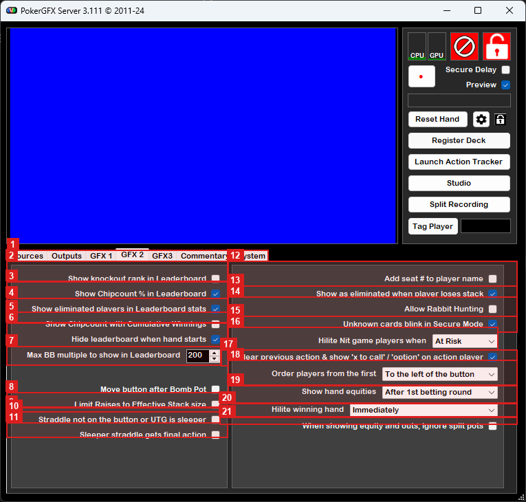

**GFX 3** (23개 요소) — 수치 형식 위주, 가장 응집도 높음


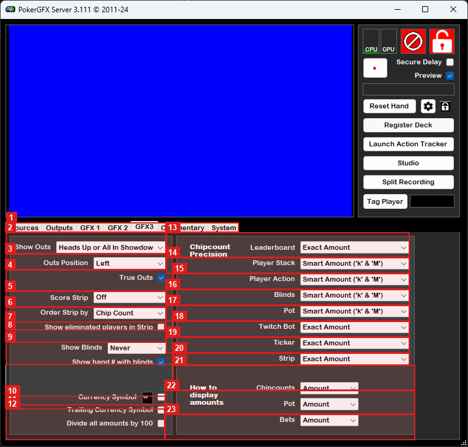

#### 5.2 분석: 재편이 필요한 이유

GFX 1에 Board Position(배치)과 Reveal Cards(연출)이 같은 탭에 있다. GFX 2에 Show Chipcount %(표시 설정)와 Move Button Bomb Pot(게임 규칙)이 같은 탭에 있다. 변경 빈도와 영향 범위가 다른 설정이 섞여 있으면 라이브 중 오조작 위험이 높아진다.

**재편 원칙**: 운영자의 작업 흐름을 기준으로 분류한다.
- **"어디에"** (Layout): 보드 위치, 플레이어 배치, 마진, 스킨
- **"어떤 연출로"** (Visual): 카드 공개 방식, Transition, 액션 플레이어 효과
- **"무엇을"** (Display): 통계, 리더보드, Equity, 승자 강조
- **"어떤 형식으로"** (Numbers): 통화 기호, 정밀도, BB 표시, 블라인드

GFX 2의 게임 규칙 6개(#8~#11, #14, #21)는 Rules 탭으로 독립 분리.

**변환 결과**: 73개 → 51개(GFX) + 6개(Rules). 중복 제거와 배제로 -16개.

#### 5.3 EBS 설계: GFX 서브탭 구조

| 서브탭 | 원본 대응 | 주요 기능 |
|--------|----------|----------|
| **Layout** | GFX1 일부 | 카드 위치, 플레이어 배치, 스킨 선택 |
| **Visual** | GFX1 일부 + GFX2 일부 | 카드 공개 방식, 리더보드, 스폰서 |
| **Display** | GFX2 + GFX3 일부 | 통계 표시, 방송 오버레이 |
| **Numbers** | GFX3 일부 | 승률, Outs, 위닝 핸드 |

#### 5.4 Design Decisions

1. **GFX 1/2/3을 단일 탭(4개 서브 섹션)으로 통합한 이유**: PokerGFX의 GFX 1/2/3은 기능 추가 과정의 산물이었다. EBS에서는 기능적 분류(Layout/Visual/Display/Numbers)로 재편하여 "어디에, 어떤 연출로, 무엇을, 어떤 형식으로"라는 자연스러운 작업 순서를 따른다.

2. **Global vs Local 설정 영향 범위**: Board Position(G-01)이나 Currency Symbol(G-47)을 변경하면 모든 출력 채널에 즉시 반영된다(Global). 반면 Sponsor Logo(G-10~G-12)는 해당 요소만 영향받는다(Local). 라이브 중 Global 설정 변경은 방송 사고 위험이 있다.

3. **Skin Editor/Graphic Editor가 별도 창인 이유**: GFX 탭은 "런타임 설정", Skin/Graphic Editor는 "디자인 편집"이다. 편집 작업은 시간이 걸리고 실시간 프리뷰가 필요하므로 별도 창에서 작업한다.

#### 5.5 Workflow

```
  Layout(G-01~G-13) --> Visual(G-14~G-25) --> Display(G-26~G-39) --> Numbers(G-40~G-51)
         |
         +--> Skin Editor --> Graphic Editor
```

#### 5.6 Layout 서브탭

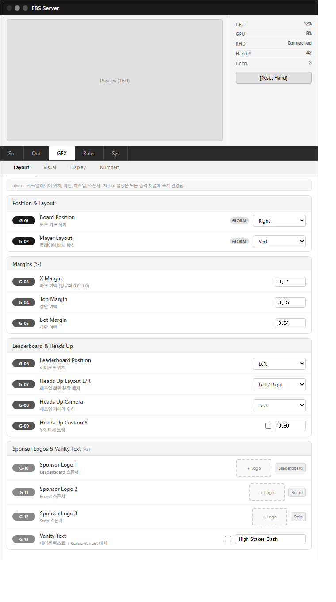

**GFX 좌표계 원칙**

| 단위 | 범위 | 사용 항목 | 해상도 변경 시 처리 |
|------|------|----------|------------------|
| 정규화 좌표 (float) | 0.0 ~ 1.0 | Margin % (G-03~G-05). 예: 0.04 = 4% | 변환 불필요 |
| 기준 픽셀 (int) | 0 ~ 1920 또는 0 ~ 1080 | Graphic Editor LTWH. Design Resolution 기준 | 스케일 팩터 자동 적용 |

**Element Catalog**

| # | 요소 | 타입 | 설명 | PGX | 우선순위 |
|:-:|------|------|------|:---:|:--------:|
| G-01 | Board Position | Dropdown | 보드 카드 위치 (Left/Right/Centre/Top) | GFX1 #2 | P0 |
| G-02 | Player Layout | Dropdown | 플레이어 배치 (Vert/Bot/Spill) | GFX1 #3 | P0 |
| G-03 | X Margin | NumberInput | 좌우 여백 (%, 기본 0.04) | GFX1 #20 | P1 |
| G-04 | Top Margin | NumberInput | 상단 여백 (%, 기본 0.05) | GFX1 #21 | P1 |
| G-05 | Bot Margin | NumberInput | 하단 여백 (%, 기본 0.04) | GFX1 #22 | P1 |
| G-06 | Leaderboard Position | Dropdown | 리더보드 위치 | GFX1 #7 | P1 |
| G-07 | Heads Up Layout L/R | Dropdown | 헤즈업 화면 분할 배치 | GFX1 #10 | P1 |
| G-08 | Heads Up Camera | Dropdown | 헤즈업 카메라 위치 | GFX1 #11 | P1 |
| G-09 | Heads Up Custom Y | Checkbox+NumberInput | Y축 미세 조정 | GFX1 #12 | P1 |
| G-10 | Sponsor Logo 1 | ImageSlot | Leaderboard 스폰서 | GFX1 #16 | P2 |
| G-11 | Sponsor Logo 2 | ImageSlot | Board 스폰서 | GFX1 #17 | P2 |
| G-12 | Sponsor Logo 3 | ImageSlot | Strip 스폰서 | GFX1 #18 | P2 |
| G-13 | Vanity Text | TextField+Checkbox | 테이블 텍스트 + Game Variant 대체 | GFX1 #19 | P2 |

#### 5.7 Visual 서브탭

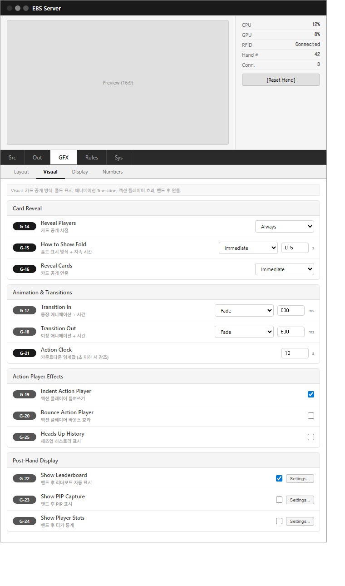

**Element Catalog**

| # | 요소 | 타입 | 설명 | PGX | 우선순위 |
|:-:|------|------|------|:---:|:--------:|
| G-14 | Reveal Players | Dropdown | 카드 공개 시점 (Always/Action On/Never) | GFX1 #4 | P0 |
| G-15 | How to Show Fold | Dropdown+NumberInput | 폴드 표시 (Immediate/Fade + 시간) | GFX1 #5 | P0 |
| G-16 | Reveal Cards | Dropdown | 카드 공개 연출 (Immediate/Animated) | GFX1 #6 | P0 |
| G-17 | Transition In | Dropdown+NumberInput | 등장 애니메이션 + 시간 | GFX1 #8 | P1 |
| G-18 | Transition Out | Dropdown+NumberInput | 퇴장 애니메이션 + 시간 | GFX1 #9 | P1 |
| G-19 | Indent Action Player | Checkbox | 액션 플레이어 들여쓰기 | GFX1 #24 | P1 |
| G-20 | Bounce Action Player | Checkbox | 액션 플레이어 바운스 | GFX1 #25 | P1 |
| G-21 | Action Clock | NumberInput | 카운트다운 임계값 (초) | GFX1 #29 | P0 |
| G-22 | Show Leaderboard | Checkbox+Settings | 핸드 후 리더보드 자동 표시 | GFX1 #26 | P1 |
| G-23 | Show PIP Capture | Checkbox+Settings | 핸드 후 PIP 표시 | GFX1 #27 | P1 |
| G-24 | Show Player Stats | Checkbox+Settings | 핸드 후 티커 통계 | GFX1 #28 | P1 |
| G-25 | Heads Up History | Checkbox | 헤즈업 히스토리 | GFX1 #23 | P1 |

#### 5.8 Display 서브탭

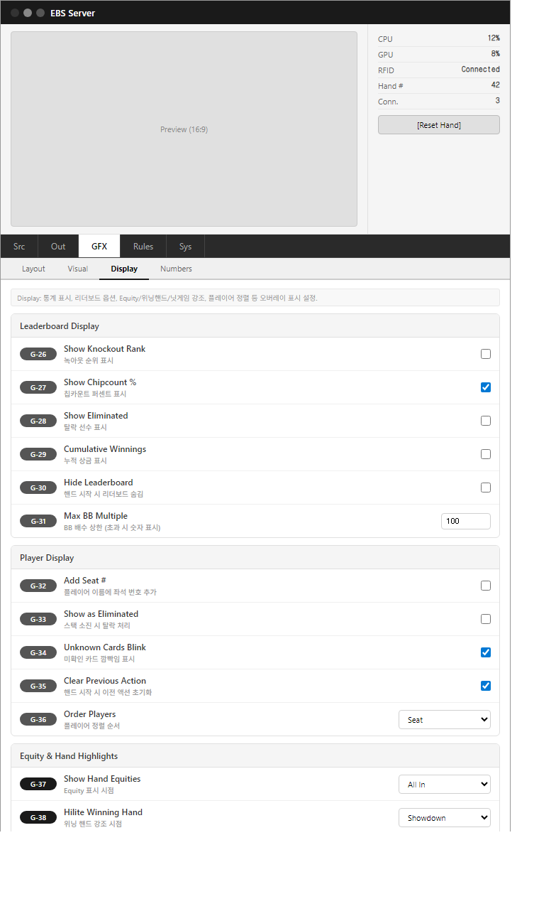

**Element Catalog**

| # | 요소 | 타입 | 설명 | PGX | 우선순위 |
|:-:|------|------|------|:---:|:--------:|
| G-26 | Show Knockout Rank | Checkbox | 녹아웃 순위 | GFX2 #2 | P1 |
| G-27 | Show Chipcount % | Checkbox | 칩카운트 퍼센트 | GFX2 #3 | P1 |
| G-28 | Show Eliminated | Checkbox | 탈락 선수 표시 | GFX2 #4 | P1 |
| G-29 | Cumulative Winnings | Checkbox | 누적 상금 | GFX2 #5 | P1 |
| G-30 | Hide Leaderboard | Checkbox | 핸드 시작 시 숨김 | GFX2 #6 | P1 |
| G-31 | Max BB Multiple | NumberInput | BB 배수 상한 | GFX2 #7 | P1 |
| G-32 | Add Seat # | Checkbox | 좌석 번호 추가 | GFX2 #12 | P1 |
| G-33 | Show as Eliminated | Checkbox | 스택 소진 시 탈락 | GFX2 #13 | P1 |
| G-34 | Unknown Cards Blink | Checkbox | 미확인 카드 깜빡임 | GFX2 #15 | P1 |
| G-35 | Clear Previous Action | Checkbox | 이전 액션 초기화 | GFX2 #17 | P1 |
| G-36 | Order Players | Dropdown | 플레이어 정렬 순서 | GFX2 #18 | P1 |
| G-37 | Show Hand Equities | Dropdown | Equity 표시 시점 | GFX2 #19 | P0 |
| G-38 | Hilite Winning Hand | Dropdown | 위닝 핸드 강조 시점 | GFX2 #20 | P0 |
| G-39 | Hilite Nit Game | Dropdown | 닛 게임 강조 조건 | GFX2 #16 | P1 |

#### 5.9 Numbers 서브탭

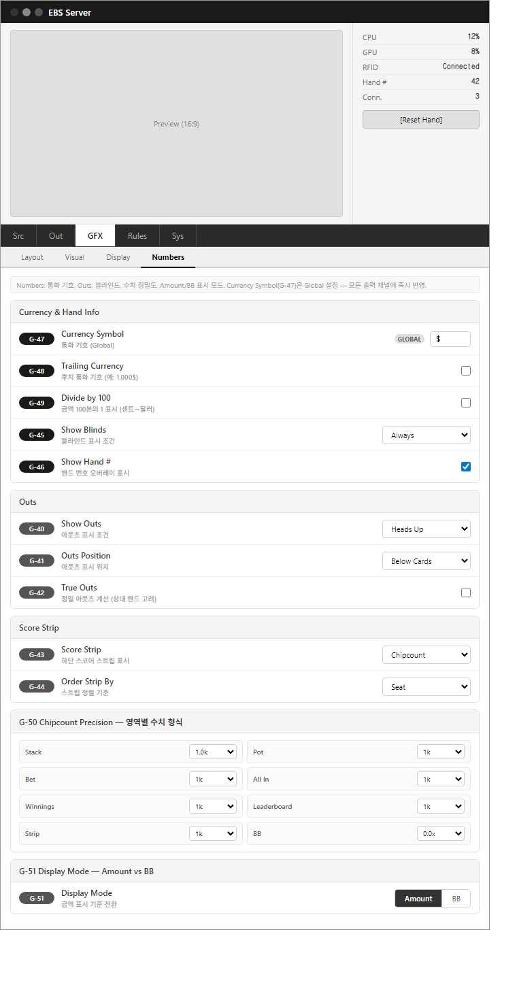

**Element Catalog**

| # | 요소 | 타입 | 설명 | PGX | 우선순위 |
|:-:|------|------|------|:---:|:--------:|
| G-40 | Show Outs | Dropdown | 아웃츠 조건 (Heads Up/All In/Always) | GFX3 #2 | P1 |
| G-41 | Outs Position | Dropdown | 아웃츠 위치 | GFX3 #3 | P1 |
| G-42 | True Outs | Checkbox | 정밀 아웃츠 계산 | GFX3 #4 | P1 |
| G-43 | Score Strip | Dropdown | 하단 스코어 스트립 | GFX3 #5 | P1 |
| G-44 | Order Strip By | Dropdown | 스트립 정렬 기준 | GFX3 #6 | P1 |
| G-45 | Show Blinds | Dropdown | 블라인드 표시 조건 | GFX3 #8 | P0 |
| G-46 | Show Hand # | Checkbox | 핸드 번호 표시 | GFX3 #9 | P0 |
| G-47 | Currency Symbol | TextField | 통화 기호 | GFX3 #10 | P0 |
| G-48 | Trailing Currency | Checkbox | 후치 통화 기호 | GFX3 #11 | P0 |
| G-49 | Divide by 100 | Checkbox | 금액 100분의 1 | GFX3 #12 | P0 |
| G-50 | Chipcount Precision | PrecisionGroup | 8개 영역별 수치 형식 | GFX3 #14-20 | P1 |
| G-51 | Display Mode | ModeGroup | Amount vs BB 전환 | GFX3 #22-23 | P1 |

#### 5.10 Interaction Patterns

| 조작 | 시스템 반응 | 영향 범위 |
|------|-----------|-----------|
| G-01 Board Position 변경 | 보드 위치 즉시 반영 | Global — 모든 출력 채널 |
| G-02 Player Layout 변경 | 플레이어 배치 즉시 반영 | Global |
| G-47 Currency Symbol 변경 | 모든 금액 표시 갱신 | Global |
| G-10~G-12 Sponsor Logo 변경 | 해당 로고만 교체 | Local — 단일 요소 |
| G-17 Transition 변경 | 다음 전환부터 적용 | Local |

**Blast Radius**:

| 범위 | 설정 예시 | 라이브 중 변경 |
|------|-----------|:-----------:|
| Global (모든 출력) | Board Position, Player Layout, Currency | 주의 필요 |
| Channel (특정 출력) | Live 설정 | 안전 |
| Local (단일 요소) | Sponsor Logo, Vanity Text | 안전 |

#### 5.11 Navigation

| 목적지 | 방법 | 조건 |
|--------|------|------|
| Skin Editor | 스킨 선택 영역 클릭 | 별도 창 열림 |
| Graphic Editor | Skin Editor > 요소 클릭 | Skin Editor 경유 |
| Rules 탭 | Ctrl+4 | 게임 규칙 확인 |

---

### 6. Rules 탭 (R-01~R-06)

#### 6.1 PokerGFX 원본: GFX 2에서 분리

PokerGFX에는 독립 Rules 탭이 없다. 게임 규칙(Bomb Pot, Straddle 등)은 GFX 2 탭의 #8~#11, #14, #21에 표시 설정과 섞여 있었다.


#### 6.2 분석: 분리 근거

| GFX 2 # | 기능명 | 성격 | EBS 배치 |
|:--------:|--------|------|----------|
| #8 | Move Button Bomb Pot | 게임 규칙 | → Rules R-01 |
| #9 | Limit Raises | 게임 규칙 | → Rules R-02 |
| #10 | Straddle Sleeper | 게임 규칙 | → Rules R-04 |
| #11 | Sleeper Final Action | 게임 규칙 | → Rules R-05 |
| #14 | Allow Rabbit Hunting | 게임 규칙 | → Rules R-03 |
| #21 | Ignore Split Pots | 계산 규칙 | → Rules R-06 |

**설계 시사점**:
- 게임 규칙은 Game Engine의 행동을 결정하고, GFX Display는 시각적 출력을 결정한다
- 변경 빈도와 영향 범위가 다르므로 독립 탭으로 분리
- 대부분 기본값으로 운영되며 특수 게임 형식에서만 변경

#### 6.3 EBS 설계

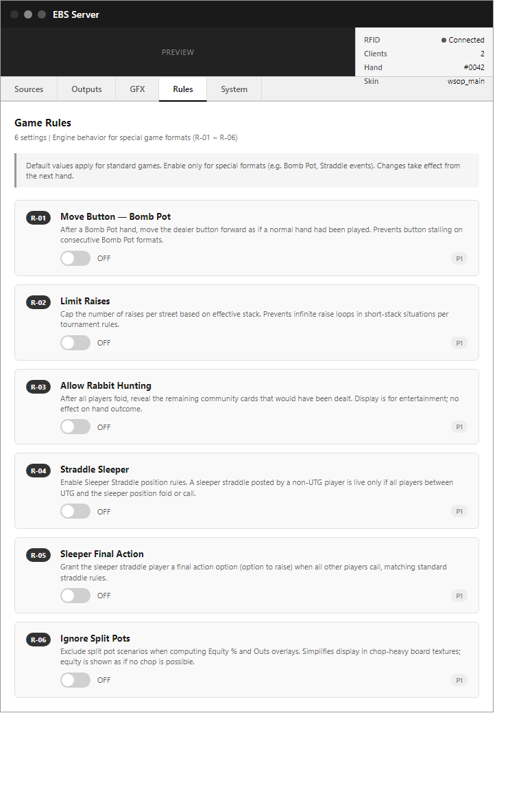

**변환 요약**: GFX 2에서 게임 규칙 6개를 추출하여 독립 탭으로 구성. 모든 요소 P1 (기본값 운영).

#### 6.4 Design Decisions

1. **GFX 2에서 분리한 이유**: 규칙은 Game Engine의 행동을 결정하고, GFX Display는 시각적 출력을 결정한다. 변경 빈도와 영향 범위가 다르므로 독립 탭으로 분리했다.

2. **모든 요소가 P1인 이유**: 대부분의 방송에서 기본값으로 운영된다. 특수 규칙은 특정 게임 형식에서만 활성화되므로 P0이 아닌 P1로 분류했다.

#### 6.5 Element Catalog

| # | 요소 | 설명 | PGX | 우선순위 |
|:-:|------|------|:---:|:--------:|
| R-01 | Move Button Bomb Pot | 봄팟 후 버튼 이동 | GFX2 #8 | P1 |
| R-02 | Limit Raises | 유효 스택 기반 레이즈 제한 | GFX2 #9 | P1 |
| R-03 | Allow Rabbit Hunting | 래빗 헌팅 허용 | GFX2 #14 | P1 |
| R-04 | Straddle Sleeper | 스트래들 위치 규칙 | GFX2 #10 | P1 |
| R-05 | Sleeper Final Action | 슬리퍼 최종 액션 | GFX2 #11 | P1 |
| R-06 | Ignore Split Pots | Equity/Outs에서 Split pot 무시 | GFX2 #21 | P1 |

#### 6.6 Navigation

| 목적지 | 방법 | 조건 |
|--------|------|------|
| GFX 탭 | Ctrl+3 | 규칙과 연동되는 표시 설정 확인 |
| Main Window | 탭 영역 외 클릭 | 설정 완료 후 |

---

### 7. System 탭 (Y-01~Y-24)

#### 7.1 PokerGFX 원본


RFID 리더, 안테나, 라이선스, 시스템 진단, 고급 설정을 관리하는 탭. 28개 UI 요소로 구성.

#### 7.2 분석

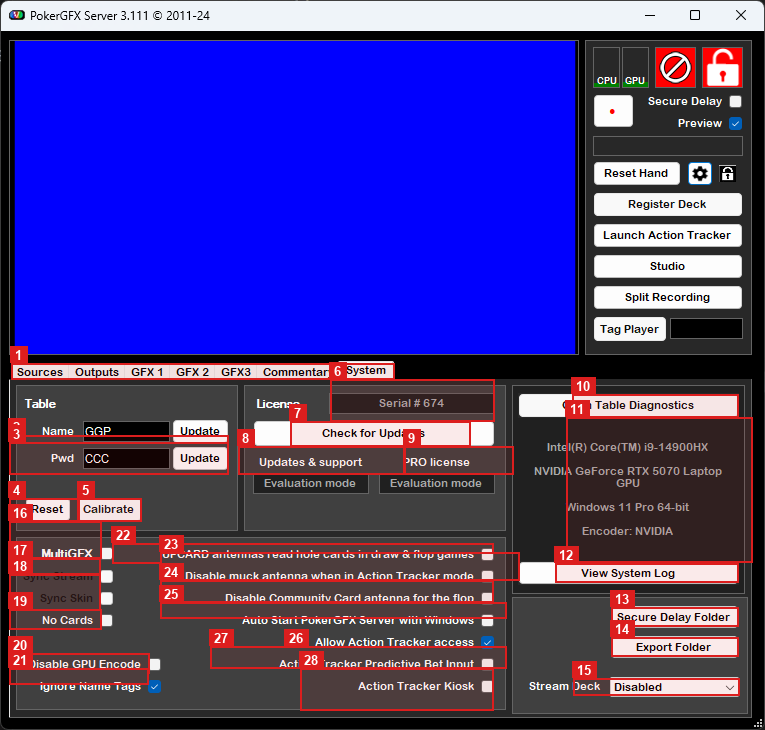

**설계 시사점**:
- RFID 안테나(22~24번)가 하단에 배치되어 있으나, 실제로는 방송 준비의 첫 번째 설정임 → EBS에서 상단 이동 (Y-03~Y-07)
- 라이선스 관련 4개(6~9번)는 EBS 자체 시스템에서 불필요 → 제거
- AT 접근 정책이 다른 설정과 혼재 → EBS에서 독립 그룹 (Y-13~Y-15)

#### 7.3 EBS 설계

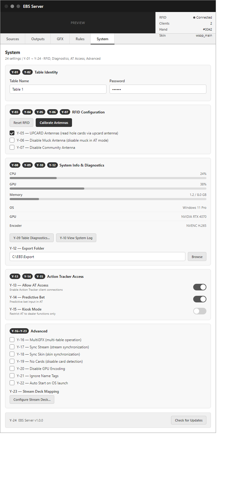

**변환 요약**: PokerGFX 28개 → EBS 24개. RFID를 상단으로 이동 (준비 첫 단계), 라이선스 4개 제거, AT 접근 정책 독립 그룹화.

#### 7.4 레이아웃

4구역: RFID(Y-03~Y-07, 상단) > AT(Y-13~Y-15) > Diagnostics(Y-08~Y-12) > Advanced(Y-16~Y-24).

#### 7.5 Design Decisions

1. **RFID 캘리브레이션이 방송 준비 첫 단계인 이유**: 캘리브레이션 없이 다른 설정을 진행하면 테스트 핸드에서 카드 오인식이 발생한다. 하드웨어 점검 → RFID 캘리브레이션을 최우선으로 배치했다.

2. **AT 접근 정책(Y-13~Y-15)이 이 탭에 있는 이유**: Action Tracker는 딜러가 사용하는 별도 장치이므로 보안 설정이 필요하다. Kiosk Mode(Y-15)는 딜러의 불필요한 기능 접근을 제한한다.

3. **Advanced 그룹(Y-16~Y-23)이 별도 섹션인 이유**: MultiGFX, Stream Deck 매핑 등은 대부분 변경하지 않는다. 자주 사용하는 RFID/Diagnostics 설정과 시각적으로 분리하여 실수를 방지한다.

#### 7.6 Workflow

RFID 리셋/캘리브레이션 → 안테나 설정 → AT 접근 정책 → 진단 확인 → 고급 설정.

#### 7.7 Element Catalog

| # | 그룹 | 요소 | 설명 | PGX | 우선순위 |
|:-:|------|------|------|:---:|:--------:|
| Y-01 | Table | Name | 테이블 식별 이름 | #2 | P1 |
| Y-02 | Table | Password | 접속 비밀번호 | #3 | P1 |
| Y-03 | RFID | Reset | RFID 시스템 초기화 | #4 | P0 |
| Y-04 | RFID | Calibrate | 안테나별 캘리브레이션 | #5 | P0 |
| Y-05 | RFID | UPCARD Antennas | UPCARD 안테나로 홀카드 읽기 | #22 | P0 |
| Y-06 | RFID | Disable Muck | AT 모드 시 muck 안테나 비활성 | #23 | P0 |
| Y-07 | RFID | Disable Community | 커뮤니티 카드 안테나 비활성 | #24 | P0 |
| Y-08 | System Info | Hardware Panel | CPU/GPU/OS/Encoder 자동 감지 | #11 | P1 |
| Y-09 | Diagnostics | Table Diagnostics | 안테나별 상태, 신호 강도 (별도 창) | #10 | P1 |
| Y-10 | Diagnostics | System Log | 로그 뷰어 | #12 | P1 |
| Y-11 | Diagnostics | Secure Delay Folder | 딜레이 녹화 폴더 | #13 | Future |
| Y-12 | Diagnostics | Export Folder | 내보내기 폴더 | #14 | P1 |
| Y-13 | AT | Allow AT Access | AT 접근 허용 | #26 | P0 |
| Y-14 | AT | Predictive Bet | 베팅 예측 입력 | #27 | P0 |
| Y-15 | AT | Kiosk Mode | AT 키오스크 모드 | #28 | P0 |
| Y-16 | Advanced | MultiGFX | 다중 테이블 운영 | #16 | P2 |
| Y-17 | Advanced | Sync Stream | 스트림 동기화 | #17 | P2 |
| Y-18 | Advanced | Sync Skin | 스킨 동기화 | #18 | P2 |
| Y-19 | Advanced | No Cards | 카드 비활성화 | #19 | P1 |
| Y-20 | Advanced | Disable GPU | GPU 인코딩 비활성화 | #20 | P1 |
| Y-21 | Advanced | Ignore Name Tags | 네임 태그 무시 | #21 | P1 |
| Y-22 | Advanced | Auto Start | OS 시작 시 자동 실행 | 신규 | P2 |
| Y-23 | Advanced | Stream Deck | Elgato Stream Deck 매핑 | #15 | P2 |
| Y-24 | Updates | Version + Check | 버전 표시 + 업데이트 | #7,#8 | P2 |

#### 7.8 Interaction Patterns

| 조작 | 시스템 반응 | 피드백 |
|------|-----------|--------|
| Y-03 Reset 클릭 | RFID 시스템 재초기화 | M-05 상태 변화 (Yellow → Green/Red) |
| Y-04 Calibrate 클릭 | 안테나별 캘리브레이션 시작 | 진행률 + 안테나별 결과 |
| Y-09 Table Diagnostics | 별도 창 열림 | 안테나 신호 강도 실시간 표시 |

#### 7.9 Navigation

| 목적지 | 방법 | 조건 |
|--------|------|------|
| Table Diagnostics | Y-09 클릭 | 별도 창 열림 |
| Main Window | 탭 영역 외 클릭 | RFID 설정 완료 후 |
| Sources 탭 | Ctrl+1 | RFID 후 비디오 설정으로 이동 |

---

### Commentary 탭 배제 근거

#### PokerGFX 원본


PokerGFX에서 Commentary 탭은 해설자 전용 정보 표시 영역을 제어한다. 8개 요소로 구성되며, 방송 화면에 해설자 이름과 관련 정보를 오버레이한다.

#### 배제 판단 근거

- 기존 프로덕션에서 Commentary 기능을 사용한 적이 없음 — 해설자 정보는 별도 그래픽 소스로 처리
- 8개 요소 전체가 P3(불필요)로 분류됨
- 기능을 복제하더라도 운영 워크플로우에 투입될 가능성이 없음
- Phase 1 복제 범위에서 제외하여 개발 리소스를 핵심 기능(P0/P1)에 집중

#### 결정

**EBS에서 완전 배제.** PokerGFX 268개 요소 중 Commentary 8개를 제거한 것이 EBS 184개로의 감축(-84)에 기여하는 첫 번째 요인이다. 향후 해설자 오버레이가 필요해질 경우 GFX-Visual 서브탭의 확장으로 대응 가능하며, 별도 탭 부활은 계획하지 않는다.

---

## Part B: 별도 앱/창

---

### 8. Skin Editor (SK-01~SK-26)

#### 8.1 PokerGFX 원본


별도 창으로 열리는 스킨 편집기. 37개 UI 요소로 구성. 스킨 정보, 요소 버튼, 텍스트/카드/플레이어/국기 설정, Import/Export 기능.

#### 8.2 분석

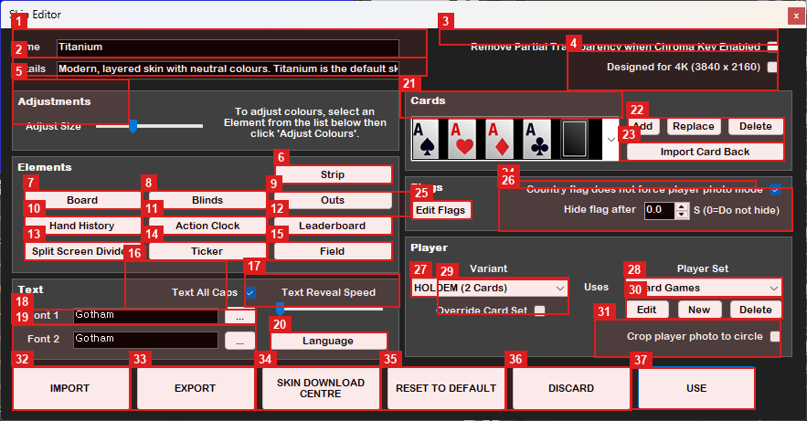

**설계 시사점**:
- 국기 관련 3개(24~26번)가 카드/플레이어 설정 사이에 끼어 흐름이 단절됨 → EBS에서 P2로 통합
- 에디터 계층(GFX → Skin → Graphic)이 자연스러운 깊이 구조를 형성 → EBS 계승
- Import/Export/Download(32~34번)는 팀 간 공유 자산 관리에 필수 → EBS 유지

#### 8.3 EBS 설계

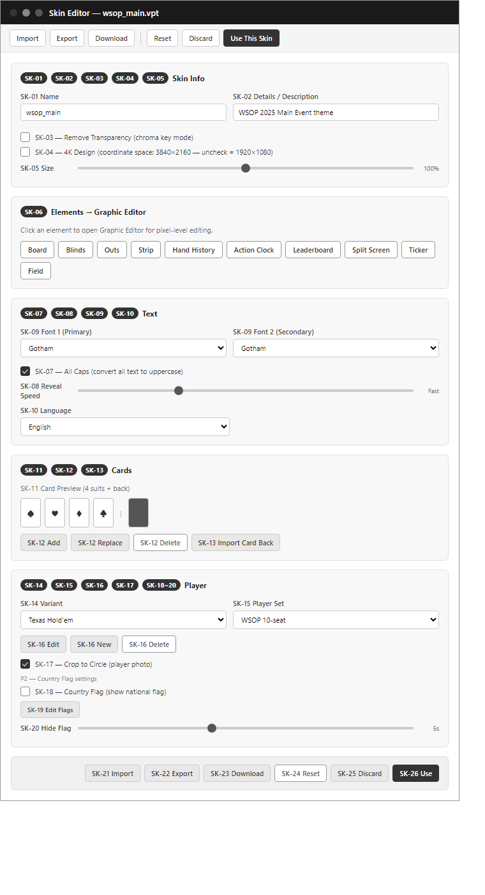

**변환 요약**: PokerGFX 37개 → EBS 26개. 국기 관련 P2 통합, 에디터 계층(GFX → Skin → Graphic) 명시, 핵심 기능 유지.

Skin(방송 그래픽 테마) 편집. 색상, 폰트, 레이아웃을 변경하고 테마를 저장/불러오기.

#### 8.4 레이아웃

4구역: Skin Preview(상단) > Element Buttons(SK-06, 중상) > Settings(SK-01~SK-20) > Actions(SK-21~SK-26, 하단).

```
+---------------------------------------------+
| Skin Name: [Titanium          ] Details: ... |
| [SK-03 Remove Transparency] [SK-04 4K Design]|
| Adjust Size: [==============================]|
+---------------------------------------------+
| Elements:                                   |
| [Board][Blinds][Outs][Strip][Hand History]  |
| [Action Clock][Leaderboard][Split Screen]   |
| [Ticker][Field]                             |
+---------------------------------------------+
| Text: [SK-07 All Caps][SK-08 Speed]         |
|   Font 1: [Gotham v] Font 2: [Gotham v]     |
|   Language: [버튼]                           |
| Cards: [Spade][Heart][Diamond][Club][Back]  |
|   [Add][Replace][Delete][Import Card Back]  |
| Player: Variant[드롭다운] Set[드롭다운]       |
|   [Edit][New][Delete] [SK-17 Crop Circle]   |
+---------------------------------------------+
| [IMPORT][EXPORT][DOWNLOAD][RESET][DISCARD][USE]|
+---------------------------------------------+
```

#### 8.5 Design Decisions

1. **에디터 계층 구조 (GFX → Skin → Graphic)**: GFX 탭은 "무엇을 어디에 표시할지" 런타임 설정. Skin Editor는 "어떤 시각적 테마로" 표현할지 정의. Graphic Editor는 "개별 요소를 픽셀 단위로" 편집. 변경 빈도에 따라 분리: GFX는 방송마다, Skin은 시즌마다, Graphic은 디자인 변경 시에만.

2. **별도 창인 이유**: Skin 편집은 실시간 프리뷰가 필수이며 작업 시간이 길다. 메인 윈도우의 Preview와 독립적으로 프리뷰를 제공한다.

3. **Import/Export/Download(SK-21~SK-23) 분리**: 스킨은 팀 간 공유 자산이다. 파일 기반 교환과 온라인 리포지토리 다운로드를 지원한다.

4. **SK-04 4K Design이 체크박스인 이유**: 스킨은 특정 해상도를 기준으로 제작된다. 이 플래그는 "이 스킨의 원본 좌표계가 무엇인지"를 선언한다. 런타임에 출력 해상도(O-01)와 스킨 기준 해상도(SK-04)가 다르면 스케일 변환이 자동 적용된다. 업스케일(1080p 스킨 → 4K 출력)은 품질 저하 가능성이 있으므로 경고를 표시한다.

#### 8.6 Workflow

```
  스킨 정보(SK-01~05)
       |
       v
  요소 편집(SK-06) --> Graphic Editor 열기
       |
       v
  텍스트/카드(SK-07~13) --> 플레이어(SK-14~20)
       |
       v
  저장/적용(SK-21~26)
```

#### 8.7 Element Catalog

| # | 그룹 | 요소 | 설명 | PGX | 우선순위 |
|:-:|------|------|------|:---:|:--------:|
| SK-01 | Info | Name | 스킨 이름 | #1 | P1 |
| SK-02 | Info | Details | 설명 텍스트 | #2 | P1 |
| SK-03 | Info | Remove Transparency | 크로마키 투명도 제거 | #3 | P1 |
| SK-04 | Info | 4K Design | 이 스킨이 4K(3840x2160) 기준으로 디자인되었음을 선언. 체크 시 Graphic Editor 기준 좌표계 3840x2160으로 전환. 미체크(기본): 1920x1080. O-01과 SK-04 불일치 시 경고 표시. | #4 | P1 |
| SK-05 | Info | Adjust Size | 크기 슬라이더 | #5 | P2 |
| SK-06 | Elements | 10 Buttons | Strip~Field 각 요소 → Graphic Editor | #6-15 | P1 |
| SK-07 | Text | All Caps | 대문자 변환 | #16 | P1 |
| SK-08 | Text | Reveal Speed | 텍스트 등장 속도 | #17 | P1 |
| SK-09 | Text | Font 1/2 | 1차/2차 폰트 | #18,19 | P1 |
| SK-10 | Text | Language | 다국어 설정 | #20 | P1 |
| SK-11 | Cards | Card Preview | 4수트 + 뒷면 미리보기 | #21 | P1 |
| SK-12 | Cards | Add/Replace/Delete | 카드 이미지 관리 | #22 | P1 |
| SK-13 | Cards | Import Card Back | 뒷면 이미지 | #23 | P1 |
| SK-14 | Player | Variant | 게임 타입 선택 | #27 | P1 |
| SK-15 | Player | Player Set | 게임별 세트 | #28 | P1 |
| SK-16 | Player | Edit/New/Delete | 세트 관리 | #30 | P1 |
| SK-17 | Player | Crop to Circle | 원형 크롭 | #31 | P1 |
| SK-18 | Player | Country Flag | 국기 모드 | #24 | P2 |
| SK-19 | Player | Edit Flags | 국기 이미지 편집 | #25 | P2 |
| SK-20 | Player | Hide Flag After | 자동 숨김 (초) | #26 | P2 |
| SK-21 | Actions | Import | 스킨 가져오기 | #32 | P1 |
| SK-22 | Actions | Export | 스킨 내보내기 | #33 | P1 |
| SK-23 | Actions | Download | 온라인 다운로드 | #34 | P2 |
| SK-24 | Actions | Reset | 기본 초기화 | #35 | P1 |
| SK-25 | Actions | Discard | 변경 취소 | #36 | P1 |
| SK-26 | Actions | Use | 현재 적용 | #37 | P1 |

#### 8.8 Navigation

| 목적지 | 방법 | 조건 |
|--------|------|------|
| Graphic Editor | SK-06 요소 버튼 클릭 | 별도 창 열림 |
| GFX 탭 | 창 닫기 | SK-26 Use 후 |

---

### 9. Graphic Editor (GE-01~GE-18)

#### 9.1 PokerGFX 원본

PokerGFX의 Graphic Editor는 Board 모드(39개)와 Player 모드(48개)로 분리되어 있었다. 공통 기능(Position, Animation, Text, Background)이 60% 이상 중복.

**Board 모드** (39개 요소)


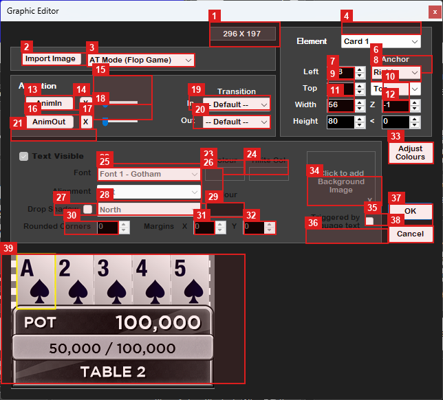

**Player 모드** (48개 요소)


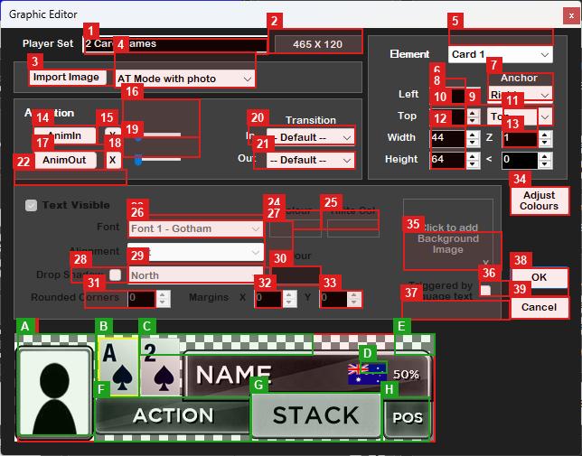

#### 9.2 분석

**설계 시사점**:
- Board(39개) + Player(48개) = 87개 요소 중 공통 기능이 60% 이상 중복됨
- Position(LTWH), Animation In/Out, Text, Background는 동일한 조작 패턴
- 두 에디터를 분리할 이유가 기능적으로 없음 → 단일 에디터 + 모드 전환으로 통합

#### 9.3 EBS 설계

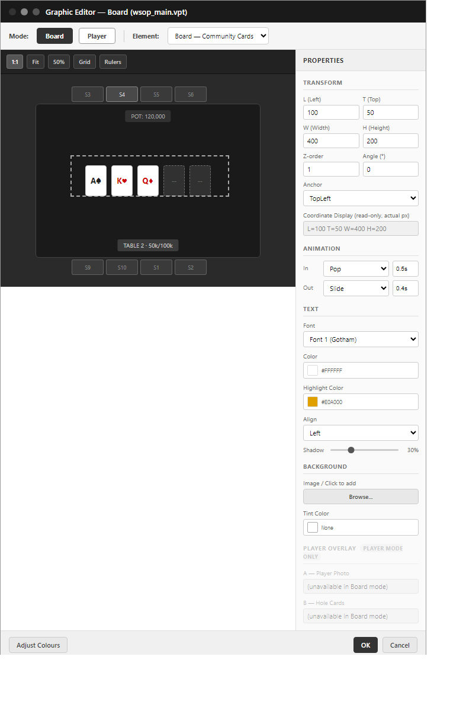

**변환 요약**: PokerGFX 87개(Board 39 + Player 48) → EBS 18개(공통 10 + Player 전용 8). Board/Player 단일 에디터로 통합, 동일한 조작 패턴 유지하면서 대상만 전환.

Skin Editor에서 선택한 특정 요소(Board, Player, Card 등)의 위치, 크기, 색상, 효과를 픽셀 단위로 편집.

#### 9.4 레이아웃

```
+---------------------------+--------------------+
| AT Mode: [드롭다운]        | Element: [드롭다운] |
|                           |--------------------|
|                           | Transform:         |
|   WYSIWYG 프리뷰           |  L: [100] T: [50]  |
|   (실시간 반영)             |  W: [400] H: [200] |
|                           |  Z: [1] Angle: [0] |
|   [Board Mode] [Player]   |  Anchor: [TopLeft] |
|                           |--------------------|
|   Card 1~5 + POT          | Animation:         |
|   50k/100k 블라인드        |  In:  [Pop] [0.5s] |
|   TABLE 2                 |  Out: [Slide][0.4s]|
|                           |--------------------|
|                           | Text:              |
|                           |  Font: [Font1]     |
|                           |  Color: [#FFF]     |
|                           |  Align: [Left]     |
|                           |--------------------|
|                           | Background:        |
|                           |  [Click to add]    |
+---------------------------+--------------------+
| [Adjust Colours]     [OK]             [Cancel] |
+------------------------------------------------+
```

#### 9.5 Design Decisions

1. **Board/Player 듀얼 모드인 이유**: 보드 영역과 플레이어 영역은 레이아웃 요소가 완전히 다르다. 모드 전환으로 동일한 조작 패턴(Position, Animation, Text)을 유지하면서 대상만 바꾼다.

2. **Skin Editor에서만 접근 가능한 이유**: GFX → Skin Editor → Graphic Editor 순서로 진입 깊이가 깊어지면서 실수로 픽셀 수준 편집에 접근하는 것을 방지한다. "변경 빈도가 낮을수록 접근이 깊다."

#### 9.6 Element Catalog

**Board/공통 편집 기능 (10개)**

| 기능 | 설명 |
|------|------|
| Element 선택 | 드롭다운으로 편집 대상 선택 |
| Position (LTWH) | Left/Top/Width/Height. Design Resolution(SK-04에 따라 1920x1080 또는 3840x2160) 기준 픽셀 정수값. 출력 해상도 변경 시 스케일 팩터 자동 적용. |
| Anchor | 해상도 변경 시 요소의 기준점. TopLeft/TopRight/BottomLeft/BottomRight/Center/TopCenter/BottomCenter. 기본값: TopLeft. |
| Coordinate Display | 현재 출력 해상도 기준 실제 픽셀값 미리보기 (읽기 전용). 예: 1920x1080 L=100 → 4K 출력 시 실제 L=200 표시. |
| Z-order | 레이어 겹침 순서 |
| Angle | 요소 회전 |
| Animation In/Out | 등장/퇴장 + 속도 슬라이더 |
| Transition | Default/Pop/Expand/Slide |
| Text | 폰트, 색상, 강조색, 정렬, 그림자 |
| Background Image | 요소 배경 |

**Player Overlay 요소 (8개)**

| 코드 | 요소 | 설명 | 우선순위 |
|:----:|------|------|:--------:|
| A | Player Photo | 프로필 이미지 | P1 |
| B | Hole Cards | 홀카드 2~5장 | P0 |
| C | Name | 플레이어 이름 | P0 |
| D | Country Flag | 국적 국기 | P2 |
| E | Equity % | 승률 | P0 |
| F | Action | 최근 액션 | P0 |
| G | Stack | 칩 스택 | P0 |
| H | Position | 포지션 (D/SB/BB) | P0 |

#### 9.7 Navigation

| 목적지 | 방법 | 조건 |
|--------|------|------|
| Skin Editor | 창 닫기 | 편집 완료 후 |

---

### 10. Action Tracker (별도 앱)

Action Tracker는 GfxServer와는 별도의 독립 앱으로, **본방송 중 운영자 주의력의 85%**를 차지한다.

#### 10.1 AT의 역할

실시간 게임 진행 입력 장치. 베팅 금액, New Hand, Showdown 등 모든 액션을 이 앱에서 입력한다. 별도 태블릿 또는 터치스크린에서 운영하며, 딜러 또는 전담 운영자가 사용한다. GfxServer와 TCP :8888 연결로 실시간 액션을 전송한다.

#### 10.2 화면 구성

```
+----------------------------------------------+
| Server: 192.168.1.100  [Connected] Lat: 2ms  |
+----------------------------------------------+
|   S1         S2          S3         S4        |
| [NAME]     [NAME]      [NAME]     [NAME]      |
| A-K        J-Q         9-10       2-7         |
| $50,000    $32,000     $18,000    $12,000     |
|                                               |
|   S5         S6          S7         S8        |
| (계속)                                        |
+----------------------------------------------+
|   [Community: A  K  Q  --  --  ]             |
|   POT: $120,000  SIDE: $40,000               |
+----------------------------------------------+
| [FOLD] [CHECK/CALL] [BET/RAISE] [ALL-IN]     |
+----------------------------------------------+
| [HIDE GFX] [TAG] [CHOP] [RUN 2x] [UNDO]     |
+----------------------------------------------+
```

**구성 영역**:
- **상단**: 연결 상태 (서버 IP, 연결 여부, 지연 시간)
- **좌석 그리드**: 10인 좌석 — 각 좌석에 이름, 스택, 카드 상태, 현재 액션 표시
- **보드 카드**: 5장 카드 슬롯 (Flop 3 + Turn + River)
- **팟 표시**: 현재 메인 팟 + 사이드 팟
- **하단 액션 버튼**: FOLD, CHECK, CALL, BET, RAISE, ALL-IN
- **특수 컨트롤**: HIDE GFX, TAG, CHOP, RUN IT 2x, MISS DEAL, UNDO

#### 10.3 액션 입력 흐름

| 단계 | 동작 | 담당 |
|------|------|------|
| 1. New Hand | New Hand 버튼 터치 → 핸드 번호 할당, 블라인드 차감 | 운영자 |
| 2. 카드 딜 | RFID 자동 인식. 실패 시 수동 입력 모드 | RFID 자동 |
| 3. 프리플롭 | 각 플레이어 순서대로 Fold/Check/Call/Bet/Raise/All-In 입력 | 운영자 |
| 4. 플롭 | 보드 카드 3장 RFID 인식 → 승률 재계산 | RFID 자동 |
| 5. 턴/리버 | 보드 카드 추가 | RFID 자동 |
| 6. 쇼다운 | Showdown 버튼 → 핸드 평가 → 승자 결정 | 운영자 |

**핸드 진행 상태별 버튼 활성화**:

| 상태 | 활성 버튼 | 비활성 버튼 |
|------|----------|-----------|
| New Hand 대기 | New Hand | 모든 액션 |
| 카드 딜 중 | (자동) | — |
| 베팅 라운드 | Fold, Check/Call, Bet/Raise, All-in | New Hand |
| Showdown | Show, Muck | 베팅 액션 |

**특수 상황 처리**:

| 상황 | 버튼 | 동작 |
|------|------|------|
| 오버레이 숨기기 | HIDE GFX | 방송 화면에서 모든 GFX 일시 제거 |
| 중요 핸드 표시 | TAG HAND | 현재 핸드에 태그 추가 |
| 팟 분배 | CHOP | 팟을 여러 플레이어에게 분할 |
| 더블 런아웃 | RUN IT 2x | 두 번째 보드 생성 |
| 미스딜 | MISS DEAL | 현재 핸드 무효화, 카드 재분배 |
| 되돌리기 | UNDO | 마지막 액션 취소 (최대 5단계) |
| 스택 수정 | ADJUST STACK | 특정 플레이어 칩 수동 변경 |

#### 10.4 GfxServer와의 상호작용 지점

| GfxServer 요소 | AT와의 관계 |
|---------------|------------|
| M-14 Launch AT | AT 앱 실행 (F8) |
| M-18 Connection Status | AT 연결 상태 표시 |
| Y-13 Allow AT Access | AT 접근 허용 정책 |
| Y-14 Predictive Bet | 베팅 예측 입력 활성화 |
| Y-15 Kiosk Mode | AT 키오스크 모드 설정 |

---

## Part C: 공통 시스템

---

### 11. Viewer Overlay

#### 11.1 오버레이 구성 요소

방송 시청자가 보는 화면에 겹쳐지는 그래픽 요소. GPU에서 실시간 렌더링되어 비디오 소스 위에 합성된다.

| 요소 | 설명 |
|------|------|
| **플레이어 박스** | 홀카드, 이름, 스택, 액션, Equity, 포지션, 국기 |
| **보드 카드** | 커뮤니티 카드 5장 (Flop 3 + Turn + River) |
| **팟 표시** | 메인 팟 + 사이드 팟 |
| **블라인드/핸드 번호** | SB/BB 금액, 현재 핸드 번호 |
| **리더보드** | 칩카운트 순위, 탈락자 표시 |
| **스트립** | 하단 플레이어 요약 바 |
| **액션 클락** | 플레이어 의사결정 시간 제한 |
| **스코어 스트립** | 상/하단 스코어 바 |
| **티커** | 뉴스/정보 스크롤 텍스트 |
| **스폰서 로고** | Leaderboard/Board/Strip 위치 |
| **Lower Third** | 하단 자막 (이벤트명, 바니티) |

#### 11.2 오버레이 해부도

```
+----------------------------------------------+
| [이벤트명/로고]       [블라인드] [Hand #47]    |
+----------------------------------------------+
| [S1 Player]  [S2 Player]  [S3 Player]         |
|  A-K 50%     J-Q 35%      9-10 15%           |
+----------------------------------------------+
|       [Flop: A  K  Q] [Turn: J] [River: -]   |
|               POT: $120,000                  |
|               SB: 1,000 / BB: 2,000          |
+----------------------------------------------+
| [S4 Player]  [S5 Player]  [S6 Player]         |
+----------------------------------------------+
| [스트립: Name  Chips  %  ||  Name  Chips  %] |
+----------------------------------------------+
```

**정보 계층 설계**:

| 계층 | 요소 | 시선 우선순위 |
|------|------|:--------:|
| **1차** (즉시 인지) | 플레이어 홀카드, 승률 | 가장 높음 |
| **2차** (맥락 파악) | 팟 사이즈, 베팅 액션, 보드 카드 | 중간 |
| **3차** (참고 정보) | 이벤트명, 블라인드, 핸드 번호, 로고 | 낮음 |

1차 정보는 크고 밝게, 3차 정보는 작고 투명하게 표시한다.

#### 11.3 오버레이 요소별 표시 조건

| 요소 | 위치 | 정보 계층 | 표시 조건 |
|------|------|:--------:|----------|
| 플레이어 홀카드 | 각 플레이어 근처 | 1차 | Live Canvas (Trustless Mode에서 관리) |
| 승률 | 홀카드 옆 | 1차 | 2인 이상 활성 |
| 팟 사이즈 | 보드 상단 | 2차 | 항상 |
| 베팅 액션 | 현재 플레이어 | 2차 | 액션 발생 시 |
| 보드 카드 | 화면 중앙 | 2차 | Flop 이후 |
| 플레이어 이름/칩 | 각 플레이어 하단 | 2차 | 항상 |
| 이벤트명/블라인드 | 상단 | 3차 | 항상 |
| 로고 | 상단/하단 코너 | 3차 | 항상 |

> **Dual Canvas 벤치마크**: PokerGFX의 Venue Canvas / Broadcast Canvas 개념은 EBS v1에서 제외한다. EBS v1은 Live Canvas 단일 구조로 구현하며, Trustless Mode로 홀카드 노출을 관리한다. Delayed Canvas(시간 지연 후 홀카드 공개)는 추후 개발.

#### 11.4 게임 상태별 화면 변화

| 상태 | 오버레이 변화 |
|------|-------------|
| **Pre-Flop** | 홀카드 표시, 초기 승률, "PRE-FLOP" 인디케이터 |
| **Flop** | 보드 카드 3장 등장 애니메이션, 승률 재계산, 팟 갱신 |
| **Turn/River** | 보드 카드 추가, 승률 변동, 큰 베팅 시 강조 |
| **All-in** | 승률 바 확대 표시, 남은 카드 자동 전개 옵션 |
| **Showdown** | 홀카드 전체 공개, 승자 하이라이트 애니메이션 |

---

### 12. 시스템 상태 UI

#### 12.1 GfxServer 모니터링 대시보드

본방송이 시작되면 GfxServer는 "설정 도구"에서 "모니터링 대시보드"로 전환된다. 운영자 주의력의 15%만 할당되므로, 문제 발생 시에만 시선을 끌어야 한다.

```
+--------------------------------------------+
|  [Preview Panel]    | RFID: [12개 그리드]   |
|                     |  1:G 2:G 3:G 4:G     |
|  GFX 오버레이       |  5:G 6:G 7:Y 8:G     |
|  실시간 렌더링       |  9:G 10:G 11:G 12:G  |
|                     |----------------------|
|                     | CPU: [===] 45%       |
|                     | GPU: [====] 62%      |
|                     | FPS: 60              |
|                     |----------------------|
|                     | [에러 없음]           |
+--------------------------------------------+
```

**모니터링 요소**:
- **RFID 상태 그리드**: 12대 리더 실시간 상태. 정상(녹색), 경고(노란색), 장애(빨간색)
- **시스템 메트릭**: CPU, GPU, Memory, FPS. 임계치 초과 시 경고
- **에러 로그**: 최근 에러만 표시, 심각도별 색상 구분

**알림 우선순위**:

| 우선순위 | 상태 | 피드백 방식 |
|:-------:|------|-----------|
| 1 | **긴급 에러** (서버 크래시, GPU 과부하) | 전체 화면 모달 + 경고음 |
| 2 | **복구 가능 에러** (RFID 실패, 네트워크 끊김) | 해당 영역 빨간색 + 카운트다운 |
| 3 | **경고** (FPS 저하, 카드 중복) | 노란색 배너 |
| 4 | **로딩** (Skin 로딩, RFID 초기화) | 회전 스피너 |
| 5 | **정보** (게임 상태 변경, 핸드 종료) | 상태바 텍스트 변경 |

정상 상태에서는 아무 알림도 표시되지 않아야 한다.

#### 12.2 에러 상태

방송 중 발생 가능한 에러와 UI 피드백. 모든 에러는 복구 가능해야 하며, 방송을 중단시키지 않는다.

| 에러 유형 | 시각적 표시 | 자동 복구 | 수동 개입 | Feature ID |
|----------|-----------|----------|----------|-----------|
| **RFID 인식 실패** | M-05 RFID 상태 그리드 빨간색, 5초 카운트다운 | 5초 재시도 | 재시도 실패 시 수동 카드 입력 창 자동 표시 | Y-01, M-05 |
| **네트워크 끊김** | M-18 클라이언트 목록 접속 상태 회색, 재연결 아이콘 회전 | 30초 자동 재연결 | "수동 재연결" 버튼 활성화 | M-18 |
| **잘못된 카드** | AT 해당 좌석 셀 빨간 테두리, "WRONG CARD" 경고 | — | 카드 제거 후 올바른 카드 재입력 | Y-01 |
| **서버 크래시** | 서버 전체 다운, 자동 재시작 | GAME_SAVE 자동 복원 | 복원 실패 시 마지막 핸드 수동 재입력 | M-13 |
| **GPU 과부하** | FPS 그래프 빨간색 (30fps 이하), 경고음 | — | 비디오 소스 해상도 낮춤 또는 GFX 요소 숨김 | M-04 |

**에러 로그 표시**: Main 탭 하단에 최근 5개 에러만 표시. 심각도별 색상 구분 (빨강=긴급, 노랑=경고, 회색=정보).

#### 12.3 로딩 상태

| 로딩 단계 | 예상 시간 | UI 표시 | Feature ID |
|----------|:--------:|---------|-----------|
| **서버 시작** | 3~5초 | 스플래시 화면, "Checking License..." → "Initializing..." | Y-02 |
| **RFID 초기화** | 2~4초 | "Connecting RFID Readers... (0/12)" 프로그레스 바 | Y-01 |
| **Skin 로딩** | 1~3초 | "Loading Skin: [파일명]..." 스피너 | G-01 |
| **비디오 소스 검색** | 2~5초 | "Scanning NDI Sources..." 회전 아이콘 | S-01 |
| **테스트 스캔** | 0.2초 | "Test Card Recognition..." → "200ms OK" 또는 "FAIL" | Y-04 |
| **상태 복원** | 1~2초 | "Restoring Game State... Hand #[번호]" 프로그레스 바 | M-13 |

예상 로딩 시간이 1초 이상인 경우에만 프로그레스 인디케이터를 표시한다.

#### 12.4 비활성 상태

| 조건 | 비활성 요소 | 시각적 표시 | 이유 |
|------|-----------|-----------|------|
| **게임 진행 중** | 게임 시작 버튼 | 회색 처리, "게임 진행 중" 툴팁 | 중복 시작 방지 |
| **자동 모드 활성** | 수동 카드 입력 섹션 | 회색 처리, "Auto Mode ON" 배너 | RFID 우선 정책 |
| **Trustless Mode ON** | "Show Hole Cards" | 회색 처리, 체크 불가 | 보안 정책 강제 |
| **에디터 빈 캔버스** | Properties 패널 전체 | 회색 처리, "No Element Selected" | 선택된 요소 없음 |
| **클라이언트 미연결** | AT 전송 버튼 | 회색 처리, "No Client Connected" | 전송 대상 없음 |
| **RFID 리더 오프라인** | Auto 모드 라디오 버튼 | 회색 처리, "RFID Offline" 경고 | 하드웨어 장애 |
| **AT All-in 상태** | RAISE 버튼 | 회색 처리, 터치 무반응 | 게임 규칙 위반 |

**비활성 vs 숨김**: "이 기능이 존재하지만 지금은 사용 불가"이면 비활성 표시. "이 모드에서는 아예 존재하지 않는 기능"이면 숨김 처리.

#### 12.5 예외 처리 흐름

본방송 중 발생할 수 있는 예외 상황과 복구 경로.

```
  +------------------+
  |   정상 진행       |<---------+--------+--------+--------+
  +---+-----------+--+          |        |        |        |
      |           |             |        |        |        |
      v           v             |        |        |        |
  [RFID 실패]  [네트워크 끊김]   |        |        |        |
  5초 대기      자동 재연결      |        |        |        |
      |         (30초)          |        |        |        |
      v           v             |        |        |        |
  자동 재시도   성공→복귀       |        |        |        |
      |         실패→수동 재연결→+        |        |        |
  성공→복귀→---+                         |        |        |
  실패→수동 카드 입력→------------------+        |        |
                                               |        |
  [잘못된 카드]  카드 제거+재입력→-----------+        |
                                                        |
  [서버 크래시]  자동 재시작+저장점 복원→----------+
                 실패→수동 재입력→-----------+
```

모든 예외 경로는 "정상 진행"으로 복귀한다. 방송 중단 없는 설계가 원칙이다.

---

## 부록 A: UI 요소 전체 집계

**구현 우선순위 정의**:

| 우선순위 | 정의 | 기준 |
|:--------:|------|------|
| **P0** | 필수 | 없으면 방송이 불가능한 핵심 기능. MVP에 반드시 포함 |
| **P1** | 중요 | 방송은 가능하나 운영 효율/품질에 영향. 초기 배포 후 순차 추가 |
| **P2** | 부가 | 확장성, 편의성, 고급 기능. 시스템 안정화 후 추가 |
| **Future** | 추후 개발 | Dual Canvas/Delay 파이프라인 구현 시 추가 |

| 화면 | 요소 수 | P0 | P1 | P2 | Future |
|------|:-------:|:--:|:--:|:--:|:------:|
| Main Window | 20 | 11 | 7 | 2 | 2 |
| Sources 탭 | 19 | 6 | 13 | 0 | 0 |
| Outputs 탭 | 20 | 8 | 4 | 8 | 4 |
| GFX - Layout | 13 | 2 | 8 | 3 | 0 |
| GFX - Visual | 12 | 4 | 8 | 0 | 0 |
| GFX - Display | 14 | 2 | 12 | 0 | 0 |
| GFX - Numbers | 12 | 5 | 7 | 0 | 0 |
| Rules 탭 | 6 | 0 | 6 | 0 | 0 |
| System 탭 | 24 | 7 | 11 | 6 | 1 |
| Skin Editor | 26 | 0 | 21 | 5 | 0 |
| Graphic Editor | 18 | 6 | 11 | 1 | 0 |
| **합계** | **184** | **51** | **108** | **25** | **7** |

---

## 부록 B: 전역 단축키

| 단축키 | 동작 | 맥락 |
|--------|------|------|
| `F5` | Reset Hand | 메인 |
| `F7` | Register Deck | 메인 |
| `F8` | Launch AT | 메인 |
| `F11` | Preview 전체 화면 | 메인 |
| `Ctrl+L` | Lock 토글 | 전역 |
| `Ctrl+D` | Secure Delay 토글 (추후 개발) | 전역 |
| `Ctrl+1` | Sources 탭 | 전역 |
| `Ctrl+2` | Outputs 탭 | 전역 |
| `Ctrl+3` | GFX 탭 | 전역 |
| `Ctrl+4` | Rules 탭 | 전역 |
| `Ctrl+5` | System 탭 | 전역 |
| `Ctrl+S` | 설정 저장 | 전역 |

---

## 부록 C: 이미지 경로 목록

**스크린샷** (참조용):

| 스크린샷 | 대응 탭 | 경로 |
|---------|--------|------|
| 180624 | System | `images/prd/screenshots/스크린샷 2026-02-05 180624.png` |
| 180630 | Main Window | `images/prd/screenshots/스크린샷 2026-02-05 180630.png` |
| 180637 | Sources | `images/prd/screenshots/스크린샷 2026-02-05 180637.png` |
| 180645 | Outputs | `images/prd/screenshots/스크린샷 2026-02-05 180645.png` |
| 180649 | GFX1 | `images/prd/screenshots/스크린샷 2026-02-05 180649.png` |
| 180652 | GFX2 | `images/prd/screenshots/스크린샷 2026-02-05 180652.png` |
| 180655 | GFX3 | `images/prd/screenshots/스크린샷 2026-02-05 180655.png` |
| 180659 | Commentary | `images/prd/screenshots/스크린샷 2026-02-05 180659.png` |
| 180715 | Skin Editor | `images/prd/screenshots/스크린샷 2026-02-05 180715.png` |
| 180720 | GE Board | `images/prd/screenshots/스크린샷 2026-02-05 180720.png` |
| 180728 | GE Player | `images/prd/screenshots/스크린샷 2026-02-05 180728.png` |

**어노테이션 이미지**:

| 이미지 | 경로 |
|--------|------|
| Main Window | `images/prd/annotated/01-main-window.png` |
| Sources 탭 | `images/prd/annotated/02-sources-tab.png` |
| Outputs 탭 | `images/prd/annotated/03-outputs-tab.png` |
| GFX1 탭 | `images/prd/annotated/04-gfx1-tab.png` |
| GFX2 탭 | `images/prd/annotated/05-gfx2-tab.png` |
| GFX3 탭 | `images/prd/annotated/06-gfx3-tab.png` |
| Commentary 탭 | `images/prd/annotated/07-commentary-tab.png` |
| System 탭 | `images/prd/annotated/08-system-tab.png` |
| Skin Editor | `images/prd/annotated/09-skin-editor.png` |
| GE Board | `images/prd/annotated/10-graphic-editor-board.png` |
| GE Player | `images/prd/annotated/11-graphic-editor-player.png` |

**EBS 목업**:

| 이미지 | 경로 |
|--------|------|
| Main Window | `images/prd/mockups/ebs-main.png` |
| Sources 탭 | `images/prd/mockups/ebs-sources.png` |
| Outputs 탭 | `images/prd/mockups/ebs-outputs.png` |
| GFX Layout | `images/prd/mockups/ebs-gfx-layout.png` |
| GFX Visual | `images/prd/mockups/ebs-gfx-visual.png` |
| GFX Display | `images/prd/mockups/ebs-gfx-display.png` |
| GFX Numbers | `images/prd/mockups/ebs-gfx-numbers.png` |
| Rules 탭 | `images/prd/mockups/ebs-rules.png` |
| System 탭 | `images/prd/mockups/ebs-system.png` |
| Skin Editor | `images/prd/mockups/ebs-skin-editor.png` |
| Graphic Editor | `images/prd/mockups/ebs-graphic-editor.png` |
| Action Tracker | `images/prd/ui-live-action-tracker.png` |

---

**Version**: 1.0.0 | **Updated**: 2026-02-19
