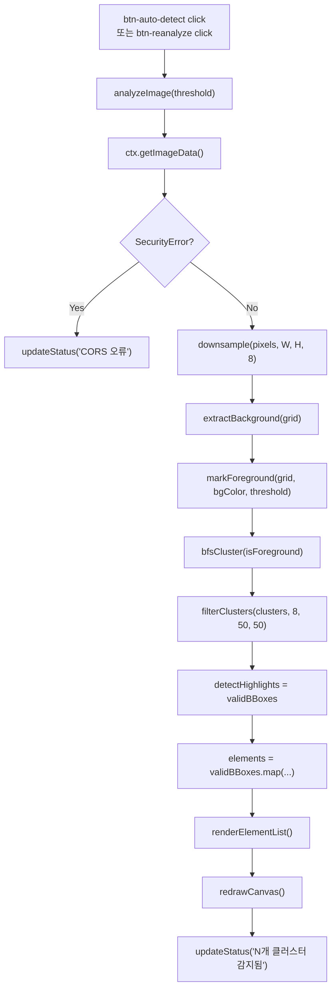
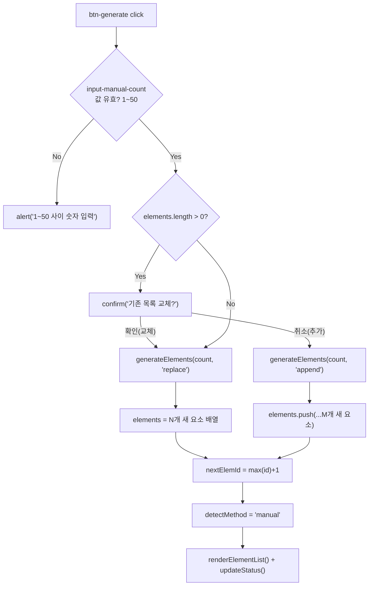
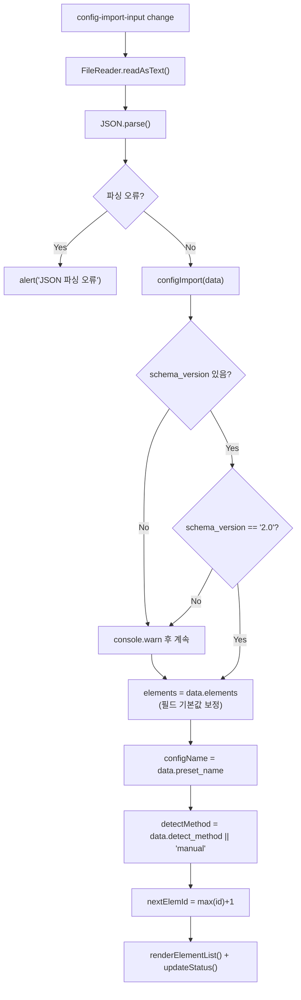
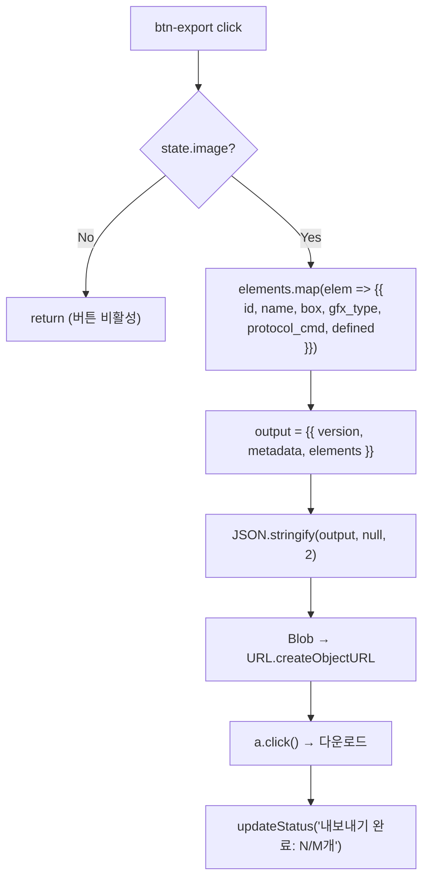
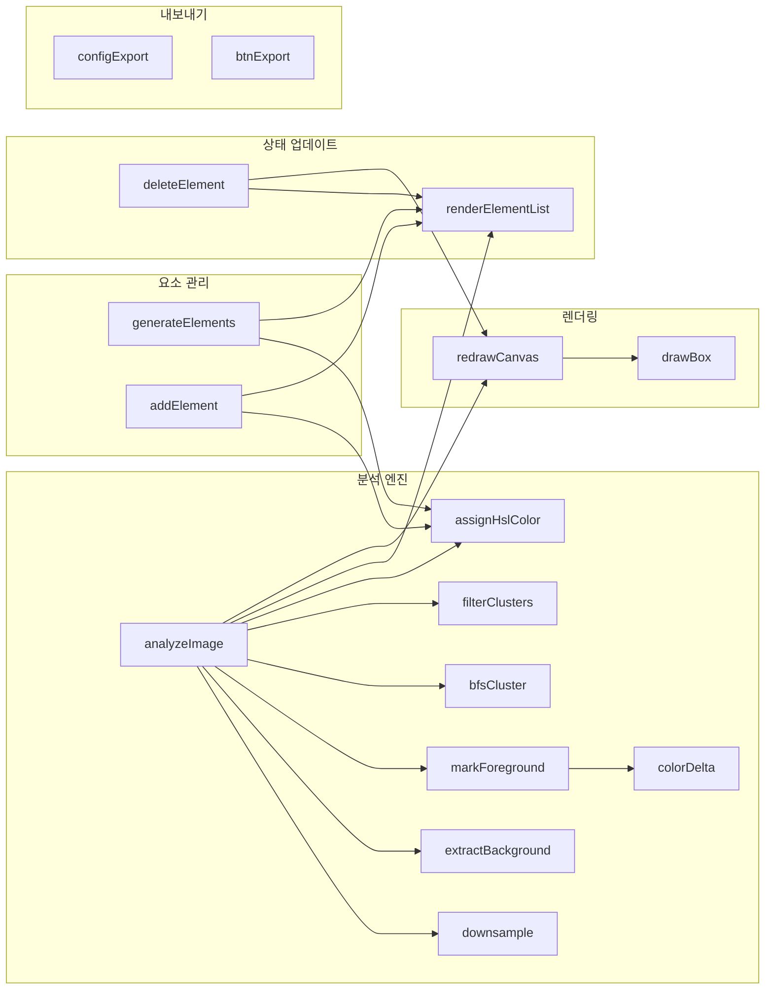

# coord-picker 이미지 분석 기반 글로벌 재설계 설계 문서

**버전**: 1.0.0 | **날짜**: 2026-02-23 | **기반**: coord-picker-global.plan.md v1.0.0, coord-picker-global.prd.md v2.0.0

---

## 1. 개요

### 목적

`C:/claude/ebs_reverse/scripts/coord_picker.html`을 WSOP 전용 하드코딩 도구에서 **이미지 분석 기반 범용 어노테이션 도구**로 재구현한다.

- **현행**: `const ELEMENTS` 배열에 WSOP 11개 요소 하드코딩 → 다른 프로젝트 재사용 불가
- **목표**: Canvas `getImageData` + BFS 클러스터링으로 요소 자동 감지 → 동적 목록 생성

### 버전

| 항목 | 값 |
|------|-----|
| 설계 버전 | 1.0.0 |
| 대상 파일 버전 | v1.0 → v2.0.0 재구현 |
| 기반 PRD | coord-picker-global.prd.md v2.0.0 |
| 기반 Plan | coord-picker-global.plan.md v1.0.0 |

### 대상 파일

| 파일 | 변경 유형 |
|------|----------|
| `scripts/coord_picker.html` | 전체 재구현 (787줄 → 1,200~1,400줄 예상) |
| `ebs_reverse/CLAUDE.md` | Option C 섹션 추가 |
| `scripts/wsop-preset.coord-picker-config.json` | 신규 생성 |

---

## 2. 아키텍처

### 현재 구조 (v1.0)

```
coord_picker.html
├── <style>           CSS (전역 리셋, 툴바, 패널, Canvas)
└── <script>
    ├── const ELEMENTS = [/* 10개 WSOP 하드코딩 */]
    ├── let state = { image, imageFileName, imageWidth, imageHeight,
    │                 scaleFactor, boxes, activeId, drag, isDragging }
    ├── renderElementList()     ELEMENTS.forEach 정적 렌더링
    ├── setActiveElement(id)
    ├── deleteBox(id)           박스만 삭제 (요소는 고정)
    ├── fileInput change        FileReader → canvas.drawImage
    ├── redrawCanvas()          이미지 + 박스 + 드래그 프리뷰
    ├── drawBox(box, color, id, isPreview)
    ├── dragToRect / canvasToImage / displayRectToImageRect / imageRectToDisplayRect
    ├── canvas mousedown/mousemove/mouseup/mouseleave
    ├── autoAdvance()           ELEMENTS 기반 다음 미정의 요소 탐색
    ├── btnExport click         overlay-anatomy-coords.json 다운로드
    ├── jsonInput change        박스 복원 (importJSON)
    ├── btnReset click
    └── updateStatus(msg)       ELEMENTS.length 하드코딩 (11개)
```

**문제점**:
- `ELEMENTS` 상수가 WSOP 10개 고정 → 프로젝트 교체 시 HTML 직접 수정 필요
- `renderElementList`, `autoAdvance`, `updateStatus`, `redrawCanvas` 등 모든 함수가 `ELEMENTS` 의존
- `gfx` 필드명이 내보내기 시 `gfx_type`으로 변환되는 불일치 존재

### 변경 후 구조 (v2.0.0)

```
coord_picker.html
├── <style>           CSS (기존 유지 + 신규 컨트롤 스타일)
└── <script>
    ├── [상태 모델]
    │   ├── let elements = []           동적 요소 배열
    │   ├── let nextElemId = 1          단조 증가 ID
    │   ├── let detectMethod = 'none'   'auto'|'manual'|'none'
    │   ├── let configName = ''         로드된 설정 이름
    │   ├── let detectHighlights = []   감지 bbox 배열
    │   ├── let showHighlights = false  하이라이트 표시 여부
    │   ├── let currentThreshold = 30   현재 임계값
    │   └── let state = { ... }         기존 유지
    │
    ├── [이미지 분석 엔진] (신규)
    │   ├── analyzeImage(threshold)
    │   ├── downsample(pixels, W, H, blockSize)
    │   ├── extractBackground(grid)
    │   ├── markForeground(grid, bgColor, threshold)
    │   ├── colorDelta(c1, c2)
    │   ├── bfsCluster(isForeground)
    │   ├── filterClusters(clusters, blockSize, minW, minH)
    │   └── assignHslColor(index, total)
    │
    ├── [요소 관리] (신규/수정)
    │   ├── generateElements(count, mode)   수동 카운트 생성
    │   ├── addElement()                    단건 추가
    │   ├── deleteElement(id)               요소+박스 삭제
    │   └── renderElementList()             elements 기반 동적 렌더링
    │
    ├── [기존 유지]
    │   ├── setActiveElement(id)
    │   ├── fileInput change
    │   ├── redrawCanvas()                  하이라이트 레이어 추가
    │   ├── drawBox / dragToRect / 좌표 변환 유틸리티
    │   └── canvas 마우스 이벤트
    │
    ├── [수정]
    │   ├── autoAdvance()       elements 기반으로 교체
    │   ├── btnExport click     elements 기반, gfx_type/protocol_cmd 통일
    │   └── updateStatus(msg)   동적 요소 수 반영
    │
    └── [신규]
        ├── configExport()      coord-picker-config.json 다운로드
        ├── configImport(data)  설정 파일 로드 → elements 교체
        └── init()              빈 상태로 시작 (ELEMENTS 기본값 제거)
```

### 핵심 설계 원칙

1. **단일 파일 원칙**: 모든 CSS/JS가 하나의 `.html`에 포함 (외부 파일 참조 금지)
2. **ELEMENTS 완전 제거**: `const ELEMENTS` 삭제, `let elements = []` 동적 배열로 전환
3. **기존 어노테이션 기능 완전 유지**: 드래그 박스, overlay-anatomy-coords.json 포맷 불변
4. **overlay-anatomy-coords.json 포맷 불변**: version/metadata/elements 최상위 키, 각 요소의 id/name/box/gfx_type/protocol_cmd/defined 필드 유지

---

## 3. 이미지 분석 엔진 설계

### 3.1 `analyzeImage(threshold)` — 파이프라인 진입점

**시그니처**:
```javascript
function analyzeImage(threshold)
// threshold: number (10~80, 기본 30)
// 반환값: void
// 부수효과: detectHighlights 갱신, elements 갱신, redrawCanvas() 호출
```

**역할**: 전체 분석 파이프라인을 순서대로 호출하는 진입점 함수.

**전제 조건**: `state.image !== null` (이미지가 로드된 상태)

**처리 흐름**:
1. 이미지 미로드 시 → `updateStatus("이미지를 먼저 열어주세요")` 후 조기 리턴
2. `ctx.getImageData(0, 0, canvas.width, canvas.height)` 호출 → `pixels` 취득
3. CORS 오류(SecurityError) `try/catch` 처리 → `"CORS 오류: file:// 직접 열기 필요"` 메시지
4. `downsample(pixels, canvas.width, canvas.height, 8)` → `grid` 취득
5. `extractBackground(grid)` → `bgColor` 취득
6. `markForeground(grid, bgColor, threshold)` → `isForeground` 취득
7. `bfsCluster(isForeground)` → `clusters` 취득
8. `filterClusters(clusters, 8, 50, 50)` → `validBBoxes` 취득
9. `detectHighlights = validBBoxes`
10. 감지 결과로 `elements` 배열 생성: `validBBoxes.map((bbox, i) => ({ id: i+1, name: "Element "+(i+1), color: assignHslColor(i, validBBoxes.length), gfx_type: "", protocol_cmd: "" }))`
11. `nextElemId = elements.length + 1`
12. `detectMethod = 'auto'`
13. `renderElementList()` + `redrawCanvas()` + `updateStatus("임계값 ${threshold} — ${elements.length}개 클러스터 감지됨")`

---

### 3.2 `downsample(pixels, W, H, blockSize)` — 블록 평균 다운샘플링

**시그니처**:
```javascript
function downsample(pixels, W, H, blockSize)
// pixels: Uint8ClampedArray (RGBA, length = W*H*4)
// W: number — canvas 너비 (픽셀)
// H: number — canvas 높이 (픽셀)
// blockSize: number — 블록 크기 (기본 8)
// 반환값: grid[gridH][gridW] = { r, g, b } 2D 배열
```

**알고리즘**:
```
gridW = ceil(W / blockSize)
gridH = ceil(H / blockSize)
grid = new Array(gridH).fill(null).map(() => new Array(gridW))

for gy in 0..gridH:
  for gx in 0..gridW:
    // 블록 범위 (이미지 경계 클램프)
    px0 = gx * blockSize
    py0 = gy * blockSize
    px1 = min(px0 + blockSize, W)
    py1 = min(py0 + blockSize, H)
    count = 0; sumR = sumG = sumB = 0
    for py in py0..py1:
      for px in px0..px1:
        idx = (py * W + px) * 4
        sumR += pixels[idx]; sumG += pixels[idx+1]; sumB += pixels[idx+2]
        count++
    grid[gy][gx] = { r: sumR/count, g: sumG/count, b: sumB/count }
```

**성능 근거**: 1920×1080 → 240×135 = 32,400 블록 (원본 207만 픽셀의 1/64)

---

### 3.3 `extractBackground(grid)` — 가장자리 중앙값 배경색 추출

**시그니처**:
```javascript
function extractBackground(grid)
// grid: { r, g, b }[][] — downsample 반환값
// 반환값: { r, g, b } — 추정 배경색
```

**알고리즘**:
```
gridH = grid.length
gridW = grid[0].length
edgeBlocks = []

// 상단 2행
for x in 0..gridW: edgeBlocks.push(grid[0][x], grid[1][x])
// 하단 2행 (gridH >= 4 보장)
for x in 0..gridW: edgeBlocks.push(grid[gridH-1][x], grid[gridH-2][x])
// 좌측 2열 (중복 허용 — 코너 블록은 가중치 자연 증가)
for y in 0..gridH: edgeBlocks.push(grid[y][0], grid[y][1])
// 우측 2열
for y in 0..gridH: edgeBlocks.push(grid[y][gridW-1], grid[y][gridW-2])

// 채널별 중앙값
rs = edgeBlocks.map(b => b.r).sort((a,b) => a-b)
gs = edgeBlocks.map(b => b.g).sort((a,b) => a-b)
bs = edgeBlocks.map(b => b.b).sort((a,b) => a-b)
mid = floor(edgeBlocks.length / 2)
return { r: rs[mid], g: gs[mid], b: bs[mid] }
```

**평균 대신 중앙값 이유**: 코너에 UI 요소가 걸쳐있어도 이상치 영향 최소화.

---

### 3.4 `markForeground(grid, bgColor, threshold)` — 전경 블록 마킹

**시그니처**:
```javascript
function markForeground(grid, bgColor, threshold)
// grid: { r, g, b }[][]
// bgColor: { r, g, b }
// threshold: number (10~80)
// 반환값: isForeground[gridH][gridW] — boolean 2D 배열
```

**알고리즘**:
```
gridH = grid.length
gridW = grid[0].length
isForeground = new Array(gridH).fill(null)
              .map(() => new Array(gridW).fill(false))

for y in 0..gridH:
  for x in 0..gridW:
    isForeground[y][x] = colorDelta(grid[y][x], bgColor) > threshold
```

---

### 3.5 `colorDelta(c1, c2)` — 가중치 유클리디안 거리

**시그니처**:
```javascript
function colorDelta(c1, c2)
// c1, c2: { r, g, b } — 각 채널 0~255
// 반환값: number — 색차 거리 (0 ~ 약 480.6)
```

**구현**:
```javascript
function colorDelta(c1, c2) {
  const dr = c1.r - c2.r;
  const dg = c1.g - c2.g;
  const db = c1.b - c2.b;
  return Math.sqrt(2*dr*dr + 4*dg*dg + 3*db*db);
}
// G 채널 가중치 x4: 인간 눈이 녹색에 가장 민감
// 최대값: sqrt((2+4+3)*255^2) ≈ 480.6
// threshold=30 기준: 전체 범위의 약 6%
```

---

### 3.6 `bfsCluster(isForeground)` — BFS 클러스터링

**시그니처**:
```javascript
function bfsCluster(isForeground)
// isForeground: boolean[][] — markForeground 반환값
// 반환값: Array<{ cells: [{x,y}], bbox: {x,y,w,h} }>
//   cells: 클러스터를 구성하는 블록 좌표 배열 (그리드 좌표)
//   bbox: 블록 좌표 기준 bounding box
```

**알고리즘 (O(1) dequeue 큐)**:
```
gridH = isForeground.length
gridW = isForeground[0].length
visited = new Array(gridH).fill(null).map(() => new Array(gridW).fill(false))
clusters = []
DIRS = [[-1,0],[1,0],[0,-1],[0,1]]   // 4-방향만

for y in 0..gridH:
  for x in 0..gridW:
    if not isForeground[y][x] or visited[y][x]: continue
    // BFS
    queue = [{x,y}]; head = 0
    cells = []
    minX=x; maxX=x; minY=y; maxY=y
    while head < queue.length:
      curr = queue[head++]   // O(1) dequeue
      if visited[curr.y][curr.x]: continue
      visited[curr.y][curr.x] = true
      cells.push({x:curr.x, y:curr.y})
      minX=min(minX,curr.x); maxX=max(maxX,curr.x)
      minY=min(minY,curr.y); maxY=max(maxY,curr.y)
      // 과대 클러스터 조기 종료 (배경 오탐 방지)
      if cells.length > gridW * gridH * 0.5: break
      for [dy,dx] in DIRS:
        nx=curr.x+dx; ny=curr.y+dy
        if inBounds and isForeground[ny][nx] and not visited[ny][nx]:
          queue.push({x:nx,y:ny})
    clusters.push({ cells, bbox:{x:minX,y:minY,w:maxX-minX+1,h:maxY-minY+1} })
```

**4-방향 강제**: 8-방향 사용 시 대각선으로 인접한 UI 요소들이 하나의 클러스터로 병합되는 오류 발생.

**과대 클러스터 조기 종료**: `cells.length > gridW * gridH * 0.5` → 이미지 전체가 전경인 경우 브라우저 응답 없음 방지.

---

### 3.7 `filterClusters(clusters, blockSize, minW, minH)` — 크기 필터 및 픽셀 좌표 변환

**시그니처**:
```javascript
function filterClusters(clusters, blockSize, minW, minH)
// clusters: bfsCluster 반환값
// blockSize: number — 다운샘플링 블록 크기 (기본 8)
// minW: number — 최소 픽셀 너비 (기본 50)
// minH: number — 최소 픽셀 높이 (기본 50)
// 반환값: Array<{x,y,w,h}> — 원본 픽셀 좌표 기준 bbox 배열
```

**알고리즘**:
```
result = []
for cluster of clusters:
  // 블록 좌표 → 원본 픽셀 좌표
  pixelBbox = {
    x: cluster.bbox.x * blockSize,
    y: cluster.bbox.y * blockSize,
    w: cluster.bbox.w * blockSize,
    h: cluster.bbox.h * blockSize
  }
  if pixelBbox.w >= minW and pixelBbox.h >= minH:
    result.push(pixelBbox)
```

---

### 3.8 `assignHslColor(index, total)` — HSL 등간격 색상 배정

**시그니처**:
```javascript
function assignHslColor(index, total)
// index: number — 0-based 인덱스
// total: number — 전체 요소 수
// 반환값: string — HEX 색상 코드 (#RRGGBB)
```

**알고리즘**:
```javascript
function assignHslColor(index, total) {
  const hue = Math.round((index * 360) / Math.max(total, 1)) % 360;
  // HSL → RGB 변환 후 HEX 반환
  // saturation: 80%, lightness: 55%
  const s = 0.8, l = 0.55;
  // hslToHex 내부 구현 (순수 JS)
  return hslToHex(hue, s, l);
}
```

**total=1 처리**: `Math.max(total, 1)`으로 0 나누기 방지.

**색상 예시** (total=4):
| index | hue | 결과 |
|-------|-----|------|
| 0 | 0° (빨강) | `#E85555` |
| 1 | 90° (초록) | `#55E870` |
| 2 | 180° (청록) | `#55D4E8` |
| 3 | 270° (보라) | `#9055E8` |

---

## 4. 상태 모델 설계

### 4.1 전역 변수 목록

#### 신규 전역 변수

| 변수명 | 타입 | 초기값 | 역할 |
|--------|------|--------|------|
| `elements` | `Array<Element>` | `[]` | 현재 요소 목록. `ELEMENTS` 상수를 완전히 대체. |
| `nextElemId` | `number` | `1` | 새 요소 생성 시 사용하는 단조 증가 ID 카운터. 삭제 후에도 감소 없음. |
| `detectMethod` | `string` | `'none'` | 요소 생성 방법. `'auto'`(자동 분석), `'manual'`(수동 카운트), `'none'`(미분석). |
| `configName` | `string` | `''` | 불러온 설정 파일의 `preset_name`. 상태바에 표시. |
| `detectHighlights` | `Array<BBox>` | `[]` | 자동 분석으로 감지된 bbox 배열 (원본 픽셀 좌표 기준). |
| `showHighlights` | `boolean` | `false` | `true` 시 `redrawCanvas()`에서 `detectHighlights`를 Canvas에 오버레이. |
| `currentThreshold` | `number` | `30` | 현재 감지 임계값. 슬라이더와 양방향 동기화. |

#### 기존 유지 (`state` 객체)

| 필드 | 타입 | 역할 |
|------|------|------|
| `state.image` | `HTMLImageElement \| null` | 로드된 이미지 요소 |
| `state.imageFileName` | `string` | 원본 파일명 |
| `state.imageWidth` | `number` | 원본 이미지 너비 (px) |
| `state.imageHeight` | `number` | 원본 이미지 높이 (px) |
| `state.scaleFactor` | `number` | Canvas 표시 배율 (원본 → display) |
| `state.boxes` | `Object<number, BBox>` | `{ [elemId]: {x,y,w,h} }` — 원본 픽셀 좌표 기준 박스 |
| `state.activeId` | `number` | 현재 활성 요소 ID |
| `state.drag` | `Object \| null` | `{ startX, startY, curX, curY }` — Canvas 좌표 드래그 상태 |
| `state.isDragging` | `boolean` | 드래그 진행 여부 |

### 4.2 `Element` 객체 스키마

```javascript
// elements 배열의 각 요소
{
  id:           number,  // nextElemId++ 로 배정된 단조 증가 정수
  name:         string,  // "Element N" 초기값, 인라인 편집으로 변경 가능
  color:        string,  // HEX 색상 코드 (#RRGGBB), assignHslColor로 자동 배정
  gfx_type:     string,  // 그래픽 타입 메타데이터 (기본값: "")
  protocol_cmd: string   // 프로토콜 명령어 메타데이터 (기본값: "")
}
```

### 4.3 `BBox` 객체 스키마

```javascript
// state.boxes[id], detectHighlights[i]의 공통 좌표 포맷
{
  x: number,  // 원본 이미지 기준 좌측 상단 X (px)
  y: number,  // 원본 이미지 기준 좌측 상단 Y (px)
  w: number,  // 너비 (px)
  h: number   // 높이 (px)
}
```

### 4.4 상태 전이 다이어그램

```
[초기 상태]
  elements = []
  detectMethod = 'none'
       |
       |-- [파일 열기]
       v
[이미지 로드됨]
  state.image = HTMLImageElement
  state.boxes = {}
       |
       +-- [자동 분석] ---------> elements = [...N개]
       |                          detectMethod = 'auto'
       |                          detectHighlights = [...N개]
       |
       +-- [N개 생성] ----------> elements = [...count개]
       |                          detectMethod = 'manual'
       |
       +-- [설정 불러오기] -----> elements = data.elements
       |                          configName = data.preset_name
       |
       v
[요소 목록 보유]
       |
       +-- [요소 클릭] + [드래그] --> state.boxes[id] = bbox
       +-- [+ 추가] / [× 삭제] --> elements 변경
       +-- [이름 편집] -----------> elements[i].name 변경
       +-- [색상 변경] -----------> elements[i].color 변경
       |
       v
[JSON 내보내기]
  overlay-anatomy-coords.json (박스 포함)
  또는 coord-picker-config.json (요소 목록만)
```

---

## 5. UI 컴포넌트 설계

### 5.1 신규 추가 HTML 요소 목록

#### 툴바 신규 컨트롤

| 요소 ID / 속성 | 타입 | 초기 상태 | 설명 |
|----------------|------|-----------|------|
| `btn-auto-detect` | `button` | enabled | 자동 분석 실행. 이미지 미로드 시 비활성 처리 권장 |
| `input-manual-count` | `input[type=number]` | `""` | min=1, max=50, placeholder="요소 수" |
| `btn-generate` | `button` | enabled | N개 생성. `input-manual-count` 값 기반 |
| `input-threshold` | `input[type=range]` | value=30 | min=10, max=80, step=1 |
| `span-threshold-value` | `span` | `"30"` | 현재 임계값 숫자 실시간 표시 |
| `btn-reanalyze` | `button` | enabled | 현재 `currentThreshold`로 재분석 |
| `btn-toggle-highlight` | `button` | enabled | 하이라이트 ON/OFF 토글. 텍스트 동적 변경 |
| `config-import-input` | `input[type=file]` | hidden | accept=".json". label 클릭으로 트리거 |
| `label[for=config-import-input]` | `label` | visible | "[설정 불러오기]" 버튼 역할 |
| `btn-config-export` | `button` | enabled | 설정 내보내기 (`coord-picker-config.json`) |

#### 요소 목록 패널 신규 요소

| 요소 | 타입 | 설명 |
|------|------|------|
| `#elem-panel-title` | `h3` | "요소 목록 (N개)" — `elements.length` 동적 반영 |
| `#btn-add-element` | `button` | "[+ 요소 추가]" — 목록 하단 배치 |
| `.elem-name[contenteditable]` | `span` | 더블클릭 시 `contenteditable='true'` 활성화 |
| `.elem-color-input` | `input[type=color]` | hidden. `.elem-dot` 클릭 시 트리거 |

### 5.2 툴바 레이아웃

```html
<!-- 기존 버튼 영역 -->
<label for="file-input">파일 열기</label>
<label for="json-import-input">JSON 불러오기</label>
<button id="btn-export">JSON 내보내기</button>
<button id="btn-reset">초기화</button>

<!-- 구분선 -->
<span class="toolbar-sep">|</span>

<!-- 자동 분석 섹션 -->
<button id="btn-auto-detect">자동 분석</button>
<span>요소 수:</span>
<input type="number" id="input-manual-count" min="1" max="50" placeholder="숫자">
<button id="btn-generate">N개 생성</button>

<!-- 임계값 섹션 -->
<span>임계값:</span>
<input type="range" id="input-threshold" min="10" max="80" value="30" step="1">
<span id="span-threshold-value">30</span>
<button id="btn-reanalyze">재분석</button>
<button id="btn-toggle-highlight">하이라이트 ON</button>

<!-- 구분선 -->
<span class="toolbar-sep">|</span>

<!-- 설정 파일 섹션 -->
<label for="config-import-input">설정 불러오기</label>
<input type="file" id="config-import-input" accept=".json" style="display:none">
<button id="btn-config-export">설정 내보내기</button>

<!-- 마우스 좌표 (우측 끝, margin-left:auto 유지) -->
<div id="coord-display">마우스: x=—, y=—</div>
```

### 5.3 이벤트 핸들러 매핑

| 요소 | 이벤트 | 핸들러 / 동작 |
|------|--------|--------------|
| `btn-auto-detect` | `click` | `analyzeImage(currentThreshold)` |
| `btn-generate` | `click` | 입력값 검증 → `generateElements(count, mode)` |
| `input-threshold` | `input` | `currentThreshold = e.target.value; span-threshold-value.textContent = currentThreshold` |
| `btn-reanalyze` | `click` | `analyzeImage(currentThreshold)` (elements는 갱신, 기존 박스 유지 여부 → 재분석 시 boxes 초기화 권장) |
| `btn-toggle-highlight` | `click` | `showHighlights = !showHighlights; redrawCanvas(); 버튼 텍스트 토글` |
| `config-import-input` | `change` | FileReader → JSON.parse → `configImport(data)` |
| `btn-config-export` | `click` | `configExport()` |
| `btn-add-element` | `click` | `addElement()` |
| `.elem-name` | `dblclick` | `contenteditable='true'; focus()` |
| `.elem-name[contenteditable]` | `keydown` Enter | `elements[i].name = value; contenteditable='false'` |
| `.elem-name[contenteditable]` | `keydown` Escape | `원래 이름 복원; contenteditable='false'` |
| `.elem-dot` | `click` | `hidden input[type=color].click()` |
| `.elem-color-input` | `input` | `elements[i].color = value; renderElementList(); redrawCanvas()` |
| `.elem-delete` | `click` | `deleteElement(elem.id)` |

### 5.4 `redrawCanvas()` 레이어 순서 (변경 후)

```
1. ctx.clearRect(0, 0, canvas.width, canvas.height)
2. ctx.drawImage(state.image, ...)          이미지
3. if (showHighlights):                     하이라이트 레이어 (신규)
     detectHighlights.forEach(bbox => {
       ctx.fillStyle = "rgba(255,220,0,0.18)"
       ctx.fillRect(bbox.x * sf, bbox.y * sf, bbox.w * sf, bbox.h * sf)
     })
4. Object.entries(state.boxes).forEach()   확정 박스 (기존)
5. if (isDragging):                        드래그 프리뷰 (기존)
```

`detectHighlights`의 bbox는 원본 픽셀 좌표 기준이므로, Canvas 그릴 때 `* state.scaleFactor` 변환 필요.

---

## 6. 데이터 포맷 설계

### 6.1 `coord-picker-config.json` 스키마 (PRD §9 기반)

```json
{
  "schema_version": "2.0",
  "preset_name": "Custom Project A",
  "description": "자동 분석 결과",
  "created_at": "2026-02-23T00:00:00.000Z",
  "detect_method": "auto",
  "detect_threshold": 30,
  "elements": [
    {
      "id": 1,
      "name": "Element 1",
      "color": "#E85555",
      "gfx_type": "",
      "protocol_cmd": ""
    }
  ]
}
```

| 필드 | 필수 | 타입 | 설명 |
|------|------|------|------|
| `schema_version` | 필수 | `string` | 포맷 버전 ("2.0"). 불러오기 시 체크 |
| `preset_name` | 필수 | `string` | 설정 이름. 상태바 + 타이틀 표시용. 없으면 "Custom" |
| `description` | 선택 | `string` | 사람이 읽는 설명 텍스트 |
| `created_at` | 선택 | `string` | ISO 8601 생성 시각. 내보내기 시 `new Date().toISOString()` |
| `detect_method` | 선택 | `string` | `"auto"` 또는 `"manual"`. 불러오기 시 `detectMethod` 갱신 |
| `detect_threshold` | 선택 | `number` | 자동 분석 시 사용된 임계값. 재현 참고용 |
| `elements` | 필수 | `Array` | 요소 배열 (박스 데이터 없음) |
| `elements[].id` | 필수 | `number` | 1부터 시작 정수 |
| `elements[].name` | 필수 | `string` | 요소 이름 |
| `elements[].color` | 필수 | `string` | HEX 색상 (`#RRGGBB`) |
| `elements[].gfx_type` | 선택 | `string` | 그래픽 타입 (WSOP 호환, 기본 `""`) |
| `elements[].protocol_cmd` | 선택 | `string` | 프로토콜 명령어 (WSOP 호환, 기본 `""`) |

**`box` 필드 불포함 규칙**: 박스 데이터는 `overlay-anatomy-coords.json`에만 저장.

---

### 6.2 `overlay-anatomy-coords.json` 포맷 (기존 불변)

```json
{
  "version": "1.0",
  "metadata": {
    "source_image": "docs/01-plan/images/web/<파일명>",
    "image_size": { "width": 1920, "height": 1080 },
    "description": "...",
    "created_at": "<ISO 8601>",
    "scale_factor": 0.6666
  },
  "elements": [
    {
      "id": 1,
      "name": "Element 1",
      "box": { "x": 100, "y": 200, "w": 300, "h": 50 },
      "gfx_type": "",
      "protocol_cmd": "",
      "defined": true
    }
  ]
}
```

**v2.0.0 변경 사항**:
- `gfx_type`: 기존 `elem.gfx` → `elem.gfx_type` (필드명 통일)
- `protocol_cmd`: 기존 `elem.cmd` → `elem.protocol_cmd` (필드명 통일)
- 정의되지 않은 요소: `box: null, defined: false`
- `metadata.description`: 기존 WSOP 하드코딩 제거 → `"<configName> 어노테이션"` 동적 생성

---

### 6.3 `wsop-preset.coord-picker-config.json` 초기 내용

```json
{
  "schema_version": "2.0",
  "preset_name": "WSOP 2025 Paradise",
  "description": "WSOP 방송 오버레이 10개 UI 요소",
  "created_at": "2026-02-23T00:00:00Z",
  "detect_method": "manual",
  "detect_threshold": 30,
  "elements": [
    { "id": 1,  "name": "Player Info Panel", "color": "#FF5252", "gfx_type": "Text + Image",  "protocol_cmd": "SHOW_PANEL" },
    { "id": 2,  "name": "홀카드 표시",        "color": "#FFA726", "gfx_type": "Image (pip)",   "protocol_cmd": "DELAYED_FIELD_VISIBILITY" },
    { "id": 3,  "name": "Action Badge",      "color": "#FFD600", "gfx_type": "Text + Border", "protocol_cmd": "FIELD_VISIBILITY" },
    { "id": 4,  "name": "승률 바",           "color": "#66BB6A", "gfx_type": "Border + Text", "protocol_cmd": "FIELD_VISIBILITY" },
    { "id": 5,  "name": "커뮤니티 카드",      "color": "#29B6F6", "gfx_type": "Image (pip)",   "protocol_cmd": "SHOW_PIP" },
    { "id": 7,  "name": "이벤트 배지",        "color": "#AB47BC", "gfx_type": "Text + Image",  "protocol_cmd": "FIELD_VISIBILITY" },
    { "id": 8,  "name": "Bottom Info Strip", "color": "#EF5350", "gfx_type": "Text + Border", "protocol_cmd": "SHOW_STRIP" },
    { "id": 9,  "name": "팟 카운터",         "color": "#26A69A", "gfx_type": "Text",          "protocol_cmd": "FIELD_VISIBILITY" },
    { "id": 10, "name": "FIELD / 스테이지",  "color": "#FF7043", "gfx_type": "Text",          "protocol_cmd": "FIELD_VISIBILITY" },
    { "id": 11, "name": "스폰서 로고",        "color": "#EC407A", "gfx_type": "Image",         "protocol_cmd": "GFX_ENABLE" }
  ]
}
```

기존 `const ELEMENTS` 배열의 10개 요소(id 1,2,3,4,5,7,8,9,10,11)와 1:1 대응.

---

## 7. 함수 간 호출 관계

### 7.1 자동 분석 플로우



### 7.2 수동 카운트 생성 플로우



### 7.3 설정 파일 불러오기 플로우



### 7.4 어노테이션 내보내기 플로우



### 7.5 전체 함수 의존성 요약



---

## 8. 구현 시 주의사항

### 8.1 CORS 및 `getImageData` 보안

**증상**: `analyzeImage()` 내 `ctx.getImageData()` 호출 시 `SecurityError: tainted canvas` 발생.

**원인**: `file://` 프로토콜에서 외부 URL 이미지를 `img.src`에 직접 대입하면 Canvas가 오염(tainted) 상태로 마킹됨.

**해결책 (기존 코드 유지)**:
- 이미지 로드는 반드시 `<input type="file">` → `FileReader.readAsDataURL()` → `img.src = dataURL` 경로만 사용
- 현행 코드가 이미 이 방식 구현 중 → 변경 없이 유지
- `analyzeImage()` 내 `try/catch(e) { if (e instanceof DOMException) { ... } }` 처리 추가

```javascript
try {
  const imageData = ctx.getImageData(0, 0, canvas.width, canvas.height);
  // ... 분석 로직
} catch (e) {
  updateStatus("CORS 오류: file:// 직접 열기 필요. 외부 URL 이미지는 분석 불가.");
  return;
}
```

---

### 8.2 BFS 최대 클러스터 크기 제한

**증상**: 임계값을 매우 낮게 설정하거나 배경이 복잡한 이미지에서 이미지 대부분이 전경으로 분류되면 BFS 큐가 과대화되어 브라우저 응답 없음(hang) 발생.

**해결책**: `bfsCluster()` 내 조기 종료 조건

```javascript
// BFS 루프 내
if (cells.length > gridW * gridH * 0.5) {
  // 이 클러스터는 이미지의 절반 이상 — "배경 오탐" 처리
  // visited를 true로 유지하되 클러스터 결과에서 제외
  break; // 큐 탐색 중단
}
```

조기 종료된 클러스터는 `filterClusters`에 전달하지 않음 (별도 플래그 또는 `null` 반환으로 처리).

---

### 8.3 포맷 호환성 — `gfx_type` / `protocol_cmd` 필드

**기존 코드 불일치**:
- `const ELEMENTS`에서 필드명: `gfx`, `cmd`
- 내보내기 함수에서: `gfx_type: elem.gfx`, `protocol_cmd: elem.cmd`

**v2.0 통일 원칙**: `elements` 배열의 요소 객체에서 필드명을 `gfx_type`, `protocol_cmd`로 통일.

```javascript
// addElement() 기본값 설정 (필수)
function addElement() {
  const id = nextElemId++;
  elements.push({
    id,
    name: `Element ${id}`,
    color: assignHslColor(elements.length, elements.length + 1),
    gfx_type: "",        // 반드시 명시
    protocol_cmd: ""     // 반드시 명시
  });
  // ...
}
```

**내보내기 방어 코드**:
```javascript
gfx_type:     elem.gfx_type     ?? "",
protocol_cmd: elem.protocol_cmd ?? "",
```

**불러오기 보정 코드**:
```javascript
elements = data.elements.map(e => ({
  id:           e.id,
  name:         e.name         ?? `Element ${e.id}`,
  color:        e.color        ?? "#FFFFFF",
  gfx_type:     e.gfx_type     ?? "",
  protocol_cmd: e.protocol_cmd ?? "",
}));
```

---

### 8.4 `detectHighlights` 좌표계 주의

`detectHighlights` 배열의 bbox는 **원본 픽셀 좌표 기준**이다 (Canvas 표시 좌표 아님).

`redrawCanvas()` 내 하이라이트 그리기 시 반드시 `scaleFactor` 적용:

```javascript
if (showHighlights) {
  ctx.fillStyle = "rgba(255,220,0,0.18)";
  detectHighlights.forEach(bbox => {
    const sf = state.scaleFactor;
    ctx.fillRect(
      bbox.x * sf,
      bbox.y * sf,
      bbox.w * sf,
      bbox.h * sf
    );
  });
}
```

---

### 8.5 `nextElemId` 관리

`nextElemId`는 단조 증가 카운터로, **삭제 후 재사용하지 않는다**.

```javascript
// 올바른 초기화 (설정 불러오기 후)
nextElemId = Math.max(...elements.map(e => e.id), 0) + 1;

// 올바른 신규 생성
const newId = nextElemId++;
elements.push({ id: newId, ... });
```

이유: `state.boxes[id]`가 id를 키로 사용하므로, 삭제 후 id를 재사용하면 삭제된 박스 데이터가 새 요소에 잘못 연결됨.

---

### 8.6 `deleteElement(id)` 처리 순서

```javascript
function deleteElement(id) {
  // 1. elements 배열에서 제거
  elements = elements.filter(e => e.id !== id);
  // 2. 박스 데이터 삭제
  delete state.boxes[id];
  // 3. 활성 요소가 삭제된 경우 → 첫 번째 요소로 이동
  if (state.activeId === id) {
    state.activeId = elements.length > 0 ? elements[0].id : null;
  }
  // 4. 렌더링 갱신
  renderElementList();
  redrawCanvas();
  updateStatus();
}
```

---

### 8.7 단일 파일 원칙 준수

모든 CSS/JS는 `coord_picker.html` 내 `<style>`/`<script>` 태그에 유지.

예상 파일 크기: 기존 787줄 + 분석 엔진 ~300줄 + UI 확장 ~200줄 = **약 1,200~1,400줄** (허용 범위).
