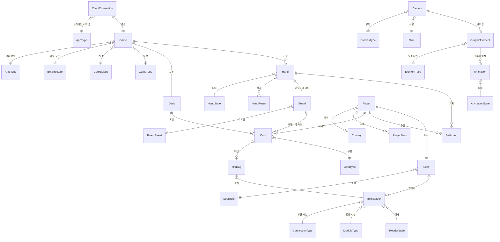
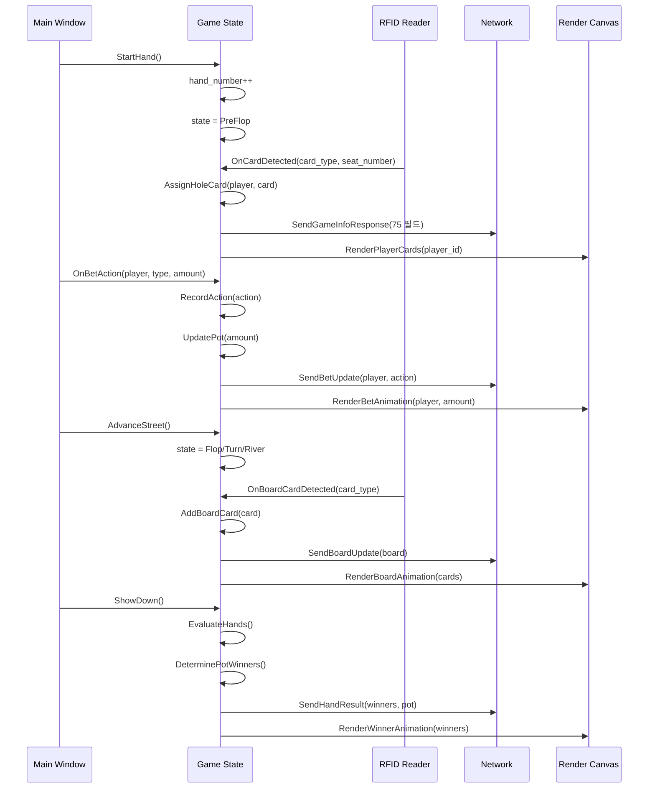

# EBS - 기술 설계 문서

> **Version**: 4.0.0
> **Date**: 2026-02-18
> **Status**: Complete
> **문서 유형**: Technical Design Document
> **대상 독자**: 개발팀, 아키텍트, 하드웨어팀, QA팀

---

> **문서 관계**: 제품 요구사항은 PRD v24.0.0(`docs/01-plan/pokergfx-prd-v2.md`)을 참조한다.
> 본 문서는 PRD의 요구사항을 "어떻게 구현할 것인가"를 다룬다.

## 목차

1. [제품 비전](#1-제품-비전)
2. [사용자와 워크플로우](#2-사용자와-워크플로우)
3. [시스템 아키텍처](#3-시스템-아키텍처)
4. [핵심 모듈 설계](#4-핵심-모듈-설계)
5. [22개 포커 게임 엔진](#5-22개-포커-게임-엔진)
6. [핸드 평가 엔진](#6-핸드-평가-엔진)
7. [GPU 렌더링 파이프라인](#7-gpu-렌더링-파이프라인)
8. [네트워크 프로토콜](#8-네트워크-프로토콜)
9. [RFID 카드 리더 시스템](#9-rfid-카드-리더-시스템)
10. [화면별 기능 명세](#10-화면별-기능-명세)
11. [스킨 시스템](#11-스킨-시스템)
12. [보안 및 라이선스](#12-보안-및-라이선스)
13. [외부 연동](#13-외부-연동)
14. [기술 스택](#14-기술-스택)
15. [성능 요구사항](#15-성능-요구사항)
16. [데이터 모델](#16-데이터-모델)

---

## 1. 제품 비전

> 제품 비전, 목표, 시스템 규모, 성공 기준: PRD v24.0.0 참조

---

## 2. 사용자와 워크플로우

> 사용자 정의, 핵심 워크플로우: PRD v27.0.0 Section 15-16 참조

---

## 3. 시스템 아키텍처

### 3.1 Clean Architecture 4계층

```
+-------------------------------------------------------+
|                    Presentation Layer                    |
|  WPF/Avalonia Views + ViewModels (MVVM)                 |
|  30개 View (11개 화면 + 다이얼로그)                       |
+-------------------------------------------------------+
|                    Application Layer                    |
|  MediatR CQRS (Command/Query + Handler)                |
|  Use Cases, DTOs, Validators                           |
+-------------------------------------------------------+
|                      Domain Layer                      |
|  Entities, Value Objects, Domain Events                |
|  Game Engine, Hand Evaluator, State Machines           |
+-------------------------------------------------------+
|                   Infrastructure Layer                  |
|  RFID Drivers, GPU Renderer, Network, Persistence     |
|  External Services (ATEM, Twitch, NDI)                 |
+-------------------------------------------------------+
```

### 3.2 프로젝트 구조

```
src/
+-- PokerGFX.Domain/              # 도메인 모델, 게임 엔진
|   +-- Games/                    # 22개 게임 규칙
|   +-- HandEval/                 # 핸드 평가 엔진
|   +-- Cards/                    # CardMask, Deck
|   +-- Statistics/               # VPIP, PFR, AF 통계
|   +-- Events/                   # 도메인 이벤트
+-- PokerGFX.Application/         # CQRS, Use Cases
|   +-- Commands/                 # 상태 변경 커맨드
|   +-- Queries/                  # 조회 쿼리
|   +-- Behaviors/                # 파이프라인 (Validation, Logging)
+-- PokerGFX.Infrastructure/      # 외부 연동
|   +-- Rfid/                     # RFID 드라이버
|   +-- Rendering/                # DirectX 12 렌더러
|   +-- Network/                  # gRPC + TCP
|   +-- Persistence/              # EF Core, 설정 저장
+-- PokerGFX.Presentation/        # WPF/Avalonia UI
|   +-- Views/                    # 30개 View
|   +-- ViewModels/               # MVVM ViewModels
|   +-- Controls/                 # 커스텀 컨트롤
+-- PokerGFX.Server/              # 서버 호스트
+-- PokerGFX.ActionTracker/       # 딜러 앱
+-- PokerGFX.Commentary/          # 해설자 앱

tests/
+-- PokerGFX.Domain.Tests/
+-- PokerGFX.Application.Tests/
+-- PokerGFX.Infrastructure.Tests/
+-- PokerGFX.Integration.Tests/
+-- PokerGFX.E2E.Tests/
```

### 3.3 8대 모듈 구조

| 모듈 | 프로젝트 | 핵심 역할 |
|------|---------|----------|
| **메인 서버** | PokerGFX.Server + Presentation + Application | 전체 오케스트레이션, UI |
| **핸드 평가** | Domain/HandEval | 538개 lookup 배열, 17개 게임별 평가기 |
| **네트워크** | Infrastructure/Network | gRPC + Protobuf, 113+ 커맨드 |
| **GPU 렌더링** | Infrastructure/Rendering | DirectX 12, 5-Thread 파이프라인, Dual Canvas |
| **RFID 리더** | Infrastructure/Rfid | TCP/WiFi + USB HID, 22개 텍스트 커맨드 |
| **공통** | Domain + Application | 설정, Enum, 데이터 모델 |
| **통계** | Domain/Statistics | VPIP, PFR, AF 등 플레이어 통계 |
| **TLS** | Infrastructure/Rfid (SslStream) | .NET 내장 TLS 1.3 (RFID WiFi 전용) |

### 3.4 데이터 흐름

```
RFID 리더 --(TCP/USB)--> RFID Driver --> Domain Event: CardDetected
                                              |
                                              v
Action Tracker --(gRPC)--> Command Handler --> Game Engine
                                              |
                                              +-->  Hand Evaluator (승률 계산)
                                              |
                                              v
                                         State Change
                                              |
                                              +--> GPU Renderer (오버레이 생성)
                                              |         |
                                              |         v
                                              |    NDI/HDMI 출력
                                              |
                                              +--> Commentary Booth (홀카드 전송)
                                              |
                                              +--> Analytics (통계 업데이트)
```

---

## 4. 핵심 모듈 설계

### 4.1 GameTypeData 분해: 6개 도메인 Record

게임 상태를 관리하는 핵심 데이터 구조이다. 79개 이상의 필드를 6개 불변 Record로 분리한다.

| Record | 필드 수 | 관리 영역 |
|--------|:-------:|----------|
| `GameSession` | ~15 | hand_number, game_type, blind_level |
| `TableState` | ~12 | pot_size, side_pots[], community_cards[] |
| `PlayerState` | ~10 (x10) | name, chip_count, hole_cards[], is_folded |
| `BettingState` | ~8 | current_bet, min_raise, betting_round |
| `DisplayState` | ~15 | show_holecards[], animation_flags |
| `TournamentState` | ~12 | blind_timer, payout_structure, bounties[] |

```csharp
public sealed record GameSession(
    int HandNumber,
    game GameType,
    game_class GameClass,
    decimal SmallBlind,
    decimal BigBlind,
    int DealerSeat);

public sealed record PlayerState(
    int Seat,
    string Name,
    decimal ChipCount,
    CardMask HoleCards,
    bool IsFolded,
    bool IsAllIn,
    string Country,
    decimal? Bounty);
```

### 4.2 config_type 분해: 11개 설정 Record

전체 시스템 설정을 관리하는 구조이다. 282개 필드를 11개 도메인 Record로 분해한다.

| Record | 필드 수 | 관리 영역 |
|--------|:-------:|----------|
| `ServerConfig` | ~25 | 서버 포트, IP, 라이선스 |
| `RfidConfig` | ~30 | 리더 IP, 포트, 좌석 매핑 |
| `RenderConfig` | ~25 | GPU, 해상도, 프레임레이트 |
| `NetworkConfig` | ~20 | TCP/UDP 포트, 암호화 설정 |
| `GameConfig` | ~30 | 게임 규칙, 블라인드, 타이머 |
| `OutputConfig` | ~25 | NDI, HDMI, SDI, 크로마키 |
| `SkinConfig` | ~20 | 스킨 경로, 기본 스킨, 테마 |
| `AnalyticsConfig` | ~20 | 통계 DB, 추적 항목 |
| `SecurityConfig` | ~15 | 암호화, Trustless 모드 |
| `ExternalConfig` | ~20 | ATEM, Twitch, StreamDeck |
| `UiConfig` | ~15 | 언어, 단축키, 레이아웃 |

---

## 5. 22개 포커 게임 엔진

### 5.1 game enum 정의 (22값)

```csharp
enum game {
    holdem = 0,
    holdem_sixplus_straight_beats_trips = 1,
    holdem_sixplus_trips_beats_straight = 2,
    pineapple = 3,
    omaha = 4,
    omaha_hilo = 5,
    omaha5 = 6,
    omaha5_hilo = 7,
    omaha6 = 8,
    omaha6_hilo = 9,
    courchevel = 10,
    courchevel_hilo = 11,
    draw5 = 12,
    deuce7_draw = 13,
    deuce7_triple = 14,
    a5_triple = 15,
    badugi = 16,
    badeucy = 17,
    badacey = 18,
    stud7 = 19,
    stud7_hilo8 = 20,
    razz = 21
}
```

### 5.2 game_class enum (3값)

```csharp
enum game_class {
    flop = 0,    // Community Card 계열
    draw = 1,    // Draw 계열
    stud = 2     // Stud 계열
}
```

### 5.3 계열별 게임 상세

#### Community Card 계열 (game_class = flop): 13개

| game enum | 게임명 | 홀카드 | 보드 | 특수 규칙 |
|:---------:|--------|:------:|:----:|----------|
| 0 | Texas Hold'em | 2장 | 5장 | 표준 |
| 1 | 6+ Hold'em (Straight > Trips) | 2장 | 5장 | 2-5 제거, Straight > Trips |
| 2 | 6+ Hold'em (Trips > Straight) | 2장 | 5장 | 2-5 제거, Trips > Straight |
| 3 | Pineapple | 3장->2장 | 5장 | Flop 전 1장 버림 |
| 4 | Omaha | 4장 | 5장 | 반드시 2장 사용 |
| 5 | Omaha Hi-Lo | 4장 | 5장 | Hi/Lo 분할 |
| 6 | Five Card Omaha | 5장 | 5장 | 반드시 2장 사용 |
| 7 | Five Card Omaha Hi-Lo | 5장 | 5장 | Hi/Lo |
| 8 | Six Card Omaha | 6장 | 5장 | 반드시 2장 사용 |
| 9 | Six Card Omaha Hi-Lo | 6장 | 5장 | Hi/Lo |
| 10 | Courchevel | 5장 | 5장 | 첫 Flop 1장 미리 공개 |
| 11 | Courchevel Hi-Lo | 5장 | 5장 | Hi/Lo + 미리 공개 |

#### Draw 계열 (game_class = draw): 6개

| game enum | 게임명 | 카드 | 교환 | 특수 규칙 |
|:---------:|--------|:----:|:----:|----------|
| 12 | Five Card Draw | 5장 | 1회 | 기본 Draw |
| 13 | Single Draw 2-7 | 5장 | 1회 | Lowball |
| 14 | Triple Draw 2-7 | 5장 | 3회 | Lowball |
| 15 | A-5 Triple Draw | 5장 | 3회 | A-5 Lowball |
| 16 | Badugi | 4장 | 3회 | 4장 Lowball, 무늬 다른 게 유리 |
| 17 | Badeucy | 5장 | 3회 | Badugi + 2-7 혼합 |
| 18 | Badacey | 5장 | 3회 | Badugi + A-5 혼합 |

#### Stud 계열 (game_class = stud): 3개

| game enum | 게임명 | 카드 | 라운드 | 특수 규칙 |
|:---------:|--------|:----:|:------:|----------|
| 19 | 7-Card Stud | 7장 | 5 | 3 down + 4 up |
| 20 | 7-Card Stud Hi-Lo | 7장 | 5 | Hi/Lo 분할 |
| 21 | Razz | 7장 | 5 | Lowball Stud |

### 5.4 BetStructure enum (3값)

```csharp
enum BetStructure {
    NoLimit = 0,
    FixedLimit = 1,
    PotLimit = 2
}
```

모든 22개 게임 변형은 이 3가지 베팅 구조와 조합 가능하다. `GameTypeData.bet_structure` 필드에 저장된다.

### 5.5 AnteType enum (7값)

```csharp
enum AnteType {
    std_ante = 0,        // 표준 앤티 - 모든 플레이어 동일 금액
    button_ante = 1,     // 버튼 앤티 - 딜러만 납부
    bb_ante = 2,         // 빅블라인드 앤티 - BB 위치만 납부
    bb_ante_bb1st = 3,   // BB 앤티 (BB 먼저) - BB가 앤티를 먼저 수납
    live_ante = 4,       // 라이브 앤티 - 팟에 라이브로 참여
    tb_ante = 5,         // Third Blind 앤티 - 서드 블라인드 위치 납부
    tb_ante_tb1st = 6    // TB 앤티 (TB 먼저)
}
```

### 5.6 게임 상태 머신

```
IDLE (대기)
  |
  v
NEW_HAND  <--- 핸드 번호 증가, 블라인드 수집, 카드 딜
  |
  v
PRE_FLOP  <--- 첫 베팅 라운드 (Hold'em/Omaha 기준)
  |
  v
FLOP  <--- 커뮤니티 카드 3장 공개 + 베팅
  |
  v
TURN  <--- 4번째 카드 공개 + 베팅
  |
  v
RIVER  <--- 5번째 카드 공개 + 최종 베팅
  |
  v
SHOWDOWN  <--- 핸드 평가, 승자 결정, 팟 분배
  |
  v
HAND_COMPLETE  <--- 통계 업데이트, 다음 핸드 대기
  |
  v
IDLE (loop)
```

**Run It Twice 분기**: `run_it_times` 필드가 1보다 크면, RIVER 이후 추가 보드를 딜하여 별도의 팟 분배를 수행한다.

**Draw 게임 분기**: PRE_FLOP 대신 DRAW_ROUND로 진입하여, 최대 교환 횟수에 도달할 때까지 교환과 베팅을 반복한다.

**Stud 게임 분기**: 보드 카드가 없으며, 각 라운드마다 개인 카드가 추가된다.

---

## 6. 핸드 평가 엔진

### 6.1 카드 표현: 64-bit Bitmask (CardMask)

모든 카드는 64비트 `ulong`의 단일 비트로 표현된다. 52장이 4개 suit 영역에 각 13비트씩 배치된다.

```
비트 레이아웃 (64비트 중 52비트 사용):
[--- Spades ---][--- Hearts ---][--- Diamonds ---][--- Clubs ---]
 bits 39-51       bits 26-38       bits 13-25        bits 0-12

각 suit 내 (13비트):
bit 0  = 2 (최저)
bit 1  = 3
...
bit 8  = 10
bit 9  = Jack
bit 10 = Queen
bit 11 = King
bit 12 = Ace (최고)
```

Suit offset 상수:

```csharp
CLUB_OFFSET    = 13 * 0 = 0
DIAMOND_OFFSET = 13 * 1 = 13
HEART_OFFSET   = 13 * 2 = 26
SPADE_OFFSET   = 13 * 3 = 39
```

카드 마스크 공식: `mask |= (1UL << (rank + suit * 13))`

구현:

```csharp
public readonly record struct CardMask
{
    private readonly ulong _mask;

    public CardMask(ulong mask) => _mask = mask;

    public static CardMask FromCard(int rank, int suit)
        => new(1UL << (suit * 13 + rank));

    public CardMask Add(CardMask other)
        => new(_mask | other._mask);

    public int PopCount()
        => BitOperations.PopCount(_mask);

    public bool Contains(CardMask card)
        => (_mask & card._mask) != 0;
}
```

정적 테이블:
- `CardMasksTable[52]`: ulong[] -- 각 카드의 단일 비트 마스크
- `CardTable[52]`: string[] -- `["2c","3c",...,"Ac","2d",...,"As"]` 순서

### 6.2 card_type enum (53값)

```csharp
enum card_type {
    card_back = 0,       // 카드 뒷면
    clubs_two = 1,       // 2C
    clubs_three = 2,     // 3C
    // ... 순서대로
    spades_ace = 52      // AS
}
```

### 6.3 hand_class enum (핸드 등급, 10값)

```csharp
enum hand_class {
    high_card = 0,
    one_pair = 1,
    two_pair = 2,
    three_of_a_kind = 3,
    straight = 4,
    flush = 5,
    full_house = 6,
    four_of_a_kind = 7,
    straight_flush = 8,
    royal_flush = 9      // straight_flush의 특수 케이스
}
```

### 6.4 핵심 평가 알고리즘 (Evaluate)

```csharp
static uint Evaluate(ulong cards, int numberOfCards, bool ignore_wheel)
{
    // Step 1: suit mask 추출 (각 13비트)
    int clubs    = (int)((cards >> CLUB_OFFSET) & 0x1FFF);
    int diamonds = (int)((cards >> DIAMOND_OFFSET) & 0x1FFF);
    int hearts   = (int)((cards >> HEART_OFFSET) & 0x1FFF);
    int spades   = (int)((cards >> SPADE_OFFSET) & 0x1FFF);

    // Step 2: 결합 랭크 정보 계산
    int ranks = clubs | diamonds | hearts | spades;
    int uniqueRanks = nBitsTable[ranks];
    int duplicates = numberOfCards - uniqueRanks;

    // Step 3: Flush 감지 (5개 이상 고유 랭크 존재 시)
    if (uniqueRanks >= 5) {
        foreach (int suitMask in {clubs, diamonds, hearts, spades}) {
            if (nBitsTable[suitMask] >= 5) {
                if (straightTable[suitMask] != 0)
                    return HANDTYPE_VALUE_STRAIGHTFLUSH
                         + (straightTable[suitMask] << TOP_CARD_SHIFT);
                retval = HANDTYPE_VALUE_FLUSH + TopFive(suitMask);
                break;
            }
        }
    }

    // Step 4: Straight 체크
    if (retval == 0 && straightTable[ranks] != 0)
        retval = HANDTYPE_VALUE_STRAIGHT + (straightTable[ranks] << TOP_CARD_SHIFT);

    // Step 5: Flush/Straight + 중복 < 3이면 조기 반환
    if (retval != 0 && duplicates < 3)
        return retval;

    // Step 6: 중복 수에 따른 분기
    switch (duplicates) {
        case 0: return HANDTYPE_VALUE_HIGHCARD + TopFive(ranks);
        case 1: // ONE PAIR - XOR로 페어 랭크 추출
        case 2: // TWO PAIR 또는 TRIPS
        default: // FOUR_OF_A_KIND, FULL_HOUSE
    }
}
```

XOR 기반 중복 감지:
- `clubs XOR diamonds XOR hearts XOR spades`: 홀수 번 등장하는 랭크만 SET
- `singles = ranks XOR (c XOR d XOR h XOR s)`: 페어 랭크 추출
- `(c AND d) OR (h AND s) OR (c AND h) OR (d AND s)`: trips/quads 감지
- `c AND d AND h AND s`: quads 전용 (4개 suit 모두 등장)

### 6.5 HandValue 인코딩 (32비트)

핸드 값은 단일 `uint`에 packed되어 직접 비교 가능하다:

```csharp
// bits 27-24: HandType (0-8)
// bits 23-0:  sub-rank (kicker 정보)
HANDTYPE_SHIFT = 24
TOP_CARD_SHIFT = 16
SECOND_CARD_SHIFT = 12
THIRD_CARD_SHIFT = 8
CARD_WIDTH = 4
```

| HandType 값 | 이름 | 계산식 |
|:-----------:|------|--------|
| 0 | HighCard | `0 << 24` |
| 1 | Pair | `1 << 24` |
| 2 | TwoPair | `2 << 24` |
| 3 | Trips | `3 << 24` |
| 4 | Straight | `4 << 24` |
| 5 | Flush | `5 << 24` |
| 6 | FullHouse | `6 << 24` |
| 7 | FourOfAKind | `7 << 24` |
| 8 | StraightFlush | `8 << 24` |

상위 HandType이 항상 우선하며, 동일 타입 내에서 kicker 비트로 타이를 해결한다.

### 6.6 Lookup Table 아키텍처

모든 핵심 lookup table은 8192 엔트리 배열(2^13, 13비트 랭크 패턴 전체 커버)이다.

| 테이블 | 타입 | 크기 | 설명 |
|--------|------|:----:|------|
| `nBitsTable[8192]` | ushort[] | 8192 | 13비트 값의 popcount |
| `straightTable[8192]` | ushort[] | 8192 | Straight 포함 시 최고 카드 랭크, 없으면 0 |
| `topFiveCardsTable[8192]` | uint[] | 8192 | 상위 5개 비트 packed 표현 |
| `topCardTable[8192]` | ushort[] | 8192 | 최상위 비트 랭크 |
| `nBitsAndStrTable[8192]` | ushort[] | 8192 | bitcount + straight 결합 정보 |
| `bits[256]` | byte[] | 256 | 바이트 popcount |
| `CardMasksTable[52]` | ulong[] | 52 | 단일 카드 bitmask |
| `CardTable[52]` | string[] | 52 | 카드 이름 문자열 |

총 538개 정적 배열, 약 2.1MB 메모리. C# Source Generator로 빌드 타임에 `ReadOnlySpan<byte>`로 생성한다.

### 6.7 17개 게임별 Evaluator

`core.evaluate_hand()`와 `core.calc_odds()`가 게임 문자열에 따라 라우팅한다:

| 게임 문자열 | Evaluator | 비고 |
|------------|-----------|------|
| HOLDEM | `Hand.Evaluate` | Texas Hold'em |
| PINEAPPL | `Hand.Evaluate` | Pineapple (Hold'em과 동일 평가) |
| 6THOLDEM | `holdem_sixplus.eval` | Short Deck, trips > straight |
| 6PHOLDEM | `holdem_sixplus.eval` | Short Deck, 표준 랭킹 |
| OMAHA | `OmahaEvaluator.EvaluateHigh` | 4카드 Omaha |
| OMAHAHL | `OmahaEvaluator` + EvaluateLow | Omaha Hi-Lo |
| OMAHA5 | `Omaha5Evaluator.EvaluateHigh` | 5카드 Omaha |
| COUR | `Omaha5Evaluator` | Courchevel |
| OMAHA6 | `Omaha6Evaluator.EvaluateHigh` | 6카드 Omaha |
| 5DRAW | `draw.HandOdds` | Five-card Draw |
| 27DRAW | `draw.HandOdds(seven_deuce_lowball=true)` | 2-7 Single Draw |
| 27TRIPLE | `draw.HandOdds(seven_deuce_lowball=true)` | 2-7 Triple Draw |
| A5TRIPLE | `draw.a5_HandOdds` | A-5 Triple Draw |
| BADUGI | `draw.badugi` | Badugi |
| BADEUCY | `draw.badugi` | Badeucy |
| BADACEY | `draw.badugi` | Badacey |
| 7STUD / 7STUDHL / RAZZ | `stud.odds` | Stud 계열 |

**Short Deck**: 2, 3, 4, 5를 제거한 36장 덱. Dead cards 상수 `8247343964175`(16장 bitmask). Wheel은 A-6-7-8-9 패턴(bitmask 4336)으로 대체. 6THOLDEM 변형에서는 Trips와 Straight 값, Flush와 FullHouse 값을 사후 교환한다.

**Omaha 변형**: OmahaEvaluator는 C(52,4)=270,725개 조합을 사전 계산. Omaha5Evaluator는 C(52,5)=2,598,960개. Omaha6Evaluator는 memory-mapped file(`omaha6.vpt`, 레코드 128바이트)을 사용하여 C(52,6)=20,358,520개 조합을 처리한다.

**IPokerEvaluator 인터페이스**:

```csharp
interface IPokerEvaluator
{
    void Evaluate(ref ulong HiResult, ref short LowResult, ulong Hand, ulong OpenCards);
    bool IsHighLow { get; }
}
```

구현체: SevenCards(636줄), Razz(573줄), Badugi(419줄).

### 6.8 Monte Carlo 확률 계산

적응형 임계값 기반 Monte Carlo 시뮬레이션:

| 게임 | MC_NUM 임계값 | 조합 특성 |
|------|:------:|----------|
| Hold'em | 100,000 | 전수 조사 가능 범위 넓음 |
| Omaha 4/5 | 10,000 | 조합 수 급증 |
| Omaha 6 | 1,000 | memory-mapped 조합 사용 |

전체 조합 수가 MC_NUM 미만이면 전수 열거, 이상이면 Monte Carlo `RandomHands()`로 전환한다.

```csharp
public class MonteCarloEvaluator
{
    public async Task<WinProbability[]> CalculateAsync(
        GameState state,
        int iterations = 10_000,
        CancellationToken ct = default)
    {
        // TPL Parallel.ForEach로 코어 분산
        // SIMD Vector<ulong>로 비트 연산 가속
        // CardMask 기반 중복 없는 랜덤 카드 생성
    }
}
```

Outs 계산: `Hand.OutsMask`가 모든 단일 카드 추가를 열거하여 플레이어가 모든 상대를 이기는 카드의 bitmask를 반환한다.

### 6.9 PocketHand169Enum

Texas Hold'em의 전략적으로 구분되는 169개 pocket hand 타입:
- 13개 pocket pair: AA, KK, QQ, ..., 22
- 78개 suited: AKs, AQs, ..., 32s
- 78개 offsuit: AKo, AQo, ..., 32o
- `None` (값 0)

`PreCalcPlayerOdds[169][9]`와 `PreCalcOppOdds[169][9]`로 preflop 확률을 사전 계산 테이블에서 즉시 조회한다.

---

## 7. GPU 렌더링 파이프라인

### 7.1 mixer 클래스 (핵심 합성기)

90개 필드와 5개 워커 스레드를 관리하는 메인 비디오 합성 엔진이다.

```csharp
public class mixer
{
    // Delegate Callbacks
    private frame_delegate on_frame;
    private frame_grab_delegate on_frame_grab;
    private media_finished_delegate media_finished;
    private error_delegate on_error;

    // Dual Canvas (Live + Delayed)
    public canvas canvas_live;
    public canvas canvas_delayed;

    // Frame Queues (Producer-Consumer)
    private Channel<RenderFrame> live_frames;
    private Channel<RenderFrame> delayed_frames;
    private Channel<RenderFrame> write_frames;
    private ConcurrentQueue<RenderFrame> sync_frames;

    // Worker Threads (5개)
    private Thread thread_worker;                  // 메인 라이브 프레임 처리
    private Thread thread_worker_audio;            // 오디오 프레임 처리
    private Thread thread_worker_delayed;          // 딜레이 프레임 처리
    private Thread thread_worker_write;            // 녹화 파일 쓰기
    private Thread thread_worker_process_delay;    // 딜레이 처리
}
```

### 7.2 5-Thread Producer-Consumer 파이프라인

```
Thread 1: Input Thread
    |  비디오 소스 캡처
    v
Thread 2: Mixer Thread
    |  그래픽 요소 합성 (90+ 필드)
    |  image_element, text_element, pip, border 처리
    v
Thread 3: Live Canvas Thread
    |  실시간 출력 (홀카드 표시 여부 제어)
    v
Thread 4: Delayed Canvas Thread
    |  지연 출력 (설정된 초만큼 지연)
    v
Thread 5: Output Thread
       NDI/HDMI/SDI 출력
```

### 7.3 Dual Canvas 시스템

```
Video Input --> [Live Canvas] --> Live Output (실시간)
                    |
              [Delay Buffer]
                    |
             [Delayed Canvas] --> Delayed Output (N초 지연)
```

| Canvas | 용도 | 홀카드 표시 | 대상 |
|--------|------|:----------:|------|
| **Live Canvas** | 경기장 모니터 | Trustless 시 숨김 | 선수, 관객 |
| **Delayed Canvas** | 방송 송출 | 지연 후 표시 | 시청자 |

**Trustless 모드**: Live Canvas에 홀카드를 절대 표시하지 않는 핵심 보안 기능이다. 게임 무결성 보호를 위해 Live Output에서는 플레이어 카드가 노출되지 않으며, Delayed Canvas에서만 설정된 지연 시간 후 표시된다.

### 7.4 canvas 클래스 (DirectX 12 렌더링)

```csharp
public class canvas
{
    // DirectX 12 Core (Vortice.Windows)
    private ID3D12Device _device;
    private ID3D12CommandQueue _commandQueue;
    private IDXGISwapChain4 _swapChain;

    // Rendering Resources
    private Texture2D t2d;                         // 렌더 타겟 텍스처
    private Bitmap[] bm_buffer;                    // 더블 버퍼 (2개)
    private List<render_item> render_items;

    // Graphic Layers (Z-order)
    private List<image_element> image_elements;
    private List<text_element> text_elements;
    private List<pip_element> pip_elements;
    private List<border_element> border_elements;

    // State
    private int _w, _h;                            // 해상도
    private int _adapter_index;                    // GPU 어댑터
}
```

렌더링 파이프라인:

```
begin_render()
  -> BeginDraw()
  -> Clear(background_colour)
  -> 각 레이어 Z-order 순으로 렌더링:
      image_elements -> text_elements -> pip_elements -> border_elements
  -> EndDraw()
  -> Texture2D -> Frame 변환
end_render()
```

### 7.5 bridge 클래스 (Cross-GPU 텍스처 공유)

두 독립 GPU 컨텍스트 간 텍스처를 공유하는 DXGI SharedHandle 기반 메커니즘이다.

```csharp
public class GpuTextureBridge
{
    public SharedTextureHandle Share(ID3D12Resource texture)
    {
        // 1. 텍스처에서 SharedHandle 생성
        // 2. 다른 GPU의 Device에서 OpenSharedHandle
        // 3. 공유 텍스처로 렌더링
        return new SharedTextureHandle(handle);
    }
}
```

`prev_bitmap` 캐싱으로 동일 비트맵 반복 시 bridge 재생성을 방지한다. 크기 변경 시만 dispose -> create_new 호출.

### 7.6 4가지 그래픽 요소 타입

#### image_element (41개 필드)

| 필드 | 타입 | 설명 |
|------|------|------|
| x, y | float | 위치 |
| width, height | float | 크기 |
| source_path | string | 이미지 파일 경로 |
| opacity | float | 투명도 (0-1) |
| rotation | float | 회전 각도 |
| visible | bool | 표시 여부 |
| z_order | int | 렌더링 순서 |
| animation_state | AnimationState | 현재 애니메이션 상태 |
| crop_rect | Rect | 자르기 영역 |
| flip_h, flip_v | bool | 좌우/상하 반전 |
| tint_color | Color | 색상 틴트 |
| shadow_offset | Vector2 | 그림자 오프셋 |
| shadow_blur | float | 그림자 블러 |
| shadow_color | Color | 그림자 색상 |

GPU Effects Chain: Crop -> Transform -> Brightness -> Alpha -> ColorMatrix -> HueRotation

#### text_element (52개 필드)

| 필드 | 타입 | 설명 |
|------|------|------|
| x, y | float | 위치 |
| width, height | float | 영역 크기 |
| text | string | 표시할 텍스트 |
| font_family | string | 글꼴 이름 |
| font_size | float | 글꼴 크기 |
| font_color | Color | 글자 색상 |
| font_weight | FontWeight | 굵기 |
| text_align | TextAlignment | 좌/중/우 정렬 |
| word_wrap | bool | 줄바꿈 |
| outline_color | Color | 외곽선 색상 |
| outline_width | float | 외곽선 두께 |
| shadow_offset | Vector2 | 그림자 |
| background_color | Color | 배경색 |
| padding | Thickness | 내부 여백 |
| animation_state | AnimationState | 애니메이션 상태 |

텍스트 효과: Ticker(수평 스크롤), Reveal(글자별 표시), Static, Shadow

#### pip (카드 문양, 12개 필드)

| 필드 | 타입 | 설명 |
|------|------|------|
| x, y | float | 위치 |
| size | float | 크기 |
| suit | int | 문양 (0=Club, 1=Diamond, 2=Heart, 3=Spade) |
| rank | int | 숫자 (0=2, 12=A) |
| face_up | bool | 앞면/뒷면 |
| highlighted | bool | 강조 표시 |
| animation_state | AnimationState | 애니메이션 |

#### border (테두리, 8개 필드)

x, y, width, height, color, thickness, corner_radius, visible

### 7.7 AnimationState enum (16 states)

```csharp
enum AnimationState {
    FadeIn = 0,
    Glint = 1,
    GlintGrow = 2,
    GlintRotateFront = 3,
    GlintShrink = 4,
    PreStart = 5,
    ResetRotateBack = 6,
    ResetRotateFront = 7,
    Resetting = 8,
    RotateBack = 9,
    Scale = 10,
    SlideAndDarken = 11,
    SlideDownRotateBack = 12,
    SlideUp = 13,
    Stop = 14,
    Waiting = 15
}
```

### 7.8 11개 애니메이션 클래스

| 클래스 | 대상 | 효과 | 용도 |
|--------|------|------|------|
| BoardCardAnimation | 보드 카드 | 등장 | 커뮤니티 카드 공개 |
| PlayerCardAnimation | 플레이어 카드 | 등장 | 홀카드 공개 |
| CardBlinkAnimation | 카드 | 깜빡임 | 하이라이트 |
| CardUnhiliteAnimation | 카드 | 하이라이트 해제 | 포커스 이동 |
| CardFace | 카드 | 면 전환 (앞/뒤) | 카드 뒤집기 |
| GlintBounceAnimation | 그래픽 | 반짝임 바운스 | 강조 |
| OutsCardAnimation | 아웃츠 | 카드 등장 | Outs 표시 |
| PanelImageAnimation | 패널 | 이미지 전환 | 로고 전환 |
| PanelTextAnimation | 패널 | 텍스트 전환 | 자막 전환 |
| FlagHideAnimation | 국기 | 숨김 | 국기 퇴장 |
| SequenceAnimation | 전체 | 연속 재생 | 복합 애니메이션 |

### 7.9 렌더링 Enum 카탈로그

| Enum | 값 | 용도 |
|------|----|------|
| `timeshift` | Live, Delayed | 출력 소스 선택 |
| `record` | None, Live, Delayed, Both | 녹화 대상 |
| `delay_modes` | Buffer, File | 딜레이 구현 방식 |
| `platform` | DirectX, Software | 렌더링 플랫폼 |
| `rate_control_mode` | None, Fixed, Variable | 프레임 레이트 제어 |
| `audio_source` | Embedded, External, Mixed | 오디오 소스 |
| `video_capture_device_type` | Decklink, USB, NDI, URL | 캡처 디바이스 타입 |
| `text_effect` | None, Ticker, Reveal | 텍스트 애니메이션 |
| `shadow_direction` | None, TopLeft, BottomRight, ... | 그림자 방향 |

### 7.10 GPU 코덱

| GPU 벤더 | 코덱 | 구분 |
|----------|------|------|
| NVIDIA | NVENC | 하드웨어 인코딩 |
| AMD | AMF/VCE | 하드웨어 인코딩 |
| Intel | QSV | 하드웨어 인코딩 |
| Software | x264 | 소프트웨어 폴백 |

---

## 8. 네트워크 프로토콜

### 8.1 4계층 프로토콜 스택

```
+-------------------------------------------------------+
|  Layer 4: Application                                   |
|  113+ 커맨드 (IRemoteRequest/Response)                  |
|  Source Generator 기반 자동 등록                         |
+-------------------------------------------------------+
|  Layer 3: Serialization                                 |
|  Protobuf + System.Text.Json fallback                  |
+-------------------------------------------------------+
|  Layer 2: Security                                      |
|  TLS 1.3 (.NET SslStream)                              |
+-------------------------------------------------------+
|  Layer 1: Transport                                     |
|  gRPC (HTTP/2) + mDNS/DNS-SD Discovery                 |
+-------------------------------------------------------+
```

### 8.2 Wire Format (gRPC)

| 항목 | 설명 |
|------|------|
| 전송 | gRPC (HTTP/2) |
| 직렬화 | Protobuf (+ System.Text.Json fallback) |
| 암호화 | TLS 1.3 내장 |
| 프레이밍 | HTTP/2 프레이밍 |
| 검색 | mDNS/DNS-SD + UDP (레거시 호환) |
| 커맨드 라우팅 | Source Generator |

### 8.3 UDP Discovery (포트 9000/9001/9002)

레거시 호환을 위해 UDP Broadcast 검색도 병행 지원한다.

```
Client                          Server
  |                               |
  +-- UDP Broadcast ------------->|  (포트 9000)
  |   "DISCOVER_SERVER"          |
  |                               |
  |<---- UDP Response ------------|
  |   ServerInfo {               |
  |     ip, port, name,          |
  |     version, game_type       |
  |   }                          |
  |                               |
  +-- gRPC Connect -------------->|  (응답받은 포트)
  |                               |
  +-- Login Request ------------->|
  |<---- Login Response ----------|
  |   { session_id, permissions } |
  +-------------------------------+
```

### 8.4 99개 외부 프로토콜 명령 (11개 카테고리)

> **역공학 노트**: 초기 분석에서는 "113+ 명령어 (9개 카테고리)"로 기록되었으나, 재분류 결과 **99개 외부 명령어** + **~31개 내부 전용 명령**으로 구분됨. 내부 전용 명령은 서버 내부 처리에만 사용되며 클라이언트 프로토콜에 노출되지 않음.

#### Connection (연결 관리) - 9개

| 명령 | 방향 | 주요 필드 | 설명 |
|------|------|----------|------|
| `CONNECT` | Req/Resp | License(ulong) | 클라이언트 연결 요청 (License 필드 포함) |
| `DISCONNECT` | Req/Resp | - | 연결 해제 |
| `AUTH` | Req/Resp | Password, Version | 비밀번호 + 버전 인증 |
| `KEEPALIVE` | Req | - | 연결 유지 신호 (3초 간격) |
| `HEARTBEAT` | Req/Resp | - | 양방향 생존 확인 |
| `IDTX` | Req/Resp | IdTx(string) | 클라이언트 식별자 교환 |
| `IDUP` | Resp | IdTx(string) | 클라이언트 식별자 갱신 응답 |
| `VERSION` | Req/Resp | Version(string) | 클라이언트/서버 버전 확인 |
| `STATUS` | Req/Resp | - | 서버 상태 조회 |

#### Game (게임 제어) - 13개

| 명령 | 방향 | 주요 필드 | 설명 |
|------|------|----------|------|
| `GAME_INFO` | Req/Resp | GameInfoResponse (75+ 필드) | 전체 게임 상태 조회 |
| `GAME_STATE` | Resp | GameType, InitialSync | 게임 상태 초기 동기화 |
| `GAME_TYPE` | Req | GameType(int) | 게임 유형 변경 (22개 중 택 1) |
| `GAME_VARIANT` | Req | Variant(int) | 게임 변형 선택 |
| `GAME_VARIANT_LIST` | Req/Resp | - | 지원 게임 변형 목록 |
| `GAME_CLEAR` | Req | - | 게임 상태 초기화 |
| `GAME_TITLE` | Req | Title(string) | 방송 제목 설정 |
| `GAME_SAVE_BACK` | Req/Resp | - | 게임 상태 저장/복원 |
| `NIT_GAME` | Req | Amount(int) | Nit 금액 설정 |
| `START_HAND` | Req | - | 새 핸드 시작 |
| `RESET_HAND` | Req | - | 핸드 상태 초기화 |
| `GAME_LOG` | Req/Resp | - | 게임 로그 기록/조회 |
| `WRITE_GAME_INFO` | Req | - | 게임 정보 일괄 기록 |

#### Player (플레이어 관리) - 21개

| 명령 | 방향 | 주요 필드 | 설명 |
|------|------|----------|------|
| `PLAYER_INFO` | Req/Resp | Player, Name, Stack, Stats (20 필드) | 플레이어 전체 정보 |
| `PLAYER_CARDS` | Req/Resp | Player, Cards(string) | 홀카드 설정/조회 |
| `PLAYER_BET` | Req/Resp | Player, Amount | 베팅 금액 설정 |
| `PLAYER_BLIND` | Req | Player, Amount | 블라인드 금액 설정 |
| `PLAYER_ADD` | Req | Seat, Name | 좌석에 플레이어 추가 |
| `PLAYER_DELETE` | Req | Seat | 좌석에서 플레이어 제거 |
| `PLAYER_COUNTRY` | Req | Player, Country | 국가 코드 설정 |
| `PLAYER_DEAD_BET` | Req | Player, Amount | 데드 베팅 설정 |
| `PLAYER_PICTURE` | Resp | Player, Picture(byte[]) | 프로필 사진 전송 |
| `PLAYER_FOLD` | Req | Player | 플레이어 폴드 처리 |
| `PLAYER_STACK` | Req/Resp | Player, Stack | 칩 스택 수량 설정/조회 |
| `PLAYER_SIT_OUT` | Req | Player, SitOut(bool) | 자리비움 상태 전환 |
| `PLAYER_LONG_NAME` | Req | Player, LongName(string) | 플레이어 풀 네임 설정 |
| `PLAYER_NIT` | Req | Player, Amount | 플레이어별 Nit 금액 설정 |
| `PLAYER_SWAP` | Req | Player1, Player2 | 좌석 교체 |
| `PLAYER_WIN` | Req | Player, Amount | 승자 표시 |
| `PLAYER_DISCARD` | Req | Player, Cards(string) | Draw 게임 카드 교환 표시 |
| `PLAYER_INFO_VTO` | Resp | Player, VTO | 플레이어 정보 VTO 전송 |
| `DELAYED_PLAYER_INFO` | Req/Resp | - | 지연 캔버스용 플레이어 정보 |
| `RESET_VPIP` | Req | - | VPIP 통계 초기화 |
| `TRANSFER_CHIPS` | Req | FromSeat, ToSeat, Amount | 좌석 간 칩 이동 |

#### Cards & Board (카드/보드) - 9개

| 명령 | 방향 | 주요 필드 | 설명 |
|------|------|----------|------|
| `BOARD_CARD` | Req | Cards(string) | 커뮤니티 카드 설정 (Flop/Turn/River) |
| `CARD_VERIFY` | Req/Resp | - | 카드 유효성 검증 |
| `FORCE_CARD_SCAN` | Req | - | 강제 RFID 재스캔 |
| `DRAW_DONE` | Req | Player | Draw 교환 완료 |
| `EDIT_BOARD` | Req | Cards(string) | 보드 카드 수동 편집 |
| `REMOVE_FROM_BOARD` | Req | Card(string) | 보드에서 카드 제거 |
| `REGISTER_DECK` | Req | TagMap[52] | RFID 덱 등록 (52장 매핑) |
| `RUN_IT_TIMES_INC` | Req | - | Run It Twice 카운트 증가 |
| `RUN_IT_TIMES_CLEAR_BOARD` | Req | Board(int) | Run It Twice 보드 초기화 |

#### Display (디스플레이/UI) - 17개

| 명령 | 방향 | 주요 필드 | 설명 |
|------|------|----------|------|
| `FIELD_VISIBILITY` | Req | FieldId, Visible(bool) | 필드 표시/숨김 |
| `FIELD_VAL` | Req | FieldId, Value(string) | 필드 값 설정 |
| `GFX_ENABLE` | Req | Enabled(bool) | 그래픽 전체 On/Off |
| `ENH_MODE` | Req | EnhMode(int) | Enhanced 모드 전환 |
| `SHOW_PANEL` | Req | PanelId, Visible(bool) | 패널 표시 |
| `SHOW_STRIP` | Req | StripId, Visible(bool) | 스트립 표시 |
| `BOARD_LOGO` | Req | LogoPath(string) | 보드 영역 로고 설정 |
| `PANEL_LOGO` | Req | LogoPath(string) | 패널 영역 로고 설정 |
| `STRIP_LOGO` | Req | LogoPath(string) | 스트립 영역 로고 설정 |
| `ACTION_CLOCK` | Req | Player, Seconds | Shot Clock 타이머 제어 |
| `DELAYED_FIELD_VISIBILITY` | Req | FieldId, Visible(bool) | 지연 캔버스 필드 표시/숨김 |
| `DELAYED_GAME_INFO` | Req/Resp | - | 지연 캔버스 게임 정보 |
| `SHOW_DELAYED_PANEL` | Req | PanelId, Visible(bool) | 지연 캔버스 패널 표시 |
| `TICKER` | Req | Text(string) | 뉴스 티커 텍스트 설정 |
| `TICKER_LOOP` | Req | Loop(bool) | 티커 반복 모드 설정 |
| `SHOW_PIP` | Req | PipId, Visible(bool) | PIP 오버레이 표시 |
| `UNDO` | Req | - | 마지막 동작 취소 |

#### Media & Camera (미디어/카메라) - 13개

| 명령 | 방향 | 주요 필드 | 설명 |
|------|------|----------|------|
| `MEDIA_LIST` | Req/Resp | - | 미디어 파일 목록 조회 |
| `MEDIA_PLAY` | Req | MediaId(string) | 미디어 재생 |
| `MEDIA_LOOP` | Req | MediaId, Loop(bool) | 미디어 반복 재생 |
| `CAM` | Req | CamId(int) | 카메라 전환 |
| `PIP` | Req | PipId, Rect | Picture-in-Picture 설정 |
| `CAP` | Req | - | 화면 캡처 |
| `GET_VIDEO_SOURCES` | Req | - | 비디오 소스 목록 요청 |
| `VIDEO_SOURCES` | Resp | Sources[] | 비디오 소스 목록 응답 |
| `SOURCE_MODE` | Req/Resp | Mode(int) | 현재 소스 모드 조회 |
| `SET_SOURCE_MODE` | Req | Mode(int) | 소스 모드 변경 |
| `SET_VIDEO_SOURCES` | Req | SourceConfig[] | 비디오 소스 설정 |
| `VIDEO_RESET` | Req | - | 비디오 파이프라인 초기화 |
| `VIDEO_PORT` | Req/Resp | - | 비디오 출력 포트 정보 |

#### Betting (베팅/재무) - 5개

| 명령 | 방향 | 주요 필드 | 설명 |
|------|------|----------|------|
| `PAYOUT` | Req | Player[], Amounts[] | 상금 지급 |
| `MISS_DEAL` | Req | - | 미스딜 처리 |
| `CHOP` | Req | Players[] | 팟 분할 합의 |
| `FORCE_HEADS_UP` | Req | Player1, Player2 | 강제 헤즈업 |
| `FORCE_HEADS_UP_DELAYED` | Req | Player1, Player2 | 지연 강제 헤즈업 |

#### Data Transfer (데이터 전송) - 3개

| 명령 | 방향 | 주요 필드 | 설명 |
|------|------|----------|------|
| `SKIN` | Req/Resp | ChunkId, Data(byte[]) | 스킨 파일 청크 전송 |
| `COMM_DL` | Req/Resp | - | Commentary 데이터 다운로드 (프로토콜 호환 유지) |
| `AT_DL` | Req/Resp | - | Action Tracker 데이터 다운로드 |

#### RFID (RFID 리더) - 3개

| 명령 | 방향 | 주요 필드 | 설명 |
|------|------|----------|------|
| `READER_STATUS` | Req/Resp | ReaderId, Status | RFID 리더 상태 조회 |
| `TAG` | Req/Resp | TagId(ulong) | 단일 태그 조회/설정 |
| `TAG_LIST` | Req/Resp | Tags[] | 감지된 태그 목록 |

#### History (기록/로그) - 3개

| 명령 | 방향 | 주요 필드 | 설명 |
|------|------|----------|------|
| `HAND_HISTORY` | Req/Resp | HandId | 핸드 히스토리 조회 |
| `HAND_LOG` | Req | LogData(string) | 핸드 로그 기록 |
| `COUNTRY_LIST` | Req/Resp | - | 국가 코드 목록 |

#### Slave / Multi-GFX (Master-Slave) - 3개

| 명령 | 방향 | 주요 필드 | 설명 |
|------|------|----------|------|
| `SLAVE_STREAMING` | Req | Streaming(bool) | Slave 스트리밍 상태 통보 |
| `STATUS_SLAVE` | Resp | SlaveStatus | Slave 상태 응답 |
| `STATUS_VTO` | Resp | VTOStatus | VTO 상태 응답 |

---

**합계**: 99개 외부 명령어 (11개 카테고리)

**내부 전용 명령 (~31개)**: 서버 내부 처리 전용으로 클라이언트 프로토콜에 노출되지 않음. 주로 Phase 1 God Class 시절의 메서드 간 내부 통신 잔재이며, Phase 3 DDD 리팩토링 후에도 일부 유지됨.

### 8.5 GameInfoResponse (75+ 필드)

게임 상태 동기화의 핵심 메시지이다. 서버-클라이언트 간 게임 상태를 단일 메시지로 전달하며, Protobuf 직렬화 시 1ms 미만의 오버헤드로 처리된다.

#### 필드 카테고리별 분해

| 카테고리 | 필드 수 | 주요 필드 |
|----------|:-------:|----------|
| **블라인드** | 8 | Ante, Small, Big, Third, ButtonBlind, BringIn, BlindLevel, NumBlinds |
| **좌석** | 7 | PlDealer, PlSmall, PlBig, PlThird, ActionOn, NumSeats, NumActivePlayers |
| **베팅** | 6 | BiggestBet, SmallestChip, BetStructure, Cap, MinRaiseAmt, PredictiveBet |
| **게임** | 4 | GameClass, GameType, GameVariant, GameTitle |
| **보드** | 5 | OldBoardCards, CardsOnTable, NumBoards, CardsPerPlayer, ExtraCardsPerPlayer |
| **상태** | 6 | HandInProgress, EnhMode, GfxEnabled, Streaming, Recording, ProVersion |
| **디스플레이** | 7 | ShowPanel, StripDisplay, TickerVisible, FieldVisible, PlayerPicW, PlayerPicH |
| **특수** | 6 | RunItTimes, RunItTimesRemaining, BombPot, SevenDeuce, CanChop, IsChopped |
| **드로우** | 4 | DrawCompleted, DrawingPlayer, StudDrawInProgress, AnteType |
| **소계** | **53** | 고유 필드 타입 |
| **플레이어** | 20 | + 플레이어별 20개 필드 (name, chips, cards, status 등) |
| **합계** | **73** | 고유 필드 타입. 플레이어 10명 인스턴스 포함 시 **75+ 필드** |

#### Protobuf 스키마 (간략)

```protobuf
message GameInfoResponse {
  // 블라인드 (8)
  int32 ante = 1;
  int32 small = 2;
  int32 big = 3;
  int32 third = 4;
  int32 button_blind = 5;
  int32 bring_in = 6;
  int32 blind_level = 7;
  int32 num_blinds = 8;

  // 좌석 (7)
  int32 pl_dealer = 10;
  int32 pl_small = 11;
  int32 pl_big = 12;
  int32 pl_third = 13;
  int32 action_on = 14;
  int32 num_seats = 15;
  int32 num_active_players = 16;

  // 베팅 (6)
  int32 biggest_bet = 20;
  int32 smallest_chip = 21;
  BetStructure bet_structure = 22;
  int32 cap = 23;
  int32 min_raise_amt = 24;
  int32 predictive_bet = 25;

  // 게임 (4)
  GameClass game_class = 30;
  GameType game_type = 31;
  int32 game_variant = 32;
  string game_title = 33;

  // 보드 (5)
  string old_board_cards = 40;
  string cards_on_table = 41;
  int32 num_boards = 42;
  int32 cards_per_player = 43;
  int32 extra_cards_per_player = 44;

  // 상태 (6)
  bool hand_in_progress = 50;
  int32 enh_mode = 51;
  bool gfx_enabled = 52;
  bool streaming = 53;
  bool recording = 54;
  bool pro_version = 55;

  // 디스플레이 (7)
  bool show_panel = 60;
  bool strip_display = 61;
  bool ticker_visible = 62;
  repeated bool field_visible = 63;
  int32 player_pic_w = 64;
  int32 player_pic_h = 65;

  // 특수 (6)
  int32 run_it_times = 70;
  int32 run_it_times_remaining = 71;
  bool bomb_pot = 72;
  bool seven_deuce = 73;
  bool can_chop = 74;
  bool is_chopped = 75;

  // 드로우 (4)
  bool draw_completed = 80;
  int32 drawing_player = 81;
  bool stud_draw_in_progress = 82;
  int32 ante_type = 83;

  // 플레이어 (20 x 10)
  repeated PlayerInfo players = 90;
}
```

#### 직렬화 성능

| 항목 | 값 |
|------|-----|
| Protobuf 직렬화 | < 1ms (75+ 필드) |
| 레거시 바이너리 직렬화 | ~3ms (Length-Prefixed) |
| JSON 폴백 | ~5ms |
| 네트워크 전송 | ~10ms (LAN) |
| **총 지연** | **< 20ms** (직렬화 + 전송) |

#### 버전 호환성

Protobuf의 필드 번호 기반 스키마 진화를 사용하여 하위 호환성을 유지한다. 신규 필드 추가 시 기존 클라이언트는 해당 필드를 무시하고 정상 동작한다.

### 8.6 PlayerInfoResponse (20 필드)

| 필드 | 타입 | 설명 |
|------|------|------|
| Player | int | 좌석 번호 (0-9) |
| Name | string | 표시 이름 |
| LongName | string | 풀 네임 |
| HasCards | bool | 카드 보유 여부 |
| Folded | bool | 폴드 상태 |
| AllIn | bool | 올인 상태 |
| SitOut | bool | 자리비움 |
| Bet | int | 현재 베팅액 |
| DeadBet | int | 데드 베팅 |
| Stack | int | 칩 스택 |
| NitGame | int | Nit 금액 |
| HasPic | bool | 프로필 사진 여부 |
| Country | string | 국가 코드 |
| Vpip | int | VPIP |
| Pfr | int | PFR |
| Agr | int | AGR |
| Wtsd | int | WTSD |
| CumWin | int | 누적 수익 |

### 8.7 IClientNetworkListener (16 콜백)

클라이언트가 구현해야 하는 네트워크 이벤트 인터페이스이다.

```csharp
public interface IClientNetworkListener
{
    void NetworkQualityChanged(NetworkQuality quality);
    void OnConnected(client_obj netClient, ConnectResponse cmd);
    void OnDisconnected(DisconnectResponse cmd);
    void OnAuthReceived(AuthResponse cmd);
    void OnReaderStatusReceived(ReaderStatusResponse cmd);
    void OnHeartBeatReceived(HeartBeatResponse cmd);
    void OnDelayedGameInfoReceived(DelayedGameInfoResponse cmd);
    void OnGameInfoReceived(GameInfoResponse cmd);
    void OnMediaListReceived(MediaListResponse cmd);
    void OnCountryListReceived(CountryListResponse cmd);
    void OnPlayerPictureReceived(PlayerPictureResponse cmd);
    void OnGameVariantListReceived(GameVariantListResponse cmd);
    void OnPlayerInfoReceived(PlayerInfoResponse cmd);
    void OnDelayedPlayerInfoReceived(DelayedPlayerInfoResponse cmd);
    void OnVideoSourcesReceived(VideoSourcesResponse cmd);
    void OnSourceModeReceived(SourceModeResponse cmd);
}
```

`NetworkQuality` enum: Good, Fair, Poor.

### 8.8 세션 흐름

```
Client (Remote)                           Server
     |                                        |
     +---- UDP Broadcast (id_tx) ------------>| :9000
     |<---- UDP Response (id_tx) -------------|
     |                                        |
     |==== gRPC Connect =====================>| :9001
     |                                        |
     |<---- ConnectResponse(License) ---------|
     |<---- IdtxResponse(IdTx="...") ---------|
     |                                        |
     |---- IdtxRequest(IdTx="...") ---------->|
     |---- ConnectRequest ------------------->|
     |                                        |
     |---- AuthRequest(Password,Version) ---->|
     |<---- AuthResponse ---------------------|
     |                                        |
     |<---- GameStateResponse(HOLDEM,true) ---|  <-- 초기 동기화
     |<---- GameInfoResponse(75+ fields) -----|  <-- 전체 상태
     |<---- PlayerInfoResponse x N -----------|  <-- 각 플레이어
     |<---- PlayerCardsResponse x N ----------|  <-- 각 홀카드
     |                                        |
     | - - - KeepAlive (3초 간격) - - - - - ->|
     |                                        |
     |<---- [실시간 업데이트 스트림] ----------|
     |      GameInfoResponse (변경시)          |
     |      PlayerInfoResponse (변경시)        |
     |      BoardCardResponse (보드 변경)       |
     |                                        |
     |---- DisconnectRequest ----------------->|
     |<---- DisconnectResponse ----------------|
```

### 8.9 Master-Slave 아키텍처

```
Master Server
    |
    +-- 게임 상태 원본 보유
    +-- RFID 리더 직접 제어
    |
    +--sync--> Slave Server 1 (다른 카메라 앵글)
    +--sync--> Slave Server 2 (해설자 전용)
    +--sync--> Slave Server 3 (온라인 스트리밍)
```

동기화 항목: 게임 상태, 플레이어 정보, 통계 데이터, 스킨 설정(선택적)

---

## 9. RFID 카드 리더 시스템

### 9.1 하드웨어 구성

| 위치 | 수량 | 역할 |
|------|:----:|------|
| 좌석별 리더 | 10대 | 플레이어 홀카드 인식 |
| 보드 리더 | 1대 | 커뮤니티 카드 인식 |
| Muck 리더 | 1대 | 폴드 카드 확인 |
| **합계** | **12대** | 동시 운용 |

### 9.2 듀얼 트랜스포트 아키텍처

RFID 리더와 서버 간 통신은 WiFi(Primary) + USB(Fallback) 듀얼 트랜스포트를 지원한다.

```
reader_module (통합 관리)
    +-- skye_module (SkyeTek 구형)
    |   +-- USB HID only
    +-- v2_module (Rev2 신형)
        +-- TCP/WiFi (Primary)
        |   +-- TLS 1.3 (.NET SslStream)
        |   +-- TCP push 방식 (~10ms)
        +-- USB (Fallback)
            +-- HID 폴링 방식 (~30ms)
```

#### WiFi vs USB 비교

| 속성 | WiFi (TCP) | USB (HID) |
|------|-----------|-----------|
| **속도** | ~10ms | ~30ms |
| **안정성** | 보통 (네트워크 환경 의존) | 높음 (물리 연결) |
| **보안** | TLS 1.3 (.NET SslStream) | 물리 연결 (암호화 없음) |
| **리더 수** | 무제한 (네트워크 확장) | USB 포트 제한 (~12개) |
| **설치** | 무선 (테이블 내장 배선 간소화) | 유선 필요 (케이블 연결) |
| **역할** | **Primary** | **Fallback** |
| **전송 방식** | TCP push (즉시 전달) | HID 폴링 (고정 주기 10ms) |
| **누적 지연** | 없음 | 폴링 주기 3회 = +30ms |

#### 자동 폴백 알고리즘

```csharp
public class DualTransportManager
{
    private TransportMode _currentMode = TransportMode.WiFi;

    public async Task<RfidTag> ReadTagAsync(CancellationToken ct)
    {
        try
        {
            if (_currentMode == TransportMode.WiFi)
            {
                return await ReadFromWiFiAsync(ct);
            }
        }
        catch (TimeoutException)
        {
            Log.Warn("WiFi timeout, falling back to USB");
            _currentMode = TransportMode.USB;
        }
        catch (IOException)
        {
            Log.Error("WiFi connection lost, switching to USB");
            _currentMode = TransportMode.USB;
        }

        return await ReadFromUSBAsync(ct);
    }
}
```

#### HID 폴링 주기 상세

| 항목 | 값 |
|------|-----|
| USB HID 폴링 주기 | 10ms (고정) |
| 평균 응답 시간 | 3회 폴링 = 30ms |
| WiFi TCP push 지연 | ~10ms (네트워크 RTT 포함) |
| 속도 차이 | WiFi가 USB 대비 **3배 빠름** |

#### TLS 구성

| 항목 | 값 |
|------|-----|
| TLS 버전 | TLS 1.3 |
| 암호화 스위트 | TLS_AES_256_GCM_SHA384 |
| 인증서 검증 | **비활성화** (InsecureCertValidator) |
| 구현 | .NET SslStream (표준 라이브러리) |

> **보안 취약점**: InsecureCertValidator가 모든 인증서를 신뢰하므로 MITM 공격 가능. 프로덕션 환경에서는 유효한 인증서 검증 필요.

#### 프로토콜 차이

| 프로토콜 | 인터페이스 | 보안 | 대상 장비 | 명령 포맷 |
|----------|----------|------|----------|----------|
| **RFID v2** | TCP/WiFi | TLS 1.3 | 신형 WiFi 리더 | 22개 텍스트 명령 |
| **SkyeTek** | USB HID | 없음 | 구형 USB 리더 | 바이너리 HID 리포트 |

### 9.3 Enum 정의

**module_type:**

| 값 | 이름 | 설명 |
|:--:|------|------|
| 0 | skyetek | SkyeTek 구형 리더 |
| 1 | v2 | Rev2 신형 리더 |

**connection_type:**

| 값 | 이름 | 설명 |
|:--:|------|------|
| 0 | usb | USB HID 연결 |
| 1 | wifi | WiFi/TCP 연결 |

**reader_state:**

| 값 | 이름 | 설명 |
|:--:|------|------|
| 0 | disconnected | 연결 해제 |
| 1 | connected | TCP 연결됨 |
| 2 | negotiating | TLS 핸드셰이크 중 |
| 3 | ok | 정상 동작 |

**wlan_state:**

| 값 | 이름 | 설명 |
|:--:|------|------|
| 0 | off | WiFi 꺼짐 |
| 1 | on | WiFi 켜짐 |
| 2 | connected_reset | 연결 후 리셋 |
| 3 | ip_acquired | IP 획득 완료 |
| 4 | not_installed | WiFi 미설치 |

### 9.4 reader_state 상태 머신

```
[disconnected] --connect--> [connected] --TLS--> [negotiating] --auth--> [ok]
      ^                                                                    |
      +--------------------error/timeout-----------------------------------+
```

### 9.5 22개 텍스트 커맨드 프로토콜

리더와 ASCII 텍스트 기반으로 통신한다. 형식: `COMMAND [ARGS]\n` -> `OK COMMAND [DATA]\n`

| 커맨드 | 설명 |
|--------|------|
| `TI` | Tag Inventory - 태그 목록 조회 |
| `TR` | Tag Read - 태그 읽기 |
| `TW` | Tag Write - 태그 쓰기 |
| `AU` | Authentication - 인증 |
| `FW` | Firmware - 펌웨어 업데이트 |
| `GM` | Get Module - 모듈 정보 조회 |
| `GN` | Get Name - 리더 이름 조회 |
| `GP` | Get Password - 비밀번호 조회 |
| `SM` | Set Module - 모듈 설정 |
| `SN` | Set Name - 리더 이름 설정 |
| `SP` | Set Password - 비밀번호 설정 |
| `GH` | Get Hardware - 하드웨어 버전 조회 |
| `GF` | Get Firmware - 펌웨어 버전 조회 |
| `GV` | Get Version - 전체 버전 정보 |
| `GO` | Get WLAN - 무선랜 설정 조회 |
| `SO` | Set WLAN - 무선랜 설정 변경 |
| `GI` | Get IP - IP 주소 조회 |
| `SI` | Set IP - IP 주소 설정 |
| `GS` | Get SSID - WiFi SSID 조회 |
| `SS` | Set SSID - WiFi SSID 설정 |
| `GW` | Get WiFi Password - WiFi 비밀번호 조회 |
| `SW` | Set WiFi Password - WiFi 비밀번호 설정 |

### 9.6 RFID 드라이버 구조

```csharp
public interface IRfidReader : IAsyncDisposable
{
    reader_state State { get; }
    IAsyncEnumerable<CardDetectedEvent> ReadCardsAsync(CancellationToken ct);
    Task ConnectAsync(RfidReaderConfig config, CancellationToken ct);
    Task DisconnectAsync();
}

// WiFi 리더 구현
public class TcpRfidReader : IRfidReader
{
    private SslStream? _sslStream;  // .NET SslStream TLS 1.3
}

// USB 리더 구현
public class UsbHidRfidReader : IRfidReader
{
    // HID API를 통한 SkyeTek 프로토콜
}

// 통합 관리자
public class RfidManager
{
    private readonly IRfidReader[] _readers = new IRfidReader[12];

    public IAsyncEnumerable<CardDetectedEvent> MonitorAllAsync(CancellationToken ct)
    {
        // 12대 리더를 동시 모니터링
        // Channel<T>로 이벤트 통합
    }
}
```

### 9.7 TLS 인증 흐름

```
1. TCP 연결 (WiFi 또는 유선)
   -> reader_state.connected (1)
2. TLS 핸드셰이크 (.NET SslStream)
   -> reader_state.negotiating (2)
   -> 인증서 검증 (InsecureCertValidator 사용 금지, 정상 검증 필수)
3. 정상 동작
   -> reader_state.ok (3)
4. Keepalive 유지
   -> keepalive_timer 주기적 전송
```

---

## 10. 화면별 기능 명세

> 화면별 기능 명세: PRD v24.0.0 부록 C 참조

---

## 11. 스킨 시스템

### 11.1 스킨 파일 포맷

| 확장자 | 용도 | 암호화 |
|--------|------|:------:|
| .vpt | 기본 스킨 포맷 | AES-256-GCM |
| .skn | 대안 스킨 포맷 | AES-256-GCM |

### 11.2 스킨 구조

```
Skin File (.vpt)
+-- Header (SKIN_HDR)
+-- Metadata (이름, 버전, 작성자)
+-- ConfigurationPreset (99+ 필드)
|   +-- 테이블 배경
|   +-- 좌석 위치 (10개)
|   +-- 카드 스킨
|   +-- 폰트 설정
|   +-- 색상 테마
|   +-- 애니메이션 설정
|   +-- 레이아웃 정보
+-- Board Elements (Graphic Editor Board 요소)
+-- Player Elements (Graphic Editor Player 요소)
+-- Embedded Assets (이미지, 폰트 파일)
```

### 11.3 ConfigurationPreset (99+ 필드)

| 카테고리 | 필드 수 | 주요 설정 |
|----------|:-------:|----------|
| 테이블 | 15 | 배경 이미지, 크기, 색상 |
| 좌석 | 20 | 10개 좌석 X/Y 좌표 |
| 카드 | 10 | 앞/뒷면 이미지, 크기, 간격 |
| 폰트 | 15 | 이름, 크기, 색상 (요소별) |
| 색상 | 12 | 기본, 강조, 경고, 배경 |
| 애니메이션 | 10 | 속도, 종류, easing |
| 레이아웃 | 10 | 팟 위치, 보드 위치, 로고 |
| 기타 | 7 | 해상도, 여백, 투명도 |

### 11.4 skin_auth_result enum

```csharp
enum skin_auth_result {
    no_network = 0,    // 네트워크 불가 (기존 스킨 지속 사용 허용)
    permit = 1,        // 인증 성공
    deny = 2           // 인증 실패 (사용 차단)
}
```

---

## 12. 보안 및 라이선스

### 12.1 3계층 라이선스 시스템

```
Layer 1: Email/Password 로그인 (기본 인증)
    v
Layer 2: JWT Access + Refresh Token
    v
Layer 3: 자체 라이선스 서버 (기능 게이팅)
```

### 12.2 LicenseType enum

```csharp
enum LicenseType : byte {
    Basic = 1,
    Professional = 4,
    Enterprise = 5
}
```

| 기능 | Basic | Professional | Enterprise |
|------|:-----:|:------------:|:----------:|
| 기본 게임 (Hold'em, Omaha) | O | O | O |
| 전체 22개 게임 | - | O | O |
| Master-Slave 구성 | - | - | O |
| 라이브 데이터 내보내기 | - | O | O |
| 스크린 캡처 | - | - | O |

### 12.3 인증 흐름

```csharp
LoginCommand(Email, Password, CurrentVersion)
    -> LoginCommandValidator (FluentValidation)
    -> LoginHandler
    -> AuthenticationService.RemoteLoginRequest(Email, Password)
    -> RemoteLoginResponse { Token, ExpiresIn, Email, UserType, UseName, UserId }
    -> LoginResult { IsSuccess, ErrorMessage }
```

### 12.4 Offline Session

```csharp
enum OfflineLoginStatus {
    LoginSuccess = 0,
    LoginFailure = 1,
    CredentialsExpired = 2,
    CredentialsFound = 3,
    CredentialsNotFound = 4
}
```

네트워크 정상 -> 온라인 인증 -> 성공 시 로컬 캐시 갱신. 네트워크 장애 -> 로컬 캐시 조회 -> CredentialsFound + 미만료 시 LoginSuccess.

### 12.5 암호화 시스템

| 시스템 | 용도 | 알고리즘 |
|--------|------|----------|
| 네트워크 통신 | 서버-클라이언트 통신 | TLS 1.3 (.NET SslStream) |
| 스킨 파일 | .vpt/.skn 암호화 | AES-256-GCM |
| 설정 데이터 | 민감 설정 저장 | AES-256-GCM |

### 12.6 Telemetry (client_ping / server_ping)

**client_ping** (슬레이브 -> 마스터):

```csharp
class client_ping {
    float cpu_speed, cpu_usage, gpu_usage;
    string os, version;
    bool is_recording, is_streaming, table_connected;
    bool reader_connection;
    string reader_firmware, reader_version;
    DateTime session_start;
    int action_clock;
}
```

**server_ping** (마스터 -> 슬레이브):

```csharp
class server_ping {
    string action_str, default_card_action;
    int card_auth_package_count, card_auth_package_crc;
    bool live_api, live_data_export;
}
```

---

## 13. 외부 연동

### 13.1 ATEM Switcher 연동

Blackmagic ATEM 비디오 스위처를 원격 제어한다.

```csharp
enum atem_state {
    NotInstalled = 0,
    Disconnected = 1,
    Connected = 2,
    Paused = 3,
    Reconnect = 4,
    Terminate = 5
}
```

BMD Switcher SDK를 사용하여 카메라 전환, 트랜지션 제어를 수행한다.

### 13.2 Twitch 연동

| 항목 | 설명 |
|------|------|
| 프로토콜 | EventSub (WebSocket) |
| 인증 | OAuth Token |
| 채팅 읽기 | EventSub 구독 |
| 채팅 쓰기 | Helix API |
| 오버레이 | GFX3 탭에서 채팅 표시 |

**지원 봇 명령:** `!event`, `!chipcount`, `!players`, `!blinds`, `!payouts`, `!cashwin`, `!delay`, `!vpip`, `!pfr`

시청자가 채팅에 명령을 입력하면 현재 게임 정보를 자동 응답한다.

### 13.3 StreamDeck 연동

Elgato StreamDeck의 물리 버튼에 기능을 매핑한다. 게임 시작/종료, 카드 표시 토글, 긴급 중지 등 빈번한 조작을 물리 버튼으로 수행한다.

### 13.4 NDI 연동

NewTek NDI SDK를 사용하여 네트워크 기반 비디오 입출력을 지원한다. 비디오 소스 수신과 렌더링 출력 전송 모두 NDI로 가능하다.

---

## 14. 기술 스택

### 14.0 로깅 아키텍처

8개 로그 토픽으로 시스템 이벤트를 분류한다.

| LogTopic | 대상 |
|----------|------|
| General | 서버 핵심 운영, UI 상호작용 |
| Startup | 초기화, 하드웨어 체크, 타이머, 성능 측정 |
| MultiGFX | Primary/Secondary 동기화, 라이선스 검증 |
| AutoCamera | 자동 카메라 전환, 순환, 보드 팔로우 |
| Devices | Stream Deck, Action Tracker, 해설 부스 연결 |
| RFID | 리더 모듈, 태그 감지, 중복 모니터링, 캘리브레이션 |
| Updater | 업데이트 부트스트랩, 설치 관리 |
| GameState | 게임 저장/복원, 평가 폴백, 테이블 상태 전환 |

### 14.1 기술 선택

| 영역 | 기술 | 선택 이유 |
|------|------|----------|
| **프레임워크** | .NET 8+ | LTS, 성능, 크로스플랫폼 |
| **UI** | WPF/Avalonia (MVVM) | 데이터 바인딩, 현대적 UI |
| **GPU** | Vortice.Windows (DirectX 12) | 최신 API, 성능 |
| **비디오 캡처** | FFmpeg.AutoGen | 오픈소스, 라이선스 비용 제거 |
| **네트워크** | gRPC + Protobuf | 타입 안전, 코드 생성, HTTP/2 |
| **암호화** | TLS 1.3 (.NET SslStream) | 표준 프로토콜, 키 관리 자동 |
| **직렬화** | System.Text.Json + Protobuf | 성능, .NET 내장 |
| **ORM** | EF Core 8 | 구조적 데이터 관리 |
| **로깅** | Serilog | 구조화 로깅, 다중 싱크 |
| **DI** | Microsoft.Extensions.DI | 테스트 용이, 결합도 감소 |
| **CQRS** | MediatR | 명령/쿼리 분리, 파이프라인 |
| **테스트** | xUnit + FluentAssertions | 품질 보증 |
| **DRM** | JWT + 자체 라이선스 서버 | 하드웨어 의존 제거 |
| **큐/채널** | Channel<T> | 성능, 비동기 지원 |
| **서버 검색** | mDNS/DNS-SD + UDP (호환) | 표준 프로토콜 |

### 14.2 NuGet 패키지

| 패키지 | 용도 |
|--------|------|
| Vortice.Windows | DirectX 12 바인딩 |
| FFmpeg.AutoGen | 비디오 캡처/인코딩 |
| Grpc.Net.Client / Grpc.AspNetCore | gRPC 클라이언트/서버 |
| Google.Protobuf | Protobuf 직렬화 |
| MediatR | CQRS 파이프라인 |
| FluentValidation | 입력 검증 |
| Serilog | 구조화 로깅 |
| Microsoft.EntityFrameworkCore.Sqlite | 로컬 DB |
| xUnit + FluentAssertions + NSubstitute | 테스트 |
| BenchmarkDotNet | 성능 벤치마크 |
| System.IO.Pipelines | 고성능 IO |
| CommunityToolkit.Mvvm | MVVM 유틸리티 |
| Avalonia (또는 WPF) | UI 프레임워크 |

### 14.3 개발 도구

| 도구 | 용도 |
|------|------|
| Visual Studio 2022 / JetBrains Rider | IDE |
| Git + GitHub | 소스 관리 |
| GitHub Actions | CI/CD |
| Playwright | E2E 테스트 |
| BenchmarkDotNet | 성능 측정 |

---

## 15. 성능 요구사항

### 15.1 정량 기준

> 성능 정량 기준: PRD v27.0.0 Section 19 참조

### 15.2 성능 최적화 전략

| 영역 | 전략 |
|------|------|
| 핸드 평가 | Lookup table O(1) 조회, Source Generator로 빌드 타임 배열 생성 |
| Monte Carlo | TPL Parallel.ForEach + SIMD Vector<ulong> 비트 연산 가속 |
| 렌더링 | DirectX 12, 더블 버퍼링, GPU 하드웨어 인코딩 |
| 네트워크 | gRPC HTTP/2 멀티플렉싱, Protobuf 바이너리 직렬화 |
| 메모리 | CardMask readonly record struct (스택 할당), Channel<T> 비동기 큐 |
| 스레딩 | 5-Thread Producer-Consumer, ConcurrentQueue/Channel 기반 |

---

## 16. 데이터 모델

### 16.1 핵심 Enum 카탈로그

| Enum | 값 수 | 용도 |
|------|:-----:|------|
| `game` | 22 | 포커 게임 유형 |
| `game_class` | 3 | 게임 계열 (flop/draw/stud) |
| `card_type` | 53 | 카드 종류 (뒷면 + 52장) |
| `hand_class` | 10 | 핸드 등급 |
| `BetStructure` | 3 | 베팅 구조 |
| `AnteType` | 7 | 앤티 유형 |
| `AnimationState` | 16 | 애니메이션 상태 |
| `reader_state` | 4 | RFID 리더 상태 |
| `wlan_state` | 5 | WiFi 상태 |
| `module_type` | 2 | RFID 모듈 타입 |
| `connection_type` | 2 | 연결 타입 |
| `LicenseType` | 3 | 라이선스 등급 |
| `OfflineLoginStatus` | 5 | 오프라인 로그인 상태 |
| `skin_auth_result` | 3 | 스킨 인증 결과 |
| `atem_state` | 6 | ATEM 스위처 상태 |
| `NetworkQuality` | 3 | 네트워크 품질 |
| `timeshift` | 2 | 출력 소스 (Live/Delayed) |
| `record` | 4 | 녹화 대상 |
| `platform` | 2 | 렌더링 플랫폼 |
| `lang_enum` | 130 | UI 다국어 |

### 16.2 기능 ID 체계

| 접두사 | 화면 | ID 범위 |
|--------|------|---------|
| MW | Main Window | MW-001 ~ MW-010 |
| SRC | Sources | SRC-001 ~ SRC-010 |
| OUT | Outputs | OUT-001 ~ OUT-012 |
| G1 | GFX1 | G1-001 ~ G1-024 |
| G2 | GFX2 | G2-001 ~ G2-013 |
| G3 | GFX3 | G3-001 ~ G3-013 |
| CM | Commentary | CM-001 ~ CM-007 |
| SYS | System | SYS-001 ~ SYS-016 |
| SK | Skin Editor | SK-001 ~ SK-016 |
| GEB | Graphic Editor Board | GEB-001 ~ GEB-015 |
| GEP | Graphic Editor Player | GEP-001 ~ GEP-015 |

### 16.4 핵심 엔티티 관계도 (ERD)



### 16.5 엔티티 상세

#### 16.5.1 게임 도메인 엔티티

| 엔티티 | 핵심 속성 | 참조 Enum | 설명 |
|--------|----------|----------|------|
| **Game** | game_type, game_class, bet_structure, ante_type, max_players | 16.1 Enum 카탈로그 | 게임 세션 루트 엔티티 |
| **Hand** | hand_number, state, pot, side_pots[], current_street | HandState (6단계) | 핸드 1회 라이프사이클 |
| **Player** | name, seat_number, stack, country, is_active | Country (195개) | 플레이어 정보 |
| **Seat** | seat_number, is_dealer, is_small_blind, is_big_blind, is_button_blind | SeatRole (0-9) | 좌석 배치 |
| **Card** | suit, rank, card_type, is_face_up | card_type (53개) | 카드 엔티티 |
| **Deck** | cards[53], shuffled_order[], current_index | - | 덱 관리 |
| **Board** | flop[3], turn, river, street | BoardStreet (Pre-Flop/Flop/Turn/River) | 커뮤니티 카드 보드 |
| **BetAction** | type, amount, player_id, street, timestamp | BetActionType (8개) | 베팅 액션 로그 |
| **HandResult** | winner_seat, hand_class, pot_amount, side_pot_index | hand_class (10개) | 핸드 결과 |
| **PlayerStats** | vpip, pfr, af, hands_played, hands_won | - | 플레이어 통계 (GFX2) |

#### 16.5.1a Hand Record 데이터 구조

| 필드 | 타입 | 설명 |
|------|------|------|
| hand_num | int | 핸드 번호 |
| game_type | game enum | 게임 종류 |
| players[] | PlayerState[] | 참여 플레이어 |
| community_cards | CardMask | 커뮤니티 카드 (bitmask) |
| pot_size | int | 팟 금액 |
| side_pots[] | int[] | 사이드팟 배열 |
| winners[] | int[] | 승자 좌석 번호 |
| hand_class | hand_class enum | 승리 핸드 등급 |
| run_it_times | int | Run It 횟수 |

#### 16.5.2 인프라 도메인 엔티티

| 엔티티 | 핵심 속성 | 참조 Enum | 설명 |
|--------|----------|----------|------|
| **RfidReader** | reader_id, ip, port, seat_assignment, state, module_type, connection_type | reader_state (4개), module_type (2개), connection_type (2개) | RFID 리더 (12대) |
| **RfidTag** | uid_7byte, card_mapping, antenna_id, last_seen_timestamp | - | RFID 태그 (53개) |
| **Canvas** | canvas_type, resolution, frame_rate, is_active, skin_id | CanvasType (Venue/Broadcast) | 렌더링 캔버스 (2개) |
| **GraphicElement** | element_type, x, y, width, height, z_order, is_visible, fields | ElementType (Image/Text/Pip/Border) | 그래픽 요소 |
| **Skin** | skin_name, file_path, preset_fields[99+], encryption_key | - | 스킨/레이아웃 프리셋 |
| **Animation** | animation_state, animation_class, duration, easing, target_element_id | AnimationState (16개) | 애니메이션 |

#### 16.5.3 네트워크 도메인 엔티티

| 엔티티 | 핵심 속성 | 참조 Enum | 설명 |
|--------|----------|----------|------|
| **ClientConnection** | client_id, app_type, ip, port, auth_state, protocol_version | AppType (8개) | 클라이언트 연결 (HandEvaluation, ActionTracker 등) |
| **GameInfoResponse** | 75+ 필드 | - | 게임 상태 동기화 메시지 (Section 8.6 참조) |
| **ProtocolCommand** | command_id, direction, category, payload_schema | CommandCategory (10개) | 프로토콜 명령 (99개 외부 + ~31개 내부) |

#### 16.5.4 주요 Enum 엔티티 (Section 16.1과 연동)

| Enum | 값 수 | 용도 | 상세 참조 |
|------|:-----:|------|----------|
| **GameType** | 22 | 포커 게임 유형 (Texas Hold'em, Omaha 등) | Section 5.1 |
| **GameClass** | 3 | 게임 계열 (flop/draw/stud) | Section 5.2 |
| **CardType** | 53 | 카드 종류 (뒷면 + 52장) | Section 6.2 |
| **HandClass** | 10 | 핸드 등급 (Royal Flush ~ High Card) | Section 6.3 |
| **BetStructure** | 3 | 베팅 구조 (No Limit, Pot Limit, Fixed Limit) | Section 5.3 |
| **AnteType** | 7 | 앤티 유형 (None, Fixed, BigBlind 등) | Section 5.5 |
| **HandState** | 6 | 핸드 상태 (Idle, PreFlop, Flop, Turn, River, Showdown) | Section 5.6 |
| **AnimationState** | 16 | 애니메이션 상태 (DealHoleCard, MovePot 등) | Section 7.3 |
| **ReaderState** | 4 | RFID 리더 상태 (OK, Disconnected, Error, Scanning) | Section 9.5 |
| **AppType** | 8 | 클라이언트 타입 (HandEvaluation, ActionTracker 등) | Section 8.1 |
| **BetActionType** | 8 | 베팅 액션 (Fold, Check, Call, Bet, Raise, AllIn, BringIn, Ante) | Section 5.7 |
| **SeatRole** | 4 | 좌석 역할 (Dealer, SmallBlind, BigBlind, ButtonBlind) | Section 5.4 |

### 16.6 데이터 흐름 시퀀스

핵심 이벤트 처리 시퀀스:


