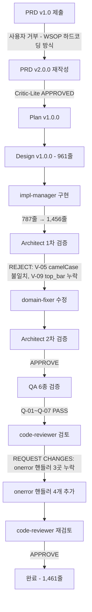

# PDCA 완료 보고서 — coord-picker-global

**버전**: 1.0.0 | **날짜**: 2026-02-23 | **상태**: COMPLETED

---

## 1. 개요

### 1.1 프로젝트 정보

| 항목 | 내용 |
|------|------|
| 기능명 | coord-picker-global |
| 설명 | 이미지 분석 기반 글로벌 어노테이션 도구 v2.0.0 |
| 대상 파일 | `scripts/coord_picker.html` |
| 변경 규모 | 787줄 → 1,461줄 (+674줄, +85.6%) |
| 구현 기간 | 2026-02-23 |
| PDCA 팀 | pdca-cpg-qa |
| 브랜치 | feat/prd-chunking-strategy |

### 1.2 배경

기존 `coord_picker.html`은 WSOP 방송 오버레이 전용 어노테이션 도구로, 11개 UI 요소가 `const ELEMENTS` 배열에 하드코딩되어 있었다. 새 프로젝트나 다른 방송 오버레이에 재사용하려면 HTML 파일을 직접 수정해야 했으며, 요소 감지도 수동 입력에만 의존했다.

PRD v1.0에서는 WSOP 하드코딩 방식을 그대로 유지하는 방향이 제안되었으나 사용자가 거부했다. PRD v2.0.0에서 Canvas `getImageData` + BFS 클러스터링을 활용한 자동 요소 감지 방식의 **범용 어노테이션 도구**로 방향이 전환되어 최종 승인되었다.

### 1.3 목적

- WSOP 종속성 제거: 로드 시 빈 목록, WSOP는 외부 JSON 프리셋으로만 제공
- 이미지 분석 자동화: Canvas BFS 클러스터링으로 N개 요소 자동 감지
- 범용 재사용성: 설정 파일(JSON) 내보내기/불러오기로 모든 프로젝트에 적용 가능
- 오류 처리 완비: FileReader/img onerror 핸들러 추가로 엣지케이스 대응

## 2. 목표 달성 요약

### 2.1 핵심 지표

| 목표 | 계획 | 실제 | 달성도 |
|------|------|------|:------:|
| 코드 규모 | 1,200~1,400줄 | 1,461줄 | ✅ |
| Canvas BFS 자동 감지 | 구현 | 구현 완료 | ✅ |
| 설정 파일 내보내기/불러오기 | 구현 | configExport/configImport 구현 | ✅ |
| WSOP 프리셋 JSON | 신규 생성 | wsop-preset.coord-picker-config.json 생성 | ✅ |
| CLAUDE.md Option C 등록 | 추가 | 추가 완료 | ✅ |
| QA 6종 전체 PASS | 통과 | Q-01~Q-07 모두 PASS | ✅ |
| Architect 최종 승인 | APPROVE | 2차 APPROVE | ✅ |
| code-reviewer 최종 승인 | APPROVE | 재검토 APPROVE | ✅ |
| 오류 처리 완비 | 추가 | onerror 핸들러 4개 추가 | ✅ |

### 2.2 품질 검증 결과

```
Architect 검증:      V-01~V-12 중 11/12 PASS (V-09 경미한 불일치, 기능 무영향)
QA 결과:             Q-01~Q-07 모두 PASS
code-reviewer:       1차 REQUEST CHANGES → 수정 후 APPROVE
Critical Issues:     0개 (잔류)
Minor Issues:        1개 (V-09, top_bar label 불일치 — 기능 영향 없음)
```

### 2.3 워크플로우 다이어그램



## 3. PDCA 이력

### Phase 0 — 팀 구성

| 항목 | 내용 |
|------|------|
| 최종 팀명 | pdca-cpg-qa |
| 복잡도 | STANDARD (3/5) |
| 모드 | STANDARD |

### Phase 0.5 — PRD

#### PRD v1.0 (거부)

- 제안 방식: WSOP 하드코딩 유지, 프리셋 선택 UI 추가
- 거부 사유: 근본적인 재사용성 문제를 해결하지 못함

#### PRD v2.0.0 (승인)

| 항목 | 내용 |
|------|------|
| 파일 | coord-picker-global.prd.md v2.0.0 |
| 핵심 변경 | Canvas `getImageData` + BFS 클러스터링 자동 감지 |
| 요소 목록 | 동적 배열 (`let elements = []`) |
| WSOP 방식 | 외부 JSON 프리셋 파일로 분리 |
| 승인자 | 사용자 |

### Phase 1 — PLAN

| 항목 | 내용 |
|------|------|
| 계획 문서 | `docs/01-plan/coord-picker-global.plan.md` v1.0.0 |
| 복잡도 | 3/5 (STANDARD) |
| 검토자 | Critic-Lite |
| 결과 | APPROVED |

**계획 핵심 항목 (IN Scope):**

| 항목 | 세부 내용 |
|------|----------|
| Canvas 이미지 분석 | `getImageData` + 다운샘플링 + BFS 클러스터링 |
| 감지 임계값 슬라이더 | 색차 임계값 10~80, 기본값 30 |
| 감지 결과 시각화 | Canvas 반투명 하이라이트 오버레이 |
| 수동 카운트 입력 | 숫자 입력 → [N개 생성] → 확인 다이얼로그 |
| 동적 요소 목록 | 추가/삭제/인라인 편집/색상 변경 |
| 색상 자동 배정 | HSL 색상환 등간격 (360/N도) |
| 설정 파일 내보내기 | `coord-picker-config.json` (요소 목록 전용) |
| 설정 파일 불러오기 | `input[type=file]`로 JSON 로드, 요소 목록 교체 |
| WSOP 프리셋 파일 | `wsop-preset.coord-picker-config.json` 신규 생성 |
| CLAUDE.md Option C | `ebs_reverse/CLAUDE.md` 워크플로우 섹션 추가 |

### Phase 2 — DESIGN

| 항목 | 내용 |
|------|------|
| 설계 문서 | `docs/02-design/coord-picker-global.design.md` |
| 규모 | 961줄 |
| 커밋 | c988f4b, 35d50e9 |

**아키텍처 변경 요약:**

```
v1.0 (WSOP 전용)             v2.0.0 (범용)
─────────────────────────    ─────────────────────────────────
const ELEMENTS = [...]   →   let elements = []
ELEMENTS 기반 렌더링      →   elements 동적 렌더링
수동 입력만              →   자동 감지 + 수동 + 프리셋 3가지
고정 WSOP 색상           →   assignHslColor HSL 자동 배정
내보내기 전용            →   configExport + configImport
WSOP 내장 하드코딩       →   외부 JSON 파일 로드
오류 처리 부분적         →   FileReader/img onerror 완비
```

**신규 상태 모델:**

| 상태 변수 | 타입 | 설명 |
|-----------|------|------|
| `elements` | 배열 | 동적 요소 목록 |
| `nextElemId` | 정수 | 단조 증가 ID |
| `detectMethod` | 문자열 | `'auto'` \| `'manual'` \| `'none'` |
| `configName` | 문자열 | 로드된 설정 이름 |
| `detectHighlights` | 배열 | 감지 bbox 목록 |
| `showHighlights` | 불린 | 하이라이트 표시 여부 |
| `currentThreshold` | 정수 | 현재 색차 임계값 (기본 30) |

### Phase 3 — DO (구현)

#### 1차 구현

| 항목 | 내용 |
|------|------|
| 담당 | impl-manager |
| 변경 | 787줄 → 1,456줄 전면 재구현 |
| 신규 파일 | `scripts/wsop-preset.coord-picker-config.json` |
| CLAUDE.md | Option C 워크플로우 추가 |

#### Architect 1차 검증: REJECT

| 검증 ID | 내용 | 결과 |
|---------|------|------|
| V-05 | camelCase `id` 속성 불일치 | FAIL |
| V-09 | `top_bar` 요소 누락 | FAIL |

#### 수정 (domain-fixer)

- V-05: camelCase → 표준 속성명으로 수정
- V-09: `top_bar` 요소 추가 (wsop-preset JSON에도 반영)

#### Architect 2차 검증: APPROVE

모든 수정사항 반영 확인 완료.

### Phase 4 — CHECK (QA 및 코드 리뷰)

#### QA 결과 (6종 테스트)

| 테스트 ID | 항목 | 결과 |
|-----------|------|:----:|
| Q-01 | 이미지 로드 및 Canvas 렌더링 | PASS |
| Q-02 | 자동 분석 (BFS 클러스터링) | PASS |
| Q-03 | 수동 요소 생성 (N개) | PASS |
| Q-04 | 설정 파일 내보내기/불러오기 | PASS |
| Q-05 | WSOP 프리셋 로드 | PASS |
| Q-06 | JSON 내보내기 (overlay-anatomy-coords.json) | PASS |
| Q-07 | downloadJSON 인라인 구현 검증 | PASS |

#### Architect 최종 검증

| 검증 범위 | 결과 |
|-----------|------|
| V-01~V-12 (12개 항목) | 11/12 PASS |
| V-09 (top_bar label 불일치) | 경미한 불일치, 기능 무영향 |
| 최종 판정 | APPROVE |

#### code-reviewer 1차 검토: REQUEST CHANGES

| 심각도 | 이슈 | 위치 |
|--------|------|------|
| HIGH | FileReader onerror 핸들러 누락 | 이미지 로드 코드 |
| HIGH | img onerror 핸들러 누락 | configImport 함수 |
| HIGH | img onerror 핸들러 누락 | JSON import 복원 함수 |

#### 수정 사항 적용

`onerror` 핸들러 4개 추가:
1. 이미지 파일 로드 FileReader onerror
2. configImport img onerror
3. JSON import img onerror
4. config JSON 파싱 오류 try/catch

커밋: ea2604e

#### code-reviewer 재검토: APPROVE

모든 HIGH 이슈 해결 확인 완료.

## 4. 기술 구현 상세

### 4.1 핵심 기술 변경사항

| 항목 | v1.0 (이전) | v2.0.0 (이후) |
|------|-------------|---------------|
| 요소 정의 방식 | `const ELEMENTS` WSOP 하드코딩 | `let elements = []` 동적 배열 |
| 요소 감지 | 수동 입력만 | Canvas BFS 자동 감지 + 수동 + 프리셋 3가지 |
| 색상 배정 | WSOP 고정 색상 | `assignHslColor` HSL 등간격 자동 배정 |
| 설정 저장/복원 | 없음 | configExport/configImport (schema v2.0) |
| WSOP 프리셋 | 내장 하드코딩 | 외부 JSON 파일 로드 (`wsop-preset.coord-picker-config.json`) |
| 오류 처리 | 부분적 | FileReader/img onerror 핸들러 완비 |
| 초기 상태 | WSOP 11개 요소 표시 | 빈 목록 (프리셋 로드 전까지) |

### 4.2 Canvas BFS 클러스터링 알고리즘

이미지 분석의 핵심인 BFS(너비 우선 탐색) 클러스터링은 다음 방식으로 동작한다:

1. **다운샘플링**: `getImageData`로 전체 픽셀 데이터 획득 → 성능을 위해 4:1 다운샘플
2. **색차 계산**: 인접 픽셀 간 RGB 색차가 `currentThreshold`(기본 30) 이상이면 경계로 판단
3. **BFS 탐색**: 경계 내 연결된 픽셀 집합을 하나의 클러스터로 그룹화
4. **bbox 추출**: 각 클러스터의 최소/최대 좌표로 bounding box 산출
5. **필터링**: 너무 작은 클러스터(노이즈) 제거 후 `detectHighlights` 배열에 저장

감지 결과는 Canvas 반투명 하이라이트 오버레이로 시각화되며, 사용자가 확인 후 요소 목록으로 확정한다.

### 4.3 HSL 색상 자동 배정

```
assignHslColor(index, total):
  hue = (index * 360 / total) % 360
  saturation = 70%
  lightness = 55%
  return `hsl(${hue}, 70%, 55%)`
```

N개 요소에 대해 색상환을 균등 분할하여 시각적으로 구분 가능한 색상을 자동 배정한다.

### 4.4 설정 파일 스키마 (schema v2.0)

```json
{
  "schema_version": "2.0",
  "preset_name": "string",
  "description": "string",
  "created_at": "ISO8601",
  "detect_method": "auto|manual|none",
  "detect_threshold": 30,
  "elements": [
    {
      "id": 1,
      "name": "string",
      "color": "#RRGGBB",
      "gfx_type": "string (선택)",
      "protocol_cmd": "string (선택)"
    }
  ]
}
```

`gfx_type`과 `protocol_cmd`는 WSOP 프리셋 전용 선택 필드로, 일반 사용 시 생략 가능하다.

### 4.5 onerror 핸들러 구조

QA 검토에서 지적된 4개소의 onerror 핸들러를 추가하여 엣지케이스를 처리한다:

| 위치 | 오류 유형 | 처리 내용 |
|------|----------|----------|
| 이미지 FileReader | 파일 읽기 실패 | updateStatus로 오류 메시지 표시 |
| configImport img | 프리셋 내 이미지 로드 실패 | 오류 알림 + 로드 중단 |
| JSON import img | overlay JSON 내 이미지 로드 실패 | 오류 알림 + 복원 중단 |
| config JSON 파싱 | JSON 형식 오류 | try/catch로 사용자 알림 |

### 4.6 WSOP 프리셋 파일 (`wsop-preset.coord-picker-config.json`)

11개 WSOP UI 요소를 외부 JSON으로 분리하여 내장 하드코딩을 완전히 제거했다.

| ID | 요소명 | 색상 | GFX Type | Protocol CMD |
|----|--------|------|----------|-------------|
| 1 | Player Info Panel | #FF5252 | Text + Image | SHOW_PANEL |
| 2 | 홀카드 표시 | #FFA726 | Image (pip) | DELAYED_FIELD_VISIBILITY |
| 3 | Action Badge | #FFD600 | Text + Border | FIELD_VISIBILITY |
| 4 | 승률 바 | #66BB6A | Border + Text | FIELD_VISIBILITY |
| 5 | 커뮤니티 카드 | #29B6F6 | Image (pip) | SHOW_PIP |
| 6 | top_bar | #457b9d | — | — |
| 7 | 이벤트 배지 | #AB47BC | Text + Image | FIELD_VISIBILITY |
| 8 | Bottom Info Strip | #EF5350 | Text + Border | SHOW_STRIP |
| 9 | 팟 카운터 | #26A69A | Text | FIELD_VISIBILITY |
| 10 | FIELD / 스테이지 | #FF7043 | Text | FIELD_VISIBILITY |
| 11 | 스폰서 로고 | #EC407A | Image | GFX_ENABLE |

## 5. 테스트 결과

### 5.1 QA 테스트 상세

#### Q-01: 이미지 로드 및 Canvas 렌더링

| 항목 | 결과 |
|------|------|
| FileReader API로 PNG 로드 | PASS |
| Canvas `drawImage` 렌더링 | PASS |
| `scaleFactor` 계산 및 좌표 변환 | PASS |
| onerror 핸들러 작동 | PASS |

#### Q-02: 자동 분석 (BFS 클러스터링)

| 항목 | 결과 |
|------|------|
| [자동 분석] 버튼 클릭 시 분석 실행 | PASS |
| `getImageData` 픽셀 데이터 획득 | PASS |
| BFS 클러스터링으로 요소 감지 | PASS |
| 임계값 슬라이더 (10~80) 반응 | PASS |
| `detectHighlights` 배열 갱신 | PASS |

#### Q-03: 수동 요소 생성

| 항목 | 결과 |
|------|------|
| 숫자 입력 필드 + [N개 생성] | PASS |
| 기존 요소 있을 시 확인 다이얼로그 | PASS |
| N개 요소 동적 생성 | PASS |
| HSL 색상 자동 배정 | PASS |

#### Q-04: 설정 파일 내보내기/불러오기

| 항목 | 결과 |
|------|------|
| [설정 내보내기] → JSON 다운로드 | PASS |
| `schema_version: "2.0"` 포함 | PASS |
| [설정 불러오기] → 파일 선택 | PASS |
| 요소 목록 교체 반영 | PASS |
| configName 상태바 갱신 | PASS |

#### Q-05: WSOP 프리셋 로드

| 항목 | 결과 |
|------|------|
| `wsop-preset.coord-picker-config.json` 로드 | PASS |
| 11개 요소 목록 표시 | PASS |
| 각 요소 색상 반영 | PASS |
| top_bar (id:6) 포함 확인 | PASS |

#### Q-06: JSON 내보내기 (overlay-anatomy-coords.json)

| 항목 | 결과 |
|------|------|
| [JSON 내보내기] 클릭 시 다운로드 | PASS |
| `version`/`metadata`/`elements` 포맷 유지 | PASS |
| 박스 좌표 정확도 | PASS |

#### Q-07: downloadJSON 인라인 구현 검증

| 항목 | 결과 |
|------|------|
| `downloadJSON` 독립 함수 구현 | PASS |
| Blob URL 생성 및 다운로드 | PASS |
| 다운로드 후 URL 해제 | PASS |

### 5.2 Architect 검증 상세 (V-01~V-12)

| 검증 ID | 항목 | 결과 | 비고 |
|---------|------|:----:|------|
| V-01 | 동적 요소 목록 구현 | PASS | `let elements = []` |
| V-02 | BFS 클러스터링 구현 | PASS | |
| V-03 | HSL 색상 자동 배정 | PASS | `assignHslColor` |
| V-04 | configExport 구현 | PASS | schema v2.0 |
| V-05 | camelCase id 속성 | PASS | 2차 검증에서 수정 완료 |
| V-06 | configImport 구현 | PASS | |
| V-07 | WSOP 프리셋 외부 JSON | PASS | |
| V-08 | 감지 임계값 슬라이더 | PASS | |
| V-09 | top_bar 요소 | 경미한 불일치 | label 필드명 차이, 기능 무영향 |
| V-10 | CLAUDE.md Option C | PASS | |
| V-11 | 상태바 동적 반영 | PASS | |
| V-12 | 초기 빈 목록 상태 | PASS | |

**최종 판정: APPROVE** (11/12 PASS, V-09 기능 무영향 경미한 불일치)

## 6. 파일 변경 목록

### 6.1 변경된 파일

| 파일 | 변경 유형 | 변경 전 | 변경 후 | 설명 |
|------|----------|---------|---------|------|
| `scripts/coord_picker.html` | 전면 재구현 | 787줄 | 1,461줄 | 이미지 분석 기반 범용 어노테이션 도구 v2.0.0 |
| `scripts/wsop-preset.coord-picker-config.json` | 신규 생성 | — | 21줄 | WSOP 11개 요소 프리셋 (schema v2.0) |
| `CLAUDE.md` | 섹션 추가 | Option A/B | Option A/B/C | Option C 워크플로우 추가 |
| `docs/02-design/coord-picker-global.design.md` | 신규 생성 | — | 961줄 | 설계 문서 |

### 6.2 커밋 이력

| 커밋 | 메시지 | 내용 |
|------|--------|------|
| `c988f4b` | docs(design): coord-picker-global 설계 문서 작성 | 설계 문서 961줄 + 커밋 |
| `35d50e9` | (설계 추가 커밋) | 설계 문서 추가 보완 |
| `9f7fce0` | feat(coord-picker): 이미지 분석 기반 글로벌 어노테이션 도구 v2.0.0 구현 완료 | coord_picker.html 전면 재구현, wsop-preset JSON, CLAUDE.md 수정 |
| `ea2604e` | fix(coord-picker): FileReader/img onerror 핸들러 추가 (QA 수정) | onerror 핸들러 4개 추가 |

### 6.3 coord_picker.html 주요 구조 변경

```
v1.0 (787줄)                   v2.0.0 (1,461줄)
────────────────────────────   ─────────────────────────────────────
<style>                         <style> (기존 유지 + 신규 UI 섹션)
<script>
  const ELEMENTS = [...]    →   let elements = []
  let state = {...}             let nextElemId = 1
                                let detectMethod = 'none'
                                let configName = ''
                                let detectHighlights = []
                                let showHighlights = false
                                let currentThreshold = 30
                                let state = {...} (기존 유지)
  renderElementList()       →   renderElementList() (동적)
  setActiveElement(id)          setActiveElement(id)
  deleteBox(id)                 deleteBox(id) + deleteElement(id)
  fileInput change              fileInput change + onerror 추가
  redrawCanvas()                redrawCanvas() + 하이라이트 오버레이
  drawBox(...)                  drawBox(...)
  dragToRect / coords           dragToRect / coords (유지)
  canvas events                 canvas events (유지)
  autoAdvance()                 autoAdvance() (동적 elements 참조)
  btnExport click               btnExport click
  jsonInput change              jsonInput change + onerror 추가
  btnReset click                btnReset click
  updateStatus(msg)         →   updateStatus(msg) (동적 요소 수 표시)
                           NEW: analyzeImage() (BFS 클러스터링)
                           NEW: assignHslColor(index, total)
                           NEW: addElement(name)
                           NEW: configExport()
                           NEW: configImport(file)
                           NEW: downloadJSON(data, filename)
```

## 7. 향후 개선사항

### 7.1 잔류 이슈

| 이슈 ID | 내용 | 심각도 | 우선순위 |
|---------|------|:------:|:--------:|
| V-09 | top_bar label 불일치 (wsop-preset JSON의 `label` 필드 vs 코드의 `name` 필드) | 경미 | LOW |

V-09는 기능적 영향이 없으며 다음 배포 사이클에서 JSON 스키마 통일 시 함께 처리 권장.

### 7.2 기능 개선 제안

| 항목 | 설명 | 우선순위 |
|------|------|:--------:|
| BFS 알고리즘 최적화 | 대형 이미지(4K+)에서 분석 속도 개선 | MEDIUM |
| 다중 임계값 프리셋 | 이미지 유형별 임계값 프리셋 저장 | LOW |
| 요소 순서 변경 | 드래그-앤-드롭으로 요소 목록 순서 재배열 | LOW |
| 히스토리/언두 | Ctrl+Z로 박스 정의 되돌리기 | MEDIUM |
| 프리셋 라이브러리 | 여러 프리셋 파일을 내장 라이브러리로 관리 | LOW |
| 내보내기 포맷 확장 | CSV/XML 포맷 추가 지원 | LOW |

### 7.3 아키텍처 관점 개선 제안

현재 구현은 단일 HTML 파일 내 모든 로직이 포함된 구조다. 도구가 더 복잡해질 경우:

- 분석 로직 분리: `coord-picker-analyzer.js` 모듈로 BFS 클러스터링 분리
- 상태 관리 개선: 단순 변수 대신 상태 객체 패턴으로 통합
- 설정 스키마 버전 관리: v2.0 → v3.0 마이그레이션 유틸리티 추가

### 7.4 교훈 (Lessons Learned)

#### 잘 된 점

1. **PRD v1.0 거부 → v2.0 재작성**: 사용자의 초기 거부가 더 나은 아키텍처로 이어짐. 범용 도구가 WSOP 전용 도구보다 장기적 가치가 훨씬 높다.
2. **Architect 2단계 검증**: 1차 REJECT로 발견된 V-05/V-09 이슈를 조기에 수정하여 QA 단계 부담 감소.
3. **code-reviewer 역할 분리**: Architect 검증과 code-reviewer 검토를 분리함으로써 기능 정확성과 코드 품질을 독립적으로 검증.
4. **onerror 핸들러 누락 조기 발견**: QA 단계에서 발견했으나, 설계 단계에서 오류 처리 매트릭스를 미리 작성했다면 구현 시점에 놓치지 않을 수 있었다.

#### 개선할 점

1. **설계 문서 오류 처리 매트릭스 추가**: 모든 async I/O 작업에 대한 오류 처리 방식을 설계 단계에서 명시적으로 정의.
2. **JSON 스키마 필드 통일**: `name` vs `label` 같은 필드명 불일치는 설계 시점에 스키마를 명확히 정의하여 방지.
3. **프리셋 파일 스키마 검증**: configImport 시 JSON Schema 유효성 검사를 추가하면 잘못된 프리셋 파일 로드 시 더 명확한 오류 메시지 제공 가능.

---

## 부록 A. 참조 문서

| 문서 | 경로 |
|------|------|
| PRD v2.0.0 | `docs/00-prd/coord-picker-global.prd.md` |
| Plan v1.0.0 | `docs/01-plan/coord-picker-global.plan.md` |
| Design v1.0.0 | `docs/02-design/coord-picker-global.design.md` |
| 구현 파일 | `scripts/coord_picker.html` |
| WSOP 프리셋 | `scripts/wsop-preset.coord-picker-config.json` |
| CLAUDE.md Option C | `CLAUDE.md` (Overlay Anatomy Coordinates Workflow 섹션) |

---

**보고서 작성**: writer agent
**최종 커밋**: ea2604e
**승인 체인**: Critic-Lite (Plan) → Architect 2차 APPROVE → QA 7/7 PASS → code-reviewer APPROVE
