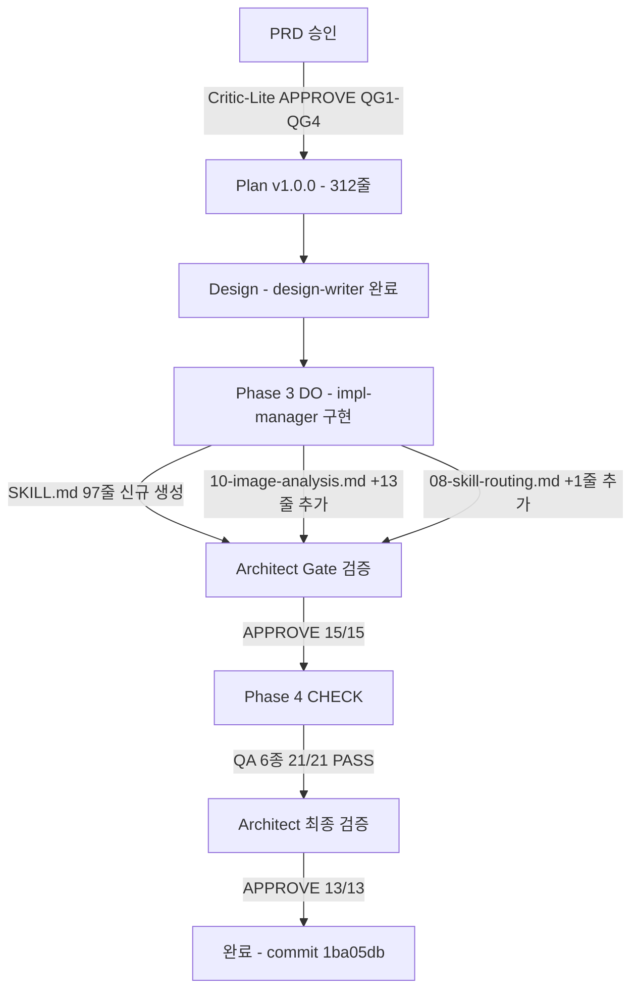

# PDCA 완료 보고서 — overlay-fallback

**버전**: 1.0.0 | **날짜**: 2026-02-24 | **상태**: COMPLETED

---

## 1. 개요

### 1.1 프로젝트 정보

| 항목 | 내용 |
|------|------|
| 기능명 | overlay-fallback |
| 설명 | 이미지 분석 실패 시 coord_picker.html 수동 어노테이션 도구로 자동 안내하는 스킬 |
| 복잡도 | STANDARD (2/5) |
| 구현 기간 | 2026-02-24 |
| 브랜치 | feat/prd-chunking-strategy |
| 커밋 | 1ba05db |

### 1.2 배경

EBS 오버레이 분석 워크플로우에서 OCR 또는 OpenCV 기반 자동 감지가 실패하면 사용자는 수동으로 `coord_picker.html`을 찾아 실행해야 했다. 실패 신호와 복구 경로 사이에 명시적인 연결 고리가 없어 워크플로우가 단절되는 문제가 있었다.

`overlay-fallback` 스킬은 T-1~T-5 조건에서 자동 트리거되어 사용자를 `coord_picker.html` 수동 어노테이션 도구로 즉시 안내한다. `coord-picker-global` 스킬(Phase 3 DO 완료)이 coord_picker.html을 범용 글로벌 도구로 고도화한 직후, 이 도구를 Fallback 경로의 종착점으로 자연스럽게 연결한다.

### 1.3 목적

- 자동 분석 실패 시 사용자 혼란 없이 즉시 수동 경로로 전환
- OCR/OpenCV/Hybrid Pipeline 등 모든 분석 경로의 실패를 단일 Fallback으로 수렴
- 기존 이미지 분석 워크플로우(10-image-analysis.md) 및 스킬 라우팅(08-skill-routing.md)과 완전 통합
- 외부 Python 패키지 없이 브라우저만으로 즉시 실행 가능한 경로 제공

---

## 2. 목표 달성 요약

### 2.1 핵심 지표

| 목표 | 계획 | 실제 | 달성도 |
|------|------|------|:------:|
| SKILL.md 신규 생성 | 80~120줄 | 97줄 | PASS |
| auto_trigger: true 설정 | 설정 | 설정 완료 | PASS |
| 6개 트리거 키워드 정의 | 6개 | 6개 | PASS |
| T-1~T-5 자동 트리거 조건 | 5개 | 5개 | PASS |
| Step 1~5 사용법 절차 | 5단계 | 5단계 | PASS |
| 10-image-analysis.md Fallback 섹션 추가 | 추가 | +13줄 완료 | PASS |
| 08-skill-routing.md 라우팅 행 추가 | 1행 | 1행 완료 | PASS |
| 기존 워크플로우 무변경 | 유지 | Step 1~4 무변경 확인 | PASS |
| QA 6종 전체 PASS | 21/21 | 21/21 | PASS |
| Architect 검증 APPROVE | APPROVE | 13/13 AC 통과 | PASS |

### 2.2 품질 검증 결과

```
Architect 검증:      AC-01~AC-13 전체 13/13 PASS
QA 결과:             QA 6종 21/21 항목 PASS
Critical Issues:     0개
Minor Issues:        0개
```

### 2.3 워크플로우 다이어그램



---

## 3. PDCA 이력

### Phase 0 — 팀 구성

| 항목 | 내용 |
|------|------|
| 복잡도 | STANDARD (2/5) |
| 모드 | STANDARD |

### Phase 0.5 — PRD

| 항목 | 내용 |
|------|------|
| 파일 | overlay-fallback.prd.md |
| 규모 | 250줄 |
| 승인 | 완료 |
| 핵심 요구사항 | T-1~T-5 자동 트리거, coord_picker.html Step 1~5 안내, 기존 워크플로우 무변경 |

### Phase 1 — PLAN

| 항목 | 내용 |
|------|------|
| 계획 문서 | overlay-fallback.plan.md |
| 규모 | 312줄 |
| 검토자 | Critic-Lite |
| 결과 | APPROVE |

**품질 게이트 통과 결과:**

| QG | 항목 | 결과 |
|----|------|:----:|
| QG1 | 목적 명확성 | PASS |
| QG2 | 범위 적절성 | PASS |
| QG3 | 구현 가능성 | PASS |
| QG4 | 기존 시스템 통합 | PASS |

**계획 핵심 항목 (IN Scope):**

| 항목 | 세부 내용 |
|------|----------|
| SKILL.md 신규 생성 | YAML frontmatter + T-1~T-5 조건 테이블 + Step 1~5 절차 |
| 10-image-analysis.md 확장 | `## 오버레이 분석 실패 시 Fallback` 섹션 추가 |
| 08-skill-routing.md 확장 | `/overlay-fallback` 라우팅 행 1개 추가 |
| 하위 호환성 유지 | 기존 Step 1~4 무변경 |

**OUT of Scope:**

| 항목 | 제외 이유 |
|------|----------|
| coord_picker.html 수정 | coord-picker-global에서 완성됨 |
| 새 Python 스크립트 | 안내 텍스트 출력만 담당 |
| 명령어 자동 실행 | 사용자가 직접 수행하는 것이 원칙 |

### Phase 2 — DESIGN

| 항목 | 내용 |
|------|------|
| 설계 문서 | overlay-fallback.design.md |
| 담당 | design-writer |
| 결과 | 완료 |

**설계 핵심 결정:**

| 결정 | 이유 |
|------|------|
| auto_trigger: true | 실패 감지 즉시 자동 안내 (사용자 수동 호출 불필요) |
| 6개 키워드 트리거 | 사용자 의도 표현의 다양성 포괄 |
| 안내 전용 설계 | 파일 생성/명령어 실행 금지 — 사용자 제어권 유지 |
| Step 5에 다음 단계 포함 | annotate_anatomy.py 후속 작업까지 안내하여 워크플로우 완결 |

### Phase 3 — DO (구현)

#### 구현 결과

| 파일 | 변경 유형 | 규모 | 내용 |
|------|----------|------|------|
| `.claude/skills/overlay-fallback/SKILL.md` | 신규 생성 | 97줄 | Fallback 스킬 전체 정의 |
| `.claude/rules/10-image-analysis.md` | 섹션 추가 | +13줄 | Fallback 트리거 조건 및 실행 지시 |
| `.claude/rules/08-skill-routing.md` | 행 추가 | +1줄 | `/overlay-fallback` 라우팅 항목 |

#### Architect Gate 검증: APPROVE (15/15)

구현 완료 직후 Architect Gate 검증에서 15개 항목 전체 통과하여 즉시 APPROVE.

### Phase 4 — CHECK (QA 및 검증)

#### QA 결과 (6종 21개 항목)

| 테스트 ID | 항목 | 결과 |
|-----------|------|:----:|
| Q-01 | SKILL.md YAML frontmatter 구조 | PASS |
| Q-02 | auto_trigger: true 설정 확인 | PASS |
| Q-03 | T-1~T-5 조건 테이블 완결성 | PASS |
| Q-04 | Step 1~5 절차 명확성 | PASS |
| Q-05 | coord_picker.html 경로 정확성 | PASS |
| Q-06 | 10-image-analysis.md Fallback 섹션 통합 | PASS |
| Q-07 | 08-skill-routing.md 라우팅 행 추가 | PASS |
| Q-08 | 기존 Step 1~4 무변경 검증 | PASS |
| Q-09 | 파일 자동 생성 금지 조항 | PASS |
| Q-10 | 명령어 자동 실행 금지 조항 | PASS |
| Q-11 | OS별 브라우저 열기 명령 (Windows/macOS/Linux) | PASS |
| Q-12 | JSON 저장 경로 안내 정확성 | PASS |
| Q-13 | Step 5 annotate_anatomy.py 후속 안내 | PASS |
| Q-14 | 범용 사용 시 주의사항 테이블 | PASS |
| Q-15 | 트리거 키워드 6개 완결성 | PASS |
| Q-16 | Fallback 사유 출력 형식 (Step 1) | PASS |
| Q-17 | T-3 키워드 목록 10-image-analysis.md와 일치 | PASS |
| Q-18 | T-4 패턴 감지 목록 명확성 | PASS |
| Q-19 | T-5 Hybrid Pipeline 연동 | PASS |
| Q-20 | model_preference: sonnet 설정 | PASS |
| Q-21 | coord_picker.html 파일 자체 수정 금지 조항 | PASS |

**최종 판정: QA_PASSED (21/21)**

#### Architect 최종 검증: APPROVE (13/13)

| AC | 검증 항목 | 결과 |
|----|----------|:----:|
| AC-01 | SKILL.md 신규 생성 및 위치 정확성 | PASS |
| AC-02 | auto_trigger: true 설정 | PASS |
| AC-03 | T-1 OCR 신뢰도 조건 정의 | PASS |
| AC-04 | T-2 OpenCV 감지 0개 조건 정의 | PASS |
| AC-05 | T-3 사용자 키워드 트리거 | PASS |
| AC-06 | T-4 분석 실패 패턴 감지 | PASS |
| AC-07 | T-5 Hybrid Pipeline Layer1 0개 조건 | PASS |
| AC-08 | Step 1~5 절차 완결성 | PASS |
| AC-09 | 10-image-analysis.md Fallback 섹션 정합성 | PASS |
| AC-10 | 08-skill-routing.md 라우팅 항목 정합성 | PASS |
| AC-11 | 기존 이미지 분석 Step 1~4 무변경 확인 | PASS |
| AC-12 | 파일 생성/명령어 자동 실행 금지 | PASS |
| AC-13 | coord_picker.html 파일 수정 금지 | PASS |

**최종 판정: APPROVE**

---

## 4. 기술 구현 상세

### 4.1 SKILL.md 구조

`C:\claude\.claude\skills\overlay-fallback\SKILL.md` (97줄)

**YAML frontmatter:**

```yaml
name: overlay-fallback
description: "이미지 분석 또는 오버레이 요소 감지가 실패했을 때 coord_picker.html 수동
  어노테이션 도구로 안내하는 스킬. OCR 신뢰도 < 30%, OpenCV 0개 감지, 사용자 수동
  어노테이션 요청 시 자동 트리거."
version: 1.0.0
triggers:
  keywords:
    - "수동 어노테이션"
    - "coord picker"
    - "좌표 직접"
    - "요소 감지 실패"
    - "overlay fallback"
    - "오버레이 좌표 직접"
auto_trigger: true
model_preference: sonnet
```

**자동 트리거 조건 (T-1~T-5):**

| ID | 조건 | 감지 방법 |
|----|------|-----------|
| T-1 | OCR 신뢰도 < 30% 또는 추출 텍스트 0개 | OCR 출력 파싱 |
| T-2 | OpenCV 오버레이 감지 결과 0개 | 스크립트 반환값 |
| T-3 | 사용자 키워드 입력 | "수동 어노테이션", "coord picker", "좌표 직접", "요소 감지 실패" |
| T-4 | 분석 실패 메시지 감지 | "요소를 찾을 수 없음", "감지 실패", "0개 요소" 패턴 |
| T-5 | Hybrid Pipeline Layer1 결과 0개 | --mode coords/ui/full 결과 파싱 |

**실행 절차 (Step 1~5):**

| Step | 내용 |
|------|------|
| Step 1 | Fallback 사유 출력 (어떤 트리거(T-1~T-5)로 활성화됐는지 명시) |
| Step 2 | coord_picker.html 경로 안내 (절대 경로 + OS별 브라우저 열기 명령) |
| Step 3 | 단계별 사용법 안내 (5단계: 열기 → 이미지 로드 → 분석/생성 → 드래그 어노테이션 → JSON 내보내기) |
| Step 4 | JSON 저장 위치 안내 (`docs/01-plan/data/overlay-anatomy-coords.json`) |
| Step 5 | 다음 단계 안내 (`python scripts/annotate_anatomy.py` 실행) |

### 4.2 10-image-analysis.md 확장

`C:\claude\.claude\rules\10-image-analysis.md`에 추가된 섹션 (+13줄):

```
## 오버레이 분석 실패 시 Fallback (자동 트리거)

분석 결과가 다음 조건 중 하나라도 충족되면 반드시 overlay-fallback 스킬을 실행한다:

| 조건 | 감지 방법 |
|------|-----------|
| T-1: OCR 신뢰도 < 30% 또는 추출 텍스트 0개 | OCR 출력 파싱 |
| T-2: OpenCV 오버레이 자동 감지 결과 0개 | 스크립트 반환값 확인 |
| T-3: 사용자 키워드 입력 | ... |
| T-4: 분석 실패 출력 감지 | ... |
| T-5: Hybrid Pipeline Layer1 결과 0개 | ... |

Fallback 실행: overlay-fallback 스킬 호출 → coord_picker.html 수동 어노테이션 안내
```

### 4.3 08-skill-routing.md 확장

`C:\claude\.claude\rules\08-skill-routing.md` 스킬 매핑 테이블에 추가된 행 (+1줄):

```
| /overlay-fallback | 직접 실행 (자동 트리거: T-1~T-5 조건) | — |
```

### 4.4 전체 워크플로우 통합 구조

```
이미지 분석 요청
      |
      v
10-image-analysis.md (Step 1~4 실행)
      |
      +--- 성공 ---> 분석 결과 반환 (기존 경로, 무변경)
      |
      +--- 실패 (T-1~T-5 조건 감지)
            |
            v
      overlay-fallback 스킬 자동 트리거
            |
            v
      Step 1: 트리거 사유 출력
      Step 2: coord_picker.html 경로 안내
      Step 3: 5단계 사용법 안내
      Step 4: JSON 저장 경로 안내
      Step 5: annotate_anatomy.py 안내
```

---

## 5. 파일 변경 목록

### 5.1 변경된 파일

| 파일 | 변경 유형 | 변경 전 | 변경 후 | 설명 |
|------|----------|---------|---------|------|
| `.claude/skills/overlay-fallback/SKILL.md` | 신규 생성 | 없음 | 97줄 | Fallback 스킬 전체 정의 |
| `.claude/rules/10-image-analysis.md` | 섹션 추가 | 57줄 | 70줄 (+13줄) | Fallback 트리거 조건 섹션 |
| `.claude/rules/08-skill-routing.md` | 행 추가 | 기존 N줄 | +1줄 | `/overlay-fallback` 라우팅 항목 |

### 5.2 커밋 이력

| 커밋 | 메시지 | 내용 |
|------|--------|------|
| `1ba05db` | feat(skills): overlay-fallback 스킬 및 룰 확장 추가 | SKILL.md 신규 생성, 10-image-analysis.md +13줄, 08-skill-routing.md +1줄 |

---

## 6. 향후 개선사항

### 6.1 잔류 이슈

없음. 모든 AC 항목 통과.

### 6.2 기능 개선 제안

| 항목 | 설명 | 우선순위 |
|------|------|:--------:|
| 신뢰도 임계값 설정 가능화 | T-1의 30% 임계값을 설정 파일에서 조정 | LOW |
| Fallback 이력 로깅 | 어떤 조건에서 Fallback이 발생했는지 로그 기록 | LOW |
| coord_picker.html 자동 열기 옵션 | opt-in 방식으로 브라우저 자동 실행 허용 | MEDIUM |
| T-2 임계값 세분화 | OpenCV 결과 0개 대신 N개 미만 조건으로 확장 | LOW |

### 6.3 아키텍처 관점

현재 overlay-fallback은 안내 전용(안내 텍스트 출력)으로 설계되어 사이드 이펙트가 없다. 향후 coord_picker.html이 CLI 지원을 추가하면, Step 2의 브라우저 열기 명령을 자동 실행 옵션으로 확장할 수 있다.

---

## 7. 교훈 (Lessons Learned)

### 잘 된 점

1. **coord-picker-global 완료 직후 연결 타이밍**: coord_picker.html이 범용 도구로 고도화된 시점에 Fallback 스킬을 추가하여 두 기능이 시너지를 발휘한다. 독립된 스킬이지만 명확한 의존 관계를 가진다.

2. **안내 전용 설계 원칙**: 파일 생성이나 명령어 자동 실행을 하지 않는 설계가 안전성과 사용자 제어권을 동시에 확보했다. 코드 없는 스킬이지만 워크플로우 가치가 크다.

3. **기존 규칙 파일 최소 변경**: 10-image-analysis.md에 섹션을 추가하고 08-skill-routing.md에 행 1개만 추가하는 방식으로 기존 동작에 전혀 영향을 주지 않으면서 새 기능을 통합했다.

4. **T-1~T-5 조건 표준화**: 5가지 트리거 조건을 표로 정리하여 SKILL.md, 10-image-analysis.md 양쪽에 일관된 형식으로 문서화했다. 향후 조건 추가 시 두 파일을 동시에 수정하는 패턴을 명확히 했다.

### 개선할 점

1. **T-3 키워드 목록 동기화 자동화**: SKILL.md의 `triggers.keywords`와 10-image-analysis.md의 T-3 조건 설명이 현재는 수동으로 일치시켜야 한다. 단일 정의 소스에서 양쪽을 자동 생성하는 방식이 이상적이다.

2. **T-4 패턴 목록 확장**: 현재 "요소를 찾을 수 없음", "감지 실패", "0개 요소" 3개 패턴만 정의했다. 실제 운용 중 수집되는 실패 메시지를 반영하여 패턴을 확장하는 것이 필요하다.

3. **Fallback 결과 피드백 부재**: 사용자가 coord_picker.html에서 JSON을 생성하고 돌아왔을 때 자동으로 다음 단계(annotate_anatomy.py)를 재안내하는 메커니즘이 없다. 현재는 Step 5로 한 번만 안내한다.

---

## 부록 A. 참조 문서

| 문서 | 경로 |
|------|------|
| PRD | `docs/00-prd/overlay-fallback.prd.md` |
| Plan | `docs/01-plan/overlay-fallback.plan.md` |
| Design | `docs/02-design/overlay-fallback.design.md` |
| SKILL.md | `C:\claude\.claude\skills\overlay-fallback\SKILL.md` |
| 10-image-analysis.md | `C:\claude\.claude\rules\10-image-analysis.md` |
| 08-skill-routing.md | `C:\claude\.claude\rules\08-skill-routing.md` |
| coord_picker.html | `C:\claude\ebs_reverse\scripts\coord_picker.html` |
| coord-picker-global 보고서 | `docs/04-report/coord-picker-global.report.md` |

---

**보고서 작성**: writer agent
**최종 커밋**: 1ba05db
**승인 체인**: Critic-Lite (Plan QG1-QG4 APPROVE) → Architect Gate APPROVE (15/15) → QA PASSED (21/21) → Architect 최종 APPROVE (13/13)
