# PokerGFX - 제품 요구사항 정의서

> **Version**: 11.0.0
> **Date**: 2026-02-17
> **문서 유형**: 제품 요구사항 정의서 (Product Requirements Document)
> **대상 독자**: 기획자, 프로덕트 매니저, 개발 리드, 이해관계자
> **벤치마크**: PokerGFX Server v3.2.985.0

---

## Executive Summary

포커 방송에는 다른 스포츠에 없는 근본적인 문제가 있다. 플레이어의 카드가 뒤집혀 있어 카메라로는 보이지 않는다. 시청자가 게임을 이해하려면 이 **보이지 않는 정보**를 화면에 표시해야 한다.

PokerGFX는 이 문제를 해결하는 라이브 포커 방송 전용 그래픽 시스템이다. 테이블에 내장된 RFID 리더가 카드를 전자적으로 인식하고, 게임 엔진이 22개 포커 변형의 규칙과 승률을 실시간으로 연산하며, GPU 렌더러가 방송 화면 위에 그래픽을 합성한다. 카드가 테이블에 놓이는 순간부터 방송 화면에 표시되기까지 200ms 이내.

동시에 현장의 게임 공정성을 보호한다. Dual Canvas 아키텍처가 Venue Canvas(현장용, 카드 숨김)와 Broadcast Canvas(방송용, 카드 공개)를 물리적으로 분리하여, 시청자에게는 모든 것을 보여주면서도 현장에는 아무것도 유출하지 않는다.

시스템은 서버 엔진 1대와 3개 핵심 앱으로 구성된다. 게임 진행을 제어하는 Action Tracker와 독립 승률 계산을 수행하는 HandEvaluation — 방송에 필요한 최소 앱만으로 효율적으로 운영된다.

**벤치마크**: PokerGFX Server v3.2.985.0 (Windows .NET Framework 4.x, 2중 난독화)

| 지표 | 목표 |
|------|------|
| 카드 인식 정확도 | 99.9% |
| End-to-End 레이턴시 | ≤ 200ms |
| 동시 접속 클라이언트 | 3+ |
| 지원 게임 변형 | 22개 |
| 기능 커버리지 | P0 81 · P1 45 · P2 18 = 144개 |

---

# Part I: 배경

## 1. 포커 방송은 왜 다른가

### 방송 그래픽의 기본 역할

모든 스포츠 방송의 그래픽 시스템은 같은 일을 한다. **경기 상황을 시청자에게 시각적으로 전달**하는 것이다. 축구 중계의 점수판, 야구 중계의 볼카운트, 농구 중계의 샷클락 모두 같은 목적을 수행한다.

그런데 포커는 근본적으로 다르다.

### 정보 가시성의 차이


> *일반 스포츠 방송은 카메라가 경기장의 모든 정보를 포착하고, GFX는 이를 정리하여 표시만 하면 된다. 포커 방송은 카메라 영상만으로는 뒤집힌 카드를 알 수 없어, RFID가 카드 데이터를 전자적으로 읽고 게임 엔진이 확률을 연산한 뒤, 카메라 영상 위에 그래픽을 합성하여 방송한다.*

### Hidden Information Problem

포커와 다른 스포츠의 결정적 차이는 **Hidden Information**이다.

| 구분 | 일반 스포츠 | 포커 |
|------|------------|------|
| **핵심 정보** | 공개됨 (공 위치, 점수) | 비공개 (홀카드) |
| **그래픽의 역할** | 정리 및 표시 | **생성** 및 표시 |
| **정보 획득** | 카메라 영상 | RFID 센서 |
| **연산 필요** | 거의 없음 | 실시간 확률 계산 |
| **보안 요구** | 없음 | 현장 유출 차단 필수 |
| **게임 규칙** | 1개 (해당 종목) | 22개 변형 |
| **자동 인식** | 불필요 | RFID 카드 인식 필수 |

축구 중계에서 점수판을 표시하려면 점수를 입력하면 된다. 누구나 점수가 몇 대 몇인지 보고 있다.

포커 중계에서 홀카드를 표시하려면 **테이블 아래 숨겨진 RFID 리더가 뒤집어진 카드를 전자적으로 읽어야 한다**. 아무도 그 카드가 뭔지 모르기 때문이다.

### 보안의 역설

포커 방송에는 독특한 역설이 존재한다.

- **시청자에게**: 홀카드를 보여줘야 한다
- **현장에**: 홀카드를 절대 보여주면 안 된다

현장에 있는 모니터에 홀카드가 표시되면 플레이어가 상대의 카드를 볼 수 있다. 이는 게임의 공정성을 파괴한다. 그래서 포커 방송 시스템은 **두 개의 별도 화면**을 동시에 생성해야 한다. 하나는 현장용(홀카드 숨김), 하나는 방송용(홀카드 공개). 이것이 Dual Canvas 개념이다.

### 자동화가 필요한 이유

카드 인식 계층이 추가되면서, 수동 운영만으로는 처리하기 어려운 데이터량이 발생한다.

| 요구사항 | 배경 |
|----------|------|
| 매 핸드 최대 20장 카드 인식 | 10명 x 홀카드 2장이 매 핸드마다 반복된다 |
| 실시간 액션 추적 | Fold, Bet, Raise가 초 단위로 발생한다 |
| 승률 재계산 | 보드 카드가 나올 때마다 모든 플레이어의 Equity가 변동한다 |
| 보안 딜레이 | 생방송 중 홀카드 정보 유출을 방지해야 한다 |

### 왜 전용 시스템이 필요한가

일반 방송 그래픽 도구(CasparCG, vMix 등)로 포커 방송을 할 수 없는 이유:

**일반 그래픽 도구가 하는 일**: 텍스트 오버레이, 이미지 오버레이, 타이머, 애니메이션

**포커 방송이 추가로 요구하는 것**:

| 요구사항 | 설명 |
|----------|------|
| RFID 하드웨어 드라이버 | 리더 12대 제어 |
| 카드 자동 인식 엔진 | 52장 실시간 추적 |
| 22개 게임 규칙 엔진 | 게임별 상태 관리 |
| 핸드 평가 알고리즘 | 등급 + 승률 계산 |
| Dual Canvas GPU 렌더링 | 현장/방송 분리 |
| Trustless 보안 모드 | 현장 유출 차단 |
| 3개 앱 동기화 프로토콜 | 역할별 앱 연동 |
| GFX 운영자용 터치스크린 UI | 게임 진행 입력 |
| 실시간 통계 | VPIP, PFR 등 플레이어 분석 |

이것이 **전용 시스템**이 필요한 이유다. PokerGFX는 단순한 그래픽 오버레이가 아니라, RFID 하드웨어부터 GPU 렌더링까지 수직 통합된 포커 전용 방송 엔진이다.

---

## 2. 카드 인식 기술의 진화

### 두 세대의 기술

포커 방송에서 "뒤집어진 카드를 시청자에게 보여준다"는 과제는 기술에 종속되지 않는다. 해결 방식은 기술과 함께 진화해 왔다.


> *World Poker Tour 방송 화면. 테이블 유리판 아래에 설치된 소형 카메라가 플레이어의 홀카드(6♠ 8♣)를 촬영한다. 이 1세대 기술은 카메라 각도와 조명에 의존하며, RFID 기반 2세대 기술로 대체되었다. (출처: ClubWPT.com)*

### 기술 진화 타임라인

| 시기 | 이벤트 |
|------|--------|
| 1995 | Henry Orenstein, Hole Card Camera 특허 취득 |
| 1999 | Late Night Poker (Channel 4, UK), 최초의 홀카드 방송 |
| 2002 | ESPN WSOP 방송, Hole Card Camera 채택 |
| 2003 | World Poker Tour 런칭, 홀카드 방송의 대중화 |
| 2012 | European Poker Tour, RFID 테이블 도입 — 전자 인식 시대 개막 |
| 2013 | WSOP, RFID 기술 라이브 스트리밍에 적용 |
| 2014~2018 | WSOP, 30분 딜레이 프로토콜 + RFID 카드 운용 |
| 2024~현재 | RFID가 모든 주요 토너먼트의 표준으로 정착 |


> *1999년 영국 Channel 4의 Late Night Poker. 투명 테이블 아래 카메라로 플레이어의 홀카드를 촬영한 최초의 방송이다. 이 혁신이 포커를 "시청 가능한 스포츠"로 만들었다. (출처: Channel 4)*

### 1세대 Hole Camera의 한계

- 카메라 각도와 조명에 의존 — 카드가 정확한 위치에 있어야 인식 가능
- 딜러가 카드를 특정 위치에 놓아야 하므로 게임 속도 저하
- 이미지 인식 정확도 제한
- 유리판 설치로 테이블 구조 변경 필요
- 10인 테이블에서 20장 카드를 동시 촬영하기 어려움
- **생방송 불가능** — 카메라 영상의 후처리(각도 보정, 인식)에 시간이 소요되어 실시간 중계가 불가능. 편집 방송으로만 진행 가능

### 2세대 RFID의 장점

- 물리적 접촉 없이 전자적으로 카드 식별
- 인식 지연 ~50ms, 오류율 0%
- 테이블 표면 아래 매립으로 외관 변화 없음
- 10인 x 2장 = 20장 홀카드 동시 추적
- 게임 흐름 무중단

**본 시스템은 현재 업계 표준인 RFID를 기본 구현으로 채택하되, 카드 인식 계층을 추상화하여 미래 기술로 교체 가능하게 설계한다.**

### 주요 방송 플랫폼과 시스템 현황

현재 RFID 기반 라이브 포커 방송은 5대 플랫폼이 주도한다.

| 플랫폼 | 시스템 | 비고 |
|--------|--------|------|
| **PokerGo** | PokerGFX | 자체 RFID 테이블 + PokerGFX 소프트웨어. WSOP, Super High Roller Bowl 등 주요 이벤트 방송 |
| **World Poker Tour** | 자체 시스템 / PokerGFX | WPT는 자체 방송 인프라와 PokerGFX를 병행 운용하는 것으로 추정. 정확한 비중은 확인 불가 |
| **Hustler Casino Live** | PokerGFX | 캐시 게임 라이브 스트리밍에 PokerGFX 사용 |
| **PokerStars** | 자체 시스템 / PokerGFX | EPT 등 자체 방송 인프라를 운용하면서 PokerGFX도 병행 사용하는 것으로 추정. 정확한 비중은 확인 불가 |
| **Triton Poker** | 자체 시스템 | 독자적 RFID 방송 인프라 운용, PokerGFX 미사용 확인 |

PokerGFX는 PokerGo, Hustler Casino Live 등 북미 주요 방송에서 사실상 표준으로 자리잡았다. WPT와 PokerStars는 자체 방송 시스템을 보유하면서도 PokerGFX를 병행 사용하는 것으로 추정되나, 각 이벤트별 정확한 시스템 구성은 공개되지 않았다. Triton Poker만이 독자적인 방송 인프라만을 운용하는 것이 확인되었다.

---

# Part II: 제품 비전

## 3. 시스템 전체 조감도

### 3계층 아키텍처

시스템은 3개 계층으로 구성된다: **하드웨어**(RFID 리더), **서버 엔진**(데이터 처리), **클라이언트 앱**(사용자 인터페이스).


> *시스템 3계층 구조. 상단: RFID 리더 12대(좌석 10대 + Board + Muck). 중단: 서버 엔진(게임 엔진, 승률 계산기, 통계 엔진, 네트워크 서버). 하단: Dual Canvas 출력(Venue Canvas는 NDI, Broadcast Canvas는 HDMI).*

### 모듈 구성: 5 Core + 1 Optional

3계층을 모듈 단위로 보면, Server를 중심 허브로 주변 모듈이 연결되는 허브-스포크 구조다. 5개의 핵심 모듈이 데이터 입력부터 방송 출력까지의 전체 파이프라인을 구성하며, 1개의 선택적 연동 모듈이 별도로 존재한다.


> *5 Core + 1 Optional 모듈 구조. Input 계층에서 카드와 액션 데이터가 Server로 유입되고, Output 계층으로 방송 그래픽과 관리 인터페이스가 나간다. Video Switching은 선택적 연동이다.*

**Core Modules**

| 계층 | 모듈 | 분류 | 역할 | 통신 방식 |
|------|------|------|------|----------|
| Input | **Card Recognition** | 내부 장치 | RFID 리더 12대, 26개 안테나. 카드 → UID 자동 변환 | USB / Serial |
| Input | **Action Tracker** | 소프트웨어 | 운영자 게임 진행 입력 (Bet/Fold/Check, 좌석 관리) | TCP + WCF |
| Hub | **SERVER** | 소프트웨어 | 데이터 허브. 카드 매핑, 게임 상태, 통계, 핸드 히스토리, Security Delay Buffer | — (중심) |
| Output | **Viewer Overlay** | 소프트웨어 | 방송 화면 출력. 홀카드, 승률, 팟, NDI/캡처카드 | NDI / HDMI |
| Admin | **GFX Console** | 소프트웨어 | 설정, 관리. 비디오 I/O, 스킨, 통계 설정 | 로컬 IPC |

**Optional Integration: Video Switching**

시스템에는 카메라 전환을 자동화하는 두 가지 메커니즘이 구현되어 있다.

| 방식 | 구현 | 동작 |
|------|------|------|
| **External** | Blackmagic ATEM Switcher (COM/Port 9910) | 하드웨어 비디오 스위처를 Server가 프로그래밍 방식으로 제어 |
| **Internal** | AutoCamera (CAM/SOURCE_MODE 명령) | Server 내부 소프트웨어가 게임 이벤트에 따라 비디오 소스를 자동 전환 |

Internal AutoCamera는 베팅 후 카메라 액션(`player_view`, `default_view`, `board_view`), 핸드 종료 후 카메라 액션(`wide_table_view`, `player_view`, `winner_view`), 순환 모드(`static`, `cycle`) 등 세밀한 자동화 규칙을 지원한다.

**그러나 실제 프로덕션에서는 이 자동화 기능을 사용하지 않는다.** 라이브 포커 방송의 카메라 연출은 단순한 "액션 발생 → 해당 플레이어 카메라"로 환원되지 않는다. 프로덕션 디렉터는 플레이어의 표정, 테이블 전체 분위기, 다음 스트릿 전환 타이밍, 딜러 동작 등 게임 데이터만으로는 판단할 수 없는 연출 요소를 종합하여 카메라를 선택한다. 자동화에 의존하면 액션 입력 오류(예: 운영자가 Fold를 늦게 입력)가 카메라 컷 오류로 전이되어 방송 화면이 불안정해지는 문제도 발생한다. 따라서 실무에서는 전담 카메라 디렉터가 ATEM 하드웨어를 수동으로 조작하거나, 독립적인 비디오 스위칭 워크플로우를 운용한다.

### 계층별 역할

| 계층 | 구성 요소 | 역할 |
|------|----------|------|
| **Layer 1: Hardware** | RFID Reader x12, GPU Card, Capture Card, Video Switcher | 물리적 데이터 수집 및 영상 입출력 |
| **Layer 2: Server Engine** | Game Engine, State Manager, Hand Eval, GPU Renderer, Protocol Server, Skin System, Output Manager | 모든 데이터 처리의 중심 |
| **Layer 3: Client Apps** | Action Tracker, HandEvaluation | 사용자별 전용 인터페이스 |

### 데이터 흐름

카드 한 장이 테이블에 놓이는 순간부터 시청자 화면에 표시되기까지:

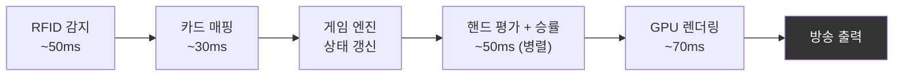
> Total: **~200ms**

---

## 4. 핵심 개념 3가지

PokerGFX를 이해하는 데 가장 중요한 3가지 개념이 있다.

### 4.1 RFID 카드 인식

**"테이블 위에 놓인 뒤집힌 카드를 어떻게 아는가"**

카드 52장 + 1장(Joker)에 각각 RFID 태그(NXP NTAG215, 13.56MHz)가 내장되어 있다. 각 태그는 고유한 7-byte UID를 가지며, 이 UID가 어떤 카드인지 매핑 테이블로 변환된다. 카드가 RFID 안테나 위에 놓이는 순간, 리더가 태그를 감지하고, 서버에 "이 좌석에 이 카드가 놓였다"를 보고한다.


> *RFID 태그가 내장된 포커 카드. 각 카드에 패시브 태그가 있으며, 고유 UID를 저장한다. 13.56MHz 주파수로 ~3cm 범위에서 리더와 통신한다. (출처: habwin.com)*

### 4.2 Dual Canvas

**"같은 게임을 두 가지 화면으로 동시에 렌더링한다"**


> *Dual Canvas 구조. Venue Canvas는 현장 모니터로 출력되며 홀카드가 숨겨진다. Broadcast Canvas는 방송 송출로 나가며 홀카드와 승률이 표시된다. 두 Canvas는 독립적으로 NDI/HDMI로 출력된다.*

| 속성 | Venue Canvas | Broadcast Canvas |
|------|-------------|---------------|
| **대상** | 현장 모니터 | 방송 송출 |
| **홀카드** | 숨김 (??) | 공개 (A♠K♥) |
| **승률** | 미표시 | 표시 (67.3%) |
| **핸드 등급** | 미표시 | 표시 (Pair of Kings) |
| **보안 딜레이** | 적용 안됨 (실시간) | 설정 가능 (Security Delay Buffer, 별도 설정) |
| **이름/칩/베팅** | 표시 | 표시 |

**Trustless Mode**: Venue Canvas에는 어떤 상황에서도 홀카드를 표시하지 않는 보안 모드. Showdown이 끝난 후에만 Venue Canvas에 카드가 공개된다.

### 4.3 실시간 승률 계산

**"현재 카드 상태에서 각 플레이어가 이길 확률을 즉시 계산한다"**

시청자가 가장 원하는 정보는 "이 선수가 이길 확률이 몇 %인가"이다.

| 방식 | 설명 | 채택 여부 |
|------|------|----------|
| **Exhaustive Enumeration** | 가능한 모든 보드 카드 조합을 탐색. Pre-Flop에서 C(45,5)=1,221,759 조합 x 10명 = 연산 불가 | 불가 |
| **Monte Carlo Simulation** | 10,000회 무작위 시뮬레이션. 어떤 상황에서든 ~200ms 이내 완료. 정확도 ±1% | **채택** |
| **PocketHand169 LUT** | Pre-Flop 전용. 169개 핸드 타입(AA, AKs, ... , 22)의 사전 계산된 승률표 사용 | **Pre-Flop 전용** |

---

## 5. 3개 앱 생태계

PokerGFX는 3개 앱이 하나의 서버를 중심으로 동기화되는 생태계다. GFX 운영자 1명이 GfxServer와 ActionTracker를 직접 조작하고, HandEvaluation은 자동 연동된다.

> **참고**: 벤치마크 원본 시스템에는 ActionClock, CommentaryBooth, Pipcap을 포함한 7개 앱이 존재하나, 실제 프로덕션에서 사용되지 않으므로 본 프로젝트에서는 구현하지 않는다. Stream Deck은 키보드와 같은 외부 입력 장치이며, 독립 앱이 아니므로 생태계에 포함하지 않는다.


> *3개 앱 생태계. GFX Server가 중심 허브이며, TCP 프로토콜로 모든 클라이언트를 연결한다. 굵은 선은 GFX 운영자가 직접 조작하는 앱, 보통 선은 자동 연동 서비스를 나타낸다.*

| App | 역할 | 운영 주체 |
|-----|------|----------|
| **GfxServer** | 모든 상태의 단일 원본. 게임 엔진, RFID, GPU 렌더링 | GFX 운영자 |
| **ActionTracker** | 게임 진행 입력 터치스크린 (New Hand, Deal, Bet, Showdown) | GFX 운영자 |
| **HandEvaluation** | 독립 평가 서비스. Monte Carlo 10,000회의 CPU 부하 분산 | 자동 |

3개 앱이 하나의 서버에 연결되어 실시간 동기화된다. GFX 운영자가 Action Tracker에서 "Raise"를 누르면, GfxServer가 상태를 갱신하고, 모든 연결된 앱에 즉시 전파된다.

---

## 6. 사용자 역할과 워크플로우

### 단일 운영자 모델

방송 현장에서 PokerGFX 앱을 직접 조작하는 사람은 **GFX 운영자 1명**뿐이다.

| 역할 | 관여 앱 | 관여 방식 |
|------|---------|----------|
| **GFX 운영자** | GfxServer, ActionTracker | 방송 중 모든 앱을 직접 조작 |
| **시스템 관리자** | GfxServer (System 탭) | 프리프로덕션: 서버 설정, RFID 구성, 네트워크, 라이선스 |

나머지 역할(방송 감독, 딜러 등)은 생산된 데이터를 모니터로 확인할 뿐, 앱을 직접 다루지 않는다.

- **방송 감독**: Viewer Overlay 출력을 비디오 스위처로 수신

### GFX 운영자의 워크플로우

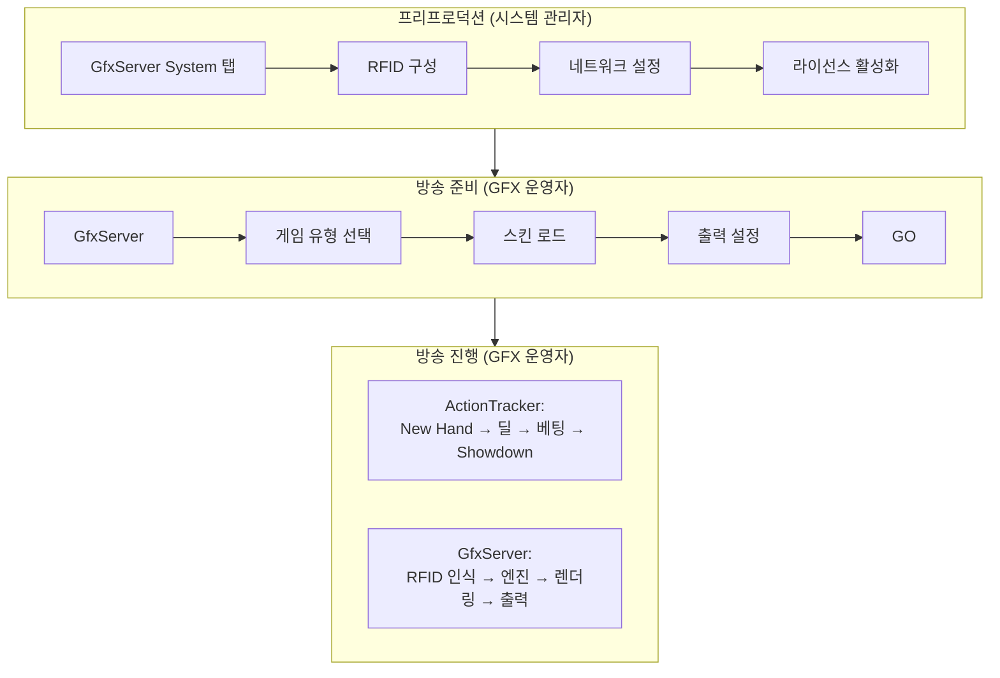

---

# Part III: 카드 인식 설계

## 7. 테이블 하드웨어 배치

### RFID 리더 배치도


> *PokerGFX RFID 테이블 3D 단면도. 테이블 베이스에 좌석별 안테나 홈, 중앙 Reader Module 홈, 케이블 채널이 CNC로 가공된다. 플레이어 안테나는 115mm x 115mm 표준 또는 230mm x 115mm 더블 사이즈를 지원한다. (출처: RFID VPT Build Guide V2, PokerGFX LLC)*


> *RFID 전자장비 설치 완료 상태. 중앙의 Reader Module(커뮤니티 카드 안테나 내장)에서 각 좌석 안테나와 Muck 안테나로 케이블이 연결된다. 여분 케이블은 안테나 위에 느슨하게 감아 놓는다. (출처: RFID VPT Build Guide V2, PokerGFX LLC)*

### 안테나 역할 상세

| 리더 | 수량 | 안테나 | 역할 |
|------|:----:|:------:|------|
| Seat Reader | 10대 | 각 1~2개 | 플레이어 홀카드 감지 (더블 사이즈 시 Omaha 등 다중 홀카드 지원) |
| Board Reader | 1대 (Reader Module 내장) | 통합 | 커뮤니티 카드 감지 (Flop/Turn/River) |
| Muck Reader | 1대 | 1~2개 | 폴드/버린 카드 감지 |
| **합계** | **12대** | **최대 22개** | Reader Module은 최대 22개 안테나 지원 |

### 설치 규격

| 항목 | 사양 |
|------|------|
| Reader Module 크기 | 345mm x 90mm (중앙 배치) |
| 표준 안테나 크기 | 115mm x 115mm |
| 더블 안테나 크기 | 230mm x 115mm (2개 밀착) |
| 안테나 간 최소 이격 | 60mm (모든 방향) |
| 커팅 최소 깊이 | 14mm |
| 안테나~표면 최대 거리 | 50mm |
| 안테나 케이블 길이 | 1.5m |
| 접속 방식 | USB 또는 WiFi |

---

## 8. 카드 인식 흐름

### End-to-End 인식 타임라인

카드가 테이블에 놓이는 순간부터 방송 화면에 표시되기까지 200ms 이내로 완료된다.

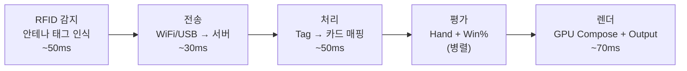
> 0ms → 50ms → 80ms → 130ms → **200ms**

### Dual Transport

RFID 리더와 서버 간 통신은 2가지 경로를 지원한다.

| 속성 | WiFi (TCP) | USB (HID) |
|------|-----------|-----------|
| 속도 | ~10ms | ~30ms |
| 안정성 | 보통 | 높음 |
| 보안 | TLS 1.3 | 물리 연결 |
| 리더 수 | 무제한 | USB 포트 제한 |
| 설치 | 무선 | 유선 필요 |
| 역할 | **Primary** | **Fallback** |

WiFi 실패 시 자동으로 USB 폴백한다.

### 카드 상태 관리

52장 카드는 4가지 상태를 순환한다:

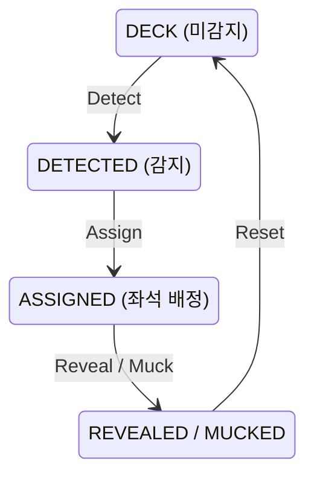

전체 52장 추적 예시 (10인 Hold'em): 홀카드 20장(ASSIGNED) + 보드 0~5장(DETECTED) + Muck 가변(MUCKED) + 나머지(DECK) = **항상 52장**

---

# Part IV: 게임 엔진 설계

## 9. 22개 포커 게임 지원

### 3대 계열 분류

포커 22가지 변형 게임은 3대 계열로 분류된다. 각 계열은 카드 배분, 베팅 라운드, 핸드 평가가 모두 다르다.

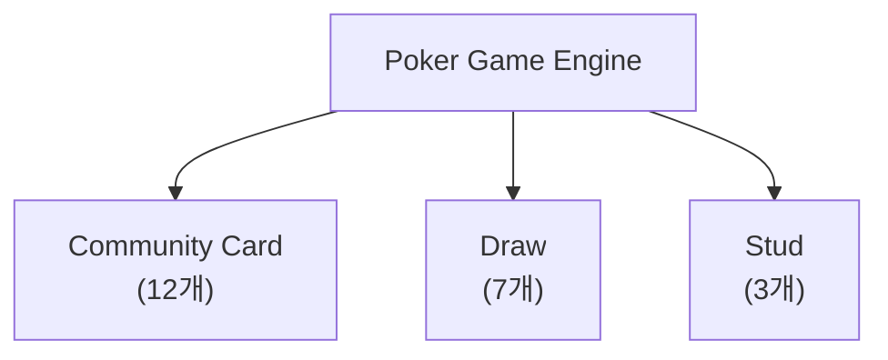

### 22개 게임 전체 리스트

**Community Card (12개)**: Texas Hold'em, 6+ Hold'em (Straight > Trips), 6+ Hold'em (Trips > Straight), Pineapple, Omaha, Omaha Hi-Lo, Five Card Omaha, Five Card Omaha Hi-Lo, Six Card Omaha, Six Card Omaha Hi-Lo, Courchevel, Courchevel Hi-Lo

**Draw (7개)**: Five Card Draw, 2-7 Single Draw, 2-7 Triple Draw, A-5 Triple Draw, Badugi, Badeucy, Badacey

**Stud (3개)**: 7-Card Stud, 7-Card Stud Hi-Lo, Razz

> 각 게임의 상세 사양(홀카드 수, 보드 수, 특수 규칙)은 **부록 A**에서 확인한다.

### 계열별 비교

| 속성 | Community Card | Draw | Stud |
|------|---------------|------|------|
| **게임 수** | 12개 | 7개 | 3개 |
| **홀카드 수** | 2~6장 | 4~5장 | 7장 (3+4) |
| **커뮤니티 카드** | 최대 5장 | 없음 | 없음 |
| **카드 교환** | 없음 | 1~3회 | 없음 |
| **공개 카드** | 커뮤니티 전체 | 없음 | 4장 (3rd~6th) |
| **베팅 라운드** | 4 (Pre~River) | 2~4 | 5 (3rd~7th) |
| **RFID 추적** | 홀카드 + 보드 | 홀카드만 | 홀카드 + 공개 |
| **대표 게임** | Texas Hold'em | 2-7 Triple Draw | 7-Card Stud |

### 게임 상태 머신

모든 포커 게임은 상태 머신으로 동작한다. 계열별로 상태 흐름이 다르다.

**Community Card**: IDLE → SETUP_HAND → PRE_FLOP → FLOP → TURN → RIVER → SHOWDOWN → HAND_COMPLETE

**Draw**: IDLE → SETUP_HAND → DRAW_ROUND 1 → DRAW_ROUND 2 → ... → SHOWDOWN → HAND_COMPLETE

**Stud**: IDLE → SETUP_HAND → 3RD_STREET → 4TH → 5TH → 6TH → 7TH → SHOWDOWN → HAND_COMPLETE

Stud는 7th Street(마지막 라운드)까지 진행한 후 Showdown으로 전환된다. 7-Card Stud에서 각 플레이어는 최대 7장(3 down + 4 up)을 받으며, 7th 이후 추가 라운드는 없다.

각 상태 전환에서 RFID 감지, 베팅 액션, 승률 재계산이 트리거된다.

---

## 10. 베팅 시스템

### 3가지 베팅 구조

| 구조 | 최소 베팅 | 최대 베팅 | 적용 게임 예시 |
|------|----------|----------|--------------|
| **No Limit** | Big Blind | All-in (전 칩) | NL Hold'em, NL Omaha |
| **Pot Limit** | Big Blind | 현재 팟 크기 | PLO (Pot Limit Omaha) |
| **Fixed Limit** | Small Bet / Big Bet | 고정 단위 (Cap: 보통 4 Bet) | Limit Hold'em, Stud |

### 7가지 Ante 유형

Ante는 핸드 시작 전 의무 납부금이다.

| Ante 유형 | 납부자 | 설명 |
|-----------|--------|------|
| **Standard** | 전원 | 전체 플레이어가 동일 금액 납부 |
| **Button** | 딜러만 | 딜러 버튼 위치 플레이어만 납부 |
| **BB Ante** | Big Blind만 | BB가 전원 Ante를 대납 |
| **BB Ante (BB 1st)** | Big Blind만 | BB Ante + BB가 먼저 행동 |
| **Live Ante** | 전원 | 앤티가 "라이브 머니"로 취급됨. Standard Ante에서는 앤티가 데드 머니(팟에 기여하지만 해당 플레이어의 현재 베팅으로 인정되지 않음)인 반면, Live Ante에서는 앤티 금액이 첫 베팅 라운드에서 해당 플레이어의 베팅으로 인정된다. 따라서 Live Ante를 낸 플레이어는 액션이 돌아왔을 때 Check 대신 Raise 옵션을 가지며, 누군가 레이즈했을 때 Live Ante를 낸 플레이어는 레이즈 금액에서 자신의 Live Ante를 차감한 금액만 내면 콜할 수 있다. 주로 캐시 게임에서 사용 |
| **TB Ante** | SB + BB | Two Blind 합산 Ante |
| **TB Ante (TB 1st)** | SB + BB | TB Ante + SB/BB 먼저 행동 |

> **참고**: 2018~2019년을 기점으로 대부분의 메인 토너먼트에서 Big Blind Ante(BB Ante)로 전환되었다. BB Ante 방식은 한 명(BB 위치)이 전원의 앤티를 대납하여 게임 진행 속도를 높이고 딜러와 플레이어 간의 수납 실수를 줄인다. 다만 BB Ante를 적용하지 않는 토너먼트도 존재한다. 하단의 특수 규칙(Bomb Pot, Run It Twice 등)은 현재 토너먼트에서 적용되는 경우가 드물지만, 일부 이벤트에서는 운용될 수 있다.

### 특수 규칙 4가지

| 규칙 | 설명 |
|------|------|
| **Bomb Pot** | 전원 합의 금액 납부 → Pre-Flop 건너뛰고 바로 Flop |
| **Run It Twice** | All-in 후 남은 보드를 2회 전개, 팟 절반씩 분할 |
| **7-2 Side Bet** | 7-2 오프슈트(최약 핸드)로 이기면 사이드벳 수취 |
| **Straddle** | 자발적 3번째 블라인드 (보통 2x BB) |

---

## 11. 핸드 평가 엔진

### 핸드 등급 체계

| 등급 | 이름 | 확률 |
|:----:|------|-----:|
| 9 | Royal Flush | 0.0002% |
| 8 | Straight Flush | 0.0013% |
| 7 | Four of a Kind | 0.024% |
| 6 | Full House | 0.14% |
| 5 | Flush | 0.20% |
| 4 | Straight | 0.39% |
| 3 | Three of a Kind | 2.11% |
| 2 | Two Pair | 4.75% |
| 1 | One Pair | 42.26% |
| 0 | High Card | 50.12% |

### 17개 게임별 평가기 라우팅

22개 게임이 모두 같은 방식으로 핸드를 평가하지 않는다.

| 평가기 | 대상 게임 | 설명 |
|--------|----------|------|
| **Standard High** | Texas Hold'em, Pineapple, 6+ Hold'em ×2, Omaha, Five Card Omaha, Six Card Omaha, Courchevel, Five Card Draw, 7-Card Stud (10개) | 높은 핸드가 승리 |
| **Hi-Lo Splitter** | Omaha Hi-Lo, Five Card Omaha Hi-Lo, Six Card Omaha Hi-Lo, Courchevel Hi-Lo, 7-Card Stud Hi-Lo (5개) | High + Low 동시 평가, 팟 분할 |
| **Lowball** | Razz, 2-7 Single Draw, 2-7 Triple Draw, A-5 Triple Draw, Badugi, Badeucy, Badacey (7개) | 낮은 핸드가 승리 (역전) |

### Lookup Table 기반 즉시 평가

핸드 평가를 빠르게 하기 위해 **사전 계산된 참조 테이블**을 사용한다. 원리는 사전(辭典)과 같다.

**비유**: 7,462가지 포커 핸드 조합의 등급을 미리 계산해서 "사전"에 저장한다. 게임 중에는 카드 5장을 숫자로 변환해서 사전을 펼치면 답이 바로 나온다. 매번 계산하는 대신 **찾기만** 하면 된다.

**구체적인 예시**:

```
플레이어 카드: A♠ K♠ Q♠ J♠ 10♠

① 카드 → 숫자 변환: [12, 11, 10, 9, 8] + 같은 수트
② 사전에서 찾기: Table[해당 인덱스] → "Royal Flush, 등급 9"
③ 끝. 계산 없음.
```

| 항목 | 값 |
|------|-----|
| 사전 크기 | 538개 테이블, ~2.1MB |
| 찾는 시간 | 상수 시간 (카드 수에 무관) |
| 속도 비교 | 매번 계산하는 방식 대비 ~100배 빠름 |

이 방식은 Monte Carlo 시뮬레이션에서 10,000회 핸드 비교를 수행할 때 결정적으로 중요하다. 한 번의 비교가 느리면 10,000번 곱해져 전체 승률 계산이 200ms를 초과하게 된다.

> **Lookup Table 상세**: 핵심 8개 테이블 구조, Memory-Mapped 파일, 538개 정적 배열 초기화 등은 기술 설계 문서를 참조한다.
> → `docs/02-design/pokergfx-lookup-tables.md`

---

## 12. 통계 엔진

### 실시간 Equity 계산

모든 플레이어의 홀카드와 보드 카드가 인식되면, 시스템은 각 플레이어의 승률을 실시간으로 계산한다.

| 스트리트 | 알려진 카드 | 계산 방법 |
|----------|-------------|-----------|
| Preflop | 홀카드만 | PocketHand169 LUT 또는 Monte Carlo |
| Flop | 홀카드 + 3장 | Turn/River 조합 시뮬레이션 |
| Turn | 홀카드 + 4장 | River 1장 시뮬레이션 |
| River | 홀카드 + 5장 | 확정 (승자 결정) |

2~10명 동시 계산을 지원하며, 타이 확률과 아웃츠 분석도 포함된다.

### 플레이어 통계

세션 동안 축적된 핸드 데이터로 플레이어별 통계를 계산한다.

| 통계 | 축약어 | 의미 |
|------|--------|------|
| **VPIP** | Voluntarily Put money In Pot | 자발적으로 팟에 참여한 비율 |
| **PFR** | Pre-Flop Raise | 프리플롭에서 레이즈한 비율 |
| **AGR** | Aggression Factor | 공격적 플레이 비율 |
| **WTSD** | Went To ShowDown | 쇼다운까지 간 비율 |
| **3Bet%** | Three-Bet Percentage | 3벳 빈도 |
| **CBet%** | Continuation Bet Percentage | 컨티뉴에이션 벳 빈도 |
| **WIN%** | Win Rate | 핸드 승률 |
| **AFq** | Aggression Frequency | 공격 빈도 |

이 통계는 플레이어의 플레이 스타일을 정량화하며, GTO(Game Theory Optimal) 전략 수립의 기초 데이터로 활용된다. GFX Console의 리더보드에 표시되거나, Viewer Overlay에 LIVE Stats로 노출될 수 있다.

---

# Part V: 그래픽 설계

## 13. 그래픽 요소 체계

### 4가지 요소 타입

모든 방송 그래픽은 4가지 기본 요소의 조합이다.

| 요소 | 필드 수 | 용도 |
|------|:-------:|------|
| **Image** | 41 | 카드 이미지, 로고, 배경 — x, y, width, height, alpha, source, crop, rotation, z_order, animation |
| **Text** | 52 | 플레이어 이름, 칩 카운트, 승률, 팟 — font, size, color, alignment, shadow, auto_fit, animation |
| **Pip** | 12 | PIP(Picture-in-Picture) — 카메라 입력을 캔버스의 임의 위치에 배치하는 요소. 소스 영역(src_rect)에서 캡처한 비디오를 대상 영역(dst_rect)에 렌더링한다 — src_rect, dst_rect, opacity, z_pos, dev_index, scale, crop |
| **Border** | 8 | 테두리, 구분선, 강조 표시 — color, thickness, radius |

### 애니메이션 시스템

16개 Animation State x 11개 Animation Class:

| Animation Class | 설명 |
|----------------|------|
| FadeIn/FadeOut | 투명도 전환 |
| SlideLeft/Right | 수평 슬라이드 |
| SlideUp/Down | 수직 슬라이드 |
| ScaleIn/Out | 크기 전환 |
| FlipHorizontal/Vertical | 뒤집기 |
| Pulse | 반복 강조 |
| Flash | 깜빡임 |
| Bounce | 탄성 효과 |
| Rotate | 회전 |
| Custom | 커스텀 키프레임 |

---

# Part VI: 서비스 인터페이스 설계

## 14. 서비스 인터페이스

Server와 클라이언트 앱 사이의 통신은 5개 서비스로 구성된다. 각 서비스는 명확한 책임 영역을 가진다.

> **프로토콜 상세**: 4계층 프로토콜 스택(gRPC/HTTP2, TLS, Protocol Buffers), 포트 구성, 암호화 방식 등은 기술 설계 문서를 참조한다.
> → `docs/02-design/features/pokergfx.design.md`

### 5개 gRPC 서비스

| 서비스 | 주요 메서드 |
|--------|-----------|
| **GameService** | NewHand, StartGame, EndGame, SetGameType, GetGameInfo |
| **PlayerService** | AddPlayer, RemovePlayer, UpdateChips, SetSeat, GetStats |
| **CardService** | DealCard, RevealCard, MuckCard, SetBoard, GetDeck |
| **DisplayService** | ShowOverlay, HideOverlay, SetSkin, SetLayout, ToggleTrust |
| **MediaService** | PlayVideo, PlayAudio, SetLogo, SetTicker, CaptureFrame |

> **용어**: ToggleTrust, SetTicker 등은 [용어 사전](pokergfx-glossary.md#시스템-용어)을 참조한다.

### 99개 명령어 10개 카테고리

| 카테고리 | 수량 | 설명 | 대표 명령어 |
|----------|:----:|------|-----------|
| Connection | 9 | 서버 연결/인증/상태 | CONNECT, AUTH, KEEPALIVE, HEARTBEAT |
| Game | 13 | 게임 시작/종료/타입 변경 | GAME_INFO, START_HAND, RESET_HAND, GAME_TYPE |
| Player | 21 | 좌석/칩/통계 | PLAYER_INFO, PLAYER_BET, PLAYER_ADD/DELETE |
| Cards & Board | 9 | 카드 딜/공개/Muck | BOARD_CARD, CARD_VERIFY, FORCE_CARD_SCAN |
| Display | 17 | 오버레이/레이아웃 | GFX_ENABLE, FIELD_VISIBILITY, SHOW_PANEL |
| Media & Camera | 13 | 비디오/오디오/로고 | MEDIA_PLAY, CAM, PIP, VIDEO_SOURCES |
| Betting | 5 | 베팅 액션/팟/사이드팟 | PAYOUT, CHOP, MISS_DEAL |
| Data Transfer | 3 | 설정 동기화/내보내기 | SKIN, AT_DL |
| RFID | 3 | RFID 리더 상태 조회 | READER_STATUS, TAG, TAG_LIST |
| History | 3 | 핸드 이력/리플레이 | HAND_HISTORY, HAND_LOG, COUNTRY_LIST |
| Slave / Multi-GFX | 3 | 멀티 GFX 동기화 | SLAVE_STREAMING, STATUS_SLAVE, STATUS_VTO |
| **합계** | **99** | 10개 카테고리 (내부 전용 명령 ~31개 별도) | |

### 16개 실시간 이벤트

서버가 클라이언트에 Push하는 이벤트:

| 이벤트 | 트리거 |
|--------|--------|
| OnCardDetected / OnCardRemoved | RFID 카드 감지/제거 |
| OnBetAction | 베팅 액션 발생 |
| OnPotUpdated | 팟 변경 |
| OnHandComplete | 핸드 종료 |
| OnGameStateChanged | 상태 전환 |
| OnPlayerAdded / OnPlayerRemoved | 플레이어 등록/퇴장 |
| OnChipsUpdated | 칩 변경 |
| OnWinProbabilityUpdated | 승률 갱신 |
| OnSkinChanged | 스킨 변경 |
| OnOverlayToggled | 오버레이 전환 |
| OnTrustlessModeChanged | 보안 모드 전환 |
| OnTimerStarted / OnTimerExpired | Shot Clock 시작/만료 |
| OnConnectionStatusChanged | 연결 상태 변경 |

### GameInfoResponse: 단일 상태 메시지 (75+ 필드)

서버와 클라이언트 간 게임 상태는 단일 메시지로 전달된다:

| 카테고리 | 필드 수 | 주요 필드 |
|---------|:-------:|----------|
| 블라인드 | 8 | Ante, Small, Big, Third, ButtonBlind, BringIn, BlindLevel, NumBlinds |
| 좌석 | 7 | PlDealer, PlSmall, PlBig, PlThird, ActionOn, NumSeats, NumActivePlayers |
| 베팅 | 6 | BiggestBet, SmallestChip, BetStructure, Cap, MinRaiseAmt, PredictiveBet |
| 게임 | 4 | GameClass, GameType, GameVariant, GameTitle |
| 보드 | 5 | OldBoardCards, CardsOnTable, NumBoards, CardsPerPlayer, ExtraCardsPerPlayer |
| 상태 | 6 | HandInProgress, EnhMode, GfxEnabled, Streaming, Recording, ProVersion |
| 디스플레이 | 7 | ShowPanel, StripDisplay, TickerVisible, FieldVisible, PlayerPicW, PlayerPicH |
| 특수 | 6 | RunItTimes, RunItTimesRemaining, BombPot, SevenDeuce, CanChop, IsChopped |
| 드로우 | 4 | DrawCompleted, DrawingPlayer, StudDrawInProgress, AnteType |
| **소계** | **53** | + 플레이어별 20필드 x 10명(일부 반복) = **75+** |

---

## 15. 서버 구성

### 자동 검색

클라이언트 앱은 서버를 수동으로 설정할 필요 없이, 네트워크에서 자동으로 찾는다. 클라이언트가 "서버를 찾습니다" 요청을 보내면, 서버가 자신의 위치를 응답한다. 이후 자동으로 연결되어 전체 게임 상태를 수신한다.

### Master-Slave 구성

단일 테이블의 그래픽 출력을 여러 디스플레이로 분산한다:

- **Master**: 게임 상태 관리, RFID 제어, 이벤트 발행 (단일 원본)
- **Slave**: Master의 게임 상태를 미러링하여 추가 렌더링 출력을 제공

Master-Slave는 **1대의 테이블을 다수의 출력 장치로 분산**하기 위한 구조다. 예를 들어 하나의 테이블에 Venue Canvas용 모니터, Broadcast Canvas용 NDI 출력, 추가 중계 화면을 각각 별도의 Slave가 렌더링한다.

> **멀티 테이블 운영**: 역공학 분석 결과, PokerGFX는 **1 서버 인스턴스 = 1 테이블** 아키텍처다. `GameType`은 static singleton이고, 프로토콜에 `tableId` 필드가 존재하지 않으며, `slave` 클래스의 모든 필드가 `static`이다. WSOP 메인 이벤트처럼 멀티 테이블(4~8개)을 운영하는 경우, 테이블마다 독립된 서버 인스턴스를 실행하여 물리적으로 분리한다. 테이블 간 프로토콜 연동은 없다.

> **기술 상세**: UDP Discovery, Master-Slave 프로토콜, 포트 구성, TLS 등은 기술 설계 문서를 참조한다.
> → `docs/02-design/features/pokergfx.design.md`

---

# Part VII: 사용자 인터페이스 설계

> **Part IX: 운영 워크플로우**와 함께 읽어야 한다. Part VII는 "화면이 왜 이렇게 생겼는가, 사용자가 무엇을 보고 무엇을 누르는가"를 다루고, Part IX는 "방송 준비부터 종료까지 어떤 절차를 따르는가"를 다룬다.

## 16. 인터페이스 멘탈 모델

### 방송 워크스테이션

포커 방송 시스템의 UI를 이해하려면, 먼저 물리적 환경을 알아야 한다. GFX 운영자는 하나의 워크스테이션에서 주 장치(GfxServer)를 중심으로, 필요에 따라 각 장치를 사용한다:

- **메인 모니터** (GfxServer): 시스템 설정과 모니터링. 마우스/키보드 조작. **주 장치**
- **터치스크린/키보드** (Action Tracker): 실시간 게임 진행 입력. 터치스크린 또는 키보드 입력 제어 방식 모두 지원

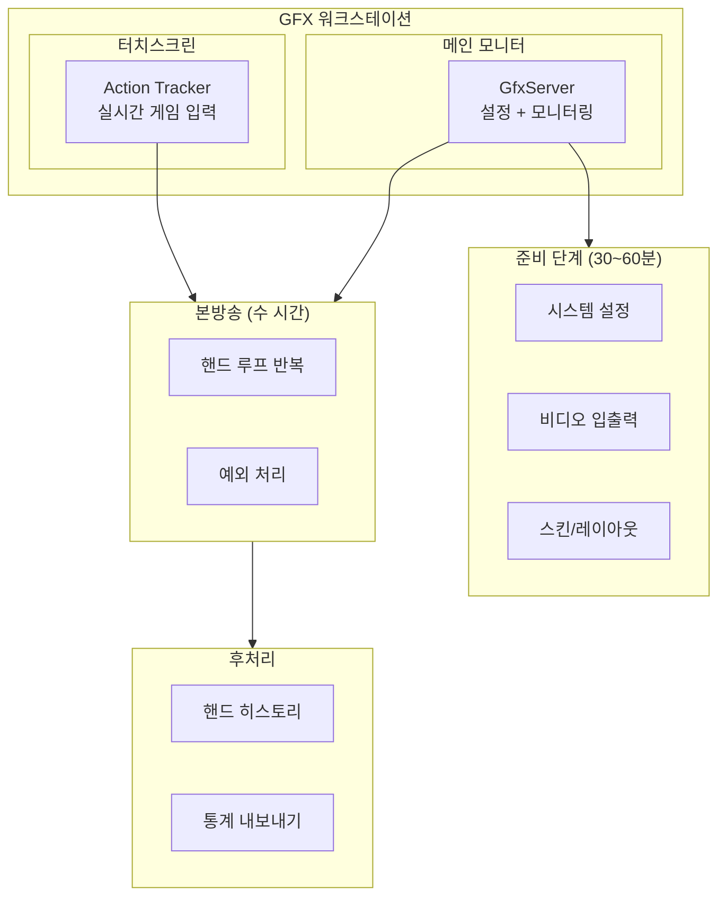

### 3단계 시간 모델

방송 시스템 사용은 3개의 명확한 시간 단계로 나뉜다. 각 단계에서 사용하는 화면과 기능이 완전히 다르다.

| 단계 | 시간 | 주 화면 | 조작 방식 | 긴장도 |
|------|------|---------|----------|--------|
| **준비** (Setup) | 30~60분 | GfxServer | 마우스/키보드 | 낮음 |
| **본방송** (Live) | 수 시간 | Action Tracker | 터치 | **높음** |
| **후처리** (Post) | 10~30분 | GfxServer | 마우스/키보드 | 낮음 |

본방송 중 GfxServer는 "설정 도구"에서 "모니터링 대시보드"로 역할이 전환된다. 대부분의 인터랙션은 Action Tracker에서 일어난다.

### 주의력 분배

**T1. 본방송 중 운영자 주의력 분배**

| 장치 | 비중 | 주시 내용 |
|------|:----:|----------|
| **Action Tracker** | 85% | 현재 핸드 진행, 베팅 입력, 특수 상황 |
| **GfxServer** | 15% | RFID 상태, 에러 알림, 프리뷰 |

이 분배가 UI 설계의 핵심 제약 조건이다. Action Tracker는 주변 시야에서도 상태를 파악할 수 있어야 하고, GfxServer는 문제가 생겼을 때만 주의를 끌어야 한다.

### 자동화 그래디언트

시스템은 가능한 많은 작업을 자동 처리하되, 판단이 필요한 작업만 인간에게 맡긴다.

| 완전 자동 (RFID) | 반자동 (운영자 확인) | 수동 입력 |
|:---:|:---:|:---:|
| 카드 인식 | New Hand 시작 | 베팅 금액 |
| 승률 계산 | Showdown 선언 | 특수 상황 (Chop, Run It 2x) |
| 핸드 평가 | GFX 표시/숨기기 | 수동 카드 입력 (RFID 실패 시) |
| 오버레이 렌더링 | 카메라 전환 | 스택 수동 조정 |
| 핸드 히스토리 저장 | — | 방송 자막/로고 변경 |

> **반자동(운영자 확인)이란**: 시스템이 데이터를 자동으로 준비하지만, 최종 실행에는 운영자의 확인(클릭/터치)이 필요한 단계이다. 예를 들어, New Hand 시작은 시스템이 이전 핸드 정산, 블라인드 세팅, RFID 준비를 완료한 상태를 보여주지만, 운영자가 "New Hand" 버튼을 터치해야 실제로 새 핸드가 시작된다. Showdown 선언도 마찬가지로, 시스템이 모든 베팅이 완료됨을 감지하지만 운영자가 "Showdown" 버튼으로 확인해야 카드가 공개된다.

### 정보 보안 경계

같은 게임 데이터가 3가지 보안 수준으로 표시된다. 이것이 Dual Canvas 아키텍처의 존재 이유다.

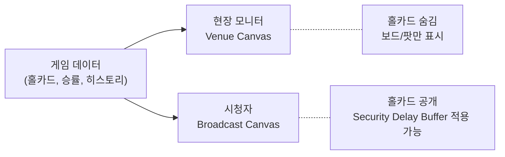

이 보안 경계는 UI 전체에 영향을 준다. Server의 Outputs 설정에서 Trustless Mode를 활성화하면, Venue Canvas에는 어떤 상황에서도 홀카드가 표시되지 않는다.

---

## 17. 준비 단계 인터페이스

방송 시작 전 한 번 수행하는 설정 작업이다. GfxServer 화면에서 마우스/키보드로 조작하며, 모든 시스템이 정상인지 확인한 후에만 방송을 시작할 수 있다.

> **운영 절차의 상세**: 담당자 역할 배정, 순차 투입, 이상 발생 시 에스컬레이션 등은 Part IX Section 22를 참조한다.

### 설정 태스크 플로우

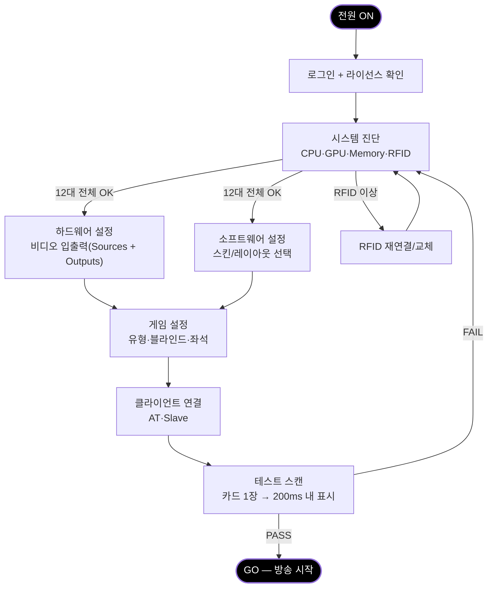

### 메인 윈도우

GfxServer의 진입점이자 시스템 전체 상태를 한눈에 파악하는 대시보드다. 7개 탭(Main, Sources, Outputs, GFX1~3, System)으로 구성되며, 방송 준비부터 종료까지 이 창이 항상 열려 있다.


> *GfxServer 메인 윈도우. 좌측 60px 네비게이션, 중앙 콘텐츠 영역, 우측 320px 컨텍스트 패널. 상단 툴바에서 게임 유형 선택/시작/정지를 제어한다.*

**레이아웃 구조**:

| 영역 | 크기 | 내용 |
|------|------|------|
| **네비게이션** | 60px (좌측) | 7개 탭 아이콘 (세로 배치) |
| **콘텐츠** | 가변폭 (중앙) | 활성 탭의 메인 UI |
| **컨텍스트 패널** | 320px (우측) | Live Preview, System Metrics, Quick Actions |
| **툴바** | 상단 | Game Type 드롭다운, Start/Stop 버튼, **KILL** 버튼 (빨강, 긴급 정지) |
| **상태바** | 하단 | RFID 상태, 접속 클라이언트 수, 핸드 번호, 라이선스, 시각 |

**Main 탭 콘텐츠 카드**:
- **Game Status**: 게임 유형, 블라인드, 핸드 번호, 현재 Phase (MW-001, MW-002)
- **Connected Clients**: Action Tracker, Slave 각각의 IP와 접속 상태 (MW-004)
- **RFID Readers**: 12대 리더 상태 그리드 — 정상(녹색), 장애(빨간색) (SYS-004)
- **Server Log**: 최근 이벤트 타임스탬프 로그 (SYS-016)

**컨텍스트 패널**:
- **Live Preview**: 320×180 썸네일로 현재 방송 출력 확인
- **System Metrics**: CPU, GPU, Memory, RFID, FPS 게이지 바
- **Quick Actions**: 자주 사용하는 6개 버튼 (GFX 숨기기, 카메라 전환, 핸드 시작 등)

### 시스템 설정

System 탭은 서버 시작 후 가장 먼저 확인하는 화면이다. 16개 기능이 6개 접이식 카드로 구성된다.


> *System 탭. Table & License, Diagnostics, RFID Configuration(6×2 그리드), Network & Security, Integration, Folders & Backup 6개 카드.*

**Table & License** (SYS-001~003): 테이블 이름/비밀번호, 라이선스 시리얼 키 + PRO/Standard 상태 뱃지. 라이선스가 없으면 출력 해상도가 제한된다.

**Diagnostics** (SYS-015): CPU, GPU, Memory 프로그레스 바 (임계치 초과 시 빨간색). OS, GPU 모델, 인코더 정보 표시. 로그 레벨 선택 (Debug/Info/Warning/Error).

**RFID Configuration** (SYS-004~006): 6×2 그리드로 12대 리더 표시 — S1~S10 좌석용 + BD1~BD2 보드용. 각 리더마다 IP, Port 입력 필드와 연결 상태 표시. Calibration 버튼(전체 보정), Demo Mode 체크박스(하드웨어 없이 시뮬레이션).

**Network & Security** (SYS-007~010): TCP :8888 (제어), UDP Discovery 3포트 (:9000, :9001, :9002), TLS 1.3 암호화 토글, MultiGFX 토글 (Master/Slave 구성), 접속 클라이언트 수 표시.

**Integration** (SYS-011~013): Action Tracker 연동 토글, 서버 자동 시작, 키보드 단축키 설정, 언어 선택.

**Folders & Backup** (SYS-014): Skin/Media 폴더 경로, GPU Encode Device 선택, 설정 Export/Import.

### 비디오 파이프라인: Sources

Sources 탭은 비디오 입력 소스를 등록하고 속성을 조절한다. 10개 기능이 3개 카드로 구성된다.


> *Sources 탭. Video Sources 테이블, Selected Source Properties(색 보정 슬라이더), Camera Control(자동 전환 설정).*

**Video Sources** (SRC-001~003): 소스 테이블에 Device, Type(SDI/HDMI/NDI/USB), Resolution, FPS, Status 표시. NDI 자동 감지 목록과 캡처 카드 연결 목록 제공.

**Selected Source Properties** (SRC-004~006): Resolution/Frame Rate 드롭다운, Brightness/Contrast/Saturation 슬라이더(실시간 프리뷰), Crop 영역 입력(Top/Bottom/Left/Right).

**Camera Control** (SRC-007~010): Auto Camera 토글(게임 상태 기반 자동 전환), Board Camera 선택(보드 카메라 전환 시 GFX 자동 숨김), Follow Players(액션 중인 플레이어 추적), External Switcher(ATEM 연동).

### 비디오 파이프라인: Outputs

Outputs 탭은 방송 출력 대상을 설정하고 Dual Canvas 보안 모드를 구성한다. 12개 기능이 4개 카드로 구성된다.


> *Outputs 탭. Video Format, Dual Canvas(Venue + Broadcast), Security & Delay, Recording & Streaming 4개 카드.*

**Video Format** (OUT-001): Resolution(1080p/4K), Frame Rate(30/60fps), Chroma Key 토글(투명 배경 출력).

**Dual Canvas Outputs** (OUT-002~005):
- **Venue Canvas**: 실시간, 현장 대형 화면용. NDI/HDMI/SDI 출력 체크박스, Stream Name, Port
- **Broadcast Canvas**: 실시간, 방송 송출용. 동일한 출력 옵션 세트

**Security & Delay** (OUT-006~007): Security Delay Buffer 슬라이더(0~30분), Dynamic Delay 토글(핸드 진행 기반 자동 조절), **Trustless Mode** 토글(Venue Canvas 홀카드 완전 차단), 딜레이 잔여 시간 카운트다운. Security Delay Buffer는 Broadcast Canvas에 적용되어 홀카드 노출 시점을 지연시키며, Dual Canvas 자체와는 별개의 보안 기능이다.

**Recording & Streaming** (OUT-008~012): 로컬 녹화, Virtual Camera(OBS 연동), Cross-GPU Sharing, ATEM Integration, 딜레이 만료 시 Auto-Switch.

### 스킨 & 레이아웃 에디터 — 3-Panel IDE 스타일 통합 편집 도구

방송 외형을 커스터마이징하는 태스크다. Skin Editor, GE Board, GE Player 세 도구가 **탭으로 전환되는 하나의 3-Panel IDE**를 구성한다. VS Code나 Unity Editor처럼 좌측 트리 + 중앙 캔버스 + 우측 속성 패널 레이아웃을 공유하므로, 세 에디터 간 전환 시 학습 비용이 없다.


> *스킨/레이아웃 에디터. 좌측 Element Tree(200px), 중앙 WYSIWYG Canvas(가변폭), 우측 Properties(240px).*

**공통 레이아웃** (200px | 가변 | 240px):

| 패널 | 역할 | 인터랙션 |
|------|------|---------|
| **Element Tree** (좌측) | 그래픽 요소 계층 구조 | 클릭 선택, 드래그로 Z-Order 변경 |
| **WYSIWYG Canvas** (중앙) | 방송 화면과 동일 비율 편집 영역 | 드래그 이동, 코너 핸들 크기 조절 |
| **Properties** (우측) | 선택 요소 속성 편집 (Transform, Font, Background, Effects) | 숫자 입력 시 캔버스 실시간 갱신 |

**Skin Editor** (SK-001~016):


> *10개 좌석이 타원형 배치된 포커 테이블. 선택 요소의 Transform, Font, Background를 Properties에서 편집한다.*

테이블 배경, 카드 스타일, 10-max 좌석 위치, 폰트, 색상, 애니메이션 등 전체 외형을 정의. `.vpt/.skn` 파일로 저장, AES 암호화 보호.

**GE Board** (GEB-001~015):


> *커뮤니티 카드 5장, 팟(메인 + 사이드), 딜러 버튼을 정밀 배치. Z-Order와 좌표를 Properties에서 편집.*

커뮤니티 카드 5장 슬롯, 팟 표시(메인 + 사이드 팟 3개), 딜러 버튼, 테이블 정보를 드래그로 배치.

**GE Player** (GEP-001~015):


> *플레이어 박스 템플릿: Photo, Card Slots, Name, Stack, Action Text, Equity Bar, Country Flag.*

플레이어 박스 구성 요소를 개별 편집. Effects(Fold 회색화, Winner 글로우), Animation(카드 등장, 칩 이동) 설정. 10-max 프리뷰로 전체 레이아웃 확인.

### 설정 완료 체크리스트

**T2. 방송 준비 완료 체크리스트**

| # | 항목 | 정상 기준 | 관련 기능 |
|:-:|------|----------|----------|
| 1 | 서버 시작 + 라이선스 | PRO 활성 | SYS-003 |
| 2 | RFID 12대 연결 | 전체 `reader_state = ok` | SYS-004 |
| 3 | 비디오 소스 | 카메라 입력 정상 | SRC-001~006 |
| 4 | 출력 장치 | NDI/HDMI/SDI 정상 | OUT-001~005 |
| 5 | Dual Canvas | Venue + Broadcast 동작 | OUT-001, OUT-006 |
| 6 | Trustless Mode | Venue Canvas에 홀카드 숨김 | OUT-006, OUT-007 |
| 7 | 게임 설정 | 유형/블라인드/좌석 선택 | MW-001, MW-002 |
| 8 | 클라이언트 연결 | AT 접속 | MW-004 |
| 9 | 테스트 스캔 | 카드 1장 → 200ms 표시 | SYS-006 |

9개 항목이 모두 정상이어야 "GO" 상태가 된다. 하나라도 실패하면 해당 항목을 해결할 때까지 방송을 시작할 수 없다.

---

## 18. 본방송 인터페이스

라이브 방송 중 매 핸드마다 반복되는 핵심 인터랙션이다. Part VII의 가장 중요한 섹션.

> **운영 절차**: 핸드별 진행 규칙, 담당자 역할, 에스컬레이션 체계는 Part IX Section 23을 참조한다.

### 핸드 루프

하나의 핸드는 다음 시퀀스로 진행된다. GFX 운영자(Action Tracker), Server(자동 처리), 시청자(방송 화면) 세 관점에서 데이터가 흐른다.

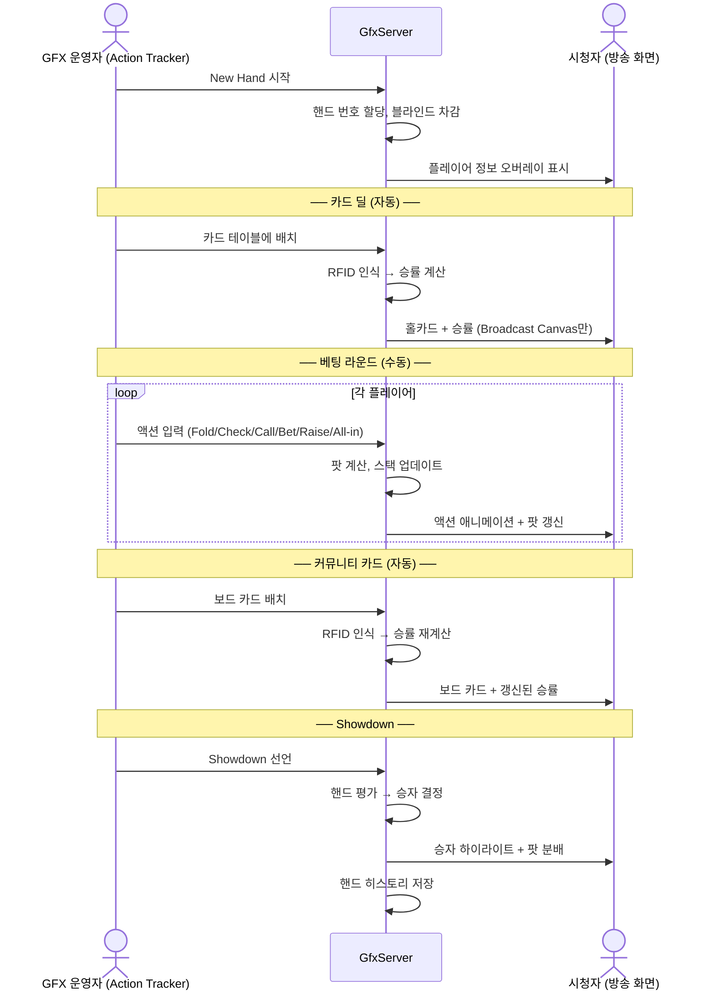

이 루프에서 **자동**인 단계(카드 인식, 승률 계산, 오버레이 렌더링)와 **수동**인 단계(New Hand, 베팅 입력, Showdown)를 구분하는 것이 핵심이다. 자동 단계에서 운영자는 아무것도 하지 않고, 수동 단계에서만 Action Tracker를 조작한다.

### Action Tracker

본방송의 주 인터페이스다. 터치스크린에서 실행되며, 운영자 주의력의 80%를 차지한다.


> *Action Tracker 와이어프레임. 상단 연결 상태, 10인 좌석 그리드(이름/스택/카드/상태), 보드 카드 5장, 하단 액션 버튼(FOLD/CHECK/CALL/BET/RAISE/ALL-IN)과 특수 컨트롤(HIDE GFX/TAG/CHOP/RUN IT 2x/MISS DEAL/UNDO).*

**터치 설계 원칙**:
- **큰 터치 타겟**: 액션 버튼 최소 68px 높이. 방송 중 시선이 테이블에 있어도 손가락 감각으로 터치 가능
- **명확한 피드백**: 터치 시 즉각적 시각/촉각 반응. 실행된 액션은 좌석 그리드에 즉시 반영
- **실수 방지**: 현재 상태에서 불가능한 액션은 비활성. All-in 등 위험 액션은 확인 필요
- **컨텍스트 전환 최소화**: 핸드 루프의 모든 단계가 단일 화면에서 처리

**핸드 진행 상태별 버튼 활성화**:

| 상태 | 활성 버튼 | 비활성 버튼 |
|------|----------|-----------|
| New Hand 대기 | New Hand | 모든 액션 |
| 카드 딜 중 | (자동 — 버튼 불필요) | — |
| 베팅 라운드 | Fold, Check/Call, Bet/Raise, All-in | New Hand |
| Showdown | Show, Muck | 베팅 액션 |

**특수 상황 처리**:

| 상황 | 버튼 | 동작 |
|------|------|------|
| 오버레이 숨기기 | HIDE GFX | 방송 화면에서 모든 GFX 일시 제거 |
| 중요 핸드 표시 | TAG HAND | 현재 핸드에 태그 추가 (나중에 검색 가능) |
| 팟 분배 | CHOP | 팟을 여러 플레이어에게 분할 |
| 더블 런아웃 | RUN IT 2x | 두 번째 보드 생성 |
| 미스딜 | MISS DEAL | 현재 핸드 무효화, 카드 재분배 |
| 되돌리기 | UNDO | 마지막 액션 취소 (최대 5단계) |
| 스택 수정 | ADJUST STACK | 특정 플레이어 칩 수동 변경 |

### GfxServer 모니터링 대시보드

본방송 중 GfxServer는 "설정 도구"에서 "모니터링 대시보드"로 전환된다. 운영자는 주의력의 15%만 할당하므로, 문제 발생 시에만 시선을 끌어야 한다.


> *방송 중 GfxServer 모니터링 대시보드. RFID 12대 상태 그리드, Venue/Broadcast Canvas 프리뷰, 시스템 메트릭(CPU/GPU/FPS), 에러 로그가 한 화면에 배치된다.*

**모니터링 요소**:
- **RFID 상태 그리드**: 12대 리더의 실시간 상태. 정상(녹색), 경고(노란색), 장애(빨간색)
- **Canvas 프리뷰**: Venue와 Broadcast 캔버스의 썸네일. 실제 방송 화면이 어떻게 보이는지 확인
- **시스템 메트릭**: CPU, GPU, Memory, FPS. 임계치 초과 시 경고
- **에러 로그**: 최근 에러만 표시. 심각도에 따라 색상 구분

**알림 우선순위**: RFID 장애(빨간색 점멸) > 시스템 과부하(노란색) > 일반 정보(회색). 정상 상태에서는 아무 알림도 표시되지 않아야 한다.

### 게임 제어 (GFX1)

GFX1은 24개 기능으로 가장 기능이 많은 화면이지만, 본방송 중에는 대부분 자동 처리된다. 운영자가 개입하는 케이스만 설명한다.


> *GFX1 게임 제어 와이어프레임. 상단 자동 영역(RFID 카드 인식, 승률 계산, 핸드 평가)과 하단 수동 영역(수동 카드 입력, 좌석 재배치, 애니메이션 조절)이 시각적으로 분리된다.*

**방송 중 운영자 개입 시나리오**:

| 시나리오 | 조작 | 빈도 |
|----------|------|------|
| RFID 미인식 | 수동 카드 입력 (52장 그리드) | 드물게 |
| 좌석 변경 | 플레이어 이동/추가/삭제 | 핸드 사이 |
| 애니메이션 제어 | Transition In/Out 시간 조절 | 매우 드물게 |
| Rabbit Hunt | 남은 카드 공개 (핸드 종료 후) | 가끔 |
| Bounty 표시 | 플레이어 바운티 금액 업데이트 | 토너먼트만 |

대부분의 시간 동안 GFX1은 "자동 모드"로 동작하며, 운영자는 Action Tracker에 집중한다.

#### GFX1 상세 — GfxServer GFX1: Game Control 탭


> *GFX1 탭 와이어프레임. 6개 접이식 카드 그룹(Table Layout, Card Display, Animation, Tournament, Branding, Advanced)이 수직 스크롤로 배치된다. 각 기능에 Feature ID(G1-001~G1-024)가 부여된다.*

**6그룹 24개 기능 구조**:

| 그룹 | 기능 | Feature ID | 컨트롤 |
|------|------|-----------|--------|
| **1. Table Layout** | 10-seat 레이아웃 선택 | G1-001 | 드롭다운 (Oval 10/9, Heads Up) |
| | Dealer Button 위치 | G1-011 | Seat 1~10 드롭다운 |
| | Blinds Display | G1-012 | 체크박스 (Auto-detect SB/BB) |
| | Ante Setting | G1-021 | 숫자 입력 (step 100) |
| **2. Card Display** | Reveal Players | G1-004 | **좌석별 토글 스위치 10개** |
| | Fold Display | G1-010 | 체크박스 (Gray out folded) |
| | Community Cards | G1-006 | 5장 카드 슬롯 (Flop 3 + Turn + River) |
| | Equities 표시 | G1-008 | 체크박스 (Show win % bar) |
| | Winning Hand 하이라이트 | G1-009 | 체크박스 |
| **3. Animation & Timing** | Transition In | G1-022a | 타입 드롭다운 + 슬라이더 (0~2000ms) |
| | Transition Out | G1-022b | 타입 드롭다운 + 슬라이더 (0~2000ms) |
| | Animation Master | G1-022c | 토글 On/Off |
| | Auto Hand Number | G1-015 | 체크박스 (Auto-increment) |
| | All-in Display | G1-013 | 체크박스 |
| **4. Tournament** | Board Position | G1-006b | 드롭다운 (Center/Top/Custom) |
| | Pot Display | G1-005 | 체크박스 2개 (Main pot, Side pots) |
| | Side Pot Split | G1-016 | 체크박스 |
| | Betting Round | G1-007 | 드롭다운 (Pre-Flop~River) |
| **5. Branding** | Player Names | G1-002 | 10행 테이블 (Name + Country) |
| | Chip Counts | G1-003 | 10개 숫자 입력 |
| **6. Advanced** *(P2, 접힘)* | Manual Card Input | G1-014 | **52장 13×4 피커 그리드** |
| | Run It Twice | G1-023 | 토글 |
| | Blind Timer | G1-024 | 레벨 드롭다운 + Duration |
| | Rabbit Hunt | G1-017 | 토글 |

**키보드 단축키** (G1-020):

| 키 | 기능 | 키 | 기능 |
|:--:|------|:--:|------|
| F1~F3 | Seat 1~3 홀카드 공개 | F7 | Deal River |
| F5 | Deal Flop | F8 | 승률 표시 토글 |
| F6 | Deal Turn | F9/F10 | Next Hand / Reset |

### 통계 (GFX2)

GFX2는 플레이어 통계와 토너먼트 데이터를 관리한다. 방송 감독이 적절한 타이밍에 통계 오버레이를 활성화한다.

**시나리오별 사용**:
- All-in 상황 → 승률 표시 활성화
- 큰 팟 종료 → 리더보드 업데이트
- 휴식 시간 → 칩 카운트/순위 전체 표시
- 탈락 시 → 남은 인원/상금 갱신

#### GFX2 상세 — GfxServer GFX2: Statistics 탭


> *GFX2 탭 와이어프레임. 5개 카드(Player Statistics, Leaderboard, Tournament Display, Betting Options, Data Export)로 구성. 13개 Feature ID(G2-001~G2-013).*

**5카드 13개 기능 구조**:

| 카드 | 기능 | Feature ID | 컨트롤 |
|------|------|-----------|--------|
| **Player Statistics** | VPIP / PFR / AF / Hands / Profile | G2-001~005 | 6행 통계 테이블 (View 버튼) |
| | 표시 항목 선택 | — | 체크박스 3개 (VPIP, PFR, AF) |
| | Reset Statistics | G2-009 | 빨간 리셋 버튼 (확인 필요) |
| **Leaderboard** | Tournament Rank | G2-006 | 토글 (칩카운트 랭킹) |
| | Remaining Players | G2-007 | 읽기 전용 표시 (42/200) |
| | Prize Pool | G2-008 | 읽기 전용 표시 ($1,250,000) |
| | 부가 옵션 | — | Knockout Rank, Chipcount %, Eliminated, Cumulative |
| **Tournament Display** | 좌석 번호 / 탈락 표시 / 정렬 | — | 체크박스 + 드롭다운 |
| | Nit Highlight | — | 체크박스 (VPIP < 15% 하이라이트) |
| **Betting Options** | Bomb Pot / Straddle | — | 토글 스위치 |
| | Limit Raises | — | 숫자 입력 (max raises per round) |
| **Data Export** *(P2, 접힘)* | Chip Graph | G2-010 | 체크박스 (칩 히스토리 추적) |
| | Payout Table / ICM | G2-011, G2-012 | 팝업 다이얼로그 버튼 |
| | Export | G2-013 | CSV / JSON 내보내기 버튼 |

### 방송 연출 (GFX3)

GFX3는 자막, 타이틀, 로고, 티커 등 방송 프로덕션 요소를 관리한다.

#### GFX3 상세 — GfxServer GFX3: Broadcast 탭


> *GFX3 탭 와이어프레임. 5개 접이식 카드(Lower Third & Titles, Outs & Score Strip, Amount Display, Ticker & Overlays, Advanced)로 구성. 13개 Feature ID(G3-001~G3-013).*

**5카드 13개 기능 구조**:

| 카드 | 기능 | Feature ID | 컨트롤 |
|------|------|-----------|--------|
| **Lower Third & Titles** | Lower Third 텍스트 | G3-001 | 텍스트 입력 + Position 드롭다운 + Show/Hide 토글 |
| | Broadcast Title | G3-002 | 텍스트 입력 + Blinds 자동 표시 |
| **Outs & Score Strip** | Outs Display | — | 토글 + Position 드롭다운 + True Outs 체크박스 |
| | Score Strip | — | 토글 (상/하단 스코어 바) |
| **Amount Display** | 통화 / 정밀도 / 표시 형식 | — | 드롭다운 3개 ($, €, £, ¥, ₩, chips) |
| | Preset Save | G3-008 | Save / Load 버튼 |
| **Ticker & Overlays** *(접힘)* | News Ticker | G3-003 | 텍스트 영역 + Speed 슬라이더 (1~10) |
| | Sponsor Logo | G3-004 | 파일 경로 + Browse + Position 드롭다운 |
| | Text Overlay | G3-005 | 텍스트 + X/Y 좌표 + Font Size |
| | Image Overlay | G3-006 | 파일 경로 + X/Y/W/H 숫자 입력 |
| | Multi-Layer Z-Order | G3-007 | **드래그 가능 레이어 리스트** (Z-index 순서) |
| | Timer Graphic | G3-009 | MM:SS 입력 + Start/Stop/Reset |
| **Advanced** *(P2, 접힘)* | Opening/Ending Animation | G3-010, G3-011 | 파일 경로 + Browse + Preview |
| | Twitch Chat | G3-012 | 토글 + 채널명 + Position 드롭다운 |
| | Picture-in-Picture | G3-013 | Source 드롭다운 + Size % + Corner |

### 예외 처리 흐름

본방송 중 발생할 수 있는 예외 상황과 복구 경로이다.

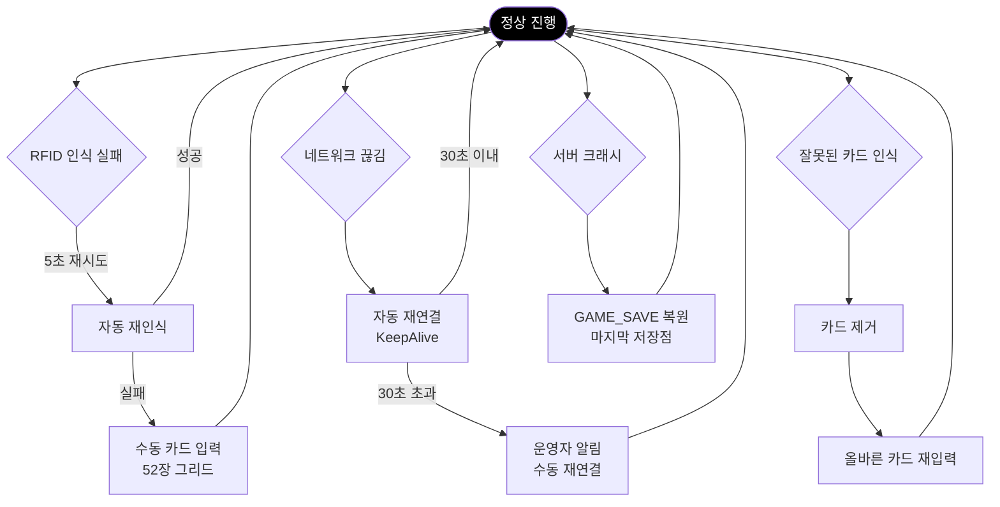

모든 예외 경로는 결국 "정상 진행"으로 돌아온다. 시스템은 어떤 장애가 발생해도 방송을 계속할 수 있도록 설계되어야 한다.

> **장애별 복구 상세**: 담당자, 에스컬레이션 체계, SLA는 Part IX Section 24를 참조한다.

---

## 19. 시청자 경험

운영자가 만드는 모든 것의 최종 산출물은 시청자의 방송 화면이다. 이 섹션은 시청자가 실제로 무엇을 보는지 서술한다.

### 정보 계층 설계

시청자가 방송 화면을 볼 때, 정보는 3개 계층으로 인지된다:

| 계층 | 요소 | 시선 우선순위 |
|------|------|:--------:|
| **1차** (즉시 인지) | 플레이어 홀카드, 승률 | 가장 높음 |
| **2차** (맥락 파악) | 팟 사이즈, 베팅 액션, 보드 카드 | 중간 |
| **3차** (참고 정보) | 이벤트명, 블라인드, 핸드 번호, 로고 | 낮음 |

이 계층은 오버레이 요소의 크기, 위치, 색상 강도에 반영되어야 한다. 1차 정보는 크고 밝게, 3차 정보는 작고 투명하게 표시한다.

### 오버레이 해부도


> *방송 오버레이 해부도. 각 요소의 위치, 크기, 정보 계층이 주석으로 표시된다. 플레이어 박스(이름/칩/카드/승률), 보드 카드, 팟, 이벤트 정보, 로고의 배치 원칙.*

**오버레이 구성 요소**:

| 요소 | 위치 | 정보 계층 | 표시 조건 |
|------|------|:--------:|----------|
| 플레이어 홀카드 | 각 플레이어 근처 | 1차 | Broadcast Canvas만 (보안) |
| 승률 | 홀카드 옆 | 1차 | 2인 이상 활성 |
| 팟 사이즈 | 보드 상단 | 2차 | 항상 |
| 베팅 액션 | 현재 플레이어 | 2차 | 액션 발생 시 |
| 보드 카드 | 화면 중앙 | 2차 | Flop 이후 |
| 플레이어 이름/칩 | 각 플레이어 하단 | 2차 | 항상 |
| 이벤트명/블라인드 | 상단 | 3차 | 항상 |
| 로고 | 상단/하단 코너 | 3차 | 항상 |
| 스트리트 표시 | 보드 근처 | 3차 | 베팅 중 |
| 폴드 표시 | 폴드 플레이어 | — | 폴드 시 회색 처리 |
| 액션 대기자 | 현재 플레이어 | 2차 | 베팅 중 강조 |

### Dual Canvas 비교

| 구분 | Venue Canvas (현장용) | Broadcast Canvas (방송용) |
|------|---------------------|----------------------|
| **대상** | 현장 관객, 스태프 | TV/스트림 시청자 |
| **홀카드** | 숨김 (Showdown 전까지) | 공개 (홀카드 + 승률) |
| **승률** | 표시 안 함 | 표시 |
| **보드 카드** | 즉시 표시 | 즉시 표시 |
| **팟/베팅** | 즉시 표시 | 즉시 표시 |
| **용도** | 현장 대형 화면, IMAG | 방송 송출, 녹화 |
| **보안** | Trustless Mode 적용 | Security Delay Buffer 적용 가능 |

두 개의 Canvas가 필요한 이유: 현장 대형 화면에 홀카드가 표시되면 플레이어가 상대방 카드를 볼 수 있다. Venue Canvas는 이를 원천 차단한다.

### 게임 상태별 화면 변화

방송 오버레이는 게임 상태에 따라 동적으로 변한다:

| 상태 | 오버레이 변화 |
|------|-------------|
| **Pre-Flop** | 홀카드 표시 (Broadcast Canvas만), 초기 승률, "PRE-FLOP" 인디케이터 |
| **Flop** | 보드 카드 3장 등장 애니메이션, 승률 재계산, 팟 갱신 |
| **Turn/River** | 보드 카드 추가, 승률 드라마틱하게 변동, 큰 베팅 시 강조 |
| **All-in** | 승률 바 확대 표시, 남은 카드 자동 전개 여부 선택 |
| **Showdown** | Venue Canvas에도 카드 공개, 승자 하이라이트 애니메이션 |

### 실제 방송 예시


> *PokerGFX 기반 실제 방송 화면. 각 플레이어의 홀카드, 포지션(SB/BB), 칩 스택, 승률, 팟 사이즈, 핸드 번호, 필드 정보가 동시에 표시된다. (출처: pokercaster.com)*


> *WSOP 2024 Final Table. RFID 기반 실시간 홀카드 표시, 승률 계산, 플레이어 통계가 방송에 적용된다. (출처: WSOP)*

---

## 19.5 인터랙션 & 상태 설계

시스템의 3개 앱은 각각 다른 입력 방식과 상태 관리 전략을 요구한다. 이 섹션은 키보드, 터치, 마우스 인터랙션과 에러/로딩/비활성 상태의 설계 원칙을 정의한다.

### 입력 모달리티별 설계

| 앱 | 주 입력 | 보조 입력 | 설계 원칙 |
|-----|--------|----------|----------|
| **GfxServer** | 마우스 + 키보드 | — | 빠른 전환을 위한 단축키 필수 |
| **Action Tracker** | 터치 | 키보드 | 큰 터치 타겟(68px+), 오입력 방지 |
| **Skin Editor** | 마우스 드래그 | 키보드(미세 조정) | WYSIWYG + 속성 패널 병행 |
| **GE Board/Player** | 마우스 드래그 | 키보드(미세 조정) | 스냅 가이드 + Z-Order 관리 |

### 키보드 단축키 체계

GfxServer는 방송 중 신속한 전환이 필요하므로 시스템 전역 단축키를 제공한다.

| 카테고리 | 단축키 | 동작 | Feature ID |
|---------|--------|------|-----------|
| **탭 전환** | Ctrl+1~7 | 메인 탭 직접 이동 (Main, Sources, Outputs, GFX1~3, System) | SYS-013 |
| **긴급 제어** | Ctrl+H | 모든 GFX 즉시 숨김 | G1-020 |
| **게임 제어** | Ctrl+Space | 핸드 시작/종료 | MW-002 |
| **카메라 전환** | Alt+F1~F10 | 비디오 소스 1~10번 즉시 전환 | SRC-001 |
| **스냅샷** | Ctrl+S | 현재 게임 상태 GAME_SAVE | SYS-006 |
| **UNDO** | Ctrl+Z | 마지막 액션 취소 (최대 5단계) | G1-020 |
| **클라이언트** | Ctrl+Shift+A | Action Tracker 접속 목록 | MW-004 |
| **테스트** | Ctrl+T | 200ms 카드 인식 테스트 | SYS-006 |

**단축키 스코프 규칙**: 위 테이블의 단축키는 GfxServer 시스템 전역에서 동작한다. GFX1 탭 내부의 F1~F10 단축키(Section 18 참조: 홀카드 공개, Deal, Reset 등)는 **GFX1 탭이 활성화된 경우에만** 동작하는 컨텍스트 단축키다. 시스템 전역 카메라 전환은 Alt+F1~F10으로 별도 modifier를 사용하여 충돌을 방지한다.

### 터치 인터랙션 설계 (Action Tracker)

방송 중 운영자는 테이블을 주시하면서 주변 시야로만 Action Tracker를 조작한다. 터치 설계는 이 맥락에 최적화되어야 한다.

**터치 타겟 원칙**:

| 요소 | 최소 크기 | 간격 | 비고 |
|------|:--------:|:---:|------|
| 주 액션 버튼 | 68px (h) | 8px | FOLD, CHECK, CALL, BET, RAISE, ALL-IN |
| 부 액션 버튼 | 56px (h) | 6px | HIDE GFX, TAG, CHOP, RUN IT 2x, MISS DEAL, UNDO |
| 좌석 그리드 셀 | 80×80px | 4px | 10인 좌석, 2×5 배치 |
| 보드 카드 슬롯 | 60×80px | 2px | 5장 카드 터치 영역 |

**터치 피드백**:
- 터치 다운: 200ms 이내 시각적 하이라이트 (버튼 배경색 변경)
- 터치 업: 즉시 동작 실행 + 햅틱 피드백 (Windows Haptic API)
- 잘못된 터치: 빨간색 테두리 + 에러음 (불가능한 액션)

**손가락 감각 최적화**:
- 화면 하단 60%에 주 버튼 배치 (엄지 도달 범위)
- 버튼 간격 8px로 오터치 방지
- 비활성 버튼은 회색 처리 + 터치 이벤트 무시

### 드래그 앤 드롭 설계 (Editors)

Skin Editor, GE Board, GE Player는 공통 WYSIWYG 캔버스 인터랙션을 제공한다.

**드래그 동작**:

| 동작 | 트리거 | 결과 |
|------|--------|------|
| **요소 이동** | Element 좌클릭 드래그 | X/Y 좌표 실시간 변경 |
| **요소 크기 조절** | 4개 코너 핸들 드래그 | Width/Height 실시간 변경 |
| **Z-Order 변경** | Element Tree에서 드래그 | 렌더링 순서 재배치 |
| **정렬 가이드** | 드래그 중 Shift | 스냅-투-그리드(10px) + 룰러 표시 |
| **비율 유지** | 크기 조절 중 Ctrl | Aspect Ratio 고정 |

**마우스 커서 상태**:
- 이동 가능: 십자 화살표
- 크기 조절 가능: 양방향 화살표 (↔ ↕ ⤢ ⤡)
- 선택 가능: 손가락 포인터
- 작업 중: 모래시계

**WYSIWYG ↔ Properties 동기화**: 캔버스에서 드래그로 변경한 값은 즉시 우측 Properties 패널에 반영된다. 반대로 Properties에서 숫자 입력 시 캔버스가 실시간 갱신된다.

### 에러 상태 설계

방송 중 발생 가능한 에러와 UI 피드백 전략이다. 모든 에러는 복구 가능해야 하며, 방송을 중단시키지 않는다.

| 에러 유형 | 시각적 표시 | 자동 복구 | 수동 개입 | Feature ID |
|----------|-----------|----------|----------|-----------|
| **RFID 인식 실패** | Main 탭 RFID 상태 그리드 빨간색, 5초 카운트다운 | 5초 재시도 | 재시도 실패 시 수동 카드 입력 창 자동 표시 | SYS-004, MW-005 |
| **네트워크 끊김** | Main 탭 클라이언트 목록에서 접속 상태 회색, 재연결 아이콘 회전 | 30초 자동 재연결 | 재연결 실패 시 "수동 재연결" 버튼 활성화 | MW-004 |
| **잘못된 카드** | Action Tracker 해당 좌석 셀 빨간색 테두리, "WRONG CARD" 경고 | — | "카드 제거 → 올바른 카드 재입력" 가이드 표시 | — |
| **서버 크래시** | 서버 전체 다운, 자동 재시작 | GAME_SAVE 최근 저장점 자동 복원 (최대 30초 전) | 복원 실패 시 마지막 핸드 수동 재입력 | SYS-006 |
| **License 만료** | 서버 시작 시 차단, 모달 다이얼로그 | — | PokerGFX 계정 로그인 후 라이선스 갱신 | SYS-003 |
| **License 무효** | 서버 시작 시 차단, 에러 코드 표시 | — | 고객 지원 연락 (keylok USB 동글 불일치) | SYS-003 |
| **GPU 과부하** | System 탭 FPS 그래프 빨간색 (30fps 이하), 경고음 | — | 비디오 소스 해상도 낮춤 또는 GFX 요소 숨김 | SYS-015 |

**에러 로그 표시**: Main 탭 하단에 최근 5개 에러만 표시. 심각도별 색상 구분 (빨강=긴급, 노랑=경고, 회색=정보). 전체 로그는 System 탭에서 확인.

### 로딩 상태 설계

시스템 시작과 데이터 로드 중 표시되는 프로그레스 인디케이터이다.

| 로딩 단계 | 예상 시간 | UI 표시 | Feature ID |
|----------|:--------:|---------|-----------|
| **서버 시작** | 3~5초 | 스플래시 화면, "Checking License..." → "Initializing..." | SYS-001, SYS-003 |
| **RFID 초기화** | 2~4초 | "Connecting RFID Readers... (0/12)" 프로그레스 바 | SYS-004 |
| **Skin 로딩** | 1~3초 | "Loading Skin: [파일명]..." 스피너 | SYS-005 |
| **비디오 소스 검색** | 2~5초 | "Scanning NDI Sources..." 회전 아이콘 | SRC-001 |
| **테스트 스캔** | 0.2초 | "Test Card Recognition..." → "200ms ✓" 또는 "FAIL ✗" | SYS-006 |
| **GAME_SAVE 복원** | 1~2초 | "Restoring Game State... Hand #[번호]" 프로그레스 바 | SYS-006 |

**스플래시 화면 표시 규칙**: 예상 로딩 시간이 1초 이상인 경우에만 표시. 1초 미만은 즉시 완료 처리.

### 비활성 상태 설계

UI 요소가 비활성화되는 조건과 시각적 피드백이다.

| 조건 | 비활성화 요소 | 시각적 표시 | 이유 |
|------|-------------|-----------|------|
| **게임 진행 중** | Main 탭 "게임 시작" 버튼 | 회색 처리, "게임 진행 중" 툴팁 | 중복 시작 방지 |
| **자동 모드 활성** | GFX1 탭 수동 카드 입력 섹션 전체 | 회색 처리, "Auto Mode ON" 배너 | RFID 우선 정책 |
| **Trustless Mode ON** | Outputs 탭 Venue Canvas "Show Hole Cards" 체크박스 | 회색 처리, 체크 불가 | 보안 정책 강제 |
| **에디터 빈 캔버스** | Properties 패널 전체 | 회색 처리, "No Element Selected" 플레이스홀더 | 선택된 요소 없음 |
| **클라이언트 미연결** | GFX1 탭 "Action Tracker로 전송" 버튼 | 회색 처리, "No Client Connected" 툴팁 | 전송 대상 없음 |
| **RFID 리더 오프라인** | GFX1 탭 Auto 모드 라디오 버튼 | 회색 처리, "RFID Offline" 경고 | 하드웨어 장애 |
| **License Basic** | System 탭 Advanced 기능 섹션 전체 | 회색 처리, "Upgrade to PRO" 배너 | 라이선스 제한 |
| **Action Tracker 불가능 액션** | RAISE 버튼 (All-in 상태 플레이어) | 회색 처리, 터치 무반응 | 게임 규칙 위반 |

**비활성 vs 숨김**: 사용자가 "이 기능이 존재하지만 지금은 사용 불가"임을 알아야 하면 비활성 표시. "이 모드에서는 아예 존재하지 않는 기능"이면 숨김 처리.

### 상태 피드백 우선순위

여러 상태가 동시에 발생할 때 표시 우선순위이다.

| 우선순위 | 상태 | 예시 | 피드백 방식 |
|:-------:|------|------|-----------|
| 1 | **긴급 에러** | 서버 크래시, GPU 과부하 | 전체 화면 모달 다이얼로그 + 경고음 |
| 2 | **복구 가능 에러** | RFID 인식 실패, 네트워크 끊김 | 해당 영역 빨간색 강조 + 카운트다운 |
| 3 | **경고** | FPS 저하, 카드 중복 | 노란색 배너 + 정보 아이콘 |
| 4 | **로딩** | Skin 로딩, RFID 초기화 | 회전 스피너 + 프로그레스 바 |
| 5 | **정보** | 게임 상태 변경, 핸드 종료 | 하단 상태바 텍스트 변경 |

**다중 상태 처리**: 에러와 로딩이 동시 발생 시 에러 우선 표시. 로딩 완료 후 에러가 남아있으면 에러 표시.

---

## 20. 기능 추적표

144개 기능을 하나의 표로 관리하는 이유: 원본 PokerGFX는 8개 탭 × 수십 개 기능이 산재하여, "무엇이 구현되었고 무엇이 남았는지"를 파악하기 어렵다. 이 추적표는 **사용 단계별**로 재분류하여, MVP 범위 선정(P0), 후속 릴리스 계획(P1/P2), 개발 진척 측정의 단일 기준선 역할을 한다. Feature ID는 부록 C의 원본과 동일하다. Commentary(CM-001~007) 7개는 미사용 앱이므로 제외되었다.

### 준비 단계 기능 (48개)

| 범위 | 수량 | P0 | P1 | P2 |
|------|:----:|:--:|:--:|:--:|
| System (SYS-001~016) | 16 | 10 | 6 | 0 |
| Sources (SRC-001~010) | 10 | 4 | 3 | 3 |
| Outputs (OUT-001~012) | 12 | 6 | 2 | 4 |
| Main Window (MW-001~010) | 10 | 6 | 4 | 0 |
| **소계** | **48** | **26** | **15** | **7** |

### 본방송 기능 (44개)

| 범위 | 수량 | P0 | P1 | P2 |
|------|:----:|:--:|:--:|:--:|
| GFX1 게임 제어 (G1-001~024) | 24 | 15 | 7 | 2 |
| GFX2 통계 (G2-001~013) | 13 | 1 | 8 | 4 |
| **소계** | **37** | **16** | **15** | **6** |

### 방송 연출 기능 (13개)

| 범위 | 수량 | P0 | P1 | P2 |
|------|:----:|:--:|:--:|:--:|
| GFX3 방송 연출 (G3-001~013) | 13 | 2 | 7 | 4 |
| **소계** | **13** | **2** | **7** | **4** |

### 에디터 기능 (46개)

| 범위 | 수량 | P0 | P1 | P2 |
|------|:----:|:--:|:--:|:--:|
| Skin Editor (SK-001~016) | 16 | 11 | 4 | 1 |
| GE Board (GEB-001~015) | 15 | 15 | 0 | 0 |
| GE Player (GEP-001~015) | 15 | 11 | 4 | 0 |
| **소계** | **46** | **37** | **8** | **1** |

### 전체 요약

| 사용 단계 | 기능 수 | P0 | P1 | P2 |
|----------|:------:|:--:|:--:|:--:|
| 준비 단계 | 48 | 26 | 15 | 7 |
| 본방송 | 37 | 16 | 15 | 6 |
| 방송 연출 | 13 | 2 | 7 | 4 |
| 에디터 | 46 | 37 | 8 | 1 |
| **합계** | **144** | **81** | **45** | **18** |

> P0 81개 중 37개(46%)가 에디터 기능이다. MVP 개발 시 에디터 완성도가 전체 일정을 좌우한다.

---

# Part VIII: 보안 설계

## 21. Dual Canvas 보안

포커는 정보 비대칭 게임이다. 홀카드 정보가 실시간으로 유출되면 게임의 무결성이 파괴된다. 따라서 방송 시스템 자체에 보안 딜레이가 내장되어야 한다.

### Trustless Mode

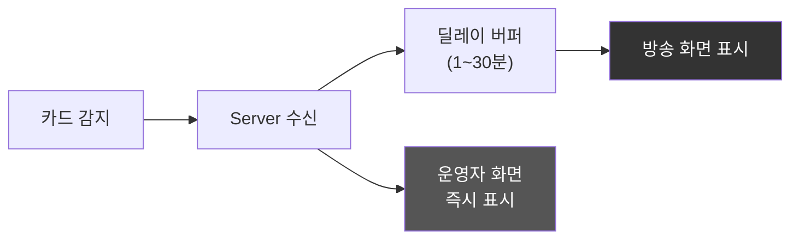

- 방송 화면에 카드 정보가 **설정된 딜레이 후** 표시된다
- 운영자의 Action Tracker에는 **즉시** 표시된다
- Venue Canvas에는 어떤 상황에서도 홀카드를 표시하지 않는다
- Showdown이 끝난 후에만 Venue Canvas에 카드가 공개된다
- 딜레이는 1분~30분 범위에서 동적으로 조절 가능하다

### Realtime Mode

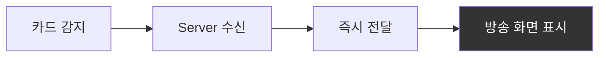

- 카드 정보가 **즉시** 방송 화면에 표시된다
- 방송 자체에 충분한 딜레이(보통 30분 이상)가 확보된 경우 사용한다
- 또는 녹화 방송에 사용한다

### 모드 전환

Server 메인 화면의 **Secure Delay** 체크박스로 전환한다. 방송 도중에도 전환 가능하며, 현재 모드는 Action Tracker와 Server 화면 모두에 인디케이터로 표시된다.

---

# Part IX: 운영 워크플로우

## 22. 방송 준비 워크플로우

### 전체 준비 흐름

방송 시작 전 **GFX 운영자**가 모든 준비 체크리스트를 관리한다. 시스템 관리자는 서버 시작과 라이선스 활성화만 담당하고, 나머지 설정은 GFX 운영자가 순차적으로 수행한다.


> *포커 방송 프로덕션 현장. 4K 지브 카메라, SEETEC 모니터, 조명 장비가 포커 테이블을 중심으로 배치된다. Server의 Sources 탭에서 이 카메라들을 관리한다. (출처: pokercaster.com)*

### 준비 체크리스트

| 단계 | 담당 | 확인 항목 | 정상 기준 |
|:----:|------|----------|----------|
| 1 | 시스템 관리자 | 서버 시작 + 라이선스 | 라이선스 활성 상태 |
| 2 | GFX 운영자 | 게임 유형 선택 | 22개 중 1개 선택 |
| 3 | GFX 운영자 | 스킨 로드 | .vpt/.skn 로드 성공, 미리보기 정상 |
| 4 | GFX 운영자 | RFID 리더 연결 | 12대 전체 `reader_state = ok` |
| 5 | GFX 운영자 | 출력 장치 설정 | NDI/HDMI/SDI 출력 정상 |
| 6 | GFX 운영자 | Dual Canvas 확인 | Venue + Broadcast 캔버스 모두 동작 |
| 7 | GFX 운영자 | Trustless 모드 | Venue Canvas에 홀카드 숨김 확인 |
| 8 | GFX 운영자 | 클라이언트 연결 | Action Tracker 접속 |
| 9 | GFX 운영자 | 테스트 스캔 | 카드 1장 → 200ms 내 화면 표시 |

---

## 23. 게임 진행 워크플로우

### 핸드별 반복 루프


> *1 Hand Cycle. GFX 운영자(Action Tracker)가 New Hand → 카드 딜 → 베팅 → 커뮤니티 카드 → Showdown 순으로 진행하고, GfxServer가 각 단계에서 RFID 인식, 팟 계산, 승률 재계산, 핸드 평가를 수행하여 방송 화면에 반영한다.*

### 게임 계열별 핸드 분기

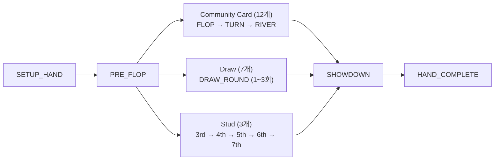

### 특수 상황 분기

| 상황 | 발생 시점 | 처리 |
|------|----------|------|
| **Bomb Pot** | Pre-Flop 직전 | 전원 강제 납부 → Flop 직행 (Pre-Flop 건너뜀) |
| **Run It Twice** | All-in 후 | 보드 2회 전개, 팟 절반 분할 |
| **Miss Deal** | 카드 배분 오류 | 현재 핸드 무효화, 카드 재분배 |

---

## 24. 긴급 상황 복구

### 장애 유형별 대응

| 장애 | 복구 조치 | 결과 |
|------|----------|------|
| RFID 미인식 | 수동 카드 입력 GUI | 정상 진행 |
| 네트워크 끊김 | 자동 재연결 (KeepAlive) | 30초 이내 복구 |
| 렌더링 오류 | 긴급 중지 → 서버 재시작 | 모든 GFX 숨김 |
| 잘못된 카드 인식 | 카드 제거 → 재입력 | 올바른 카드 반영 |
| 서버 크래시 | 게임 상태 자동 복원 (GAME_SAVE) | 마지막 저장점에서 재개 |

### 수동 카드 입력 폴백

RFID 인식 실패 시, GFX 운영자가 GUI에서 직접 카드를 선택한다:

- 4개 Suit x 13개 Rank = 52장 그리드
- 이미 사용된 카드는 선택 불가 (시각적 비활성)
- 좌석 선택 → 카드 클릭 → 적용

---

## 25. 핸드 히스토리

시스템은 **각 핸드가 종료될 때마다** DB API를 통해 전체 핸드 데이터를 즉시 생성하고 저장한다. 모든 핸드가 종료된 후 일괄 처리하는 것이 아니라, 핸드 단위로 실시간 생성된다.

### 저장되는 데이터

| 데이터 | 내용 |
|--------|------|
| 핸드 메타 | 핸드 번호, 시간, 게임 타입, 블라인드 |
| 플레이어 | 이름, 좌석, 시작 스택, 최종 스택 |
| 홀카드 | 각 플레이어의 홀카드 |
| 액션 | 매 스트리트별 모든 액션 (Fold/Check/Call/Bet/Raise/All-In + 금액) |
| 보드 | Flop/Turn/River 카드 |
| 결과 | 승자, 팟 분배 |

### 활용

| 기능 | 설명 |
|------|------|
| **핸드 리플레이** | 과거 핸드를 액션별로 재생 |
| **필터 검색** | 날짜, 플레이어, 팟 사이즈, 태그로 검색 |
| **Export** | 개별 핸드 또는 전체 세션을 CSV/JSON으로 내보내기 |
| **공유 링크** | 특정 핸드를 URL로 공유 |
| **통계 소스** | 플레이어 통계 계산의 원본 데이터 |

---

## 26. DB API 프로덕션 워크플로우

PokerGFX는 2가지 방송 송출 방식을 지원한다.

### 방식 1: 실시간 오버레이 합성

카메라 영상 위에 GfxServer가 실시간으로 그래픽을 합성하여 직접 송출한다. Venue Canvas와 Broadcast Canvas 모두 이 방식을 사용한다.

### 방식 2: DB API 프로덕션 워크플로우

핸드가 종료될 때마다 DB API가 JSON 형태로 데이터를 외부 시스템에 전달하고, 프로덕션 팀이 이를 가공하여 자막/그래픽을 별도 제작한다:

```
핸드 종료 → DB API (JSON) → 자막 담당자 (Google Sheets/Supabase에서 정보 정제)
  → 그래픽 담당자 (After Effects로 자막/그래픽 제작) → 렌더링
  → 편집 담당자 (자막 파일을 영상에 삽입) → 렌더링
  → 송출 담당자 → 최종 방송
```

이 워크플로우는 핸드가 종료되는 시점마다 실행되며, 본방송(Live) 내에서 실시간으로 처리된다. 방송 종료 후 별도의 후처리 작업은 거의 없다.

---

# 부록

## 부록 A: 22개 게임 전체 카탈로그

### Community Card 계열 (12개)

| # | 게임명 | 홀카드 | 보드 | 특수 규칙 |
|:-:|--------|:------:|:----:|----------|
| 0 | Texas Hold'em | 2장 | 5장 | 표준 |
| 1 | 6+ Hold'em (Straight > Trips) | 2장 | 5장 | 36장 덱, Straight > Trips |
| 2 | 6+ Hold'em (Trips > Straight) | 2장 | 5장 | 36장 덱, Trips > Straight |
| 3 | Pineapple | 3→2장 | 5장 | Flop 전 1장 버림 |
| 4 | Omaha | 4장 | 5장 | 반드시 홀카드 2장 + 보드 3장 사용 |
| 5 | Omaha Hi-Lo | 4장 | 5장 | Hi/Lo 팟 분할 (8-or-better) |
| 6 | Five Card Omaha | 5장 | 5장 | 홀카드 2장 + 보드 3장 사용 |
| 7 | Five Card Omaha Hi-Lo | 5장 | 5장 | Hi/Lo 분할 |
| 8 | Six Card Omaha | 6장 | 5장 | 홀카드 2장 + 보드 3장 사용 |
| 9 | Six Card Omaha Hi-Lo | 6장 | 5장 | Hi/Lo 분할 |
| 10 | Courchevel | 5장 | 5장 | Pre-Flop에 Flop 첫 카드 공개 |
| 11 | Courchevel Hi-Lo | 5장 | 5장 | Hi/Lo + 첫 카드 공개 |

### Draw 계열 (7개)

| # | 게임명 | 카드 | 교환 | 특수 규칙 |
|:-:|--------|:----:|:----:|----------|
| 12 | Five Card Draw | 5장 | 1회 | 기본 Draw |
| 13 | 2-7 Single Draw | 5장 | 1회 | Lowball (A=High) |
| 14 | 2-7 Triple Draw | 5장 | 3회 | Lowball 3회 교환 |
| 15 | A-5 Triple Draw | 5장 | 3회 | A-5 Lowball |
| 16 | Badugi | 4장 | 3회 | 4 suit 다른 조합 |
| 17 | Badeucy | 5장 | 3회 | Badugi + 2-7 혼합 |
| 18 | Badacey | 5장 | 3회 | Badugi + A-5 혼합 |

### Stud 계열 (3개)

| # | 게임명 | 카드 | 베팅 라운드 | 특수 규칙 |
|:-:|--------|:----:|:----------:|----------|
| 19 | 7-Card Stud | 7장 | 5 | 3장 비공개 + 4장 공개 |
| 20 | 7-Card Stud Hi-Lo | 7장 | 5 | Hi/Lo 분할 (8-or-better) |
| 21 | Razz | 7장 | 5 | A-5 Lowball Stud |

---

## 부록 B: 99개 프로토콜 명령 카탈로그

### Connection (9개)

| 명령 | 설명 |
|------|------|
| CONNECT | 클라이언트 연결 요청 (License 필드 포함) |
| DISCONNECT | 연결 해제 |
| AUTH | 비밀번호 + 버전 인증 |
| KEEPALIVE | 연결 유지 신호 (3초 간격) |
| HEARTBEAT | 양방향 생존 확인 |
| IDTX | 클라이언트 식별자 교환 |
| IDUP | 클라이언트 식별자 갱신 응답 |
| VERSION | 클라이언트/서버 버전 확인 |
| STATUS | 서버 상태 조회 |

### Game (13개)

| 명령 | 설명 |
|------|------|
| GAME_INFO | 전체 게임 상태 조회 (75+ 필드) |
| GAME_STATE | 게임 상태 초기 동기화 |
| GAME_TYPE | 게임 유형 변경 (22개 중 택 1) |
| GAME_VARIANT | 게임 변형 선택 |
| GAME_VARIANT_LIST | 지원 게임 변형 목록 |
| GAME_CLEAR | 게임 상태 초기화 |
| GAME_TITLE | 방송 제목 설정 |
| GAME_SAVE_BACK | 게임 상태 저장/복원 |
| NIT_GAME | Nit 금액 설정 |
| START_HAND | 새 핸드 시작 |
| RESET_HAND | 핸드 상태 초기화 |
| GAME_LOG | 게임 로그 기록/조회 |
| WRITE_GAME_INFO | 게임 정보 일괄 기록 |

### Player (21개)

| 명령 | 설명 |
|------|------|
| PLAYER_INFO | 플레이어 전체 정보 (20 필드) |
| PLAYER_CARDS | 홀카드 설정/조회 |
| PLAYER_BET | 베팅 금액 설정 |
| PLAYER_BLIND | 블라인드 금액 설정 |
| PLAYER_ADD | 좌석에 플레이어 추가 |
| PLAYER_DELETE | 좌석에서 플레이어 제거 |
| PLAYER_COUNTRY | 국가 코드 설정 |
| PLAYER_DEAD_BET | 데드 베팅 설정 |
| PLAYER_PICTURE | 프로필 사진 전송 |
| PLAYER_FOLD | 플레이어 폴드 처리 |
| PLAYER_STACK | 칩 스택 수량 설정/조회 |
| PLAYER_SIT_OUT | 자리비움 상태 전환 |
| PLAYER_LONG_NAME | 플레이어 풀 네임 설정 |
| PLAYER_NIT | 플레이어별 Nit 금액 설정 |
| PLAYER_SWAP | 좌석 교체 |
| PLAYER_WIN | 승자 표시 |
| PLAYER_DISCARD | Draw 게임 카드 교환 표시 |
| PLAYER_INFO_VTO | 플레이어 정보 VTO 전송 |
| DELAYED_PLAYER_INFO | 지연 캔버스용 플레이어 정보 |
| RESET_VPIP | VPIP 통계 초기화 |
| TRANSFER_CHIPS | 좌석 간 칩 이동 |

### Cards & Board (9개)

| 명령 | 설명 |
|------|------|
| BOARD_CARD | 커뮤니티 카드 설정 (Flop/Turn/River) |
| CARD_VERIFY | 카드 유효성 검증 |
| FORCE_CARD_SCAN | 강제 RFID 재스캔 |
| DRAW_DONE | Draw 교환 완료 |
| EDIT_BOARD | 보드 카드 수동 편집 |
| REMOVE_FROM_BOARD | 보드에서 카드 제거 |
| REGISTER_DECK | RFID 덱 등록 (52장 매핑) |
| RUN_IT_TIMES_INC | Run It Twice 카운트 증가 |
| RUN_IT_TIMES_CLEAR_BOARD | Run It Twice 보드 초기화 |

### Display (17개)

| 명령 | 설명 |
|------|------|
| FIELD_VISIBILITY | 필드 표시/숨김 |
| FIELD_VAL | 필드 값 설정 |
| GFX_ENABLE | 그래픽 전체 On/Off |
| ENH_MODE | Enhanced 모드 전환 |
| SHOW_PANEL | 패널 표시 |
| SHOW_STRIP | 스트립 표시 |
| BOARD_LOGO | 보드 영역 로고 설정 |
| PANEL_LOGO | 패널 영역 로고 설정 |
| STRIP_LOGO | 스트립 영역 로고 설정 |
| ACTION_CLOCK | Shot Clock 타이머 제어 |
| DELAYED_FIELD_VISIBILITY | 지연 캔버스 필드 표시/숨김 |
| DELAYED_GAME_INFO | 지연 캔버스 게임 정보 |
| SHOW_DELAYED_PANEL | 지연 캔버스 패널 표시 |
| TICKER | 뉴스 티커 텍스트 설정 |
| TICKER_LOOP | 티커 반복 모드 설정 |
| SHOW_PIP | PIP 오버레이 표시 |
| UNDO | 마지막 동작 취소 |

### Media & Camera (13개)

| 명령 | 설명 |
|------|------|
| MEDIA_LIST | 미디어 파일 목록 조회 |
| MEDIA_PLAY | 미디어 재생 |
| MEDIA_LOOP | 미디어 반복 재생 |
| CAM | 카메라 전환 |
| PIP | Picture-in-Picture 설정 |
| CAP | 화면 캡처 |
| GET_VIDEO_SOURCES | 비디오 소스 목록 요청 |
| VIDEO_SOURCES | 비디오 소스 목록 응답 |
| SOURCE_MODE | 현재 소스 모드 조회 |
| SET_SOURCE_MODE | 소스 모드 변경 |
| SET_VIDEO_SOURCES | 비디오 소스 설정 |
| VIDEO_RESET | 비디오 파이프라인 초기화 |
| VIDEO_PORT | 비디오 출력 포트 정보 |

### Betting (5개)

| 명령 | 설명 |
|------|------|
| PAYOUT | 상금 지급 |
| MISS_DEAL | 미스딜 처리 |
| CHOP | 팟 분할 합의 |
| FORCE_HEADS_UP | 강제 헤즈업 |
| FORCE_HEADS_UP_DELAYED | 지연 강제 헤즈업 |

### Data Transfer (3개)

| 명령 | 설명 |
|------|------|
| SKIN | 스킨 파일 청크 전송 |
| ~~COMM_DL~~ | ~~Commentary 데이터 다운로드~~ (미사용 — Commentary 앱 제외) |
| AT_DL | Action Tracker 데이터 다운로드 |

### RFID (3개)

| 명령 | 설명 |
|------|------|
| READER_STATUS | RFID 리더 상태 조회 |
| TAG | 단일 태그 조회/설정 |
| TAG_LIST | 감지된 태그 목록 |

### History (3개)

| 명령 | 설명 |
|------|------|
| HAND_HISTORY | 핸드 히스토리 조회 |
| HAND_LOG | 핸드 로그 기록 |
| COUNTRY_LIST | 국가 코드 목록 |

### Slave / Multi-GFX (3개)

| 명령 | 설명 |
|------|------|
| SLAVE_STREAMING | Slave 스트리밍 상태 통보 |
| STATUS_SLAVE | Slave 상태 응답 |
| STATUS_VTO | VTO 상태 응답 |

---

| **합계** | **99개** | 10개 카테고리 (내부 전용 명령 ~31개 별도) |

---

## 부록 C: 144개 기능 카탈로그

### 우선순위 분포

> Commentary(CM-001~007) 7개는 미사용 앱이므로 카탈로그에서 제외되었다.

| 우선순위 | 수량 | 설명 |
|----------|:----:|------|
| **P0 (핵심)** | 81개 | MVP에 필수. 이것 없이 시스템 작동 불가 |
| **P1 (확장)** | 45개 | 프로 방송에 필요. 첫 릴리스 후 추가 |
| **P2 (고급)** | 18개 | 고급 기능. 요구 시 구현 |

### Main Window (MW-001 ~ MW-010)

| ID | 기능 | P |
|----|------|:-:|
| MW-001 | 게임 유형 선택 (22개 변형 드롭다운) | P0 |
| MW-002 | 게임 시작/종료 | P0 |
| MW-003 | 핸드 번호 표시 | P0 |
| MW-004 | 접속 클라이언트 목록 | P0 |
| MW-005 | RFID 연결 상태 (12대) | P0 |
| MW-006 | 서버 IP/포트 표시 | P1 |
| MW-007 | 라이선스 상태 | P1 |
| MW-008 | 탭 네비게이션 (7개 탭) | P0 |
| MW-009 | 로그 패널 | P1 |
| MW-010 | 긴급 중지 | P0 |

### Sources (SRC-001 ~ SRC-010)

| ID | 기능 | P |
|----|------|:-:|
| SRC-001 | 비디오 소스 목록 | P0 |
| SRC-002 | 소스 미리보기 | P0 |
| SRC-003 | 해상도 설정 (1080p/4K) | P0 |
| SRC-004 | 프레임레이트 설정 (30/60fps) | P1 |
| SRC-005 | NDI 소스 감지 | P1 |
| SRC-006 | 캡처 카드 지원 (HDMI/SDI) | P0 |
| SRC-007 | 소스 상태 표시 | P1 |
| SRC-008~010 | 색보정, 크롭, 오디오 소스 | P2 |

### Outputs (OUT-001 ~ OUT-012)

| ID | 기능 | P |
|----|------|:-:|
| OUT-001 | Dual Canvas 출력 (Venue + Broadcast) | P0 |
| OUT-002 | NDI 출력 | P0 |
| OUT-003 | HDMI 출력 | P0 |
| OUT-004 | SDI 출력 | P1 |
| OUT-005 | 출력 해상도 설정 | P0 |
| OUT-006 | Trustless 모드 | P0 |
| OUT-007 | 지연 시간 설정 | P0 |
| OUT-008 | 크로마키 출력 | P1 |
| OUT-009 | 출력 미리보기 | P0 |
| OUT-010~012 | Cross-GPU, ATEM 스위처, 녹화 | P1~P2 |

### GFX1 - 게임 제어 (G1-001 ~ G1-024)

| ID | 기능 | P |
|----|------|:-:|
| G1-001~015 | 좌석 배치, 이름, 칩, 홀카드, 팟, 보드, 베팅, 승률, 핸드랭크, 폴드, 딜러, 블라인드, All-in, 수동카드, 핸드번호 | P0 |
| G1-016~022 | 사이드팟, Rabbit Hunt, Bounty, 국기, 단축키, Ante, 애니메이션 | P1 |
| G1-023~024 | Run It Twice, 블라인드 타이머 | P2 |

### GFX2 - 통계 (G2-001 ~ G2-013)

| ID | 기능 | P |
|----|------|:-:|
| G2-001~009 | VPIP, PFR, AF, 핸드수, 프로필, 순위, 남은인원, 상금, 초기화 | P1 |
| G2-010~013 | 칩그래프, Payout, ICM, 내보내기 | P2 |

### GFX3 - 방송 연출 (G3-001 ~ G3-013)

| ID | 기능 | P |
|----|------|:-:|
| G3-001~002 | 하단 자막, 방송 제목 | P0 |
| G3-003~009 | 티커, 스폰서, 오버레이, 멀티레이어, 프리셋, 타이머 | P1 |
| G3-010~013 | 오프닝/엔딩 애니메이션, Twitch 채팅, PIP | P2 |

### System (SYS-001 ~ SYS-016)

| ID | 기능 | P |
|----|------|:-:|
| SYS-001~010 | 서버 포트, Discovery, 라이선스, RFID(12대), 상태모니터, 카드테스트, 네트워크, 암호화, 출력, 스킨 경로 | P0 |
| SYS-011~016 | 로그, Master/Slave, 단축키, 성능, 언어, 백업 | P1 |

### Skin Editor (SK-001 ~ SK-016)

| ID | 기능 | P |
|----|------|:-:|
| SK-001~011 | 로드, 저장(AES), 생성, 미리보기, 배경, 카드, 좌석위치, 폰트, 색상, Undo/Redo, 이미지 | P0 |
| SK-012~016 | 애니메이션속도, 투명도, 레이어, 복사, 내보내기 | P1~P2 |

### Graphic Editor - Board (GEB-001 ~ GEB-015): 전체 P0

| ID | 기능 |
|----|------|
| GEB-001~015 | 트리뷰, 드래그, 크기, 속성, 좌표, 이미지/텍스트/Pip 배치, 커뮤니티/팟/딜러 영역, z-order, 가시성, Undo, 캔버스 크기 |

### Graphic Editor - Player (GEP-001 ~ GEP-015)

| ID | 기능 | P |
|----|------|:-:|
| GEP-001~011 | 이름, 칩, 홀카드(2~6장), 베팅, 액션, 승률, 핸드랭크, Fold, 승자, 배경 | P0 |
| GEP-012~015 | 카드/칩 애니메이션, Stud/Draw 레이아웃, Hi-Lo 분할 | P1 |

---

## 부록 D: 용어 사전

별도 문서로 분리되었다. → [pokergfx-glossary.md](pokergfx-glossary.md)

9개 섹션, 91개 용어를 수록: 포커 기본, 베팅, Ante 유형, 통계, 카드 상태, 시스템, 그래픽 요소, 애니메이션, 핸드 등급

---

## 부록 E: 참고 자료

### 포커 방송 역사

- [Hole cam — Wikipedia](https://en.wikipedia.org/wiki/Hole_cam)
- [Who Invented The Poker Hole Cam? — casino.org](https://www.casino.org/blog/hole-card-cam/)
- [Poker on television — Wikipedia](https://en.wikipedia.org/wiki/Poker_on_television)

### PokerGFX 및 경쟁 제품

- [PokerGFX Official](https://www.pokergfx.io/)
- [PokerGFX market dominance — habwin.com](https://www.habwin.com/en/post/poker-gfx-what-it-is-and-how-it-can-combat-security-vulnerabilities)
- [RFID VPT Build Guide V2 — pokergfx.io](https://www.pokergfx.io/) (PDF)

### RFID 기술

- [Application of RFID playing cards in WSOP — rfidcard.com](https://www.rfidcard.com/application-of-rfid-playing-cards-in-wsop/)
- [The Evolution of Poker Livestreaming — rfpoker.com](https://rfpoker.com/blog/the-evolution-of-poker-livestreaming)
- [NXP NTAG215 Poker Cards — in2tags.com](https://in2tags.com/product/poker-card/nxp-ntag215)

### 이미지 출처

| 이미지 | 파일 | 출처 |
|--------|------|------|
| Late Night Poker (1999) | `images/web/late-night-poker-1999.jpeg` | Channel 4 |
| WPT 홀카메라 방송 | `images/web/hole-card-cam-history.jpeg` | casino.org |
| RFID IC 회로 | `images/web/rfid-live-poker-event.jpg` | habwin.com |
| RFID 센서 보드 | `images/web/rfid-sensor-board-table.png` | macaumr.com |
| WSOP RFID 테이블 | `images/web/rfid-poker-table-wsop.png` | rfidcard.com |
| 실제 방송 오버레이 | `images/web/pokercaster-broadcast-overlay.webp` | pokercaster.com |
| 방송 카메라 장비 | `images/web/pokercaster-broadcast-setup.webp` | pokercaster.com |
| WSOP 2024 Final Table | `images/web/wsop-2024-final-table.jpg` | WSOP |
| Trustless 보안 | `images/web/trustless-security.jpg` | habwin.com |
| RFID 테이블 3D 단면 | `images/prd/rfid-vpt-3d-crosssection.png` | RFID VPT Build Guide V2, PokerGFX LLC |
| RFID 전자장비 설치 | `images/prd/rfid-vpt-installed-electronics.png` | RFID VPT Build Guide V2, PokerGFX LLC |
| RFID 완성 테이블 | `images/prd/rfid-vpt-finished-table.png` | RFID VPT Build Guide V2, PokerGFX LLC |

---

## 부록 F: 다이어그램 목록

### PRD 다이어그램

| 다이어그램 | 파일 | 설명 |
|-----------|------|------|
| 정보 흐름 비교 | `images/prd/prd-info-comparison.png` | 일반 스포츠 vs 포커 방송 정보 경로 |
| 3계층 아키텍처 | `images/prd/prd-3layer-architecture.png` | Hardware-Server-Client 3계층 |
| 모듈 구조 (5+1) | `images/prd/prd-6module-overview.png` | 5 Core + 1 Optional, Input→Hub→Output |
| Dual Canvas | `images/prd/prd-dual-canvas.png` | Venue + Broadcast 분리 렌더링 |
| 3개 앱 생태계 | `images/prd/prd-7app-ecosystem.png` | Server 중심 허브-스포크 |
| RFID 테이블 3D 단면 | `images/prd/rfid-vpt-3d-crosssection.png` | CNC 커팅 홈 + 안테나 배치 (Build Guide) |
| RFID 전자장비 설치 | `images/prd/rfid-vpt-installed-electronics.png` | Reader Module + 안테나 + 케이블 (Build Guide) |
| RFID 완성 테이블 | `images/prd/rfid-vpt-finished-table.png` | 스피드클로스 위 안테나 위치 표시 (Build Guide) |
| Action Tracker | `images/prd/prd-action-tracker.png` | GFX 운영자 인터페이스 와이어프레임 |
| Viewer Overlay | `images/prd/prd-broadcast-overlay.png` | 시청자 오버레이 구성 |
| 핸드 시퀀스 | `images/prd/prd-hand-sequence.png` | 1 Hand Cycle 데이터 흐름 |
| 카드 기술 진화 | `images/prd/prd-card-tech-evolution.png` | Hole Camera → RFID 진화 |
| Entity ERD | `images/prd/prd-entity-erd.png` | 데이터 모델 관계도 |

### Annotated UI 스크린샷

| 이미지 | 파일 | 설명 |
|--------|------|------|
| 메인 화면 | `images/annotated/01-main-window.png` | Server 메인 UI |
| Sources 탭 | `images/annotated/02-sources-tab.png` | 비디오 소스 설정 |
| Outputs 탭 | `images/annotated/03-outputs-tab.png` | 출력 설정 |
| GFX1 탭 | `images/annotated/04-gfx1-tab.png` | 게임 제어 |
| GFX2 탭 | `images/annotated/05-gfx2-tab.png` | 통계 |
| GFX3 탭 | `images/annotated/06-gfx3-tab.png` | 방송 연출 |
| System 탭 | `images/annotated/08-system-tab.png` | 시스템 설정 |
| Skin Editor | `images/annotated/09-skin-editor.png` | 테마 에디터 |
| GE Board | `images/annotated/10-graphic-editor-board.png` | 보드 그래픽 편집 |
| GE Player | `images/annotated/11-graphic-editor-player.png` | 플레이어 그래픽 편집 |

### 웹 수집 참조 이미지

| 이미지 | 파일 | 출처 |
|--------|------|------|
| Late Night Poker (1999) | `images/web/late-night-poker-1999.jpeg` | Channel 4 |
| WPT 홀카메라 방송 | `images/web/hole-card-cam-history.jpeg` | casino.org |
| RFID IC 회로 | `images/web/rfid-live-poker-event.jpg` | habwin.com |
| RFID 센서 보드 | `images/web/rfid-sensor-board-table.png` | macaumr.com |
| WSOP RFID 테이블 | `images/web/rfid-poker-table-wsop.png` | rfidcard.com |
| 실제 방송 오버레이 | `images/web/pokercaster-broadcast-overlay.webp` | pokercaster.com |
| 방송 카메라 장비 | `images/web/pokercaster-broadcast-setup.webp` | pokercaster.com |
| WSOP 2024 Final Table | `images/web/wsop-2024-final-table.jpg` | WSOP |
| Trustless 보안 | `images/web/trustless-security.jpg` | habwin.com |

### 역설계 레포 참조 다이어그램

아래 다이어그램은 코드 레벨 상세를 포함하므로 기획 문서 범위 밖이다:

- `pokergfx-system-architecture.png` — 전체 시스템 아키텍처
- `pokergfx-service-pipeline.png` — 서비스 파이프라인
- `pokergfx-graphics-hierarchy.png` — 그래픽 계층 구조
- `pokergfx-network-protocol.png` — 네트워크 프로토콜 상세
- `pokergfx-rfid-subsystem.png` — RFID 서브시스템

> 역공학 상세: `docs/02-design/pokergfx-reverse-engineering-complete.md`
> 기술 설계 상세: `docs/02-design/features/pokergfx.design.md`

---

## 변경 이력

| 버전 | 날짜 | 변경 내용 |
|------|------|-----------|
| 10.0.0 | 2026-02-17 | **평가기 라우팅 상세화 + 렌더링 섹션 제거**: 17개 게임별 평가기 라우팅에 22개 게임 전체 매핑 추가(Standard High 10개, Hi-Lo 5개, Lowball 7개), Lookup Table 설명에 기술 설계 문서 링크 추가(`pokergfx-lookup-tables.md`), Live Ante 콜 금액 차감 규칙 추가, Section 13(렌더링 요구사항) 제거(기술 설계 영역으로 이관) + 섹션 리넘버링(27→26개 섹션) |
| 9.0.0 | 2026-02-17 | **Stream Deck 제거 + 3개 앱 생태계 재설계**: Stream Deck을 외부 입력 장치로 분류하여 앱 생태계에서 제거(4개 → 3개 앱), 카드 태그 사양 섹션 제거(기술 설계 영역), Section 9에 22개 게임 전체 리스트 인라인 추가, BB Ante 설명 수정(적용하지 않는 토너먼트 존재 인정, 특수 규칙 적용 가능성 인정) |
| 8.0.0 | 2026-02-17 | **아키텍처 정리 + 미사용 앱 제거 + 용어 최종 통일**: Dual Canvas 용어 통일(Venue/Broadcast Canvas), 미사용 앱 제거(ActionClock/CommentaryBooth/Pipcap → 4개 앱), 모듈 분류 체계(외부장치/내부장치/소프트웨어), DB API 프로덕션 워크플로우 추가(Section 27), 카메라 전환 2방식(Internal/External) 명시, 게임 수 팩트 수정(Community Card 12개), Live Ante/BB Ante 상세 설명, 반자동 운영 개념 정의, 설정 태스크 병렬화, Lookup Table DB 문서 분리, 통계 축약어/GTO 연계, GameInfoResponse 75+ 필드 상세, 113+ 명령어 대표 명령 보강, 플랫폼 목록 업데이트(Triton Poker), 1세대 Hole Camera 한계 보강 |
| 7.0.0 | 2026-02-16 | **용어 통일 + Executive Summary 재설계**: 프로젝트명 "PokerGFX Clone" → "PokerGFX"로 통일, Executive Summary를 내러티브 형식으로 전면 재설계 (문제-해결-보안-구성 스토리 구조), 목차 섹션 제거 |
| 6.0.0 | 2026-02-16 | **기획/개발 분리 재구조화**: 6모듈 구조 다이어그램 추가, 비프로덕션 앱 표기(ActionClock/CommentaryBooth/Pipcap), Lookup Table 설명 개선, Section 13(렌더링 요구사항) 축소 + Section 15(서비스 인터페이스) 재편 + Section 16(서버 구성) 축소 — 개발 상세를 기술 설계 문서로 이관, ASCII 다이어그램 9개를 mermaid로 전환 |
| 5.0.0 | 2026-02-16 | **시장/비즈니스 분석 제거**: 섹션 3(시장 환경과 경쟁 구도), 섹션 4(왜 자체 개발인가) 삭제, PokerGFX 기획 내용만 유지, 섹션 리넘버링 |
| 4.0.0 | 2026-02-16 | **ebs + ebs_reverse PRD 통합**: 통계 엔진/비디오 파이프라인/보안 설계/핸드 히스토리 신규 섹션, 9 Part 체계 재편, 다이어그램 목록 부록 추가 |
| 3.0.0 | 2026-02-15 | **전면 재작성**: Executive Summary 추가, 시장 분석/경쟁 구도 신규 섹션, ASCII 다이어그램을 이미지로 교체 (PRD 다이어그램 10장 + annotated UI 11장 + 웹 참조 이미지 11장), 기획자 관점으로 서술 방식 재구성, 참고 자료/출처 부록 추가 |
| 2.0.0 | 2026-02-15 | 이전 버전 (ASCII 다이어그램 기반 기술 설계서) |

---

> **Version**: 10.0.0 | **Updated**: 2026-02-17
> 본 문서는 PokerGFX 시스템의 제품 요구사항을 기획자 관점에서 정의한 것이다.
> 역공학 상세: `docs/02-design/pokergfx-reverse-engineering-complete.md`
> 기술 설계 상세: `docs/02-design/features/pokergfx.design.md`
