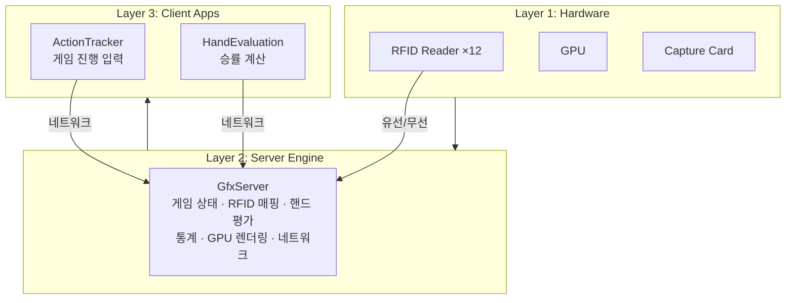
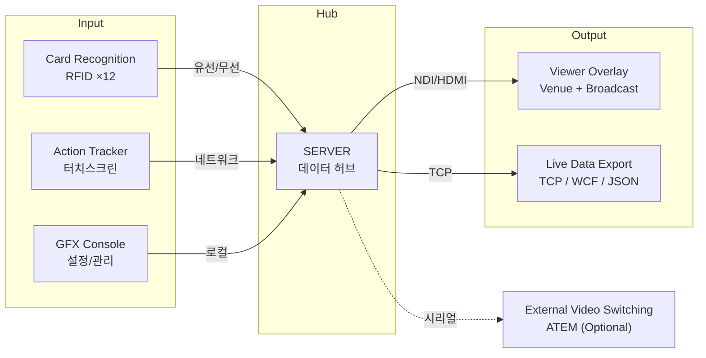
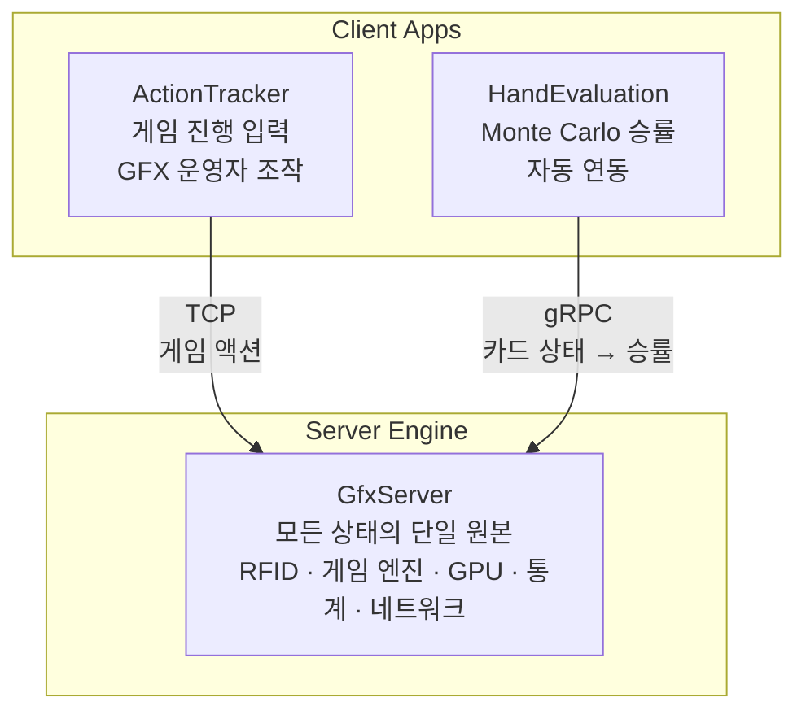
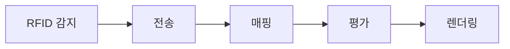
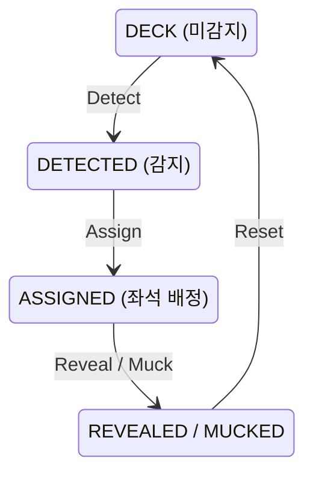
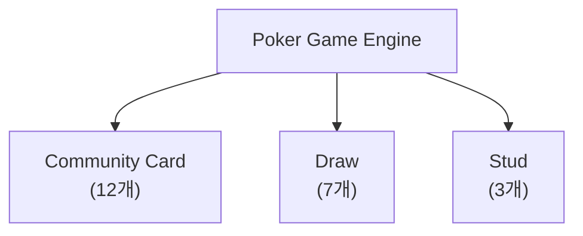
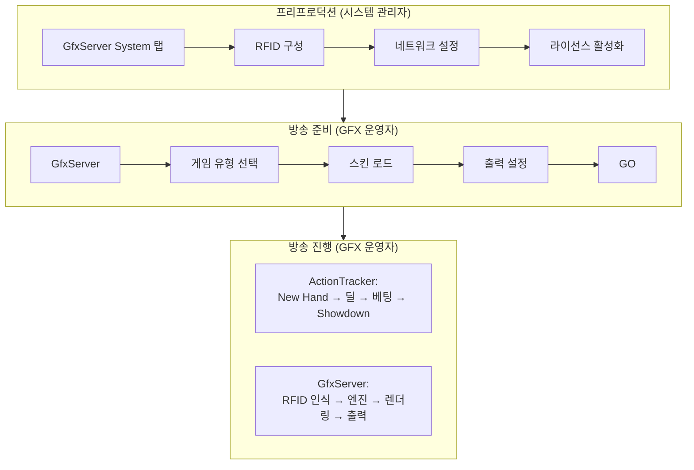
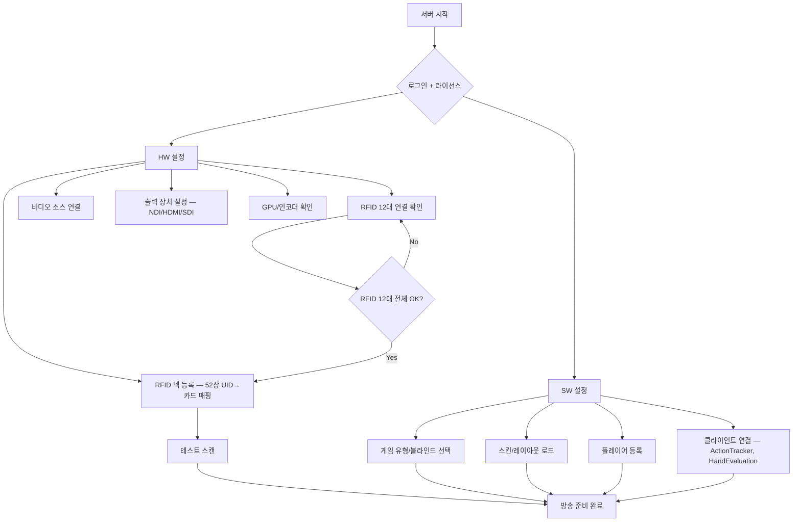
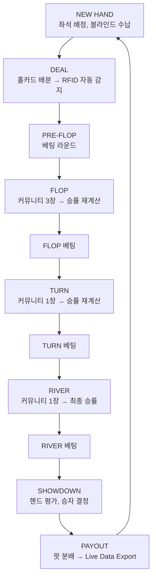
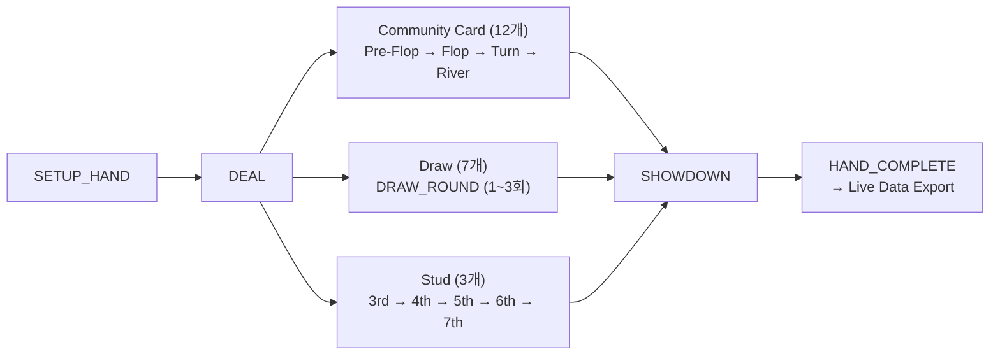

# EBS - 제품 요구사항 정의서

> **Version**: 24.0.0
> **Date**: 2026-02-18
> **문서 유형**: 제품 요구사항 정의서 (Product Requirements Document)
> **대상 독자**: 기획자, 프로덕트 매니저, 개발 리드, 이해관계자
> **벤치마크 참조 구현**: PokerGFX Server v3.2.985.0 (역공학 분석 완료)

---

## Executive Summary

포커 방송에는 다른 스포츠에 없는 근본적인 문제가 있다. 플레이어의 카드가 뒤집혀 있어 카메라로는 보이지 않는다. 시청자가 게임을 이해하려면 이 **보이지 않는 정보**를 화면에 표시해야 한다.

이 문제를 해결하는 상용 시스템(PokerGFX Server, PokerGFX LLC)이 존재하지만, 소스 비공개, 고가 라이선스, 커스터마이징 제한이라는 구조적 한계를 가진다. 북미 주요 포커 방송의 사실상 표준이면서도, 독점적 구조로 인해 기술 접근과 확장이 불가능하다.

EBS(Event Broadcasting System)는 PokerGFX의 역공학 분석을 기반으로 동등한 기능을 독립 구현하면서, 현대적 아키텍처와 확장성을 추가하는 프로젝트다. 테이블에 내장된 RFID 리더가 카드를 전자적으로 인식하고, 게임 엔진이 다수의 포커 변형 규칙과 승률을 실시간으로 연산하며, GPU 렌더러가 방송 화면 위에 그래픽을 합성한다. 카드가 테이블에 놓이는 순간부터 방송 화면에 표시되기까지 200ms 이내.

동시에 현장의 게임 공정성을 보호한다. Dual Canvas 아키텍처가 Venue Canvas(현장용, 카드 숨김)와 Broadcast Canvas(방송용, 카드 공개)를 물리적으로 분리하여, 시청자에게는 모든 것을 보여주면서도 현장에는 아무것도 유출하지 않는다.

시스템은 서버 엔진 1대(GfxServer)와 클라이언트 앱 2개(ActionTracker, HandEvaluation)로 구성된다. 각 구성요소의 역할은 Part II에서 상세히 다룬다.

---

## 프로젝트 배경

### 왜 이 프로젝트를 시작했는가

현재 라이브 포커 방송 그래픽 시스템 시장은 PokerGFX Server(v3.2.985.0, PokerGFX LLC)가 사실상 독점하고 있다. WSOP, Hustler Casino Live 등 북미 주요 이벤트가 이 시스템에 의존한다. 그러나 PokerGFX는 소스 비공개, 고가 라이선스, 커스터마이징 제한이라는 구조적 한계를 가진다. 이 시장에 독립적인 대안이 존재하지 않는 현실이 EBS 프로젝트의 출발점이다.

### PokerGFX 역공학: 무엇을 배웠는가

PokerGFX Server v3.2.985.0에 대한 포괄적 역공학 분석을 수행했다. ConfuserEx + Dotfuscator 2중 난독화를 해제하고, 2,887개 파일(8개 모듈)을 디컴파일하여 전체 아키텍처를 파악했다.

| 분석 영역 | 결과 |
|----------|------|
| **아키텍처** | 3세대 공존 — God Class(Phase 1) → Service Interface(Phase 2) → DDD+CQRS(Phase 3)의 진화 흔적이 단일 바이너리에 혼재 |
| **프로토콜** | 99개 외부 명령 + ~31개 내부 명령. 11개 카테고리. TCP 바이너리, AES-256 CBC 암호화 |
| **게임 엔진** | 22개 포커 변형 지원. Community Card 12개, Draw 7개, Stud 3개 |
| **RFID** | SkyeTek 기반 12대 리더, 듀얼 트랜스포트(WiFi + USB HID) |
| **보안 취약점** | AES-256 Zero IV 재사용, InsecureCertValidator(MITM 공격 가능), AWS 자격증명 하드코딩 |

역공학 상세: `docs/02-design/pokergfx-reverse-engineering-complete.md` (4,287줄, 88% 커버리지)

### 벤치마크를 넘어서: EBS 차별화 방향

EBS는 PokerGFX의 검증된 기능을 기준선으로 삼되, 다음 영역에서 차별화한다.

| 영역 | PokerGFX (벤치마크) | EBS (목표) |
|------|-------------------|-----------|
| **아키텍처** | .NET Framework 4.x, WinForms, God Class 혼재 | .NET 8, WPF/Avalonia, Clean Architecture |
| **프로토콜** | 커스텀 바이너리 + AES-256 CBC (Zero IV) | Protobuf + gRPC + 표준 TLS |
| **카드 인식** | RFID 전용 (SkyeTek) | RFID 기본 + Computer Vision 하이브리드 확장 가능 |
| **API** | 폐쇄적 프로토콜 | API-First (Live Data Export 기본 제공) |
| **라이선스** | 물리 USB 동글 DRM | JWT 기반 소프트웨어 라이선스 |
| **보안** | Zero IV 재사용, 인증서 미검증 | 표준 TLS, 랜덤 IV, 올바른 인증서 검증 |

> **벤치마크 기준선**: 본 문서의 기능 사양과 수치(22개 게임, 99개 명령, 144개 기능 등)는 PokerGFX Server v3.2.985.0 역공학 분석에서 추출한 것이다. EBS는 이 기준선의 **기능적 동등성**을 1차 목표로, **아키텍처 혁신**을 2차 목표로 한다.

---

## 프로젝트 범위

역공학 분석에서 파악한 PokerGFX의 전체 기능 중, EBS가 구현하는 범위와 제외하는 범위를 정의한다.

### 구현 대상

| 구성요소 | 범위 | 근거 |
|---------|------|------|
| **GfxServer** | 게임 엔진, GPU 렌더링, 네트워크 프로토콜, RFID 매핑 | 시스템 핵심 |
| **ActionTracker** | 터치스크린 게임 진행 입력 | 운영자 필수 도구 |
| **HandEvaluation** | Monte Carlo 승률 계산 프로세스 | 승률 표시 필수 |
| **RFID 카드 인식** | 12대 리더 제어, 52장 추적, 덱 등록 | 자동 카드 인식 핵심 |
| **Dual Canvas** | Venue + Broadcast 동시 렌더링 | 보안 필수 요구사항 |
| **22개 게임 규칙** | 3대 계열 전체 게임 상태 머신 | 게임 엔진 완결성 |
| **99개 외부 프로토콜 명령** | 11개 카테고리 전체 (~31개 내부 전용 명령 별도) | 서버-클라이언트 호환성 |
| **Skin Editor** | 스킨 로드/저장/편집 | 방송 커스터마이징 |
| **Hand History** | 핸드 기록, 리플레이, 비디오 합성 | 편집 방송 지원 |
| **Live Data Export** | LiveApi, live_export, HAND_HISTORY | 외부 시스템 연동 |
| **Master-Slave** | 출력 분산 구성 | 멀티 캔버스 운영 |

### 미구현

| 구성요소 | 제외 사유 |
|---------|----------|
| **ActionClock** | 프로덕션 미사용 앱 |
| **CommentaryBooth** | 프로덕션 미사용 앱 |
| **Pipcap** | 외부 입력 장치 전용 |
| **StreamDeck** | 외부 입력 장치 전용 |
| **ATEM 자동 카메라 전환** | 프로덕션에서 수동 전환 사용. 프로토콜만 구현, 자동 전환 로직 제외 |
| **자체 라이선스 서버** | 벤치마크 라이선스 체계는 분석 대상이나, 독립 라이선스 시스템은 미구현 |
| **AWS 텔레메트리** | analytics 모듈의 S3 업로드. 자체 시스템에서 불필요 |
| **자체 TLS 구현** | BoarSSL 대신 표준 TLS 라이브러리 사용 |

---

## 목차

### 프로젝트 배경
- [왜 이 프로젝트를 시작했는가](#왜-이-프로젝트를-시작했는가)
- [PokerGFX 역공학: 무엇을 배웠는가](#pokergfx-역공학-무엇을-배웠는가)
- [벤치마크를 넘어서: EBS 차별화 방향](#벤치마크를-넘어서-ebs-차별화-방향)

### Part I: 문제와 핵심 개념
- [1. 포커 방송은 왜 다른가](#1-포커-방송은-왜-다른가)
- [2. RFID 테이블과 시스템 필요성](#2-rfid-테이블과-시스템-필요성)
- [3. 핵심 개념 3가지](#3-핵심-개념-3가지)

### Part II: 시스템 구조
- [4. 시스템 전체 조감도](#4-시스템-전체-조감도)
- [5. 엔진 + 클라이언트 생태계](#5-엔진--클라이언트-생태계)
- [6. 서버-클라이언트 프로토콜](#6-서버-클라이언트-프로토콜)
- [7. 서버 배치와 자동 검색](#7-서버-배치와-자동-검색)
- [8. 카드 인식 흐름](#8-카드-인식-흐름)

### Part III: 게임 엔진과 그래픽 렌더링
- [9. 22개 포커 게임 지원](#9-22개-포커-게임-지원)
- [10. 베팅 시스템](#10-베팅-시스템)
- [11. 3가지 평가기와 게임 라우팅](#11-3가지-평가기와-게임-라우팅)
- [12. 통계 엔진](#12-통계-엔진)
- [13. 그래픽 요소 체계](#13-그래픽-요소-체계)

### Part IV: 운영 워크플로우
- [14. 사용자 역할](#14-사용자-역할)
- [15. 방송 준비 워크플로우](#15-방송-준비-워크플로우)
- [16. 게임 진행 워크플로우](#16-게임-진행-워크플로우)
- [17. 핸드 히스토리 및 Playback](#17-핸드-히스토리-및-playback)
- [18. 긴급 상황 복구](#18-긴급-상황-복구)

### Part V: 품질 요구사항
- [19. 비기능 요구사항](#19-비기능-요구사항)

### 부록
- [부록 A: 22개 게임 전체 카탈로그](#부록-a-22개-게임-전체-카탈로그)
- [부록 B: 99개 외부 프로토콜 명령 카탈로그](#부록-b-99개-외부-프로토콜-명령-카탈로그)
- [부록 C: 144개 기능 카탈로그](#부록-c-144개-기능-카탈로그)
- [부록 D: 용어 사전](#부록-d-용어-사전)
- [부록 E: 참고 자료](#부록-e-참고-자료)

---

# Part I: 문제와 핵심 개념

> 포커 방송이 일반 스포츠 방송과 근본적으로 다른 이유를 이해하고, 카드 인식 기술의 진화와 하드웨어 구성을 살펴본 뒤, 이 문서 전체를 관통하는 3가지 핵심 개념을 먼저 파악한다.

## 1. 포커 방송은 왜 다른가

### 방송 그래픽의 기본 역할

모든 스포츠 방송의 그래픽 시스템은 같은 일을 한다. **경기 상황을 시청자에게 시각적으로 전달**하는 것이다. 축구 중계의 점수판, 야구 중계의 볼카운트, 농구 중계의 샷클락 모두 같은 목적을 수행한다.

그런데 포커는 근본적으로 다르다.

**문제 정의**

### 정보 가시성의 차이

### Hidden Information Problem

포커와 다른 스포츠의 결정적 차이는 **Hidden Information**이다.

| 구분 | 일반 스포츠 | 포커 |
|------|------------|------|
| **핵심 정보** | 공개됨 (공 위치, 점수) | 비공개 (홀카드) |
| **그래픽의 역할** | 정리 및 표시 | **생성** 및 표시 |
| **정보 획득** | 카메라 영상 | RFID 센서 |
| **연산 필요** | 거의 없음 | 실시간 확률 계산 |
| **보안 요구** | 없음 | 현장 유출 차단 필수 |
| **게임 규칙** | 1개 (해당 종목) | 22개 변형 |
| **자동 인식** | 불필요 | RFID 카드 인식 필수 |

축구 중계에서 점수판을 표시하려면 점수를 입력하면 된다. 누구나 점수가 몇 대 몇인지 보고 있다.

포커 중계에서 홀카드를 표시하려면 **테이블 아래 숨겨진 RFID 리더가 뒤집어진 카드를 전자적으로 읽어야 한다**. 아무도 그 카드가 뭔지 모르기 때문이다.

**해결의 역사**

### 카드 인식 기술의 진화

#### 두 세대의 기술

포커 방송에서 "뒤집어진 카드를 시청자에게 보여준다"는 과제는 기술에 종속되지 않는다. 해결 방식은 기술과 함께 진화해 왔다.

> *World Poker Tour 방송 화면. 테이블 유리판 아래에 설치된 소형 카메라가 플레이어의 홀카드(6♠ 8♣)를 촬영한다. 이 1세대 기술은 카메라 각도와 조명에 의존하며, RFID 기반 2세대 기술로 대체되었다. (출처: ClubWPT.com)*

#### 기술 진화 타임라인

| 시기 | 이벤트 |
|------|--------|
| 1995 | Henry Orenstein, Hole Card Camera 특허 취득 |
| 1999 | Late Night Poker (Channel 4, UK), 최초의 홀카드 방송 |
| 2002 | ESPN WSOP 방송, Hole Card Camera 채택 |
| 2003 | World Poker Tour 런칭, 홀카드 방송의 대중화 |
| 2012 | European Poker Tour, RFID 테이블 도입 — 전자 인식 시대 개막 |
| 2013 | WSOP, RFID 기술 라이브 스트리밍에 적용 |
| 2014~2018 | WSOP, 30분 딜레이 프로토콜 + RFID 카드 운용 |
| 2024~현재 | RFID가 모든 주요 토너먼트의 표준으로 정착 |

> *1999년 영국 Channel 4의 Late Night Poker. 투명 테이블 아래 카메라로 플레이어의 홀카드를 촬영한 최초의 방송이다. 이 혁신이 포커를 "시청 가능한 스포츠"로 만들었다. (출처: Channel 4)*

#### 1세대 Hole Camera의 한계

- 카메라 각도와 조명에 의존 — 카드가 정확한 위치에 있어야 인식 가능
- 딜러가 카드를 특정 위치에 놓아야 하므로 게임 속도 저하
- 이미지 인식 정확도 제한
- 유리판 설치로 테이블 구조 변경 필요
- 10인 테이블에서 20장 카드를 동시 촬영하기 어려움
- **생방송 불가능** — 카메라 영상의 후처리(각도 보정, 인식)에 시간이 소요되어 실시간 중계가 불가능. 편집 방송으로만 진행 가능

#### 2세대 RFID의 장점

- 물리적 접촉 없이 전자적으로 카드 식별
- 인식 지연 ~50ms, 오류율 0%
- 테이블 표면 아래 매립으로 외관 변화 없음
- 10인 x 2장 = 20장 홀카드 동시 추적
- 게임 흐름 무중단

**본 시스템은 현재 업계 표준인 RFID를 기본 구현으로 채택하되, 카드 인식 계층을 추상화하여 미래 기술로 교체 가능하게 설계한다.**

#### 주요 방송 플랫폼과 시스템 현황

현재 RFID 기반 라이브 포커 방송은 5대 플랫폼이 주도한다.

| 플랫폼 | 시스템 | 비고 |
|--------|--------|------|
| **PokerGo** | PokerGFX | 자체 RFID 테이블 + PokerGFX 소프트웨어. WSOP, Super High Roller Bowl 등 주요 이벤트 방송 |
| **World Poker Tour** | 미확인 | PokerGFX 사용 여부 미확인 |
| **Hustler Casino Live** | PokerGFX | 캐시 게임 라이브 스트리밍에 PokerGFX 사용 |
| **PokerStars** | 미확인 | EPT 등 주요 이벤트의 방송 시스템 미확인 |
| **Triton Poker** | 자체 시스템 | 독자적 RFID 방송 인프라 운용, PokerGFX 미사용 확인 |

PokerGFX는 PokerGo, Hustler Casino Live 등 북미 주요 방송에서 사실상 표준으로 자리잡았다. WPT와 PokerStars의 방송 시스템은 확인되지 않았다. Triton Poker만이 독자적인 방송 인프라를 운용하는 것이 확인되었다.

---

## 2. RFID 테이블과 시스템 필요성

> RFID 카드 인식에 필요한 물리적 하드웨어 구성을 살펴보고, 포커 방송 고유의 보안 제약과 자동화 시스템의 필요성을 이해한다.

**물리적 구현**

### 테이블 하드웨어 배치

#### RFID 리더 배치도

> *PokerGFX RFID 테이블 3D 단면도. 테이블 베이스에 좌석별 안테나 홈, 중앙 Reader Module 홈, 케이블 채널이 CNC로 가공된다. 플레이어 안테나는 115mm x 115mm 표준 또는 230mm x 115mm 더블 사이즈를 지원한다. (출처: RFID VPT Build Guide V2, PokerGFX LLC)*

> *RFID 전자장비 설치 완료 상태. 중앙의 Reader Module(커뮤니티 카드 안테나 내장)에서 각 좌석 안테나와 Muck 안테나로 케이블이 연결된다. 여분 케이블은 안테나 위에 느슨하게 감아 놓는다. (출처: RFID VPT Build Guide V2, PokerGFX LLC)*

#### 안테나 역할 상세

| 리더 | 수량 | 안테나 | 역할 |
|------|:----:|:------:|------|
| Seat Reader | 10대 | 각 1~2개 | 플레이어 홀카드 감지 (더블 사이즈 시 Omaha 등 다중 홀카드 지원) |
| Board Reader | 1대 (Reader Module 내장) | 통합 | 커뮤니티 카드 감지 (Flop/Turn/River) |
| Muck Reader | 1대 | 1~2개 | 폴드/버린 카드 감지 |
| **합계** | **12대** | **최대 22개** | Reader Module은 최대 22개 안테나 지원 |

#### 설치 규격

| 항목 | 사양 |
|------|------|
| Reader Module 크기 | 345mm x 90mm (중앙 배치) |
| 표준 안테나 크기 | 115mm x 115mm |
| 더블 안테나 크기 | 230mm x 115mm (2개 밀착) |
| 안테나 간 최소 이격 | 60mm (모든 방향) |
| 커팅 최소 깊이 | 14mm |
| 안테나~표면 최대 거리 | 50mm |
| 안테나 케이블 길이 | 1.5m |
| 접속 방식 | USB 또는 WiFi |

**제약 조건**

### 보안의 역설

포커 방송에는 독특한 역설이 존재한다.

- **시청자에게**: 홀카드를 보여줘야 한다
- **현장에**: 홀카드를 절대 보여주면 안 된다

현장에 있는 모니터에 홀카드가 표시되면 플레이어가 상대의 카드를 볼 수 있다. 이는 게임의 공정성을 파괴한다. 그래서 포커 방송 시스템은 **두 개의 별도 화면**을 동시에 생성해야 한다. 하나는 현장용(홀카드 숨김), 하나는 방송용(홀카드 공개). 이것이 Dual Canvas 개념이다.

**시스템 필요성**

### 자동화가 필요한 이유

카드 인식 계층이 추가되면서, 수동 운영만으로는 처리하기 어려운 데이터량이 발생한다.

| 요구사항 | 배경 |
|----------|------|
| 매 핸드 최대 20장 카드 인식 | 10명 x 홀카드 2장이 매 핸드마다 반복된다 |
| 실시간 액션 추적 | Fold, Bet, Raise가 초 단위로 발생한다 |
| 승률 재계산 | 보드 카드가 나올 때마다 모든 플레이어의 Equity가 변동한다 |
| 보안 딜레이 | 생방송 중 홀카드 정보 유출을 방지해야 한다 |

### 왜 전용 시스템이 필요한가

일반 방송 그래픽 도구(CasparCG, vMix 등)로 포커 방송을 할 수 없는 이유:

**일반 그래픽 도구가 하는 일**: 텍스트 오버레이, 이미지 오버레이, 타이머, 애니메이션

**포커 방송이 추가로 요구하는 것**:

| 요구사항 | 설명 |
|----------|------|
| RFID 하드웨어 드라이버 | 리더 12대 제어 |
| 카드 자동 인식 엔진 | 52장 실시간 추적 |
| 22개 게임 규칙 엔진 | 게임별 상태 관리 |
| 핸드 평가 알고리즘 | 등급 + 승률 계산 |
| Dual Canvas GPU 렌더링 | 현장/방송 분리, 현장 유출 차단 |
| 서버-클라이언트 동기화 프로토콜 | 엔진-클라이언트 앱 연동 |
| GFX 운영자용 터치스크린 UI | 게임 진행 입력 |
| 실시간 통계 | 플레이어 행동 패턴 분석 |

이것이 **전용 시스템**이 필요한 이유다. EBS는 이 요구를 충족하기 위해 RFID 하드웨어부터 GPU 렌더링까지 수직 통합된 포커 전용 방송 엔진을 구축한다. 벤치마크 참조 구현(PokerGFX)의 역공학에서 검증된 아키텍처를 기반으로 한다.

---

## 3. 핵심 개념 3가지

EBS를 이해하는 데 가장 중요한 3가지 개념이 있다.

### 3.1 RFID 카드 인식

**"테이블 위에 놓인 뒤집힌 카드를 어떻게 아는가"**

카드 52장 + 1장(Joker)에 각각 RFID 태그(NXP NTAG215, 13.56MHz)가 내장되어 있다. 각 태그는 고유한 7-byte UID를 가지며, 이 UID가 어떤 카드인지 매핑 테이블로 변환된다. 카드가 RFID 안테나 위에 놓이는 순간, 리더가 태그를 감지하고, 서버에 "이 좌석에 이 카드가 놓였다"를 보고한다.

> *RFID 태그가 내장된 포커 카드. 각 카드에 패시브 태그가 있으며, 고유 UID를 저장한다. 13.56MHz 주파수로 ~3cm 범위에서 리더와 통신한다. (출처: habwin.com)*

### 3.2 Dual Canvas

**"같은 게임을 두 가지 화면으로 동시에 렌더링한다"**

| 속성 | Venue Canvas | Broadcast Canvas |
|------|-------------|---------------|
| **대상** | 현장 모니터 | 방송 송출 |
| **홀카드** | 숨김 (??) | 공개 (A♠K♥) |
| **승률** | 미표시 | 표시 (67.3%) |
| **핸드 등급** | 미표시 | 표시 (Pair of Kings) |
| **홀카드 공개 시점** | 미공개 (Showdown 후에만) | 딜 즉시 공개 |
| **이름/칩/베팅** | 표시 | 표시 |

Venue Canvas에는 어떤 상황에서도 홀카드를 표시하지 않는다. Showdown이 끝난 후에만 Venue Canvas에 카드가 공개된다.

### 3.3 실시간 승률 계산

**"현재 카드 상태에서 각 플레이어가 이길 확률을 즉시 계산한다"**

시청자가 가장 원하는 정보는 "이 선수가 이길 확률이 몇 %인가"이다.

| 방식 | 설명 | 채택 여부 |
|------|------|----------|
| **Exhaustive Enumeration** | 가능한 모든 보드 카드 조합을 탐색. Pre-Flop에서 C(45,5)=1,221,759 조합 x 10명 = 연산 불가 | 불가 |
| **Monte Carlo Simulation** | 10,000회 무작위 시뮬레이션. 어떤 상황에서든 ~200ms 이내 완료. 정확도 ±1% | **채택** |
| **PocketHand169 LUT** | Pre-Flop 전용. 169개 핸드 타입(AA, AKs, ... , 22)의 사전 계산된 승률표 사용 | **Pre-Flop 전용** |

---

# Part II: 시스템 구조

> Part I에서 파악한 핵심 개념이 실제 시스템에서 어떤 구조로 구현되는지, 아키텍처, 생태계, 서비스 인터페이스, 서버 구성, 그리고 카드 인식의 실제 동작 흐름을 살펴본다.

## 4. 시스템 전체 조감도

### 3계층 아키텍처

시스템은 3개 계층으로 구성된다.

> 프로토콜 상세(gRPC, TCP, USB HID 등): Design Doc Section 8 참조

| 계층 | 구성 | 역할 |
|------|------|------|
| **Layer 1: Hardware** | RFID Reader x12, GPU, Capture Card | 물리적 데이터 수집 및 영상 입출력 |
| **Layer 2: Server Engine** | GfxServer (단일 프로세스) | 게임 상태, RFID 매핑, 핸드 평가, 통계, GPU 렌더링, 네트워크 프로토콜을 단일 프로세스 내에서 통합 처리 |
| **Layer 3: Client Apps** | ActionTracker, HandEvaluation | 서버에 TCP로 연결되는 별도 프로세스 |

**Server Engine 내부 모듈**: GfxServer는 단일 실행 파일이지만, 내부적으로 게임 엔진(22개 게임 상태 머신), 핸드 평가(사전 계산 참조표 기반 즉시 평가), 통계 엔진(플레이어 행동 패턴 세션 통계), GPU 렌더러(DirectX 11 기반 실시간 합성), 네트워크 서버(클라이언트 연결 관리)가 모듈로 분리되어 있다. 이것들은 독립 앱이 아니라 **서버 내부 구성요소**다.

**Client Apps**: ActionTracker와 HandEvaluation은 GfxServer와 별도로 실행되는 독립 프로세스다. ActionTracker는 운영자가 게임 진행을 입력하는 터치스크린 클라이언트이고, HandEvaluation은 Monte Carlo 시뮬레이션의 CPU 부하를 서버에서 분리하기 위한 전용 계산 프로세스다.

### 모듈 구성: 6 Core + 1 Optional

Server를 중심 허브로 주변 모듈이 연결되는 허브-스포크 구조다.

> 프로토콜 상세(gRPC, TCP, USB HID 등): Design Doc Section 8 참조

| 계층 | 모듈 | 역할 | 통신 |
|------|------|------|------|
| Input | **Card Recognition** | RFID 리더 12대, 카드 → UID 자동 감지 | USB / WiFi |
| Input | **Action Tracker** | 운영자 게임 진행 입력 (Bet/Fold/Check, 좌석 관리) | TCP |
| Input | **GFX Console** | 설정/관리 콘솔 — 게임 유형, 스킨, 출력, RFID 구성 등 시스템 설정값을 Server에 입력. GfxServer의 UI 자체가 이 역할을 수행한다 | 로컬 |
| Hub | **SERVER** | 데이터 허브 — 카드 매핑, 게임 상태, 핸드 평가, 통계, GPU 렌더링 | — |
| Output | **Viewer Overlay** | 방송 그래픽 출력 — Venue Canvas(현장, 카드 숨김) + Broadcast Canvas(방송, 카드 공개) | NDI / HDMI |
| Output | **Live Data Export** | 핸드 히스토리/게임 상태를 외부 시스템에 실시간 전달. 라이선스 게이트 기능(Professional+) | TCP / WCF / JSON |

**Optional: External Video Switching**

Blackmagic ATEM Switcher(COM/Port 9910)를 서버가 제어하여 카메라를 자동 전환하는 기능이 구현되어 있다. 서버 내부에도 AutoCamera 소프트웨어가 존재하여 게임 이벤트에 따른 자동 전환 규칙을 지원한다.

**그러나 실제 프로덕션에서는 자동 카메라 전환을 사용하지 않는다.** 라이브 포커 방송의 카메라 연출은 게임 데이터만으로는 판단할 수 없는 연출 요소(표정, 분위기, 타이밍)를 포함한다. 전담 카메라 디렉터가 ATEM 하드웨어를 수동으로 조작하는 것이 프로덕션 표준이다.

### 데이터 흐름

카드 한 장이 테이블에 놓이는 순간부터 시청자 화면에 표시되기까지 200ms 이내로 완료된다. RFID 감지 → 전송 → 매핑 → 평가 → 렌더링의 5단계 파이프라인이다. 단계별 상세 타임라인은 Section 8에서 다룬다.

### 방송 송출 모드

EBS는 2가지 방송 송출 방식을 지원한다.

**Internal 모드** (직접 합성): 서버가 카메라 입력을 수신하여 그래픽을 실시간 합성한 뒤 NDI/HDMI로 직접 출력한다. Venue Canvas와 Broadcast Canvas를 동시에 생성한다.

**External 모드** (간접 관여): 서버의 Live Data Export 기능(Section 5 참조)을 통해 게임 데이터를 외부 시스템에 전달하고, 프로덕션 팀이 이를 가공하여 자막/그래픽을 별도 제작한다. 이 워크플로우는 핸드가 종료되는 시점마다 본방송(Live) 내에서 실시간으로 처리된다. External 모드는 Live Data Export 라이선스(Professional+)가 필요하다.

---

## 5. 엔진 + 클라이언트 생태계

EBS는 서버 엔진 1대와 클라이언트 앱 2개가 동기화되는 생태계다. GFX 운영자 1명이 GfxServer와 ActionTracker를 직접 조작하고, HandEvaluation은 자동 연동된다.

> **참고**: 벤치마크 원본에는 ActionClock, CommentaryBooth, Pipcap, StreamDeck을 포함한 7개 앱이 존재하나, 이 중 4개는 실제 프로덕션에서 사용되지 않거나 외부 입력 장치이므로 본 프로젝트에서는 구현하지 않는다.

| 구분 | App | 역할 | 운영 |
|------|-----|------|------|
| **Server Engine** | **GfxServer** | 모든 상태의 단일 원본. RFID 카드 매핑, 22개 게임 상태 머신, GPU 렌더링, 통계 연산, 네트워크 프로토콜을 단일 프로세스에서 통합 처리한다 | GFX 운영자 |
| **Client** | **ActionTracker** | 게임 진행 입력 터치스크린. New Hand → Deal → 베팅 → Showdown 순으로 게임 액션을 서버에 전달한다. 운영자가 방송 중 실시간으로 조작하는 유일한 입력 클라이언트다 | GFX 운영자 |
| **Client** | **HandEvaluation** | 승률 계산 전용 프로세스. GfxServer는 사전 계산 참조표로 핸드 등급을 즉시 평가하지만, 승률(Equity) 계산에는 시뮬레이션 기반 확률 계산이 필요하다. 이 연산은 CPU를 집중적으로 사용하므로, GfxServer의 메인 스레드(렌더링 + 네트워크)를 보호하기 위해 별도 프로세스로 분리한다. 서버가 카드 상태를 전달하면 HandEvaluation이 각 플레이어의 승률을 계산하여 반환한다 | 자동 |

### 데이터 생성 경로

서버는 2가지 경로로 데이터를 외부에 전달한다.

**Overlay 출력** (실시간): GfxServer의 GPU 렌더러가 카메라 입력 위에 그래픽(홀카드, 승률, 팟, 플레이어 정보)을 실시간 합성하여 NDI/HDMI로 출력한다. Venue Canvas와 Broadcast Canvas를 동시에 생성하며, 이것이 시청자가 보는 방송 화면이다.

**Live Data Export** (핸드 단위 + 실시간): 서버는 3개의 데이터 출력 경로를 제공한다.

| 경로 | 프로토콜 | 데이터 | 타이밍 |
|------|---------|--------|--------|
| **LiveApi** | TCP Socket (Push, Keepalive) | 게임 상태 delta 스트리밍 | 실시간 |
| **live_export** | Event-driven | 핸드 종료 시 전체 핸드 데이터 | 핸드 단위 |
| **HAND_HISTORY** | TCP 명령어 (기존 프로토콜) | 핸드 히스토리 요청-응답 | 클라이언트 요청 시 |

LiveApi는 TCP 소켓 기반 실시간 스트리밍으로, 이전 전송 데이터와의 delta만 전송하여 대역폭을 최적화한다. live_export는 핸드가 종료될 때 이벤트 기반으로 전체 핸드 데이터(플레이어, 홀카드, 액션 로그, 보드, 결과)를 JSON으로 생성하여 외부 시스템에 전달한다. 프로덕션 팀이 이 데이터로 자막/통계 그래픽을 별도 제작하는 External 모드의 기반이다. 이 기능은 **라이선스 게이트**(Professional 이상)이며, `LiveDataExport`와 `LiveHandData` 두 개의 독립 플래그로 제어된다.

---

## 6. 서버-클라이언트 프로토콜

Server와 클라이언트 앱 사이의 통신은 5개 서비스 영역으로 구성된다. 각 서비스는 명확한 책임 영역을 가진다.

> **벤치마크 프로토콜**: 벤치마크 참조 구현은 커스텀 바이너리 프로토콜로 통신한다. EBS는 표준 프로토콜로 마이그레이션하되, 아래 5개 서비스 영역의 논리적 분류는 유지한다.
>
> **프로토콜 상세**: 암호화, 직렬화, 프로토콜 스택 등은 Design Doc Section 8, 12.5를 참조한다.

### 5개 서비스 영역

| 서비스 | 주요 메서드 |
|--------|-----------|
| **GameService** | NewHand, StartGame, EndGame, SetGameType, GetGameInfo |
| **PlayerService** | AddPlayer, RemovePlayer, UpdateChips, SetSeat, GetStats |
| **CardService** | DealCard, RevealCard, MuckCard, SetBoard, GetDeck |
| **DisplayService** | ShowOverlay, HideOverlay, SetSkin, SetLayout, ToggleTrust |
| **MediaService** | PlayVideo, PlayAudio, SetLogo, SetTicker, CaptureFrame |

> **참고**: 위 5개 서비스는 기능 관점의 논리적 그룹이다. 이들의 구현은 아래 11개 프로토콜 카테고리 99개 외부 명령어로 분산된다. 이 외에 ~31개의 내부 전용 명령이 별도로 존재하나 외부 프로토콜에 노출되지 않는다.

> **용어**: ToggleTrust, SetTicker 등은 [용어 사전](pokergfx-glossary.md#시스템-용어)을 참조한다.

### 99개 외부 명령어 카탈로그

99개 외부 명령어는 Connection, Game, Player, Cards & Board, Display, Media & Camera, Betting, Data Transfer, RFID, History, Slave / Multi-GFX의 11개 카테고리로 분류된다. 이 외에 ~31개의 내부 전용 명령이 존재하며, 이는 서버 내부 처리에만 사용되고 클라이언트 프로토콜에 노출되지 않는다. 외부 명령어 전체 목록은 [부록 B](#부록-b-99개-외부-프로토콜-명령-카탈로그)를 참조한다.

### 16개 실시간 이벤트

서버가 클라이언트에 Push하는 주요 이벤트:

| 이벤트 | 트리거 |
|--------|--------|
| OnCardDetected / OnCardRemoved | RFID 카드 감지/제거 |
| OnBetAction | 베팅 액션 발생 |
| OnHandComplete | 핸드 종료 |
| OnGameStateChanged | 상태 전환 |
| OnWinProbabilityUpdated | 승률 갱신 |

> 전체 16개 이벤트 목록은 기술 설계 문서를 참조한다. → `docs/02-design/features/pokergfx.design.md`

### GameInfoResponse: 단일 상태 메시지 (75+ 필드)

서버와 클라이언트 간 게임 상태는 단일 메시지(75+ 필드)로 전달된다.

> **필드 상세**: 카테고리별 전체 필드 목록, Protobuf 스키마, 직렬화 성능(1ms 미만), 버전 호환성 규칙 등은 기술 설계 문서 Section 8.5를 참조한다.
> → `docs/02-design/features/pokergfx.design.md` Section 8.5

---

서비스 인터페이스의 논리적 구조를 파악했으니, 이 서비스를 실행하는 물리적 서버 구성을 살펴본다.

## 7. 서버 배치와 자동 검색

### 자동 검색

클라이언트 앱은 서버를 수동으로 설정할 필요 없이, 네트워크에서 자동으로 찾는다. 클라이언트가 "서버를 찾습니다" 요청을 보내면, 서버가 자신의 위치를 응답한다. 이후 자동으로 연결되어 전체 게임 상태를 수신한다.

### Master-Slave 구성

EBS는 **1 서버 인스턴스 = 1 테이블** 아키텍처다. 프로토콜에 `tableId`가 존재하지 않으며, 게임 상태는 서버 인스턴스 전체의 단일 상태다.

그렇다면 Master-Slave는 왜 존재하는가? **하나의 테이블에서 다수의 출력을 분산**하기 위한 구조다.

- **Master**: 게임 상태 관리, RFID 제어, 핸드 평가, 이벤트 발행 — 단일 원본
- **Slave**: Master의 게임 상태를 미러링하여 **독립적인 렌더링 출력**을 제공

Slave는 게임 로직을 실행하지 않는다. Master로부터 게임 상태 변경분만 수신하여 자체 GPU로 렌더링한다. 하나의 Master에 여러 Slave를 연결하면:

| 출력 장치 | 담당 | 내용 |
|-----------|------|------|
| Master 본체 | GfxServer 운영자 화면 | 관리 인터페이스 + 미리보기 |
| Slave 1 | Venue Canvas (NDI) | 현장 모니터 — 홀카드 숨김 |
| Slave 2 | Broadcast Canvas (HDMI) | 방송 송출 — 홀카드 공개 |
| Slave 3 | 추가 중계 화면 | 해설석, VIP 라운지 등 |

Slave는 스킨, ATEM 스위처 주소, 스트리밍 상태 등 Master의 설정 정보도 자동 동기화한다.

> **멀티 테이블 운영**: WSOP 메인 이벤트처럼 4~8개 테이블을 동시에 방송하는 경우, 테이블마다 독립된 Master 서버를 실행하여 물리적으로 분리한다. 테이블 간 프로토콜 연동은 없다.

---

## 8. 카드 인식 흐름

### End-to-End 인식 타임라인

카드가 테이블에 놓이는 순간부터 방송 화면에 표시되기까지 200ms 이내로 완료된다.

> 전체 파이프라인 200ms 이내. 단계별 시간 분해: Design Doc Section 9 참조

### Dual Transport

RFID 리더와 서버 간 통신은 WiFi(Primary) + USB(Fallback) 듀얼 트랜스포트를 지원한다. WiFi 실패 시 자동으로 USB로 폴백한다.

> 전송 방식별 지연 시간 비교, 폴백 메커니즘 상세: Design Doc Section 9.2 참조

### 카드 상태 관리

52장 카드는 4가지 상태를 순환한다:

전체 52장 추적 예시 (10인 Hold'em): 홀카드 20장(ASSIGNED) + 보드 0~5장(DETECTED) + Muck 가변(MUCKED) + 나머지(DECK) = **항상 52장**

52장의 카드 상태가 추적되면, 다음은 이 카드들이 어떤 게임 규칙에 따라 처리되는지를 다룬다.

---

# Part III: 게임 엔진과 그래픽 렌더링

> 카드가 인식된 후, 게임 엔진이 22개 포커 변형의 규칙, 베팅, 핸드 평가, 통계를 처리하고, 그 결과를 시청자에게 보여주는 그래픽 렌더링까지의 과정을 다룬다.

## 9. 22개 포커 게임 지원

### 3대 계열 분류

포커 22가지 변형 게임은 3대 계열로 분류된다. 각 계열은 카드 배분, 베팅 라운드, 핸드 평가가 모두 다르다.

Community Card 12개, Draw 7개, Stud 3개 = 총 22개 게임을 지원한다.

> 각 게임의 전체 리스트와 상세 사양(홀카드 수, 보드 수, 특수 규칙)은 **부록 A**에서 확인한다.

### 계열별 비교

| 속성 | Community Card | Draw | Stud |
|------|---------------|------|------|
| **게임 수** | 12개 | 7개 | 3개 |
| **홀카드 수** | 2~6장 | 4~5장 | 7장 (3+4) |
| **커뮤니티 카드** | 최대 5장 | 없음 | 없음 |
| **카드 교환** | 없음 | 1~3회 | 없음 |
| **공개 카드** | 커뮤니티 전체 | 없음 | 4장 (3rd~6th) |
| **베팅 라운드** | 4 (Pre~River) | 2~4 | 5 (3rd~7th) |
| **RFID 추적** | 홀카드 + 보드 | 홀카드만 | 홀카드 + 공개 |
| **대표 게임** | Texas Hold'em | 2-7 Triple Draw | 7-Card Stud |

### 게임 상태 머신

모든 포커 게임은 상태 머신으로 동작한다. 계열별로 상태 흐름이 다르다.

**Community Card**: IDLE → SETUP_HAND → PRE_FLOP → FLOP → TURN → RIVER → SHOWDOWN → HAND_COMPLETE

**Draw**: IDLE → SETUP_HAND → DRAW_ROUND 1 → DRAW_ROUND 2 → ... → SHOWDOWN → HAND_COMPLETE

**Stud**: IDLE → SETUP_HAND → 3RD_STREET → 4TH → 5TH → 6TH → 7TH → SHOWDOWN → HAND_COMPLETE

Stud 계열 전체(7-Card Stud, 7-Card Stud Hi-Lo, Razz)는 7th Street(마지막 라운드)까지 진행한 후 Showdown으로 전환된다. 각 플레이어는 최대 7장(3 down + 4 up)을 받으며, 7th 이후 추가 라운드는 없다.

각 상태 전환에서 RFID 감지, 베팅 액션, 승률 재계산이 트리거된다.

각 게임의 상태 전환마다 베팅 라운드가 진행된다. 이 베팅의 구조와 규칙을 상세히 살펴본다.

---

## 10. 베팅 시스템

### 3가지 베팅 구조

| 구조 | 최소 베팅 | 최대 베팅 | 적용 게임 예시 |
|------|----------|----------|--------------|
| **No Limit** | Big Blind | All-in (전 칩) | NL Hold'em, NL Omaha |
| **Pot Limit** | Big Blind | 현재 팟 크기 | PLO (Pot Limit Omaha) |
| **Fixed Limit** | Small Bet / Big Bet | 고정 단위 (Cap: 보통 4 Bet) | Limit Hold'em, Stud |

### 7가지 Ante 유형

Ante는 핸드 시작 전 의무 납부금이다.

| Ante 유형 | 납부자 | 설명 |
|-----------|--------|------|
| **Standard** | 전원 | 전체 플레이어가 동일 금액 납부 |
| **Button** | 딜러만 | 딜러 버튼 위치 플레이어만 납부 |
| **BB Ante** | Big Blind만 | BB가 전원 Ante를 대납 |
| **BB Ante (BB 1st)** | Big Blind만 | BB Ante + BB가 먼저 행동 |
| **Live Ante** | 전원 | 앤티가 "라이브 머니"로 취급됨. Standard Ante에서는 앤티가 데드 머니(팟에 기여하지만 해당 플레이어의 현재 베팅으로 인정되지 않음)인 반면, Live Ante에서는 앤티 금액이 첫 베팅 라운드에서 해당 플레이어의 베팅으로 인정된다. 따라서 Live Ante를 낸 플레이어는 액션이 돌아왔을 때 Check 대신 Raise 옵션을 가지며, 누군가 레이즈했을 때 Live Ante를 낸 플레이어는 레이즈 금액에서 자신의 Live Ante를 차감한 금액만 내면 콜할 수 있다. 주로 캐시 게임에서 사용 |
| **TB Ante** | SB + BB | Two Blind 합산 Ante |
| **TB Ante (TB 1st)** | SB + BB | TB Ante + SB/BB 먼저 행동 |

> **참고**: 2018~2019년을 기점으로 대부분의 메인 토너먼트에서 Big Blind Ante(BB Ante)로 전환되었다. BB Ante 방식은 한 명(BB 위치)이 전원의 앤티를 대납하여 게임 진행 속도를 높이고 딜러와 플레이어 간의 수납 실수를 줄인다. 다만 BB Ante를 적용하지 않는 토너먼트도 존재한다. 하단의 특수 규칙(Bomb Pot, Run It Twice 등)은 현재 토너먼트에서 적용되는 경우가 드물지만, 일부 이벤트에서는 운용될 수 있다.

### 특수 규칙 4가지

| 규칙 | 설명 |
|------|------|
| **Bomb Pot** | 전원 합의 금액 납부 → Pre-Flop 건너뛰고 바로 Flop |
| **Run It Twice** | All-in 후 남은 보드를 2회 전개, 팟 절반씩 분할 |
| **7-2 Side Bet** | 7-2 오프슈트(최약 핸드)로 이기면 사이드벳 수취 |
| **Straddle** | 자발적 3번째 블라인드 (보통 2x BB) |

---

## 11. 3가지 평가기와 게임 라우팅

### 핸드 등급 체계

| 등급 | 이름 | 확률 |
|:----:|------|-----:|
| 9 | Royal Flush | 0.0002% |
| 8 | Straight Flush | 0.0013% |
| 7 | Four of a Kind | 0.024% |
| 6 | Full House | 0.14% |
| 5 | Flush | 0.20% |
| 4 | Straight | 0.39% |
| 3 | Three of a Kind | 2.11% |
| 2 | Two Pair | 4.75% |
| 1 | One Pair | 42.26% |
| 0 | High Card | 50.12% |

### 평가기별 게임 라우팅

22개 게임이 모두 같은 방식으로 핸드를 평가하지 않는다.

| 평가기 | 대상 게임 | 설명 |
|--------|----------|------|
| **Standard High** | Texas Hold'em, Pineapple, 6+ Hold'em x2, Omaha, Five Card Omaha, Six Card Omaha, Courchevel, Five Card Draw, 7-Card Stud (10개) | 높은 핸드가 승리 |
| **Hi-Lo Splitter** | Omaha Hi-Lo, Five Card Omaha Hi-Lo, Six Card Omaha Hi-Lo, Courchevel Hi-Lo, 7-Card Stud Hi-Lo (5개) | High + Low 동시 평가, 팟 분할 |
| **Lowball** | Razz, 2-7 Single Draw, 2-7 Triple Draw, A-5 Triple Draw, Badugi, Badeucy, Badacey (7개) | 낮은 핸드가 승리 (역전) |

### Lookup Table 기반 즉시 평가

사전 계산된 참조 테이블을 사용하여 O(1) 즉시 평가를 수행하며, Monte Carlo 10,000회 시뮬레이션의 핵심 가속기다.

> **기술 상세**: 8개 핵심 테이블 구조(538개 정적 배열, ~2.1MB), 64비트 비트마스크 인코딩, Memory-Mapped 파일, Source Generator 기반 초기화 등은 기술 설계 문서 Section 6.6을 참조한다.
> → `docs/02-design/features/pokergfx.design.md` Section 6.6

---

핸드 평가기가 각 핸드의 승패를 결정하면, 이 결과가 세션 단위로 축적되어 플레이어 통계가 된다.

## 12. 통계 엔진

### 실시간 Equity 계산

모든 플레이어의 홀카드와 보드 카드가 인식되면, 시스템은 각 플레이어의 승률을 실시간으로 계산한다.

| 스트리트 | 알려진 카드 | 계산 방법 |
|----------|-------------|-----------|
| Preflop | 홀카드만 | PocketHand169 LUT 또는 Monte Carlo |
| Flop | 홀카드 + 3장 | Turn/River 조합 시뮬레이션 |
| Turn | 홀카드 + 4장 | River 1장 시뮬레이션 |
| River | 홀카드 + 5장 | 확정 (승자 결정) |

2~10명 동시 계산을 지원하며, 타이 확률과 아웃츠 분석도 포함된다.

### 플레이어 통계

세션 동안 축적된 핸드 데이터로 플레이어별 통계를 계산한다.

| 통계 | 축약어 | 의미 |
|------|--------|------|
| **VPIP** | Voluntarily Put money In Pot | 자발적으로 팟에 참여한 비율 |
| **PFR** | Pre-Flop Raise | 프리플롭에서 레이즈한 비율 |
| **AGR** | Aggression Factor | 공격적 플레이 비율 |
| **WTSD** | Went To ShowDown | 쇼다운까지 간 비율 |
| **3Bet%** | Three-Bet Percentage | 3벳 빈도 |
| **CBet%** | Continuation Bet Percentage | 컨티뉴에이션 벳 빈도 |
| **WIN%** | Win Rate | 핸드 승률 |
| **AFq** | Aggression Frequency | 공격 빈도 |

이 통계는 플레이어의 플레이 스타일을 정량화하며, GTO(Game Theory Optimal) 전략 수립의 기초 데이터로 활용된다. GFX Console의 리더보드에 표시되거나, Viewer Overlay에 LIVE Stats로 노출될 수 있다.

---

## 13. 그래픽 요소 체계

게임 엔진이 생성한 데이터를 시청자에게 보여주는 그래픽 렌더링 계층을 다룬다.

### 4가지 요소 타입

모든 방송 그래픽은 4가지 기본 요소의 조합이다.

| 요소 | 필드 수 | 용도 |
|------|:-------:|------|
| **Image** | 41 | 카드 이미지, 로고, 배경 — x, y, width, height, alpha, source, crop, rotation, z_order, animation |
| **Text** | 52 | 플레이어 이름, 칩 카운트, 승률, 팟 — font, size, color, alignment, shadow, auto_fit, animation |
| **Pip** | 12 | PIP(Picture-in-Picture) — 카메라 입력을 캔버스의 임의 위치에 배치하는 요소. 소스 영역(src_rect)에서 캡처한 비디오를 대상 영역(dst_rect)에 렌더링한다 — src_rect, dst_rect, opacity, z_pos, dev_index, scale, crop |
| **Border** | 8 | 테두리, 구분선, 강조 표시 — color, thickness, radius |

### 애니메이션 시스템

16개 Animation State x 11개 Animation Class:

| Animation Class | 설명 |
|----------------|------|
| FadeIn/FadeOut | 투명도 전환 |
| SlideLeft/Right | 수평 슬라이드 |
| SlideUp/Down | 수직 슬라이드 |
| ScaleIn/Out | 크기 전환 |
| FlipHorizontal/Vertical | 뒤집기 |
| Pulse | 반복 강조 |
| Flash | 깜빡임 |
| Bounce | 탄성 효과 |
| Rotate | 회전 |
| Custom | 커스텀 키프레임 |

### 실제 방송 오버레이 해부도

아래는 WSOP Paradise 2025 Super Main Event Final Table 방송 화면의 오버레이 요소 분석이다.

| 요소 | 위치 | 표시 데이터 | GFX 타입 |
|------|------|------------|----------|
| **Player Info Panel** | 좌측 상단~중앙 (세로 스택) | 플레이어 이름, 칩 카운트(M 단위), 국가 정보 | Text + Image |
| **홀카드 표시** | Player Panel 우측 | 2장 카드 이미지 (Broadcast Canvas만) | Image |
| **승률 바** | Player Panel 하단 | Equity % 바 그래프 | Border + Text |
| **Bottom Info Strip** | 하단 전체 | BLINDS (SB/BB/Ante), 팟 크기, FIELD (잔여/전체), 스테이지 | Text + Border |
| **팟 카운터** | 하단 중앙 강조 | 현재 팟 금액 (예: 42,000,000) | Text |
| **커뮤니티 카드** | 중앙 상단 | Flop/Turn/River 카드 이미지 | Image |
| **스폰서 로고** | 우측 상단 | 방송사/스폰서 브랜딩 (GGPoker, WSOP) | Image |
| **이벤트 배지** | 우측 상단 | 대회명, 연도 | Text + Image |

Player Info Panel은 활성 플레이어 수에 따라 동적으로 크기가 조절되며, Fold한 플레이어는 패널이 축소되거나 반투명 처리된다. 홀카드와 승률은 Broadcast Canvas에만 표시되고, Venue Canvas에서는 숨겨진다.

> **인터페이스 상세**: 각 오버레이 요소의 스킨 편집 방법과 레이아웃 규칙은 [`pokergfx-ui-design.md`](pokergfx-ui-design.md) 참조.

이상이 시스템의 기술 구성이다. 다음은 이 시스템을 실제 방송에서 운영하는 사람과 절차를 살펴본다.

---

# Part IV: 운영 워크플로우

> 시스템 구조와 기술 설계를 파악했으니, 실제 방송 현장에서 "누가, 어떻게 사용하는가"를 살펴본다.

## 14. 사용자 역할

### 단일 운영자 모델

방송 현장에서 EBS 앱을 직접 조작하는 사람은 **GFX 운영자 1명**뿐이다.

| 역할 | 관여 앱 | 관여 방식 |
|------|---------|----------|
| **GFX 운영자** | GfxServer, ActionTracker | 방송 중 모든 앱을 직접 조작 |
| **시스템 관리자** | GfxServer (System 탭) | 프리프로덕션: 서버 설정, RFID 구성, 네트워크, 라이선스 |

### 사용자별 핵심 관심사

| 사용자 | 핵심 관심사 | 불편사항 |
|--------|-----------|---------|
| 방송 감독 | 안정적인 무중단 운영, 빠른 게임 전환 | 서버 크래시로 방송 중단, 설정 변경 시 재시작 필요 |
| GFX 운영자 | 빠른 UI 응답, 직관적인 조작 | 반복적 수동 입력, 실수 시 되돌리기 어려움 |
| 딜러 | 카드 인식 정확성, 터치 인터페이스 반응 | RFID 미인식 시 수동 입력 불편, 네트워크 지연 |
| 스킨 디자이너 | 자유로운 레이아웃 편집, 실시간 미리보기 | 요소 위치 미세 조정 어려움, 스킨 호환성 이슈 |
| 시스템 관리자 | 원클릭 설정, 명확한 상태 모니터링 | RFID 리더 개별 재연결 번거로움, 로그 분석 어려움 |

나머지 역할(방송 감독, 딜러 등)은 생산된 데이터를 모니터로 확인할 뿐, 앱을 직접 다루지 않는다.

- **방송 감독**: Viewer Overlay 출력을 비디오 스위처로 수신

### GFX 운영자의 워크플로우

---

## 15. 방송 준비 워크플로우

### 전체 준비 흐름

방송 시작 전 **GFX 운영자**가 모든 준비 체크리스트를 관리한다. 시스템 관리자는 서버 시작과 라이선스 활성화만 담당하고, 나머지 설정은 GFX 운영자가 순차적으로 수행한다.

> *포커 방송 프로덕션 현장. 4K 지브 카메라, SEETEC 모니터, 조명 장비가 포커 테이블을 중심으로 배치된다. Server의 Sources 탭에서 이 카메라들을 관리한다. (출처: pokercaster.com)*

### HW/SW 설정 분류

로그인 후 하드웨어 설정과 소프트웨어 설정은 병렬로 진행할 수 있다.

### 준비 체크리스트

| 단계 | 담당 | 확인 항목 | 정상 기준 |
|:----:|------|----------|----------|
| 1 | 시스템 관리자 | 서버 시작 + 라이선스 | 라이선스 활성 상태 |
| 2 | GFX 운영자 | RFID 리더 연결 | 12대 전체 `reader_state = ok` |
| 3 | GFX 운영자 | **RFID 덱 등록** | 52장 카드의 UID → 카드 매핑 완료 (REGISTER_DECK — 52장 카드의 RFID UID를 카드 값으로 매핑하는 등록 절차) |
| 4 | GFX 운영자 | 비디오 소스 연결 | 카메라/캡처카드 입력 정상 |
| 5 | GFX 운영자 | 출력 장치 설정 | NDI/HDMI/SDI 출력 정상 |
| 6 | GFX 운영자 | Dual Canvas 확인 | Venue(홀카드 숨김) + Broadcast(홀카드 공개) 동작 |
| 7 | GFX 운영자 | 게임 유형 선택 | 22개 중 1개 선택 |
| 8 | GFX 운영자 | 스킨 로드 | .vpt/.skn (스킨/레이아웃 정의 파일) 로드 성공, 미리보기 정상 |
| 9 | GFX 운영자 | 플레이어 등록 | 좌석별 이름, 칩 스택 입력 |
| 10 | GFX 운영자 | 클라이언트 연결 | ActionTracker + HandEvaluation 접속 |
| 11 | GFX 운영자 | 테스트 스캔 | 카드 1장 → 200ms 내 화면 표시 |

---

## 16. 게임 진행 워크플로우

### 핸드별 반복 루프 (Community Card 기준)

Community Card 게임(Texas Hold'em 등 12개)의 1 Hand Cycle:

각 단계에서 GfxServer가 수행하는 처리:

| 단계 | RFID | 엔진 | 렌더링 | 출력 |
|------|------|------|--------|------|
| Deal | 홀카드 자동 감지 | 좌석에 카드 배정 | 홀카드 표시 (Broadcast만) | Overlay |
| Flop/Turn/River | 보드 카드 감지 | 승률 재계산 (Monte Carlo) | 보드 + 승률 갱신 | Overlay |
| 베팅 | — | 팟 계산, 액션 기록 | 베팅 금액/액션 표시 | Overlay |
| Showdown | — | 핸드 등급 평가 | 승자 강조 | Overlay + Live Data Export |

### 게임 계열별 핸드 분기

### 특수 상황 분기

| 상황 | 발생 시점 | 처리 |
|------|----------|------|
| **Bomb Pot** | Pre-Flop 직전 | 전원 강제 납부 → Flop 직행 (Pre-Flop 건너뜀) |
| **Run It Twice** | All-in 후 | 보드 2회 전개, 팟 절반 분할 |
| **Miss Deal** | 카드 배분 오류 | 현재 핸드 무효화, 카드 재분배 |

---

## 17. 핸드 히스토리 및 Playback

### 핸드 히스토리 저장

시스템은 **각 핸드가 종료될 때마다** 전체 핸드 데이터를 즉시 생성하고 저장한다. 모든 핸드가 종료된 후 일괄 처리하는 것이 아니라, 핸드 단위로 실시간 생성된다.

| 데이터 | 내용 |
|--------|------|
| 핸드 메타 | 핸드 번호, 시간, 게임 타입, 블라인드 |
| 플레이어 | 이름, 좌석, 시작 스택, 최종 스택 |
| 홀카드 | 각 플레이어의 홀카드 |
| 액션 | 매 스트리트별 모든 액션 (Fold/Check/Call/Bet/Raise/All-In + 금액) |
| 보드 | Flop/Turn/River 카드 |
| 결과 | 승자, 팟 분배 |

> 핸드 히스토리를 포함한 데이터 출력 경로(LiveApi, live_export, HAND_HISTORY)와 라이선스 게이팅 상세는 Section 5를 참조한다.

### Playback 도구

GfxServer에는 핸드 리플레이 및 편집을 위한 독립 Playback 도구가 내장되어 있다.

| 기능 | 설명 |
|------|------|
| **핸드 리플레이** | 과거 핸드를 액션별로 재생, 비디오 타임라인과 동기화 |
| **핸드 편집** | 플레이어 이름, 카드, 베팅, 스택을 수동 편집 |
| **비디오 관리** | 비디오 파일 Import/관리, 트랙바 기반 탐색 |
| **렌더링** | 핸드 데이터를 비디오 위에 합성하여 렌더링 출력 (크로마키 지원) |
| **Export** | 개별 핸드 또는 전체 세션을 CSV/JSON으로 내보내기 |
| **필터 검색** | 날짜, 플레이어, 팟 사이즈, 태그로 검색 |
| **공유 링크** | 특정 핸드를 URL로 공유 |
| **통계 소스** | 플레이어 통계 계산의 원본 데이터 |

---

핸드 히스토리가 정상적으로 기록되려면 시스템이 안정적으로 동작해야 한다. 장애 발생 시 복구 절차를 정의한다.

## 18. 긴급 상황 복구

### 장애 유형별 대응

| 장애 | 복구 조치 | 결과 |
|------|----------|------|
| RFID 미인식 | 수동 카드 입력 GUI | 정상 진행 |
| 네트워크 끊김 | 자동 재연결 (KeepAlive) | 30초 이내 복구 |
| 렌더링 오류 | 긴급 중지 → 서버 재시작 | 모든 GFX 숨김 |
| 잘못된 카드 인식 | 카드 제거 → 재입력 | 올바른 카드 반영 |
| 서버 크래시 | 게임 상태 자동 복원 (GAME_SAVE) | 마지막 저장점에서 재개 |

### 수동 카드 입력 폴백

RFID 인식 실패 시, GFX 운영자가 GUI에서 직접 카드를 선택한다:

- 4개 Suit x 13개 Rank = 52장 그리드
- 이미 사용된 카드는 선택 불가 (시각적 비활성)
- 좌석 선택 → 카드 클릭 → 적용

---

# Part V: 품질 요구사항

> 시스템 전반에 적용되는 비기능 요구사항을 정의한다. 본문 각 Section에 흩어진 제약 조건을 통합하고, 미확인 항목은 TBD로 표기한다.

## 19. 비기능 요구사항

### 성능

| 지표 | 목표 | 근거 |
|------|------|------|
| RFID 감지 → 화면 표시 | ≤ 200ms | Section 8 End-to-End 타임라인 |
| RFID 태그 인식 | ≤ 50ms | Section 8 RFID 감지 단계 |
| Monte Carlo 승률 계산 | ≤ 200ms (10,000회) | Section 3.3 채택 근거 |
| GPU 렌더링 프레임레이트 | ≥ 60fps | TBD — 벤치마크 미확인 |
| Lookup Table 핸드 평가 | 상수 시간 (O(1)) | Section 11 사전 계산 참조표 |

### 가용성

| 요구사항 | 메커니즘 | 근거 |
|----------|---------|------|
| 게임 상태 자동 복원 | GAME_SAVE 명령어 | Section 18 서버 크래시 복구 |
| RFID 통신 폴백 | WiFi → USB 자동 전환 | Section 8 Dual Transport |
| 네트워크 자동 재연결 | KeepAlive (3초 간격) | Section 18 네트워크 끊김 복구 |
| 수동 카드 입력 폴백 | GUI 52장 그리드 | Section 18 RFID 미인식 대응 |
| 목표 가동률 | TBD | 프로덕션 SLA 미확인 |

### 보안

| 요구사항 | 구현 | 근거 |
|----------|------|------|
| 프로토콜 암호화 | AES-256 CBC | Section 6 기존 프로토콜 |
| 현장 유출 차단 | Dual Canvas — Venue Canvas에 홀카드 미표시 | Section 3.2 |
| 방송 딜레이 | Security Delay 모드 (설정 가능) | 부록 C OUT-006, OUT-007 |
| 클라이언트 인증 | AUTH 명령어 (비밀번호 + 버전) | 부록 B Connection 카테고리 |
| RFID 통신 보안 | TLS (자체 구현) / 물리 연결 | Section 8 Dual Transport |

### 확장성

| 요구사항 | 제약 | 근거 |
|----------|------|------|
| 서버-테이블 비율 | 1:1 (서버 인스턴스 = 테이블) | Section 7 아키텍처 |
| 최대 좌석 수 | 10석 | Section 2 하드웨어 배치 |
| RFID 안테나 | 최대 22개 / Reader Module | Section 2 안테나 역할 상세 |
| 동시 클라이언트 | TBD | 프로토콜에 제한 미명시 |
| 멀티 테이블 운영 | 테이블별 독립 서버 (상호 연동 없음) | Section 7 멀티 테이블 운영 |
| Master-Slave 출력 분산 | 1 Master + N Slave | Section 7 Master-Slave 구성 |

### 호환성

| 요구사항 | 사양 | 근거 |
|----------|------|------|
| 운영체제 | Windows 10 이상 | .NET Framework 4.x 호환 |
| 런타임 | .NET Framework 4.7.2+ | 벤치마크 타겟 |
| GPU | DirectX 11 지원 | Section 13 GPU 렌더링 |
| RFID 리더 | SkyeTek 호환 HID 장치 | Section 2 하드웨어 배치 |
| 네트워크 | 1Gbps LAN 권장 | RFID WiFi + 클라이언트 TCP + NDI 출력 동시 사용 |
| 비디오 입력 | DirectShow 호환 캡처 카드 | 카메라 입력 |
| 비디오 출력 | NDI / HDMI / SDI | Dual Canvas 출력 |
| 최소 출력 해상도 | 1920x1080 | 방송 표준 |

### 유지보수

| 요구사항 | 메커니즘 | 근거 |
|----------|---------|------|
| 구조화 로깅 | 카테고리별 로그 레벨 (Info/Warn/Error) | 운영 중 문제 추적 |
| 상태 모니터링 | RFID 12대, 네트워크, GPU 실시간 상태 대시보드 | 부록 C SYS-005 |
| 진단 모드 | RFID 카드 테스트, 네트워크 연결 테스트 | 부록 C SYS-006, SYS-007 |
| 자동 백업 | 게임 상태 자동 저장 (GAME_SAVE) | Section 18 서버 크래시 복구 |
| 설정 분리 | 서버/클라이언트 설정 파일 독립 관리 | 환경별 배포 지원 |

### 사용성

| 요구사항 | 기준 | 근거 |
|----------|------|------|
| 터치스크린 최적화 | ActionTracker 전체 UI 터치 조작 가능 | Section 14 운영자 모델 |
| 최소 학습 시간 | TBD — 신규 운영자 온보딩 기준 미확인 | 프로덕션 환경 미확인 |
| 비상 폴백 UI | RFID 실패 시 52장 그리드 수동 입력 | Section 18 수동 카드 입력 |
| 오류 메시지 | 모든 사용자 대면 오류에 복구 안내 포함 | 방송 중 빠른 대응 |
| 키보드 단축키 | 빈번 작업(New Hand, Deal, Fold) 단축키 지원 | 부록 C SYS-013 |

### 테스트 전략

| 레벨 | 범위 | 방법 |
|------|------|------|
| 단위 테스트 | 핸드 평가 알고리즘, 게임 상태 전환, 프로토콜 직렬화 | 자동화 |
| 통합 테스트 | RFID→엔진→렌더링 파이프라인, 서버-클라이언트 프로토콜 | 시뮬레이터 |
| E2E 테스트 | 1 Hand Cycle 전체 (New Hand → Showdown → Payout) | 데모 모드 |
| 성능 테스트 | 200ms End-to-End, 60fps 렌더링 | 벤치마크 측정 |
| 보안 테스트 | Dual Canvas 정보 유출 차단, 프로토콜 암호화 검증 | 수동 검증 |

### 수용 기준

각 핵심 기능의 릴리스 수용 조건을 정의한다.

| 기능 영역 | 수용 조건 | 검증 방법 |
|----------|----------|----------|
| RFID 카드 인식 | 52장 카드 전수 인식, 200ms 이내 화면 표시 | 데모 모드 52장 순차 스캔 |
| Dual Canvas 보안 | Venue Canvas에 홀카드 절대 미표시 | 전 게임 타입 수동 검증 |
| 22개 게임 엔진 | 각 게임 타입별 1 Hand Cycle(New Hand → Showdown → Payout) 정상 완료 | 자동화 테스트 |
| 99개 외부 프로토콜 명령 | 11개 카테고리 전 명령어 요청-응답 검증 | 프로토콜 테스트 클라이언트 |
| 핸드 평가 정확도 | 3가지 평가기의 알려진 핸드 세트 100% 정답 | Lookup Table 단위 테스트 |
| Monte Carlo 승률 | 10,000회 시뮬레이션 200ms 이내, 알려진 시나리오와 ±2% 오차 | 벤치마크 비교 |
| Master-Secondary 구성 | 1 Master + 2 Secondary 동시 렌더링 동기화 | 멀티 인스턴스 테스트 |
| ActionTracker 터치 | 전체 UI 터치 조작 100% 가능, 반응 시간 ≤ 100ms | 수동 터치 테스트 |

### Success Metrics

| 지표 | 목표 | 측정 시점 |
|------|------|----------|
| 게임 엔진 커버리지 | 22/22 게임 타입 정상 동작 | Beta Release |
| 프로토콜 호환성 | 99/99 외부 명령어 구현 완료 | Beta Release |
| RFID 인식률 | 100% (52장 기준) | Alpha Release |
| End-to-End 지연 | ≤ 200ms (카드 감지 → 화면 표시) | Beta Release |
| GPU 렌더링 | ≥ 60fps 안정 유지 | Beta Release |
| Dual Canvas 정보 유출 | 0건 | 전 릴리스 |
| 핸드 평가 정확도 | 100% (알려진 핸드 세트 기준) | Alpha Release |
| 방송 가동 안정성 | 4시간 연속 운영 무장애 | RC Release |

이상이 본문이다. 아래 부록은 본문에서 참조된 카탈로그와 용어 사전을 수록한다.

---

# 부록

## 부록 A: 22개 게임 전체 카탈로그

### Community Card 계열 (12개)

| # | 게임명 | 홀카드 | 보드 | 특수 규칙 |
|:-:|--------|:------:|:----:|----------|
| 0 | Texas Hold'em | 2장 | 5장 | 표준 |
| 1 | 6+ Hold'em (Straight > Trips) | 2장 | 5장 | 36장 덱, Straight > Trips |
| 2 | 6+ Hold'em (Trips > Straight) | 2장 | 5장 | 36장 덱, Trips > Straight |
| 3 | Pineapple | 3→2장 | 5장 | Flop 전 1장 버림 |
| 4 | Omaha | 4장 | 5장 | 반드시 홀카드 2장 + 보드 3장 사용 |
| 5 | Omaha Hi-Lo | 4장 | 5장 | Hi/Lo 팟 분할 (8-or-better) |
| 6 | Five Card Omaha | 5장 | 5장 | 홀카드 2장 + 보드 3장 사용 |
| 7 | Five Card Omaha Hi-Lo | 5장 | 5장 | Hi/Lo 분할 |
| 8 | Six Card Omaha | 6장 | 5장 | 홀카드 2장 + 보드 3장 사용 |
| 9 | Six Card Omaha Hi-Lo | 6장 | 5장 | Hi/Lo 분할 |
| 10 | Courchevel | 5장 | 5장 | Pre-Flop에 Flop 첫 카드 공개 |
| 11 | Courchevel Hi-Lo | 5장 | 5장 | Hi/Lo + 첫 카드 공개 |

### Draw 계열 (7개)

| # | 게임명 | 카드 | 교환 | 특수 규칙 |
|:-:|--------|:----:|:----:|----------|
| 12 | Five Card Draw | 5장 | 1회 | 기본 Draw |
| 13 | 2-7 Single Draw | 5장 | 1회 | Lowball (A=High) |
| 14 | 2-7 Triple Draw | 5장 | 3회 | Lowball 3회 교환 |
| 15 | A-5 Triple Draw | 5장 | 3회 | A-5 Lowball |
| 16 | Badugi | 4장 | 3회 | 4 suit 다른 조합 |
| 17 | Badeucy | 5장 | 3회 | Badugi + 2-7 혼합 |
| 18 | Badacey | 5장 | 3회 | Badugi + A-5 혼합 |

### Stud 계열 (3개)

| # | 게임명 | 카드 | 베팅 라운드 | 특수 규칙 |
|:-:|--------|:----:|:----------:|----------|
| 19 | 7-Card Stud | 7장 | 5 | 3장 비공개 + 4장 공개 |
| 20 | 7-Card Stud Hi-Lo | 7장 | 5 | Hi/Lo 분할 (8-or-better) |
| 21 | Razz | 7장 | 5 | A-5 Lowball Stud |

---

## 부록 B: 99개 외부 프로토콜 명령 카탈로그

99개 외부 명령어는 11개 카테고리로 분류된다. 이 외에 ~31개 내부 전용 명령이 별도로 존재하며, 서버 내부 처리에만 사용되고 클라이언트 프로토콜에 노출되지 않는다.

| 카테고리 | 명령 수 | 주요 명령 |
|---------|:------:|----------|
| **Connection** | 9 | CONNECT, DISCONNECT, AUTH, KEEPALIVE, HEARTBEAT |
| **Game** | 13 | GAME_INFO, GAME_STATE, GAME_TYPE, START_HAND, RESET_HAND |
| **Player** | 21 | PLAYER_INFO, PLAYER_CARDS, PLAYER_BET, PLAYER_ADD, PLAYER_DELETE |
| **Cards & Board** | 9 | BOARD_CARD, REGISTER_DECK, FORCE_CARD_SCAN, EDIT_BOARD |
| **Display** | 17 | FIELD_VISIBILITY, GFX_ENABLE, SHOW_PANEL, TICKER, UNDO |
| **Media & Camera** | 13 | MEDIA_PLAY, CAM, PIP, GET_VIDEO_SOURCES, VIDEO_RESET |
| **Betting** | 5 | PAYOUT, MISS_DEAL, CHOP, FORCE_HEADS_UP |
| **Data Transfer** | 3 | SKIN, COMM_DL, AT_DL |
| **RFID** | 3 | READER_STATUS, TAG, TAG_LIST |
| **History** | 3 | HAND_HISTORY, HAND_LOG, COUNTRY_LIST |
| **Slave / Multi-GFX** | 3 | SLAVE_STREAMING, STATUS_SLAVE, STATUS_VTO |
| **합계** | **99** | 외부 노출 명령어. 내부 전용 ~31개는 별도 |

> **명령어 상세**: 11개 카테고리 99개 명령어의 전체 목록, Request/Response 스키마, Protobuf 정의, 명령어별 파라미터, 에러 코드, 내부 전용 ~31개 명령 목록 등은 기술 설계 문서 Section 8.4를 참조한다.
> → `docs/02-design/features/pokergfx.design.md` Section 8.4

---

## 부록 C: 144개 기능 카탈로그

144개 기능은 10개 카테고리(Main Window, Sources, Outputs, GFX1-게임제어, GFX2-통계, GFX3-방송연출, System, Skin Editor, Graphic Editor-Board, Graphic Editor-Player)로 분류된다.

| 카테고리 | 기능 수 | 주요 기능 |
|---------|:------:|----------|
| **Main Window** | 10 | 게임 유형 선택, 핸드 번호, 클라이언트 목록, RFID 상태, 긴급 중지 |
| **Sources** | 10 | 비디오 소스 목록, NDI 감지, 해상도/프레임레이트 설정, 캡처 카드 |
| **Outputs** | 12 | Dual Canvas, NDI/HDMI/SDI 출력, Security Delay, ATEM 스위처 |
| **GFX1 - 게임 제어** | 24 | 좌석, 이름, 칩, 홀카드, 팟, 보드, 승률, Rabbit Hunt, Run It Twice |
| **GFX2 - 통계** | 13 | VPIP, PFR, AF, 핸드수, 칩그래프, ICM |
| **GFX3 - 방송 연출** | 13 | 하단 자막, 티커, 오버레이, 타이머, 오프닝/엔딩 애니메이션, PIP |
| **System** | 16 | 서버 포트, RFID(12대), 네트워크, 라이선스, Master/Slave, 성능 |
| **Skin Editor** | 16 | 로드/저장(AES), 배경, 카드, 폰트, 레이어, Undo/Redo |
| **Graphic Editor - Board** | 15 | 트리뷰, 드래그, 이미지/텍스트/Pip 배치, z-order, 캔버스 크기 |
| **Graphic Editor - Player** | 15 | 이름, 칩, 홀카드(2~6장), 승률, 카드/칩 애니메이션, Hi-Lo 분할 |
| **합계** | **144** | Commentary(CM-001~007) 7개는 미사용 앱으로 제외 |

> **참고**: 본 부록 C가 144개 기능의 유일한 원본이다. 기능 ID별 화면 매핑은 Design Doc Section 16.2를 참조한다.

---

## 부록 D: 용어 사전

별도 문서로 분리되었다. → [pokergfx-glossary.md](pokergfx-glossary.md)

9개 섹션, 91개 용어를 수록: 포커 기본, 베팅, Ante 유형, 통계, 카드 상태, 시스템, 그래픽 요소, 애니메이션, 핸드 등급

---

## 부록 E: 참고 자료

### 포커 방송 역사

- [Hole cam — Wikipedia](https://en.wikipedia.org/wiki/Hole_cam)
- [Who Invented The Poker Hole Cam? — casino.org](https://www.casino.org/blog/hole-card-cam/)
- [Poker on television — Wikipedia](https://en.wikipedia.org/wiki/Poker_on_television)

### PokerGFX 및 경쟁 제품

- [PokerGFX Official](https://www.pokergfx.io/)
- [PokerGFX market dominance — habwin.com](https://www.habwin.com/en/post/poker-gfx-what-it-is-and-how-it-can-combat-security-vulnerabilities)
- [RFID VPT Build Guide V2 — pokergfx.io](https://www.pokergfx.io/) (PDF)

### RFID 기술

- [Application of RFID playing cards in WSOP — rfidcard.com](https://www.rfidcard.com/application-of-rfid-playing-cards-in-wsop/)
- [The Evolution of Poker Livestreaming — rfpoker.com](https://rfpoker.com/blog/the-evolution-of-poker-livestreaming)
- [NXP NTAG215 Poker Cards — in2tags.com](https://in2tags.com/product/poker-card/nxp-ntag215)

### 이미지 출처

| 이미지 | 파일 | 출처 |
|--------|------|------|
| Late Night Poker (1999) | `images/web/late-night-poker-1999.jpeg` | Channel 4 |
| WPT 홀카메라 방송 | `images/web/hole-card-cam-history.jpeg` | casino.org |
| RFID IC 회로 | `images/web/rfid-live-poker-event.jpg` | habwin.com |
| 방송 카메라 장비 | `images/web/pokercaster-broadcast-setup.webp` | pokercaster.com |
| RFID 테이블 3D 단면 | `images/prd/rfid-vpt-3d-crosssection.png` | RFID VPT Build Guide V2, PokerGFX LLC |
| RFID 전자장비 설치 | `images/prd/rfid-vpt-installed-electronics.png` | RFID VPT Build Guide V2, PokerGFX LLC |

---

## 변경 이력

| 버전 | 날짜 | 변경 내용 |
|------|------|-----------|
| 24.0.0 | 2026-02-18 | **기획-기술 분리**: 기술 상세(프로토콜 ms 분해, 필드 카탈로그, 암호화 스펙)를 Design Doc v4.0.0으로 이관. Mermaid 다이어그램 프로토콜 명칭을 기능적 용어로 교체. Master PRD 고유 콘텐츠(사용자 관심사 테이블) 수신 |
| 23.0.0 | 2026-02-18 | **내러티브 재설계**: 제품 정체성을 "PokerGFX" → "EBS(Event Broadcasting System)"로 전환. "프로젝트 배경" 섹션 신설(역공학 기원, 차별화 방향), Executive Summary 재작성(5단락: 문제→기존해결책→EBS→Dual Canvas→구성), 본문 주어를 EBS로 교체(PokerGFX는 벤치마크 참조로만 유지), 프로토콜 노트 EBS 마이그레이션 방향 반영, 목차 업데이트 |
| 22.1.0 | 2026-02-18 | **다이어그램 Mermaid 교체**: Section 2 구조 다이어그램 PNG 3개(prd-3layer-architecture, prd-6module-overview, prd-7app-ecosystem)를 inline Mermaid 코드 블록으로 교체 — PNG 의존성 제거, GitHub/로컬 마크다운 호환성 개선 |
| 22.0.0 | 2026-02-18 | **PRD-기술설계 경계 재정립**: Section 11 Lookup Table 상세(비유, 예시, 538개 테이블)를 기술 설계 Section 6.6으로 이관, Section 6 GameInfoResponse 필드 분해 테이블을 Section 8.5로 이관, Section 8 Dual Transport 비교 테이블을 Section 9.2로 이관, 부록 B(99개 명령 카탈로그)를 카테고리별 요약표+참조로 대체하고 전체 상세를 Section 8.4로 이관, 부록 C(144개 기능 카탈로그)를 카테고리별 요약표+참조로 대체하고 전체 상세를 Section 17(신설)로 이관, AES-256 CBC 암호화 참조(Section 6)에 Section 8/12.5 크로스레퍼런스 추가, 각 이관 항목에 기술 설계 문서 명확한 섹션 참조 포함 |
| 21.0.0 | 2026-02-18 | **정합성 개선**: 99개 명령어 → "99개 외부 명령 + ~31개 내부 전용" 명시(전 문서 정합), Stud 계열 설명 3개 게임 열거, Part V에 수용 기준 + Success Metrics 섹션 추가, 부록 B 헤딩 "외부" 명시 |
| 20.0.0 | 2026-02-18 | **구조 완성도 개선**: 프로젝트 범위 섹션 신설(In/Out-of-Scope), Section 1 분할(포커 방송→RFID 하드웨어 분리), 제목 3개 개선(Part III/Sec6/Sec7), 전환문 4곳 추가, Part V 확장(호환성/유지보수/사용성/테스트 전략 4개 하위 섹션 추가), 구현 우선순위 섹션 및 부록 C P0/P1/P2 제거 — 5 Part 18 Section → 5 Part 19 Section |
| 19.0.0 | 2026-02-18 | **내러티브 품질 개선**: TOC 추가, Section 간 전환 연결문 3곳 삽입, Section 5 정보 밀도 분산(11개 카테고리 표→부록 참조, 16개 이벤트→대표 5개), Part IV(그래픽)를 Part III로 통합(5→4 Part), Section 18 비기능 요구사항 신설(Part V) — 4 Part 17 Section → 5 Part 18 Section |
| 18.1.0 | 2026-02-18 | **오류 수정**: Section 10 헤딩 중복 수정, Dual Canvas 보안 행 명확화, 부록 E 미참조 이미지 제거, COMM_DL 주석 정리, TLS 표기 정정, 서비스-카테고리 매핑 주석 추가, GameInfoResponse 필드 수 명확화, Executive Summary 전방참조 완화, Dual Transport 속도 주석 추가 |
| 18.0.0 | 2026-02-18 | **서사 흐름 재편**: Section 1 확장 — 구 Section 7(카드 인식 기술의 진화), Section 8(테이블 하드웨어 배치)을 Section 1로 흡수하여 "문제→해결→물리→제약→시스템" 내러티브 완결, 그룹 헤딩(문제 정의, 해결의 역사, 물리적 구현, 제약 조건, 시스템 필요성) 추가 — **Part III 해체**: Section 7-8 이동 후 잔류 Section 9(카드 인식 흐름)를 Part II 마지막 Section 7로 편입, Part III 헤딩 삭제 — **번호 재부여**: 6 Part 19 Section → 5 Part 17 Section, 구 Sec 9→7, 10→8, 11→9, 12→10, 13→11, 14→12, 15→13, 16→14, 17→15, 18→16, 19→17, Part IV→III, V→IV, VI→V — **교차참조 수정**: Section 9→7 |
| 17.0.0 | 2026-02-18 | **구조 수정**: Part VIII(기능 추적표) 삭제 — 부록 C와 중복, Part VII(서비스 인터페이스)을 Part II로 통합, Section 5(사용자 역할)을 Part VI로 이동, Section 8(방송 송출 모드)을 Section 3 하위로 통합, 부록 F(다이어그램 목록) 삭제 — **전방 참조 제거**: Executive Summary 기술 용어 일반화(22개→다수의, Monte Carlo→시뮬레이션 기반), Section 3 Lookup Table/VPIP 일반화, REGISTER_DECK/.vpt/.skn 인라인 설명 추가 — **중복 제거**: 데이터 출력 3중 서술을 Section 4 단일 원본으로 통합, 200ms 파이프라인 2중 Mermaid를 Section 9 단일 상세로 통합 — **오류 수정**: 10개→11개 카테고리, 17개 평가기→3가지 평가기, 5개 gRPC→5개 서비스 영역(TCP 프로토콜 명시) — 8 Part 21 Section → 6 Part 19 Section |
| 16.0.0 | 2026-02-17 | **Progressive Disclosure 재구조화**: 핵심 개념(Sec 4)을 Part I으로 승격, 운영 워크플로우(Part VIII)를 Part III로 전진 배치, 카드 역사(Sec 2)를 Part IV 카드 인식 설계와 통합, 섹션 번호 연속 재부여(1~21), 각 Part에 도입문 추가, Part VII UI 리다이렉트를 Part VI 비고로 통합 |
| 15.0.0 | 2026-02-17 | **Live Data Export 전면 보강**: "DB API"를 "Live Data Export"로 용어 정정, Section 3 모듈 테이블 프로토콜을 "HTTP/JSON"→"TCP/WCF/JSON"으로 정정, Section 5 데이터 생성 경로에 3개 출력 경로(LiveApi/live_export/HAND_HISTORY) 상세 테이블 추가, 라이선스 게이팅(LiveDataExport/LiveHandData 독립 플래그) 명시, Master-Slave 설정 동기화(live_api/live_data_export/live_data_export_event_timestamps) 기술 |

---

> **Version**: 24.0.0 | **Updated**: 2026-02-18
> 본 문서는 EBS(Event Broadcasting System)의 제품 요구사항을 기획자 관점에서 정의한 것이다. 벤치마크 참조 구현: PokerGFX Server v3.2.985.0.
> 역공학 상세: `docs/02-design/pokergfx-reverse-engineering-complete.md`
> 기술 설계 상세: `docs/02-design/features/pokergfx.design.md`
