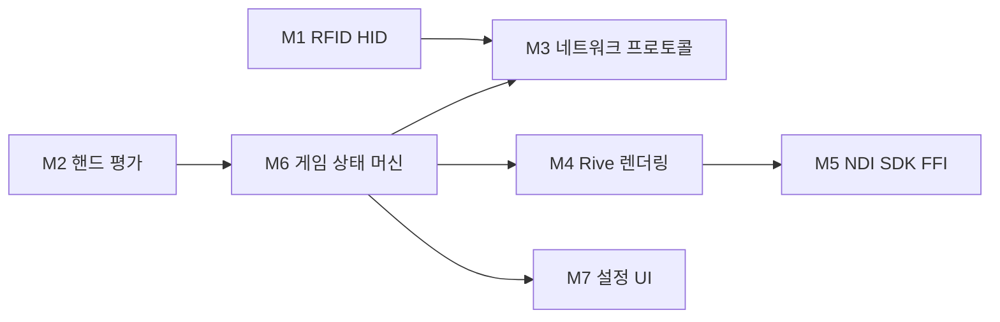

# PokerGFX Flutter 7개 마일스톤 통합 구현 계획서

> **생성일**: 2026-03-03
> **프로젝트 위치**: `C:\claude\ebs_reverse_app\pokergfx_flutter\`
> **역설계 소스**: `C:\claude\ebs_reverse_app\ebs_reverse\decompiled\`
> **분석 문서**: `C:\claude\ebs_reverse_app\ebs_reverse\analysis\`

---

## 마일스톤 우선순위 개요

```mermaid
gantt
    title PokerGFX Flutter 마일스톤 구현 순서
    dateFormat X
    axisFormat %s

    section 핵심 로직
    M2 핸드 평가 알고리즘     :m2, 0, 3
    M1 RFID HID 연결          :m1, 0, 2

    section 게임 엔진
    M6 게임 상태 머신          :m6, after m2, 4

    section 출력 파이프라인
    M4 Rive 렌더링             :m4, after m6, 3
    M5 NDI SDK FFI             :m5, after m4, 2

    section 통신
    M3 네트워크 프로토콜       :m3, after m1, 4

    section 설정
    M7 설정 UI 에디터          :m7, after m6, 2
```



| 순위 | 마일스톤 | 난이도 | 선행 의존 | 핵심 참조 파일 |
|:----:|----------|:------:|-----------|---------------|
| 1 | M2 핸드 평가 | 중 | 없음 | `hand_eval\Hand.cs`, `core.cs` |
| 2 | M1 RFID HID | 중 | 없음 | `RFIDv2\reader_module.cs` |
| 3 | M6 게임 상태 머신 | 높 | M2 | `vpt_server\GameTypes\GameType.cs` |
| 4 | M4 Rive 렌더링 | 높 | M6 | `mmr\mixer.cs`, `canvas.cs` |
| 5 | M5 NDI SDK FFI | 높 | M4 | `mmr\renderer.cs` |
| 6 | M3 네트워크 프로토콜 | 높 | M1 | `net_conn\server.cs`, `enc.cs` |
| 7 | M7 설정 UI 에디터 | 중 | M6 | `vpt_server\config\` |

---

## M2: 핸드 평가 알고리즘 (우선순위 1, 난이도 중)

### 배경

원본 C# `Hand.cs`(8,098줄)는 64비트 bitmask 기반 포커 핸드 평가 엔진이다. 핵심 알고리즘은 `Evaluate(ulong cards, int numberOfCards, bool ignore_wheel)`로, 4개 suit의 13비트 마스크를 추출하고 사전 계산된 lookup table(8,192 엔트리)로 O(1) 평가를 수행한다.

`core.cs`는 게임 타입 문자열(HOLDEM, OMAHA, RAZZ 등 17종)에 따라 적절한 evaluator로 라우팅하는 마스터 디스패처이다.

**핵심 알고리즘 요약** (분석: `hand_eval_deep_analysis.md` 섹션 1.2):
1. 64비트 카드 마스크에서 suit별 13비트 추출 (CLUB=0, DIAMOND=13, HEART=26, SPADE=39)
2. XOR 기반 중복 감지: `clubs ^ diamonds ^ hearts ^ spades`로 홀수 등장 랭크 추출
3. Lookup table: `nBitsTable[8192]`(popcount), `straightTable[8192]`(스트레이트 감지), `topFiveCardsTable[8192]`(상위 5카드), `topCardTable[8192]`(최상위 랭크)
4. HandValue는 단일 `uint`에 packed: `(handType << 20) | (topCard << 16) | (kickers)`로 직접 비교 가능

**게임 라우팅** (`core.evaluate_hand`):
- HOLDEM, PINEAPPL, 7STUD, 7STUDHL → `Hand.Evaluate`
- 6THOLDEM, 6PHOLDEM → `holdem_sixplus.eval` (trips > straight 변형 포함)
- OMAHA, COUR → `OmahaEvaluator.EvaluateHigh` (C(4,2)=6 조합)
- OMAHA5 → `Omaha5Evaluator.EvaluateHigh` (C(5,2)=10 조합)
- OMAHA6 → `Omaha6Evaluator.EvaluateHigh` (memory-mapped file 기반)
- RAZZ → `Razz.Evaluate` (low-hand, King=high)
- BADUGI, BADEUCY, BADACEY → `Badugi.Evaluate` (4카드 lowball)
- 5DRAW, 27DRAW, 27TRIPLE, A5TRIPLE → `draw.HandOdds`

### 구현 범위

**수정 파일**:
- `C:\claude\ebs_reverse_app\pokergfx_flutter\lib\features\hand_eval\data\evaluators\bitmask_evaluator.dart` — 핵심 Evaluate 알고리즘 구현
- `C:\claude\ebs_reverse_app\pokergfx_flutter\lib\features\hand_eval\domain\entities\card.dart` — bitmask 계산을 64비트로 변경
- `C:\claude\ebs_reverse_app\pokergfx_flutter\lib\features\hand_eval\domain\entities\hand_rank.dart` — royalFlush 제거 (원본에 없음), handType 값 매핑 추가
- `C:\claude\ebs_reverse_app\pokergfx_flutter\lib\features\hand_eval\domain\services\hand_evaluation_service.dart` — 게임 타입별 분기 시그니처 추가

**신규 파일**:
- `lib/features/hand_eval/data/tables/lookup_tables.dart` — 8,192 엔트리 lookup table 4종
- `lib/features/hand_eval/data/evaluators/omaha_evaluator.dart` — Omaha 4/5/6 evaluator
- `lib/features/hand_eval/data/evaluators/short_deck_evaluator.dart` — 6+ Hold'em
- `lib/features/hand_eval/data/evaluators/stud_evaluator.dart` — 7-card Stud, Razz
- `lib/features/hand_eval/data/evaluators/badugi_evaluator.dart` — Badugi evaluator
- `lib/features/hand_eval/data/evaluators/draw_evaluator.dart` — Draw 게임 evaluator
- `lib/features/hand_eval/data/evaluators/game_evaluator_router.dart` — core.cs 라우터 포팅
- `lib/features/hand_eval/data/equity/monte_carlo.dart` — Monte Carlo 승률 계산

### 포팅 전략

| C# 구조 | Dart 변환 | 비고 |
|---------|-----------|------|
| `ulong` (64비트 unsigned) | `int` (64비트 signed) | Dart의 `int`는 64비트. 비트 연산 시 음수 주의. `>>> `(unsigned shift) 사용 |
| `uint` (32비트 unsigned) | `int` | 핸드값 비교에 32비트면 충분. `& 0xFFFFFFFF` 마스킹 |
| `ushort[]` lookup table | `List<int>` | Dart에는 unsigned short 없음. `Int32List` 또는 `List<int>` |
| `static` 필드 초기화 (.cctor) | top-level `const`/`final` | lookup table은 컴파일 타임 상수로 선언 |
| `PasswordDeriveBytes` (PBKDF1) | 미사용 (M3 범위) | M2에서는 암호화 불필요 |
| Memory-mapped file (Omaha6) | `dart:io RandomAccessFile` | 20M+ 조합 테이블. 대안: 런타임 계산 |

**핵심 변환점**:
- `1UL << n` → `1 << n` (Dart에서 `<<`는 64비트 signed shift. n < 52이면 안전)
- `ulong cards` 파라미터 → `int cards` (Dart 64비트 int)
- XOR/AND/OR 비트 연산은 그대로 포팅 가능
- `0x1FFF` 마스크(13비트)는 동일하게 사용

### 구현 순서

- [ ] **T2.1** lookup table 생성 (`lookup_tables.dart`)
  - `nBitsTable[8192]`: 13비트 popcount 계산 함수로 생성
  - `straightTable[8192]`: 5개 연속 비트 패턴 감지
  - `topFiveCardsTable[8192]`: 상위 5비트 packed
  - `topCardTable[8192]`: 최상위 비트 인덱스
  - AC: 4개 테이블 모두 8,192 엔트리, 알려진 입력에 대해 올바른 값 반환
- [ ] **T2.2** Card 엔티티 bitmask를 64비트 호환으로 수정
  - `card.dart`의 `get bitmask`를 `1 << (suit.index * 13 + rank.index)`으로 유지 (이미 올바름)
  - `ParseHand(String)` 정적 메서드 추가: "Ah Kd" → 64비트 bitmask
  - AC: "Ah" → bit 38, "2c" → bit 0 매핑 정확
- [ ] **T2.3** `HandRank` enum 수정
  - `royalFlush` 제거 (원본은 straightFlush로 통합, 최고 카드=Ace로 구분)
  - handType 숫자 상수 추가 (0=highCard ~ 8=straightFlush)
  - AC: `HandRank.values.length == 9`
- [ ] **T2.4** 핵심 `Evaluate(int cards, int numberOfCards)` 구현
  - `bitmask_evaluator.dart`에 정적 메서드로 구현
  - suit 분리 → flush 감지 → straight 감지 → 중복 수 분기 (case 0/1/2/default)
  - AC: 알려진 핸드 조합 20+개에 대해 정확한 handType + kicker 반환
- [ ] **T2.5** Omaha evaluator 구현
  - OmahaEvaluator: pocket 4장에서 C(4,2)=6 조합 × board C(5,3)=10 조합 반복
  - Omaha5: C(5,2)=10 조합
  - Omaha6: C(6,2)=15 조합 (인메모리 계산, memory-mapped file 생략)
  - AC: Omaha 핸드에서 정확히 pocket 2장 + board 3장 규칙 강제
- [ ] **T2.6** Short Deck evaluator 구현 (`short_deck_evaluator.dart`)
  - 36장 덱 (2-5 제거), dead cards 상수: `8247343964175`
  - 6THOLDEM: trips > straight 재랭킹
  - 6PHOLDEM: 표준 랭킹
  - AC: A-6-7-8-9 wheel 패턴(bitmask 4336) 인식
- [ ] **T2.7** Stud/Razz evaluator 구현
  - SevenCards: 7장에서 최적 5장 선택 (C(7,5)=21 조합)
  - Razz: low-hand 평가 (Ace=low, King=high)
  - AC: Razz에서 A-2-3-4-5 = 최강 핸드
- [ ] **T2.8** Badugi evaluator 구현
  - 4카드, 고유 suit + 고유 rank 조건
  - 강도 인코딩: 4-card badugi < 3-card < 2-card < 1-card
  - AC: 고유 4 suit + 고유 4 rank = 4-card badugi
- [ ] **T2.9** Draw evaluator 구현
  - 5-card draw: `Hand.Evaluate` 직접 사용
  - 2-7 lowball: 역전 평가 (high = bad)
  - AC: 2-7 draw에서 7-5-4-3-2 = 최강
- [ ] **T2.10** Game evaluator router 구현 (`game_evaluator_router.dart`)
  - `core.evaluate_hand` 포팅: GameType enum → evaluator 매핑
  - AC: 17개 게임 타입 모두 올바른 evaluator로 라우팅
- [ ] **T2.11** Monte Carlo 승률 계산 구현
  - `MC_NUM` 임계값 기반 전수 조사 / Monte Carlo 전환
  - Hold'em: MC_NUM=100,000, Omaha: MC_NUM=10,000
  - AC: 2인 Hold'em AA vs KK preflop 승률 ~81% 근사 (오차 2% 이내)

### 테스트 전략

- **단위 테스트** (`test/features/hand_eval/`):
  - lookup table 값 검증 (알려진 입력 50+개)
  - ParseHand 문자열 파싱 테스트
  - 각 핸드 타입별 Evaluate 테스트 (최소 3개/타입 × 9타입 = 27개)
  - 게임 타입별 라우팅 테스트
  - 경계 케이스: 빈 핸드, 7장 초과, 0장
- **시뮬레이션**: simulated_hand_eval_service.dart는 테스트 fixture로 활용. 실제 evaluator와 비교 검증
- **성능 테스트**: 100,000회 Evaluate 호출 < 1초 목표

### 위험 요소

| 위험 | 심각도 | 완화 전략 |
|------|:------:|----------|
| Dart `int`의 signed shift가 C# `ulong` unsigned shift와 다른 결과 | 높 | `>>>` (unsigned right shift, Dart 2.14+) 사용. 모든 비트 연산에 마스킹 적용 |
| Omaha6 C(52,6)=20M 조합 인메모리 계산 시 메모리/시간 초과 | 중 | Phase 1에서 Omaha6는 런타임 계산으로 구현, 성능 이슈 시 memory-mapped file 추가 |
| lookup table 값이 원본과 불일치 | 중 | C# 원본의 .cctor에서 테이블 값 추출 스크립트 작성하여 교차 검증 |
| `royalFlush` 제거 시 기존 코드 의존성 파손 | 낮 | presentation 레이어에서 참조하는 곳 확인 후 수정 |

### 영향 파일 목록

| 경로 | 변경 유형 |
|------|----------|
| `lib/features/hand_eval/data/evaluators/bitmask_evaluator.dart` | 수정 (전면 재작성) |
| `lib/features/hand_eval/domain/entities/card.dart` | 수정 (ParseHand 추가) |
| `lib/features/hand_eval/domain/entities/hand_rank.dart` | 수정 (royalFlush 제거) |
| `lib/features/hand_eval/domain/services/hand_evaluation_service.dart` | 수정 (시그니처 확장) |
| `lib/features/hand_eval/data/tables/lookup_tables.dart` | 신규 |
| `lib/features/hand_eval/data/evaluators/omaha_evaluator.dart` | 신규 |
| `lib/features/hand_eval/data/evaluators/short_deck_evaluator.dart` | 신규 |
| `lib/features/hand_eval/data/evaluators/stud_evaluator.dart` | 신규 |
| `lib/features/hand_eval/data/evaluators/badugi_evaluator.dart` | 신규 |
| `lib/features/hand_eval/data/evaluators/draw_evaluator.dart` | 신규 |
| `lib/features/hand_eval/data/evaluators/game_evaluator_router.dart` | 신규 |
| `lib/features/hand_eval/data/equity/monte_carlo.dart` | 신규 |

---

## M1: RFID HID 연결 (우선순위 2, 난이도 중)

### 배경

원본 `RFIDv2.dll`(26파일)은 USB HID와 TCP/WiFi 듀얼 트랜스포트로 RFID 리더를 제어한다. 하드웨어 사양:
- VID: `0xAFEF`, PID: `0x0F01` (SkyeTek), `0x0F02` (V2 TLS)
- 16개 안테나 폴링 (~15Hz)
- USB HID 통신: `hid_open`, `hid_read`, `hid_write`, `hid_close`, `hid_set_nonblocking`, `hid_init`, `hid_exit`
- TCP/WiFi 트랜스포트: IP 기반 연결 (192.168.0.46 기본)
- V2 모듈은 BearSSL TLS 1.2 래핑 (별도 `boarssl.dll`)

검증 완료 Python 구현: `scripts/v2_tls_raw.py` (카드 폴링, TLS 핸드셰이크, 안테나 스캔 모두 동작 확인)

### 구현 범위

**수정 파일**:
- `C:\claude\ebs_reverse_app\pokergfx_flutter\lib\features\rfid\data\ffi\hidapi_bindings.dart` — 주석 해제 + 바인딩 활성화
- `C:\claude\ebs_reverse_app\pokergfx_flutter\lib\features\rfid\data\ffi\hidapi_rfid_service.dart` — 실제 HID 통신 구현
- `C:\claude\ebs_reverse_app\pokergfx_flutter\lib\features\rfid\data\tcp\tcp_rfid_service.dart` — TCP/WiFi 모드 구현
- `C:\claude\ebs_reverse_app\pokergfx_flutter\lib\features\rfid\domain\services\rfid_service.dart` — 안테나 폴링 메서드 추가

**신규 파일**:
- `lib/features/rfid/data/ffi/hidapi_loader.dart` — 플랫폼별 DynamicLibrary 로딩
- `lib/features/rfid/data/protocol/rfid_command.dart` — RFID 리더 명령어 프레이밍
- `lib/features/rfid/data/protocol/antenna_poller.dart` — 16채널 안테나 폴링 루프
- `lib/features/rfid/data/protocol/card_parser.dart` — RFID 태그 → Card 매핑

### 포팅 전략

| C# 구조 | Dart 변환 | 비고 |
|---------|-----------|------|
| `[DllImport("hidapi")]` | `DynamicLibrary.open()` + `lookupFunction` | Windows: `hidapi.dll`, Linux: `libhidapi-hidraw.so`, macOS: `libhidapi.dylib` |
| `byte[]` HID 버퍼 | `Pointer<Uint8>` + `calloc` | `dart:ffi` 메모리 관리 필수. `calloc.allocate` → `calloc.free` |
| `BackgroundWorker` 폴링 | `Isolate` 또는 `Timer.periodic` | HID read는 블로킹이므로 별도 Isolate 권장 |
| BearSSL TLS | `dart:io SecureSocket` | Dart 내장 TLS로 대체. 커스텀 인증서 검증 비활성화 옵션 |
| `Thread.Sleep(66)` (~15Hz) | `Future.delayed(Duration(milliseconds: 66))` | 폴링 주기 유지 |

### 구현 순서

- [ ] **T1.1** 플랫폼별 hidapi 로더 구현 (`hidapi_loader.dart`)
  - Windows/Linux/macOS 분기 DynamicLibrary 로딩
  - AC: 3개 플랫폼에서 라이브러리 로드 성공 (또는 명확한 에러 메시지)
- [ ] **T1.2** HidapiBindings 활성화
  - 주석 해제 + `_lib` 초기화
  - `hid_enumerate` 추가 (디바이스 검색용)
  - AC: `hidInit()` → 0 반환, `hidOpen(0xAFEF, 0x0F02, nullptr)` → 유효 포인터
- [ ] **T1.3** RFID 명령 프레이밍 구현 (`rfid_command.dart`)
  - Python `v2_tls_raw.py`의 프레이밍 로직 포팅
  - 명령 바이트 구조: `[length_hi, length_lo, command_id, ...payload]`
  - AC: 알려진 명령 바이트가 Python 구현과 동일 출력
- [ ] **T1.4** 안테나 폴러 구현 (`antenna_poller.dart`)
  - 16개 안테나 순차 폴링, ~15Hz 유지
  - 각 안테나에서 태그 ID 읽기
  - AC: 시뮬레이션 모드에서 16개 안테나 데이터 순환 출력
- [ ] **T1.5** HidapiRfidService 실제 구현
  - `connect()`: hidInit → hidOpen → 폴링 시작
  - `disconnect()`: 폴링 중지 → hidClose → hidExit
  - `scanAll()`: 전체 안테나 1회 스캔
  - `cardStream`: 폴링 결과를 Stream으로 발행
  - AC: connect/disconnect 사이클에서 리소스 누수 없음
- [ ] **T1.6** TCP RFID 서비스 구현
  - `tcp_rfid_service.dart`: Socket 연결 + TLS 래핑
  - AC: WiFi 모드에서 카드 폴링 동작
- [ ] **T1.7** 카드 파서 구현 (`card_parser.dart`)
  - RFID 태그 ID → Card(Suit, Rank) 매핑 테이블
  - AC: 52장 카드 + Joker 매핑 완전

### 테스트 전략

- **단위 테스트**: 명령 프레이밍, 카드 파싱, 안테나 폴링 로직 (하드웨어 불필요)
- **시뮬레이션**: `simulated_rfid_service.dart` 기존 활용 + 16안테나 시뮬레이션 확장
- **통합 테스트**: 실제 RFID V2 하드웨어 연결 시 수동 검증 (자동화 불가)
- **참조 검증**: Python `v2_tls_raw.py --poll` 출력과 Dart 출력 비교

### 위험 요소

| 위험 | 심각도 | 완화 전략 |
|------|:------:|----------|
| `hidapi.dll` 배포 시 DLL 경로 문제 | 중 | Flutter 앱 번들에 포함하거나 시스템 PATH에서 검색. `DynamicLibrary.open` 실패 시 명확한 에러 메시지 |
| HID read 블로킹이 UI 스레드 차단 | 높 | 별도 `Isolate`에서 폴링 수행. main isolate와 `SendPort`/`ReceivePort`로 통신 |
| TLS 인증서 검증 비활성화 보안 이슈 | 중 | 원본도 `InsecureCertValidator` 사용 (always true). 개발 단계에서는 동일하게 적용, 향후 인증서 핀닝 추가 |
| RFID 태그 매핑 테이블 정확도 | 낮 | `card_mapping_repository_impl.dart` 기존 매핑 데이터 활용. Python 스크립트로 실측 검증 |

### 영향 파일 목록

| 경로 | 변경 유형 |
|------|----------|
| `lib/features/rfid/data/ffi/hidapi_bindings.dart` | 수정 (주석 해제 + 확장) |
| `lib/features/rfid/data/ffi/hidapi_rfid_service.dart` | 수정 (전면 구현) |
| `lib/features/rfid/data/tcp/tcp_rfid_service.dart` | 수정 (TCP 구현) |
| `lib/features/rfid/domain/services/rfid_service.dart` | 수정 (메서드 추가) |
| `lib/features/rfid/data/ffi/hidapi_loader.dart` | 신규 |
| `lib/features/rfid/data/protocol/rfid_command.dart` | 신규 |
| `lib/features/rfid/data/protocol/antenna_poller.dart` | 신규 |
| `lib/features/rfid/data/protocol/card_parser.dart` | 신규 |

---

## M6: 게임 상태 머신 (우선순위 3, 난이도 높)

### 배경

원본 `vpt_server.exe`의 `GameTypes\GameType.cs`(271 메서드)는 22개 포커 변형의 상태 머신을 관리한다. `game_variant_info.cs`에 각 변형의 메타데이터(시작 카드 수, 최대 카드 수, 스플릿 팟 여부, 드로우 수 등)가 정의되어 있다.

핵심 상태 전이: `waiting → preflop → flop → turn → river → showdown → finished`
(7-card Stud: `waiting → 3rd_street → 4th → 5th → 6th → 7th → showdown → finished`)

`GameInfoResponse`(75+ 필드)가 테이블 전체 상태를 나타내는 가장 큰 프로토콜 메시지이다. 블라인드 구조, 좌석 위치, 베팅 정보, 게임 타입, 보드 카드, 디스플레이 제어 등을 포함한다.

`PlayerInfoResponse`(20 필드): 좌석 번호, 이름, 칩 스택, 상태(HasCards/Folded/AllIn/SitOut), 통계(VPIP/PFR/AGR/WTSD/CumWin).

### 구현 범위

**수정 파일**:
- `C:\claude\ebs_reverse_app\pokergfx_flutter\lib\features\game\data\state_machine\game_state_machine.dart` — 전면 재작성
- `C:\claude\ebs_reverse_app\pokergfx_flutter\lib\features\game\domain\entities\game_type.dart` — GameType enum 확장, 게임별 메타데이터 추가
- `C:\claude\ebs_reverse_app\pokergfx_flutter\lib\features\game\domain\entities\game_state.dart` — 필드 대폭 확장 (GameInfoResponse 75+ 필드 반영)
- `C:\claude\ebs_reverse_app\pokergfx_flutter\lib\features\game\domain\entities\player.dart` — 통계 필드 추가 (VPIP/PFR/AGR/WTSD/CumWin)
- `C:\claude\ebs_reverse_app\pokergfx_flutter\lib\features\game\domain\entities\pot.dart` — 사이드팟 로직 추가
- `C:\claude\ebs_reverse_app\pokergfx_flutter\lib\features\game\domain\entities\round.dart` — 베팅 라운드 상세화

**신규 파일**:
- `lib/features/game/data/state_machine/game_variant_config.dart` — game_variant_info 포팅
- `lib/features/game/data/state_machine/betting_engine.dart` — 베팅 로직 (min raise, cap, pot limit)
- `lib/features/game/data/state_machine/pot_calculator.dart` — 메인팟/사이드팟 계산
- `lib/features/game/data/state_machine/action_validator.dart` — 플레이어 액션 유효성 검증
- `lib/features/game/data/state_machine/showdown_resolver.dart` — 쇼다운 결과 계산 (M2 의존)
- `lib/features/game/data/state_machine/stud_state_machine.dart` — Stud 계열 별도 상태 머신

### 포팅 전략

| C# 구조 | Dart 변환 | 비고 |
|---------|-----------|------|
| `GameType.cs` (3세대 상속 계층) | Strategy 패턴 | 원본의 복잡한 상속 대신 composition으로 단순화 |
| `game_variant_info` 정적 리스트 | `GameVariantConfig` immutable 객체 | Freezed로 생성 |
| `List<player>` mutable 상태 | `List<Player>` immutable (copyWith) | Freezed 활용 |
| WinForms 이벤트 기반 | Riverpod StateNotifier | 상태 변화 시 UI 자동 반영 |
| `Dictionary<int, int>` 팟 추적 | `Map<String, int>` (playerId → 기여액) | 불변 맵 |

### 구현 순서

- [ ] **T6.1** GameVariantConfig 구현 (`game_variant_config.dart`)
  - 22개 게임 변형 메타데이터: startCardsPerPlayer, maxCardsPerPlayer, splitPot, numDraws
  - AC: GameType.holdem → startCards=2, maxCards=7, splitPot=false
- [ ] **T6.2** GameType enum 확장
  - 원본 17개 게임 문자열(HOLDEM, OMAHA 등) 매핑 추가
  - GamePhase 확장: Stud 전용 phase (3rd_street ~ 7th_street)
  - AC: 22개 게임 타입 모두 올바른 phase 시퀀스 반환
- [ ] **T6.3** Player 엔티티 확장
  - 통계 필드 추가: vpip, pfr, agr, wtsd, cumWin
  - 상태 필드 추가: hasCards, bet, deadBet, sitOut, hasExtraCards
  - AC: PlayerInfoResponse 20개 필드와 1:1 매핑
- [ ] **T6.4** GameState 엔티티 확장
  - GameInfoResponse 75+ 필드 중 핵심 40개 반영
  - 블라인드 구조, 베팅 구조, 액션 위치, 보드 카드
  - AC: GameInfoResponse 역직렬화 → GameState 변환 가능
- [ ] **T6.5** BettingEngine 구현 (`betting_engine.dart`)
  - No-limit, Pot-limit, Fixed-limit 3개 모드
  - min raise 계산, cap 적용, all-in 처리
  - AC: NL Hold'em에서 min raise = previous raise 크기
- [ ] **T6.6** ActionValidator 구현 (`action_validator.dart`)
  - 현재 게임 상태에서 유효한 액션 목록 계산
  - fold, check, call, bet, raise, allIn 유효성 판정
  - AC: 체크 가능 상황에서 fold/check/bet만 유효, call은 불가
- [ ] **T6.7** PotCalculator 구현 (`pot_calculator.dart`)
  - 메인팟 + N개 사이드팟 계산
  - all-in 플레이어별 eligible 금액 추적
  - AC: 3인 all-in 시나리오에서 정확한 사이드팟 분배
- [ ] **T6.8** GameStateMachine 전면 재작성
  - 게임 타입별 phase transition 규칙
  - 전이 시 자동 딜링, 블라인드 포스팅
  - AC: Hold'em 풀 핸드 시뮬레이션 (waiting→finished) 성공
- [ ] **T6.9** ShowdownResolver 구현 (`showdown_resolver.dart`)
  - M2 HandEvaluationService를 호출하여 승자 결정
  - Hi-Lo 게임: high/low 각각 평가 + scoop 처리
  - AC: 3인 showdown에서 올바른 승자 + 팟 분배
- [ ] **T6.10** Stud 상태 머신 구현 (`stud_state_machine.dart`)
  - 7-card Stud 고유 phase: 3rd~7th street
  - bring-in, completion 규칙
  - AC: 7-card Stud 풀 핸드 시뮬레이션 성공

### 테스트 전략

- **단위 테스트**:
  - BettingEngine: NL/PL/FL 각 모드별 10+ 시나리오
  - PotCalculator: 단일 팟, 2-way/3-way 사이드팟, 전원 all-in
  - ActionValidator: 각 상태에서 유효/무효 액션 조합
  - ShowdownResolver: 승/패/무 + Hi-Lo scoop 시나리오
- **통합 테스트**: 풀 핸드 시뮬레이션 (딜 → 베팅 라운드들 → 쇼다운 → 팟 분배)
- **시뮬레이션**: 100핸드 자동 시뮬레이션 + 칩 합계 보존 검증

### 위험 요소

| 위험 | 심각도 | 완화 전략 |
|------|:------:|----------|
| 원본 GameType.cs 3세대 상속 구조의 복잡성 (271 메서드) | 높 | Strategy 패턴으로 단순화. 핵심 22개 변형만 구현, 나머지는 확장 포인트 제공 |
| Hi-Lo 스플릿 팟 계산 edge case (8-or-better qualifier) | 중 | Omaha Hi-Lo, Stud Hi-Lo에서 qualify 실패 시 high only 테스트 케이스 추가 |
| Stud 게임의 bring-in/completion 규칙이 Hold'em과 근본적으로 다름 | 중 | 별도 StudStateMachine으로 분리하여 Hold'em 로직 오염 방지 |
| Freezed copyWith 성능 (75+ 필드 GameState 갱신 빈도) | 낮 | 필요 시 mutable 내부 상태 + immutable 스냅샷 패턴으로 전환 |

### 영향 파일 목록

| 경로 | 변경 유형 |
|------|----------|
| `lib/features/game/data/state_machine/game_state_machine.dart` | 수정 (전면 재작성) |
| `lib/features/game/domain/entities/game_type.dart` | 수정 (확장) |
| `lib/features/game/domain/entities/game_state.dart` | 수정 (필드 확장) |
| `lib/features/game/domain/entities/player.dart` | 수정 (통계 추가) |
| `lib/features/game/domain/entities/pot.dart` | 수정 (사이드팟) |
| `lib/features/game/domain/entities/round.dart` | 수정 (상세화) |
| `lib/features/game/data/state_machine/game_variant_config.dart` | 신규 |
| `lib/features/game/data/state_machine/betting_engine.dart` | 신규 |
| `lib/features/game/data/state_machine/pot_calculator.dart` | 신규 |
| `lib/features/game/data/state_machine/action_validator.dart` | 신규 |
| `lib/features/game/data/state_machine/showdown_resolver.dart` | 신규 |
| `lib/features/game/data/state_machine/stud_state_machine.dart` | 신규 |

---

## M4: Rive 렌더링 (우선순위 4, 난이도 높)

### 배경

원본 `mmr.dll`(80파일, ~12,000줄)은 DirectX 11 GPU 기반 실시간 비디오 합성 엔진이다. Flutter 포팅에서는 DirectX 대신 **Rive SDK**로 State Machine 기반 애니메이션 렌더링을 수행한다.

원본 핵심 구조:
- `mixer`: 5-thread 파이프라인 (live/audio/delayed/write/delay_process)
- `canvas`: DirectX 11 GPU 렌더링 표면 (image/text/pip/border 4개 레이어)
- `bridge`: 크로스 GPU 컨텍스트 텍스처 공유
- Dual Canvas System: Live + Delayed (N초 지연) 동시 출력

Flutter 대체 전략:
- DirectX → Rive SDK State Machine (벡터 애니메이션)
- 5-thread 파이프라인 → Flutter 렌더링 파이프라인 + `dart:ui` Canvas
- Dual Canvas → Rive Artboard 2개 인스턴스

### 구현 범위

**수정 파일**:
- `C:\claude\ebs_reverse_app\pokergfx_flutter\lib\features\renderer\data\rive\rive_renderer_impl.dart` — 전면 구현
- `C:\claude\ebs_reverse_app\pokergfx_flutter\lib\features\renderer\data\rive\rive_state_controller.dart` — State Machine 제어
- `C:\claude\ebs_reverse_app\pokergfx_flutter\lib\features\renderer\data\skin\skin_loader.dart` — 스킨 로딩 구현
- `C:\claude\ebs_reverse_app\pokergfx_flutter\lib\features\renderer\domain\services\renderer_service.dart` — 인터페이스 확장

**신규 파일**:
- `lib/features/renderer/data/rive/game_state_mapper.dart` — GameState → Rive Input 매핑
- `lib/features/renderer/data/rive/layer_compositor.dart` — 레이어 합성 (image/text/pip)
- `lib/features/renderer/data/capture/frame_capturer.dart` — 프레임 캡처 (pixel buffer)
- `lib/features/renderer/presentation/widgets/poker_table_widget.dart` — Rive 위젯 래퍼

### 포팅 전략

| C# 구조 | Dart/Rive 변환 | 비고 |
|---------|---------------|------|
| DirectX 11 `canvas` | `RiveAnimation` + `Artboard` | `rive: ^0.13.x` 패키지 |
| `image_element` GPU Effects | Rive State Machine Inputs | Opacity, Tint, Position은 Rive input으로 제어 |
| `text_element` DirectWrite | Rive Text Run | Rive 2024+ Text 지원. 동적 텍스트 업데이트 |
| 5-thread pipeline | `SchedulerBinding` + `CustomPainter` | Flutter 렌더링은 단일 스레드 + GPU 가속 |
| `MFFrame` 프레임 객체 | `dart:ui Image` | `captureFrame` → `toByteData` |
| `bridge` 텍스처 공유 | Rive Artboard 직접 참조 | Flutter에서는 GPU 컨텍스트 분리 불필요 |

### 구현 순서

- [ ] **T4.1** Rive SDK 통합 + Artboard 로딩
  - `rive` 패키지 추가, .riv 파일 로딩 파이프라인
  - `skin_loader.dart`: 스킨 디렉토리에서 .riv 파일 검색 + 로드
  - AC: 샘플 .riv 파일 로드 → Artboard 인스턴스 생성 성공
- [ ] **T4.2** GameStateMapper 구현 (`game_state_mapper.dart`)
  - GameState 필드 → Rive State Machine Input 매핑 정의
  - 플레이어 이름, 칩, 카드, 팟, 보드 카드 등
  - AC: GameState 변경 시 Rive input 자동 업데이트
- [ ] **T4.3** RiveStateController 구현
  - State Machine 인스턴스 관리
  - Input 값 변경 (SMINumber, SMIBool, SMITrigger)
  - AC: boolean input 토글 → 애니메이션 전이 발생
- [ ] **T4.4** RiveRendererImpl 구현
  - `initialize(Skin)`: .riv 로드 → Artboard + StateMachine 초기화
  - `renderGameState(GameState)`: GameStateMapper로 input 업데이트
  - `setSkin(Skin)`: Artboard 교체
  - AC: GameState 변경 → 렌더링 반영 (시각적 확인)
- [ ] **T4.5** 프레임 캡처 구현 (`frame_capturer.dart`)
  - Rive Artboard → `dart:ui Picture` → `Image` → `ByteData`
  - RGBA 8888 포맷, 1920x1080 기본 해상도
  - AC: captureFrame() → 유효한 RGBA 바이트 배열 (크기 = w*h*4)
- [ ] **T4.6** 레이어 합성기 구현 (`layer_compositor.dart`)
  - 원본 canvas의 4개 레이어 순서 재현: image → text → pip → border
  - Z-order 기반 렌더링
  - AC: 다중 레이어 겹침 시 올바른 Z-order 적용
- [ ] **T4.7** PokerTableWidget 구현
  - Flutter Widget으로 Rive 렌더링 래핑
  - Riverpod Provider로 GameState 구독
  - AC: 위젯 트리에 삽입 시 애니메이션 렌더링 표시

### 테스트 전략

- **Widget 테스트**: PokerTableWidget 렌더링 검증 (golden 테스트)
- **통합 테스트**: GameState 변경 → Rive input 업데이트 → 시각적 변화 검증
- **프레임 캡처 테스트**: captureFrame → PNG 저장 → 비어있지 않은 이미지 확인
- **성능 테스트**: 60fps 유지 여부 (Flutter DevTools performance overlay)

### 위험 요소

| 위험 | 심각도 | 완화 전략 |
|------|:------:|----------|
| .riv 파일이 존재하지 않음 (디자인 에셋 미준비) | 높 | 플레이스홀더 .riv 파일 생성 (Rive Editor). 최소한 빈 artboard + 기본 input으로 테스트 가능하게 |
| Rive Text Run API 제한 (동적 텍스트 길이, 폰트) | 중 | Rive Text 대신 Flutter `CustomPainter` + `TextPainter` 오버레이 fallback 준비 |
| 프레임 캡처 성능 (GPU → CPU 데이터 전송 병목) | 중 | 캡처를 별도 Isolate에서 수행하거나 주기적 캡처 (매 프레임 X, N프레임마다 1회) |
| Rive State Machine input 개수 제한 | 낮 | GameInfoResponse 75+ 필드 중 렌더링에 필요한 필드만 선별 매핑 (20~30개) |

### 영향 파일 목록

| 경로 | 변경 유형 |
|------|----------|
| `lib/features/renderer/data/rive/rive_renderer_impl.dart` | 수정 (전면 구현) |
| `lib/features/renderer/data/rive/rive_state_controller.dart` | 수정 (전면 구현) |
| `lib/features/renderer/data/skin/skin_loader.dart` | 수정 (구현) |
| `lib/features/renderer/domain/services/renderer_service.dart` | 수정 (인터페이스 확장) |
| `lib/features/renderer/data/rive/game_state_mapper.dart` | 신규 |
| `lib/features/renderer/data/rive/layer_compositor.dart` | 신규 |
| `lib/features/renderer/data/capture/frame_capturer.dart` | 신규 |
| `lib/features/renderer/presentation/widgets/poker_table_widget.dart` | 신규 |

---

## M5: NDI SDK FFI (우선순위 5, 난이도 높)

### 배경

원본 `mmr.dll`의 `renderer` 클래스에서 NDI 프로토콜 출력을 지원한다. NDI(Network Device Interface)는 IP 네트워크를 통한 저지연 비디오 전송 프로토콜이다.

원본에서 NDI 관련 코드:
- `renderer._is_ndi`: NDI 출력 모드 플래그
- Medialooks MFormats SDK를 통한 NDI 전송 (MFRendererClass)
- NDI SDK 5.x 네이티브 라이브러리 (`Processing.NDI.Lib.x64.dll`)

Flutter 포팅에서는 `dart:ffi`로 NDI SDK C API를 직접 바인딩한다.

핵심 NDI C API:
- `NDIlib_initialize()`: SDK 초기화
- `NDIlib_send_create_v2(NDIlib_send_create_t*)`: 송신 인스턴스 생성
- `NDIlib_send_send_video_v2(NDIlib_send_instance_t, NDIlib_video_frame_v2_t*)`: 비디오 프레임 전송
- `NDIlib_send_destroy(NDIlib_send_instance_t)`: 송신 인스턴스 해제

### 구현 범위

**수정 파일**:
- `C:\claude\ebs_reverse_app\pokergfx_flutter\lib\features\broadcast\data\ffi\ndi_bindings.dart` — 주석 해제 + 전체 API 바인딩
- `C:\claude\ebs_reverse_app\pokergfx_flutter\lib\features\broadcast\data\ffi\ndi_service_impl.dart` — 실제 NDI 전송 구현
- `C:\claude\ebs_reverse_app\pokergfx_flutter\lib\features\broadcast\domain\services\ndi_service.dart` — 인터페이스 확장

**신규 파일**:
- `lib/features/broadcast/data/ffi/ndi_loader.dart` — 플랫폼별 NDI SDK 로딩
- `lib/features/broadcast/data/ffi/ndi_structs.dart` — NDI C 구조체 Dart FFI 매핑
- `lib/features/broadcast/data/ffi/ndi_frame_converter.dart` — Dart Image → NDI 프레임 변환
- `lib/features/broadcast/data/pipeline/broadcast_pipeline.dart` — M4 캡처 → NDI 전송 파이프라인

### 포팅 전략

| C# 구조 | Dart 변환 | 비고 |
|---------|-----------|------|
| MFormats NDI interop | `dart:ffi` 직접 바인딩 | NDI SDK C API 사용 |
| `MFRendererClass.ReceiverFramePut` | `NDIlib_send_send_video_v2` | 직접 프레임 전송 |
| `BlockingCollection<MFFrame>` 큐 | `StreamController<Uint8List>` | 프레임 큐 |
| 30+ 프레임 드롭 방지 | `StreamTransformer` back-pressure | 큐 초과 시 오래된 프레임 폐기 |

**NDI Video Frame 구조체 (C):**
```c
typedef struct {
    int xres, yres;                    // 해상도
    NDIlib_FourCC_video_type_e FourCC; // RGBA, BGRA, UYVY 등
    int frame_rate_N, frame_rate_D;    // 프레임 레이트 (59940/1000 = 59.94fps)
    float picture_aspect_ratio;        // 16:9
    NDIlib_frame_format_type_e format; // progressive/interlaced
    int64_t timecode;
    uint8_t* p_data;                   // 픽셀 데이터 포인터
    int line_stride_in_bytes;
} NDIlib_video_frame_v2_t;
```

### 구현 순서

- [ ] **T5.1** NDI SDK 로더 구현 (`ndi_loader.dart`)
  - Windows: `Processing.NDI.Lib.x64.dll`
  - Linux: `libndi.so.5`
  - macOS: `libndi.dylib`
  - AC: DynamicLibrary.open 성공 또는 명확한 에러
- [ ] **T5.2** NDI 구조체 FFI 매핑 (`ndi_structs.dart`)
  - `NDIlib_send_create_t`: ndi_name, groups, clock_video, clock_audio
  - `NDIlib_video_frame_v2_t`: xres, yres, FourCC, frame_rate, p_data, line_stride
  - AC: 구조체 크기가 C 헤더 정의와 일치
- [ ] **T5.3** NdiBindings 전체 API 바인딩
  - 주석 해제 + 추가 함수: `NDIlib_find_create_v2`, `NDIlib_find_get_current_sources`, `NDIlib_recv_create_v3`
  - AC: `initialize()` 호출 → true 반환
- [ ] **T5.4** NDI 프레임 변환기 구현 (`ndi_frame_converter.dart`)
  - M4의 `captureFrame()` 출력 (RGBA Uint8List) → NDI 프레임 구조체
  - 해상도: 1920x1080 기본, 3840x2160 옵션
  - 프레임 레이트: 59.94fps (59940/1000)
  - AC: RGBA 바이트 배열 → 유효한 NDI 프레임 구조체 생성
- [ ] **T5.5** NdiServiceImpl 전송 구현
  - `startBroadcast(String name)`: initialize → sendCreate
  - `sendFrame(Uint8List rgba)`: 프레임 변환 → sendVideoV2
  - `stopBroadcast()`: sendDestroy
  - AC: NDI Studio Monitor에서 수신 확인
- [ ] **T5.6** 브로드캐스트 파이프라인 구현 (`broadcast_pipeline.dart`)
  - M4 FrameCapturer → NDI 전송 연결
  - 프레임 드롭 정책: 큐 > 3이면 오래된 프레임 폐기
  - AC: 연속 프레임 전송 시 메모리 누수 없음

### 테스트 전략

- **단위 테스트**: 구조체 크기 검증, 프레임 변환 로직, 백프레셔 로직
- **통합 테스트**: NDI SDK 초기화 → 송신 인스턴스 생성 → 테스트 프레임 전송 (NDI SDK 설치 필요)
- **시뮬레이션**: `simulated_ndi_service.dart` 기존 활용 (SDK 미설치 환경)
- **수동 검증**: NDI Studio Monitor 또는 OBS NDI 플러그인으로 수신 확인

### 위험 요소

| 위험 | 심각도 | 완화 전략 |
|------|:------:|----------|
| NDI SDK 라이선스 제한 (상용 배포 시) | 높 | NewTek/Vizrt NDI SDK 라이선스 조건 확인. 개발/테스트는 무료 SDK로 진행 |
| `p_data` 네이티브 메모리 관리 (매 프레임 alloc/free) | 높 | 고정 크기 버퍼 2개로 더블 버퍼링. `calloc`으로 한 번 할당, 재사용 |
| 59.94fps 유지 시 CPU/GPU 부하 | 중 | 프레임 캡처를 30fps로 제한하는 옵션 제공. NDI 자체 클럭 동기화 활용 |
| FFI 구조체 패딩/정렬 차이 | 중 | `@Packed(1)` 또는 수동 오프셋 계산. NDI SDK 헤더와 교차 검증 |

### 영향 파일 목록

| 경로 | 변경 유형 |
|------|----------|
| `lib/features/broadcast/data/ffi/ndi_bindings.dart` | 수정 (전면 확장) |
| `lib/features/broadcast/data/ffi/ndi_service_impl.dart` | 수정 (전면 구현) |
| `lib/features/broadcast/domain/services/ndi_service.dart` | 수정 (인터페이스 확장) |
| `lib/features/broadcast/data/ffi/ndi_loader.dart` | 신규 |
| `lib/features/broadcast/data/ffi/ndi_structs.dart` | 신규 |
| `lib/features/broadcast/data/ffi/ndi_frame_converter.dart` | 신규 |
| `lib/features/broadcast/data/pipeline/broadcast_pipeline.dart` | 신규 |

---

## M3: 네트워크 프로토콜 (우선순위 6, 난이도 높)

### 배경

원본 `net_conn.dll`(168파일)은 PokerGFX 시스템의 모든 네트워크 통신을 담당한다. 분석 문서: `net_conn_deep_analysis.md`(733줄).

**프로토콜 아키텍처**:
- UDP Discovery (포트 9000): LAN 서버 자동 검색
- TCP 통신 (포트 9001): 지속 연결, AES-256-CBC 암호화
- Wire format: `[AES-256 Encrypted JSON (Base64)] [SOH (0x01)]`
- 113+ 프로토콜 명령어 (Request/Response 쌍)
- Keepalive: 클라이언트 3초 → 서버 10초 타임아웃

**암호화 체계** (`enc.cs`):
- AES-256-CBC, Rijndael
- Password: `"45389rgjkonlgfds90439r043rtjfewp9042390j4f"` (하드코딩)
- Salt: `"dsafgfdagtds4389tytgh"` (PBKDF1)
- IV: `"4390fjrfvfji9043"` (고정 16바이트)
- 키 유도: `PasswordDeriveBytes(pwd, salt).GetBytes(32)` (PBKDF1, SHA1, 100 iterations)

**메시지 처리 파이프라인**:
1. TCP 수신 → SOH(0x01) 구분자로 메시지 분리
2. Base64 디코딩 → AES-256-CBC 복호화
3. JSON 역직렬화 → `Command` 필드로 타입 라우팅
4. `RemoteRegistry` Singleton: 명령 문자열 → .NET Type 매핑

### 구현 범위

**수정 파일**:
- `C:\claude\ebs_reverse_app\pokergfx_flutter\lib\features\network\data\codec\message_encoder.dart` — AES 암호화 + SOH 프레이밍
- `C:\claude\ebs_reverse_app\pokergfx_flutter\lib\features\network\data\codec\message_decoder.dart` — AES 복호화 + SOH 파싱
- `C:\claude\ebs_reverse_app\pokergfx_flutter\lib\features\network\domain\entities\command_type.dart` — 113+ 명령 타입 확장
- `C:\claude\ebs_reverse_app\pokergfx_flutter\lib\features\network\domain\entities\protocol_message.dart` — 필드 확장
- `C:\claude\ebs_reverse_app\pokergfx_flutter\lib\features\network\domain\services\discovery_service.dart` — UDP 구현
- `C:\claude\ebs_reverse_app\pokergfx_flutter\lib\features\network\domain\services\connection_service.dart` — TCP 구현
- `C:\claude\ebs_reverse_app\pokergfx_flutter\lib\features\network\domain\repositories\remote_registry.dart` — 명령 레지스트리 구현

**신규 파일**:
- `lib/features/network/data/crypto/aes_cipher.dart` — AES-256-CBC 암복호화
- `lib/features/network/data/crypto/key_derivation.dart` — PBKDF1 키 유도
- `lib/features/network/data/transport/udp_discovery.dart` — UDP 브로드캐스트 Discovery
- `lib/features/network/data/transport/tcp_client.dart` — TCP 클라이언트 (keepalive 포함)
- `lib/features/network/data/transport/message_framer.dart` — SOH 기반 메시지 프레이밍
- `lib/features/network/data/models/` — 113+ Request/Response 모델 (하위 파일 다수)
- `lib/features/network/data/models/game_info_response.dart` — 75+ 필드
- `lib/features/network/data/models/player_info_response.dart` — 20 필드
- `lib/features/network/data/models/auth_models.dart` — AUTH 인증
- `lib/features/network/data/models/connection_models.dart` — CONNECT/DISCONNECT/KEEPALIVE

### 포팅 전략

| C# 구조 | Dart 변환 | 비고 |
|---------|-----------|------|
| `RijndaelManaged` AES-256-CBC | `pointycastle` 패키지 | `AESEngine` + `CBCBlockCipher` + `PKCS7Padding` |
| `PasswordDeriveBytes` (PBKDF1) | 수동 구현 | Dart에 PBKDF1 내장 없음. SHA1 기반 100 iterations 직접 구현 |
| `Convert.ToBase64String/FromBase64String` | `dart:convert` base64 | 동일 |
| `StringBuilder` SOH 누적 | `StringBuffer` | `0x01` 구분자 동일 처리 |
| `System.Net.Sockets.Socket` | `dart:io Socket` | TCP: `Socket.connect`, UDP: `RawDatagramSocket` |
| `Newtonsoft.Json` | `dart:convert jsonDecode/jsonEncode` | 동일 JSON 포맷 |
| `RemoteRegistry` Reflection | 수동 `Map<String, Function>` 등록 | Dart에 런타임 Reflection 제한적. 수동 매핑 |
| `BackgroundWorker` 비동기 | `dart:async` Stream | 네이티브 async 지원 |

### 구현 순서

- [ ] **T3.1** PBKDF1 키 유도 구현 (`key_derivation.dart`)
  - SHA1 기반, 100 iterations, 32바이트 키 출력
  - Password/Salt/IV 상수 하드코딩 (원본과 동일)
  - AC: Python `scripts/v2_tls_raw.py`의 키 유도 결과와 동일한 32바이트 키 생성
- [ ] **T3.2** AES-256-CBC 암복호화 구현 (`aes_cipher.dart`)
  - 암호화: PKCS7 패딩 → AES-CBC → Base64 인코딩
  - 복호화: Base64 디코딩 → AES-CBC → NULL 종료자 제거
  - AC: Python `enc.py` 암호화 결과를 Dart에서 복호화 가능 (양방향)
- [ ] **T3.3** SOH 메시지 프레이머 구현 (`message_framer.dart`)
  - 수신: TCP 바이트 스트림 → SOH(0x01) 기준 분리 → 완성된 메시지 발행
  - 송신: JSON → AES 암호화 → Base64 + SOH 추가
  - AC: `"encrypted_base64_string\x01"` → 올바른 메시지 추출
- [ ] **T3.4** CommandType enum 확장
  - 113+ 명령 타입 추가 (6.1~6.10 섹션의 모든 명령)
  - 핵심: CONNECT, AUTH, GAME_STATE, GAME_INFO, PLAYER_INFO, PLAYER_CARDS, BOARD_CARD, KEEPALIVE
  - AC: 모든 알려진 명령 문자열에 대해 `CommandType.values.byName` 성공
- [ ] **T3.5** UDP Discovery 구현 (`udp_discovery.dart`)
  - 포트 9000으로 브로드캐스트
  - 응답 수신 → 서버 목록 관리
  - `_promiscuous` 모드: 발견 즉시 자동 TCP 연결
  - AC: LAN에서 vpt_server 발견 시 IP:Port 반환
- [ ] **T3.6** TCP 클라이언트 구현 (`tcp_client.dart`)
  - `Socket.connect(host, 9001)` → 지속 연결
  - 3초 keepalive 타이머
  - 자동 재연결 (`_persist` 모드)
  - AC: TCP 연결 → ConnectResponse 수신 → IdtxResponse 수신
- [ ] **T3.7** MessageEncoder/Decoder 재작성
  - JSON 직렬화 + AES 암호화 + SOH 프레이밍 통합
  - 역직렬화: SOH 분리 → AES 복호화 → JSON → Command 기반 타입 라우팅
  - AC: 원본 서버와 양방향 메시지 교환 성공
- [ ] **T3.8** RemoteRegistry 구현
  - `Map<String, Type>` 수동 등록 (Dart는 런타임 Reflection 제한)
  - 명령 문자열 → 역직렬화 함수 매핑
  - AC: 모든 등록된 명령에 대해 역직렬화 성공
- [ ] **T3.9** 핵심 Request/Response 모델 구현
  - 연결: ConnectRequest/Response, AuthRequest/Response, KeepAliveRequest
  - 게임: GameStateResponse, GameInfoResponse(75+ 필드), PlayerInfoResponse(20 필드)
  - 카드: PlayerCardsResponse, BoardCardResponse
  - AC: GameInfoResponse 75+ 필드 역직렬화 성공
- [ ] **T3.10** ConnectionService 통합 구현
  - Discovery → TCP 연결 → 인증 → 초기 동기화 풀 플로우
  - 실시간 업데이트 스트림 구독
  - AC: 원본 vpt_server에 연결하여 게임 상태 수신

### 테스트 전략

- **단위 테스트**:
  - PBKDF1 키 유도: Python 참조 출력과 비교
  - AES 암복호화: 알려진 평문/암호문 쌍 10+ 검증
  - SOH 프레이밍: 경계 케이스 (빈 메시지, 연속 SOH, 불완전 메시지)
  - 113+ 명령 타입 역직렬화
- **통합 테스트**: 시뮬레이션 서버 (로컬 TCP) 구축하여 연결 풀 플로우 검증
- **참조 검증**: Python `net_conn_deep_analysis.md`의 프로토콜 시퀀스 다이어그램과 비교

### 위험 요소

| 위험 | 심각도 | 완화 전략 |
|------|:------:|----------|
| PBKDF1이 Dart에 없음 (deprecated 알고리즘) | 높 | SHA1 기반 수동 구현. `.NET PasswordDeriveBytes` 동작을 정확히 재현 (100 iterations, 32바이트 출력) |
| 113+ 모델 수동 작성량 | 중 | 핵심 20개 모델 우선 구현. 나머지는 `Map<String, dynamic>` raw 모드로 처리 후 점진적 타입화 |
| 원본 서버와 프로토콜 호환성 | 중 | Python `v2_tls_raw.py`로 원본 서버 응답을 캡처하여 테스트 fixture 구축 |
| CBC without HMAC 보안 취약점 | 낮 | 원본 그대로 구현 (호환성). 향후 AEAD 모드 업그레이드 가능하도록 추상화 계층 삽입 |

### 영향 파일 목록

| 경로 | 변경 유형 |
|------|----------|
| `lib/features/network/data/codec/message_encoder.dart` | 수정 (전면 재작성) |
| `lib/features/network/data/codec/message_decoder.dart` | 수정 (전면 재작성) |
| `lib/features/network/domain/entities/command_type.dart` | 수정 (113+ 확장) |
| `lib/features/network/domain/entities/protocol_message.dart` | 수정 (필드 확장) |
| `lib/features/network/domain/services/discovery_service.dart` | 수정 (구현) |
| `lib/features/network/domain/services/connection_service.dart` | 수정 (구현) |
| `lib/features/network/domain/repositories/remote_registry.dart` | 수정 (구현) |
| `lib/features/network/data/crypto/aes_cipher.dart` | 신규 |
| `lib/features/network/data/crypto/key_derivation.dart` | 신규 |
| `lib/features/network/data/transport/udp_discovery.dart` | 신규 |
| `lib/features/network/data/transport/tcp_client.dart` | 신규 |
| `lib/features/network/data/transport/message_framer.dart` | 신규 |
| `lib/features/network/data/models/game_info_response.dart` | 신규 |
| `lib/features/network/data/models/player_info_response.dart` | 신규 |
| `lib/features/network/data/models/auth_models.dart` | 신규 |
| `lib/features/network/data/models/connection_models.dart` | 신규 |

---

## M7: 설정 UI 에디터 (우선순위 7, 난이도 중)

### 배경

현재 `ConfigLoader`는 `loadFromFile`만 구현되어 있고, `saveToFile`과 `loadFromAsset`은 `UnimplementedError`를 던진다. `ConfigWatcher`는 디렉토리 감시 기본 구조만 있고, `PresetRepositoryImpl.save`는 메모리 캐시만 갱신하며 파일 직렬화가 누락되어 있다.

원본 `vpt_server.exe`의 설정 관리:
- JSON 기반 설정 파일 (게임 프리셋, UI 설정, 하드웨어 설정)
- WinForms 기반 설정 에디터 UI
- 핫리로드: 설정 파일 변경 감지 → 런타임 반영

### 구현 범위

**수정 파일**:
- `C:\claude\ebs_reverse_app\pokergfx_flutter\lib\features\config\data\json\config_loader.dart` — saveToFile, loadFromAsset 구현
- `C:\claude\ebs_reverse_app\pokergfx_flutter\lib\features\config\data\json\config_watcher.dart` — 핫리로드 + debounce 추가
- `C:\claude\ebs_reverse_app\pokergfx_flutter\lib\features\config\data\repositories\preset_repository_impl.dart` — 파일 직렬화 구현

**신규 파일**:
- `lib/features/config/presentation/screens/config_editor_screen.dart` — 메인 설정 화면
- `lib/features/config/presentation/widgets/preset_list_widget.dart` — 프리셋 목록/선택
- `lib/features/config/presentation/widgets/game_settings_form.dart` — 게임 설정 폼
- `lib/features/config/presentation/widgets/hardware_settings_form.dart` — RFID/NDI 하드웨어 설정
- `lib/features/config/presentation/widgets/display_settings_form.dart` — 표시 설정
- `lib/features/config/data/defaults/default_config.dart` — 기본 설정값

### 포팅 전략

| C# 구조 | Dart 변환 | 비고 |
|---------|-----------|------|
| WinForms 설정 UI | Flutter Material/Cupertino 위젯 | Responsive layout |
| `ConfigurationManager` | Riverpod `StateNotifier<AppConfig>` | 반응형 상태 관리 |
| FileSystemWatcher | `dart:io Directory.watch()` | 이미 기본 구조 존재 |
| XML/Registry 설정 | JSON 단일 포맷 | 원본도 JSON으로 마이그레이션됨 |

### 구현 순서

- [ ] **T7.1** ConfigLoader.saveToFile 구현
  - `AppConfig` → JSON 직렬화 → 파일 쓰기
  - Freezed의 `toJson()` 활용
  - AC: loadFromFile(saveToFile(config)) == config (왕복 무손실)
- [ ] **T7.2** ConfigLoader.loadFromAsset 구현
  - Flutter 에셋 번들에서 기본 설정 로딩
  - `rootBundle.loadString('assets/config/default.json')`
  - AC: 에셋 디렉토리에서 AppConfig 로드 성공
- [ ] **T7.3** 기본 설정값 정의 (`default_config.dart`)
  - 게임 기본값: Hold'em, 10인 테이블, NL 구조
  - 하드웨어 기본값: RFID 비활성, NDI 비활성
  - AC: `DefaultConfig.standard` 반환 시 모든 필수 필드 non-null
- [ ] **T7.4** ConfigWatcher 핫리로드 강화
  - debounce 추가 (500ms): 연속 변경 시 마지막 것만 반영
  - 파일 내용 변경만 감지 (메타데이터 변경 무시)
  - AC: 설정 파일 수정 → 500ms 후 정확히 1회 이벤트 발생
- [ ] **T7.5** PresetRepositoryImpl.save 파일 직렬화 구현
  - `GamePreset` → JSON → `$presetsDir/$name.json` 저장
  - AC: save(preset) → 파일 생성 확인 → getAll()에 포함
- [ ] **T7.6** 설정 에디터 메인 화면 구현 (`config_editor_screen.dart`)
  - TabView: 게임 | 하드웨어 | 디스플레이 | 프리셋
  - AC: 4개 탭 전환 가능, 각 탭에 폼 렌더링
- [ ] **T7.7** 게임 설정 폼 구현 (`game_settings_form.dart`)
  - 게임 타입 선택, 블라인드 구조, 좌석 수, 베팅 구조
  - AC: 폼 입력 → AppConfig 업데이트 → saveToFile 호출 성공
- [ ] **T7.8** 하드웨어 설정 폼 구현 (`hardware_settings_form.dart`)
  - RFID: 디바이스 선택, 안테나 매핑
  - NDI: 활성화, 소스 이름, 해상도
  - AC: RFID 연결 상태 표시, NDI 브로드캐스트 이름 설정 가능
- [ ] **T7.9** 프리셋 목록 위젯 구현 (`preset_list_widget.dart`)
  - 프리셋 목록 표시, 선택, 생성, 삭제
  - AC: 프리셋 생성 → 목록에 표시 → 선택 시 설정 로드

### 테스트 전략

- **단위 테스트**: ConfigLoader 왕복 직렬화, PresetRepository CRUD, ConfigWatcher debounce
- **위젯 테스트**: 각 폼 위젯 렌더링 + 입력 검증
- **통합 테스트**: 설정 변경 → 파일 저장 → 핫리로드 → UI 반영 전체 플로우

### 위험 요소

| 위험 | 심각도 | 완화 전략 |
|------|:------:|----------|
| Freezed codegen이 완료되지 않으면 toJson 불가 | 중 | `build_runner` 실행 필수. CI에서 codegen 포함 |
| 설정 스키마 버전 호환성 (향후 필드 추가 시) | 중 | JSON에 `version` 필드 추가. 마이그레이션 함수 체인 패턴 |
| ConfigWatcher가 Windows에서 중복 이벤트 발생 | 낮 | debounce + 파일 내용 해시 비교로 중복 필터링 |

### 영향 파일 목록

| 경로 | 변경 유형 |
|------|----------|
| `lib/features/config/data/json/config_loader.dart` | 수정 (saveToFile, loadFromAsset 구현) |
| `lib/features/config/data/json/config_watcher.dart` | 수정 (debounce 추가) |
| `lib/features/config/data/repositories/preset_repository_impl.dart` | 수정 (파일 직렬화) |
| `lib/features/config/presentation/screens/config_editor_screen.dart` | 신규 |
| `lib/features/config/presentation/widgets/preset_list_widget.dart` | 신규 |
| `lib/features/config/presentation/widgets/game_settings_form.dart` | 신규 |
| `lib/features/config/presentation/widgets/hardware_settings_form.dart` | 신규 |
| `lib/features/config/presentation/widgets/display_settings_form.dart` | 신규 |
| `lib/features/config/data/defaults/default_config.dart` | 신규 |

---

## 마일스톤 간 의존성



| 마일스톤 | 선행 의존 | 이유 |
|---------|----------|------|
| M2 | 없음 | 순수 알고리즘, 외부 의존 없음 |
| M1 | 없음 | 하드웨어 FFI, 다른 모듈과 독립적 |
| M6 | M2 | ShowdownResolver가 HandEvaluationService 호출 |
| M4 | M6 | GameState를 Rive input으로 매핑 |
| M5 | M4 | FrameCapturer 출력을 NDI로 전송 |
| M3 | M1 | RFID 이벤트를 네트워크로 전달. M6(GameInfoResponse 역직렬화)과도 연관 |
| M7 | M6 | GameVariantConfig를 설정 UI에서 표시/편집 |

**병렬 가능 조합**: M2 + M1은 동시 착수 가능 (독립적)

---

## 커밋 전략

### 브랜치 전략

```
main
  └── feat/pokergfx-m2-hand-eval
  └── feat/pokergfx-m1-rfid
  └── feat/pokergfx-m6-game-state
  └── feat/pokergfx-m4-rive
  └── feat/pokergfx-m5-ndi
  └── feat/pokergfx-m3-network
  └── feat/pokergfx-m7-config
```

### Conventional Commit 형식

| 마일스톤 | 커밋 prefix | 예시 |
|---------|------------|------|
| M2 | `feat(hand-eval):` | `feat(hand-eval): lookup table 4종 생성` |
| M1 | `feat(rfid):` | `feat(rfid): hidapi FFI 바인딩 활성화` |
| M6 | `feat(game):` | `feat(game): betting engine NL/PL/FL 구현` |
| M4 | `feat(renderer):` | `feat(renderer): Rive artboard 로딩 구현` |
| M5 | `feat(broadcast):` | `feat(broadcast): NDI SDK FFI 전체 바인딩` |
| M3 | `feat(network):` | `feat(network): AES-256-CBC 암복호화 구현` |
| M7 | `feat(config):` | `feat(config): 설정 에디터 메인 화면 구현` |

### 커밋 단위

- 각 태스크(T*.*)가 1개 커밋에 대응
- 테스트는 구현과 동일 커밋에 포함 (TDD: test-first)
- 마일스톤 완료 시 PR → main 머지

---

## 전체 태스크 요약

| 마일스톤 | 태스크 수 | 신규 파일 | 수정 파일 |
|---------|:--------:|:--------:|:--------:|
| M2 핸드 평가 | 11 | 8 | 4 |
| M1 RFID HID | 7 | 4 | 4 |
| M6 게임 상태 머신 | 10 | 6 | 6 |
| M4 Rive 렌더링 | 7 | 4 | 4 |
| M5 NDI SDK FFI | 6 | 4 | 3 |
| M3 네트워크 프로토콜 | 10 | 10 | 7 |
| M7 설정 UI 에디터 | 9 | 6 | 3 |
| **합계** | **60** | **42** | **31** |
