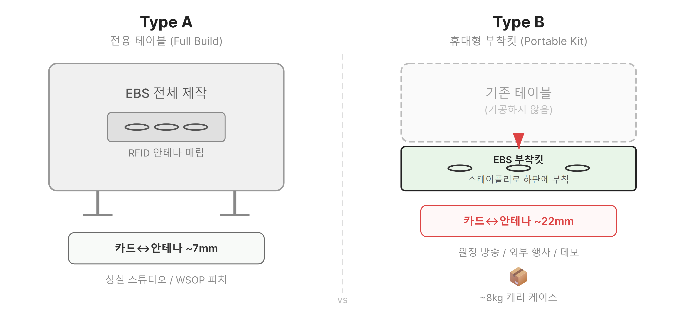
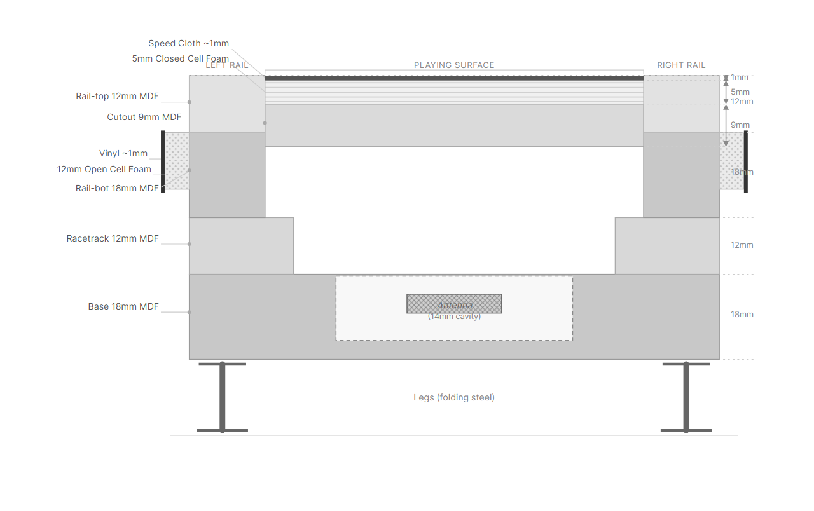
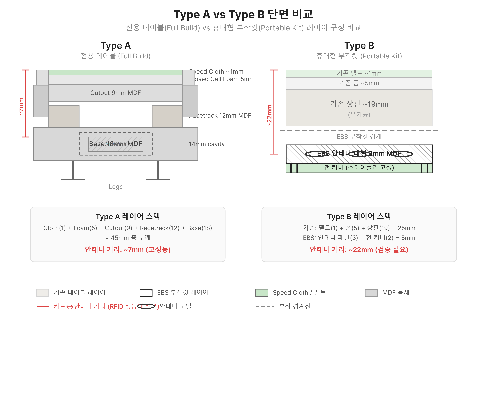

# EBS 포커 피처 테이블 제작 PRD

> **Version**: v2.0
> **Date**: 2026-03-26
> **문서 유형**: 제품 기획서 (Product Requirements Document)
> **대상 독자**: 제작팀, 기획팀, 현장 운영팀
> **범위**: 방송용 RFID 포커 피처 테이블의 물리적 설계·제작·설치

---

## 문서 포지셔닝

| 문서 | 다루는 것 | 다루지 않는 것 |
|------|----------|--------------|
| **Foundation PRD** | 소프트웨어 — 게임 엔진, 오버레이, 프로토콜 | 물리 테이블 제작 |
| **이 문서 (ebs_table PRD)** | **하드웨어 — 테이블 구조, RFID 매립, 제작 공정** | 소프트웨어 개발 |

Foundation PRD §4 "테이블 하드웨어 배치"가 RFID 리더 배치 사양을 정의했다면, 이 문서는 그 사양을 **실제로 제작하는 방법**을 정의한다.

---

## 1. Market Context

### 1.1 방송용 RFID 테이블 공급 현황

현재 방송용 RFID 포커 테이블을 제작하거나 공급하는 업체는 극소수다.

| 공급자 | 모델 | 가격 | 특징 |
|--------|------|------|------|
| **Vaider Poker** (유럽) | RFID Table V2 | EUR 3,800~4,300 | 220x110x75cm, 9인+딜러, LED, 접이식 금속 다리 |
| **VideoPokerTable.net** (미국) | RFID Reader Module | $3,750 (모듈) + $1,999 (설치) | 기존 테이블에 모듈 추가, 10좌석+2머크 |
| **BBO Poker Tables** (미국) | 커스텀 RFID | 견적 기반 | 미국 내 설치 서비스 포함 |
| **Macaumr** (아시아) | 카지노급 RFID | 견적 기반 | PJM 3.0, 내화 패널, 수명 8~10년 |
| **Final Table Inc.** | 자체 제작 | 비공개 | WSOP 공식 테이블, CNC 세트 디자인 |

### 1.2 제작 방식: 외주 + 모듈 매립

대부분의 포커 프로덕션에서 테이블 본체는 **현지 외주로 제작**한다. EBS는 테이블 자체를 만드는 것이 아니라, **RFID 모듈을 매립하기 위한 규격/요구사항을 외주 업체에 전달**하는 방식을 기본으로 한다.

| 방식 | 설명 | 적용 |
|------|------|------|
| **외주 제작 + 요구사항 전달** (기본) | 현지 테이블 제작 외주 업체에 EBS RFID 매립 규격 전달. 외주가 테이블 본체 제작 + 캐비티 가공까지 담당 | 대부분의 대회/프로덕션 |
| **자체 제작** (소수) | EBS 팀이 직접 전체 테이블 제작. Build Guide 기준 | 특수 사양, 프로토타입, 긴급 |

**EBS가 외주 업체에 전달하는 요구사항**:
- RFID 안테나 캐비티 배치도 (§4 CAD 도면 제공)
- 캐비티 깊이 14mm, 오버사이징 +1mm/변 (§4.4)
- 60mm 최소 클리어런스 (§4.2)
- 중앙 케이블 관통 홀 위치/크기
- 금속 부재 배제 영역
- MDF 소재 지정 (Base 18mm)

> **결론**: 테이블 본체는 원칙적으로 **현지 외주 제작** + EBS RFID 규격 전달. 자체 제작은 소수 케이스에만 적용.

### 1.3 PokerGFX VPT Build Guide 참조

PokerGFX LLC가 배포하는 "RFID VPT Build Guide V2.1"이 업계 표준 제작 가이드다. EBS 테이블은 이 가이드를 벤치마크로 삼되, EBS 고유 요구사항(크기, 안테나 배치, 브랜딩)을 반영한다.

---

## 2. 개요

### 목적

EBS 방송 현장에서 실제 사용할 RFID 포커 피처 테이블의 설계 규격을 정의한다. 테이블 본체는 현지 외주 제작이 기본이며, EBS는 RFID 모듈 매립을 위한 규격과 요구사항을 전달한다. 소수 케이스에서는 자체 제작도 가능하다. 두 가지 제품 라인을 운용한다.

### 제품 라인업

| | Type A: 전용 테이블 | Type B: 휴대형 부착킷 |
|------|:---:|:---:|
| **컨셉** | RFID가 매립된 완성형 테이블 | 기존 테이블 하부에 부착하는 키트 |
| **대상** | 상설 스튜디오, 피처 테이블 | 원정 방송, 외부 행사, 임시 세팅 |
| **장점** | 최적 RFID 성능, 브랜딩 자유 | 이동성, 빠른 설치, 기존 테이블 활용 |
| **제작 기간** | 5~6주 | 2~3주 |
| **비용** | ~$4,624 | ~$3,969 (RFID 별도) / ~$219 (공유) |


> *Type A: EBS 전체 제작, 안테나 매립(~7mm). Type B: 기존 테이블 하판에 부착킷 장착(~22mm).*

### 배경

- Foundation PRD §4에서 RFID 리더 12대, 안테나 최대 22개의 하드웨어 사양이 확정됨
- PokerGFX VPT Build Guide V2.1이 제작 표준을 제공
- 상용 테이블은 WSOPLIVE 브랜딩과 현장 맞춤이 불가능
- **원정 방송/외부 행사에서는 현지 테이블을 사용해야 하므로 휴대형 부착킷이 필수**

### 범위

| 포함 | 제외 |
|------|------|
| 테이블 본체 설계 (베이스, 레일, 다리) | 소프트웨어 개발 (GfxServer, AT) |
| RFID 안테나 + 리더 모듈 매립 | RFID 카드 제조 |
| 펠트/폼/비닐 시공 | 카메라 장비 구매 |
| 케이블 배선 및 커넥터 | 방송 프로덕션 워크플로우 |
| 카메라 마운트 구조 설계 | 조명 장비 |
| 운반/보관 구조 | 소프트웨어 스킨 디자인 |
| **Type B 휴대형 부착킷 설계/제작** | |

### Appetite

| 항목 | Type A 전용 테이블 | Type B 휴대형 킷 |
|------|:---:|:---:|
| 설계 + 자재 조달 | 2주 | 2주 |
| 제작 | 2~3주 | 1주 |
| 테스트 + 보정 | 1주 | 1주 |
| **합계** | **5~6주** | **3~4주** |

> Type A와 Type B는 RFID 모듈을 공유하므로 병행 개발 가능. 모듈 1세트로 A/B 전환 운용도 가능.

---

## 3. 테이블 물리 사양

### 3.1 테이블 규격

> 아래 사양은 PokerGFX RFID VPT Build Guide V2.2 및 CAD 도면(RFID-VPT-Layouts-DD-V2)에 기반한다.

EBS 피처 테이블은 **10인 + 딜러** 구성을 기본으로 한다.

| 항목 | 사양 | 출처 |
|------|------|------|
| **플레이 인원** | 10인 + 딜러 | WSOP 메인 이벤트 표준 |
| **전체 크기 (외곽)** | **2400mm x 1200mm** | CAD: rail-top, rail-bot |
| **플레이 서피스 (cutout)** | **2354mm x 1154mm** | CAD: cutout-dd |
| **형상** | 레이스트랙 오벌 | CAD 도면 기준 |
| **높이** | 약 740mm (다리 포함) | 카지노 표준 29인치 |

### 3.2 대회별/인원별 테이블 옵션

대회마다 테이블 규격이 다르다. EBS는 **기본형(10인) + 대회별 변형**을 제작한다.

| 옵션 | 인원 | 길이 | 폭 | 안테나 수 | 용도 |
|------|:----:|------|-----|:--------:|------|
| **A-10 (기본)** | 10인+딜러 | 96인치 (244cm) | 44인치 | 10+1+2=13 | WSOP 메인, 일반 토너먼트 |
| **A-9** | 9인+딜러 | 84인치 (213cm) | 44인치 | 9+1+2=12 | 파이널 테이블, 소규모 대회 |
| **A-6** | 6인+딜러 | 72인치 (183cm) | 36인치 | 6+1+2=9 | 6-max 토너먼트, 하이롤러 |
| **A-HU** | 2인+딜러 | 60인치 (152cm) | 36인치 | 2+1+1=4 | 헤즈업 파이널, 특별 매치 |

#### 모듈 공유 원칙

모든 옵션은 **동일한 RFID Reader Module V2**를 사용한다. 차이는 안테나 수와 테이블 크기뿐이다.

| 공유 요소 | A-10 | A-9 | A-6 | A-HU |
|----------|:----:|:---:|:---:|:----:|
| Reader Module V2 | 1 | 1 | 1 | 1 |
| Double 안테나 | 10 | 9 | 6 | 2 |
| 보드 안테나 | 1 | 1 | 1 | 1 |
| 머크 안테나 | 2 | 2 | 2 | 1 |
| 스피드 클로스 | 별도 크기 | 별도 크기 | 별도 크기 | 별도 크기 |

> **제작 전략**: 매 대회마다 별도 테이블을 제작할 수도 있고, 1~2개 기본 테이블을 보유하고 대회에 맞춰 운용할 수도 있다. 대회 전용 펠트(커스텀 프린트)만 교체하면 브랜딩 전환이 가능하다.

#### 대회 전용 테이블 제작 워크플로우

```
대회 확정 -> 규격 결정 -> 안테나 배치 설계 -> 제작 -> 커스텀 펠트 인쇄
              (인원수)    (A-10/9/6/HU)     (§6)    (대회 로고, 스폰서)
```

**대회별 커스텀 요소**:
- 펠트 디자인 (대회명, 로고, 스폰서, 색상)
- 레일 비닐 색상 (대회 브랜드 컬러)
- 테이블 크기 (인원수에 따라)

**공통 재사용 요소**:
- RFID Reader Module (모든 테이블 공용)
- 안테나 (벨크로 탈착 → 테이블 간 이동 가능)
- 케이블, USB, 전원 어댑터

### 3.3 테이블 구조 — 5-piece MDF 적층

PokerGFX VPT는 5개 MDF 부재를 적층하는 구조다. EBS 테이블도 이 구조를 따른다.


> *테이블 중앙 수직 단면. Base(18mm) 안에 14mm 캐비티로 안테나 매립. Racetrack(12mm) + Rail(12+18mm) 적층. 중앙에 Cutout(9mm) + 5mm 폼 + Speed Cloth.*

| # | 부재 | 소재 | 크기 | 두께 | 역할 |
|:-:|------|------|------|:----:|------|
| 1 | **Base** | 18mm MDF | 테이블 외곽 형상 | 18mm | RFID 안테나/케이블 캐비티 (14mm 라우팅), 다리 부착 |
| 2 | **Racetrack** | 12mm MDF | 레일 아래 링 형상 | 12mm | 레일 지지, 스테인/바니시 마감 |
| 3 | **Cutout** | 9mm MDF | 2354 x 1154mm | 9mm | 플레이 서피스 (폼 + 스피드 클로스 시공) |
| 4 | **Rail-top** | 12mm MDF | 2400 x 1200mm | 12mm | 레일 상부 (스크류 홀 관통) |
| 5 | **Rail-bot** | 18mm MDF | 2400 x 1200mm | 18mm | 레일 하부 + 오픈셀 폼 + 비닐 |


> *Rail-top. 외곽 2400 x 1200mm. 둘레에 체결용 관통 홀이 가공된다.*


> *Rail-bot. Rail-top과 접합하여 레일 구조를 형성. 외측에 12mm 오픈셀 폼 + 비닐로 패딩.*

#### 최종 조립 순서

| 순서 | 작업 | 체결 |
|:----:|------|------|
| 1 | Base에 RFID 장비 설치 (§4) | — |
| 2 | Racetrack을 Base 위에 배치 | — |
| 3 | Rail (Rail-top + Rail-bot 접합 완료)을 Racetrack 위에 배치 | — |
| 4 | 하부에서 20x 8G x 40mm 스크류로 둘레 체결 | 20개 |
| 5 | Cutout(폼+클로스 시공 완료)을 중앙에 드롭인 | — |
| 6 | 하부에서 5x 8G x 30mm 카운터싱크 스크류로 Cutout 고정 | 5개 |

### 3.4 레일 구조

Rail-top(12mm)과 Rail-bot(18mm)을 접합하여 총 **30mm 목재** + 12mm 폼 + 비닐로 구성한다.

| 층 | 재질 | 두께 | 역할 |
|:--:|------|:----:|------|
| 1 (외부) | 비닐 (Black Whisper) | ~1mm | 외관, 2.8m x 1.4m |
| 2 | 오픈셀 폼 (29kg) | 12mm | 팔걸이 쿠션, 2.5m x 1.3m |
| 3 | Rail-top | 12mm | 상부 구조 |
| 4 | Rail-bot | 18mm | 하부 구조, 외곽 립 형성 |

**폼 커팅 기준**:
- 외측: 목재 엣지에서 **30mm** 오버행
- 내측: 목재 엣지에서 **10mm** 오버행

**비닐 시공**: 외측 엣지를 감싸서 내측 립에 스테이플 고정. 중앙부는 잘라서 하부에 스테이플.

### 3.5 다리 구조

| 옵션 | 장점 | 단점 | 권장 |
|------|------|------|:----:|
| 접이식 금속 다리 | 운반 용이, 높이 조절 | 안정성 낮음 | 이동용 |
| 페데스탈 | 높은 안정성 | 무거움 | 상설 |
| 나사 인서트 + 노브 핸들 | 도구 없이 분해/조립 | 초기 가공 필요 | **권장** |

### 3.6 Type B: 휴대형 부착킷 설계

기존 포커 테이블의 **하판(베이스 아래쪽)**에 EBS RFID 안테나 패널을 부착하는 형태. 기존 테이블의 상판, 펠트, 레일은 일절 건드리지 않는다.

#### 컨셉 — 하판 부착 방식

Type A의 구조에서 **하판(하부 합판)에 해당하는 위치**에 EBS 부착킷을 장착한다. 안테나가 배치된 패널을 기존 테이블 하부에 대고, 펠트와 유사한 재질의 천으로 감싼 뒤 강화형 스테이플러로 고정한다.


> *좌: Type A 전체 제작 (안테나 캐비티 매립, ~7mm). 우: Type B 기존 테이블 하판에 패널 부착 (~22mm).*

**핵심 원리**: 기존 테이블을 뒤집어서 하부를 노출시킨 뒤, 안테나가 배치된 얇은 패널을 하판 위치에 대고, 펠트 유사 천으로 패널 전체를 감싸서 강화형 스테이플러로 기존 합판 엣지에 고정한다. 기존 테이블의 상면(펠트, 폼, 상판)은 전혀 건드리지 않는다.

#### 구성 요소

| 구성 요소 | 설명 |
|----------|------|
| **안테나 패널** | 3mm MDF 보드에 안테나를 사전 배치 + 벨크로 고정한 패널 |
| **커버 천** | 펠트 유사 재질 직물 — 패널을 감싸서 보호 + 스테이플 고정면 역할 |
| **강화형 스테이플러** | Type A 제작에도 사용하는 DeWalt 수동 스테이플러 (공용) |
| **리더 모듈 하우징** | 보호 케이스 (테이블 다리 또는 하부 벨크로 고정) |
| **케이블 정리** | 케이블 타이 + 벨크로 스트랩 (하부 배선 정리) |
| **운반 케이스** | 하드 캐리 케이스 (패널 + 리더 모듈 + 케이블 + 도구 일체 수납) |
| **스테이플 리무버** | 철수 시 스테이플 제거용 |

#### 안테나 패널 상세

| 항목 | 사양 |
|------|------|
| 소재 | 3mm MDF (RFID 신호 투과, 가벼움, 강성 확보) |
| 크기 | 기존 테이블 하부 플레이 영역 매칭 (약 230cm x 100cm) |
| 분할 | **3분할** (좌측 + 중앙 보드/머크 + 우측) — 운반 용이 |
| 안테나 고정 | 패널 표면에 벨크로로 안테나 고정 (Type A와 동일 방식) |
| 케이블 경로 | 패널 표면을 따라 각 안테나 → 중앙 리더 모듈 (방사형) |
| 커버 천 | 패널 전체를 감싸서 스테이플러로 고정할 수 있는 여유분 포함 |

#### 설치 순서 (현장, 약 20~30분)

| 단계 | 작업 | 시간 |
|:----:|------|:----:|
| 1 | 기존 테이블을 뒤집어 하부 노출 | 2분 (2인) |
| 2 | 3분할 안테나 패널을 하부에 배치, 좌석 위치 정렬 | 3분 |
| 3 | 커버 천으로 패널을 감싸기 | 3분 |
| 4 | **강화형 스테이플러로 천을 기존 합판 엣지에 고정** | 5~10분 |
| 5 | 테이블을 다시 뒤집어 정위치 | 2분 (2인) |
| 6 | 리더 모듈을 테이블 다리/하부에 벨크로 고정 | 2분 |
| 7 | 케이블 연결 (안테나 → 리더 모듈) + USB/전원 | 5분 |
| 8 | 캘리브레이션 + 감지 테스트 | 5분 |

#### 철수 순서 (약 15분)

| 단계 | 작업 | 시간 |
|:----:|------|:----:|
| 1 | USB/전원 분리, 케이블 분리 | 3분 |
| 2 | 테이블 뒤집기 | 2분 (2인) |
| 3 | 커버 천 스테이플 제거 (리무버) | 5~8분 |
| 4 | 패널 분리 → 운반 케이스 수납 | 3분 |
| 5 | 테이블 정위치 복원 | 2분 (2인) |

#### 제약 사항

| 제약 | 영향 | 완화 |
|------|------|------|
| 안테나-카드 거리 증가 | 기존 상판 합판(~19mm) + 폼 + 펠트를 통과해야 함 | RFID 판독 거리 8~10cm 내이므로 총 ~22mm는 범위 내. 사전 테스트 필수 |
| 금속 프레임 테이블 | RFID 신호 간섭 | 금속 테이블 불가, 목재 합판만 호환 |
| 테이블 뒤집기 | 2인 작업 필요, 무거운 테이블은 부담 | 최소 2인 배치 |
| 기존 상판 두께 편차 | 테이블마다 합판 두께 다름 → 감지 거리 변동 | 사전 판독 테스트, 3/4인치 이하 테이블 권장 |
| 안테나 위치 정밀도 | 하판에서 상판 좌석 위치와 오차 가능 | 패널에 좌석 정렬 마킹, 설치 가이드 제공 |

#### Type A vs Type B 비교

| 항목 | Type A 전용 테이블 | Type B 휴대형 킷 |
|------|:---:|:---:|
| RFID 감지율 | 100% | **95%+** (상판 합판 통과) |
| 안테나 위치 | 상판 내부 캐비티 (카드에서 ~7mm) | 하판 위치 (카드에서 ~22mm) |
| 기존 테이블 가공 | — (전체 자체 제작) | **없음** (하판에 부착만) |
| 설치 시간 | 0분 (상설) | 20~30분 |
| 철수 시간 | — | 15분 |
| 운반 무게 | ~70kg (테이블 전체) | **~8kg** (패널 3분할 + 리더) |
| 호환 테이블 | 자체 전용 | 목재 합판 테이블 (상판 3/4인치 이하) |
| 브랜딩 | 완전 커스텀 | 기존 테이블 외관 유지 |
| 용도 | 상설 스튜디오, WSOP 피처 | 파라다이스 원정, 외부 행사, 데모 |
| 부착 방식 | CNC 캐비티 매립 | 하판 위치에 패널 + 천 커버 + 스테이플러 |

---

## 4. RFID 시스템 설계

> 사양 출처: PokerGFX RFID VPT Build Guide V2.2

### 4.1 RFID 구성 요소

| 구성 요소 | 사양 | 수량 |
|----------|------|:----:|
| **RFID Reader Module V2** | 345mm x 90mm, 중앙 배치 (커뮤니티 카드 안테나 내장) | 1 |
| **좌석 안테나 (Double)** | 230mm x 115mm (Standard 2개 병렬) | 10 |
| **머크 안테나 (Standard)** | 115mm x 115mm | 2 |
| **안테나 케이블** | 1.5m/개 | 12+ |
| **USB 케이블** | **5m**, mini USB | 1 |
| **전원 어댑터** | AC | 1 |
| **RFID 카드** | 13.56MHz HF, 2덱 (104장) | 1세트 |

### 4.2 핵심 제약 조건

| 항목 | 사양 | 비고 |
|------|------|------|
| **최소 클리어런스** | **60mm** | 안테나/Reader Module 간, 금속 객체 간 모든 방향 |
| **최대 안테나-표면 거리** | **50mm** | 안테나에서 카드 접촉면까지 |
| **최대 안테나 수** | **22개**/Reader Module | Double = 2로 카운트 |
| **캐비티 깊이** | **14mm** (최소) | 모든 안테나, Reader Module, 케이블 채널 동일 |
| **캐비티 오버사이징** | **+1mm**/변 | 부품보다 각 변 1mm씩 크게 가공 |
| **EL 조명** | **사용 금지** | RFID 간섭. LED는 허용 |
| **케이블 꺾임** | 자연 곡률 반경 이내 | 급격한 꺾임 금지 |
| **여분 케이블** | 해당 안테나 위에 느슨하게 코일링 | 다른 안테나 케이블과 합치지 않음 |

### 4.3 안테나 배치도 (A-10 기본형)


> *Base(18mm MDF) 상면 CAD 도면. (출처: RFID-VPT-Layouts-DD-V2, PokerGFX LLC)*

### 4.4 캐비티 가공 사양 (CNC)

| 대상 | 캐비티 크기 (부품+1mm/변) | 깊이 | 비고 |
|------|------------------------|:----:|------|
| Reader Module | **347mm x 92mm** | 14mm | 중앙 배치, 케이블 관통 홀 포함 |
| Double 안테나 | **232mm x 117mm** | 14mm | 좌석 10개소 |
| Standard 안테나 (머크) | **117mm x 117mm** | 14mm | 머크 2개소 |
| 케이블 채널 | 폭 ~15mm | 14mm | 최대 길이 1.5m 이내 (케이블 길이 한계) |
| 케이블 관통 홀 | 중앙 | 관통 | USB + 전원 하부 인출용 |

**채널 끝단 처리**: Reader Module 측 USB/전원 커넥터 부근에 **직각 꺾임** 가공 — 케이블 인발 방지용

### 4.5 연결 방식

| 경로 | 방식 | 사양 |
|------|------|------|
| Reader Module → PC | **USB** (5m mini USB) | 기본 전송 |
| Reader Module → PC | **WiFi** | 백업 (자동 전환) |
| 전원 | AC 어댑터 → Reader Module | 관통 홀 인출 |

> 어떤 커넥터 포트에 연결해도 무관 — 캘리브레이션 시 자동 감지 (Build Guide §6)

---

## 5. 자재 명세

> 사양 출처: PokerGFX RFID VPT Build Guide V2.2

### 5.1 플레이 서피스 레이어 스택 (위에서 아래)

| 층 | 자재 | 두께 | 역할 |
|:--:|------|:----:|------|
| 1 | **스피드 클로스** (Suited) | ~1mm | 플레이 표면, 2m x 0.8m |
| 2 | **클로즈드셀 폼** | **5mm** | 쿠션, 2m x 0.8m |
| 3 | **Cutout** (9mm MDF) | 9mm | 플레이 서피스 기판, 2354 x 1154mm |

### 5.2 레일 레이어 스택

| 층 | 자재 | 두께 | 역할 |
|:--:|------|:----:|------|
| 1 | **비닐** (Black Whisper) | ~1mm | 외관, 2.8m x 1.4m |
| 2 | **오픈셀 폼** (29kg) | **12mm** | 팔걸이 쿠션, 2.5m x 1.3m |
| 3 | **Rail-top** (12mm MDF) | 12mm | 레일 상부 |
| 4 | **Rail-bot** (18mm MDF) | 18mm | 레일 하부 |

### 5.3 구조 자재 (MDF 5-piece)

| 부재 | 소재 | 두께 | 크기 | 수량 |
|------|------|:----:|------|:----:|
| Base | 18mm MDF | 18mm | 테이블 외곽 형상 | 1 |
| Racetrack | 12mm MDF | 12mm | 레일 아래 링 형상 | 1 |
| Cutout | 9mm MDF | 9mm | 2354 x 1154mm | 1 |
| Rail-top | 12mm MDF | 12mm | 2400 x 1200mm | 1 |
| Rail-bot | 18mm MDF | 18mm | 2400 x 1200mm | 1 |

### 5.4 표면/마감 자재

| 자재 | 사양 | 크기 | 수량 |
|------|------|------|:----:|
| 클로즈드셀 폼 | 5mm | 2m x 0.8m | 1장 |
| 오픈셀 폼 | 12mm, 29kg 밀도 | 2.5m x 1.3m | 1장 |
| 스피드 클로스 (Suited) | 폴리에스터 | 2m x 0.8m | 1장 |
| 비닐 (Black Whisper) | PVC | 2.8m x 1.4m | 1장 |

### 5.5 체결 및 소모품

| 품목 | 사양 | 수량 |
|------|------|:----:|
| 카운터싱크 스크류 | 8G x 30mm | 5개 |
| 메탈 스크류 | 8G x 40mm | 20개 |
| 메탈 스크류 | 6G x 20mm | 8개 |
| HD 스테이플 | 8mm | 1박스 |
| 접이식 스틸 다리 | — | 1세트 |
| 사포 | 60 grit + 220 grit | 각 1장 |
| 우드 스테인 | — | 1캔 |
| 클리어 글로스 바니시 | — | 1캔 |
| 목공 접착제 | — | 1통 |
| 3M 폼 접착 스프레이 | — | 2캔 |
| 절연 테이프 | — | 1롤 |

---

## 6. 제작 공정

### 6.1 공정 개요

```
Phase A: 베이스 제작 ──> Phase B: RFID 매립 ──> Phase C: 시공 ──> Phase D: 검증
   (합판 가공)             (안테나+케이블)        (폼+펠트+레일)    (RFID 테스트)
      1~2일                  1~2일                2~3일             1일
```

### 6.2 Phase A — 부재 가공 (CNC)

> Build Guide Phase A: Component Preparation

| 단계 | 작업 | 비고 |
|:----:|------|------|
| A1 | CAD 파일(DWG/DXF)로 CNC 가공 — Base, Racetrack, Cutout, Rail-top, Rail-bot 5개 부재 컷팅 | CNC 외주 가능 |
| A2 | Base 상면에 안테나/채널 캐비티 **14mm 깊이** CNC 라우팅 | 빗금 영역 전체 |
| A3 | Base 중앙에 케이블 관통 홀 가공 | USB+전원 하부 인출 |
| A4 | Base 하부에 접이식 스틸 다리 부착 | — |

### 6.3 Phase B — 플레이 서피스 시공

> Build Guide Phase B: Playing Surface

| 단계 | 작업 | 비고 |
|:----:|------|------|
| B1 | Cutout(9mm MDF) 상면에 3M 스프레이 접착제 도포 | — |
| B2 | 5mm 클로즈드셀 폼 부착, 에어 제거, 여분 트리밍 | 폼 커터 사용 |
| B3 | 스피드 클로스를 폼 위에 배치, 반으로 접기 | — |
| B4 | 노출된 폼에 접착제 도포 → 클로스를 중앙에서 바깥으로 롤링 | 에어 버블 제거 |
| B5 | 반대편 반복 | — |
| B6 | 뒤집어서 클로스를 MDF 둘레에 스테이플 고정 | HD 8mm 스테이플 |

### 6.4 Phase C — 패디드 레일 시공

> Build Guide Phase C: Padded Rail

| 단계 | 작업 | 비고 |
|:----:|------|------|
| C1 | Rail-top(12mm)과 Rail-bot(18mm) 목공 접착제로 접합 | 클램프 고정 건조 |
| C2 | 접합된 레일을 12mm 오픈셀 폼 위에 올려 접착 | 3M 스프레이 |
| C3 | 폼 커팅 — 외측 목재 엣지에서 **30mm**, 내측에서 **10mm** | 마킹 후 커팅 |
| C4 | 비닐(Black Whisper) 위에 레일을 폼면 아래로 배치 | 검정 면 아래 |
| C5 | 비닐을 외측 엣지로 당겨 내측 립에 스테이플 고정 (전체 둘레) | 2인 작업 권장 |
| C6 | 중앙 비닐 잘라서 하부에 스테이플 | — |

### 6.5 Phase D — Racetrack 마감 + 최종 조립

> Build Guide Phase D-F: Racetrack + Electronics + Assembly

| 단계 | 작업 | 비고 |
|:----:|------|------|
| D1 | Racetrack 한 면 샌딩 (60 grit → 220 grit) | — |
| D2 | 스테인 도포 | — |
| D3 | 클리어 글로스 바니시 마감 | 건조 대기 |
| D4 | **RFID 장비 설치** — Base에 Reader Module + 안테나 + 케이블 (§4 참조) | 벨크로 고정, 절연 테이프 |
| D5 | Racetrack을 Base 위에 배치 | — |
| D6 | Rail을 Racetrack 위에 배치 | — |
| D7 | 하부에서 **20x 8G x 40mm 스크류**로 둘레 체결 | — |
| D8 | Cutout(폼+클로스 완성)을 중앙에 드롭인 | — |
| D9 | 하부에서 **5x 8G x 30mm 카운터싱크 스크류**로 Cutout 고정 | — |

### 6.6 Phase E — 검증

| 단계 | 작업 | 기준 |
|:----:|------|------|
| E1 | RFID 리더 전원 + PC USB 연결 | LED 점등, 소프트웨어 인식 |
| E2 | 안테나 캘리브레이션 | 좌석 → 머크 → 보드 순서 |
| E3 | 52장 덱 등록 (REGISTER_DECK) | 52장 전체 UID 매핑 |
| E4 | 좌석별 감지 테스트 | 전 좌석 100%, <50ms |
| E5 | 다중 카드 테스트 (Omaha 4장) | 4장 동시 감지 |
| E6 | 보드 카드 테스트 | Flop 3장 + Turn + River |
| E7 | 머크 테스트 | 머크 안테나 감지 확인 |
| E8 | 구조 확인 | 수평, 레일 흔들림, 스크류 토크 |

### 6.7 Type B 휴대형 킷 제작 공정

Type B는 테이블 가공이 없다. 핵심은 **3분할 안테나 패널 제작 + 커버 천 준비**이다.

| 단계 | 작업 | 시간 |
|:----:|------|:----:|
| P1 | 3mm MDF를 3분할 패널로 컷팅 (좌/중앙/우) | 1시간 |
| P2 | 각 패널에 안테나 위치 마킹 + 좌석 정렬선 표시 | 30분 |
| P3 | 안테나를 패널에 벨크로 고정 | 30분 |
| P4 | 케이블 배선 + 케이블 타이 정리 | 1시간 |
| P5 | 커버 천 재단 (펠트 유사 직물, 패널 감싸기 여유분 포함) | 30분 |
| P6 | 리더 모듈 하우징 제작 (보호 케이스 + 벨크로 마운트) | 30분 |
| P7 | 운반 케이스에 패키징 (패널 3개 + 커버 천 + 리더 + 스테이플러 + 리무버) | 30분 |
| P8 | 테스트 테이블에서 하판 부착 연습 + 캘리브레이션 + 감지 테스트 | 2시간 |
| **합계** | | **~7시간 (1일)** |

> Type B는 CNC 라우팅 불필요. 직소로 MDF 컷팅만 하면 되므로 라우터 없이 제작 가능.

### 6.8 필요 도구

| 도구 | 용도 | 필수 |
|------|------|:----:|
| **플런지 라우터** | 캐비티/채널, 오벌 컷팅 | **필수** |
| 라우터 서클 지그 | 오벌 곡선 | **필수** |
| 라우터 비트 (3/8, 3/4, 라운드오버) | 가공 | **필수** |
| 직소 | 직선부 컷팅 | **필수** |
| 수동 스테이플러 (DeWalt) | 펠트, 비닐 | **필수** |
| 오비탈 샌더 | 엣지 마감 | **필수** |
| 드릴 + 카운터싱크 비트 | 스크류, 볼트 | **필수** |
| 스프레이 접착제 | 폼 부착 | **필수** |
| 수평계 | 최종 검증 | 권장 |

---

## Changelog

| 날짜 | 버전 | 변경 내용 | 변경 유형 | 결정 근거 |
|------|------|-----------|----------|----------|
| 2026-03-26 | v2.0 | Build Guide V2.2 + CAD 도면 기준 전면 재설계 — 5-piece MDF 구조, 실측 치수(mm), CNC 캐비티 14mm, CAD 도면 이미지 삽입 | TECH | 제작 도면 정합 |
| 2026-03-26 | v1.4 | Type B를 하판 부착 방식으로 전면 수정 (펠트 오버레이→하판 패널 부착) | PRODUCT | 컨셉 명확화 |
| 2026-03-26 | v1.3 | 이미지 경로 수정, §3 섹션 번호 정리, Type B 비용/다이어그램 정합, 버전 헤더 동기화 | TECH | 전체 검수 |
| 2026-03-26 | v1.2 | 10인 기준 변경, 대회별/인원별 옵션 추가 (§3.2), 스크린샷 참조 추가 | PRODUCT | WSOP 10인 표준 + 대회 커스터마이징 |
| 2026-03-26 | v1.1 | Type B 휴대형 부착킷 추가 (제품 라인업, §3.5, §6.6, §9.5-9.6) | PRODUCT | 원정 방송/외부 행사 대응 |
| 2026-03-26 | v1.0 | 최초 작성 | - | - |
