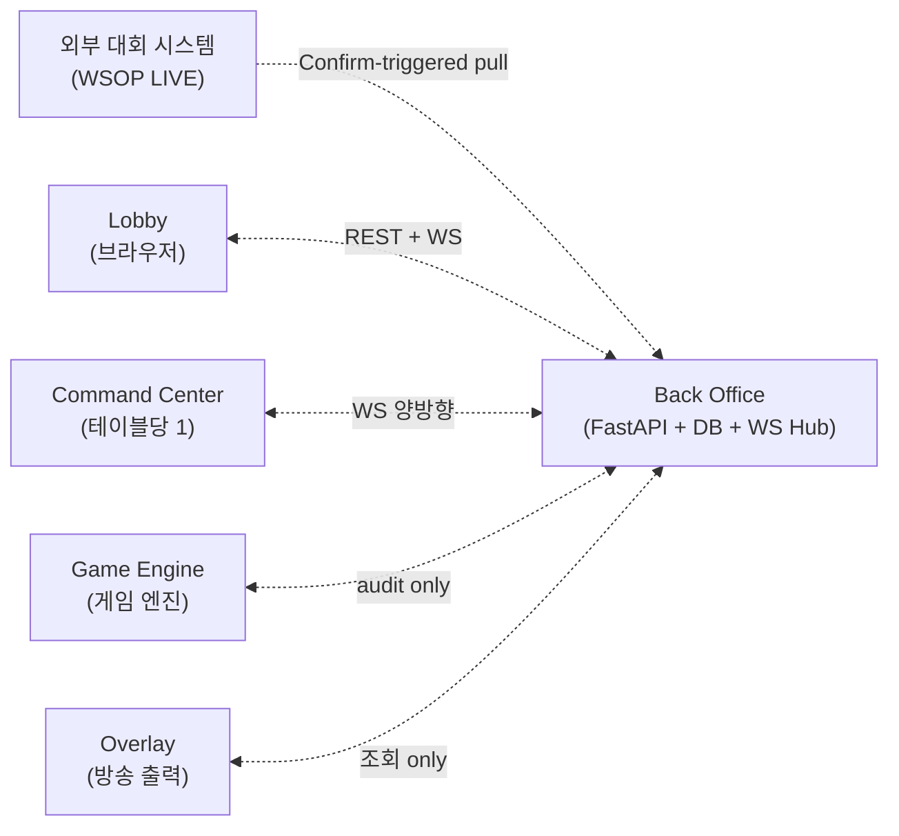
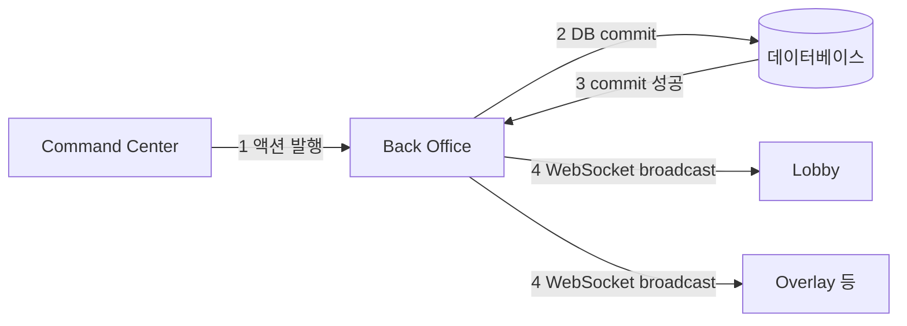
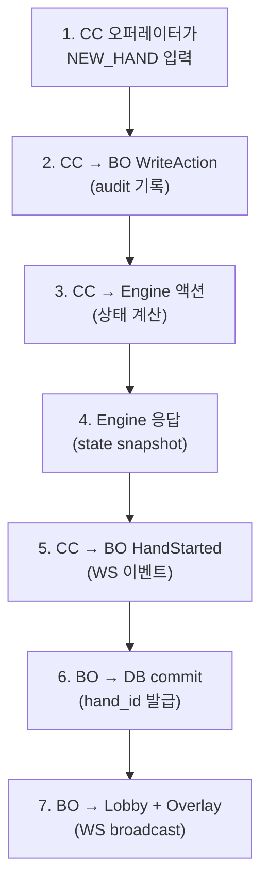
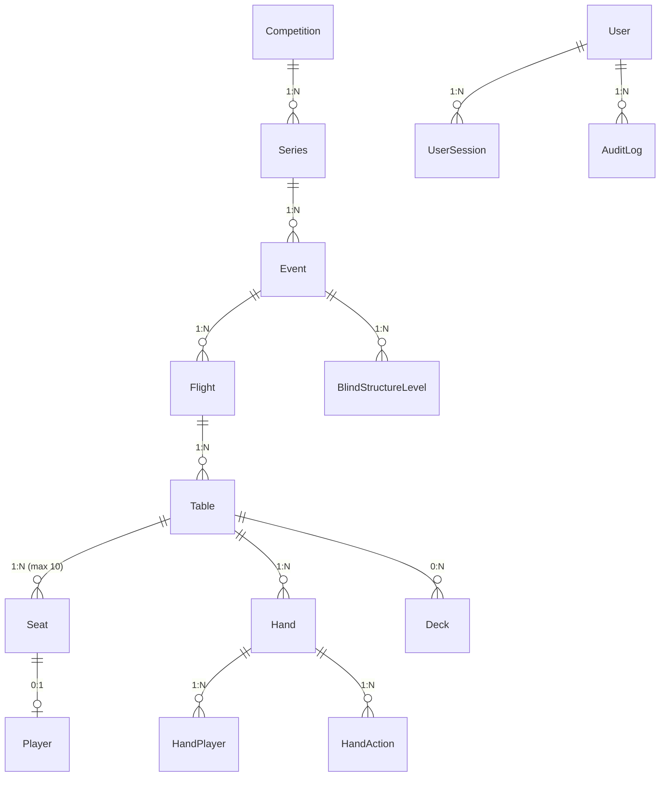
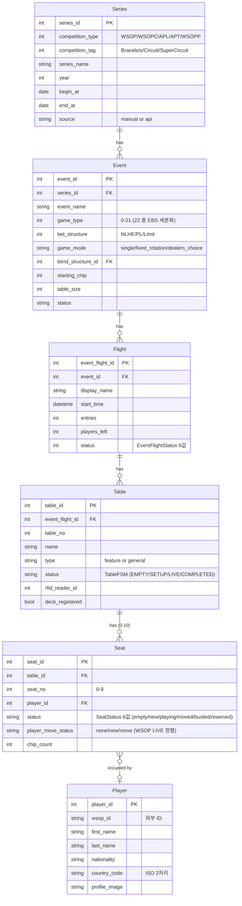
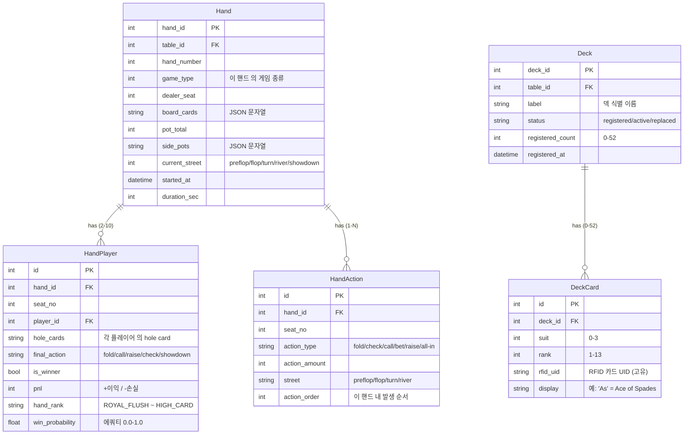
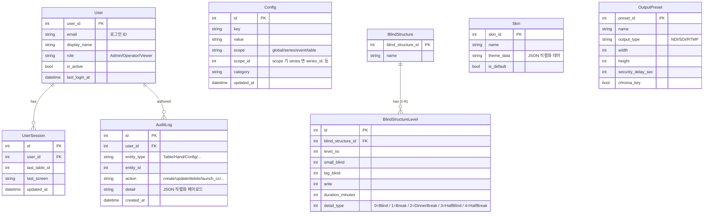
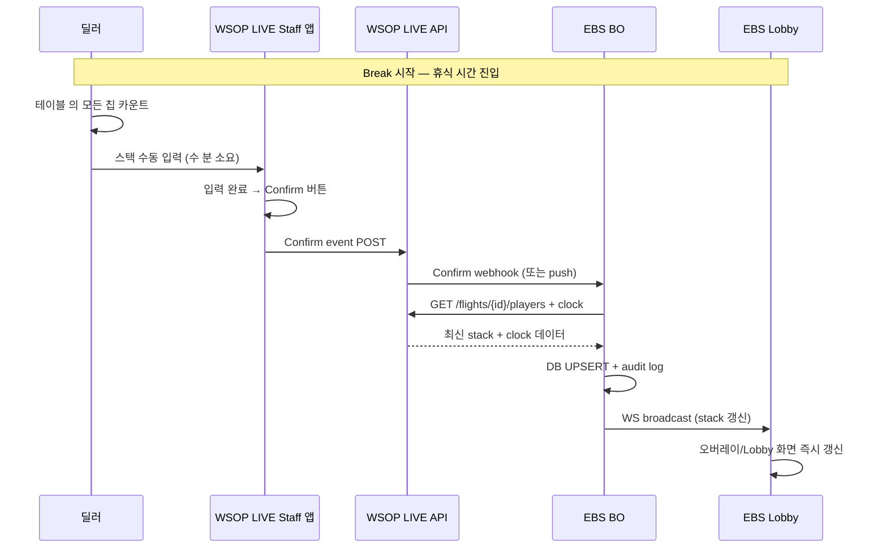
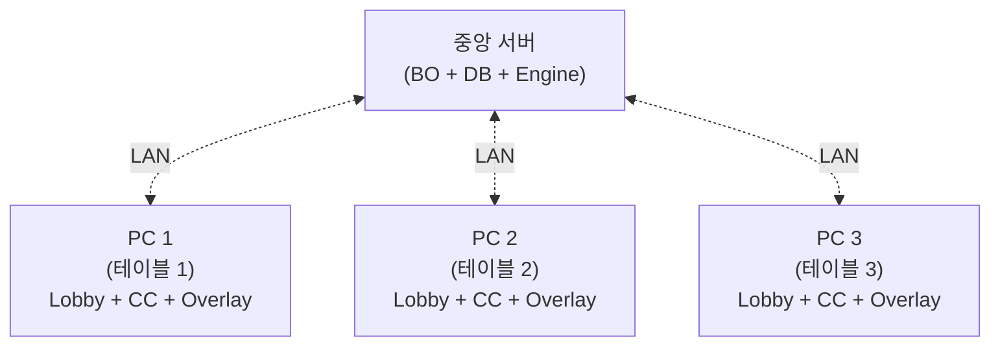

# Back Office — 보이지 않는 뼈대

> **Version**: 1.2.0
> **Date**: 2026-05-12
> **문서 유형**: 외부 인계용 PRD (Product Requirements Document)
> **대상 독자**: 외부 개발팀, 경영진, PM, 백엔드 시스템에 관심 있는 누구나
> **범위**: Back Office 의 역할·책임·통신·데이터·운영. **본 문서 한 편으로 BO 전체를 100% 이해할 수 있도록 작성됩니다.** 더 깊은 구현 디테일은 `2. Development/2.2 Backend/Back_Office/Overview.md` 정본을 참조하세요.

---

## 목차

**Part I — 정체성: BO 가 무엇인가**

- [Ch.1 — 보이지 않는 뼈대](#ch1--보이지-않는-뼈대) — 카메라가 보이지 않는데 누가 데이터를 옮기는가?
- [Ch.2 — 데이터의 4 갈래 흐름](#ch2--데이터의-4-갈래-흐름) — BO 가 누구와 어떻게 통신하는가
- [Ch.3 — DB 는 단일 진실](#ch3--db-는-단일-진실) — 왜 모든 길이 BO 를 거치는가

**Part II — 책임: BO 가 무엇을 하고 무엇을 안 하는가**

- [Ch.4 — BO 가 보관하는 9 영역](#ch4--bo-가-보관하는-9-영역) — 사용자 / 대회 / 테이블 / 핸드 ...
- [Ch.5 — DB 스키마, 9 영역의 실제 모양](#ch5--db-스키마-9-영역의-실제-모양) — 20 엔티티 ERD + 핵심 테이블 계약
- [Ch.6 — WSOP LIVE 와의 약속](#ch6--wsop-live-와의-약속) — Confirm-triggered pull (폴링 X)
- [Ch.7 — BO 가 일부러 안 하는 13 가지](#ch7--bo-가-일부러-안-하는-13-가지) — 금융 / KYC / 결제 ...

**Part III — 운영: BO 가 어떻게 돌아가는가**

- [Ch.8 — 1 PC vs N PC 중앙 서버](#ch8--1-pc-vs-n-pc-중앙-서버) — 단일 테이블 vs 복수 테이블 운영
- [Ch.9 — 성능과 신뢰의 약속](#ch9--성능과-신뢰의-약속) — SLO 5 항목
- [Ch.10 — 후편집을 위한 데이터](#ch10--후편집을-위한-데이터) — 핸드 JSON 수확

**부록**

- [Appendix A — PokerGFX 역설계 패턴](#appendix-a--pokergfx-역설계-패턴) — 우리가 어디서 영감을 받았는가

---

## Ch.1 — 보이지 않는 뼈대

포커 방송을 보고 있을 때, 시청자의 눈에 들어오는 것은 두 가지입니다. 카드가 펼쳐지는 테이블 위 풍경과, 화면 한 켠에서 명멸하는 승률 그래픽. 그 사이 어딘가에서 누군가는 RFID 카드를 인식해 데이터로 변환하고, 누군가는 다음 핸드의 블라인드 구조를 미리 계산하고, 누군가는 시청률 통계를 위한 핸드 기록을 저장합니다.

> **이 모든 일을 조용히 떠받치는 것이 Back Office (BO) 입니다.**


화면 위에서는 한 번도 모습을 드러내지 않지만, BO 가 멈추는 순간 모든 것이 멈춥니다.

### 1.1 비유 — BO 가 사라진 세상

가게 한 곳을 상상해 보세요. 손님(시청자)이 보는 것은 진열대(오버레이)와 점원(Lobby 운영자 + CC 오퍼레이터)뿐입니다. 그러나 점원이 손님 주문을 받아 물건을 꺼내려면 창고가 필요하고, 창고에서 어떤 물건이 어디 있는지 기억하는 장부가 필요하고, 새 물건이 들어올 때 받아 정리하는 손이 필요합니다.

| 가게의 비유 | EBS 의 실제 |
|------------|-------------|
| 진열대 | 오버레이 (시청자가 보는 그래픽) |
| 점원 | Lobby 운영자 + CC 오퍼레이터 (Command Center) |
| 창고 | BO 의 데이터베이스 |
| 장부 | BO 의 REST API + WebSocket 허브 |
| 새 물건 들어오는 손 | BO 의 외부 시스템 동기화 (WSOP LIVE) |

BO 는 창고이자 장부이자 손입니다. 화려한 진열대 뒤에서 오로지 데이터의 안전한 이동만을 책임집니다.

### 1.2 한 줄 정의

> **Back Office** = 외부 대회 시스템과 통신하여 정보를 받아오고, 게임 기록을 저장하며, 시스템 컴포넌트 간 데이터를 실시간으로 중계하는 **중앙 데이터 허브**.

(Foundation Ch.4 Scene 1 의 표현: "각 시스템 컴포넌트 간의 데이터를 실시간으로 중계하는 **뼈대 역할**".)

---

## Ch.2 — 데이터의 4 갈래 흐름

EBS 는 6 개의 기능 조각으로 구성됩니다 (Foundation §Ch.4): 로비 / 커맨드 센터 / 게임 엔진 / 백오피스 / 오버레이 뷰 / 카드 인식 하드웨어. 이 중 5 개의 소프트웨어 조각은 모두 BO 와 연결됩니다. 카드 인식 하드웨어 (RFID) 만이 직접 BO 와 통신하지 않고 커맨드 센터를 거칩니다.



### 2.1 4 갈래 흐름

| 흐름 | 출발 → 도착 | 프로토콜 | 의미 |
|------|------------|:--------:|------|
| **(가) 외부 → BO** | WSOP LIVE → BO | **Confirm-triggered pull** (이벤트 기반, Ch.6 상세) | 대회/시리즈/플레이어/스택/클락 캐싱 |
| **(나) BO ↔ Lobby** | BO ↔ Lobby (브라우저) | REST + WebSocket | CRUD + 실시간 모니터링 |
| **(다) BO ↔ CC** | BO ↔ Command Center | WebSocket (양방향) | 액션 명령 + 이벤트 발행 + audit 보관 |
| **(라) BO ↔ Engine + Overlay** | 양방향 조회 | REST | Engine = 게임 상태 SSOT, Overlay = 디스플레이 조회 |

> **트리거 모델 갱신** (v1.2.0): 외부 → BO 흐름은 종전 "4 시간 폴링" 에서 **WSOP LIVE staff 앱의 Confirm 이벤트 후 pull** 로 전환되었습니다. 자세한 시퀀스는 Ch.6 을 참조하세요. 정본 (`Back_Office/Overview.md §3.9`) 동기화는 별 PR 로 후속 진행됩니다.

### 2.2 직접 연결 금지 원칙

위 다이어그램에서 한 가지가 빠져 있습니다. **Lobby 와 CC 는 직접 통신하지 않습니다**. Lobby 가 "테이블 #71 의 현재 상태" 를 알고 싶으면 CC 에게 묻는 것이 아니라, BO 에게 묻습니다. CC 가 "방금 CC 오퍼레이터가 입력한 액션을 Lobby 도 알아야 한다" 고 판단하면 Lobby 에게 알리는 것이 아니라, BO 에게 알립니다.

> 모든 길은 BO 를 통합니다.

이 원칙 (Foundation Ch.5 §B.4) 이 EBS 의 가장 중요한 설계 결정입니다. 다음 챕터가 그 이유를 설명합니다.

---

## Ch.3 — DB 는 단일 진실

### 3.1 왜 직접 연결을 금지하는가

만약 Lobby 가 CC 와 직접 통신한다고 가정해 봅시다. 한 CC 오퍼레이터가 "선수 A 가 폴드" 를 입력하면, CC 는 즉시 Lobby 에게 알립니다. 동시에 BO 에게도 알립니다. 그런데 만약 CC 가 BO 에게 알리는 데 실패했다면? Lobby 는 알고 있는데 BO 의 데이터베이스에는 기록되지 않은 상태가 됩니다. 다음 핸드를 시작하면 어떻게 될까요?

```
  +-----------+  실패한 직접 연결 모델          +-----------+
  |   Lobby   |--<-A 폴드->-+                  |    CC     |
  +-----------+             |                  +-----------+
                            v                        |
                       +---------+ <- ❌ 실패 ----- |
                       |   BO    |
                       +---------+
                       (DB 에는 폴드 없음)
                       (Lobby 는 폴드 알고 있음)
                       (시스템 분열)
```

### 3.2 단일 진실 (DB SSOT) 원칙

EBS 는 이 위험을 봉쇄하기 위해 단일 원칙을 채택합니다:

> **DB = SSOT (Single Source of Truth)**.
> 모든 상태 변경은 BO 의 DB 에 commit 된 후에만 valid 하다.



상태 변경은 4 단계로만 진행됩니다:

1. CC 가 BO 에게 액션 발행 (WebSocket)
2. BO 가 DB 에 commit
3. commit 성공 응답
4. BO 가 모든 구독자에게 WS broadcast

만약 2 단계 (DB commit) 가 실패하면, 4 단계 (broadcast) 도 실행되지 않습니다. **시스템은 분열되지 않습니다** — 모두가 모르거나, 모두가 압니다.

### 3.3 Engine 만이 다른 SSOT

DB 가 SSOT 라는 원칙에 한 가지 예외가 있습니다. 게임 상태 (현재 카드, 팟, 베팅 라운드, 누가 다음 액션 차례인가) 의 SSOT 는 **Game Engine 응답** 입니다 (Foundation Ch.5 §B.4).

| 데이터 | SSOT | 이유 |
|--------|:----:|------|
| 사용자 / 대회 / 테이블 / 좌석 / 핸드 기록 | **DB (BO)** | 영구 보관 + 외부 시스템 동기화 |
| 게임 진행 상태 (카드, 팟, 라운드) | **Engine 응답** | 22 종 포커 규칙의 unique 진실 |
| 화면에 그릴 21 OutputEvent | **Engine 응답** | 애니메이션 트리거의 결정자 |

CC 가 CC 오퍼레이터 액션을 처리할 때, BO 와 Engine 양쪽에 동시에 dispatch 합니다 (Foundation Ch.5 §B.4). **Engine 응답을 진실로 받아들이고, BO WS 응답은 audit 참고값으로 사용**합니다. 둘이 다르면? Engine 이 이깁니다.

---

## Ch.4 — BO 가 보관하는 9 영역

BO 의 데이터베이스에 무엇이 저장되어 있는지가 BO 의 정체성입니다. 외부 (WSOP LIVE) 에서 받아오는 데이터, EBS 가 직접 만들어내는 데이터, 그리고 운영 흐름에서 자연스럽게 발생하는 데이터의 세 종류로 나눌 수 있습니다.

### 4.1 외부 시스템에서 받아오는 데이터 (5 영역)

```
  +-----+------------------+---------------+--------------------+
  | 영역 | 무엇             | 출처          | 용도               |
  +-----+------------------+---------------+--------------------+
  | 1   | Series           | WSOP LIVE     | 대회 시리즈 정보    |
  | 2   | Event            | WSOP LIVE     | 개별 토너먼트       |
  | 3   | Flight           | WSOP LIVE     | 한 Event 의 Day 분리 |
  | 4   | Player Profile   | WSOP LIVE     | 이름/국적/사진       |
  | 5   | Blind Structure  | WSOP LIVE     | 블라인드 구조 + 일정 |
  +-----+------------------+---------------+--------------------+
```

WSOP LIVE 와의 연동이 끊어지더라도 시스템은 멈추지 않습니다. BO 는 마지막으로 받아온 데이터를 내부 DB 에 보관하고 있으며, Lobby 운영자가 **수동 폴백** 으로 직접 입력할 수도 있습니다 (Lobby 의 "+ New Series", "+ New Event" 버튼).

### 4.2 EBS 가 직접 만드는 데이터 (4 영역)

```
  +-----+------------------+----------------+----------------------+
  | 영역 | 무엇             | 만드는 곳      | 의미                 |
  +-----+------------------+----------------+----------------------+
  | 6   | Table            | Lobby 운영자   | 방송할 테이블 9 좌석 |
  | 7   | Hand             | CC 액션        | 핸드 1 회 = 카드+액션|
  | 8   | Hand Statistics  | BO 자동        | VPIP / PFR / AGR     |
  | 9   | Audit Log        | BO 자동        | 오퍼레이터 액션 이력  |
  +-----+------------------+----------------+----------------------+
```

이 4 영역이 **EBS 만의 자산** 입니다. WSOP LIVE 의 다른 시스템에는 없거나 별도 시스템으로 처리되는 데이터로, 방송 라이브 운영의 결과물입니다.

### 4.3 한 핸드의 데이터 흐름

핸드 한 회가 진행되는 동안 BO 는 어떤 데이터를 만지는지 따라가 봅시다.



이 7 단계가 매 핸드, 매 액션마다 반복됩니다. 12 시간 방송 한 회에 약 800~1,200 핸드가 진행되며, 각 핸드는 평균 20~40 액션을 포함합니다. 즉 BO 는 하루에 16,000~48,000 회 commit 을 처리합니다.

---

## Ch.5 — DB 스키마, 9 영역의 실제 모양

Ch.4 에서 BO 가 보관하는 9 영역을 이야기했습니다. 그 9 영역이 데이터베이스 안에서 어떻게 생겼는지를 이 챕터에서 보여드립니다.

> **이 챕터의 약속**: 외부 개발팀이 본 문서만 읽고도 DB 를 재구현할 수 있도록, 20 개 엔티티의 모양과 관계를 모두 보여드립니다. SQL 디테일 (CREATE TABLE 구문, CHECK 제약, 인덱스) 은 정본 `Database/Schema.md` 를 참조하세요. 본 챕터는 **외부 인계용 요약 ERD + 핵심 필드 계약** 입니다.

### 5.1 비유 — 도서관의 4 층 책장

BO 의 DB 를 4 층 짜리 도서관 책장으로 생각해 보세요.

| 층 | 무엇이 꽂혀 있는가 | 누가 채우는가 |
|----|---------------------|----------------|
| **1 층** | 대회 책 (Series → Event → Flight → Table → Seat → Player) | WSOP LIVE 또는 Lobby 운영자 수동 입력 |
| **2 층** | 게임 책 (Hand → HandPlayer → HandAction) + 덱 책 (Deck → DeckCard) | CC 오퍼레이터 액션 → BO 자동 |
| **3 층** | 관리 책 (User → UserSession + AuditLog + Config) | Lobby 운영자 / 시스템 자동 |
| **4 층** | 출력 책 (Skin + OutputPreset + BlindStructure → BlindStructureLevel) | Lobby 운영자 설정 |

20 권의 책. 그 이상도 그 이하도 아닙니다.

### 5.2 전체 엔티티 관계도 (Overview ERD)



> 정본 ERD: `Database/ER_Diagram.md` (3 도메인 상세 다이어그램 포함).

엔티티 수량 요약:

| 도메인 | 엔티티 | 개수 |
|--------|--------|:----:|
| 대회 계층 | Competition, Series, Event, Flight, Table, Seat, Player | 7 |
| 게임 | Hand, HandPlayer, HandAction, Deck, DeckCard | 5 |
| 관리 | User, UserSession, AuditLog, Config, BlindStructure, BlindStructureLevel, Skin, OutputPreset | 8 |
| **합계** | | **20** |

### 5.3 대회 계층 상세 ERD (1 층)

대회 계층은 WSOP LIVE 데이터 구조를 그대로 따릅니다. 6 단 계층 (Competition → Series → Event → Flight → Table → Seat) 입니다.



**왜 6 단인가**: 대회 (Series) 안에 여러 이벤트가 있고, 이벤트 한 회는 여러 날 (Flight) 로 나뉘며, 한 Flight 안에 여러 테이블이 있고, 각 테이블은 좌석 10 개를 가지며, 각 좌석엔 플레이어 1 명이 앉습니다. 이 6 단 구조는 WSOP LIVE 와 동일합니다.

### 5.4 게임 도메인 상세 ERD (2 층)

핸드 데이터는 Command Center 의 액션을 받아 BO 가 저장합니다. **이벤트 소싱 (Event Sourcing)** 방식 — 모든 액션이 시간순으로 보존됩니다.



**핸드 1 회 = 데이터 한 묶음**: 한 핸드가 끝나면 (1) Hand 1 행 + (2) HandPlayer N 행 (참여 플레이어 수) + (3) HandAction M 행 (모든 액션) 이 commit 됩니다. 12 시간 방송 한 회에 800–1,200 핸드, 합산 commit 약 16,000–48,000 회. 이 숫자가 §9.1 SLO 의 "DB 쓰기 50+/sec" 근거입니다.

### 5.5 관리 도메인 상세 ERD (3·4 층)



**Config 의 override 체인**: 한 설정값을 찾을 때 BO 는 `table → event → series → global` 순으로 탐색합니다. 가장 좁은 범위에 정의된 값이 이깁니다. 예) "RFID 모드 = Mock" 이 series 단계에 정의되어 있어도, 특정 table 단계에 "Real" 이 정의되면 그 테이블에서만 Real 이 적용됩니다.

### 5.6 SeatStatus × PlayerMoveStatus 조합 매트릭스

좌석 상태 표현은 두 컬럼의 조합으로 결정됩니다 — `seat.status` (EBS 6값) + `seat.player_move_status` (WSOP LIVE 정렬 3값).

| seat.status | player_move_status | 의미 | Lobby/오버레이 표시 |
|-------------|:------------------:|------|--------------------|
| `empty` | — (NULL) | 빈 좌석 | EMPTY 표시 |
| `new` | `new` | 등록 직후 10 분 카운트다운 | **NEW 뱃지 + 카운트다운** |
| `playing` | `none` | 정상 플레이 중 | PLAYING (녹색) |
| `playing` | `move` | 이동 후 플레이 시작, 10 분 이내 | **MOVED 뱃지** + PLAYING 색 |
| `moved` | `move` | 이동 중 sit-in 대기 | MOVED 뱃지 + 카운트다운 |
| `busted` | — | 탈락 요청 | BUSTED (적색) |
| `reserved` | — | 예약/HOLD | RESERVED (짙은 회색) |

10 분 카운트다운이 끝나면 player_move_status 가 `none` 으로 자동 전이됩니다.

### 5.7 SSOT 결정 — 핵심 3 종 (SG-018)

운영 중 자주 헷갈리는 메타데이터의 SSOT 를 명시합니다 (SG-018 결정사항 반영):

| 메타데이터 | SSOT 위치 | 변경 방법 | 비고 |
|------------|-----------|-----------|------|
| **nav_sections** (Lobby/CC 좌측 메뉴 구성) | `Config` 테이블 scope=global key=`nav_sections` | Admin 설정 화면 → BO REST | 코드 상수 X, DB 가 진실 |
| **report_templates** (Report 화면 카탈로그) | `Config` 테이블 scope=global key=`report_templates` | Admin 설정 화면 → BO REST | 신규 리포트 추가 시 DB UPSERT |
| **game_rules** (22 종 게임 룰 매핑) | **Game Engine 코드 내장 상수** | 코드 배포 | DB 가 진실 X, Engine 코드 한 곳 |

> **왜 game_rules 만 코드 내장인가**: 게임 룰은 RFID 카드 해석 + 핸드 평가 + Hi-Lo 분할 로직과 1:1 결합되어 있습니다. DB 의 행으로 표현 불가능합니다. Foundation Ch.5 §B.1 의 결정입니다.

### 5.8 SQLite vs PostgreSQL 호환 규칙

EBS 는 두 DB 엔진을 모두 지원합니다 (Phase 1: SQLite / Phase 3+: PostgreSQL).

| 개념 | SQLite (dev) | PostgreSQL (prod) |
|------|--------------|-------------------|
| JSON 필드 | TEXT + `json.dumps` 직렬화 | `JSON` 또는 `JSONB` |
| 배열 | TEXT (쉼표 구분 또는 JSON) | `ARRAY` |
| ENUM | TEXT + CHECK 제약 또는 INTEGER | `CREATE TYPE ... AS ENUM` |
| 타임스탬프 | TEXT (ISO 8601 문자열) | `TIMESTAMPTZ` |
| 외래 키 | `PRAGMA foreign_keys=ON` 필수 | 기본 ON |

ORM 레벨 (SQLAlchemy/SQLModel) 에서는 동일 코드. DB 엔진 차이는 모델 정의의 컬럼 타입 매핑으로 흡수됩니다.

> 상세 마이그레이션 전략: `team2-backend/migrations/STRATEGY.md` (Alembic).

---

## Ch.6 — WSOP LIVE 와의 약속

### 6.1 비유 — 식당과 농장의 약속

당신이 한 식당의 주방장이라고 상상해 보세요. 매일 아침 농장에서 식재료를 받아 요리합니다. 두 가지 방법이 있습니다:

| 방법 | 설명 | 단점 |
|------|------|------|
| **(가) 폴링** | 매 4 시간마다 농장에 트럭을 보내 "혹시 새 채소 있어요?" 라고 묻기 | 농장이 아직 채소를 안 뽑았으면 헛걸음. 트럭 운임만 발생 |
| **(나) Confirm pull (신규)** | 농장이 "채소 다 뽑았어요" 라고 연락하면 그때 트럭을 보냄 | 농장 측의 명시적 신호가 전제. 사람의 손이 한 번 들어감 |

EBS 와 WSOP LIVE 의 관계는 **(나) 방법으로 전환** 됩니다 (v1.2.0). 종전 4 시간 폴링은 deprecated.

### 6.2 왜 폴링이 안 되는가

WSOP LIVE 의 데이터 중 가장 중요한 두 항목은 다음과 같습니다:

| 데이터 | 갱신 빈도 | 폴링의 문제 |
|--------|------------|--------------|
| **Tournament Clock** (현재 블라인드 레벨, 남은 시간, 휴식 시간) | 매 레벨 종료 시 (15-60 분마다) | 폴링 주기보다 짧으면 미스. 길면 stale 데이터 |
| **Player 칩 스택** (각 플레이어 현재 칩 카운트) | Break 시점 (수 시간마다) | 동일. 게다가 정확한 카운트는 사람 손 (딜러) 이 셉니다 |

특히 **칩 스택은 자동 측정 불가능합니다**. 딜러가 칩을 손으로 세고 staff 가 staff 앱에 입력해야 데이터가 갱신됩니다. 폴링은 입력 완료 시점을 알 수 없으므로 stale 또는 incomplete 데이터를 가져옵니다.

### 6.3 Confirm-triggered pull 시퀀스

전체 시퀀스 (Break 시점 칩 카운트 갱신을 예로) :



### 6.4 Tournament Clock 데이터 모델

WSOP LIVE 가 제공하는 클럭 데이터를 BO 는 다음과 같이 보관합니다 (`blind_structure_levels` + `event_flights` 조합):

| 필드 | 출처 | 의미 |
|------|------|------|
| `level_no` | `blind_structure_levels.level_no` | 현재 블라인드 레벨 번호 |
| `small_blind` / `big_blind` / `ante` | `blind_structure_levels` | 이 레벨 의 블라인드/앤티 금액 |
| `duration_minutes` | `blind_structure_levels.duration_minutes` | 이 레벨 의 총 시간 (예: 60 분) |
| `detail_type` | `blind_structure_levels.detail_type` | 0=Blind / 1=Break / 2=DinnerBreak / 3=HalfBlind / 4=HalfBreak |
| `remain_time` | `event_flights.remain_time` | 현재 레벨 남은 시간 (초). Confirm 시점 기준 |
| `play_level` | `event_flights.play_level` | 현재 진행 중인 레벨 (1, 2, 3, ...) |

> Break 의 5 분할 (Break / DinnerBreak / HalfBlind / HalfBreak) 은 WSOP LIVE `BlindDetailType` (Confluence Page 1960411325) 와 1:1 정렬입니다. EBS 는 Half 변형까지 모두 수용합니다.

### 6.5 Player 칩 스택 데이터 모델

각 플레이어의 칩 스택은 `table_seats.chip_count` 컬럼에 보관됩니다. 추가로 시작 스택과 Late Registration 정보는:

| 필드 | 위치 | 의미 |
|------|------|------|
| `chip_count` | `table_seats.chip_count` | **현재** 칩 카운트 (Break 시 갱신) |
| `starting_chip` | `events.starting_chip` | Event 시작 시 모든 플레이어 동일 시작 스택 |
| (late reg) | `event_flights.entries` 증가 | Late Registration 새로 들어온 플레이어 — `players_left` 도 갱신 |

> Phase 2+ 에서 WSOP LIVE 의 `InitialChipSet` / `RequireChips` / `CheckChipsQuantity` 3 종 실시간 이벤트 + 칩 물류 데이터 (`chipDetailList`: chipName, chipColor, value, quantity) 를 CCR 로 추가 통합 검토 (방송 오버레이 칩 카운트 시각화 등).

### 6.6 Confirm 신호의 4 종류

WSOP LIVE staff 앱이 Confirm 하는 이벤트는 4 종류입니다:

| Confirm 이벤트 | 발생 시점 | BO 가 pull 하는 데이터 |
|----------------|-----------|------------------------|
| **(가) Level Change** | 블라인드 레벨 종료 → 다음 레벨 시작 | 새 레벨 의 blind/ante + 남은 시간 |
| **(나) Break Stack Update** | 휴식 시간 칩 카운트 완료 후 staff 가 Confirm | 모든 플레이어 의 갱신된 chip_count |
| **(다) Player Movement** | 좌석 이동 / 신규 등록 / 탈락 처리 후 Confirm | 갱신된 seat 배정 + player_move_status |
| **(라) Flight Status** | Flight 시작 / 종료 / 일시 정지 | `event_flights.status` 변경 |

각 신호는 webhook 또는 push 채널로 BO 에 도달하며, BO 는 이에 맞는 endpoint 로 pull 합니다.

### 6.7 폴백 — Confirm 신호가 안 올 때

운영상의 안전망:

| 시나리오 | 폴백 동작 |
|----------|-----------|
| WSOP LIVE staff 앱 다운 | Lobby 운영자가 **수동 입력** (Lobby 의 "Edit Stack" / "Edit Clock" UI) — `source='manual'` 표기. Confirm 신호 복구 시 `source='api'` 로 자동 덮어쓰기 |
| Confirm 신호 누락 의심 | Lobby 운영자가 **수동 Pull 트리거** ("Sync Now" 버튼) → BO 가 즉시 pull |
| WSOP LIVE API 자체 다운 | Mock 시드로 독립 운영. BO 가 마지막 정상 캐싱 데이터 유지 |

폴링은 **백업 안전망으로만** 남아있습니다 — 12 시간마다 1 회 (정합 검증 목적, 데이터 갱신 목적 X). 운영 메인 경로는 Confirm-triggered pull 입니다.

### 6.8 마이그레이션 일정

| Phase | WSOP LIVE 동기화 방식 | 비고 |
|:-----:|----------------------|------|
| Phase 1 (2026 상반기) | Mock 시드 + 수동 입력 | API 미연동 |
| Phase 2 (2026 하반기) | Confirm-triggered pull (Level Change / Flight Status) | 폴링 백업 12h 1회 |
| Phase 3 (2027 상반기) | + Break Stack Update + Player Movement | 폴링 완전 폐기 검토 |
| Phase 4+ | Confirm 4 종 전체 + 칩 물류 (`chipDetailList`) | CCR 후속 |

> 정본 `Back_Office/Overview.md §3.9` 는 v1.0~v1.1.1 시점 4 시간 폴링 모델로 작성되어 있습니다. 본 PRD v1.2.0 의 Confirm-trigger 채택 결정에 따라 정본 갱신은 별 PR 로 후속됩니다 (S7 dispatch).

---

## Ch.7 — BO 가 일부러 안 하는 13 가지

BO 의 정체성은 "무엇을 하는가" 만큼 "무엇을 일부러 안 하는가" 로 정의됩니다.

EBS 는 WSOP LIVE 의 Staff Page 백오피스 시스템을 벤치마크로 삼아 출발했습니다. WSOP LIVE Staff Page 의 22 개 기능 영역을 분석한 결과, **9 개를 채택**하고 **13 개를 의도적으로 제거**했습니다.

### 7.1 채택한 9 영역 (Ch.4 의 9 영역)

이미 본 챕터 4 에서 본 9 영역 — 인증/대회/이벤트/테이블/플레이어/핸드/통계/감사로그/외부동기화. Ch.5 의 ERD 가 그 9 영역의 실제 모양입니다.

### 7.2 의도적으로 제거한 13 영역

```
  +----+----------------+----------------------------------+
  |  # | 제거 영역      | 제거 이유                        |
  +----+----------------+----------------------------------+
  | 1  | Registration   | 토너먼트 운영 (선수 등록/리엔트리)|
  | 2  | Cashier        | 금융 (칩 매매·환불)              |
  | 3  | Payment        | 금융 (결제·Payout·Prize Pool)    |
  | 4  | Bounty         | 금융 (바운티 트랜잭션)            |
  | 5  | Wallet/Credit  | 금융 (플레이어 잔액)             |
  | 6  | Report (재정)  | 금융 리포팅 (캐셔/티켓/수수료)   |
  | 7  | KYC            | 규정 (본인 확인·연령 제한)        |
  | 8  | Promotion      | 마케팅                           |
  | 9  | Subscription   | 구독 서비스                      |
  | 10 | HallOfFame     | 콘텐츠                           |
  | 11 | Dealer         | 인력 관리                         |
  | 12 | ExtraGame      | 사이드 이벤트                     |
  | 13 | Halo           | 외부 서비스 연동                  |
  +----+----------------+----------------------------------+
```

### 7.3 제거의 철학 — EBS 는 방송 시스템

> EBS 는 **실시간 방송 운영** 에 집중합니다. 토너먼트 운영, 금융, 규정 준수, 마케팅, 인력 관리는 다른 시스템 (WSOP LIVE Staff Page 본체) 의 책임입니다.

이 분리 덕분에 BO 의 데이터 모델은 가볍습니다. 9 영역 (사용자/대회/이벤트/테이블/플레이어/핸드/통계/감사/외부동기) 만으로 모든 책임을 다합니다. 새 기능 요청이 들어왔을 때 가장 먼저 묻는 질문은 "이것이 실시간 방송 운영에 필요한가?" 이며, 대답이 "아니오" 라면 BO 의 범위 밖입니다.

이 원칙은 외부 개발팀이 시스템을 인계받았을 때 가장 먼저 이해해야 할 점입니다. EBS 는 작은 시스템이지만, 작은 만큼 명확합니다.

---

## Ch.8 — 1 PC vs N PC 중앙 서버

EBS 의 운영 환경은 두 가지 형태가 있습니다 (Foundation Ch.6 Scene 4).

### 8.1 단일 PC 운영 — 1 PC = 1 피처 테이블

```
  +-----------------------------+
  |  PC 1 (피처 테이블)          |
  |  +------+ +------+ +------+ |
  |  | 로비 | |  CC  | | 오버레이|
  |  +------+ +------+ +------+ |
  |  +-------+ +--------+       |
  |  |  BO   | | Engine |       |
  |  +-------+ +--------+       |
  +-----------------------------+
            |
            v RFID + SDI/NDI 직결
       방송 송출
```

테이블 1 개를 방송할 때는 모든 컴포넌트가 단일 PC 에 함께 동작합니다. BO 와 Engine 도 같은 PC 의 별도 프로세스로 기동됩니다. 하드웨어 제약이 명확합니다 — 캡처 카드, SDI/NDI 출력 장비, RFID USB 리더는 동일 PC 에 직접 연결되어야 합니다.

### 8.2 복수 테이블 운영 — N PC + 중앙 서버



복수 테이블을 동시에 방송할 때는 **중앙 서버 1 대 + N 개 테이블 PC** 구조로 확장됩니다. BO 와 DB 와 Engine 은 중앙 서버에 모이고, 각 테이블 PC 는 LAN 을 통해 BO API 에 접속합니다. 한 Lobby (브라우저) 에서 모든 테이블의 상태를 동시 관제할 수 있습니다.

이 구조의 핵심은 **중앙 서버가 단일 진실 (DB SSOT)** 이라는 점입니다. 어떤 테이블 PC 에서 발생한 액션이든 중앙 서버 DB 에 commit 된 후에야 다른 테이블 PC 에 broadcast 됩니다.

### 8.3 중앙 서버의 SPOF 위험

중앙 서버가 하나라는 사실은 단일 장애 지점 (SPOF — Single Point Of Failure) 을 의미합니다. 중앙 서버가 다운되면 모든 테이블 PC 가 영향을 받습니다.

이 위험을 완화하기 위한 시나리오는 별도 운영 문서에서 다룹니다 (`docs/4. Operations/Network_Deployment.md`):
- LAN 단절 시 테이블 PC 의 로컬 모드 (CC 만 제한 동작)
- 중앙 서버 다운 시 자동 백업 복원 시도
- DB 손상 시 마지막 정상 snapshot 복원

> 여기서 명시할 점은 운영 환경이 **단일 PC** 와 **중앙 서버** 두 모드 모두를 지원한다는 사실 자체입니다. 외부 개발팀은 두 시나리오 모두를 구현해야 합니다.

---

## Ch.9 — 성능과 신뢰의 약속

BO 가 외부 stakeholder 에게 제시하는 SLO (Service Level Objective) 는 5 항목입니다.

### 9.1 5 SLO

```
  +-------------------------+----------+----------+----------------+
  | 항목                    | 운영 메트릭 | 출처     | 비고          |
  +-------------------------+----------+----------+----------------+
  | WebSocket push 지연     | < 100ms  | Foundation §Ch.5 §B.4 (NFR) | 운영 안정성    |
  | DB snapshot 응답         | < 200ms  | Foundation §Ch.5 §B.4 (NFR) | 95th 운영 메트릭|
  | REST API 응답            | < 200ms  | —        | 95th           |
  | DB 쓰기 처리량           | 50+/sec  | —        | 핸드 burst     |
  | 가동 시간 (방송 중)      | 99.5%    | —        | 다운타임 0     |
  +-------------------------+----------+----------+----------------+
```

> **표기 주의** (2026-05-05, SG-033 cascade): 본 SLO 표는 **운영 안정성 측정 메트릭 (NFR)** 입니다. EBS 핵심 가치는 Ch.1 Scene 4 의 5 가치 (정확성·장비 안정성·명확한 연결·단단한 HW·오류 없는 처리 흐름) 이며, 본 수치는 시스템 동작 기준점으로만 보존합니다. 속도 KPI 가 EBS 미션 자체는 아닙니다.

### 9.2 안정된 동기화의 의미

WebSocket push 의 안정된 동기화는 EBS 의 운영 신뢰성 근간입니다. CC 오퍼레이터가 (테이블 후방 컨트롤룸에서) 액션을 입력한 순간부터 Lobby 화면에 갱신이 **빠짐없이, 오류 없이, 안정적으로** 도달해야 합니다.

> 이 약속은 Foundation Ch.1 Scene 4 의 5 가치 (정확성 · 장비 안정성 · 명확한 연결 · 단단한 HW · 오류 없는 흐름) 과 연결됩니다 — 정확성과 안정성이 핵심 가치이며, 속도는 운영 메트릭 (NFR) 영역입니다.

동기화가 깨지면 CC 오퍼레이터는 자신의 입력이 시스템에 들어갔는지 확신할 수 없습니다. 동일 액션을 다시 입력하거나 (중복 발행 위험), 다른 액션을 추가로 입력합니다 (시스템 분열 위험). 이 위험을 봉쇄하는 1 차 방어선이 **단단한 장비 사슬과 안정된 WS push 운영 메트릭** 입니다.

### 9.3 crash 복구 — 5 초 내 baseline 재로드

운영 중 CC 또는 Lobby 프로세스가 crash 한다면? **5 초 안에 baseline 을 재로드** 합니다.


이 패턴 덕분에 CC 오퍼레이터가 crash 을 거의 인지하지 못합니다. 화면이 1~2 초 멈췄다 다시 살아나는 정도입니다.

### 9.4 한계와 정직한 약속

EBS 는 99.999% (5 nines) 같은 거대 서비스 약속은 하지 않습니다. **방송 시간 내 99.5%** 입니다. 12 시간 방송 한 회 기준 약 3.6 분의 다운타임이 허용됩니다. 그 이상이면 백업 운영 시나리오 (Network_Deployment.md) 가 발동됩니다.

이 정직한 약속이 외부 stakeholder 에게는 더 신뢰할 만합니다. 도달 가능한 목표만 약속합니다.

---

## Ch.10 — 후편집을 위한 데이터

BO 의 마지막 책임은 **방송이 끝난 후** 의 데이터입니다.

### 10.1 핸드 JSON 수확

방송 중 BO 의 DB 에는 모든 핸드의 카드/액션/팟/승자/타이밍 정보가 저장됩니다. 12 시간 방송 한 회 기준 800~1,200 핸드 분량입니다.

방송이 끝나면 이 핸드 데이터가 **JSON 파일로 추출** 되어 후편집 스튜디오로 전송됩니다 (Foundation Ch.5 §B.3 "데이터 보관소").

```
  +------------------+
  | hand_47.json     |
  +------------------+
  | game             |
  | players[]        |
  | board[]          |
  | actions[]        |
  | pots[]           |
  | winners[]        |
  | timing           |
  +------------------+
```

### 10.2 후편집의 의미

수확된 핸드 JSON 은 다음과 같은 후편집 작업의 핵심 재료가 됩니다:

| 후편집 작업 | 재료 |
|------------|------|
| 하이라이트 영상 | actions + timing + winners |
| 통계 그래픽 | players + 누적 statistics |
| 인터뷰 영상 컷팅 | timing + 핸드 ID 매핑 |
| 다국어 자막 | 핸드 흐름 텍스트 변환 |

EBS 의 라이브 운영이 끝났더라도 그 데이터는 다음 며칠~몇 주 동안 후편집 스튜디오에서 계속 활용됩니다. BO 의 데이터 보관 책임은 방송 시간을 넘어서 지속됩니다.

### 10.3 외부 인계 시점

외부 개발팀에게 EBS 를 인계할 때, BO 의 가장 중요한 산출물은 **JSON Export 기능** 입니다. 라이브 방송 운영 자체는 EBS 의 한 부분일 뿐이고, 그 다음 며칠 동안 활용될 데이터의 **추출과 호환성** 이 EBS 의 진짜 가치입니다.

기술 디테일 (JSON schema, 필드 정의, 추출 트리거) 은 정본 `docs/2. Development/2.2 Backend/Back_Office/Overview.md §3.5 핸드 기록` 을 참조하시기 바랍니다.

---

## Appendix A — PokerGFX 역설계 패턴

EBS 의 DB 스키마는 무에서 시작한 것이 아닙니다. PokerGFX 라는 기존 상용 시스템을 **역설계** 하여 그 패턴을 학습한 결과입니다. 외부 개발팀이 본 PRD 만 읽고도 출처를 이해할 수 있도록 핵심 패턴을 여기에 명시합니다.

> **위치 안내**: 본 레포는 EBS 기획 레포 (`ebs`) 입니다. PokerGFX 역설계 전체 산출물은 sibling 레포 (`ebs_reverse`) 또는 백업 (`ebs-archive-backup/07-archive/02-design/pokergfx-manual-step-element-design.design.md`) 에 보관되어 있습니다. 본 부록은 그 산출물을 **요약 embed** 한 것입니다.

### A.1 PokerGFX 의 4 핵심 패턴

PokerGFX 의 데이터 모델을 분석한 결과 4 가지 패턴이 반복됩니다:

| 패턴 | PokerGFX 표현 | EBS 의 채택 |
|------|---------------|-------------|
| **(가) Table 중심 모델** | `Table.SessionId + Type` 식별 | EBS `tables.table_id + event_flight_id` 로 흡수 |
| **(나) Seat-Player 분리** | 좌석은 물리적, 플레이어는 논리적 | EBS `table_seats` (물리 좌석) + `players` (논리 프로필) 로 분리 |
| **(다) Hand 묶음 (이벤트 소싱)** | `Hands[]` 배열에 각 핸드 의 전체 액션 보존 | EBS `hands` + `hand_actions` 1:N 관계로 정규화 |
| **(라) Configuration Preset** | 출력 옵션 / 스킨 / 표시 옵션 등 묶음 | EBS `output_presets` + `skins` + `configs` 3 분할 |

### A.2 Table 패턴 — 물리 vs 논리

PokerGFX 는 한 테이블을 **물리 위치** (어느 방의 어느 자리에 있는 카메라가 비추는 테이블) 와 **논리 식별** (대회 안에서 몇 번 테이블) 으로 분리합니다. EBS 도 같은 분리를 따릅니다:

```
PokerGFX:
  Table { SessionId = "FEATURE_TABLE_3", Type = "FEATURE_TABLE" }
              ↓
EBS:
  tables {
    table_id = 71,
    event_flight_id = 12,
    table_no = 3,
    type = "feature",
    name = "Feature Table 3"
  }
```

EBS 의 확장점: `rfid_reader_id` (어느 RFID 리더가 이 테이블에 연결되었는가) + `deck_registered` (52 장 덱이 등록되었는가) + `is_breaking_table` (해체 중인가) 를 추가했습니다. PokerGFX 에는 없는 EBS Core (RFID) 요구입니다.

### A.3 Seat-Player 패턴 — 칩 카운트의 거처

PokerGFX 는 각 핸드 의 PlayerInfo 안에 칩 정보를 박아두지만, EBS 는 **좌석에 칩 카운트를 저장** 합니다 (`table_seats.chip_count`). 차이의 이유:

| 측면 | PokerGFX | EBS |
|------|----------|-----|
| 칩 카운트 위치 | 각 핸드 별 PlayerInfo 안 | 좌석 (table_seats) |
| 갱신 빈도 | 핸드 마다 갱신 | Break 마다 갱신 (Confirm-triggered, Ch.6) |
| 핸드 간 연속성 | 핸드 별 독립 (이전 핸드 마지막 → 다음 핸드 시작 동기화 필요) | 좌석 자체에 누적 |
| 다음 핸드 시작 시 | 직전 핸드 마지막 칩으로 시작 | 좌석 의 현재 칩으로 시작 |

EBS 가 좌석 중심을 택한 이유: Break 시 staff 가 칩을 다시 세는 시점에 좌석 단위로 갱신하기 자연스럽기 때문입니다. 또한 Confirm-triggered pull (Ch.6) 의 데이터 갱신 단위와 정합됩니다.

### A.4 Hand 패턴 — 이벤트 소싱의 깊이

PokerGFX 의 핸드 JSON 구조 (요약):

```
Hand {
  HandNum: 47,
  Players: [
    { Name: "A", HoleCards: ["As","Ks"], FinalAction: "win", Pnl: +12500 },
    { Name: "B", HoleCards: ["Qd","Qc"], FinalAction: "fold", Pnl: -2500 }
  ],
  Board: ["Ah","Kh","2c","3d","4s"],
  Actions: [
    { Seat: 1, Street: "preflop", Type: "raise", Amount: 600 },
    { Seat: 4, Street: "preflop", Type: "call",  Amount: 600 },
    ...
  ],
  Pots: [{ Total: 15000, WinnerSeat: 1 }]
}
```

EBS 는 동일 구조를 3 개 테이블로 정규화 합니다:

| PokerGFX 필드 | EBS 테이블 | EBS 컬럼 |
|--------------|-----------|----------|
| `Hand.HandNum`, `Board`, `Pots[].Total` | `hands` | hand_number, board_cards (JSON), pot_total, side_pots (JSON) |
| `Hand.Players[]` | `hand_players` | hole_cards, final_action, is_winner, pnl, hand_rank, win_probability |
| `Hand.Actions[]` | `hand_actions` | seat_no, action_type, action_amount, street, action_order |

이 정규화로 SQL 질의가 가능해집니다 (예: "VPIP 계산 = 특정 player_id 가 참여한 preflop 핸드 / 전체 핸드 비율"). PokerGFX 의 JSON 배열 구조는 SQL 친화적이지 않으므로 통계 엔진 구축이 어렵습니다.

### A.5 EBS 가 PokerGFX 에서 의도적으로 분리한 것

PokerGFX 는 한 시스템에 모든 책임을 묶었지만, EBS 는 3 개 앱 (Lobby / BO / CC + Overlay) 으로 분할했습니다:

| 책임 | PokerGFX | EBS |
|------|----------|-----|
| 데이터 보관 | 단일 앱 내 SQLite | **BO (FastAPI + DB)** 분리 |
| 카드 인식 → 게임 진행 | 단일 앱 내 로직 | **CC + Engine** 분리 (Engine = 룰 SSOT) |
| 오버레이 렌더 | 단일 앱 내 GFX 탭 | **Overlay** 별도 (Flutter + Rive) |
| 운영자 화면 | 단일 앱 내 GUI | **Lobby (브라우저) + CC (Desktop)** 분리 |

EBS 의 분할 이유: 방송 라이브 운영의 책임 분리 + 다중 테이블 운영 (Ch.8) + 외부 시스템 (WSOP LIVE) 통합 (Ch.6). PokerGFX 는 단일 테이블 모드에 충실한 반면 EBS 는 처음부터 N 테이블 + 외부 동기화를 전제합니다.

### A.6 어디서 더 보는가

| 자료 | 위치 |
|------|------|
| PokerGFX UI 전체 분석 (v3.2 whitepaper, 1195줄) | `ui_overlay/docs/03-analysis/pokergfx-v3.2-complete-whitepaper.md` (sibling 레포) |
| PokerGFX manual step element design | `ebs-archive-backup/07-archive/02-design/pokergfx-manual-step-element-design.design.md` |
| PokerGFX JSON 파일 파서 (참조 구현) | `automation_feature_table/src/primary/pokergfx_file_parser.py` |
| EBS DB ERD 정본 | `2. Development/2.2 Backend/Database/ER_Diagram.md` |
| EBS DB Schema 정본 (51KB SQLModel 정의) | `2. Development/2.2 Backend/Database/Schema.md` |

> Sibling 레포 (`ebs_reverse`) 가 외부 인계 시 누락된 경우, 위 백업 경로 (`ebs-archive-backup/...`) 가 1차 fallback 입니다.

---

## 더 깊이 알고 싶다면

| 주제 | 정본 문서 |
|------|----------|
| BO 전체 통합 비전 | `Foundation.md Ch.4 Scene 1`, `Ch.5 §B.3`, `Ch.5 §B.4`, `Ch.6` |
| BO 기능 명세 + 채택/제거 매트릭스 | `2. Development/2.2 Backend/Back_Office/Overview.md` |
| REST API 카탈로그 | `2. Development/2.2 Backend/APIs/Backend_HTTP.md` |
| WebSocket 이벤트 카탈로그 | `2. Development/2.2 Backend/APIs/WebSocket_Events.md` |
| **ERD 정본** | `2. Development/2.2 Backend/Database/ER_Diagram.md` |
| **데이터 모델 (DB 스키마 정본)** | `2. Development/2.2 Backend/Database/Schema.md` |
| 인증·세션·RBAC | `2. Development/2.2 Backend/APIs/Auth_and_Session.md` |
| 운영 / 동기화 / 복수 테이블 | `2. Development/2.2 Backend/Back_Office/Operations.md` |
| **WSOP LIVE 정본 (Confirm-trigger 미정합)** | `2. Development/2.2 Backend/Back_Office/Overview.md §3.9` (별 PR 후속 갱신) |
| **PokerGFX 역설계** | Sibling `ebs_reverse/docs/02-design/pokergfx-reverse-engineering-complete.md` 또는 백업 `ebs-archive-backup/07-archive/02-design/` |

---

## Changelog

| 날짜 | 버전 | 변경 |
|------|:---:|------|
| 2026-05-04 | 1.0.0 | prototype 작성 — Foundation 톤 + 이미지 중심 + 8 챕터 (Part I 정체성 / II 책임 / III 운영). 정본 = `Back_Office/Overview.md` (1179줄 internal) + `Foundation.md` 외부 친화 재가공. SSOT 위반 회피 = frontmatter `derivative-of` + `if-conflict: derivative-of takes precedence`. |
| 2026-05-06 | 1.0.1 | **Foundation v3.1 동기화 (Engine 내장 룰 SSOT cascade)**. Foundation Ch.5 §B.1 보강 (22 게임 룰 = Engine 코드 내장 상수, 외부 입력 아님 / 같은 RFID 카드 신호 → 활성 게임 룰별 다른 해석 메커니즘) 정합. BO 는 게임 룰 보관 책임 없음 — Engine 코드 일부로 영구 내장. BO 가 보관하는 데이터는 **결과물 (카드 / 액션 / 판돈 / 핸드 기록)** 이며, **룰 자체는 BO scope 밖** 임을 외부 인계 시 명확화. related-docs Ch.5 §B.1 추가. 본문 챕터 보강은 별도 PR 후속. | PRODUCT |
| 2026-05-07 | 1.1.0 | EBS 미션 재선언 cascade (SG-033). §7.1 SLO 표 헤더 "목표" → "**운영 메트릭**" + "표기 주의" 박스 추가 (NFR 보존, 핵심 가치 아님 명시). §7.2 챕터명 "100ms 약속의 의미" → "**안정된 동기화의 의미**". 본문 "운영자" → "**CC 오퍼레이터**" (역할 분리). Foundation Ch.1 Scene 4 새 미션 ("완벽한 번역가") 정합. 속도 KPI 표현을 운영 메트릭(NFR)으로 강등, EBS 핵심 가치는 정확성·안정성·단단한 HW. |
| 2026-05-08 | 1.1.1 | Phase 0 정합성 감사 (S1) — v1.1.0 SG-033 cascade 본문 잔재 정정. "운영자" 8건을 맥락별로 재분류: CC 액션 맥락 6건 → "CC 오퍼레이터", Lobby 입력 맥락 2건 → "Lobby 운영자", Audit Log 일반화 1건 → "오퍼레이터". 비유 §1.1 점원 표기에 (Lobby 운영자 + CC 오퍼레이터) 명시. Changelog v1.1.0 날짜 chronological 정정 (2026-05-05 → 2026-05-07, v1.0.1 이후로 정렬). frontmatter last-updated 2026-05-06 → 2026-05-08 + last-synced 2026-05-08 → 2026-05-07 (정본 본문 max Changelog entry 와 일치). | DOC |
| 2026-05-12 | 1.2.0 | **S10-W Gap Writing — 사용자 3 비판 정합 (cycle 10).** ① **DB 스키마 명세 (Ch.5 신규)**: 20 엔티티 Overview ERD + 3 도메인 상세 ERD (대회 계층 / 게임 / 관리) + SeatStatus × PlayerMoveStatus 매트릭스 + SG-018 SSOT 3 종 (nav_sections/report_templates/game_rules) 명시 + SQLite vs PostgreSQL 호환 규칙. 외부 stakeholder 가 본 PRD 만 읽고 DB 재구현 가능. ② **WSOP LIVE Confirm-triggered pull (Ch.6 신규)**: 종전 "4 시간 폴링" 모델 → **Confirm-trigger event 기반 pull** 로 전환. Tournament Clock + Player chip stack 데이터 모델 명시. Break flow (딜러 칩 카운트 → staff 앱 입력 → Confirm → EBS pull) sequence diagram. 4 Confirm 신호 종류 (Level Change / Break Stack / Player Movement / Flight Status). 폴백 (수동 입력 / Sync Now 버튼) + Phase 별 마이그레이션. 정본 `Overview.md §3.9` 갱신은 별 PR 로 후속 (S7 dispatch). ③ **Appendix A PokerGFX 역설계 패턴**: 4 핵심 패턴 (Table/Seat-Player/Hand/Configuration) + EBS 가 채택/분리한 부분 명시. Sibling 레포 미체크아웃 fallback 으로 백업 경로 (ebs-archive-backup) 명시. Ch.2 데이터 흐름 표 + 다이어그램의 "폴링 4시간" 표기를 "Confirm-triggered pull" 로 정정. 목차 8 → 11 챕터 + 부록 1 개로 확장 (Ch.5/6/Appendix A 신규). 기존 Ch.5/6/7/8 → Ch.7/8/9/10 renumber. | PRODUCT |
