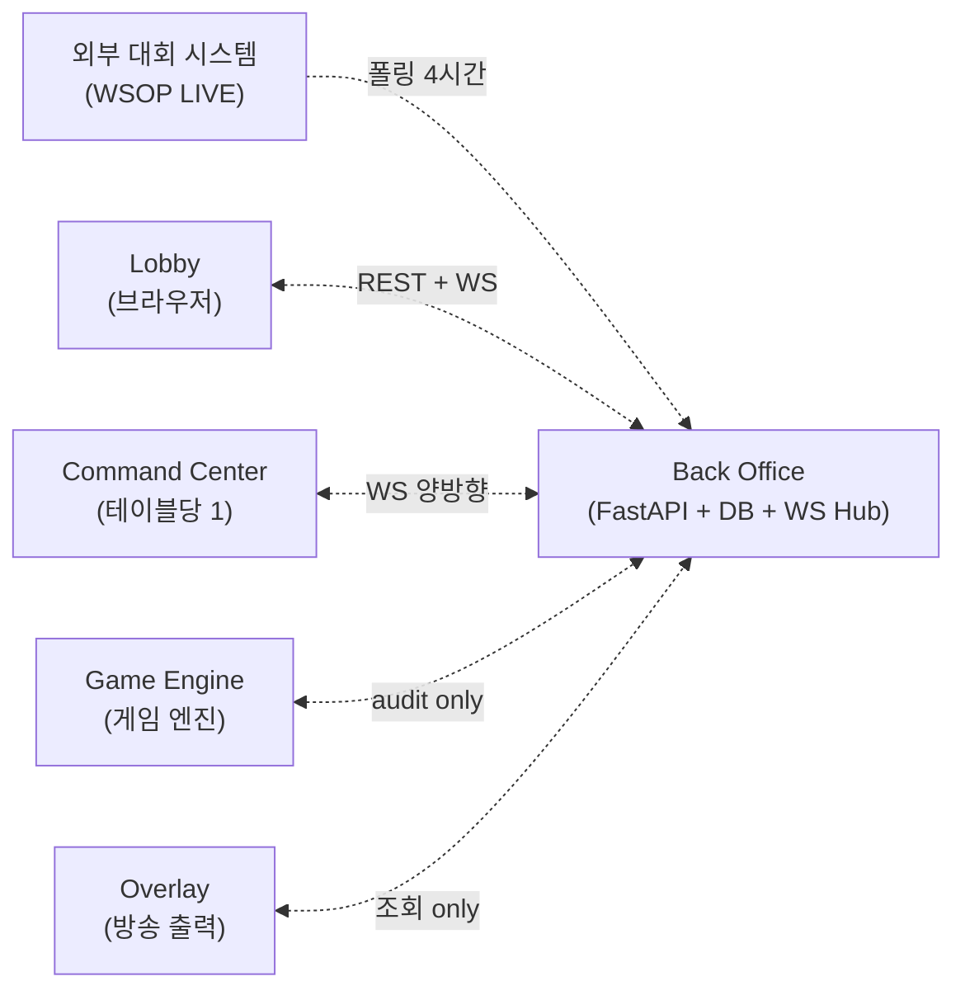
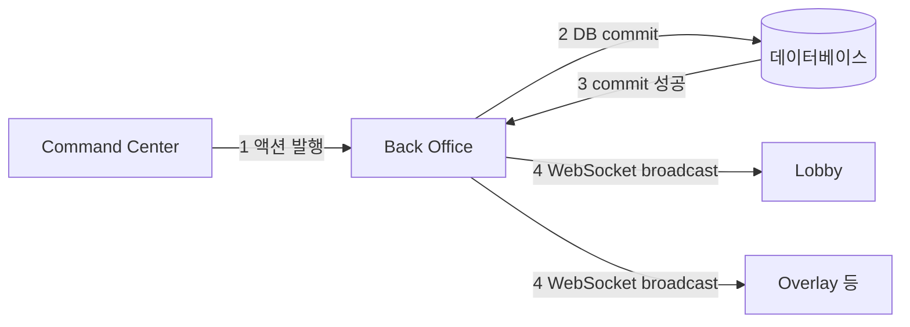
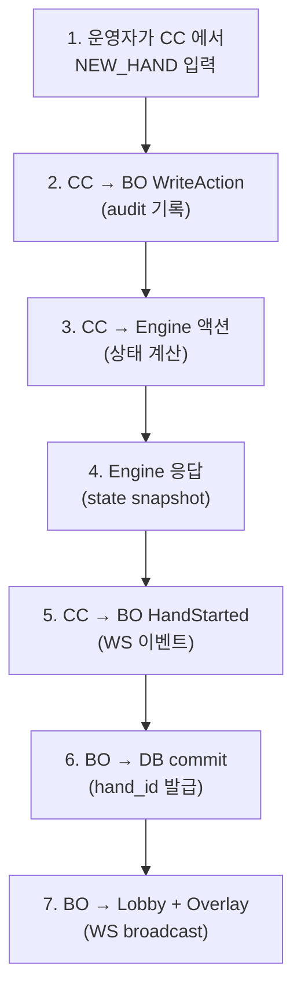
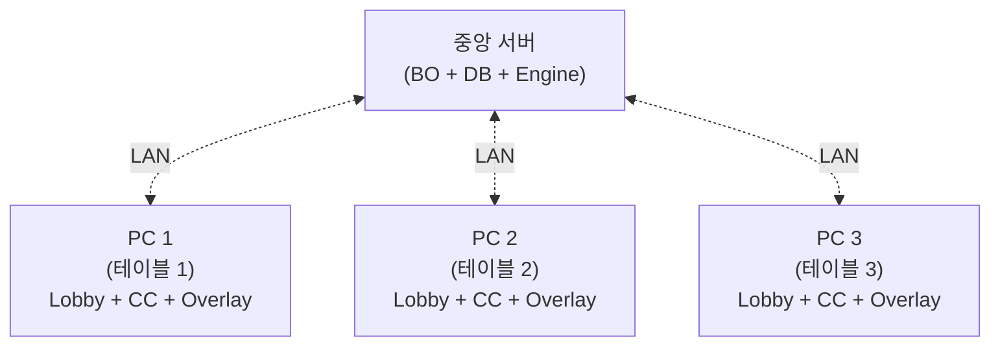

# Back Office — 보이지 않는 뼈대

> **Version**: 1.0.0
> **Date**: 2026-05-04
> **문서 유형**: 외부 인계용 PRD (Product Requirements Document)
> **대상 독자**: 외부 개발팀, 경영진, PM, 백엔드 시스템에 관심 있는 누구나
> **범위**: Back Office 의 역할·책임·통신·데이터·운영. 기술 디테일은 `2. Development/2.2 Backend/Back_Office/Overview.md` 정본 참조.

---

## 목차

**Part I — 정체성: BO 가 무엇인가**

- [Ch.1 — 보이지 않는 뼈대](#ch1--보이지-않는-뼈대) — 카메라가 보이지 않는데 누가 데이터를 옮기는가?
- [Ch.2 — 데이터의 4 갈래 흐름](#ch2--데이터의-4-갈래-흐름) — BO 가 누구와 어떻게 통신하는가
- [Ch.3 — DB 는 단일 진실](#ch3--db-는-단일-진실) — 왜 모든 길이 BO 를 거치는가

**Part II — 책임: BO 가 무엇을 하고 무엇을 안 하는가**

- [Ch.4 — BO 가 보관하는 9 영역](#ch4--bo-가-보관하는-9-영역) — 사용자 / 대회 / 테이블 / 핸드 ...
- [Ch.5 — BO 가 일부러 안 하는 13 가지](#ch5--bo-가-일부러-안-하는-13-가지) — 금융 / KYC / 결제 ...

**Part III — 운영: BO 가 어떻게 돌아가는가**

- [Ch.6 — 1 PC vs N PC 중앙 서버](#ch6--1-pc-vs-n-pc-중앙-서버) — 단일 테이블 vs 복수 테이블 운영
- [Ch.7 — 성능과 신뢰의 약속](#ch7--성능과-신뢰의-약속) — SLO 5 항목
- [Ch.8 — 후편집을 위한 데이터](#ch8--후편집을-위한-데이터) — 핸드 JSON 수확

---

## Ch.1 — 보이지 않는 뼈대

포커 방송을 보고 있을 때, 시청자의 눈에 들어오는 것은 두 가지입니다. 카드가 펼쳐지는 테이블 위 풍경과, 화면 한 켠에서 명멸하는 승률 그래픽. 그 사이 어딘가에서 누군가는 RFID 카드를 인식해 데이터로 변환하고, 누군가는 다음 핸드의 블라인드 구조를 미리 계산하고, 누군가는 시청률 통계를 위한 핸드 기록을 저장합니다.

> **이 모든 일을 조용히 떠받치는 것이 Back Office (BO) 입니다.**


화면 위에서는 한 번도 모습을 드러내지 않지만, BO 가 멈추는 순간 모든 것이 멈춥니다.

### 1.1 비유 — BO 가 사라진 세상

가게 한 곳을 상상해 보세요. 손님(시청자)이 보는 것은 진열대(오버레이)와 점원(운영자)뿐입니다. 그러나 점원이 손님 주문을 받아 물건을 꺼내려면 창고가 필요하고, 창고에서 어떤 물건이 어디 있는지 기억하는 장부가 필요하고, 새 물건이 들어올 때 받아 정리하는 손이 필요합니다.

| 가게의 비유 | EBS 의 실제 |
|------------|-------------|
| 진열대 | 오버레이 (시청자가 보는 그래픽) |
| 점원 | 운영자 + Command Center |
| 창고 | BO 의 데이터베이스 |
| 장부 | BO 의 REST API + WebSocket 허브 |
| 새 물건 들어오는 손 | BO 의 외부 시스템 동기화 (WSOP LIVE) |

BO 는 창고이자 장부이자 손입니다. 화려한 진열대 뒤에서 오로지 데이터의 안전한 이동만을 책임집니다.

### 1.2 한 줄 정의

> **Back Office** = 외부 대회 시스템과 통신하여 정보를 받아오고, 게임 기록을 저장하며, 시스템 컴포넌트 간 데이터를 실시간으로 중계하는 **중앙 데이터 허브**.

(Foundation §Ch.4.2 #4 의 표현: "각 시스템 컴포넌트 간의 데이터를 실시간으로 중계하는 **뼈대 역할**".)

---

## Ch.2 — 데이터의 4 갈래 흐름

EBS 는 6 개의 기능 조각으로 구성됩니다 (Foundation §Ch.4): 로비 / 커맨드 센터 / 게임 엔진 / 백오피스 / 오버레이 뷰 / 카드 인식 하드웨어. 이 중 5 개의 소프트웨어 조각은 모두 BO 와 연결됩니다. 카드 인식 하드웨어 (RFID) 만이 직접 BO 와 통신하지 않고 커맨드 센터를 거칩니다.



### 2.1 4 갈래 흐름

| 흐름 | 출발 → 도착 | 프로토콜 | 의미 |
|------|------------|:--------:|------|
| **(가) 외부 → BO** | WSOP LIVE → BO | REST 폴링 (4시간 주기) | 대회/시리즈/플레이어/블라인드 캐싱 |
| **(나) BO ↔ Lobby** | BO ↔ Lobby (브라우저) | REST + WebSocket | CRUD + 실시간 모니터링 |
| **(다) BO ↔ CC** | BO ↔ Command Center | WebSocket (양방향) | 액션 명령 + 이벤트 발행 + audit 보관 |
| **(라) BO ↔ Engine + Overlay** | 양방향 조회 | REST | Engine = 게임 상태 SSOT, Overlay = 디스플레이 조회 |

### 2.2 직접 연결 금지 원칙

위 다이어그램에서 한 가지가 빠져 있습니다. **Lobby 와 CC 는 직접 통신하지 않습니다**. Lobby 가 "테이블 #71 의 현재 상태" 를 알고 싶으면 CC 에게 묻는 것이 아니라, BO 에게 묻습니다. CC 가 "방금 운영자가 입력한 액션을 Lobby 도 알아야 한다" 고 판단하면 Lobby 에게 알리는 것이 아니라, BO 에게 알립니다.

> 모든 길은 BO 를 통합니다.

이 원칙 (Foundation §Ch.6.3) 이 EBS 의 가장 중요한 설계 결정입니다. 다음 챕터가 그 이유를 설명합니다.

---

## Ch.3 — DB 는 단일 진실

### 3.1 왜 직접 연결을 금지하는가

만약 Lobby 가 CC 와 직접 통신한다고 가정해 봅시다. 한 운영자가 CC 에서 "선수 A 가 폴드" 를 입력하면, CC 는 즉시 Lobby 에게 알립니다. 동시에 BO 에게도 알립니다. 그런데 만약 CC 가 BO 에게 알리는 데 실패했다면? Lobby 는 알고 있는데 BO 의 데이터베이스에는 기록되지 않은 상태가 됩니다. 다음 핸드를 시작하면 어떻게 될까요?

```
  +-----------+  실패한 직접 연결 모델          +-----------+
  |   Lobby   |--<-A 폴드->-+                  |    CC     |
  +-----------+             |                  +-----------+
                            v                        |
                       +---------+ <- ❌ 실패 ----- |
                       |   BO    |
                       +---------+
                       (DB 에는 폴드 없음)
                       (Lobby 는 폴드 알고 있음)
                       (시스템 분열)
```

### 3.2 단일 진실 (DB SSOT) 원칙

EBS 는 이 위험을 봉쇄하기 위해 단일 원칙을 채택합니다:

> **DB = SSOT (Single Source of Truth)**.
> 모든 상태 변경은 BO 의 DB 에 commit 된 후에만 valid 하다.



상태 변경은 4 단계로만 진행됩니다:

1. CC 가 BO 에게 액션 발행 (WebSocket)
2. BO 가 DB 에 commit
3. commit 성공 응답
4. BO 가 모든 구독자에게 WS broadcast

만약 2 단계 (DB commit) 가 실패하면, 4 단계 (broadcast) 도 실행되지 않습니다. **시스템은 분열되지 않습니다** — 모두가 모르거나, 모두가 압니다.

### 3.3 Engine 만이 다른 SSOT

DB 가 SSOT 라는 원칙에 한 가지 예외가 있습니다. 게임 상태 (현재 카드, 팟, 베팅 라운드, 누가 다음 액션 차례인가) 의 SSOT 는 **Game Engine 응답** 입니다 (Foundation §Ch.6.3 §1.1.1).

| 데이터 | SSOT | 이유 |
|--------|:----:|------|
| 사용자 / 대회 / 테이블 / 좌석 / 핸드 기록 | **DB (BO)** | 영구 보관 + 외부 시스템 동기화 |
| 게임 진행 상태 (카드, 팟, 라운드) | **Engine 응답** | 22 종 포커 규칙의 unique 진실 |
| 화면에 그릴 21 OutputEvent | **Engine 응답** | 애니메이션 트리거의 결정자 |

CC 가 운영자 액션을 처리할 때, BO 와 Engine 양쪽에 동시에 dispatch 합니다 (Foundation §Ch.6.3 §1.1.1). **Engine 응답을 진실로 받아들이고, BO WS 응답은 audit 참고값으로 사용**합니다. 둘이 다르면? Engine 이 이깁니다.

---

## Ch.4 — BO 가 보관하는 9 영역

BO 의 데이터베이스에 무엇이 저장되어 있는지가 BO 의 정체성입니다. 외부 (WSOP LIVE) 에서 받아오는 데이터, EBS 가 직접 만들어내는 데이터, 그리고 운영 흐름에서 자연스럽게 발생하는 데이터의 세 종류로 나눌 수 있습니다.

### 4.1 외부 시스템에서 받아오는 데이터 (5 영역)

```
  +-----+------------------+---------------+--------------------+
  | 영역 | 무엇             | 출처          | 용도               |
  +-----+------------------+---------------+--------------------+
  | 1   | Series           | WSOP LIVE     | 대회 시리즈 정보    |
  | 2   | Event            | WSOP LIVE     | 개별 토너먼트       |
  | 3   | Flight           | WSOP LIVE     | 한 Event 의 Day 분리 |
  | 4   | Player Profile   | WSOP LIVE     | 이름/국적/사진       |
  | 5   | Blind Structure  | WSOP LIVE     | 블라인드 구조 + 일정 |
  +-----+------------------+---------------+--------------------+
```

WSOP LIVE 와의 연동이 끊어지더라도 시스템은 멈추지 않습니다. BO 는 마지막으로 받아온 데이터를 내부 DB 에 보관하고 있으며, 운영자가 **수동 폴백** 으로 직접 입력할 수도 있습니다 (Lobby 의 "+ New Series", "+ New Event" 버튼).

### 4.2 EBS 가 직접 만드는 데이터 (4 영역)

```
  +-----+------------------+----------------+----------------------+
  | 영역 | 무엇             | 만드는 곳      | 의미                 |
  +-----+------------------+----------------+----------------------+
  | 6   | Table            | 운영자 (Lobby) | 방송할 테이블 9 좌석 |
  | 7   | Hand             | CC 액션        | 핸드 1 회 = 카드+액션|
  | 8   | Hand Statistics  | BO 자동        | VPIP / PFR / AGR     |
  | 9   | Audit Log        | BO 자동        | 운영자 액션 이력      |
  +-----+------------------+----------------+----------------------+
```

이 4 영역이 **EBS 만의 자산** 입니다. WSOP LIVE 의 다른 시스템에는 없거나 별도 시스템으로 처리되는 데이터로, 방송 라이브 운영의 결과물입니다.

### 4.3 한 핸드의 데이터 흐름

핸드 한 회가 진행되는 동안 BO 는 어떤 데이터를 만지는지 따라가 봅시다.



이 7 단계가 매 핸드, 매 액션마다 반복됩니다. 12 시간 방송 한 회에 약 800~1,200 핸드가 진행되며, 각 핸드는 평균 20~40 액션을 포함합니다. 즉 BO 는 하루에 16,000~48,000 회 commit 을 처리합니다.

---

## Ch.5 — BO 가 일부러 안 하는 13 가지

BO 의 정체성은 "무엇을 하는가" 만큼 "무엇을 일부러 안 하는가" 로 정의됩니다.

EBS 는 WSOP LIVE 의 Staff Page 백오피스 시스템을 벤치마크로 삼아 출발했습니다. WSOP LIVE Staff Page 의 22 개 기능 영역을 분석한 결과, **9 개를 채택**하고 **13 개를 의도적으로 제거**했습니다.

### 5.1 채택한 9 영역 (Ch.4 의 9 영역)

이미 본 챕터 4 에서 본 9 영역 — 인증/대회/이벤트/테이블/플레이어/핸드/통계/감사로그/외부동기화.

### 5.2 의도적으로 제거한 13 영역

```
  +----+----------------+----------------------------------+
  |  # | 제거 영역      | 제거 이유                        |
  +----+----------------+----------------------------------+
  | 1  | Registration   | 토너먼트 운영 (선수 등록/리엔트리)|
  | 2  | Cashier        | 금융 (칩 매매·환불)              |
  | 3  | Payment        | 금융 (결제·Payout·Prize Pool)    |
  | 4  | Bounty         | 금융 (바운티 트랜잭션)            |
  | 5  | Wallet/Credit  | 금융 (플레이어 잔액)             |
  | 6  | Report (재정)  | 금융 리포팅 (캐셔/티켓/수수료)   |
  | 7  | KYC            | 규정 (본인 확인·연령 제한)        |
  | 8  | Promotion      | 마케팅                           |
  | 9  | Subscription   | 구독 서비스                      |
  | 10 | HallOfFame     | 콘텐츠                           |
  | 11 | Dealer         | 인력 관리                         |
  | 12 | ExtraGame      | 사이드 이벤트                     |
  | 13 | Halo           | 외부 서비스 연동                  |
  +----+----------------+----------------------------------+
```

### 5.3 제거의 철학 — EBS 는 방송 시스템

> EBS 는 **실시간 방송 운영** 에 집중합니다. 토너먼트 운영, 금융, 규정 준수, 마케팅, 인력 관리는 다른 시스템 (WSOP LIVE Staff Page 본체) 의 책임입니다.

이 분리 덕분에 BO 의 데이터 모델은 가볍습니다. 9 영역 (사용자/대회/이벤트/테이블/플레이어/핸드/통계/감사/외부동기) 만으로 모든 책임을 다합니다. 새 기능 요청이 들어왔을 때 가장 먼저 묻는 질문은 "이것이 실시간 방송 운영에 필요한가?" 이며, 대답이 "아니오" 라면 BO 의 범위 밖입니다.

이 원칙은 외부 개발팀이 시스템을 인계받았을 때 가장 먼저 이해해야 할 점입니다. EBS 는 작은 시스템이지만, 작은 만큼 명확합니다.

---

## Ch.6 — 1 PC vs N PC 중앙 서버

EBS 의 운영 환경은 두 가지 형태가 있습니다 (Foundation §Ch.8.5).

### 6.1 단일 PC 운영 — 1 PC = 1 피처 테이블

```
  +-----------------------------+
  |  PC 1 (피처 테이블)          |
  |  +------+ +------+ +------+ |
  |  | 로비 | |  CC  | | 오버레이|
  |  +------+ +------+ +------+ |
  |  +-------+ +--------+       |
  |  |  BO   | | Engine |       |
  |  +-------+ +--------+       |
  +-----------------------------+
            |
            v RFID + SDI/NDI 직결
       방송 송출
```

테이블 1 개를 방송할 때는 모든 컴포넌트가 단일 PC 에 함께 동작합니다. BO 와 Engine 도 같은 PC 의 별도 프로세스로 기동됩니다. 하드웨어 제약이 명확합니다 — 캡처 카드, SDI/NDI 출력 장비, RFID USB 리더는 동일 PC 에 직접 연결되어야 합니다.

### 6.2 복수 테이블 운영 — N PC + 중앙 서버



복수 테이블을 동시에 방송할 때는 **중앙 서버 1 대 + N 개 테이블 PC** 구조로 확장됩니다. BO 와 DB 와 Engine 은 중앙 서버에 모이고, 각 테이블 PC 는 LAN 을 통해 BO API 에 접속합니다. 한 Lobby (브라우저) 에서 모든 테이블의 상태를 동시 관제할 수 있습니다.

이 구조의 핵심은 **중앙 서버가 단일 진실 (DB SSOT)** 이라는 점입니다. 어떤 테이블 PC 에서 발생한 액션이든 중앙 서버 DB 에 commit 된 후에야 다른 테이블 PC 에 broadcast 됩니다.

### 6.3 중앙 서버의 SPOF 위험

중앙 서버가 하나라는 사실은 단일 장애 지점 (SPOF — Single Point Of Failure) 을 의미합니다. 중앙 서버가 다운되면 모든 테이블 PC 가 영향을 받습니다.

이 위험을 완화하기 위한 시나리오는 별도 운영 문서에서 다룹니다 (`docs/4. Operations/Network_Deployment.md`):
- LAN 단절 시 테이블 PC 의 로컬 모드 (CC 만 제한 동작)
- 중앙 서버 다운 시 자동 백업 복원 시도
- DB 손상 시 마지막 정상 snapshot 복원

> 여기서 명시할 점은 운영 환경이 **단일 PC** 와 **중앙 서버** 두 모드 모두를 지원한다는 사실 자체입니다. 외부 개발팀은 두 시나리오 모두를 구현해야 합니다.

---

## Ch.7 — 성능과 신뢰의 약속

BO 가 외부 stakeholder 에게 제시하는 SLO (Service Level Objective) 는 5 항목입니다.

### 7.1 5 SLO

```
  +-------------------------+----------+----------+-------------+
  | 항목                    | 목표      | 출처     | 비고         |
  +-------------------------+----------+----------+-------------+
  | WebSocket push 지연     | < 100ms  | §6.4 SLO | 실시간 갱신 |
  | DB snapshot 응답         | < 200ms  | §6.4 SLO | 95th         |
  | REST API 응답            | < 200ms  | —        | 95th         |
  | DB 쓰기 처리량           | 50+/sec  | —        | 핸드 burst   |
  | 가동 시간 (방송 중)      | 99.5%    | —        | 다운타임 0   |
  +-------------------------+----------+----------+-------------+
```

### 7.2 100ms 약속의 의미

WebSocket push 지연 < 100ms 는 EBS 의 가장 강한 약속입니다. 운영자가 CC 에서 액션을 입력한 순간부터 Lobby 화면에 갱신이 보일 때까지 0.1 초 미만이어야 합니다.

> 이 약속은 Foundation §Ch.1.4 의 미션 선언문 ("0.1초의 번역가") 과 연결됩니다.

100ms 가 깨지면 운영자는 자신의 입력이 시스템에 들어갔는지 확신할 수 없습니다. 동일 액션을 다시 입력하거나 (중복 발행 위험), 다른 액션을 추가로 입력합니다 (시스템 분열 위험). 이 위험을 봉쇄하는 1 차 방어선이 100ms WS push 약속입니다.

### 7.3 crash 복구 — 5 초 내 baseline 재로드

운영 중 CC 또는 Lobby 프로세스가 crash 한다면? **5 초 안에 baseline 을 재로드** 합니다.


이 패턴 덕분에 운영자가 crash 을 거의 인지하지 못합니다. 화면이 1~2 초 멈췄다 다시 살아나는 정도입니다.

### 7.4 한계와 정직한 약속

EBS 는 99.999% (5 nines) 같은 거대 서비스 약속은 하지 않습니다. **방송 시간 내 99.5%** 입니다. 12 시간 방송 한 회 기준 약 3.6 분의 다운타임이 허용됩니다. 그 이상이면 백업 운영 시나리오 (Network_Deployment.md) 가 발동됩니다.

이 정직한 약속이 외부 stakeholder 에게는 더 신뢰할 만합니다. 도달 가능한 목표만 약속합니다.

---

## Ch.8 — 후편집을 위한 데이터

BO 의 마지막 책임은 **방송이 끝난 후** 의 데이터입니다.

### 8.1 핸드 JSON 수확

방송 중 BO 의 DB 에는 모든 핸드의 카드/액션/팟/승자/타이밍 정보가 저장됩니다. 12 시간 방송 한 회 기준 800~1,200 핸드 분량입니다.

방송이 끝나면 이 핸드 데이터가 **JSON 파일로 추출** 되어 후편집 스튜디오로 전송됩니다 (Foundation §Ch.6.2 #3 "데이터 보관소").

```
  +------------------+
  | hand_47.json     |
  +------------------+
  | game             |
  | players[]        |
  | board[]          |
  | actions[]        |
  | pots[]           |
  | winners[]        |
  | timing           |
  +------------------+
```

### 8.2 후편집의 의미

수확된 핸드 JSON 은 다음과 같은 후편집 작업의 핵심 재료가 됩니다:

| 후편집 작업 | 재료 |
|------------|------|
| 하이라이트 영상 | actions + timing + winners |
| 통계 그래픽 | players + 누적 statistics |
| 인터뷰 영상 컷팅 | timing + 핸드 ID 매핑 |
| 다국어 자막 | 핸드 흐름 텍스트 변환 |

EBS 의 라이브 운영이 끝났더라도 그 데이터는 다음 며칠~몇 주 동안 후편집 스튜디오에서 계속 활용됩니다. BO 의 데이터 보관 책임은 방송 시간을 넘어서 지속됩니다.

### 8.3 외부 인계 시점

외부 개발팀에게 EBS 를 인계할 때, BO 의 가장 중요한 산출물은 **JSON Export 기능** 입니다. 라이브 방송 운영 자체는 EBS 의 한 부분일 뿐이고, 그 다음 며칠 동안 활용될 데이터의 **추출과 호환성** 이 EBS 의 진짜 가치입니다.

기술 디테일 (JSON schema, 필드 정의, 추출 트리거) 은 정본 `docs/2. Development/2.2 Backend/Back_Office/Overview.md §3.5 핸드 기록` 을 참조하시기 바랍니다.

---

## 더 깊이 알고 싶다면

| 주제 | 정본 문서 |
|------|----------|
| BO 전체 통합 비전 | `Foundation.md §Ch.4.2`, `§Ch.6.2`, `§Ch.6.3`, `§Ch.6.4` |
| BO 기능 명세 + 채택/제거 매트릭스 | `2. Development/2.2 Backend/Back_Office/Overview.md` |
| REST API 카탈로그 | `2. Development/2.2 Backend/APIs/Backend_HTTP.md` |
| WebSocket 이벤트 카탈로그 | `2. Development/2.2 Backend/APIs/WebSocket_Events.md` |
| 데이터 모델 (DB 스키마) | `2. Development/2.2 Backend/Database/Schema.md` |
| 인증·세션·RBAC | `2. Development/2.2 Backend/APIs/Auth_and_Session.md` |
| 운영 / 동기화 / 복수 테이블 | `2. Development/2.2 Backend/Back_Office/Operations.md` |

---

## Changelog

| 날짜 | 버전 | 변경 |
|------|:---:|------|
| 2026-05-04 | 1.0.0 | prototype 작성 — Foundation 톤 + 이미지 중심 + 8 챕터 (Part I 정체성 / II 책임 / III 운영). 정본 = `Back_Office/Overview.md` (1179줄 internal) + `Foundation.md` 외부 친화 재가공. SSOT 위반 회피 = frontmatter `derivative-of` + `if-conflict: derivative-of takes precedence`. |
