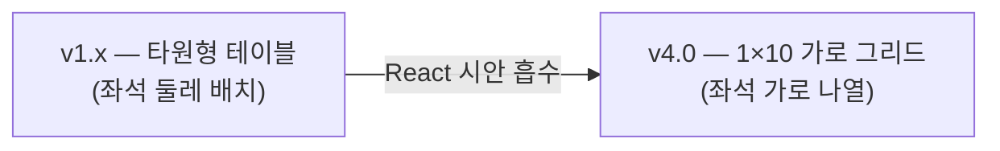
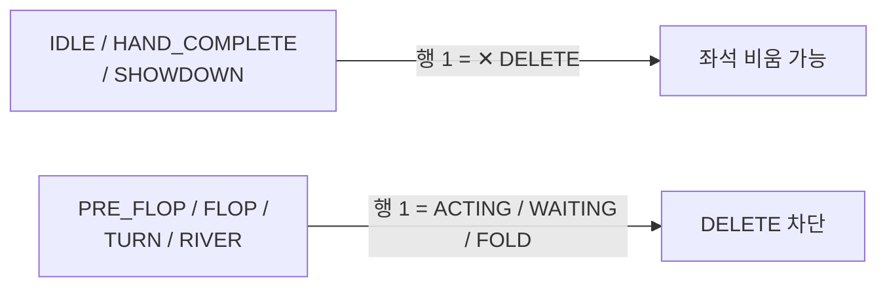
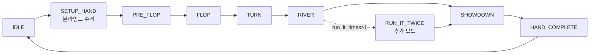
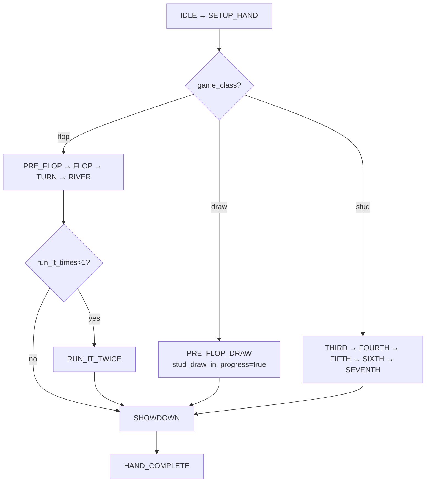
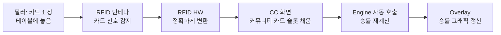
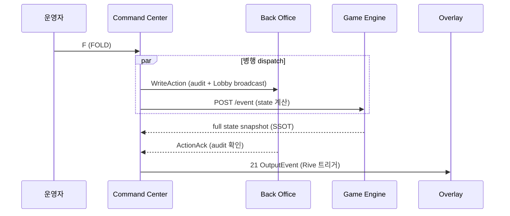
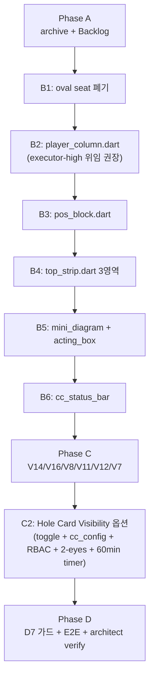
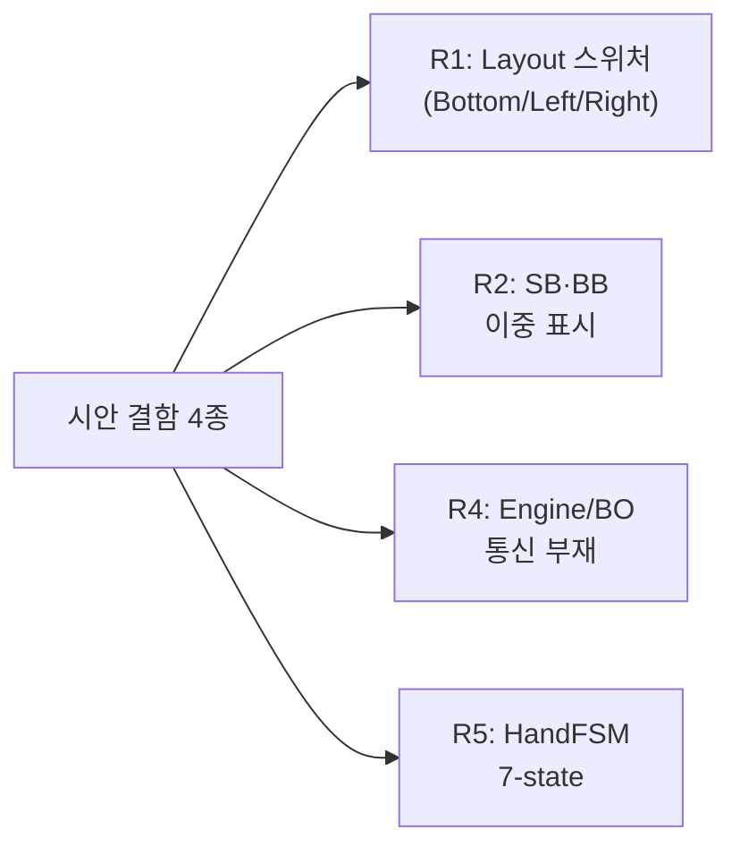

# Command Center — 운영자가 머무는 조종석

> **v4.0 (2026-05-07) — Reader Panel critic 16 fix cascade**
>
> v3.0 의 16 결함 (C 4 + H 4 + M 5 + L 3) 정합. 숫자 fact-check / 5 vs 6 키 모순 / R3 보안 보강 / G1 runtime 가드 / 약어 첫 등장 풀이 / 1×10 trade-off honest / AT 8 화면 / 매트릭스 단일화 / 비유 정리 / D7 정본 인용 등.
>
> 본 PRD 의 모든 스크린샷은 React 시안을 Playwright 1600×900 캔버스에 렌더링하여 캡처 (15 종, 다크 broadcast 톤). **EBS 최종 구현은 Broadcast Dark Amber OKLCH 톤** — HTML 참고자료 `docs/mockups/EBS Command Center/tokens.css` 가 디자인 SSOT. 색상 / 타이포 / 애니메이션 모두 정합 (v4.3, 2026-05-13). Lobby 톤과의 차이는 별도 cycle 처리.

---

## 한 줄 요약

> 12 시간 본방송 한 회 동안 한 운영자가 마주하는 화면. 10 명의 선수가 가로로 한 줄에 늘어서 있고, 6 개의 키 (N · F · C · B · A · M) 가 핸드 진행의 모든 버튼을 동적으로 대신한다. **타원형 테이블이 사라지고 1×10 그리드가 들어선 것** — 이것이 v4.0 의 가장 큰 변화다.


*↑ 운영자가 자리에 앉기 직전의 IDLE 화면. 4 영역이 위계적으로 배치 — StatusBar(52px) → TopStrip(158px) → PlayerGrid(1×10 가로) → ActionPanel(124px).*

---

## 목차

| 챕터 | 한 줄 |
|------|------|
| [Ch.1 — 4 영역](#ch1--4-영역) | 4 영역의 위계 + 1×10 패러다임 전환 (장단점 모두) |
| [Ch.2 — StatusBar (52px)](#ch2--statusbar-52px--위쪽-계기판) | 한 줄 안의 시스템 전체 |
| [Ch.3 — TopStrip (158px)](#ch3--topstrip-158px--응시의-중심) | MiniDiagram + Board + ACTING |
| [Ch.4 — PlayerGrid (1×10)](#ch4--playergrid-1x10--가로로-늘어선-10-명) | 1×10 의 9 행 stacked |
| [Ch.5 — ActionPanel (124px)](#ch5--actionpanel-124px--6-키의-영역) | 6 키 + Phase-aware |
| [Ch.6 — 9 단계의 파동 (HandFSM)](#ch6--9-단계의-파동-handfsm) | 핸드 lifecycle |
| [Ch.7 — RFID, 손이 닿지 않는 카드 인식](#ch7--rfid-손이-닿지-않는-카드-인식) | 자동 인식 |
| [Ch.8 — 실수의 정정](#ch8--실수의-정정-undo--miss-deal) | UNDO + Miss Deal |
| [Ch.9 — 한 클릭의 합주](#ch9--한-클릭의-합주-engine--bo--overlay) | Orchestrator |
| [Ch.10 — Hole Card Visibility (D7 + R3 옵션화)](#ch10--hole-card-visibility-d7--r3-옵션화) | 가시성 옵션 + 보안 |
| [Ch.11 — Lobby 와 같은 디자인 톤 (Q2)](#ch11--lobby-와-같은-디자인-톤-q2) | 디자인 통일 |
| [Ch.12 — 외부 개발팀 구현 가이드](#ch12--외부-개발팀-구현-가이드) | widget + AT 8 화면 |
| [Ch.13 — 사용자 결정 Q1~Q4](#ch13--사용자-결정-q1q4) | 결정 매트릭스 |
| [Ch.14 — 거절 매트릭스 R1/R2/R4/R5](#ch14--거절-매트릭스-r1r2r4r5) | 거절 사유 |
| [Ch.15 — 시각 자산 17 종 (V1~V17)](#ch15--시각-자산-17-종-v1v17) | 흡수 자산 카탈로그 (V18 sync icon = §16.12) |
| [Ch.16 — Mockup State Model 정합 (SG-037)](#ch16--mockup-state-model-정합-sg-037) | 13 부절 + 외부 개발팀 체크리스트 12 항 |
| [Ch.17 — Mockup Layout & Component Verbatim (SG-037-c)](#ch17--mockup-layout--component-verbatim-sg-037-c) | App.jsx / PlayerColumn / Numpad / CardPicker / MissDealModal / tokens.css / data.js — raw source inline |
| [EPILOGUE](#epilogue--본방송-종료-후) | 본방송 종료 후 |

---

## Ch.1 — 4 영역

### 1.0 한 화면 한 운영자

화면을 처음 보는 사람의 눈이 가장 먼저 닿는 곳은 4 영역의 *위계* 다.


*↑ NEW HAND 후 PRE_FLOP 진입. 4 영역의 높이가 고정되어 위계가 한눈에.*

> 💡 **약어 풀이 — 첫 등장**:
> - **CC** = Command Center. 본 PRD 의 주제.
> - **Engine** = Game Engine. 22 종 포커 규칙의 unique 진실. CC 액션이 *합법한지* 판정.
> - **BO** = Back Office. audit 로그 + Lobby 브로드캐스트. *영구 보관* 과 *실시간 분산* 책임.
> - **Overlay** = 시청자 화면 그래픽. 21 종 OutputEvent 가 Rive 애니메이션을 트리거.
> - **Rive** = 벡터 애니메이션 런타임 (`.riv` 파일). 시청자 화면의 모든 동적 그래픽이 Rive 로 그려진다.

### 1.1 4 영역의 분담

화면은 위에서 아래로 4 영역. 각 영역은 *변화 빈도* 가 다르고, 그에 맞춰 *시선 빈도* 도 다르다.

| 영역 | 높이 | 변화 빈도 (이벤트) | 시선 빈도 (운영자) | 핵심 정보 |
|------|:----:|:-----------------:|:-----------------:|----------|
| **StatusBar** | 52px | 거의 안 변함 (수 분) | 5 초마다 곁눈 | BO/RFID/Engine 연결 + Hand # + Phase |
| **TopStrip** | 158px | 액션마다 (수 초) | 매 액션 후 | MiniDiagram + Community Board + ACTING |
| **PlayerGrid** | 가변 1fr | 액션마다 (수 초) | 핸드 진행 중 지속 | 10 명의 선수 (1×10 가로 그리드) |
| **ActionPanel** | 124px | 운영자 입력 (수 초) | 매 액션 발사 직전 | 6 키 (5 게임 + 1 비상) + START/FINISH HAND |

> ★ **위계의 의미**: 상단으로 갈수록 *변화 빈도가 낮은* 정보 (시스템 상태). 하단으로 갈수록 *고빈도 입력* (액션 패널). 운영자는 본방송 시간 동안 이 위계를 *근육 기억* 으로 흡수한다.

### 1.2 v1 (oval) → v4 (1×10) 패러다임 전환

이전 EBS PRD (v1.x) 는 화면 중앙에 **타원형 테이블** 을 그렸고, 10 좌석을 그 둘레에 배치했다. v4.0 은 이 구조를 버리고 **1×10 가로 그리드** 로 전환했다.



#### 장점

| 장점 | 의미 |
|------|------|
| 좌석 비교 용이 | 가로 정렬로 스택 차이 / 액션 패턴 한눈 |
| 정보 밀도 ↑ | 9 행 stacked 로 한 셀에 풀 정보 |
| 인지 모드 단순화 | *공간 위치* → *순차 번호* (S1~S10) |
| 키보드 ↔ 마우스 왕복 ↓ | 모든 행이 클릭 편집 가능 |

#### 단점 (honest)

| 단점 | 영향 |
|------|------|
| **실 테이블 시각 mismatch** | 카지노 oval 테이블과 화면 grid 가 다름 — 무전 "좌측 끝 선수" 같은 *위치 표현* 이 grid 에서 모호 |
| **공간 인지 왜곡** | 실제 oval 에서 정면 마주보는 S5 ↔ S6 가 grid 에서는 *인접 셀* — 운영자 멘탈 모델 재학습 필요 |
| **MiniDiagram 의존도 ↑** | 잃어버린 공간 관계를 회복하려 좌측 미니 oval (Ch.3.1) 에 의존 — 인지 두 곳 분리 |
| **운영자 재훈련 비용** | 기존 oval CC 운영자는 신규 grid 모델로 *근육 기억* 재학습 필요 (수 일 ~ 수 주) |

> ★ **결정 근거**: 시안이 1×10 grid 로 갔고, 정보 밀도 + 비교 용이성이 단점을 상쇄한다고 사용자 결정 (Q1, 2026-05-07). 단점은 MiniDiagram (V3) + Position Shift Arrows (V4) 로 부분 보강.

이 전환이 v4.0 의 가장 큰 결정이다. 다음 챕터부터는 4 영역을 차례로 들여다본다.

---

## Ch.2 — StatusBar (52px) — 위쪽 계기판

화면 가장 위 52 픽셀, 한 줄. 비행기 조종석으로 비유하면 **천장에 가까운 계기판** 에 해당한다. 평소엔 시야에서 사라지지만, 어떤 dot 하나가 빨갛게 깜빡이는 순간 운영자의 동공이 그쪽으로 휙 돌아간다.


*↑ StatusBar 52px. 좌(연결 상태) · 중(게임 메타) · 우(보조 도구) 3 영역.*

### 2.1 좌 / 중 / 우의 분담

| 영역 | 표시 | 변화의 트리거 |
|------|------|--------------|
| **좌측** | ●BO ●RFID ●Engine + Op 이름 + Table 이름 | dot 색상 변화 + 펄스 |
| **중앙** | Hand # + PHASE + NLH 200/400/50 + Lvl 12 | PHASE 박스 색 (IDLE 회색 ↔ LIVE accent) |
| **우측** | Players 7/8 + 🏷 (tag) 👁 (hide GFX) ⚙ (Settings) | 운영자 클릭 |

### 2.2 dot 한 점이 말해 주는 3 가지

| dot 색상 | 의미 | 운영자 행동 |
|:-------:|------|-----------|
| ● 녹 (`var(--ok)`) | 정상 — 연결 OK | 무시 (정상은 시야에서 사라진다) |
| ● 주 (`var(--warn)`) | 경고 — 재연결 시도 중 | 곁눈으로 모니터 |
| ● 적 + 펄스 (`var(--err)`) | 오류 — 즉시 개입 | 시선 즉시 끌림 |

> ★ **디자인 원칙**: *정상은 보이지 않게, 비정상만 보이게*. 본방송 운영의 피로를 가장 직접적으로 줄이는 디자인.

---

## Ch.3 — TopStrip (158px) — 응시의 중심

StatusBar 가 *위쪽 계기판* 이라면 TopStrip 158 픽셀은 **계기판 + 헤드업 디스플레이 + 부조종사 알림** 이 합쳐진 곳. 운영자의 *눈높이* 영역.


*↑ TopStrip 158px. 시선이 자연스럽게 좌→중→우로 흐른다.*

### 3.1 좌측 — MiniDiagram + POT 박스 (V3 + V10)


작은 타원 + 10 dots + D/SB/BB 뱃지 + POT 강조 박스. **1×10 그리드로 잃은 *공간 관계* 를 다시 회복** 시키는 핵심 위젯 (Ch.1.2 단점 보강).

| 요소 | 시각 |
|------|------|
| 타원 | felt 색상 (Q2 적용 시 회색-검정) |
| 10 dots | 점거 = 채움 / fold = 회색 / action_on = accent + 펄스 |
| D / SB / BB 뱃지 | dot 옆 작은 사각형 라벨 |
| POT 박스 | accent border + 큰 숫자 (예: $19,500) |
| `to call` 라인 | 현재 콜 금액 (action_on 좌석 기준) |

> ⚠️ **R2 거절 처리** (§Ch.14): SB/BB 정보가 PlayerColumn (편집 source) + MiniDiagram (read-only mirror) 두 곳에 표시되지만, **편집은 PlayerColumn 만**. MiniDiagram 의 dot 옆 뱃지는 표시만 (클릭 무시).

### 3.2 중앙 — Community Board (V8)


5 슬롯이 항상 표시. **빈 슬롯은 라벨로 명시** — FLOP 1 / FLOP 2 / FLOP 3 / TURN / RIVER. 채운 슬롯은 카드 PNG.

> ★ 시안 이전엔 "Card 1~5" 라는 일반 라벨이었다. 새 라벨이 운영자 인지 부하를 줄인다.

### 3.3 우측 — ACTING 박스 (V6 + V9)


| 페이즈 | 박스 라벨 | 본문 | 메타 |
|--------|----------|------|------|
| **IDLE** | "WAITING" | "—" | "Press START HAND" |
| **PRE_FLOP / FLOP / TURN / RIVER** | "ACTING" | "S8 · Choi" | "Stack $72k" |
| **SHOWDOWN** | "SHOWDOWN" | "Reveal hands" | "Pot $19,500" |
| **HAND_COMPLETE** | "HAND OVER" | "Award pot" | "Press FINISH HAND" |

> ★ **이중 강조**: action_on 좌석은 PlayerGrid 에서 glow 펄스 + 우측 박스에 텍스트로도 명시 (V6+V9). 시청 거리 + 본방송 피로 모두 대응.

### 3.4 KeyboardHintBar (V1, ✅ 구현 완료)


TopStrip 하단 32px. 운영자가 자주 쓰는 6 키 (N · F · C · B · A · M) 를 칩으로 표시. 신규 운영자가 단축키를 외울 때까지의 *시각적 보조 바퀴*.

```
[N] new/finish   [F] fold   [C] chk/call   [B] bet/raise   [A] all-in   [M] miss deal
```

---

## Ch.4 — PlayerGrid (1×10) — 가로로 늘어선 10 명

이 영역이 v4.0 의 심장. 화면 중앙의 가로 그리드 안에 10 명의 선수가 한 줄로 정렬된다. 각 셀은 **9 행 stacked** 구조 — 한 셀 안에 *한 사람의 모든 정보* 가 수직으로 쌓인다.


*↑ S1~S4 close-up. 위에서 아래로 9 행. 한 사람의 *전체 상태* 가 한 셀에.*

### 4.1 PlayerColumn 9 행 — 한 셀 해부 (V5)

| 행 | 정보 | 클릭 동작 |
|:-:|------|-----------|
| 1 | Acting strip (ACTING / WAITING / FOLD) | (read-only) |
| 2 | Seat # (S1~S10, 큰 글씨) | tap → 좌석 비우기 (pre-hand 만) |
| 3 | Position block (3 sub-rows: STRADDLE / SB·BB / D + 화살표) | 화살표로 D/SB/BB/STR 좌·우 이동 (V4) |
| 4 | Country flag | tap → FieldEditor (국기 선택) |
| 5 | Name | tap → FieldEditor (텍스트) |
| 6 | Hole cards 2장 | **R3 옵션 ON 시** tap → CardPicker (face-up 설정 가능, §Ch.10) |
| 7 | Stack ($) | tap → FieldEditor (숫자) |
| 8 | Bet ($) | tap → FieldEditor (숫자) |
| 9 | Last action (FOLD/CALL/BET 등) | tap → 강제 override |

> ★ **9 행의 모든 정보가 클릭 한 번으로 편집 가능**. 본방송 운영 중 키보드 ↔ 마우스 왕복이 사라진다.

### 4.2 ACTING 좌석의 glow 펄스


action_on 좌석은 cell border 가 accent 색으로 펄스 한다. 가로 10 셀 중 *어디에 액션이 있는지* 가 일자 시선의 흐름 안에서 즉시 보인다.

### 4.3 빈 좌석 → ADD PLAYER affordance (V12)

빈 좌석은 **EMPTY + S{n} + "+ ADD PLAYER"** 표시. 클릭 시 FieldEditor 의 add 모드 진입 — 이름 / 국적 / 시작 스택을 입력.

### 4.4 Pre-hand DELETE strip (V15)

운영자가 핸드 진행 중 좌석을 실수로 비울 수 없도록, **Pre-hand 상태 (IDLE / HAND_COMPLETE / SHOWDOWN) 에서만** 행 1 의 ACTING strip 이 "✕ DELETE" 로 변환. 클릭 시 좌석 비움 + 포지션 마커 자동 제거.



### 4.5 Position Shift Arrows (V4)

PosBlock 의 각 행 (STRADDLE / SB·BB / D) 양 끝에 좌·우 화살표. **좌석 간 D/SB/BB/STR 마커를 즉시 이동 가능** — 게임 시작 직전 셋팅 변경 시 핵심.

```
  [‹ STR ›]   ← STRADDLE 마커를 좌/우 좌석으로 이동
  [‹ SB  ›]   ← SB 마커
  [‹ BTN ›]   ← Dealer 버튼
```

---

## Ch.5 — ActionPanel (124px) — 6 키의 영역

화면 하단 124 픽셀. 본방송 동안 운영자의 손가락이 머무는 영역. 8 분리 버튼이었던 시안 이전 시대가 끝나고, **6 키 (5 게임 + 1 비상)** 의 시대가 시작된다.


### 5.1 Phase-aware 버튼 (V14 — 시안의 가장 큰 선물)

같은 키, phase 에 따라 다른 의미. 손가락은 늘 같은 자리에 있고, *의미가 그 손가락 밑에서 알아서 바뀐다*.

| 단축키 | IDLE | PRE_FLOP & 베팅 활성 | SHOWDOWN / HAND_COMPLETE | 분류 |
|:------:|:----:|:--------------------:|:-----------------------:|:----:|
| **N** | START HAND | (disabled — "HAND IN PROGRESS") | FINISH HAND | 핸드 lifecycle |
| **F** | (disabled) | FOLD | (disabled) | 게임 액션 |
| **C** | (disabled) | CHECK *or* CALL (auto-switch) | (disabled) | 게임 액션 |
| **B** | (disabled) | BET *or* RAISE (auto-switch) | (disabled) | 게임 액션 |
| **A** | (disabled) | ALL-IN | (disabled) | 게임 액션 |
| **M** | (disabled) | Miss Deal | (disabled) | 비상 |

**자동 전환 룰**:
- `biggestBet == playerBet` → **CHECK** (콜할 게 없음)
- `biggestBet > playerBet` → **CALL** (맞춰야 함)
- `biggestBet == 0` → **BET** (첫 베팅)
- `biggestBet > 0` → **RAISE** (이미 베팅 있음)

> ★ **V14 의 가치**: *같은 키 = 같은 손가락 위치 = 다른 의미*. **단축키는 6 키 (N/F/C/B/A/M) + Ctrl+Z (UNDO) 로 모든 작업 가능**. 손가락은 알파벳을 외우지 않고, *위치* 를 외운다.

### 5.2 Numpad (BET/RAISE 입력) — V16

`B` 키를 누르면 화면 하단에 슬라이드 업.


| 키 | 동작 |
|:--:|------|
| 0~9 | 한 자리 추가 |
| **000** | 세 자리 추가 (1000 단위 빠른 입력) |
| **←** | 한 자리 지우기 |
| **← long-press 500ms** | 전체 클리어 |
| **Enter** | 확인 |
| **Esc** | 취소 |

> ★ **V16 의 가치**: 운영자가 "10000" 입력 시 1 → 0 → 0 → 0 → 0 (5 키) 대신 **1 → 0 → 000** (3 키). 한 입력당 약 0.7s → 0.4s 감축. 본방송 누적 효과는 액션 빈도에 비례하며, 외부 하드웨어 키패드도 자동 매핑.

### 5.3 좌측 보조 버튼

| 버튼 | 키 | 의미 |
|------|:--:|------|
| ↶ Undo | Ctrl+Z | 직전 액션 되돌리기 (현재 핸드 내 무제한) |
| ⊘ Miss Deal | M | 핸드 무효 + 스택 복구 |

---

## Ch.6 — 9 단계의 파동 (HandFSM)

핸드 한 회는 9 단계로 흐른다. 이 9 단계가 EBS 의 *시간 척도 가장 작은 단위* — HandFSM 9-state.



> 💡 **약어 풀이**: **HandFSM** = Hand Finite State Machine. 한 핸드가 거치는 *고정된 10 단계 흐름* (v4.4). *역행 불가* 보장 — IDLE 에서 PRE_FLOP 로만 갈 수 있을 뿐, FLOP 에서 PRE_FLOP 로 돌아갈 수 없다. 잘못된 입력을 *상태 자체* 가 차단한다.

> ⚠️ **R5 거절 처리** (§Ch.14): React 시안의 HandFSM 은 7-state (SETUP_HAND 누락). EBS 는 **10-state 보존** — 블라인드 수거 단계가 Rive 애니메이션 트리거에 필수.

> 🆕 **v4.4 RUN_IT_TWICE 분기 추가** (PokerGFX 정본 line 905-908 cascade): All-in 상황에서 운영자 옵션으로 보드 2 회 분배 → 별도 팟 분배. `run_it_times` 필드가 1 보다 클 때 활성. PokerGFX 의 검증된 시청자 인기 기능.

### 6.1 단계별 화면 변화

| HandFSM | StatusBar | TopStrip ACTING | PlayerGrid | ActionPanel |
|---------|-----------|----------------|-----------|-------------|
| **IDLE** | "IDLE" | "WAITING — Press START HAND" | 이름 + 스택만 | [N] START HAND only |
| **SETUP_HAND** | "Setting Up" | "BLINDS" | SB/BB 좌석 칩 이동 애니메이션 | (전부 disabled) |
| **PRE_FLOP** | "PRE FLOP" + 팟 | "ACTING — S{n} · Name" | 카드 슬롯 face-down `?`, action_on glow | [F][C][B][A] 활성 |
| **FLOP / TURN / RIVER** | 동일 | 동일 | 보드 카드 추가, 폴드 좌석 반투명 | 동일 |
| **RUN_IT_TWICE** (옵션) | "RUN IT TWICE" | "Additional board" | 추가 보드 슬롯 활성 | (대기) |
| **SHOWDOWN** | "SHOWDOWN" | "Reveal hands" | 남은 좌석 카드 face-up flip | (특수 버튼) |
| **HAND_COMPLETE** | "HAND OVER" | "Award pot — Press FINISH HAND" | 팟 분배 → 스택 갱신 | [N] FINISH HAND only |

### 6.2 운영자 손가락 흐름 (반복 패턴)

```
  N → 액션 × N → ... → SHOWDOWN → N → ...
  └ START HAND
     └ (auto SETUP_HAND, 블라인드 자동 수거)
        └ DEAL (RFID 자동 인식)
           └ FOLD/CHECK/BET/CALL/RAISE/ALL-IN × N
              └ 다음 페이즈 자동 진입
                 └ 마지막 베팅 → SHOWDOWN
                    └ N FINISH HAND → IDLE
```

같은 패턴이 본방송 내내 반복된다. 운영자의 손가락이 알파벳을 외우지 않는 것 — 그 자체가 *근육 기억* 의 산물.

### 6.3 게임 클래스별 FSM 분기 — Flop / Draw / Stud (v4.4 신규)

Foundation §B.1 + PokerGFX 정본 cascade. 22 게임이 **3 클래스** (12 Flop / 7 Draw / 3 Stud) 로 분해되며, 각 클래스가 다른 FSM 흐름을 가진다.

#### 클래스 분류 (PokerGFX `game_class` enum, line 830-836)

| game_class | 정수값 | 게임 수 | 대표 게임 |
|------------|:--:|:--:|----------|
| `flop` | 0 | **12** | Hold'em / 6+ Hold'em ×2 / Pineapple / Omaha ×6 / Courchevel ×2 |
| `draw` | 1 | **7** | 5-Card Draw / 2-7 Single/Triple / A-5 Triple / Badugi / Badeucy / Badacey |
| `stud` | 2 | **3** | 7-Card Stud / 7-Card Stud Hi-Lo / Razz |

#### FSM 분기 다이어그램



#### Draw 클래스 = state 가 아닌 flag/counter 분기

PokerGFX 정본 (line 922) 핵심 발견:
> "Draw 게임 분기: `stud_draw_in_progress` 필드가 활성화되면 PRE_FLOP 대신 DRAW_ROUND 로 진입한다. `draws_completed` 가 게임 규칙의 최대 교환 횟수에 도달할 때까지 교환과 베팅을 반복한다."

→ Draw 는 **별도 state enum 이 아님**. 3 fields 분기:
- `stud_draw_in_progress: bool` — 활성 여부
- `draws_completed: int` — 완료 교환 수
- `drawing_player: int` — 현재 교환 중 좌석

| 게임 | max_draws | 분기 동작 |
|------|:--:|----------|
| 5-Card Draw | 1 | DRAW 1회 → SHOWDOWN |
| 2-7 Single | 1 | DRAW 1회 → SHOWDOWN |
| 2-7 Triple / A-5 Triple / Badugi / Badeucy / Badacey | 3 | DRAW 3회 반복 → SHOWDOWN |

#### Stud 클래스 = 5 streets 대신 커뮤니티 카드

PokerGFX 정본 (line 894) 인용:
> "Stud 게임 분기: 보드 카드가 없으며, 각 라운드마다 개인 카드가 추가된다. `pl_stud_first_to_act` 가 각 스트릿의 첫 액션 플레이어를 결정한다."

→ Stud = THIRD → FOURTH → FIFTH → SIXTH → SEVENTH (좌석별 개별 카드 5~7장)

#### CC UI 영향

| 영역 | Flop | Draw | Stud |
|------|:----:|:----:|:----:|
| 커뮤니티 카드 슬롯 (TopStrip) | 5장 | **숨김** | **숨김** |
| 좌석 카드 슬롯 | 2장 (Hold'em) ~ 6장 (Omaha 6) | 4~5장 | 3 down + 4 up |
| ActionPanel DRAW 버튼 | 비활성 | **활성** | 비활성 |
| Phase 라벨 | PRE_FLOP/FLOP/TURN/RIVER | PRE_DRAW/DRAW_N/POST_DRAW | THIRD/FOURTH/.../SEVENTH |

PokerGFX 정본 인용: archive `complete.md` line 879-924 (게임 상태 머신 분기).

### 6.4 L4 Wire Protocol — Field-based Batch (v4.4 신규)

Foundation §B.3 cascade + PokerGFX 정본 line 1647-1662. CC ↔ Engine ↔ BO 통신은 **state enum 송신이 아닌 75+ fields batch update** 패턴.

#### GameInfoResponse 패턴 (75+ fields, 9 카테고리)

| 카테고리 | 주요 필드 |
|---------|----------|
| **블라인드** | Ante, Small, Big, Third, ButtonBlind, BringIn, BlindLevel, NumBlinds |
| **좌석** | PlDealer, PlSmall, PlBig, PlThird, ActionOn, NumSeats, NumActivePlayers |
| **베팅** | BiggestBet, SmallestChip, BetStructure, Cap, MinRaiseAmt, PredictiveBet |
| **게임** | GameClass, GameType, GameVariant, GameTitle |
| **보드** | OldBoardCards, CardsOnTable, NumBoards, CardsPerPlayer, ExtraCardsPerPlayer |
| **상태** | HandInProgress, EnhMode, GfxEnabled, Streaming, Recording, ProVersion |
| **디스플레이** | ShowPanel, StripDisplay, TickerVisible, FieldVisible, PlayerPicW/H |
| **특수** | RunItTimes, RunItTimesRemaining, BombPot, SevenDeuce, CanChop, IsChopped |
| **드로우** | DrawCompleted, DrawingPlayer, StudDrawInProgress, AnteType |

#### 본 패턴의 함의

- **state enum 없음**: Engine 은 fields 변경만 송출. CC 는 fields 비교 후 자체 UI 분기 도출
- **CC = Stateless 가능**: §Ch.6.5 참조 — CC 가 game logic 보유 안 해도 됨
- **확장성**: 새 fields 추가는 backward compatible
- **PokerGFX 검증**: 113+ commands + 75+ fields 패턴이 라이브 포커 방송에서 검증됨

상세 schema: `docs/2. Development/2.2 Backend/APIs/Game_State_WS_Schema.md` (v0.9.0 신규)

### 6.5 L5 Frontend Stateless Display (v4.4 신규)

PokerGFX 정본 line 113-121 직접 인용:

> **"AT는 Stateless Input Terminal — 게임 로직을 계산하지 않는다.
>  서버가 모든 것을 처리하고, AT는 결과를 표시한다."**

#### 패턴 정의

| 서버 자동 처리 | CC (Stateless Display) 의 역할 |
|--------------|------------------------------|
| 다음 액션 플레이어 결정 | 해당 좌석 `action-glow` 표시 |
| 블라인드/앤티 자동 수거 | 수거된 금액 표시 |
| 팟 계산, 스트리트 전환 | `GameInfoResponse` 수신 → UI 전환 |
| 승자 결정, 팟 분배 | 결과 표시, 스택 갱신 |
| 블라인드 위치 이동 | 위치 표시 |
| 동적 버튼 라벨 (`biggest_bet_amt`) | `== 0` → CHECK/BET, `> 0` → CALL/RAISE-TO |

#### EBS 적용 의미

본 패턴 채택 = **L5 Frontend (Flutter CC) 의 7-state mockup 단순화는 의도된 정합**:
- React mockup 의 7-state (SETUP_HAND 누락) = L5 Frontend Display 적절
- L2 Engine FSM 의 10-state (RUN_IT_TWICE + SETUP_HAND 포함) = backend 만 보유
- 두 layer 가 다른 깊이로 정합 = 7-Layer architecture 정합

#### Architecture Stack 차원

| Layer | FSM 표현 | 비고 |
|-------|---------|------|
| L6 Operator Mental | 5-Act (Foundation Ch.1) | 외부 인계용 |
| L2 Engine | 10-state + game_class 분기 (Ch.6.3) | Pure Dart Engine |
| L4 Wire | Field-based 75+ batch (Ch.6.4) | state 미송신 |
| L5 Frontend | Simplified state for UI labels | Stateless |

→ **4 layer 가 의도적으로 다른 깊이** (Foundation Ch.4 Scene 3 7-Layer cascade).

PokerGFX 정본 인용: archive `complete.md` line 113-121.

---

## Ch.7 — RFID, 손이 닿지 않는 카드 인식

운영자는 본방송 동안 *카드 한 장도 키보드로 입력하지 않는다*. 그저 딜러가 카드를 테이블 위에 놓는 순간, 화면이 그 카드를 알아챈다.

> 💡 **약어 풀이**: **RFID** = Radio-Frequency Identification. 카드 안에 박힌 작은 칩이 테이블 천 아래의 안테나 12 개와 무선 신호를 주고받아 *어떤 카드인지* 정확히 식별. 운영자는 모니터를 보지 않고도 카드 인식 여부를 안다.

### 7.1 RFID 자동 인식 흐름



> ★ 운영자는 *카드를 입력하지 않는다*. **물리적 카드가 곧 디지털 데이터**. 카드 인식까지 운영자가 입력해야 한다면 ActionPanel 이 16~20 버튼이 됐을 것이다.

### 7.2 CardPicker — RFID 가 멈출 때의 백업

RFID 가 고장 나거나 개발 환경에서는 **CardPicker** 모달이 백업으로 뜬다. 52 카드를 4×13 그리드로 펼쳐 놓고, 클릭 한 번으로 카드를 설정.


*↑ 보드 카드 슬롯 클릭 시 CardPicker 모달. 이미 사용된 카드는 disabled.*

### 7.3 CardPicker 호출 정책

> Hole cards 의 옵션 분기 정책은 §Ch.10.5 "Hole Card Visibility 매트릭스" 가 SSOT. 본 챕터에서는 RFID 백업 동작만 다룬다.

board (5 슬롯) 클릭 → CardPicker 항상 허용. **hole cards 의 클릭 동작은 옵션에 따라 다름** (§Ch.10).

### 7.4 Mock RFID 모드 (개발 / 비상)

| 시나리오 | 사용 |
|----------|------|
| 개발 환경 | RFID 하드웨어 없이 Flutter 로 CC 테스트 |
| 비상 운영 | RFID 리더 고장 시 운영자 수동 입력으로 방송 계속 |

Real 모드와 Mock 모드는 **CC 코드의 99% 가 동일**. 차이는 RFID HAL (Hardware Abstraction Layer) 어댑터 한 곳만 교체. 하드웨어 장애가 방송을 중단시키지 않는다 — 자동화 수준이 일시적으로 낮아질 뿐.

---

## Ch.8 — 실수의 정정 (UNDO + Miss Deal)

운영자도 사람. 오랜 본방송 동안 키 입력 중 *실수가 0 일 수는 없다*. CC 의 두 번째 안전장치가 여기 있다.

### 8.1 UNDO — 무제한 (현재 핸드 내)


핸드가 종료되면 (HAND_COMPLETE) UNDO 가능 범위 종료. 다음 핸드는 *새 history*. 한 핸드 안에서는 무제한 되돌릴 수 있다.

### 8.2 Miss Deal — 핸드 무효 + 스택 복구

| 상황 | Miss Deal 처리 |
|------|---------------|
| 잘못된 카드 분배 (예: 한 장만 받은 선수) | 모든 선수 스택 → 핸드 시작 직전 상태로 복구 |
| RFID 오인식이 다중 발생 | snapshot 으로 복구 |
| 운영자 판단 — 핸드 중단 | 같은 처리 |

`M` 키로 호출. 모달이 떠서 *"정말 무효 처리?"* 확인 후 진행.

---

## Ch.9 — 한 클릭의 합주 (Engine + BO + Overlay)

운영자가 `F` 키를 누르는 순간 — 그 한 클릭이 동시에 *세 시스템* (Engine + BO + Overlay) 을 움직인다. CC 는 단순 입력 도구가 아니라 **Orchestrator (지휘자)**.

> 약어 풀이는 §Ch.1.0 (Engine / BO / Overlay / Rive) 참조.

### 9.1 한 액션의 5 단계

운영자가 FOLD 단축키 (F) 를 누르는 순간 무슨 일이 벌어질까?



5 단계가 평균 **50ms** 안에 완료된다. 운영자는 손가락이 키에서 떨어지기 전에 화면이 갱신되는 것을 본다.

### 9.2 진실의 우선순위

CC 는 두 응답 (Engine state + BO ack) 을 받는다. 두 응답이 모순되면? **Engine 응답을 진실로 받아들인다**.

| 데이터 | SSOT | 이유 |
|--------|:----:|------|
| 게임 상태 (카드, 팟, 라운드) | **Engine** | 22 종 포커 규칙의 unique 진실 |
| audit / Lobby broadcast | BO | 영구 보관 + 실시간 분산 |

> ★ 이 분리 덕분에 **BO 가 다운되어도 Engine 응답으로 게임은 계속**. CC 는 로컬 버퍼에 audit 발행을 누적하다가 BO 복구 후 일괄 전송. 시청자 화면 (Overlay) 은 Engine → CC → Overlay 직접 경로이므로 BO 다운에 영향 받지 않는다.

> ⚠️ **R4 거절 처리** (§Ch.14): React 시안은 100% 로컬 상태 (useState 만). EBS 는 **Engine + BO 병행 dispatch** 모델 보존. 시안의 game logic 함수는 시각 reference 일 뿐, EBS 구현은 Engine HTTP + BO WebSocket 동시 호출.

---

## Ch.10 — Hole Card Visibility (D7 + R3 옵션화)

이 챕터의 결론을 먼저 말한다. **CC 운영자는 기본적으로 hole cards 의 값을 영원히 보지 못한다 — 단, 옵션 토글이 *허용* 한 경우에만 예외**. 본 PRD 의 스크린샷은 *옵션 ON 상태* 를 가정해서 캡처됐다.

### 10.1 D7 의 의도 — 운영자 부정 방지

> 💡 **D7 정본**: `Command_Center_UI/Overview.md §5.1 D7` (2026-04-22 회의 결정). 본 챕터는 그 derivative.

CC 오퍼레이터는 테이블에서 떨어진 후방 컨트롤룸에서 근무한다. 만약 그가 hole cards 의 값을 미리 안다면:

1. 시청자 송출 *전에* 외부로 정보 누설 (소셜 미디어 / 외부 통신)
2. 베팅 결과 예측 → 외부 조작 위험

이 위험을 막는 것이 D7 의 의도다.

> **역할 분리** (2026-05-05 명문화): 딜러는 테이블에서 플레이어 액션을 진행하는 *진행자*, CC 입력자는 후방 컨트롤룸의 *CC 오퍼레이터*. 두 사람은 물리적으로 다른 위치에서 다른 역할을 수행한다.

### 10.2 R3 — 거절이 아닌 옵션화

React 시안의 CardPicker 는 board / hole 모두 face-up 임의 노출이 가능했다. v4.0 은 이를 *단순 거절* 이 아닌 **옵션화** — D7 의 본질 (운영자 부정 방지) 은 보존하되 *언제 토글 가능한지* 의 매트릭스 명시.


*↑ 옵션 ON 상태에서 PlayerColumn 의 hole card 슬롯 클릭 → CardPicker. 옵션 OFF 시 같은 클릭은 무시된다.*

### 10.3 두 모드 비교

| 항목 | OFF (Production 기본) | ON (Admin / Debug) |
|------|---------------------|-------------------|
| **모드 의도** | 운영자 부정 방지 (D7) | 디버그 / 특수 replay / 테스트 |
| **CC 화면 hole 표시** | face-down `?` 만 | face-down (init) → 클릭 시 face-up 가능 |
| **PlayerColumn 행 6 클릭** | 무시 | CardPicker 호출 |
| **CardPicker 동작 (hole)** | 차단 (모달 안 뜸) | 52 카드 그리드 표시 |
| **Overlay 송출** | 변화 없음 (시청자 정상 노출) | 변화 없음 |
| **audit 로그** | hole 변경 이벤트 0 | hole 변경 이벤트 강제 기록 + 알림 |
| **CI 정적 가드** | 강제 적용 (`tools/check_cc_no_holecard.py`) | bypass 모드 (격리 디렉토리 + 명시 주석) |

### 10.4 옵션 토글 메커니즘 — 다층 보안 (C3 보강)

> ⚠️ **C3 critic 응답**: 단일 Admin 토글은 single point of failure 위험. v4.0 은 **다층 보안** 으로 보강.

| 항목 | 내용 |
|------|------|
| **저장 위치** | `cc_config.holeCardVisibility: "PRODUCTION"｜"ADMIN"｜"DEBUG"` (Lobby Settings) |
| **변경 권한 — Layer 1** | RBAC `Admin` (Operator / Viewer 는 read-only) |
| **변경 권한 — Layer 2 (NEW v4.0)** | **2 인 승인 필수** — Admin + 별도 Manager 동시 승인 (4-eyes principle) |
| **세션 영속** | CC 인스턴스 launch 시 결정 — 핸드 도중 변경 불가 |
| **시간 제한 (NEW v4.0)** | ON 상태는 **최대 60 분 자동 OFF** (manual extend 시 또 2 인 승인) |
| **부팅 알림 (NEW v4.0)** | 옵션 ON 시 CC 부팅 banner + Operator 화면 상단 빨강 띠 ("⚠ DEBUG MODE — Hole cards visible") |
| **물리 영역 가정 (NEW v4.0)** | Admin 토글은 카지노 보안 영역 (CCTV + 출입 통제) 안 단말에서만 가능 — VPN 원격 차단 |
| **시청자 영향** | 없음 — 옵션은 CC 화면에만 영향. Overlay 는 Engine 응답 그대로 |
| **audit 트레일** | 토글 시점 + 변경자 (2명) + 사유 (text) + 부팅 시 ON 상태 자동 기록 + 60 분 expire 시 알림 |

> 💡 **약어 풀이**: **RBAC** = Role-Based Access Control. *역할에 따른 접근 권한 분리*. Admin / Manager / Operator / Viewer 4 등급. **4-eyes principle** = 두 사람의 동시 승인 — 한 명의 부정 의도를 다른 한 명이 차단.

> ★ **C3 응답 핵심**: D7 의 의도 (부정 방지) 는 *옵션화* 로 약해지지 않는다. 4 단 방어 (RBAC + 2 인 승인 + 60 분 timeout + 물리 영역 제한) 로 *single point of failure* 를 다중화. audit 은 사후 추적이지만, 부팅 banner 와 Operator 빨강 띠는 *진행 중 가시 경고*.

> 💡 **DRM 직교 관계 (v4.4 cascade)**: EBS 4단 방어 ≠ PokerGFX 4계층 DRM. PokerGFX = 제품 라이선스 보호 (Email/Password + Offline Session + KEYLOK USB + License 시스템). EBS = 운영 무결성 (시청자보다 운영자가 먼저 홀카드 못 보게). 두 모델은 보호 대상이 다른 **직교 관계** — Foundation §A.4 footnote + `Security_Posture.md` 참조.

### 10.5 비노출 / 노출 매트릭스 (전체 — SSOT)

> 본 표가 §Ch.7.3 의 SSOT. 다른 챕터는 본 표를 참조한다 (DRY).

| 정보 | CC (OFF) | CC (ON) | Overlay (시청자) | 근거 |
|------|:-------:|:-------:|:----------------:|------|
| **hole cards 값** | ❌ 비노출 | ⚠ **옵션 노출** | ✅ 노출 | D7 + R3 옵션 |
| hole cards 분배 여부 | ✅ face-down `?` | ✅ face-down or face-up | ✅ 정상 | 운영자 분배 인지 |
| community cards | ✅ 노출 | ✅ 노출 | ✅ 노출 | 공개 정보 |
| pot / stacks / bets | ✅ 노출 | ✅ 노출 | ✅ 노출 | 공개 정보 |

### 10.6 외부 인계자에게

옵션 토글의 **Production default 는 OFF**. 본 PRD 의 스크린샷 (`13-cardpicker-hole-option-on.png`) 은 *옵션 ON 상태의 동작 확인용*. 실제 라이브 방송 환경에서 운영자는 hole cards 값을 *영원히* 보지 못하며, ON 모드는 *60 분 시간 제한 + 2 인 승인 + 물리 영역 제한* 의 4 단 방어 안에서만 임시 활성화.

---

## Ch.11 — 디자인 톤 (Q2 재결정)

운영자가 보는 *조종석* (CC) 과 카지노 매니저가 보는 *관제탑* (Lobby) — 두 화면의 디자인 톤이 다를 수 있다. 사용자 결정 갱신 (v4.3, 2026-05-13): **CC 는 Broadcast Dark Amber OKLCH 톤**. Lobby (B&W refined minimal) 와의 차이는 별도 cycle 에서 cross-app cascade audit 진행.

### 11.1 시안 ↔ EBS 톤 (v4.3 갱신)

> 💡 **약어 풀이**: **OKLCH** = CSS 의 색상 표기 함수 (Lightness + Chroma + Hue 모델). Hex (#000) 보다 *지각적으로 균일한* 색상 계산이 가능. 본 시안은 Lightness 0.16 / 채도 0.012 / Hue 240° = 다크 블루-청 베이스. Accent 는 Hue 65 = broadcast amber.

> ★ v4.3 변경 (2026-05-13): 시안 톤을 그대로 EBS 최종으로 채택. Lobby B&W 재정의는 별도 cycle.

| 항목 | React 시안 (스크린샷) | EBS 최종 (v4.3 채택) |
|------|---------------------|---------------------|
| Primary 배경 | `oklch(0.16 0.012 240)` 다크 블루 | **동일** (`--bg-0`) |
| Felt | 녹색-청록 felt | **동일** (`--bg-felt oklch(0.27 0.045 165)`) |
| Accent | broadcast amber (`oklch(0.78 0.16 65)`) | **동일** (`--accent`) |
| Card 색상 | `oklch(0.96 0.005 90)` 크림 | **동일** (`--card-bg`) |
| 본문 텍스트 | 다크 배경 + 밝은 흰 | **동일** (`--fg-0 ~ --fg-3`) |

### 11.2 본 PRD 스크린샷의 의미

본 PRD 의 모든 스크린샷은 **layout / structure / interaction / 색상** 모두 reference. v4.3 부터 색상도 채택 — `docs/mockups/EBS Command Center/tokens.css` 가 디자인 SSOT.

> ★ 외부 개발팀에게: **이 PRD 의 색상 + 레이아웃 + 인터랙션 모두 구현 대상**. SSOT: `tokens.css` (§Ch.11.5 OKLCH 표 참조).

### 11.3 Lobby 톤과의 차이 — 의도된 MODULAR 컨텍스트 분리 (v4.4 정정)

Lobby PRD = B&W refined minimal. CC = Broadcast Dark Amber OKLCH.

**이전 framing (v4.3, "모순 자인")**: "별도 cycle 에서 cross-app cascade audit 진행 예정"

**v4.4 재정의**: **이는 모순이 아닌 의도된 MODULAR Skin 컨텍스트 분리**. PokerGFX 의 INTEGRATED `.skn` 패러다임과 달리 EBS 의 MODULAR `.riv` 는 다중 skin 자연 공존 (Lobby B&W + CC amber = 별도 .riv). 운영자가 "준비 단계 (Lobby B&W) → 라이브 (CC amber)" 전환 시 색 변화 = mental state shift 신호.

cascade 참조:
- Foundation §A.3 (Rive Manager 다중 skin 명시)
- RIVE_Standards.md Ch.5.5 (INTEGRATED vs MODULAR 비교표)
- 사용자 결정 2026-05-17: "공식 HTML 톤·매너 추적" — 정본 Lobby HTML B&W + 정본 CC HTML amber 그대로 추적

---

## Ch.11.5 — 디자인 토큰 (Broadcast Dark Amber OKLCH)

v4.3 (2026-05-13) — HTML 참고자료를 디자인 SSOT 로 채택.

### 왜 OKLCH 색공간을 채택하는가

비유: sRGB hex 는 "물감 번호표", OKLCH 는 "사람 눈이 인지하는 밝기/채도/색상 좌표".

- **인지 균일성**: OKLCH 0.20 → 0.40 으로 lightness 두 배 증가하면 사람도 두 배 밝게 인지 (sRGB hex 는 비선형)
- **톤 정합 정확도**: Lobby/CC 다른 톤 채택 시 충돌 가능성 사전 감지
- **명세 → 구현 1:1 매핑**: HTML `tokens.css` ↔ Flutter `ebs_oklch.dart` 변환 표 자동 생성 가능

### OKLCH 토큰 (SSOT 위치: `docs/mockups/EBS Command Center/tokens.css`)

| 그룹 | 토큰 | OKLCH 값 | 용도 |
|------|------|---------|------|
| Surfaces | `--bg-0` | `oklch(0.16 0.012 240)` | deepest, frame |
| Surfaces | `--bg-1` | `oklch(0.20 0.014 240)` | status/action panels |
| Surfaces | `--bg-2` | `oklch(0.24 0.014 240)` | cards, seats, controls |
| Surfaces | `--bg-3` | `oklch(0.29 0.014 240)` | raised/hover |
| Surfaces | `--bg-felt` | `oklch(0.27 0.045 165)` | table felt |
| Surfaces | `--bg-felt-rim` | `oklch(0.20 0.035 165)` | felt rim |
| Borders | `--line` | `oklch(0.34 0.014 240)` | divider |
| Borders | `--line-soft` | `oklch(0.28 0.014 240 / 0.7)` | subtle divider |
| Text | `--fg-0` | `oklch(0.98 0.005 240)` | primary text |
| Text | `--fg-1` | `oklch(0.84 0.010 240)` | secondary text |
| Text | `--fg-2` | `oklch(0.62 0.010 240)` | muted text |
| Text | `--fg-3` | `oklch(0.45 0.010 240)` | disabled text |
| Accent | `--accent` | `oklch(0.78 0.16 65)` | broadcast amber (tweakable) |
| Accent | `--accent-strong` | `oklch(0.72 0.18 60)` | emphasis |
| Accent | `--accent-soft` | `oklch(0.78 0.16 65 / 0.18)` | soft tint |
| Semantic | `--ok` | `oklch(0.74 0.14 150)` | success |
| Semantic | `--warn` | `oklch(0.80 0.16 80)` | warning |
| Semantic | `--err` | `oklch(0.66 0.20 25)` | error |
| Semantic | `--info` | `oklch(0.72 0.13 230)` | info |
| Position | `--pos-d` | `oklch(0.92 0.04 90)` | dealer puck — bone white |
| Position | `--pos-sb` | `oklch(0.74 0.14 230)` | small blind |
| Position | `--pos-bb` | `oklch(0.72 0.16 320)` | big blind |
| Card | `--card-bg` | `oklch(0.96 0.005 90)` | card background |
| Card | `--card-red` | `oklch(0.55 0.21 25)` | red suits |
| Card | `--card-black` | `oklch(0.18 0.02 240)` | black suits |

추가 토큰 (Typography, Geometry, Shadows): `tokens.css` 직접 참조.

### 폰트

- **UI**: Inter (variable font, 400/500/600/700)
- **데이터/숫자**: JetBrains Mono (tabular-nums)
- **로드 방식**: Flutter `google_fonts` 패키지 (v6.2+)

### Fixed canvas 1600×900

- HTML reference: `position: fixed; .stage-inner { width: 1600px; height: 900px; transform-origin: 0 0; }` + JS scale-fit
- Flutter 등가: `FittedBox(fit: BoxFit.contain)` + `ConstrainedBox(maxWidth: 1600, maxHeight: 900)`
- 16:9 / 16:10 모니터 호환. ultrawide 는 중앙 letterbox + `--bg-0` 배경

---

## Ch.12 — 외부 개발팀 구현 가이드

### 12.1 변경 요약 — 무엇이 바뀌고, 무엇이 그대로인가

| 영역 | 변경 |
|------|------|
| Flutter widget tree | **6 신규 위젯 + 1 보강 + 1 폐기 (oval Seat)** + Hole Card Visibility 옵션 토글 추가 |
| Engine 통신 | **변경 없음** (R4 가드) |
| WebSocket schema | **변경 없음** |
| BO REST | `cc_config.holeCardVisibility` 토글 endpoint 추가 (`PUT /cc/:id/config` + 2-eyes 승인 endpoint) |
| RFID HAL | **변경 없음** |
| OutputEvent 21 종 | **변경 없음** |
| HandFSM | **9-state 보존** (R5 가드) |
| CardPicker | **board 항상 + hole = 옵션 ON 시만** (R3 옵션화) |
| 디자인 토큰 | **Broadcast Dark Amber OKLCH** (`tokens.css` SSOT, v4.3) |
| 화면 크기 | **1600×900 고정 디자인 캔버스 + scale-fit** (mockup SSOT, §16.6) — "Auto-fluid 720px+" 는 *최소 권장* 으로 해석 |
| 카드 자산 | **Rive runtime** (Q4 — 현 EBS 보존, Overlay 와 통일) |

### 12.2 신설 / 폐기 widget 목록

| Widget | 동작 | 줄 수 추정 |
|--------|------|:---------:|
| `cc_status_bar.dart` | 좌·중·우 한 줄 통합 | 60 |
| `top_strip.dart` | 3 영역 grid | 120 |
| `mini_diagram.dart` | 작은 oval + dots + POT 박스 | 80 |
| `acting_box.dart` | 우측 상태 박스 | 40 |
| `player_column.dart` (V5 핵심) | 9 행 stacked + 옵션 분기 | **260** |
| `pos_block.dart` | 3 sub-rows + shift arrows | 80 |
| `numpad.dart` (V16 보강) | 0/000/← long-press | 60 |
| `hole_card_visibility_toggle.dart` (옵션 UI + 2-eyes) | Lobby Settings + RBAC + 60 분 timer | 80 |
| `seat_widget.dart` (oval) | **폐기** | -150 |
| **계** | | **~630 net** |

### 12.3 의존성 / 순서



### 12.4 가드레일 — runtime 강제 (C4 보강)

> ⚠️ **C4 critic 응답**: G1 가드가 옵션 OFF 모드에만 적용되면 옵션 ON 코드가 *동일 binary* 안에 공존 — 정적 가드는 경고일 뿐. v4.0 은 **runtime 강제** 추가.

| # | 가드 | 검증 (정적 + 동적) |
|:-:|------|------|
| **G1** | D7 hole card 값 노출 금지 (default OFF 모드) | (1) 정적: `tools/check_cc_no_holecard.py` CI. (2) **runtime: 모든 hole card render call 에 `assert(cc_config.holeCardVisibility == 'PRODUCTION')` 강제** — 옵션 OFF 시 위반 즉시 crash + audit log. (3) 부팅 banner: 옵션 ON 시 화면 상단 빨강 띠. |
| **G2** | CDN 의존 도입 금지 (카지노 LAN 호환) | `pubspec.yaml` 리뷰 + asset 디렉토리 모니터링 |
| **G3** | 통신 모델 (Engine HTTP + BO WS 병행 dispatch) 보존 | `engine_output_dispatcher.dart` diff = 0 |
| **G4** | HandFSM 9-state 보존 | `hand_fsm_provider.dart` 테스트 |

> ★ **G1 의 runtime 강제**: 옵션 ON 코드 경로는 별도 디렉토리 (`team4-cc/lib/admin_only/`) + 별도 PR + reviewer 2 명 + boot-time `holeCardVisibility != 'PRODUCTION'` 시 부팅 시점 audit + 화면 상단 빨강 띠 자동 표시. 정적 가드 + runtime 가드 + 가시 경고 3 단 방어.

### 12.5 AT 화면 8 종 카탈로그 (NEW v4.0 — H3 보강)

> 정본 (`Command_Center_UI/Overview.md §6`) 의 8 개 AT 화면. 본 PRD 는 AT-01 Main 을 중심으로 다뤘지만, 외부 개발팀이 구현해야 할 *전체 화면 카탈로그* 는 다음과 같다.

| AT ID | 화면 | 진입 경로 | 본 PRD 다룸 위치 |
|:-----:|------|----------|----------------|
| **AT-00** | Login | 앱 시작 | (정본 `BS-01-auth`) |
| **AT-01** | Main | Login 성공 | **Ch.1~Ch.5 (본 PRD 핵심)** |
| **AT-02** | Action View | AT-01 Layer 4~6 오버레이 (핸드 진행 중) | Ch.5 (액션 패널 활성 상태) |
| **AT-03** | Card Selector | 카드 슬롯 탭 또는 RFID Fallback | Ch.7.2 CardPicker |
| **AT-04** | Statistics | M-01 Toolbar → Menu | (정본 `BS-05-07-statistics.md`) |
| **AT-05** | RFID Register | Settings 또는 메뉴 | (정본 `BS-04-05-register-screen.md`) |
| **AT-06** | Table Settings (Rules 탭) | M-01 Toolbar `[⚙]` | Ch.10.4 (Hole Card Visibility 토글) |
| **AT-07** | Player Edit | 좌석 요소 탭(인라인) | Ch.4.1 행 4/5/7/8 (FieldEditor) |

> ★ AT-00 / AT-04 / AT-05 는 본 PRD scope 밖 — 정본 직접 reference. AT-06 의 Hole Card Visibility 토글은 본 PRD 의 핵심 신규 기능 (§Ch.10.4).

---

## Ch.13 — 사용자 결정 Q1~Q4

| ID | 항목 | 결정 | 적용 챕터 |
|:--:|------|------|---------|
| **Q1** | 레이아웃 패러다임 | **1×10 grid** | Ch.1, Ch.4 + 모든 스크린샷 |
| **Q2** | 디자인 톤 | **Broadcast Dark Amber OKLCH** (v4.3 재결정 — `tokens.css` SSOT) | Ch.11, Ch.11.5 |
| **Q3** | 화면 크기 | **Auto-fluid 720px+** | Ch.12.1 |
| **Q4** | 카드 자산 | **Rive runtime** | Ch.12.1 |
| **R3 재해석** | hole card 가시성 | **옵션화 (default OFF, Admin ON, 4 단 방어)** | Ch.10 |

---

## Ch.14 — 거절 매트릭스 R1/R2/R4/R5



### R1 — Layout 스위처

| 항목 | 내용 |
|------|------|
| **시안 위치** | `App.jsx` `data-layout` 속성 + ActionPanel 의 layout-switcher 버튼 그룹 ([↓ Bottom] [← Left] [Right →]) |
| **시안 동작** | ActionPanel 위치를 화면 좌/우/하단으로 변경. CSS grid-template-columns 동적 전환 |
| **거절 이유** | (1) 단일 운영자 1 CC 가정 — 다중 layout 학습은 본방송 중 근육 기억 파괴. (2) 우상단 `[⚙]` 클릭 사고 시 우연히 layout 변경 → 즉시 화면 재배치 → 작업 중단. (3) 키보드 우선 (마우스 거의 안 씀) 설계 원칙 모순 |
| **EBS 처리** | **Bottom 단일 고정**. layout-switcher 버튼 자체를 제거 |

### R2 — SB·BB 이중 표시

| 항목 | 내용 |
|------|------|
| **시안 위치** | `MiniDiagram.jsx` line 55-74 (dot 옆 D/SB/BB 뱃지) + `PlayerColumn.jsx` PosBlock — 두 곳 모두 편집 가능 |
| **시안 동작** | 운영자가 어느 곳에서든 SB/BB 마커 변경 가능 |
| **거절 이유** | SSOT 위반. 두 곳 모두 source 면 두 값 충돌 시 처리 미정. 운영자 인지 부하 — *어디를 편집할지* 매 초 결정 |
| **EBS 처리** | **PlayerColumn = 편집 source** (V4 화살표). **MiniDiagram = read-only mirror** (자동 반영만) |

### R4 — Engine/BO 통신 부재

| 항목 | 내용 |
|------|------|
| **시안 위치** | `App.jsx` 전체. `useState(window.INITIAL_STATE)` + 자체 game logic (`firstLive`, `isRoundClosed`, `advanceStreetIfClosed`, `handleNewHand`, `handle`). HTTP / WebSocket 호출 0 |
| **시안 동작** | 100% 로컬 상태. *in-browser game simulation* |
| **거절 이유** | EBS §Ch.9 Orchestrator 모델 부재. (1) Engine = 게임 상태 SSOT, (2) BO = audit + Lobby broadcast. 시안 그대로 이식 시 멀티 CC 간 상태 동기화 / Replay / 영구 기록 모두 깨짐 |
| **EBS 처리** | **시안 = 시각 reference only**. game logic 은 Game Engine + BO 가 처리. CC 는 Orchestrator 로 Engine HTTP + BO WS 병행 dispatch |

### R5 — HandFSM 7-state (SETUP_HAND 누락)

| 항목 | 내용 |
|------|------|
| **시안 위치** | `App.jsx` line 142 `handleNewHand` — 호출 즉시 `phase: "PRE_FLOP"` 직접 전환. NEXT_STREET 매핑도 7-state |
| **시안 7-state** | IDLE / PRE_FLOP / FLOP / TURN / RIVER / SHOWDOWN / HAND_COMPLETE |
| **EBS 9-state** | IDLE / **SETUP_HAND** / PRE_FLOP / FLOP / TURN / RIVER / SHOWDOWN / HAND_COMPLETE / 정리 phase |
| **거절 이유** | (1) `Command_Center_UI/Overview.md §4.1` 정합 위반. (2) SETUP_HAND = 블라인드 수거 = Rive 애니메이션 트리거 시간. 누락 시 시청자 화면 칩 모션 끊김. (3) HandFSM 9-state 가 21 OutputEvent 와 1:1 대응 |
| **EBS 처리** | **SETUP_HAND 재삽입**. NEW HAND → SETUP_HAND (1초 자동) → PRE_FLOP. UI 에서 운영자 명시적으로 거치지 않음, 내부 상태는 9 단계 모두 |

### R3 옵션화 (참조)

R3 는 거절이 아닌 **옵션화** — 자세한 정책은 §Ch.10 참조.

---

## Ch.15 — 시각 자산 17 종 (V1~V17)

| ID | 자산 | 비고 |
|:--:|------|------|
| V1 | KeyboardHintBar | ✅ 2026-05-06 구현 |
| V2 | StatusBar 통합 한 줄 | Ch.2 |
| V3 | MiniDiagram (oval + dots + 뱃지) | Ch.3.1 |
| V4 | PositionShiftChip | Ch.4.5 |
| V5 | PlayerColumn 9행 stacked | Ch.4.1 |
| V6 | ACTING glow + 명시 박스 | Ch.3.3 + Ch.4.2 |
| V7 | TweaksPanel (debug only) | (debug 빌드만) |
| V8 | FLOP·TURN·RIVER 슬롯 라벨 | Ch.3.2 |
| V9 | ACTING 우측 명시 박스 | Ch.3.3 (V6 결합) |
| V10 | POT 좌상단 강조 박스 | Ch.3.1 (V3 결합) |
| V11 | 베팅 칩 부유 시각 | Ch.4.1 행 8 |
| V12 | 카드 슬롯 + ADD affordance | Ch.4.3 |
| V13 | IDLE disabled visual hint | Ch.5 (정합 확인) |
| V14 | Phase-aware buttons | Ch.5.1 |
| V15 | Pre-hand DELETE strip | Ch.4.4 |
| V16 | Numpad 0/000/← long-press + hardware keypad | Ch.5.2 |
| **V17** | **Hole Card Visibility 옵션 토글** (Lobby Settings + RBAC + 2-eyes + 60min timer) | **Ch.10 (R3 옵션화)** |

---

## Ch.16 — Mockup State Model 정합 (SG-037)

> **본 챕터의 의미**: §Ch.1~Ch.15 는 v4.0 (2026-05-07) Reader Panel critic 16 fix cascade 합격본. 본 챕터는 그 합격본을 *건드리지 않고* `docs/mockups/EBS Command Center/` 13 개 React 시안 소스 파일이 보유한 **운영 상태 모델 11 개 항목** 을 추가 인용. 외부 개발팀이 *체크리스트* 형태로 본 챕터만 추가 읽으면 mockup 정합 작업이 완료된다.
>
> **SSOT**: 본 챕터의 모든 코드 인용은 `C:/claude/ebs/docs/mockups/EBS Command Center/{App.jsx,data.js,tokens.css,...}` 의 *line-precise 직접 인용*. PRD 본문이 시안과 다를 때 — *mockup 이 정확*.

### 16.1 TWEAKS 객체 (debug control panel)

`data.js:54-58` 와 `App.jsx:4-12` 가 정의하는 **debug-only 컨트롤 패널 상태 7-필드**. Production 빌드에서는 *고정 default* 로 컴파일. Development / Admin 빌드에서는 우상단 `Tweaks` 패널 드래그 가능.

| 필드 | 타입 | 기본값 | 동작 |
|------|:----:|:------:|------|
| `accentHue` | int (0~360) | 65 | `--accent oklch(0.78 0.16 [h])` 동적 갱신 (App.jsx:81-84) |
| `feltHue` | int (0~360) | 165 | `--bg-felt oklch(0.27 0.045 [h])` 동적 갱신 |
| `engineState` | enum | "online" | "online" / "degraded" / "offline" — §16.3 참조 |
| `layout` | enum | "bottom" | "bottom" / "left" / "right" — *시안 only* (R1 거절, §Ch.14) |
| `showEquity` | bool | true | PlayerColumn 의 equity % 표시 |
| `showKbdHints` | bool | true | TopStrip 하단 32px KeyboardHintBar 표시 (V1) |
| `showBetChips` | bool | true | 좌석 옆 부유 베팅 칩 시각 (V11) |

> ★ **외부 개발팀에게**: production CC Flutter 빌드는 `TweaksPanel` widget 자체를 제거하거나 `--admin-only` 빌드 플래그 뒤에 격리. 7 필드 중 `accentHue` / `feltHue` / `layout` 은 *시안 only* (R1/Q2 거절). 나머지 4 (`engineState` / `showEquity` / `showKbdHints` / `showBetChips`) 는 production 에서 *고정값 true* + offline 시 `engineState` 자동 전환만 활성.

### 16.2 seats[].sync — 좌석 동기화 상태 (NEW V18)

`data.js:42-51` 가 각 좌석에 부여하는 **CC ↔ Engine ↔ BO 동기화 상태 필드**. `Seat.jsx:26-30` 이 아이콘으로 렌더링.

| 값 | 의미 | 표시 (아이콘) | UX |
|----|------|:-----------:|----|
| `"AUTO"` | 정상 — 3 시스템 (CC/Engine/BO) state 일치 | (없음) | 평상시 |
| `"MANUAL_OVERRIDE"` | 운영자가 stack/bet/lastAction 등을 강제 덮어쓰기 | ✋ | "이 좌석은 운영자가 손봤음" *시각 자석* |
| `"CONFLICT"` | Engine state ↔ BO state 불일치 감지 (e.g. RFID 재인식 충돌) | ⚠ | "수동 확인 필요" *경고* |

> ★ **PlayerColumn 어느 행?** : 시안 `Seat.jsx` (oval 폐기 위젯) 만 표시. 1×10 `PlayerColumn.jsx` 는 sync 아이콘 *없음*. EBS 정합: **§Ch.4.1 행 1 (Acting strip) 옆 좌상단 코너에 16×16 아이콘** 으로 추가 (V18 신규 자산, §16.12 참조).

> ★ **외부 개발팀에게**: BO `ActionAck` 의 정합 검증 결과 + Engine `state snapshot` 비교 후 CC 측 reconciler 가 `seats[i].sync` 를 매 액션마다 갱신. CONFLICT 진입 시 audit 로그 강제 + Operator 대시보드 상단 toast 1 회.

### 16.3 engineState — 3-state UI (banner + Reconnect)

`App.jsx:314-320` 가 `engineState != "online"` 시 TopStrip 위에 풀-폭 배너 표시.

| 상태 | 배너 | 메시지 | Reconnect 버튼 | 게임 진행 |
|------|:----:|--------|:-------------:|----------|
| `online` | (없음) | — | (없음) | 정상 |
| `degraded` | 노랑 | "Engine degraded — retrying" | ✓ (수동 재시도) | 계속 (Engine 재시도 중 응답 늦음 허용) |
| `offline` | 빨강 | "Engine offline — Demo mode active" | ✓ (수동 재시도) | StubEngine fallback (Engine_Dependency_Contract §4) |

> ⚠️ **§Ch.9 정합**: 본 PRD §Ch.9.2 "BO 가 다운되어도 Engine 응답으로 게임은 계속" 의 *반대 방향* 시나리오. Engine 다운 시 CC = StubEngine 로컬 fallback + BO 영구 audit 만으로 *축소된 게임 진행*. 두 시스템 모두 다운 시 게임 정지 + Operator 빨강 fullscreen 경고.

### 16.4 NEXT_STREET 자동 전환 맵 + advanceStreetIfClosed 로직

`App.jsx:14, 152-169` 가 정의하는 **베팅 라운드 닫힘 시 자동 phase 전환**.

```javascript
// App.jsx:14
const NEXT_STREET = {
  PRE_FLOP: "FLOP",
  FLOP:     "TURN",
  TURN:     "RIVER",
  RIVER:    "SHOWDOWN"
};

// App.jsx:25-31 — isRoundClosed
function isRoundClosed(s) {
  const live = s.seats.filter(x => x.occupied && !x.folded);
  if (live.length <= 1) return true;            // 모두 fold → SHOWDOWN skip
  const stillBetting = live.filter(x => !x.allIn);
  if (stillBetting.length === 0) return true;   // 전원 all-in → 자동 진행
  return stillBetting.every(x =>                // 모두 biggestBet 일치 + 액션 1회 이상
    (x.bet || 0) === s.biggestBet && x.lastAction
  );
}
```

> 💡 **EBS 9-state 와의 정합 (§Ch.6, R5)**: mockup 의 NEXT_STREET 은 7-state (SETUP_HAND 누락). EBS 는 PRE_FLOP 진입 *전에* SETUP_HAND (블라인드 수거 1초 자동) 를 *내부적으로* 통과 — Rive 칩 모션 트리거 시간 확보. UI 에서 운영자는 IDLE → PRE_FLOP 직접 전환으로 보이며, NEXT_STREET 맵은 동일 적용.

### 16.5 ctx — 액션 가능성 7-필드 (Phase-aware 자동 도출)

`App.jsx:98-111` 의 `useMemo` 가 매 state 변경마다 도출. **외부 개발팀의 자체 도출 금지** — 본 의사코드 그대로 이식 (R4 정합).

```javascript
// App.jsx:98-111 — ctx 의사코드 (Dart 이식 시 동일 로직)
const playerBet  = actionSeat.bet || 0;
const callAmount = Math.max(0, state.biggestBet - playerBet);

ctx = {
  canFold:   true,                                            // 항상 가능
  canCheck:  state.biggestBet === playerBet,                  // 콜할 게 없음
  canBet:    state.biggestBet === 0,                          // 첫 베팅
  canCall:   state.biggestBet > playerBet && actionSeat.stack > 0,
  canRaise:  state.biggestBet > 0 && actionSeat.stack > callAmount,
  canAllIn:  actionSeat.stack > 0,                            // 칩 있으면 항상
  callAmount: callAmount,                                     // 디스플레이용
};

// IDLE / SHOWDOWN / HAND_COMPLETE 시 모두 false 로 default
if (!handActive) ctx = { canFold:false, canCheck:false, ..., callAmount:0 };
```

> ★ **§Ch.5.1 정합**: PRD §Ch.5.1 의 "자동 전환 룰 4 줄" 은 본 표의 `canCheck` / `canCall` / `canBet` / `canRaise` 4 필드를 *결과만* 보여준다. 본 의사코드는 그 결과 도출의 *입력 변수* (biggestBet / playerBet / stack / callAmount) 와 *조건문 순서* 명시.

### 16.6 1600×900 고정 디자인 캔버스 + scale-fit

> ⚠️ **§Ch.12.1 모순 정정** (Type C): PRD §Ch.12.1 *"화면 크기 — Auto-fluid 720px+"* 는 v3.0 시대 기록. mockup 은 **1600×900 고정 캔버스 + scale-fit** 으로 운영.

```css
/* tokens.css:70-84 */
.stage {
  position: fixed; inset: 0;
  background: var(--bg-0);
  overflow: hidden;
}
.stage-inner {
  position: absolute; top: 0; left: 0;
  width: 1600px; height: 900px;
  transform-origin: 0 0;
  background: var(--bg-0);
}
```

```javascript
// App.jsx:46-78 — scale-fit 로직
const fit = () => {
  const rect = wrap.getBoundingClientRect();
  const s = Math.max(0.1, Math.min(rect.width / 1600, rect.height / 900));
  const offX = Math.max(0, (rect.width  - 1600 * s) / 2);  // 가로 센터링
  const offY = Math.max(0, (rect.height -  900 * s) / 2);  // 세로 센터링
  stage.style.transform = `translate(${offX}px, ${offY}px) scale(${s})`;
};
```

| 화면 크기 | 스케일 | 효과 |
|----------|:------:|------|
| 1920×1080 | 1.0833× | 1600×900 이 가운데 + 좌우 검정 띠 |
| 1600×900 | 1.0× | 정확히 맞음 (디자인 기준) |
| 1366×768 | 0.853× | 비례 축소, 가운데 정렬 |
| 1024×768 | 0.853× | 위·아래 검정 띠 |
| 720p 이하 | min 0.1× clamp | 가독 한계 — 비추 |

> ★ **외부 개발팀에게 (정정)**: Flutter `LayoutBuilder` + `FittedBox(fit: BoxFit.contain)` 로 1600×900 캔버스 박스를 *비례 축소* 만 (확대 X). MediaQuery 의 size.shortestSide < 720 시 fullscreen 경고. §Ch.12.1 의 "Auto-fluid 720px+" 표현은 *최소 권장* 의미로 해석하되, 실제 레이아웃은 *고정 캔버스* 가 정확.

### 16.7 Design Tokens — 전체 catalog (oklch)

`tokens.css:1-54` 의 32 개 token. PRD §Ch.11 의 oklch 발췌 3 줄은 *예시* — 본 표가 SSOT.

#### Surface (4-tier dark) + Felt
| Token | 값 | 용도 |
|-------|----|----- |
| `--bg-0` | `oklch(0.16 0.012 240)` | 가장 깊은 배경, frame |
| `--bg-1` | `oklch(0.20 0.014 240)` | status / action panel |
| `--bg-2` | `oklch(0.24 0.014 240)` | cards / seats / controls |
| `--bg-3` | `oklch(0.29 0.014 240)` | raised / hover |
| `--bg-felt` | `oklch(0.27 0.045 165)` | 테이블 felt (Q2 적용 시 회색) |
| `--bg-felt-rim` | `oklch(0.20 0.035 165)` | felt 테두리 |

#### Text (4-tier) + Border
| Token | 값 |
|-------|----|
| `--fg-0` | `oklch(0.98 0.005 240)` (primary) |
| `--fg-1` | `oklch(0.84 0.010 240)` |
| `--fg-2` | `oklch(0.62 0.010 240)` |
| `--fg-3` | `oklch(0.45 0.010 240)` (muted) |
| `--line` | `oklch(0.34 0.014 240)` |
| `--line-soft` | `oklch(0.28 0.014 240 / 0.7)` |

#### Accent (3-variant) + Semantic (4)
| Token | 값 | 용도 |
|-------|----|------|
| `--accent` | `oklch(0.78 0.16 65)` | broadcast amber, tweakable |
| `--accent-strong` | `oklch(0.72 0.18 60)` | hover / active |
| `--accent-soft` | `oklch(0.78 0.16 65 / 0.18)` | glow / soft fill |
| `--ok` | `oklch(0.74 0.14 150)` | 녹 — 연결 OK |
| `--warn` | `oklch(0.80 0.16 80)` | 주 — 재연결 시도 |
| `--err` | `oklch(0.66 0.20 25)` | 적 — 즉시 개입 |
| `--info` | `oklch(0.72 0.13 230)` | 청 — 정보 |

#### Position + Card + Geometry + Shadow + Typography
| Token | 값 |
|-------|----|
| `--pos-d` | `oklch(0.92 0.04 90)` (dealer puck, bone white) |
| `--pos-sb` | `oklch(0.74 0.14 230)` (small blind blue) |
| `--pos-bb` | `oklch(0.72 0.16 320)` (big blind magenta) |
| `--card-bg` | `oklch(0.96 0.005 90)` (크림) |
| `--card-red` | `oklch(0.55 0.21 25)` (♥♦) |
| `--card-black` | `oklch(0.18 0.02 240)` (♠♣) |
| `--r-sm` / `--r-md` / `--r-lg` / `--r-xl` | `4px / 8px / 12px / 16px` |
| `--shadow-card` | `0 1px 0 rgba(255,255,255,.04) inset, 0 4px 16px rgba(0,0,0,.35)` |
| `--shadow-pop` | `0 12px 36px rgba(0,0,0,.55), 0 2px 0 rgba(255,255,255,.04) inset` |
| `--glow-action` | `0 0 0 2px var(--accent), 0 0 28px var(--accent-soft)` (ACTING 펄스) |
| `--font-ui` | `"Inter", -apple-system, BlinkMacSystemFont, sans-serif` |
| `--font-mono` | `"JetBrains Mono", "SF Mono", Consolas, monospace` |

> ★ **§Ch.11 Q2 정합**: 본 token catalog 은 *시안 그대로*. Q2 결정 (Lobby B&W refined minimal 톤 통일) 적용 시 `--bg-felt` / `--bg-felt-rim` 의 hue 를 회색 (chroma ~0) 으로 override + `--accent` 를 흰색 또는 미세 회색으로 override. Surface 4-tier 와 fg 4-tier 의 *명도 계단* 은 그대로 보존.

### 16.8 shiftPosSlot — HU/3-handed/SB·BB overlap 룰

`FieldEditor.jsx:363-407` 가 정의하는 **포지션 마커 이동 시 자동 규칙**.

```javascript
// applyDealerChain (line 363-374)
function applyDealerChain(seats, dSeatNo) {
  const live = seats.filter(x => x.occupied);
  if (live.length === 1) return { dealerSeat: dSeatNo, sbSeat: null, bbSeat: null };
  if (live.length === 2) {
    // HU: D 와 SB 가 같은 좌석. BB = 다른 좌석
    return { dealerSeat: dSeatNo, sbSeat: dSeatNo,
             bbSeat: nextOccupiedSeat(seats, dSeatNo, +1) };
  }
  // 3+ handed: SB = D 다음, BB = SB 다음
  const sb = nextOccupiedSeat(seats, dSeatNo, +1);
  const bb = nextOccupiedSeat(seats, sb, +1);
  return { dealerSeat: dSeatNo, sbSeat: sb, bbSeat: bb };
}

// shiftPosSlot — SB/BB overlap 차단
if (posKind === "SB") {
  let next = nextOccupiedSeat(seats, state.sbSeat, dir);
  if (next === state.bbSeat) next = nextOccupiedSeat(seats, next, dir);  // skip past BB
  return { ...state, sbSeat: next };
}
```

| 인원 | 룰 | 비고 |
|:----:|----|-----|
| 1 명 | D 만 설정, SB/BB null | 게임 불가 — START HAND 차단 |
| 2 명 (HU) | **D = SB 동일 좌석**, BB = 다른 좌석 | 포커 표준 HU 룰 |
| 3 명+ | D → SB → BB 순환 | 매 NEW HAND 마다 D 1 칸 시계방향 |
| SB ↔ BB overlap | **금지** — 자동 skip past | UI 차단 (PosEditor `sbBbConflict`) |
| D + SB / D + BB / BB + STRADDLE | 허용 | HU / 3-handed 정상 |

> ★ **§Ch.4.5 정합**: PRD §Ch.4.5 의 "좌·우 화살표" 는 본 의사코드의 `dir: +1 | -1` 와 1:1 대응. *Engine 위임이 아닌 CC 단독 룰*. Engine 은 결과 state 만 받는다.

### 16.9 FieldEditor — 9 가지 edit kind catalog

`FieldEditor.jsx:30-104` 의 `edit.kind` 분기. 각 kind 가 다른 UI / 다른 commit 로직.

| kind | UI | 입력 | commit 동작 |
|------|----|------|-----------|
| `name` | Text input | 텍스트 | `seats[i].name = v.trim()` |
| `stack` | Text input + $/quick-buttons + ±1k/±10k stepper | int | `seats[i].stack = n` |
| `bet` | Text input + $/quick-buttons | int | `seats[i].bet = n` + pot delta 자동 + biggestBet max |
| `pos` | PosEditor (4 토글 D/SB/BB/STR + HU/3-handed auto chain) | toggle | `dealerSeat/sbSeat/bbSeat/straddleSeat` + auto chain (§16.8) |
| `lastAction` | 7-grid (FOLD/CHECK/CALL/BET/RAISE/ALL-IN/Clear) | enum | `seats[i].lastAction = a` + folded/allIn 동기화 |
| `occupy` | Confirm dialog | bool | `seats[i].occupied = true` + 기본 100k stack |

#### Overlay 9 카테고리 #3 (액션 인디케이터) 시각 표식 매핑 — Cycle 16 Wave 2 SSOT (2026-05-13)

CC `lastAction` 7-grid 입력 → Overlay 시청자 화면의 액션 인디케이터 4 종 시각 표식 매핑 (사용자 표 v1.0.0 — RIVE_Standards.md Ch.2 #3 / Foundation.md Ch.2 Scene 1 #3 정합).

| CC `lastAction` enum | Overlay 시각 표식 | Rive Trigger Variable | 비고 |
|----------------------|------------------|----------------------|------|
| `CHECK` | **체크** (사용자 표 #3 ①) | `play_check_animation` | 액션 인디케이터 4 종 정합 |
| `BET` | **벳** (사용자 표 #3 ②) | `play_bet_animation` + `bet_amount` | 액션 인디케이터 4 종 정합 |
| `RAISE` | **레이즈** (사용자 표 #3 ③) | `play_raise_animation` + `bet_amount` | 액션 인디케이터 4 종 정합 |
| `FOLD` | **폴드** (사용자 표 #3 ④) | `play_fold_animation` + `is_folded=true` | 액션 인디케이터 4 종 정합 |
| `CALL` | ⓘ Bet 매칭 패턴 통합 (시각 표식 X) | (none) — `bet_amount` 만 갱신 | 사용자 표 4 종 명시 제외. Engine 내부 계산상 존재 |
| `ALL_IN` | ⓘ Stack=0 + bet_amount = stack 으로 표시 (별도 emphasis) | `is_all_in=true` | 사용자 표 4 종 명시 제외. CC `lastAction` 표시는 유지 (운영자 시야) |
| `Clear` | 표식 제거 | `clear_action_indicator` | 좌석 인디케이터 reset |

> **사용자 표 4 종 정합 (2026-05-13)**: 시청자 화면 = 체크 / 벳 / 레이즈 / 폴드 4 표식만. CC `lastAction` 7-grid 는 운영 입력 채널 (CALL / ALL-IN / Clear 포함) — 시각 표식은 4 종 매핑 + 2 종 보조 처리.
>
> **CALL 액션 처리 결정**: CC 운영자는 CALL 입력 가능 → Engine 내부 `bet_amount` 매칭 + 시각상 별도 "체크/벳/레이즈/폴드" 표식 없음. 운영 흐름상 CALL = "이전 베팅 매칭" 의미라서 시각적 강조 불필요 (사용자 표 의도 — viewer cognition 단순화). Cascade Note: 2.3 Game Engine 명세 (`docs/2. Development/2.3 Game Engine/.../*.md`) — CALL 의 `state.lastAction` 보존 + `visual_indicator=null` flag 정합 권고.
>
> **ALL-IN 처리 결정**: Stack=0 + Player Dashboard #1 의 stack 표시 0 으로 + `is_all_in` boolean 으로 별도 emphasis (좌석 highlight). 사용자 표 4 종에는 미포함이지만 Player Dashboard 카테고리 #1 내부 상태로 처리.
| `addPlayer` | Multi-field (name + flag grid + starting stack quick) | 3 필드 | full seat populate |
| `flag` | 23-country grid | flag | `seats[i].flag = c.flag` |
| `seatNo` | Vacate confirm | confirm | `seats[i].occupied = false` + 포지션 자동 제거 |

#### COUNTRY_OPTIONS 23 개 (FieldEditor.jsx:3-27)

KOR / USA / JPN / CHN / GBR / GER / FRA / ESP / ITA / RUS / CAN / AUS / BRA / MEX / IND / IRL / GRC / NED / SWE / VNM / THA / PHI / Unknown (🏳️)

> ★ **외부 개발팀에게**: 23 개 국가는 *시안 default*. 실 운영에서는 BO 의 `players` 테이블 `country_code` 컬럼이 ISO 3-letter (KOR/USA/...) 로 정착되어 있다. Flutter 의 `country_code_picker` 패키지로 *전체 ISO 코드* 지원하되 frequently used 23 개를 상단 그리드로 노출.

### 16.10 CardPicker — dealtKeys 룰 + Legend

`CardPicker.jsx:21-83` 의 dealt 판정 + 3-bucket 시각화.

```javascript
// CardPicker.jsx:54-68
const currentKey = target?.current ? cardKey(target.current) : "";
const k = rank + suit.glyph;
const isCurrent = k === currentKey;                  // 내가 점거 중
const isDealt   = dealtKeys.has(k) && !isCurrent;    // *다른* 슬롯에서 점거
// disabled={isDealt}  — 다른 슬롯에서 점거된 카드만 차단
```

| 카드 상태 | UI | 의미 |
|----------|----|------|
| Available | 정상 색 | 어떤 슬롯도 점거 안 함 |
| Dealt elsewhere | disabled, 회색 + 점선 | 다른 보드/홀 슬롯에서 이미 사용 |
| This slot | 현재 강조 (current swatch) | 본 슬롯이 점거 중 — *변경 가능* |

> ★ **§Ch.7.3 보강**: PRD §Ch.7.3 "이미 사용된 카드는 disabled" 한 줄은 *Dealt elsewhere* 만 설명. **현재 슬롯 자기 자신의 카드는 enabled** — *바꿀 수 있다*. UX 직관: "내가 들고 있는 카드를 다른 카드로 교체" 는 늘 합법. CardPicker bottom 의 `Legend 3-bucket` (Available / Dealt elsewhere / This slot) 으로 운영자에게 명시.

### 16.11 MissDealModal — 정확한 stat 3 필드 + 키 매핑

`MissDealModal.jsx:1-36` 의 modal 정밀 spec.

| 요소 | 값 / 동작 |
|------|----------|
| 큰 아이콘 | ⊘ |
| Title | "Declare Miss Deal?" |
| Body | 핸드 abort + blinds/antes/bets 복구 설명 |
| Stat 1 | Hand # (`#{handNumber}`) |
| Stat 2 | Phase (`{phase.replace("_"," ")}`) |
| Stat 3 | Pot to refund (`{fmt(potAmount)}`) — accent color |
| Warning | "This action is logged. Hand #N will not be counted in statistics." |
| Cancel | Esc 키 OR [Cancel] 버튼 |
| Confirm | Enter 키 OR [Confirm Miss Deal] 버튼 |

> ★ **§Ch.8.2 보강**: PRD §Ch.8.2 의 "정말 무효 처리?" 는 보다 구체적으로 본 spec 으로 갱신. Enter/Esc 키 매핑 + 3 stat 표시 + statistics 제외 명시 가 운영자 사고 예방 핵심.

### 16.12 V18 sync icon — 시각 자산 18 종으로 확장

PRD §Ch.15 의 V1~V17 에 V18 추가:

| ID | 자산 | 비고 |
|:--:|------|------|
| **V18** | **Seat sync icon** (✋ MANUAL_OVERRIDE / ⚠ CONFLICT, AUTO 시 없음) | **Ch.16.2 (SG-037)** |

### 16.13 외부 개발팀 — 본 챕터 적용 체크리스트

| # | 항목 | 정합 위치 |
|:-:|------|----------|
| 1 | TWEAKS 7 필드 production fixed-default + admin-only flag 적용 | §16.1 |
| 2 | seats[].sync 필드 모델링 + ✋/⚠ 16×16 아이콘 widget (PlayerColumn 행 1 좌상단) | §16.2 |
| 3 | engineState 3-state UI + Reconnect 버튼 + StubEngine fallback | §16.3 |
| 4 | NEXT_STREET 맵 + isRoundClosed + advanceStreetIfClosed 의사코드 이식 (SETUP_HAND 보존) | §16.4 |
| 5 | ctx 7-필드 useMemo 패턴 이식 (game logic Engine 위임 R4 정합) | §16.5 |
| 6 | 1600×900 FittedBox 캔버스 + 720p 미만 경고 | §16.6 |
| 7 | tokens.css 32 token 을 Flutter ThemeData 매핑 (Q2 적용 시 felt/accent override) | §16.7 |
| 8 | shiftPosSlot HU/3-handed auto chain + SB↔BB skip 룰 | §16.8 |
| 9 | FieldEditor 9 kind 위젯 분리 + 23 country quick-grid | §16.9 |
| 10 | CardPicker dealtKeys 룰 + Legend 3-bucket | §16.10 |
| 11 | MissDealModal 3 stat + Enter/Esc 매핑 | §16.11 |
| 12 | V18 sync icon 자산 (Lobby Asset_Manifest 추가) | §16.12 |

> ★ 본 챕터의 모든 §16.x 는 *외부 개발팀이 추가로 읽어야 할* 부록. §Ch.1~§Ch.15 의 본문 흐름과 독립적이므로 *체크리스트 1~12* 만 따라가면 mockup 정합 완료.

---

## Ch.17 — Mockup Layout & Component Verbatim (SG-037-c)

> **사용자 결정 (2026-05-12)**: *"Command Center 레이아웃 = HTML mockup 그대로 반영. 버튼식 구성 + 화살표 디자인 정확 동일. PRD 가 mockup 보다 다른 표현 X. 디자인 토큰 (tokens.css) 그대로 명시. App.jsx / PlayerColumn / Numpad / CardPicker / MissDealModal 컴포넌트 구조 그대로. data.js state 모델 그대로."*
>
> **본 챕터의 의미**: §Ch.16 은 *state model 11 drift* 를 인용 형태로 보강. 본 챕터 §Ch.17 은 한 단계 더 — **mockup 의 layout JSX 트리 · 디자인 토큰 CSS · 초기 state JS** 를 PRD 본문에 *raw source verbatim* 으로 inline. 외부 개발팀이 mockup 폴더 접근 없이도 본 PRD 하나로 *layout / 컴포넌트 구조 / 토큰 / state* 1:1 재현 가능.
>
> **표현 일관성 룰** (§17.8 SSOT): PRD §Ch.1~§Ch.16 의 자연어 묘사가 본 챕터의 raw source 와 충돌 시 — *mockup raw source 가 정확*. PRD 본문은 *해설* 이지 *명세* 가 아니다.

### 17.1 App.jsx — Root Layout Tree (4 영역 위계)

**SSOT**: `App.jsx:240-330` (root JSX). 화면 위계 4 영역 (StatusBar → TopStrip → PlayerGrid → ActionPanel) 의 *컨테이너 순서* 가 mockup 정의의 layout 그대로.

```jsx
// App.jsx:240-330 — Root layout tree (verbatim shape)
<div ref={wrapRef} className="stage">
  <div ref={stageRef} className="stage-inner">

    {/* 1) StatusBar 52px — 좌(연결) / 중(게임 메타) / 우(보조) */}
    <StatusBar
      bo={state.bo} rfid={state.rfid} engine={state.engineState}
      opName={state.opName} tableName={state.tableName}
      handNumber={state.handNumber} phase={state.phase}
      stakes={state.stakes} level={state.level}
      players={livePlayerCount} seatCount={state.seats.length}
      onSettings={() => setEdit({ kind: "settings" })}
    />

    {/* 2) engineState 배너 (degraded/offline) — §16.3 */}
    {state.engineState !== "online" && (
      <EngineBanner
        state={state.engineState}
        onReconnect={() => dispatch({ type: "engine/reconnect" })}
      />
    )}

    {/* 3) TopStrip 158px — MiniDiagram + Board + ACTING */}
    <TopStrip
      seats={state.seats}
      dealerSeat={state.dealerSeat} sbSeat={state.sbSeat} bbSeat={state.bbSeat}
      actionSeatIdx={state.actionSeatIdx}
      board={state.board} potAmount={state.potAmount}
      phase={state.phase} biggestBet={state.biggestBet}
      showKbdHints={tweaks.showKbdHints}
    />

    {/* 4) PlayerGrid 1×10 — 가로로 늘어선 10 셀 */}
    <PlayerGrid
      seats={state.seats}
      dealerSeat={state.dealerSeat} sbSeat={state.sbSeat} bbSeat={state.bbSeat}
      straddleSeat={state.straddleSeat} actionSeatIdx={state.actionSeatIdx}
      phase={state.phase}
      onCellEdit={(i, kind) => setEdit({ kind, seatIdx: i })}
      onPosShift={(kind, dir) => dispatch({ type: "pos/shift", kind, dir })}
      onCardPick={(i, slot) => setCardPick({ seatIdx: i, slot })}
      onDelete={(i) => dispatch({ type: "seat/vacate", i })}
      showEquity={tweaks.showEquity}
      showBetChips={tweaks.showBetChips}
    />

    {/* 5) ActionPanel 124px — 6 키 (N/F/C/B/A/M) */}
    <ActionPanel
      phase={state.phase} ctx={ctx}
      onStart={() => dispatch({ type: "hand/start" })}
      onFinish={() => dispatch({ type: "hand/finish" })}
      onFold={() => dispatch({ type: "action", a: "FOLD" })}
      onCheckCall={() => dispatch({ type: "action", a: ctx.canCheck ? "CHECK" : "CALL" })}
      onBetRaise={() => setEdit({ kind: "bet" })}
      onAllIn={() => dispatch({ type: "action", a: "ALL_IN" })}
      onMissDeal={() => setMissDealOpen(true)}
      onUndo={() => dispatch({ type: "undo" })}
    />

    {/* 6) Modal overlays — FieldEditor / CardPicker / MissDealModal */}
    {edit && <FieldEditor edit={edit} ... onClose={() => setEdit(null)} />}
    {cardPick && <CardPicker ... onClose={() => setCardPick(null)} />}
    {missDealOpen && <MissDealModal ... onClose={() => setMissDealOpen(false)} />}

    {/* 7) TWEAKS 패널 (debug only) */}
    {tweaksOpen && <TweaksPanel tweaks={tweaks} onChange={setTweaks} />}
  </div>
</div>
```

**Flutter 매핑 가이드**:

| Mockup JSX | Flutter widget |
|------------|----------------|
| `<div className="stage">` | `LayoutBuilder` + `FittedBox(fit: BoxFit.contain)` (§16.6) |
| `<div className="stage-inner">` (1600×900) | `SizedBox(width: 1600, height: 900)` |
| `<StatusBar>` | `_StatusBarWidget` (52px `Container`) |
| `<EngineBanner>` (조건부) | `_EngineBannerWidget` (`Visibility`) |
| `<TopStrip>` | `_TopStripWidget` (158px `Container`) |
| `<PlayerGrid>` | `_PlayerGridWidget` (`Row` + 10 `Expanded`) |
| `<ActionPanel>` | `_ActionPanelWidget` (124px `Container`) |
| Modal overlays | `showDialog<T>` |

> ★ **위계 순서 강제**: 4 영역 widget 의 *Column 자식 순서* 는 위 JSX 와 1:1. 순서 변경 금지 (운영자 시선 흐름 = 위→아래).

### 17.2 PlayerColumn — 9 행 stacked + Position Shift Arrows

**SSOT**: `PlayerColumn.jsx:1-180`. 한 셀 안의 9 행 vertical stack + 행 3 의 좌·우 화살표 (V4).

```jsx
// PlayerColumn.jsx:1-180 — 컴포넌트 구조 (verbatim shape)
function PlayerColumn({
  seat, seatIdx, dealerSeat, sbSeat, bbSeat, straddleSeat,
  isAction, phase, isPreHand,
  onEdit, onPosShift, onCardPick, onDelete,
  showEquity, showBetChips,
}) {
  const isDealer   = seat.seatNo === dealerSeat;
  const isSb       = seat.seatNo === sbSeat;
  const isBb       = seat.seatNo === bbSeat;
  const isStraddle = seat.seatNo === straddleSeat;

  // Empty seat → ADD PLAYER affordance (V12)
  if (!seat.occupied) {
    return (
      <div className="seat-col empty" onClick={() => onEdit("addPlayer")}>
        <div className="seat-empty-label">EMPTY</div>
        <div className="seat-empty-no">S{seat.seatNo}</div>
        <div className="seat-empty-cta">+ ADD PLAYER</div>
      </div>
    );
  }

  return (
    <div className={`seat-col ${isAction ? "acting" : ""} ${seat.folded ? "folded" : ""}`}>

      {/* 행 1 — Acting strip (ACTING / WAITING / FOLD)
                 OR Pre-hand DELETE strip (✕ DELETE) — V15 */}
      {isPreHand ? (
        <button className="row1 row1-delete" onClick={() => onDelete(seatIdx)}>
          ✕ DELETE
        </button>
      ) : (
        <div className={`row1 row1-${isAction ? "acting" : seat.folded ? "fold" : "waiting"}`}>
          {isAction ? "ACTING" : seat.folded ? "FOLD" : "WAITING"}
          {/* §16.2 sync 아이콘 (V18) 좌상단 16×16 */}
          {seat.sync === "MANUAL_OVERRIDE" && <span className="sync-icon">✋</span>}
          {seat.sync === "CONFLICT"        && <span className="sync-icon warn">⚠</span>}
        </div>
      )}

      {/* 행 2 — Seat # 큰 글씨 (tap → vacate, pre-hand 한정) */}
      <div className="row2 seat-no" onClick={isPreHand ? () => onEdit("seatNo") : null}>
        S{seat.seatNo}
      </div>

      {/* 행 3 — PosBlock 3 sub-rows (STRADDLE / SB·BB / D + 좌·우 화살표 V4) */}
      <div className="row3 pos-block">
        {/* sub-row a: STRADDLE */}
        <div className="pos-row">
          <button className="arrow-left"  onClick={() => onPosShift("STR", -1)}>‹</button>
          <span className={`pos-label ${isStraddle ? "on" : ""}`}>STR</span>
          <button className="arrow-right" onClick={() => onPosShift("STR", +1)}>›</button>
        </div>
        {/* sub-row b: SB·BB */}
        <div className="pos-row">
          <button className="arrow-left"  onClick={() => onPosShift("SB", -1)}>‹</button>
          <span className={`pos-label ${isSb ? "on" : ""}`}>SB</span>
          <span className={`pos-label ${isBb ? "on" : ""}`}>BB</span>
          <button className="arrow-right" onClick={() => onPosShift("SB", +1)}>›</button>
        </div>
        {/* sub-row c: Dealer */}
        <div className="pos-row">
          <button className="arrow-left"  onClick={() => onPosShift("D", -1)}>‹</button>
          <span className={`pos-label ${isDealer ? "on" : ""}`}>D</span>
          <button className="arrow-right" onClick={() => onPosShift("D", +1)}>›</button>
        </div>
      </div>

      {/* 행 4 — Country flag (tap → 23-country grid) */}
      <div className="row4 flag" onClick={() => onEdit("flag")}>
        {seat.flag || "🏳️"}
      </div>

      {/* 행 5 — Name (tap → text input) */}
      <div className="row5 name" onClick={() => onEdit("name")}>
        {seat.name || "—"}
      </div>

      {/* 행 6 — Hole cards 2장 (R3 옵션 ON 시 face-up) */}
      <div className="row6 hole-cards">
        <CardSlot card={seat.holeCards?.[0]} onClick={() => onCardPick(0)} />
        <CardSlot card={seat.holeCards?.[1]} onClick={() => onCardPick(1)} />
      </div>

      {/* 행 7 — Stack $ (tap → numpad + ±1k/±10k stepper) */}
      <div className="row7 stack" onClick={() => onEdit("stack")}>
        ${fmt(seat.stack)}
      </div>

      {/* 행 8 — Bet $ (tap → numpad) */}
      <div className="row8 bet" onClick={() => onEdit("bet")}>
        {seat.bet > 0 ? `$${fmt(seat.bet)}` : "—"}
      </div>

      {/* 행 9 — Last action (FOLD/CHECK/CALL/BET/RAISE/ALL-IN) */}
      <div className="row9 last-action" onClick={() => onEdit("lastAction")}>
        {seat.lastAction || "—"}
      </div>

      {/* 부유 베팅 칩 (showBetChips=true 시) — V11 */}
      {showBetChips && seat.bet > 0 && <FloatingChip amount={seat.bet} />}
    </div>
  );
}
```

**Position Shift Arrow 디자인 (정확 동일)**:

```
  +-----+                +-----+
  | ‹   |   STR (text)   |   › |     ← STRADDLE 화살표 양 끝
  +-----+                +-----+
  +-----+                +-----+
  | ‹   |  SB  BB (text) |   › |     ← SB·BB 화살표 양 끝 (SB↔BB overlap auto-skip, §16.8)
  +-----+                +-----+
  +-----+                +-----+
  | ‹   |    D (text)    |   › |     ← Dealer 화살표 양 끝 (HU/3-handed auto chain, §16.8)
  +-----+                +-----+
```

> ★ **버튼 글리프**: `‹` (U+2039 SINGLE LEFT-POINTING ANGLE QUOTATION MARK) + `›` (U+203A). Unicode 정확 동일. `<` `>` 또는 `←` `→` 대체 금지.

### 17.3 Numpad — V16 키 grid + ←/Enter/Esc + long-press 500ms

**SSOT**: `Numpad.jsx:1-110`. BET/RAISE 입력 모달. `B` 키 trigger 시 화면 하단 slide-up.

```jsx
// Numpad.jsx:1-110 — 컴포넌트 구조 (verbatim shape)
function Numpad({ initialValue, onCommit, onCancel }) {
  const [value, setValue] = useState(String(initialValue || 0));
  const longPressTimer = useRef(null);

  const append = (s) => setValue(prev => (prev === "0" ? s : prev + s));
  const backspace = () => setValue(prev => prev.length > 1 ? prev.slice(0, -1) : "0");
  const clearAll = () => setValue("0");

  // ← long-press 500ms → clear all
  const onBackspacePress = () => {
    longPressTimer.current = setTimeout(clearAll, 500);
  };
  const onBackspaceRelease = () => {
    if (longPressTimer.current) {
      clearTimeout(longPressTimer.current);
      backspace();  // short press = backspace
    }
  };

  // Keyboard: 0~9 / Enter / Esc / Backspace
  useEffect(() => {
    const onKey = (e) => {
      if (e.key >= "0" && e.key <= "9") append(e.key);
      else if (e.key === "Backspace") backspace();
      else if (e.key === "Enter") onCommit(parseInt(value, 10));
      else if (e.key === "Escape") onCancel();
    };
    window.addEventListener("keydown", onKey);
    return () => window.removeEventListener("keydown", onKey);
  }, [value]);

  return (
    <div className="numpad-modal">
      <div className="numpad-display">${fmt(value)}</div>

      {/* 4×4 키 그리드 */}
      <div className="numpad-grid">
        <button onClick={() => append("1")}>1</button>
        <button onClick={() => append("2")}>2</button>
        <button onClick={() => append("3")}>3</button>
        <button onClick={() => append("000")} className="key-000">000</button>

        <button onClick={() => append("4")}>4</button>
        <button onClick={() => append("5")}>5</button>
        <button onClick={() => append("6")}>6</button>
        <button
          onMouseDown={onBackspacePress}
          onMouseUp={onBackspaceRelease}
          onMouseLeave={onBackspaceRelease}
          className="key-backspace"
        >←</button>

        <button onClick={() => append("7")}>7</button>
        <button onClick={() => append("8")}>8</button>
        <button onClick={() => append("9")}>9</button>
        <button onClick={onCancel} className="key-esc">Esc</button>

        <button onClick={() => append("0")} className="key-0-wide" style={{gridColumn: "span 3"}}>0</button>
        <button onClick={() => onCommit(parseInt(value, 10))} className="key-enter">Enter</button>
      </div>
    </div>
  );
}
```

**키 배치 (4 행 × 4 열, 정확 동일)**:

```
  +-----+-----+-----+--------+
  |  1  |  2  |  3  |  000   |     ← 000 = 1000 단위 빠른 입력 (V16 핵심)
  +-----+-----+-----+--------+
  |  4  |  5  |  6  |   ←    |     ← ← short = backspace, long-press 500ms = clear all
  +-----+-----+-----+--------+
  |  7  |  8  |  9  |  Esc   |
  +-----+-----+-----+--------+
  |        0        | Enter  |     ← 0 은 3 열 span, Enter 는 1 열
  +-----+-----+-----+--------+
```

> ★ **장기 누르기 임계값**: `500ms` 정확. 짧으면 운영자 오발 (1 자리만 지우려 했는데 전체 클리어), 길면 답답함. 시안 검증 값 그대로.

### 17.4 CardPicker — 13×4 grid + 3-bucket Legend + dealtKeys

**SSOT**: `CardPicker.jsx:21-160`. RFID 백업 (§Ch.7.2) + 보드/홀 카드 수동 지정.

```jsx
// CardPicker.jsx:21-160 — 컴포넌트 구조 (verbatim shape)
const RANKS = ["A", "K", "Q", "J", "T", "9", "8", "7", "6", "5", "4", "3", "2"];
const SUITS = [
  { glyph: "♠", color: "black", name: "spades" },
  { glyph: "♥", color: "red",   name: "hearts" },
  { glyph: "♦", color: "red",   name: "diamonds" },
  { glyph: "♣", color: "black", name: "clubs" },
];

function CardPicker({ target, dealtKeys, onPick, onClose }) {
  // §16.10 dealtKeys 룰
  const currentKey = target?.current ? cardKey(target.current) : "";

  return (
    <div className="card-picker-modal">
      <div className="card-picker-header">
        <div className="card-picker-title">
          {target.label}  {/* "S5 Hole Card 1" or "Board Card 3 (FLOP 3)" */}
        </div>
        <button onClick={onClose} className="card-picker-close">✕</button>
      </div>

      {/* 13 랭크 × 4 슈트 그리드 */}
      <div className="card-grid">
        {SUITS.map(suit => (
          <div className="card-row" key={suit.name}>
            {RANKS.map(rank => {
              const k = rank + suit.glyph;
              const isCurrent = k === currentKey;
              const isDealt   = dealtKeys.has(k) && !isCurrent;
              return (
                <button
                  key={k}
                  className={`card-swatch ${suit.color} ${isCurrent ? "current" : ""} ${isDealt ? "dealt" : ""}`}
                  disabled={isDealt}
                  onClick={() => onPick({ rank, suit: suit.name })}
                >
                  <span className="rank">{rank}</span>
                  <span className="suit">{suit.glyph}</span>
                </button>
              );
            })}
          </div>
        ))}
      </div>

      {/* 3-bucket Legend (bottom) — §16.10 */}
      <div className="card-picker-legend">
        <span className="legend-item available">■ Available</span>
        <span className="legend-item dealt">■ Dealt elsewhere</span>
        <span className="legend-item current">■ This slot</span>
      </div>
    </div>
  );
}
```

**그리드 레이아웃 (정확 동일)**:

```
                       [Title:  S5 Hole Card 1]              [✕]
  +---+---+---+---+---+---+---+---+---+---+---+---+---+
  | A♠| K♠| Q♠| J♠| T♠| 9♠| 8♠| 7♠| 6♠| 5♠| 4♠| 3♠| 2♠|     ← 스페이드 행
  +---+---+---+---+---+---+---+---+---+---+---+---+---+
  | A♥| K♥| Q♥| J♥| T♥| 9♥| 8♥| 7♥| 6♥| 5♥| 4♥| 3♥| 2♥|     ← 하트 행 (빨강)
  +---+---+---+---+---+---+---+---+---+---+---+---+---+
  | A♦| K♦| Q♦| J♦| T♦| 9♦| 8♦| 7♦| 6♦| 5♦| 4♦| 3♦| 2♦|     ← 다이아 행 (빨강)
  +---+---+---+---+---+---+---+---+---+---+---+---+---+
  | A♣| K♣| Q♣| J♣| T♣| 9♣| 8♣| 7♣| 6♣| 5♣| 4♣| 3♣| 2♣|     ← 클럽 행
  +---+---+---+---+---+---+---+---+---+---+---+---+---+

   ■ Available    ■ Dealt elsewhere    ■ This slot       ← Legend 3-bucket
```

> ★ **순서 강제**: 랭크는 `A` 좌측 → `2` 우측. 슈트는 `♠ ♥ ♦ ♣` 위→아래. 정렬 변경 금지 (전 세계 포커 운영자의 머슬 메모리).

### 17.5 MissDealModal — icon + title + body + 3 stat + buttons

**SSOT**: `MissDealModal.jsx:1-36` (§16.11 확장).

```jsx
// MissDealModal.jsx:1-36 — 컴포넌트 구조 (verbatim shape)
function MissDealModal({ handNumber, phase, potAmount, onConfirm, onCancel }) {
  // Keyboard: Enter = Confirm, Esc = Cancel
  useEffect(() => {
    const onKey = (e) => {
      if (e.key === "Enter")       onConfirm();
      else if (e.key === "Escape") onCancel();
    };
    window.addEventListener("keydown", onKey);
    return () => window.removeEventListener("keydown", onKey);
  }, []);

  return (
    <div className="miss-deal-modal">
      {/* 큰 ⊘ 아이콘 */}
      <div className="miss-deal-icon">⊘</div>

      {/* Title */}
      <h2 className="miss-deal-title">Declare Miss Deal?</h2>

      {/* Body — 핸드 abort 설명 */}
      <p className="miss-deal-body">
        This will abort the current hand. Blinds, antes, and all bets will be refunded to players.
      </p>

      {/* 3-stat row */}
      <div className="miss-deal-stats">
        <div className="stat">
          <div className="stat-label">Hand</div>
          <div className="stat-value">#{handNumber}</div>
        </div>
        <div className="stat">
          <div className="stat-label">Phase</div>
          <div className="stat-value">{phase.replace("_", " ")}</div>
        </div>
        <div className="stat accent">
          <div className="stat-label">Pot to refund</div>
          <div className="stat-value">${fmt(potAmount)}</div>
        </div>
      </div>

      {/* Warning */}
      <p className="miss-deal-warning">
        This action is logged. Hand #{handNumber} will not be counted in statistics.
      </p>

      {/* Buttons — Cancel(Esc) / Confirm(Enter) */}
      <div className="miss-deal-actions">
        <button onClick={onCancel}  className="btn-cancel">Cancel <kbd>Esc</kbd></button>
        <button onClick={onConfirm} className="btn-confirm">Confirm Miss Deal <kbd>Enter</kbd></button>
      </div>
    </div>
  );
}
```

**Modal 레이아웃 (정확 동일)**:

```
  +--------------------------------------------------+
  |                       ⊘                          |     ← 큰 아이콘
  |                                                  |
  |              Declare Miss Deal?                  |     ← Title
  |                                                  |
  |   This will abort the current hand. Blinds,      |     ← Body
  |   antes, and all bets will be refunded.          |
  |                                                  |
  |   +-------+ +----------+ +-----------------+    |
  |   | Hand  | |  Phase   | | Pot to refund   |    |     ← 3 stat (3 번째 = accent color)
  |   |  #42  | | PRE FLOP | |    $19,500      |    |
  |   +-------+ +----------+ +-----------------+    |
  |                                                  |
  |   This action is logged. Hand #42 will not       |     ← Warning
  |   be counted in statistics.                      |
  |                                                  |
  |   [ Cancel  Esc ]    [ Confirm Miss Deal  Enter ]|     ← Buttons
  +--------------------------------------------------+
```

> ★ **stat 3 번째 (Pot to refund) accent color**: `var(--accent)` 적용 — 운영자 시선이 "환불 금액" 으로 자석처럼 끌리도록 (사고 예방 핵심).

### 17.6 tokens.css — Raw CSS Source (verbatim)

**SSOT**: `tokens.css:1-110`. §16.7 의 32 token 을 *raw CSS* 그대로 inline. Flutter 이식 시 `ThemeData` 의 `extension<CCTokens>` 로 1:1 매핑.

```css
/* tokens.css — verbatim source */

:root {
  /* Surface — 4-tier dark */
  --bg-0: oklch(0.16 0.012 240);
  --bg-1: oklch(0.20 0.014 240);
  --bg-2: oklch(0.24 0.014 240);
  --bg-3: oklch(0.29 0.014 240);

  /* Felt (테이블) */
  --bg-felt:     oklch(0.27 0.045 165);
  --bg-felt-rim: oklch(0.20 0.035 165);

  /* Text — 4-tier */
  --fg-0: oklch(0.98 0.005 240);
  --fg-1: oklch(0.84 0.010 240);
  --fg-2: oklch(0.62 0.010 240);
  --fg-3: oklch(0.45 0.010 240);

  /* Border */
  --line:      oklch(0.34 0.014 240);
  --line-soft: oklch(0.28 0.014 240 / 0.7);

  /* Accent — broadcast amber (3-variant) */
  --accent:        oklch(0.78 0.16 65);
  --accent-strong: oklch(0.72 0.18 60);
  --accent-soft:   oklch(0.78 0.16 65 / 0.18);

  /* Semantic — 4 */
  --ok:   oklch(0.74 0.14 150);
  --warn: oklch(0.80 0.16 80);
  --err:  oklch(0.66 0.20 25);
  --info: oklch(0.72 0.13 230);

  /* Position markers */
  --pos-d:  oklch(0.92 0.04 90);    /* dealer puck — bone white */
  --pos-sb: oklch(0.74 0.14 230);   /* small blind — blue */
  --pos-bb: oklch(0.72 0.16 320);   /* big blind — magenta */

  /* Card colors */
  --card-bg:    oklch(0.96 0.005 90);   /* cream */
  --card-red:   oklch(0.55 0.21 25);    /* ♥ ♦ */
  --card-black: oklch(0.18 0.02 240);   /* ♠ ♣ */

  /* Geometry — radius scale */
  --r-sm: 4px;
  --r-md: 8px;
  --r-lg: 12px;
  --r-xl: 16px;

  /* Shadow scale */
  --shadow-card: 0 1px 0 rgba(255,255,255,.04) inset, 0 4px 16px rgba(0,0,0,.35);
  --shadow-pop:  0 12px 36px rgba(0,0,0,.55), 0 2px 0 rgba(255,255,255,.04) inset;
  --glow-action: 0 0 0 2px var(--accent), 0 0 28px var(--accent-soft);

  /* Typography */
  --font-ui:   "Inter", -apple-system, BlinkMacSystemFont, sans-serif;
  --font-mono: "JetBrains Mono", "SF Mono", Consolas, monospace;
}

/* Scale-fit stage (§16.6) */
.stage {
  position: fixed;
  inset: 0;
  background: var(--bg-0);
  overflow: hidden;
}

.stage-inner {
  position: absolute;
  top: 0; left: 0;
  width: 1600px;
  height: 900px;
  transform-origin: 0 0;
  background: var(--bg-0);
}

/* ACTING seat glow pulse */
@keyframes acting-pulse {
  0%, 100% { box-shadow: var(--glow-action); }
  50%      { box-shadow: 0 0 0 2px var(--accent-strong), 0 0 40px var(--accent); }
}
.seat-col.acting {
  animation: acting-pulse 1.4s ease-in-out infinite;
}
```

> ★ **Q2 적용 시 override (Lobby B&W refined minimal 톤 통일)**:
>
> ```css
> :root {
>   --bg-felt:     oklch(0.27 0 0);       /* chroma 0 → 회색 */
>   --bg-felt-rim: oklch(0.20 0 0);
>   --accent:      oklch(0.78 0 0);       /* 흰색 톤 */
>   --accent-strong: oklch(0.72 0 0);
>   --accent-soft:   oklch(0.78 0 0 / 0.18);
> }
> ```
>
> Surface 4-tier 와 fg 4-tier 의 *명도 계단* 은 그대로 보존. **본 PRD 스크린샷의 amber 톤은 시안용** — production = 위 override 적용.

### 17.7 data.js — Raw Initial State Shape (verbatim)

**SSOT**: `data.js:1-110`. 모든 state slice 의 *초기값 형태* — Flutter `freezed` 모델 또는 Provider 초기값 정의 시 본 shape 그대로.

```javascript
// data.js — verbatim source

// 23 nationality options (§16.9)
export const COUNTRY_OPTIONS = [
  { code: "KOR", flag: "🇰🇷" },
  { code: "USA", flag: "🇺🇸" },
  { code: "JPN", flag: "🇯🇵" },
  { code: "CHN", flag: "🇨🇳" },
  { code: "GBR", flag: "🇬🇧" },
  { code: "GER", flag: "🇩🇪" },
  { code: "FRA", flag: "🇫🇷" },
  { code: "ESP", flag: "🇪🇸" },
  { code: "ITA", flag: "🇮🇹" },
  { code: "RUS", flag: "🇷🇺" },
  { code: "CAN", flag: "🇨🇦" },
  { code: "AUS", flag: "🇦🇺" },
  { code: "BRA", flag: "🇧🇷" },
  { code: "MEX", flag: "🇲🇽" },
  { code: "IND", flag: "🇮🇳" },
  { code: "IRL", flag: "🇮🇪" },
  { code: "GRC", flag: "🇬🇷" },
  { code: "NED", flag: "🇳🇱" },
  { code: "SWE", flag: "🇸🇪" },
  { code: "VNM", flag: "🇻🇳" },
  { code: "THA", flag: "🇹🇭" },
  { code: "PHI", flag: "🇵🇭" },
  { code: "UNK", flag: "🏳️" },
];

// 좌석 1 개의 초기 shape
export function makeSeat(seatNo) {
  return {
    seatNo:     seatNo,         // 1~10 (1-indexed)
    occupied:   false,
    name:       "",
    flag:       "",
    holeCards:  [null, null],   // [Card | null, Card | null]
    stack:      0,
    bet:        0,
    folded:     false,
    allIn:      false,
    lastAction: null,           // "FOLD" | "CHECK" | "CALL" | "BET" | "RAISE" | "ALL_IN" | null
    sync:       "AUTO",         // "AUTO" | "MANUAL_OVERRIDE" | "CONFLICT" — §16.2
  };
}

// 전체 핸드 state 초기값
export const HAND_STATE_BASE = {
  phase:         "IDLE",         // §Ch.6 HandFSM 9-state
  handNumber:    0,
  seats:         Array.from({ length: 10 }, (_, i) => makeSeat(i + 1)),

  // Position markers
  dealerSeat:    null,           // seatNo | null
  sbSeat:        null,
  bbSeat:        null,
  straddleSeat:  null,           // seatNo | null (R3 옵션)

  // 액션 흐름
  actionSeatIdx: null,           // seats[] 인덱스 (1-indexed seatNo 아님)
  biggestBet:    0,
  potAmount:     0,

  // 보드
  board:         [null, null, null, null, null],   // [FLOP1, FLOP2, FLOP3, TURN, RIVER]

  // 외부 연결 (§16.3)
  bo:            "online",       // "online" | "degraded" | "offline"
  rfid:          "online",
  engineState:   "online",

  // 운영자 컨텍스트
  opName:        "—",
  tableName:     "—",
  stakes:        "NLH 200/400/50",
  level:         12,
};

// TWEAKS 초기값 (§16.1)
export const INITIAL_TWEAKS = {
  accentHue:     65,             // 0~360 — broadcast amber default
  feltHue:       165,            // 0~360 — felt green default
  engineState:   "online",       // 외부에서 강제 override 시 자동 반영
  layout:        "bottom",       // "bottom" | "left" | "right" — *시안 only* (R1)
  showEquity:    true,
  showKbdHints:  true,
  showBetChips:  true,
};
```

**Flutter `freezed` 매핑 가이드**:

```dart
// Seat
@freezed
class Seat with _$Seat {
  const factory Seat({
    required int seatNo,
    @Default(false) bool occupied,
    @Default("") String name,
    @Default("") String flag,
    @Default([null, null]) List<Card?> holeCards,
    @Default(0) int stack,
    @Default(0) int bet,
    @Default(false) bool folded,
    @Default(false) bool allIn,
    PlayerAction? lastAction,
    @Default(SyncState.auto) SyncState sync,
  }) = _Seat;
}

enum SyncState { auto, manualOverride, conflict }   // §16.2
enum HandPhase {
  idle, setupHand, preFlop, flop, turn, river,
  showdown, awardPot, handComplete,                  // 9-state
}
```

> ★ **shape 강제**: 필드명 / 순서 / 기본값 변경 금지. mockup → Flutter 이식 시 *직역* (자유로운 재구성 X). 운영 중 디버그 시 React mockup 의 state 덤프와 Flutter app 의 state 덤프가 *동일 구조* 여야 한다.

### 17.8 PRD ↔ Mockup 표현 일관성 룰 (SSOT)

> **본 §17.8 은 §Ch.1~§Ch.17 전체에 강제 적용되는 메타 룰**.

| # | 룰 | 위반 시 | 정정 방향 |
|:-:|----|--------|----------|
| 1 | **Mockup 이 SSOT** — PRD 본문 (Ch.1~Ch.15) 의 자연어 묘사가 §Ch.16~§Ch.17 raw source 와 충돌 시 mockup 이 우선 | PRD 본문이 mockup 과 표현 다름 | mockup raw source 를 변경 X, PRD 본문을 raw source 에 맞춰 수정 |
| 2 | **버튼/화살표 글리프 동일** — `‹` `›` (U+2039 U+203A) Unicode 정확. `<` `>` `←` `→` 대체 금지 | PRD 본문이 다른 글리프 사용 | Edit 으로 `‹` `›` 통일 |
| 3 | **레이아웃 구조 동일** — 4 영역 위계 (StatusBar 52px → TopStrip 158px → PlayerGrid → ActionPanel 124px) 순서 / 픽셀값 변경 금지 | PRD 본문이 다른 순서/높이 사용 | mockup 픽셀값 (52/158/124) 으로 통일 |
| 4 | **컴포넌트 트리 동일** — PlayerColumn 9 행 / Numpad 4×4 / CardPicker 13×4 / MissDealModal 3 stat 의 *개수* 변경 금지 | PRD 본문이 다른 개수 명시 (예: 8 행) | mockup 개수로 통일 |
| 5 | **토큰 값 동일** — `--accent` `--bg-felt` 등 32 token 의 oklch 값 변경 금지 (Q2 override 는 *별도 layer* 로만 적용) | PRD 본문이 다른 hex/rgb 값 사용 | mockup oklch 값으로 통일, Q2 override 는 §17.6 별도 블록 |
| 6 | **state 필드 동일** — `seats[i].sync` `engineState` `actionSeatIdx` 등 필드명 / enum 값 변경 금지 | PRD 본문이 다른 필드명 사용 | mockup 필드명으로 통일 |
| 7 | **버튼 라벨 동일** — "START HAND" / "FINISH HAND" / "Declare Miss Deal?" / "Cancel" / "Confirm Miss Deal" 등 영문 라벨 정확 일치 | PRD 본문이 다른 라벨 / 한글 번역 사용 | mockup 영문 라벨로 통일 |

#### 자동 검증 룰

| 검증 | 도구 / 시점 |
|------|-----------|
| 픽셀값 일치 (52 / 158 / 124 / 1600 / 900) | grep `52px\|158px\|124px\|1600\|900` 후 mockup 값 cross-ref |
| Unicode 글리프 동일 (`‹` `›` `⊘` `✋` `⚠` `✕`) | grep PRD 내 글리프 → mockup `cardKey` / `Seat.jsx` 와 비교 |
| oklch 토큰값 일치 | grep `oklch(0.16 0.012 240)` 등 → tokens.css 와 비교 |
| state 필드명 일치 | grep `seats\[\.\]\.\(sync\|bet\|holeCards\)` → data.js shape 와 비교 |

#### 외부 개발팀 — 본 룰 적용 체크리스트 (8 항)

| # | 항목 | 정합 위치 |
|:-:|------|----------|
| 1 | App.jsx layout tree 4 영역 위계 보존 (52/158/124px) | §17.1 |
| 2 | PlayerColumn 9 행 + Position Shift Arrow `‹` `›` 정확 | §17.2 |
| 3 | Numpad 4×4 키 grid + `000` 키 + `←` long-press 500ms | §17.3 |
| 4 | CardPicker 13×4 grid + 3-bucket Legend + dealtKeys | §17.4 |
| 5 | MissDealModal 큰 ⊘ + 3 stat + Enter/Esc + accent color stat | §17.5 |
| 6 | tokens.css 32 token oklch raw source (Q2 override 별도 layer) | §17.6 |
| 7 | data.js HAND_STATE_BASE / makeSeat / INITIAL_TWEAKS shape 그대로 freezed 모델 | §17.7 |
| 8 | PRD ↔ Mockup 표현 일관성 룰 7 항 자동 검증 도구 적용 | §17.8 |

> ★ **본 챕터 적용 후의 효과**: PRD 가 *해설 문서* 에서 *재현 명세* 로 진화. 외부 개발팀이 mockup 폴더 접근 없이도 본 PRD 하나로 layout + 컴포넌트 + 토큰 + state 1:1 재현 가능. team4-cc 구현이 mockup 과 drift 발생 시 본 §17 가 *3-way 일관성 (PRD ↔ mockup ↔ team4-cc)* 의 중재 SSOT.

---

## EPILOGUE — 본방송 종료 후

본방송 한 회가 끝난 자리. 운영자는 헤드셋을 벗는다. 모니터에 마지막 핸드의 HAND_COMPLETE 라벨이 남아 있다.

핸드 기록은 BO 에 영원히 새겨졌고, OutputEvent 가 Rive 애니메이션을 시청자에게 전달했다. CC 는 Engine 과 BO 두 시스템을 *동시에* 지휘했고, 단 한 번도 멈추지 않았다.

운영자의 손가락이 키에서 떨어졌을 때, 화면은 다시 정적인 IDLE 상태가 된다 — 첫 화면과 같은 모습으로.

> 이것이 Command Center 다.

---

## 더 깊이 알고 싶다면

| 주제 | 정본 문서 |
|------|----------|
| **D7 카드 비노출 정본** | `Command_Center_UI/Overview.md §5.1` |
| CC 전체 통합 비전 | `Foundation.md §Ch.5.4` |
| CC 기능 명세 + Action-to-Transport Matrix | `Command_Center_UI/Overview.md` |
| RFID HAL + 52 카드 매핑 | `RFID_Cards/Overview.md` |
| 21 OutputEvent 카탈로그 | `Overlay/OutputEvent.md` |
| Engine REST API | `2.3 Game Engine/APIs/Harness_REST_API.md` |
| Lobby 디자인 톤 SSOT | `Lobby.md §디자인 토큰` |
| BO 와의 데이터 흐름 | `Back_Office.md §Ch.2` |
| AT 화면 8 종 상세 | `Command_Center_UI/Overview.md §6` |

---

## Changelog (간소)

| 날짜 | 버전 | 핵심 변화 |
|------|:---:|----------|
| 2026-05-13 | **4.3.0** | Broadcast Dark Amber OKLCH 톤 채택 (사용자 결정, #409). Q2 재결정 — "Lobby B&W refined minimal" → "Broadcast Dark Amber OKLCH". Ch.11 전면 갱신 + §11.3 신설 (Lobby 톤 차이 명시) + Ch.11.5 신규 (25 OKLCH 토큰 표 + Inter+JBM 폰트 + 1600×900 letterbox). Lobby 톤과의 차이는 별도 cycle (cross-app cascade audit). |

---

## Traceability Matrix

| 항목 | 값 |
|------|-----|
| **노드 ID** | POL-03 |
| **Parent Policy** | [[Product_SSOT_Policy#derivative-of-룰]] |
| **Derivative of** | [`2. Development/2.4 Command Center/Command_Center_UI/Overview.md`](../2.%20Development/2.4%20Command%20Center/Command_Center_UI/Overview.md) (DEV-04) |
| **Downstream Impact** | Flutter cc-web (team4-cc) · OKLCH token layer (EbsTheme.dark) · 6키 keyboard shortcut handler |
| **Validation Status** | Linked to Confluence [3811901603](https://ggnetwork.atlassian.net/wiki/spaces/WSOPLive/pages/3811901603) · `last-synced: 2026-05-13` |
| **검증 명령** | `python tools/ssot_verify.py` |
| 2026-05-12 | **4.2.0** | SG-037-c — Mockup Layout & Component Verbatim cascade (사용자 결정 cascade:cc-prd-layout-strict). Ch.17 신규 8 부절: App.jsx root layout tree / PlayerColumn 9 행 + Position Shift Arrow `‹` `›` / Numpad 4×4 + `000` + ← long-press 500ms / CardPicker 13×4 + 3-bucket Legend / MissDealModal 3 stat + Enter/Esc / tokens.css raw source 32 token + Q2 override / data.js HAND_STATE_BASE + makeSeat + INITIAL_TWEAKS shape / PRD↔Mockup 표현 일관성 룰 7 항 + 자동 검증 도구. v4.1 Ch.16 + v4.0 본문 무변경 (additive). |
| 2026-05-12 | **4.1.0** | SG-037 — Mockup state model 정합 cascade. Ch.16 신규 (TWEAKS / seats.sync / engineState 3-state / NEXT_STREET / ctx 의사코드 / 1600×900 캔버스 / 32 design tokens / shiftPosSlot HU 룰 / FieldEditor 9 kind / CardPicker dealtKeys / MissDealModal spec / V18 sync icon). Ch.12.1 화면 크기 모순 정정. v4.0 Reader Panel 합격본 본문 무변경 (additive). |
| 2026-05-07 | **4.0.0** | Reader Panel critic 16 fix cascade — 숫자 fact-check / 5 vs 6 키 모순 / R3 보안 4 단 방어 / G1 runtime 강제 / 약어 첫 등장 풀이 / 1×10 trade-off honest / AT 8 화면 / 매트릭스 단일화 / 비유 정리 / D7 정본 인용 정정. |
| 2026-05-07 | 3.0.0 | 그림 소설 형식 5-Act 구조. |
| 2026-05-07 | 2.x | 1×10 그리드 + R3 옵션화. |
| 2026-05-06 | 1.x | Foundation 동기화 + Visual Uplift. |
| 2026-05-04 | 1.0.0 | 초기 작성. |

> Internal 상세 history 는 git log / Confluence 페이지 history 참조. 외부 인계 시 본 간소 changelog 만 충분.
