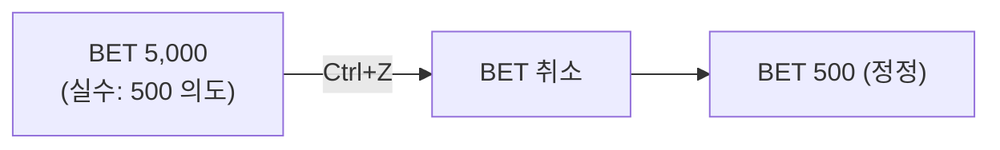
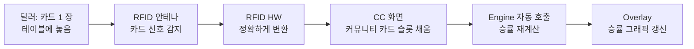
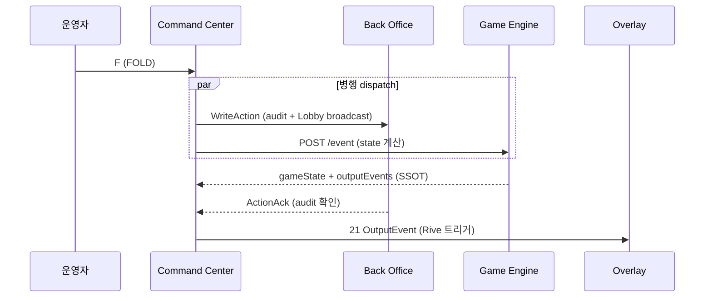
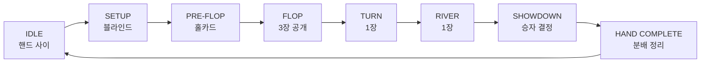

# Command Center — 운영자가 매 순간 머무는 조종석

> **Version**: 1.0.0
> **Date**: 2026-05-04
> **문서 유형**: 외부 인계용 PRD
> **대상 독자**: 외부 개발팀, 경영진, PM, 라이브 운영에 관심 있는 누구나
> **범위**: Command Center 의 정체성·구조·운영자 시점·자동화. 기술 명세는 정본 참조.

---

## 목차

**Part I — 정체성: CC 가 무엇인가**

- [Ch.1 — 실시간 조종석](#ch1--실시간-조종석) — 운영자 주의력 85% 가 이곳에
- [Ch.2 — 8 버튼](#ch2--8-버튼) — 베팅 액션의 모든 것
- [Ch.3 — RFID 자동 인식의 마법](#ch3--rfid-자동-인식의-마법) — 정확한 카드 인식

**Part II — 책임: CC 가 무엇을 결정하는가**

- [Ch.4 — Orchestrator 의 역할](#ch4--orchestrator-의-역할) — Engine + BO 병행 dispatch
- [Ch.5 — 시야 85%](#ch5--시야-85) — 왜 이 화면이 가장 중요한가

**Part III — 깊이: 특별한 설계**

- [Ch.6 — 21 OutputEvent](#ch6--21-outputevent) — 화면을 그리는 작업 지시
- [Ch.7 — Mock vs Real RFID](#ch7--mock-vs-real-rfid) — 개발 환경의 두 모드
- [Ch.8 — 화면 갤러리](#ch8--화면-갤러리) — 핸드 진행의 8 단계

---

## Ch.1 — 실시간 조종석

비행기 조종석을 본 적이 있으신가요. 수많은 계기판과 스위치가 빽빽하게 배치되어 있고, 조종사는 수 시간 동안 그 화면에서 시선을 거의 떼지 않습니다. 잠시의 방심이 비행 안전에 직결되기 때문입니다.

> **포커 방송의 조종석이 Command Center 입니다.**


본방송이 시작되면 운영자의 시선은 12 시간 동안 이 화면에 머무릅니다. 카드 한 장이 펼쳐지고, 베팅이 오가고, 누군가 폴드하고, 누군가 올인하는 그 모든 순간이 이 화면을 통해 시스템에 입력됩니다. 한 번의 입력 실수가 방송 전체에 영향을 줍니다 — 잘못된 팟 금액, 잘못된 승자, 잘못된 핸드 기록.

### 1.1 한 줄 정의

> **Command Center (CC)** = 운영자가 포커 한 핸드를 처음부터 끝까지 직접 입력하는 **게임 진행 전용 콘솔**. 비행 조종석에 비유하면 **계기판 + 조종간 + 통신 마이크가 하나로 합쳐진 화면** 입니다. 테이블 1 개당 인스턴스 1 개 (Foundation §Ch.5.4).

> ⚠️ **1단계 한정 컴포넌트** (Foundation §Ch.1.6 / §Ch.7.3 / §Ch.9.2): CC 는 EBS 진화 로드맵 Y축 1단계 (오퍼레이터 입력 모델) 의 핵심 컴포넌트입니다. **2단계 무인화 진입 시 CC 의 입력 권한은 Vision Layer (6대 카메라 + 컴퓨터 비전, Foundation §Ch.7.3) 가 완전 대체** 하며, CC 화면은 모니터링 전용으로 전환됩니다. 1→2 단계는 1단계 완전 안정화 후 순차 진행 (병행 운영 없음).

### 1.2 비유 — 항공 관제 vs 비행 조종

이전 PRD 에서 Lobby 를 **관제탑** 에 비유했습니다. 그렇다면 CC 는 **비행 조종석** 입니다.

| 비행 시스템 | 포커 방송 |
|------------|-----------|
| 관제탑 | Lobby (모든 비행기 모니터링) |
| 조종석 | Command Center (한 비행기 직접 조종) |
| 활주로 | 포커 테이블 |
| 비행기 1 대 | 한 테이블의 핸드 1 회 |
| 조종사 1 명 | 운영자 (Operator) 1 명 |

**관제탑은 여러 비행기를 동시에 모니터링** 하지만, **조종석은 한 비행기에 1 명** 입니다. CC 도 마찬가지로 **테이블당 1 인스턴스**, 운영자 1 명이 그 한 테이블의 핸드를 책임집니다.

### 1.3 단순 입력 도구가 아니라 지휘 콘솔

CC 의 책임은 액션 기록이 아닙니다. **운영자 1 클릭이 동시에 Engine + BO + Overlay 세 시스템을 움직입니다** (Ch.4 참조). 이 때문에 CC 는 단순 Tracker 가 아니라 **Orchestrator** 입니다.

---

## Ch.2 — 8 버튼

12 시간 방송 동안 운영자의 손은 **이 8 버튼 위에서 떠나지 않습니다**. 화면 하단 고정의 **액션 패널** — 8 개의 큰 버튼이 베팅 한 사이클의 모든 가능성을 커버합니다.

```
  +======================================================+
  |                                                      |
  |               (테이블 + 10 좌석 + 카드)              |
  |                                                      |
  +======================================================+
  | [N] NEW HAND  [D] DEAL    [F] FOLD    [C] CHECK     |
  | [B] BET       [C] CALL    [R] RAISE   [A] ALL-IN    |
  +======================================================+
```

### 2.1 8 버튼 — 단축키와 의미

| 버튼 | 단축키 | 핵심 역할 |
|------|:------:|----------|
| **NEW HAND** | N | 새 핸드 시작 |
| **DEAL** | D | 홀카드 딜 시작 |
| **FOLD** | F | 현재 플레이어 포기 |
| **CHECK** | C | 패스 (베팅 없이 넘김) |
| **BET** | B | 첫 베팅 (금액 입력) |
| **CALL** | C | 콜 (동일 금액 맞춤) |
| **RAISE** | R | 레이즈 (추가 베팅, 금액 입력) |
| **ALL-IN** | A | 스택 전부 베팅 |

### 2.2 키보드 우선 설계

운영자는 마우스를 거의 사용하지 않습니다. 모든 핵심 액션을 **단축키만으로** 수행합니다. 이유는 단순합니다 — **속도**.

핸드 한 회는 평균 20-40 액션을 포함합니다. 한 액션마다 마우스로 버튼을 클릭하면 손이 키보드와 마우스 사이를 왕복하는 시간이 누적됩니다. 12 시간 방송에서 이 시간 손실은 누적 수십 분이 됩니다. 키보드 단축키는 이 손실을 0 으로 만듭니다.

> 운영자는 키보드 위에 손을 놓고, 시선을 화면에 고정한 채, 12 시간을 보냅니다.

### 2.3 베팅 금액 입력

BET / RAISE 같은 금액이 필요한 액션은 단축키 입력 후 **숫자 키패드** 로 금액을 입력합니다.

```
  운영자: B (BET 단축키)
  CC:     입력 모달 표시
  운영자: 5000 + Enter
  CC:     액션 발행 (BET 5,000)
```

이 한 사이클이 평균 0.7 초입니다. 12 시간 방송 = 약 800 핸드 × 30 액션 = 24,000 액션 입력 = 4.7 시간 중 운영자가 액션 입력에 쓰는 시간. 이를 0.5 초로 줄이면 1.4 시간 절약됩니다.

### 2.4 UNDO — 무제한 되돌리기

운영자가 실수로 잘못된 액션을 입력했다면? **UNDO 단축키** 가 무제한 활성화되어 있습니다 — 단, 현재 핸드 내에서만.



핸드가 종료되면 (HAND_COMPLETE) UNDO 가능 범위가 종료됩니다. 다음 핸드는 새 history 입니다.

---

## Ch.3 — RFID 자동 인식의 마법

운영자는 12 시간 동안 단 한 장의 카드도 키보드로 입력하지 않습니다. **카드를 테이블에 놓는 순간 시스템이 알아챕니다** — 이 자동화가 CC 의 두 번째 핵심입니다. 화면 중앙의 **테이블 영역** — 타원형 포커 테이블에 10 개 좌석이 배치된 시각화 영역입니다.

### 3.1 테이블 영역의 정보

```
                  +----+
                  | S6 |
              +---+----+---+
              | S5 |  | S7 |
          +---+----+--+----+---+
          | S4 |       | S8 |
          +---+   판   +----+
          | S3 | 카드  | S9 |
          +---+----+--+----+---+
              | S2 |  | S10|
              +---+----+---+
                  | S1 |
                  +-D--+
                (Dealer)
```

각 좌석에 표시되는 정보:

| 정보 | 의미 |
|------|------|
| 선수 이름 + 국적 플래그 | "P. Nguyen 🇻🇳" |
| 칩 스택 | "1.2M" 또는 "12.0 BB" |
| 포지션 뱃지 | SB / BB / BTN / STR |
| 카드 슬롯 | 홀카드 2 장 (face-down `?` 만 표시 — D7 카드 비노출 계약) |
| 액션 상태 | "FOLD" / "CALL 200" / "RAISE 500" 텍스트 |
| 활성 표시 | action_on 좌석에 펄스 애니메이션 |

### 3.2 RFID 카드의 마법

테이블 천 아래에는 12 개의 안테나가 매립되어 있습니다 (Foundation §Ch.4.3). 카드 1 장이 테이블 위에 놓이는 순간, **물리적 카드가 정확하게** 그 카드의 **종류** (예: A♠, K♥) 가 시스템에 자동 입력됩니다 — 빠짐없이, 오류 없이.



> 운영자는 카드를 입력하지 않습니다. **물리적 카드가 곧 디지털 데이터** 입니다.

이 자동화 덕분에 운영자가 8 버튼 (베팅 액션) 입력에만 집중할 수 있습니다. 카드 인식까지 운영자가 입력해야 한다면 액션 패널이 16-20 버튼이 되었을 것입니다.

### 3.3 D7 — 카드 비노출 계약

CC 오퍼레이터 (테이블 후방 컨트롤룸 근무) 가 CC 화면에서 hole cards 의 값 (rank/suit) 을 미리 알면 부정 행위 위험이 발생합니다. 그래서 **CC 위젯 트리는 hole cards 값을 절대 렌더링하지 않습니다** (Foundation §Ch.5.4 D7).

> **역할 분리** (2026-05-05): 딜러는 테이블에서 플레이어 액션을 리드·처리하는 진행자이며, CC 입력자는 후방 컨트롤룸의 **CC 오퍼레이터** 입니다. 두 사람은 물리적으로 다른 위치에서 다른 역할을 수행합니다.

| 카드 | CC 화면 표시 | 시청자 화면 (Overlay) |
|------|-------------|----------------------|
| 홀카드 (선수 손) | `?` (face-down) | 실제 값 (A♠ K♣) |
| 커뮤니티 (보드) | 실제 값 | 실제 값 |
| 폴드 카드 | `?` 그대로 | 표시 안 함 |

운영자는 **분배 여부만** 알 수 있을 뿐, **실제 카드값** 은 모릅니다. 시청자만이 그래픽 오버레이를 통해 모든 카드를 볼 수 있습니다 — 이것이 Foundation §Ch.1 의 미션 ("숨겨진 패를 보여주는 마법") 의 정확한 구현입니다.

---

## Ch.4 — Orchestrator 의 역할

CC 의 진짜 책임은 단순한 액션 입력이 아닙니다. CC 는 **Orchestrator (지휘자)** 입니다 — Engine + BO 두 시스템을 동시에 지휘합니다.

### 4.1 한 액션의 5 단계

운영자가 FOLD 단축키 (F) 를 누르는 순간 무슨 일이 벌어질까요?



5 단계가 평균 50ms 안에 완료됩니다.

### 4.2 왜 병행 dispatch 인가

CC 가 BO 와 Engine 을 **순차적으로** 호출하면 어떻게 될까요?

| 순차 호출 | 시간 |
|-----------|:----:|
| CC → BO 발행 | 30ms |
| BO 응답 대기 | 30ms |
| CC → Engine 호출 | 30ms |
| Engine 응답 대기 | 50ms |
| **합계** | **140ms** |

운영자는 액션 입력 후 **140ms 동안 화면이 멈춰 있는** 듯한 lag 를 경험합니다. 12 시간 동안 24,000 액션 = 누적 lag 56 분.

병행 dispatch 는 이를 다음과 같이 단축합니다:

| 병행 호출 | 시간 |
|-----------|:----:|
| CC → BO + CC → Engine 동시 발행 | 30ms |
| 더 느린 응답 대기 (Engine 50ms) | 50ms |
| **합계** | **80ms** |

> 병행 dispatch 는 운영자 lag 를 60% 절감합니다.

### 4.3 진실의 우선순위

병행 dispatch 의 결과로 CC 가 두 응답을 받습니다 — Engine 의 state snapshot 과 BO 의 ActionAck. 두 응답이 모순되면? **Engine 응답을 진실로 받아들입니다**.

| 데이터 | SSOT | 이유 |
|--------|:----:|------|
| 게임 상태 (카드, 팟, 라운드) | **Engine** | 22 종 포커 규칙의 unique 진실 |
| audit / Lobby broadcast | BO | 영구 보관 + 실시간 분산 |

이 분리 덕분에 **BO 가 다운되어도 Engine 응답으로 게임은 계속됩니다**. CC 는 로컬 버퍼에 audit 발행을 누적하다가 BO 복구 후 일괄 전송합니다.

---

## Ch.5 — 시야 85%

EBS 의 모든 화면 중 운영자가 가장 오래, 가장 집중해서 보는 화면이 CC 입니다. 운영자 주의력의 **85%** 가 이 한 화면에 집중됩니다 (`Command_Center_UI/Overview.md` 도입부 명시).

### 5.1 왜 85% 인가

12 시간 방송 한 회 중 운영자의 화면별 시선 분배는 다음과 같이 추정됩니다:

```
  +-------------------+--------+----------------+
  | 화면              | 시선 % | 활동           |
  +-------------------+--------+----------------+
  | Command Center    |  85%   | 핸드 진행 입력 |
  | Lobby (간헐 확인) |   8%   | 알림 + 다음 핸드|
  | Settings (드물게) |   2%   | 그래픽 조정    |
  | Overlay 미리보기  |   3%   | 송출 확인      |
  | 외부 (현장 무전)  |   2%   | 딜러 의사소통  |
  +-------------------+--------+----------------+
```

이 분배는 우연이 아닙니다. CC 의 디자인 자체가 **시선 흡수** 를 목표로 합니다.

### 5.2 디자인 결정 — 정상은 보이지 않게

CC 화면은 평소에 **거의 변화가 없습니다**. 좌석은 가만히 있고, 카드는 face-down 으로 표시되고, 액션 패널 8 버튼은 항상 같은 위치에 있습니다.

그러나 **이상이 발생하면 즉각 시선이 끌립니다**:

| 정상 상태 | 이상 상태 |
|-----------|-----------|
| BO Connected (작은 ● 녹색) | BO Disconnected (큰 ○ 빨강 + 재연결 카운트다운) |
| RFID Online (작은 ● 녹색) | RFID Error (큰 ⚠ 빨강 + 에러 텍스트) |
| 액션 버튼 (회색 비활성) | 활성 버튼 (강한 색 + 단축키 강조) |
| action_on 좌석 (펄스) | 정상 좌석 (정적) |

> 정상은 시야에서 사라지고, 비정상만 시야에 들어옵니다.

이 디자인 원칙은 12 시간의 운영 피로를 최소화합니다.

### 5.3 피로 최소화 — 반복 패턴 고정

CC 의 모든 작업은 동일한 반복 패턴을 따릅니다:

```
  NEW HAND (N) → DEAL (D) → 액션 × N → HAND_COMPLETE → IDLE → NEW HAND ...
```

이 패턴이 한 핸드의 lifecycle 입니다. 12 시간 동안 약 800 회 반복됩니다. 운영자는 이 반복을 **근육 기억** 으로 수행합니다 — 손가락이 자동으로 N → D → F → C → R 등을 누르고, 시선은 행동 결과 확인에만 사용됩니다.

이 패턴 고정 덕분에 운영자는 **자신의 입력에 대한 인지 부하** 가 거의 0 에 가깝습니다. 인지 자원은 **현장 상황 (딜러, 선수, 무전, 알림) 모니터링** 에 집중됩니다.

---

## Ch.6 — 21 OutputEvent

운영자 1 클릭이 화면에 **21 종의 시각 신호 중 하나** 를 보냅니다. 이 신호 카탈로그가 CC 가 시청자에게 그려주는 모든 그래픽의 기반입니다.

### 6.1 21 OutputEvent 전체 카탈로그

Engine 이 게임 상태 전이마다 반환하는 21 종 이벤트의 풀 매트릭스 (Foundation §Ch.6.1):

| # | 이벤트 | 의미 | 트리거 시점 |
|:-:|--------|------|-------------|
| 1 | **HandStarted** | 새 핸드 시작 — 블라인드 수거 | NEW HAND 클릭 직후 |
| 2 | **HoleCardsDealt** | 홀카드 딜 — 좌석 카드 슬롯 활성 | DEAL 클릭 |
| 3 | **PreFlopBetting** | Pre-flop 베팅 라운드 시작 | HoleCards 직후 |
| 4 | **FlopRevealed** | 플롭 3 장 공개 (flip 애니메이션) | RFID 3 카드 감지 |
| 5 | **FlopBetting** | Flop 베팅 라운드 시작 | FlopRevealed 직후 |
| 6 | **TurnRevealed** | 턴 1 장 공개 | RFID 1 카드 감지 |
| 7 | **TurnBetting** | Turn 베팅 라운드 시작 | TurnRevealed 직후 |
| 8 | **RiverRevealed** | 리버 1 장 공개 | RFID 1 카드 감지 |
| 9 | **RiverBetting** | River 베팅 라운드 시작 | RiverRevealed 직후 |
| 10 | **ActionPlaced** | 베팅 액션 (칩 이동) | F/C/B/R/A 버튼 |
| 11 | **PotUpdated** | 팟 금액 갱신 | 매 베팅 후 |
| 12 | **EquityUpdated** | 승률 % 갱신 | 카드 변경 시마다 |
| 13 | **PlayerFolded** | 플레이어 폴드 (카드 사라짐) | F 버튼 |
| 14 | **PlayerAllIn** | 올인 (스택 → 팟) | A 버튼 |
| 15 | **SidePotCreated** | 사이드 팟 생성 | All-in 시 |
| 16 | **Showdown** | 쇼다운 (남은 패 face-up flip) | 마지막 베팅 후 |
| 17 | **WinnerDetermined** | 승자 결정 | Showdown 평가 후 |
| 18 | **PotAwarded** | 팟 분배 (스택 갱신 애니메이션) | WinnerDetermined 직후 |
| 19 | **HandComplete** | 핸드 종료 — 정리 단계 | PotAwarded 후 3초 |
| 20 | **MissDeal** | 미스 딜 (스택 복구) | M 버튼 |
| 21 | **PlayerSeated** | 신규 플레이어 착석 | 좌석 추가 시 |

> **22 가지 포커 규칙의 모든 시각적 변화가 이 21 종으로 커버됩니다**. 22 번째 규칙 추가 시 새 이벤트 신설 (예: Run-It-Twice).

### 6.2 Rive 애니메이션

OutputEvent 를 받은 CC 는 **즉시 Overlay 에 직접 전달** 합니다 — BO 를 거치지 않습니다 (BO 는 audit 만, 상세 sequence: Ch.4 §4.1). 이 직접 경로 덕분에 화면 그리기 lag 가 최소화됩니다.

Overlay 의 모든 애니메이션은 **Rive** 라는 도구로 디자인된 `.riv` 파일로 구현됩니다 (Foundation §Ch.5.3 Rive Manager).

| 단계 | 누가 |
|------|------|
| 디자인 | 아트 디자이너 (외부 Rive Editor) |
| 업로드 + 활성화 | Lobby 의 Rive Manager 섹션 |
| 트리거 | CC → Overlay 의 OutputEvent |
| 송출 | Overlay → SDI/NDI |

CC 의 OutputEvent 한 개가 Rive 애니메이션 한 개를 트리거합니다. CC 는 애니메이션 자체를 알지 못합니다 — 그저 "이 이벤트가 발생했다" 라고 알릴 뿐입니다. 어떤 애니메이션이 어떻게 재생될지는 `.riv` 파일에 내장되어 있습니다.

---

## Ch.7 — Mock vs Real RFID

라이브 카지노 환경에서도, 개발자 노트북에서도 **CC 는 동일하게 작동** 해야 합니다. 두 모드의 코드 99% 가 동일하다는 것이 본 챕터의 핵심 보장입니다.

### 7.1 Real RFID — 정규 운영

12 안테나 + RFID 카드 52 장으로 구성된 정규 자동 인식 (상세 메커니즘: Ch.3 §3.2). 본 챕터에서는 **Mock 모드와의 차이** 만 다룹니다.

### 7.2 Mock RFID — 개발 / 비상

| 시나리오 | 사용 |
|----------|------|
| 개발 환경 | 실제 RFID 하드웨어 없이 Flutter Web 또는 Desktop 으로 CC 테스트 |
| 비상 운영 | RFID 리더 고장 시 운영자 수동 카드 입력으로 방송 계속 |

Mock 모드에서는 CC 화면에 **수동 카드 입력 UI** 가 표시됩니다.

```
  +======================================================+
  | ⚠ Mock RFID Mode — Operator Manual Input             |
  +======================================================+
  | Community Card 1 (Flop):  [ A ▼ ] [ ♠ ▼ ]  [Insert]  |
  | Community Card 2 (Flop):  [ K ▼ ] [ ♥ ▼ ]  [Insert]  |
  | Community Card 3 (Flop):  [ 7 ▼ ] [ ♣ ▼ ]  [Insert]  |
  +======================================================+
```

Real 모드와 Mock 모드는 **CC 코드의 99%** 가 동일합니다. 차이는 카드 인식 어댑터 (RFID HAL) 한 곳만 교체됩니다 (Foundation §Ch.4.3 + RFID HAL Interface).

### 7.3 모드 전환

Lobby 에서 **Mock RFID Mode** 토글로 전환합니다. 한 클릭으로 즉시 전환됩니다.

| 상태 | Lobby 표시 | CC 표시 |
|------|-----------|---------|
| Real OK | RFID Rdy | 좌석 카드 슬롯 자동 입력 |
| Real Error | RFID Err + 자동 일시정지 | 좌석 카드 슬롯 멈춤 |
| **Mock Ready** | Mock Rdy | 수동 카드 입력 UI |

이 모드 전환 덕분에 **하드웨어 장애가 방송을 중단시키지 않습니다**. 자동화 수준이 일시적으로 낮아질 뿐입니다.

---

## Ch.8 — 화면 갤러리

매 핸드는 **8 단계 사이클** 을 거칩니다. 단계 = "핸드의 한 챕터" — 운영자가 어느 단계에 있는지 화면이 항상 알려줍니다.

> **HandFSM (Hand Finite State Machine)** = 핸드의 8 단계 흐름을 시스템에 새긴 **고정된 규칙**. 운영자는 N 키 한 번이면 IDLE → SETUP → PRE-FLOP 으로 자동 전환됩니다 — **이전 단계로 절대 돌아가지 않는다** 는 보장 (잘못된 입력 차단).



각 단계의 운영자 시야 변화는 다음 §8.1 ~ §8.6:

### 8.1 IDLE — 핸드 사이 (운영자 1 손가락만)

```
  상단 바:    BO ● / RFID ● / Hand #N 대기 / IDLE
  테이블:     이름 + 스택만 (카드 슬롯 비활성)
  액션 패널:  [N] NEW HAND 만 활성, 나머지 회색
```

운영자는 N 키만 누르면 됩니다. 다른 모든 버튼은 비활성.

### 8.2 SETUP_HAND — 블라인드 수거 (1 초 자동)

블라인드 수거는 RFID 가 자동으로 처리합니다. 운영자는 **D 한 번** 만 누릅니다.

```
  상단 바:    "Setting Up"
  테이블:     SB/BB 좌석에서 칩이 가운데로 이동 (애니메이션)
  액션 패널:  [D] DEAL 만 활성
```

### 8.3 PRE_FLOP — 홀카드 분배 (액션 페이즈 시작)

여기부터 **운영자의 손가락이 본격적으로 움직입니다**. 6 베팅 액션 모두 활성:

```
  상단 바:    팟 실시간
  테이블:     각 좌석 카드 슬롯 활성, action_on 좌석 펄스
  액션 패널:  FOLD/CHECK/BET/CALL/RAISE/ALL-IN 활성
```

### 8.4 FLOP / TURN / RIVER — 보드 카드 공개 (RFID 가 알아서)

운영자가 이 단계에서 **타이핑하지 않습니다**. 딜러가 카드를 놓으면 화면이 알아서 채워집니다 (Ch.3 §3.2).

```
  상단 바:    팟 갱신
  테이블:     커뮤니티 카드 영역에 3/4/5 장 표시
  액션 패널:  동일 (베팅 액션)
```

### 8.5 SHOWDOWN — 결과 공개 (12 시간 중 가장 화려한 1 분)

이 1 분이 시청자가 가장 환호하는 순간 — 화면도 그 무게를 반영합니다.

```
  상단 바:    "Showdown"
  테이블:     남은 선수 카드 face-up 으로 flip, 승자 강조
  액션 패널:  [CHOP] [RUN IT] 같은 특수 버튼
```

### 8.6 HAND_COMPLETE — 분배 + 정리 (3 초 idle)

운영자에게 잠깐의 호흡. 3 초 후 IDLE 로 자동 전환.

```
  상단 바:    Hand #N+1 준비
  테이블:     팟 분배 애니메이션 → 스택 갱신
  액션 패널:  비활성 → 3 초 후 IDLE 로 전환
```

> 12 시간 방송 = **800 핸드 × 8 단계 = 6,400 단계 전환**. 운영자가 한 화면에서 처리하는 사이클의 총량. 단계마다 시야가 미세 변화하기에 운영자가 헷갈리지 않습니다 — 이게 §Ch.5 의 "근육 기억" 이 작동하는 기반입니다.

### 8.7 디자인 톤

Lobby 와 마찬가지로 CC 도 **black-and-white refined minimal** 톤을 사용합니다. 단, 한 가지 차이가 있습니다 — CC 는 **실시간 펄스/애니메이션** 이 풍부합니다 (action_on 좌석 펄스, BET 칩 이동, 카드 flip 등). Lobby 는 정적 데이터, CC 는 동적 흐름이라는 차이를 시각화로 표현합니다.

---

## Ch.9 — Visual Uplift (2026-05-06 v1.1)

> **트리거**: 2026-05-05 디자이너 React 시안 도착 → Conductor critic 판정 → 시각 자산 13 흡수 / 3 거절 결정.
>
> **외부 인계자에게**: 이 챕터는 CC 화면이 곧 어떻게 시각적으로 강화되는지 설명합니다. 기능적 동작 (Ch.1~8) 은 변경 없습니다 — 시각 표현만 강화됩니다. 정본: `4. Operations/CC_Design_Prototype_Critic_2026_05_06.md`.

### 9.1 한 장 요약 — 무엇이 바뀌나

운영자가 매 순간 보는 화면에 7 종류의 시각 보강이 추가됩니다. 모두 **기능 변경이 아니라 정보 가시성 강화** 입니다.

| 영역 | Before (현 Flutter) | After (보강) |
|------|---------------------|--------------|
| 화면 상단 | InfoBar 작은 표기 | StatusBar 통합 한 줄 + POT 좌상단 강조 박스 |
| 화면 좌측 | 없음 | 미니 oval 다이어그램 (테이블 흐름 한눈) |
| 화면 우측 | glow 만 | ACTING 명시 박스 ("S8 · Choi · Stack $5,750") |
| 좌석 셀 | 3-4 행 | 7 행 (acting strip / 베팅 칩 / Position shift) |
| 키보드 힌트 | 없음 | 32px hint bar (F·C·B·A·N·M 칩) ✅ 구현 완료 |
| Community 카드 | "Card 1~5" | FLOP 1·2·3 / TURN / RIVER 슬롯 라벨 |
| 디버그 (선택) | 없음 | Tweaks Panel (release 미포함) |

### 9.2 13 흡수 / 3 거절 — 결정 매트릭스

```
  ┌─────────────────────────────────────────────────────┐
  │  흡수 13 종 (V1 ~ V13)                              │
  ├─────────────────────────────────────────────────────┤
  │  V1   KeyboardHintBar          ✅ 2026-05-06 구현   │
  │  V2   StatusBar 통합 (+V10 결합) ⏳                 │
  │  V3   MiniDiagram (+R2 가드)    ⏳                  │
  │  V4   PositionShiftChip         ⏳                  │
  │  V5   SeatCell 7행 (+V11/V12)   ⏳                  │
  │  V6   ACTING glow (+V9 박스)    ⏳                  │
  │  V7   TweaksPanel (debug only)  ⏳                  │
  │  V8   FLOP/TURN/RIVER 슬롯 라벨 ⏳                  │
  │  V9   ACTING 우측 명시 박스      (V6 결합)           │
  │  V10  POT 좌상단 강조 박스       (V2/V3 결합)        │
  │  V11  베팅 칩 부유 시각          (V5 결합)           │
  │  V12  카드 슬롯 + ADD affordance  (V5 결합)         │
  │  V13  IDLE disabled visual hint  ✅ 정합 확인       │
  ├─────────────────────────────────────────────────────┤
  │  거절 3 종 (R1 ~ R3)                                │
  ├─────────────────────────────────────────────────────┤
  │  R1  layout 스위처 (Bottom/Left/Right) — 1 운영자   │
  │      가정에서 무용                                   │
  │  R2  SB·BB 이중 표시 — V3 가드로 단일 source 정책   │
  │  R3  CardPicker face-up 임의 선택 — D7 위반        │
  └─────────────────────────────────────────────────────┘
```

### 9.3 4 가드레일 (절대 변경 금지)

시안 흡수 작업 전체에 강제되는 가드:

| # | 가드 | 의미 |
|:-:|------|------|
| 1 | **D7 hole card 값 노출 금지** | 운영자에게 카드 면 노출 절대 금지. CI 가드 (`tools/check_cc_no_holecard.py`) 강제 |
| 2 | **CDN 의존 도입 금지** | 카지노 LAN 배포 호환성 보존. Flutter assets 자족 |
| 3 | **통신 모델 변경 금지** | Engine HTTP + BO WS 병행 dispatch (Ch.4) 보존 |
| 4 | **HandFSM 9-state 변경 금지** | 핸드 진행 룰 (Ch.8) 보존 |

### 9.4 외부 인계 의미

이 시각 보강은 **외부 개발팀의 구현 부담을 늘리지 않습니다**. 모두 다음 영역에서만 이루어집니다:

| 영역 | 변경 |
|------|------|
| Flutter widget tree | 7 신규 위젯 + 1 보강 |
| Engine 통신 | 변경 없음 |
| WebSocket schema | 변경 없음 |
| BO REST | 변경 없음 |
| RFID HAL | 변경 없음 |
| OutputEvent 21 종 | 변경 없음 |
| HandFSM | 변경 없음 |

→ **외부 개발팀은 본 §Ch.9 를 "시각 톤 가이드" 로 받고, Ch.1~8 (기능 명세) 만 구현 기준으로 사용** 하시면 됩니다.

### 9.5 시안 영감의 출처

원천: 2026-05-05 디자이너 산출물 React/Stitch 프로토타입. 분석 결과 시각 디자인은 우월하나 **production 부적격** (D7 위반 + CDN 의존 + 통신 모델 부재 등 12 결함). EBS 의 Flutter 구현이 본 시안의 우월한 시각 자산 13 종을 흡수하는 방향으로 결정.

원본 zip 은 `claude-design-archive/2026-05-06/` 에 봉인 — **이식 금지** (시각 reference 만).

상세 critic: `4. Operations/CC_Design_Prototype_Critic_2026_05_06.md`.

---

## 더 깊이 알고 싶다면

| 주제 | 정본 문서 |
|------|----------|
| CC 전체 통합 비전 | `Foundation.md §Ch.4.1`, `§Ch.5.4`, `§Ch.6.1`, `§Ch.6.3` |
| CC 기능 명세 + Action-to-Transport Matrix | `2. Development/2.4 Command Center/Command_Center_UI/Overview.md` |
| RFID HAL 인터페이스 + 52 카드 매핑 | `2. Development/2.4 Command Center/RFID_Cards/Overview.md` |
| 21 OutputEvent 카탈로그 | `2. Development/2.4 Command Center/Overlay/OutputEvent.md` |
| Engine REST API | `2. Development/2.3 Game Engine/APIs/Harness_REST_API.md` |
| Lobby 와의 1:N 관계 | `Lobby_PRD.md §Ch.3` |
| BO 와의 데이터 흐름 | `Back_Office_PRD.md §Ch.2` |

---

## Changelog

| 날짜 | 버전 | 변경 |
|------|:---:|------|
| 2026-05-06 | **1.3.0** | **Foundation v3.1 동기화 (3 입력 Trinity + 무인화 2단계 진화 cascade)**. (1) §1.1 한 줄 정의 다음 ⚠️ 박스 추가 — "1단계 한정 컴포넌트" 명시 + Foundation §Ch.1.6 / §Ch.7.3 / §Ch.9.2 참조. 2단계 무인화 진입 시 CC 입력 권한이 Vision Layer (6 카메라 + CV) 로 완전 대체됨. CC 화면은 모니터링 전용 전환. 1→2 순차 진행 + 완전 대체 + 병행 운영 없음 명시. (2) related-docs 보강 — Foundation §Ch.1.4 / §Ch.1.6 / §Ch.7.3 / §Ch.9.2 4종 추가 (기존 4 → 8). (3) 외부 개발팀 오해 방지 — Foundation 의 무인화 메커니즘 = 막연한 "AI" 가 아닌 구체적 CV 카메라 6대 SSOT 정합. 본문 챕터 (Ch.1-8) 본격 보강은 별도 PR 후속. | PRODUCT |
| 2026-05-04 | 1.0.0 | 초기 작성 — Foundation 톤 + 8 챕터 (Part I 정체성 / II 책임 / III 깊이). 정본 = `Command_Center_UI/Overview.md` (631줄 internal) + `RFID_Cards/Overview.md` 외부 친화 재가공. SSOT 위반 회피 = frontmatter `derivative-of` + `if-conflict: derivative-of takes precedence`. |
| 2026-05-06 | 1.1.0 | **Ch.9 Visual Uplift 신설** — React 디자인 시안 critic 판정 결과 시각 자산 13 흡수 / 3 거절 결정 반영. V1 KeyboardHintBar 구현 완료. 4 가드레일 (D7 / CDN / 통신 / HandFSM) 명문화. 기능 명세 변경 없음. SSOT: `4. Operations/CC_Design_Prototype_Critic_2026_05_06.md`. 본 갱신은 직전 `Command_Center_UI/Overview.md` §12 Widget Inventory 추가에 따른 derivative-of 동기화. |
| 2026-05-06 | 1.2.0 | **콘텐츠 강화 — 4 약점 손질** (chapter-doc Phase 0.5 RVP + content-critic agent 적용). Ch.1.1 dry 정의 → "조종실 입력 콘솔" 비유 보강. Ch.1.3 이름 history (사족) 삭제. Ch.2/3 도입부 dry → 1줄 hook ("12시간 손가락이 떠나지 않는다", "키보드로 입력하지 않는다"). Ch.6 21 OutputEvent **8종 → 21종 풀 카탈로그** 공개 + §6.2 Ch.4 중복 제거. Ch.7 §7.1 Ch.3 중복 제거. **Ch.8 8 박스 단조 → Mermaid 흐름도 + 각 단계 1줄 hook + FSM 용어 풀이**. 사례 SSOT: `~/.claude/projects/.../memory/case_studies/2026-05-06_cc_prd_critic.md` ("저자 메트릭 X, 본문 챕터별 ★ + 강/약 문장 인용"). 형식 변환 (Hero Block / Symmetric Block / 1100줄) **거절** — 이미 ★★★½ 콘텐츠 보존, 4 약점만 손질. 라인 +50 (613 → 663). 기능 명세 / Ch.4·5 보존 (★★★★★). |
| 2026-05-05 | 1.1.0 | EBS 미션 재선언 cascade (SG-033). Ch.3 챕터명 "0.1초의 마법" → "**RFID 자동 인식의 마법**". 본문 "0.1초 안에" → "정확하게, 빠짐없이". §3.3 "운영자(딜러)" → "**CC 오퍼레이터**" (역할 분리 명시 — 딜러는 테이블 진행자, CC 오퍼레이터는 후방 컨트롤룸 입력자). §7.1 "(0.1초)" → "(정확하게, 빠짐없이)". Foundation §Ch.1.4 새 미션 ("완벽한 번역가") 정합. |
