# Command Center — 운영자가 머무는 조종석

> **v4.0 (2026-05-07) — Reader Panel critic 16 fix cascade**
>
> v3.0 의 16 결함 (C 4 + H 4 + M 5 + L 3) 정합. 숫자 fact-check / 5 vs 6 키 모순 / R3 보안 보강 / G1 runtime 가드 / 약어 첫 등장 풀이 / 1×10 trade-off honest / AT 8 화면 / 매트릭스 단일화 / 비유 정리 / D7 정본 인용 등.
>
> 본 PRD 의 모든 스크린샷은 React 시안을 Playwright 1600×900 캔버스에 렌더링하여 캡처 (15 종, 다크 broadcast 톤). EBS 최종 구현은 Lobby B&W refined minimal 톤 — 색상은 무시하고 *layout / structure / interaction* 만 참조.

---

## 한 줄 요약

> 12 시간 본방송 한 회 동안 한 운영자가 마주하는 화면. 10 명의 선수가 가로로 한 줄에 늘어서 있고, 6 개의 키 (N · F · C · B · A · M) 가 핸드 진행의 모든 버튼을 동적으로 대신한다. **타원형 테이블이 사라지고 1×10 그리드가 들어선 것** — 이것이 v4.0 의 가장 큰 변화다.

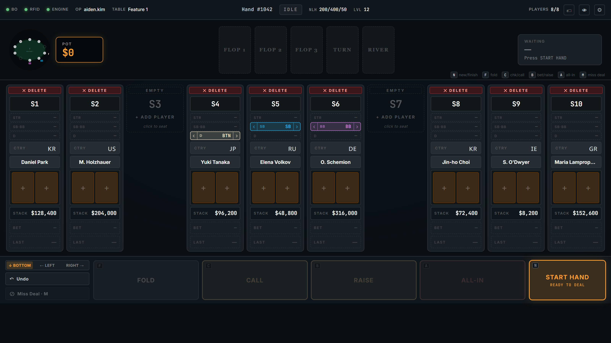

*↑ 운영자가 자리에 앉기 직전의 IDLE 화면. 4 영역이 위계적으로 배치 — StatusBar(52px) → TopStrip(158px) → PlayerGrid(1×10 가로) → ActionPanel(124px).*

---

## 목차

| 챕터 | 한 줄 |
|------|------|
| [Ch.1 — 4 영역](#ch1--4-영역) | 4 영역의 위계 + 1×10 패러다임 전환 (장단점 모두) |
| [Ch.2 — StatusBar (52px)](#ch2--statusbar-52px--위쪽-계기판) | 한 줄 안의 시스템 전체 |
| [Ch.3 — TopStrip (158px)](#ch3--topstrip-158px--응시의-중심) | MiniDiagram + Board + ACTING |
| [Ch.4 — PlayerGrid (1×10)](#ch4--playergrid-1x10--가로로-늘어선-10-명) | 1×10 의 9 행 stacked |
| [Ch.5 — ActionPanel (124px)](#ch5--actionpanel-124px--6-키의-영역) | 6 키 + Phase-aware |
| [Ch.6 — 9 단계의 파동 (HandFSM)](#ch6--9-단계의-파동-handfsm) | 핸드 lifecycle |
| [Ch.7 — RFID, 손이 닿지 않는 카드 인식](#ch7--rfid-손이-닿지-않는-카드-인식) | 자동 인식 |
| [Ch.8 — 실수의 정정](#ch8--실수의-정정-undo--miss-deal) | UNDO + Miss Deal |
| [Ch.9 — 한 클릭의 합주](#ch9--한-클릭의-합주-engine--bo--overlay) | Orchestrator |
| [Ch.10 — Hole Card Visibility (D7 + R3 옵션화)](#ch10--hole-card-visibility-d7--r3-옵션화) | 가시성 옵션 + 보안 |
| [Ch.11 — Lobby 와 같은 디자인 톤 (Q2)](#ch11--lobby-와-같은-디자인-톤-q2) | 디자인 통일 |
| [Ch.12 — 외부 개발팀 구현 가이드](#ch12--외부-개발팀-구현-가이드) | widget + AT 8 화면 |
| [Ch.13 — 사용자 결정 Q1~Q4](#ch13--사용자-결정-q1q4) | 결정 매트릭스 |
| [Ch.14 — 거절 매트릭스 R1/R2/R4/R5](#ch14--거절-매트릭스-r1r2r4r5) | 거절 사유 |
| [Ch.15 — 시각 자산 17 종 (V1~V17)](#ch15--시각-자산-17-종-v1v17) | 흡수 자산 카탈로그 |
| [EPILOGUE](#epilogue--본방송-종료-후) | 본방송 종료 후 |

---

## Ch.1 — 4 영역

### 1.0 한 화면 한 운영자

화면을 처음 보는 사람의 눈이 가장 먼저 닿는 곳은 4 영역의 *위계* 다.

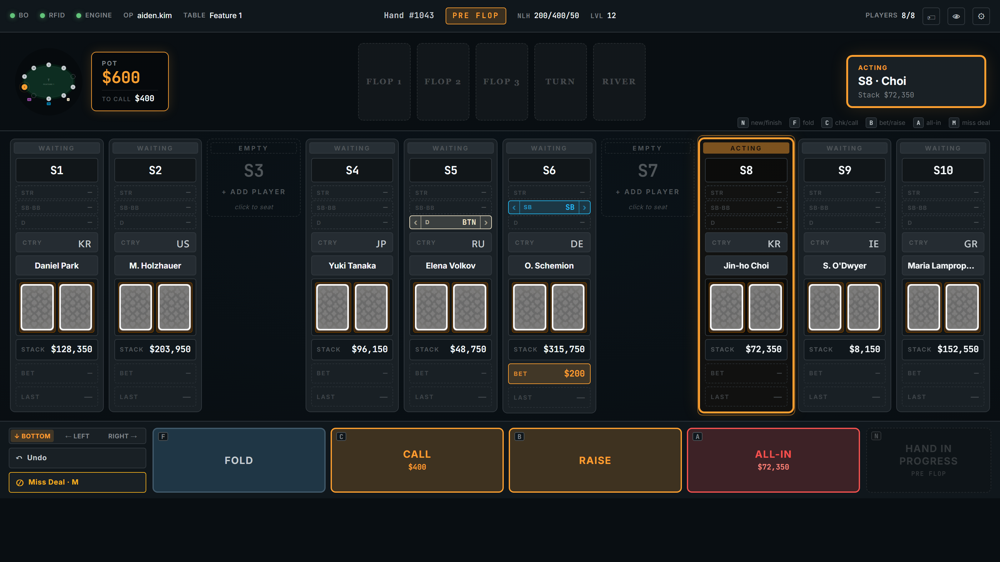

*↑ NEW HAND 후 PRE_FLOP 진입. 4 영역의 높이가 고정되어 위계가 한눈에.*

> 💡 **약어 풀이 — 첫 등장**:
> - **CC** = Command Center. 본 PRD 의 주제.
> - **Engine** = Game Engine. 22 종 포커 규칙의 unique 진실. CC 액션이 *합법한지* 판정.
> - **BO** = Back Office. audit 로그 + Lobby 브로드캐스트. *영구 보관* 과 *실시간 분산* 책임.
> - **Overlay** = 시청자 화면 그래픽. 21 종 OutputEvent 가 Rive 애니메이션을 트리거.
> - **Rive** = 벡터 애니메이션 런타임 (`.riv` 파일). 시청자 화면의 모든 동적 그래픽이 Rive 로 그려진다.

### 1.1 4 영역의 분담

화면은 위에서 아래로 4 영역. 각 영역은 *변화 빈도* 가 다르고, 그에 맞춰 *시선 빈도* 도 다르다.

| 영역 | 높이 | 변화 빈도 (이벤트) | 시선 빈도 (운영자) | 핵심 정보 |
|------|:----:|:-----------------:|:-----------------:|----------|
| **StatusBar** | 52px | 거의 안 변함 (수 분) | 5 초마다 곁눈 | BO/RFID/Engine 연결 + Hand # + Phase |
| **TopStrip** | 158px | 액션마다 (수 초) | 매 액션 후 | MiniDiagram + Community Board + ACTING |
| **PlayerGrid** | 가변 1fr | 액션마다 (수 초) | 핸드 진행 중 지속 | 10 명의 선수 (1×10 가로 그리드) |
| **ActionPanel** | 124px | 운영자 입력 (수 초) | 매 액션 발사 직전 | 6 키 (5 게임 + 1 비상) + START/FINISH HAND |

> ★ **위계의 의미**: 상단으로 갈수록 *변화 빈도가 낮은* 정보 (시스템 상태). 하단으로 갈수록 *고빈도 입력* (액션 패널). 운영자는 본방송 시간 동안 이 위계를 *근육 기억* 으로 흡수한다.

### 1.2 v1 (oval) → v4 (1×10) 패러다임 전환

이전 EBS PRD (v1.x) 는 화면 중앙에 **타원형 테이블** 을 그렸고, 10 좌석을 그 둘레에 배치했다. v4.0 은 이 구조를 버리고 **1×10 가로 그리드** 로 전환했다.

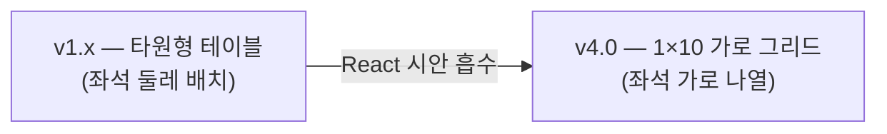

#### 장점

| 장점 | 의미 |
|------|------|
| 좌석 비교 용이 | 가로 정렬로 스택 차이 / 액션 패턴 한눈 |
| 정보 밀도 ↑ | 9 행 stacked 로 한 셀에 풀 정보 |
| 인지 모드 단순화 | *공간 위치* → *순차 번호* (S1~S10) |
| 키보드 ↔ 마우스 왕복 ↓ | 모든 행이 클릭 편집 가능 |

#### 단점 (honest)

| 단점 | 영향 |
|------|------|
| **실 테이블 시각 mismatch** | 카지노 oval 테이블과 화면 grid 가 다름 — 무전 "좌측 끝 선수" 같은 *위치 표현* 이 grid 에서 모호 |
| **공간 인지 왜곡** | 실제 oval 에서 정면 마주보는 S5 ↔ S6 가 grid 에서는 *인접 셀* — 운영자 멘탈 모델 재학습 필요 |
| **MiniDiagram 의존도 ↑** | 잃어버린 공간 관계를 회복하려 좌측 미니 oval (Ch.3.1) 에 의존 — 인지 두 곳 분리 |
| **운영자 재훈련 비용** | 기존 oval CC 운영자는 신규 grid 모델로 *근육 기억* 재학습 필요 (수 일 ~ 수 주) |

> ★ **결정 근거**: 시안이 1×10 grid 로 갔고, 정보 밀도 + 비교 용이성이 단점을 상쇄한다고 사용자 결정 (Q1, 2026-05-07). 단점은 MiniDiagram (V3) + Position Shift Arrows (V4) 로 부분 보강.

이 전환이 v4.0 의 가장 큰 결정이다. 다음 챕터부터는 4 영역을 차례로 들여다본다.

---

## Ch.2 — StatusBar (52px) — 위쪽 계기판

화면 가장 위 52 픽셀, 한 줄. 비행기 조종석으로 비유하면 **천장에 가까운 계기판** 에 해당한다. 평소엔 시야에서 사라지지만, 어떤 dot 하나가 빨갛게 깜빡이는 순간 운영자의 동공이 그쪽으로 휙 돌아간다.

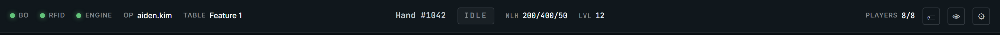

*↑ StatusBar 52px. 좌(연결 상태) · 중(게임 메타) · 우(보조 도구) 3 영역.*

### 2.1 좌 / 중 / 우의 분담

| 영역 | 표시 | 변화의 트리거 |
|------|------|--------------|
| **좌측** | ●BO ●RFID ●Engine + Op 이름 + Table 이름 | dot 색상 변화 + 펄스 |
| **중앙** | Hand # + PHASE + NLH 200/400/50 + Lvl 12 | PHASE 박스 색 (IDLE 회색 ↔ LIVE accent) |
| **우측** | Players 7/8 + 🏷 (tag) 👁 (hide GFX) ⚙ (Settings) | 운영자 클릭 |

### 2.2 dot 한 점이 말해 주는 3 가지

| dot 색상 | 의미 | 운영자 행동 |
|:-------:|------|-----------|
| ● 녹 (`var(--ok)`) | 정상 — 연결 OK | 무시 (정상은 시야에서 사라진다) |
| ● 주 (`var(--warn)`) | 경고 — 재연결 시도 중 | 곁눈으로 모니터 |
| ● 적 + 펄스 (`var(--err)`) | 오류 — 즉시 개입 | 시선 즉시 끌림 |

> ★ **디자인 원칙**: *정상은 보이지 않게, 비정상만 보이게*. 본방송 운영의 피로를 가장 직접적으로 줄이는 디자인.

---

## Ch.3 — TopStrip (158px) — 응시의 중심

StatusBar 가 *위쪽 계기판* 이라면 TopStrip 158 픽셀은 **계기판 + 헤드업 디스플레이 + 부조종사 알림** 이 합쳐진 곳. 운영자의 *눈높이* 영역.

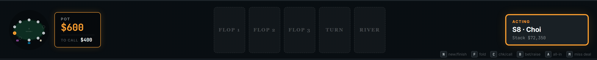

*↑ TopStrip 158px. 시선이 자연스럽게 좌→중→우로 흐른다.*

### 3.1 좌측 — MiniDiagram + POT 박스 (V3 + V10)

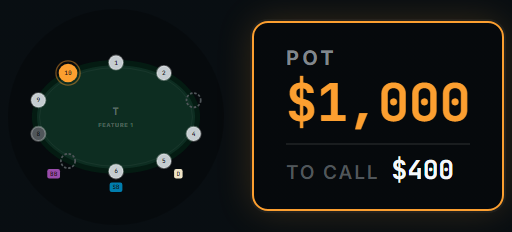

작은 타원 + 10 dots + D/SB/BB 뱃지 + POT 강조 박스. **1×10 그리드로 잃은 *공간 관계* 를 다시 회복** 시키는 핵심 위젯 (Ch.1.2 단점 보강).

| 요소 | 시각 |
|------|------|
| 타원 | felt 색상 (Q2 적용 시 회색-검정) |
| 10 dots | 점거 = 채움 / fold = 회색 / action_on = accent + 펄스 |
| D / SB / BB 뱃지 | dot 옆 작은 사각형 라벨 |
| POT 박스 | accent border + 큰 숫자 (예: $19,500) |
| `to call` 라인 | 현재 콜 금액 (action_on 좌석 기준) |

> ⚠️ **R2 거절 처리** (§Ch.14): SB/BB 정보가 PlayerColumn (편집 source) + MiniDiagram (read-only mirror) 두 곳에 표시되지만, **편집은 PlayerColumn 만**. MiniDiagram 의 dot 옆 뱃지는 표시만 (클릭 무시).

### 3.2 중앙 — Community Board (V8)

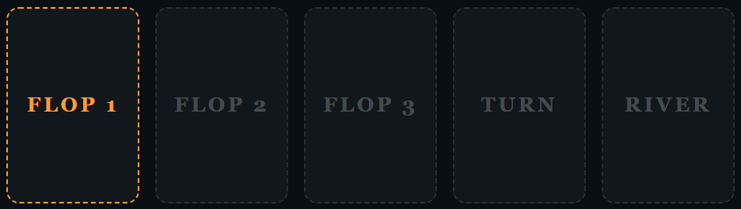

5 슬롯이 항상 표시. **빈 슬롯은 라벨로 명시** — FLOP 1 / FLOP 2 / FLOP 3 / TURN / RIVER. 채운 슬롯은 카드 PNG.

> ★ 시안 이전엔 "Card 1~5" 라는 일반 라벨이었다. 새 라벨이 운영자 인지 부하를 줄인다.

### 3.3 우측 — ACTING 박스 (V6 + V9)

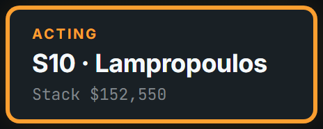

| 페이즈 | 박스 라벨 | 본문 | 메타 |
|--------|----------|------|------|
| **IDLE** | "WAITING" | "—" | "Press START HAND" |
| **PRE_FLOP / FLOP / TURN / RIVER** | "ACTING" | "S8 · Choi" | "Stack $72k" |
| **SHOWDOWN** | "SHOWDOWN" | "Reveal hands" | "Pot $19,500" |
| **HAND_COMPLETE** | "HAND OVER" | "Award pot" | "Press FINISH HAND" |

> ★ **이중 강조**: action_on 좌석은 PlayerGrid 에서 glow 펄스 + 우측 박스에 텍스트로도 명시 (V6+V9). 시청 거리 + 본방송 피로 모두 대응.

### 3.4 KeyboardHintBar (V1, ✅ 구현 완료)


TopStrip 하단 32px. 운영자가 자주 쓰는 6 키 (N · F · C · B · A · M) 를 칩으로 표시. 신규 운영자가 단축키를 외울 때까지의 *시각적 보조 바퀴*.

```
[N] new/finish   [F] fold   [C] chk/call   [B] bet/raise   [A] all-in   [M] miss deal
```

---

## Ch.4 — PlayerGrid (1×10) — 가로로 늘어선 10 명

이 영역이 v4.0 의 심장. 화면 중앙의 가로 그리드 안에 10 명의 선수가 한 줄로 정렬된다. 각 셀은 **9 행 stacked** 구조 — 한 셀 안에 *한 사람의 모든 정보* 가 수직으로 쌓인다.

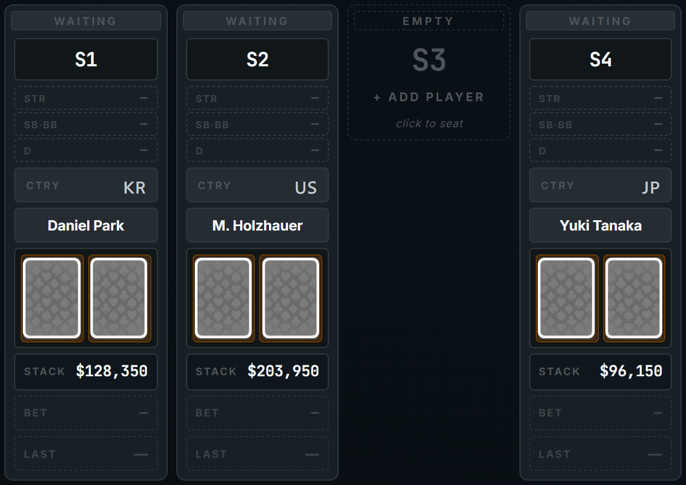

*↑ S1~S4 close-up. 위에서 아래로 9 행. 한 사람의 *전체 상태* 가 한 셀에.*

### 4.1 PlayerColumn 9 행 — 한 셀 해부 (V5)

| 행 | 정보 | 클릭 동작 |
|:-:|------|-----------|
| 1 | Acting strip (ACTING / WAITING / FOLD) | (read-only) |
| 2 | Seat # (S1~S10, 큰 글씨) | tap → 좌석 비우기 (pre-hand 만) |
| 3 | Position block (3 sub-rows: STRADDLE / SB·BB / D + 화살표) | 화살표로 D/SB/BB/STR 좌·우 이동 (V4) |
| 4 | Country flag | tap → FieldEditor (국기 선택) |
| 5 | Name | tap → FieldEditor (텍스트) |
| 6 | Hole cards 2장 | **R3 옵션 ON 시** tap → CardPicker (face-up 설정 가능, §Ch.10) |
| 7 | Stack ($) | tap → FieldEditor (숫자) |
| 8 | Bet ($) | tap → FieldEditor (숫자) |
| 9 | Last action (FOLD/CALL/BET 등) | tap → 강제 override |

> ★ **9 행의 모든 정보가 클릭 한 번으로 편집 가능**. 본방송 운영 중 키보드 ↔ 마우스 왕복이 사라진다.

### 4.2 ACTING 좌석의 glow 펄스

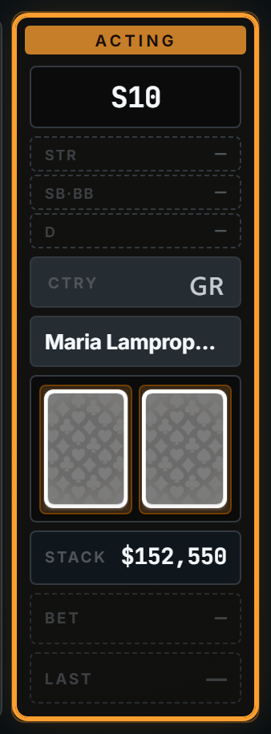

action_on 좌석은 cell border 가 accent 색으로 펄스 한다. 가로 10 셀 중 *어디에 액션이 있는지* 가 일자 시선의 흐름 안에서 즉시 보인다.

### 4.3 빈 좌석 → ADD PLAYER affordance (V12)

빈 좌석은 **EMPTY + S{n} + "+ ADD PLAYER"** 표시. 클릭 시 FieldEditor 의 add 모드 진입 — 이름 / 국적 / 시작 스택을 입력.

### 4.4 Pre-hand DELETE strip (V15)

운영자가 핸드 진행 중 좌석을 실수로 비울 수 없도록, **Pre-hand 상태 (IDLE / HAND_COMPLETE / SHOWDOWN) 에서만** 행 1 의 ACTING strip 이 "✕ DELETE" 로 변환. 클릭 시 좌석 비움 + 포지션 마커 자동 제거.

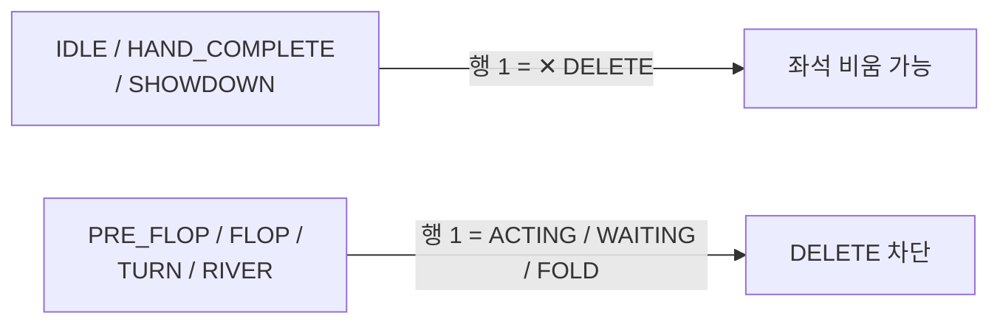

### 4.5 Position Shift Arrows (V4)

PosBlock 의 각 행 (STRADDLE / SB·BB / D) 양 끝에 좌·우 화살표. **좌석 간 D/SB/BB/STR 마커를 즉시 이동 가능** — 게임 시작 직전 셋팅 변경 시 핵심.

```
  [‹ STR ›]   ← STRADDLE 마커를 좌/우 좌석으로 이동
  [‹ SB  ›]   ← SB 마커
  [‹ BTN ›]   ← Dealer 버튼
```

---

## Ch.5 — ActionPanel (124px) — 6 키의 영역

화면 하단 124 픽셀. 본방송 동안 운영자의 손가락이 머무는 영역. 8 분리 버튼이었던 시안 이전 시대가 끝나고, **6 키 (5 게임 + 1 비상)** 의 시대가 시작된다.

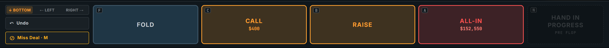

### 5.1 Phase-aware 버튼 (V14 — 시안의 가장 큰 선물)

같은 키, phase 에 따라 다른 의미. 손가락은 늘 같은 자리에 있고, *의미가 그 손가락 밑에서 알아서 바뀐다*.

| 단축키 | IDLE | PRE_FLOP & 베팅 활성 | SHOWDOWN / HAND_COMPLETE | 분류 |
|:------:|:----:|:--------------------:|:-----------------------:|:----:|
| **N** | START HAND | (disabled — "HAND IN PROGRESS") | FINISH HAND | 핸드 lifecycle |
| **F** | (disabled) | FOLD | (disabled) | 게임 액션 |
| **C** | (disabled) | CHECK *or* CALL (auto-switch) | (disabled) | 게임 액션 |
| **B** | (disabled) | BET *or* RAISE (auto-switch) | (disabled) | 게임 액션 |
| **A** | (disabled) | ALL-IN | (disabled) | 게임 액션 |
| **M** | (disabled) | Miss Deal | (disabled) | 비상 |

**자동 전환 룰**:
- `biggestBet == playerBet` → **CHECK** (콜할 게 없음)
- `biggestBet > playerBet` → **CALL** (맞춰야 함)
- `biggestBet == 0` → **BET** (첫 베팅)
- `biggestBet > 0` → **RAISE** (이미 베팅 있음)

> ★ **V14 의 가치**: *같은 키 = 같은 손가락 위치 = 다른 의미*. **단축키는 6 키 (N/F/C/B/A/M) + Ctrl+Z (UNDO) 로 모든 작업 가능**. 손가락은 알파벳을 외우지 않고, *위치* 를 외운다.

### 5.2 Numpad (BET/RAISE 입력) — V16

`B` 키를 누르면 화면 하단에 슬라이드 업.

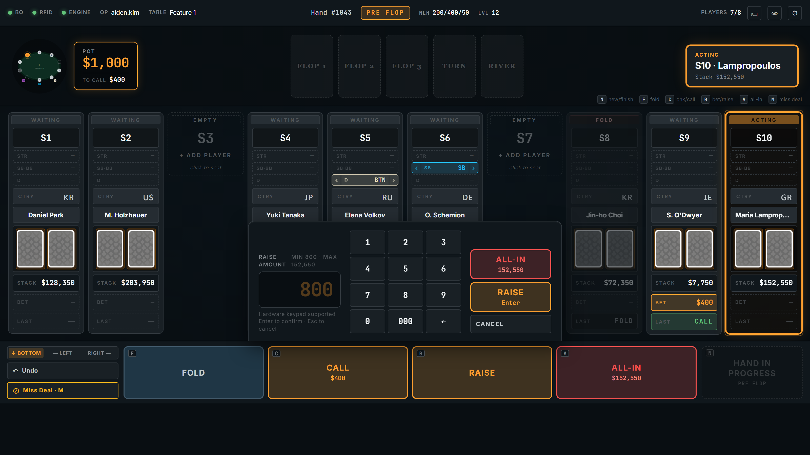

| 키 | 동작 |
|:--:|------|
| 0~9 | 한 자리 추가 |
| **000** | 세 자리 추가 (1000 단위 빠른 입력) |
| **←** | 한 자리 지우기 |
| **← long-press 500ms** | 전체 클리어 |
| **Enter** | 확인 |
| **Esc** | 취소 |

> ★ **V16 의 가치**: 운영자가 "10000" 입력 시 1 → 0 → 0 → 0 → 0 (5 키) 대신 **1 → 0 → 000** (3 키). 한 입력당 약 0.7s → 0.4s 감축. 본방송 누적 효과는 액션 빈도에 비례하며, 외부 하드웨어 키패드도 자동 매핑.

### 5.3 좌측 보조 버튼

| 버튼 | 키 | 의미 |
|------|:--:|------|
| ↶ Undo | Ctrl+Z | 직전 액션 되돌리기 (현재 핸드 내 무제한) |
| ⊘ Miss Deal | M | 핸드 무효 + 스택 복구 |

---

## Ch.6 — 9 단계의 파동 (HandFSM)

핸드 한 회는 9 단계로 흐른다. 이 9 단계가 EBS 의 *시간 척도 가장 작은 단위* — HandFSM 9-state.

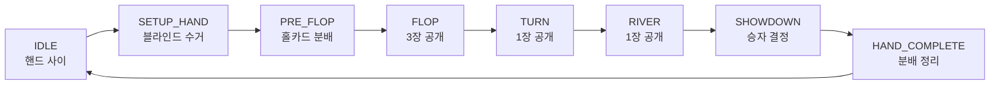

> 💡 **약어 풀이**: **HandFSM** = Hand Finite State Machine. 한 핸드가 거치는 *고정된 9 단계 흐름*. *역행 불가* 보장 — IDLE 에서 PRE_FLOP 로만 갈 수 있을 뿐, FLOP 에서 PRE_FLOP 로 돌아갈 수 없다. 잘못된 입력을 *상태 자체* 가 차단한다.

> ⚠️ **R5 거절 처리** (§Ch.14): React 시안의 HandFSM 은 7-state (SETUP_HAND 누락). EBS 는 **9-state 보존** — 블라인드 수거 단계가 Rive 애니메이션 트리거에 필수.

### 6.1 단계별 화면 변화

| HandFSM | StatusBar | TopStrip ACTING | PlayerGrid | ActionPanel |
|---------|-----------|----------------|-----------|-------------|
| **IDLE** | "IDLE" | "WAITING — Press START HAND" | 이름 + 스택만 | [N] START HAND only |
| **SETUP_HAND** | "Setting Up" | "BLINDS" | SB/BB 좌석 칩 이동 애니메이션 | (전부 disabled) |
| **PRE_FLOP** | "PRE FLOP" + 팟 | "ACTING — S{n} · Name" | 카드 슬롯 face-down `?`, action_on glow | [F][C][B][A] 활성 |
| **FLOP / TURN / RIVER** | 동일 | 동일 | 보드 카드 추가, 폴드 좌석 반투명 | 동일 |
| **SHOWDOWN** | "SHOWDOWN" | "Reveal hands" | 남은 좌석 카드 face-up flip | (특수 버튼) |
| **HAND_COMPLETE** | "HAND OVER" | "Award pot — Press FINISH HAND" | 팟 분배 → 스택 갱신 | [N] FINISH HAND only |

### 6.2 운영자 손가락 흐름 (반복 패턴)

```
  N → 액션 × N → ... → SHOWDOWN → N → ...
  └ START HAND
     └ (auto SETUP_HAND, 블라인드 자동 수거)
        └ DEAL (RFID 자동 인식)
           └ FOLD/CHECK/BET/CALL/RAISE/ALL-IN × N
              └ 다음 페이즈 자동 진입
                 └ 마지막 베팅 → SHOWDOWN
                    └ N FINISH HAND → IDLE
```

같은 패턴이 본방송 내내 반복된다. 운영자의 손가락이 알파벳을 외우지 않는 것 — 그 자체가 *근육 기억* 의 산물.

---

## Ch.7 — RFID, 손이 닿지 않는 카드 인식

운영자는 본방송 동안 *카드 한 장도 키보드로 입력하지 않는다*. 그저 딜러가 카드를 테이블 위에 놓는 순간, 화면이 그 카드를 알아챈다.

> 💡 **약어 풀이**: **RFID** = Radio-Frequency Identification. 카드 안에 박힌 작은 칩이 테이블 천 아래의 안테나 12 개와 무선 신호를 주고받아 *어떤 카드인지* 정확히 식별. 운영자는 모니터를 보지 않고도 카드 인식 여부를 안다.

### 7.1 RFID 자동 인식 흐름


> ★ 운영자는 *카드를 입력하지 않는다*. **물리적 카드가 곧 디지털 데이터**. 카드 인식까지 운영자가 입력해야 한다면 ActionPanel 이 16~20 버튼이 됐을 것이다.

### 7.2 CardPicker — RFID 가 멈출 때의 백업

RFID 가 고장 나거나 개발 환경에서는 **CardPicker** 모달이 백업으로 뜬다. 52 카드를 4×13 그리드로 펼쳐 놓고, 클릭 한 번으로 카드를 설정.

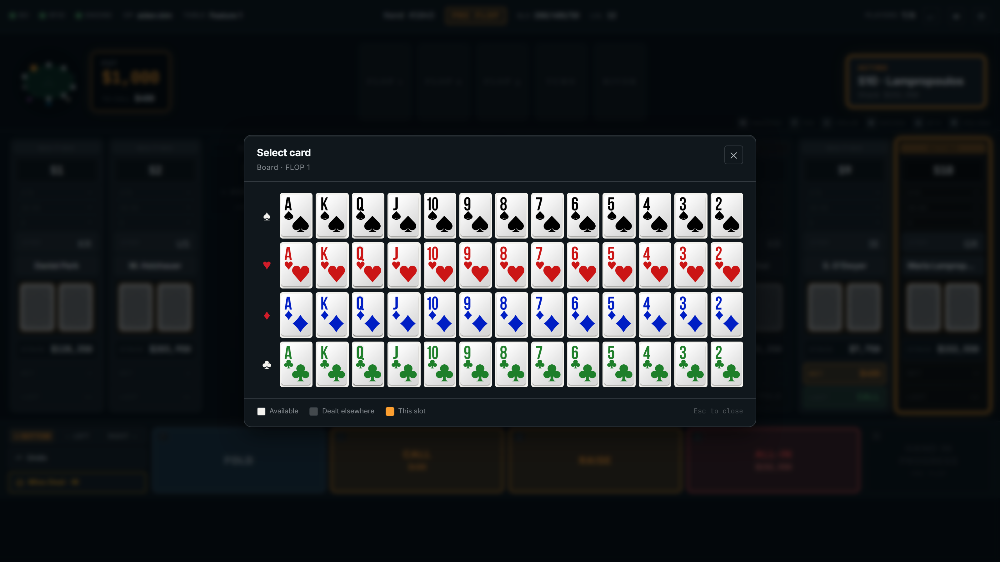

*↑ 보드 카드 슬롯 클릭 시 CardPicker 모달. 이미 사용된 카드는 disabled.*

### 7.3 CardPicker 호출 정책

> Hole cards 의 옵션 분기 정책은 §Ch.10.5 "Hole Card Visibility 매트릭스" 가 SSOT. 본 챕터에서는 RFID 백업 동작만 다룬다.

board (5 슬롯) 클릭 → CardPicker 항상 허용. **hole cards 의 클릭 동작은 옵션에 따라 다름** (§Ch.10).

### 7.4 Mock RFID 모드 (개발 / 비상)

| 시나리오 | 사용 |
|----------|------|
| 개발 환경 | RFID 하드웨어 없이 Flutter 로 CC 테스트 |
| 비상 운영 | RFID 리더 고장 시 운영자 수동 입력으로 방송 계속 |

Real 모드와 Mock 모드는 **CC 코드의 99% 가 동일**. 차이는 RFID HAL (Hardware Abstraction Layer) 어댑터 한 곳만 교체. 하드웨어 장애가 방송을 중단시키지 않는다 — 자동화 수준이 일시적으로 낮아질 뿐.

---

## Ch.8 — 실수의 정정 (UNDO + Miss Deal)

운영자도 사람. 오랜 본방송 동안 키 입력 중 *실수가 0 일 수는 없다*. CC 의 두 번째 안전장치가 여기 있다.

### 8.1 UNDO — 무제한 (현재 핸드 내)


핸드가 종료되면 (HAND_COMPLETE) UNDO 가능 범위 종료. 다음 핸드는 *새 history*. 한 핸드 안에서는 무제한 되돌릴 수 있다.

### 8.2 Miss Deal — 핸드 무효 + 스택 복구

| 상황 | Miss Deal 처리 |
|------|---------------|
| 잘못된 카드 분배 (예: 한 장만 받은 선수) | 모든 선수 스택 → 핸드 시작 직전 상태로 복구 |
| RFID 오인식이 다중 발생 | snapshot 으로 복구 |
| 운영자 판단 — 핸드 중단 | 같은 처리 |

`M` 키로 호출. 모달이 떠서 *"정말 무효 처리?"* 확인 후 진행.

---

## Ch.9 — 한 클릭의 합주 (Engine + BO + Overlay)

운영자가 `F` 키를 누르는 순간 — 그 한 클릭이 동시에 *세 시스템* (Engine + BO + Overlay) 을 움직인다. CC 는 단순 입력 도구가 아니라 **Orchestrator (지휘자)**.

> 약어 풀이는 §Ch.1.0 (Engine / BO / Overlay / Rive) 참조.

### 9.1 한 액션의 5 단계

운영자가 FOLD 단축키 (F) 를 누르는 순간 무슨 일이 벌어질까?

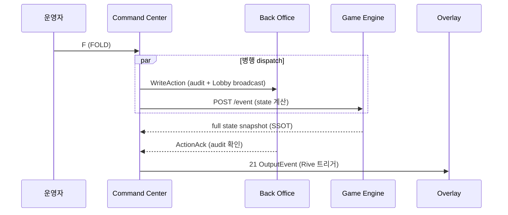

5 단계가 평균 **50ms** 안에 완료된다. 운영자는 손가락이 키에서 떨어지기 전에 화면이 갱신되는 것을 본다.

### 9.2 진실의 우선순위

CC 는 두 응답 (Engine state + BO ack) 을 받는다. 두 응답이 모순되면? **Engine 응답을 진실로 받아들인다**.

| 데이터 | SSOT | 이유 |
|--------|:----:|------|
| 게임 상태 (카드, 팟, 라운드) | **Engine** | 22 종 포커 규칙의 unique 진실 |
| audit / Lobby broadcast | BO | 영구 보관 + 실시간 분산 |

> ★ 이 분리 덕분에 **BO 가 다운되어도 Engine 응답으로 게임은 계속**. CC 는 로컬 버퍼에 audit 발행을 누적하다가 BO 복구 후 일괄 전송. 시청자 화면 (Overlay) 은 Engine → CC → Overlay 직접 경로이므로 BO 다운에 영향 받지 않는다.

> ⚠️ **R4 거절 처리** (§Ch.14): React 시안은 100% 로컬 상태 (useState 만). EBS 는 **Engine + BO 병행 dispatch** 모델 보존. 시안의 game logic 함수는 시각 reference 일 뿐, EBS 구현은 Engine HTTP + BO WebSocket 동시 호출.

---

## Ch.10 — Hole Card Visibility (D7 + R3 옵션화)

이 챕터의 결론을 먼저 말한다. **CC 운영자는 기본적으로 hole cards 의 값을 영원히 보지 못한다 — 단, 옵션 토글이 *허용* 한 경우에만 예외**. 본 PRD 의 스크린샷은 *옵션 ON 상태* 를 가정해서 캡처됐다.

### 10.1 D7 의 의도 — 운영자 부정 방지

> 💡 **D7 정본**: `Command_Center_UI/Overview.md §5.1 D7` (2026-04-22 회의 결정). 본 챕터는 그 derivative.

CC 오퍼레이터는 테이블에서 떨어진 후방 컨트롤룸에서 근무한다. 만약 그가 hole cards 의 값을 미리 안다면:

1. 시청자 송출 *전에* 외부로 정보 누설 (소셜 미디어 / 외부 통신)
2. 베팅 결과 예측 → 외부 조작 위험

이 위험을 막는 것이 D7 의 의도다.

> **역할 분리** (2026-05-05 명문화): 딜러는 테이블에서 플레이어 액션을 진행하는 *진행자*, CC 입력자는 후방 컨트롤룸의 *CC 오퍼레이터*. 두 사람은 물리적으로 다른 위치에서 다른 역할을 수행한다.

### 10.2 R3 — 거절이 아닌 옵션화

React 시안의 CardPicker 는 board / hole 모두 face-up 임의 노출이 가능했다. v4.0 은 이를 *단순 거절* 이 아닌 **옵션화** — D7 의 본질 (운영자 부정 방지) 은 보존하되 *언제 토글 가능한지* 의 매트릭스 명시.

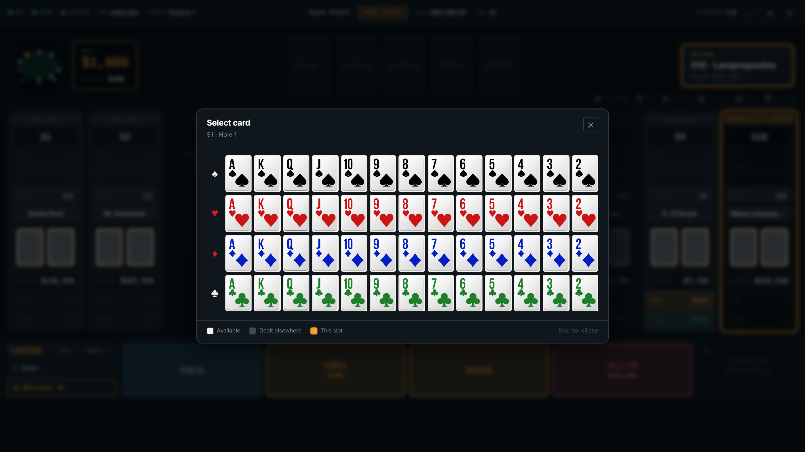

*↑ 옵션 ON 상태에서 PlayerColumn 의 hole card 슬롯 클릭 → CardPicker. 옵션 OFF 시 같은 클릭은 무시된다.*

### 10.3 두 모드 비교

| 항목 | OFF (Production 기본) | ON (Admin / Debug) |
|------|---------------------|-------------------|
| **모드 의도** | 운영자 부정 방지 (D7) | 디버그 / 특수 replay / 테스트 |
| **CC 화면 hole 표시** | face-down `?` 만 | face-down (init) → 클릭 시 face-up 가능 |
| **PlayerColumn 행 6 클릭** | 무시 | CardPicker 호출 |
| **CardPicker 동작 (hole)** | 차단 (모달 안 뜸) | 52 카드 그리드 표시 |
| **Overlay 송출** | 변화 없음 (시청자 정상 노출) | 변화 없음 |
| **audit 로그** | hole 변경 이벤트 0 | hole 변경 이벤트 강제 기록 + 알림 |
| **CI 정적 가드** | 강제 적용 (`tools/check_cc_no_holecard.py`) | bypass 모드 (격리 디렉토리 + 명시 주석) |

### 10.4 옵션 토글 메커니즘 — 다층 보안 (C3 보강)

> ⚠️ **C3 critic 응답**: 단일 Admin 토글은 single point of failure 위험. v4.0 은 **다층 보안** 으로 보강.

| 항목 | 내용 |
|------|------|
| **저장 위치** | `cc_config.holeCardVisibility: "PRODUCTION"｜"ADMIN"｜"DEBUG"` (Lobby Settings) |
| **변경 권한 — Layer 1** | RBAC `Admin` (Operator / Viewer 는 read-only) |
| **변경 권한 — Layer 2 (NEW v4.0)** | **2 인 승인 필수** — Admin + 별도 Manager 동시 승인 (4-eyes principle) |
| **세션 영속** | CC 인스턴스 launch 시 결정 — 핸드 도중 변경 불가 |
| **시간 제한 (NEW v4.0)** | ON 상태는 **최대 60 분 자동 OFF** (manual extend 시 또 2 인 승인) |
| **부팅 알림 (NEW v4.0)** | 옵션 ON 시 CC 부팅 banner + Operator 화면 상단 빨강 띠 ("⚠ DEBUG MODE — Hole cards visible") |
| **물리 영역 가정 (NEW v4.0)** | Admin 토글은 카지노 보안 영역 (CCTV + 출입 통제) 안 단말에서만 가능 — VPN 원격 차단 |
| **시청자 영향** | 없음 — 옵션은 CC 화면에만 영향. Overlay 는 Engine 응답 그대로 |
| **audit 트레일** | 토글 시점 + 변경자 (2명) + 사유 (text) + 부팅 시 ON 상태 자동 기록 + 60 분 expire 시 알림 |

> 💡 **약어 풀이**: **RBAC** = Role-Based Access Control. *역할에 따른 접근 권한 분리*. Admin / Manager / Operator / Viewer 4 등급. **4-eyes principle** = 두 사람의 동시 승인 — 한 명의 부정 의도를 다른 한 명이 차단.

> ★ **C3 응답 핵심**: D7 의 의도 (부정 방지) 는 *옵션화* 로 약해지지 않는다. 4 단 방어 (RBAC + 2 인 승인 + 60 분 timeout + 물리 영역 제한) 로 *single point of failure* 를 다중화. audit 은 사후 추적이지만, 부팅 banner 와 Operator 빨강 띠는 *진행 중 가시 경고*.

### 10.5 비노출 / 노출 매트릭스 (전체 — SSOT)

> 본 표가 §Ch.7.3 의 SSOT. 다른 챕터는 본 표를 참조한다 (DRY).

| 정보 | CC (OFF) | CC (ON) | Overlay (시청자) | 근거 |
|------|:-------:|:-------:|:----------------:|------|
| **hole cards 값** | ❌ 비노출 | ⚠ **옵션 노출** | ✅ 노출 | D7 + R3 옵션 |
| hole cards 분배 여부 | ✅ face-down `?` | ✅ face-down or face-up | ✅ 정상 | 운영자 분배 인지 |
| community cards | ✅ 노출 | ✅ 노출 | ✅ 노출 | 공개 정보 |
| pot / stacks / bets | ✅ 노출 | ✅ 노출 | ✅ 노출 | 공개 정보 |

### 10.6 외부 인계자에게

옵션 토글의 **Production default 는 OFF**. 본 PRD 의 스크린샷 (`13-cardpicker-hole-option-on.png`) 은 *옵션 ON 상태의 동작 확인용*. 실제 라이브 방송 환경에서 운영자는 hole cards 값을 *영원히* 보지 못하며, ON 모드는 *60 분 시간 제한 + 2 인 승인 + 물리 영역 제한* 의 4 단 방어 안에서만 임시 활성화.

---

## Ch.11 — Lobby 와 같은 디자인 톤 (Q2)

운영자가 보는 *조종석* (CC) 과 카지노 매니저가 보는 *관제탑* (Lobby) — 두 화면이 같은 *디자인 톤* 을 입어야 인지 부담이 줄어든다. 사용자 결정 (Q2, 2026-05-07): **Lobby B&W refined minimal 톤 통일**.

### 11.1 시안 ↔ EBS 톤 차이

> 💡 **약어 풀이**: **oklch** = CSS 의 색상 표기 함수 (Lightness + Chroma + Hue 모델). Hex (#000) 보다 *지각적으로 균일한* 색상 계산이 가능. 본 시안은 Lightness 0.16 / 채도 0.012 / Hue 240° = 다크 블루 톤.

| 항목 | React 시안 (스크린샷) | EBS 최종 (구현) |
|------|---------------------|-----------------|
| Primary 배경 | `oklch(0.16 0.012 240)` 다크 블루 | `#0A0A0A` (진한 회색-검정) |
| Felt | 녹색-청록 felt | 회색 / 검정 |
| Accent | 라임-옐로우 (`oklch(0.78 0.16 65)`) | 흰색 또는 미세 회색 |
| Card 색상 | `oklch(0.96 0.005 90)` 크림 | 화이트 + 검정 outline |
| 본문 텍스트 | 다크 배경 + 밝은 흰 | B&W 그라데이션 |

### 11.2 본 PRD 스크린샷의 의미

본 PRD 의 모든 스크린샷은 **layout / structure / interaction** 만 reference. 색상 / 톤은 무시 — Lobby_PRD §디자인 토큰을 SSOT 로 따른다.

> ★ Lobby 개발자에게: **이 PRD 의 색상은 무시하고, Lobby_PRD §디자인 토큰을 SSOT 로 따라 주세요**. 레이아웃 / 간격 / 인터랙션만 참조 대상.

---

## Ch.12 — 외부 개발팀 구현 가이드

### 12.1 변경 요약 — 무엇이 바뀌고, 무엇이 그대로인가

| 영역 | 변경 |
|------|------|
| Flutter widget tree | **6 신규 위젯 + 1 보강 + 1 폐기 (oval Seat)** + Hole Card Visibility 옵션 토글 추가 |
| Engine 통신 | **변경 없음** (R4 가드) |
| WebSocket schema | **변경 없음** |
| BO REST | `cc_config.holeCardVisibility` 토글 endpoint 추가 (`PUT /cc/:id/config` + 2-eyes 승인 endpoint) |
| RFID HAL | **변경 없음** |
| OutputEvent 21 종 | **변경 없음** |
| HandFSM | **9-state 보존** (R5 가드) |
| CardPicker | **board 항상 + hole = 옵션 ON 시만** (R3 옵션화) |
| 디자인 토큰 | **Lobby B&W refined minimal 통일** (Q2) |
| 화면 크기 | **Auto-fluid 720px+** (Q3 — 현 EBS 보존) |
| 카드 자산 | **Rive runtime** (Q4 — 현 EBS 보존, Overlay 와 통일) |

### 12.2 신설 / 폐기 widget 목록

| Widget | 동작 | 줄 수 추정 |
|--------|------|:---------:|
| `cc_status_bar.dart` | 좌·중·우 한 줄 통합 | 60 |
| `top_strip.dart` | 3 영역 grid | 120 |
| `mini_diagram.dart` | 작은 oval + dots + POT 박스 | 80 |
| `acting_box.dart` | 우측 상태 박스 | 40 |
| `player_column.dart` (V5 핵심) | 9 행 stacked + 옵션 분기 | **260** |
| `pos_block.dart` | 3 sub-rows + shift arrows | 80 |
| `numpad.dart` (V16 보강) | 0/000/← long-press | 60 |
| `hole_card_visibility_toggle.dart` (옵션 UI + 2-eyes) | Lobby Settings + RBAC + 60 분 timer | 80 |
| `seat_widget.dart` (oval) | **폐기** | -150 |
| **계** | | **~630 net** |

### 12.3 의존성 / 순서

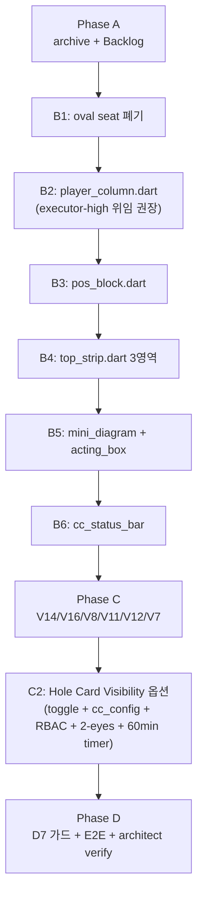

### 12.4 가드레일 — runtime 강제 (C4 보강)

> ⚠️ **C4 critic 응답**: G1 가드가 옵션 OFF 모드에만 적용되면 옵션 ON 코드가 *동일 binary* 안에 공존 — 정적 가드는 경고일 뿐. v4.0 은 **runtime 강제** 추가.

| # | 가드 | 검증 (정적 + 동적) |
|:-:|------|------|
| **G1** | D7 hole card 값 노출 금지 (default OFF 모드) | (1) 정적: `tools/check_cc_no_holecard.py` CI. (2) **runtime: 모든 hole card render call 에 `assert(cc_config.holeCardVisibility == 'PRODUCTION')` 강제** — 옵션 OFF 시 위반 즉시 crash + audit log. (3) 부팅 banner: 옵션 ON 시 화면 상단 빨강 띠. |
| **G2** | CDN 의존 도입 금지 (카지노 LAN 호환) | `pubspec.yaml` 리뷰 + asset 디렉토리 모니터링 |
| **G3** | 통신 모델 (Engine HTTP + BO WS 병행 dispatch) 보존 | `engine_output_dispatcher.dart` diff = 0 |
| **G4** | HandFSM 9-state 보존 | `hand_fsm_provider.dart` 테스트 |

> ★ **G1 의 runtime 강제**: 옵션 ON 코드 경로는 별도 디렉토리 (`team4-cc/lib/admin_only/`) + 별도 PR + reviewer 2 명 + boot-time `holeCardVisibility != 'PRODUCTION'` 시 부팅 시점 audit + 화면 상단 빨강 띠 자동 표시. 정적 가드 + runtime 가드 + 가시 경고 3 단 방어.

### 12.5 AT 화면 8 종 카탈로그 (NEW v4.0 — H3 보강)

> 정본 (`Command_Center_UI/Overview.md §6`) 의 8 개 AT 화면. 본 PRD 는 AT-01 Main 을 중심으로 다뤘지만, 외부 개발팀이 구현해야 할 *전체 화면 카탈로그* 는 다음과 같다.

| AT ID | 화면 | 진입 경로 | 본 PRD 다룸 위치 |
|:-----:|------|----------|----------------|
| **AT-00** | Login | 앱 시작 | (정본 `BS-01-auth`) |
| **AT-01** | Main | Login 성공 | **Ch.1~Ch.5 (본 PRD 핵심)** |
| **AT-02** | Action View | AT-01 Layer 4~6 오버레이 (핸드 진행 중) | Ch.5 (액션 패널 활성 상태) |
| **AT-03** | Card Selector | 카드 슬롯 탭 또는 RFID Fallback | Ch.7.2 CardPicker |
| **AT-04** | Statistics | M-01 Toolbar → Menu | (정본 `BS-05-07-statistics.md`) |
| **AT-05** | RFID Register | Settings 또는 메뉴 | (정본 `BS-04-05-register-screen.md`) |
| **AT-06** | Table Settings (Rules 탭) | M-01 Toolbar `[⚙]` | Ch.10.4 (Hole Card Visibility 토글) |
| **AT-07** | Player Edit | 좌석 요소 탭(인라인) | Ch.4.1 행 4/5/7/8 (FieldEditor) |

> ★ AT-00 / AT-04 / AT-05 는 본 PRD scope 밖 — 정본 직접 reference. AT-06 의 Hole Card Visibility 토글은 본 PRD 의 핵심 신규 기능 (§Ch.10.4).

---

## Ch.13 — 사용자 결정 Q1~Q4

| ID | 항목 | 결정 | 적용 챕터 |
|:--:|------|------|---------|
| **Q1** | 레이아웃 패러다임 | **1×10 grid** | Ch.1, Ch.4 + 모든 스크린샷 |
| **Q2** | 디자인 톤 | **Lobby B&W refined minimal** | Ch.11 |
| **Q3** | 화면 크기 | **Auto-fluid 720px+** | Ch.12.1 |
| **Q4** | 카드 자산 | **Rive runtime** | Ch.12.1 |
| **R3 재해석** | hole card 가시성 | **옵션화 (default OFF, Admin ON, 4 단 방어)** | Ch.10 |

---

## Ch.14 — 거절 매트릭스 R1/R2/R4/R5

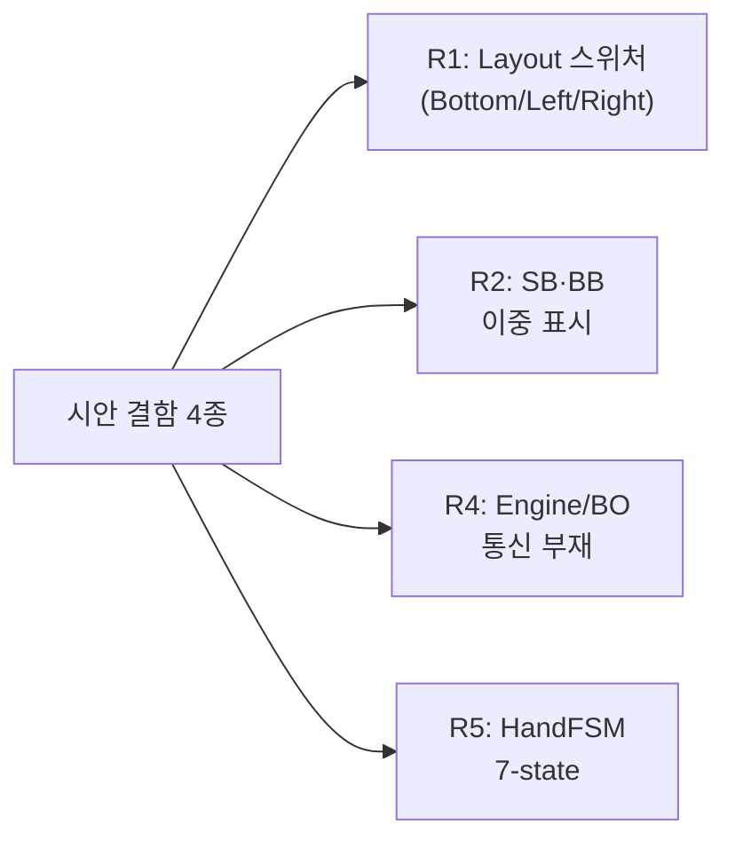

### R1 — Layout 스위처

| 항목 | 내용 |
|------|------|
| **시안 위치** | `App.jsx` `data-layout` 속성 + ActionPanel 의 layout-switcher 버튼 그룹 ([↓ Bottom] [← Left] [Right →]) |
| **시안 동작** | ActionPanel 위치를 화면 좌/우/하단으로 변경. CSS grid-template-columns 동적 전환 |
| **거절 이유** | (1) 단일 운영자 1 CC 가정 — 다중 layout 학습은 본방송 중 근육 기억 파괴. (2) 우상단 `[⚙]` 클릭 사고 시 우연히 layout 변경 → 즉시 화면 재배치 → 작업 중단. (3) 키보드 우선 (마우스 거의 안 씀) 설계 원칙 모순 |
| **EBS 처리** | **Bottom 단일 고정**. layout-switcher 버튼 자체를 제거 |

### R2 — SB·BB 이중 표시

| 항목 | 내용 |
|------|------|
| **시안 위치** | `MiniDiagram.jsx` line 55-74 (dot 옆 D/SB/BB 뱃지) + `PlayerColumn.jsx` PosBlock — 두 곳 모두 편집 가능 |
| **시안 동작** | 운영자가 어느 곳에서든 SB/BB 마커 변경 가능 |
| **거절 이유** | SSOT 위반. 두 곳 모두 source 면 두 값 충돌 시 처리 미정. 운영자 인지 부하 — *어디를 편집할지* 매 초 결정 |
| **EBS 처리** | **PlayerColumn = 편집 source** (V4 화살표). **MiniDiagram = read-only mirror** (자동 반영만) |

### R4 — Engine/BO 통신 부재

| 항목 | 내용 |
|------|------|
| **시안 위치** | `App.jsx` 전체. `useState(window.INITIAL_STATE)` + 자체 game logic (`firstLive`, `isRoundClosed`, `advanceStreetIfClosed`, `handleNewHand`, `handle`). HTTP / WebSocket 호출 0 |
| **시안 동작** | 100% 로컬 상태. *in-browser game simulation* |
| **거절 이유** | EBS §Ch.9 Orchestrator 모델 부재. (1) Engine = 게임 상태 SSOT, (2) BO = audit + Lobby broadcast. 시안 그대로 이식 시 멀티 CC 간 상태 동기화 / Replay / 영구 기록 모두 깨짐 |
| **EBS 처리** | **시안 = 시각 reference only**. game logic 은 Game Engine + BO 가 처리. CC 는 Orchestrator 로 Engine HTTP + BO WS 병행 dispatch |

### R5 — HandFSM 7-state (SETUP_HAND 누락)

| 항목 | 내용 |
|------|------|
| **시안 위치** | `App.jsx` line 142 `handleNewHand` — 호출 즉시 `phase: "PRE_FLOP"` 직접 전환. NEXT_STREET 매핑도 7-state |
| **시안 7-state** | IDLE / PRE_FLOP / FLOP / TURN / RIVER / SHOWDOWN / HAND_COMPLETE |
| **EBS 9-state** | IDLE / **SETUP_HAND** / PRE_FLOP / FLOP / TURN / RIVER / SHOWDOWN / HAND_COMPLETE / 정리 phase |
| **거절 이유** | (1) `Command_Center_UI/Overview.md §4.1` 정합 위반. (2) SETUP_HAND = 블라인드 수거 = Rive 애니메이션 트리거 시간. 누락 시 시청자 화면 칩 모션 끊김. (3) HandFSM 9-state 가 21 OutputEvent 와 1:1 대응 |
| **EBS 처리** | **SETUP_HAND 재삽입**. NEW HAND → SETUP_HAND (1초 자동) → PRE_FLOP. UI 에서 운영자 명시적으로 거치지 않음, 내부 상태는 9 단계 모두 |

### R3 옵션화 (참조)

R3 는 거절이 아닌 **옵션화** — 자세한 정책은 §Ch.10 참조.

---

## Ch.15 — 시각 자산 17 종 (V1~V17)

| ID | 자산 | 비고 |
|:--:|------|------|
| V1 | KeyboardHintBar | ✅ 2026-05-06 구현 |
| V2 | StatusBar 통합 한 줄 | Ch.2 |
| V3 | MiniDiagram (oval + dots + 뱃지) | Ch.3.1 |
| V4 | PositionShiftChip | Ch.4.5 |
| V5 | PlayerColumn 9행 stacked | Ch.4.1 |
| V6 | ACTING glow + 명시 박스 | Ch.3.3 + Ch.4.2 |
| V7 | TweaksPanel (debug only) | (debug 빌드만) |
| V8 | FLOP·TURN·RIVER 슬롯 라벨 | Ch.3.2 |
| V9 | ACTING 우측 명시 박스 | Ch.3.3 (V6 결합) |
| V10 | POT 좌상단 강조 박스 | Ch.3.1 (V3 결합) |
| V11 | 베팅 칩 부유 시각 | Ch.4.1 행 8 |
| V12 | 카드 슬롯 + ADD affordance | Ch.4.3 |
| V13 | IDLE disabled visual hint | Ch.5 (정합 확인) |
| V14 | Phase-aware buttons | Ch.5.1 |
| V15 | Pre-hand DELETE strip | Ch.4.4 |
| V16 | Numpad 0/000/← long-press + hardware keypad | Ch.5.2 |
| **V17** | **Hole Card Visibility 옵션 토글** (Lobby Settings + RBAC + 2-eyes + 60min timer) | **Ch.10 (R3 옵션화)** |

---

## EPILOGUE — 본방송 종료 후

본방송 한 회가 끝난 자리. 운영자는 헤드셋을 벗는다. 모니터에 마지막 핸드의 HAND_COMPLETE 라벨이 남아 있다.

핸드 기록은 BO 에 영원히 새겨졌고, OutputEvent 가 Rive 애니메이션을 시청자에게 전달했다. CC 는 Engine 과 BO 두 시스템을 *동시에* 지휘했고, 단 한 번도 멈추지 않았다.

운영자의 손가락이 키에서 떨어졌을 때, 화면은 다시 정적인 IDLE 상태가 된다 — 첫 화면과 같은 모습으로.

> 이것이 Command Center 다.

---

## 더 깊이 알고 싶다면

| 주제 | 정본 문서 |
|------|----------|
| **D7 카드 비노출 정본** | `Command_Center_UI/Overview.md §5.1` |
| CC 전체 통합 비전 | `Foundation.md §Ch.5.4` |
| CC 기능 명세 + Action-to-Transport Matrix | `Command_Center_UI/Overview.md` |
| RFID HAL + 52 카드 매핑 | `RFID_Cards/Overview.md` |
| 21 OutputEvent 카탈로그 | `Overlay/OutputEvent.md` |
| Engine REST API | `2.3 Game Engine/APIs/Harness_REST_API.md` |
| Lobby 디자인 톤 SSOT | `Lobby_PRD.md §디자인 토큰` |
| BO 와의 데이터 흐름 | `Back_Office_PRD.md §Ch.2` |
| AT 화면 8 종 상세 | `Command_Center_UI/Overview.md §6` |

---

## Changelog (간소)

| 날짜 | 버전 | 핵심 변화 |
|------|:---:|----------|
| 2026-05-07 | **4.0.0** | Reader Panel critic 16 fix cascade — 숫자 fact-check / 5 vs 6 키 모순 / R3 보안 4 단 방어 / G1 runtime 강제 / 약어 첫 등장 풀이 / 1×10 trade-off honest / AT 8 화면 / 매트릭스 단일화 / 비유 정리 / D7 정본 인용 정정. |
| 2026-05-07 | 3.0.0 | 그림 소설 형식 5-Act 구조. |
| 2026-05-07 | 2.x | 1×10 그리드 + R3 옵션화. |
| 2026-05-06 | 1.x | Foundation 동기화 + Visual Uplift. |
| 2026-05-04 | 1.0.0 | 초기 작성. |

> Internal 상세 history 는 git log / Confluence 페이지 history 참조. 외부 인계 시 본 간소 changelog 만 충분.
