<p align="center">

# EBS 기초 기획서

### *숨겨진 패를 보여주는 마법*

</p>


<p align="center">

> **WSOP LIVE 대회정보** + **RFID 카드** + **Command Center 액션**
> ↓
> **Game Engine**
> ↓
> **실시간 Overlay Graphics**

</p>

---

## 목차

| 부 | Chapter | 한 줄 |
|:---:|---|---|
| I | **1. 숨겨진 정보의 마법** | RFID + CC + Rule 의 Trinity |
| I | **2. 시청자가 보는 화면** | 8 그래픽 / 3 절대 조건 |
| I | **3. 무대의 지도** | 라스베가스 → 시청자 4 단계 |
| II | **4. 3 그룹 6 기능** | 조작 / 두뇌 / 출력+입력 |
| II | **5. 시스템 해부** | Front / Back / Render+HW+Vision |
| III | **6. 운영과 진화** | 하루의 흐름 → 무인화 비전 |

> *Part I 은 "왜", Part II 는 "무엇", Part III 은 "어떻게".*

---
---

<p align="center">

# Chapter 1
### *숨겨진 정보의 마법*

</p>

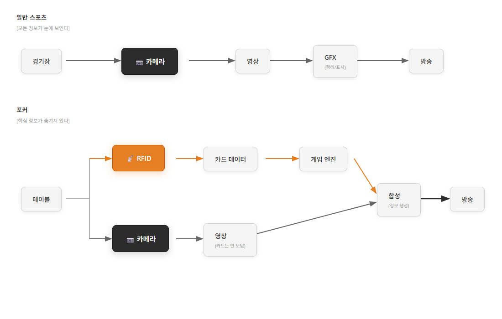

<p align="center">

> *축구는 공도, 점수도, 누가 어디 서있는지도 모두 보인다.*
> *포커는 시청자가 가장 궁금해하는 카드가 — 뒤집혀 있다.*
> *심지어 방송 스태프조차 그 카드가 무엇인지 모른다.*

</p>

---

### Scene 1 / 비대칭성

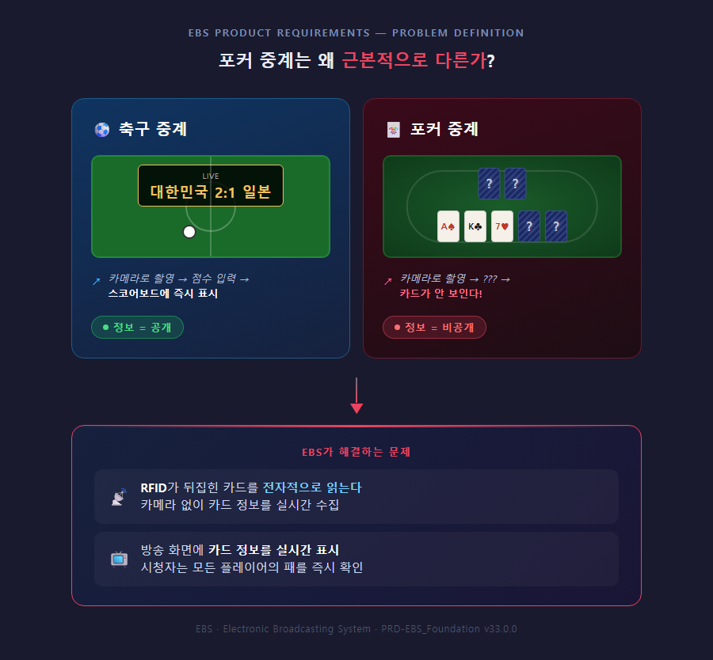

> *축구는 정리, 포커는 생성.*

축구는 공의 위치와 점수가 모두에게 보이는 **공개 정보**다. 방송 스태프는 보이는 것을 화면에 정리하면 된다.

포커는 다르다. 시청자가 가장 궁금해하는 정보가 **두 겹의 가림막** 뒤에 있다.

| | 카드 | 액션 |
|---|---|---|
| **축구 / 농구 / 야구** | 해당 없음 | 공개 (눈으로 명확) |
| **포커** | **비공개** (뒤집힘) | **모호** (작은 칩 동작) |

다른 메이저 스포츠는 점수와 함께 선수의 액션 — 공 차기, 슛, 스윙 — 이 카메라에 명확히 잡힌다. **포커의 베팅은 작고 빠르며 종종 침묵 속에서 진행**된다. 칩 더미를 미는 동작이 콜인지 레이즈인지, 카메라 영상으로는 즉시 판별이 어렵다.

> **포커는 카드뿐 아니라 액션도 별도 그래픽으로 알려줘야 하는 유일한 메이저 스포츠다.**

이 두 겹의 비대칭성을 해결하고 화면에 띄우는 것 — 이것이 EBS 의 존재 이유다.

---

### Scene 2 / 시청자에게 전달할 3 데이터

방송 화면으로 무엇을 전달해야 하는가? 포커의 흐름은 3 데이터로 압축된다.

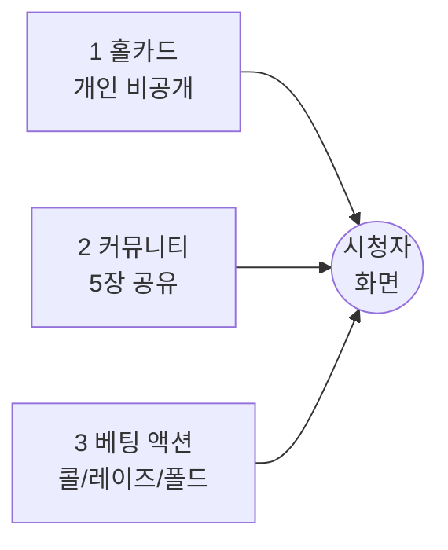
```mermaid
flowchart LR
    A[1 홀카드<br/>개인 비공개] --> X((시청자<br/>화면))
    B[2 커뮤니티<br/>5장 공유] --> X
    C[3 베팅 액션<br/>콜/레이즈/폴드] --> X
```

#### 1. 홀카드

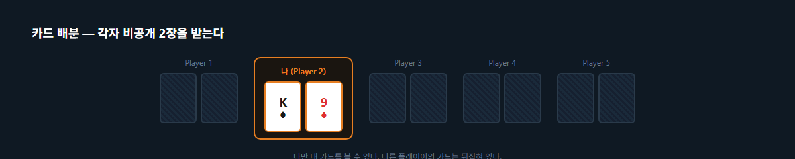

플레이어 각자만 받는 개인 카드. 방송에서는 **시청자에게만 몰래** 공개한다.

#### 2. 커뮤니티 카드

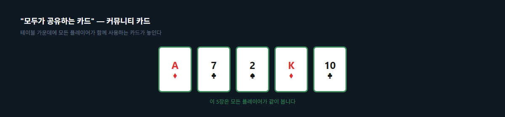

테이블 중앙에 놓여 모두가 공유하는 카드. 플레이어는 자신의 홀카드 2장과 공유 카드 5장을 합친 **총 7장 중 가장 강한 5장**으로 승부를 낸다.

#### 3. 베팅 액션

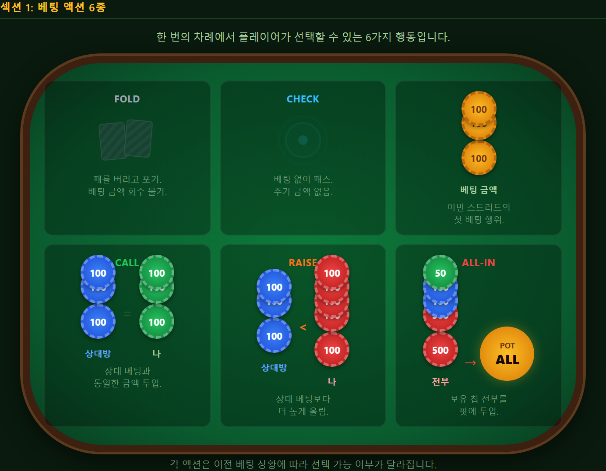

매 카드 공개마다 베팅이 진행된다. **콜** (같은 금액), **레이즈** (판돈 키우기), **폴드** (포기) — 세 선택지가 매 라운드 반복.

> *이 3 데이터를 실시간으로 추적하는 것이 EBS 의 입력 영역이다.*

---

### Scene 3 / Trinity — 세 입력의 만남

3 데이터를 어떻게 읽어들이는가? **세 종류의 입력**이 만나야 비로소 화면이 된다.

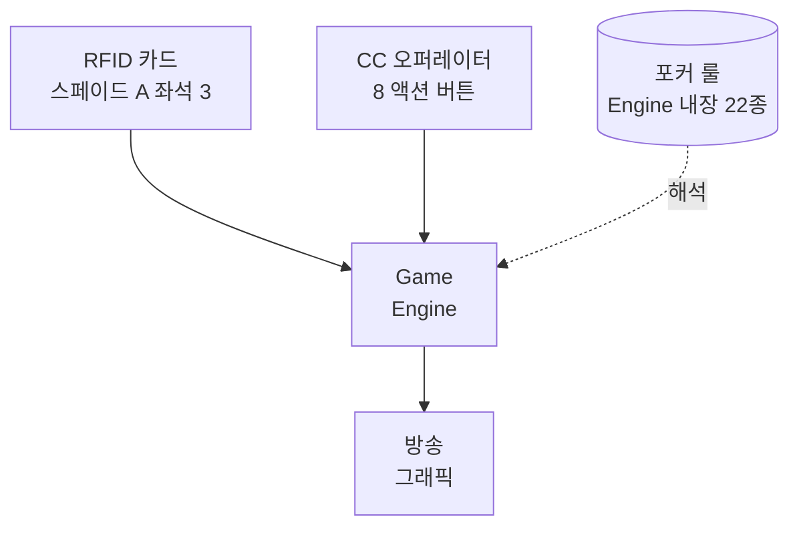
```mermaid
flowchart TD
    R[RFID 카드<br/>스페이드 A 좌석 3] --> Eng[Game<br/>Engine]
    C[CC 오퍼레이터<br/>8 액션 버튼] --> Eng
    Rule[(포커 룰<br/>Engine 내장 22종)] -.해석.-> Eng
    Eng --> Out[방송<br/>그래픽]
```

#### ⓐ 카드는 센서가 읽는다

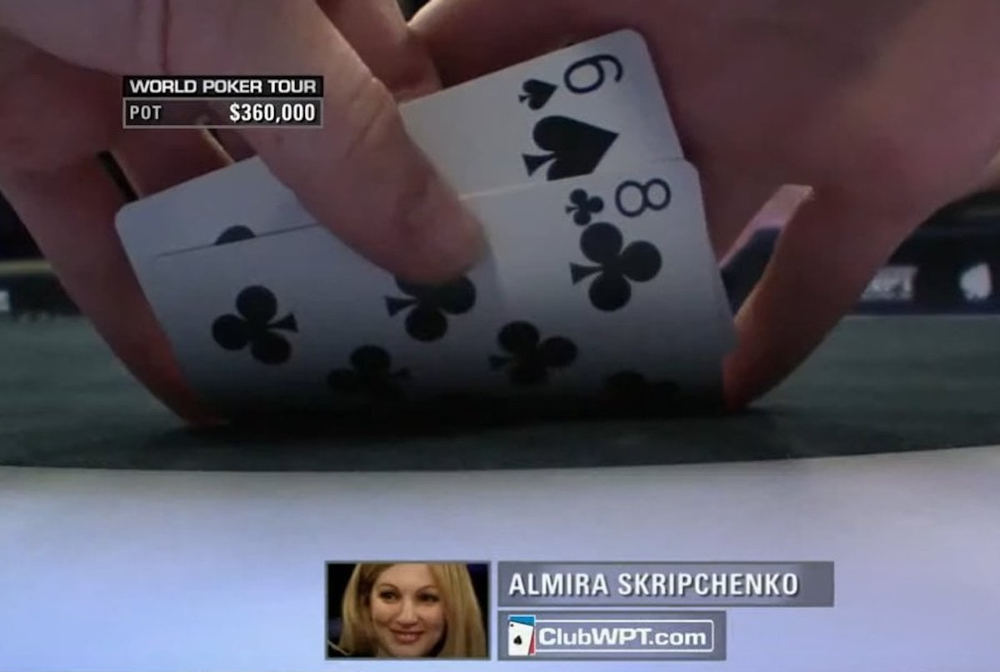

> *1999 — 유리판 + 하부 카메라. 지금 — RFID 안테나.*

52장 한 장 한 장에 RFID 태그가 내장. 플레이어가 테이블 천 위에 카드를 내려놓는 순간, 테이블 아래 매립된 안테나가 **어느 좌석에 어떤 카드가** 를 즉시 파악한다. 추가 행동 0.

#### ⓑ 액션은 사람이 입력한다


칩 더미의 작은 움직임 + 침묵 속 손짓 — 센서로 자동 판별 불가. 그래서 **컨트롤룸의 CC 오퍼레이터**가 모니터로 테이블 영상을 보면서 **8 액션 버튼**을 누른다.

| 버튼 | 의미 |
|---|---|
| 핸드 시작 | 새 핸드 개시 |
| 카드 배분 | 홀카드 분배 시점 |
| 콜 / 레이즈 / 폴드 / 체크 / 올인 | 5 베팅 액션 |
| 승부 종결 | 핸드 종료 + 판돈 분배 |

> *딜러는 테이블 진행자, CC 오퍼레이터는 컨트롤룸 입력자. 두 역할은 물리적으로 분리된다.*

#### ⓒ 룰은 코드에 새겨져 있다

22 게임 룰은 Game Engine 코드의 **영구 상수**. 매 핸드 외부에서 입력받는 게 아니다. Lobby Settings 에서는 22 종 중 어느 룰을 활성화할지 **선택**만 가능 — 룰의 정의 / 수정 / 추가는 Engine 재배포 필요.

| | RFID 카드 | CC 액션 | **게임 룰** |
|---|---|---|---|
| 출처 | 외부 센서 | 외부 사람 | **Engine 코드** |
| 변동성 | 매 카드마다 | 매 액션마다 | **불변 상수** |
| 입력 채널 | YES | YES | NO (내장) |

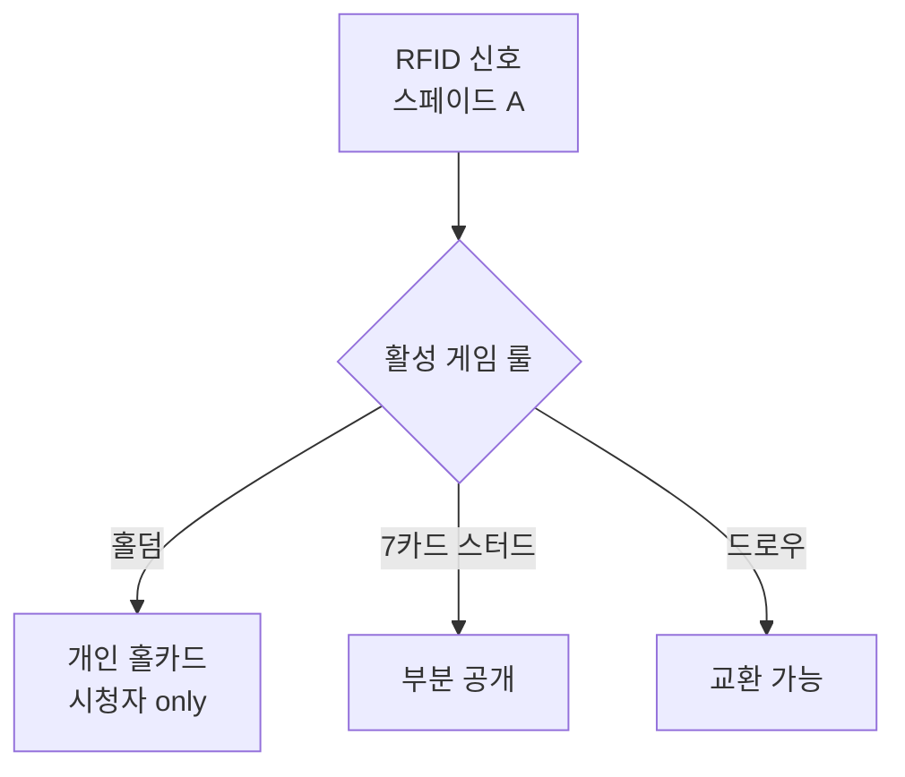
```mermaid
flowchart TD
    Sig[RFID 신호<br/>스페이드 A] --> Rule{활성 게임 룰}
    Rule -->|홀덤| H[개인 홀카드<br/>시청자 only]
    Rule -->|7카드 스터드| S[부분 공개]
    Rule -->|드로우| D[교환 가능]
```

> *같은 RFID 신호가 활성 게임 룰에 따라 다른 의미가 된다.*

---

### Scene 4 / 1단계 → 2단계 진화

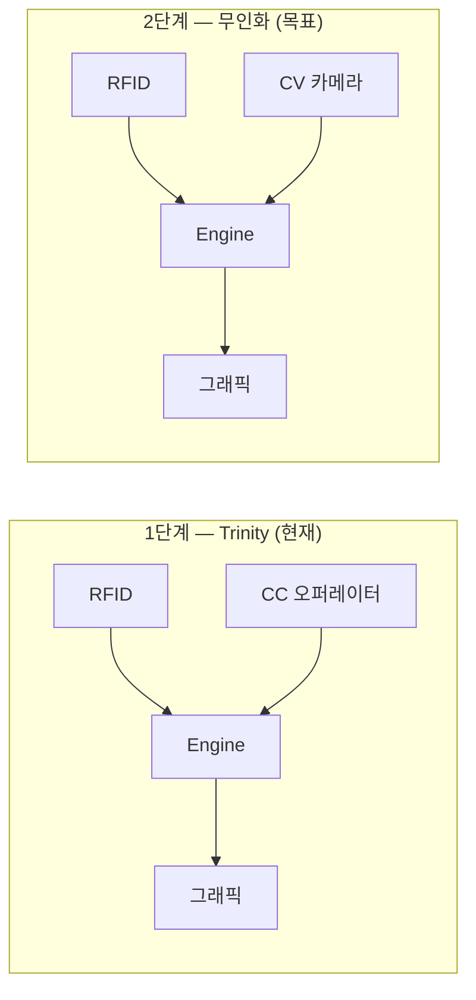
```mermaid
flowchart LR
    subgraph S1["1단계 — Trinity (현재)"]
        A1[RFID] --> E1[Engine] --> O1[그래픽]
        B1[CC 오퍼레이터] --> E1
    end
    subgraph S2["2단계 — 무인화 (목표)"]
        A2[RFID] --> E2[Engine] --> O2[그래픽]
        B2[CV 카메라] --> E2
    end
```

1단계가 **완전히 안정화**된 후, CC 오퍼레이터는 컴퓨터 비전 카메라로 완전 대체된다. 병행 운영 없이 순차 전환. 1단계 → 2단계는 EBS 의 궁극 지향점인 **현장 EBS 의 완전 무인화**다.

---

<p align="center">

> # *EBS 의 핵심 가치는 속도가 아닌 정확성이다.*

</p>

1~2시간의 후편집 시간차 앞에서 0.1초의 빠름은 무의미하다.

정확한 인식 · 장비 안정성 · 명확한 연결 · 단단한 하드웨어 · 오류 없는 흐름 — 이 **다섯 가치**가 다음 챕터의 모든 설계를 지배한다.

---

### Chapter 1 / 정리

| Scene | 핵심 |
|---|---|
| **1. 비대칭성** | 카드 + 액션 두 겹 비공개 → 그래픽이 정보 **생성** |
| **2. 3 데이터** | 홀카드 / 커뮤니티 / 베팅 액션 |
| **3. Trinity** | RFID + CC + Rule = Game Engine 합성 |
| **4. 진화** | 1단계 Trinity → 2단계 무인화 (CV 카메라) |

> *이 마법을 만들기 위해 우리는 무엇을 코딩해야 하는가?*
> *Chapter 2 가 시청자가 보는 결과물 — 8 그래픽을 해부한다.*

---
---

<p align="center">

# Chapter 2
### *시청자가 보는 화면*

</p>


<p align="center">

> *카메라 원본 영상 위에 무엇이 덧씌워지는가?*
> *수많은 그래픽 중 무엇이 우리의 영역이고 무엇이 아닌가?*
> *명확한 선을 긋지 않으면 개발 범위가 폭발한다.*

</p>

---

### Scene 1 / 8 핵심 그래픽


EBS 는 카메라 원본 영상 위에 실시간으로 포커 데이터를 덧그린다. 현장에서 발생하는 물리적 상황을 즉시 반영하는 **8 핵심 그래픽**이 우리가 직접 생성하는 결과물이다.

| # | 그래픽 | 트리거 |
|:---:|---|---|
| 1 | **홀카드 표시** | RFID 센서 카드 감지 즉시 |
| 2 | **커뮤니티 카드** | 보드 카드 인식 |
| 3 | **액션 배지** | CC 오퍼레이터 콜/레이즈/폴드 입력 |
| 4 | **팟 카운터** | 누적 베팅 자동 계산 |
| 5 | **승률 바** | 카드 공개마다 실시간 확률 |
| 6 | **아웃츠** | 유리한 카드 잔여 수 |
| 7 | **플레이어 정보** | 대회 공식 API (이름·칩·사진) |
| 8 | **플레이어 위치** | 좌석별 딜러 버튼 위치 |

> *이 8 그래픽이 EBS 가 책임지는 영역의 전부다.*

---

### Scene 2 / 만들지 않는 것 — 명확한 선 긋기


화면에는 8 그래픽 외에도 화려한 그래픽이 많다. 리더보드, 선수 프로필, 탈락 위기 경고, 자막 — **하지만 이것들은 EBS 가 만들지 않는다**.

이 구분을 명확히 하지 않으면 *선수별 성향 통계 지표도 우리가 실시간으로 구현해야 하나?* 같은 심각한 범위 오해가 생긴다. 화면에 보이는 그래픽은 사실 **만들어지는 시간과 장소가 완전히 다르다**.

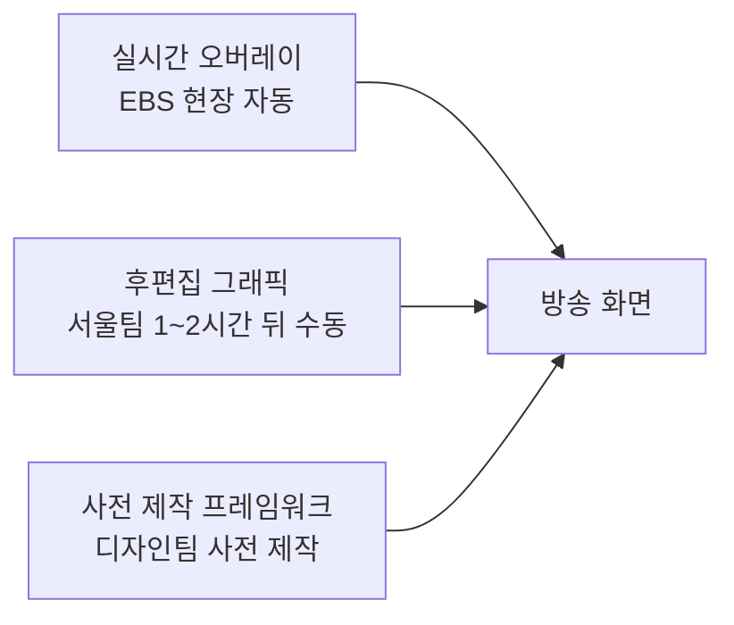
```mermaid
flowchart LR
    Live[실시간 오버레이<br/>EBS 현장 자동] --> S[방송 화면]
    Post[후편집 그래픽<br/>서울팀 1~2시간 뒤 수동] --> S
    Pre[사전 제작 프레임워크<br/>디자인팀 사전 제작] --> S
```

| 영역 | 만드는 곳 | 시점 | 예시 |
|---|---|---|---|
| **실시간 오버레이** | **EBS (현장)** | 즉시 | 8 핵심 그래픽 |
| **후편집 그래픽** | 서울 편집 스튜디오 | 1~2시간 뒤 | 리더보드, 프로필 카드 |
| **사전 제작 프레임워크** | 디자인 팀 | 방송 전 | 대회 로고, 자막 틀 |

EBS 는 후편집 팀에 **JSON 데이터 원문**만 넘겨준다. 그래픽 자체를 렌더하지 않는다.

---

### Scene 3 / EBS 책임 영역의 3 절대 조건


어떤 기능을 EBS 에서 개발해야 하는지 논의할 때, 다음 **세 조건을 동시에 만족**하는지 확인해야 한다.

| 조건 | 질문 |
|---|---|
| **시간** | 1초의 지연도 없는 실시간인가? |
| **장소** | 네트워크를 거치지 않고 현장에서 처리되는가? |
| **데이터 소스** | 센서나 현장 조작반에서 발생한 데이터인가? |

> *이 세 가지를 모두 충족하는 8 핵심 그래픽만이 EBS 의 온전한 개발 대상이다.*

---

### Chapter 2 / 정리

| Scene | 핵심 |
|---|---|
| **1. 8 그래픽** | 홀카드 / 커뮤니티 / 액션 / 팟 / 승률 / 아웃츠 / 정보 / 위치 |
| **2. 만들지 않는 것** | 리더보드·프로필 = 후편집팀 / 자막틀 = 디자인팀 |
| **3. 3 절대 조건** | 시간 (실시간) + 장소 (현장) + 데이터 소스 (센서/조작반) |

> *EBS 영역이 명확해졌다면 — Chapter 3 가 그 영역의 물리적 무대를 그린다.*

---
---

<p align="center">

# Chapter 3
### *무대의 지도*

</p>


<p align="center">

> *포커 테이블에서 벌어진 사건이 유튜브 시청자에게 도달하기까지,*
> *4 단계의 큰 구간을 거친다.*
> *EBS 는 이 중 첫 번째 구간 — 라스베가스 현장 — 에 완벽하게 집중되어 있다.*

</p>

---

### Scene 1 / 4 단계 릴레이


방송 파이프라인은 라스베가스 현장에서 시작해 서울의 스튜디오를 거쳐 전 세계 시청자에게 뻗어나간다.

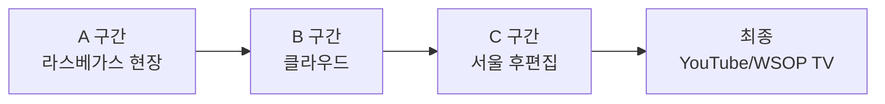
```mermaid
flowchart LR
    A[A 구간<br/>라스베가스 현장] --> B[B 구간<br/>클라우드]
    B --> C[C 구간<br/>서울 후편집]
    C --> D[최종<br/>YouTube/WSOP TV]
```

| 구간 | 위치 | 역할 |
|---|---|---|
| **A 구간** (현장 송출) | 라스베가스 / 유럽 | 카메라 촬영 + 실시간 그래픽 합성 — **EBS 가 설치되고 운영되는 유일한 공간** |
| **B 구간** (클라우드) | — | 무선 송출 → 클라우드 분배 |
| **C 구간** (후편집) | 서울 스튜디오 | 1시간 단위 편집 + 화려한 통계 그래픽 수동 삽입 |
| **최종** | YouTube / WSOP TV | 무료 / 유료 송출 |

> *EBS 는 A 구간 단 한 곳에서 설치 + 운영된다.*

---

### Scene 2 / 현장 프로덕션의 사슬


A 구간 내부를 확대하면, **물리적 장비들이 사슬처럼 엮여** 있다.

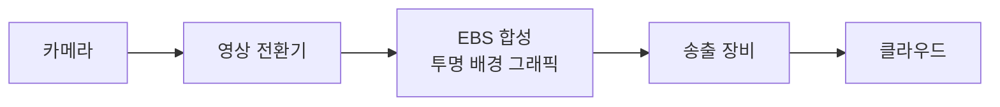
```mermaid
flowchart LR
    Cam[카메라] --> Switch[영상 전환기]
    Switch --> EBS[EBS 합성<br/>투명 배경 그래픽]
    EBS --> Send[송출 장비]
    Send --> Cloud[클라우드]
```

카메라가 테이블을 촬영하면, 영상 전환기가 여러 카메라의 앵글을 골라낸다. 바로 이때 **EBS 가 투명한 배경 위에 실시간으로 생성한 정보 그래픽을 카메라 원본 영상 위에 덮어씌운다**. 합성이 완료된 최종 방송 영상은 송출 장비를 타고 클라우드로 쏘아 올려진다.

---

### Scene 3 / 보이지 않는 데이터 공급자


EBS 는 현장 화면 합성 (A 구간) 외에도 **서울 편집팀 (C 구간) 을 돕는 조력자 역할**을 수행한다.

게임이 한 판 끝날 때마다 EBS 는 카드, 베팅 기록, 승자 등 **모든 결과를 JSON 데이터로 묶어 전송**한다. 서울의 방송 프로듀서들은 이 데이터를 바탕으로 어떤 장면이 극적인지 파악하고, 후편집 그래픽 제작에 활용한다.

> *EBS 는 그래픽 생성기일 뿐 아니라 데이터 공급자이기도 하다.*

---

### Scene 4 / 1시간의 시간 여행

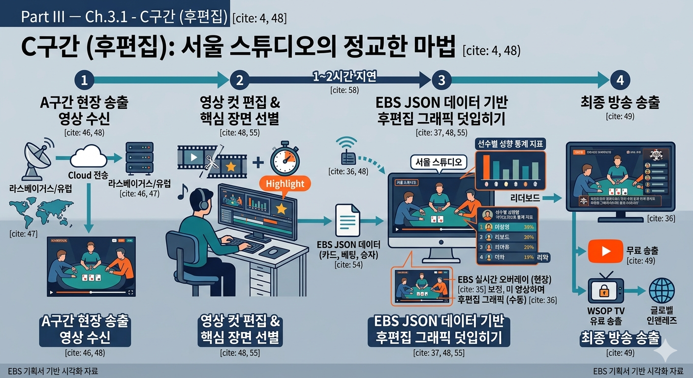

흥미로운 점은 지연 시간이다.

| 구간 | 지연 |
|:---:|:---:|
| EBS 합성 (A 구간 현장) | **즉시 (장비 사슬 통과)** |
| 시청자가 보는 시점 (최종) | **1~2시간 후** |

EBS 가 카드를 읽고 그래픽을 씌우는 것은 **장비 사슬을 따라 즉시** 처리된다. 하지만 시청자가 유튜브에서 보는 것은 약 **1~2시간 뒤**다.

왜인가? **서울에서 영상을 자르고 평가하여 수동으로 그래픽을 덧입히는 후편집 (C 구간)** 에서 대부분의 지연이 발생한다.

> # *A 구간의 핵심 가치는 속도가 아니라 정확성과 안정성이다.*

1~2시간 후편집 대비 0.1초 차이는 무의미하다.

---

### Chapter 3 / 정리

| Scene | 핵심 |
|---|---|
| **1. 4 단계** | 라스베가스 (A) → 클라우드 (B) → 서울 (C) → 시청자 |
| **2. 현장 사슬** | 카메라 → 전환기 → EBS 합성 → 송출 |
| **3. 데이터 공급자** | JSON → 서울 후편집팀 |
| **4. 시간차** | EBS 즉시 vs 시청자 1~2시간 후 (정확성 > 속도) |

> *Part I 개념 설명을 마쳤다. Part II 부터는 EBS 가 무엇을 어떻게 개발하는지 본격 들어간다.*

---
---

<p align="center">

# Chapter 4
### *3 그룹 6 기능*

</p>


<p align="center">

> *EBS 는 더블 클릭하면 실행되는 프로그램 하나가 아니다.*
> *서로 다른 역할을 맡은 여섯 개 기능이 톱니바퀴처럼 맞물려 돌아가는 시스템이다.*
> *이 6 기능이 어떤 그룹으로 묶이는지 — 그것이 EBS 의 본질이다.*

</p>

---

### Scene 1 / 6 기능 = 3 그룹

EBS 의 6 기능은 역할에 따라 **3 그룹**으로 묶인다.

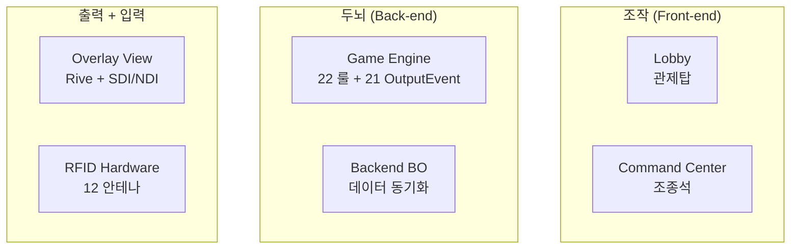
```mermaid
flowchart TD
    subgraph G1["조작 (Front-end)"]
        L[Lobby<br/>관제탑]
        CC[Command Center<br/>조종석]
    end
    subgraph G2["두뇌 (Back-end)"]
        E[Game Engine<br/>22 룰 + 21 OutputEvent]
        BO[Backend BO<br/>데이터 동기화]
    end
    subgraph G3["출력 + 입력"]
        O[Overlay View<br/>Rive + SDI/NDI]
        H[RFID Hardware<br/>12 안테나]
    end
```

| 그룹 | 기능 | 비유 |
|---|---|---|
| **조작** (Front-end) | Lobby + Command Center | 사용자 손에 닿는 것 |
| **두뇌** (Back-end) | Game Engine + Backend (BO) | 보이지 않는 사고 + 기억 |
| **출력 + 입력** | Overlay View + RFID Hardware | 현실과의 접점 |

> *Settings, Rive Manager 는 Lobby 의 일부 — 별도 기능 아님. 6 기능 = Lobby / CC / Engine / BO / Overlay / RFID.*

---

<p align="center">

> # *기능이 본질이다.*
> # *어떻게 배포되는지는 부차적 문제일 뿐이다.*

</p>

3 그룹 6 기능 — 이것이 EBS 시스템의 진짜 골격이다. 각 기능이 무엇을 하는가, 그리고 그것이 어느 그룹에 속하는가만이 본질적이다.

---

### Scene 2 / 6 기능과 팀 매핑

각 기능은 한 팀이 담당한다. 4 팀이 6 기능을 분담하는 구조다.

| 기능 | 그룹 | 담당 팀 | 스택 |
|---|---|:---:|---|
| **Lobby** (관제탑) | 조작 | team1 | Flutter Web + Rive |
| **Command Center** (조종석) | 조작 | team4 | Flutter Desktop + Rive |
| **Game Engine** (두뇌) | 두뇌 | team3 | Pure Dart |
| **Backend (BO)** (뼈대) | 두뇌 | team2 | FastAPI + DB |
| **Overlay View** (붓) | 출력 | team4 | Rive + SDI/NDI |
| **RFID Hardware** (센서) | 입력 | — (외부 HW) | ST25R3911B + ESP32 |

> *팀 = 기능을 만드는 사람. team4 가 Command Center 와 Overlay 두 기능을 담당하는 이유는 두 기능이 한 화면에서 함께 동작하기 때문이다.*

---

### Chapter 4 / 정리

| Scene | 핵심 |
|---|---|
| **1. 3 그룹 6 기능** | 조작 (Lobby + CC) / 두뇌 (Engine + BO) / 출력+입력 (Overlay + RFID) |
| **2. 팀 매핑** | team1=Lobby, team2=BO, team3=Engine, team4=CC+Overlay |

> *6 기능의 큰 그림이 잡혔다면 — Chapter 5 가 각 기능의 내부를 해부한다.*

---
---

<p align="center">

# Chapter 5
### *시스템 해부*

</p>


<p align="center">

> *각 컴포넌트의 내부로 들어간다.*
> *사용자가 만지는 것 → 보이지 않는 두뇌 → 현실과의 접점 순서로.*

</p>

---

## §A — Front-end (사용자가 만지는 것)

### A.1 / Lobby — 관제탑


> *Series → Event → Table 3 단계, 모든 테이블 카드 모니터링.*

| 항목 | 내용 |
|---|---|
| 구조 | Series → Event → Table 3 단계 |
| 역할 | 전체 테이블 모니터링 + 선수 명단 관리 |
| 실행 | 테이블 카드 클릭 → 해당 테이블 CC 열림 |
| 배포 | Flutter **Web** (Docker nginx, LAN 다중 클라이언트) |
| 비율 | Lobby : CC = **1 : N** |

---

### A.2 / Settings — 글로벌 제어판 (Lobby 내)

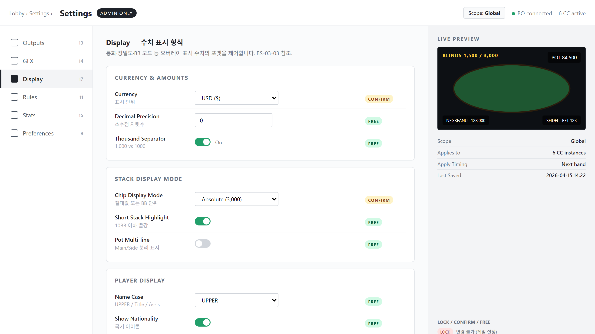

| 영역 | 통제 |
|---|---|
| **출력** | 송출 해상도 + 방식 |
| **그래픽** | 요소 배치 + 활성 스킨 |
| **디스플레이** | 통화 / 소수점 |
| **규칙** | **룰 선택** — 22 종 중 활성화 (정의/수정 불가) |
| **통계** | 리더보드 표시 여부 |
| **환경** | 진단 + 데이터 내보내기 |

> *규칙 영역은 22 종 중 활성화만. 룰 자체 정의·수정은 Engine 재배포 필요.*

---

### A.3 / Rive Manager — 스킨 허브


**아트 디자이너의 외부 Rive Editor 작업물**을 EBS 로 가져오는 단일 경로. Lobby Web 내부 섹션 (별도 앱 아님), Admin 권한 전용.

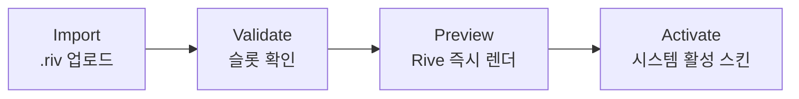
```mermaid
flowchart LR
    Import[Import<br/>.riv 업로드] --> Validate[Validate<br/>슬롯 확인]
    Validate --> Preview[Preview<br/>Rive 즉시 렌더]
    Preview --> Activate[Activate<br/>시스템 활성 스킨]
```

> *D3 회의 (2026-04-22) — 사내 Graphic Editor 폐기. 메타데이터는 Rive 파일 내장.*

---

### A.4 / Command Center — 실시간 조종석

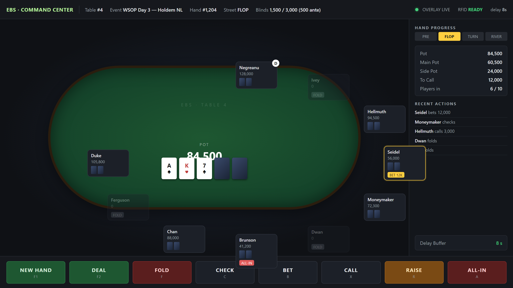

본방송 중 운영자 시선의 **85% 가 머무는 화면**. 테이블 1 개당 1 인스턴스 독립 실행. **1 단계 입력 모델의 핵심 컴포넌트**. 2 단계 무인화 진입 시 모니터링 전용으로 전환된다.

| 항목 | 내용 |
|---|---|
| 시각 | 타원 포커 테이블 + 10 좌석 |
| 버튼 | 8 액션 (Ch.1 Scene 3 ⓑ 참조) |
| 역할 | 센서가 못 잡는 **베팅 의사** → 시스템 주입 |
| 정보 소스 | 컨트롤룸 모니터 + 딜러 콜아웃 + 칩 트레이 |
| 배포 | Flutter **Desktop** (RFID 시리얼 + SDI/NDI 직결) |

---

## §B — Back-end (보이지 않는 두뇌와 뼈대)

### B.1 / Game Engine — 두뇌


Engine 은 **22 게임 룰 전체를 코드 내장 상수**로 보유. 매 핸드 외부에서 주입받는 입력이 아니며, 룰 변경은 Engine 재배포로만 가능하다.

#### 22 게임 = 3 계열

| 계열 | 종 |
|:---:|:---:|
| 공유 카드 | **12** |
| 카드 교환 | **7** |
| 부분 공개 | **3** |

#### 같은 카드, 다른 해석

| 활성 룰 | 좌석 3 의 스페이드 A 해석 |
|---|---|
| **홀덤** | 개인 홀카드 (시청자 only) |
| **7카드 스터드** | 부분 공개 (테이블 모두) |
| **드로우** | 라운드 종료 시 교환 가능 |

→ **카드 인식 = 변하지 않음, 룰이 의미를 결정**.

#### 21 OutputEvent

판돈 변동 / 승률 업데이트 / 승자 결정 등 → 적절한 Rive 애니메이션 트리거.

---

### B.2 / Backend (BO) — 뼈대

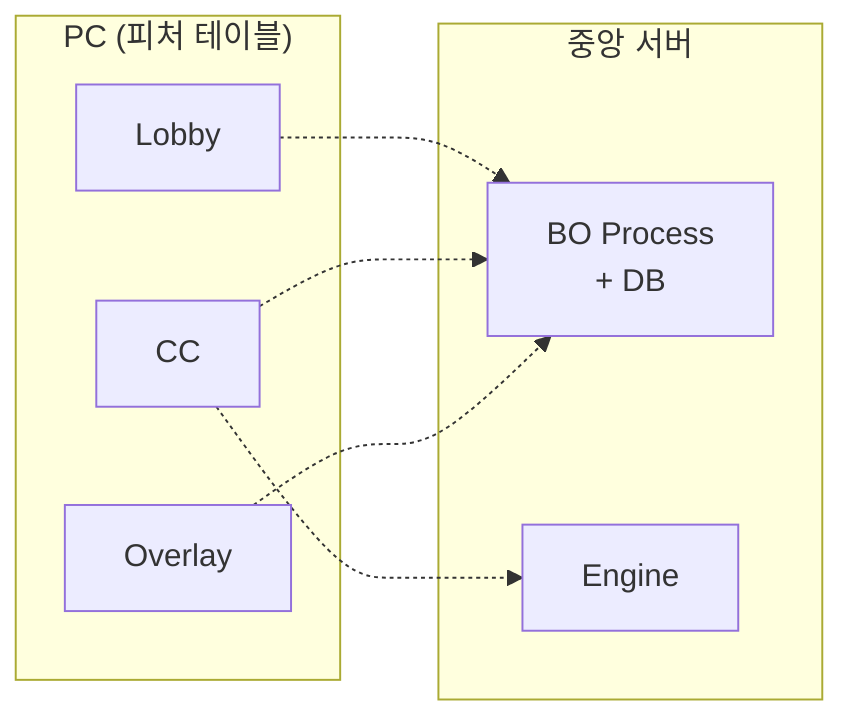
```mermaid
flowchart LR
    subgraph PC["PC (피처 테이블)"]
        L[Lobby]
        C[CC]
        O[Overlay]
    end
    subgraph Server["중앙 서버"]
        BO[BO Process<br/>+ DB]
        Eng[Engine]
    end
    L -.-> BO
    C -.-> BO
    C -.-> Eng
    O -.-> BO
```

#### 3 핵심 임무

1. **외부 동기화** — 대회 공식 시스템 ↔ 내부 DB
2. **권한 검증** — Admin / Operator / Viewer
3. **데이터 보관소** — 게임당 카드 / 액션 / 판돈 → 후편집 재료

스택: **FastAPI + SQLite/PostgreSQL**.

> *다중창 모드 시 Lobby/CC/Overlay 독립 OS 프로세스. BO 경유 통신 (직접 IPC 금지).*

---

### B.3 / 통신 매트릭스

| From → To | 방식 | 용도 |
|---|---|---|
| Lobby → BO | REST | 동기 CRUD |
| Lobby ← BO | WS ws/lobby | 모니터 전용 |
| CC ↔ BO | WS ws/cc | 양방향 명령 + 이벤트 |
| CC → Engine | REST | stateless query |
| Lobby ↔ CC | — | **직접 연결 금지** (BO DB 경유) |

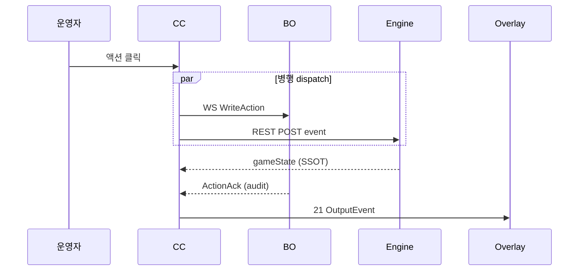
```mermaid
sequenceDiagram
    participant Op as 운영자
    participant CC
    participant BO
    participant Engine
    participant Overlay
    Op->>CC: 액션 클릭
    par 병행 dispatch
      CC->>BO: WS WriteAction
      CC->>Engine: REST POST event
    end
    Engine-->>CC: gameState (SSOT)
    BO-->>CC: ActionAck (audit)
    CC->>Overlay: 21 OutputEvent
```

> *CC = Orchestrator, 병행 dispatch. Engine 응답이 게임 상태 SSOT, BO ack 은 audit 참고값.*

---

### B.4 / 실시간 동기화 — DB SSOT + WS push

| 채널 | 용도 | 운영 메트릭 |
|---|---|:---:|
| DB polling | 복구 baseline | 1~5초 |
| WS push | 실시간 알림 | 100ms 미만 (NFR) |

> **표기 주의**: 본 NFR 수치는 운영 안정성 측정 메트릭이며 EBS 핵심 가치 아니다. EBS 미션 = Ch.1 Scene 4 — 정확성·안정성·단단한 HW 다섯 가치.

#### 정책

* **쓰기**: BO commit → WS broadcast
* **읽기**: 시작 시 DB snapshot, 이후 WS delta
* **Crash 복구**: DB snapshot 재로드
* **SSOT**: Engine 응답 = 게임 상태

---

## §C — Render & Hardware (현실과의 접점)

### C.1 / Overlay View — 화면을 그리는 붓


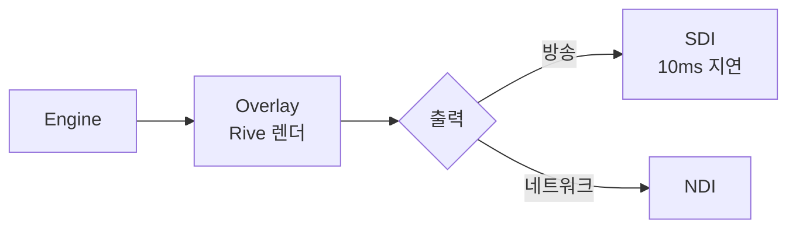
```mermaid
flowchart LR
    Eng[Engine] --> Ov[Overlay<br/>Rive 렌더] --> Out{출력}
    Out -->|방송| SDI[SDI<br/>10ms 지연]
    Out -->|네트워크| NDI[NDI]
```

* **스킨 공급**: Rive Manager 활성화 .riv 그대로 소비
* **배경 config**: (a) 완전 투명 (방송 default) / (b) 단색 (QA 용)
* **보안 지연**: 0~120 초 (방송 사고 방지)
* **방송 송출**: SDI (10ms 지연, 전용선) 또는 NDI (네트워크)

---

### C.2 / RFID — 1단계 입력 (현재)

```
+----------------------------------+
|  Table Cloth                     |
| +------+ +------+ +------+       |
| | A1   | | A2   | | A3   | ...   |
| +------+ +------+ +------+       |
|     12 안테나 (좌석 + 보드)        |
+--------------+-------------------+
               |
               v
       +-------+--------+
       | ST25R3911B IC  |
       +-------+--------+
               |
               v
            ESP32
               |
               v USB
            [PC]
```

* 테이블 천 아래 **12 안테나** (좌석 + 보드 중앙)
* 칩셋: **ST25R3911B + ESP32**, 통신 USB

#### Mock HAL — 가장 강력한 특징

> **실제 테이블 장비가 없어도 전체 기능을 완벽하게 구동·테스트할 수 있다.**

화면 버튼으로 카드 신호를 emulate 하여 개발/시연 효율을 극대화한다.

---

### C.3 / Vision Layer — 2단계 입력 (목표)

§C.2 의 RFID 는 **1·2 단계 공통**이다. 2 단계 진입 시 추가되는 것은 **Vision Layer** — CC 오퍼레이터의 8 액션을 카메라 + 컴퓨터 비전이 자동 인식한다.

#### 카메라 6 대 구성

| # | 카메라 | 대수 | 인식 대상 | 프로덕션 카메라 |
|:---:|---|:---:|---|:---:|
| 1 | 플레이어 촬영 | **4** | 베팅 액션 / 제스처 / 칩 푸시 | 별도 (전용) |
| 2 | 탑 뷰 | **1** | 테이블 전체 (칩 트레이 / 카드 위치) | 별도 (전용) |
| 3 | 커뮤니티 카드 | **1** | 보드 카드 | 공유 |
|   | **합계** | **6** | | |

```
        +---- 카메라 4대 (플레이어) ----+
        |                              |
   [P1] [P2] [P3] [P4]
     |    |    |    |
     +----+----+----+----+
                        v
              +---------+----------+
              |    CV 추론 엔진    |
              | (액션/제스처/칩푸시)|
              +---------+----------+
                ^                 ^
        [탑 뷰 1대]        [커뮤니티 1대]
                        v
                  Game Engine
                        v
                  방송 그래픽
```

#### 1단계 ↔ 2단계 매핑

| 1단계 입력 | 2단계 인식 카메라 |
|---|---|
| 핸드 시작 / 종결 | 탑 뷰 (딜러 동작) |
| 카드 배분 | 탑 뷰 + 커뮤니티 (RFID cross-check) |
| 콜 / 레이즈 / 폴드 / 체크 / 올인 | 플레이어 4 대 (제스처 + 칩 푸시) |

#### 정확도 목표

> **사람의 수정 없이 방송에 문제 없는 상태** — 휴먼 인터벤션 0.

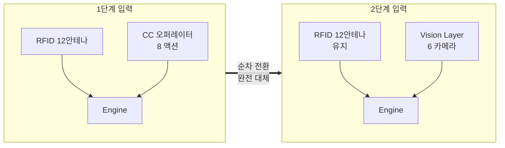
```mermaid
flowchart LR
    subgraph S1["1단계 입력"]
        R1[RFID 12안테나] --> Eng1[Engine]
        CC[CC 오퍼레이터<br/>8 액션] --> Eng1
    end
    subgraph S2["2단계 입력"]
        R2[RFID 12안테나<br/>유지] --> Eng2[Engine]
        CV[Vision Layer<br/>6 카메라] --> Eng2
    end
    S1 ==>|순차 전환<br/>완전 대체| S2
```

| 컴포넌트 | 1단계 | 2단계 |
|---|:---:|:---:|
| RFID 12 안테나 | YES | YES (유지) |
| CC 오퍼레이터 | YES | NO (제거) |
| Vision Layer 6 카메라 | NO | YES (신규) |
| Game Engine | YES | YES (유지) |

> *2 단계 진입 시 CC 오퍼레이터 화면은 모니터링 전용. 입력 권한 없음. 1 단계 완전 안정화 후 순차 진행, 병행 운영 X.*

---

### Chapter 5 / 정리

| 영역 | 핵심 |
|---|---|
| **§A Front-end** | Lobby + Settings + Rive Manager + Command Center |
| **§B Back-end** | Engine (22 룰/21 OutputEvent) + BO (3 임무) + 통신 매트릭스 + DB SSOT |
| **§C Render & HW** | Overlay (Rive→SDI/NDI) + RFID 12 안테나 + Vision 6 카메라 (2단계) |

> *시스템 해부가 끝났다면 — Chapter 6 가 이 시스템이 매일 어떻게 살아 움직이는지, 어디로 진화하는지 답한다.*

---
---

<p align="center">

# Chapter 6
### *운영과 진화*

</p>


<p align="center">

> *시스템이 라스베가스 현장에 설치되었다.*
> *방송 스태프의 하루는 점검으로 시작해 끊임없는 게임 진행으로 이어지며,*
> *돌발 상황과의 싸움으로 끝난다.*

</p>

---

### Scene 1 / 방송 시작 전 — 3 점검표


| # | 점검 영역 | 내용 |
|:---:|---|---|
| **1** | **물리 장비** | 서버 전원 + 안테나 연결 + 52 카드 등록 스캔 |
| **2** | **소프트웨어** | 스킨 로드 + 송출 방식 설정 |
| **3** | **테이블 세팅** | Lobby 에서 게임 종류 + 블라인드 + 선수 명단 + 운영자 할당 |

> *방송 사고를 막는 가장 단순하지만 가장 중요한 단계.*

---

### Scene 2 / 본방송 — 무한 반복 쳇바퀴

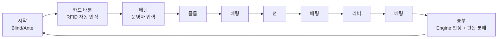
```mermaid
flowchart LR
    Start[시작<br/>Blind/Ante] --> Deal[카드 배분<br/>RFID 자동 인식]
    Deal --> Bet[베팅<br/>운영자 입력]
    Bet --> Flop[플롭]
    Flop --> Bet2[베팅]
    Bet2 --> Turn[턴]
    Turn --> Bet3[베팅]
    Bet3 --> River[리버]
    River --> Bet4[베팅]
    Bet4 --> Show[승부<br/>Engine 판정 + 판돈 분배]
    Show --> Start
```

* **시작**: 의무 베팅 (Blind/Ante) → 카드 배분 → RFID 자동 인식
* **베팅**: 운영자 입력 (콜/레이즈/폴드) → 공유 카드 3 단계 (플롭/턴/리버) 공개
* **승부**: 마지막 카드 → Engine 판정 → 판돈 분배

> *특수 상황 자동화 — All-in 또는 한 명 빼고 폴드 시 시스템이 남은 과정 자동 진행.*

---

### Scene 3 / 위기 — 다층 방어


수십만 명 시청 중에도 무너지지 않도록 다층 방어가 작동한다.

| 시나리오 | 대응 |
|---|---|
| **센서 고장** | 운영자가 가상 카드 52장 직접 클릭 강제 입력 |
| **네트워크 단절** | 30초 이내 자동 복구 |
| **서버 크래시** | 직전 상태 + 판돈 자가 복원, 방송 중단 없음 |

> *생방송 중 어떤 일이 일어나도 시청자에게 무결한 화면을 송출한다.*

---

### Scene 4 / 복수 테이블 운영

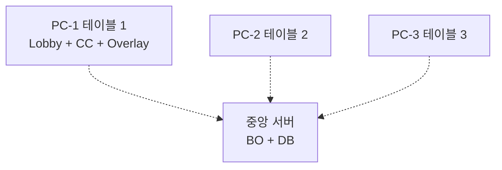
```mermaid
flowchart TD
    Server[중앙 서버<br/>BO + DB]
    PC1[PC-1 테이블 1<br/>Lobby + CC + Overlay]
    PC2[PC-2 테이블 2]
    PC3[PC-3 테이블 3]
    PC1 -.-> Server
    PC2 -.-> Server
    PC3 -.-> Server
```

하드웨어 제약 (캡처 카드 / SDI 채널 / RFID USB) → **1 PC = 1 피처 테이블**.

| 운영 | PC | 중앙 서버 |
|---|:---:|---|
| 단일 테이블 | 1 대 | 동일 PC OR 별도 |
| **2+ 테이블** | N 대 | **별도 BO+DB 1 대 필수** |

* 테이블 ↔ PC **1:1 고정** (방송 중 이동 불가)
* 세션 격리 — PC 장애 시 해당 테이블만 영향
* 중앙 서버는 SPOF (Single Point of Failure)

---

### Scene 5 / 왜 자체 개발인가

상용 SW (PokerGFX) 가 있는데도 EBS 를 자체 개발하는 이유는 명확하다.

| 차원 | 상용 (PokerGFX) | EBS 자체 개발 |
|---|---|---|
| **비용** | 매년 라이선스 | 영구 자산 |
| **확장성** | 스킨만 교체 | 무제한 (AI / API 연동) |
| **데이터 통제** | 외부 의존 | 100% 통제 |
| **입력 (1단계)** | 오퍼레이터 수동 | **동일 — 모델 채택** |
| **입력 (2단계)** | (영구 수동) | **CV 무인화 6 카메라** |

> *상용 = 벤치마크. 1 단계는 동일 모델, 2 단계 무인화 진화 가능성이 진짜 차별점이다.*

---

### Scene 6 / 진화 로드맵 — 2 직교 축

EBS 의 진화는 **두 직교 축**으로 분리된다.

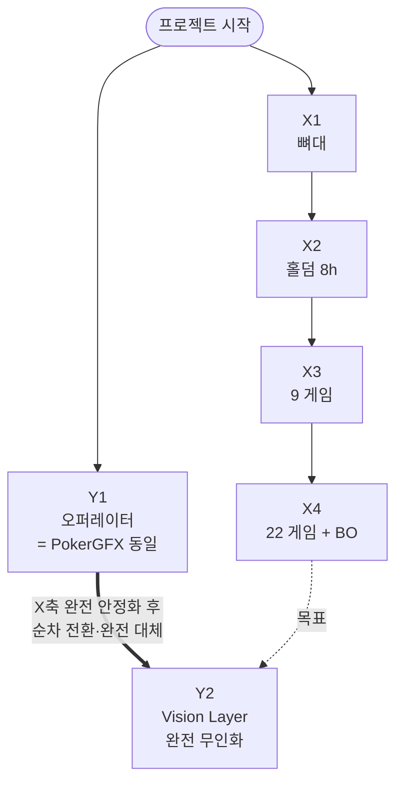
```mermaid
flowchart TD
    Start([프로젝트 시작])
    X1[X1<br/>뼈대] --> X2[X2<br/>홀덤 8h] --> X3[X3<br/>9 게임] --> X4[X4<br/>22 게임 + BO]
    Start --> X1
    Start --> Y1[Y1<br/>오퍼레이터<br/>= PokerGFX 동일]
    Y1 ==>|X축 완전 안정화 후<br/>순차 전환·완전 대체| Y2[Y2<br/>Vision Layer<br/>완전 무인화]
    X4 -.목표.-> Y2
```

#### X축 — 기능 확장 (4 단계)

| 단계 | 내용 |
|:---:|---|
| **X1** | 기초 공사 — 52 카드 → 센서 → 서버 → 방송 화면 뼈대 검증 |
| **X2** | 홀덤 단일 종목 8 시간 연속 방송 안정성 |
| **X3** | 9 종 게임 + 라스베가스 생방송 실전 투입 |
| **X4** | 22 종 통합 + Lobby Web 내 Rive 관리 + BO 완성 |

#### Y축 — 입력 자동화 (2 단계)

| 단계 | 입력 모델 | 컴포넌트 |
|:---:|---|---|
| **Y1** | 오퍼레이터 수동 입력 | RFID + CC 오퍼레이터 |
| **Y2** | **CV 무인화 (완전 대체)** | RFID + Vision Layer 6 카메라 |

#### 전환 규칙

* Y1 → Y2 는 X 축 완전 안정화 (X4 도달) 후 순차 진행
* Y2 는 Y1 을 **완전 대체** (병행 운영 없음)
* Y2 정확도 목표: 휴먼 인터벤션 0

> *상세 timeline 은 4. Operations/Phase_Plan_2027.md 참조.*

---

### Scene 7 / 두 궁극 목적지

EBS 가 향하는 **두 최종 목적지**:

<p align="center">

> # *1. 압도적 방송 품질 향상*

</p>

실시간 그래픽과 분석 데이터로 시청자 몰입감을 극대화하고, 축적된 데이터를 바탕으로 **하이라이트와 다시보기 영상을 자동으로 찍어내는 공장**을 만든다.

<p align="center">

> # *2. 운영의 완전한 무인화*

</p>

1 단계 (Y1) 의 CC 오퍼레이터 수동 입력을 **2 단계 (Y2) Vision Layer (6 대 카메라 + 컴퓨터 비전)** 가 완전 대체한다. 메커니즘은 막연한 AI 가 처리가 아니라 **CV 카메라 6대로 액션 / 제스처 / 칩 푸시 / 보드 카드 자동 인식**. 정확도 목표는 휴먼 인터벤션 0.

X 축 (기능 4 단계) + Y 축 (입력 2 단계) 진화가 이 두 목적지로 수렴한다.

---

### Chapter 6 / 정리

| Scene | 핵심 |
|---|---|
| **1. 점검** | 물리 + SW + 테이블 세팅 |
| **2. 쳇바퀴** | 시작 → 배분 → 베팅 (3 단계) → 승부 무한 반복 |
| **3. 위기** | 센서 / 네트워크 / 서버 3 시나리오 자동 복구 |
| **4. 복수 테이블** | 1 PC = 1 피처 테이블, 별도 BO 필수 |
| **5. 자체 개발** | 비용·확장성·데이터·2단계 무인화 = 차별점 |
| **6. 2축 로드맵** | X (기능 4단계) + Y (입력 2단계) |
| **7. 두 목적지** | 압도적 품질 + 완전 무인화 |

> *6 챕터를 통해 EBS 의 존재 이유 (Part I) → 무엇을 만드는가 (Part II) → 어떻게 운영하는가 (Part III) 를 풀어냈다.*

---

## 부록 — 보존 정보 인덱스

본 재설계가 **현재 Foundation.md v3.1.0 의 모든 핵심 fact 를 보존** 함을 보장.

| 원본 § | Fact | 새 위치 |
|---|---|:---:|
| §1.1 | 정보 비대칭성 (카드 + 액션) | Ch.1 / Scene 1 |
| §1.2 | 3 핵심 데이터 | Ch.1 / Scene 2 |
| §1.3 | RFID 1세대→2세대 | Ch.1 / Scene 3 ⓐ |
| §1.4 | CC 오퍼레이터 + 8 액션 | Ch.1 / Scene 3 ⓑ |
| §1.5 | 22 게임 룰 = Engine 내장 상수 | Ch.1 / Scene 3 ⓒ |
| §1.6 | Trinity 미션 + 정확성 5 가치 | Ch.1 / Scene 4 + Quote |
| §2.1 | 8 핵심 그래픽 | Ch.2 / Scene 1 |
| §2.2 | 만들지 않는 것 | Ch.2 / Scene 2 |
| §2.3 | 3 절대 조건 | Ch.2 / Scene 3 |
| §3.1 | 4 단계 송출 | Ch.3 / Scene 1 |
| §3.2 | 현장 프로덕션 사슬 | Ch.3 / Scene 2 |
| §3.3 | 데이터 공급자 (JSON) | Ch.3 / Scene 3 |
| §3.4 | 1~2시간 시간차 + 정확성 | Ch.3 / Scene 4 |
| §4.1 | 6 기능 = 3 그룹 | Ch.4 / Scene 1 |
| §4.2 | 4 SW + 1 HW (잘못된 설계) | — (폐기, 2026-05-07) |
| §5.1 | Lobby (관제탑) | Ch.5 §A.1 |
| §5.2 | Settings (글로벌 제어판) | Ch.5 §A.2 |
| §5.3 | Rive Manager | Ch.5 §A.3 |
| §5.4 | Command Center | Ch.5 §A.4 |
| §5.5 | 2 런타임 모드 + 3 RBAC (이해 어려움) | — (폐기, 2026-05-07) |
| §6.1 | Game Engine 22 룰 + 21 OutputEvent | Ch.5 §B.1 |
| §6.2 | Backend 3 임무 + 프로세스 모델 | Ch.5 §B.2 |
| §6.3 | 통신 매트릭스 | Ch.5 §B.3 |
| §6.4 | DB SSOT + WS 동기화 | Ch.5 §B.4 |
| §7.1 | Overlay View (Rive→SDI/NDI) | Ch.5 §C.1 |
| §7.2 | RFID 12 안테나 + Mock HAL | Ch.5 §C.2 |
| §7.3 | Vision Layer 6 카메라 | Ch.5 §C.3 |
| §8.1 | 3 점검표 | Ch.6 / Scene 1 |
| §8.2 | 본방송 쳇바퀴 | Ch.6 / Scene 2 |
| §8.3 | 긴급 복구 (3 시나리오) | Ch.6 / Scene 3 |
| §8.4 | 1 PC = 1 피처 테이블 | Ch.6 / Scene 4 |
| §9.1 | 자체 개발 vs 상용 | Ch.6 / Scene 5 |
| §9.2 | 2 직교 축 로드맵 (X+Y) | Ch.6 / Scene 6 |
| §9.3 | 2 궁극 목적지 | Ch.6 / Scene 7 |

→ **35 fact 모두 보존, 손실 0**.

---

## Changelog

| 날짜 | 버전 | 변경 |
|---|---|---|
| 2026-05-07 | 4.0.0-draft | Phase 2 완성. Ch.1~6 6 챕터 / 25 Scene. 5 layout 변주. HTML table 패턴 완전 제거. 35 fact 보존. |
