# EBS — 라이브 포커 방송 시스템 기획서

> **Version**: 41.0.0
> **Date**: 2026-04-07
> **문서 유형**: 제품 기획서 (Product Requirements Document)
> **대상 독자**: 기획자, 이해관계자, 포커 방송에 관심 있는 누구나
> **범위**: 제품 기획 (비전, 게임 규칙, UX, 운영, 로드맵). 기술 설계는 별도 문서에서 다룬다.

---

## 목차

**Part I — 배경: 포커 방송이란 무엇인가**

- [Ch.1 — 한 장면으로 시작하기](#ch1--한-장면으로-시작하기) — 축구 중계 vs 포커 중계
- [Ch.2 — 포커 기초](#ch2--포커-기초) — 카드, 베팅, 핸드
- [Ch.3 — 방송에서 보이지 않는 것](#ch3--방송에서-보이지-않는-것) — 1세대 카메라 → 2세대 RFID
- [Ch.4 — 실제 방송 화면 해부](#ch4--실제-방송-화면-해부) — 오버레이 10개 요소 분석
- [Ch.5 — 방송이 시청자에게 도달하는 과정](#ch5--방송이-시청자에게-도달하는-과정) — 프로덕션 파이프라인 A→B→C→E-1

**Part II — 제품: EBS가 하는 일**

- [Ch.6 — 아키텍처와 범위](#ch6--아키텍처와-범위)
  - 4단계 파이프라인 (카드 인식 → 엔진 → 화면 → 출력)
  - 방송 그래픽 28종 — Layer 1/2/3 분류
  - API 계층 구조
- [Ch.7 — 22개 게임, 3대 계열](#ch7--22개-게임-3대-계열) — Flop / Draw / Seven Card
- [Ch.8 — 화면 2개 + Settings](#ch8--화면-2개--settings-누가-무엇을-보는가) — Lobby, CC, RBAC

**Part III — 운영과 전략**

- [Ch.9 — 방송 하루: 준비부터 종료까지](#ch9--방송-하루-준비부터-종료까지) — 체크리스트, 핸드 루프, 긴급 복구
- [Ch.10 — 비전과 미래](#ch10--비전과-미래) — 5-Phase 로드맵, Make vs Buy, KPI

**부록**

- [부록 A: 22개 게임 전체 카탈로그](#부록-a-22개-게임-전체-카탈로그) — Ch.7 상세
- [부록 B: 144개 기능 카탈로그](#부록-b-144개-기능-카탈로그) — Ch.6 상세
- [부록 C: 용어 사전](#부록-c-용어-사전)
- [부록 D: 참고 자료](#부록-d-참고-자료)

---

## 변경 이력

| 날짜 | 항목 | 내용 |
|------|------|------|
| 2026-04-13 | SW 아키텍처 v3 — GE 독립 모듈 | Ch.6 SW 아키텍처에 Graphic Editor(BS-08) sub-row 추가, 그래픽 설정 경로(GE→BO→Overlay) 설명 신설, `prd-ebs-software-architecture.png` 재생성 (5-App + 1 Feature Module). Critic 검증: GE는 Team 1 소속 유지, Settings 하위 + 아키텍처 독립 모듈로 시각 분리 |
| 2026-04-10 | SW/HW 아키텍처 시각화 (v2) | Ch.6 "아키텍처 오버뷰 — 전체 그림" 직후에 "소프트웨어 아키텍처"/"하드웨어 아키텍처" 두 서브섹션 신설. HTML+CSS+Playwright로 재설계된 `prd-ebs-software-architecture.png`와 `prd-ebs-hardware-architecture.png` 삽입 |
| 2026-04-07 | 목차 구조 전면 재설계 | v41: Part I/II/III 3부 구조 도입, Ch.0~8 → Ch.1~10 재번호, Ch.3.5 해소 → Ch.5, 계층형 목차 (대주제→소주제), 부록-본문 관계 명시 |
| 2026-04-06 | Ch.3.5 신규 + Ch.4 보강 | v40: 프로덕션 파이프라인 챕터 신규 삽입 (Section A→B→C→E-1), Block Edit/Graphics Workflow/L-Bar 워크플로우, 전체 지연 분석. Ch.4 Layer 2 테이블에 데이터 소스 정렬 + YouTube 샘플 링크 추가. Layer vs 데이터 소스 분류 정합성 설명. games/ 링크 경로 수정 |
| 2026-04-03 | Ch.4 기술 아키텍처 전면 재설계 | v39: 기술 아키텍처 오버뷰 다이어그램 추가, Input/Core/Output/Endpoint 4영역 해설, Output Interface 사양(SDI/BNC/NDI), Core 2블록 분해(Poker Engine + Broadcast Overlay View), Broadcast Infrastructure 경계 명시 |
| 2026-04-02 | Ch.3, Ch.4, Ch.5, Ch.6, Ch.8 재설계 | v38: EBS 범위와 경계 추가, 오버레이 소스 구분, Console→Settings 동기화, 기술 스택 추가, Ch.4↔Ch.8 중복 제거 |
| 2026-04-02 | v38.0.0 | EBS Core 재정의 + 로드맵 축소 |
| 2026-04-01 | v37.0.0 | 시각 중심 전면 재설계 |
| 2026-04-01 | v36.0.0 | 가독성 개선 |
| 2026-03-31 | v35.0.0 | 기획 문서 전면 재설계 |

---

# Part I — 배경: 포커 방송이란 무엇인가

---

# Ch.1 — 한 장면으로 시작하기

### 축구 중계

축구 중계에서는 점수판을 표시하기 쉽다. **점수는 공개 정보**이기 때문이다. 경기장 전광판에도 보이고, 카메라에도 찍힌다. 방송팀은 점수를 입력하기만 하면 된다.

### 포커 중계

포커 중계는 완전히 다르다. 시청자가 가장 알고 싶은 정보 — **플레이어의 카드** — 가 뒤집혀 있어서 카메라로는 보이지 않는다. 방송 스태프도 카드를 볼 수 없다.

| 구분 | 축구 | 포커 |
|------|------|------|
| **핵심 정보** | 공개 (점수, 공 위치) | **비공개** (카드가 뒤집혀 있음) |
| **카메라** | 핵심 정보가 보임 | 핵심 정보가 **안 보임** |
| **방송 그래픽** | 정보를 **정리**하여 표시 | 정보를 **생성**하여 표시 |

> **이것이 EBS가 해결하는 문제다.** 뒤집혀 있는 카드를 전자적으로 읽어서, 방송 화면에 실시간으로 표시한다.

---

# Ch.2 — 포커 기초

## 카드 52장

포커는 일반 트럼프 카드 **52장**을 사용한다. 4가지 무늬(♠♥♦♣) × 13가지 숫자(2~A) = 52장.

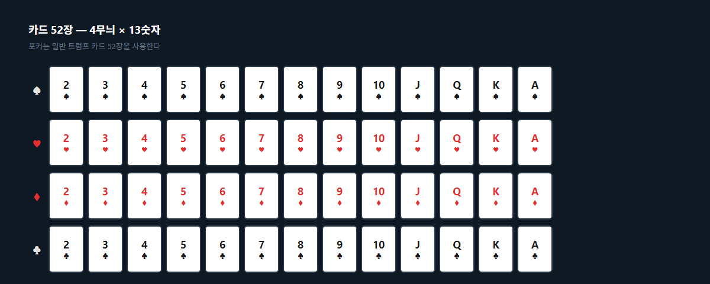

> 숫자는 2가 가장 약하고, **A(에이스)**가 가장 강하다.

## "나만 보는 카드"가 있다

포커에서는 일부 카드를 **뒤집어서** 받는다. 나만 볼 수 있고, 상대는 볼 수 없다. 이것을 **홀카드**(Hole Cards)라고 부른다.

> 방송에서는 **RFID 센서**(전파로 카드의 전자 태그를 읽는 장치)가 카드를 인식하여 **시청자에게만** 보여준다.

## "모두가 공유하는 카드"도 있다

테이블 가운데에 **모든 플레이어가 함께 사용하는** 카드가 놓인다. 이것이 **커뮤니티 카드**(Community Cards)다.

## 7장 중 최고 5장으로 승부

내 비공개 카드 **2장**과 공유 카드 **5장**, 합해서 **총 7장**이 놓인다. 이 중 가장 강한 **5장 조합**을 만든 사람이 이긴다.

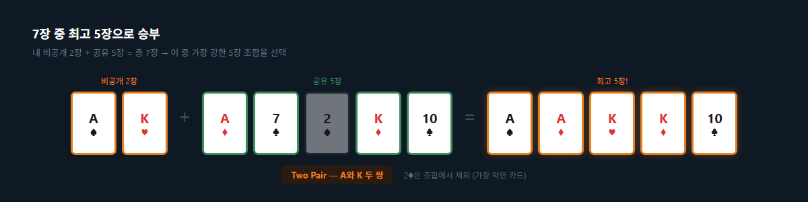

> 이 계산은 시스템이 자동으로 해준다.

## 베팅 = 3가지 선택

카드를 받은 뒤, 새 카드가 공개될 때마다 **베팅 라운드**가 진행된다. 매번 선택지는 딱 **3가지**:

| 선택 | 의미 | 예시 |
|------|------|------|
| **Call(따라 걸기)** | 상대와 같은 금액을 건다 | 상대가 100 → 나도 100 |
| **Raise(더 걸기)** | 상대보다 더 많이 건다 | 상대가 100 → 나는 300 |
| **Fold(포기)** | 이번 판을 포기한다 | 건 돈을 잃지만 더 잃지 않음 |

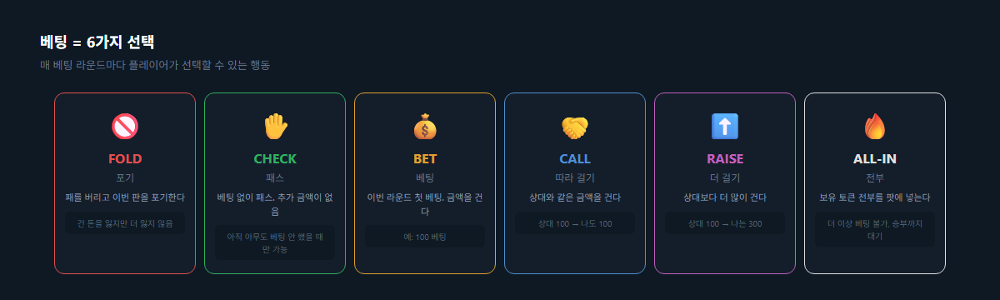

## 핸드 = 게임 1판의 흐름

카드를 나눠받고 → 베팅하고 → 승자가 결정되는 1회 사이클을 **핸드**(Hand)라고 부른다.

```mermaid
flowchart LR
    A["카드 배분"] --> B["베팅"]
    B --> C["보드 공개"]
    C --> D["승부"]
```

## 포커 기초 용어 정리

| 용어 | 뜻 |
|------|-----|
| **홀카드** | 나만 보는 비공개 카드 |
| **커뮤니티 카드** | 테이블 중앙에 모두가 공유하는 카드 |
| **팟(Pot)** | 이번 핸드에서 경쟁하는 총 상금 |
| **블라인드** | 핸드 시작 전 의무 베팅금 (참가비) |
| **Showdown(승부)** | 남은 플레이어가 카드를 공개하여 승자 결정 |
| **핸드(Hand)** | 게임 1판 (카드 배분 ~ 승자 결정) |

---

# Ch.3 — 방송에서 보이지 않는 것

## 1세대 — 투명 테이블 아래 카메라 (1999~2011)

가장 처음 시도된 방법은 **물리적**이었다. 테이블 테두리에 유리판을 설치하고, 그 아래에 카메라를 넣었다. 플레이어가 카드를 유리판 위에 올리면 카메라가 촬영한다.

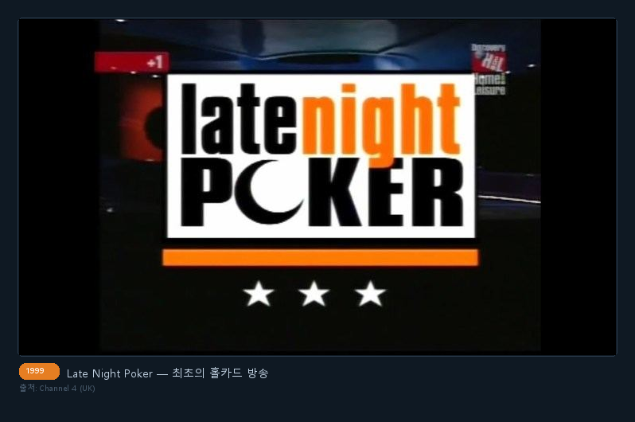
> *1999년 영국 Channel 4의 Late Night Poker. 투명 테이블 아래 카메라로 홀카드를 촬영한 최초의 방송. (출처: Channel 4)*

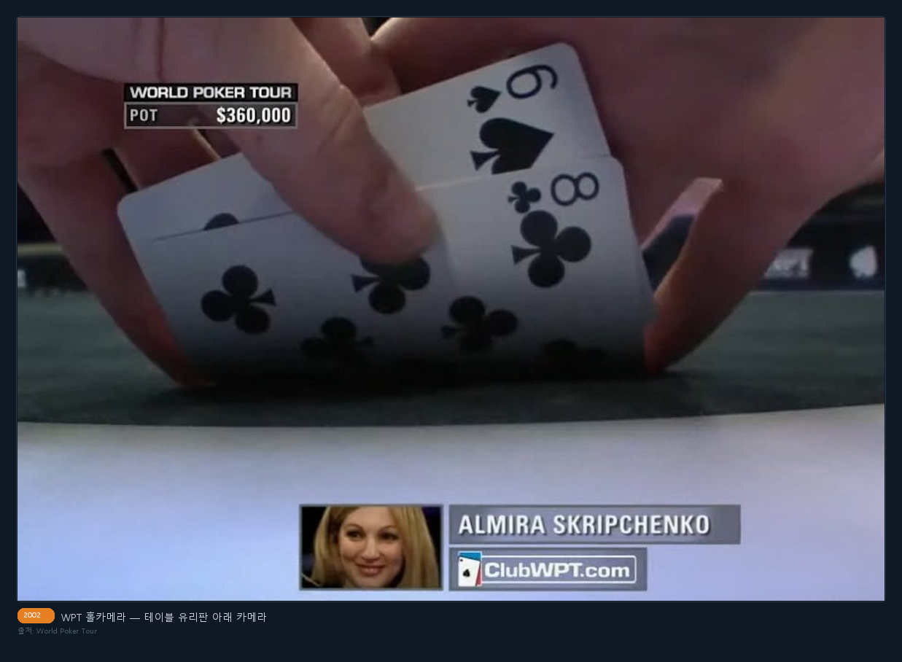
> *World Poker Tour 방송. 1세대는 카메라 각도와 조명에 의존했다. (출처: ClubWPT.com)*

**1세대의 한계**: 플레이어가 카드를 유리 위에 올려야만 보인다. 안 올리면 안 보인다. 카메라 각도에 따라 카드가 가려지기도 한다.

## 2세대 — RFID 전자 인식 (2012~현재)

2세대는 **전자적**이다. 각 카드에 **RFID 태그**(전파로 읽을 수 있는 아주 작은 전자 칩)가 내장되어 있고, 테이블에 설치된 **안테나**가 카드를 자동으로 감지한다.

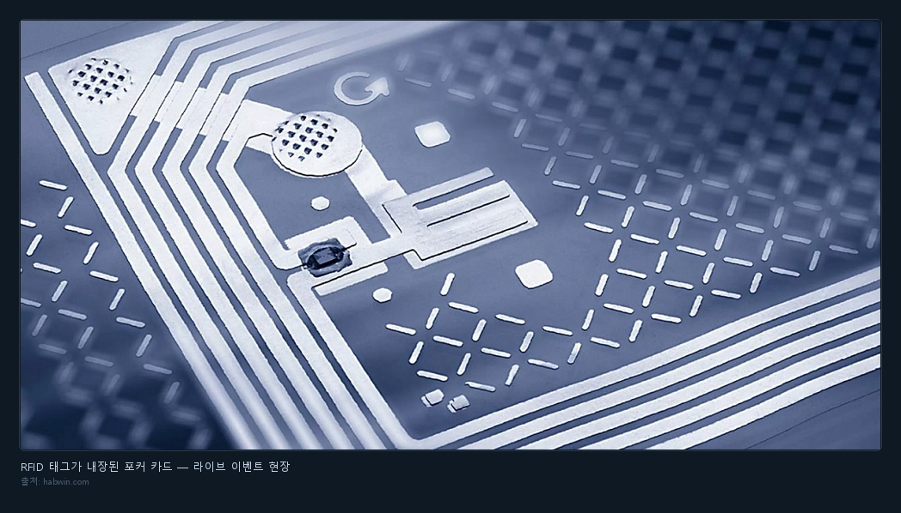
> *RFID 태그가 내장된 포커 카드. 카드 한 장마다 고유 코드가 저장되어 있다. (출처: habwin.com)*

### RFID가 카드를 읽는 과정

| 단계 | 일어나는 일 |
|:----:|-----------|
| ① | 플레이어가 카드를 받아 자기 앞에 놓는다 |
| ② | 테이블에 내장된 **RFID 안테나**가 카드의 전자 태그를 감지한다 |
| ③ | 안테나 번호(0~9)로 **누구의 카드인지**, 태그 코드로 **어떤 카드인지** 동시에 파악된다 |
| ④ | 이 정보가 서버로 전송되어 방송 화면에 표시된다 |

> 플레이어는 아무것도 할 필요가 없다. 카드를 놓기만 하면 시스템이 자동으로 인식한다.

### 기술 진화 타임라인

| 시기 | 이벤트 |
|------|--------|
| 1999 | Late Night Poker — 최초의 홀카드 방송 (1세대 카메라) |
| 2002 | ESPN WSOP 방송 — Hole Card Camera 채택 |
| 2012 | European Poker Tour — RFID 테이블 도입, 2세대 시작 |
| 2024~현재 | RFID가 모든 주요 토너먼트의 **표준**으로 정착 |

---

# Ch.4 — 실제 방송 화면 해부

아래는 실제 WSOP(World Series of Poker — 포커의 월드컵) 방송 화면이다. 카메라 영상 위에 **오버레이**(정보 그래픽을 겹쳐 표시한 것)가 합성되어 있다.

> 데이터 기준: WSOP Paradise 2025 Super Main Event Final Table

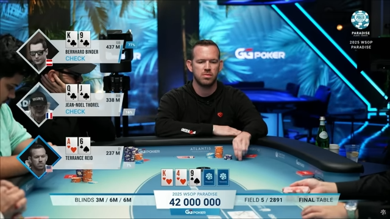

### 오버레이 해부도 — 번호별 요소

| # | 요소 | 보여주는 정보 | 갱신 시점 | 소스 |
|:-:|------|-------------|----------|:----:|
| 1 | **Player Info Panel** | 이름, 보유 토큰, 국적, 사진 | 변경 시 | EBS Core |
| 2 | **홀카드 표시** | 각 플레이어의 비공개 카드 이미지 (K♣9♣ 등) | 카드 배분 시 | EBS Core |
| 3 | **Action Badge** | CHECK(녹색), FOLD(적색), RAISE(황색) | 매 액션마다 | EBS Core |
| 4 | **승률 바** | 각 플레이어의 승리 확률 (%) | 보드 카드 공개 시 | EBS Core |
| 5 | **커뮤니티 카드** | Flop/Turn/River 공개 카드 | 각 스트리트 | EBS Core |
| 6 | **이벤트 배지** | 대회명, 로고 | 고정 | 프로덕션 |
| 7 | **Bottom Info Strip** | BLINDS, POT, FIELD, STAGE | 변경 시 | 혼합 |
| 8 | **팟 카운터** | 현재 팟 크기 (42,000,000) | 매 액션마다 | EBS Core |
| 9 | **FIELD / 스테이지** | 남은 인원 (5/2891), FINAL TABLE | 변경 시 | 프로덕션 |
| 10 | **스폰서 로고** | 대회 스폰서 브랜딩 | 고정 | 프로덕션 |

> 이 화면에서 **게임 데이터 기반 요소**(#1~5, #8)를 EBS가 실시간 생성한다. 이벤트 배지(#6), 필드/스테이지(#9), 스폰서 로고(#10) 등 정적·외부 정보는 프로덕션 프레임워크에서 처리한다. EBS Core와 프로덕션의 경계는 Ch.6에서 상세히 정의한다.

---

# Ch.5 — 방송이 시청자에게 도달하는 과정

Ch.4에서 해부한 방송 화면 — 이것이 시청자에게 도달하기까지 **4개 구간**을 거친다. EBS는 이 중 첫 번째 구간(Section A)에서 실시간 오버레이를 담당한다.

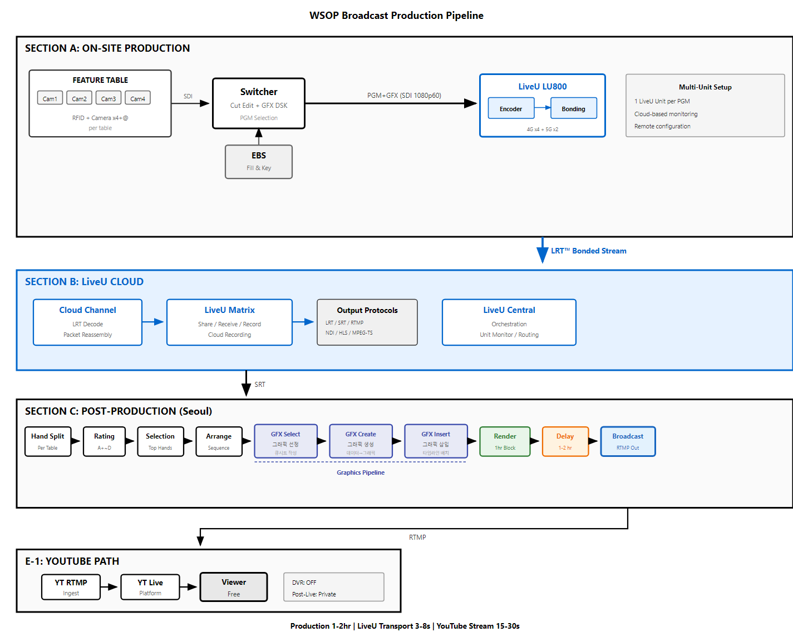

## 4개 구간 — 현장에서 YouTube까지

| Section | 위치 | 역할 |
|---------|------|------|
| **A** | 현장 (Vegas/Europe) | 촬영 + **EBS 실시간 오버레이** + 송출 |
| **B** | LiveU Cloud (SaaS) | 클라우드 전송 / 분배 / 녹화 |
| **C** | 서울 GGProduction | 후편집 (Block Edit) + 그래픽 삽입 |
| **E-1** | YouTube | 무료 시청자 송출 |

> **EBS의 실시간 처리 범위는 Section A**다. Section C에서는 EBS가 생성한 핸드 히스토리 JSON을 **API로 제공**받아 후편집 그래픽을 제작한다.

---

## Section A — 현장 프로덕션

현장에서는 촬영부터 송출까지 5단계 장비 체인을 거친다.

| 단계 | 장비 | 설명 |
|------|------|------|
| 촬영 | Camera ×4+@/테이블 | 메인 포커 테이블 촬영 |
| 전환 | Switcher | 카메라 전환 + 그래픽 합성 |
| 오버레이 | **EBS** | 투명 배경 그래픽 합성 — 카드, 팟, 승률 표시 (Fill & Key) |
| 출력 | PGM + GFX | 최종 방송 영상 |
| 업링크 | LiveU | 영상 압축 후 무선 전송 |

> EBS가 생성하는 **8종 실시간 오버레이**(홀카드, 커뮤니티 카드, 액션 배지, 팟 카운터, 승률 바, 플레이어 정보, Outs, 포지션)는 Ch.6에서 상세히 설명한다.

---

## Section B — 클라우드 전송 (LiveU)

현장에서 송출된 영상은 LiveU Cloud를 통해 전 세계에 분배된다. 물리 서버 없이 클라우드에서 동작하는 SaaS 전송 인프라다.

| 구성 | 역할 |
|------|------|
| Cloud Channel | 현장 영상 수신 + 디코딩 |
| LiveU Matrix | 공유 / 수신 / 녹화 |
| Output Protocols | SRT, RTMP, NDI, HLS 등 다중 프로토콜 출력 |

> Section B는 EBS 외부 영역이다. EBS 출력(SDI/NDI)이 Section A에서 나오면, 이후 전송은 LiveU 인프라가 담당한다.

---

## Section C — 후편집 (서울 GGProduction)

### Block Edit 파이프라인

실시간으로 송출된 방송 영상을 **1시간 단위(블록)**로 나누어, 흥미로운 핸드만 골라 재편집하는 작업이다.

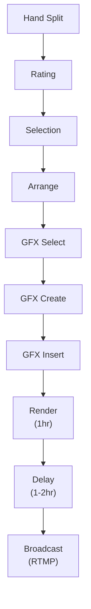
```mermaid
flowchart TD
    A["Hand Split"] --> B["Rating"]
    B --> C["Selection"]
    C --> D["Arrange"]
    D --> E["GFX Select"]
    E --> F["GFX Create"]
    F --> G["GFX Insert"]
    G --> H["Render<br/>(1hr)"]
    H --> I["Delay<br/>(1-2hr)"]
    I --> J["Broadcast<br/>(RTMP)"]
```

| 단계 | 설명 |
|------|------|
| Hand Split | 영상을 핸드(한 판) 단위로 분리 |
| Rating | 각 핸드에 A+~D 등급 매김 |
| Selection | 볼거리 높은 상위 핸드 선별 |
| Arrange | 방송 순서로 재배치 |
| GFX Select~Insert | 후편집 그래픽 선정 → 제작 → 삽입 |
| Render → Broadcast | 1시간 블록 렌더링 → RTMP로 YouTube 송출 |

### Graphics Workflow — 큐시트에서 방송까지

후편집 그래픽은 4단계를 거쳐 완성된다:

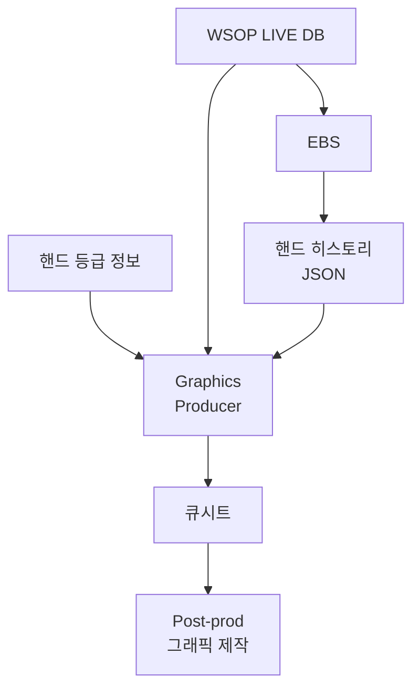
```mermaid
flowchart TD
    A["핸드 등급 정보"] --> B["Graphics<br/>Producer"]
    C["WSOP LIVE DB"] --> B
    C --> D["EBS"]
    D --> E["핸드 히스토리<br/>JSON"]
    E --> B
    B --> F["큐시트"]
    F --> G["Post-prod<br/>그래픽 제작"]
```

1. **데이터 수집**: Graphics Producer가 핸드 등급 정보와 WSOP LIVE DB 데이터를 모니터링
2. **JSON 변환**: EBS가 WSOP LIVE DB에서 핸드 히스토리를 JSON 파일로 변환
3. **큐시트 합류**: 핸드 히스토리 JSON과 Producer 지시가 **큐시트**(작업 지시서)에 합류
4. **그래픽 제작**: Post-production 팀이 큐시트에 따라 그래픽 제작/삽입

> **EBS의 역할**: 핸드 히스토리 JSON 변환 제공. 그래픽 자체는 서울 Post-production 팀이 제작한다.

**L-Bar 워크플로우**: 큐시트 → Graphics 팀(lower-third + 투명 배경 이미지) → GFX 소프트웨어 → 편집 프로그램 → 타임라인 배치. 레벨 전환, PIP 전환, 블록 전환 시 사용.

---

## Section E-1 — YouTube 송출

| 항목 | 값 |
|------|-----|
| 프로토콜 | RTMP |
| 플랫폼 | YouTube Live |
| 시청자 | 무료 (Free/Teaser) |

## 전체 지연 분석

현장에서 카드가 놓이는 순간부터 시청자 화면에 도달하기까지의 총 지연:

| 구간 | 지연 | 누적 |
|------|:----:|:----:|
| EBS 오버레이 생성 (Section A) | < 100ms | ~0초 |
| LiveU 전송 (Section B) | 3~8초 | ~8초 |
| Block Edit 후편집 (Section C) | **1~2시간** | ~1~2시간 |
| YouTube 스트림 버퍼 (Section E-1) | 15~30초 | ~1~2시간 |

> 시청자가 보는 방송은 실제 게임보다 **약 1~2시간 뒤**다. 이 지연의 대부분은 후편집(Section C) 과정이다.

> 상세 분석: `docs/1. Product/References/WSOP-Production-Structure-Analysis.md`

---

---

# Part II — 제품: EBS가 하는 일

---

# Ch.6 — 아키텍처와 범위

## 아키텍처 오버뷰 — 전체 그림

EBS는 **뒤집힌 카드를 전자적으로 읽어서 방송 화면에 실시간으로 표시**하는 시스템이다. 전체 과정을 먼저 한 눈에 보자.

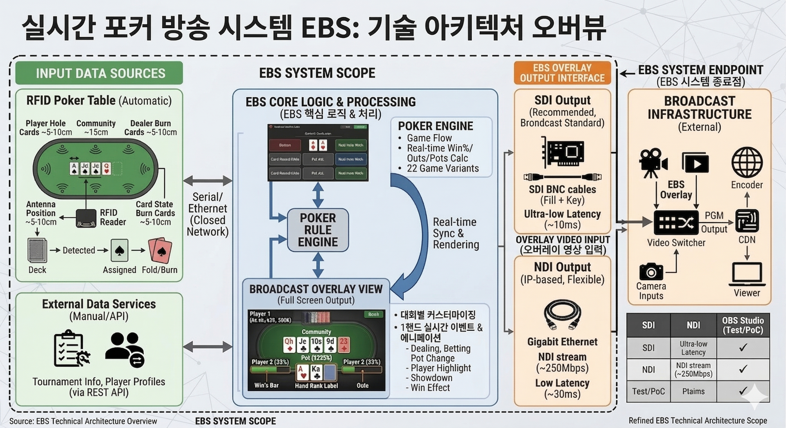

| 단계 | 하는 일 | 핵심 장비/소프트웨어 |
|:----:|---------|:-------------------:|
| ① 카드 인식 | 테이블 아래 센서가 카드를 자동 감지 | RFID 안테나 |
| ② 게임 엔진 | 카드 조합으로 승률을 실시간 계산 | Poker Engine |
| ③ 화면 생성 | 카메라 영상 위에 정보를 합성 | Overlay View |
| ④ 방송 출력 | 완성된 영상을 방송 장비로 전달 | SDI / NDI 출력 |

> 카드를 놓는 순간부터 방송 화면에 표시되기까지 **100ms(0.1초) 이내**에 완료된다.

전체 그림은 두 개의 서브시스템으로 나뉜다 — **소프트웨어 아키텍처**(5개 앱 + 1개 독립 모듈이 어떻게 협력하는가)와 **하드웨어 아키텍처**(RFID 모듈이 어떻게 카드를 읽는가). 각각을 먼저 한 장으로 살펴본 뒤, 이어지는 섹션에서 단계별로 따라간다.

## 소프트웨어 아키텍처

EBS는 5개 앱 + 1개 독립 모듈(Graphic Editor)로 구성된다. 각 앱은 독립 팀이 소유하며, REST/WebSocket 경계로만 통신한다. Graphic Editor는 Lobby Settings 내부에 위치하지만 자체 API(API-07)·데이터 포맷(.gfskin/DATA-07)·FSM을 보유하며, Overlay가 출력할 그래픽을 설정하는 핵심 경로를 담당한다.

| 앱 | 기술 스택 | 역할 요약 | 소유 팀 |
|----|----------|----------|:------:|
| **Lobby** | Quasar (Vue 3) + TypeScript + Pinia | 테이블 관리, Settings 6탭, Event/Flight CRUD | Team 1 |
| ↳ **Graphic Editor** | Quasar + rive-js (BS-08, API-07, DATA-07) | 오버레이 씬/스킨 편집·미리보기·배포 (.gfskin) | Team 1 |
| **Backend (BO)** | FastAPI + SQLModel + WebSocket | REST 66+ EP, WSOP LIVE 동기화, 3채널 WS, Auth/RBAC, GE API-07 | Team 2 |
| **Command Center** | Flutter + Riverpod (Dart) | 테이블별 1 인스턴스, 핸드 생명주기, RFID HAL 통합 | Team 4 |
| **Game Engine** | Pure Dart package, Event Sourcing | 22종 게임 규칙, 실시간 Win%/Equity, Pot/Showdown 판정 | Team 3 |
| **Overlay** | Flutter + Rive (.riv) | .gfskin 씬 로딩 → 애니메이션 렌더링 → SDI/NDI 출력 | Team 4 |

> 각 앱의 내부 구조(레이어, DI, 모듈 경계, 상태 관리 상세)는 팀별 `specs/impl/` 문서 참조. Team 2의 `IMPL-01~09`이 현재 가장 상세한 레퍼런스이며, Team 1/3/4는 동일 템플릿으로 확장 예정.

> **그래픽 설정 경로**: 운영자가 Graphic Editor(Lobby 내부)에서 씬을 편집하고 `.gfskin`을 업로드하면, Backend(API-07)가 검증·저장 후 `skin_updated` WebSocket 이벤트를 Overlay에 브로드캐스트한다. Overlay는 `.gfskin`을 다운로드하여 Rive 런타임에 로딩하고, 이후 Game Engine의 OutputEvent(API-04)에 따라 해당 씬을 실시간 렌더링한다. 이 경로는 3팀(Team 1→Team 2→Team 4)이 관여하며, BS-08·API-07·DATA-07에 명세되어 있다.

## 하드웨어 아키텍처

카드 인식 장치(**RFID 모듈**) 내부는 **물리 카드 → 안테나 → NFC IC → MCU** 4단계 수직 스택으로 구성된다. 하단의 **Serial UART 경계선**이 하드웨어와 소프트웨어를 분리하며, 그 아래로 `IRfidReader` HAL이 Real/Mock 두 모드를 추상화한다.

| 계층 | 구성요소 | 핵심 사양 |
|:----:|---------|----------|
| ① 물리 카드 | ISO 14443-A 태그 내장 | 13.56 MHz · 패시브 · 카드 뒷면 매립 |
| ② 안테나 어레이 | 12 채널 (Seat 10 · Community 1 · Burn 1) | 좌석 감지 ~5–10 cm · 커뮤니티 ~15 cm |
| ③ NFC Frontend IC | ST25R3911B (STMicroelectronics) | ISO 14443-A · ASK/BPSK · Anti-collision |
| ④ MCU | ESP32 (Dual-core 240 MHz) | 12-ch 멀티플렉싱 · 펌웨어 상태머신 · UART 프레임 |
| — 경계 — | Serial UART (115 200 bps, Closed Network) | HW ↔ SW 설계 경계 |
| ⑤ HAL | `IRfidReader` Dart 추상 인터페이스 (API-03) | Real HAL / Mock HAL 교체 가능 |
| ⑥ Consumers | Command Center (Team 4) · Game Engine (Team 3) | CardDetected 이벤트 수신 |

> **설계 경계**: 안테나·IC·MCU·펌웨어는 **Phase 0에서 외부 공급업체와 공동 설계** 중이며, 상세 스펙은 파트너 확정 후 별도 HW 문서로 수령한다 (RFI 진행 중: Sun-Fly, Angel Playing Cards, 엠포플러스). EBS 소프트웨어는 `IRfidReader` 추상 인터페이스에만 의존하므로, 하드웨어 교체/업그레이드 시에도 SW는 불변이다. Mock HAL 전략은 Ch.10 "Mock HAL 전략" 섹션에서 설명한다.

이제 각 단계를 하나씩 따라간다.

---

## 각 단계 따라가기

> 플레이어가 K♠을 테이블에 놓는다. 0.1초 후, 방송 화면에 K♠이 표시된다. **그 사이에 무슨 일이 벌어지는가?**

Ch.4에서 해부한 방송 화면 — 지금부터 **이것이 어떻게 만들어지는지** 따라간다.

### 1단계: 카드를 읽는다

플레이어가 카드를 자기 앞에 놓기만 하면, 테이블 천 아래에 매립된 센서가 자동으로 카드를 인식한다.

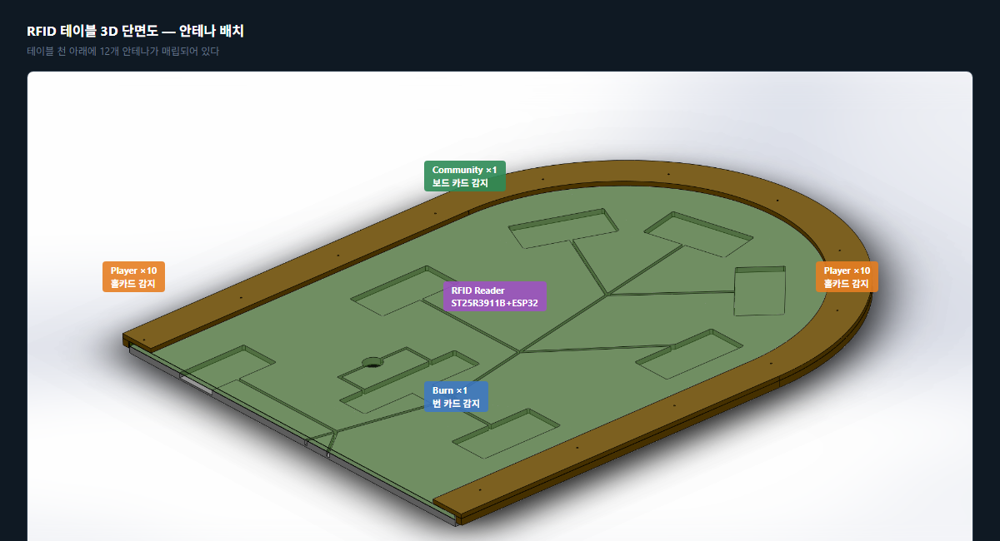

> 테이블 천 아래에 **12개 안테나**가 매립되어 있다. 각 안테나는 위에 놓인 카드의 전자 태그를 읽어서 **누구의 카드인지**(안테나 위치)와 **어떤 카드인지**(태그 코드)를 동시에 파악한다.

| 컴포넌트 | 감지 범위 | 역할 |
|---------|:--------:|------|
| Player Hole Cards 안테나 (×10) | ~5-10cm | 각 좌석의 비공개 카드 감지 |
| Community Cards 안테나 (×1) | ~15cm | 보드 카드 감지 |
| Dealer Burn Cards 안테나 (×1) | ~5-10cm | 번 카드 감지 |

카드가 안테나 위에 놓이면 다음과 같이 상태가 전이된다:

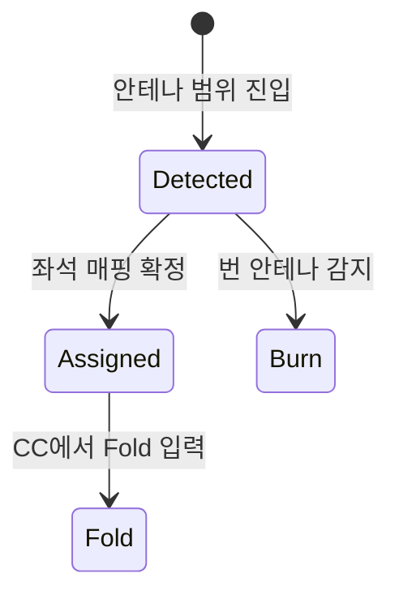
```mermaid
stateDiagram-v2
    [*] --> Detected: 안테나 범위 진입
    Detected --> Assigned: 좌석 매핑 확정
    Detected --> Burn: 번 안테나 감지
    Assigned --> Fold: CC에서 Fold 입력
```

**연결 방식**: Serial/Ethernet — **폐쇄 네트워크** (외부 인터넷과 분리). 이 카드 인식 장치를 **RFID 모듈**이라 부른다. 하드웨어 내부 구조는 Ch.6 첫머리 "하드웨어 아키텍처"에서 설명한다.

### 대회 정보를 가져온다

카드 정보 외에도 방송에 필요한 대회 정보가 있다. 이 데이터는 자동으로 수신된다.

| 소스 | 수집 정보 | 방식 |
|------|----------|------|
| **WSOP LIVE** | 대회 일정, 블라인드 구조, 선수 정보, 테이블 배정 | REST API 자동 수신 |
| **Player Profiles** | 선수 사진, 국적, 통계 | REST API 자동 수신 |

### 베팅 액션을 입력한다

RFID는 카드만 읽을 수 있다. 플레이어가 **얼마를 걸었는지**(Bet), **포기했는지**(Fold) 같은 **베팅 액션**은 운영자가 직접 입력해야 한다.

이 입력을 하는 전용 소프트웨어가 있다. 운영자가 실제로 보는 화면은 이렇게 생겼다:

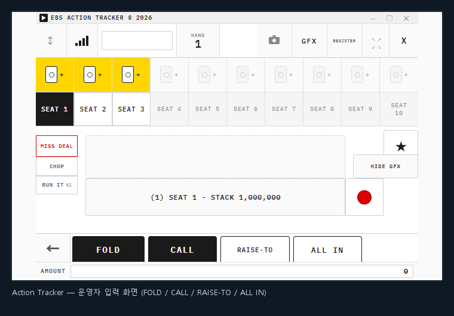

> 운영자는 좌석을 선택하고 FOLD/CALL/RAISE 버튼을 누른다. 이 입력 시스템을 **Command Center**라고 부른다.

**정리**: EBS에는 **3가지 데이터**가 들어온다 — ① RFID(카드, 자동), ② WSOP LIVE(대회 정보, 자동), ③ Command Center(베팅 액션, 수동).

### 2단계: 확률을 계산한다

카드가 인식되면, 소프트웨어가 즉시 **"이 카드 조합으로 이길 확률이 몇 %인가"**를 계산한다.

카드 2장이 들어오면 → 보드에 공개된 카드와 조합하여 → 가능한 모든 경우를 계산한다.

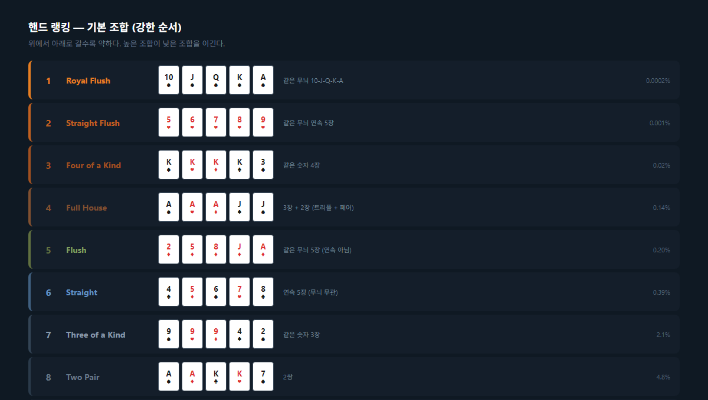

> 이 조합들을 순위로 비교하여 **각 플레이어의 승률**을 실시간으로 산출한다. 이 계산을 하는 소프트웨어를 **Poker Engine**이라 부른다.

| 기능 | 설명 |
|------|------|
| **Game Flow** | 22가지 포커 변형의 진행 규칙 적용 (Ch.7 참조) |
| **Real-time Win%** | 현재 카드 상태에서 각 플레이어 승률 실시간 계산 |
| **Odds/Pots Calc** | 팟 크기, 사이드 팟, 베팅 금액 추적 |

### 3단계: 화면을 만든다

Poker Engine이 계산한 결과(카드, 승률, 팟)를 **카메라 영상 위에 겹쳐** 그린다. Ch.4에서 해부한 그 방송 화면이 바로 이것의 출력이다.

> 카메라 원본에는 카드가 뒤집혀 보이지 않는다. 여기에 홀카드, 승률 바, 팟 카운터, 액션 배지를 합성한 것이 방송 화면이다. **이 합성을 하는 것을 Overlay View라 부른다.**

| 요소 | 내용 |
|------|------|
| **카드 표시** | 홀카드, 커뮤니티 카드 이미지 |
| **승률 바** | 각 플레이어 승리 확률 (%) |
| **팟 정보** | 현재 팟 크기, 사이드 팟 |
| **액션 배지** | CHECK(녹색), FOLD(적색), RAISE(황색) |

실시간 애니메이션 이벤트:

| 이벤트 | 트리거 |
|--------|--------|
| Dealing | 카드 배분 시 |
| Betting | 베팅 액션 시 |
| Pot Change | 팟 금액 변동 시 |
| Player Highlight | 액션 차례 시 |
| Showdown | 승부 판정 시 |
| Win Effect | 승자 결정 시 |

### 4단계: 방송 장비로 보낸다

완성된 오버레이 영상을 방송 장비로 전달해야 한다. 방법은 3가지가 있다.

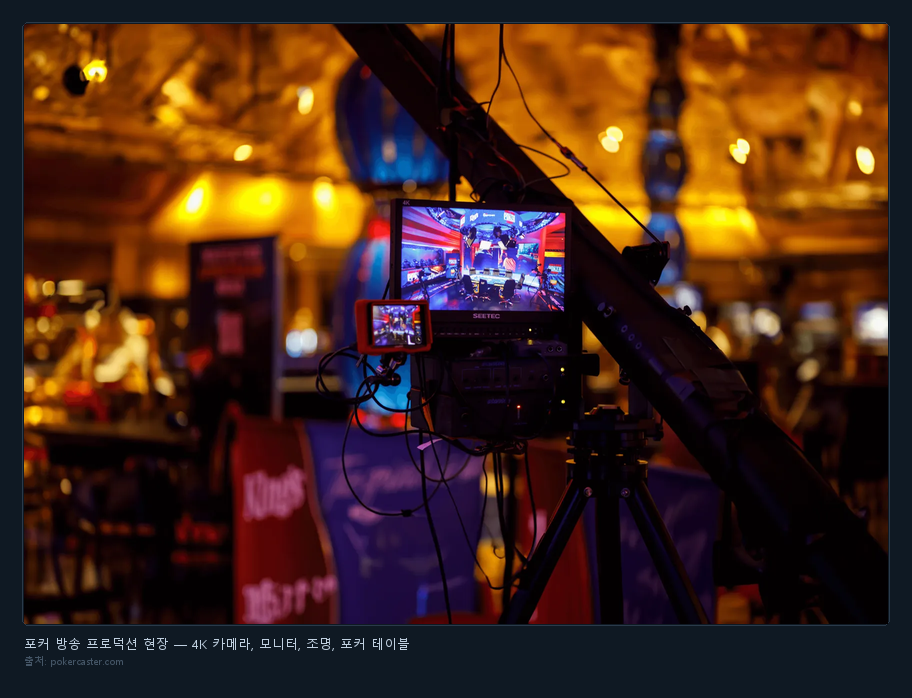

#### 전용 케이블로 보내는 방법

방송국에서 쓰는 전용 동축 케이블로 보내는 방법이다. 지연이 **10ms**로 가장 빠르다.

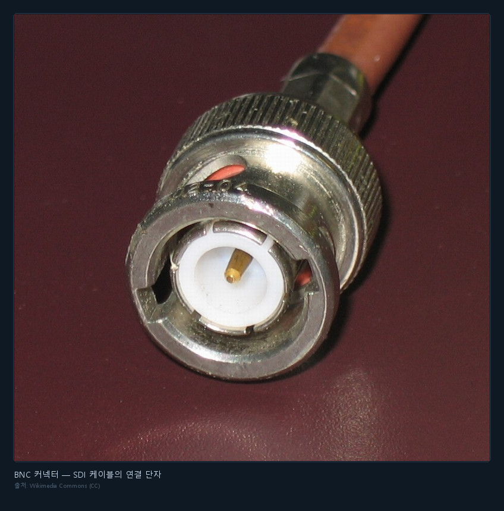

> 이 커넥터가 달린 케이블을 **SDI**(Serial Digital Interface)라고 부른다. 방송 업계 표준이다. Fill+Key를 분리하여 방송 스위처에서 합성하는 **SDI BNC** 방식도 있다.

#### 네트워크로 보내는 방법

인터넷 네트워크를 통해 소프트웨어로 보내는 방법도 있다. 케이블이 필요 없지만 지연이 **30ms**로 SDI보다 느리다.

> 네트워크 기반 영상 전송을 **NDI**(Network Device Interface)라고 부른다. OBS Studio 같은 소프트웨어에서 바로 수신할 수 있다.

| 출력 경로 | 레이턴시 | 용도 |
|-----------|:--------:|------|
| **SDI** | ~10ms | 프로덕션 표준 (권장) |
| **SDI BNC** (Fill+Key) | ~10ms | Key 신호 분리 합성 — 방송 스위처 연동 |
| **NDI** | ~30ms | 네트워크 기반 — OBS Studio 등 소프트웨어 연동 |

---

### 처음부터 끝까지 — 전체 파이프라인

지금까지 따라온 4단계를 한 장으로 정리한 것이다.

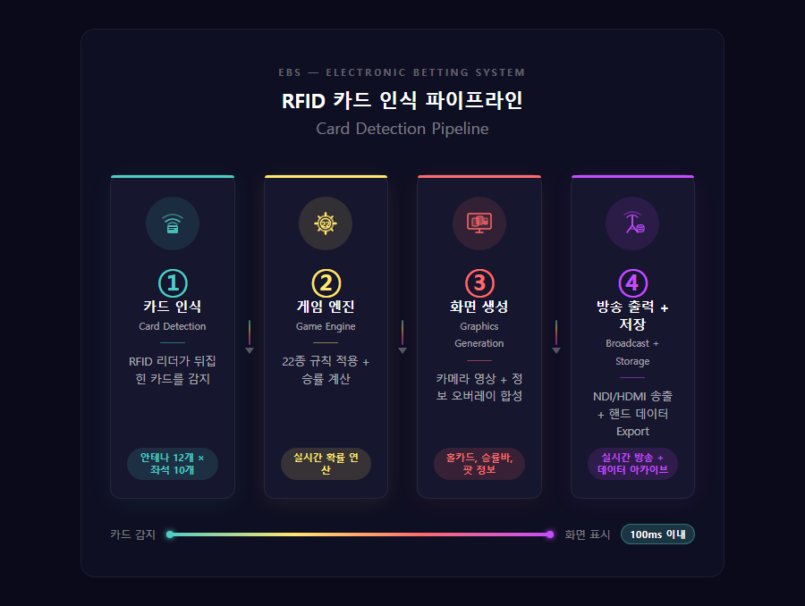

> ① 카드 인식 → ② 게임 엔진 → ③ 화면 생성 → ④ 방송 출력. 전체 파이프라인이 **100ms 이내**에 완료된다.

이 모든 과정을 하나의 소프트웨어에서 제어한다:

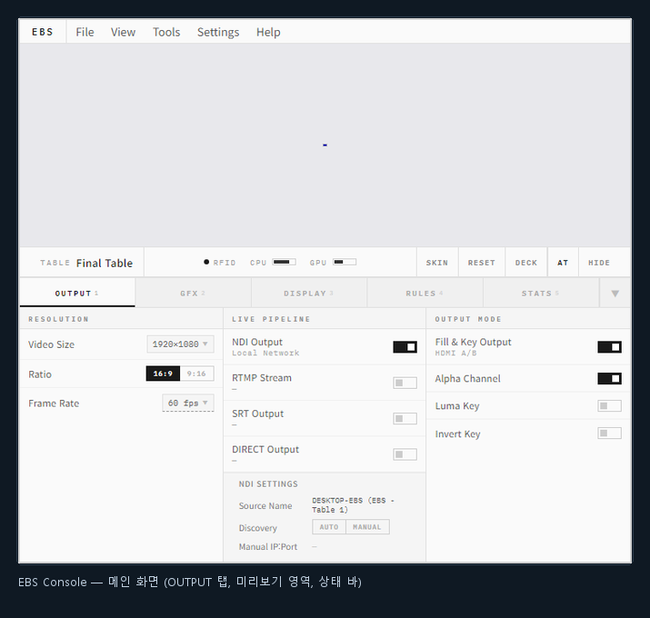

> 미리보기 화면에서 오버레이 출력을 실시간으로 확인하며, 하단 탭(OUTPUT, GFX, DISPLAY, RULES, STATS)에서 모든 설정을 제어한다. **이것이 EBS Console이다.**

---

### 전체 구조도

지금까지 하나씩 살펴본 것을 전체 지도로 정리한다.

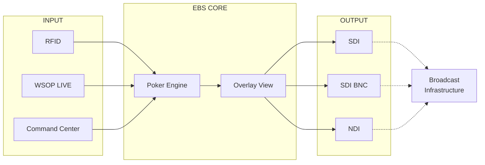
```mermaid
flowchart LR
    subgraph IN["INPUT"]
        RFID["RFID"]
        API["WSOP LIVE"]
        CC["Command Center"]
    end
    subgraph CORE["EBS CORE"]
        PE["Poker Engine"]
        BOV["Overlay View"]
    end
    subgraph OUT["OUTPUT"]
        SDI["SDI"]
        BNC["SDI BNC"]
        NDI["NDI"]
    end
    RFID --> PE
    API --> PE
    CC --> PE
    PE --> BOV
    BOV --> SDI
    BOV --> BNC
    BOV --> NDI
    SDI -.-> EP["Broadcast<br/>Infrastructure"]
    BNC -.-> EP
    NDI -.-> EP
```

**이제 각 박스가 무엇인지 안다.** 왼쪽의 3가지 입력이 Core에서 처리되어, 3가지 출력을 통해 외부 방송 인프라로 전달된다. 점선이 EBS의 경계 — 오른쪽은 EBS가 관여하지 않는 영역이다.

| 장비 | 역할 |
|------|------|
| **Video Switcher** | 카메라 앵글 전환 + 오버레이 합성 |
| **Encoder** | 영상 인코딩 (H.264/H.265) |
| **PGM** | 프로그램 출력 (최종 방송 영상) |
| **Camera** | 포커 테이블 촬영 (4K) |

최종 송출: SDI → Ultra-low Latency 전용선 / NDI → OBS Studio 등 소프트웨어 송출 / Plains → 지상파/위성

## 방송 그래픽 28종 — EBS가 만드는 것과 만들지 않는 것

### 왜 구분이 필요한가

WSOP 방송을 보면 화면에 **28가지 그래픽**이 보인다. 홀카드, 승률 바, VPIP 차트, 리더보드, 자막, 로고 등. 이것들이 **전부 같은 시스템에서 만들어질까?**

**아니다.** 완전히 다른 3가지 경로에서, 다른 시간에, 다른 장소에서 만들어진다.

이 구분을 정확히 이해하지 않으면, "VPIP도 EBS에서 만들어야 하는 거 아닌가?"라는 오해가 생긴다. 아래에서 왜 분리되는지 보여준다.

### 3가지 경로 — 시간과 장소가 다르다

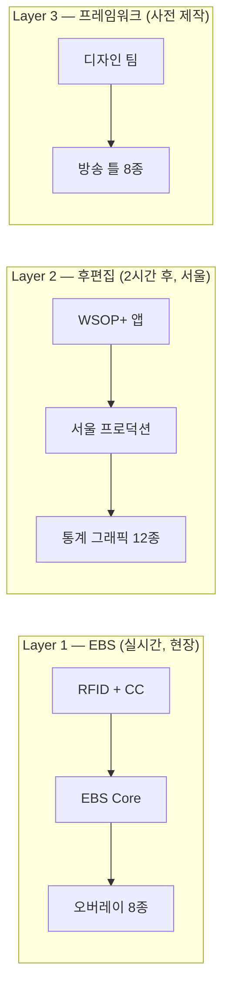
```mermaid
flowchart LR
    subgraph L1["Layer 1 — EBS (실시간, 현장)"]
        A1["RFID + CC"] --> B1["EBS Core"]
        B1 --> C1["오버레이 8종"]
    end
    subgraph L2["Layer 2 — 후편집 (2시간 후, 서울)"]
        A2["WSOP+ 앱"] --> B2["서울 프로덕션"]
        B2 --> C2["통계 그래픽 12종"]
    end
    subgraph L3["Layer 3 — 프레임워크 (사전 제작)"]
        A3["디자인 팀"] --> C3["방송 틀 8종"]
    end
```

| 구분 | Layer 1 (EBS) | Layer 2 (후편집) | Layer 3 (프레임워크) |
|------|:---:|:---:|:---:|
| **언제** | 실시간 (0초) | 1~2시간 후 | 방송 전 사전 제작 |
| **어디서** | 현장 (Vegas) | 서울 (GGProduction) | 서울 (디자인팀) |
| **데이터** | RFID + Command Center | WSOP+ 앱 + 핸드 히스토리 | 없음 (고정 디자인) |
| **누가** | EBS 시스템 (자동) | 프로덕션 팀 (수동 편집) | 디자인 팀 (사전 제작) |
| **EBS 역할** | **직접 생성** | 데이터 API 제공만 | 관여 없음 |

> **핵심**: Layer 1은 카드가 놓이는 **그 순간** 현장에서 자동 생성된다. Layer 2는 그 핸드가 끝난 **1~2시간 뒤** 서울에서 수동으로 삽입된다. 같은 방송 화면에 보이지만, 만들어지는 시간과 장소가 완전히 다르다.

### Layer 1 — EBS가 만드는 그래픽 (8종)

RFID가 카드를 읽거나, 운영자가 Command Center에서 액션을 입력하는 순간 **자동으로 즉시 생성**된다.

| # | 그래픽 | 트리거 | 생성 방식 |
|:-:|--------|--------|----------|
| 1 | **홀카드 표시** | RFID가 카드 감지 | 자동 |
| 2 | **커뮤니티 카드** | RFID가 보드 카드 감지 | 자동 |
| 3 | **액션 배지** (CHECK/FOLD/RAISE) | CC에서 운영자 입력 | 반자동 |
| 4 | **팟 카운터** | 베팅 금액 누적 | 자동 계산 |
| 5 | **승률 바** | 카드 변경 시 재계산 | 자동 계산 |
| 6 | **플레이어 정보** (이름/스택/사진) | WSOP LIVE API | 자동 수신 |
| 7 | **Outs** (남은 유리한 카드 수) | RFID 카드 데이터로 계산 | 자동 계산 |
| 8 | **플레이어 포지션** | CC에서 좌석 지정 | 반자동 |

### Layer 2 — 프로덕션 팀이 후편집으로 삽입하는 그래픽 (12종)

EBS가 **데이터를 API로 제공**할 수 있지만, 그래픽 자체는 서울 프로덕션 팀이 방송 1~2시간 후에 수동으로 삽입한다. **EBS가 이 그래픽을 만들지 않는다.**

| # | 그래픽 | 데이터 소스 | 왜 EBS 밖인가 | 샘플 |
|:-:|--------|-----------|-------------|:----:|
| 9 | VPIP indicator | WSOP LIVE DB | 후편집 시점에 프로듀서가 판단하여 삽입 | — |
| 10 | Chip Flow chart | EBS 핸드 히스토리 JSON | 여러 핸드 축적 데이터 → 사후 분석 | — |
| 11 | Chip Stack Meter | EBS 핸드 히스토리 JSON | 동일 | — |
| 12 | Tournament Leaderboard | WSOP LIVE DB | 실시간 트리거 없음, 편집 판단 | — |
| 13 | Table Leaderboard | WSOP LIVE DB | 동일 | [영상](https://www.youtube.com/live/pp9pA3dQWIk?t=13534) |
| 14 | Mini Leaderboard | EBS 핸드 히스토리 JSON | 동일 | [영상](https://www.youtube.com/live/pp9pA3dQWIk?t=4121) |
| 15 | At Risk | WSOP LIVE DB | 탈락 위기 판단 = 편집 판단 | [영상](https://www.youtube.com/live/pp9pA3dQWIk?t=2824) |
| 16 | Elimination | 대회 운영 | 탈락 연출 = 편집 판단 | — |
| 17 | Profile Card | Manual (사전 제작) | 선수 소개 카드 = 편집 삽입 | [영상](https://www.youtube.com/live/pp9pA3dQWIk?t=14571) |
| 18 | Player vs Player | Manual (사전 제작) | 대결 구도 연출 = 편집 삽입 | — |
| 19 | Level/Blinds | 토너먼트 스케줄 | 레벨 표시 = 편집 삽입 | — |
| 20 | Chips in Play | Manual (토너먼트 데이터) | 전체 칩 현황 = 편집 삽입 | — |

> **참고**: #10, #11, #14는 **EBS가 생성한 핸드 히스토리 JSON**을 데이터로 사용한다. 데이터 소스는 EBS이지만, 그래픽 자체는 서울에서 후편집으로 삽입하므로 Layer 2로 분류된다.

### Layer 3 — 방송 프레임워크 (8종)

방송 전에 미리 만들어두는 틀. EBS와 **완전히 무관**하다.

| # | 그래픽 | 설명 |
|:-:|--------|------|
| 21 | Bugs | 로고, 라이브 표시, 시계, 필드 카운트 |
| 22 | Title Cards | 방송/대회 정보 타이틀 |
| 23 | Lower Thirds | 인물/장소 자막 |
| 24 | Live Updates | 스크롤 텍스트 속보 |
| 25 | L-Bar Overlay | 멀티스크린 전환 레이아웃 |
| 26 | PIP | Picture-in-Picture |
| 27 | Multi-table Transition | 테이블 전환 효과 |
| 28 | Outer Table Transition | 아우터 테이블 전환 효과 |

### 경계 판정 기준 — 3축 동시 충족

어떤 그래픽이 EBS 영역인지 판단하는 기준은 **3가지 조건이 동시에 충족**되어야 한다. 하나라도 벗어나면 EBS 외부다.

| 축 | EBS (Layer 1) | 프로덕션 (Layer 2~3) |
|:--:|:---:|:---:|
| **시간** | 실시간 (카드 놓는 그 순간) | 1~2시간 후 (후편집) |
| **장소** | 현장 (Vegas/Europe) | 서울 (GGProduction) |
| **데이터** | RFID + Command Center | WSOP+ 앱 + Adobe |

> **EBS = 실시간 × 현장 × RFID/CC**. 이 3가지가 모두 충족되는 그래픽만 EBS가 처리한다. VPIP indicator는 "후편집 × 서울 × WSOP+ 앱"이므로 3축 모두 EBS 밖이다.

### 분류 체계 정합성 — Layer vs 데이터 소스

이 PRD는 그래픽을 **제작 시점/장소**(Layer) 기준으로 분류한다. 별도의 분석 문서(`docs/1. Product/References/WSOP-Production-Structure-Analysis.md`)는 같은 그래픽을 **데이터 소스** 기준으로 19종을 분류한다. 두 체계는 **상호 보완적**이다.

| 분류 축 | 기준 | 답하는 질문 |
|---------|------|-----------|
| **Layer (이 PRD)** | 언제 / 어디서 / 누가 만드는가 | "EBS가 만드는가, 프로덕션이 만드는가?" |
| **데이터 소스 (Analysis)** | 데이터가 어디서 오는가 | "EBS 데이터인가, WSOP LIVE DB인가, Manual인가?" |

두 축은 직교한다. Mini Leaderboard(#14)는 **EBS 핸드 히스토리 JSON**(데이터 소스)을 사용하지만, **서울에서 1~2시간 후 후편집으로 삽입**(Layer 2)된다. 데이터 소스가 EBS라고 해서 Layer 1은 아니다 — **제작 시점과 장소**가 다르기 때문이다.

## EBS 3계층 분류

### Core vs 자체 기능 vs API

| 기존 서브시스템 | 계층 | 근거 |
|----------------|:----:|------|
| Feature Table (RFID) | **Core** | 3가지 입력 중 하나 |
| Graphic System | **Core** | 오버레이 출력 |
| WSOPLIVE 연동 | **Core** | 3가지 입력 중 하나 (API 수신) |
| Back Office | **자체 기능** | EBS 내부 — 핸드 데이터 아카이브, 통계, Playback |
| Key Player | **자체 기능** | EBS 내부 — 주요 선수 마킹, 스택 추적 |
| Outer Table | **자체 기능** | EBS 내부 — 외부 플레이어 표시 |

### API 계층 구조

WSOP LIVE와 EBS는 **단방향 계층 구조**로 연결된다.

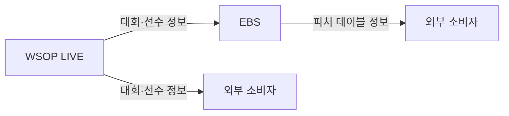
```mermaid
graph LR
    WSOP["WSOP LIVE"] -->|"대회·선수 정보"| EBS["EBS"]
    WSOP -->|"대회·선수 정보"| EXT1["외부 소비자"]
    EBS -->|"피처 테이블 정보"| EXT2["외부 소비자"]
```

| 제공자 | 소비자 | 제공 데이터 |
|--------|--------|-----------|
| **WSOP LIVE** | EBS, 외부 시스템 | 대회정보, 선수정보 |
| **EBS** | 외부 시스템 | 피처 테이블 정보 (카드, 액션, 핸드 데이터) |

---

# Ch.7 — 22개 게임, 3대 계열

WSOP는 매 시즌 **12개 이상의 공식 종목**을 운영한다. EBS는 이 공식 종목을 포함해 총 22가지 포커 변형을 지원한다. 22종 전부를 하나의 엔진으로 처리하기 때문에, 각 계열의 차이를 이해하는 것이 EBS의 복잡도를 이해하는 열쇠다.

## 3대 계열 — 한눈에 비교

22가지 포커 변형은 **3대 계열**로 나뉜다. 각 계열은 카드 배분, 공개 방식, 교환 여부가 모두 다르다.

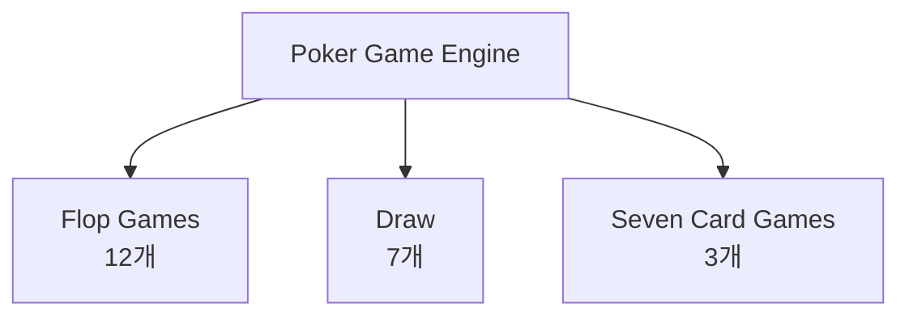
```mermaid
graph TD
    A[Poker Game Engine] --> B["Flop Games<br/>12개"]
    A --> C["Draw<br/>7개"]
    A --> D["Seven Card Games<br/>3개"]
```

| 특성 | Flop Games (12개) | Draw (7개) | Seven Card Games (3개) |
|------|:-:|:-:|:-:|
| **공유 카드** | 있음 (보드 5장) | 없음 | 없음 |
| **카드 교환** | 없음 | 1~3회 | 없음 |
| **카드 공개** | 보드만 공개 | 전부 비공개 | 일부 공개 |
| **대표 게임** | Texas Hold'em | 2-7 Triple Draw | 7-Card Stud |

## 대표 게임 — Texas Hold'em 1판 따라가기

Ch.2에서 배운 것처럼, 비공개 2장 + 공유 5장 = 총 7장 중 최고 5장으로 승부한다. 게임은 아래 4단계로 진행된다:

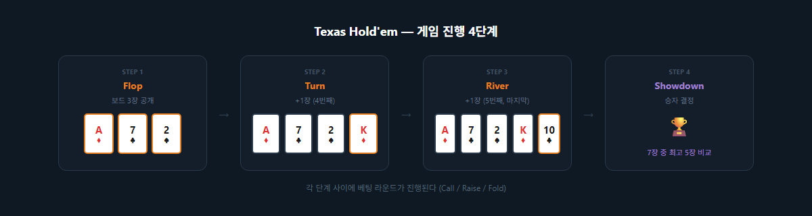

> 각 Step 사이에 **베팅 라운드**가 진행된다 (Call/Raise/Fold 선택). 모든 게임의 상세 규칙은 → [게임별 전용 가이드](./Game_Rules/) 참조

## 베팅 구조 3종

| 구조 | 핵심 한 줄 | 대표 게임 |
|------|----------|----------|
| **No Limit** | 제한 없음 — 가진 토큰 전부 가능 | Texas Hold'em |
| **Pot Limit** | 팟(테이블에 쌓인 돈)만큼만 가능 | Omaha |
| **Fixed Limit** | 정해진 금액만 — "걸까 말까"만 결정 | 7-Card Stud |

> 베팅 시스템 상세 (7가지 Ante 유형, 특수 규칙 4종 포함) → [베팅 시스템 가이드](./Game_Rules/Betting_System.md)

## WSOP 공식 12종목

EBS가 지원하는 22개 게임 중 12개가 WSOP에서 공식 사용된다.

| 종목 | 약칭 | 계열 |
|------|:----:|:----:|
| **No Limit Hold'em** | NLH | Flop |
| **Pot Limit Omaha** | PLO | Flop |
| **Omaha Hi-Lo 8/B** | O8 | Flop |
| **7-Card Stud** | Stud | Seven Card |
| **Limit Hold'em** | LHE | Flop |
| **Razz** | Razz | Seven Card |
| **7-Card Stud Hi-Lo** | Stud8 | Seven Card |
| **2-7 Triple Draw** | TD | Draw |
| **NL 2-7 Single Draw** | NL27 | Draw |
| **PLO Hi-Lo 8/B** | PLO8 | Flop |
| **Big O** | BigO | Flop |
| **Badugi** | — | Draw |

> 22개 전체 목록은 → **부록 A** 참조

## 플레이어 통계

세션 동안 축적된 핸드 데이터로 플레이어별 통계를 계산한다.

| 통계 | 의미 |
|------|------|
| **VPIP** | 자발적 팟 참여 비율 |
| **PFR** | Pre-Flop 레이즈 비율 |
| **AGR** | 공격적 플레이 비율 |
| **WTSD** | 쇼다운까지 간 비율 |
| **WIN%** | 핸드 승률 |

> EBS는 이 통계를 **계산하여 API로 제공**한다. 방송 화면에 이 통계를 그래픽으로 표시하는 것은 프로덕션 후편집 단계에서 처리한다.

---

# Ch.8 — 화면 2개 + Settings: 누가 무엇을 보는가

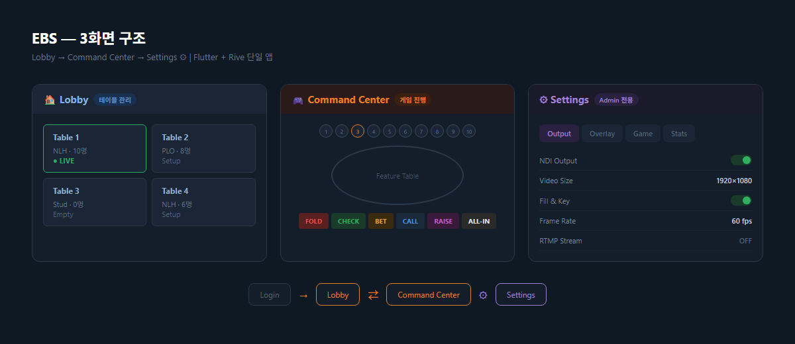

## 화면 구성

EBS는 단일 앱 안에 **2개 주요 화면**과 **Settings 다이얼로그**가 있다. 역할에 따라 접근 가능한 영역이 다르다.

| 화면 | 한 줄 설명 | 사용 시점 |
|------|----------|----------|
| **Lobby** | 모든 테이블 목록 + 게임 설정 + 플레이어 등록 | 방송 준비 + 관제 |
| **Command Center** (CC) | 게임 진행 커맨드 입력 (New Hand → Deal → 베팅 → Showdown) | 본방송 |
| **Settings** ⚙ | 오버레이·출력·게임 규칙·통계 설정 (Admin 전용 다이얼로그) | 방송 준비 |

### Lobby — 테이블 관리

- 모든 테이블이 카드 형태로 나열된다 (Table 1, Table 2...)
- 각 카드에 게임 종류, 인원수, 상태(Live/Setup/Empty)가 표시된다
- 테이블 카드를 선택하고 [Enter]를 누르면 Command Center로 진입한다

### Command Center (CC) — 게임 진행

- 가운데에 **타원형 포커 테이블**이 있고, 10개 좌석이 표시된다
- 하단에 **8개 액션 버튼**: NEW HAND, DEAL, FOLD, CHECK, BET, CALL, RAISE, ALL-IN
- 운영자가 게임 진행 상황에 맞춰 버튼을 누른다
- **운영자 주의력의 85%**가 이 화면에 집중된다

### Settings ⚙ — 설정 다이얼로그 (Admin 전용)

Lobby 또는 CC 어디서든 접근 가능한 설정 다이얼로그. 4개 섹션으로 구성:

| 섹션 | 내용 |
|------|------|
| **Output** | NDI/HDMI 송출 설정, 해상도 |
| **Overlay** | 스킨 선택, 레이아웃, 배치, 해상도 대응 |
| **Game** | 게임 규칙, 베팅 구조, 플레이어 표시 |
| **Statistics** | 통계 표시, Equity, Leaderboard |

### 화면 간 이동

| 전환 | 방법 | 비고 |
|------|------|------|
| Login → Lobby | 로그인 성공 | 이벤트 자동 진입 |
| Lobby → CC | 테이블 카드 [Enter] | 양방향 |
| Lobby / CC → Settings | [Settings ⚙] 버튼 | Admin 전용, 다이얼로그 |

## 테이블 유형

| 유형 | RFID | 카드 인식 | 용도 |
|------|:----:|:---------:|------|
| **Feature Table** (방송 테이블) | 있음 | 자동 | 오버레이 그래픽 출력 |
| **General Table** (일반 테이블) | 없음 | 수동 입력 | 데이터 기록용 |

## 역할 3가지 — RBAC(역할 기반 접근 제어)

**누가 어떤 화면에 접근할 수 있는가?**

| 역할 | Lobby | CC | Settings | 테이블 범위 |
|------|:-----:|:--:|:--------:|:----------:|
| **Admin** (관리자) | 전체 + 설정 | 전체 | 전체 | 모든 테이블 |
| **Operator** (운영자) | 할당 테이블 | 할당 테이블 | 접근 불가 | 1개 |
| **Viewer** (열람자) | 읽기만 | 읽기만 | 접근 불가 | 전체 |

> **Phase 1-2**: Admin 1명이 모든 화면을 조작한다.
> **Phase 3+**: Admin이 Lobby+Settings에서 전체 관제, 각 테이블에 Operator 1명이 CC에서 게임 진행.

---

---

# Part III — 운영과 전략

---

# Ch.9 — 방송 하루: 준비부터 종료까지

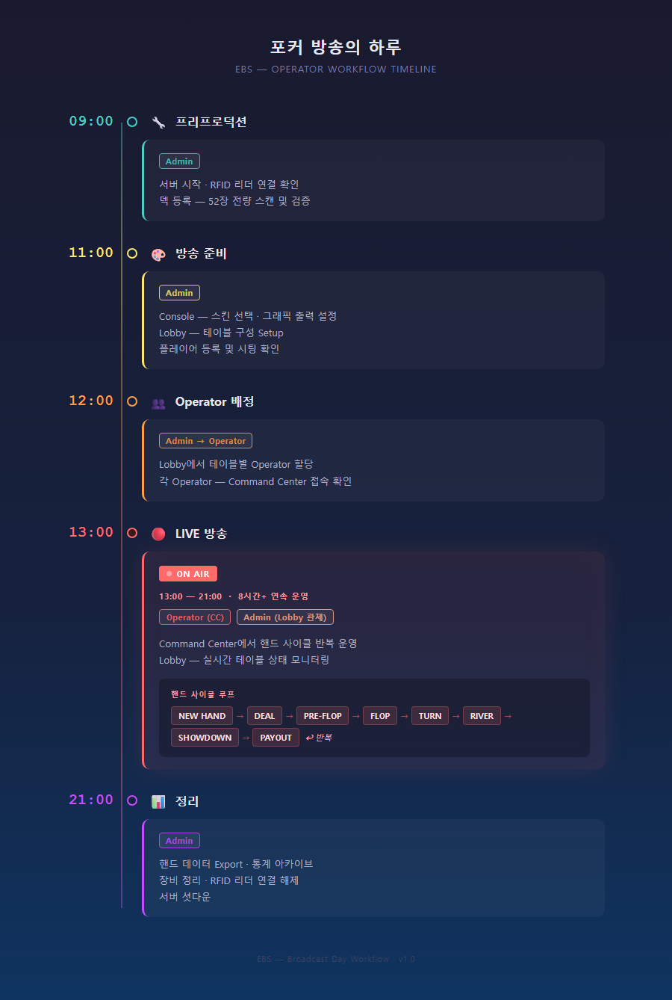

> 방송 현장 사진은 Ch.6 "4단계: 방송 장비로 보낸다" 참조.

## 방송 준비 — 3그룹 체크리스트

**그룹 1: 하드웨어** (Admin)

| 단계 | 확인 항목 |
|:----:|----------|
| 1 | 서버 시작 |
| 2 | RFID 리더 연결 (12대) |
| 3 | RFID 덱 등록 (52장) |
| 4 | 비디오/출력 장치 설정 |
| 5 | 테스트 스캔 |

**그룹 2: 소프트웨어** (Admin, Settings)

| 단계 | 확인 항목 |
|:----:|----------|
| 6 | 스킨/레이아웃 로드 |
| 7 | 출력 설정 (NDI/HDMI) |

**그룹 3: 테이블** (Lobby > Setup)

| 단계 | 확인 항목 |
|:----:|----------|
| 8 | 게임 유형 / 블라인드 선택 |
| 9 | 플레이어 등록 |
| 10 | 좌석 배치 |
| 11 | Operator 테이블 할당 |

## 게임 진행 — 핸드 반복 루프

본방송 중 Command Center에서 핸드를 반복한다.

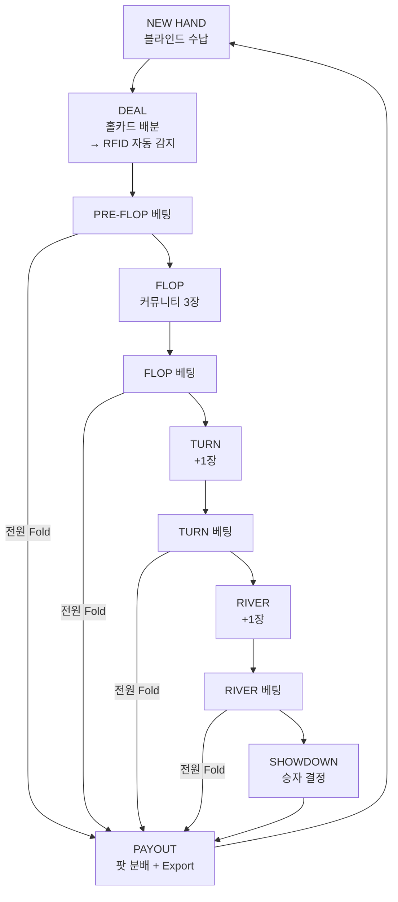
```mermaid
flowchart TD
    NH["NEW HAND<br/>블라인드 수납"] --> DEAL["DEAL<br/>홀카드 배분<br/>→ RFID 자동 감지"]

    DEAL --> PF[PRE-FLOP 베팅]
    PF -->|"전원 Fold"| PAY
    PF --> FLOP["FLOP<br/>커뮤니티 3장"]

    FLOP --> FB[FLOP 베팅]
    FB -->|"전원 Fold"| PAY
    FB --> TURN["TURN<br/>+1장"]

    TURN --> TB[TURN 베팅]
    TB -->|"전원 Fold"| PAY
    TB --> RIVER["RIVER<br/>+1장"]

    RIVER --> RB[RIVER 베팅]
    RB -->|"전원 Fold"| PAY
    RB --> SHOW["SHOWDOWN<br/>승자 결정"]

    SHOW --> PAY["PAYOUT<br/>팟 분배 + Export"]
    PAY --> NH
```

> 핸드 시퀀스 상세 흐름은 Ch.6 "처음부터 끝까지 — 전체 파이프라인" 참조.

### 게임 계열별 진행 차이

| 계열 | 진행 흐름 |
|------|----------|
| **Flop Games** (12개) | Pre-Flop → Flop → Turn → River → Showdown |
| **Draw** (7개) | 1~3회 교환 라운드 → Showdown |
| **Seven Card Games** (3개) | 3rd~7th Street (5 라운드) → Showdown |

### 특수 상황

| 상황 | 처리 |
|------|------|
| 전원 Fold(포기) | 1명만 남으면 즉시 팟 지급 |
| 전원 All-in(전부 걸기) | 남은 카드 자동 공개 → Showdown |
| Bomb Pot | 전원 강제 납부 → Flop 직행 |
| Run It Twice | 보드 2회 전개, 팟 절반 분할 |
| Miss Deal(잘못된 딜) | 핸드 무효, 카드 재분배 |

## 핸드 데이터 저장 + Playback

각 핸드 종료 시 **전체 데이터를 즉시 저장**한다.

| 저장 데이터 | 내용 |
|-----------|------|
| 핸드 메타 | 번호, 시간, 게임 타입, 블라인드 |
| 플레이어 | 이름, 좌석, 시작/최종 스택 |
| 카드 | 홀카드, 보드 |
| 액션 | 스트리트별 모든 액션 + 금액 |
| 결과 | 승자, 팟 분배 |

Playback 도구: 핸드 리플레이, 편집, 렌더링, Export(CSV/JSON), 필터 검색, 공유 링크

## 긴급 상황 복구

| 장애 | 복구 |
|------|------|
| RFID 미인식 | 수동 카드 입력 GUI (52장 그리드) |
| 네트워크 끊김 | 자동 재연결 (30초 이내) |
| 렌더링 오류 | 긴급 중지 → 서버 재시작 |
| 서버 크래시 | 게임 상태 자동 복원 |

---

# Ch.10 — 비전과 미래

> EBS의 정의, 3계층 구조, API 계층은 Ch.6을 참조. 이 장에서는 **왜 만드는가**, **언제까지 만드는가**에 집중한다.

## 2가지 비즈니스 목표

| 목표 | 내용 |
|------|------|
| **A — 방송 퀄리티 향상** | 실시간 오버레이 + AI 분석으로 시청 경험 심화. 모든 플레이를 DB화하여 하이라이트, VOD 등 파생 콘텐츠 자동 생산 |
| **B — 운영 무인화** | 수동 작업을 시스템이 자동 처리. Phase 5에서 AI 4개 영역 무인화 목표 |

> 이 두 목표는 서로 독립적이다. 퀄리티 향상은 자동화의 부산물이 아니다.

## 5-Phase 로드맵

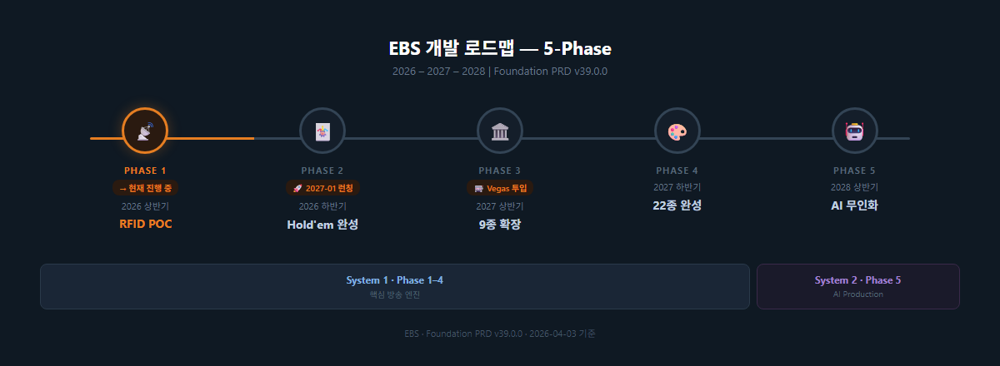

| Phase | 기간 | 핵심 목표 | 달성 기준 | 시스템 |
|:-----:|------|----------|----------|:------:|
| **→ 1** | 2026년 상반기 | RFID POC + 기초 오버레이 | RFID 52장→서버→오버레이 연결 성공 | SYSTEM 1 |
| 2 | 2026년 하반기 | Hold'em 1종 완벽 완성 → **2027-01 런칭** | 홀덤 1종 8시간 연속 방송 가능 | SYSTEM 1 |
| 3 | 2027년 상반기 | 9종 게임 확장 → **2027-06 Vegas** | 9종(HORSE+8-Game) Vegas 현장 운용 | SYSTEM 1 |
| 4 | 2027년 하반기 | 13종 추가 + 스킨 에디터 + Back Office | 22종 완성 + 스킨 에디터 + BO 운영 | SYSTEM 1 |
| 5 | 2028년 상반기 | AI 4개 영역 무인화 | AI 4영역 보조→반자동 검증 완료 | SYSTEM 2 |

> **→** = 현재 진행 중인 Phase.
>
> OTT/VOD 등 외부 스트리밍 플랫폼 연동은 EBS API를 통해 제공되므로 별도 Phase가 아닌 API 소비자 영역이다.

### 2-시스템 구조

| 시스템 | 역할 | Phase |
|--------|------|:-----:|
| **SYSTEM 1** | 핵심 방송 엔진 (Core + 자체 기능 + API) | Phase 1-4 |
| **SYSTEM 2** | AI Production (방송 AI 자동화) | Phase 5 |

### Phase 1 POC 데모 시나리오

| 단계 | 시나리오 | Mock/Real | 검증 대상 |
|:----:|---------|:---------:|----------|
| 1 | 로그인 | Mock(가짜 데이터) | 인증 흐름 |
| 2 | 카드덱 등록 | Real(실제) | RFID 52장 매핑 |
| 3 | 게임 설정 | Mock | 플레이어 등록 |
| 4 | RFID 입력 | Real | 카드 스캔 → 서버 인식 |
| 5 | 오버레이 출력 | Real | 방송 화면에 표시 |

## 왜 직접 만드는가 — Make vs Buy

PokerGFX는 북미 포커 방송의 사실상 표준이다. 그럼에도 EBS를 자체 개발하는 이유:

| 관점 | PokerGFX 도입 | EBS 자체 개발 |
|------|:---:|:---:|
| 라이선스 | 연간 갱신, 기능별 추가 비용 | 자산 영구 소유 |
| 커스터마이징 | 스킨 수준만 변경 가능 | WSOPLIVE 통합, AI 확장 |
| 데이터 | Export가 라이선스 종속 | 전체 데이터 직접 통제 |
| 장기 전략 | 특정 공급사 종속 | 5-Phase 로드맵 자유 실행 |

> **결론**: PokerGFX는 구매 대상이 아니라 **벤치마크/복제 대상**이다. 클린룸 설계(기능 스펙만 참조, 코드는 독립 작성)로 구현한다.

## 기술 스택

| 계층 | 기술 | 비고 |
|------|------|------|
| **RFID 하드웨어** | ST25R3911B + ESP32 | NFC 리더 + MCU |
| **RFID 펌웨어** | Serial UART, ISO 14443-A | 카드 태그 통신 |
| **서버** | Python / FastAPI | 게임 엔진, 데이터 처리 |
| **프론트엔드** | Flutter / Dart | 크로스 플랫폼 앱 (Lobby + CC + Settings) |
| **그래픽 렌더링** | Rive (.riv) | 벡터 애니메이션 기반 오버레이 |
| **출력** | NDI / HDMI (ATEM 스위처) | 방송 송출 |
| **데이터 저장** | JSON Export | 핸드별 구조화 데이터 |

> 기술 설계 상세는 `team2-backend/specs/impl/` 참조.

### Mock HAL 전략 — RFID 없이 전체 기능 사용

EBS는 RFID 하드웨어 없이도 모든 소프트웨어 기능을 검증할 수 있도록 **Mock HAL 전략**을 채택한다.

| 계층 | Real 모드 | Mock 모드 |
|------|----------|----------|
| RFID HAL | ST25R3911B + ESP32 | `MockRfidReader` — 수동 카드 입력 → CardDetected 이벤트 합성 |
| 덱 등록 | 52장 실물 스캔 | "자동 등록" 1클릭 (가상 매핑) |
| 나머지 계층 | 동일 | 동일 |

**핵심 원칙**: Mock에서 바뀌는 것은 **RFID HAL 구현체 1개**뿐이다. CC UI, Game Engine, Overlay, BO는 Real/Mock 구분 없이 100% 동일하게 동작한다. `IRfidReader` Dart 추상 인터페이스를 공유하며 Riverpod DI로 교체한다.

Mock 모드는 Phase 1 POC, 개발, 테스트, 데모에서 **기본 동작 모드**로 사용된다. Real 모드는 하드웨어 통합 후 전환한다.

> 상세: `docs/2. Development/2.2 Backend/APIs/API-03-rfid-hal-interface.md`, `docs/2. Development/2.4 Command Center/RFID_Cards/`

## 성공 지표 (KPI)

| 지표 | Phase 1 | Phase 2 | 측정 방법 |
|------|:-------:|:-------:|----------|
| RFID 인식률 | ≥ 99.5% | ≥ 99.9% | 테스트 세션 |
| 카드→화면 지연 | < 200ms | < 100ms | E2E 측정 |
| PokerGFX 복제율 | — | ≥ 90% | 기능 체크리스트 |
| 연속 운영 | ≥ 4시간 | ≥ 12시간 | 무중단 테스트 |
| 운영 인력 | 현행 유지 | 30→25명 | 실제 운영 |

## 리스크 분석

| # | 리스크 | 영향 | 완화 전략 |
|:-:|--------|:----:|----------|
| R1 | RFID 통합 공급 파트너 미확보 | 높음 | 3개 업체 병행 RFI(정보 요청) |
| R2 | 22종 게임 엔진 복잡도 과소평가 | 높음 | 1종→9종→22종 점진적 확장 |
| R3 | PokerGFX 역설계 IP(지적재산권) 리스크 | 중 | 클린룸 설계 원칙 |
| R4 | RFID 리더+안테나 호환성 | 높음 | Phase 1 POC에서 조기 검증 |
| R5 | 운영 무인화 시 기존 스태프 저항 | 중 | Phase 5까지 단계적 전환 |

---

# 부록

## 부록 A: 22개 게임 전체 카탈로그

### Flop Games 계열 (12개)

| # | 게임명 | 홀카드 | 보드 | 특수 규칙 |
|:-:|--------|:------:|:----:|----------|
| 0 | Texas Hold'em | 2장 | 5장 | 표준 |
| 1 | 6+ Hold'em (Straight > Trips) | 2장 | 5장 | 36장 덱 |
| 2 | 6+ Hold'em (Trips > Straight) | 2장 | 5장 | 36장 덱, Triton 규칙 |
| 3 | Pineapple | 3→2장 | 5장 | Flop 전 1장 버림 |
| 4 | Omaha | 4장 | 5장 | 홀카드 2장 + 보드 3장 필수 |
| 5 | Omaha Hi-Lo | 4장 | 5장 | Hi/Lo 팟 분할 |
| 6 | Five Card Omaha | 5장 | 5장 | — |
| 7 | Five Card Omaha Hi-Lo | 5장 | 5장 | Hi/Lo 분할 |
| 8 | Six Card Omaha | 6장 | 5장 | — |
| 9 | Six Card Omaha Hi-Lo | 6장 | 5장 | Hi/Lo 분할 |
| 10 | Courchevel | 5장 | 5장 | Pre-Flop에 Flop 첫 카드 공개 |
| 11 | Courchevel Hi-Lo | 5장 | 5장 | Hi/Lo + 첫 카드 공개 |

### Draw 계열 (7개)

| # | 게임명 | 카드 | 교환 | 특수 규칙 |
|:-:|--------|:----:|:----:|----------|
| 12 | Five Card Draw | 5장 | 1회 | 기본 Draw |
| 13 | 2-7 Single Draw | 5장 | 1회 | Lowball (A=High) |
| 14 | 2-7 Triple Draw | 5장 | 3회 | Lowball 3회 교환 |
| 15 | A-5 Triple Draw | 5장 | 3회 | A-5 Lowball |
| 16 | Badugi | 4장 | 3회 | 4 suit 다른 조합 |
| 17 | Badeucy | 5장 | 3회 | Badugi + 2-7 혼합 |
| 18 | Badacey | 5장 | 3회 | Badugi + A-5 혼합 |

### Seven Card Games 계열 (3개)

| # | 게임명 | 카드 | 베팅 라운드 | 특수 규칙 |
|:-:|--------|:----:|:----------:|----------|
| 19 | 7-Card Stud | 7장 | 5 | 3장 비공개 + 4장 공개 |
| 20 | 7-Card Stud Hi-Lo | 7장 | 5 | Hi/Lo 분할 |
| 21 | Razz | 7장 | 5 | A-5 Lowball |

## 부록 B: 144개 기능 카탈로그

> 상세 기능 목록은 EBS 기능 카탈로그 참조 (01-strategy/EBS-Feature-Catalog.md).

| 그룹 | 범주 | 총 기능 | Phase 1-2 | Phase 3+ |
|:----:|------|:-------:|:---------:|:--------:|
| 입출력 | Main Window + Sources + Outputs | 32 | 17 | 4 |
| 게임·그래픽 | GFX1~3 + GE Board + GE Player | 80 | 42 | 38 |
| 시스템·에디터 | System + Skin Editor | 32 | 13 | 17 |
| | **합계** | **144** | **72** | **59** |

## 부록 C: 용어 사전

별도 문서: pokergfx-glossary.md (미생성)

9개 섹션, 91개 용어: 포커 기본, 베팅, Ante 유형, 통계, 카드 상태, 시스템, 그래픽 요소, 애니메이션, 핸드 등급

## 부록 D: 참고 자료

| 자료 | 출처 |
|------|------|
| Hole cam 역사 | [Wikipedia](https://en.wikipedia.org/wiki/Hole_cam) |
| 홀카드 카메라 발명 | [casino.org](https://www.casino.org/blog/hole-card-cam/) |
| PokerGFX 공식 | [pokergfx.io](https://www.pokergfx.io/) |
| RFID 포커 테이블 | [habwin.com](https://www.habwin.com/en/post/poker-gfx-what-it-is-and-how-it-can-combat-security-vulnerabilities) |
| WSOP 방송 오버레이 | WSOP Paradise 2025, GGPoker |
| 방송 현장 사진 | pokercaster.com |
| RFID DIY 테이블 | [pokerchipforum.com](https://www.pokerchipforum.com/threads/experimenting-with-a-diy-rfid-table-and-broadcast-overlay.88715/) |

---

## 변경 이력

> 최상단 Edit History 테이블 참조. v34.x 이전 변경 이력은 `C:/claude/ebs-archive-backup/07-archive/PRD-EBS_Foundation-v34.0.0-archive.md` 참조.

---

> **Version**: 41.0.0 | **Updated**: 2026-04-07
