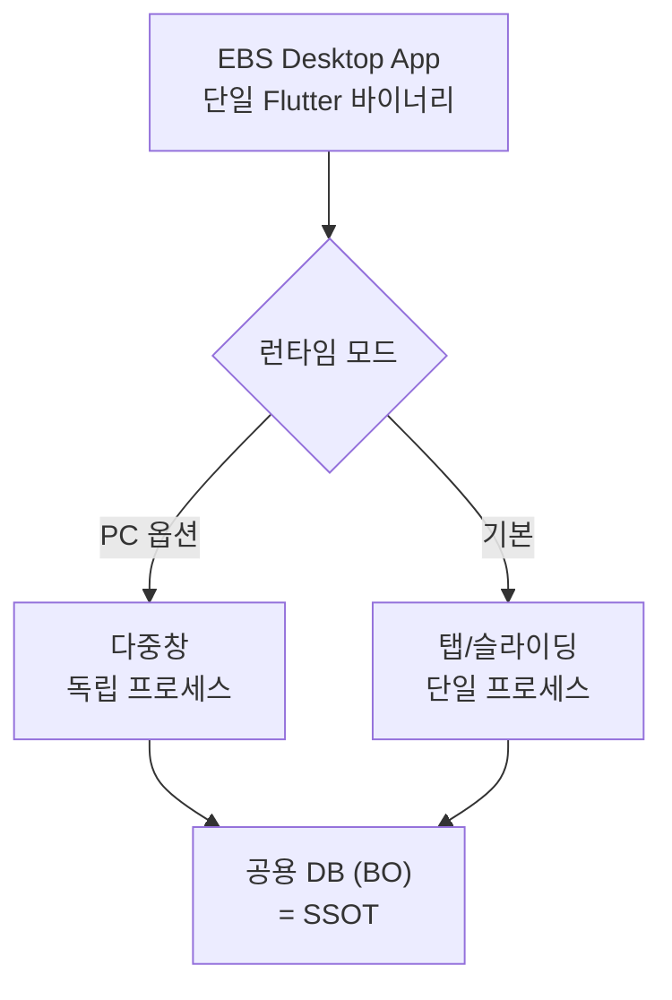
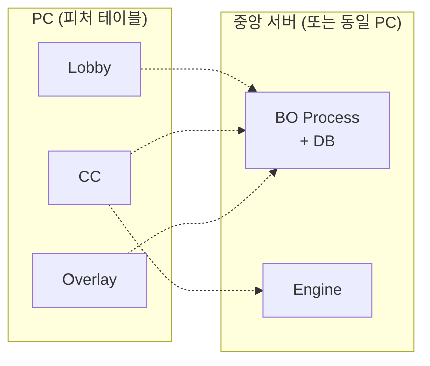
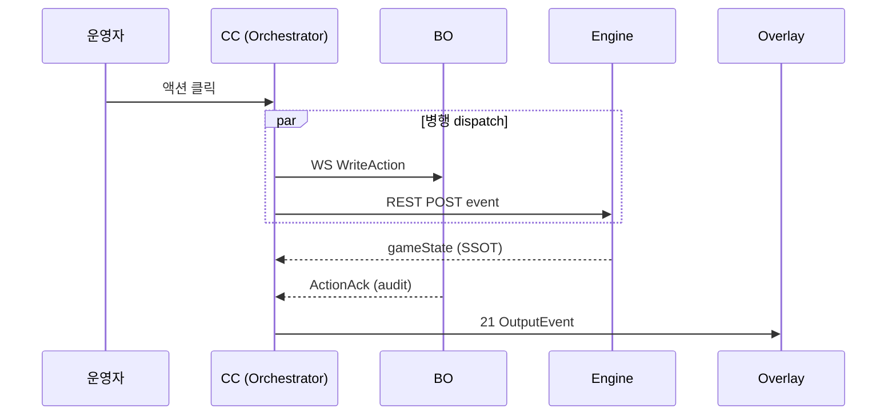
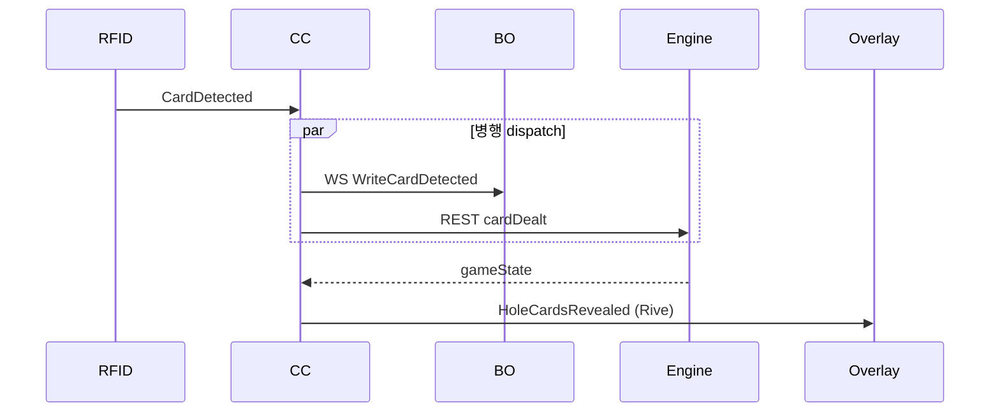
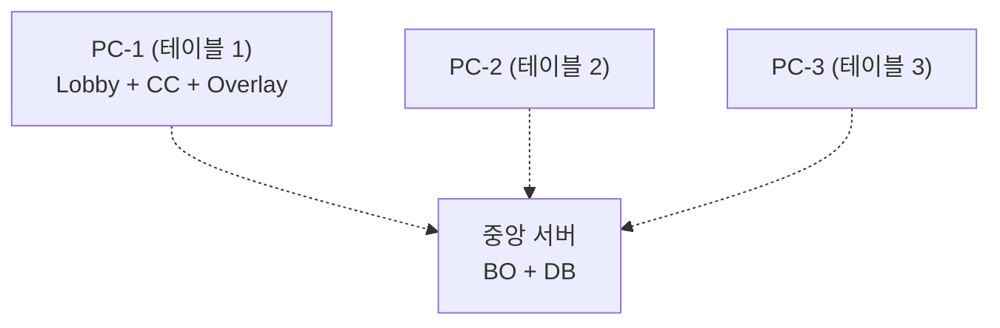

# EBS 기초 기획서

> **EBS** = WSOP LIVE 대회정보 + RFID 카드 + Command Center 액션 → Game Engine → **Overlay Graphics** (100ms 이내 송출)

| 100ms | 22 | 21 | 8 | 12 |
|:---:|:---:|:---:|:---:|:---:|
| **처리 SLA** | **변형 게임** | **OutputEvent** | **실시간 오버레이** | **테이블 안테나** |

---

## 목차

* **Part I — Concept** (왜 존재하는가)
  * Ch.1 숨겨진 패를 보여주는 마법
  * Ch.2 결과물: 시청자가 보는 화면 해부
  * Ch.3 무대 위와 뒤: EBS 가 활약하는 공간
* **Part II — Deliverables** (무엇을 개발하는가)
  * Ch.4 개발 대상 오버뷰: 6 기능 ↔ 4 SW + 1 HW
  * Ch.5 사용자가 만지는 것 (Front-end)
  * Ch.6 눈에 보이지 않는 두뇌와 뼈대 (Back-end)
  * Ch.7 눈에 보이는 출력물과 입력 센서 (Render & Hardware)
* **Part III — Operations & Roadmap** (어떻게 운영하는가)
  * Ch.8 현장의 하루: 준비부터 송출까지
  * Ch.9 비전과 전략

---

# Part I — Concept

## Ch.1 — 숨겨진 패를 보여주는 마법

<a id="ch-1-1"></a>

<!-- FB §1.1 · Information Asymmetry -->
<table role="presentation" width="100%">
<tr>
<td width="50%" valign="middle" align="left">

**§1.1 · Information Asymmetry**

#### 보이지 않는 것을 중계하라

축구 중계에서 점수판을 띄우는 일은 쉽습니다. 점수와 공의 위치는 **공개 정보** 이기 때문입니다.

하지만 포커는 다릅니다. 시청자가 가장 궁금해하는 핵심 정보 — **'플레이어의 카드'가 뒤집혀 있습니다**. 카메라에 찍히지도 않고, 스태프조차 모릅니다.

| 구분 | 축구 중계 | 포커 중계 |
| --- | --- | --- |
| 핵심 정보 | 공개 (점수, 위치) | **비공개** (카드 뒤집힘) |
| 그래픽 역할 | **정리** 하여 표시 | **생성** 하여 표시 |

이 비대칭성을 해결하고 뒤집힌 카드를 화면에 띄우는 것 — **이것이 EBS의 존재 이유**.

</td>
<td width="50%" valign="middle" align="left">


> *FIG · 축구 = 공개 정보 정리, 포커 = 비공개 정보 생성*

</td>
</tr>
</table>

<a id="ch-1-2"></a>

<!-- FB §1.2 · 3 Core Data (FLIP) -->
<table role="presentation" width="100%">
<tr>
<td width="50%" valign="middle" align="left">


> *FIG · 홀카드 + 커뮤니티 카드 7장 → 가장 강한 5장 조합*

</td>
<td width="50%" valign="middle" align="left">

**§1.2 · 3 Core Data (FLIP)**

#### 시청자에게 전달할 3가지 핵심

1. **홀카드** — 플레이어 개인 카드 (뒤집혀 받음). 시청자에게만 몰래 공개
2. **커뮤니티 카드** — 테이블 중앙 공유 카드 (5장)
3. **베팅 액션** — 콜 / 레이즈 / 폴드 매 라운드 추적

3 데이터 모두 **실시간 추적** 필수.

</td>
</tr>
</table>

<a id="ch-1-3"></a>

<!-- FB §1.3 · RFID 2nd Gen -->
<table role="presentation" width="100%">
<tr>
<td width="50%" valign="middle" align="left">

**§1.3 · RFID 2nd Generation**

#### 유리판에서 전자 인식으로

**1세대 (1999~)**: 테이블에 유리판 + 카메라. 플레이어가 카드를 정확히 올려놔야 인식.

**2세대 (현재)**: 52장 카드마다 RFID 태그 내장. 테이블 아래 12 안테나가 카드 놓이는 즉시 자동 감지 — 플레이어 추가 동작 불필요.

> **EBS 미션 선언**: 0.1초 이내 물리 상황 → 방송 그래픽 번역 + 송출.

</td>
<td width="50%" valign="middle" align="left">


> *FIG · 유리판 카메라 → RFID 자동 감지로 진화*

</td>
</tr>
</table>

---

## Ch.2 — 결과물: 시청자가 보는 화면 해부

<a id="ch-2-1"></a>

<!-- FB §2.1 · 8 Overlays -->
<table role="presentation" width="100%">
<tr>
<td width="50%" valign="middle" align="left">

**§2.1 · 8 Overlay Components**

#### EBS 가 그리는 8 영역

1. **홀카드 표시** (RFID 자동)
2. **커뮤니티 카드** (RFID 자동)
3. **액션 배지** (Operator 입력)
4. **팟 카운터** (자동 누적)
5. **승률 바** (Engine 계산)
6. **아웃츠** (Engine 계산)
7. **플레이어 정보** (외부 API)
8. **딜러 버튼 위치**

</td>
<td width="50%" valign="middle" align="left">


> *FIG · 카메라 영상 위 8 그래픽 합성*

</td>
</tr>
</table>

<a id="ch-2-2"></a>

<!-- FB §2.2 · Out of Scope (FLIP) -->
<table role="presentation" width="100%">
<tr>
<td width="50%" valign="middle" align="left">


> *FIG · 리더보드 / 프로필 카드 = 서울 후편집 (1~2시간 후)*

</td>
<td width="50%" valign="middle" align="left">

**§2.2 · 우리가 만들지 않는 것 (FLIP)**

#### 명확한 선 긋기

화면의 화려한 그래픽 중 **EBS 가 안 만드는 것**:

* **후편집 그래픽** (리더보드, 통계 차트) — 서울 편집 스튜디오 수동 제작
* **사전 제작 프레임워크** (로고, 자막 틀) — 디자인 팀 사전 제작

EBS 는 데이터 원문 (JSON) 만 후편집팀에 제공.

</td>
</tr>
</table>

<a id="ch-2-3"></a>

<!-- FB §2.3 · 3 Conditions -->
<table role="presentation" width="100%">
<tr>
<td width="50%" valign="middle" align="left">

**§2.3 · 3 Absolute Conditions**

#### EBS 책임 영역 판정 룰

3 조건 **모두** 만족 → EBS 개발 대상:

| 조건 | 의미 |
| --- | --- |
| **시간** | 1초 지연도 없는 실시간? |
| **장소** | 네트워크 안 거치고 현장? |
| **데이터** | 센서 / 조작반 입력? |

8 오버레이만 충족.

</td>
<td width="50%" valign="middle" align="left">


> *FIG · 8 오버레이 = 3 조건 모두 만족*

</td>
</tr>
</table>

---

## Ch.3 — 무대 위와 뒤: EBS 가 활약하는 공간

<a id="ch-3-1"></a>

<!-- FB §3.1 · 4-Stage Pipeline -->
<table role="presentation" width="100%">
<tr>
<td width="50%" valign="middle" align="left">

**§3.1 · 4-Stage Pipeline**

#### 라스베가스 → 유튜브 시청자

| 구간 | 위치 | 역할 |
| --- | --- | --- |
| **A. 현장 송출** | 라스베가스 / 유럽 | 카메라 + 합성 (**EBS 영역**) |
| **B. 클라우드 전송** | — | 무선 → 분배 |
| **C. 후편집** | 서울 스튜디오 | 1시간 단위 편집 + 후편집 그래픽 |
| **최종** | YouTube / WSOP TV | 무료 / 유료 송출 |

EBS 는 **A 구간** 에만 설치 + 운영.

</td>
<td width="50%" valign="middle" align="left">


> *FIG · 4 단계 릴레이 — EBS 는 A 구간 전담*

</td>
</tr>
</table>

<a id="ch-3-2"></a>

<!-- FB §3.2 · On-site Production (FLIP) -->
<table role="presentation" width="100%">
<tr>
<td width="50%" valign="middle" align="left">


> *FIG · 카메라 → 영상전환기 → EBS 합성 → 송출 장비*

</td>
<td width="50%" valign="middle" align="left">

**§3.2 · 현장 프로덕션 (FLIP)**

#### 카메라에서 송출기까지

물리적 장비 사슬:

1. 카메라 → 테이블 촬영
2. 영상 전환기 → 앵글 선택
3. **EBS 합성 → 카메라 원본 + 투명 배경 그래픽 덮어씌움**
4. 송출 장비 → 클라우드 송출

</td>
</tr>
</table>

<a id="ch-3-3"></a>

<!-- FB §3.3 · 1 Hour Time Travel -->
<table role="presentation" width="100%">
<tr>
<td width="50%" valign="middle" align="left">

**§3.3 · 1-Hour Time Travel**

#### 0.1초 vs 1~2시간

| 구간 | 지연 |
| :---: | :---: |
| EBS 합성 (현장) | **< 0.1초** |
| 시청자가 보는 시점 | **1~2시간 후** |

지연의 원인 = **C 구간 후편집** (서울 스튜디오 수동 그래픽 추가).

EBS 는 극강의 실시간 시스템이지만, 방송 생태계 특성상 자연스러운 시간차 발생.

</td>
<td width="50%" valign="middle" align="left">


> *FIG · 0.1초 합성 + 1~2시간 후편집 = 시청자 도달*

</td>
</tr>
</table>

---

# Part II — Deliverables

## Ch.4 — 개발 대상 오버뷰: 6 기능 ↔ 4 SW + 1 HW

<a id="ch-4-1"></a>

<!-- FB §4.1 · 3 Groups -->
<table role="presentation" width="100%">
<tr>
<td width="50%" valign="middle" align="left">

**§4.1 · 3 Functional Groups**

#### 6 기능 = 3 그룹

* **조작부** (Front-end)
  * Lobby (관제탑)
  * Command Center (조종석)
* **두뇌부** (Back-end)
  * Game Engine (22 게임 규칙 + 승률)
  * Backend Server (BO, 데이터 동기화)
* **출력부 / 입력부**
  * Overlay View (Rive 렌더 + SDI/NDI)
  * RFID Hardware (12 안테나)

</td>
<td width="50%" valign="middle" align="left">


> *FIG · 조작 + 두뇌 + 출력 = 6 기능 구성요소*

</td>
</tr>
</table>

<a id="ch-4-2"></a>

<!-- FB §4.2 · 2-Lens Mapping (FLIP) -->
<table role="presentation" width="100%">
<tr>
<td width="50%" valign="middle" align="left">


> *FIG · 기능 ≠ 설치 단위 (γ 하이브리드 2026-04-22)*

</td>
<td width="50%" valign="middle" align="left">

**§4.2 · 2 Lenses: Function ↔ Install (FLIP)**

#### 6 기능 → 4 SW + 1 HW

| 설치 단위 | 포함 기능 | 스택 | 배포 |
| --- | --- | --- | --- |
| **Lobby Web** | Lobby + Settings + Rive Manager | Flutter Web + Rive | Docker nginx |
| **Desktop App** (CC) | Command Center + Overlay | Flutter Desktop + Rive | Desktop 설치 |
| **Game Engine** | Engine | Pure Dart | Docker / `dart run` |
| **Backend (BO)** | BO Server | FastAPI + DB | 별도 서비스 |
| **RFID Hardware** | 카드 인식 | ST25R3911B + ESP32 | 물리 장비 |

**팀 ≠ 설치 단위**: team1 (Lobby), team2 (BO), team3 (Engine), team4 (CC + Overlay).

</td>
</tr>
</table>

---

## Ch.5 — 사용자가 만지는 것 (Front-end)

<a id="ch-5-1"></a>

<!-- FB §5.1 · Lobby -->
<table role="presentation" width="100%">
<tr>
<td width="50%" valign="middle" align="left">

**§5.1 · Lobby (관제탑)**

#### 모든 테이블을 내려다보는 화면

* **구조**: Series → Event → Table 3단계
* **역할**: 전체 테이블 카드 모니터링 + 선수 명단 관리
* **실행**: 테이블 카드 클릭 → 해당 테이블 CC 열림
* **배포**: Flutter **Web** (Docker nginx, LAN 다중 클라이언트)
* **비율**: Lobby : CC = **1 : N** (시스템당 Lobby 하나, 테이블당 CC 하나)

</td>
<td width="50%" valign="middle" align="left">


> *FIG · Series/Event/Table 3단계 + 카드 그리드*

</td>
</tr>
</table>

<a id="ch-5-2"></a>

<!-- FB §5.2 · Settings (FLIP) -->
<table role="presentation" width="100%">
<tr>
<td width="50%" valign="middle" align="left">


> *FIG · 출력 / 그래픽 / 디스플레이 / 규칙 / 통계 / 환경 설정*

</td>
<td width="50%" valign="middle" align="left">

**§5.2 · Settings (FLIP)**

#### 글로벌 제어판 (Lobby 내)

| 영역 | 통제 |
| --- | --- |
| **출력** | 송출 해상도 + 방식 |
| **그래픽** | 요소 배치 + 활성 스킨 (Rive Manager 연동) |
| **디스플레이** | 통화 / 소수점 |
| **규칙** | 게임 종류 + 칩 배분 |
| **통계** | 리더보드 표시 여부 |
| **환경** | 진단 + 데이터 내보내기 |

</td>
</tr>
</table>

<a id="ch-5-3"></a>

<!-- FB §5.3 · Rive Manager -->
<table role="presentation" width="100%">
<tr>
<td width="50%" valign="middle" align="left">

**§5.3 · Rive Manager (스킨 허브)**

#### `.riv` 파일 업로드 → 활성화

**아트 디자이너의 외부 Rive Editor 작업물** 을 EBS 로 가져오는 단일 경로. Lobby Web 내부 섹션 (별도 앱 아님), Admin 권한 전용.

| 역할 | 내용 |
| --- | --- |
| **Import** | `.riv` / `.gfskin` 업로드 + 자동 검증 |
| **Validate** | 필수 데이터 슬롯 (선수 / 카드 트리거) 확인 |
| **Preview** | Rive 런타임 즉시 렌더 (Overlay 와 동일 바이너리) |
| **Activate** | 시스템 활성 스킨 전환 (멀티 CC 동시 반영) |

> **D3 회의 (2026-04-22)**: 사내 Graphic Editor 폐기. 메타데이터는 Rive 파일 내장.

</td>
<td width="50%" valign="middle" align="left">


> *FIG · Import → Validate → Preview → Activate*

</td>
</tr>
</table>

<a id="ch-5-4"></a>

<!-- FB §5.4 · Command Center (FLIP) -->
<table role="presentation" width="100%">
<tr>
<td width="50%" valign="middle" align="left">


> *FIG · 운영자 시선 85% 머무는 화면 (테이블당 1 인스턴스)*

</td>
<td width="50%" valign="middle" align="left">

**§5.4 · Command Center (FLIP)**

#### 실시간 조종석

본방송 중 운영자 시선의 85% 가 머무는 화면. 테이블 1개당 1 인스턴스 독립 실행.

* **시각**: 타원 포커 테이블 + 10 좌석
* **버튼**: 핸드 시작 / 카드 배분 / 콜 / 레이즈 / 폴드 등 8 액션
* **역할**: 센서가 못 잡는 베팅 의사 → 시스템 주입

**배포**: Flutter **Desktop** (RFID 시리얼 + SDI/NDI 직결 필수).

</td>
</tr>
</table>

<a id="ch-5-5"></a>

<!-- FB §5.5 · Runtime Modes + RBAC -->
<table role="presentation" width="100%">
<tr>
<td width="50%" valign="middle" align="left">

**§5.5 · Runtime Modes + RBAC**

#### 2 런타임 모드 (Desktop 내부 옵션)

| 모드 | 용도 |
| --- | --- |
| **탭/슬라이딩** | 단일 운영자, 향후 태블릿 |
| **다중창** | 멀티 모니터, 운영자 분리 |

#### 3 역할 RBAC

| 역할 | 권한 |
| --- | --- |
| **Admin** | 전체 |
| **Operator** | 할당 테이블 CC 만 |
| **Viewer** | 읽기 전용 |

</td>
<td width="50%" valign="middle" align="left">



> *FIG · 단일 바이너리, 두 모드 (Lobby Settings 에서 선택)*

</td>
</tr>
</table>

---

## Ch.6 — 눈에 보이지 않는 두뇌와 뼈대 (Back-end)

<a id="ch-6-1"></a>

<!-- FB §6.1 · Game Engine -->
<table role="presentation" width="100%">
<tr>
<td width="50%" valign="middle" align="left">

**§6.1 · Game Engine (두뇌)**

#### 22 게임 + 21 OutputEvent

* 텍사스 홀덤 외 **22 변형 게임** 통합
* 카드 인식 / 액션 입력 즉시 **승률 계산**

**3 계열 분류**:

| 계열 | 종 |
| :---: | :---: |
| 공유 카드 | **12** |
| 카드 교환 | **7** |
| 부분 공개 | **3** |

**21 OutputEvent** (이벤트 신호 카탈로그) — 판돈 변동 / 승률 업데이트 / 승자 결정 등 → 적절한 Rive 애니메이션 트리거.

</td>
<td width="50%" valign="middle" align="left">


> *FIG · 입력 (카드+액션) → Engine → 21 OutputEvent → Overlay*

</td>
</tr>
</table>

<a id="ch-6-2"></a>

<!-- FB §6.2 · Backend (FLIP) -->
<table role="presentation" width="100%">
<tr>
<td width="50%" valign="middle" align="left">



> *FIG · 다중창 모드 — 독립 OS 프로세스 + BO 경유 통신*

</td>
<td width="50%" valign="middle" align="left">

**§6.2 · Backend (BO) — 뼈대 (FLIP)**

#### 3 핵심 임무

1. **외부 동기화** — 대회 공식 시스템 ↔ 내부 DB
2. **권한 검증** — Admin / Operator / Viewer
3. **데이터 보관소** — 게임당 카드 / 액션 / 판돈 → 후편집 재료

**스택**: FastAPI + SQLite/PostgreSQL.

**프로세스 모델** — 다중창 모드 시 Lobby/CC/Overlay 독립 OS 프로세스, BO 경유 통신 (직접 IPC 금지).

</td>
</tr>
</table>

<a id="ch-6-3"></a>

<!-- FB §6.3 · Communication Matrix -->
<table role="presentation" width="100%">
<tr>
<td width="50%" valign="middle" align="left">

**§6.3 · Communication Matrix**

#### From → To 통신 경로

| From → To | 방식 | 용도 |
| --- | --- | --- |
| Lobby → BO | REST | 동기 CRUD (API-01) |
| Lobby ← BO | WS `ws/lobby` | 모니터 전용 (API-05) |
| CC ↔ BO | WS `ws/cc` | 양방향 명령 + 이벤트 |
| CC → Engine | REST | stateless query (SG-002) |
| Lobby ↔ CC | — | **직접 연결 금지** (BO DB 경유) |

**Engine 배포**: 별도 프로세스 (Docker 또는 `dart run`). In-process import 비채택.

**ENGINE_URL**: `--dart-define=ENGINE_URL=http://host:port` (기본 `:8080`).

</td>
<td width="50%" valign="middle" align="left">



> *FIG · 시나리오 A — 운영자 액션, CC = Orchestrator 병행 dispatch*

</td>
</tr>
</table>

<a id="ch-6-4"></a>

<!-- FB §6.4 · Real-time Sync (FLIP) -->
<table role="presentation" width="100%">
<tr>
<td width="50%" valign="middle" align="left">



> *FIG · 시나리오 B — RFID 자동 입력*

</td>
<td width="50%" valign="middle" align="left">

**§6.4 · Real-time Sync (FLIP)**

#### DB SSOT + 2 채널

| 채널 | 용도 | 지연 |
| --- | --- | :---: |
| DB polling | 복구 baseline | 1-5초 |
| WS push (`/ws/lobby`, `/ws/cc`) | 실시간 알림 | **< 100ms** |

**전체 SLA**: RFID → Engine → WS → Rive → SDI/NDI **100ms 이내**.

**정책**:

* **쓰기**: BO commit → WS broadcast
* **읽기**: 시작 시 DB snapshot, 이후 WS delta
* **Crash 복구**: DB snapshot 재로드
* **SSOT**: Engine 응답 = 게임 상태 (BO ack = audit 참고값)

</td>
</tr>
</table>

---

## Ch.7 — 눈에 보이는 출력물과 입력 센서

<a id="ch-7-1"></a>

<!-- FB §7.1 · Overlay View -->
<table role="presentation" width="100%">
<tr>
<td width="50%" valign="middle" align="left">

**§7.1 · Overlay View (그래픽 출력)**

#### Rive 애니메이션 → 방송 송출

* **스킨 공급**: Rive Manager (§5.3) 활성화 `.riv` 파일 그대로 소비
* **배경 config flag**:
  * (a) **완전 투명** — 스위처 합성 (방송 송출 default)
  * (b) **단색 배경** — QA / 스크린샷 (외부 디자인 확인)
* **보안 지연**: 0~120초 송출 지연 (방송 사고 방지)
* **방송 송출**: SDI (10ms 지연, 전용선) 또는 NDI (네트워크)

</td>
<td width="50%" valign="middle" align="left">


> *FIG · Engine → Overlay (Rive) → SDI/NDI → 스위처*

</td>
</tr>
</table>

<a id="ch-7-2"></a>

<!-- FB §7.2 · RFID Hardware (FLIP) -->
<table role="presentation" width="100%">
<tr>
<td width="50%" valign="middle" align="left">

```
+----------------------------------+
|  Table Cloth                     |
| +------+ +------+ +------+       |
| | A1   | | A2   | | A3   | ...   |
| +------+ +------+ +------+       |
|     12 안테나 (좌석 + 보드)        |
+--------------+-------------------+
               |
               v
       +-------+--------+
       | ST25R3911B IC  |
       +-------+--------+
               |
               v
            ESP32
               |
               v USB
            [PC]
```

> *FIG · RFID 하드웨어 구조 (12 안테나 → ESP32 → USB)*

</td>
<td width="50%" valign="middle" align="left">

**§7.2 · RFID Hardware (FLIP)**

#### 물리적 세계와의 접점

* **하드웨어**: 테이블 천 아래 12 안테나 (좌석 + 보드 중앙)
* **칩셋**: ST25R3911B + ESP32
* **통신**: USB → PC

**Mock HAL 모드**: 실제 하드웨어 없이도 화면 버튼으로 카드 신호 emulate 가능 → 개발 / 시연 효율.

</td>
</tr>
</table>

---

# Part III — Operations & Roadmap

## Ch.8 — 현장의 하루: 준비부터 송출까지

<a id="ch-8-1"></a>

<!-- FB §8.1 · 3 Pre-flight Checks -->
<table role="presentation" width="100%">
<tr>
<td width="50%" valign="middle" align="left">

**§8.1 · 3 Pre-flight Checks**

#### 방송 시작 전 점검표

1. **물리 장비** — 서버 전원 + 안테나 연결 + 52 카드 등록 스캔
2. **소프트웨어** — 스킨 로드 + 송출 방식 설정
3. **테이블 세팅** — Lobby 에서 게임 종류 + 블라인드 + 선수 명단 + 운영자 할당

</td>
<td width="50%" valign="middle" align="left">


> *FIG · 3 영역 순차 점검 — 물리 → SW → 테이블*

</td>
</tr>
</table>

<a id="ch-8-2"></a>

<!-- FB §8.2 · Live Loop (FLIP) -->
<table role="presentation" width="100%">
<tr>
<td width="50%" valign="middle" align="left">


> *FIG · 시작 → 배분 → 베팅 (플롭/턴/리버 × 3) → 승부*

</td>
<td width="50%" valign="middle" align="left">

**§8.2 · Live Broadcast Loop (FLIP)**

#### 매 게임 반복

* **시작**: 의무 베팅 (Blind/Ante) → 카드 배분 → RFID 자동 인식
* **베팅**: 운영자 입력 (콜/레이즈/폴드) → 공유 카드 3 단계 (플롭/턴/리버) 공개
* **승부**: 마지막 카드 → Engine 판정 → 판돈 분배

**특수 상황 자동화**: All-in / 한 명 빼고 폴드 → 시스템이 남은 과정 자동 진행.

</td>
</tr>
</table>

<a id="ch-8-3"></a>

<!-- FB §8.3 · Emergency Recovery -->
<table role="presentation" width="100%">
<tr>
<td width="50%" valign="middle" align="left">

**§8.3 · Emergency Recovery**

#### 생방송 위기 대응

| 시나리오 | 대응 |
| --- | --- |
| **센서 고장** | 운영자가 가상 카드 52장 직접 클릭 강제 입력 |
| **네트워크 단절** | 30초 이내 자동 복구 |
| **서버 크래시** | 직전 상태 + 판돈 자가 복원, 방송 중단 없음 |

수십만 명 시청 중에도 무너지지 않도록 다층 방어.

</td>
<td width="50%" valign="middle" align="left">


> *FIG · 센서 / 네트워크 / 서버 3 장애 시나리오 + 자동 복구*

</td>
</tr>
</table>

<a id="ch-8-4"></a>

<!-- FB §8.4 · Multi-table (1 PC = 1 Feature Table) (FLIP) -->
<table role="presentation" width="100%">
<tr>
<td width="50%" valign="middle" align="left">



> *FIG · 1 PC = 1 피처 테이블, 중앙 BO/DB 집중형*

</td>
<td width="50%" valign="middle" align="left">

**§8.4 · 복수 테이블 운영 (FLIP)**

#### 1 PC = 1 Feature Table

하드웨어 제약 (캡처 카드 / SDI 채널 / RFID USB) → 한 PC = 한 피처 테이블만 통제.

| 운영 | PC | 중앙 서버 |
| --- | :---: | --- |
| 단일 테이블 | 1대 | 동일 PC OR 별도 |
| **2+ 테이블** | N대 | **별도 BO+DB 1대 필수** |

**원칙**:

* 테이블 ↔ PC 1:1 고정 (방송 중 이동 불가)
* 세션 격리 (PC 장애 = 해당 테이블만)
* 중앙 서버 SPOF — Network Deployment 운영 문서 참조

</td>
</tr>
</table>

---

## Ch.9 — 비전과 전략

<a id="ch-9-1"></a>

<!-- FB §9.1 · Buy vs Build -->
<table role="presentation" width="100%">
<tr>
<td width="50%" valign="middle" align="left">

**§9.1 · 자체 개발 vs 상용 솔루션**

#### 왜 PokerGFX 안 사고 EBS 만드나

| 차원 | 상용 (PokerGFX) | EBS 자체 개발 |
| --- | --- | --- |
| **비용** | 매년 라이선스 | 영구 자산 |
| **확장성** | 스킨만 교체 | 무제한 (AI / API 연동) |
| **데이터 통제** | 외부 의존 | 100% 통제 |

상용 = **벤치마크**, 코드는 백지 상태에서 독립 설계.

</td>
<td width="50%" valign="middle" align="left">


> *FIG · EBS = 비용 자산 / 확장성 / 데이터 통제 3축 우위*

</td>
</tr>
</table>

<a id="ch-9-2"></a>

<!-- FB §9.2 · 5-Stage Roadmap -->
<table role="presentation" width="100%">
<tr>
<td width="50%" valign="middle" align="left">

**§9.2 · 5-Stage Roadmap**

#### 점진 진화

</td>
<td width="50%" valign="middle" align="left">

(상세 timeline: `4. Operations/Phase_Plan_2027.md`)

</td>
</tr>
</table>

<a id="ch-9-2-roadmap"></a>

<!-- FB §9.2 · 5-Stage Roadmap (P3 MATRIX) -->
<table role="presentation" width="100%">
<tr>
<td width="100%" valign="middle" align="left">

**§9.2 · 5단계 로드맵 (시간축)**

| 단계 | 내용 |
|:----:|------|
| **1단계** | 기초 공사 — 52 카드 → 센서 → 서버 → 방송 화면 뼈대 검증 |
| **2단계** | 홀덤 단일 종목 8시간 연속 방송 안정성 |
| **3단계** | 9 종 게임 + 라스베가스 생방송 실전 투입 |
| **4단계** | 22 종 통합 + Lobby Web 내 Rive 파일 관리 + BO 완성 |
| **5단계** | AI 무인화 — 사람 개입 없이 자율 진행 |

5 단계는 점진적 진화 — 각 단계가 다음 단계의 baseline.

</td>
</tr>
</table>

> *§9.2 → §9.3 — 이 5 단계의 종착점이 §9.3 의 2 ultimate goals 다.*

<a id="ch-9-3"></a>

<!-- FB §9.3 · 2 Goals (FLIP) -->
<table role="presentation" width="100%">
<tr>
<td width="50%" valign="middle" align="left">


> *FIG · 압도적 품질 + 운영 무인화*

</td>
<td width="50%" valign="middle" align="left">

**§9.3 · 2 Ultimate Goals (FLIP)**

#### 두 최종 목적지

1. **압도적 방송 품질** — 실시간 그래픽 + 분석 데이터로 시청자 몰입 극대화 + 하이라이트 자동 생성
2. **운영 완전 무인화** — AI 가 수동 입력 작업 대체 → 인건비 + 휴먼 에러 절감

EBS 가 향하는 두 축.

</td>
</tr>
</table>

---

## Changelog

| 날짜 | 변경 | Type |
| --- | --- | :---: |
| 2026-05-04 | **v3.0 — Feature Block 변환** (rule 18 § 패턴 A, GGPoker 스타일). 35 FB, 시각:텍스트 비율 ~30% → ~70%, 의미 보존 100%, 700줄 → ~640줄. 백업 = `archive/Foundation_pre_FB_2026-05-04.md`. | FORMAT |
| 2026-04-27 | SG-022 — §5.0 단일 Desktop 바이너리 scope 명확화 + §6.4 전체 파이프라인 SLA 부연 | PRODUCT |
| 2026-04-22 | Rive Manager 독립 섹션 신설 (§5.3) — D3 회의 결정 SSOT 반영 | PRODUCT |
| 2026-04-22 | γ 하이브리드 확정 — 4 SW 설치 단위 (Lobby Web 분리) | PRODUCT |
| 2026-04-22 | Ch.4 2 렌즈 (기능/설치) + §4.4 신설 | PRODUCT |
| 2026-04-22 | §5.0 2 런타임 모드 / §6.3 프로세스 모델 / §6.4 동기화 / §7.1 배경 config / §8.5 복수 테이블 신설 | PRODUCT |
| 2026-04-26 | §5.6 폼팩터 적응 신설 | PRODUCT |
| 2026-04-21 | SG-005 §6.3 통신 매트릭스 | PRODUCT |
| 2026-04-20 | SG-001 Lobby/GE 기술 스택 SSOT 통일 | TECH |
| 2026-04-16 | 초판 (이전 이력은 commit log) | - |
