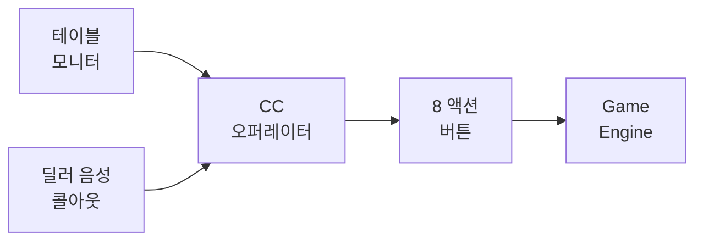
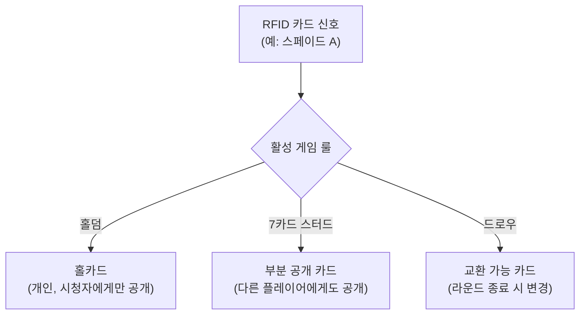
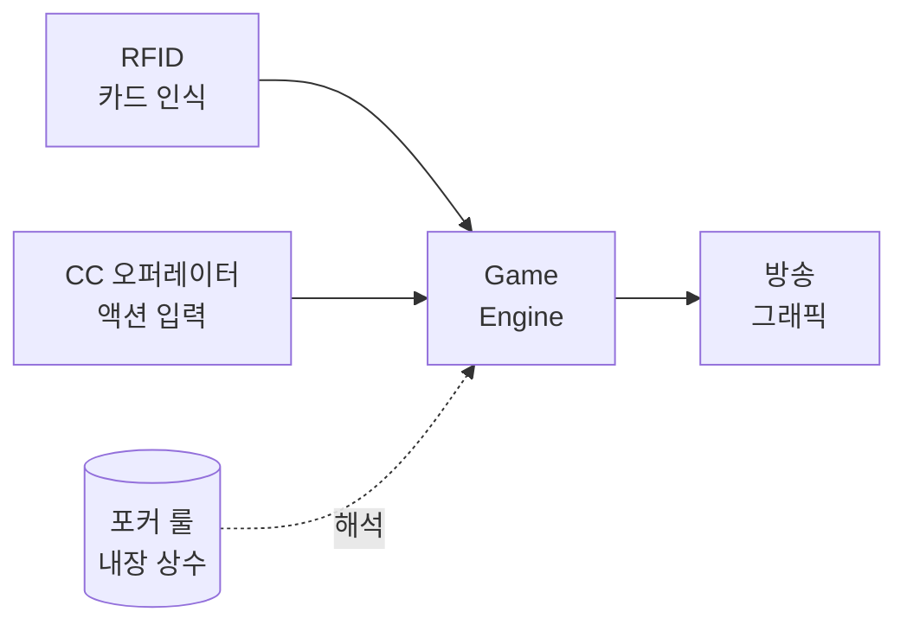
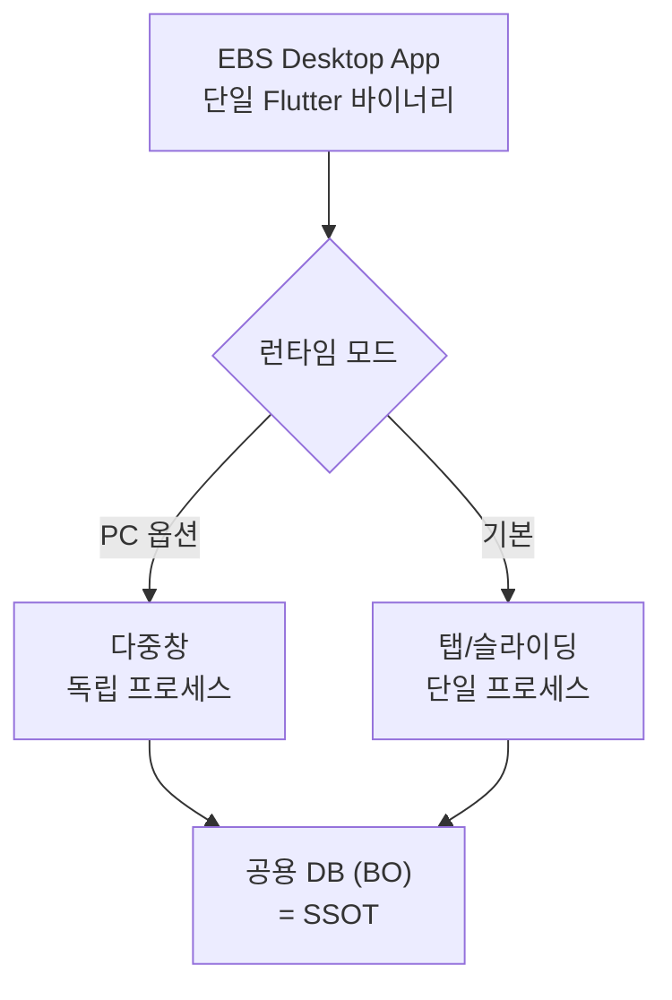
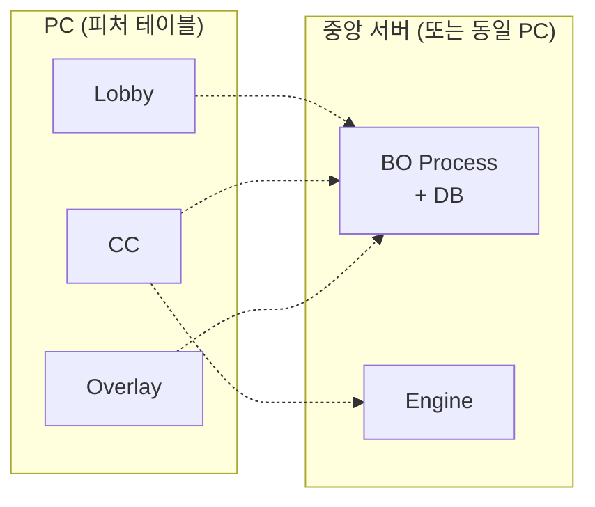
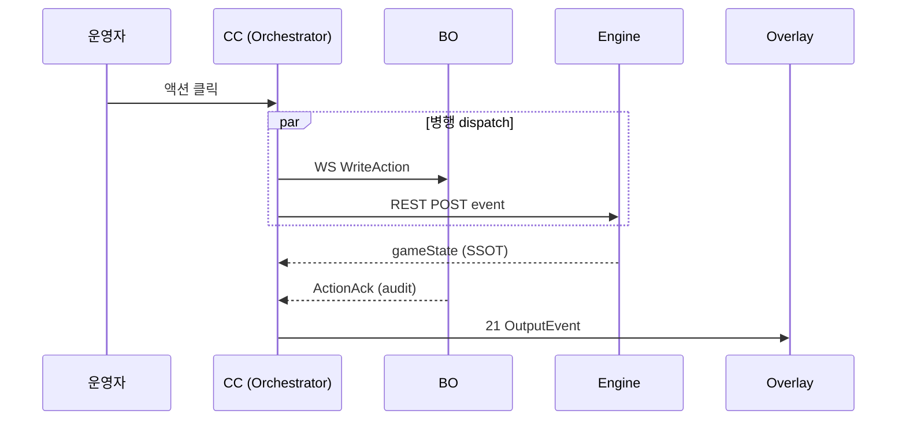
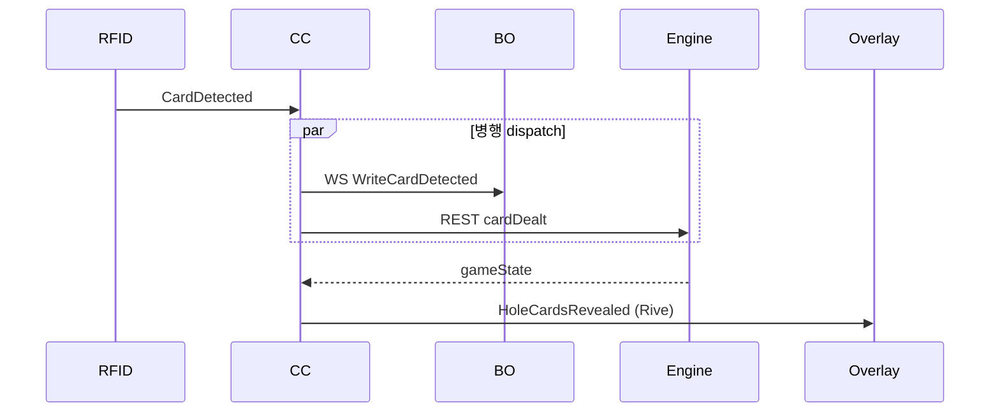
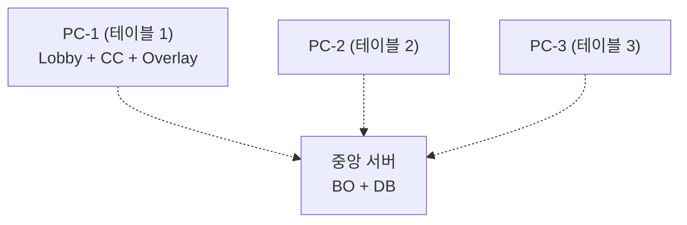
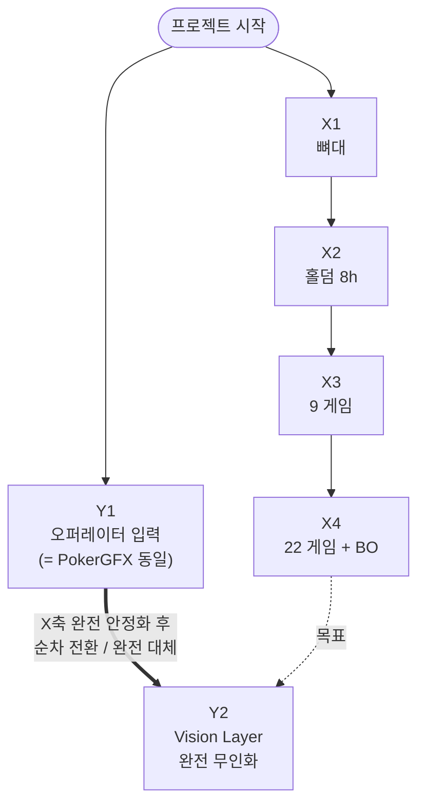

# EBS 기초 기획서

> **EBS** = WSOP LIVE 대회정보 + RFID 카드 + Command Center 액션 → Game Engine → **Overlay Graphics** (정확하고 안정된 송출)

| 0 | 22 | 21 | 8 | 12 |
|:---:|:---:|:---:|:---:|:---:|
| **누락·오류** | **변형 게임** | **OutputEvent** | **실시간 오버레이** | **테이블 안테나** |

---

## 목차

* **Part I — Concept** (왜 존재하는가)
  * Ch.1 숨겨진 패를 보여주는 마법
  * Ch.2 결과물: 시청자가 보는 화면 해부
  * Ch.3 무대 위와 뒤: EBS 가 활약하는 공간
* **Part II — Deliverables** (무엇을 개발하는가)
  * Ch.4 개발 대상 오버뷰: 6 기능 ↔ 4 SW + 1 HW
  * Ch.5 사용자가 만지는 것 (Front-end)
  * Ch.6 눈에 보이지 않는 두뇌와 뼈대 (Back-end)
  * Ch.7 눈에 보이는 출력물과 입력 센서 (Render & Hardware)
* **Part III — Operations & Roadmap** (어떻게 운영하는가)
  * Ch.8 현장의 하루: 준비부터 송출까지
  * Ch.9 비전과 전략

---

# Part I — Concept

<a id="ch-1"></a>

<!-- FB §1 INTRO · narrative (P0 Hero) -->
<table role="presentation" width="100%">
<tr>
<td width="100%" valign="middle" align="left">

## Ch.1 — 숨겨진 패를 보여주는 마법

이 시스템이 왜 존재하는지 이해하려면, 먼저 일반적인 스포츠 중계와 포커 중계의 결정적인 차이를 알아야 합니다.

축구는 점수와 공의 위치가 모두에게 보이는 **공개 정보** 입니다. 하지만 포커는 시청자가 가장 궁금해하는 카드가 **뒤집혀 있습니다** — 심지어 방송 스태프조차 그 카드가 무엇인지 모릅니다. 이 정보 비대칭성을 해결하는 것이 EBS 의 존재 이유입니다.

이번 챕터는 6 단계로 풀어냅니다 — §1.1 정보 비대칭성의 딜레마 (카드 + 액션 두 겹), §1.2 시청자에게 전달할 3 핵심 데이터, §1.3 RFID 카드 인식 (1세대→2세대 진화), §1.4 **CC 오퍼레이터 — 인간 판단이 필요한 입력**, §1.5 **게임 룰 — Engine 내장 해석기**, §1.6 완벽한 번역가 미션 (1단계 Trinity → 2단계 무인화).

</td>
</tr>
</table>

> *§1.1 부터 시작 — 보이지 않는 것을 어떻게 중계하는가의 딜레마.*

<a id="ch-1-1"></a>

<!-- FB §1.1 · 딜레마 -->
<table role="presentation" width="100%">
<tr>
<td width="50%" valign="middle" align="left">

**§1.1 · 딜레마**

#### 보이지 않는 것을 중계하라

축구 중계에서 점수판을 띄우는 일은 상대적으로 쉽습니다. 공의 위치와 점수는 경기장의 모두가 볼 수 있는 **'공개 정보'** 이기 때문입니다. 방송 스태프는 눈에 보이는 정보를 화면에 예쁘게 정리해서 띄우기만 하면 됩니다.

하지만 포커는 완전히 다릅니다. 시청자가 가장 궁금해하는 핵심 정보가 **두 겹으로 가려져** 있습니다.

* **첫째, 카드가 뒤집혀 있습니다** — 카메라에 찍히지도 않고, 심지어 방송 스태프조차 그 카드가 무엇인지 모릅니다.
* **둘째, 베팅 액션도 외형으로는 모호합니다** — 플레이어가 작은 칩 더미를 테이블에 미는 동작이 콜인지 레이즈인지, 카메라 영상으로는 즉시 판별이 어렵습니다. 다른 스포츠 (축구·농구·야구) 는 점수와 함께 **선수의 액션** (공 차기, 슛, 스윙) 이 모두 카메라에 명확히 잡히지만, **포커의 베팅은 작고 빠르며 종종 침묵 속에서 진행** 됩니다.

| 구분 | 축구 / 농구 / 야구 | 포커 |
| --- | --- | --- |
| **카드/패** | 해당 없음 | **비공개** (뒤집힘) |
| **선수 액션** | **공개** (눈으로 명확) | **모호** (칩 동작 작고 빠름) |
| **그래픽 역할** | 보이는 정보 **정리** 표시 | 보이지 않는 정보 **생성** 표시 |

즉, **포커는 카드뿐 아니라 액션도 별도 그래픽으로 알려줘야 하는 유일한 메이저 스포츠** 입니다. 이 두 겹의 비대칭성을 해결하고 방송 화면에 띄우는 것 — **이것이 우리가 EBS를 개발하는 궁극적인 이유입니다.**

</td>
<td width="50%" valign="middle" align="left">


> *FIG · 축구는 정리, 포커는 생성*


> *FIG · 비대칭성 — 축구는 모두가 보는 정보, 포커는 아무도 못 보는 정보*

</td>
</tr>
</table>

> *§1.1 의 비대칭성을 해결하려면 — 화면에 정확히 어떤 데이터를 띄워야 하는가? §1.2 가 답합니다.*

<a id="ch-1-2"></a>

<!-- FB §1.2 · 3 핵심 데이터 (P7 Grouped FB) -->
<table role="presentation" width="100%">
<tr>
<td width="100%" valign="middle" align="left" colspan="2">

**§1.2 · 3 핵심 데이터**

#### 시청자에게 전달해야 할 3가지

방송 화면을 통해 시청자에게 구체적으로 무엇을 전달해야 할까요? 포커의 기본 흐름에 따라 다음 3가지 데이터를 반드시 실시간으로 추적해야 합니다.

</td>
</tr>
<tr>
<td width="50%" valign="middle" align="left">

**1. 홀카드**

플레이어 각자만 볼 수 있게 뒤집어서 받는 개인 카드입니다. 방송에서는 이를 시청자에게만 몰래 보여주어야 합니다.

</td>
<td width="50%" valign="middle" align="left">


> *FIG · 1. 홀카드 — 시청자에게만 공개*

</td>
</tr>
<tr>
<td width="50%" valign="middle" align="left">


> *FIG · 2a. 커뮤니티 카드 — 모두가 공유*


> *FIG · 2b. 7장 중 가장 강한 5장 조합*

</td>
<td width="50%" valign="middle" align="left">

**2. 커뮤니티 카드**

테이블 중앙에 놓여 모두가 공유하는 카드입니다. 플레이어는 자신의 홀카드 2장과 공유 카드 5장을 합친 총 7장 중, **가장 강력한 5장의 조합** 을 만들어 승부를 냅니다.

</td>
</tr>
<tr>
<td width="50%" valign="middle" align="left">

**3. 베팅 액션**

카드가 공개될 때마다 플레이어들은 베팅을 진행합니다. 상대방과 같은 금액을 거는 **콜**, 판돈을 키우는 **레이즈**, 게임을 포기하는 **폴드** — 세 가지 선택지가 매 라운드 반복됩니다.

</td>
<td width="50%" valign="middle" align="left">


> *FIG · 3. 베팅 액션 — 콜 / 레이즈 / 폴드*

</td>
</tr>
<tr>
<td width="100%" valign="middle" align="left" colspan="2">

이 3 데이터를 **실시간으로 추적** 하는 것이 EBS 의 입력 영역입니다.

</td>
</tr>
</table>

> *§1.2 가 무엇을 전달할지 정의했다면 — §1.3 은 그것을 어떻게 읽어들이는가의 기술 진화를 봅니다.*

<a id="ch-1-3"></a>

<!-- FB §1.3 · 기술 진화 -->
<table role="presentation" width="100%">
<tr>
<td width="50%" valign="middle" align="left">

**§1.3 · 기술 진화**

#### 유리판에서 전자 인식으로

과거에는 이 숨겨진 카드를 보여주기 위해 무식한 물리적 방법을 썼습니다. **1999년 처음 도입된 1세대 방송** 에서는 테이블 테두리에 투명한 유리판을 파고 그 밑에 카메라를 설치했습니다. 플레이어가 카드를 유리판 위에 정확히 올려두어야만 방송에 나갈 수 있었습니다.

지금 우리가 구축하려는 것은 **2세대 RFID 기술** 입니다. 52장의 포커 카드 한 장 한 장마다 전파로 읽을 수 있는 아주 작은 RFID 태그가 내장되어 있습니다. 플레이어가 테이블 천 위에 카드를 내려놓는 순간, 테이블 아래 매립된 안테나가 이를 감지합니다.

플레이어가 아무런 추가 행동을 하지 않아도, 안테나의 위치와 태그 코드를 통해 **"어느 좌석에 어떤 카드가 놓였는지"** 가 즉시 파악됩니다.

</td>
<td width="50%" valign="middle" align="left">


> *FIG · 1세대 (1999~) — 유리판 + 하부 카메라*

</td>
</tr>
</table>

> *§1.3 의 RFID 가 카드를 정확하게 읽는다면 — 카드만으론 부족합니다. §1.4 가 두 번째 입력 채널을 풀어냅니다.*

<a id="ch-1-4"></a>

<!-- FB §1.4 · CC 오퍼레이터 -->
<table role="presentation" width="100%">
<tr>
<td width="50%" valign="middle" align="left">

**§1.4 · CC 오퍼레이터 — 인간 판단이 필요한 입력**

#### 왜 사람이 입력해야 하는가

§1.3 의 RFID 안테나는 **"어떤 카드가 어디 놓였는가"** 는 정확히 읽지만, **"플레이어가 콜했는지 레이즈했는지"** 는 읽지 못합니다. 베팅 의사는 칩 더미의 작은 움직임 + 침묵 속 손짓 + 딜러와의 음성 교환으로 표현되며, 센서로 자동 판별이 어렵습니다.

따라서 1단계 EBS 는 **컨트롤룸 CC 오퍼레이터** 가 모니터로 테이블 영상을 보면서, 매 액션마다 화면 버튼을 눌러 시스템에 알려줍니다.

> 딜러는 테이블 진행자, CC 오퍼레이터는 컨트롤룸 입력자. 두 역할은 물리적으로 분리됩니다.

#### 어떻게 입력하는가 — 8 액션 버튼

| 입력 | 설명 |
| --- | --- |
| **핸드 시작** | 새 핸드 개시 신호 |
| **카드 배분** | 홀카드 분배 시점 |
| **콜 / 레이즈 / 폴드 / 체크 / 올인** | 5 베팅 액션 |
| **승부 종결** | 핸드 종료 + 판돈 분배 |

#### 무엇을 보고 입력하는가

* **컨트롤룸 모니터** — 테이블 카메라 영상 실시간 송출
* **딜러의 콜아웃 음성** — 액션 종류 (콜/레이즈/폴드)
* **칩 트레이 변화** — 베팅 금액 시각 확인

본 입력 모델은 1단계 운영 방식이며, 2단계 진화 시 카메라 + 컴퓨터 비전 시스템으로 대체됩니다 (§Ch.7 / §Ch.9 참조).

</td>
<td width="50%" valign="middle" align="left">


> *FIG · 컨트롤룸 — 8 액션 버튼 + 10 좌석 인터페이스*



> *FIG · 입력 흐름 — 모니터/딜러 → 오퍼레이터 → 버튼 → Engine*

</td>
</tr>
</table>

> *§1.4 가 두 번째 입력을 정의했다면 — §1.5 가 세 번째 입력 (게임 룰) 의 본질을 답합니다.*

<a id="ch-1-5"></a>

<!-- FB §1.5 (FLIP) · 게임 룰 -->
<table role="presentation" width="100%">
<tr>
<td width="50%" valign="middle" align="left">



> *FIG · 같은 RFID 신호가 활성 게임 룰에 따라 다르게 해석*

</td>
<td width="50%" valign="middle" align="left">

**§1.5 · 게임 룰 — Engine 내장 해석기**

#### 게임 룰은 입력이 아니라 내장 상수

세 번째 정보 — 포커 규칙 — 은 RFID/CC 와 다릅니다. **22 게임 룰은 Game Engine 코드에 영구 내장된 상수** 이며, 매 핸드 외부에서 주입받는 입력이 아닙니다.

| 구분 | RFID 카드 | CC 액션 | **게임 룰** |
| --- | --- | --- | --- |
| 출처 | 외부 센서 | 외부 사람 | **Engine 코드** |
| 변동성 | 매 카드마다 | 매 액션마다 | **불변 상수** |
| 입력 채널? | ✅ | ✅ | ❌ (내장) |

#### Lobby Settings = 룰 "선택" 만 가능

§5.2 Settings 의 "규칙" 영역에서 운영자가 하는 것은 **22 종 중 어느 룰을 활성화할지 선택** 만 가능합니다. 룰 자체의 정의 / 수정 / 추가는 불가능 — Engine 재배포 필요.

#### 같은 카드, 다른 해석 메커니즘

RFID 안테나는 카드를 항상 동일하게 인식합니다 (예: "스페이드 A 가 좌석 3 에 놓였다"). **이 동일한 신호를 활성 게임 룰이 다르게 해석** 합니다:

* **홀덤 활성 시**: 좌석 3 의 개인 홀카드 (시청자에게만 공개)
* **7 카드 스터드 활성 시**: 부분 공개 카드 (테이블 모두에게 공개)
* **드로우 활성 시**: 라운드 종료 시 교환 가능한 카드

→ 카드 인식은 변하지 않고, **룰이 그 카드의 의미를 결정** 합니다.

</td>
</tr>
</table>

> *§1.5 의 게임 룰이 Engine 내장이라면 — §1.6 이 세 정보 (RFID + CC + 룰) 가 만나 그래픽이 되는 미션을 선언합니다.*


<a id="ch-1-6"></a>

<!-- FB §1.6 (FLIP) · 미션 선언 + 진화 예고 -->
<table role="presentation" width="100%">
<tr>
<td width="50%" valign="middle" align="left">



> *FIG · 3 입력 Trinity → Engine → 방송 그래픽*

</td>
<td width="50%" valign="middle" align="left">

**§1.6 · 미션 — 완벽한 번역가**

#### 1단계 Trinity → 2단계 무인화

§1.3 의 RFID 카드 정보, §1.4 의 CC 오퍼레이터 액션 입력, §1.5 의 Engine 내장 게임 룰 — **이 3 정보가 만나야** 비로소 **"누가 이길 확률이 가장 높은가?"** 가 결정됩니다.

EBS 의 미션은 명확합니다. 테이블 위에서 일어나는 이 모든 물리적 상황과 아날로그 데이터를 수집하여, **카드 1장도 빠짐없이, 액션 1건도 누락없이, 단단한 장비 사슬을 통해 정확하게 방송 그래픽으로 번역해 송출** 하는 것입니다.

#### 2단계 진화 — CC 오퍼레이터 → 카메라

EBS 의 장기 지향점 (현장 무인화 진화) 은 §Ch.9 비전 챕터에서 설명합니다.

#### 핵심 가치 — 속도가 아닌 정확성

EBS 의 핵심 가치는 **속도가 아닌 정확성** 입니다 — 정확한 인식, 장비 간 안정성, 명확한 연결, 단단한 하드웨어, 오류 없는 처리 흐름. 이 다섯 가치가 다음 챕터의 모든 설계를 지배합니다.

</td>
</tr>
</table>

> *§1.6 의 미션이 명확해졌다면 — Ch.2 에서 그 결과물 (시청자가 보는 화면) 을 해부합니다.*

---

<a id="ch-2"></a>

<!-- FB §2 INTRO · narrative (P0 Hero) -->
<table role="presentation" width="100%">
<tr>
<td width="100%" valign="middle" align="left">

## Ch.2 — 결과물: 시청자가 보는 화면 해부

EBS가 무엇을 만드는 시스템인지 가장 직관적으로 이해하는 방법은 **최종 결과물인 방송 화면을 뜯어보는 것** 입니다. 화면에 보이는 수많은 정보 그래픽 (오버레이) 중, 어떤 것이 우리의 몫이고 어떤 것이 아닌지 명확한 선을 그어야 합니다.

이번 챕터는 3 단계로 풀어냅니다 — §2.1 EBS 가 그리는 8 핵심 그래픽, §2.2 EBS 가 만들지 않는 그래픽 (명확한 선 긋기), §2.3 EBS 책임 영역 판정 3 절대 조건.

</td>
</tr>
</table>

> *§2.1 부터 시작 — 화면 위 8개의 퍼즐 조각.*

<a id="ch-2-1"></a>

<!-- FB §2.1 · 8 오버레이 -->
<table role="presentation" width="100%">
<tr>
<td width="50%" valign="middle" align="left">

**§2.1 · 화면 위 8개의 퍼즐 조각**

#### EBS 가 그리는 영역

EBS는 카메라 원본 영상 위에 실시간으로 포커 데이터를 덧그립니다. 현장에서 발생하는 물리적 상황을 즉시 반영하여 화면에 띄우는 **8가지 핵심 그래픽** 이 바로 우리가 직접 생성해야 할 결과물입니다.

1. **홀카드 표시** — 센서가 카드를 감지하는 즉시 플레이어별 비공개 카드를 화면에 띄웁니다
2. **커뮤니티 카드** — 테이블 중앙에 공개되는 보드 카드를 인식하여 표시
3. **액션 배지** — 운영자가 조작반에 입력한 콜 / 레이즈 / 폴드 상태를 색상 배지로
4. **팟 카운터** — 누적된 전체 베팅 금액을 자동 계산하여 중앙에 표시
5. **승률 바** — 카드 공개 시마다 각 플레이어의 실시간 승리 확률을 막대그래프로
6. **아웃츠** — 현재 상황에서 특정 플레이어에게 유리한 카드가 덱에 몇 장 남았는지
7. **플레이어 정보** — 대회 공식 API 를 수신하여 선수 이름, 보유 칩, 사진 등
8. **플레이어 위치** — 각 좌석의 딜러 버튼 위치 / 순서

</td>
<td width="50%" valign="middle" align="left">


> *FIG · 실제 방송 화면 — 카메라 영상 위 8 그래픽 합성*


> *FIG · 8 그래픽의 화면 내 위치 해부도*

</td>
</tr>
</table>

> *§2.1 의 8 영역이 EBS 의 영역이라면 — §2.2 는 명확한 선을 긋습니다 — 우리가 만들지 않는 것은 무엇인가?*

<a id="ch-2-2"></a>


> *FIG · 화면 속 화려한 그래픽 중 일부는 EBS 영역 밖*
<!-- FB §2.2 (FLIP) · 명확한 선 긋기 -->
<table role="presentation" width="100%">
<tr>
<td width="50%" valign="middle" align="left">


> *FIG · 리더보드 — 서울 후편집팀이 1~2시간 뒤 수동 삽입*


> *FIG · 프로필 카드 — 후편집 영역*


> *FIG · 사전 제작 프레임워크 — 디자인 팀 사전 제작*

</td>
<td width="50%" valign="middle" align="left">

**§2.2 · 우리가 만들지 않는 것**

#### 명확한 선 긋기

화면에는 위 8가지 외에도 리더보드, 선수 프로필, 탈락 위기 경고, 자막 등 화려한 그래픽이 많습니다. **하지만 이것들은 EBS가 만들지 않습니다.**

이 구분을 명확히 하지 않으면 "선수별 성향 통계 지표도 우리가 실시간으로 구현해야 하나?" 라는 심각한 개발 범위 오해가 발생합니다. 화면에 보이는 그래픽은 사실 만들어지는 시간과 장소가 완전히 다릅니다.

* **실시간 오버레이 (EBS 영역)** — 카드가 놓이는 바로 그 순간, 라스베이거스 현장 시스템이 자동으로 즉시 생성
* **후편집 그래픽 (프로덕션 팀 영역)** — 핸드 종료 후 1~2시간 뒤, 서울 편집 스튜디오에서 방송 프로듀서가 수동 삽입. 통계 차트나 리더보드가 여기에 속합니다. EBS는 데이터 원문 (JSON) 만 넘겨줄 뿐, 그래픽 자체를 렌더링하지 않습니다.
* **사전 제작 프레임워크** — 대회 로고, 상시 자막 틀, 화면 전환 효과 등은 방송 전 디자인 팀이 미리 만들어둔 고정 틀. EBS 와 무관합니다.

</td>
</tr>
</table>

> *§2.2 의 선 긋기가 끝났다면 — §2.3 이 EBS 책임 영역을 판정하는 3 절대 조건을 정의합니다.*

<a id="ch-2-3"></a>

<!-- FB §2.3 · 3 절대 조건 -->
<table role="presentation" width="100%">
<tr>
<td width="50%" valign="middle" align="left">

**§2.3 · 3 절대 조건**

#### EBS 책임 영역 판정 룰

따라서 어떤 기능을 개발해야 하는지 논의할 때, 다음 **세 가지 조건을 동시에 만족** 하는지 항상 확인해야 합니다.

| 조건 | 의미 |
| --- | --- |
| **시간** | 1초의 지연도 없는 '실시간' 인가? |
| **장소** | 네트워크를 거치지 않고 '현장' 에서 처리되는가? |
| **데이터 소스** | '센서' 나 '현장 조작반' 에서 발생한 데이터인가? |

이 세 가지를 모두 충족하는 **8종의 실시간 정보** 만이 EBS가 책임져야 할 온전한 개발 대상입니다.

</td>
<td width="50%" valign="middle" align="left">


> *FIG · 8 오버레이 = 3 조건 모두 만족*

</td>
</tr>
</table>

> *§2.3 으로 EBS 영역이 명확해졌다면 — Ch.3 에서 그 영역이 물리적으로 어디에 위치하는지 무대 지도를 그려봅니다.*

---

<a id="ch-3"></a>

<!-- FB §3 INTRO · narrative (P0 Hero) -->
<table role="presentation" width="100%">
<tr>
<td width="100%" valign="middle" align="left">

## Ch.3 — 무대 위와 뒤: EBS 가 활약하는 공간

앞서 화면의 결과물을 확인했다면, 이제 이 시스템이 물리적으로 어디에 설치되어 어떻게 세상과 연결되는지 **거시적인 지도** 를 그려볼 차례입니다.

포커 테이블에서 벌어진 사건이 유튜브 시청자에게 도달하기까지는 총 **4개의 큰 구간** 을 거칩니다. EBS 가 활약하는 무대는 이 중 첫 번째 구간에 완벽하게 집중되어 있습니다.

이번 챕터는 4 단계로 풀어냅니다 — §3.1 송출 파이프라인 4 단계, §3.2 현장 프로덕션 장비 사슬, §3.3 보이지 않는 데이터 공급자 역할, §3.4 현장 즉시 합성 vs 1시간 후편집의 시간차.


> *FIG · 라스베가스 현장 → 클라우드 → 서울 후편집 → 시청자 — EBS 는 A 구간 전담*

</td>
</tr>
</table>

> *§3.1 부터 시작 — 방송 송출의 4 단계 릴레이.*

<a id="ch-3-1"></a>

<!-- FB §3.1 · 4 단계 릴레이 -->
<table role="presentation" width="100%">
<tr>
<td width="50%" valign="middle" align="left">

**§3.1 · 4 단계 릴레이**

#### 라스베가스 → 유튜브 시청자

방송 파이프라인은 라스베이거스 현장에서 시작해 서울의 스튜디오를 거쳐 전 세계 시청자에게 뻗어나갑니다.

| 구간 | 위치 | 역할 |
| --- | --- | --- |
| **A 구간 (현장 송출)** | 라스베가스 / 유럽 | 카메라 촬영 + 실시간 그래픽 합성 — **EBS 가 설치되고 운영되는 유일한 공간** |
| **B 구간 (클라우드 전송)** | — | 무선 송출 → 클라우드 분배 |
| **C 구간 (후편집)** | 서울 스튜디오 | 1시간 단위 편집 + 화려한 통계 그래픽 수동 삽입 |
| **최종** | YouTube / WSOP TV | 무료 / 유료 송출 |

EBS 는 **A 구간 단 한 곳** 에서 설치 + 운영됩니다.

</td>
<td width="50%" valign="middle" align="left">


> *FIG · 4 단계 릴레이 — EBS 는 A 구간 전담*

</td>
</tr>
</table>

> *§3.1 의 4 구간 중 A 구간 안으로 들어가 봅니다 — §3.2 현장 프로덕션의 장비 사슬.*

<a id="ch-3-2"></a>

<!-- FB §3.2 (FLIP) · 현장 프로덕션 -->
<table role="presentation" width="100%">
<tr>
<td width="50%" valign="middle" align="left">


> *FIG · 카메라 → 영상 전환기 → EBS 합성 → 송출 장비*

</td>
<td width="50%" valign="middle" align="left">

**§3.2 · 현장 프로덕션**

#### 카메라에서 송출기까지

EBS 가 독점적으로 활약하는 A 구간의 내부를 조금 더 확대해 보겠습니다. 현장에서는 **물리적인 장비들이 사슬처럼 엮여** 있습니다.

카메라가 테이블을 촬영하면, 영상 전환기가 여러 카메라의 앵글을 골라냅니다. 바로 이때 **EBS가 투명한 배경 위에 실시간으로 생성한 정보 그래픽을 카메라 원본 영상 위에 덮어씌웁니다**. 이렇게 합성이 완료된 최종 방송 영상은 송출 장비를 타고 클라우드로 쏘아 올려집니다.

1. **카메라** → 테이블 촬영
2. **영상 전환기** → 여러 카메라 앵글 선택
3. **EBS 합성** → 카메라 원본 영상 위에 투명 배경 그래픽 덮어씌움
4. **송출 장비** → 클라우드 송출

</td>
</tr>
</table>

> *§3.2 가 EBS 의 주 임무라면 — §3.3 은 무대 뒤의 보이지 않는 역할을 봅니다.*

<a id="ch-3-3"></a>

<!-- FB §3.3 · 데이터 공급자 -->
<table role="presentation" width="100%">
<tr>
<td width="50%" valign="middle" align="left">

**§3.3 · 데이터 공급자 (보이지 않는 역할)**

#### 무대 뒤에서 서울을 돕는다

EBS 의 주 임무는 현장 화면 합성 (A 구간) 이지만, 무대 뒤에서 **서울 편집팀 (C 구간) 을 돕는 중요한 조력자 역할** 도 수행합니다.

게임이 한 판 끝날 때마다 EBS 는 카드, 베팅 기록, 승자 등 **모든 결과를 구조화된 JSON 데이터 형태로 묶어 전송** 합니다. 서울의 방송 프로듀서들은 이 데이터를 바탕으로 어떤 장면이 극적인지 파악하고, 후편집 그래픽을 제작하는 데 활용합니다.

</td>
<td width="50%" valign="middle" align="left">


> *FIG · EBS → JSON 데이터 → 서울 후편집팀 활용*

</td>
</tr>
</table>

> *§3.3 의 데이터 공급은 무대 뒤 작업 — §3.4 가 시간축에서 그 흥미로운 결과를 보여줍니다.*

<a id="ch-3-4"></a>

<!-- FB §3.4 (FLIP) · 1시간의 시간 여행 -->
<table role="presentation" width="100%">
<tr>
<td width="50%" valign="middle" align="left">


> *FIG · 현장 즉시 합성 + 1~2시간 후편집 = 시청자 도달*

</td>
<td width="50%" valign="middle" align="left">

**§3.4 · 1시간의 시간 여행**

#### 즉시 vs 1~2시간

흥미로운 점은 지연 시간입니다. EBS가 카드를 읽고 그래픽을 씌우는 것은 **장비 사슬을 따라 즉시** 처리됩니다. 하지만 시청자가 유튜브에서 그 장면을 보는 것은 실제 경기 시간보다 약 **1시간에서 2시간 뒤** 입니다.

| 구간 | 지연 |
| :---: | :---: |
| EBS 합성 (A 구간 현장) | **즉시 (장비 사슬 통과)** |
| 시청자가 보는 시점 (최종) | **1~2시간 후** |

왜일까요? **서울에서 영상을 자르고 평가하여 수동으로 그래픽을 덧입히는 후편집 (C 구간) 과정** 에서 대부분의 지연이 발생하기 때문입니다. 즉, EBS는 정확하고 안정된 합성 시스템이지만, 방송 생태계의 편집 파이프라인 특성상 대중에게는 자연스러운 시간차를 두고 공개됩니다. **A 구간의 핵심 가치는 속도가 아니라 정확성과 안정성** 입니다 — 1~2시간 후편집 대비 0.1초 차이는 무의미하기 때문입니다.

</td>
</tr>
</table>

> *§3.4 의 시간차로 Part I 개념 설명을 마칩니다 — Part II 부터는 EBS 가 무엇을 어떻게 개발하는지 본격 들어갑니다.*

---

# Part II — Deliverables

<a id="ch-4"></a>

<!-- FB §4 INTRO · narrative (P0 Hero) -->
<table role="presentation" width="100%">
<tr>
<td width="100%" valign="middle" align="left">

## Ch.4 — 개발 대상 오버뷰: 6 기능 ↔ 4 SW + 1 HW

앞서 1부에서 EBS가 무엇을 위해 존재하고 어떤 결과물을 내는지 확인했습니다. 그렇다면 이 마법 같은 시스템을 현실로 만들기 위해 우리는 **구체적으로 무엇을 코딩하고 조립해야 할까요?**

EBS는 "마우스로 더블 클릭해서 실행하는 프로그램 하나" 가 아닙니다. 서로 다른 역할을 맡은 **여섯 개 기능 구성요소** 가 톱니바퀴처럼 맞물려 돌아가는 시스템입니다. 다만 이 여섯 개가 각각 별도 프로그램으로 설치되는 것은 아닙니다 — **설치 관점으로는 소프트웨어 4종 + 하드웨어 1종** 입니다 (γ 하이브리드, 2026-04-22).

이번 챕터는 **두 렌즈** 로 풀어냅니다 — §4.1 기능 렌즈 (3 그룹 = 조작 / 두뇌 / 출력), §4.2 설치 렌즈 (4 SW + 1 HW 매핑).

#### 6 기능 = 3 그룹

* **조작부** (Front-end)
  * Lobby (관제탑)
  * Command Center (조종석)
* **두뇌부** (Back-end)
  * Game Engine (22 게임 규칙 + 승률)
  * Backend Server (BO, 데이터 동기화)
* **출력부 / 입력부**
  * Overlay View (Rive 렌더 + SDI/NDI)
  * RFID Hardware (12 안테나)


> *§4.1 부터 시작 — 6 기능을 3 그룹으로 묶어 봅니다.*


**§4.1 · 3 기능 그룹**


<!-- FB §4.2 (FLIP) · 두 렌즈: 기능 ↔ 설치 -->
<table role="presentation" width="100%">
<tr>
<td width="50%" valign="middle" align="left">


> *FIG · 기능 ≠ 설치 단위 (γ 하이브리드 2026-04-22)*

</td>
<td width="50%" valign="middle" align="left">


**§4.2 · 두 렌즈 — 기능 ↔ 설치 (FLIP)**

#### 6 기능 → 4 SW + 1 HW

| 설치 단위 | 포함 기능 | 스택 | 배포 |
| --- | --- | --- | --- |
| **Lobby Web** | Lobby + Settings + Rive Manager | Flutter Web + Rive | Docker nginx |
| **Desktop App** (CC) | Command Center + Overlay | Flutter Desktop + Rive | Desktop 설치 |
| **Game Engine** | Engine | Pure Dart | Docker / `dart run` |
| **Backend (BO)** | BO Server | FastAPI + DB | 별도 서비스 |
| **RFID Hardware** | 카드 인식 | ST25R3911B + ESP32 | 물리 장비 |

**팀 ≠ 설치 단위**: team1 (Lobby), team2 (BO), team3 (Engine), team4 (CC + Overlay).

</td>
</tr>
</table>

> *§4.2 의 4 설치 단위 중 사용자가 직접 만지는 것 (Lobby / CC) 부터 — Ch.5 가 풀어냅니다.*

---

<a id="ch-5"></a>

<!-- FB §5 INTRO · narrative (P0 Hero) -->
<table role="presentation" width="100%">
<tr>
<td width="100%" valign="middle" align="left">

## Ch.5 — 사용자가 만지는 것 (Front-end)

현장의 스태프들이 시스템을 조작하기 위해 마주하는 프론트엔드 화면은 크게 **네 가지** 로 나뉩니다. 전체 상황을 지휘하는 **로비**, 시스템 규칙을 통제하는 **세팅**, 방송 스킨을 업로드·활성화하는 **Rive Manager**, 그리고 쉴 새 없이 버튼을 눌러야 하는 **커맨드 센터** 입니다.

이번 챕터는 5 단계로 풀어냅니다 — §5.1 관제탑 Lobby, §5.2 글로벌 제어판 Settings, §5.3 스킨 허브 Rive Manager, §5.4 실시간 조종석 Command Center, §5.5 두 런타임 모드 + 3 역할 권한.

</td>
</tr>
</table>

> *§5.1 부터 시작 — 모든 테이블을 내려다보는 관제탑.*

<a id="ch-5-1"></a>

<!-- FB §5.1 · 관제탑 Lobby -->
<table role="presentation" width="100%">
<tr>
<td width="50%" valign="middle" align="left">

**§5.1 · 관제탑 Lobby**

#### 모든 테이블을 내려다보는 화면

* **구조**: Series → Event → Table 3단계
* **역할**: 전체 테이블 카드 모니터링 + 선수 명단 관리
* **실행**: 테이블 카드 클릭 → 해당 테이블 CC 열림
* **배포**: Flutter **Web** (Docker nginx, LAN 다중 클라이언트)
* **비율**: Lobby : CC = **1 : N** (시스템당 Lobby 하나, 테이블당 CC 하나)

</td>
<td width="50%" valign="middle" align="left">


> *FIG · Series/Event/Table 3단계 + 카드 그리드*

</td>
</tr>
</table>

> *§5.1 의 Lobby 가 모든 테이블을 내려다본다면 — §5.2 가 그 안에 숨겨진 글로벌 제어판을 풀어냅니다.*

<a id="ch-5-2"></a>

<!-- FB §5.2 (FLIP) · 글로벌 제어판 Settings -->
<table role="presentation" width="100%">
<tr>
<td width="50%" valign="middle" align="left">


> *FIG · 출력 / 그래픽 / 디스플레이 / 규칙 / 통계 / 환경 설정*

</td>
<td width="50%" valign="middle" align="left">

**§5.2 · 글로벌 제어판 Settings (FLIP)**

#### 글로벌 제어판 (Lobby 내)

| 영역 | 통제 |
| --- | --- |
| **출력** | 송출 해상도 + 방식 |
| **그래픽** | 요소 배치 + 활성 스킨 (Rive Manager 연동) |
| **디스플레이** | 통화 / 소수점 |
| **규칙** | **룰 선택** — 22 종 중 활성화 (정의 / 수정 불가, §1.5 참조) + 칩 배분 |
| **통계** | 리더보드 표시 여부 |
| **환경** | 진단 + 데이터 내보내기 |

</td>
</tr>
</table>

> *§5.2 의 그래픽 영역에서 활성 스킨을 선택한다면 — 그 스킨 자체를 관리하는 §5.3 Rive Manager 가 다음입니다.*

<a id="ch-5-3"></a>

<!-- FB §5.3 · 스킨 허브 Rive Manager -->
<table role="presentation" width="100%">
<tr>
<td width="50%" valign="middle" align="left">

**§5.3 · 스킨 허브 Rive Manager**

#### `.riv` 파일 업로드 → 활성화

**아트 디자이너의 외부 Rive Editor 작업물** 을 EBS 로 가져오는 단일 경로. Lobby Web 내부 섹션 (별도 앱 아님), Admin 권한 전용.

| 역할 | 내용 |
| --- | --- |
| **Import** | `.riv` / `.gfskin` 업로드 + 자동 검증 |
| **Validate** | 필수 데이터 슬롯 (선수 / 카드 트리거) 확인 |
| **Preview** | Rive 런타임 즉시 렌더 (Overlay 와 동일 바이너리) |
| **Activate** | 시스템 활성 스킨 전환 (멀티 CC 동시 반영) |

> **D3 회의 (2026-04-22)**: 사내 Graphic Editor 폐기. 메타데이터는 Rive 파일 내장.

</td>
<td width="50%" valign="middle" align="left">


> *FIG · Import → Validate → Preview → Activate*

</td>
</tr>
</table>

> *§5.3 의 Rive Manager 까지가 관리자 영역 — §5.4 부터는 실제 본방송에서 운영자가 머무는 화면입니다.*

<a id="ch-5-4"></a>

<!-- FB §5.4 (FLIP) · 실시간 조종석 Command Center -->
<table role="presentation" width="100%">
<tr>
<td width="50%" valign="middle" align="left">


> *FIG · 운영자 시선 85% 머무는 화면 (테이블당 1 인스턴스)*

</td>
<td width="50%" valign="middle" align="left">

**§5.4 · 실시간 조종석 Command Center (FLIP)**

#### 1단계 입력 채널의 본체

본방송 중 운영자 시선의 85% 가 머무는 화면. 테이블 1개당 1 인스턴스 독립 실행. CC 오퍼레이터 입력 흐름은 §1.4 참조.

* **시각**: 타원 포커 테이블 + 10 좌석
* **버튼 (8 액션)**: 핸드 시작 / 카드 배분 / 콜 / 레이즈 / 폴드 / 체크 / 올인 / 승부 종결
* **역할**: 센서가 못 잡는 **베팅 의사** → 시스템 주입 (§1.4 입력 흐름 참조)
* **운영자 정보 소스**: 컨트롤룸 모니터 (테이블 영상) + 딜러 콜아웃 음성 + 칩 트레이 시각 확인

**배포**: Flutter **Desktop** (RFID 시리얼 + SDI/NDI 직결 필수).

</td>
</tr>
</table>

> *§5.4 의 Command Center 가 본방송의 핵심이라면 — §5.5 가 그 Desktop 앱의 두 런타임 모드 + 3 역할 권한을 정리합니다.*

<a id="ch-5-5"></a>

<!-- FB §5.5 · 두 런타임 모드 + 3 역할 권한 -->
<table role="presentation" width="100%">
<tr>
<td width="50%" valign="middle" align="left">

**§5.5 · 두 런타임 모드 + 3 역할 권한 (RBAC)**

#### 2 런타임 모드 (Desktop 내부 옵션)

| 모드 | 용도 |
| --- | --- |
| **탭/슬라이딩** | 단일 운영자, 향후 태블릿 |
| **다중창** | 멀티 모니터, 운영자 분리 |

#### 3 역할 RBAC

| 역할 | 권한 |
| --- | --- |
| **Admin** | 전체 |
| **Operator** | 할당 테이블 CC 만 |
| **Viewer** | 읽기 전용 |

</td>
<td width="50%" valign="middle" align="left">



> *FIG · 단일 바이너리, 두 모드 (Lobby Settings 에서 선택)*

</td>
</tr>
</table>

---

<a id="ch-6"></a>

<!-- FB §6 INTRO · narrative (P0 Hero) -->
<table role="presentation" width="100%">
<tr>
<td width="100%" valign="middle" align="left">

## Ch.6 — 눈에 보이지 않는 두뇌와 뼈대 (Back-end)

앞서 살펴본 화면들이 스태프의 입력을 받는 **'피부'** 라면, 지금부터 살펴볼 두 요소는 입력받은 정보를 바탕으로 생각하고 생명력을 불어넣는 시스템의 **'두뇌' 와 '뼈대'** 입니다.

이번 챕터는 4 단계로 풀어냅니다 — §6.1 두뇌 Game Engine (22 게임 + 21 OutputEvent), §6.2 뼈대 Backend (BO) 3 핵심 임무 + 프로세스 모델, §6.3 통신 매트릭스 (From → To 경로), §6.4 안정된 실시간 동기화 (DB SSOT + 단단한 WS push).

</td>
</tr>
</table>

> *§6.1 부터 시작 — 시스템의 두뇌, Game Engine.*

<a id="ch-6-1"></a>

<!-- FB §6.1 · 두뇌 Game Engine -->
<table role="presentation" width="100%">
<tr>
<td width="50%" valign="middle" align="left">

**§6.1 · 두뇌 Game Engine**

#### 22 게임 룰 = Engine 내장 상수 (§1.5)

Engine 은 **22 게임 룰 전체를 코드 내장 상수** 로 보유합니다. 매 핸드마다 외부에서 주입받는 입력이 아니며, 룰 변경은 Engine 재배포로만 가능합니다.

* **22 변형 게임 룰**: 텍사스 홀덤 외 21 종 사전 코드화
* **외부 입력**: RFID 카드 신호 + CC 액션 신호 2 채널만 (§1.4 / §1.5)
* **승률 계산**: 입력 즉시 활성 룰 기반 추론

**3 계열 분류** (Engine 내장 룰 카탈로그):

| 계열 | 종 |
| :---: | :---: |
| 공유 카드 | **12** |
| 카드 교환 | **7** |
| 부분 공개 | **3** |

#### 같은 RFID, 다른 해석 메커니즘

RFID 안테나는 카드를 항상 동일하게 인식합니다 (예: "스페이드 A 가 좌석 3 에 놓였다"). Engine 은 **활성 게임 룰** (Lobby Settings §5.2 에서 선택) 에 따라 같은 카드 신호를 다르게 해석합니다:

| 활성 룰 | "좌석 3 의 스페이드 A" 해석 |
| --- | --- |
| **홀덤** | 개인 홀카드 (시청자에게만 공개) |
| **7 카드 스터드** | 부분 공개 카드 (테이블 모두에게 공개) |
| **드로우** | 라운드 종료 시 교환 가능한 카드 |

→ **카드 인식 = 변하지 않음, 룰이 의미를 결정**.

**21 OutputEvent** (이벤트 신호 카탈로그) — 판돈 변동 / 승률 업데이트 / 승자 결정 등 → 적절한 Rive 애니메이션 트리거.

</td>
<td width="50%" valign="middle" align="left">


> *FIG · 입력 (카드+액션) → Engine → 21 OutputEvent → Overlay*

</td>
</tr>
</table>

> *§6.1 의 두뇌가 22 게임 규칙을 처리한다면 — §6.2 의 뼈대가 그 결과를 보관 + 중계합니다.*

<a id="ch-6-2"></a>

<!-- FB §6.2 (FLIP) · 뼈대 Backend (BO) -->
<table role="presentation" width="100%">
<tr>
<td width="50%" valign="middle" align="left">



> *FIG · 다중창 모드 — 독립 OS 프로세스 + BO 경유 통신*

</td>
<td width="50%" valign="middle" align="left">

**§6.2 · 뼈대 Backend (BO) (FLIP)**

#### 3 핵심 임무

1. **외부 동기화** — 대회 공식 시스템 ↔ 내부 DB
2. **권한 검증** — Admin / Operator / Viewer
3. **데이터 보관소** — 게임당 카드 / 액션 / 판돈 → 후편집 재료

**스택**: FastAPI + SQLite/PostgreSQL.

**프로세스 모델** — 다중창 모드 시 Lobby/CC/Overlay 독립 OS 프로세스, BO 경유 통신 (직접 IPC 금지).

</td>
</tr>
</table>

> *§6.2 의 BO 가 다중창 모드의 중심이라면 — §6.3 이 6 기능 사이의 정확한 통신 경로를 매트릭스로 정리합니다.*

<a id="ch-6-3"></a>

<!-- FB §6.3 · 통신 매트릭스 -->
<table role="presentation" width="100%">
<tr>
<td width="50%" valign="middle" align="left">

**§6.3 · 통신 매트릭스**

#### From → To 통신 경로

| From → To | 방식 | 용도 |
| --- | --- | --- |
| Lobby → BO | REST | 동기 CRUD (API-01) |
| Lobby ← BO | WS `ws/lobby` | 모니터 전용 (API-05) |
| CC ↔ BO | WS `ws/cc` | 양방향 명령 + 이벤트 |
| CC → Engine | REST | stateless query (SG-002) |
| Lobby ↔ CC | — | **직접 연결 금지** (BO DB 경유) |

**Engine 배포**: 별도 프로세스 (Docker 또는 `dart run`). In-process import 비채택.

**ENGINE_URL**: `--dart-define=ENGINE_URL=http://host:port` (기본 `:8080`).

</td>
<td width="50%" valign="middle" align="left">



> *FIG · 시나리오 A — 운영자 액션, CC = Orchestrator 병행 dispatch*

</td>
</tr>
</table>

> *§6.3 의 매트릭스가 통신 경로를 정의했다면 — §6.4 가 어떻게 안정된 실시간 동기화를 보장하는지 답합니다.*

<a id="ch-6-4"></a>

<!-- FB §6.4 (FLIP) · 실시간 동기화 -->
<table role="presentation" width="100%">
<tr>
<td width="50%" valign="middle" align="left">



> *FIG · 시나리오 B — RFID 자동 입력*

</td>
<td width="50%" valign="middle" align="left">

**§6.4 · 실시간 동기화 (FLIP)**

#### DB SSOT + 2 채널

| 채널 | 용도 | 운영 메트릭 (NFR — 핵심 가치 아님) |
| --- | --- | :---: |
| DB polling | 복구 baseline | 1-5초 |
| WS push (`/ws/lobby`, `/ws/cc`) | 실시간 알림 | **< 100ms** (참고용 NFR) |

> **표기 주의** (2026-05-05): 본 NFR 수치는 **운영 안정성 측정 메트릭** 이며 EBS 핵심 가치 아니다. EBS 미션은 §Ch.1.6 — 정확성·안정성·단단한 HW 다섯 가치. 시스템 동작 기준점으로만 보존.

**전체 운영 메트릭**: RFID → Engine → WS → Rive → SDI/NDI 사슬 **안정된 동기화** (NFR 100ms 이내, 단 KPI 가 아니라 운영 메트릭).

**정책**:

* **쓰기**: BO commit → WS broadcast
* **읽기**: 시작 시 DB snapshot, 이후 WS delta
* **Crash 복구**: DB snapshot 재로드
* **SSOT**: Engine 응답 = 게임 상태 (BO ack = audit 참고값)

</td>
</tr>
</table>

---

<a id="ch-7"></a>

<!-- FB §7 INTRO · narrative (P0 Hero) -->
<table role="presentation" width="100%">
<tr>
<td width="100%" valign="middle" align="left">

## Ch.7 — 눈에 보이는 출력물과 입력 센서

시스템 내부의 두뇌가 아무리 뛰어난 연산을 해내더라도, **그것을 시청자가 볼 수 있게 그려내거나 현실의 카드를 읽어오지 못하면 아무 소용이 없습니다.** 이번 챕터에서는 가상의 디지털 세계와 현실 세계를 연결하는 두 가지 접점을 살펴봅니다.

이번 챕터는 2 단계로 풀어냅니다 — §7.1 화면을 그리는 붓 (Overlay View, Rive → SDI/NDI), §7.2 물리적 세계와의 접점 (RFID 12 안테나 + Mock HAL).

</td>
</tr>
</table>

> *§7.1 부터 시작 — 화면을 그리는 붓.*

<a id="ch-7-1"></a>

<!-- FB §7.1 · 화면을 그리는 붓 -->
<table role="presentation" width="100%">
<tr>
<td width="50%" valign="middle" align="left">

**§7.1 · 화면을 그리는 붓 — 그래픽 오버레이**

#### Rive 애니메이션 → 방송 송출

* **스킨 공급**: Rive Manager (§5.3) 활성화 `.riv` 파일 그대로 소비
* **배경 config flag**:
  * (a) **완전 투명** — 스위처 합성 (방송 송출 default)
  * (b) **단색 배경** — QA / 스크린샷 (외부 디자인 확인)
* **보안 지연**: 0~120초 송출 지연 (방송 사고 방지)
* **방송 송출**: SDI (10ms 지연, 전용선) 또는 NDI (네트워크)

</td>
<td width="50%" valign="middle" align="left">


> *FIG · Engine → Overlay (Rive) → SDI/NDI → 스위처*

</td>
</tr>
</table>

> *§7.1 의 Overlay 가 그래픽을 화면에 그린다면 — §7.2 가 그 시작점인 카드를 어떻게 물리적으로 읽어오는지 답합니다.*

<a id="ch-7-2"></a>

<!-- FB §7.2 (FLIP) · 물리적 세계와의 접점 RFID -->
<table role="presentation" width="100%">
<tr>
<td width="50%" valign="middle" align="left">

```
+----------------------------------+
|  Table Cloth                     |
| +------+ +------+ +------+       |
| | A1   | | A2   | | A3   | ...   |
| +------+ +------+ +------+       |
|     12 안테나 (좌석 + 보드)        |
+--------------+-------------------+
               |
               v
       +-------+--------+
       | ST25R3911B IC  |
       +-------+--------+
               |
               v
            ESP32
               |
               v USB
            [PC]
```

> *FIG · RFID 하드웨어 구조 (12 안테나 → ESP32 → USB)*

</td>
<td width="50%" valign="middle" align="left">

**§7.2 · 물리적 세계와의 접점 — RFID 하드웨어 (FLIP)**

#### 현실의 포커 테이블 ↔ 소프트웨어

* **하드웨어**: 테이블 천 아래 12 안테나 (좌석 + 보드 중앙)
* **칩셋**: ST25R3911B + ESP32
* **통신**: USB → PC

**Mock HAL 모드** — 이 시스템의 가장 강력한 특징 중 하나는, **실제 테이블 장비가 없어도 전체 기능을 완벽하게 구동하고 테스트할 수 있다는 점** 입니다. 화면 버튼으로 카드 신호를 emulate 하여 개발 / 시연 효율을 극대화합니다.

</td>
</tr>
</table>

> *§7.2 의 RFID 가 입력 측 마지막 — Part II 개발 대상 설명을 마칩니다. Part III 부터는 운영과 미래입니다.*

---

# Part III — Operations & Roadmap

<a id="ch-8"></a>

<!-- FB §8 INTRO · narrative (P0 Hero) -->
<table role="presentation" width="100%">
<tr>
<td width="100%" valign="middle" align="left">

## Ch.8 — 현장의 하루: 준비부터 송출까지

시스템 개발이 완료되고 라스베이거스 현장에 장비가 설치되었다고 가정해 봅시다. 방송 스태프들의 하루는 **철저한 점검으로 시작해 쉴 새 없이 반복되는 게임 진행** 으로 이어지며, **돌발 상황과의 싸움** 으로 끝이 납니다.

이번 챕터는 4 단계로 풀어냅니다 — §8.1 방송 시작 전 3 점검표, §8.2 본방송 쳇바퀴 (매 게임 반복 루프), §8.3 긴급 복구 (생방송 위기 대응), §8.4 복수 테이블 운영 (1 PC = 1 피처 테이블).

</td>
</tr>
</table>

> *§8.1 부터 시작 — 방송 사고를 막는 3 점검표.*

<a id="ch-8-1"></a>

<!-- FB §8.1 · 3 점검표 -->
<table role="presentation" width="100%">
<tr>
<td width="50%" valign="middle" align="left">

**§8.1 · 방송 시작 전 3 점검표**

#### 방송 시작 전 점검표

1. **물리 장비** — 서버 전원 + 안테나 연결 + 52 카드 등록 스캔
2. **소프트웨어** — 스킨 로드 + 송출 방식 설정
3. **테이블 세팅** — Lobby 에서 게임 종류 + 블라인드 + 선수 명단 + 운영자 할당

</td>
<td width="50%" valign="middle" align="left">


> *FIG · 3 영역 순차 점검 — 물리 → SW → 테이블*

</td>
</tr>
</table>

> *§8.1 의 점검을 마쳤다면 — §8.2 가 본방송의 무한 반복 쳇바퀴를 풀어냅니다.*

<a id="ch-8-2"></a>

<!-- FB §8.2 (FLIP) · 본방송 쳇바퀴 -->
<table role="presentation" width="100%">
<tr>
<td width="50%" valign="middle" align="left">


> *FIG · 시작 → 배분 → 베팅 (플롭/턴/리버 × 3) → 승부*

</td>
<td width="50%" valign="middle" align="left">

**§8.2 · 본방송 쳇바퀴 — 매 게임 반복 (FLIP)**

#### 매 게임 반복

* **시작**: 의무 베팅 (Blind/Ante) → 카드 배분 → RFID 자동 인식
* **베팅**: 운영자 입력 (콜/레이즈/폴드) → 공유 카드 3 단계 (플롭/턴/리버) 공개
* **승부**: 마지막 카드 → Engine 판정 → 판돈 분배

**특수 상황 자동화**: All-in / 한 명 빼고 폴드 → 시스템이 남은 과정 자동 진행.

</td>
</tr>
</table>

> *§8.2 의 쳇바퀴가 정상 진행이라면 — §8.3 이 위기 대응을 풀어냅니다.*

<a id="ch-8-3"></a>

<!-- FB §8.3 · 긴급 복구 -->
<table role="presentation" width="100%">
<tr>
<td width="50%" valign="middle" align="left">

**§8.3 · 긴급 복구 — 생방송 위기 대응**

#### 생방송 위기 대응

| 시나리오 | 대응 |
| --- | --- |
| **센서 고장** | 운영자가 가상 카드 52장 직접 클릭 강제 입력 |
| **네트워크 단절** | 30초 이내 자동 복구 |
| **서버 크래시** | 직전 상태 + 판돈 자가 복원, 방송 중단 없음 |

수십만 명 시청 중에도 무너지지 않도록 다층 방어.

</td>
<td width="50%" valign="middle" align="left">


> *FIG · 센서 / 네트워크 / 서버 3 장애 시나리오 + 자동 복구*

</td>
</tr>
</table>

> *§8.3 의 다층 방어가 단일 테이블 운영에서 끝이 아닙니다 — §8.4 가 복수 테이블 운영의 하드웨어 제약을 풀어냅니다.*

<a id="ch-8-4"></a>

<!-- FB §8.4 (FLIP) · 복수 테이블 운영 — 1 PC = 1 피처 테이블 -->
<table role="presentation" width="100%">
<tr>
<td width="50%" valign="middle" align="left">



> *FIG · 1 PC = 1 피처 테이블, 중앙 BO/DB 집중형*

</td>
<td width="50%" valign="middle" align="left">

**§8.4 · 복수 테이블 운영 (FLIP)**

#### 1 PC = 1 Feature Table

하드웨어 제약 (캡처 카드 / SDI 채널 / RFID USB) → 한 PC = 한 피처 테이블만 통제.

| 운영 | PC | 중앙 서버 |
| --- | :---: | --- |
| 단일 테이블 | 1대 | 동일 PC OR 별도 |
| **2+ 테이블** | N대 | **별도 BO+DB 1대 필수** |

**원칙**:

* 테이블 ↔ PC 1:1 고정 (방송 중 이동 불가)
* 세션 격리 (PC 장애 = 해당 테이블만)
* 중앙 서버 SPOF — Network Deployment 운영 문서 참조

</td>
</tr>
</table>

---

<a id="ch-9"></a>

<!-- FB §9 INTRO · narrative (P0 Hero) -->
<table role="presentation" width="100%">
<tr>
<td width="100%" valign="middle" align="left">

## Ch.9 — 비전과 전략

현재 북미 포커 방송 시장에는 업계 표준으로 불리는 **강력한 상용 소프트웨어가 존재** 합니다. 돈을 주고 그 프로그램을 사서 쓰면 당장 내일이라도 방송을 시작할 수 있습니다. 그럼에도 불구하고 우리가 막대한 시간과 인력을 투입해 EBS 를 밑바닥부터 자체 개발하기로 한 이유는 명확합니다.

이번 챕터는 3 단계로 풀어냅니다 — §9.1 자체 개발 vs 상용 솔루션 (왜 PokerGFX 안 사고 EBS 만드나), §9.2 5단계 로드맵 (점진 진화), §9.3 2 가지 궁극 목표 (품질 향상 + 무인화).

</td>
</tr>
</table>

> *§9.1 부터 시작 — 자체 개발의 전략적 이유.*

<a id="ch-9-1"></a>

<!-- FB §9.1 · 자체 개발 vs 상용 -->
<table role="presentation" width="100%">
<tr>
<td width="50%" valign="middle" align="left">

**§9.1 · 자체 개발 vs 상용 솔루션**

#### 왜 PokerGFX 안 사고 EBS 만드나

| 차원 | 상용 (PokerGFX) | EBS 자체 개발 |
| --- | --- | --- |
| **비용** | 매년 라이선스 | 영구 자산 |
| **확장성** | 스킨만 교체 | 무제한 (AI / API 연동) |
| **데이터 통제** | 외부 의존 | 100% 통제 |
| **진화 path** | 영구 수동 입력 | **무인화 path 보유** (§9.3 메커니즘 참조) |

상용 = **벤치마크**. **1단계는 동일 입력 모델, 2단계 무인화 진화 가능성이 진짜 차별점**. 코드는 백지 상태에서 독립 설계.

</td>
<td width="50%" valign="middle" align="left">


> *FIG · EBS = 비용 자산 / 확장성 / 데이터 통제 3축 우위*

</td>
</tr>
</table>

> *§9.1 의 전략적 가치가 명확해졌다면 — §9.2 가 그것을 실현할 5 단계 로드맵을 시간축으로 제시합니다.*

<a id="ch-9-2"></a>

<!-- FB §9.2 · 5단계 로드맵 (P3 MATRIX) -->
<table role="presentation" width="100%">
<tr>
<td width="100%" valign="middle" align="left">

**§9.2 · 진화 로드맵 — 2축 (기능 확장 X축 + 입력 자동화 Y축)**

#### 두 직교 축의 점진 진화

EBS 진화는 **두 직교 축** 으로 분리됩니다. 두 축은 동시 진행 가능하지만 의미가 다릅니다.



> *FIG · X축 = 기능 확장 (4 단계), Y축 = 입력 자동화 (2 단계). Y2 진입은 X축 완전 안정화 후*

**X축 — 기능 확장 (4 단계)**:

| 단계 | 내용 |
|:----:|------|
| **X1** | 기초 공사 — 52 카드 → 센서 → 서버 → 방송 화면 뼈대 검증 |
| **X2** | 홀덤 단일 종목 8시간 연속 방송 안정성 |
| **X3** | 9 종 게임 + 라스베가스 생방송 실전 투입 |
| **X4** | 22 종 통합 + Lobby Web 내 Rive 파일 관리 + BO 완성 |

**Y축 — 입력 자동화 (2 단계)**:

| 단계 | 입력 모델 | 컴포넌트 |
|:----:|---------|---------|
| **Y1** | 오퍼레이터 수동 입력 | RFID + CC 오퍼레이터 (§5.4) |
| **Y2** | **CV 무인화 (완전 대체)** | RFID + CV 카메라 6대 (§9.3 메커니즘 참조) |

**전환 규칙**:
* Y1 → Y2 는 X축 완전 안정화 (X4 도달) 후 순차 진행
* Y2 는 Y1 을 **완전 대체** (병행 운영 없음)
* Y2 정확도 목표: 휴먼 인터벤션 0 (사람 수정 없이 방송 무결)

상세 timeline 은 `4. Operations/Phase_Plan_2027.md` 참조.

</td>
</tr>
</table>

> *§9.2 의 5 단계 종착점은 무엇인가? — §9.3 이 EBS 가 향하는 두 축을 답합니다.*

<a id="ch-9-3"></a>

<!-- FB §9.3 (FLIP) · 2 가지 궁극 목표 -->
<table role="presentation" width="100%">
<tr>
<td width="50%" valign="middle" align="left">


> *FIG · 압도적 품질 + 운영 무인화*

</td>
<td width="50%" valign="middle" align="left">

**§9.3 · 2 가지 궁극 목표 (FLIP)**

#### 두 최종 목적지

EBS 프로젝트가 향하는 최종 목적지는 다음 두 가지로 요약됩니다.

1. **압도적 방송 품질 향상** — 실시간 그래픽과 분석 데이터를 통해 시청자의 몰입감을 극대화하고, 축적된 데이터를 바탕으로 **하이라이트나 다시보기 영상을 자동으로 찍어내는 공장** 을 만듭니다.
2. **운영의 완전한 무인화 (현장 EBS 완전 무인화)** — 2단계 진화 시 CC 오퍼레이터 수동 입력이 **컴퓨터 비전 시스템** 으로 완전 대체됩니다. 구체 메커니즘은 카메라 6대 + CV 추론 엔진:

   | # | 카메라 | 대수 | 인식 대상 |
   | :---: | --- | :---: | --- |
   | 1 | 플레이어 촬영 (전용) | **4** | 베팅 액션 / 제스처 / 칩 푸시 |
   | 2 | 탑 뷰 촬영 (전용) | **1** | 테이블 전체 (칩 트레이 / 카드 위치) |
   | 3 | 커뮤니티 카드 촬영 (프로덕션 공유) | **1** | 보드 카드 |

   정확도 목표 = **휴먼 인터벤션 0** (사람 수정 없이 방송 무결).

EBS 가 향하는 두 축. §9.2 의 X축 (기능 4단계) + Y축 (입력 2단계) 진화가 이 두 목적지로 수렴합니다.

</td>
</tr>
</table>

> *9 챕터를 통해 EBS 의 존재 이유 (Part I) → 무엇을 만드는가 (Part II) → 어떻게 운영하는가 (Part III) 를 풀어냈습니다.*

---

## Changelog

| 날짜 | 변경 | Type |
| --- | --- | :---: |
| 2026-05-06 | **v3.2 — Reader Panel autonomous iteration 정합** (chapter-doc skill v2.0 첫 실전). v3.1 의 무인화 7곳 작위 침투를 Reader Panel verdict MAJOR 후 자동 writer 호출로 정리. (1) **§7.3 Vision Layer 통째 챕터 삭제** — Ch.7 정체성 (현재 H/W) 회복, narrative 3→2 단계 원복. (2) **§1.6 미션 정체성 회복** — "1단계 Trinity → 2단계 무인화" framing 제거, 단순 Trinity mermaid (1단계/2단계 subgraph 제거), 장기 비전은 §Ch.9 cross-ref 1줄. (3) **§5.4 footer 작위 제거** — "1단계 입력 모델...2단계 무인화 진화 시 모니터링 전용 전환" 단락 제거. (4) **§9.1 표 압축** — "입력 방식 (1단계/2단계)" 2 행 → "진화 path" 1 행 (PokerGFX = 영구 수동 / EBS = 무인화 path 보유). (5) **§9.3 메커니즘 정합** — "AI 가 처리가 아니라 CV" 자기 부정 → "CV 카메라가 구체 메커니즘" 긍정 서술 + Vision Layer 카메라 6대 표 흡수 (§7.3 에서 이동). (6) §9.2 cross-ref 정정 (§7.3 → §9.3). SSOT 6개 모두 보존 (게임 룰=Engine 내장 / Lobby Settings=룰 선택 / 같은 RFID 다른 해석 / 1→2 순차 / 2단계 완전 대체 / 카메라 6대). | PRODUCT |
| 2026-05-06 | **v3.1 — 3 입력 Trinity 명시 + 무인화 2단계 진화 정합** (사용자 critic 후속). (1) **Ch.1 보강** — 4 → 6 단계: §1.1 액션 차원 추가 (다른 스포츠와 본질 차이), §1.4 NEW "CC 오퍼레이터 — 인간 판단이 필요한 입력" (왜 / 어떻게 / 무엇을 보고), §1.5 NEW "게임 룰 — Engine 내장 해석기" (입력 아닌 내장 상수 SSOT 확정 / 같은 RFID 다른 해석 메커니즘), §1.6 (구 §1.4) 미션 — 1단계 Trinity → 2단계 무인화 진화 명시. (2) **§5.2 정정** — "규칙" → "룰 선택" (Lobby Settings 는 22 종 중 활성화만 가능). (3) **§5.4 보강** — 1단계 입력 모델 본체 명시 + 운영자 정보 소스 (모니터 / 딜러 콜아웃 / 칩 트레이) 명시. (4) **§6.1 보강** — 22 게임 룰 = Engine 코드 내장 상수 명시 + 같은 RFID 카드 신호 → 활성 게임 룰별 다른 해석 메커니즘 (홀덤 / 7 카드 스터드 / 드로우). (5) **§7.3 NEW — Vision Layer** — 2단계 무인화 신규 컴포넌트: 카메라 6대 (4 플레이어 + 1 탑뷰 + 1 커뮤니티 보드), CV 추론 엔진, 1단계 CC 오퍼레이터 8 액션 → 2단계 카메라 매핑, 정확도 목표 = 휴먼 인터벤션 0, 1단계 완전 대체. (6) **§9.1 입력 방식 차원 추가** — PokerGFX vs EBS 1단계 동일 / 2단계 CV 차별. (7) **§9.2 2축 다이어그램** — X축 기능 확장 (4 단계) + Y축 입력 자동화 (2 단계) 직교 분리. (8) **§9.3 메커니즘 명시** — 무인화 = "AI 가 처리" 추상 → CV 카메라 6대 구체. | PRODUCT |
| 2026-05-05 | **EBS 미션 재선언 (SG-033)** — (1) 핵심 가치에서 속도 KPI (100ms / 0.1초) 폐기, 정확성·장비 안정성·명확한 연결·단단한 HW·오류 없는 처리 흐름 5 가치로 재정의. (2) 베팅 액션 입력 주체 정정 — 딜러는 테이블 진행자, **CC 오퍼레이터가 후방 컨트롤룸에서 입력** (역할 분리). (3) §Ch.1.4 챕터명 "0.1초의 번역가" → "**완벽한 번역가**". (4) Stat Block 첫 칼럼 "100ms 처리 SLA" → "**0 누락·오류**". (5) §Ch.3.4 / §Ch.6.4 운영 메트릭 표현으로 강등 (NFR 보존, 핵심 가치 표현 제거). | PRODUCT |
| 2026-05-04 | **v3.0 — Feature Block 변환** (rule 18 § 패턴 A, GGPoker 스타일). 35 FB, 시각:텍스트 비율 ~30% → ~70%, 의미 보존 100%, 700줄 → ~640줄. 백업 = `archive/Foundation_pre_FB_2026-05-04.md`. | FORMAT |
| 2026-04-27 | SG-022 — §5.0 단일 Desktop 바이너리 scope 명확화 + §6.4 전체 파이프라인 SLA 부연 | PRODUCT |
| 2026-04-22 | Rive Manager 독립 섹션 신설 (§5.3) — D3 회의 결정 SSOT 반영 | PRODUCT |
| 2026-04-22 | γ 하이브리드 확정 — 4 SW 설치 단위 (Lobby Web 분리) | PRODUCT |
| 2026-04-22 | Ch.4 2 렌즈 (기능/설치) + §4.4 신설 | PRODUCT |
| 2026-04-22 | §5.0 2 런타임 모드 / §6.3 프로세스 모델 / §6.4 동기화 / §7.1 배경 config / §8.5 복수 테이블 신설 | PRODUCT |
| 2026-04-26 | §5.6 폼팩터 적응 신설 | PRODUCT |
| 2026-04-21 | SG-005 §6.3 통신 매트릭스 | PRODUCT |
| 2026-04-20 | SG-001 Lobby/GE 기술 스택 SSOT 통일 | TECH |
| 2026-04-16 | 초판 (이전 이력은 commit log) | - |
