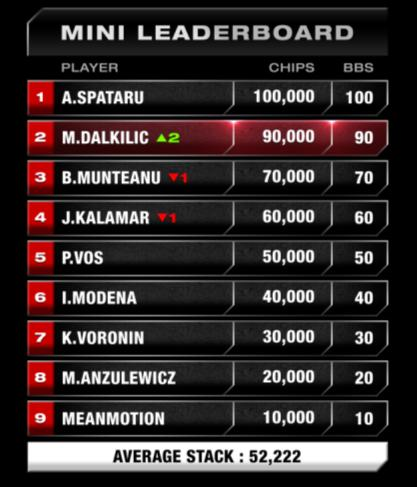
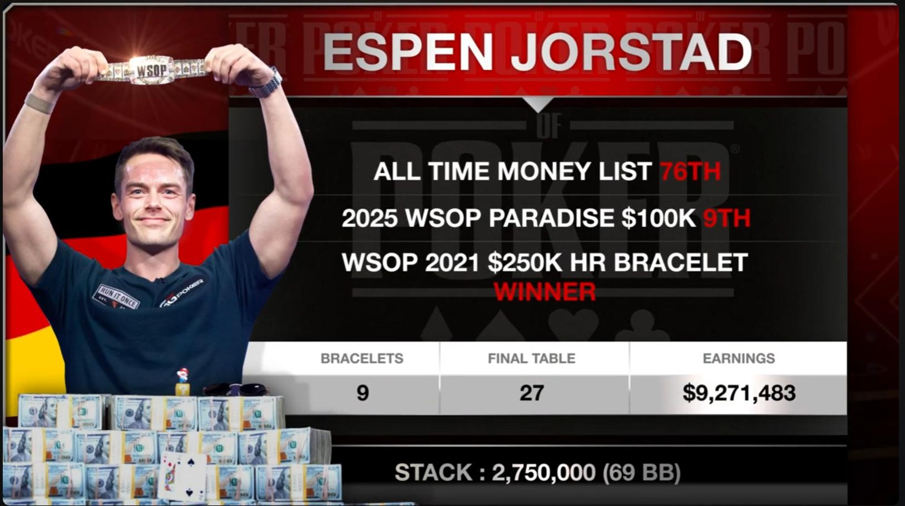
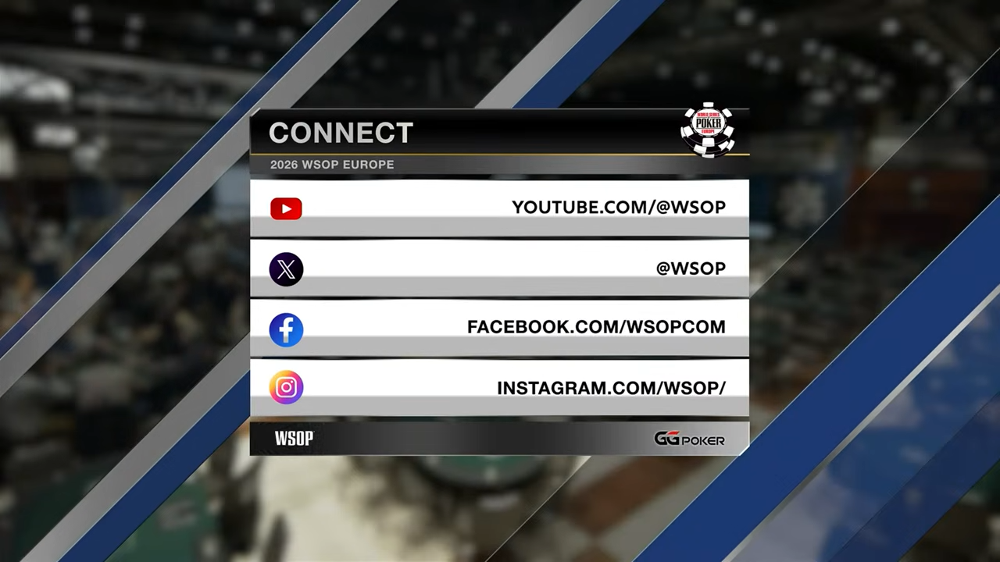
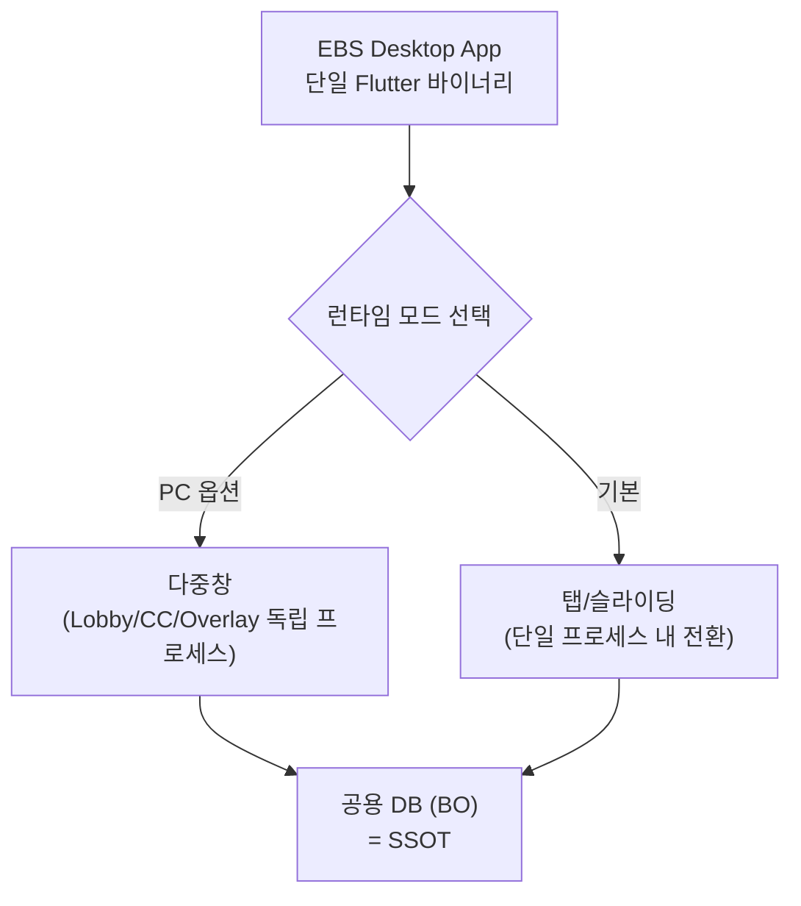
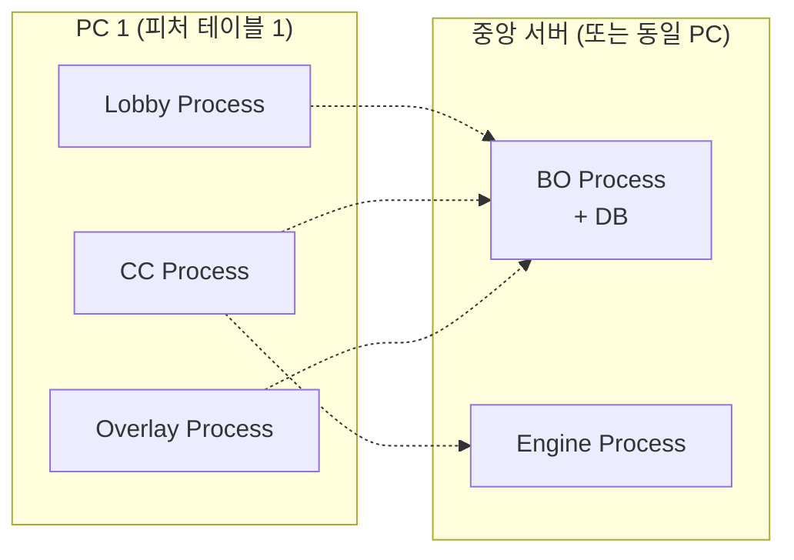
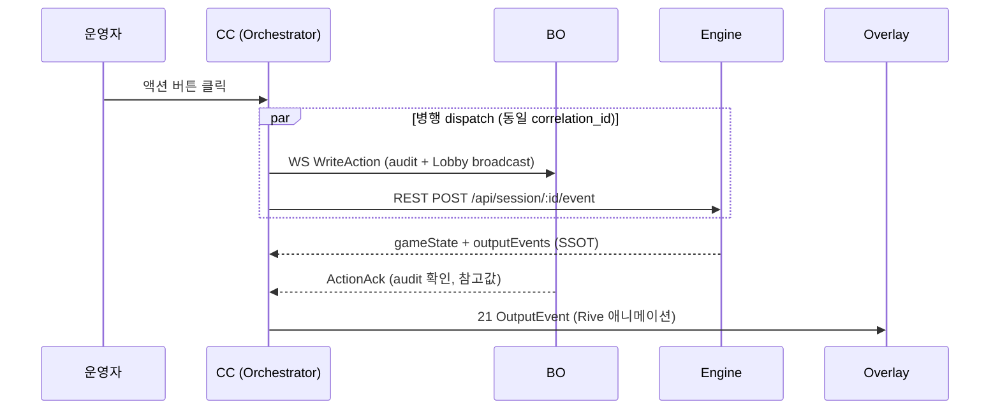
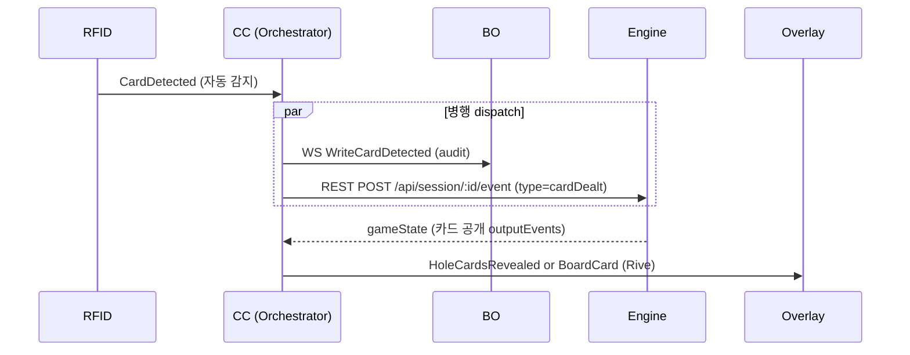
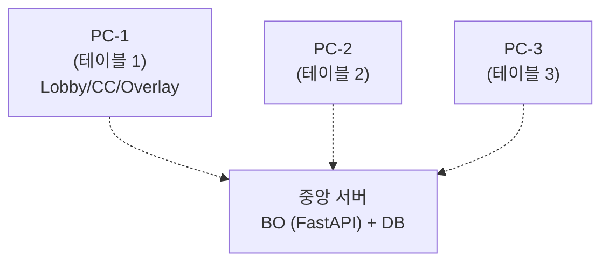

#### Part I — Concept: EBS는 무엇인가? (What it is)

* **Ch.1 숨겨진 패를 보여주는 마법**

    * 포커 방송의 본질: 정보 비대칭성 극복 (축구 중계와의 차이점)
    * EBS의 미션: 테이블 위의 상황을 0.1초 만에 방송 화면으로 번역하기
    
* **Ch.2 결과물: 시청자가 보는 화면 해부**

    * 실제 방송 화면(오버레이) 분석: 승률, 카드, 팟 카운터 등 EBS가 실시간으로 그리는 8가지 요소
    * (명확한 선긋기) EBS가 그리지 않는 그래픽(후편집 자막 등)과의 차이
    
* **Ch.3 무대 위와 뒤: EBS가 활약하는 공간**

    * 전체 방송 파이프라인 중 EBS의 영역 (현장 프로덕션 Section A)
    

#### Part II — Deliverables: 우리는 무엇을 개발하는가? (What to build)

* **Ch.4 개발 대상 오버뷰: 6개의 퍼즐 조각, 4개의 설치 단위**

    * 시스템을 구성하는 6 기능 구성요소 + **2 렌즈** (기능 / 설치) — 개발팀 오독 방지용 매핑 (§4.4, 2026-04-22 신설)
    
* **Ch.5 사용자가 만지는 것 (Front-end & Control)**

    * **하나의 앱, 두 런타임 모드 (§5.0, 2026-04-22 신설):** 탭/슬라이딩 단일 프로세스 (기본) / 다중창 독립 프로세스 (PC 옵션)
    * **관제탑 (Lobby & Settings):** 전체 테이블 상태 모니터링 및 대회 룰 설정
    * **스킨 허브 (Rive Manager, §5.3, 2026-04-22 D3 신설):** 아트 디자이너가 제작한 `.riv` 파일 업로드 · 검증 · 활성화 (Lobby Web 내부, 별도 앱 아님)
    * **조종석 (Command Center):** 딜러가 매 순간 액션을 입력하는 실시간 조작반
    
* **Ch.6 눈에 보이지 않는 두뇌와 뼈대 (Back-end & Engine)**

    * **두뇌 (Game Engine):** 승률을 계산하고 승패를 판정하는 규칙 엔진 (22개 포커 게임의 통합)
    * **뼈대 (Backend / BO):** 데이터 동기화, 통계 저장, API 제공 등 시스템의 코어
    * **프로세스 모델 & 실시간 동기화 (§6.3-6.4, 2026-04-22 보강):** 독립 OS 프로세스 경계 + DB SSOT + WebSocket push
    
* **Ch.7 눈에 보이는 출력물 (Render & Hardware)**

    * **화면 출력 (Overlay View):** 엔진의 데이터를 받아 실시간 방송 그래픽(Rive 애니메이션)으로 렌더링 후 송출(SDI/NDI). **배경 투명/단색 config flag** (2026-04-22 명시)
    * **하드웨어 (RFID 통합):** 카드를 읽어들이는 센서와 EBS 소프트웨어 간의 통신 규약 (Mock HAL 포함)
    

#### Part III — Operations & Roadmap: 어떻게 운영되고 어디로 가는가? (Future)

* **Ch.8 현장의 하루: 준비부터 송출까지**

    * 운영자의 시선으로 보는 체크리스트와 핸드 반복 루프
    * 장애 발생 시 대처 시나리오
    * **복수 테이블 운영: 1 PC = 1 피처 테이블 (§8.5, 2026-04-22 신설):** N PC + 중앙 서버(BO+DB) 아키텍처
    
* **Ch.9 왜 이 고생을 하는가: 비전과 전략**

    * 상용 솔루션(PokerGFX) 대비 자체 개발의 전략적 가치
    * 방송 AI 무인화까지 이어지는 5단계 마일스톤
    

---

### Ch.1 — 숨겨진 패를 보여주는 마법

이 시스템이 왜 존재하는지 이해하려면, 먼저 일반적인 스포츠 중계와 포커 중계의 결정적인 차이를 알아야 합니다.

#### 1.1 포커 방송의 딜레마: 보이지 않는 것을 중계하라

축구 중계에서 점수판을 띄우는 일은 상대적으로 쉽습니다. 공의 위치와 점수는 경기장의 모두가 볼 수 있는 **'공개 정보'**이기 때문입니다. 방송 스태프는 눈에 보이는 정보를 화면에 예쁘게 정리해서 띄우기만 하면 됩니다.

하지만 포커는 완전히 다릅니다. 시청자가 가장 궁금해하는 핵심 정보인 **'플레이어의 카드'가 뒤집혀 있습니다**. 카메라에 찍히지도 않고, 심지어 방송 스태프조차 그 카드가 무엇인지 모릅니다.

| **구분** | **축구 중계** | **포커 중계** |
| --- | --- | --- |
| **핵심 정보** | 공개 (점수, 공 위치) | **비공개** (카드가 뒤집혀 있음) |
| **방송 그래픽의 역할** | 눈에 보이는 정보를 **정리**하여 표시 | 보이지 않는 정보를 **생성**하여 표시 |

이 정보의 비대칭성을 해결하고, 뒤집힌 카드를 방송 화면에 띄우는 것. **이것이 우리가 EBS를 개발하는 궁극적인 이유입니다.**

#### 1.2 시청자에게 전달해야 할 3가지 핵심 데이터

그렇다면 방송 화면을 통해 시청자에게 구체적으로 무엇을 전달해야 할까요? 포커의 기본 흐름에 따라 다음 3가지 데이터를 반드시 실시간으로 추적해야 합니다.

1. **홀카드:** 플레이어 각자만 볼 수 있게 뒤집어서 받는 개인 카드입니다. 방송에서는 이를 시청자에게만 몰래 보여주어야 합니다.

2. **커뮤니티 카드:** 테이블 중앙에 놓여 모두가 공유하는 카드입니다. 플레이어는 자신의 홀카드 2장과 공유 카드 5장을 합친 총 7장 중, 가장 강력한 5장의 조합을 만들어 승부를 냅니다.

3. **베팅 액션:** 카드가 공개될 때마다 플레이어들은 베팅을 진행합니다. 상대방과 같은 금액을 거는 콜, 판돈을 키우는 레이즈, 게임을 포기하는 폴드 등 세 가지 선택지가 존재합니다.

#### 1.3 마법의 비밀: 유리판에서 전자 인식으로

과거에는 이 숨겨진 카드를 보여주기 위해 무식한 물리적 방법을 썼습니다. 1999년 처음 도입된 1세대 방송에서는 테이블 테두리에 투명한 유리판을 파고 그 밑에 카메라를 설치했습니다. 플레이어가 카드를 유리판 위에 정확히 올려두어야만 방송에 나갈 수 있었습니다.

지금 우리가 구축하려는 것은 **2세대 RFID 기술**입니다.

52장의 포커 카드 한 장 한 장마다 전파로 읽을 수 있는 아주 작은 RFID 태그가 내장되어 있습니다. 플레이어가 테이블 천 위에 카드를 내려놓는 순간, 테이블 아래 매립된 안테나가 이를 감지합니다. 플레이어가 아무런 추가 행동을 하지 않아도, 안테나의 위치와 태그 코드를 통해 **"어느 좌석에 어떤 카드가 놓였는지"**가 즉시 파악됩니다.

#### 1.4 EBS 미션 선언문: 0.1초의 번역가

센서가 읽어 들인 카드 정보, 딜러가 입력한 베팅 액션, 그리고 복잡한 포커 규칙이 만나 **"누가 이길 확률이 가장 높은가?"**가 결정됩니다.

EBS의 미션은 명확합니다. 테이블 위에서 일어나는 이 모든 물리적 상황과 아날로그 데이터를 수집하여, **100ms 이내에 시청자가 직관적으로 이해할 수 있는 방송 그래픽으로 번역해 송출**하는 것입니다.

### Ch.2 — 결과물: 시청자가 보는 화면 해부

EBS가 무엇을 만드는 시스템인지 가장 직관적으로 이해하는 방법은 최종 결과물인 방송 화면을 뜯어보는 것입니다. 화면에 보이는 수많은 정보 그래픽(오버레이) 중, 어떤 것이 우리의 몫이고 어떤 것이 아닌지 명확한 선을 그어야 합니다.

#### 2.1 화면 위 8개의 퍼즐 조각 (EBS가 그리는 영역)

EBS는 카메라 원본 영상 위에 실시간으로 포커 데이터를 덧그립니다. 현장에서 발생하는 물리적 상황을 즉시 반영하여 화면에 띄우는 **8가지 핵심 그래픽**이 바로 우리가 직접 생성해야 할 결과물입니다.

1. **홀카드 표시:** 센서가 카드를 감지하는 즉시 플레이어별 비공개 카드를 화면에 띄웁니다.
2. **커뮤니티 카드:** 테이블 중앙에 공개되는 보드 카드를 인식하여 표시합니다.
3. **액션 배지:** 운영자가 조작반에 입력한 내용에 따라 콜, 레이즈, 폴드 상태를 색상 배지로 띄웁니다.
4. **팟 카운터:** 누적된 전체 베팅 금액을 자동으로 계산하여 중앙에 표시합니다.
5. **승률 바:** 카드가 공개되거나 변경될 때마다 각 플레이어의 실시간 승리 확률을 계산해 막대그래프로 보여줍니다.
6. **아웃츠:** 현재 상황에서 특정 플레이어에게 유리한 카드가 덱에 몇 장 남았는지 실시간으로 계산해 줍니다.
7. **플레이어 정보:** 대회 공식 API를 수신하여 선수 이름, 보유 칩, 사진 등을 표시합니다.
8. **플레이어 위치:** 각 좌석의 딜러 버튼 위치나 순서를 표시합니다.

#### 2.2 명확한 선 긋기: 우리가 만들지 않는 것

화면에는 위 8가지 외에도 리더보드, 선수 프로필, 탈락 위기 경고, 자막 등 화려한 그래픽이 많습니다. **하지만 이것들은 EBS가 만들지 않습니다.**

이 구분을 명확히 하지 않으면 "선수별 성향 통계 지표도 우리가 실시간으로 구현해야 하나?"라는 심각한 개발 범위 오해가 발생합니다. 화면에 보이는 그래픽은 사실 만들어지는 시간과 장소가 완전히 다릅니다.

* **실시간 오버레이 (EBS의 영역):** 카드가 놓이는 바로 그 순간, 라스베이거스 현장 시스템이 자동으로 즉시 생성합니다.
* **후편집 그래픽 (프로덕션 팀의 영역):** 핸드가 종료된 후 1~2시간 뒤, 서울의 편집 스튜디오에서 방송 프로듀서가 수동으로 판단하여 삽입하는 화면들입니다. 통계 차트나 리더보드가 여기에 속합니다. EBS는 이 작업을 위해 데이터 원문(JSON)만 넘겨줄 뿐, 그래픽 자체를 렌더링하지 않습니다.

* **사전 제작 프레임워크:** 대회 로고, 상시 자막 틀, 화면 전환 효과 등은 방송 전 디자인 팀이 미리 만들어둔 고정 틀입니다. 이 역시 EBS와 무관합니다.

#### 2.3 EBS의 세 가지 절대 조건

따라서 어떤 기능을 개발해야 하는지 논의할 때, 다음 세 가지 조건을 동시에 만족하는지 항상 확인해야 합니다.

* **시간:** 1초의 지연도 없는 '실시간'인가?
* **장소:** 네트워크를 거치지 않고 '현장'에서 처리되는가?
* **데이터 소스:** '센서'나 '현장 조작반'에서 발생한 데이터인가?

이 세 가지를 모두 충족하는 8종의 실시간 정보만이 EBS가 책임져야 할 온전한 개발 대상입니다.

### Ch.3 — 무대 위와 뒤: EBS가 활약하는 공간

앞서 화면의 결과물을 확인했다면, 이제 이 시스템이 물리적으로 어디에 설치되어 어떻게 세상과 연결되는지 거시적인 지도를 그려볼 차례입니다. 포커 테이블에서 벌어진 사건이 유튜브 시청자에게 도달하기까지는 총 4개의 큰 구간을 거칩니다. EBS가 활약하는 무대는 이 중 첫 번째 구간에 완벽하게 집중되어 있습니다.

#### 3.1 방송 송출의 4단계 릴레이

방송 파이프라인은 라스베이거스 현장에서 시작해 서울의 스튜디오를 거쳐 전 세계 시청자에게 뻗어나갑니다.

1. **A구간 (현장 송출):** 포커가 열리는 라스베이거스나 유럽 현장입니다. 카메라 촬영과 실시간 그래픽 합성이 이루어집니다. **여기가 바로 EBS가 설치되고 운영되는 유일한 공간입니다**.
2. **B구간 (클라우드 전송):** 현장에서 완성된 영상이 무선 송출 장비를 통해 클라우드로 전송되어 전 세계로 분배되는 단계입니다.
3. **C구간 (후편집):** 서울의 편집 스튜디오입니다. 현장에서 받은 라이브 영상을 1시간 단위로 잘라 재미있는 핵심 장면만 선별하고, 앞서 2장에서 언급한 화려한 통계 그래픽을 수동으로 덧입힙니다.
4. **최종 구간 (유튜브/WSOP TV 송출):** 최종 편집된 영상은 (1) 유튜브를 통해 무료로 송출되거나, (2) WSOP TV를 통해 유료로 송출되는 두 가지 방식으로 대중에게 전달됩니다.

#### 3.2 현장 프로덕션: 카메라에서 송출기까지

EBS가 독점적으로 활약하는 A구간의 내부를 조금 더 확대해 보겠습니다. 현장에서는 물리적인 장비들이 사슬처럼 엮여 있습니다.

카메라가 테이블을 촬영하면, 영상 전환기가 여러 카메라의 앵글을 골라냅니다. 바로 이때 **EBS가 투명한 배경 위에 실시간으로 생성한 정보 그래픽을 카메라 원본 영상 위에 덮어씌웁니다**. 이렇게 합성이 완료된 최종 방송 영상은 송출 장비를 타고 클라우드로 쏘아 올려집니다.

#### 3.3 보이지 않는 역할: 데이터 공급자

EBS의 주 임무는 현장 화면 합성(A구간)이지만, 무대 뒤에서 서울 편집팀(C구간)을 돕는 중요한 조력자 역할도 수행합니다.

게임이 한 판 끝날 때마다 EBS는 카드, 베팅 기록, 승자 등 모든 결과를 구조화된 JSON 데이터 형태로 묶어 전송합니다. 서울의 방송 프로듀서들은 이 데이터를 바탕으로 어떤 장면이 극적인지 파악하고, 후편집 그래픽을 제작하는 데 활용합니다.

#### 3.4 1시간의 시간 여행

흥미로운 점은 지연 시간입니다. EBS가 카드를 읽고 그래픽을 씌우는 데 걸리는 시간은 **0.1초 미만**으로 사실상 즉시 처리됩니다. 하지만 시청자가 유튜브에서 그 장면을 보는 것은 실제 경기 시간보다 약 **1시간에서 2시간 뒤**입니다.

왜일까요? 서울에서 영상을 자르고 평가하여 수동으로 그래픽을 덧입히는 후편집(C구간) 과정에서 대부분의 지연이 발생하기 때문입니다. 즉, EBS는 극강의 실시간 시스템이지만, 방송 생태계의 편집 파이프라인 특성상 대중에게는 자연스러운 시간차를 두고 공개됩니다.

### Ch.4 — 개발 대상 오버뷰: 6개의 퍼즐 조각, 4개 SW + 1 HW 설치 단위 (γ)

앞서 1부에서 EBS가 무엇을 위해 존재하고 어떤 결과물을 내는지 확인했습니다. 그렇다면 이 마법 같은 시스템을 현실로 만들기 위해 우리는 구체적으로 무엇을 코딩하고 조립해야 할까요?

EBS는 "마우스로 더블 클릭해서 실행하는 프로그램 하나" 가 아닙니다. 서로 다른 역할을 맡은 **여섯 개 기능 구성요소**가 톱니바퀴처럼 맞물려 돌아가는 시스템입니다. 다만 이 여섯 개가 각각 별도 프로그램으로 설치되는 것은 아닙니다 — **설치 관점으로는 소프트웨어 4종 + 하드웨어 1종** (γ 하이브리드 2026-04-22: Lobby Web 배포 + CC/Overlay Desktop 배포) 입니다.

이 장에서는 **"기능 렌즈"** 를 먼저 씁니다. 시스템이 어떤 역할들로 구성되는가를 6개 조각으로 봅니다. 조각들을 실제로 어떻게 포장해 설치하는가 (**"설치 렌즈"**) 는 §4.4 에서 표로 정리하고, §5.0 에서 런타임 모드와 함께 풀어냅니다.

전체 시스템은 세 가지 그룹(**조작부 · 두뇌부 · 출력부**)으로 자연스럽게 묶입니다.

#### 4.1 조작부: 사용자가 만지는 화면

방송 스태프와 딜러가 시스템을 제어하기 위해 직접 눈으로 보고 터치하는 프론트엔드 영역입니다.

1. **로비:** 모든 테이블의 상태를 한눈에 내려다보는 관제탑 화면입니다. 참가 선수 명단을 등록하고, 어떤 포커 규칙을 적용할지 설정하며, 방송 그래픽의 전반적인 설정을 통제하는 관리자 전용 공간입니다. 로비 내부에는 **Rive Manager** (아트 디자이너가 제작한 스킨 파일의 업로드·검증·활성화 허브, §5.3) 도 포함됩니다 — 별도 앱이 아니라 로비의 하위 도구입니다.
2. **커맨드 센터:** 테이블마다 하나씩 띄워놓고 딜러나 운영자가 매 순간 베팅 액션을 입력하는 실시간 조작반 애플리케이션입니다. 콜, 레이즈, 폴드 같은 8개의 버튼이 직관적으로 배치되어 있으며, 진행 요원은 방송 내내 이 화면에 집중하게 됩니다.

#### 4.2 두뇌부: 눈에 보이지 않는 엔진과 뼈대

화면 뒤에서 수많은 데이터를 동기화하고, 복잡한 확률을 계산하는 백엔드 코어 영역입니다.

3. **게임 엔진:** 시스템의 심장입니다. 텍사스 홀덤을 비롯한 22가지 종류의 복잡한 포커 규칙을 이해하고, 현재 테이블에 깔린 카드를 바탕으로 각 선수의 실시간 승률을 계산해 냅니다.
4. **백오피스 서버:** 외부의 대회 공식 데이터베이스와 통신하여 선수 정보를 가져오고, 각 테이블에서 발생하는 모든 게임 기록을 저장하며, 각 시스템 컴포넌트 간의 데이터를 실시간으로 중계하는 뼈대 역할을 합니다.

#### 4.3 출력부와 입력부: 현실 세계와의 연결

물리적인 카드를 디지털 정보로 읽어 들이고, 완성된 디지털 정보를 다시 방송 화면으로 뿜어내는 경계 영역입니다.

5. **오버레이 뷰:** 게임 엔진이 계산해 낸 결과값을 받아 화려한 애니메이션 그래픽으로 렌더링하는 화면입니다. 만들어진 그래픽은 방송국의 표준 송출 규격인 SDI나 NDI를 통해 최종 출력됩니다.
6. **카드 인식 하드웨어:** 테이블 천 아래에 매립되어 전파를 쏘는 12개의 안테나와 전자 기판입니다. 칩이 내장된 카드를 0.1초 만에 감지하여 컴퓨터가 이해할 수 있는 데이터로 변환해 주는 물리적 장비입니다.

우리가 개발해야 할 대상은 바로 이 **여섯 개 기능 조각** 이며, 이들을 실제로 포장한 **네 개 설치 단위** 입니다. 아래 §4.4 에서 두 렌즈의 대응표를 본 뒤, 다음 장부터 각 조각의 구조와 기능을 그룹별로 해부해 보겠습니다.

#### 4.4 두 렌즈 한눈에: 기능 6 → 설치 4 (2026-04-22 신설)

위 여섯 조각은 **기능** 을 설명한 것이고, 실제 코드 저장소와 설치 단위는 다음과 같이 묶입니다:

| 설치 단위 | 포함 기능 | 언어/스택 | 배포 타겟 | 프로세스 모델 |
|-----------|-----------|-----------|-----------|--------------|
| **EBS Lobby Web** | 로비 + 세팅 + **Rive Manager** (구 Graphic Editor, D3 2026-04-22 축소) | Flutter Web + Rive | **Web (Docker nginx)** 정규 · Desktop 은 개발 디버깅 | 브라우저 멀티 클라이언트 (LAN) |
| **EBS Desktop App** (CC) | 커맨드 센터 + 오버레이 뷰 | Flutter Desktop + Dart + Rive | **Desktop** (RFID serial + SDI/NDI 직결) | §5.0 2 런타임 모드 (탭/슬라이딩 또는 다중창) |
| **Game Engine** | 게임 엔진 | Pure Dart | 별도 서비스 (Docker 또는 `dart run`) | 독립 프로세스 |
| **Backend Server (BO)** | 백오피스 서버 | FastAPI + SQLite/PostgreSQL | 별도 서비스 | 독립 프로세스 |
| **RFID Hardware** | 카드 인식 하드웨어 | ST25R3911B + ESP32 | 물리 장비 | USB 연결 |

즉 **기능 6개 ↔ 설치 4 소프트웨어 + 1 하드웨어** (γ 하이브리드, 2026-04-22 team1 PR#11-14 확정 — 원래 "설치 3 SW + 1 HW" 에서 Lobby 배포 타겟이 Web 으로 갈라지며 재분류).

**개발팀 주의 (혼란 방지 노트)**:

- **팀 분할은 기능 단위** — team1(로비/세팅/Rive Manager), team2(BO), team3(게임 엔진), team4(커맨드 센터/오버레이). 팀 수 ≠ 설치 단위 수.
- **같은 Flutter 스택 공유, 배포 타겟만 갈라짐** — Lobby 는 Web, CC/Overlay 는 Desktop. 공통 Dart 코드(`ebs_common`) 는 양쪽에서 재사용.
- **빌드 산출물**: team4 는 `EBS Desktop App` (CC + Overlay) 공동 소유. team1 은 `EBS Lobby Web` 단독 소유.
- 상세 소유권 규칙은 `docs/2. Development/2.5 Shared/team-policy.json` 을 참조하십시오.

### Ch.5 — 사용자가 만지는 것: 관제탑과 조종석

현장의 스태프들이 시스템을 조작하기 위해 마주하는 프론트엔드 화면은 크게 네 가지로 나뉩니다. 전체 상황을 지휘하는 **로비**, 시스템 규칙을 통제하는 **세팅**, 방송 스킨을 업로드·활성화하는 **Rive Manager** (D3 2026-04-22 신설, §5.3), 그리고 쉴 새 없이 버튼을 눌러야 하는 **커맨드 센터**입니다.

#### 5.0 하나의 앱, 두 런타임 모드 (2026-04-22 신설)

EBS 는 단일 Flutter Desktop 바이너리로 배포되지만, 운영 환경에 따라 **두 가지 런타임 모드** 중 하나로 동작합니다. 방송 스태프가 Lobby Settings 에서 선택합니다.

> 프로세스 분포 전체도 (BO + Engine 포함) 는 §6.3.0 참조.

| 모드 | 용도 | 프로세스 모델 |
|------|------|-------------|
| **탭/슬라이딩 (기본)** | 소형 화면, 단일 운영자 환경, 향후 태블릿 폼팩터 대비 | 단일 Flutter 프로세스 내 Lobby/CC/Overlay 라우팅 |
| **다중창 (PC 옵션)** | Desktop 멀티 모니터, 운영자 역할 분리 환경 | Lobby/CC/Overlay 각각 독립 OS 프로세스 |

**D5 (DB SSOT) 적용 범위**: 모드별 차이 상세는 §6.4 실시간 동기화 참조.

**구현 세부** (multi-window plugin 선택, 프로세스 spawn 방식) 는 team1 세션 (Wave 2 R02) 이 `docs/2. Development/2.1 Frontend/` 에 별도 명세합니다. 본 장은 개념만 선언합니다.

#### 5.1 관제탑: 로비

Flutter Desktop 애플리케이션으로 실행되는 중앙 관제 시스템입니다. 방송 준비 단계에서 주로 사용되며, 전체 시스템에 단 하나만 존재하여 모든 테이블의 상황을 내려다봅니다.

> **기술 스택 결정 (2026-04-21 SG-001) + γ 하이브리드 보정 (2026-04-22)**:
> Lobby/Settings/Graphic Editor/CC/Overlay 는 모두 **Flutter + Dart + Rive** 스택으로 통일. 근거: (1) Rive 런타임 일치로 GE 프리뷰 ≡ Overlay 송출 자동 보증, (2) 내부 앱 개발팀 즉시 생산성, (3) `ebs_common` Dart 패키지 재사용. 원칙 1 은 문서/용어 정렬이며 기술 스택은 EBS 자율.
>
> **배포 타겟 축 (2026-04-22 γ, team1 PR#11-14)**:
> - **Lobby / Settings / Graphic Editor** — **Flutter Web** 정규 배포 (Docker nginx, LAN 다중 클라이언트). Desktop 빌드는 개발 디버깅 모드.
> - **Command Center / Overlay** — **Flutter Desktop** 설치 모델 (RFID 시리얼 접근 + SDI/NDI 송출 직결 필수).
>
> 같은 Flutter 스택을 공유하므로 `EBS Desktop App` 공동 바이너리 개념(§4.4)은 **Command Center + Overlay** 에 적용되며, Lobby 는 Web 배포로 갈라진다. 2 런타임 모드(§5.0)는 Desktop 설치물(CC + Overlay) 내부 선택지.

> **Lobby : CC = 1 : N** — Lobby 는 시스템당 하나, CC 는 테이블당 1 인스턴스. 복수 테이블 운영은 §8.5 참조.

* **구조:** 대회, 이벤트, 테이블로 이어지는 3단계 구조로 이루어져 있습니다.
* **주요 역할:** 전체 테이블 목록을 카드 형태로 확인하고 관리합니다. 또한 테이블에 종속되지 않는 독립적인 선수 명단 관리 기능을 제공합니다.
* **실행:** 특정 테이블 카드를 선택하여 실행 버튼을 누르면, 해당 테이블 전용 실시간 조작반인 커맨드 센터가 열립니다.

#### 5.2 글로벌 제어판: 세팅

로비 안에 숨겨져 있는 관리자 전용 설정 페이지입니다. 여기서 변경한 사항은 방송 중인 모든 테이블에 일괄적으로 똑같이 적용됩니다. 전체 시스템의 뼈대를 잡는 6가지 핵심 영역을 통제합니다.

| **영역** | **통제 내용** |
| --- | --- |
| **출력** | 송출 해상도 및 출력 방식 설정 |
| **그래픽** | 화면상 요소 배치 및 활성 스킨 선택 · 스킨 자체의 업로드/검증/활성화는 **Rive Manager** (§5.3) 하위 섹션에서 수행 |
| **디스플레이** | 통화 기호, 소수점 등 수치 표시 형식 지정 |
| **규칙** | 게임 종류 및 칩 배분 등 기본 룰 설정 |
| **통계** | 리더보드 및 승률 표시 여부 제어 |
| **환경 설정** | 시스템 진단 및 데이터 내보내기 관리 |

#### 5.3 스킨 허브: Rive Manager (2026-04-22 D3 신설)

방송 그래픽의 **룩앤필을 결정하는 스킨 파일 자체** 를 관리하는 허브입니다. 아트 디자이너가 외부 Rive Editor 로 제작한 `.riv` 파일(또는 `.gfskin` 컨테이너)을 Lobby Web 에 업로드하고 현장 방송에 활성화하기까지의 단일 경로를 담당합니다. **별도 앱이 아닌 Lobby Web 내부 섹션**(예: `/lobby/rive-manager` 또는 Settings · 그래픽 하위)이며, Admin 권한으로만 접근 가능합니다.

**2026-04-22 회의 결정 (D3)**: 기존 "사내 그래픽 에디터" 는 폐기되었습니다. 색상 · 폰트 · 애니메이션 duration 등 스킨의 모든 세부 속성은 **Rive 파일 안에 내장**되므로, Lobby 안에서 UI 로 메타데이터를 편집하는 단계는 존재하지 않습니다. 아트 디자이너가 외부에서 수정한 뒤 재업로드하는 방식입니다.

**Rive Manager 의 4 역할**:

| 역할 | 내용 |
|------|------|
| **Import (업로드)** | `.riv` 또는 `.gfskin` 파일 선택 → 구조/파싱 가능성 자동 검증 |
| **Validate (검증)** | 필수 데이터 슬롯(선수 이름 바인딩, 카드 트리거 등) 존재 여부 확인 |
| **Preview (프리뷰)** | Rive 런타임으로 즉시 렌더. **Overlay 송출과 동일한 `.riv` 바이너리** 가 쓰이므로 프리뷰 ≡ 실제 방송 화면. |
| **Activate (활성화)** | 선택한 스킨을 시스템 기본 활성 스킨으로 전환. 해당 순간부터 모든 Overlay 가 새 스킨을 송출 (멀티 CC 동시 반영). |

> **별도 앱이 아님**: Rive Manager 는 Lobby Web 내부 섹션입니다. 아트 디자이너용 편집 IDE 가 아닙니다 (편집은 외부 Rive Editor 의 몫).

> **Overlay 와의 관계**: Rive Manager 에서 활성화한 `.riv` 파일을 Overlay 런타임이 그대로 소비합니다. 오버레이가 실시간으로 데이터를 채워 넣는 "그릇" 이 Rive Manager 가 관리하는 파일입니다. 상세 소비 경로는 §7.1 참조.

> **비-그래픽 데이터 (다국어 텍스트 / 통화 기호 / 숫자 포맷)**: Rive 파일에 담기 어렵습니다. 이 항목은 §5.2 세팅의 **디스플레이 / 통계** 영역에서 별도로 통제됩니다 (Rive Manager 범위 밖).

상세 스펙 진화 (컨테이너 포맷 α/β/γ, Rive 내장 범위, UI 최소 명세) 는 후속 논의: `docs/4. Operations/Conductor_Backlog/B-209-ge-d3-meeting-decision.md`.

#### 5.4 실시간 조종석: 커맨드 센터

본방송이 시작되면 운영자의 시선이 85% 이상 머무는 가장 중요한 조작 화면입니다. 중앙 관제탑인 로비와 달리, 경기가 벌어지는 물리적 테이블 1개당 1개씩 독립적으로 실행됩니다.

* **시각적 구성:** 화면 중앙에 타원형 포커 테이블과 10개의 좌석이 직관적으로 그려져 있습니다.
* **조작 버튼:** 화면 하단에 핸드 시작, 카드 배분, 콜, 레이즈, 폴드 등 게임 진행 상황에 맞춘 8개의 큼직한 액션 버튼이 배치되어 있습니다.
* **역할:** 센서가 미처 읽지 못하는 플레이어의 베팅 의사를 딜러나 현장 스태프가 이 화면을 통해 시스템에 실시간으로 주입합니다.

#### 5.5 접근 권한의 분리

누가 어떤 화면을 만질 수 있는지는 엄격하게 통제됩니다.

* **관리자:** 시스템 전체 권한을 가집니다. 로비에서 모든 테이블을 내려다보고, 세팅에서 규칙을 뜯어고치며, 필요시 커맨드 센터도 직접 조작할 수 있습니다.
* **운영자:** 본방송 중 딜러와 의사소통하며 실제 액션을 입력하는 실무자입니다. 자신에게 할당된 1개의 커맨드 센터만 열어볼 수 있으며, 로비의 설정이나 다른 테이블에는 접근할 수 없습니다.
* **열람자:** 화면을 볼 수만 있고 어떠한 조작도 할 수 없는 읽기 전용 권한입니다.

### Ch.6 — 눈에 보이지 않는 두뇌와 뼈대

앞서 살펴본 화면들이 스태프의 입력을 받는 '피부'라면, 지금부터 살펴볼 두 요소는 입력받은 정보를 바탕으로 생각하고 생명력을 불어넣는 시스템의 '두뇌'와 '뼈대'입니다.

#### 6.1 시스템의 두뇌: 게임 엔진

입력받은 카드의 가치를 판단하고 승패를 가르는 핵심 연산 장치입니다. 카드가 인식되거나 액션이 입력되면, 엔진은 즉각적으로 현재 상황을 분석하여 각 선수가 이길 확률을 실시간으로 계산해 냅니다.

특히 이 두뇌는 매우 똑똒해야 합니다. 단순히 텍사스 홀덤 한 가지 게임만 처리하는 것이 아닙니다. 대회에서 채택하는 공식 종목 12개를 포함하여, 총 22가지에 달하는 방대한 포커 변형 규칙을 단 하나의 엔진으로 모두 소화해야 합니다.

이 복잡한 22개의 게임은 규칙의 형태에 따라 크게 세 가지 계열로 분류되어 엔진 내부에서 처리됩니다.

* 공유 카드가 존재하는 계열 (12종)
* 카드를 교환할 수 있는 계열 (7종)
* 개인 카드의 일부를 공개하는 계열 (3종)

연산이 끝난 엔진은 화면을 그리는 부서로 작업 지시를 내립니다. 판돈 변동, 승률 업데이트, 승자 결정 등 총 21가지 형태의 이벤트 신호(OutputEvent 카탈로그)를 발행하여 적절한 애니메이션이 터질 수 있도록 유도합니다. *(2026-04-15 실측 정정: 초기 설계 18종 → 실제 21종)*

#### 6.2 시스템의 뼈대: 백엔드 서버

프론트엔드 화면과 게임 엔진 사이에서 데이터를 안전하게 중계하고 보관하는 중앙 서버입니다. 이 뼈대가 수행하는 핵심 임무는 세 가지입니다.

1. **외부 데이터 동기화:** 대회 공식 시스템과 통신하여 전체 일정, 블라인드 구조, 선수 정보 등을 주기적으로 수신해 내부 데이터베이스에 쌓아둡니다. 만약 공식망과의 통신이 끊어지더라도, 백엔드 서버가 내부 데이터를 바탕으로 독립적인 단독 운영을 유지하도록 설계되어 있습니다.
2. **권한 검증:** 인증을 수행하고 시스템 접근을 통제합니다. 앞서 5장에서 나눈 관리자, 운영자, 열람자의 역할에 맞게 화면과 기능의 접근 권한을 철저히 제어합니다.
3. **데이터 보관소:** 게임 한 판이 종료될 때마다 사용된 카드, 액션 내역, 최종 판돈 분배 결과 등 모든 데이터를 문서 파일 형태로 묶어 저장합니다. 이렇게 저장된 데이터는 추후 서울의 후편집 스튜디오에서 방송용 통계 그래픽을 덧입히기 위한 핵심 재료로 제공됩니다.

#### 6.3 퍼즐 조각들은 어떻게 연결되는가 (SG-005, 2026-04-20 / 프로세스 모델 2026-04-22 보강)

**프로세스 경계 (2026-04-22 신설)** — 다중창 모드에서 각 앱은 별도 OS 프로세스입니다.

- **다중창 모드** — Lobby / CC / Overlay 가 **독립 OS 프로세스**. 한 프로세스 crash 시 다른 프로세스 생존
- **탭 모드** — 단일 Flutter 프로세스. 프로세스 격리 없음, 단일 crash 지점
- **공통 원칙** — 앱 간 **직접 IPC 없음**. 모든 통신은 BO 경유 (DB commit + WS broadcast)
- **중앙 서버 배치** — §8.5 복수 테이블 시 BO+DB 는 별도 서버. 단일 PC 운영 시 동일 PC 내 프로세스 공존

6개 조각 사이 실제 통신 경로와 소유권을 아래 **통신 매트릭스** 로 정리합니다. 시각적 프로세스 경계는 위 §6.3.0 을 참조하십시오.

**통신 매트릭스**:

| From → To | 방식 | 용도 |
|-----------|------|------|
| Lobby → BO | REST | 동기 CRUD (API-01) |
| Lobby ← BO | WS `ws/lobby` | 모니터 전용 (API-05) |
| CC ↔ BO | WS `ws/cc` | 양방향 명령·이벤트 (API-05) |
| CC → Engine | REST | stateless query (SG-002 Option A) |
| Lobby ↔ CC | — | **직접 연결 금지** — BO DB 통한 간접 공유만 |

**Engine 배포 방식**: 별도 프로세스 (Docker container 또는 `dart run bin/harness.dart`). In-process 패키지 import (Option B) 는 비채택 — 바이너리 호환 복잡도 + 엔진 업데이트 시 CC 재빌드 강제 + 로그/오류 격리 약화.

**ENGINE_URL 환경변수**: `--dart-define=ENGINE_URL=http://host:port` (기본 `http://localhost:8080`) — team1 `EBS_BO_HOST` 패턴과 통일. 엔진 미기동 시 **Demo Mode fallback** (SG-002 3-stage 상태 머신).

**시퀀스 예시 (병행 dispatch, 2 시나리오)** — CC 는 Orchestrator 로서 BO/Engine **병렬 호출**. 상세: `docs/2. Development/2.4 Command Center/Command_Center_UI/Overview.md §1.1.1`.

**시나리오 A — 운영자 액션 (FOLD/BET/RAISE)**:

**시나리오 B — RFID 카드 감지 (자동 입력)**:

- **Engine 응답이 게임 상태 SSOT**, BO ack 는 audit 참고값
- BO 실패 시 warn-only (게임 진행 계속, §1.1.1 실패 매트릭스)

상세: `docs/4. Operations/Conductor_Backlog/SG-005-foundation-ch6-system-connections.md`

#### 6.4 실시간 상태 동기화 (2026-04-22 신설, SG-002 해소)

각 프로세스가 독립이라면 상태 일관성은 어떻게 유지할까요? EBS 는 **DB 를 단일 진실**로 두고, 두 가지 채널로 동기화를 수행합니다.

| 채널 | 용도 | 지연 |
|------|------|:----:|
| DB polling | 복구/재진입 시 baseline | 1-5초 |
| WebSocket push (`/ws/lobby`, `/ws/cc`) | 실시간 상태 변경 알림 | < 100ms |

**정책**:

- **쓰기** — 모든 상태 변경은 BO 가 DB 에 commit 후 WS 로 broadcast
- **읽기** — 프로세스 시작 시 DB snapshot 로드, 이후 WS push 로 델타 적용
- **crash 복구** — 프로세스 재시작 시 DB snapshot 재로드 (이전 상태 복원)
- **Engine SSOT** — 게임 상태(hands/cards/pots)는 Engine 응답이 최종 SSOT. BO WS 는 audit 용 참고값 (§6.3 §1.1.1 실패 매트릭스 참조)

**적용 모드별 차이** (§5.0 2 런타임 모드와 연동):

- **다중창 모드** — 위 2 채널 모두 활용 (프로세스 간 상태 공유 SSOT)
- **탭 모드** — in-memory state 1차. DB 는 재시작 복구용

**ENGINE_URL 표준**: `--dart-define=ENGINE_URL=http://host:port` (기본 `http://localhost:8080`).
**Engine 미기동 시**: CC 는 **Demo Mode fallback** 3-stage 상태 머신 (SG-002 해소).

> **⚠ 정책 선언 레벨** — 본 §6.4 는 상위 개념 계약만 정의합니다. DB polling endpoint 실제 스키마·WS push payload 상세 는 team2 가 Wave 2 에서 `docs/2. Development/2.2 Backend/APIs/` 에 발행합니다. Foundation 은 당위, team2 는 실현.

### Ch.7 — 눈에 보이는 출력물과 입력 센서

시스템 내부의 두뇌가 아무리 뛰어난 연산을 해내더라도, 그것을 시청자가 볼 수 있게 그려내거나 현실의 카드를 읽어오지 못하면 아무 소용이 없습니다. 이번 장에서는 가상의 디지털 세계와 현실 세계를 연결하는 두 가지 접점을 살펴봅니다.

#### 7.1 화면을 그리는 붓: 그래픽 오버레이

앞서 살펴본 게임 엔진이 승률을 계산하고 상황 변화 신호를 보내면, 이 신호를 받아 화려한 시각적 결과물로 그려내는 애플리케이션입니다. 카메라 원본 영상 위에 실시간으로 투명 배경의 애니메이션 그래픽을 입혀 최종 방송 화면을 완성합니다.

* **스킨 파일 공급 (2026-04-22 D3):** Overlay 가 렌더하는 `.riv` 애니메이션 파일은 **Rive Manager (§5.3)** 에서 활성화된 스킨이 그대로 전달됩니다. 편집은 외부 Rive Editor 에서 이뤄지고, EBS 는 업로드·검증·활성화·소비만 담당합니다.
* **배경 투명도 config flag (2026-04-22 명시):** Overlay 앱은 런타임 설정으로 배경을 (a) **완전 투명** (스위처 합성용 기본값) 또는 (b) **단색 배경** 중 선택할 수 있습니다. 단색 모드는 **아트 디자이너가 외부 Rive Editor 에서 디자인 확인 / QA 스크린샷 촬영** 용도이며, 방송 송출 시에는 반드시 (a) 완전 투명 을 사용합니다.
* **보안 지연 장치:** 현장에서 영상이 송출될 때 가장 주의해야 할 점은 방송 사고로 인한 카드 노출입니다. 이를 막기 위해 출력 화면을 0초에서 최대 120초까지 고의로 늦춰서 내보낼 수 있는 보안 지연 기능이 내장되어 있습니다.
* **방송 장비 송출:** 완성된 그래픽은 두 가지 경로로 현장 방송 스위처로 전달됩니다. 방송국 표준 전용선을 사용하여 지연 시간을 10ms 수준으로 최소화한 SDI 방식과, 일반 네트워크 통신을 이용해 소프트웨어로 전송하는 NDI 방식을 모두 지원합니다.

#### 7.2 물리적 세계와의 접점: RFID 하드웨어

현실의 포커 테이블과 소프트웨어를 이어주는 장비입니다. 일반적인 카메라 렌즈 대신, 전파를 이용해 카드의 정체를 파악합니다.

* **하드웨어 구조:** 테이블 천 아래에는 플레이어 좌석과 중앙 보드를 담당하는 12개의 안테나가 매립되어 있습니다. 카드가 놓이면 이 안테나가 전파 칩의 고유 번호를 감지하고, 내부 칩셋을 거쳐 컴퓨터가 이해할 수 있는 디지털 통신 신호로 변환하여 시스템에 전달합니다.
* **모의 작동 모드:** 이 시스템의 가장 강력한 특징 중 하나는, 굳이 크고 무거운 실제 테이블 장비가 없어도 전체 기능을 완벽하게 구동하고 테스트할 수 있다는 점입니다. 실제 센서 연결 없이도 화면에서 버튼을 누르면 실제 카드를 올려놓은 것과 똑같은 신호를 만들어내는 가상 모드를 지원하여, 개발과 시연의 효율을 극대화했습니다.

### Ch.8 — 현장의 하루: 준비부터 송출까지

시스템 개발이 완료되고 라스베이거스 현장에 장비가 설치되었다고 가정해 봅시다. 방송 스태프들의 하루는 철저한 점검으로 시작해 쉴 새 없이 반복되는 게임 진행으로 이어지며, 돌발 상황과의 싸움으로 끝이 납니다.

#### 8.1 방송 시작 전: 세 가지 점검표

방송 사고를 막기 위해 관리자는 방송 시작 전 세 가지 영역을 순서대로 세팅해야 합니다.

1. **물리적 장비 점검:** 가장 먼저 서버 전원을 켜고 테이블 아래의 안테나가 잘 연결되었는지 확인합니다. 그리고 오늘 사용할 52장의 카드 전체를 센서에 한 번씩 스캔하여 등록 작업을 마칩니다.
2. **소프트웨어 점검:** 관리자 설정 화면에 들어가 오늘 방송 화면에 띄울 그래픽 스킨을 불러오고, 송출 방식을 알맞게 맞춥니다.
3. **테이블 세팅:** 중앙 관제탑 화면에서 오늘 치를 게임의 종류와 블라인드 스트럭쳐를 선택합니다. 선수들의 이름을 등록해 각자의 좌석에 앉힌 뒤, 해당 테이블의 조작반을 담당할 실무 운영자를 지정하면 모든 준비가 끝납니다.

#### 8.2 본방송: 무한히 반복되는 쳇바퀴

카메라에 불이 들어오고 딜러가 카드를 섞기 시작하면, 조작반을 맡은 운영자는 매 게임(한 판)마다 다음의 과정을 끊임없이 반복합니다.

* **시작과 배분:** 새로운 판이 시작되면 의무 참가비(Blind/Ante)를 걷습니다. 딜러가 각자에게 카드를 나눠주면, 테이블에 매립된 센서가 이를 즉각적으로 인식해 방송 화면에 띄웁니다.
* **베팅과 공개:** 플레이어들의 베팅 의사(콜, 레이즈, 폴드)를 운영자가 화면을 보고 조작반에 입력합니다. 이후 테이블 중앙에 공유 카드가 세 번(플롭, 턴, 리버)에 걸쳐 단계적으로 공개될 때마다 베팅 입력 과정을 반복합니다.
* **승부와 분배:** 마지막 카드가 공개되면 시스템 엔진이 누가 이겼는지 판정하고, 쌓인 판돈을 승자에게 배분한 뒤 다시 새로운 판으로 돌아갑니다.

물론 중간에 한 명 빼고 모두가 게임을 포기하거나, 선수들이 모든 돈을 걸어버리는 등의 특수 상황이 생기면 시스템이 이를 인지하고 남은 과정을 자동화하여 매끄럽게 처리합니다.

#### 8.3 데이터의 보존

한 판의 게임이 승패를 내고 종료되는 즉시, 시스템은 방금 일어난 모든 일의 기록을 저장합니다. 몇 시에 어떤 게임이 열렸는지, 누가 얼마를 걸었고 카드의 조합은 어땠는지 등이 고스란히 남습니다. 이 데이터는 추후 서울의 프로덕션 팀이 편집을 하거나, 지난 상황을 다시 되돌려보는 데 요긴하게 쓰입니다.

#### 8.4 생방송의 생명줄: 긴급 복구

수십만 명이 지켜보는 생방송 중에는 어김없이 위기 상황이 발생합니다. EBS는 다양한 장애에 무너지지 않도록 설계되었습니다.

* **센서 고장 시:** 카드가 구겨지거나 안테나에 문제가 생겨 물리적인 인식이 안 될 경우, 운영자가 직접 화면에 띄워진 52장의 가상 카드 그림을 눌러 강제로 입력할 수 있습니다.
* **네트워크 단절:** 통신망이 불안정해 끊기더라도 30초 이내에 스스로 복구를 시도합니다.
* **서버 크래시:** 최악의 경우 메인 시스템이 다운되어 재부팅되더라도, 튕기기 바로 직전의 게임 상태와 판돈을 스스로 기억하고 복원해 내어 중단 없이 방송을 이어가게 해 줍니다.

#### 8.5 복수 테이블 운영: 1 PC = 1 피처 테이블 (2026-04-22 신설)

하드웨어 제약(캡처 카드 · SDI/NDI 송출 채널 · RFID 리더 USB 버스) 으로 인해 **한 대의 PC 는 한 개의 피처 테이블만 통제** 합니다. 복수 테이블 운영은 복수 PC 를 나열하는 방식으로 확장합니다.

| 운영 규모 | PC 대수 | 중앙 서버 |
|----------|:------:|----------|
| 단일 테이블 | 1대 | 동일 PC 또는 별도 서버 선택 가능 |
| 2+ 테이블 | N대 (테이블당 1대) | **중앙 서버 1대 (BO + DB) 필수** |

**운영 원칙**:

- **테이블 ↔ PC 1:1 고정 할당** — 방송 중 PC 간 테이블 이동 불가
- **BO+DB 집중형** — 중앙 서버 1대에 BO 프로세스 + DB 배치. 모든 PC 가 LAN 으로 접속
- **세션 격리** — 각 테이블은 별도 game session ID. PC 장애는 해당 테이블만 영향
- **중앙 서버 SPOF** — 중앙 서버 장애 시 모든 테이블 영향. LAN 장애 / 중앙 서버 다운 / 로컬 fallback 시나리오는 `docs/4. Operations/Network_Deployment.md` 에서 정의
- **멀티 EBS 개념 폐기** — 한 PC 에서 다 테이블 통제 시도는 회의 결정으로 제외됨 (2026-04-22)

### Ch.9 — 왜 이 고생을 하는가: 비전과 전략

현재 북미 포커 방송 시장에는 업계 표준으로 불리는 강력한 상용 소프트웨어가 존재합니다. 돈을 주고 그 프로그램을 사서 쓰면 당장 내일이라도 방송을 시작할 수 있습니다. 그럼에도 불구하고 우리가 막대한 시간과 인력을 투입해 EBS를 밑바닥부터 자체 개발하기로 한 이유는 명확합니다.

#### 9.1 자체 개발 대 외부 솔루션 도입

시장을 장악하고 있는 기존 소프트웨어를 도입할 때와 우리만의 시스템을 구축할 때의 차이는 다음과 같습니다.

* **비용과 소유권:** 외부 프로그램을 쓰면 매년 값비싼 라이선스 비용을 내야 하고 기능이 추가될 때마다 돈을 더 지불해야 하지만, 자체 개발을 하면 시스템이 온전한 우리의 영구적인 자산이 됩니다.
* **확장성:** 상용 프로그램은 겉모양을 꾸미는 스킨 정도만 바꿀 수 있습니다. 반면 우리만의 시스템을 가지면 대회 공식 데이터베이스와 완벽하게 연동하거나 인공지능 기술을 접목하는 등 원하는 기능을 마음대로 추가할 수 있습니다.
* **데이터 통제권:** 게임에서 쏟아지는 방대한 데이터를 외부 솔루션에 의존하지 않고 우리가 100% 통제하고 소유할 수 있습니다.

결론적으로, 기존의 강력한 상용 프로그램은 우리가 돈을 주고 살 대상이 아니라 뛰어넘어야 할 벤치마크 대상입니다. 우리는 그들의 기능 명세만 참고할 뿐, 코드는 백지상태에서 완전히 독립적으로 설계합니다.

#### 9.2 우리의 궁극적인 두 가지 목표

EBS 프로젝트가 향하는 최종 목적지는 다음 두 가지로 요약됩니다.

1. **압도적인 방송 품질 향상:** 실시간 그래픽과 분석 데이터를 통해 시청자의 몰입감을 극대화하고, 축적된 데이터를 바탕으로 하이라이트나 다시보기 영상을 자동으로 찍어내는 공장을 만듭니다.
2. **운영의 완전한 무인화:** 현재 사람이 일일이 버튼을 눌러야 하는 수동 입력 작업을 인공지능이 대신 처리하도록 만들어, 인건비와 휴먼 에러를 획기적으로 줄입니다.

#### 9.3 미래를 향한 5단계 로드맵

이 거대한 목표를 달성하기 위해 우리는 시스템을 5개의 단계로 나누어 점진적으로 진화시킵니다.

* **1단계 (기초 공사):** 52장의 카드를 센서가 읽고 서버를 거쳐 방송 화면에 띄우는 가장 기본적인 뼈대를 완성하고 기술을 검증합니다.
* **2단계 (단일 종목 완성):** 텍사스 홀덤 단 한 가지 종목에 집중하여, 8시간 연속 방송에도 무너지지 않는 완벽한 안정성을 확보합니다.
* **3단계 (실전 투입):** 지원하는 게임을 9종으로 늘리고, 라스베이거스 생방송 현장에 시스템을 직접 투입하여 실전 검증을 마칩니다.
* **4단계 (완전체 구축):** 목표했던 22종의 모든 게임 규칙을 통합하고, Lobby Web 내 **Rive 파일 관리 섹션** (D3 2026-04-22: 구 Graphic Editor 가 업로드/검증/활성화로 축소, 메타데이터는 Rive 내장) 과 데이터를 관리하는 백오피스까지 완성하여 메인 시스템 구축을 마무리합니다.
* **5단계 (인공지능 도입):** 사람의 개입 없이 시스템이 스스로 상황을 인지하고 방송을 진행하는 무인화 시대를 엽니다.

---

## Changelog

| 날짜 | 변경 | Type | 회의 결정 |
|------|------|:----:|:---------:|
| 2026-04-22 | Rive Manager 독립 섹션 신설 (§5.3) — D3 회의 결정 SSOT 반영. Ch.5 헤더 "세 가지 → 네 가지" / Part II TOC bullet 추가 / §4.1 로비 설명에 Rive Manager 언급 / §5.2 그래픽 영역 cross-ref / §7.1 스킨 파일 공급 bullet. 기존 §5.3 → §5.4, §5.4 → §5.5 번호 이동. | PRODUCT | B-209 D3 |
| 2026-04-22 | γ 하이브리드 확정 — §4.4 설치 단위 "3 SW" → "4 SW" (Lobby Web 분리) / §5.1 "Flutter Desktop 통일" → "Flutter 스택 통일, 배포 타겟 축 (Web/Desktop) 직교" / Ch.4 헤더 "4개 설치" → "4 SW + 1 HW" — team1 PR#11-14 자발 이행 retro | PRODUCT | B-200-1 C-1 γ |
| 2026-04-22 | F1.7 중복 제거 — §6.3 ASCII 박스 다이어그램 삭제 / §5.0 D5 bullet → §6.4 위임 / 편집 이력 문장 정리 / §5.1 Lobby:CC 간결화 | REFACTOR | — |
| 2026-04-22 | Ch.4 전면 재작성 (2 렌즈: 기능/설치) + §4.4 신설 — 개발팀 오독 방지 | PRODUCT | D1~D7 후속 명확화 |
| 2026-04-22 | §5.0 2 런타임 모드 신설 / §6.3 프로세스 모델 / §6.4 실시간 동기화 / §7.1 배경 config flag / §8.5 복수 테이블 아키텍처 신설 | PRODUCT | D1, D2, D4, D5 |
| 2026-04-21 | SG-005 §6.3 system connections mermaid 재작성, §6.3 §1.1.1 병행 dispatch 시나리오 | PRODUCT | — |
| 2026-04-20 | SG-001 Lobby/GE 기술 스택 SSOT 통일 | TECH | — |
| 2026-04-16 | 초판 (이전 이력은 commit log) | - | - |
