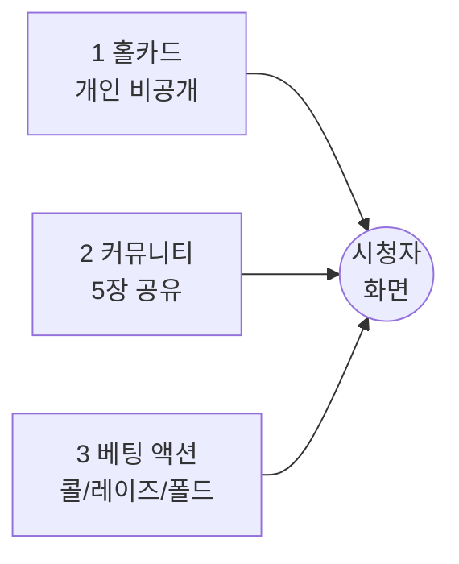
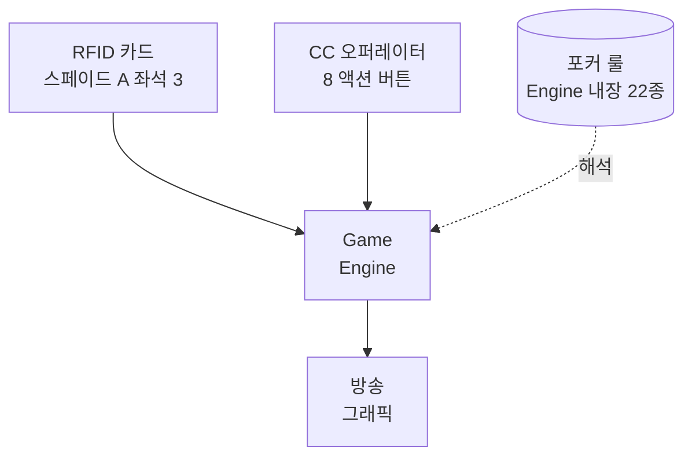
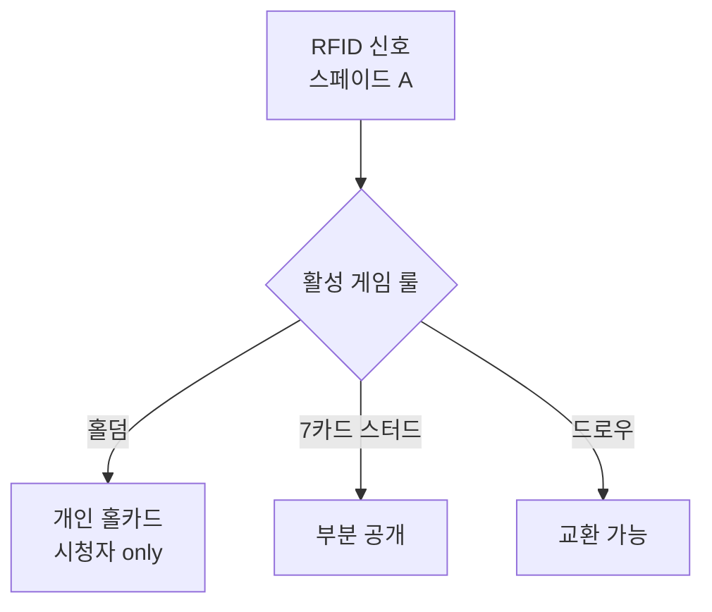
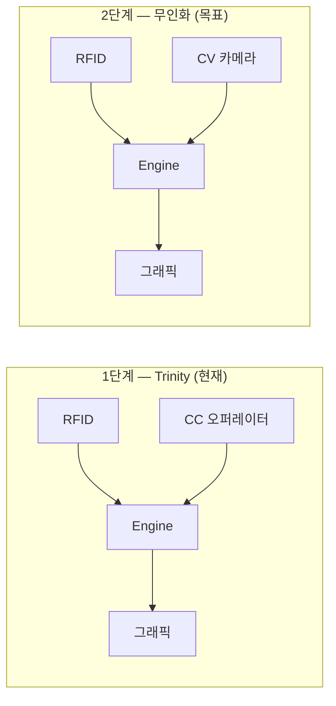

# EBS 기초 기획서

### *숨겨진 패를 보여주는 마법*

> **WSOP LIVE 대회정보** + **RFID 카드** + **Command Center 액션**  
> ↓  
> **Game Engine**  
> ↓  
> **실시간 Overlay Graphics**

---

## 목차

| 부 | Chapter | 한 줄 |
|:---:|---|---|
| I | **1. 숨겨진 정보의 마법** | RFID + CC + Rule 의 Trinity |
| I | 2. 시청자가 보는 화면 | 8 그래픽 / 3 조건 / 만들지 않는 것 |
| I | 3. 무대의 지도 | 라스베가스 → 시청자 4 단계 |
| II | 4. 6 기능 / 4 SW + 1 HW | 어떻게 분해되는가 |
| II | 5. 시스템 해부 | Front / Back / Render+HW+Vision |
| III | 6. 운영과 진화 | 1단계 → 2단계 무인화 |

> *Part I 은 "왜", Part II 는 "무엇", Part III 은 "어떻게".*

---
---

# Chapter 1
### *숨겨진 정보의 마법*

> *축구는 공도, 점수도, 누가 어디 서있는지도 모두 보인다.*  
> *포커는 시청자가 가장 궁금해하는 카드가 — 뒤집혀 있다.*  
> *심지어 방송 스태프조차 그 카드가 무엇인지 모른다.*

---

### Scene 1 / 비대칭성

> *축구는 정리, 포커는 생성.*

축구는 공의 위치와 점수가 모두에게 보이는 **공개 정보**다. 방송 스태프는 보이는 것을 화면에 예쁘게 정리하면 된다.

포커는 다르다. 시청자가 가장 궁금해하는 정보가 **두 겹의 가림막** 뒤에 있다.

| | 카드 | 액션 |
|---|---|---|
| **축구 / 농구 / 야구** | 해당 없음 | 공개 (눈으로 명확) |
| **포커** | **비공개** (뒤집힘) | **모호** (작은 칩 동작) |

다른 메이저 스포츠는 점수와 함께 선수의 액션 — 공 차기, 슛, 스윙 — 이 카메라에 명확히 잡힌다. **포커의 베팅은 작고 빠르며 종종 침묵 속에서 진행**된다. 칩 더미를 미는 동작이 콜인지 레이즈인지, 카메라 영상으로는 즉시 판별이 어렵다.

> **포커는 카드뿐 아니라 액션도 별도 그래픽으로 알려줘야 하는 유일한 메이저 스포츠다.**

이 두 겹의 비대칭성을 해결하고 화면에 띄우는 것 — 이것이 EBS 의 존재 이유다.

---

### Scene 2 / 시청자에게 전달할 3 데이터

방송 화면으로 무엇을 전달해야 하는가? 포커의 흐름은 3 데이터로 압축된다.

#### 1. 홀카드

플레이어 각자만 받는 개인 카드. 방송에서는 **시청자에게만 몰래** 공개한다.

#### 2. 커뮤니티 카드

테이블 중앙에 놓여 모두가 공유하는 카드. 플레이어는 자신의 홀카드 2장과 공유 카드 5장을 합친 **총 7장 중 가장 강한 5장**으로 승부를 낸다.

#### 3. 베팅 액션

매 카드 공개마다 베팅이 진행된다. **콜** (같은 금액), **레이즈** (판돈 키우기), **폴드** (포기) — 세 선택지가 매 라운드 반복.

> *이 3 데이터를 실시간으로 추적하는 것이 EBS 의 입력 영역이다.*

---

### Scene 3 / Trinity — 세 입력의 만남

3 데이터를 어떻게 읽어들이는가? **세 종류의 입력**이 만나야 비로소 화면이 된다.

#### ⓐ 카드는 센서가 읽는다

> *1999 — 유리판 + 하부 카메라. 지금 — RFID 안테나.*

52장 한 장 한 장에 RFID 태그가 내장. 플레이어가 테이블 천 위에 카드를 내려놓는 순간, 테이블 아래 매립된 안테나가 **"어느 좌석에 어떤 카드가"** 를 즉시 파악한다. 추가 행동 0.

#### ⓑ 액션은 사람이 입력한다

칩 더미의 작은 움직임 + 침묵 속 손짓 — 센서로 자동 판별 불가. 그래서 **컨트롤룸의 CC 오퍼레이터**가 모니터로 테이블 영상을 보면서 **8 액션 버튼**을 누른다.

| 버튼 | 의미 |
|---|---|
| 핸드 시작 | 새 핸드 개시 |
| 카드 배분 | 홀카드 분배 시점 |
| 콜 / 레이즈 / 폴드 / 체크 / 올인 | 5 베팅 액션 |
| 승부 종결 | 핸드 종료 + 판돈 분배 |

> *딜러는 테이블 진행자, CC 오퍼레이터는 컨트롤룸 입력자. 두 역할은 물리적으로 분리된다.*

#### ⓒ 룰은 코드에 새겨져 있다

22 게임 룰은 Game Engine 코드의 **영구 상수**. 매 핸드 외부에서 입력받는 게 아니다. Lobby Settings 에서는 22 종 중 어느 룰을 활성화할지 **선택**만 가능 — 룰의 정의 / 수정 / 추가는 Engine 재배포 필요.

| | RFID 카드 | CC 액션 | **게임 룰** |
|---|---|---|---|
| 출처 | 외부 센서 | 외부 사람 | **Engine 코드** |
| 변동성 | 매 카드마다 | 매 액션마다 | **불변 상수** |
| 입력 채널 | ✅ | ✅ | ❌ (내장) |

> *같은 RFID 신호가 활성 게임 룰에 따라 다른 의미가 된다.*

---

### Scene 4 / 1단계 → 2단계 진화

1단계가 **완전히 안정화**된 후, CC 오퍼레이터는 컴퓨터 비전 카메라(§7.3 Vision Layer)로 완전 대체된다. 병행 운영 없이 순차 전환. 1단계 → 2단계는 EBS 의 궁극 지향점인 **현장 EBS 의 완전 무인화**다.

---

> # *EBS 의 핵심 가치는 속도가 아닌 정확성이다.*

1~2시간의 후편집 시간차 앞에서 0.1초의 빠름은 무의미하다.

정확한 인식 · 장비 안정성 · 명확한 연결 · 단단한 하드웨어 · 오류 없는 흐름 —  
이 **다섯 가치**가 다음 챕터의 모든 설계를 지배한다.

---

### Chapter 1 / 정리

| Scene | 핵심 |
|---|---|
| **1. 비대칭성** | 카드 + 액션 두 겹 비공개 → 그래픽이 정보 **생성** |
| **2. 3 데이터** | 홀카드 / 커뮤니티 / 베팅 액션 |
| **3. Trinity** | RFID + CC + Rule = Game Engine 합성 |
| **4. 진화** | 1단계 Trinity → 2단계 무인화 (CV 카메라) |

> *이 마법을 만들기 위해 우리는 무엇을 코딩해야 하는가?*  
> *Chapter 2 가 시청자가 보는 결과물 — 8 그래픽을 해부한다.*

---
---

# Chapter 2 — 시청자가 보는 화면

> *Phase 2 작성 예정. 8 핵심 그래픽 + 만들지 않는 것 + EBS 책임 영역 3 절대 조건.*

---
---

# Chapter 3 — 무대의 지도

> *Phase 2 작성 예정. 라스베가스 → 클라우드 → 서울 후편집 → 시청자 4 단계 여정. EBS 는 A 구간 전담. 1~2시간 시간차의 의미.*

---
---

# Chapter 4 — 6 기능 / 4 SW + 1 HW

> *Phase 2 작성 예정. 두 렌즈로 보는 EBS — 기능 렌즈(3 그룹: 조작/두뇌/출력) vs 설치 렌즈(4 SW + 1 HW γ 하이브리드).*

---
---

# Chapter 5 — 시스템 해부

> *Phase 2 작성 예정. Front-end (Lobby + Command Center) / Back-end / Render & Hardware (RFID 매트릭스 + Vision Layer §7.3).*

---
---

# Chapter 6 — 운영과 진화

> *Phase 2 작성 예정. 현장의 하루 (준비→송출→마감) / 1단계 안정화 마일스톤 / 2단계 무인화 비전.*

---

## 부록 — 보존 정보 인덱스

본 재설계에서 **현재 Foundation.md v3.1.0 의 모든 핵심 fact 가 보존**됨을 보장.

| 현재 § | Fact | 새 위치 |
|---|---|:---:|
| §1.1 | 정보 비대칭성 (카드 + 액션) | Ch.1 / Scene 1 |
| §1.2 | 3 핵심 데이터 (홀/커뮤니티/베팅) | Ch.1 / Scene 2 |
| §1.3 | RFID 1세대→2세대 | Ch.1 / Scene 3 ⓐ |
| §1.4 | CC 오퍼레이터 + 8 액션 | Ch.1 / Scene 3 ⓑ |
| §1.5 | 22 게임 룰 = Engine 내장 상수 | Ch.1 / Scene 3 ⓒ |
| §1.6 | Trinity 미션 + 정확성 핵심 | Ch.1 / Scene 4 + Quote |
| §2.1~§2.3 | 8 그래픽 + 3 조건 | Ch.2 (예정) |
| §3.1~§3.4 | 4 송출 + 1시간 시간차 | Ch.3 (예정) |
| §4.1~§4.2 | 6 기능 / 4 SW + 1 HW | Ch.4 (예정) |
| §5~§7 | Front / Back / Render+HW+Vision | Ch.5 (예정) |
| §8~§9 | 운영 / 1→2단계 진화 | Ch.6 (예정) |

---

## Changelog

| 날짜 | 버전 | 변경 |
|---|---|---|
| 2026-05-07 | 4.0.0-draft | Phase 2 sample. Ch.1 완성, Ch.2~6 placeholder. 그림 소설 layout 5종 (Splash/Diptych/Diagram-led/Pull-Quote/Hub) 도입. |
