# 베팅 액션·구조·강제 베팅 완전 가이드

| 날짜 | 항목 | 내용 |
|------|------|------|
| 2026-03-30 | 신규 작성 | 베팅 시스템 완전 가이드 초판 v2.0.0 |
| 2026-04-13 | §1b 확장 | All-in 일반화(4인+), Dead Money, Showdown Order, 크로스 게임 적용 추가 |
| 2026-04-13 | 모호성 제거 | "보통" 6건 → 구체 수치/설정 필드 참조로 교체 |

> **Version**: 2.1.0
> **Date**: 2026-04-13
> **대상 독자**: 포커를 모르는 사람 누구나
> **요약 버전**: 이 문서는 베팅 구조 3종(NL/PL/FL), Ante 7종, 특수 규칙 4종의 상세 가이드입니다

---

## §0. 먼저 알아야 할 것들

> 지금 여기입니다:
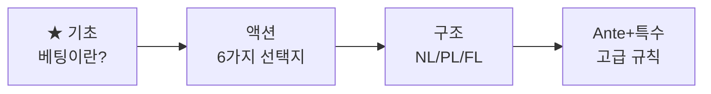

이 문서는 포커를 **전혀 모르는 분**을 위해 처음부터 설명합니다.

### 0-1. 당신 앞에 칩이 있습니다

포커 테이블에 앉으면, 실제 돈 대신 **칩**(베팅 토큰)을 사용합니다. 숫자가 적힌 원형 토큰입니다.


### 0-2. 왜 돈을 거는가?

포커는 **패가 좋을수록 더 많이 걸고**, 패가 나쁘면 포기하는 게임입니다. 상대가 실제로 좋은 패를 가졌는지, 아니면 **허세(블러프)**인지 판단하는 것이 핵심입니다.

### 0-3. 베팅은 언제 하는가?

카드를 받고 나면, 새 카드가 공개될 때마다 **베팅 라운드**가 진행됩니다. 매 라운드마다 "더 걸까, 따라갈까, 포기할까"를 결정합니다.

> 카드 규칙 요약: 52장 표준 덱(4무늬 × 13숫자)을 사용하며, 비공개 카드 2장 + 공유 카드 5장 = 총 7장 중 최강 5장을 선택하여 승부합니다. Texas Hold'em이 이 계열의 기준 게임입니다.

---

## 한눈에 보기 — 베팅 시스템 4가지 영역

| 영역 | 구성 | 핵심 |
|------|------|------|
| **베팅 액션** | Fold / Check / Bet / Call / Raise / All-in | 매 턴 6가지 선택 |
| **블라인드 / Bring-in** | SB, BB / Bring-in (Seven Card Games) | 강제 베팅으로 팟 생성 |
| **베팅 구조** | NL / PL / FL 3종 | 최대 베팅 한도 결정 |
| **Ante + 특수** | 7종 Ante + 4종 특수 규칙 | 액션 유도 + 재미 요소 |

---

## §1. 베팅 액션 — 6가지 선택지

> 지금 여기입니다:
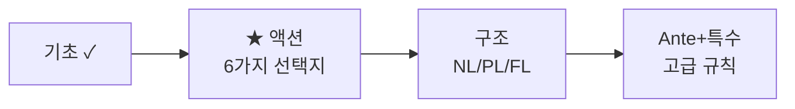

### 1-1. 6가지 액션


| 액션 | 의미 | 조건 |
|------|------|------|
| **Fold** | 포기 — 카드를 버리고 이번 판에서 빠짐 | 언제든 가능 |
| **Check** | 패스 — 아무것도 걸지 않고 다음 사람에게 넘김 | 앞 사람이 아무도 안 걸었을 때만 |
| **Bet** | 첫 베팅 — 이번 라운드에서 처음으로 금액을 거는 것 | 아무도 아직 안 걸었을 때 |
| **Call** | 따라 걸기 — 상대와 같은 금액을 걸음 | 누군가 이미 걸었을 때 |
| **Raise** | 더 걸기 — 상대보다 더 많이 걸음 | 누군가 이미 걸었을 때 |
| **All-in** | 전부 걸기 — 남은 칩 전부를 걸음 | 언제든 가능 |

> **Bet vs Raise의 차이**: 아무도 안 걸었을 때 처음 거는 게 Bet, 누군가 이미 걸었을 때 더 올리는 게 Raise입니다. 실전에서는 구분 없이 "Raise"라고도 하지만, 소프트웨어 구현에서는 반드시 구분해야 합니다.

### 1-2. 베팅 라운드의 흐름

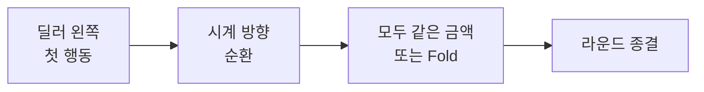

- 시계 방향으로 한 바퀴
- 모든 플레이어가 같은 금액을 맞추거나(Call) 포기(Fold)하면 라운드 종결
- 누군가 Raise하면 → 다시 한 바퀴

### 1-3. 실전 예시 — 1 라운드 전체 흐름

6인 테이블, 블라인드: SB 50 / BB 100

| 순서 | 플레이어 | 액션 | 금액 | 팟 |
|:----:|---------|------|:----:|:---:|
| 1 | UTG | Call | 100 | 250 |
| 2 | MP | Raise | 300 | 550 |
| 3 | CO | Fold | - | 550 |
| 4 | BTN | Call | 300 | 850 |
| 5 | SB | Fold | - | 850 |
| 6 | BB | Call | +200 | 1050 |
| 7 | UTG | Call | +200 | 1250 |

> MP의 Raise(300)로 모든 사람이 300을 맞추거나 Fold해야 합니다. UTG는 처음 100을 콜했지만, MP가 올렸으므로 200을 추가로 내야 합니다. BB도 이미 100을 냈으므로 200만 추가합니다.

---

## §1b. 팟 관리 — Main Pot & Side Pot

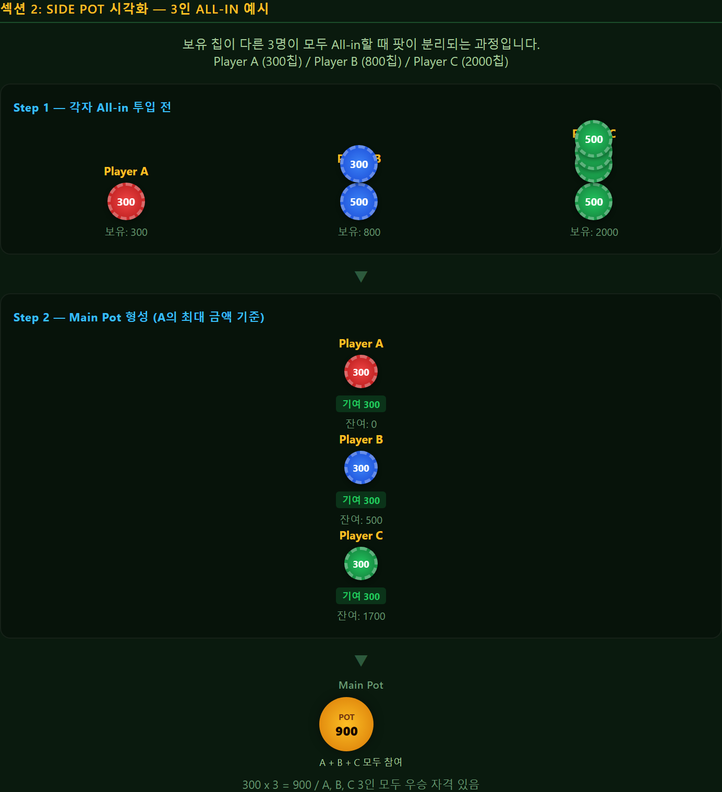

### 1b-1. 한 사람만 All-in → 단순한 경우

Player A (칩 500), Player B (칩 2000), Player C (칩 2000)

A가 All-in(500), B가 Call(500), C가 Call(500):
- **Main Pot** = 500 x 3 = **1500** → A, B, C 모두 참여
- A가 이기면 1500 획득. B나 C가 이기면 1500 획득.

### 1b-2. 칩이 다른 여러 명이 All-in → Side Pot 발생

Player A (칩 300), Player B (칩 800), Player C (칩 2000)

A가 All-in(300), B가 All-in(800), C가 Call(800):

| 팟 | 계산 | 참여자 |
|-----|------|--------|
| **Main Pot** | 300 x 3 = **900** | A, B, C |
| **Side Pot 1** | (800-300) x 2 = **1000** | B, C만 |
| C의 남은 칩 | 없음 (800 전부 사용) | — |

> A는 칩이 가장 적으므로 **Main Pot에만** 참여할 수 있습니다. Side Pot 1은 A가 이겨도 받을 수 없습니다.

**판정 순서:**
1. Side Pot 1부터 판정 (B vs C) → 승자가 1000 획득
2. Main Pot 판정 (A vs B vs C) → 승자가 900 획득

> Side Pot 판정은 **역순** (가장 작은 Side Pot부터 → Main Pot 마지막)으로 진행합니다.
> Side Pot 계산 알고리즘은 아래 §7. 개발자 레퍼런스에서 pseudo-code로 제공합니다.

### 1b-3. 4인 이상 다중 All-in — Side Pot 일반화

Player A (200), B (500), C (800), D (2000) — 전원 All-in:

| 팟 | 계산 | 참여자 (Eligible Set) |
|-----|------|--------|
| **Main Pot** | 200 × 4 = **800** | A, B, C, D |
| **Side Pot 1** | (500−200) × 3 = **900** | B, C, D |
| **Side Pot 2** | (800−500) × 2 = **600** | C, D |
| D 남은 칩 | 2000−800 = 1200 → 반환 | D |

**일반 공식:**
- 투입액 오름차순 정렬: s₁ ≤ s₂ ≤ ... ≤ sₙ
- Pot₀ (Main) = s₁ × n
- Potₖ = (sₖ₊₁ − sₖ) × (n − k), k = 1..n−1 (금액 > 0 인 것만 생성)
- 마지막 플레이어가 단독이면 잔여 반환 (Side Pot 미생성)

### 1b-4. Dead Money 처리

Fold 한 플레이어가 이미 팟에 낸 금액 (블라인드, 앤티, 베팅)은 **Dead Money**:
- Main Pot 에 포함됨 (돌려받을 수 없음)
- Side Pot 계산에는 **미영향** (Fold 플레이어는 Eligible Set 에서 제외)
- Ante dead money: ante type 에 관계없이 Main Pot 으로 합산

### 1b-5. Showdown Order — 카드 공개 순서

All-in 후 또는 최종 베팅 라운드 종료 시:

| 상황 | 공개 순서 |
|------|----------|
| All-in 2명+ (River 도달) | 전원 **자동 공개** (공개 거부 불가) |
| 베팅 후 Showdown (콜로 종료) | **Last aggressor** (마지막 베팅/레이즈한 사람) 먼저 공개 → 시계 방향 |
| 베팅 없이 Showdown (전원 체크) | **SB** (또는 첫 행동자)부터 시계 방향 |
| Muck 선택 | 자기 차례에 패 공개 대신 **Muck** (포기) 가능. 단, All-in 이면 Muck 불가 |

### 1b-6. 크로스 게임 적용

위의 Side Pot / Dead Money / Showdown 규칙은 **22종 게임 공통**:
- **Hold'em / Short Deck / Pineapple**: 표준 적용
- **Omaha (4/5/6)**: Side Pot 계산 동일. Must-use 2+3 규칙은 **핸드 평가 단계**에만 적용, 팟 분할과는 무관
- **Draw (5CD/2-7TD/Badugi)**: Draw 라운드 중간 All-in 시, 남은 Draw/베팅 라운드는 자동 skip → 최종 핸드로 Showdown
- **Stud (7CS/Razz)**: Bring-in 도중 All-in 시, 이후 Street는 공개 카드 자동 딜 → 최종 7장 핸드로 Showdown
- **Hi-Lo Split**: 팟 분할 후 Side Pot 적용. 각 Side Pot 별로 Hi 승자 50% + Lo 승자 50%. Lo 자격자 없으면 Hi 가 100%

---

## §2. 블라인드 구조 — Small Blind & Big Blind

> 지금 여기입니다:
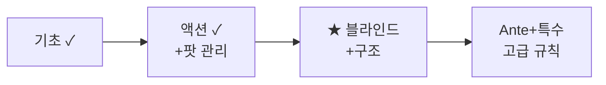

### 2-1. 블라인드란?


매 핸드 시작 전, **2명이 의무적으로** 소액을 거는 것입니다. 블라인드가 없으면 아무도 돈을 안 걸고 좋은 패만 기다리게 됩니다 — 게임이 진행되지 않습니다.

- **Small Blind (SB)**: 딜러 버튼 바로 왼쪽. BB / 2 (기본값, 이벤트 설정 `sb_amount` 필드로 재정의 가능)
- **Big Blind (BB)**: SB 왼쪽. 최소 베팅 금액의 기준

> **Dead Money**: SB가 Fold하더라도, 이미 낸 SB 금액은 팟에 남습니다. 이처럼 포기한 플레이어가 이미 낸 돈을 **Dead Money**라고 합니다. 돌려받을 수 없습니다.

### 2-2. 위치 결정

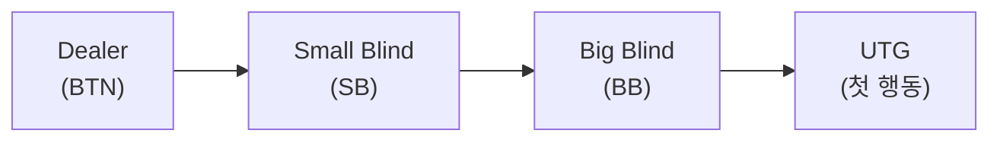

딜러 버튼이 매 핸드마다 시계 방향으로 이동합니다. 블라인드도 함께 이동하므로 모든 플레이어가 공평하게 블라인드를 냅니다.

### 2-3. 특수 상황

**헤즈업 (2인 테이블):**
- 딜러 = SB (딜러가 Small Blind를 냅니다!)
- 상대방 = BB
- SB(딜러)가 Pre-Flop에서 **먼저 행동** → Flop 이후에는 BB가 먼저

**BB의 Option (Pre-Flop 전용):**
- Pre-Flop에서 아무도 Raise하지 않고 BB 차례가 되면
- BB는 이미 돈을 낸 상태이므로 → **Check**(그냥 넘기기) 또는 **Raise**(더 올리기) 선택
- 이것을 **"Option"**이라 부릅니다 — BB만의 특권입니다

**새 플레이어 합류:**
- BB 위치에 앉거나, BB를 "Dead Blind"로 납부 후 참여

### 2-4. Seven Card Games 계열 — Bring-in (블라인드 없음!)

Seven Card Games 계열은 블라인드 대신 **Bring-in** 시스템을 사용합니다:
- 3rd Street(Seven Card Games에서 카드 3장째를 받은 직후의 첫 번째 베팅 라운드)에서 **가장 낮은 공개 카드** 보유자가 소액 의무 베팅
- 이후 시계 방향 진행
- **Razz에서는 반대**: 가장 **높은** 공개 카드가 Bring-in

| 계열 | 강제 베팅 | 결정 기준 |
|------|----------|----------|
| Flop Games | 블라인드 (SB/BB) | **위치** (딜러 버튼 기준) |
| Draw | 블라인드 (SB/BB) | **위치** (딜러 버튼 기준) |
| Seven Card Games | **Bring-in** | **패** (공개 카드 기준) |

---

## §3. 베팅 구조 3종 — NL / PL / FL

> 지금 여기입니다:
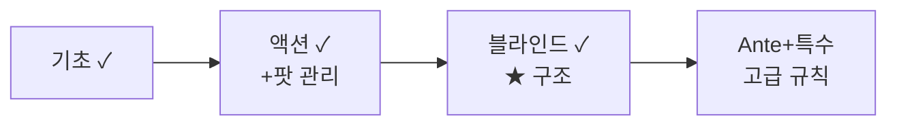


### 3-0. 한눈에 비교

| 구조 | 최소 베팅 | 최대 베팅 | 핵심 |
|------|:---------:|:---------:|------|
| **No Limit** (NL) | Big Blind | **All-in** (전 칩) | 제한 없음 |
| **Pot Limit** (PL) | Big Blind | **현재 팟 크기** | 팟 이하만 |
| **Fixed Limit** (FL) | **고정 단위** | **고정 단위** (Cap) | 정해진 금액만 |

### 3-1. No Limit (NL) — 🏠 기준 구조

"포커" 하면 대부분 이 구조입니다. **최대 베팅에 제한이 없습니다.**

**최소 Raise 규칙:**
- 최소 Raise = 직전 Raise 크기 이상
- 예: BB=100, 누군가 300으로 Raise (200 올림) → 다음 Raise는 최소 500 (200 이상 올려야)

**실전 시나리오 (NL Hold'em, BB=100):**

| 행동 | 설명 | 가능 범위 |
|------|------|----------|
| Call | 상대와 동일 | 100만 가능 |
| Raise | 더 올리기 | 최소 200 ~ 최대 본인 전 칩 |
| All-in | 전부 | 언제든 가능 |

### 3-2. Pot Limit (PL) — 최대 = 팟 크기

NL과 같지만 **최대 베팅이 현재 팟 크기로 제한**됩니다.

#### 핵심 한 줄 — PL의 규칙

> **"테이블 위에 쌓인 돈만큼만 올릴 수 있다."**

NL에서는 언제든 전 칩을 밀 수 있습니다. PL에서는 **지금 팟에 있는 금액이 곧 천장**입니다. 팟이 작으면 적게만, 팟이 크면 크게 올릴 수 있습니다.

---

#### 상황 A — 가장 단순한 경우: 아무도 안 걸었을 때

테이블 중앙에 팟 **300**이 쌓여 있고, 아직 아무도 베팅하지 않았습니다.

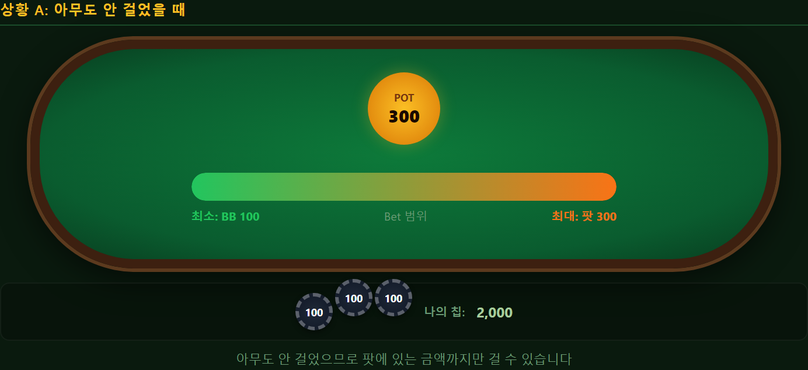

아무도 안 걸었으므로 계산이 단순합니다 — **팟에 있는 금액까지만** 걸 수 있습니다.

| 선택 | 금액 | 설명 |
|------|:----:|------|
| Check | 0 | 안 걸고 넘기기 |
| Bet 100 | 100 | 작게 걸기 |
| Bet 300 | 300 | **최대** (= 팟 크기) |
| Bet 400? | **불가!** | 팟(300)보다 크므로 금지 |

---

#### 상황 B — 누군가 걸었을 때 (PL의 핵심)

이제 팟 **300**이 있고, **상대가 200을 베팅**했습니다. 내 차례입니다.

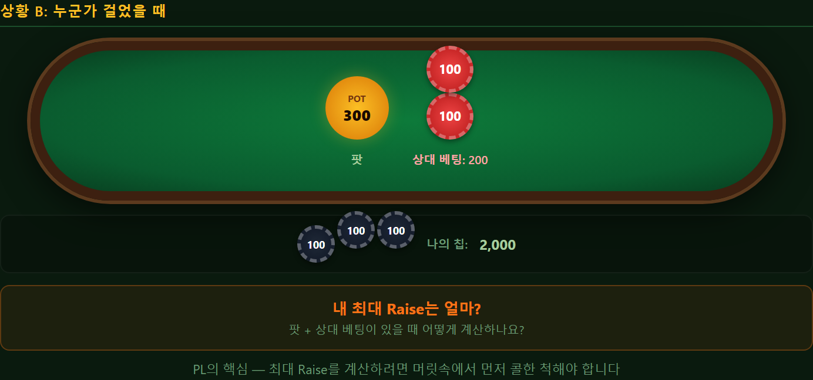

여기서 PL의 독특한 규칙이 등장합니다. 최대 Raise를 계산하려면 **머릿속에서 먼저 콜한 척**해야 합니다.

**단계 ① — 머릿속에서 콜한다 (아직 실제로 내지 않음)**

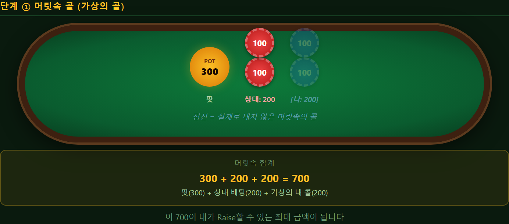

**단계 ② — 머릿속 합계가 곧 Raise 가능 금액**

머릿속으로 콜한 뒤 테이블 위에 **700**이 있습니다. 이 700만큼 Raise할 수 있습니다.

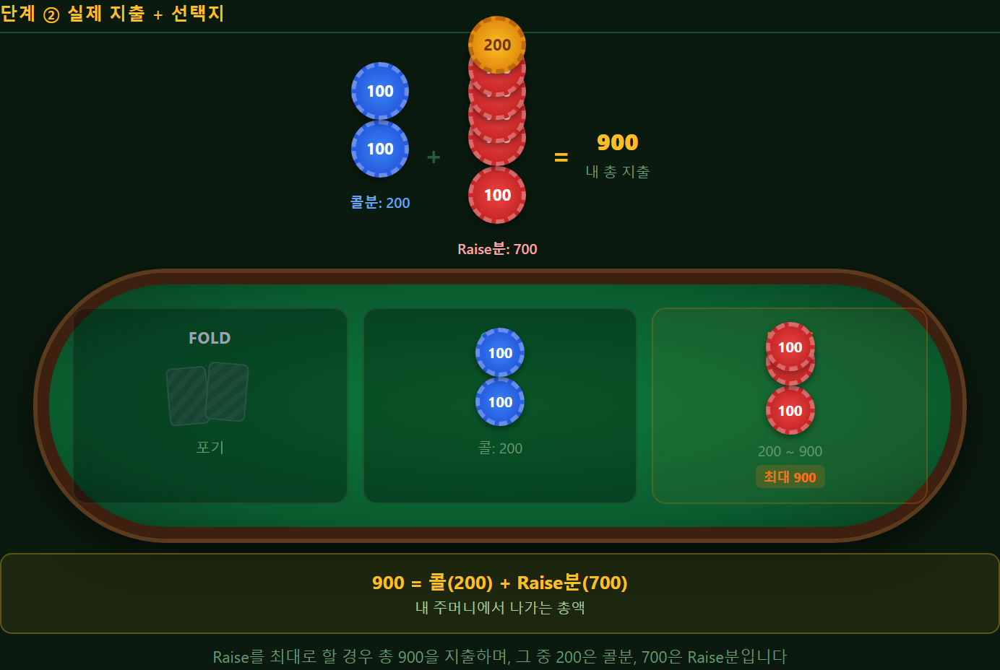

> **900이란 숫자의 의미**: 콜(200) + Raise분(700) = 내 주머니에서 나가는 **총액**. "900을 추가로 올린다"가 아닙니다.

---

#### 상황 C — 팟이 커지면 한도도 커진다

같은 규칙인데, 팟이 **1000**이고 상대가 **500** 베팅:

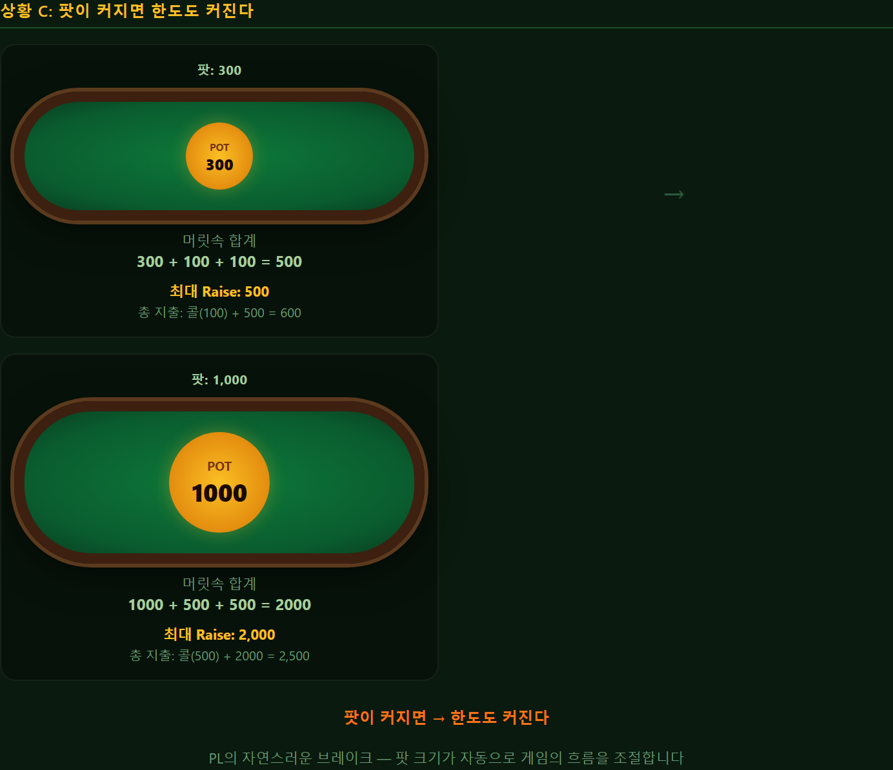

> 이것이 PL의 **자연스러운 브레이크**입니다. 게임 초반(팟 작음)에는 보수적으로, 후반(팟 큼)에는 공격적으로 — 팟 크기가 자동으로 흐름을 조절합니다.

---

#### 상황 D — 여러 명이 베팅한 경우

팟 **400**, Player A가 200 베팅, Player B가 200 콜. 내 차례:

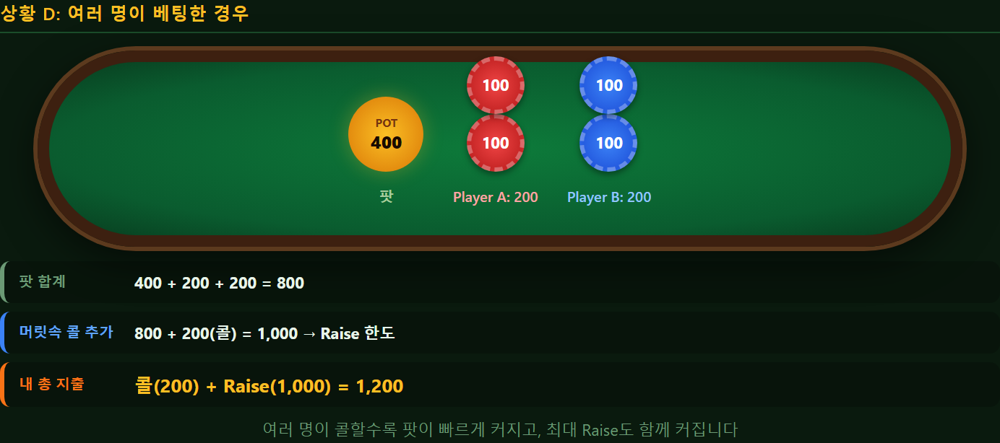

> 여러 명이 콜할수록 팟이 빠르게 커지고, 최대 Raise도 함께 커집니다.

---

#### 3줄 요약 — PL 계산법

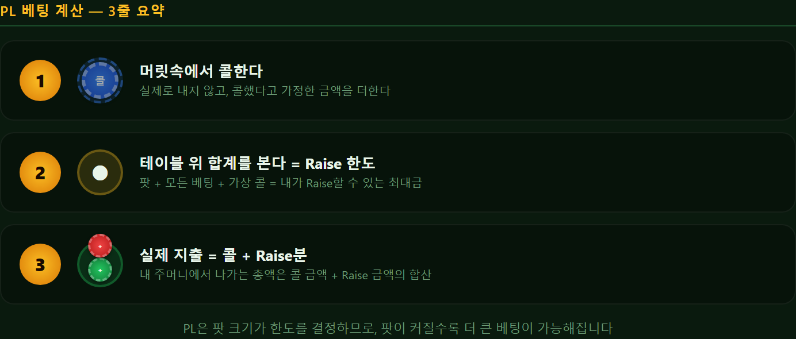

#### PL vs NL — 왜 구분하는가?

| 구조 | 특징 | 결과 |
|------|------|------|
| NL | 언제든 전 칩 가능 | All-in 빈번 → 한 방 승부 |
| **PL** | **팟만큼만 가능** | **점진적 상승 → 전략적 판단** |

> **Omaha 계열이 PL을 쓰는 이유**: Omaha는 4장을 받아 강한 패가 자주 나옵니다 → NL이면 매번 All-in → 재미 없음. PL로 제한하여 전략적 베팅을 유도합니다.

**개발자 참고 — 팟 계산 공식:**

```
// 내가 베팅할 수 있는 최대 금액 (총액)
maxTotalBet = pot + opponentBet + opponentBet
//             ↑현재 팟  ↑상대 베팅   ↑내 콜분(=상대 베팅)

// 즉, "콜한 뒤의 팟 크기"만큼 추가로 올릴 수 있음
// maxRaise = (pot + opponentBet + myCall) = pot + 2 * opponentBet
```

### 3-3. Fixed Limit (FL) — 고정 금액만

**모든 베팅이 정해진 금액 단위입니다.** 자유로운 베팅 금액 선택이 불가능합니다.

#### NL/PL과 FL의 차이 — 같은 상황, 완전히 다른 세계


> NL은 "얼마나 걸까"를 고민하지만, FL은 **"걸까 말까"만** 결정합니다. 금액은 정해져 있습니다.

#### 핵심 개념 1 — Small Bet과 Big Bet

FL에서는 **2가지 고정 금액**이 있고, 게임 진행 단계에 따라 바뀝니다.

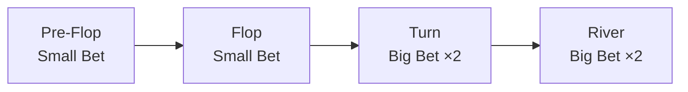

> 게임 후반(Turn, River)으로 갈수록 베팅 단위가 2배로 커집니다 — 판돈이 점점 올라가는 구조입니다.

예를 들어 **"2/4 Fixed Limit"**이란:

| 단계 | 베팅 단위 | 의미 |
|------|:---------:|------|
| Pre-Flop | **2** (Small Bet) | 모든 Bet/Raise가 정확히 2 |
| Flop | **2** (Small Bet) | 모든 Bet/Raise가 정확히 2 |
| Turn | **4** (Big Bet) | 모든 Bet/Raise가 정확히 4 |
| River | **4** (Big Bet) | 모든 Bet/Raise가 정확히 4 |

#### 핵심 개념 2 — Cap (천장)

한 라운드에서 베팅을 무한히 올릴 수 없습니다. **최대 4번**까지만 허용됩니다.


> Cap에 도달하면 남은 플레이어는 **Call(8을 맞추기) 또는 Fold(포기)만** 가능합니다.

#### 실전 시나리오 1 — Flop (Small Bet = 2)

| 순서 | 플레이어 | 액션 | 총 베팅액 | 카운트 |
|:----:|---------|------|:---------:|:------:|
| 1 | A | Bet | 2 | 1st (Bet) |
| 2 | B | Raise | 4 | 2nd (Raise) |
| 3 | C | Re-Raise | 6 | 3rd |
| 4 | A | Cap | 8 | **4th (Cap!)** |
| 5 | B | Call 8 또는 Fold | — | Raise 불가 |
| 6 | C | Call 8 또는 Fold | — | Raise 불가 |

#### 실전 시나리오 2 — Turn (Big Bet = 4)

같은 게임의 Turn 라운드. 이제 베팅 단위가 **2배**입니다:

| 순서 | 플레이어 | 액션 | 총 베팅액 | 카운트 |
|:----:|---------|------|:---------:|:------:|
| 1 | A | Bet | 4 | 1st (Bet) |
| 2 | B | Raise | 8 | 2nd (Raise) |
| 3 | C | Call 8 | — | — |
| 4 | A | Call 8 | — | — |

> Flop에서는 2씩, Turn에서는 4씩 — 단위만 바뀌고 규칙은 동일합니다.

#### 3종 비교 — 같은 상황에서 가능한 행동

팟 500, 상대가 Bet한 직후, 내 칩 3000:

| 구조 | 상대 Bet | 내 Raise 범위 | 특징 |
|------|:--------:|:------------:|------|
| **NL** | 자유 (100~3000) | 자유 (200~3000) | 아무 금액 |
| **PL** | 자유 (100~500) | 자유 (200~최대 팟) | 팟이 천장 |
| **FL** | **고정 (2 또는 4)** | **고정 (딱 1단위)** | 선택 여지 없음 |

**적용 게임:**
- Seven Card Games 계열: 항상 FL
- Draw Triple Draw / Badugi: 항상 FL
- Hold'em / Omaha: NL/PL이 더 인기지만 FL 버전도 존재

---

## §4. Ante 7종 — 핸드 시작 전 의무 납부금

> 지금 여기입니다:
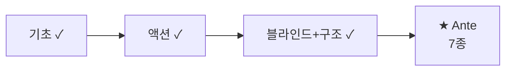

### 4-0. Ante란?

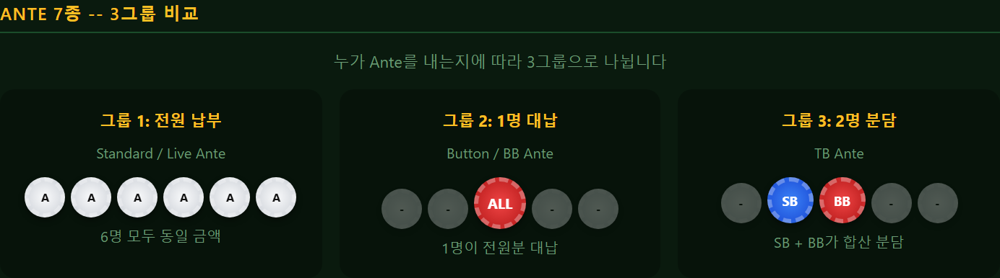

블라인드와 별개로, 핸드 시작 전 **추가 의무 납부금**입니다. 블라인드만 있으면 팟이 작아서 "기다리기" 전략이 유리합니다 — Ante로 팟에 더 많은 돈을 넣어 **액션을 유도**합니다.

### 4-1. Standard Ante — 전원 동일 금액

- **납부자**: 테이블의 **모든 플레이어**
- **금액**: 동일 (BB × 10%, 기본값. 이벤트 설정 `ante_amount` 필드로 재정의)
- **처리**: Dead Money (첫 베팅에 포함되지 않음)

> 예: 6인 테이블, BB=1000, Ante=100 → 핸드 시작 시 팟 = 600(Ante) + 1500(Blinds) = 2100

### 4-2. Button Ante — 딜러만

- **납부자**: 딜러 버튼 위치 **1명만**
- **금액**: BB × 1 (기본값. 이벤트 설정 `ante_amount` 필드로 재정의)
- **적용**: Short Deck(6+) 게임에서 주로 사용

### 4-3. BB Ante — Big Blind가 전원분 대납

- **납부자**: Big Blind 위치 **1명이 전원분 대납**
- **금액**: BB × 1 (전체 합계, BB 위치 1명이 대납. 이벤트 설정 `ante_amount` 필드로 재정의)
- **장점**: 6명이 각자 Ante 내는 시간 절약 → 게임 속도 향상

> **2018년 이후 대부분의 메인 토너먼트가 이 방식으로 전환**했습니다.

### 4-4. BB Ante (BB 1st) — BB 대납 + BB 먼저 행동

§4-3과 같지만 BB가 **Pre-Flop에서 먼저 행동**합니다. 일부 토너먼트에서 사용합니다.

### 4-5. Live Ante — 전원, 라이브 머니

**가장 복잡한 Ante 유형입니다.**

Standard Ante와 비슷하게 전원이 내지만, **Ante가 "라이브 머니"로 취급**됩니다.

**Dead Money vs Live Money:**

| 구분 | Standard Ante (Dead) | Live Ante |
|------|:--------------------:|:---------:|
| 성격 | 팟에 기부 | **내 베팅의 일부** |
| 콜 시 | Ante와 무관하게 전액 콜 | Ante 만큼 **차감** |
| Check/Raise | 일반 규칙 | Ante가 이미 베팅으로 인정 |

> **예**: Ante=100, BB=200, 누군가 500으로 Raise
> - Standard Ante: 콜하려면 **500** 필요 (Ante 100은 무관)
> - Live Ante: 콜하려면 **400**만 필요 (이미 100을 "베팅"으로 냈으니까)

### 4-6. TB Ante — SB + BB 합산

- **납부자**: Small Blind + Big Blind 2명이 나눠서
- **금액**: 두 블라인드가 합산하여 전체 Ante 부담

### 4-7. TB Ante (TB 1st) — TB + SB/BB 먼저 행동

§4-6과 같지만 SB/BB가 먼저 행동합니다.

### 7종 비교 총정리

| # | 유형 | 납부자 | Dead/Live | 사용 빈도 |
|:-:|------|:------:|:---------:|:---------:|
| 1 | Standard | 전원 | Dead | 중 |
| 2 | Button | 딜러 1명 | Dead | Short Deck |
| 3 | BB Ante | BB 1명 | Dead | **최다** |
| 4 | BB Ante (1st) | BB 1명 | Dead | 일부 |
| 5 | Live | 전원 | **Live** | 캐시 게임 |
| 6 | TB | SB+BB | Dead | 드묾 |
| 7 | TB (1st) | SB+BB | Dead | 드묾 |

---

## §5. 특수 규칙 4종

> 지금 여기입니다:
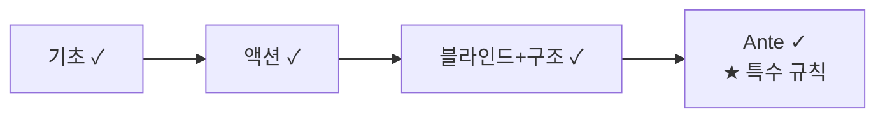

### 5-1. Straddle — 자발적 3번째 블라인드

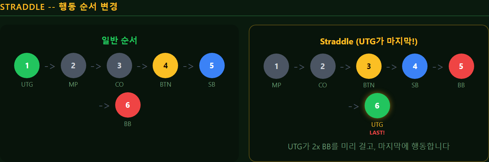

UTG (Under The Gun, BB 다음 자리) 플레이어가 **자발적으로** 2x BB를 미리 거는 것입니다. SB → BB → Straddle의 3단 블라인드 구조가 됩니다.

**왜 하는가?**
- Straddle를 건 플레이어가 Pre-Flop **마지막에 행동** (옵션을 받음)
- 팟이 커져서 액션이 화끈해짐
- 캐시 게임에서 주로 사용, 토너먼트에서는 드묾

**베팅 순서 변경:**

| 구분 | 행동 순서 |
|------|----------|
| 일반 | UTG → MP → CO → BTN → SB → BB |
| Straddle | MP → CO → BTN → SB → BB → **UTG(마지막!)** |

**Mississippi Straddle:**
- UTG뿐 아니라 **BTN(딜러)에서도** Straddle 가능
- BTN Straddle = Pre-Flop에서 BTN이 마지막 행동

### 5-2. Bomb Pot — 베팅 없이 바로 Flop

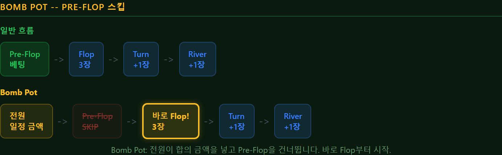

전원이 **합의된 금액을 팟에 넣고** Pre-Flop 베팅을 건너뜁니다. **바로 Flop 3장이 깔리고**, Flop부터 정상 베팅 시작입니다.

**규칙:**
- 합의 금액: 이벤트 설정 `bomb_pot_amount` 필드 (필수, 기본값 없음 — 매 핸드 합의)
- Pre-Flop 베팅 라운드 **전체 스킵**
- Fold 불가 (전원 참여, 이미 돈을 냈으니까)
- Flop부터 정상 진행

**적용 가능 게임:** Flop Games 계열만 (Flop이 있는 게임). Draw, Seven Card Games 계열에는 적용 불가합니다.

> 캐시 게임에서 가끔 이벤트성으로 진행합니다. 토너먼트에서는 거의 없습니다.

### 5-3. Run It Twice — 보드 2회 전개

All-in 상황에서 **양쪽 합의 시**, 남은 보드 카드를 **2세트** 전개합니다. 각 세트별로 승자를 결정하여 **팟을 50/50 분할**합니다.

**왜 하는가?**
- 분산(Variance) 감소. All-in 후 운에 의한 극단적 결과를 줄입니다
- 기대값은 동일하지만 변동폭이 줄어듭니다

**실전 예시:**

상황: Player A(A♠ K♠) vs Player B(Q♥ Q♣), 보드: [J♠ 10♠ 3♦] — All-in!

남은 카드: Turn + River를 2세트로 전개:

| | Turn | River | 승자 |
|--|:---:|:-----:|:----:|
| **Board A** | 9♠ | 2♣ | **A** (Flush) |
| **Board B** | 7♥ | Q♦ | **B** (Three Queens) |

→ 팟 50%씩: A와 B 반반

**조건:**
- All-in 후에만 가능
- **양쪽 모두 합의**해야 (한쪽이 거부하면 1회만)
- NL / PL에서만 의미 (FL에서는 All-in이 드묾)

**3인 이상 All-in 시:**
- 원칙: **모든 All-in 당사자가 합의**해야 함 (1명이라도 거부하면 1회만)
- Side Pot이 있는 경우: 각 Side Pot별로 독립적으로 Run It Twice 적용 가능
- 실무적으로는 3인+ All-in에서 Run It Twice는 드묾 (합의 난이도 높음)

### 5-4. 7-2 Side Bet — 최약 핸드 보너스

[7][2] 오프슈트(서로 다른 무늬) = Hold'em **최약 시작 핸드**입니다. 이 핸드로 팟을 따면 → 다른 **모든 플레이어로부터 사이드벳을 수취**합니다.

**규칙:**
- 참여자 전원 사전 합의, 이벤트 설정 `seven_deuce_amount` 필드 (필수, 기본값 없음)
- [7][2]로 Showdown에서 이기거나, 다른 플레이어를 Fold 시켜야 함
- 수이티드(같은 무늬) [7♠ 2♠]는 포함 안 되는 경우도 (합의에 따라)

> **목적**: "절대 플레이 안 하는 핸드"로 블러프를 유도합니다 → 재미 요소!

---

## §6. 게임별 베팅 구조 매핑 — 22종

### 6-1. 매핑 테이블

| # | 게임 | 계열 | NL | PL | FL | 기본 | 강제 베팅 |
|:-:|------|:----:|:--:|:--:|:--:|:----:|:---------:|
| 0 | Texas Hold'em | Flop | ✅ | ✅ | ✅ | NL | Blind |
| 1 | 6+ Hold'em (S>T) | Flop | ✅ | ❌ | ❌ | NL | Button Ante |
| 2 | 6+ Hold'em (T>S) | Flop | ✅ | ❌ | ❌ | NL | Button Ante |
| 3 | Pineapple | Flop | ✅ | ✅ | ✅ | NL | Blind |
| 4 | Omaha | Flop | ✅ | ✅ | ✅ | **PL** | Blind |
| 5 | Omaha Hi-Lo | Flop | ✅ | ✅ | ✅ | PL/FL | Blind |
| 6 | Five Card Omaha | Flop | ✅ | ✅ | ❌ | PL | Blind |
| 7 | Five Card Omaha Hi-Lo | Flop | ✅ | ✅ | ❌ | PL | Blind |
| 8 | Six Card Omaha | Flop | ✅ | ✅ | ❌ | PL | Blind |
| 9 | Six Card Omaha Hi-Lo | Flop | ✅ | ✅ | ❌ | PL | Blind |
| 10 | Courchevel | Flop | ✅ | ✅ | ❌ | PL | Blind |
| 11 | Courchevel Hi-Lo | Flop | ✅ | ✅ | ❌ | PL | Blind |
| 12 | Five Card Draw | Draw | ✅ | ✅ | ✅ | **NL** | Blind |
| 13 | 2-7 Single Draw | Draw | ✅ | ✅ | ✅ | NL | Blind |
| 14 | 2-7 Triple Draw | Draw | ❌ | ❌ | ✅ | **FL** | Blind |
| 15 | A-5 Triple Draw | Draw | ❌ | ❌ | ✅ | FL | Blind |
| 16 | Badugi | Draw | ❌ | ❌ | ✅ | FL | Blind |
| 17 | Badeucy | Draw | ❌ | ❌ | ✅ | FL | Blind |
| 18 | Badacey | Draw | ❌ | ❌ | ✅ | FL | Blind |
| 19 | 7-Card Stud | 7Card | ❌ | ❌ | ✅ | **FL** | **Bring-in** |
| 20 | 7-Card Stud Hi-Lo | 7Card | ❌ | ❌ | ✅ | FL | Bring-in |
| 21 | Razz | 7Card | ❌ | ❌ | ✅ | FL | Bring-in |

> **기본** = 해당 게임이 가장 일반적으로 플레이되는 구조

### 6-2. 계열별 기본 구조 요약

| 계열 | 기본 구조 | 이유 |
|------|:---------:|------|
| Hold'em | NL | 세계 표준 |
| Short Deck | NL | Hold'em 변형 |
| Omaha 계열 | **PL** | 4장+ 홀카드 → 강한 패 빈출 → NL이면 매번 All-in |
| Triple Draw | **FL** | 3회 교환 → 라운드 많음 → 고정 금액이 적합 |
| Badugi 계열 | **FL** | Triple Draw와 동일 이유 |
| Seven Card Games 계열 | **FL** | 5 라운드 베팅 → 고정 금액이 적합 |

### 6-3. 특수 규칙 적용 가능 게임

| 특수 규칙 | 적용 가능 | 제외 |
|----------|----------|------|
| Straddle | Blind 사용 게임 (Flop + Draw) | 7Card (Bring-in 사용) |
| Bomb Pot | Flop 계열만 (Flop 존재) | Draw, 7Card |
| Run It Twice | NL / PL 게임 (All-in 빈도 높음) | FL (All-in 드묾) |
| 7-2 Side Bet | Hold'em 전용 | Omaha, Draw, 7Card |

### 6-4. Mixed Game — 구조 전환

**HORSE** (5종 순환):

| 순번 | 게임 | 구조 |
|:----:|------|:----:|
| 1 | Hold'em | FL |
| 2 | Omaha Hi-Lo | FL |
| 3 | Razz | FL |
| 4 | 7-Card Stud | FL |
| 5 | 7-Card Stud Hi-Lo | FL |

**8-Game** (8종 순환):

| 순번 | 게임 | 구조 |
|:----:|------|:----:|
| 1 | 2-7 Triple Draw | FL |
| 2 | Hold'em | FL |
| 3 | Omaha Hi-Lo | FL |
| 4 | Razz | FL |
| 5 | 7-Card Stud | FL |
| 6 | 7-Card Stud Hi-Lo | FL |
| 7 | NL Hold'em | **NL** |
| 8 | PLO | **PL** |

> Mixed Game에서는 게임이 바뀔 때마다 베팅 구조, Ante, 블라인드/Bring-in이 **자동 전환**됩니다.

---

## §7. 개발자 레퍼런스

> 이 섹션은 소프트웨어 개발팀을 위한 기술 참조입니다. 포커 규칙 이해에는 이 섹션이 필요하지 않습니다.

### 7-1. 베팅 라운드 State Machine(상태 전이도)

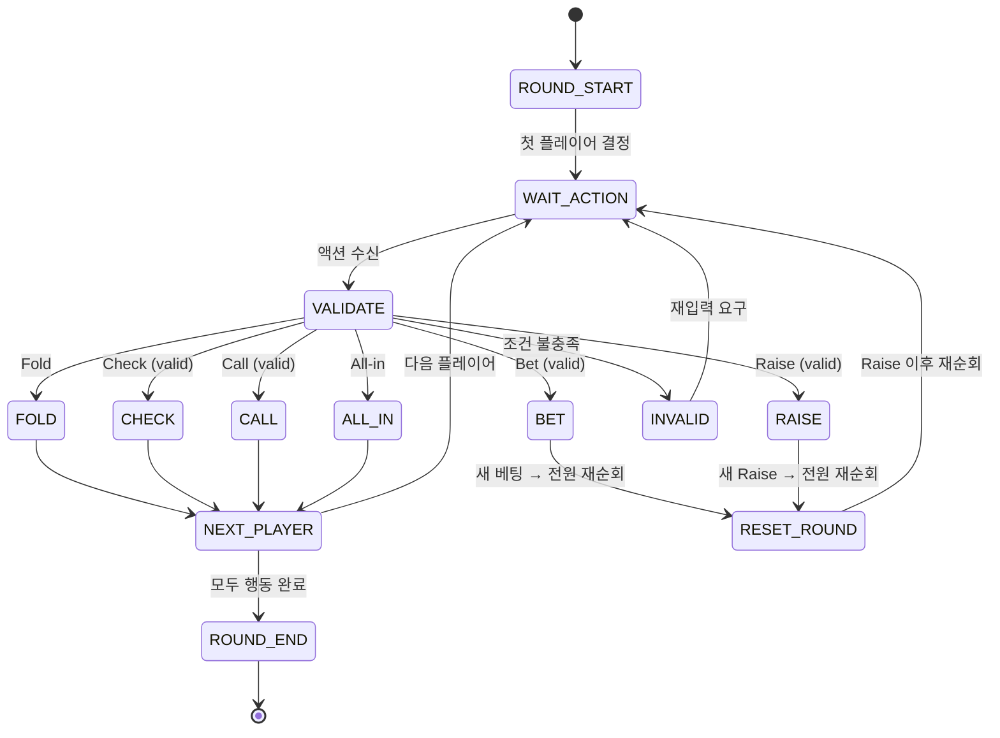

**ROUND_END 조건:**
- 모든 활성 플레이어가 동일 금액을 맞춤 (또는 All-in)
- 또는 1명만 남음 (나머지 전원 Fold)

### 7-2. 액션 Validation(검증) Rule Table

| 액션 | Precondition(선행 조건) | 거부 조건 (Reject) |
|------|------------------------|-------------------|
| **Fold** | 항상 가능 | — |
| **Check** | 현재 라운드에 베팅 없음 (currentBet == 0) | 누군가 이미 Bet/Raise 함 |
| **Bet** | 현재 라운드에 베팅 없음 + Check 아닌 경우 | 이미 Bet이 있음 |
| **Call** | 현재 베팅 > 0 | 베팅 없음 (→ Check/Bet 해야) |
| **Raise** | 현재 베팅 > 0 + FL Cap 미도달 | 베팅 없음 / FL Cap 도달 |
| **All-in** | 항상 가능 | — |

### 7-3. 구조별 금액 Validation

| 구조 | Bet/Raise 최소 | Bet/Raise 최대 | 특이사항 |
|------|:--------------:|:--------------:|---------|
| **NL** | BB 또는 직전 Raise 크기 | 본인 전 칩 | Short All-in 예외 |
| **PL** | BB 또는 직전 Raise 크기 | pot + 2 x opponentBet | 팟 계산 실시간 |
| **FL** | 고정 (Small Bet / Big Bet) | 고정 (= 최소) | Cap 4회 제한 |

### 7-3b. Side Pot 알고리즘

```
function calculatePots(players):
    // 1. All-in 금액 기준 오름차순 정렬
    sorted = players.sortBy(contribution)
    pots = []
    previousLevel = 0

    for each level in sorted unique contributions:
        eligible = players where contribution >= level
        potAmount = (level - previousLevel) * eligible.count
        pots.push({ amount: potAmount, eligible: eligible })
        previousLevel = level

    return pots  // pots[0] = Main Pot, 나머지 = Side Pots
```

### 7-4. Edge Case(예외 상황) Checklist

- [ ] **Short All-in**: 플레이어 칩 < minimum raise → All-in은 허용, 하지만 이것은 "Raise"로 취급되지 않음 → 다음 플레이어의 minimum raise 기준은 변하지 않음
- [ ] **BB Option**: Pre-Flop에서 아무도 Raise하지 않은 경우, BB에게 Check/Raise 선택권 부여
- [ ] **Blind 부족**: 칩 < BB인 플레이어 → 가진 만큼만 Blind로 내고 All-in 상태
- [ ] **FL Cap 예외**: 헤즈업(2인)에서는 Cap 없이 무제한 Raise 허용 (일부 rule set)
- [ ] **Straddle 순서**: Straddle 시 행동 순서 변경 (UTG가 마지막)
- [ ] **Dead Button**: 플레이어 탈락 시 딜러 버튼 이동 규칙 (Dead Button vs Moving Button)
- [ ] **Side Pot 판정 순서**: 가장 작은 참여자 수의 Side Pot부터 역순 판정
- [ ] **PL 계산 시점**: Raise 선언 시점의 팟 기준 (이전 액션까지 포함)

---

## Phase 매핑

| Phase | 베팅 시스템 구현 |
|:-----:|--------------|
| **Phase 1** (2026 H1) | NL 구조 + Blind 기본 |
| **Phase 2** (2026 H2) | NL/PL + Ante 7종 전부 + Straddle |
| **Phase 3** (2027 H1) | FL 추가 + Bring-in + Bomb Pot / Run It Twice |
| **Phase 4** (2027 H2) | 7-2 Side Bet + Mixed Game 자동 전환 |

