# Draw 계열 — 7종 게임 규칙 가이드

| 날짜 | 항목 | 내용 |
|------|------|------|
| 2026-03-30 | 신규 작성 | 7종 Draw Games 규칙 가이드 초판 v1.0.0 |

> **Version**: 1.0.0
> **Date**: 2026-03-30
> **대상 독자**: 포커를 모르는 사람 누구나
> **이 문서의 목표**: 이 문서만 읽고 Draw 포커 7종을 완전히 이해하는 것

---

## §1. 카드와 패

포커에는 **52장의 카드**를 사용합니다. 먼저 카드가 무엇인지 알아봅시다.

### 1-1. 52장 = 4무늬 × 13숫자

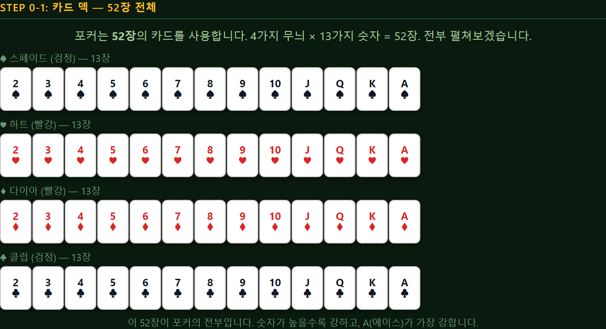

- **4가지 무늬**: ♠ 스페이드, ♥ 하트, ♦ 다이아몬드, ♣ 클로버
- **13개 숫자**: A(에이스), 2, 3, 4, 5, 6, 7, 8, 9, 10, J(잭), Q(퀸), K(킹)
- 무늬 4개 × 숫자 13개 = **총 52장**

### 1-2. "패(핸드)"란? — 5장의 조합

포커에서는 카드 **5장의 조합**을 하나의 **패(핸드)**라고 부릅니다. 이 5장이 얼마나 좋은지에 따라 승패가 결정됩니다.

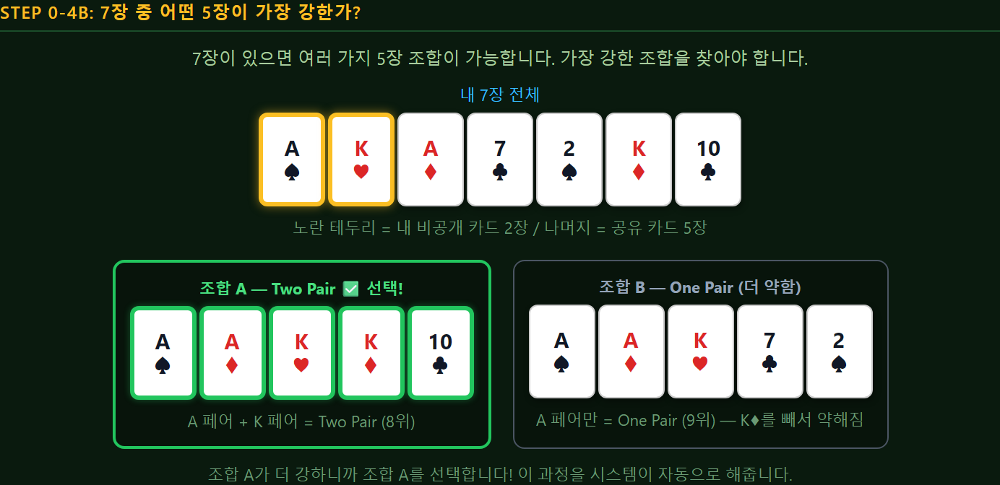

### 1-3. 패의 서열 — 10단계

어떤 5장 조합이 더 강한지 정해져 있습니다. 아래로 갈수록 강합니다:

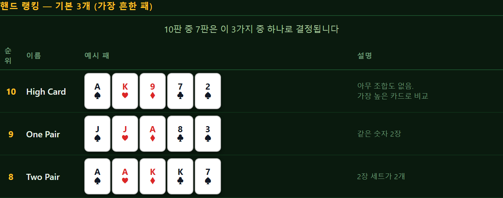

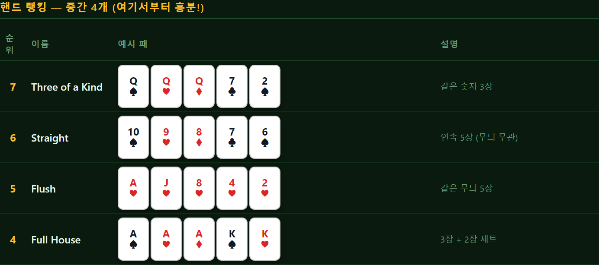

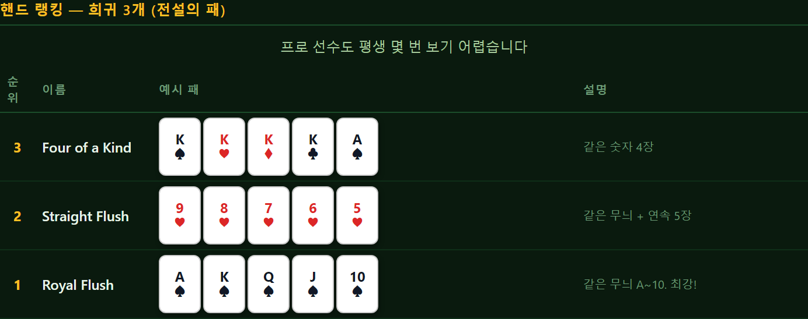

| 순위 | 이름 | 설명 |
|:----:|------|------|
| 1 | 하이카드 | 아무 조합도 없음 — 가장 높은 숫자 1장으로 비교 |
| 2 | 원페어 | 같은 숫자 2장 |
| 3 | 투페어 | 원페어가 2개 |
| 4 | 쓰리카드 | 같은 숫자 3장 |
| 5 | **스트레이트** | 숫자가 빈틈 없이 연속 5개 (예: 5-6-7-8-9) |
| 6 | **플러시** | 무늬가 전부 같은 5장 (예: ♠♠♠♠♠) |
| 7 | 풀하우스 | 쓰리카드 + 원페어 |
| 8 | 포카드 | 같은 숫자 4장 |
| 9 | 스트레이트 플러시 | 스트레이트 + 플러시 동시 |
| 10 | 로열 플러시 | 10-J-Q-K-A 스트레이트 플러시 — **가장 강한 패** |

> 이 서열은 나중에 매우 중요합니다. **스트레이트**(숫자 연속)와 **플러시**(무늬 통일)는 특히 기억하세요.

*카드와 패를 알았으니, 이제 Draw 포커가 무엇인지 전체 그림을 봅시다.*

---

## §2. Draw 포커란? — 전체 그림

### 2-1. 포커란?

카드를 받고, 돈을 걸고, 가장 좋은 패를 가진 사람이 이기는 게임입니다.

### 2-2. 포커의 3대 계열

포커에는 카드를 다루는 방식에 따라 **3가지 큰 가족**이 있습니다:

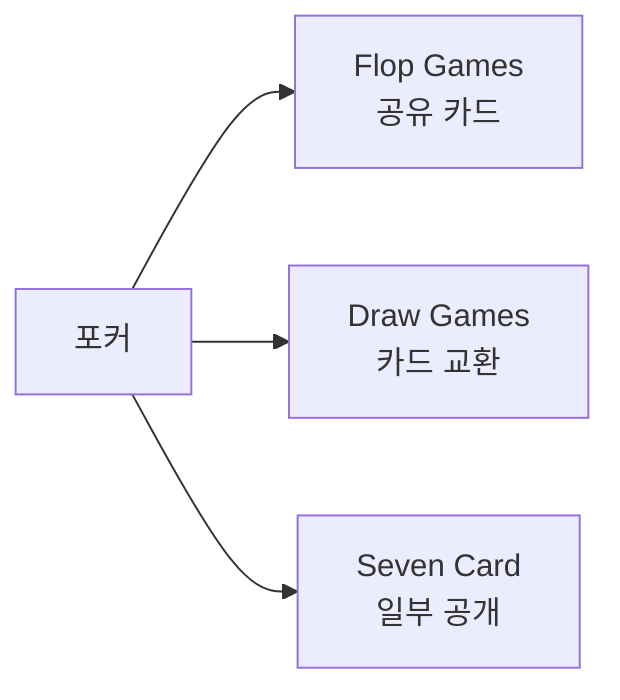
```mermaid
flowchart LR
    A["포커"] --> B["Flop Games<br/>공유 카드"]
    A --> C["Draw Games<br/>카드 교환"]
    A --> D["Seven Card<br/>일부 공개"]
```

| 계열 | 핵심 | 대표 게임 |
|------|------|----------|
| **Flop Games** | 테이블 가운데 **공유 카드**를 모두가 봄 | Texas Hold'em |
| **Draw Games** | 마음에 안 드는 카드를 **새 카드로 교환** | 2-7 Triple Draw |
| **Seven Card Games** | 카드 일부를 **공개**, 일부를 숨김 | 7-Card Stud |

> **이 문서는 Draw Games를 다룹니다.** 나머지 계열은 별도 문서에서 설명합니다.

### 2-3. Draw의 핵심 — 카드 교환

Draw 포커의 핵심은 단순합니다. 카드를 받고, 나쁜 카드를 버리고, 새 카드를 받습니다:

**① 카드 5장을 받는다**

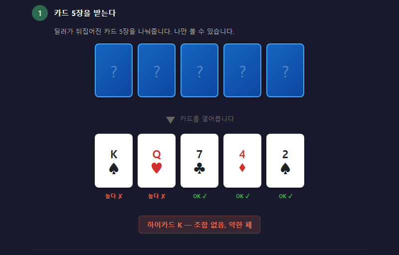

**② 나쁜 카드를 버린다** — K♠, Q♥를 선택하여 버립니다. 빈 자리가 생깁니다.

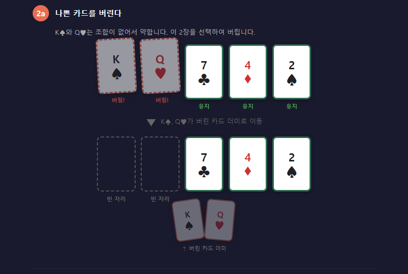

**③ 새 카드를 받는다** — 덱에서 새 카드 2장이 빈 자리를 채웁니다. 이것이 **드로우(Draw)**!

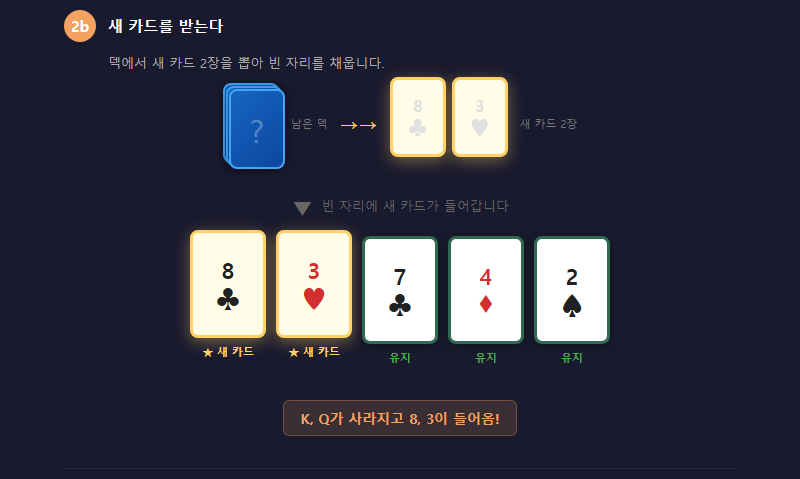

**④ 좋아진 패로 승부한다** — 교환 전과 비교하면 K, Q가 사라지고 패가 개선되었습니다.

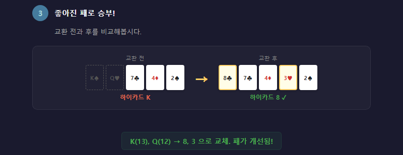

- 몇 장을 바꿀지는 **내가 선택** (0장~전부)
- 하나도 안 바꿀 수도 있음 = **스탠드 팻(Stand Pat)** ("그대로 유지한다"는 뜻)
- 교환 기회: **1회**(Single Draw) 또는 **3회**(Triple Draw)

### 2-4. 이 문서의 지도 — 7개 게임 미리보기

이 문서에서 다루는 7개 게임입니다. **이 순서대로** 하나씩 배워갑니다:

1. **파이브 카드 드로우** — 가장 단순. 강한 패가 이긴다
2. **2-7 트리플 드로우** — 가장 **약한** 패가 이긴다 (로우볼)
3. **2-7 싱글 드로우** — ②와 같은 규칙, 교환 1회만
4. **A-5 트리플 드로우** — ②와 비슷하지만 에이스가 유리
5. **바둑이** — 4장만 사용하는 완전히 다른 게임
6. **바듀시** — 바둑이 + 로우볼을 합친 이중 게임
7. **바다시** — ⑥과 비슷하지만 에이스가 유리

> 쉬운 게임부터 시작하여 점점 복잡한 게임으로 나아갑니다.

*Draw 포커의 전체 그림을 알았으니, 게임에서 돈을 거는 방법을 배워봅시다.*

---

## §3. 베팅의 기본

포커는 카드 게임인 동시에 **베팅(돈 걸기) 게임**입니다. 게임 중간중간에 "더 걸까, 포기할까"를 결정합니다.

### 3-1. 내 차례에 할 수 있는 5가지

| 한글 | 영어 | 의미 |
|------|------|------|
| **포기** | Fold | 카드를 버리고 이번 판에서 빠진다 |
| **넘기기** | Check | 아무것도 걸지 않고 다음 사람에게 넘긴다 (아무도 안 걸었을 때만) |
| **따라 걸기** | Call | 앞 사람과 **같은 금액**을 건다 |
| **처음 걸기** | Bet | 이번 라운드에서 **처음으로** 금액을 건다 |
| **더 올리기** | Raise | 앞 사람보다 **더 많이** 건다 |

> 모든 사람이 같은 금액을 맞추거나 포기하면 베팅 라운드가 끝납니다.

### 3-2. 블라인드 — 게임을 시작시키는 강제 베팅

매 판 시작 전, **2명이 의무적으로** 소액을 냅니다. 이걸 **블라인드(Blind)**라고 합니다.

왜 필요할까요? 블라인드가 없으면 아무도 돈을 안 걸고 좋은 패만 기다립니다 — 게임이 진행되지 않습니다.

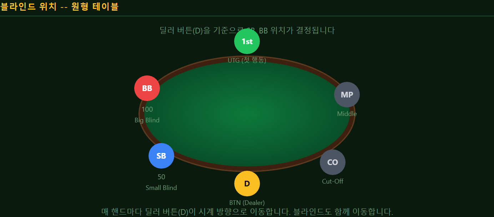

- **스몰 블라인드**: 딜러 왼쪽. 적은 금액
- **빅 블라인드**: 스몰 블라인드 왼쪽. 스몰의 2배. **최소 베팅 기준**

> "블라인드(Blind)"라는 이름은 **카드를 보지 못한 채** 거는 돈이기 때문입니다 — "눈을 가린 채".

딜러 버튼은 매 판마다 시계 방향으로 이동합니다. 블라인드도 함께 이동하여 모든 플레이어가 공평하게 냅니다.

### 3-3. 베팅 한도 — 노 리밋과 픽스드 리밋

게임마다 "얼마까지 걸 수 있는가"가 다릅니다. 두 가지 방식이 있습니다:

| 한글 | 영어 | 의미 | 느낌 |
|------|------|------|------|
| **무제한 베팅** | No Limit (NL) | 가진 칩 **전부**를 한 번에 걸 수 있다 | 긴장감 높음 |
| **고정 베팅** | Fixed Limit (FL) | 정해진 금액**만** 걸 수 있다 | 안정적, 전략적 |

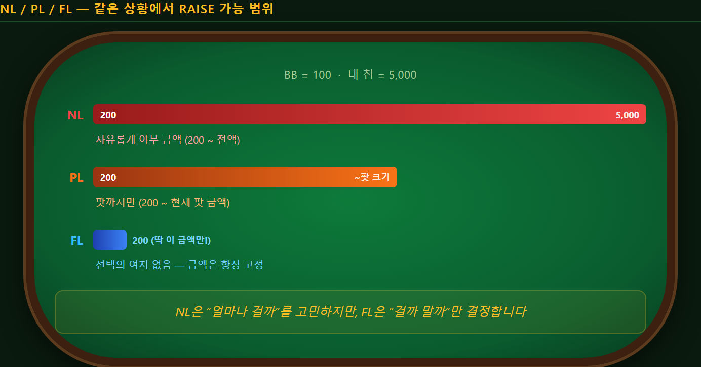

> 각 게임에서 처음 만날 때 자세히 설명합니다. 지금은 "두 가지 방식이 있다"만 기억하세요.

*베팅을 알았으니, 첫 번째 게임을 해봅시다!*

---

## §4. 첫 번째 게임 — 파이브 카드 드로우

> 🤠 가장 오래되고 가장 단순한 포커. 서부 영화에서 카우보이가 하던 바로 그 포커입니다.

| 규칙 | 내용 |
|------|------|
| 카드 | **5장** |
| 교환 | **1회** (0~3장 선택) |
| 승리 | **가장 강한 패** (§1의 핸드 랭킹 그대로) |
| 베팅 | **무제한 베팅(NL)** — 가진 칩 전부를 한 번에 걸 수 있다 |
| 최대 인원 | **7명** |

### 한 판의 흐름

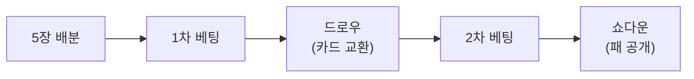
```mermaid
flowchart LR
    A["5장 배분"] --> B["1차 베팅"]
    B --> C["드로우<br/>(카드 교환)"]
    C --> D["2차 베팅"]
    D --> E["쇼다운<br/>(패 공개)"]
```

### Step 1. 카드 5장을 받습니다

딜러가 뒤집어진 카드 **5장**을 나눠줍니다. **나만** 볼 수 있습니다.

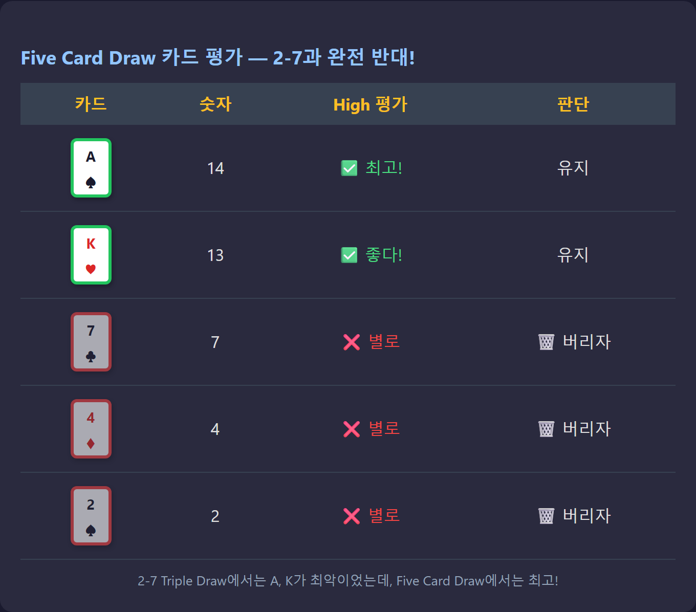

> A♠와 K♥는 높아서 좋은 카드! 7♣, 4♦, 2♠는 약합니다.

### Step 2. 1차 베팅

카드를 본 후 베팅합니다. 패가 좋으면 돈을 더 걸고(레이즈), 나쁘면 포기(폴드)하거나 따라갑니다(콜).

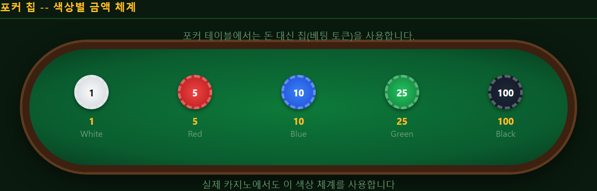

무제한 베팅(NL)이므로, 원한다면 **가진 칩 전부를 한 번에** 걸 수 있습니다.

### Step 3. 드로우 — 카드를 교환합니다

이것이 Draw 포커의 핵심! **마음에 안 드는 카드를 버리고 새 카드를 받습니다.**

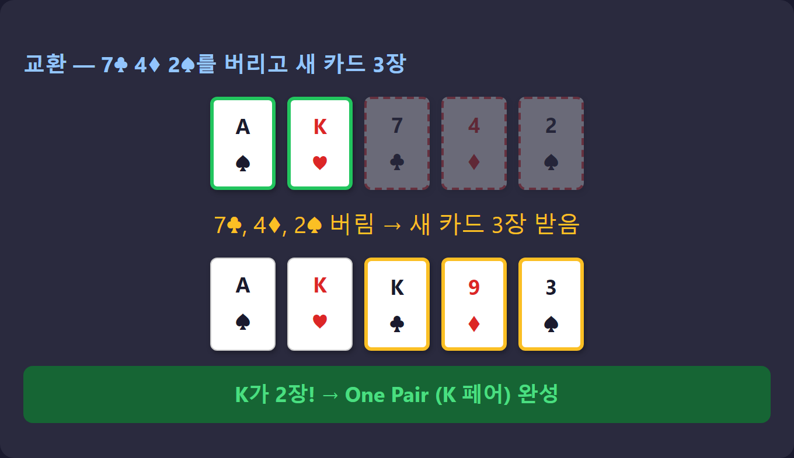

- A♠, K♥를 남기고 → 나머지 3장을 버림 → 새 카드 3장을 받음
- 결과: K♥ K♣ = **K 원페어** 완성!
- 0~3장을 선택하여 교환합니다 (하나도 안 바꿔도 됩니다)

### Step 4. 2차 베팅

교환 후 다시 베팅합니다. 패가 좋아졌으면 강하게, 아니면 조심스럽게.

### Step 5. 쇼다운 — 패를 공개합니다

남은 플레이어가 카드를 공개합니다. **가장 강한 패를 가진 사람이 승리!**

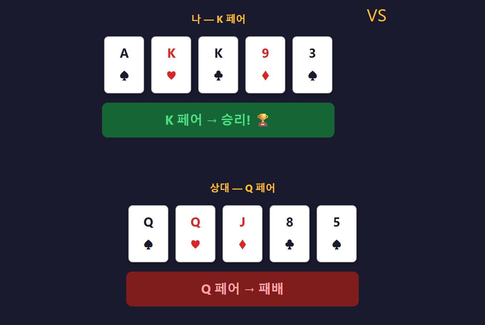

> K 페어 > Q 페어 → **K 페어가 승리!** (같은 원페어끼리는 숫자가 높은 쪽이 이깁니다)

### 핵심 정리

- 가장 단순한 포커: 5장 받고, 1번 교환, 강한 패가 이긴다
- 상대 카드가 **전혀 보이지 않으므로** 심리전이 가장 중요합니다
- 무제한 베팅(NL): "얼마를 걸까?"가 중요한 전략

*Five Card Draw에서는 강한 패가 이겼습니다. 그런데... 약한 패가 이기는 세계가 있다면?*

---

## §5. 로우볼 — 약한 패가 이기는 세계

방금 Five Card Draw에서는 **가장 강한 패**가 이겼습니다. 이제 규칙을 완전히 뒤집어봅시다.

### 5-1. 모든 것이 반대

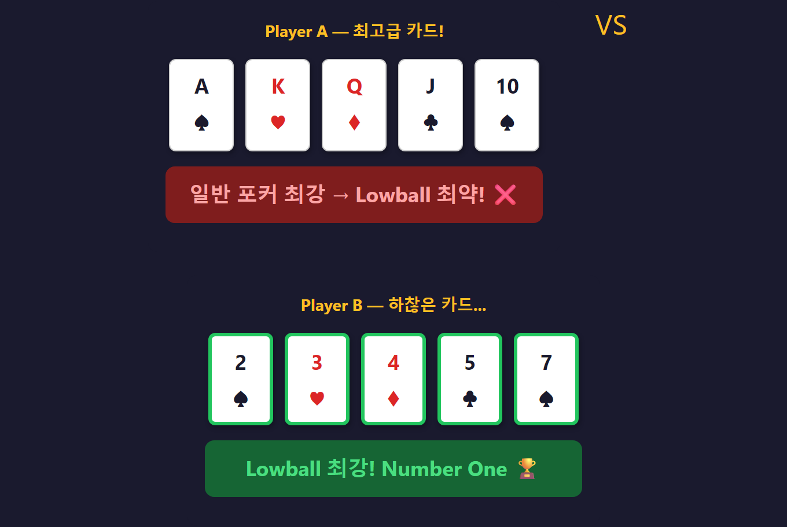

일반 포커에서는 당연히 **A가 승리**. 하지만 **로우볼(Lowball)**에서는 **B가 승리**합니다!

**로우볼** = 가장 **약한(낮은)** 패가 이기는 방식. 숫자가 낮을수록 좋고, 높을수록 나쁩니다.

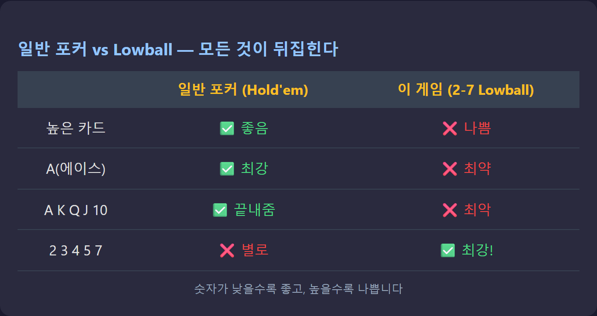

- 일반 포커에서 "높은 패가 좋다" = **하이(High)**
- 로우볼에서 "낮은 패가 좋다" = **로우(Low)**

### 5-2. 두 가지 로우볼 체계

같은 로우볼이지만, "어떤 카드가 낮은 건가?"를 판단하는 기준이 2가지 있습니다:

| | 2-7 로우볼 | A-5 로우볼 |
|------|:-:|:-:|
| **에이스(A)** | 가장 **높은** 카드 = **불리** | 가장 **낮은** 카드 = **유리** |
| **스트레이트/플러시** | **페널티** (만들어지면 불리) | **무시** (상관없음) |
| **최강 패** | 2-3-4-5-**7** | **A**-2-3-4-5 |
| **별명** | — | **휠(Wheel)** |

> **왜 2-3-4-5-7이 최강일까?** 2-3-4-5-6은 숫자가 연속(스트레이트)이라 페널티! 6 대신 **7**이어야 스트레이트를 피합니다.

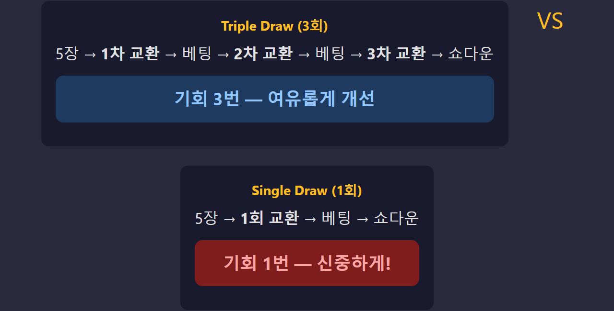

> **휠(Wheel)** = A-2-3-4-5. A-5 로우볼에서 가장 좋은(가장 낮은) 패. "바퀴"라는 뜻입니다.

### 5-3. 같은 카드, 완전히 다른 결과

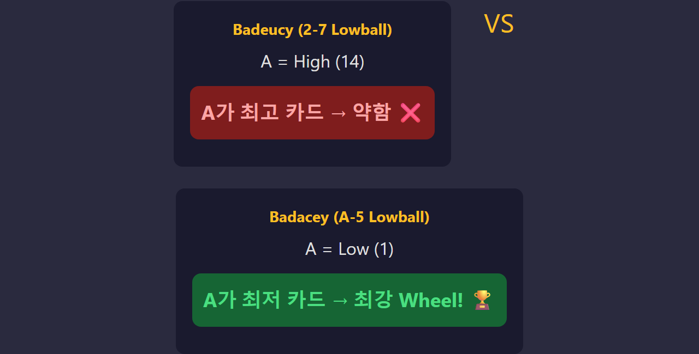

A♠-2♥-3♦-4♣-5♠:
- **2-7 로우볼**: A = 가장 높은 카드(14) + 스트레이트 페널티 → **매우 약한 패**
- **A-5 로우볼**: A = 1 + 스트레이트 무시 → **최강 패 (Wheel)!**

> 같은 5장인데 규칙에 따라 강도가 완전히 뒤집힙니다!

*로우볼을 알았으니, 가장 인기 있는 로우볼 게임을 해봅시다.*

---

## §6. 두 번째 게임 — 2-7 트리플 드로우

> 🏠 Draw 게임 중 가장 인기 있는 로우볼 게임. WSOP(세계 최대 포커 대회)의 정식 종목입니다.

| 규칙 | 내용 |
|------|------|
| 카드 | **5장** |
| 교환 | **3회** (매번 0~5장 선택) — 그래서 "트리플 드로우" |
| 승리 | **가장 약한 패** (2-7 로우볼) |
| 에이스(A) | 가장 **높은** 카드 = **불리** |
| 스트레이트/플러시 | **페널티** (만들어지면 불리) |
| 최강 패 | 2-3-4-5-**7** |
| 베팅 | **고정 베팅(FL)** — 정해진 금액만 걸 수 있다 |
| 최대 인원 | **6명** |

### 고정 베팅(Fixed Limit)이란? — 이 게임의 베팅 방식

Five Card Draw에서는 원하는 만큼 자유롭게 걸었습니다(무제한 베팅). 이 게임에서는 다릅니다: **걸 수 있는 금액이 정해져** 있습니다.

"얼마나 걸까?"를 고민할 필요 없이, **"걸까, 말까?"만** 결정합니다.

#### 소액(Small Bet)과 대액(Big Bet)

고정 베팅에는 **2가지 고정 금액**이 있습니다. 게임 진행에 따라 바뀝니다:

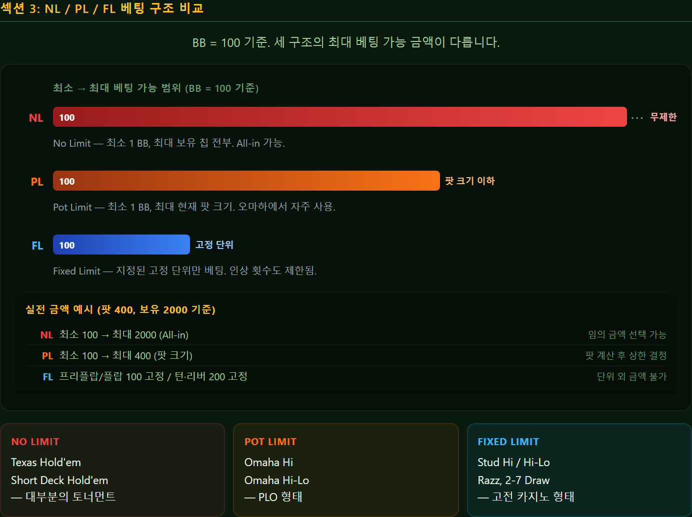

- **소액(Small Bet)**: 게임 전반부에 사용하는 작은 고정 금액
- **대액(Big Bet)**: 게임 후반부에 사용하는 큰 고정 금액 = 소액의 **2배**

> 예: "200/400" 게임이면 → 전반 200씩, 후반 400씩 고정

이것을 게임 흐름에 대입하면 이렇게 됩니다:

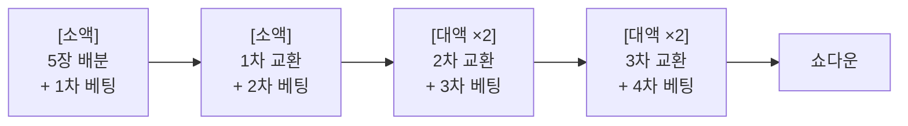
```mermaid
flowchart LR
    A["[소액]<br/>5장 배분<br/>+ 1차 베팅"] --> B["[소액]<br/>1차 교환<br/>+ 2차 베팅"]
    B --> C["[대액 ×2]<br/>2차 교환<br/>+ 3차 베팅"]
    C --> D["[대액 ×2]<br/>3차 교환<br/>+ 4차 베팅"]
    D --> E["쇼다운"]
```

> 전반 2라운드는 소액, 후반 2라운드는 대액 — **후반으로 갈수록 판돈이 2배**가 됩니다.

#### 캡(Cap) — 한 라운드에 최대 4번까지만

한 베팅 라운드에서 금액을 올리는 횟수에 **제한**이 있습니다: **최대 4번**(처음 걸기 1회 + 올리기 3회). 4번째를 **캡(Cap)**이라 부르며, 그 이후에는 따라 걸기(콜) 또는 포기(폴드)만 가능합니다.

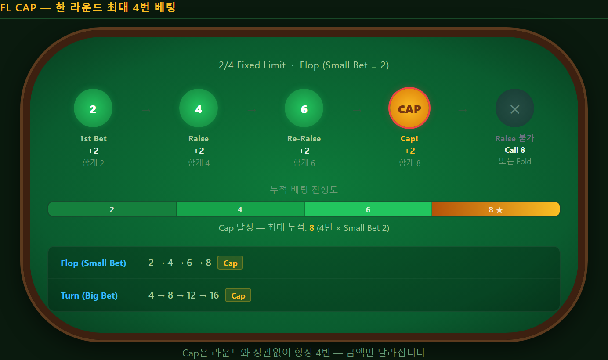

### Step 1. 카드 5장을 받고, 높은 카드를 버립니다

이 게임은 로우볼이므로 **높은 숫자가 나쁜 카드**입니다!

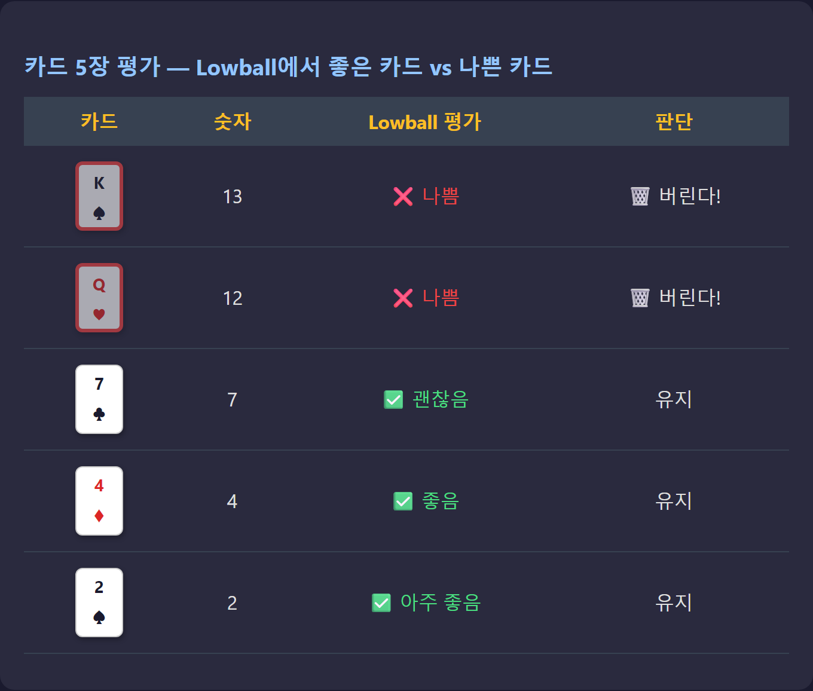

> K♠(13)과 Q♥(12)는 높아서 나쁨! 버리고 새 카드를 받습니다.

### Step 2. 교환을 3번 반복합니다

매 교환 전후에 베팅이 진행됩니다. 3번의 교환을 거치면서 패가 점점 좋아집니다 (= 숫자가 점점 낮아집니다):

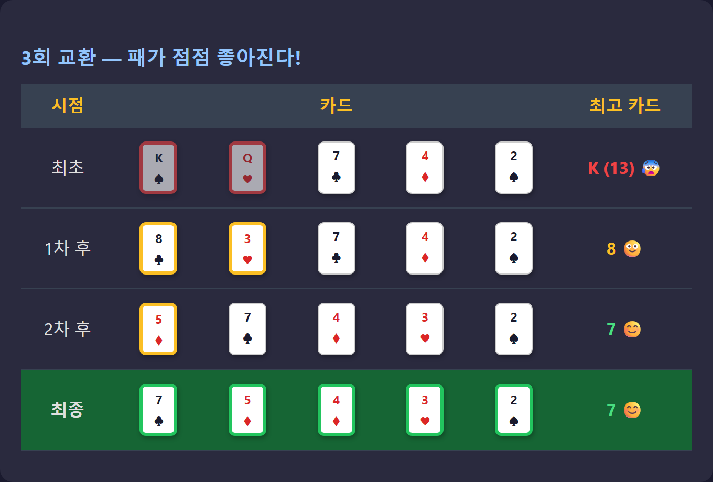

### Step 3. 승부 — 가장 높은 카드를 비교

각자 5장 중 **가장 높은 카드**를 비교합니다. **낮은 쪽이 승리!**

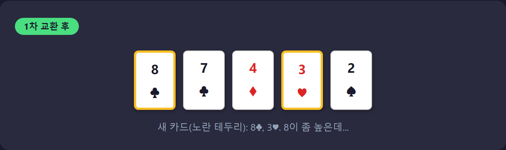

> 7 < 8 → **7 Low가 승리!** 같으면 두 번째로 높은 카드를 비교합니다.

### 주의! 2가지 함정

**함정 1: 에이스(A)는 가장 높은 카드 = 불리!**

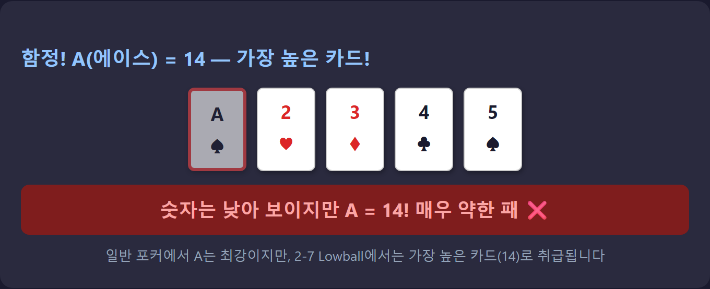

**함정 2: 스트레이트와 플러시는 페널티!**

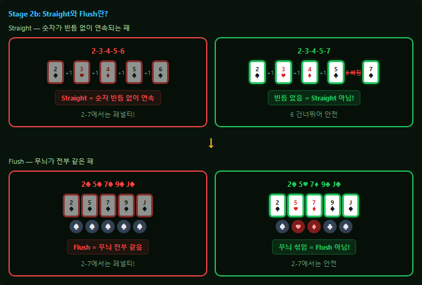

### 2-7 로우볼 핸드 랭킹

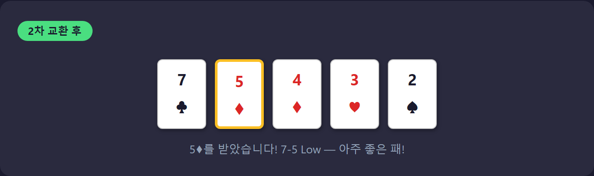

> 핵심 3줄: **숫자 낮을수록 강함** / **에이스 = 불리** / **스트레이트·플러시 = 페널티**

*세 번 바꾸는 게 있으면, 한 번만 바꾸는 것도 있습니다.*

---

## §7. 세 번째 게임 — 2-7 싱글 드로우

> 1️⃣ 2-7 로우볼인데 교환 기회가 **1회**뿐

| §6과 같은 점 | §6과 다른 점 |
|:-----------:|:-----------:|
| 5장, 2-7 로우볼 | 교환 **1회** (3회 → 1회) |
| A = 높다(불리) | 베팅: **무제한 베팅(NL)** (고정 → 무제한) |
| 스트레이트/플러시 = 페널티 | 최대 인원: **7명** (6명 → 7명) |
| 최강 패 2-3-4-5-7 | 베팅 라운드: **2회** (4회 → 2회) |

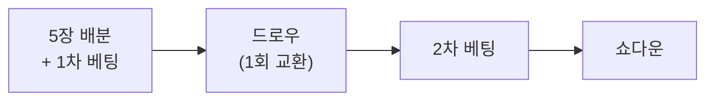
```mermaid
flowchart LR
    A["5장 배분<br/>+ 1차 베팅"] --> B["드로우<br/>(1회 교환)"]
    B --> C["2차 베팅"] --> D["쇼다운"]
```

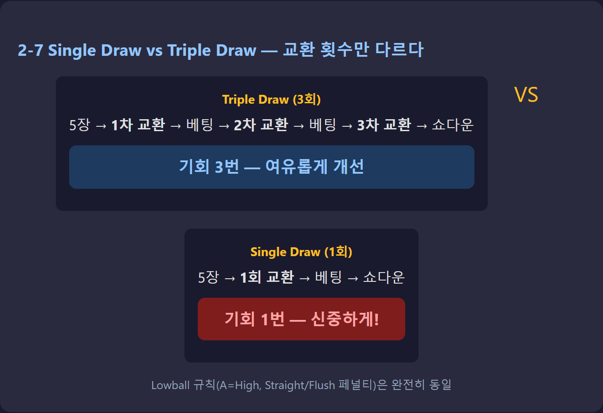

교환 기회가 1번뿐이니 **어떤 카드를 바꿀지 신중하게** 결정해야 합니다. 무제한 베팅(NL)이므로 한 번에 전 칩을 밀 수 있어 긴장감이 높습니다.

*2-7에서는 스트레이트와 플러시가 불리했습니다. 더 관대한 규칙도 있습니다.*

---

## §8. 네 번째 게임 — A-5 트리플 드로우

> 🔄 2-7 트리플 드로우와 같은 구조, 하지만 **에이스가 유리**하고 **스트레이트/플러시가 무시**됩니다

| §6 (2-7 TD)과 같은 점 | §6과 다른 점 |
|:--------------------:|:-----------:|
| 5장, 3회 교환, 로우볼, FL | 에이스(A) = **낮다 (유리!)** |
| 베팅 라운드 4회 | 스트레이트/플러시 = **무시** |
| 최대 6명 | 최강 패: **A-2-3-4-5 (Wheel)** |

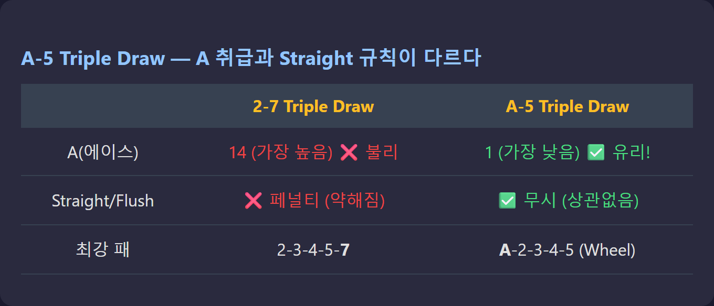

2-7 트리플 드로우와 게임 흐름(5장, 3회 교환, 4번 베팅, 고정 베팅)은 **완전히 동일**합니다. 다른 것은 **패를 판정하는 기준**뿐입니다.

> 2-7에서는 A-2-3-4-5가 최약이었지만, A-5에서는 **최강(Wheel)**입니다!

*지금까지 모든 게임은 5장이었습니다. 4장만 쓰는, 완전히 다른 게임이 있습니다.*

---

## §9. 다섯 번째 게임 — 바둑이

> 🌈 지금까지 배운 것을 잠시 잊으세요. **4장**, **4무늬 모두 다름** = 완전히 새로운 랭킹 체계

| 규칙 | 내용 |
|------|------|
| 카드 | **4장** (5장이 아님!) |
| 교환 | **3회** |
| 승리 | **4무늬 다양성** + 낮은 숫자 |
| 최강 패 | A♠ 2♥ 3♦ 4♣ — 4가지 무늬가 모두 다르고, 숫자가 낮다 |
| 베팅 | 고정 베팅(FL), 4라운드 |
| 최대 인원 | **8명** (4장이라 카드 여유) |

### 바둑이 랭킹 — 무늬가 전부 달라야 한다

- 4가지 무늬(♠♥♦♣)가 **모두 달라야** 합니다 = **바둑이**
- 같은 무늬가 있으면 → 높은 쪽이 **죽은 카드** → 실질 카드 수 감소
- 같은 숫자(페어)가 있어도 → 하나가 **죽은 카드**
- **4장 바둑이 > 3장 > 2장 > 1장** (카드 수가 많을수록 강함)
- 같은 장수라면 **숫자가 낮을수록** 강함

> **레인보우(Rainbow)** = 무늬가 전부 다른 상태. 바둑이에서 가장 좋은 상태입니다.

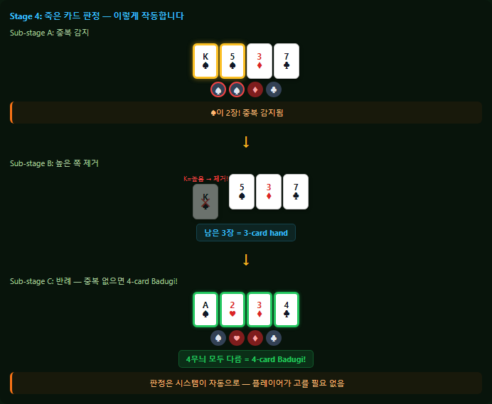

### 실전 예시 — 중복 무늬를 교환!

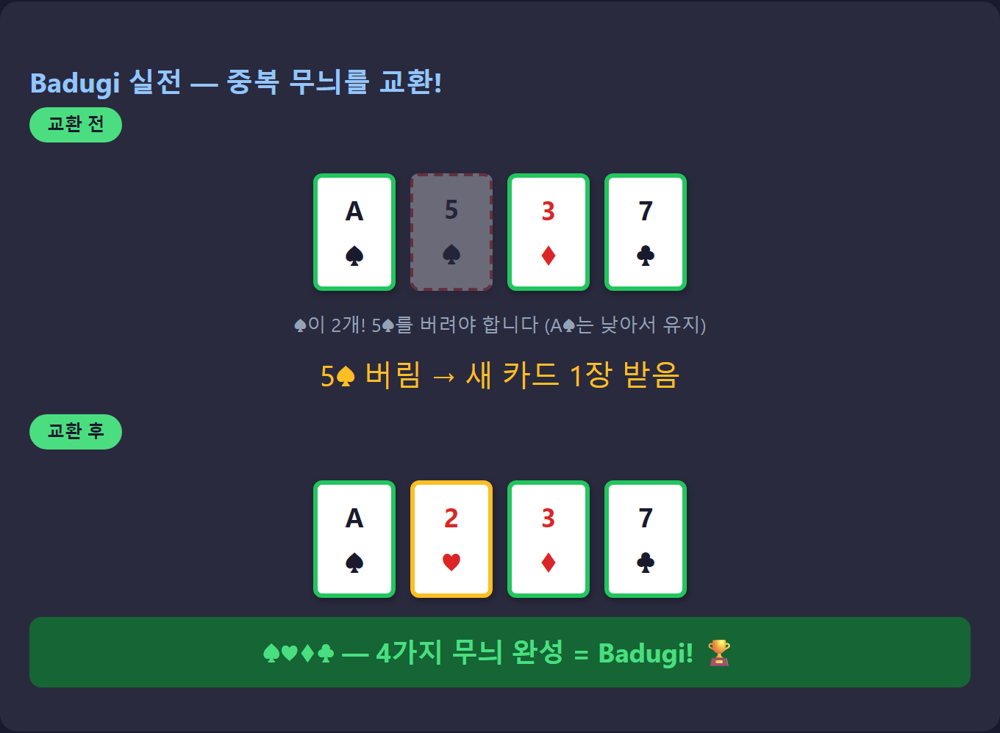

> ♠이 2개(A♠, 5♠) → 5♠를 버림 → 새 카드 2♥ → **4장 바둑이 완성!**

### 한 판의 흐름

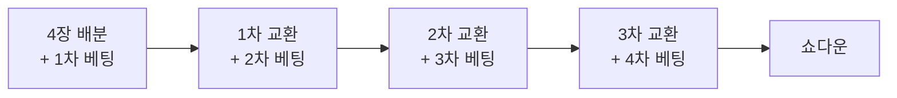
```mermaid
flowchart LR
    A["4장 배분<br/>+ 1차 베팅"] --> B["1차 교환<br/>+ 2차 베팅"]
    B --> C["2차 교환<br/>+ 3차 베팅"]
    C --> D["3차 교환<br/>+ 4차 베팅"]
    D --> E["쇼다운"]
```

*지금까지는 한 명만 이겼습니다. 두 명이 나눠 가지는 게임이 있다면?*

---

## §10. 스플릿 팟 — 팟을 둘로 나누다

지금까지 모든 게임에서는 **한 명**이 팟(판돈) 전부를 가져갔습니다.

하지만 마지막 2개 게임(바듀시, 바다시)에서는 **팟을 둘로 나눕니다**:

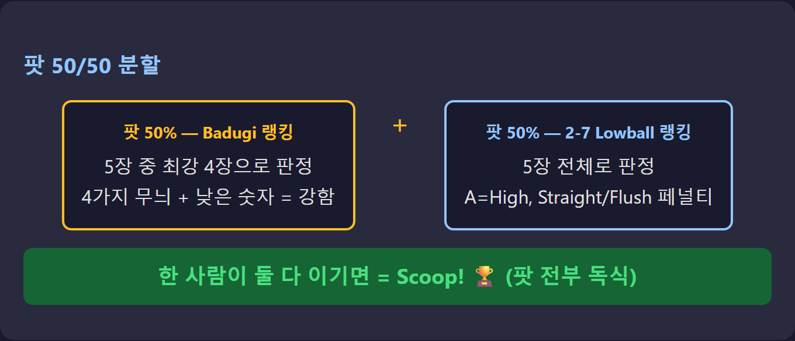

- 팟의 **50%** → 기준 A로 이긴 사람
- 팟의 **50%** → 기준 B로 이긴 사람

한 사람이 **양쪽 모두** 이기면? 팟 전부를 독식합니다. 이것을 **스쿱(Scoop)**이라고 부릅니다.

> **스쿱(Scoop)** = "쓸어 담다". 양쪽 다 이겨서 팟 전부를 가져가는 것.

*스플릿 팟을 알았으니, 바둑이와 로우볼을 합친 게임을 해봅시다.*

---

## §11. 여섯 번째 게임 — 바듀시

> 🔀 **바둑이 + 2-7 로우볼**을 동시에 — 팟 50/50 분할

| 규칙 | 내용 |
|------|------|
| 카드 | **5장** |
| 교환 | **3회** |
| 승리 | 팟 50%: **바둑이 랭킹** 승자 / 팟 50%: **2-7 로우볼** 승자 |
| 에이스(A) | 양쪽 모두 **높다 (불리)** |
| 베팅 | 고정 베팅(FL), 4라운드 |
| 최대 인원 | **6명** |

한 판에 **두 가지 게임을 동시에** 합니다!

- 5장 중 **최강 4장**으로 바둑이 판정 (최강 = 2♠3♥4♦5♣, 4색 레인보우)
- 5장 **전체**로 2-7 로우볼 판정 (최강 = 2-3-4-5-7)
- 한 사람이 둘 다 이기면 **스쿱!** (팟 전부 독식)

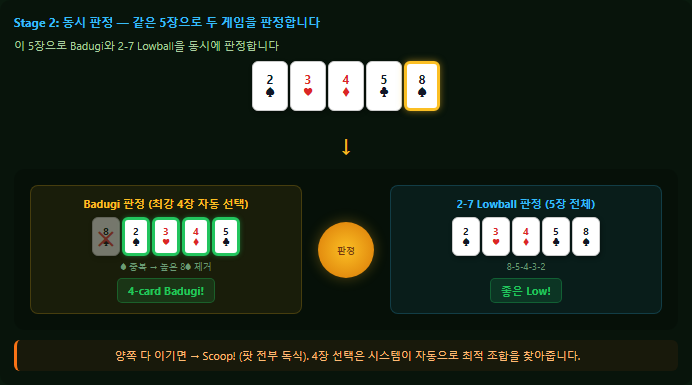

> ⚠️ 일반 바둑이에서는 에이스가 낮아서 유리하지만, **바듀시에서는 에이스가 양쪽 모두 높아서 불리합니다.** 이것이 가장 중요한 차이점!

### 전략적 딜레마

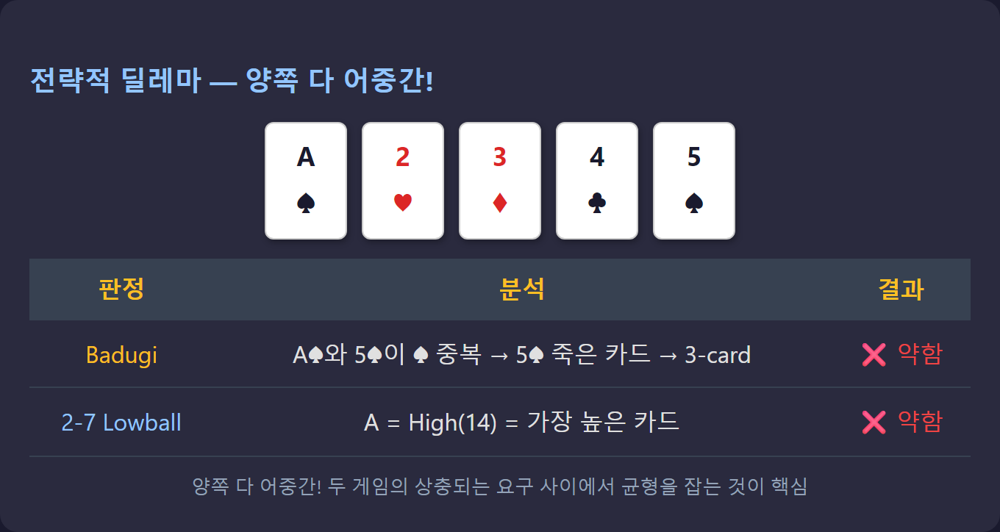

> 바둑이에서 좋은 패와 로우볼에서 좋은 패가 **항상 같지는 않습니다**. 두 게임 사이에서 균형을 잡는 것이 핵심 전략입니다.

*바듀시가 2-7을 썼다면, 바다시는 A-5를 씁니다.*

---

## §12. 일곱 번째 게임 — 바다시

> 🔀 **바둑이 + A-5 로우볼**을 동시에 — 팟 50/50 분할

| §11 바듀시와 같은 점 | §11과 다른 점 |
|:------------------:|:-----------:|
| 5장, 3회 교환, 스플릿 팟 | 로우볼 기준: **A-5** (2-7 → A-5) |
| 고정 베팅(FL), 6명 | 에이스(A) = **양쪽 모두 낮다 (유리!)** |
| 바둑이 절반 | 최강 바둑이: **A♠2♥3♦4♣** |

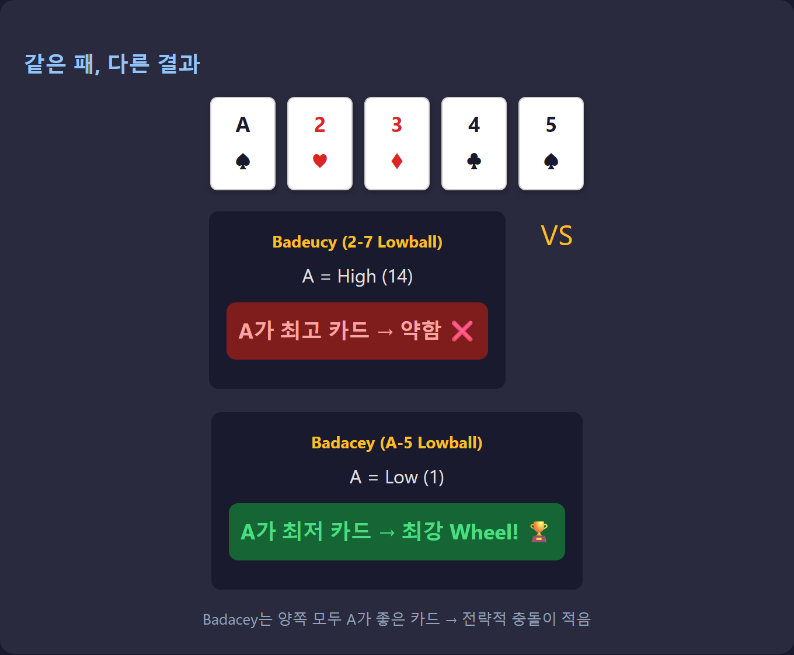

- 바듀시: 에이스 = 높다 (양쪽 모두 **불리**) → 전략적 충돌이 심함
- **바다시: 에이스 = 낮다 (양쪽 모두 유리)** → 전략적 충돌이 적음

> 바다시에서는 에이스가 양쪽 모두에서 좋은 카드이므로, 바듀시보다 패 만들기가 수월합니다.

*7가지 게임을 모두 배웠습니다. 전체를 한눈에 비교해봅시다.*

---

## §13. 총정리

### 7가지 Draw 게임 — 빠른 비교

| 게임 | 카드 | 교환 | 승리 | 에이스 | 베팅 | 최대 |
|------|:----:|:----:|:----:|:-----:|:----:|:----:|
| 파이브 카드 드로우 | 5장 | 1회 | **강한 패** | 유리 | NL | 7 |
| 2-7 트리플 드로우 | 5장 | 3회 | 약한 패 | 불리 | FL | 6 |
| 2-7 싱글 드로우 | 5장 | 1회 | 약한 패 | 불리 | NL | 7 |
| A-5 트리플 드로우 | 5장 | 3회 | 약한 패 | **유리** | FL | 6 |
| 바둑이 | **4장** | 3회 | 4색+낮음 | 유리 | FL | **8** |
| 바듀시 | 5장 | 3회 | 스플릿 | 불리 | FL | 6 |
| 바다시 | 5장 | 3회 | 스플릿 | **유리** | FL | 6 |

### 용어 정리

| 한글 | 영어 | 의미 |
|------|------|------|
| 드로우 | Draw | 카드를 버리고 새 카드를 받는 교환 |
| 스탠드 팻 | Stand Pat | 카드를 하나도 안 바꿈 |
| 로우볼 | Lowball | 가장 약한 패가 이기는 방식 |
| 하이 / 로우 | High / Low | 강한 패 승리 / 약한 패 승리 |
| 무제한 베팅 | No Limit (NL) | 금액 제한 없이 걸 수 있음 |
| 고정 베팅 | Fixed Limit (FL) | 정해진 금액만 걸 수 있음 |
| 소액 / 대액 | Small Bet / Big Bet | 고정 베팅의 전반/후반 금액 |
| 캡 | Cap | 한 라운드 최대 올림 횟수 |
| 블라인드 | Blind | 카드 보기 전 내는 강제 베팅 |
| 휠 | Wheel | A-2-3-4-5 (A-5 로우볼 최강 패) |
| 레인보우 | Rainbow | 무늬가 전부 다른 상태 |
| 스쿱 | Scoop | 스플릿 팟에서 양쪽 모두 이김 |
| 쇼다운 | Showdown | 베팅 종료 후 패를 공개하여 승부 |
| 버린 카드 더미 | Muck | 사용 완료되어 모아둔 카드 |

### 공통 절차 규칙 (WSOP 기준)

| 규칙 | 설명 |
|------|------|
| **교환 장수 변경 불가** | 버릴 카드를 테이블에 내려놓으면 교환 장수를 바꿀 수 없습니다 |
| **전원 스탠드 팻 시** | 모든 플레이어가 교환하지 않아도, 딜러는 카드 1장을 태웁니다(burn) |
| **5장 전체 교환** | 5장을 모두 바꾸는 경우, 5장을 연속으로 받습니다 |
| **카드 1장 노출** | 초기 배분 중 1장 노출 시 → 교체 |
| **카드 2장 노출** | 초기 배분 중 2장 노출 시 → 전체 재배분 |

---

## Phase 매핑

| Phase | 게임 |
|:-----:|------|
| **Phase 3** (2027 H1) | 2-7 Triple Draw, 2-7 Single Draw |
| **Phase 4** (2027 H2) | Five Card Draw, A-5 Triple Draw, Badugi, Badeucy, Badacey |
