# Seven Card Games 계열 — 3종 게임 규칙 가이드

| 날짜 | 항목 | 내용 |
|------|------|------|
| 2026-04-01 | 신규 작성 | 3종 Seven Card Games 규칙 가이드 초판 v4.0.0 |

> **Version**: 4.0.0 | **Date**: 2026-04-01
> **대상 독자**: 포커를 모르는 사람 누구나

---

## 이 게임은 무엇인가?

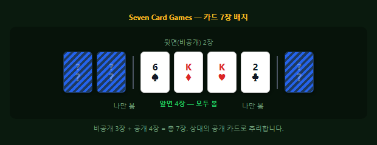

카드 7장을 받습니다. 그 중 **4장은 상대에게 보이고**, **3장은 나만 봅니다**. 상대의 공개 카드 4장을 보고 **숨겨진 3장을 추리**하는 것이 이 게임의 전부입니다.

이 문서에서는 **7-Card Stud**를 먼저 한 판 완전히 체험한 뒤, 나머지 2종(Stud Hi-Lo, Razz)은 "7-Card Stud에서 뭐가 달라지는가?"로 익힙니다.

---

## 알아야 할 기초 2가지

### 카드 52장

포커는 일반 트럼프 카드 **52장**을 사용합니다. 4가지 무늬(♠♥♦♣) × 13가지 숫자(2~A) = 52장.


> 숫자는 2가 가장 약하고, **A(에이스)**가 가장 강합니다.

---

### 비공개 카드와 공개 카드

Seven Card Games에서는 카드를 총 **7장** 받습니다. 그 중 일부는 **뒷면(비공개)**, 일부는 **앞면(공개)**으로 놓입니다.


상대의 공개 카드 4장을 보고 **비공개 3장에 무엇이 있는지 추리**합니다.

---

## 1. 7-Card Stud — 한 판을 처음부터 끝까지

Seven Card Games의 대표 게임입니다. 한 판을 따라가며 모든 규칙을 배웁니다.

### 1-1. Ante — 전원 참가비

게임 시작 전, 테이블의 **모든 플레이어**가 같은 금액을 냅니다. 낸 돈은 테이블 중앙에 쌓입니다 — 이것을 **팟(pot)**이라 부릅니다. 최종 승자가 팟 전부를 가져갑니다.

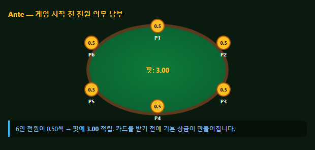

> 6명 × $0.50 = 팟 **$3.00**. 이 "참가비"가 있어야 모두가 적극적으로 플레이합니다.

---

### 1-2. 카드 3장을 받습니다 — 3rd Street

각자 카드 3장을 받습니다: **비공개 2장** + **공개 1장**. 카드가 3장이므로 **"3rd Street"**이라 부릅니다 (장수 = Street 번호).

공개 카드 = **Door Card** — 상대에게 처음 보이는 내 카드입니다.

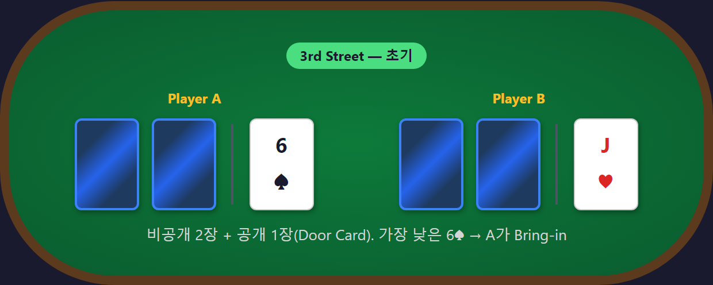

> A의 Door Card는 6♠, B는 J♥, C는 3♣. 비공개 2장은 아무도 모릅니다.

---

### 1-3. Bring-in — 누가 먼저 걸까?

3명의 Door Card를 봅시다: A(6♠), B(J♥), C(3♣).

**가장 약한 공개 카드**를 가진 사람이 의무적으로 먼저 돈을 겁니다. 이것이 **Bring-in**입니다.

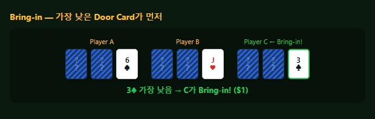

> **3♣이 가장 낮다** → C가 Bring-in! **$1**을 팟에 넣습니다.

왜 필요한가? 아무도 먼저 베팅하지 않으려 하기 때문입니다. Bring-in은 "당신이 먼저 시작하세요"라고 지목하는 규칙입니다.

같은 숫자가 2명 이상이면 **무늬 등급**(♣ < ♦ < ♥ < ♠)으로 결정합니다.

---

### 1-4. Complete — 본격 시작! ($2)

C가 $1을 냈습니다. 다음은 C 옆에 앉은 A의 차례입니다. A에게는 3가지 선택이 있습니다:

| A의 선택 | 금액 | 의미 |
|----------|:----:|------|
| Call | $1 | "나도 $1만 내고 넘긴다" |
| **Complete** | **$2** | **"$1은 약하다. $2로 올려서 본격 시작하자"** |
| Fold | — | 포기 |

A가 **Complete**합니다 — $1짜리 판을 **$2짜리 판으로 격상**시킨 것입니다.

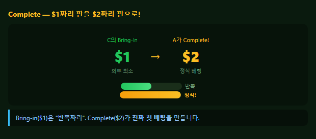

**아무도 Complete 안 하면?** 전원 $1씩 Call하고 조용히 라운드가 끝납니다. Complete는 의무가 아닌 **선택**입니다.

---

### 1-5. Raise와 Cap — 어디까지 올라가나?

A가 Complete($2). 이제 B의 차례입니다. B는 J♥ — 높은 카드입니다. B는 **Raise**(더 올리기)를 선택합니다:

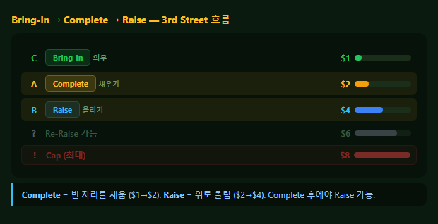

| 순서 | 플레이어 | 행동 | 금액 | 설명 |
|:----:|---------|------|:----:|------|
| 1 | C | Bring-in | $1 | 의무 최소 |
| 2 | A | Complete | $2 | $1→$2로 채움 |
| 3 | B | **Raise** | **$4** | $2에서 **+$2 올림** |
| 4 | C | Call | $4 | 원래 $1 냈으니 $3 추가 |
| 5 | A | Call | $4 | 원래 $2 냈으니 $2 추가 |

> **Complete vs Raise**: Complete는 $1을 $2로 **채우는 것**, Raise는 $2를 $4로 **위로 올리는 것**. Complete 후에야 Raise가 가능합니다.

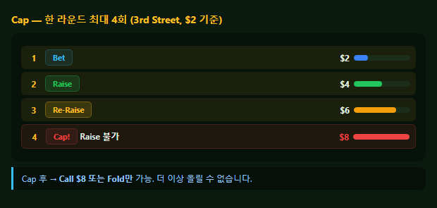

만약 Raise가 계속되면? **최대 4번**(Complete + 3 Raise)에서 멈춥니다. 이를 **Cap**(천장)이라 부릅니다. Cap 후에는 Call 또는 Fold만 가능합니다.

---

### 1-6. 4th Street — 카드 1장 추가 ($2 단위)

3rd Street 베팅이 끝나면 **공개 카드 1장**이 추가됩니다. 카드가 4장이므로 4th Street.

B에게 J가 하나 더! **J 페어**가 보입니다. 4th Street부터는 **가장 강한 공개 패**가 먼저 행동합니다 — B가 먼저!

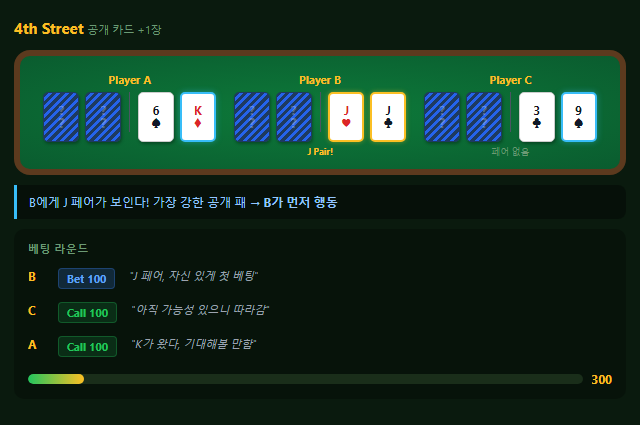

> 아직 베팅 단위는 **$2**. B가 Bet $2, A와 C가 Call.

**Open Pair 특수 규칙**: 4th Street에서 **공개 카드에 페어가 보이면**, $2 대신 **$4**로 베팅할 수 있습니다 (선택, 강제 아님).

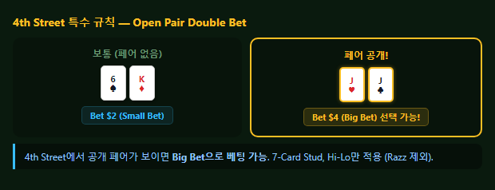

---

### 1-7. 5th Street — 판돈이 2배로! ($4 단위)

5번째 카드가 공개됩니다. A에게도 **K 페어**가 생겼습니다!

그리고 여기서 중요한 변화: **베팅 단위가 $2에서 $4로 2배가 됩니다.**

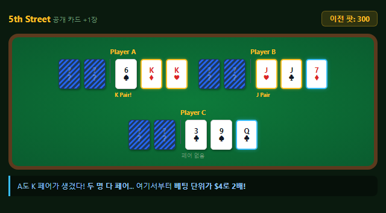

| 구간 | 베팅 단위 | 이유 |
|------|:---------:|------|
| 3rd~4th Street | **$2** (Small Bet) | 정보 적음 → 탐색 |
| **5th~7th Street** | **$4** (Big Bet) | 정보 많음 → 승부 |

이 2단계 구조가 **Fixed Limit**의 핵심입니다. 게임 표기 **"2/4"**의 의미: 전반 $2(Small Bet) / 후반 $4(Big Bet).

> A가 Bet $4, B가 Raise $8, A가 Call. 판돈이 커지니 긴장감도 2배!

---

### 1-8. 6th~7th Street → 쇼다운

**6th Street** ($4 단위): 공개 카드 4장 완성. C는 여전히 페어가 없습니다. $4 베팅이 너무 비싸서 **Fold**(포기)합니다.

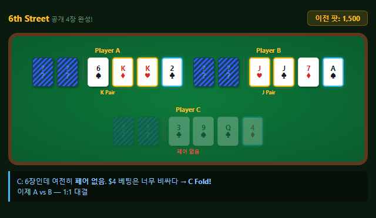

> $2 시절이면 남았을 수도 있지만, $4는 부담 — 이것이 2단계 구조의 효과.

**7th Street** ($4 단위): 마지막 카드는 다시 **비공개**로 받습니다! 상대가 뭘 받았는지 모릅니다. 최종 베팅 후 **쇼다운** — 남은 플레이어가 모든 카드를 공개합니다.

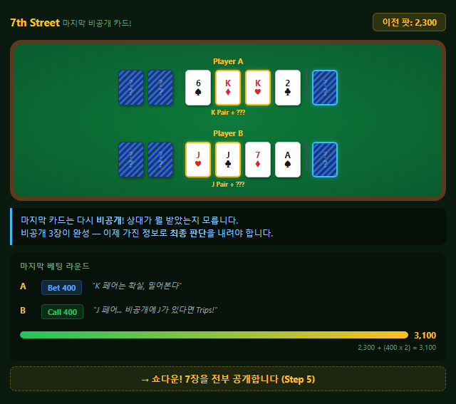

**전체 흐름 정리:**

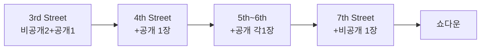

---

### 1-9. 누가 이기는가? — 핸드 랭킹

A와 B가 카드를 공개합니다. **7장 중 최고 5장**을 선택하여 비교합니다.

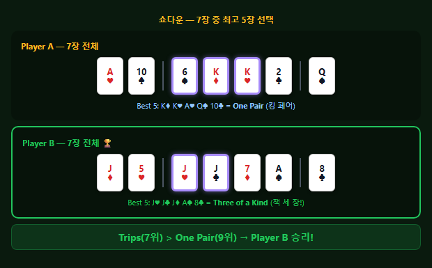

B의 공개 J 페어 뒤에 **비공개 J가 숨어있었습니다** — Three of a Kind(Trips)! A의 K 페어(One Pair)보다 강합니다. **B가 팟 전부를 가져갑니다.**

이것이 추리의 묘미입니다. 자, 이제 5장 조합의 **전체 순위표**를 봅시다.

**기본 3개 — 가장 흔한 패** (10판 중 7판은 이 중 하나)

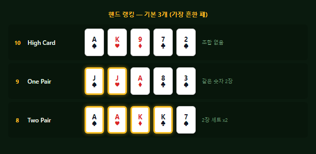

**중간 4개 — 희귀할수록 강합니다**

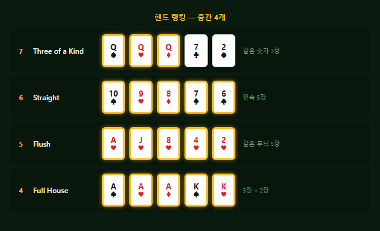

**희귀 3개 — 전설의 패** (프로 선수도 평생 몇 번 보기 어렵습니다)

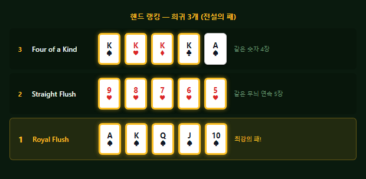

> **같은 숫자가 많을수록**, **연속이거나 같은 무늬면** 더 강합니다. 순위 숫자가 낮을수록 강한 패입니다.

**게임마다 랭킹 적용이 다릅니다:**

| 게임 | 핸드 랭킹 |
|------|----------|
| **7-Card Stud** | 위 순위표 그대로 — 높은 패가 승리 |
| **Stud Hi-Lo** | 높은 패 + 낮은 패 **둘 다** 판정 |
| **Razz** | 순위표를 **뒤집습니다** — 낮은 패가 승리 |

> Razz와 Hi-Lo의 Low 랭킹은 별도 기준을 사용합니다. 각 게임 섹션에서 설명합니다.

---

### 1-10. 베팅 규칙 총정리

한 판을 체험했습니다. 배운 베팅 규칙을 정리합니다.

**6가지 베팅 액션:**


| 액션 | 의미 | 언제 |
|------|------|------|
| **Fold** | 포기 | 언제든 |
| **Check** | 패스 | 아무도 안 걸었을 때 |
| **Bet** | 첫 베팅 | 아무도 안 걸었을 때 |
| **Call** | 따라 걸기 | 누군가 걸었을 때 |
| **Raise** | 더 올리기 | 누군가 걸었을 때 |
| **All-in** | 전부 | 언제든 |

**Fixed Limit이란?**

Seven Card Games는 **항상 Fixed Limit** — 베팅 금액이 정해져 있습니다. "얼마를 걸까?"가 아니라 **"걸까 말까?"만** 결정합니다.

왜? 카드가 공개되며 추리하는 게임이므로, All-in으로 추리를 무력화하는 것을 방지합니다.

| 구조 | 의미 | 대표 게임 |
|------|------|----------|
| No Limit (NL) | 언제든 전 칩 가능 | Texas Hold'em |
| Pot Limit (PL) | 팟 크기까지만 | Omaha |
| **Fixed Limit (FL)** | **정해진 금액만** | **Seven Card Games 전 게임** |

**행동 순서:**

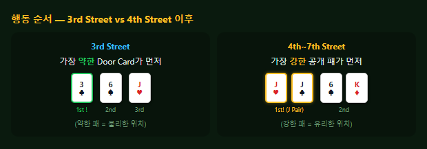

| 라운드 | 먼저 행동 | 이유 |
|--------|:--------:|------|
| 3rd Street | 가장 약한 공개 패 (Bring-in) | 의무 베팅 시작 |
| 4th~7th | 가장 강한 공개 패 | 주도권 |

**금액 총정리 (2/4 FL, 6인):**

| 항목 | 금액 | 설명 |
|------|:----:|------|
| Ante | $0.50 × 6 = **$3.00** | 참가비 |
| Bring-in | **$1.00** | Small Bet 절반 (의무 최소) |
| Complete | **$2.00** | Small Bet 전액 |
| 3rd~4th Raise | **$2.00** | Small Bet 단위 |
| 5th~7th Raise | **$4.00** | Big Bet 단위 |
| Cap | **4회** | Complete + 3 Raise |
| Open Pair (4th) | $4 선택 가능 | 페어 공개 시 |

---

## 2. 7-Card Stud Hi-Lo — 달라지는 점

**핵심 특징** | ⚖️ 7-Card Stud + 팟 **Hi-Lo 분할** (8-or-better)

| 구분 | 7-Card Stud | → Stud Hi-Lo |
|------|:-:|:-:|
| 승자 | High 1명 | **High + Low 2명** |
| 팟 | 전액 | **50/50 분할** |
| Low 조건 | -- | 5장 모두 **8 이하** |

### 한 판에서 두 명이 상금을 나눕니다 — 어떻게?

7-Card Stud에서는 가장 좋은 패 1명이 팟을 전부 가져갑니다. 하지만 Stud Hi-Lo에서는 팟을 **반으로 나눕니다**:


### Hi-Lo란? — "High 반, Low 반"

**High 승자**: §1에서 배운 핸드 랭킹 그대로. 가장 좋은 5장 조합을 가진 사람.

**Low 승자**: 가장 **나쁜** 5장 조합을 가진 사람. 단, 조건이 있습니다:

**핵심 규칙 — 7장에서 두 벌의 5장을 선택합니다:**

7장 중 High에 유리한 5장과 Low에 유리한 5장을 **각각 따로** 선택할 수 있습니다.

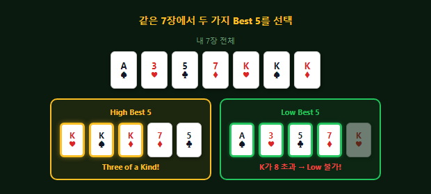

같은 7장에서 두 가지 베스트 핸드를 만드는 것이 Hi-Lo의 핵심 전략입니다. 한 사람이 High도 Low도 최강이면 팟 전부를 독식합니다.

### Low 자격 조건 — "8-or-better"

Low로 상금을 받으려면 **5장 모두 8 이하**여야 합니다. 페어가 있으면 불가!

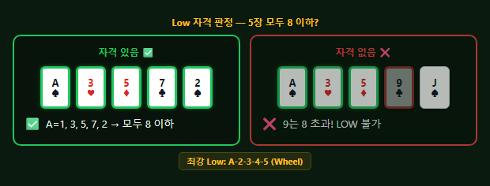

- A(에이스)는 Low에서 **1로 취급** → 가장 낮은 카드 = 유리!
- 최강 Low: **A-2-3-4-5** = Wheel (가장 낮은 5장)
- 페어가 있으면 Low 불가 (같은 숫자 2장 = 불가)
- Straight와 Flush는 무시 (Low 판정에 영향 없음)

### 아무도 Low 자격이 없으면?

테이블에 높은 카드만 나오면 아무도 Low 조건(5장 모두 8 이하)을 충족하지 못할 수 있습니다. 이 경우:

> → **High 승자가 팟 전부** 가져갑니다 (분할 없음)

### 실전 예시

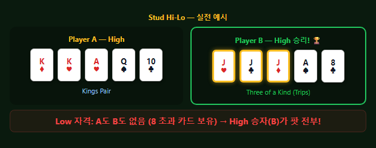

### 게임 진행

게임 진행(3rd~7th Street)은 7-Card Stud와 같습니다:

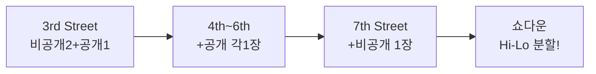

- 3rd Street: 비공개 2장 + 공개 1장 → 가장 낮은 공개 카드가 Bring-in ($1) → Complete ($2) 가능
- 4th Street: +공개 1장, Small Bet ($2) 단위 베팅
- 5th~6th Street: +공개 각 1장, **Big Bet ($4) 단위** 베팅
- 7th Street: 마지막 비공개 카드, Big Bet ($4) 단위 최종 베팅
- 쇼다운: **High 승자와 Low 승자를 각각 판정** → 팟 50/50 분할

카드 진행과 베팅 구조는 7-Card Stud와 동일합니다. 달라지는 점은 **승부 판정 방식**뿐입니다.

---

## 3. Razz — 모든 것을 뒤집습니다

**핵심 특징** | 🔃 7-Card Stud를 **뒤집은 게임** — 가장 **낮은 패** 승리 + A=Low

| 구분 | 7-Card Stud | → Razz |
|------|:-:|:-:|
| 승리 | 높은 패 | **낮은 패** |
| A(에이스) | High (14) | **Low (1) — 유리!** |
| Bring-in | 가장 낮은 공개 카드 | **가장 높은** 공개 카드 |
| 최강 패 | Royal Flush | **A-2-3-4-5 (Wheel)** |

### 같은 카드인데 승자가 바뀝니다 — 어느 쪽이 이길까요?

두 플레이어가 같은 카드를 들고 있습니다. **게임에 따라 결과가 완전히 반대!**

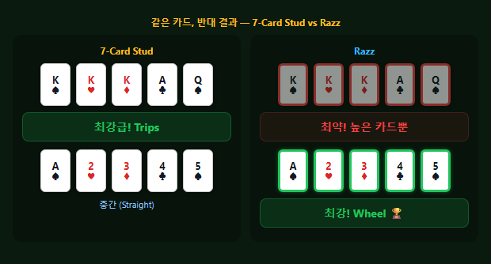

"7-Card Stud를 이해했다면, Razz는 **모든 것을 반대로** 하면 됩니다."

### 달라지는 점 1: 가장 낮은 패가 이깁니다

- 7-Card Stud: **높은 패** 승리 (Royal Flush가 최강)
- Razz: **낮은 패** 승리 (A-2-3-4-5가 최강!)
- "숫자가 **낮을수록** 좋고, **높을수록** 나쁩니다."

### 달라지는 점 2: A는 가장 낮은 카드 (유리!)

- 7-Card Stud: A = 14 (가장 높은 카드, 강력!)
- Razz: **A = 1** (가장 낮은 카드, **유리!**)

**Straight와 Flush는 무시합니다.** §1에서 배운 핸드 랭킹에서 Straight와 Flush는 강한 조합이었습니다. 하지만 Razz는 "조합"을 보지 않고, 순수하게 **카드 숫자의 높낮이만** 봅니다. 예를 들어 A-2-3-4-5는 Straight이지만, Razz에서는 그냥 "가장 낮은 숫자 5장" = **최강 Low**입니다.

### 달라지는 점 3: Bring-in이 반대!

3rd Street에서 누가 먼저 베팅하는지도 **반대**입니다.

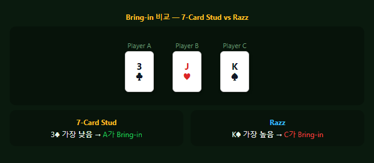

### 실전 예시 — Low 비교 방법

Razz에서 승부는 "**가장 높은 카드부터 비교**"합니다. 낮은 쪽이 승리!

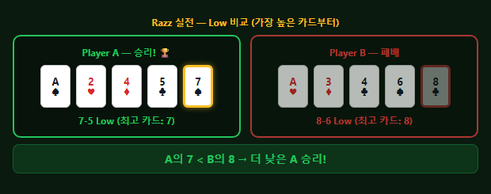

같으면 두 번째로 높은 카드를 비교합니다. 끝까지 같으면 무승부.

### 게임 진행

게임 진행(3rd~7th Street)은 7-Card Stud와 같습니다. **Bring-in만 반대**:


- 3rd Street: 비공개 2장 + 공개 1장 → **가장 높은** 공개 카드가 Bring-in ($1). Razz에서 높은 카드는 불리하므로 불리한 사람이 먼저 겁니다
- 4th Street: +공개 1장, Small Bet ($2) 단위. Razz에는 **Open Pair 규칙이 없습니다** (높은 패가 나쁜 게임이므로)
- 5th~6th Street: +공개 각 1장, **Big Bet ($4) 단위**. 가장 강한(= 가장 낮은) 공개 패가 먼저 행동
- 7th Street: 마지막 비공개 카드, Big Bet ($4) 단위 최종 베팅
- 쇼다운: 가장 **낮은 패**가 승리

**"강하다/약하다"의 기준이 반대**라는 것뿐입니다. 베팅 구조(Ante → Bring-in → Complete → Small/Big Bet → Cap)는 7-Card Stud와 동일합니다.

---

## 3종 비교 총정리

### 포커 3대 계열

| 특성 | Flop Games | Draw | Seven Card Games |
|------|:-:|:-:|:-:|
| **공유 카드** | ✅ 보드 5장 | ❌ 없음 | ❌ 없음 |
| **카드 교환** | ❌ 없음 | ✅ 1~3회 | ❌ 없음 |
| **카드 공개** | 보드만 공개 | 전부 비공개 | 일부 공개 |
| **정보의 원천** | 공유 보드 | 교환 패턴 추리 | 상대 공개 카드 |
| **대표 게임** | Texas Hold'em | 2-7 Triple Draw | 7-Card Stud |

### Seven Card Games 3종

| 게임 | 핵심 차이 | 비공개 | 공개 | 승리 | 팟 분할 |
|------|----------|:------:|:----:|:----:|:------:|
| **7-Card Stud** | 추리 게임 | 3장 | 4장 | High | -- |
| Stud Hi-Lo | Hi-Lo 분할 | 3장 | 4장 | High+Low | **50/50** |
| Razz | 역전 게임 | 3장 | 4장 | **Low** | -- |

---

## Phase 매핑

| Phase | 게임 |
|:-----:|------|
| Phase 3 (2027 H1) | 7-Card Stud, 7-Card Stud Hi-Lo, Razz |

---

# Part II — 상세 개발 설계 로직

> 이하 섹션은 **개발자** 대상입니다. Part I의 게임 규칙을 소프트웨어로 구현하기 위한 Low-Level Design입니다.

---

## §1. 게임 상태 머신 — Seven Card Games 계열

### 1-1. 기본 상태 전이 (3종 공통)

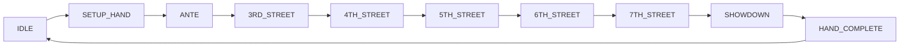

Flop Games와 핵심 차이: 보드 카드 없음. 매 Street마다 **개인 카드가 추가**되며, `first_to_act`가 **동적으로 변경**됨.

### 1-2. 상태별 시스템 동작

| 상태 | 동작 | 트리거 |
|------|------|--------|
| IDLE | 대기 | 이전 핸드 완료 |
| SETUP_HAND | `hand_num++`, 좌석 확인 | 딜러 시작 명령 |
| ANTE | 전원 Ante 수납, 팟 생성 | 자동 |
| 3RD_STREET | 비공개 2장 + 공개 1장 딜 → Bring-in 결정 → 베팅 | 카드 배분 완료 |
| 4TH_STREET | 공개 1장 추가 → `first_to_act` 재계산 → 베팅 | 이전 베팅 완료 |
| 5TH_STREET | 공개 1장 추가 → 베팅 단위 Big Bet 전환 → 베팅 | 이전 베팅 완료 |
| 6TH_STREET | 공개 1장 추가 → 베팅 | 이전 베팅 완료 |
| 7TH_STREET | **비공개** 1장 추가 → 최종 베팅 | 이전 베팅 완료 |
| SHOWDOWN | 핸드 평가 → 승자 결정 → 팟 분배 | 최종 베팅 완료 |
| HAND_COMPLETE | 통계 업데이트, 다음 핸드 대기 | 분배 완료 |

### 1-3. 3종 게임별 상태 분기

| 분기 | 7-Card Stud | Stud Hi-Lo | Razz |
|------|:-----------:|:----------:|:----:|
| game_enum | `stud7 (19)` | `stud7_hilo8 (20)` | `razz (21)` |
| game_class | `stud (2)` | `stud (2)` | `stud (2)` |
| Bring-in 대상 | 최저 Door Card | 최저 Door Card | **최고** Door Card |
| 3rd~4th 베팅 단위 | Small Bet | Small Bet | Small Bet |
| 5th~7th 베팅 단위 | Big Bet | Big Bet | Big Bet |
| Open Pair (4th) | 적용 | 적용 | **미적용** |
| Evaluator | `SevenCards` | `SevenCards` + Lo | `Razz` |
| `lo` 플래그 | `false` | **`true`** | `false` |

---

## §2. 카드 배분 로직

### 2-1. dealCards — Street별 배분

| Street | 배분 | 비공개/공개 | RFID 동작 |
|--------|------|:---------:|----------|
| 3rd | 3장 (첫 배분) | **비공개 2장** + 공개 1장 | 비공개: 리더 감지 → 시청자 전용 표시. 공개: 리더 감지 → 전체 표시 |
| 4th | +1장 | 공개 | 리더 감지 → 전체 표시 |
| 5th | +1장 | 공개 | 리더 감지 → 전체 표시 |
| 6th | +1장 | 공개 | 리더 감지 → 전체 표시 |
| 7th | +1장 | **비공개** | 리더 감지 → 시청자 전용 표시 |

```
function dealStreet(state, street):
    for player in state.activePlayers:
        card = state.deck.pop()
        
        if street == 3RD_STREET:
            // 첫 2장: 비공개
            player.holeCards.push(state.deck.pop())  // down
            player.holeCards.push(state.deck.pop())  // down
            player.upCards.push(card)                 // up (Door Card)
        elif street == 7TH_STREET:
            player.holeCards.push(card)               // down (마지막)
        else:
            player.upCards.push(card)                 // up
        
        rfid.notifyCardDealt(player, card, isConcealed)
```

### 2-2. 최대 플레이어 수 제한

7-Card Stud는 플레이어당 최대 7장 사용. 52장 덱 기준:

| 플레이어 수 | 필요 카드 | 가능 여부 |
|:-----------:|:---------:|:---------:|
| 2~7명 | 14~49장 | 가능 |
| 8명 | 56장 | **불가** (52장 초과) |

**7명 + 7th Street 부족 시**: 마지막 카드를 개인별로 딜하는 대신, 테이블 중앙에 **공유 카드 1장**을 깔아 모든 플레이어가 공유. 이 경우 `stud_community_card = true`.

### 2-3. RFID 카드 인식 흐름

```
RFID Reader → TCP/TLS → on_tag_event 콜백
    ├── 비공개 카드: openCards 비트 OFF → 시청자 오버레이만 표시
    └── 공개 카드: openCards 비트 ON → 전체 오버레이 표시

OpenCards bitmask:
    ulong openCards  // 64bit: 각 비트 = 해당 카드가 공개인지
    // Evaluate(hiResult, loResult, hand, openCards)
```

---

## §3. 베팅 라운드 처리 로직

### 3-1. First-to-Act 결정

| Street | 결정 기준 | 필드 |
|--------|----------|------|
| 3rd Street | **가장 약한** 공개 카드 (Bring-in) | `pl_stud_first_to_act` |
| 4th~7th | **가장 강한** 공개 패 | `pl_stud_first_to_act` (매 Street 재계산) |

Razz 반전: 3rd에서 "가장 높은" 공개 카드가 Bring-in. 4th+에서 "가장 강한" = 가장 낮은 공개 패.

```
function calcStudFirstToAct(state, street):
    if street == 3RD_STREET:
        if state.gameEnum == razz:
            return playerWithHighestDoorCard(state)
        else:
            return playerWithLowestDoorCard(state)
    else:
        // 4th~7th: 가장 강한 공개 패
        if state.gameEnum == razz:
            return playerWithLowestExposedHand(state)  // Razz: 낮은=강한
        else:
            return playerWithHighestExposedHand(state)
```

### 3-2. Bring-in → Complete → Raise 에스컬레이션

```
function processBringInRound(state):
    bringinPlayer = calcStudFirstToAct(state, 3RD_STREET)
    bringinAmount = state.lowLimit / 2       // Small Bet의 절반
    
    // Bring-in 강제 베팅
    placeBet(bringinPlayer, bringinAmount)
    state.currentBet = bringinAmount
    state.isCompleted = false
    
    // 나머지 플레이어 순회
    for player in clockwiseFrom(bringinPlayer):
        action = waitForAction(player)
        
        switch action.type:
            case COMPLETE:
                assert !state.isCompleted
                player.bet = state.lowLimit     // Small Bet 전액
                state.currentBet = state.lowLimit
                state.isCompleted = true
                state.numRaises = 1             // Complete = 1번째
            
            case RAISE:
                assert state.isCompleted
                raiseAmount = getCurrentBetUnit(state)  // Small or Big
                player.bet = state.currentBet + raiseAmount
                state.currentBet = player.bet
                state.numRaises++
                assert state.numRaises <= 4     // Cap
            
            case CALL:
                player.bet = state.currentBet
            
            case FOLD:
                player.folded = true
```

### 3-3. 베팅 단위 결정

```
function getCurrentBetUnit(state):
    if state.street <= 4TH_STREET:
        // Open Pair 예외 체크
        if state.street == 4TH_STREET 
           and state.gameEnum != razz
           and hasOpenPair(state):
            return state.highLimit    // Big Bet 선택 가능
        return state.lowLimit         // Small Bet
    else:
        return state.highLimit        // Big Bet (5th~7th)
```

### 3-4. ActionType enum

```
enum ActionType {
    check     = 0,
    all_in    = 1,
    call      = 2,
    raise_to  = 3,
    bet       = 4,
    complete  = 5,    // Stud 전용: Bring-in → Small Bet
    fold      = 7,
    win       = 8
}
```

### 3-5. Cap 규칙

| 항목 | 값 |
|------|:--:|
| 최대 베팅 횟수 | **4** (Complete + 3 Raise) |
| Cap 필드 | `num_raises_this_street` |
| Cap 도달 시 | Call 또는 Fold만 허용 |
| 헤즈업 (2인) 예외 | Cap 없음 (무제한 Raise) |

---

## §4. 핸드 평가기 라우팅 — 3종 게임별

### 4-1. 게임별 Evaluator 매핑

| game_enum | Evaluator | 소스 파일 | 평가 방식 |
|-----------|-----------|----------|----------|
| `stud7 (19)` | `SevenCards` | SevenCards.cs (636줄) | 7장 중 Best 5 High |
| `stud7_hilo8 (20)` | `SevenCards` + `EightOrBetter` | SevenCards.cs + lo 분기 | High + Low 각각 평가 |
| `razz (21)` | `Razz` | Razz.cs (573줄) | A-5 Lowball, K→High 리맵 |

### 4-2. 64비트 Bitmask 카드 표현

```
[Spades 39-51] [Hearts 26-38] [Diamonds 13-25] [Clubs 0-12]

Per suit (13-bit): bit 0=2, 1=3, ... 8=10, 9=J, 10=Q, 11=K, 12=A

예시: A♠ = bit 51, 2♣ = bit 0
```

### 4-3. SevenCards 평가 알고리즘

```
class SevenCards implements IPokerEvaluator:
    // 생성자에서 lookup table 사전 계산
    m_evaluatedresults[8192]    // 13-bit 랭크 패턴 → 핸드 결과
    m_topthree[8192]            // 상위 3장 정보
    MAGIC = 1161928703861587968
    
    function Evaluate(hiResult, loResult, hand, openCards):
        // 4개 suit의 13-bit 패턴 추출
        clubs    = hand & 0x1FFF
        diamonds = (hand >> 13) & 0x1FFF
        hearts   = (hand >> 26) & 0x1FFF
        spades   = (hand >> 39) & 0x1FFF
        
        // 각 suit별 카드 수 카운트
        // Flush 판정 (5+장 같은 무늬)
        // 7장 중 Best 5 조합 탐색
        // lookup table로 즉시 결과 반환
```

### 4-4. Razz 평가 알고리즘

```
class Razz implements IPokerEvaluator:
    // Ace = Low (bit 0 유지), King = High (bit 12)
    // 리맵: shl 1 + shr 12 (K를 최고 위치로)
    
    function Evaluate(hiResult, loResult, hand, openCards):
        // Straight, Flush 무시
        // 순수 숫자 높낮이만 비교
        // A-2-3-4-5 = 최강 (가장 낮은 5장)
        // K-K-K-K-Q = 최약
```

### 4-5. Hi-Lo 분할 평가

```
function evaluateHiLo(hand, openCards):
    // Step 1: High 평가 (SevenCards)
    hiResult = SevenCards.Evaluate(hand)
    
    // Step 2: Low 평가 (8-or-better)
    loResult = NO_LOW
    lowCards = filterCardsBelow9(hand)  // A,2,3,4,5,6,7,8만
    
    if countUniqueLowCards(lowCards) >= 5:
        // 페어 제외, 최저 5장 선택
        loResult = bestLow5(lowCards)
    
    return (hiResult, loResult)
```

### 4-6. HandValue 인코딩

```
uint HandValue 구조:
    bits 27-24: HandType (0=HighCard ~ 8=StraightFlush)
    bits 23-16: TopCard
    bits 15-12: SecondCard
    bits 11-8:  ThirdCard
    bits 7-4:   FourthCard
    bits 3-0:   FifthCard

HANDTYPE_SHIFT = 24
TOP_CARD_SHIFT = 16
CARD_WIDTH = 4
```

---

## §5. 팟 계산 및 분배 로직

### 5-1. 기본 팟 분배 (Stud / Razz)

```
function distributePot(state):
    winners = findWinners(state)        // HandValue 비교
    potPerWinner = state.pot / len(winners)
    for winner in winners:
        winner.stack += potPerWinner
    // 나머지 칩: 포지션 순 (Bring-in에 가장 가까운 사람)
```

### 5-2. Hi-Lo 분할 분배 (Stud Hi-Lo)

```
function distributeHiLoPot(state):
    hiWinners = findHighWinners(state)
    loWinners = findLowWinners(state)   // 8-or-better 자격자만
    
    if len(loWinners) == 0:
        // Low 자격자 없음 → High가 팟 전부
        distributeTo(hiWinners, state.pot)
    else:
        hiPot = state.pot / 2
        loPot = state.pot - hiPot       // 홀수 칩은 Hi에
        distributeTo(hiWinners, hiPot)
        distributeTo(loWinners, loPot)
```

### 5-3. Side Pot 처리

All-in이 발생하면 Side Pot 생성. Flop Games와 동일한 알고리즘 적용.

```
function buildSidePots(state):
    // All-in 플레이어 칩 순으로 정렬
    // 각 All-in 레벨에서 Main/Side pot 분리
    // 각 pot의 eligible 플레이어 목록 관리
```

---

## §6. 게임 변형별 특수 로직

### 6-1. Razz — Bring-in 반전 + 평가 반전

| 항목 | 7-Card Stud | Razz |
|------|:-----------:|:----:|
| Bring-in | 최저 Door Card | **최고** Door Card |
| 4th+ first_to_act | 최강 공개 패 (High) | 최강 공개 패 (**Low**) |
| Open Pair (4th) | 적용 | **미적용** |
| A(에이스) | High (14) | **Low (1)** |
| Straight/Flush | 유효 | **무시** |
| 평가기 | SevenCards | Razz (별도) |

### 6-2. Stud Hi-Lo — 분할 평가 + 8-or-better

```
function qualifiesForLow8(hand5):
    for card in hand5:
        if card.rank > 8:          // 9 이상 = 불가
            return false
    if hasPair(hand5):             // 페어 = 불가
        return false
    return true                    // Straight/Flush는 무시

// Best Low 비교: 가장 높은 카드부터
// A-2-3-4-5 (Wheel) < A-2-3-4-6 < ... < 4-5-6-7-8
```

### 6-3. 7th Street 카드 부족 예외

```
function deal7thStreet(state):
    if state.deck.remaining >= state.activePlayers.count:
        // 정상: 각자 비공개 1장
        for player in state.activePlayers:
            player.holeCards.push(state.deck.pop())
    else:
        // 카드 부족: 공유 카드 1장
        communityCard = state.deck.pop()
        state.studCommunityCard = true
        for player in state.activePlayers:
            player.sharedCard = communityCard
```

---

## §7. 데이터 구조 — StudGameData

### 7-1. GameSession 그룹

| 필드 | 타입 | 설명 |
|------|------|------|
| `game_enum` | int | 19=Stud, 20=Hi-Lo, 21=Razz |
| `game_class` | int | 2 (stud) |
| `bet_structure` | int | 1 (FixedLimit) |
| `ante_type` | int | 0 (std_ante) |
| `low_limit` | int | Small Bet 금액 |
| `high_limit` | int | Big Bet 금액 |
| `bring_in` | int | Bring-in 금액 |
| `hand_num` | int | 현재 핸드 번호 |
| `hand_in_progress` | bool | 핸드 진행 중 |

### 7-2. StreetState 그룹

| 필드 | 타입 | 설명 |
|------|------|------|
| `current_street` | int | 3~7 (3RD~7TH) |
| `pl_stud_first_to_act` | int | 현재 Street 첫 액션 플레이어 |
| `stud_draw_in_progress` | bool | Stud 진행 중 |
| `stud_community_card` | bool | 7th Street 공유 카드 여부 |
| `stud_start_ok` | bool | Stud 시작 가능 |

### 7-3. PlayerState 그룹

| 필드 | 타입 | 설명 |
|------|------|------|
| `holeCards` | ulong[] | 비공개 카드 (3rd: 2장, 7th: +1장) |
| `upCards` | ulong[] | 공개 카드 (3rd: 1장, 4th~6th: +1장씩) |
| `openCards` | ulong | 공개 카드 bitmask (평가기 전달용) |
| `folded` | bool | Fold 여부 |
| `allIn` | bool | All-in 여부 |
| `currentBet` | int | 현재 Street 베팅 금액 |

### 7-4. BettingState 그룹

| 필드 | 타입 | 설명 |
|------|------|------|
| `action_on` | int | 현재 행동 플레이어 |
| `num_raises_this_street` | int | 현재 Street Raise 횟수 |
| `min_raise_amt` | int | 최소 Raise 금액 |
| `is_completed` | bool | Complete 완료 여부 (3rd Street) |
| `currentBet` | int | 현재 매칭해야 할 금액 |
| `card_scan_warning` | bool | RFID 스캔 경고 |

### 7-5. DisplayState 그룹

| 필드 | 타입 | 설명 |
|------|------|------|
| `street_label` | string | 현재 Street 표시 ("3rd Street" 등) |
| `bet_unit_label` | string | 현재 베팅 단위 ("Small Bet $2" 등) |
| `pot_total` | int | 팟 총액 |
| `action_indicator` | int | 행동 중인 플레이어 하이라이트 |
| `concealed_overlay` | bool[] | 시청자 전용 비공개 카드 표시 |
