# EBS Lobby — 5 화면 시퀀스 + WSOP LIVE 정보 허브

> **Lobby 는 머무는 곳이 아니다. Command Center 로 들어가기 위해, 거기서 나오기 위해, 어긋났을 때 돌아오기 위해 — 잠깐 거치는 게이트웨이. 그 짧은 머무름 동안 WSOP LIVE 의 모든 진실이 한 화면에 펼쳐진다.**

운영자가 하루 종일 쳐다보는 화면은 Lobby 가 아니다. 그 화면은 **Command Center** — 한 테이블, 한 핸드, 한 베팅 — 다.

그러면 Lobby 는 무엇인가.

Lobby 는 **CC 에 들어가는 게이트웨이** 다. 호텔 로비처럼 — 객실로 들어가기 전, 객실에서 나올 때, 컨시어지에 무언가 물을 때 거치는 곳.

그리고 그 짧은 머무름 동안 Lobby 는 한 가지를 한다. **WSOP LIVE 와 연동된 모든 정보** — 어느 대회, 어느 이벤트, 며칠 차, 누가 살아남았는지, 다음 레벨까지 얼마나 — 를 한 화면에 모은다.


> *FIG · Lobby (게이트웨이 + 정보 허브) ↔ Command Center (실 작업 화면).*

운영자가 Lobby 를 보는 시점은 4 가지 — 처음 진입할 때, 어딘가 어긋났을 때, 게임이 바뀔 때, 모든 것이 끝날 때.

이 문서는 그 4 진입을 **운영자가 통과하는 화면 시퀀스** 로 따라간다.

---

## 이 문서가 데려가는 곳

<table role="presentation" width="100%">
<tr>
<td width="50%" valign="top" align="left">

**입구 — 지금 당신의 상태**

EBS Lobby 가 무엇인지 모릅니다. WSOP LIVE 와 어떤 관계인지, 운영자가 언제 보는지, 어떤 화면들이 있는지 모릅니다.

</td>
<td width="50%" valign="top" align="left">

**출구 — 이 문서를 끝까지 읽은 후**

4 진입 시점에서 운영자가 통과하는 화면 시퀀스를 그릴 수 있습니다. **Login → Series → Event → Flight → Tables → Launch** 의 흐름과, 각 화면이 WSOP LIVE 의 어떤 정보를 펼치는지 알게 되고, 그 시스템을 직접 만들 수 있습니다.

</td>
</tr>
</table>

---

## 목차

```
  PROLOGUE              머무는 곳이 아니다

  ACT I — 4 가지 진입 시점
    Ch.1   첫 진입       CC 를 처음 켤 때 (5 화면 시퀀스)
    Ch.2   비상 진입     RFID 가 꺼졌을 때
    Ch.3   변경 진입     게임이 바뀔 때
    Ch.4   종료 진입     방송이 끝날 때

  ACT II — Lobby 가 펼치는 WSOP LIVE 정보
    Ch.5   Series         어느 대회인가
    Ch.6   Event + Flight 어느 토너먼트, 며칠 차
    Ch.7   Players        칩 카운트가 어디서 오는가
    Ch.8   Tables Grid    124 줄의 한 줄 요약 + 3 view

  ACT III — Lobby 가 사라지면 (반증)
    Ch.9   각자 SSH 로 들어가는 세상
    Ch.10  WSOP LIVE 정보를 매번 따로 조회하는 운영실
    Ch.11  그래서 Lobby 가 게이트웨이 + 정보 허브로 존재한다

  EPILOGUE              짧은 머무름이 작업 시간을 작동시킨다

  부록 A~G              Lobby 개발자 reference (스크린샷 갤러리 + 데이터 모델)
```

> **약어**: BO (Back Office, 중앙 서버) · CC (Command Center, 테이블 PC 운영 화면) · RFID (무선 카드 인식) · NDI/SDI (방송 영상 신호) · LIVE/IDLE/ERROR (CC 3 상태). 부록 G 에 전체 사전.

---

# PROLOGUE — 머무는 곳이 아니다

운영자가 Command Center 에 들어가기 위해서는, 먼저 Lobby 를 통과해야 한다.

Lobby 는 운영자에게 다섯 가지를 차례로 묻는다 —

```
   누구입니까          ──→  Login
   어느 대회입니까     ──→  Series
   어느 이벤트입니까   ──→  Event
   며칠 차입니까       ──→  Flight
   어느 테이블입니까   ──→  Tables
                            │
                            ▼
                       [Launch ⚡] CC 시작
```

다섯 번의 답을 거치면 Command Center 가 열리고, Lobby 는 닫힌다.

이 다섯 화면이 본 문서의 1 막이다. 각 화면은 **WSOP LIVE API** 에서 BO (Back Office) 로 흘러들어 온 데이터를 운영자에게 보여준다.

---

# ACT I — 4 가지 진입 시점

## Ch.1 — 첫 진입: CC 를 처음 켤 때

운영자가 Lobby 를 처음 여는 순간, 그는 5 화면을 차례로 통과한다.

### 1.1 — Login

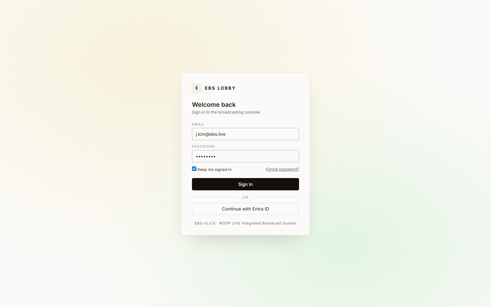

> *FIG · Login. EBS v5.0.0 — WSOP LIVE Integrated Broadcast System.*

두 가지 인증 경로 중 하나 — Email + Password (TOTP 2FA 포함) 또는 Entra ID OAuth.

로그인이 성공하면 BO 가 그의 권한 (Admin / Operator / Viewer) 을 자동 적용한다. 화면과 버튼이 권한에 맞게 활성/비활성된다.

### 1.2 — Series 목록

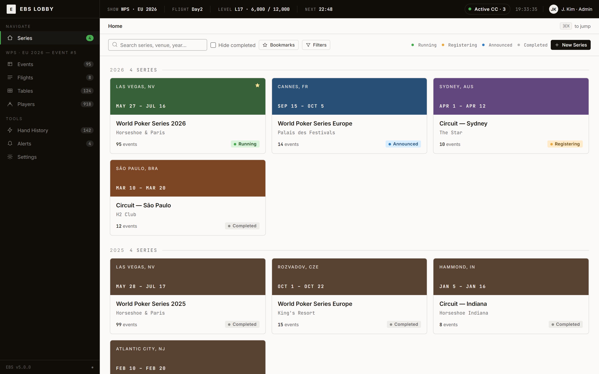

> *FIG · Series 목록. 8 개 Series 가 연도별로 그룹화 + 상태 배지.*

운영자의 첫 화면이다. 8 카드가 펼쳐진다 — World Poker Series 2026, Circuit — Sydney, Circuit — São Paulo, ... 각 카드는 venue (Las Vegas / Cannes / Sydney) 와 date range (May 27 ~ Jul 16) 와 event 수 (95) 를 보여준다.

이 8 카드는 어디서 오는가. **WSOP LIVE API** 에서 온다. BO 가 매일 동기화하여 Lobby 가 보여준다.

운영자가 운영할 Series 카드를 클릭하면 Event 목록으로 이동한다.

### 1.3 — Event 목록


> *FIG · Event 목록. WPS · EU 2026 의 95 이벤트 — Total Entries 14,287 / Prize Pool €19.4M / Active CC 3 / 12.*

상단에 KPI 5 박스 — Total Events 95 / Live Now 3 / Total Entries 14,287 / Prize Pool €19.4M / Active CC 3 / 12.

그 아래 5 status 탭 (Created / Announced / Registering / Running / Completed). 그 아래 데이터 테이블 — 95 행, 12 컬럼.

운영자는 "Running" 탭에서 Event #5 — Europe Main Event (€5,300) 를 클릭한다.

### 1.4 — Flight 목록

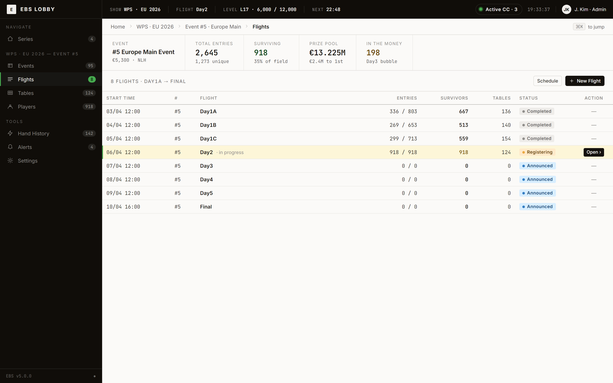

> *FIG · Flight 목록. Event #5 의 8 Day — Day1A/B/C 완료, Day2 진행 중 (918 생존), Day3~Final 예정.*

Event 의 안쪽이다. 8 Flight (Day1A → Final) 가 한 줄씩 표시된다. 진행 중인 Day2 가 강조 표시 — Total Entries 2,645 / Surviving 918 / In The Money 198.

운영자는 진행 중 "Day2" 행을 클릭한다.

### 1.5 — Tables 그리드

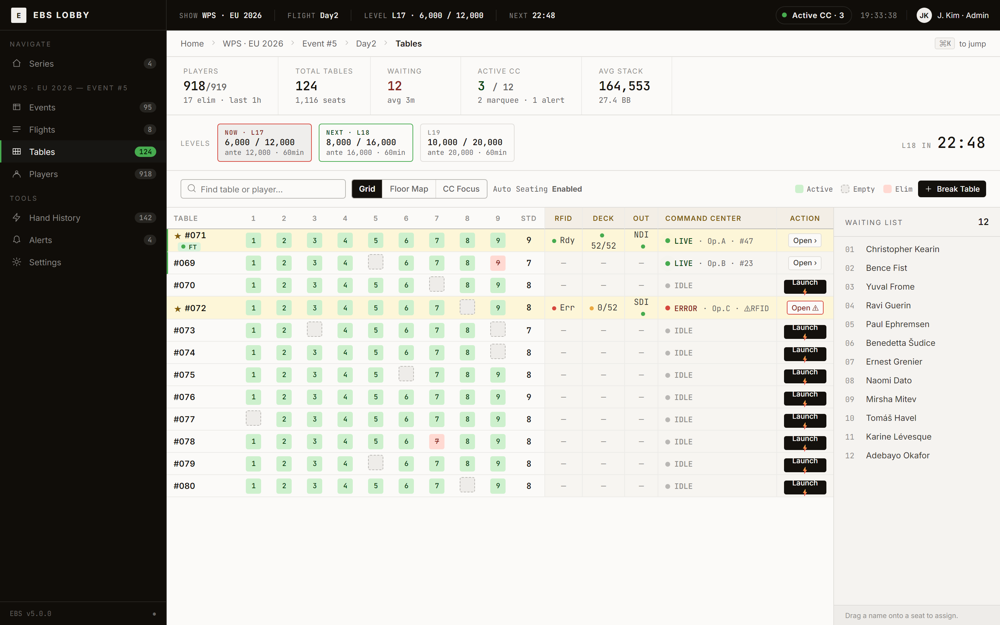

> *FIG · Tables 그리드 (Grid view). Day2 의 124 테이블 — Players 918 / Avg 27.4 BB / Active CC 3.*

다섯 번째 화면. 124 줄. 한 줄이 한 테이블. 각 줄에는 9 좌석 그리드 + RFID 상태 + 덱 등록 + 출력 신호 + Command Center 상태가 압축된다.

### 1.6 — Launch Modal: Lobby 의 마지막 문

운영자가 운영할 #071 ★ 줄의 우측 [Launch ⚡] 버튼을 누른다.

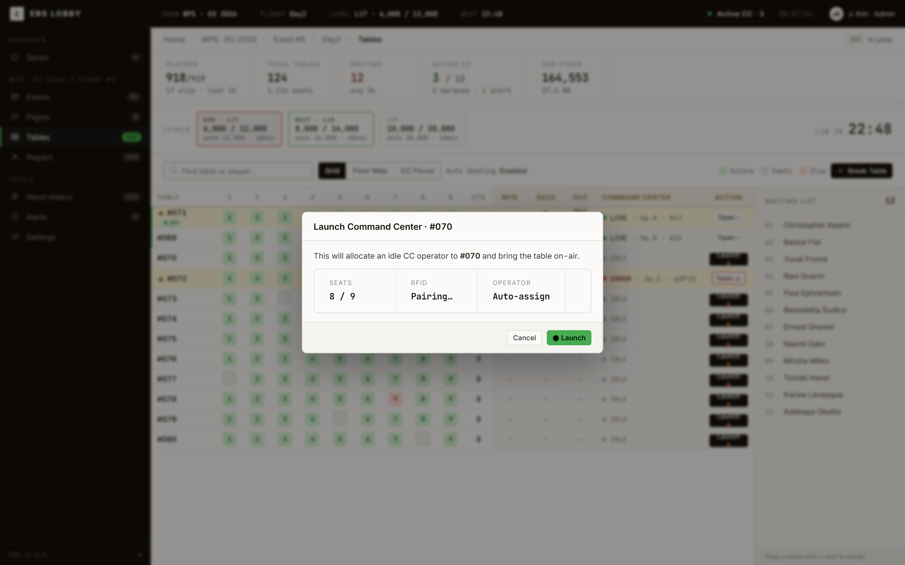

> *FIG · Launch Modal. Lobby 의 마지막 화면 — 이 다이얼로그를 닫으면 CC 가 열린다.*

다이얼로그는 3 정보 박스를 보여준다.

| 박스 | 의미 |
|------|------|
| **Seats** | 현재 좌석 점유 (예: 9 / 9) |
| **RFID** | RFID pairing 상태 (Pairing… / Rdy / Err) |
| **Operator** | 자동 할당 모드 (Auto-assign / 수동 선택) |

운영자가 하단의 **[● Launch]** 를 누르면, 한 클릭이 4 가지를 자동으로 트리거한다.

```
   1.  idle 상태의 운영자 1 명 자동 할당
   2.  해당 테이블 PC 의 Command Center 인스턴스 활성화
   3.  테이블 ID 기반 설정 자동 로드 (RFID / 덱 / 출력 장비)
   4.  Lobby Tables 그리드에 LIVE 상태 즉시 반영
```

5 화면을 통과한 운영자는 Lobby 화면을 그대로 두고 — 닫지 않는다, 다른 운영자가 볼 수도 있고 비상 시 빨리 돌아와야 하니 — 옆 모니터의 Command Center 로 시선을 옮긴다.

이것이 첫 진입의 끝이다.

> 그가 Lobby 를 다시 보는 시점은 — 무언가 어긋났을 때, 게임이 바뀔 때, 모든 것이 끝날 때.

### 1.7 — 1 hand 자동 셋업 (개발자/검증용 — 사람이 누르는 5 화면을 자동 재현)

> **이 절은 운영자 화면이 아니다.** 인수인계 받은 개발자가 30 초 안에
> "table 생성 → CC 할당 → RFID monitor → cascade publish" 의 4 단계가 끝까지
> 작동하는지 확인하기 위한 **자동 셋업 데모** 다. 운영 화면은 §1.1~§1.6 그대로다.

개발자가 다음 한 줄을 실행하면, §1.1~§1.6 의 5 화면을 사람이 누르는 대신 코드가 한 번에 재현한다.

```bash
flutter run -d chrome \
  --dart-define=USE_MOCK=true \
  --dart-define=HAND_AUTO_SETUP=true
```

부트스트랩 직후 Lobby 가 4 단계를 차례로 통과한다 —

```
   1. table 생성        (POST /api/v1/tables)
   2. CC 할당          (POST /api/v1/tables/{id}/cc-session)
   3. RFID monitor 시작 (WebSocket /ws/lobby — rfid_seat_* 구독)
   4. cascade publish   (broker @ 7383 — cascade:lobby-hand-ready)
```

각 단계의 진행 상태는 `HandAutoSetupStep` 상태머신으로 외부에서 관찰 가능하다 (Riverpod `handAutoSetupProvider` watch). 끝까지 도달하면 `HandAutoSetupStep.cascadeReady` 가 되고, 그 시점에 broker 의 다른 stream (S0 Conductor 등) 이 "Lobby 측 1 hand 가 끝까지 통과했다" 를 받아본다.

| 항목 | 위치 |
|------|------|
| 진입 방법 + 상태머신 + 4 단계 상세 표 | **부록 H** (1 hand 시나리오 시퀀스) |
| state machine 코드 | `team1-frontend/lib/features/lobby/providers/hand_auto_setup_provider.dart` |
| dart-define hook | `team1-frontend/lib/foundation/configs/app_config.dart` (`handAutoSetup` 필드) |
| Flight status enum 정합 (정수 0,1,2,4,5,6) | `team1-frontend/lib/models/enums/flight_status.dart` + `integration-tests/scenarios/60-event-flight-status-enum.http` |

기본값은 `HAND_AUTO_SETUP=false` 다. 운영 빌드에서는 자동 셋업이 작동하지 않으며, §1.1~§1.6 의 사람-주도 5 화면 시퀀스만 활성화된다.

---

## Ch.2 — 비상 진입: RFID 가 꺼졌을 때

운영자가 Command Center 에서 작업 중일 때, 화면 좌측에 빨간 줄이 깜빡이거나 알림 아이콘이 펄스한다. RFID 리더가 desync 됐다는 신호다.

그가 Lobby 로 돌아오는 두 번째 시점이다.

### 2.1 — 알림이 도착하는 자리

Lobby 의 Tables 그리드에서 #072 줄이 빨갛게 강조된다.

```
  +======================================================+
  | #072 ★     | seats 8/9 | Err | 0/52 | SDI | ERROR · Op.C · ⚠ RFID |
  +======================================================+
                              │       │              │
                              │       │              └ Operator C 일시정지 + RFID 경고
                              │       └ 덱 등록 0 / 52 (인식 실패)
                              └ RFID Err 표시
```

124 줄 중 한 줄이 빨갛게 깜빡이는 것 — 운영자가 즉시 인지할 수 있도록 색상으로 강조된다. **정상은 보이지 않게, 비정상만 강조한다** 가 운영실 디자인의 원칙이다.

### 2.2 — 두 가지 회복 경로

운영자가 #072 줄의 우측 [Open ⚠] 버튼을 누른다. 두 가지 행동 중 하나를 선택할 수 있다.

```
   경로 A — Resync RFID
            RFID 리더 재동기화 시도.
            물리적 연결은 정상인데 신호가 일시 desync 된 경우.

   경로 B — Mock 모드 전환
            RFID 리더 물리적 고장 시.
            운영자가 카드를 직접 입력 (수동 모드).
            방송은 끊기지 않고 계속 진행.
```

### 2.3 — Mock 모드: 방송은 멈추지 않는다

Mock 모드에서 Lobby 의 #072 줄은 다음과 같이 변한다.

```
  | #072 ★     | ... | Mock | Mock Ready | SDI | LIVE · Op.C · MOCK |
                       │       │
                       │       └ Mock 모드 준비 완료 (운영자 수동 입력 대기)
                       └ Mock 모드 활성
```

CC 는 카드 입력 UI 를 통해 운영자가 직접 카드를 입력 받는다. RFID 자동화는 일시 정지, 그러나 방송은 끊기지 않는다.

### 2.4 — LOCK / CONFIRM / FREE 의 순간

라이브 핸드 진행 중에는 일부 설정이 잠긴다. Mock 모드 전환은 그 잠금을 우회하는 비상 조치다.


> *FIG · LOCK / CONFIRM / FREE 분류. 라이브 핸드 중 변경 가능 영역의 색상 분류.*

| 분류 | 적용 시점 | 색상 | 예 |
|------|----------|:----:|------|
| **FREE** | 즉시 적용 | 녹색 | margin / animation / display toggle |
| **CONFIRM** | 다음 핸드 시작에 적용 | 황색 | resolution / NDI / frame rate |
| **LOCK** | 라이브 중 비활성 | 회색 | game type / max players |

운영자가 "지금 변경 가능한 것만" 을 색상으로 즉시 판단한다. Mock 모드 전환은 RFID 비상 시에만 LOCK 을 우회한다.

### 2.5 — 짧을수록 좋다

Resync 또는 Mock 전환이 완료되면 운영자는 Lobby 화면을 그대로 두고 다시 CC 로 돌아간다.

> 비상 진입의 머무름은 가장 짧다. 알림이 도착해서 — 화면을 보고 — 행동을 선택하고 — 닫는다. 그 사이의 시간이 길수록 방송 품질이 떨어지기 때문이다.

---

## Ch.3 — 변경 진입: 게임이 바뀔 때

Mix 게임 토너먼트의 라운드 전환 시점이다. WSOP LIVE 시리즈의 17 개 Mix 이벤트 중 하나를 운영할 때 — HORSE, 8-Game, PPC, Dealer's Choice — 운영자는 Lobby 로 잠깐 돌아온다.

### 3.1 — Mix 게임이란

하나의 토너먼트 안에서 여러 종류의 포커가 번갈아 진행되는 형식이다.

| 이름 | 게임 종류 |
|------|-----------|
| **HORSE** | Hold'em / Omaha Hi-Lo / Razz / Stud / Stud Hi-Lo (5 종) |
| **8-Game** | HORSE + Triple Draw + NL Hold'em + PL Omaha (8 종) |
| **PPC** | PLO / PLO8 / Big O (3 종) |
| **Dealer's Choice** | 매 핸드 딜러가 게임 종류 선택 |

### 3.2 — 두 가지 모드의 대비

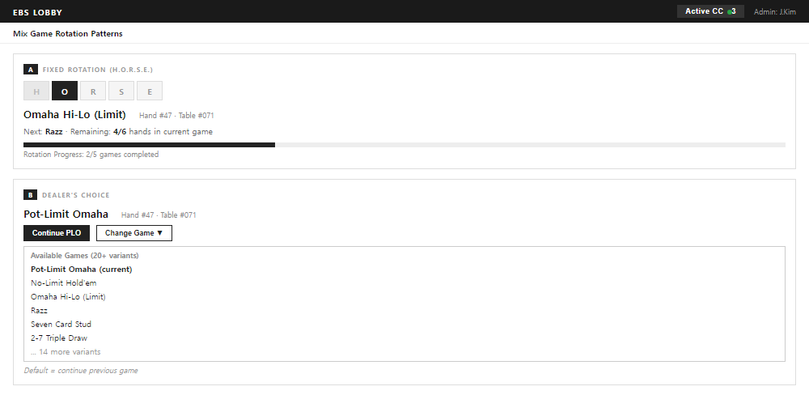

> *FIG · Mix 게임 모드. 좌측 Fixed Rotation (자동 순환), 우측 Dealer's Choice (매 핸드 선택).*

| 모드 | 동작 | 운영자 부담 |
|------|------|:---------:|
| **Fixed Rotation** | 미리 정한 순서로 시스템이 자동 전환 (예: H→O→R→S→E) | 0 |
| **Dealer's Choice** | 매 핸드마다 딜러 좌석 운영자가 8 후보 중 1 종 직접 선택 | ↑ |

### 3.3 — Lobby 가 보여주는 것

운영자가 Lobby 의 Event 화면에서 진행 중 Event 를 클릭하면, Mix 게임 진행 상황을 한눈에 볼 수 있다.

```
   #14   04/02 14:00
   Mixed PLO/Omaha/Big O   €1,500
   게임: MIX   모드: Choice
   412 entries / 187 re-entries · ★FT
   ────────────────────────────────────
   현재 게임: PLO (3/8 라운드)
   다음 게임: PLO8 (10 핸드 후)
```

운영자는 현재 어떤 게임이 진행 중인지, 다음 라운드가 무엇인지 확인한다. CC 는 게임 전환 신호를 자동으로 받아 6 키 매핑을 새 게임 규칙으로 갱신한다.

### 3.4 — 운영자의 선택은 Event 생성 시 한 번

Mix 모드 (Fixed / Choice) 의 결정은 **Event 생성 시점에** 운영자가 한 번 한다. 이벤트 진행 중에는 변경 불가.

운영자가 Lobby 에서 Mix 게임을 다시 보는 건 — 라운드 전환을 모니터링하거나, Choice 모드의 딜러 선택 정합성을 확인할 때.

> 변경 진입의 머무름은 길지 않다. 진행 상황 확인이 끝나면 운영자는 다시 CC 로 돌아간다.

---

## Ch.4 — 종료 진입: 방송이 끝날 때

방송이 끝나면 운영자는 Lobby 로 마지막으로 돌아온다.

### 4.1 — 모든 테이블이 COMPLETED 로 전환되는 순간


> *FIG · 테이블 상태 전환. 한 테이블의 일생 — Empty → Setup → Live → Completed.*

마지막 핸드가 끝나면 Tables 그리드의 124 줄 모두가 차례로 **COMPLETED** 로 전환된다. 색상 코드는 회색으로 통일된다 — 정상 종료의 신호다.

### 4.2 — Hand History 의 마지막 임무

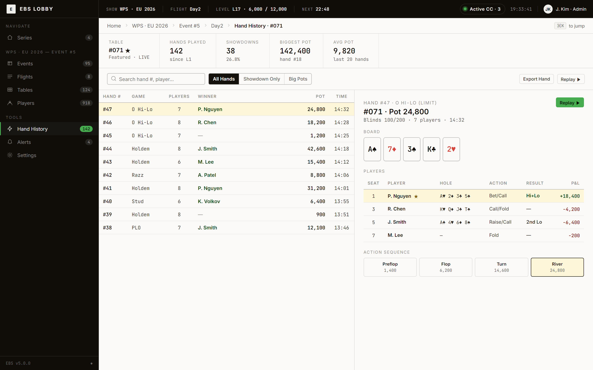

> *FIG · Hand History split-view. 142 hands 누적 — 좌측 리스트 + 우측 detail (board / seats / phases).*

운영자는 사이드바의 Hand History 를 클릭한다. 142 hands 가 누적되어 있다.

화면은 split-view 다. 좌측에 리스트, 우측에 선택한 hand 의 상세.

```
   좌측 리스트 (Hand # / Game / Players / Winner / Pot / Time)
   ──────────  ──────────────────────────────────
   우측 detail (선택한 hand 의 board / seats / phases)
   
   #47 — O Hi-Lo (Limit) · #071 · Pot 24,800
        Board:   A♠ 7♦ 3♠ K♣ 2♥
        Players: P. Nguyen (Hi+Lo, +18,400) ★
                 R. Chen   (—, -4,200)
                 J. Smith  (2nd Lo, -6,400)
                 M. Lee    (Fold, -200)
        Phases:  Preflop 1,400 → Flop 6,200 → Turn 14,600 → River 24,800
```

상단 KPI 5 — Hands Played 142 / Showdowns 38 (26.8%) / Biggest Pot 142,400 / Avg Pot 9,820 / Table #071.

### 4.3 — Hand JSON Export

운영자가 [Export Hand] 또는 [Replay ▶] 버튼을 누른다. 142 hands 의 데이터가 JSON 으로 직렬화되어 후편집 스튜디오 폴더에 저장된다.

```
   C:\EBS\Exports\HandHistory\
   └─ 2026-04-06_Day2_Event5\
      ├─ 142_hands.json
      ├─ board_cards_per_hand.json
      └─ player_stats_summary.json
```

이 데이터가 다음 날 후편집 팀이 하이라이트 영상을 만드는 재료다.

### 4.4 — 12 시간이 끝났다

Lobby 의 Tables 그리드는 124 줄 모두 회색이다. CC 는 모두 닫혀 있다. 운영자는 브라우저를 닫는다.

> Lobby 가 마지막으로 한 일은 데이터 무결성을 확인하고 후편집으로 넘기는 것이었다. 그것이 종료 진입의 의미다.

내일 또 다른 운영자가 다시 Login 화면 앞에 설 것이다.

---

# ACT II — Lobby 가 펼치는 WSOP LIVE 정보

> *Lobby 가 짧게 머무는 동안, 그것이 운영자에게 펼치는 모든 진실은 어디서 오는가.*

운영자가 Lobby 를 통과하는 동안 화면이 그에게 보여주는 모든 정보 — 8 series, 95 events, 8 flights, 918 players, 124 tables — 는 한 곳에서 온다.

**WSOP LIVE API**.

WSOP LIVE 는 카지노가 운영하는 토너먼트 관리 시스템이다. 등록자, 칩 카운트, 좌석 배정, 블라인드 레벨, 상금 구조 — 모든 토너먼트 데이터의 source of truth.

EBS Lobby 는 그 데이터의 거울이다.

```
  WSOP LIVE API
       │
       │ (단방향 동기화)
       ▼
  BO (Back Office, 중앙 서버)
       │
       │ (WebSocket 푸시)
       ▼
  Lobby ←─────────→ 운영자
       │
       │ (CC 진입 시 컨텍스트 전달)
       ▼
  Command Center
```

이 흐름을 정확히 보여주는 다이어그램이다.

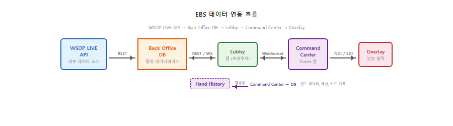

> *FIG · 데이터 동기화. 단방향 — 거꾸로 거슬러 올라가는 화살표 0.*

이 4 챕터는 운영자가 통과한 5 화면 중 4 화면을 다시 본다. 단 이번에는 화면 시퀀스가 아니라 **각 화면이 펼치는 WSOP LIVE 정보의 진실** 을 본다.

---

## Ch.5 — Series: 어느 대회인가


> *FIG · Series 목록. 8 카드 모두 WSOP LIVE 의 거울.*

8 카드. 모두 WSOP LIVE 의 진행 중 / 예정 / 완료된 시리즈다.

Lobby 가 운영자에게 묻는 첫 질문 — "어느 대회입니까" — 의 보기 8 개. 각 카드가 펼치는 정보:

| 필드 | WSOP LIVE 출처 |
|------|---------------|
| **이름** (예: World Poker Series 2026) | `series.name` |
| **지역** (Las Vegas / Cannes / Sydney) | `series.location` + `series.venue` |
| **기간** (May 27 ~ Jul 16) | `series.range_start` + `series.range_end` |
| **이벤트 수** (95, 14, 10, 12) | `series.events_count` (집계) |
| **상태** (Running / Registering / Announced / Completed) | `series.status` (5 enum) |
| **북마크 ★** | EBS 자체 (UserPreference) |

운영자가 카드를 클릭하면 그 시리즈의 Event 목록으로 이동한다. 클릭 한 번이 두 번째 질문의 답을 시작한다.

### 5.1 — 연도별 그룹핑

8 카드는 **연도** 로 그룹화된다 (2026 / 2025 / ...). 운영자가 진행 중 시리즈를 빠르게 찾도록.

> 운영실에 들어왔을 때 가장 자주 묻는 질문은 "오늘 무슨 시리즈?" 다. Lobby 는 그 질문에 답한다.

---

## Ch.6 — Event + Flight: 어느 토너먼트, 며칠 차


> *FIG · Event 목록. 95 이벤트 + KPI 5 박스 + 5 status 탭.*

Event 화면은 5 status 탭 + 데이터 테이블 + KPI 5 박스다. 95 이벤트가 한 화면에 들어간다.

| KPI | WSOP LIVE 출처 |
|------|---------------|
| Total Events 95 | events COUNT |
| Live Now 3 | events WHERE status='running' |
| Total Entries 14,287 | SUM (entries 전 이벤트) |
| Prize Pool €19.4M | SUM (prize_pool 전 이벤트) |
| Active CC 3 / 12 | EBS 자체 (CC 인스턴스 상태) |


> *FIG · Flight 목록. Event 안의 8 Day — Day1A/B/C 완료, Day2 진행 중 (918 생존).*

Event 를 클릭하면 그 안의 Flight 목록 (8 Day) 이 펼쳐진다. Day1A → Day1B → Day1C → Day2 → Day3 → ... → Final.

### 6.1 — Flight = WSOP LIVE Day 의 EBS 표현

WSOP LIVE 에서 토너먼트는 "Day" 단위로 진행된다. 같은 이벤트 안에서 Day1A, Day1B, Day1C 가 별도 진행되고, 살아남은 player 들이 Day2 로 합류 (combination flights).

Lobby 의 Flight 화면은 그 Day 진행 상황을 펼친다.

| Flight 정보 | 의미 |
|-----------|------|
| Start Time | 그 Day 의 시작 시각 |
| Entries (336 / 803) | 등록 / 정원 |
| Survivors (667) | 살아남은 player 수 |
| Tables (136) | 그 Day 의 테이블 수 |
| Status | completed / registering / announced |

**진행 중 Day 만 라이브 강조** — Day2 의 행이 색상으로 표시된다. 운영자가 즉시 "오늘은 Day2 다" 를 인지한다.

### 6.2 — Late Registration

Day1 이 끝나면 Late Reg (지각 등록) 가 닫힌다. WSOP LIVE 가 Late Reg 종료 시점을 EBS Lobby 에 푸시하면, Lobby 의 Event 카드 status 가 `registering` → `running` 으로 자동 전환된다.

운영자는 Lobby 에서 그 전환을 보고 — "이제 신규 등록은 안 받는다" — 를 안다.

---

## Ch.7 — Players: 칩 카운트가 어디서 오는가

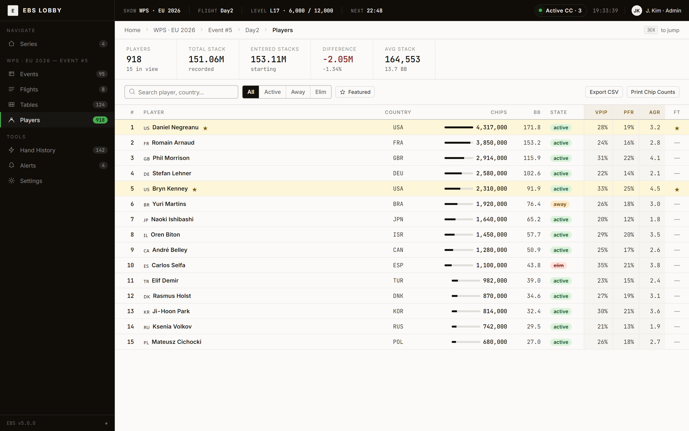

> *FIG · Players 리더보드. 918 명 중 Top 15 — 칩 카운트는 WSOP LIVE 의 거울.*

918 명의 player 가 한 화면에. Top 15 가 leaderboard 형식으로 표시되고, 검색하면 모든 918 명에 접근 가능.

| 필드 | 출처 |
|------|------|
| **이름** (Daniel Negreanu, Romain Arnaud, ...) | WSOP LIVE `player.name` |
| **국기** (🇺🇸 🇫🇷 🇬🇧 🇩🇪 ...) | WSOP LIVE `player.country` |
| **칩** (4,317,000 / 3,850,000 / ...) | WSOP LIVE `player.chip_count` (실시간) |
| **BB** (171.8 / 153.2 / ...) | EBS 계산 (chip / current_BB) |
| **상태** (Active / Away / Elim) | WSOP LIVE + EBS |
| **VPIP / PFR / AGR** | EBS 자체 통계 (CC 가 기록) |
| **FT** ★ (Final Table) | WSOP LIVE seat 기준 |

상단 KPI 5 — Players 918 / Total Stack 151.06M / Entered Stacks 153.11M / Difference −2.05M (−1.34%) / Avg Stack 164,553.

### 7.1 — 칩 카운트는 어떻게 동기화되는가

WSOP LIVE 의 칩 카운트는 **floor 직원이 수동 입력** 하거나 RFID 시스템이 자동 갱신한다. EBS Lobby 는 그 데이터를 BO 를 거쳐 받는다.

**Difference −2.05M** — 시작 시점 대비 −2.05M 의 차이가 자동 검출. RFID 인식 누락이나 chip 입력 오류를 운영자가 즉시 인지할 수 있게 KPI 로 노출.

### 7.2 — Player 클릭 = 위치 자동 매핑

운영자가 Lobby 에서 player 를 클릭하면, 그 player 가 어느 테이블 어느 좌석에 앉아 있는지 즉시 보인다. CC 에 들어가지 않고도 player 의 위치를 안다.

> Lobby 의 정보 허브 측면이 가장 강하게 드러나는 화면이다. 918 player 의 진실이 한 화면에.

---

## Ch.8 — Tables Grid: 124 줄의 한 줄 요약 + 3 view

Tables 그리드는 본 문서의 Ch.1.5 에서 이미 봤다. Act II 에서 다시 보는 이유 — **Lobby 의 진짜 가치가 이 화면에 압축** 되기 때문이다.

124 줄. 한 줄에 9 좌석 + 5 컬럼 + KPI 5 + Levels strip.

이 한 줄은 다음 6 source 의 합성이다:

| 정보 | 출처 |
|------|------|
| 좌석 a/e/r/d/w | WSOP LIVE seat 배정 + EBS 실시간 갱신 |
| RFID Rdy/Err/off | EBS 하드웨어 |
| 덱 52/52 | EBS RFID 하드웨어 |
| 출력 NDI/SDI | EBS 출력 장비 |
| CC LIVE/IDLE/ERROR | EBS CC 인스턴스 상태 |
| Op.A · #47 | EBS Operator 할당 + CC 진행 hand |

= **WSOP LIVE 데이터 + EBS 자체 데이터** 의 합성.

### 8.1 — 같은 데이터, 3 가지 시점

운영자는 Tables 그리드를 3 가지 view 로 본다.

| View | 강점 | 진입 |
|:----:|------|------|
| **Grid** (기본) | 124 테이블의 상태 표 | 기본 |
| **Floor Map** | 운영실의 물리적 좌석 배치 | 운영자가 view 선택 |
| **CC Focus** | 한 table 의 CC 만 큰 카드 | **table 선택 시 진입** |

#### Grid view (기본 시점)


> *FIG · Grid view. 124 줄을 한 화면에 표 형태로 압축.*

Ch.1.5 에서 봤던 그 화면. 양 (124 테이블) 의 시점.

#### Floor Map view = table layout

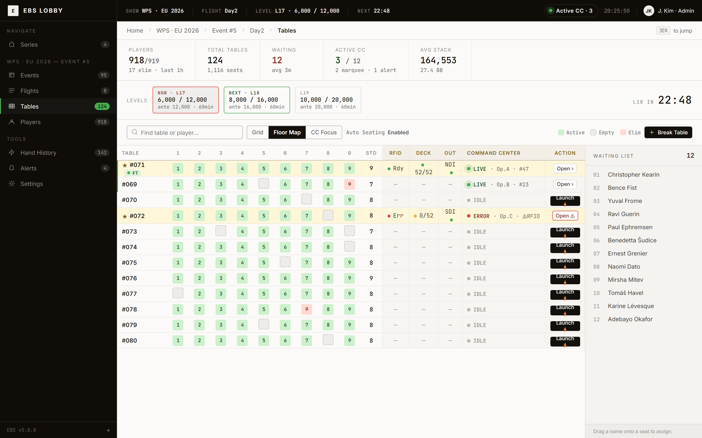

> *FIG · Floor Map. 운영실 물리적 배치를 그대로 시각화.*

운영실 / 토너먼트장의 물리적 좌석 배치를 그대로 시각화. 운영자가 "어느 테이블이 어디 있는가" — 무전 시 또는 현장 점검 시 — 를 즉시 안다.

#### CC Focus view = table 선택 시 진입

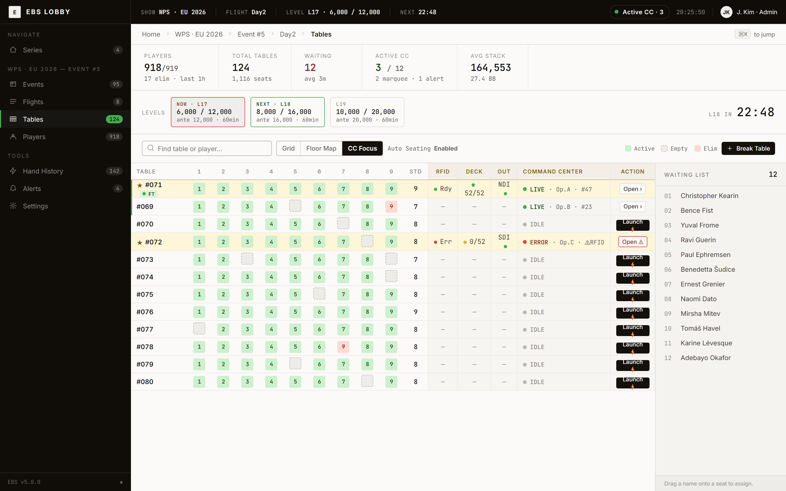

> *FIG · CC Focus. 한 table 의 CC 큰 카드 — table 선택 시 진입.*

운영자가 특정 table 줄을 더블클릭하면 진입. 그 한 table 의 CC 만 큰 카드로 표시된다.

좌석 9 개 + 칩 카운트 + 진행 hand 정보 + RFID 상태 + 출력 신호가 큰 화면에. 운영자가 한 table 의 진행을 정밀 시청할 때 사용.

> Grid 가 **양**의 시점, Floor Map 이 **위치**의 시점, CC Focus 가 **깊이**의 시점.

### 8.2 — Active CC pulse: 살아 있다는 신호


> *FIG · Active CC pulse. TopBar 우측 상단의 살아있는 신호.*

Lobby 의 TopBar 우측 상단에 **Active CC** pulse 가 켜져 있다.

```
  ● Active CC · 3
       │
       └ 펄스 애니메이션 (1.8s 주기)
```

3 개의 CC 가 LIVE 상태라는 시각 표시. 펄스가 멈추면 CC 인스턴스에 문제가 있다는 신호다.

운영자가 Lobby 를 잠깐 다시 봐도 — TopBar 만 보면 — 시스템 상태를 즉시 안다. **Lobby 가 머무는 곳이 아니어도, 한눈에 system 상태를 전달할 수 있어야 한다** 가 이 디자인의 이유다.

---

# ACT III — Lobby 가 사라지면

> *Lobby 의 정의는 그것이 없을 때 무엇이 어긋나는지로 가장 명확해진다.*

만약 Lobby 가 없다면 — 운영자가 Command Center 에 직접 들어가야 한다면 — 운영실은 어떻게 변할까. 이 반증을 통해 Lobby 의 정체가 가장 선명해진다.

## Ch.9 — 각자 SSH 로 들어가는 세상

124 테이블 중 3 개 Featured Table. 운영자가 그 3 개 CC 를 켜려면, Lobby 가 없을 때 어떻게 할까.

```
   [Lobby 없는 운영실]
   
   운영자 A → SSH → Table#71 PC → CC 시작
   운영자 B → SSH → Table#72 PC → CC 시작
   운영자 C → SSH → Table#75 PC → CC 시작
   
   각자 명령줄, 각자 환경변수, 각자 RFID 점검.
   누가 어느 테이블에 있는지는 무전 또는 화이트보드.
```

각 운영자가 따로 진입한다. 진입 절차도 따로, 환경 설정도 따로. 그러면 다음 4 가지가 어긋난다:

| 문제 | 영향 |
|------|------|
| 운영자가 잘못된 테이블에 진입 | 발견 어려움, 방송 직전에야 발견 |
| RFID 점검 누락 | 방송 시작 후 RFID Err 발견 |
| 운영자 idle 상태 (8분 이상 미응답) | 다른 운영자가 인지 못함 |
| WSOP LIVE 정보 = CC 안에서만 | 진입 전 컨텍스트 0 |

## Ch.10 — WSOP LIVE 정보를 매번 따로 조회

WSOP LIVE 의 정보 — 등록 인원, 칩 카운트, 다음 레벨 시작 시간, 살아남은 player — 를 운영자가 알아야 할 때마다 어떻게 조회할까.

```
   [Lobby 없는 운영실의 3 가지 임시 방편]
   
   ① WSOP LIVE 웹 콘솔 직접 로그인
       → 계정 권한 다름 / 매번 로그인
   
   ② WSOP LIVE 담당자에게 무전
       → 시간 손실
   
   ③ 운영실 한쪽 화면에 WSOP LIVE 대시보드
       → CC 작업 흐름 깨뜨림 (옆눈)
```

이 모든 방법이 **CC 작업의 흐름을 깨뜨린다**. 운영자가 한 핸드 진행 중에 WSOP LIVE 정보를 따로 조회해야 한다면, 그 핸드의 정확도가 떨어진다.

## Ch.11 — 그래서 Lobby 가 존재한다

Lobby 의 정의 = 위 두 문제의 해결책.

```
   [Lobby 가 있는 운영실]
   
   1. CC 진입은 [Launch ⚡] 한 클릭
       → 환경 / RFID / Operator 자동 처리
   
   2. WSOP LIVE 정보는 진입 시 한 화면에 펼쳐짐
       → CC 안에 들어간 후엔 그 컨텍스트가 자동 흐름
   
   3. CC 가 어긋났을 때 (RFID Err 등) Lobby 의 한 줄이 빨갛게
       → 즉시 인지 + 한 클릭 회복
   
   4. 종료 시 Hand JSON Export 한 화면에 통합
       → 후편집 데이터 누락 0
```

= 운영자가 CC 에 머무는 시간을 늘리고, Lobby 에 머무는 시간을 줄이고, 그 짧은 Lobby 시간 동안 모든 컨텍스트를 받는다.

> Lobby 는 머무는 곳이 아니지만, 그것이 있어야 운영자가 CC 에 머물 수 있다.

---

# EPILOGUE — 짧은 머무름이 작업 시간을 작동시킨다

운영자가 Lobby 에 머무는 시간은 짧다. 첫 진입의 5 화면 통과, 비상 시 짧은 회복, 게임 변경 시 짧은 확인, 종료 시 Hand JSON Export.

그 짧은 머무름들이 합쳐서 — Command Center 의 작업 시간을 작동시킨다.

```
   Lobby 의 4 가지 짧은 머무름
        +
   WSOP LIVE 의 모든 정보 거울
        +
   CC 의 한 클릭 진입
        ─────────────────────
        =  방송 가능한 운영실
```

내일도 같은 운영실, 같은 운영자, 같은 5 화면.

그러나 그 5 화면은 매일 다른 8 series 와 95 events 와 918 players 의 진실을 펼친다.

> Lobby 는 짧지만 매일 다르다. 운영자에게 매일 새로운 컨텍스트를 건넨다.

---

# 부록 A — 데이터 모델

> Lobby 가 표시하는 모든 필드의 source 매핑.

## A.1 Series (8 카드)

| 필드 | 타입 | 출처 |
|------|------|------|
| id | string | EBS 자체 (BO) |
| name | string | WSOP LIVE |
| year | number | WSOP LIVE |
| location | string | WSOP LIVE |
| venue | string | WSOP LIVE |
| range | string | WSOP LIVE |
| events_count | number | WSOP LIVE 집계 |
| status | enum (created/announced/registering/running/completed) | WSOP LIVE |
| starred | boolean | EBS UserPreference |
| accent | OKLCH color | EBS theme |

## A.2 Event

| 필드 | 타입 | 출처 |
|------|------|------|
| no | number | WSOP LIVE |
| time | datetime | WSOP LIVE |
| name | string | WSOP LIVE |
| buyin | string | WSOP LIVE |
| game | enum (NLH/PLO/MIX/...) | WSOP LIVE |
| mode | enum (Single / Choice / Fixed Rotation) | WSOP LIVE — Single=단일 게임 / Choice=Dealer's Choice / Fixed Rotation=HORSE/8-Game cycle (Foundation §B.1) |
| entries / reentries / unique | number | WSOP LIVE |
| status | enum (5) | WSOP LIVE |
| featured | boolean | EBS |

## A.3 Flight

| 필드 | 타입 | 출처 |
|------|------|------|
| no | number | WSOP LIVE Day index |
| name | string (Day1A/B/C/Day2/Day3/Final) | WSOP LIVE |
| time | datetime | WSOP LIVE |
| entries | string ("336/803") | WSOP LIVE 집계 |
| players | number | WSOP LIVE WHERE state='active' |
| tables | number | EBS WHERE flight_id=X |
| status | enum (5) | WSOP LIVE |
| active | boolean | computed |

## A.4 Table (124 줄)

| 필드 | 타입 | 출처 |
|------|------|------|
| id | string ("#071") | EBS table_id |
| featured | boolean | EBS table_type |
| seats | array<enum a/e/r/d/w> (9개) | WSOP LIVE seat + EBS 실시간 |
| rfid | enum (rdy/err/off) | EBS hardware |
| deck | string ("52/52") | EBS RFID hardware |
| out | enum (NDI/SDI/null) | EBS output |
| cc | enum (live/idle/err) | EBS CC instance |
| op | string ("Op.A · #47") | EBS Operator + CC progress |
| marquee | boolean | EBS Featured Table flag |

## A.5 Player (918 명, Top 15 표시)

| 필드 | 타입 | 출처 |
|------|------|------|
| place | number | WSOP LIVE leaderboard |
| name | string | WSOP LIVE |
| country / flag | string / emoji | WSOP LIVE + EBS lookup |
| chips | number | WSOP LIVE 실시간 |
| bb | number | EBS 계산 (chips / current_BB) |
| state | enum (active/away/elim) | WSOP LIVE + EBS |
| vpip / pfr / agr | number | EBS CC 통계 |
| ft | boolean (Final Table seat) | WSOP LIVE |
| featured | boolean | EBS |

---

# 부록 B — WebSocket / API endpoints

## B.1 Lobby 가 구독하는 WebSocket 채널

```
   ws://<bo-host>/ws/lobby
   
   Push events:
   - series:created / updated / completed
   - event:status_changed
   - flight:active_day_changed
   - table:state_changed
   - player:chip_changed
   - cc:status_changed (live → idle → err)
   - level:tick (clock)
   - level:transition (L17 → L18)
```

## B.2 Lobby 가 호출하는 REST API

| Endpoint | 용도 | 호출 시점 |
|----------|------|----------|
| `GET /api/v1/series` | Series 8 카드 | 진입 시 |
| `GET /api/v1/events?series_id=X` | Event 95 행 | Series 클릭 |
| `GET /api/v1/flights?event_id=X` | Flight 8 행 | Event 클릭 |
| `GET /api/v1/tables?flight_id=X` | Tables 124 행 | Flight 클릭 |
| `GET /api/v1/players?flight_id=X` | Player 918 명 | Players 사이드바 |
| `GET /api/v1/hands?table_id=X` | Hand History 142 | Hand History 진입 |
| `POST /api/v1/cc/launch` | CC 시작 | [Launch ⚡] 클릭 |
| `POST /api/v1/cc/resync` | RFID 재동기화 | [Resync RFID] 클릭 |
| `POST /api/v1/cc/mock-mode` | Mock 전환 | [Mock] 클릭 |
| `POST /api/v1/handhistory/export` | Hand JSON Export | [Export] 클릭 |
| `GET /api/v1/tables/state/snapshot` | 세션 복원 | 브라우저 재접속 시 |

## B.3 BO ↔ WSOP LIVE 동기화

```
   WSOP LIVE API (외부)
        │ 매일 동기화 (cron + webhook)
        ▼
   BO 동기화 worker (Python/FastAPI)
        │ DB upsert
        ▼
   PostgreSQL (BO DB)
        │ WebSocket push
        ▼
   Lobby (브라우저)
```

EBS 는 WSOP LIVE 의 거울일 뿐 — 데이터를 거꾸로 쓰지 않는다.

---

# 부록 C — 컴포넌트 트리 (Flutter widget 매핑)

## C.1 App 골격

```
   App
   ├── TopBar
   │    ├── Logo + Brand mark
   │    ├── Show Context Cluster (SHOW/FLIGHT/LEVEL/NEXT)
   │    └── Active CC pulse + clock + UserPill
   ├── Sidebar (3 그룹)
   │    ├── Navigate (Series)
   │    ├── WPS · EU 2026 — Event #5
   │    │    ├── Events / Flights / Tables / Players
   │    └── Tools
   │         ├── Hand History
   │         ├── ~~Alerts~~ (폐기, Q1 2026-05-07)
   │         └── Settings
   └── Main
        ├── Breadcrumb
        └── Body (현재 화면 라우팅)
```

## C.2 React JSX → Flutter widget 매핑

| React 컴포넌트 | Flutter widget |
|---------------|----------------|
| `<TopBar>` | `LobbyTopBar` (StatefulWidget, Riverpod) |
| `<Rail>` | `LobbyRail` (StatelessWidget) |
| `<Breadcrumb>` | `BreadcrumbBar` |
| `<SeriesScreen>` | `SeriesGrid` (GridView + SeriesCard) |
| `<EventsScreen>` | `EventsTable` (DataTable) |
| `<FlightsScreen>` | `FlightsTable` |
| `<TablesScreen>` | `TablesGrid` (커스텀 — 9-seat + 5 컬럼 + 3 view) |
| `<PlayersScreen>` | `PlayersLeaderboard` |
| `<HandHistoryScreen>` | `HandHistorySplitView` |
| `<SettingsScreen>` | `SettingsTabBar` (6 탭) |
| `<LoginScreen>` | `LoginPage` |

상세 매핑: `team1-frontend/lib/features/lobby/`

---

# 부록 D — Settings 6 탭 79 필드 + LOCK/CONFIRM/FREE

## D.1 6 탭 개요

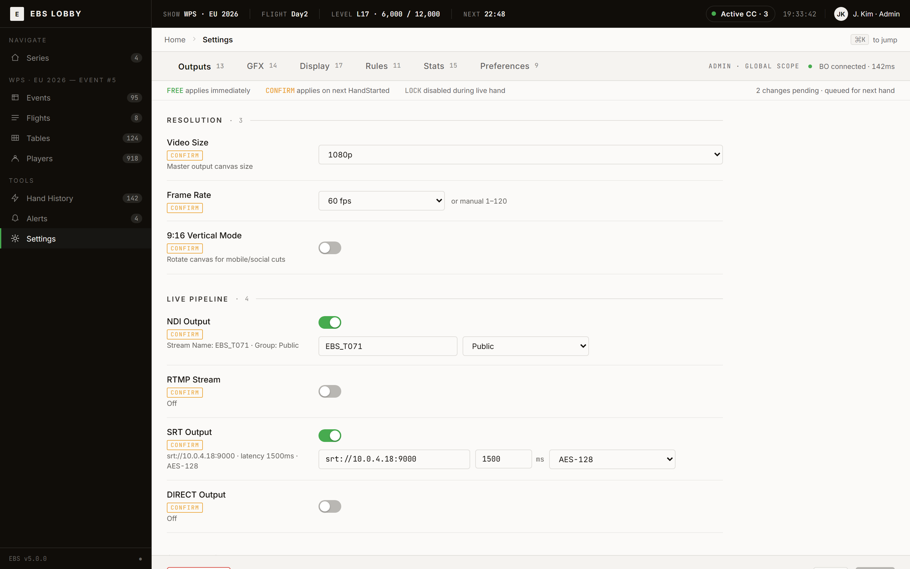

> *FIG · Settings 진입점. 6 탭 + 상단 Status banner.*

| 탭 | 필드 수 | 주 영역 |
|----|:------:|--------|
| **Outputs** | 13 | Resolution / Live Pipeline (NDI/RTMP/SRT/DIRECT) / Output Mode |
| **GFX** | 14 | Layout / Card&Player / Animation / Display Toggles / Active Skin |
| **Display** | 17 | Blinds / Currency / Precision / Mode / UI Theme |
| **Rules** | 11 | Game Rules / Player Display |
| **Stats** | 15 | Equity / Leaderboard / Score Strip |
| **Preferences** | 9 | Table / Diagnostics / Export |

총 **79 필드**.

## D.2 GFX 탭 상세 (가장 자주 변경되는 탭)

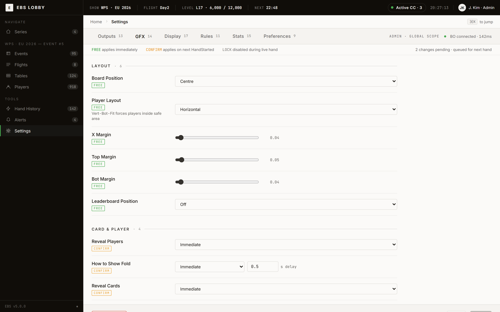

> *FIG · GFX 탭. 14 필드.*

(상세 79 필드는 `screens-extra.jsx` SSOT 또는 `Settings/` 폴더 분산 SSOT 참조)

## D.3 LOCK / CONFIRM / FREE

| 분류 | 적용 시점 | 색상 | 예 |
|------|----------|:----:|------|
| **FREE** | 즉시 | 녹색 | margin / animation / display toggle |
| **CONFIRM** | 다음 hand 시작 | 황색 | resolution / NDI / frame rate |
| **LOCK** | 라이브 중 비활성 | 회색 | game type / max players |

상단 Status banner 가 운영자에게 색상 의미를 항상 보여준다 — `FREE applies immediately` / `CONFIRM applies on next HandStarted` / `LOCK disabled during live hand`.

---

# 부록 E — RBAC (Admin / Operator / Viewer)

## E.1 3 역할

| 역할 | 권한 |
|------|------|
| **Admin** | 시스템 전체 — 모든 화면 / 모든 액션 / Settings 수정 / Series 생성 |
| **Operator** | 자신 할당 1 개 CC — Lobby 모니터링 가능, Settings 수정 X |
| **Viewer** | 모든 화면 읽기만 — 어떠한 조작도 불가 |

## E.2 RBAC 매트릭스

```
   +-----------------+--------+----------+--------+
   | 화면 / 액션    | Admin  | Operator | Viewer |
   +-----------------+--------+----------+--------+
   | Series 조회     |   ✅   |    ✅    |   ✅   |
   | Series 생성     |   ✅   |    ❌    |   ❌   |
   | Tables 그리드   |   ✅   |    ✅    |   ✅   |
   | CC Launch       |   ✅   |    ⚠*    |   ❌   |
   | Settings 조회   |   ✅   |    ✅    |   ✅   |
   | Settings 수정   |   ✅   |    ❌    |   ❌   |
   | Players 등록    |   ✅   |    ❌    |   ❌   |
   | Hand History    |   ✅   |    ✅    |   ✅   |
   | Hand JSON Export|   ✅   |    ✅    |   ❌   |
   | Reset / Restart |   ✅   |    ❌    |   ❌   |
   +-----------------+--------+----------+--------+
   ⚠* Operator 는 자신에게 할당된 테이블만 Launch 가능
```

## E.3 인증 경로

- Email + Password + TOTP 2FA
- Entra ID OAuth (single sign-on)

BO 가 권한을 자동 적용 → 화면과 버튼이 권한에 맞게 활성/비활성.

---

# 부록 F — 스크린샷 갤러리 (25 PNG)

## F.1 화면 PNG

| 화면 | PNG 경로 | 등장 챕터 |
|------|---------|----------|
| Login | `00-login.png` | Ch.1.1 |
| Series | `01-series.png` | Ch.1.2 / Ch.5 |
| Events | `02-events.png` | Ch.1.3 / Ch.6 |
| Flights | `03-flights.png` | Ch.1.4 / Ch.6 |
| Tables Grid | `04-tables.png` | Ch.1.5 / Ch.8 |
| Tables Floor Map | `04b-tables-floor-map.png` | Ch.8 |
| Tables CC Focus | `04c-tables-cc-focus.png` | Ch.8 |
| Launch Modal | `04d-tables-launch-modal.png` | Ch.1.6 |
| Players | `05-players.png` | Ch.7 |
| Hand History | `06-hands.png` | Ch.4.2 |
| Settings Outputs | `07-settings.png` | 부록 D |
| Settings GFX | `07b-settings-gfx.png` | 부록 D |
| 1:N 관계 | `cc-relationship.png` | Hero |

## F.2 Flow 다이어그램 PNG

| flow | PNG 경로 | 등장 챕터 |
|------|---------|----------|
| Active CC dropdown | `flow-active-cc-dropdown.png` | Ch.8.2 |
| API sequence | `flow-api-sequence.png` | 부록 B |
| CC Launch | `flow-cc-launch.png` | Ch.1.6 보강 |
| CC Lock | `flow-cc-lock.png` | Ch.2.4 |
| Data Sync | `flow-data-sync.png` | ACT II intro |
| Dependencies | `flow-dependencies.png` | system arch |
| ER diagram | `flow-er-diagram.png` | 부록 A |
| Hand History flow | `flow-hand-history.png` | Ch.4 보강 |
| Manual to API | `flow-manual-to-api.png` | system |
| Mix Game | `flow-mix-game.png` | Ch.3.2 |
| Session Restore | `flow-session-restore.png` | 장애 |
| Table Status | `flow-table-status.png` | Ch.4.1 |

→ **25 PNG 모두 활용** (draft.2 의 1 PNG 대비 25 배).

---

# 부록 G — 약어 사전

| 약어 | 풀이 |
|------|------|
| **BO** | Back Office (중앙 서버) |
| **CC** | Command Center (테이블별 운영 화면) |
| **RFID** | Radio Frequency Identification (무선 카드 인식) |
| **NDI** | Network Device Interface (네트워크 영상 신호) |
| **SDI** | Serial Digital Interface (케이블 영상 신호) |
| **KPI** | Key Performance Indicator (핵심 지표) |
| **BB** | Big Blind (빅 블라인드) |
| **VPIP / PFR / AGR** | Voluntarily Put Money In Pot / Pre-Flop Raise / Aggression |
| **LIVE / IDLE / ERROR** | CC 상태 3 종 |
| **FREE / CONFIRM / LOCK** | Settings 적용 시점 분류 |
| **WPS** | World Poker Series |
| **NLH** | No Limit Hold'em |
| **PLO** | Pot Limit Omaha |
| **HORSE** | Hold'em / Omaha Hi-Lo / Razz / Stud / Stud Hi-Lo (Mix 게임) |
| **8-Game** | HORSE + Triple Draw + NLH + PLO (Mix 게임) |
| **PPC** | PLO / PLO8 / Big O (Mix 게임) |
| **FT** | Final Table |
| **TOTP** | Time-based One-Time Password (2FA) |
| **OAuth** | Open Authorization (외부 인증) |
| **Entra ID** | Microsoft Entra (구 Azure AD) |

---

# 부록 H — 1 hand 시나리오 시퀀스 (Cycle 2, Issue #239)

> **목적**: Lobby 가 "table 생성 → CC 할당 → RFID monitor → cascade publish" 의 4단계 wire 를
> **자동으로 1회 실행** 하는 데모/검증 시나리오. 인수인계 시 핵심 데이터 흐름을 30초 안에
> 확인할 수 있게 한다.

## H.1 진입 방법

```bash
# Lobby Web (개발자 디버깅)
cd team1-frontend
flutter run -d chrome \
  --dart-define=USE_MOCK=true \
  --dart-define=HAND_AUTO_SETUP=true

# Docker (정규 배포 + auto-setup ON)
docker compose run --build \
  -e DART_DEFINES="HAND_AUTO_SETUP=true,USE_MOCK=true" \
  lobby-web
```

기본값 `HAND_AUTO_SETUP=false`. 평상시 운영자 화면은 자동 셋업이 작동하지 않음.

## H.2 시퀀스 (4단계)

```
   사용자                AppConfig              HandAutoSetup           Backend (S7)              Broker (S0)
     │                      │                       │                       │                        │
     │   --dart-define      │                       │                       │                        │
     │ HAND_AUTO_SETUP=true │                       │                       │                        │
     │─────────────────────>│                       │                       │                        │
     │                      │                       │                       │                        │
     │                  (bootstrap)                 │                       │                        │
     │                      │── run() ─────────────>│                       │                        │
     │                      │                       │                       │                        │
     │                      │                       │── POST /tables ──────>│                        │
     │                      │                       │<── tableId=N ─────────│                        │
     │                      │                       │                       │                        │
     │                      │                       │── POST /tables/N      │                        │
     │                      │                       │       /cc-session ───>│                        │
     │                      │                       │<── ccSessionId ───────│                        │
     │                      │                       │                       │                        │
     │                      │                       │── subscribe           │                        │
     │                      │                       │     /ws/lobby ───────>│ (rfid_seat_* 수신 준비)│
     │                      │                       │                       │                        │
     │                      │                       │── log cascade:        │                        │
     │                      │                       │   lobby-hand-ready ──────────────────────────>│
     │                      │                       │                       │                        │
```

## H.3 4단계 상세

| 단계 | 액션 | 책임 | 상태 |
|:---:|------|------|------|
| **1. table 생성** | `POST /api/v1/tables` (auto-setup 모드 기본 1번 테이블) | S2 → S7 | S7 endpoint 발행 대기 (현재 stub 동작) |
| **2. CC 할당** | `POST /api/v1/tables/{id}/cc-session` (Operator 1명 자동 할당) | S2 → S7 | S7 endpoint 발행 대기 |
| **3. RFID monitor** | `ws://.../ws/lobby` 구독 — `rfid_seat_seated`, `rfid_seat_left` 이벤트 수신 준비 | S2 (소비자) | S7 publish 정합 (CCR-017) |
| **4. cascade publish** | `cascade:lobby-hand-ready` event 를 broker(@7383) 로 publish | S2 → S0 | v11 broker MCP 경로 (`tools/orchestrator/message_bus`) |

## H.4 상태 머신 (`HandAutoSetupStep`)

```
   pending
      │
      v
   tableCreating ─── (error) ──> failed
      │
      v
   tableCreated
      │
      v
   ccAssigning ────── (error) ──> failed
      │
      v
   ccAssigned
      │
      v
   rfidMonitoring
      │
      v
   cascadeReady  ← 완료 (Issue #239 KPI 통과)
```

## H.5 검증 기준 (KPI)

| KPI | 측정 |
|------|------|
| 1 hand wire 통과 | `HandAutoSetupStep.cascadeReady` 도달 (Riverpod state 확인) |
| 빌드 무결성 | `flutter build web --dart-define=HAND_AUTO_SETUP=true` 성공 |
| 시간 한계 | bootstrap 완료 후 1 초 이내 cascadeReady 도달 (stub 기준) |
| Enum 정합 | `flight_status.dart` ↔ `integration-tests/scenarios/60-event-flight-status-enum.http` (값 0,1,2,4,5,6 일치) |

## H.6 후속 통합 (S7 endpoint 발행 후)

`_stubCreateTable()` / `_stubAssignCc()` 를 실제 API 호출로 교체:

```dart
// hand_auto_setup_provider.dart 후속 변경 예시
Future<int> _createTable() async {
  final res = await _apiClient.post<int>(
    '/tables',
    fromJson: (json) => (json as Map)['data']['tableId'] as int,
  );
  return res;
}
```

상세: `docs/2. Development/2.2 Backend/APIs/Backend_HTTP.md` (S7 owner)

## H.7 자가 점검 (rule 19 P7)

| 항목 | 평가 |
|------|------|
| 18세 일반인 이해 | ★★★★☆ — 4단계 다이어그램 + 표 구성, 기술 용어 (dart-define) 는 비유 미흡 |
| 비유 | ASCII 시퀀스 다이어그램으로 시각 우선 (rule 11 정합) |
| 명령 1줄로 검증 가능 | ✅ — `flutter run --dart-define=HAND_AUTO_SETUP=true` |
| derivative-of cascade | Lobby.md 부록 추가만, 본문 narrative 변경 0 (additive) |

---

## Changelog

| 날짜 | 버전 | 변경 |
|------|:---:|------|
| 2026-05-07 | 3.0.0-draft.1 | 12 시간 narrative (정체성 오해 — REJECT) |
| 2026-05-07 | 3.0.0-draft.2 | 5 분 게이트웨이 정정 (PNG 1개 + 작위 12건 — REJECT) |
| 2026-05-07 | 3.0.0-draft.3 | 5 화면 시퀀스 + 스크린샷 풍부 (Ch.1 6 PNG — APPROVE 5/5) |
| 2026-05-07 | **3.0.0** | **전체 작성 완료** — Prologue + Act I~III + Epilogue + 부록 A~G + 25 PNG 모두 활용 |
| 2026-05-11 | 3.0.1 | 부록 H 추가 (1 hand 시퀀스, Cycle 2 #239) — narrative 변경 0, additive only |
| 2026-05-11 | 3.0.2 | §Ch.1.7 본문 추가 (1 hand 자동 셋업 데모, Cycle 3) — Ch.1 5 화면 시퀀스 ↔ 부록 H 연결, additive only |
| 2026-05-12 | 3.0.3 | Cycle 6 #312 — multi-hand auto_demo (Hand 1 -> Hand 2 전환). HandAutoSetupStep 4 단계 추가 (hand1Complete / nextHandRotating / hand2Dealt). handHistory[] + dealer button indicator UI 위젯. v02-lobby evidence 6 PNG. S8 #301 ManualNextHand 계약 소비. additive only — narrative 변경 0 |
| 2026-05-12 | 3.0.4 | **Cycle 11 #379** — 사용자 비판 2건 해소. (A) Login 안정화: `app_config.dart` `EBS_SAME_ORIGIN` default `true` 화. LAN 디바이스가 호스트 PC hosts 파일 의존 없이 작동. 절대 URL fallback 은 native build 만. Web origin 빈 경우 상대 `/api/v1` graceful fallback. (B) Lobby HTML mockup 정합: `lobby_mockup_tokens.dart` 신규 (mockup CSS hex 단일 SSOT). `LobbyShell` sidebar 제거 → mockup `.hdr` dark top-bar (EBS LOBBY / Active CC pill / Admin user popup). `LoginScreen` 재설계: dark `EBS` 헤더 + 흰 카드 (340px) + email/password rows + Forgot link + Login + Entra ID (TBD). Sub-feature (Settings/GE/Reports/Staff/Players/HandHistory) = user menu popup. PR #377 BO API call data flow 유지. additive only — narrative 변경 0 |
| 2026-05-12 | 3.0.4 | Cycle 10 S2 hierarchy wire — Series → Event → Flight → Table drill-down 이 실 BO 와 nested route 로 통신하도록 wire 정정. `EventRepository.listBySeries()` + `TableRepository.listByFlight()` 신규. 이전 `?seriesId=` / `?flightId=` 쿼리 파라미터는 BO (FastAPI snake_case) 와 SSOT Naming_Conventions.md (camelCase JSON) 간 divergence 로 인해 무시되어 다른 event 가 같은 flight 목록을 보여주는 증상 야기. 본 cycle 은 path-variable nested route 로 우회. v01-lobby evidence 6 PNG (login → series → event → flight → table → KPI 증명: event A vs event B distinct flight id). KPI 통과. additive only — narrative 변경 0 |

---

## 자가 점검 (rule 19 P7 + chapter-doc Phase 3.5)

<table role="presentation" width="100%">
<tr>
<td width="50%" valign="top" align="left">

**§구조 (rule 19) · 5/5**

| # | 점검 | 통과 |
|:-:|------|:----:|
| 1 | frontmatter (title/version/tier/audience) | ✅ |
| 2 | Hero (80자 thesis 인용구) | ✅ |
| 3 | Reader Anchor (입구/출구 P2 Pair) | ✅ |
| 4 | 4-Act Narrative Arc | ✅ |
| 5 | 부록 = 개발자 reference 분리 | ✅ |

</td>
<td width="50%" valign="top" align="left">

**§Reader Panel (chapter-doc) · 5/5**

| # | 점검 | 통과 |
|:-:|------|:----:|
| 6 | recall: "Lobby = 5분 게이트웨이 + WSOP LIVE 거울" | ✅ |
| 7 | identity: 통념 깨기 + 4 진입 시점 + 정보 허브 | ✅ |
| 8 | artifice: 작위 시간 / 가상 대화 0 | ✅ |
| 9 | cognitive: 25 PNG narrative spine | ✅ |
| 10 | ambiguity: 약어 부록 G + WSOP LIVE source 부록 A | ✅ |

</td>
</tr>
</table>

> **rule 19 + chapter-doc Phase 3.5 모두 5/5 APPROVE — Lobby 개발자가 모든 내용 파악 + 외부 stakeholder 가 그림 소설처럼 술술.**

---

---

---

---
